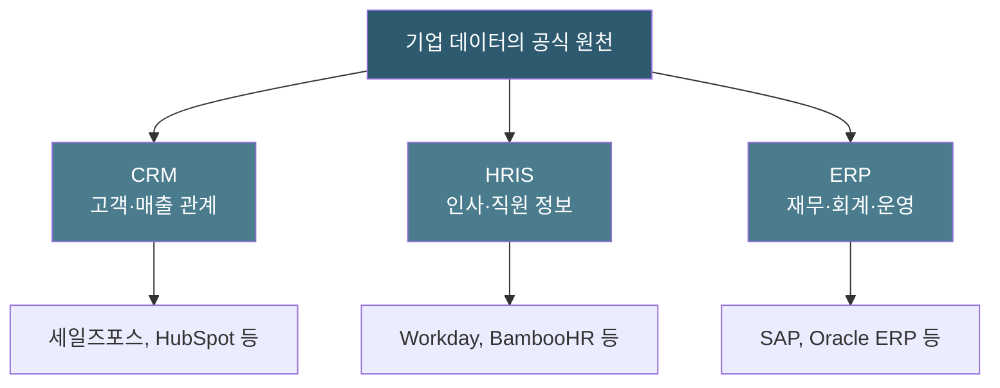
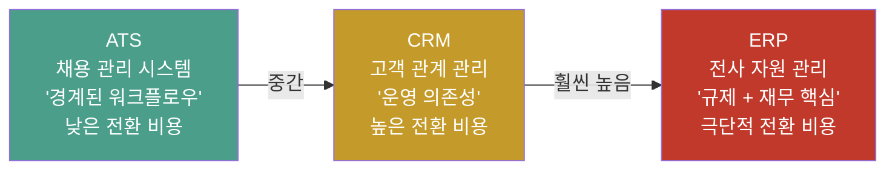
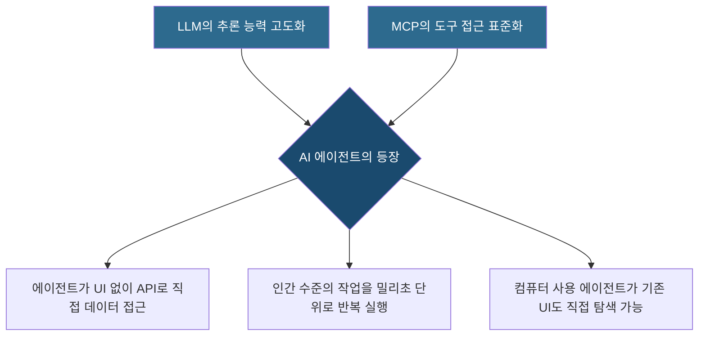
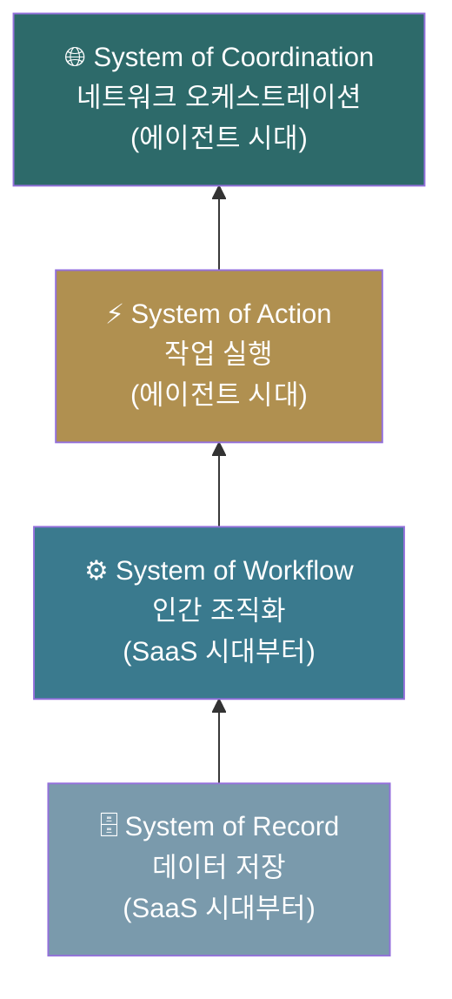
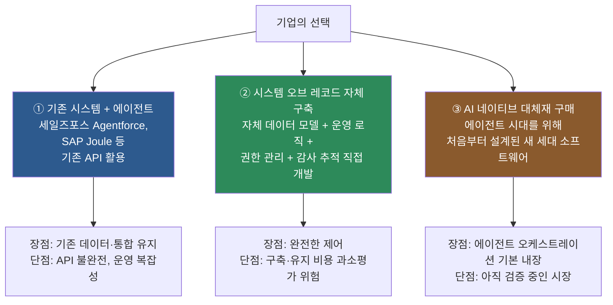
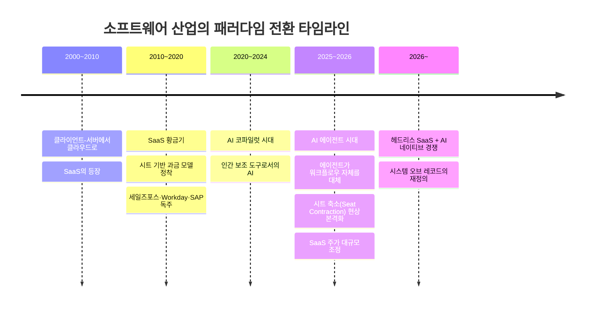
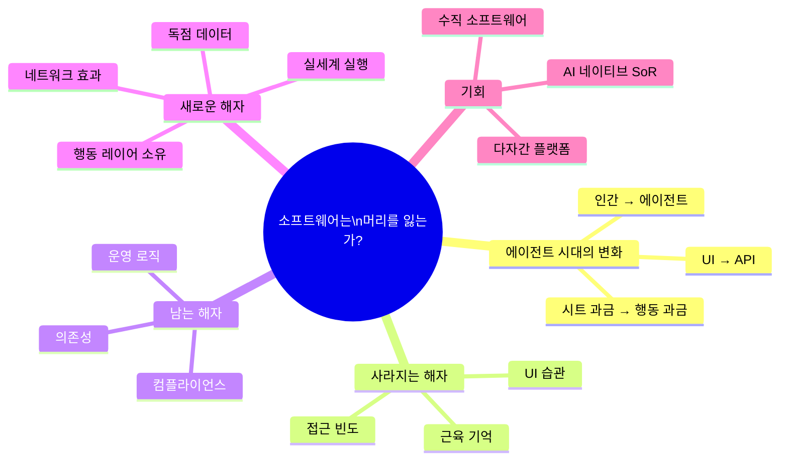

### a16z 아티클 심층 분석: 에이전트 시대의 시스템 오브 레코드(SoR) 진화론

> **원문**: "Is Software Losing Its Head?" — Seema Amble, a16z (Andreessen Horowitz), 2026년 5월
> **원문 링크**: https://www.a16z.news/p/is-software-losing-its-head

---

## 목차

1. [글의 배경과 출발점](#1-글의-배경과-출발점)
2. [시스템 오브 레코드(SoR)란 무엇인가?](#2-시스템-오브-레코드sor란-무엇인가)
3. [SaaS 시대의 경쟁 우위: 무엇이 소프트웨어를 '끈끈'하게 만들었는가?](#3-saas-시대의-경쟁-우위-무엇이-소프트웨어를-끈끈하게-만들었는가)
4. [전환 비용의 스펙트럼: ATS vs CRM vs ERP](#4-전환-비용의-스펙트럼-ats-vs-crm-vs-erp)
5. [에이전트 시대의 등장: AI가 UI를 우회하다](#5-에이전트-시대의-등장-ai가-ui를-우회하다)
6. [SoR 진화의 4단계](#6-sor-진화의-4단계)
7. [헤드리스 소프트웨어 시대, 방어력은 어디로 이동하는가?](#7-헤드리스-소프트웨어-시대-방어력은-어디로-이동하는가)
8. [SaaS 시대 vs 에이전트 시대 비교](#8-saas-시대-vs-에이전트-시대-비교)
9. [소프트웨어 구매자의 3가지 선택지](#9-소프트웨어-구매자의-3가지-선택지)
10. [에이전트 시대의 새로운 방어력 요인들](#10-에이전트-시대의-새로운-방어력-요인들)
11. [독자 반응 및 주요 논쟁점](#11-독자-반응-및-주요-논쟁점)
12. [시장에 나타난 실제 변화: 2026년 현재](#12-시장에-나타난-실제-변화-2026년-현재)
13. [종합 시사점](#13-종합-시사점)

---

## 1. 글의 배경과 출발점

이 글은 실리콘밸리를 대표하는 벤처캐피털 a16z(Andreessen Horowitz)의 파트너 Seema Amble이 2026년 5월에 게재한 분석 아티클이다. 글의 시작점은 구체적인 사건 하나에서 출발한다. 세일즈포스(Salesforce)가 자사의 API를 공개하고 이른바 '헤드리스(headless) 제품'을 출시한다고 발표한 것이다.

'헤드리스(headless)'란 소프트웨어에서 사용자 인터페이스(UI, 즉 눈에 보이는 화면)를 제거하고, 데이터와 기능만 API 형태로 제공하는 방식을 의미한다. 인간이 아닌 AI 에이전트가 직접 데이터에 접근할 수 있도록 하겠다는 뜻이다.

그런데 저자는 이 발표를 냉정하게 바라본다. 기술적으로 새로운 것이 거의 없다는 것이다. 세일즈포스가 '헤드리스 제품'이라고 마케팅하는 API는 사실 몇 년 전부터 이미 존재하던 것들이다. 저자는 이를 "전형적인 세일즈포스식 마케팅 론칭"이라고 꼬집는다. 기술적 혁신이 아닌, 포지셔닝의 변화라는 것이다.

그러나 이 발표는 훨씬 더 본질적인 질문을 던지게 만든다. **UI를 걷어내고 데이터베이스만 남겼을 때, 그 소프트웨어의 실제 가치는 무엇인가?** 그것이 잘 설계된 PostgreSQL 데이터베이스와 API의 조합과 어떻게 다른가? 20년간 기업 소프트웨어를 지탱해온 경쟁 우위, 즉 '해자(moat)'는 AI 에이전트 시대에도 살아남을 수 있는가?

---

## 2. 시스템 오브 레코드(SoR)란 무엇인가?

시스템 오브 레코드(System of Record, SoR)는 특정 비즈니스 도메인에 대한 **공식적이고 권위 있는 데이터 저장소**를 의미한다. 쉽게 말해, "이것이 우리 회사의 공식 버전"이라고 인정받는 소프트웨어 시스템이다.

- **CRM(고객관계관리 시스템)**: 영업 활동과 매출의 공식 기록. 세일즈포스가 대표적이다.
- **HRIS(인적자원정보시스템)**: 직원 정보와 인사 데이터의 공식 기록. Workday가 대표적이다.
- **ERP(전사적자원관리)**: 재무·회계·구매 데이터의 공식 기록. SAP, Oracle이 대표적이다.

이 시스템들이 강력한 이유는 단순히 데이터를 저장하기 때문이 아니다. 이들은 조직 전체가 공유하는 '현실'이 된다. 영업팀은 CRM에 있는 숫자를 기준으로 회의를 하고, 재무팀은 ERP의 장부를 기준으로 감사를 받는다. 다른 모든 시스템이 이 시스템으로부터 데이터를 읽고 쓴다.

---

## 3. SaaS 시대의 경쟁 우위: 무엇이 소프트웨어를 '끈끈'하게 만들었는가?

지난 20년간 세일즈포스 같은 CRM이 강력한 시장 지배력을 유지할 수 있었던 이유는 무엇일까? 저자는 인간의 행동 방식과 직결된 5가지 요인을 제시한다.

### ① 접근 빈도 (Frequency of Access)

CRM은 영업팀이 매일, 여러 번 접근하는 시스템이다. 이 빈번한 사용은 소프트웨어를 조직의 핵심 인프라로 만든다. 더 중요한 것은 그 위에 쌓이는 **인간적 관습**이다. 영업 리더들의 주간 파이프라인 회의, 분기말 마감 루틴, 신입 영업직원 교육 방식 등이 CRM을 중심으로 구축된다. 이런 관습은 마이그레이션해야 할 '것'으로 인식조차 되지 않기 때문에 가장 바꾸기 어렵다.

저자는 인상적인 표현을 쓴다. 많은 영업 리더들이 새 회사로 이직할 때 세일즈포스를 가져가도록 요청하는 이유가 UI가 좋아서가 아니라, **'근육 기억(muscle memory)'** 때문이라고. 20년간 세일즈포스만 써온 사람은 다른 도구를 쓸 때 불편함을 느낀다.

### ② 읽기-쓰기 방식 (Write-Only vs. Read-Write)

끈끈한 시스템 오브 레코드는 읽고 쓰는 양방향 시스템이다. CRM에는 영업 담당자가 매 통화 후 기록을 입력하고(쓰기), 그 기록을 조회하고(읽기), 갱신하는(다시 쓰기) 작업이 끊임없이 일어난다. 이 양방향 데이터 흐름은 대체 시스템이 단순한 역사적 데이터 내보내기가 아니라 실시간 운영 데이터를 처리해야 함을 의미한다. 안전하게 전환할 수 있는 '조용한 시간'이 존재하지 않기 때문에, 기업들은 한 번 온보딩하면 계속 그 공급업체를 유지하는 경향이 있다.

반면 채용 관리 시스템(ATS)은 대부분 '쓰기 전용(write-only)'에 가깝다. 지원자가 채용되거나 거절된 후에는 그 데이터로 돌아올 이유가 별로 없다. 이것이 ATS의 전환 비용이 CRM보다 낮은 핵심 이유다.

### ③ 문서화되지 않은 표준 운영 절차(SOP) (Undocumented SOPs)

이것이 특히 흥미로운 요인이다. 업무상 중요한 맥락은 어떤 문서에도 적혀 있지 않다. 그것은 수년간 관리자와 시스템 통합 담당자들이 쌓아온 **워크플로우 규칙 안에 코드화**되어 있다.

예를 들어 영업 현장에서는 이런 규칙들이 존재한다. "10만 달러 이상의 엔터프라이즈 거래는 부사장 승인이 필요하다", "유럽 거래는 개인정보 보호 검토를 거쳐야 한다", "분기말에는 전략적 고객에 대한 할인이 재무팀 승인 없이도 가능하다." 이런 규칙들은 어떤 위키(Wiki)에도 없다. CRM 안에 자동화 규칙으로 묻혀 있거나, 팀원들의 머릿속에만 존재한다. 이 시스템을 바꾼다는 것은 이 모든 규칙을 역공학(reverse engineering)하거나, 조직의 제도적 기억을 통째로 잃는 것을 의미한다.

### ④ 내·외부 의존성 (Internal and External Dependencies)

핵심 질문은 이 시스템 오브 레코드에 얼마나 많은 내부 시스템, 팀 프로세스, 외부 이해관계자가 의존하는가이다. 내부 연결성은 이 시스템의 데이터를 읽는 다른 소프트웨어들을 의미하고, 외부 연결성은 ERP처럼 감사원, 회계사, 규제 기관이 직접 접근해야 하는 경우를 의미한다. 연결성이 높을수록 마이그레이션 시 풀어야 할 매듭이 많다.

### ⑤ 컴플라이언스 중요도 (Compliance Criticality)

급여 시스템, ERP, HR 데이터처럼 규정 준수가 필수인 시스템은 법적으로 방어 가능한 데이터 원천이 필요하다. 감사원과 규제 기관이 마이그레이션의 직접 이해관계자가 된다. 이는 전환 비용을 극적으로 높인다.

---

## 4. 전환 비용의 스펙트럼: ATS vs CRM vs ERP

저자는 같은 '시스템 오브 레코드'라도 전환 비용이 전혀 다를 수 있음을 명확히 보여준다.

**ATS(채용 관리 시스템)** 는 채용이라는 한정된 프로세스를 위한 도구다. 지원자가 채용되거나 거절된 후 그 기록은 대부분 다시 열리지 않는다. 통합 범위도 좁고, 사용자 수도 적다. ATS 교체는 고통스럽지만 살아남을 수 있다.

**CRM 교체**는 저자의 표현대로 "심장이 뛰는 환자에게 심장 수술을 하는 것"이다. 실시간 영업 데이터가 흐르는 시스템을 전환하는 안전한 타이밍은 없다.

**ERP 교체**는 "환자가 마라톤을 뛰면서 심장 수술을 받는 것"이다. 회계 장부는 곧 감사 추적이고, 회계사, 감사원, 규제 기관이 마이그레이션의 직접 이해관계자다. 이것이 SAP가 수십 년간 교체되지 않는 이유다.

---

## 5. 에이전트 시대의 등장: AI가 UI를 우회하다

이 전통적인 구도가 근본적으로 흔들리고 있다. 변화를 가능하게 한 두 가지 기술적 사건이 있다.

첫 번째는 **대형 언어 모델(LLM)의 추론 능력**이다. 이제 AI 에이전트는 맥락을 읽고, 계획을 세우고, 도구를 선택하고, 행동을 실행하고, 결과를 검토하는 것을 인간의 개입 없이 수행할 수 있다.

두 번째는 **MCP(Model Context Protocol)의 표준화**다. MCP는 에이전트에게 외부 기능을 호출하는 공통 인터페이스를 제공한다. MCP를 통해 플랫폼에 접근할 수 있는 에이전트는 인간 사용자가 브라우저에서 하는 일을 밀리초 단위로, 대규모로, 브라우저 없이 수행할 수 있다.

심지어 컴퓨터 사용 에이전트(computer-using agent)는 API조차 필요 없이 기존 소프트웨어의 UI를 직접 탐색할 수도 있다.

이것이 의미하는 바는 명확하다. 에이전트는 브라우저가 필요 없다. **API, 맥락, 명령, 그리고 행동 능력**만 있으면 된다. UI 위에 쌓아온 인간의 모든 습관과 근육 기억은 에이전트에게 아무런 의미가 없다.

---

## 6. SoR 진화의 4단계

a16z는 시스템 오브 레코드가 어떻게 진화해왔는지를 4개 층위로 정리한다.

- **System of Record(기록 시스템)**: 데이터를 저장한다. SaaS 시대의 기반.
- **System of Workflow(워크플로우 시스템)**: 인간을 조직화하고 프로세스를 관리한다. SaaS 시대에 추가된 층.
- **System of Action(행동 시스템)**: 작업을 직접 실행한다. 에이전트 시대에 새롭게 등장.
- **System of Coordination(조정 시스템)**: 여러 에이전트와 시스템, 조직 간의 네트워크를 오케스트레이션한다. 에이전트 시대의 최상위 층.

핵심은 이렇다. SaaS 시대의 소프트웨어는 데이터를 저장하고 인간의 워크플로우를 지원하는 역할에 머물렀다. 에이전트 시대의 소프트웨어는 스스로 행동하고, 여러 시스템과 조직 간의 조정자 역할까지 담당해야 한다.

---

## 7. 헤드리스 소프트웨어 시대, 방어력은 어디로 이동하는가?

SaaS 시대의 방어력(defensibility)이 주로 UI와 인간의 습관에서 비롯됐다면, 에이전트 시대에는 그 방어력이 어디로 이동할까? 저자의 분석을 표로 정리하면 다음과 같다.

### 사라지는 방어력 요인들

에이전트 시대에는 인간의 행동과 선호에 기반한 요인들이 약해진다.

- **접근 빈도**: 에이전트는 습관이 없다. 더 좋은 API가 있으면 즉시 갈아탄다.
- **읽기-쓰기 방식**: 인간의 양방향 데이터 입력 습관이 만든 전환 장벽이 사라진다.
- **문서화되지 않은 SOP**: 단기적으로는 여전히 중요하지만, AI가 맥락 포착을 더 쉽게 만들면서 장기적으로는 약화될 전망이다.

### 유지되는 방어력 요인들

- **내·외부 연결성**: 오히려 중요성이 커진다. CRM 에이전트는 영업, 청구, 고객 성공 데이터를 통합해야 하며, 여러 외부 조직의 에이전트들이 거래하는 노드 역할까지 담당하게 된다.
- **컴플라이언스 중요도**: 규제·법적 리스크가 있는 데이터는 신뢰할 수 있는 단일 원천이 필요하다. 에이전트 세계에서 가장 어려운 미해결 문제 중 하나는 "어떤 에이전트가, 누구를 대신해서, 무슨 권한으로, 어떤 감사 추적과 함께 무엇을 할 수 있는가?"다. 아이덴티티와 권한 관리 레이어가 된 시스템 오브 레코드는 진정으로 대체하기 어려운 구조적 역할을 갖게 된다.

---

## 8. SaaS 시대 vs 에이전트 시대 비교

아래 표는 a16z가 제시한 두 시대의 핵심 차이점이다.

| 구분 | SaaS 시대 | 에이전트 시대 |
|------|-----------|--------------|
| **주요 사용자** | 인간 | 에이전트 (+ 인간 감독자) |
| **주요 인터페이스** | UI / 대시보드 | API / 도구 / 에이전트 워크플로우 |
| **시스템 기능** | 레코드 저장 및 표시 | 워크플로우 시작·실행·업데이트 |
| **핵심 해자** | UI 채택과 워크플로우 습관 | 독점 데이터, 폐쇄 루프 행동, 실제 실행, 네트워크 조정 |
| **데이터의 역할** | 인간 활동 기록 | 독점 데이터 결합, 행동 결과물 포착, 의사결정에 활용 |
| **고착성의 원천** | 근육 기억, 교육, 일상적 사용 | 운영 맥락, 비즈니스 로직, 권한 관리, 엣지 케이스 처리, 피드백 루프 |
| **복제 위험** | UI 안에 워크플로우가 있어 이전 어려움 | 처음 80%는 복제 쉬움; 엣지 케이스는 여전히 어려움 |
| **스타트업 기회** | 기존 워크플로우의 더 나은 UX | 행동과 결과를 소유; 새로운 데이터 생성; 다자간 중개; 물리·디지털 연결 |

---

## 9. 소프트웨어 구매자의 3가지 선택지

에이전트 시대에 기업들이 취할 수 있는 경로는 크게 세 가지다.

저자는 각각의 현실적인 어려움도 솔직하게 인정한다. 특히 두 번째 경로인 '직접 구축'의 경우, 많은 기업들이 자체 데이터베이스와 에이전트 스택을 만드는 것의 복잡성을 과소평가한다고 지적한다. 소프트웨어 라이선스 비용은 줄일 수 있지만, 구현·유지보수·내부 복잡성에 대한 지출이 그것을 상쇄하는 경우가 많다.

---

## 10. 에이전트 시대의 새로운 방어력 요인들

저자가 AI 네이티브 스타트업들에게 중요한 방어력을 만들어낼 핵심 요인으로 제시하는 것들이다.

### ① 시스템 오브 레코드 재현 난이도

AI는 시스템 오브 레코드의 데이터를 추출하고 재현하는 것을 점점 더 쉽게 만든다. 이메일, 전화 통화, 음성 에이전트, 내부 문서로부터 더 풍부한 데이터를 재구성하는 새로운 도구들이 등장하고 있다.

핵심 통찰은 이것이다. **AI는 시스템 오브 레코드의 처음 80%를 재현하는 비용을 낮춘다.** 나머지 20%, 즉 예외 처리, 승인 워크플로우, 컴플라이언스 요건, 엣지 케이스들이 진정한 대체재와 단순한 쐐기(wedge) 제품을 구분 짓는 기준이 된다.

### ② 독점적 데이터의 존재

방어력 있는 데이터는 다른 곳에서 가져온 데이터가 아니라, **그 제품이 고유하게 발생시키는 데이터**다. 최고의 사업은 다른 곳에서 입력된 데이터를 단순히 창고에 저장하지 않는다. 에이전트가 직접 행동하면서 발생하는 새로운 데이터, 예를 들어 관찰된 행동 패턴, 응답률, 타이밍 패턴, 프로세스 결과, 예외 패턴, 에이전트 성능 추적 등을 생성한다. 이제 **데이터 자체가 맥락(context)** 이다.

### ③ 행동 레이어의 소유

구시대에는 레코드를 저장하는 것만으로 충분했다. 새로운 세계에서는 에이전트가 행동을 취하고, 방어력이 폐쇄 루프로 운영할 수 있는 제품, 즉 행동을 취하고 → 결과를 포착하고 → 그 피드백으로 미래 결정을 개선하는 제품 쪽으로 이동한다.

ERP의 경우, 이는 지출 승인, 급여 처리, 청구서 조정, 알림 발송 등을 의미한다. 루프를 닫는 제품은 더 방어력이 높다. 이들은 단순한 관찰이 아닌 실행 안에 자리잡고, 고유한 데이터를 생성하며, 사용할수록 개선되고, 워크플로우를 중단하지 않고는 제거하기 어려워진다.

### ④ 실세계 실행 요소

완전히 자동화되지 않을 실세계 운영과의 연결고리를 가진 비즈니스 모델은 다른 종류의 방어력을 갖는다. DoorDash처럼 운영 네트워크를 갖춘 기업이 좋은 예다. 서비스, 물류, 현장 운영, 결제로 루프를 닫는 소프트웨어 기업은 순수 SaaS와 다른 방어력을 갖는다. 이들은 단순히 레코드를 저장하거나 행동을 추천하는 것이 아니라, **사람을 파견하고, 물건을 이동시키고, 서비스를 완료**한다.

### ⑤ 네트워크 효과

역사적으로 시스템 오브 레코드에서는 네트워크 효과가 약했다. 소프트웨어가 주로 내부 도구였기 때문이다. 그러나 에이전트 시대에는 시스템이 다자간 워크플로우에 내재되면 네트워크 효과가 훨씬 중요해질 수 있다.

구매자와 판매자, 고용주와 직원, 기업과 감사원, 공급업체와 고객 같은 복수의 당사자 간 반복적인 상호작용을 중재하는 시스템은 참여자가 추가될수록 더 유용해진다. 그 결과 제품은 단순한 데이터베이스가 아닌 **시장 자체의 조정 인프라**가 된다.

### ⑥ 구매자의 기술 역량

이론적으로는 누구나 자체 에이전트를 구축할 수 있다. 하지만 실제로 그렇게 할 수 있는 기업은 많지 않다. 특히 수직 시장과 역사적으로 강력한 내부 엔지니어링 역량을 갖추지 못한 기능적 구매자들 사이에서는, 자체 데이터베이스·워크플로우 로직·에이전트 스택·거버넌스 레이어를 구축·유지·지속 개선할 가능성이 여전히 낮다. 제조업, 건설 백오피스, 산업·현장 서비스 워크플로우, 회계 분야가 특히 기술적으로 소외되어 있는 영역이다.

---

## 11. 독자 반응 및 주요 논쟁점

이 아티클은 공개 직후 다양한 전문가들의 반응을 이끌어냈다. 주요 논점들을 정리한다.

### "기존 고객의 해자 vs 신규 고객의 시작점" 논쟁

Razan Khatib는 이 프레임이 **기존 시스템 오브 레코드 고객에게는** 잘 맞는다고 지적한다. 기존 세일즈포스, SAP, Workday 고객이라면 데이터, 권한, 워크플로우 이력, 컴플라이언스 추적이 진정한 해자를 형성한다. 그러나 에이전트 시대에 새로 시작하는 기업이라면, 질문이 다르다. "어떤 시스템 오브 레코드를 선택할까?"가 아니라 "에이전트가 안전하게 운영하기 위해 필요한 맥락, 권한, 실행 레이어는 무엇인가?"가 될 수 있다. 이 시스템들은 **떠나기는 어렵지만, 새롭게 선택하기도 어려워질 수 있다**는 지적이다.

### "복잡성의 무게" 논쟁

Gagik Yeghiazarian은 "소프트웨어는 머리를 잃고 있는 것이 아니라, 자체 복잡성의 무게에 짓눌리고 있다"고 주장한다. AI가 이 문제를 만든 것이 아니라 드러낸 것이라고. 미래는 결정론적으로 구조화되어 처음부터 감사 가능하고 발전 가능한 시스템이라는 것이 그의 전망이다.

### "신뢰 아키텍처가 진짜 해자" 논쟁

Mitchell Kosowski는 에이전트가 UI를 대체할 때 **권한 관리와 감사 레이어가 해자이자 새로운 공격 표면**이 됨을 지적한다. 에이전트의 자격증명을 탈취하면 조직의 전체 시스템 오브 레코드를 조용히 피싱하는 셈이 된다. 살아남는 시스템 오브 레코드는 단순히 헤드리스가 되는 것이 아니라, 에이전트 아이덴티티와 정책을 설정 탭이 아닌 **1급(first-class) 제품**으로 다루는 것이어야 한다는 주장이다.

### "SaaS 가격 모델의 붕괴" 논쟁

Scenarica는 헤드리스 전환이 **밸류에이션에 미치는 영향**을 예리하게 지적한다. SaaS 기업들은 인간이 UI에 앉아 전환하기 고통스러운 근육 기억을 만들기 때문에 시트당 가격을 정당화할 수 있었다. 에이전트가 인간을 대체하면 시트가 사라지고, 가격 모델은 시트당 과금에서 API 호출 또는 데이터 볼륨 기반으로 전환해야 한다. API 접근은 구조적으로 시트보다 마진이 낮다. 에이전트는 세일즈포스와 HubSpot과 잘 설계된 PostgreSQL 스키마 중 어느 것에서 데이터를 가장 빠르게 반환받는지에 따라 라우팅한다. 20년간 SaaS 프리미엄을 정당화한 전환 비용이 사용자가 기계가 되는 순간 증발한다.

---

## 12. 시장에 나타난 실제 변화: 2026년 현재

이 아티클이 단순한 이론적 논의가 아닌 이유는, 2026년 현재 시장에서 이미 이 변화가 가시적으로 나타나고 있기 때문이다.

소프트웨어 업계의 포워드 주가수익비율(P/E)은 1년 전 평균 39배에서 21배로 급락했다. 핵심 벤처캐피털과 기관 헤지펀드들은 AI 에이전트 시대에 성장 엔진인 사용자 추가가 영구적으로 중단된 것을 우려해 '시트 민감형' 주식의 강제 청산을 시작했다.

승자는 AI '에이전트' 자체를 수익화할 수 있는 기업이고, 패자는 빠르게 시대에 뒤떨어지는 인간 중심 과금 모델에 묶인 기업이 될 것이라는 시각이 지배적이다.

세일즈포스는 자체 Agentforce 플랫폼을 통해 고객 상호작용의 84%를 자율적으로 처리하지만, 인간 시트 수익 손실을 상쇄하는 데 어려움을 겪고 있다. 세일즈포스는 Agentic Enterprise License Agreement(AELA)라는 하이브리드 모델로 전환을 시도하며, Flex Credits를 통해 자율 '행동'당 0.10달러를 부과하는 방식을 도입했다.

---

## 13. 종합 시사점

이 아티클의 핵심 메시지를 간결하게 정리하면 다음과 같다.

**첫째**, 소프트웨어의 방어력은 위에서 아래로, 그리고 아래에서 위로 동시에 이동하고 있다. 위쪽으로는 네트워크, 독점 데이터 생성, 실세계 실행으로, 아래쪽으로는 데이터 모델, 권한 관리, 워크플로우 로직, 컴플라이언스로.

**둘째**, UI와 인간의 습관이 만들어낸 해자는 빠르게 약해지고 있다. 에이전트는 근육 기억이 없다. 그러나 운영 로직과 맥락은 여전히 강력한 해자다. 오히려 에이전트가 올바르게 행동하려면 명시적인 규칙, 권한, 프로세스 정의가 필요하기 때문에 더 중요해진다.

**셋째**, 다음 세대 시스템 오브 레코드는 인간의 작업을 기록하기 위한 데이터 저장소에 그치지 않는다. 맥락을 포착하고, 작업을 시작하고, 데이터 결과물을 기록하는 능동적 시스템이 된다. 가장 흥미로운 기업들은 현장 직원, 물류 공급업체, 서비스 팀, 물리적 자산을 조정하며 실세계 실행으로 확장하거나, 복수의 당사자 사이에 자리를 잡는다.

**넷째**, 스타트업에게는 기회다. 특히 소프트웨어가 점점 더 결정을 내리고 에이전트가 점점 더 조율할 수 있지만, 마지막 단계는 여전히 실세계 실행이 필요한 시장, 즉 현장 서비스와 연결된 수직 소프트웨어가 대표적인 예다.

**다섯째**, 과거 데이터의 컨테이너가 아닌, 미래 행동의 기반이 될 수 있는 소프트웨어가 살아남는다. 그리고 그 기반의 핵심에는, 결국 **데이터**가 있다.

---

---

> **참고**: 본 문서는 a16z(Andreessen Horowitz)의 파트너 Seema Amble이 작성한 아티클 "Is Software Losing Its Head?"(2026년 5월)와 해당 아티클에 첨부된 차트(SoR Evolution Over Time, What Makes Systems of Record Durable, The Switching Cost Spectrum, When Software Goes Headless Where Does Defensibility Move)를 바탕으로 작성되었습니다.

---

*작성일: 2026년 5월 22일*
