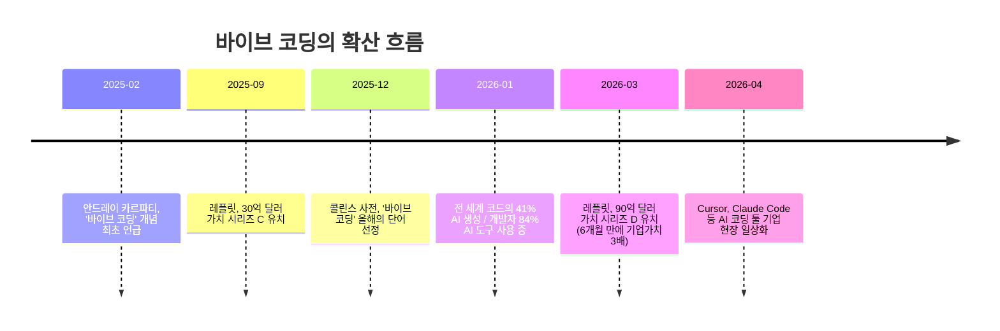
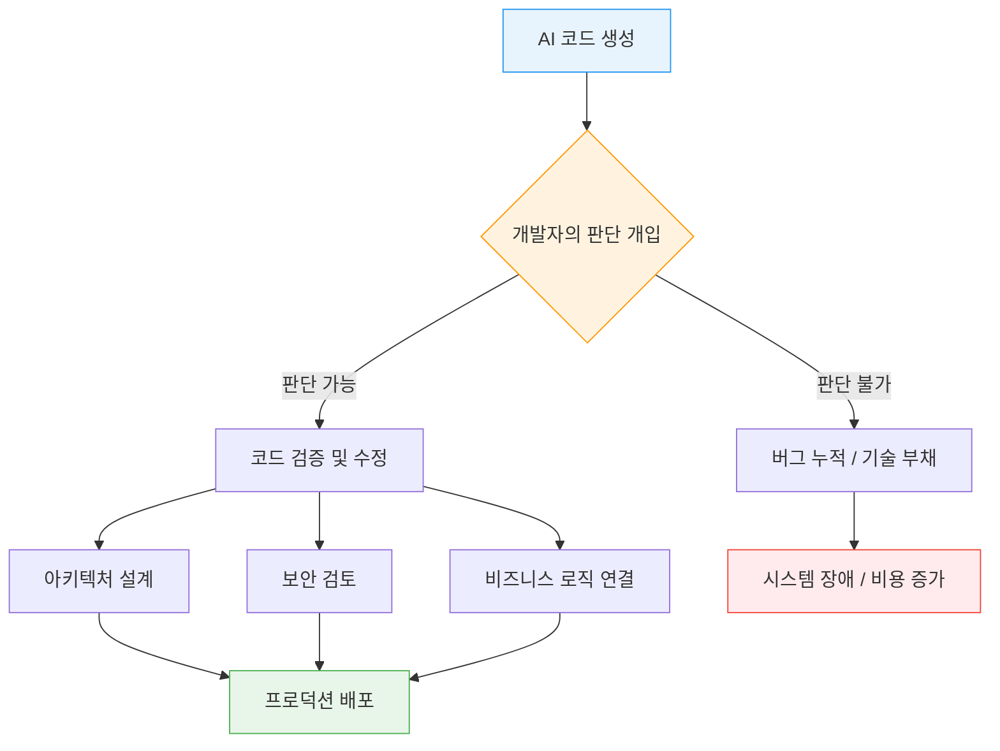
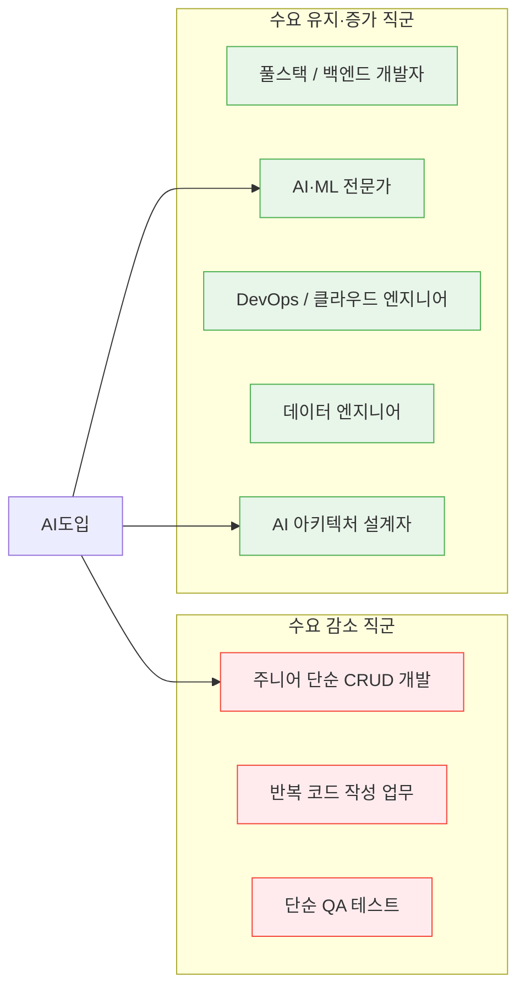
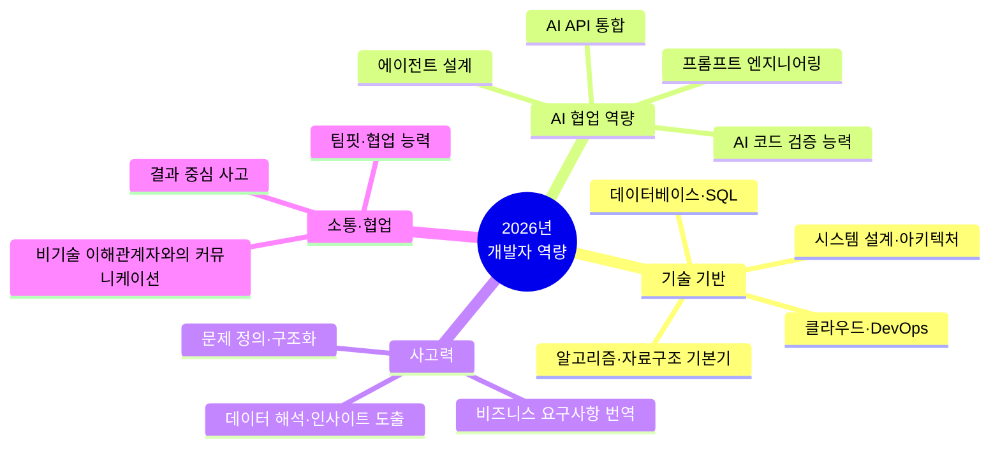

### "무엇을 배우냐"가 아니라 "왜 배우냐"가 달라진 시대의 심층 분석

---

## 들어가며

"ChatGPT한테 시키면 코드 다 써주던데?" "개발자 공부해봤자 AI가 다 대체하는 거 아냐?" 이런 말이 더 이상 낯설지 않은 시대가 됐다. 개발자를 꿈꾸는 사람이든, 이미 현업에 있는 사람이든 한 번쯤은 가슴이 철렁했을 질문들이다.

이 글은 그 불안을 외면하지 않는다. AI가 실제로 개발자의 일을 어디까지 바꾸고 있는지, 그리고 지금 우리가 진짜로 준비해야 할 것이 무엇인지를, 최신 데이터와 현업의 목소리를 토대로 하나씩 짚어본다.

---

## 1. '바이브 코딩'이란 무엇인가 — 패러다임의 전환이 시작됐다

2025년 2월, 테슬라 전 AI 책임자이자 OpenAI 공동창업자인 안드레이 카르파티(Andrej Karpathy)가 '바이브 코딩(Vibe Coding)'이라는 개념을 처음 언급했다. 자연어로 원하는 기능을 설명하면 AI가 코드를 자동으로 생성하는 방식을 가리키는 이 용어는, 콜린스 영어사전이 선정한 **2025년 올해의 단어**로 등극할 만큼 빠르게 확산됐다.

수치는 더 직접적이다. <바이브코딩 시대 AI 코딩 스타트업 지형도 2026(와우테일)> 보도에 따르면, **현재 전 세계에서 생성되는 코드의 41%가 AI의 손을 거친다.** Y콤비네이터(YC)의 2025년 겨울 배치 스타트업 중 25%는 코드베이스의 95% 이상을 AI가 작성했다고 밝혔다.

플랫폼 경쟁도 이미 뜨겁다. 대표적인 바이브 코딩 플랫폼 레플릿(Replit)은 전 세계 개발자 인구로 추산되는 약 2,800만 명을 훌쩍 뛰어넘는 **5,000만 명의 사용자**를 확보했다. 개발자보다 비개발자가 더 많은 플랫폼이 된 것이다. 레플릿의 연간 반복 매출(ARR)은 에이전트 기능을 출시한 2024년 단 1년 사이에 280만 달러에서 1억 5,000만 달러로 **약 50배** 폭증했으며, 2026년 3월에는 기업가치 90억 달러 평가에 4억 달러 규모의 시리즈 D 투자를 유치했다.

이 흐름은 하나의 현상이 아니라 소프트웨어 개발 패러다임 자체가 이동하고 있음을 보여준다.

---

## 2. 그렇다면 개발자는 정말 필요 없어지는 걸까?

### 2-1. '대체'와 '변화'는 다르다

결론부터 말하면, 개발자가 사라지는 것이 아니라 개발자의 역할이 재정의되고 있다. 그리고 그 방향은 단순하다 — **코드를 타이핑하는 사람에서, AI가 만든 코드를 판단하고 설계하는 사람으로**.

Cursor, Claude Code 같은 AI 기반 코딩 툴을 활용해 구현과 리뷰, 리팩토링을 처리하는 일이 국내외 프로덕트 조직에서 이미 일상화되고 있다. **구현의 장벽은 낮아졌지만, 그만큼 더 많은 맥락 이해와 구조 판단이 요구되는 환경으로 바뀐 것**이다. 속도는 빨라졌지만 설계와 의사결정의 중요성은 오히려 커졌다.

### 2-2. AI가 코드를 짜는 것과 좋은 코드를 만드는 것은 다른 문제다

8년차 AI 엔지니어의 경험담이 현실을 잘 보여준다. 바이브 코딩으로 만든 스크립트에 기능을 추가하려 하자 일이 꼬이기 시작했다고 한다. 채팅 기능을 붙였더니 스피너가 엉뚱한 곳에서 돌고, 이 문제를 고쳐달라고 요청했더니 다른 곳을 망가뜨린다. **눈으로 보면 그럴듯한데 실행하면 이상하게 동작하는, 수천 줄의 AI 코드는 "얻는 시간"은 줄어도 "이해하고 검증하는 시간"을 늘려 결국 더 많은 시간을 쓰게 만들었다.**

이를 수치로 뒷받침하는 연구도 있다. AI 평가 기관 METR이 2025년 7월 발표한 무작위 대조 실험에서, 숙련된 오픈소스 개발자들이 AI 코딩 도구를 사용했을 때 오히려 **19% 느려졌다는 결과**가 나왔다. 코드 생성 속도와 전체 개발 생산성은 다른 차원의 문제라는 것이다.

### 2-3. AI가 대체할 수 없는 구조적 이유

현업 개발자들이 지목하는 AI의 한계는 명확하다. 모호한 자연어를 명확한 코드로 번역하는 과정, 수많은 선택지 중 현재 맥락에 맞는 최선을 고르는 판단, 그리고 그 결과에 대한 책임을 지는 일. 이 세 가지는 현재의 AI 구조로는 온전히 처리할 수 없다.

SAP의 최고기술책임자 필리프 헤르치히는 "AI는 코드를 생성할 수 있지만, 내부 구조에 대한 이해가 부족하면 한계가 분명하며, 기업 환경에서 확장성과 안정성을 확보하려면 여전히 높은 수준의 전문성과 노력이 필요하다"고 밝혔다.

특히 주목할 것은 **'좋은 코드'에 대한 감각**이다. 숙련된 개발자가 코드를 보고 "뭔가 이상한데"라고 직감적으로 느끼는 능력은 수많은 실패, 디버깅, 리팩토링의 경험에서 형성된 것이다. 이것은 이론으로 익힐 수 있는 것이 아니라, 나쁜 구조에 직접 고통받고, 좋은 추상화를 직접 만들어봐야 생기는 감각이다. **AI를 제대로 활용하려는 목적에서도, 코드에 대한 깊은 이해는 대체 불가능한 전제 조건**이다.

---

## 3. 채용 시장의 냉정한 현실 — 기준이 높아졌다

### 3-1. 신입 수요는 줄고, 시니어 기준은 올라갔다

레주메닷오알지(Resume.org)가 미국 기업 리더 1,000명을 대상으로 진행한 조사에 따르면, **기업 10곳 중 6곳이 직원 감축을 단행할 가능성이 있으며, 10곳 중 4곳은 인력을 AI로 대체할 계획**이라고 답했다. AI 코딩 보조 도구가 업계 전반에 보편화된 만큼, 단순 반복 코딩을 주로 담당하는 주니어 개발자 직군이 가장 먼저 구조조정 대상이 될 수 있다는 분석이 나온다.

시니어 소프트웨어 엔지니어 치라그 아그라왈은 이렇게 진단했다. "기업이 더 적은 인력으로 더 많은 성과를 내기 위해 노력하면서 주니어 개발자 역할이 사라지고 있다. 4년 전만 해도 나는 주니어로서 반복적인 CRUD 코드를 작성하며 자부심을 느꼈지만, 지금 그 작업의 대부분은 AI가 한다."

반면 딜로이트 분석에 따르면, **2025년 하반기 전 세계 IT 지출은 전년 대비 9.3% 증가**할 것으로 전망되며, 특히 소프트웨어와 데이터센터 부문이 가장 빠른 성장세를 보이고 있다.

### 3-2. 그래도 수요는 있다 — 단, '누구를' 원하는지가 달라졌다

Statista 데이터에 따르면, 가장 수요가 높은 직종은 **풀스택 및 백엔드 개발자**이며 그다음으로 **AI·ML 전문가, 프런트엔드 엔지니어, DevOps 전문가** 순이다. AI가 서비스 전반에 통합되면서, 데이터를 처리하고 모델을 실제 제품에 연결하는 'AI 친화형 백엔드 개발자'의 수요가 꾸준히 유지되고 있다.

2025~2026년 채용 시장은 "얼마나 많이 뽑느냐"보다 **"누구를 뽑느냐"가 핵심**인 시장이다. 채용 규모는 줄었지만 기업이 원하는 인재의 기준은 이전보다 훨씬 높아졌다. 완전히 새롭게 가르쳐야 하는 신입보다는, AI 툴과 데이터 워크플로우를 이미 다뤄본 실무형 인재가 선호된다.

2026년 채용 트렌드를 분석한 조사에서는 **AI 확대에 따른 질적 채용 전환(63%), AI 리터러시 검증(46%)** 이 상위 트렌드로 꼽혔다.

---

## 4. '이공계 전공자만의 영역'이라는 착각 — AI 리터러시의 시대

### 4-1. 전선이 IT 밖으로 넓어졌다

불과 몇 년 전만 해도 AI 관련 직군은 수학·컴퓨터공학 전공자들의 전유물로 여겨졌다. 하지만 2025~2026년의 현실은 다르다. 금융, 헬스케어, 제조, 컨설팅 등 비IT 산업 전반에서 AI 전문가 확보 경쟁에 뛰어들었으며, 일반 개발자와 기획 직군에서도 AI 활용 역량이 필수 요건이 됐다.

2026년 기준, **AI 리터러시는 특정 전공자의 특기가 아니라 직종을 막론한 실무의 기본 스펙**으로 자리잡고 있다. 한국AI리터러시협회가 정의하는 AI 리터러시는 단순한 도구 사용이 아니다. AI가 어떻게 작동하는지의 기본 원리를 이해하고, AI의 결과물을 비판적으로 해석하며, AI로 해결 가능한 문제와 그렇지 않은 문제를 구분하고, AI를 업무에 전략적으로 활용하는 **언어적·해석적·문제해결적 능력의 조합**을 뜻한다.

### 4-2. 기업이 원하는 것은 AI 개발자만이 아니다

기업들이 필요로 하는 인재는 AI 프로그램을 직접 개발하는 사람에만 국한되지 않는다. AI를 활용해 서비스나 업무 방식을 기획하고 운영할 수 있는 사람, 데이터를 수집하고 전처리할 수 있는 사람의 수요가 함께 늘고 있다.

채용 전문가들도 이를 수치로 확인해주고 있다. **2026년 채용 기준은 학력·경력 중심에서 스킬(Skill) 중심으로 이동**하고 있다. 기존의 "경영학과 학사 이상, OO 직무 경력 5년 이상"이라는 기준 대신, "데이터 시각화 능력, 이해관계자 대상 전문 발표, Python 또는 SQL 활용 경험"처럼 실제 업무 역량을 묻는 방식으로 채용 공고가 바뀌고 있다.

마케팅 직무를 예로 들면, 단순 데이터 집계는 AI가 처리할 수 있다. 하지만 '시장 상황을 통찰하고 전략을 수립하는 능력', '복잡한 데이터를 분석해 비즈니스 의사결정을 내리는 능력'은 여전히 사람의 핵심 역량으로 남는다.

### 4-3. 비전공자가 지금 당장 시작할 수 있는 것들

전공보다 중요한 것은 논리적으로 문제를 정의하고, 데이터로 근거를 만드는 태도다. 그 출발점은 생각보다 낮다.

| 역량 | 의미 | 시작 방법 |
|------|------|-----------|
| **SQL 기초** | 데이터를 읽고 질문하는 언어 | 온라인 무료 강의 (모드, 해커랭크 등) |
| **데이터 해석** | 숫자에서 인사이트를 뽑는 능력 | Google Sheets, 엑셀 실습 |
| **AI 툴 활용** | 프롬프트 설계 및 결과 검증 | ChatGPT, Claude, Gemini 직접 사용 |
| **문제 정의** | 요구사항을 명확히 구조화하는 능력 | 사이드 프로젝트, 업무 일지 작성 |

---

## 5. 빠른 기술 변화 앞에서 — 방향이 맞으면 속도는 문제없다

### 5-1. "이미 뒤처진 것 같다"는 착각

AI 기술의 변화 속도는 실제로 매우 빠르다. 오늘 배운 툴이 내일 구버전이 되는 세상이다. 그래서 많은 사람들이 "시작도 하기 전에 뒤처지는 것 같다"는 무력감을 느낀다.

하지만 이 불안에는 함정이 있다. 빠르게 변하는 것은 **도구(Tool)** 이지, **사고의 방식(Thinking)** 이 아니다. Cursor가 Claude Code로 바뀌어도, 새로운 에이전트 프레임워크가 등장해도, 변하지 않는 것이 있다.

- 문제를 발견하고 정의하는 힘
- 구조적으로 사고하고 설계하는 능력
- 데이터를 해석하고 맥락을 읽는 눈
- 비즈니스 요구사항을 기술 언어로 번역하는 역량

이것들은 AI가 대신할 수 없는 영역이며, 특정 도구의 버전이 올라가도 흔들리지 않는 진짜 자산이다.

### 5-2. AI 시대에 성장이 멈추는 개발자의 패턴

반대로 경계해야 할 패턴도 있다. AI 코딩 도구에만 의존해 코드를 직접 작성하고 이해하는 경험이 줄어들면, 숙련도 향상에 필요한 인지 부하를 스스로 회피하게 된다는 것이다.

숙련된 개발자가 필터링 로직을 작성할 때 for문의 문법을 의식하지 않는 것처럼, 패턴 자체가 하나의 단위로 자동 인식되는 '자동화 단계'에 이르려면 반복적인 직접 수행이 필수다. 이 과정에서 뇌가 패턴을 내재화하는 것은 AI가 대신해줄 수 없다. **AI 사용법을 학습하는 것과 코드 패턴을 학습하는 것은 양자택일의 관계가 아니라, 후자가 전자의 토대인 관계**다.

### 5-3. AI 버블 논쟁 — 균형 잡힌 시각

한 가지 짚고 넘어가야 할 것이 있다. AI 투자와 실질적 성과 사이의 괴리가 점차 부각되고 있다. Magnificent 7(애플, 마이크로소프트, 알파벳, 아마존, 메타, 엔비디아, 테슬라)이 2024~2025년 2년간 AI 관련 설비투자에 쏟아 부은 금액은 5,600억 달러였지만, 그 결과 만들어진 AI 관련 매출은 350억 달러 수준으로 16:1의 불균형이 지적됐다. MIT Media Lab 조사에서는 생성형 AI 도입의 95%가 실패했고, Atlassian 조사에서도 96%가 뚜렷한 효율 개선을 보지 못했다는 데이터도 있다.

이는 AI가 과대평가됐다는 의미가 아니라, AI를 도입하는 **방식과 역량**이 여전히 미성숙하다는 신호로 읽어야 한다. 결국 AI라는 강력한 도구를 올바르게 활용할 수 있는 사람의 가치가 더욱 중요해진다는 방향으로 귀결된다.

---

## 6. 2026년 현재, 개발자에게 요구되는 역량 지형도

특히 주목해야 할 것은, 2026년 현재 채용 시장에서 실제로 평가받는 체크리스트다.

- Copilot, Claude Code, Cursor 등 AI 코딩 어시스턴트를 실제 프로젝트에 활용한 경험이 있는가
- SQL 쿼리나 데이터 분석 도구를 활용해 데이터를 직접 다뤄본 경험이 있는가
- 알고리즘 문제를 스스로 풀어내는 기본기를 갖추고 있는가
- API 개발, 데이터 파이프라인, AI 에이전트 개발 등 폭넓은 역량을 입증할 수 있는가

---

## 7. AI가 바꾼 것 — '무엇을 배우냐'가 아니라 '왜 배우냐'

이것이 이 모든 변화의 핵심이다. AI가 등장하기 이전의 개발 공부는 "for문을 어떻게 쓰는가", "이 API의 문법은 무엇인가"를 익히는 데 상당한 에너지가 들었다. 지금은 그 답을 AI가 즉시 내놓는다.

그렇다면 무엇이 남는가. 바로 **왜 이 방식이 맞는지를 설명할 수 있는 사고력**이다. AI가 제안한 코드가 이 시스템에 적합한지를 판단하는 눈, AI가 놓친 보안 취약점을 발견하는 감각, 세 가지 기술 선택지 중 우리 팀의 맥락에 맞는 것을 고르는 판단력. 이것들은 배워서 바로 생기는 것이 아니라, 직접 부딪히고 실패하면서 쌓이는 것들이다.

두려움보다 방향이 중요하다. 코드 한 줄보다 질문 하나가 먼저다. 그리고 그 질문을 스스로 던질 수 있는 사람이, AI와 함께하는 시대에 살아남고 성장하는 개발자가 된다.

---

## 마치며 — 불안은 신호다, 적신호가 아니라

AI가 개발자를 대체할 것인지에 대한 논쟁은 당분간 계속될 것이다. 하지만 분명한 것이 하나 있다. 그 불안을 느끼는 사람이, 현실을 직시하고 방향을 찾고 있는 사람이라는 점이다.

기술을 이해하고 활용하려는 사람이 결국 기회를 잡는다. 그것은 AI 이전에도, AI 이후에도 변하지 않는 원칙이다.

---

## 참고 자료

- 와우테일 (2026.04.13) — 바이브코딩 시대, AI 코딩 스타트업 지형도 2026
- NDS Cloud Tech Blog (2026.03.10) — 8년차 AI 엔지니어는 왜 바이브코딩을 포기했나
- 풀링포레스트 (2026.01.03) — 2026년 개발자 시장: 어중간함의 종말과 초개인화의 부상
- 토스테크 — 개발자는 AI에게 대체될 것인가
- 코드트리 블로그 (2025.11.09) — 2025년 개발자 채용 트렌드와 2026년 전망
- CIO Korea (2025.09.25) — AI 시대, 프로그래머 역할이 바뀐다
- ITWorld Korea (2026.01.15) — AI 전환기, 개발자가 선택해야 할 기술과 플랫폼
- 한경 잡앤조이 (2025.12.29) — 2026 채용트렌드
- evan-moon GitHub 블로그 (2026.04.18) — AI 코딩 시대, 더이상 성장하지 않는 개발자들
- 커피고양이 브런치 (2026.05.16) — AI가 코드를 짜준다는데, 개발자는 이제 필요 없는 건

---

*작성일: 2026년 5월 23일*
