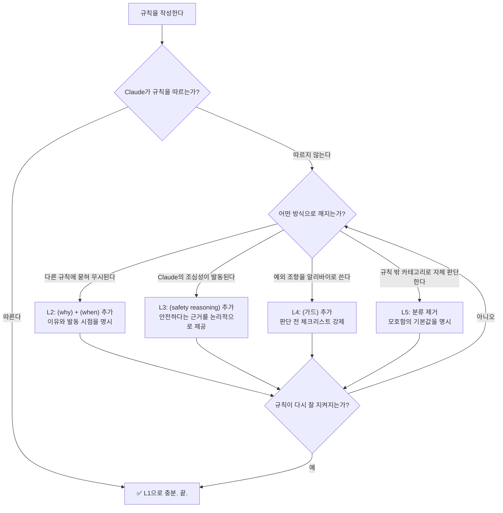
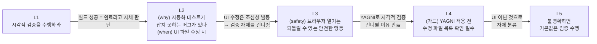

---

## 들어가며

Claude Code나 Claude.ai를 사용하다 보면 누구나 한 번쯤 이런 경험을 한다. CLAUDE.md에 분명히 적어 놓은 지침이 있는데, Claude가 그것을 따르지 않는다. "왜 안 했냐"고 따지면 "정직하게 실수가 맞습니다"라고 인정하고, 다시 시작하지만 곧 또 같은 패턴이 반복된다. 단순한 실수처럼 보이지만, 사실 이 현상의 뒤에는 훨씬 구조적인 원인이 숨어 있다.

이 글은 Threads([@kimwestroom](https://www.threads.com/@kimwestroom/post/DYpxJxbEuX9))에 게재된 실전 관찰 내용을 토대로, 그 구조적 원인과 단계적 해결 방법을 가능한 한 상세하게 풀어낸 것이다. 저자 본인도 밝혔듯이, 이것은 Claude의 내부 로직을 직접 열어본 것이 아니라 관찰과 대화를 통해 정리한 실용 지식이다.

---

## 1. 문제의 본질 — "내 프롬프트에서만 찾으면 안 된다"

처음 Claude를 쓸 때 많은 사람들이 범하는 오류는, 규칙이 안 지켜지는 이유를 오직 "내 CLAUDE.md 안에서만" 찾으려 한다는 것이다. 하지만 실제 충돌은 두 가지 층위에서 일어난다.

**첫 번째 층위: 내 프롬프트 내부의 충돌**
이것은 비교적 이해하기 쉽다. 예를 들어, 어떤 작업 처리 파일에는 "배포까지 알아서 하라"고 적어 놓고, CLAUDE.md에는 "커밋 메시지는 반드시 사람이 검토해야 한다"고 적혀 있다면, Claude 입장에서는 두 지침이 서로 충돌한다. 배포를 완료하려면 커밋이 필요한데, 커밋에 앞서 검토를 기다리자니 배포가 멈춘다.

**두 번째 층위: Claude의 기본 성향과의 충돌**
이것이 핵심이다. Claude는 훈련 과정에서 특정한 기본 성향을 갖도록 설계되어 있다. Anthropic이 공개한 "Claude의 헌법(Claude's Constitution)"에 따르면, Claude의 행동 우선순위는 다음과 같이 설정되어 있다.

1. **광범위한 안전(Broadly Safe)**: 인간이 AI를 감독하고 수정할 수 있는 체계를 훼손하지 않는다.
2. **광범위한 윤리(Broadly Ethical)**: 정직하고, 좋은 가치관에 따라 행동하며, 해로운 행동을 피한다.
3. **Anthropic 지침 준수**: Anthropic의 구체적인 가이드라인을 따른다.
4. **진정한 도움(Genuinely Helpful)**: 운영자와 사용자에게 실질적인 도움을 준다.

이 순서는 단순한 나열이 아니라 **충돌 시 우선순위 해결 체계**다. 즉, 사용자가 내린 지침이 Claude의 타고난 "안전 우선" 성향과 부딪히면, Claude는 사용자 지침보다 안전을 먼저 선택하도록 훈련되어 있다. 이것이 사용자 눈에는 "말을 안 듣는다"로 보이는 것이다.

---

## 2. YAGNI가 테스트를 죽이는 메커니즘

소프트웨어 개발에서 YAGNI(You Aren't Gonna Need It, 지금 당장 필요하지 않은 것은 만들지 마라)는 과도한 사전 설계를 막기 위한 훌륭한 원칙이다. 그런데 이 원칙을 Claude의 CLAUDE.md에 그냥 "YAGNI 원칙을 따를 것"이라고 적어 두면, 생각지 못한 부작용이 생긴다.

Claude는 YAGNI를 근거로 "지금 당장 필요하지 않은" 시각적 검증이나 추가 테스트를 생략하기 시작한다. 논리는 이렇다:

- "빌드가 성공했으니, 추가 확인은 YAGNI 관점에서 불필요하다."
- "TDD의 green 상태가 되었으니, 시각적 확인은 굳이 필요하지 않다."

이것은 YAGNI의 의도를 벗어난 잘못된 적용이지만, Claude 입장에서는 논리적으로 일관된 행동이다. 이처럼 **어떤 목적을 위해 만든 규칙이 다른 행동을 억제하는 알리바이**로 작동하는 것이 두 번째 유형의 충돌이다. 이 경우 해결법은 단순히 YAGNI 규칙을 지우는 것이 아니라, 그 규칙의 적용 범위를 명확히 좁혀 주는 것이다.

---

## 3. 규칙의 무게와 토큰 비용

CLAUDE.md를 처음 작성할 때 많은 사람이 "이것도 넣고, 저것도 넣고"를 반복하다가 방대한 규칙 목록을 만든다. 그런데 이 접근법에는 두 가지 문제가 있다.

**토큰 비용 문제**
규칙이 길어질수록 Claude가 매번 처리해야 하는 컨텍스트 창(context window)의 상당 부분이 규칙 설명에 소모된다. 실제 코드, 에러 메시지, 작업 맥락에 써야 할 공간이 줄어드는 것이다.

**규칙 희석 문제**
더 심각한 것은, 규칙이 많아질수록 각 규칙의 상대적 중요도가 희석된다는 점이다. 10개의 규칙이 나란히 놓이면 Claude는 그것들을 동등한 무게로 처리하려 한다. 그 결과, 정말 중요한 규칙도 덜 중요한 규칙과 같은 층위에 묶여 함께 무력화되는 일이 생긴다. 결국 처음부터 무거운 규칙으로 도배하는 것은 역설적으로 모든 규칙을 약하게 만든다.

따라서 원칙은 **"간단하게 시작해서, 깨지는 경우에만 한 단계씩 강화"** 다.

---

## 4. 단계적 규칙 강화 프레임워크 (L1 ~ L5)

이것이 이 글의 핵심이다. 규칙이 깨지는 방식을 다섯 가지 유형으로 분류하고, 각 유형에 맞는 최소한의 해결책을 적용하는 것이다. "손 씻기"라는 일상적인 예시를 통해 설명하면 이해하기 쉽다.

---

### L1 — 기본 규칙 (Rule)

가장 단순한 형태다. 아무런 조건이나 설명 없이 행동 지침만 명시한다.

```
손 씻어라.
```

Claude가 이 규칙을 별다른 충돌 없이 그냥 따른다면, L1으로 충분하다. 불필요하게 복잡한 규칙을 처음부터 추가할 이유가 없다.

**코드 작업 예시:**
```
커밋 전에 린트를 실행하라.
```

---

### L2 — 다른 규칙과 충돌할 때 (Why + When 추가)

L1 규칙이 다른 규칙에 "먹혀버리는" 경우다. 예를 들어 "물 아끼기" 규칙과 "손 씻기" 규칙이 충돌하면, Claude는 더 가볍거나 나중에 나온 규칙을 따를 수 있다.

해결책은 규칙에 **이유(why)** 와 **시점(when)** 을 추가해서, 이 규칙이 왜 존재하며 어느 상황에서 작동해야 하는지를 명확히 하는 것이다.

```
(why) 세균 감염을 막기 위해서,
(when) 외출 후 귀가했거나 더러운 것을 만진 직후에는
반드시 손을 씻어라.
```

**코드 작업 예시:**
```
(why) 시각적 렌더링 버그는 자동화 테스트가 잡지 못하기 때문에,
(when) UI 컴포넌트를 수정한 경우에는
빌드 성공과 별개로 브라우저에서 시각적 검증을 수행하라.
YAGNI는 구현 설계 원칙이며, 완료 후 검증에는 적용되지 않는다.
```

이처럼 L2에서는 규칙의 맥락을 드러내는 것이 핵심이다.

---

### L3 — Claude의 기본 성향과 충돌할 때 (안전 근거 추가)

이 단계가 많은 사람이 놓치는 부분이다. Claude가 "물은 위험할 수 있다"는 타고난 조심성을 발동시켜 손을 안 씻으려 한다면, 단순한 why/when으로는 해결되지 않는다.

Claude는 Anthropic의 헌법적 훈련에 의해 "안전 우선" 성향이 기본으로 내재되어 있다. 따라서 이 기본 성향과 충돌하는 지침을 넣을 때는, 안전하다는 근거를 명시적으로 제공해야 한다.

```
(safety reasoning) 수도꼭지는 안전하게 사용할 수 있는 도구이므로,
물을 틀고 손을 씻은 뒤 잠그는 행동은 허용된 절차다.
```

**코드 작업 예시:**
```
(safety reasoning) git commit은 되돌릴 수 있는 안전한 작업이다.
변경 사항이 로컬에만 있고 push 전 상태이므로,
커밋 메시지 초안을 자동으로 생성하여 제안하는 것은 안전하다.
단, 실제 push 전에는 반드시 사용자 확인을 받는다.
```

이처럼 Claude의 조심성을 억누르는 것이 아니라, 해당 행동이 안전한 이유를 논리적으로 설명함으로써 성향과의 충돌을 해소하는 것이 L3다.

---

### L4 — 규칙 내 예외 조항이 알리바이가 될 때 (가드 추가)

규칙에 예외를 달아 두면, Claude가 그 예외 조항을 지렛대로 삼아 원래 의도를 빠져나가는 경우가 있다. "손에 땀이 난 것이지, 더러운 것이 아니니까 씻을 필요 없다"는 식의 자체 판단이다.

이럴 때는 판단 이전에 먼저 거쳐야 할 **체크리스트(가드)** 를 추가한다. 스스로 예외라고 판단하기 전에 특정 확인 절차를 반드시 밟도록 강제하는 것이다.

```
(가드) 판단 전 체크리스트:
1. 현재 손에 묻은 것이 땀인지, 외부 오염인지 직접 닦아서 확인한다.
2. 확인 결과를 바탕으로 씻을지 여부를 판단한다.
```

**코드 작업 예시:**
```
(가드) "빌드가 성공했다"는 이유로 검증을 건너뛰기 전에:
1. 수정된 파일 목록을 확인한다.
2. UI 관련 파일이 포함되어 있는지 판단한다.
3. UI 파일이 있다면 시각적 검증을 수행한다.
위 절차를 거친 후에만 작업 완료로 간주할 수 있다.
```

---

### L5 — 규칙 범주 밖에서 자체 판단할 때 (분류 제거)

가장 까다로운 경우다. Claude가 기존 규칙의 테두리 밖에 있는 새로운 카테고리를 스스로 만들어 낸다. "땀은 더러운 것이 아니라 몸에서 나온 것이므로, 내 규칙의 '더러운 것'에 해당하지 않는다"는 식의 논리다.

이 경우, 해결책은 그 카테고리를 규칙 안으로 다시 흡수하거나, 모호한 경우 어떻게 분류할지 명확한 기준을 제시하는 것이다.

```
"물을 사용하는 상황인가?" → 아니라면 씻어라.
즉, 불분명하면 기본값은 씻는 것이다.
```

**코드 작업 예시:**
```
"이 작업이 UI 변경을 포함하는가?" 판단이 불명확하다면,
기본값은 시각적 검증을 수행하는 것이다.
확신이 없을 때는 검증한다.
```

L5의 본질은 "모호함의 기본값을 명시"하는 것이다. Claude가 스스로 만든 카테고리로 빠져나갈 여지를 없앤다.

---

## 5. 전체 구조 요약

지금까지 설명한 내용을 흐름도로 정리하면 다음과 같다.



---

## 6. 핵심 원칙 정리

위 내용을 실천할 때 기억해야 할 핵심 원칙을 정리하면 다음과 같다.

**원칙 1 — 간단한 규칙으로 시작하라**
처음부터 모든 경우를 커버하려는 무거운 규칙은 역효과를 낸다. L1으로 시작하고, 실제로 깨지는 것을 확인한 후에만 단계를 올린다.

**원칙 2 — 충돌 원인은 두 층위에서 찾아라**
내 프롬프트 내부의 충돌뿐 아니라, Claude의 기본 훈련 성향과의 충돌도 항상 점검해야 한다. 특히 Claude는 "안전 > 윤리 > 지침 준수 > 도움"의 우선순위를 갖고 있음을 기억하라.

**원칙 3 — 규칙은 맥락을 갖는다**
규칙은 단순한 명령이 아니다. 왜 존재하는지, 언제 작동해야 하는지, 어떤 것이 예외이고 예외가 아닌지를 명시해야 Claude가 의도에 맞게 적용할 수 있다.

**원칙 4 — 모호함의 기본값을 항상 명시하라**
Claude는 불명확한 상황에서 자체적으로 분류하고 판단한다. 그 판단의 기본값이 내 의도와 다를 수 있으므로, "확신이 없을 때는 X를 한다"는 기본값 규칙을 반드시 명시한다.

**원칙 5 — 규칙은 주기적으로 검토하라**
Anthropic 공식 문서에서도 권장하는 사항이다. 시간이 지나면 규칙이 누적되고, 일부는 서로 충돌하거나 중복된다. 주기적으로 Claude에게 "CLAUDE.md를 검토하고 개선 사항을 제안해 달라"고 요청하면 이런 문제를 조기에 발견할 수 있다.

---

## 7. 실전 적용 예시 — YAGNI와 테스트 충돌 해결

앞서 언급한 YAGNI와 시각적 검증 충돌을 L1부터 L5까지 단계적으로 해결하는 과정을 직접 보여 주면 다음과 같다.



---

## 마치며

Claude와의 갈등은 Claude가 "말을 안 듣는 것"이 아니라, **우리가 Claude의 의사결정 구조를 이해하지 못한 채 지침을 작성했기 때문에** 발생하는 경우가 대부분이다. Claude는 훈련된 우선순위 체계와 기본 성향을 가진 모델이고, 그 모델에게 지침을 전달하는 것은 단순한 명령 입력이 아니라 일종의 협상이다.

L1부터 L5까지의 단계적 프레임워크는 그 협상을 더 잘 하기 위한 도구다. 규칙이 깨지는 방식을 관찰하고, 그 방식에 맞는 최소한의 보완을 추가하는 것. 처음부터 완벽한 규칙을 만들려 하지 말고, 실패에서 배우며 한 단계씩 올라가는 것이 핵심이다.

---

*작성일: 2026년 5월 23일*
*원문 출처: Threads @kimwestroom — 관찰 내용 + Claude와의 대화를 기반으로 한 정리*
*참고: Anthropic Claude's Constitution, Claude Code Best Practices (docs.anthropic.com), CLAUDE.md 완벽 가이드 (velog.io/@surim014)*

```
오늘도 클로드랑 싸우신 분?

"하라고 적어놨는데 왜 안 했냐"고 하면 또 "정직하게 실수가 맞습니다" 이런 식으로 또 싸움으로 번지고 분위기 험악해지고, 스트레스 받고...

저도 이렇게 계속 싸우다가 요 며칠 어느 정도 진전이 있어서 공유드려봅니다.
정확한 로직을 열어본 게 아니라, 관찰된 내용 + 클로드와의 대화 내용으로 정리한 지식임을 미리 말씀드립니다.

일단 기본적으로 프롬프트에 반대되는 내용의 지침을 넣으면 안 되는 걸 아실 거예요. 예를 들어, 작업 처리 스킬에 배포까지 알아서 하라는 내용이 있고, CLAUDE.md에 커밋 메시지는 반드시 검토를 받으라고 하면 충돌이 생기겠지요?

그런데 이게 다가 아닙니다.

이것을 내 프롬프트에서만 찾는 것으로는 부족합니다. 클로드를 훈련시킬 때 기본적인 성향이 세팅되거든요.
클로드는 조심성을 기본 성향으로 가지고 있다고 느껴지거든요? 그런데 내 CLAUDE.md에 이것과 반대되는 지침을 넣으면 충돌한다는 거죠.

또 비슷하게 어떤 목적을 위해 적어놓은 지침이, 다른 행동을 방해하기도 해요. YAGNI 많이들 적어놓으셨죠? 이게 테스트를 안 하게 하는 알리바이가 되기도 합니다. (빌드 성공했으니까 괜찮아. tdd green이니까 괜찮아(시각적 검증 제외 근거), 등등)

룰은 간단한 게 좋아요. 간단해야 토큰도 덜 잡아먹고, 더 중요한 일인 실제 작업과 맥락에 집중할 수 있으니까요.
그런데 간단한 룰로 안 되면, 한 단계씩 올려서 동작을 시켜야겠지요. 처음부터 무거운 룰로 도배하면, 다른 룰들이 상대적으로 가벼워 보여서 같이 무력화되거든요.

아래는 예시입니다.

L1: (rule) 손 씻어라 ~ // 씻는다 => 우리클로드

--- (여기부터 클쪽이) ---

// 본문의 YAGNI vs 테스트 충돌이 손 씻기로 치면 이런 거예요: 물 아끼기 룰 vs 손 씻기 룰이 부딪힘
L2: 다른 룰과 충돌할 때 | 물 아끼라고 했으니까 안 씻어야지 => (rule+) (why) 세균 들어갈 수 있으니까 (when) 밖에 나갔다오거나 더러운 거 만진 다음에는 손 씻어라 ~

L3: Claude 기본 성향과 충돌할 때 | 물 위험해 안 씻어야지 => (rule+) (safety reasoning) 수전은 안전하니까 틀고 씻은 다음에 꺼

L4: 룰의 예외 조항을 알리바이로 쓸 때(예: 단, ~할 때는...) | 그냥 땀 마른 거야~ 안 씼어야지 => (rule+) (가드) 판단 전 체크리스트 -> 땀자국인지 닦아본다 -> 판단한다

L5: 룰 밖 카테고리로 자체판단할 때 | 땀이 더러운 건 아니니까 ~ => 물인가? -> 아니면 씼어라

정리:
• 안 깨짐 → L1
• 다른 룰에 먹힘 → L2 (why+when)
• Claude default에 먹힘 → L3 (안전 근거)
• 룰 내 예외 조항으로 빠짐 → L4 (가드)
• 룰 밖 카테고리로 자체 판단 → L5 (분류 제거)

룰 깨지는 케이스에 맞춰 최소 단계로 올리기.

도움 되셨으면, 여러분 케이스도 댓글로 공유해주세요~!

```
