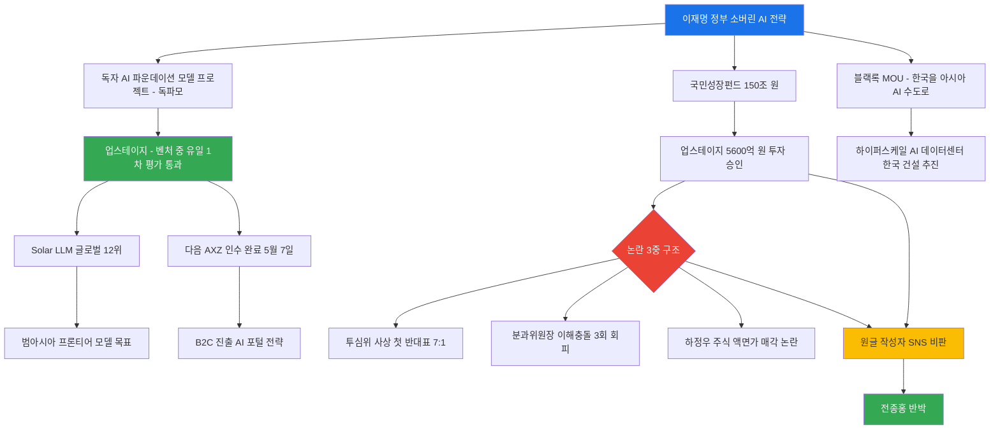

> **작성일**: 2026-05-23  
> **분류**: AI 산업 정책 / 스타트업 투자 / 소버린 AI 논쟁  
> **주요 키워드**: 업스테이지, 국민성장펀드, 소버린 AI, 독자 파운데이션 모델, 하정우, 전종홍

## 관련글

- 원글 : [**스타트업 인큐베이션이나 초기 투자는 미국도(특히 국방부) 직간접적인 지원을 많이 합니다.**](https://www.instagram.com/p/DYqq1Caxwun/)
- 원글 관련 기사 : [**국민성장펀드, 투심위 반대에도 업스테이지 투자 강행**](https://www.sisajournal.com/news/articleView.html?idxno=373814)
- 원글 관련 기사 : [**하정우 업스테이지 주식 논란에…VC업계 "스타트업에선 흔한 사례"**](https://news.einfomax.co.kr/news/articleView.html?idxno=4416070)
- 반론글 : [**이런 글이 보이는데 한마디 안 할 수가 없네요. 참고로 저는 업스테이지와 COI가 없습니다. 그냥 응원하는 국민 한 사람일 뿐.**](https://www.facebook.com/share/p/1EYy5NF68h/)

---

## 목차

1. [이 논쟁은 어디서 시작됐는가](#1-이-논쟁은-어디서-시작됐는가)
2. [등장인물 및 문맥 파악](#2-등장인물-및-문맥-파악)
3. [업스테이지란 어떤 회사인가](#3-업스테이지란-어떤-회사인가)
4. [소버린 AI와 'AI 자주국'이란 개념](#4-소버린-ai와-ai-자주국이란-개념)
5. [국민성장펀드와 업스테이지 투자 경위](#5-국민성장펀드와-업스테이지-투자-경위)
6. [논란의 핵심 — 투심위 반대와 이해충돌](#6-논란의-핵심--투심위-반대와-이해충돌)
7. [시사저널 단독 보도 내용](#7-시사저널-단독-보도-내용)
8. [원글 비판의 사실 여부 검증](#8-원글-비판의-사실-여부-검증)
9. [전종홍의 반론과 댓글 논쟁](#9-전종홍의-반론과-댓글-논쟁)
10. [정부 청사진 — 블랙록과 아시아 AI 허브](#10-정부-청사진--블랙록과-아시아-ai-허브)
11. [업스테이지의 실제 전략 — 다음 인수와 방향 전환](#11-업스테이지의-실제-전략--다음-인수와-방향-전환)
12. [독자 AI 파운데이션 모델 프로젝트](#12-독자-ai-파운데이션-모델-프로젝트)
13. [전체 구조 한눈에 보기](#13-전체-구조-한눈에-보기)
14. [총평 및 시사점](#14-총평-및-시사점)

---

## 1. 이 논쟁은 어디서 시작됐는가

이 논쟁은 2026년 5월 하순, 어떤 스타트업 창업자로 알려진 인물이 SNS에 올린 글에서 비롯됐다. 이 인물은 업스테이지와 소버린 AI 정책 전반을 강하게 비판하는 글을 게재했다. 그 내용은 대략 다음과 같다.

- "'AI 자주국'은 두루뭉실하고 허황된 마케팅 용어다."
- "특정인들의 아젠다에 부합하기 위해 사실상 정부 주머니에서 돈이 나오고 있다."
- "글로벌 스타트업이라면서 왜 한국어에 특화된 LLM을 만드는 것이 목표인지 모르겠고, 더 심각한 문제는 그것조차 못하고 있다."
- "한국은 너무 대놓고 썩었다."

이 글은 마침 시사저널이 '국민성장펀드가 투자심의위원회(투심위)의 반대에도 불구하고 업스테이지에 5,600억 원 투자를 강행했다'는 단독 보도를 내보낸 시기와 겹쳤고, SNS에서 활발한 논쟁을 촉발시켰다.

---

## 2. 등장인물 및 문맥 파악

### [전종홍](https://www.facebook.com/1biit) (반론 작성자)

이 논쟁에서 원글에 반박하며 업스테이지를 옹호한 인물이다. 그의 프로필에는 **디지털 크리에이터**, **대통령직속 국가인공지능전략위원회** 위원, **한림대학교** 소속으로 기재되어 있다. 그는 "업스테이지와 이해충돌(COI)이 없고 단순히 응원하는 국민의 한 사람"이라고 밝혔다.

그는 원글 작성자의 주장 중 단 하나도 객관적 사실에 부합하지 않는다고 반박하면서, 감정적 폄훼가 아니라 객관적 사실에 근거한 비판을 촉구했다. 그러면서도 한 가지 의문은 인정했다. 정부는 한국어 특화 독자 파운데이션 모델 선점을 의도하고 업스테이지를 투자 대상으로 선정했는데, 업스테이지의 실제 행보(다음 인수, 네이버 추월 언급 등)가 정부의 청사진과 완전히 같은 방향인지는 살짝 우려스럽다고 부연했다.

### [이승현](https://www.instagram.com/widici_wine_korea/) (원글 작성자)

~~글 내용을 보면 스타트업 파운더 또는 VC 관계자로 추정되며, Scale AI와 같은 회사를 언급하는 등 기술 업계에 대한 이해가 있는 인물로 보인다. 단, 본 문서에서는 사실로 확인되지 않은 신원을 명기하지 않는다.~~

2020년 정식으로 SK그룹 E&S 매니저로 입사하였으나, 2025년 7월 퇴사 후 매킨지 서울사무소에서 경험 쌓는 중

### 하정우

전 청와대 AI미래기획수석. 현재는 더불어민주당 부산 북갑 국회의원 후보로 선거운동 중이다. 그는 청와대 AI 수석 임명 직전 업스테이지 주식을 보유하고 있었으며, 임명 직후 해당 주식을 액면가 100원에 매도했다는 사실이 드러나며 이해충돌 논란의 중심에 서 있다.

### 김성훈

업스테이지 대표. 홍콩과기대 교수 출신으로, 2020년 업스테이지를 창업했다.

---

## 3. 업스테이지란 어떤 회사인가

업스테이지는 2020년 김성훈 대표가 창업한 AI 스타트업으로, B2B 중심의 LLM 및 기업 AI 솔루션 개발 회사다. 핵심 제품은 자체 개발한 대형 언어 모델 **Solar(솔라)** 와 기업용 문서 AI 솔루션인 **Document AI**다.

### 성장 궤적

| 시점 | 주요 사건 |
|------|----------|
| 2020년 | 창업 |
| 2021년 | 시리즈 A 316억 원 유치 |
| 2024년 | 시리즈 B 1,000억 원 유치 |
| 2025년 8월 | 한국산업은행 리드, 아마존·AMD 참여 시리즈 B 브릿지 620억 원 유치. 누적 투자 2,000억 원, 기업가치 약 7,900억 원 |
| 2025년 7월 | Solar Pro2, 글로벌 AI 분석 기관 아티피셜 애널리시스 지능 지표 전세계 12위·기업 기준 8위 기록 |
| 2025년 8월 | 과기정통부 주관 '독자 AI 파운데이션 모델 개발' 사업 벤처·중소기업 중 유일하게 1차 평가 통과, 5개 컨소시엄 주관사 중 하나로 선정 |
| 2025년 12월 | 조달청 '생성형 AI 업무지원 서비스' 1호 공급사로 지정 |
| 2026년 1월 | 포털 다음 운영사 AXZ 인수를 위한 카카오와 MOU 체결 |
| 2026년 4월 | 시리즈 C 1차 라운드 1,800억 원 유치, 기업가치 1조 원 이상 인정 → 국내 생성형 AI 기업 최초 유니콘 등극 |
| 2026년 5월 7일 | 다음 운영사 AXZ 인수 본계약 체결 완료 |
| 2026년 5월 | 국민성장펀드 5,600억 원 투자 승인 (공적 기금 1,000억 원 + 민간 4,600억 원) |

### 재무 현황

매출은 2023년 약 139억 원에서 2025년 상반기에만 170억 원(전년 동기 대비 +156%)을 달성하며 급성장 중이다. 다만 2024년 기준 영업손실은 402억 원으로, 이는 GPU, 글로벌 인재, 인프라에 대한 전략적 투자를 반영한 수치다. 이르면 2026년 하반기 코스피 상장예비심사 청구를 목표로 하고 있으며, 시장에서는 상장 시 기업가치를 최소 2조~3조 원으로 전망한다.

---

## 4. 소버린 AI와 'AI 자주국'이란 개념

**소버린 AI(Sovereign AI)** 란 한 국가가 자국의 언어, 문화, 데이터, 가치에 기반한 AI 모델을 독자적으로 개발·운영하는 역량을 갖추는 것을 의미한다. 엔비디아 CEO 젠슨 황이 처음 대중화시킨 개념으로, 특정 국가가 OpenAI나 구글 같은 외국 빅테크에 전적으로 의존하지 않고 AI 주권을 확보해야 한다는 논리다.

**'AI 자주국'** 은 이재명 정부가 추진하는 소버린 AI 정책을 대중적으로 표현하는 방식이다. 정부는 AI 자주권 확보를 국가 전략 목표로 설정하고, 독자 파운데이션 모델 개발, 국가 AI컴퓨팅센터 건설, 국민성장펀드를 통한 AI 투자 등을 추진하고 있다.

원글 작성자는 이를 "두루뭉실하고 허황된 마케팅 용어"라고 표현했으나, 소버린 AI는 이미 싱가포르, 프랑스, UAE, 일본 등 다수 국가가 실제 정책으로 채택한 개념이다. '마케팅 용어'라는 비판 자체가 근거 없다고 보기는 어렵지만, "허황됐다"는 단정 또한 사실 판단이라기보다는 감정적 평가에 가깝다.

---

## 5. 국민성장펀드와 업스테이지 투자 경위

### 국민성장펀드란?

국민성장펀드는 이재명 정부가 반도체, 이차전지, 인공지능, 바이오, 방산, 로봇 등 첨단전략산업 육성을 위해 조성한 **150조 원 규모**의 국가 주도 펀드다. 공적 자금 75조 원과 민간·국민 자금 75조 원으로 구성되며, 직접 지분투자, 간접 투자, 저금리 대출, 인프라 투융자 등에 투입된다. 2025년 12월 출범했다.

### 업스테이지에 대한 투자 규모

국민성장펀드 기금운용심의회는 '소버린 AI 확보를 위한 차세대 AI 모델 개발' 사업의 일환으로 업스테이지에 **총 5,600억 원** 투자를 승인했다. 재원 구성은 다음과 같다.

| 재원 출처 | 금액 |
|----------|------|
| 첨단전략산업기금 (공적) | 1,000억 원 |
| 산업은행 본체 (공적) | 300억 원 |
| SK네트웍스, 사제파트너스, 우리벤처파트너스, 미래에셋 등 민간 | 4,300억 원 |
| **합계** | **5,600억 원** |

이는 리벨리온(AI 반도체)에 이은 국민성장펀드의 두 번째 직접 투자 사례다. 리벨리온은 국민성장펀드 2,500억 원을 포함한 총 6,400억 원을 유치한 바 있다.

> **중요 사실**: 원글 작성자는 업스테이지가 받은 투자가 "사실상 정부 주머니에서 나오는 중"이라고 했다. 그러나 실제로 공적 자금은 1,300억 원(1,000억 원 + 300억 원)으로 전체의 약 23%에 불과하고, 나머지 77%인 4,300억 원은 민간 투자다. "사실상 모두 정부 주머니"라는 표현은 사실과 다르다.

---

## 6. 논란의 핵심 — 투심위 반대와 이해충돌

시사저널이 단독 보도한 이 사안은 세 가지 논란이 겹쳐 있다.

### 논란 ① 투심위 사상 첫 반대표

국민성장펀드 투자심의위원회(투심위) 산하 AI·로봇 분과회의에서 2026년 4월 20일 업스테이지 투자 안건을 심사했다. 출석 위원 8명 중 7명이 찬성하고 **1명이 반대**했다. 이 반대표는 국민성장펀드 역사상 최초의 반대 사례로, 해당 위원은 업스테이지 매출의 상당 부분을 차지하는 B2C 사업의 불확실성을 문제 삼은 것으로 알려졌다. 금융위원회는 수익률 목표와 회수 시점도 없이 투자를 진행한 것으로 시사저널은 전했다.

### 논란 ② AI·로봇 분과위원장의 이해충돌

안건 심사를 주관해야 할 AI·로봇 분과위원장은 이해충돌 문제를 이유로 4월 20일 회의는 물론 앞선 3월 13일, 4월 10일 회의에도 연이어 참석하지 않았다. 전체 5개 분과 위원장 중 단일 위원장이 10차례 회의(5월 11일 기준)에서 3차례나 회의를 회피한 것은 이 분과위원장이 유일하다. 금융위원회는 이 이해충돌 문제에 대한 언론 질의에 답하지 않았다.

### 논란 ③ 하정우 주식 매각 의혹

하정우 전 청와대 AI미래기획수석(現 더불어민주당 부산 북갑 국회의원 후보)이 청와대 AI 수석으로 임명될 당시 업스테이지 주식을 보유하고 있다가, 임명 직후 주당 7만 원이 넘는 주식 4,444주를 액면가인 주당 100원에 회사에 반환(매각)한 사실이 드러났다.

더 구체적으로 살피면, 하정우가 청와대 AI 수석에 임명된 것은 2025년 6월 15일이고, 주식을 업스테이지에 반환한 것은 2025년 8월 11일이다. 그런데 그 사이인 2025년 8월 4일, 업스테이지가 독파모(독자 AI 파운데이션 모델) 사업 참여 기업으로 선정됐다. 이 타이밍 때문에 이해충돌 논란이 제기됐다.

**하정우 측 해명**: 공직자윤리법에 따라 재산공개 대상 공직자는 임명 후 2개월 내 주식을 매각하거나 백지신탁해야 하며, 이는 당초 베스팅(vesting) 계약에 따른 절차였다고 밝혔다. 또한 대통령비서실(AI 수석실)은 AI 정책의 큰 방향성을 제시하는 기관으로, 독파모 같은 개별 사업의 업체 선정 등 집행 과정에는 구조적으로 관여할 수 없다고도 설명했다.

**업스테이지 측 해명**: "당시 네이버와 AI 교육을 공동으로 진행한 바 있었으며, 네이버 재직 중이던 하 후보는 네이버의 공식 허락 후 비상근 AI 교육 한정 자문 역할만 맡았다"고 해명했다.

---

## 7. 시사저널 단독 보도 내용

제공된 자료에 포함된 시사저널 헤드라인 "[단독] 국민성장펀드, 투심위 반대에도 업스테이지 투자 강행"은 실제 존재하는 기사다. 2026년 5월 22일 전후에 보도된 이 기사는 다음을 핵심 내용으로 다룬다.

- 국민성장펀드가 수익률 목표와 회수 시점도 없이 공적 기금 1,000억 원을 포함한 5,600억 원을 업스테이지에 투자하기로 결정했다.
- 투심위에서는 사상 첫 반대표가 나왔다.
- 투심위 위원장은 이해충돌을 이유로 심사에 불참했다.
- 하정우의 업스테이지 주식 보유 및 액면가 매각 사실이 드러났다.
- 업스테이지는 투심위 통과 일주일 후 다음 운영사 AXZ 인수 본계약을 체결했다.
- 금융위원회는 관련 질의에 답하지 않았다.

---

## 8. 원글 비판의 사실 여부 검증

원글 작성자의 주요 주장들을 사실 기반으로 하나씩 검토한다.

### 주장 1: "'AI 자주국'은 두루뭉실하고 허황된 마케팅 용어다"

**판정: 주관적 의견, 사실 여부 불분명**

소버린 AI는 엔비디아 젠슨 황이 제창하고 싱가포르·프랑스·일본 등이 국가 전략으로 채택한 개념이다. "마케팅 용어"라는 시각 자체는 비판적 견해로서 존재할 수 있다. 그러나 "허황됐다"는 주장은 이미 여러 국가에서 실제로 추진되고 성과를 내는 정책 방향을 근거 없이 단정한 것이다. 전종홍이 지적했듯, 자주독립을 외친 독립투사들이 "마케팅을 했다"는 식의 논리와 다를 바 없는 과도한 표현이다.

### 주장 2: "특정인들의 아젠다를 위한 돈이 사실상 정부 주머니에서 나오는 중"

**판정: 사실과 다름**

업스테이지의 시리즈 C 및 국민성장펀드 투자를 합산한 총 투자 규모(약 4,000억~5,600억 원)에서 순수 공적 자금은 1,300억 원(약 23%)이다. 나머지 77%는 SK네트웍스, 사제파트너스, 미래에셋, 아마존, AMD 등 민간 투자자들이 부담한다. "사실상 정부 주머니"라는 표현은 구조적 사실과 크게 다르다.

### 주장 3: "'글로벌 스타트업'인데 왜 한국어에 특화된 LLM을 만드는 게 목표인지 모르겠다"

**판정: 사실 오인**

업스테이지의 공식 목표는 "한국어 특화 LLM"이 아니다. 최 부사장은 공식 석상에서 "범아시아권에서 인정받는 프론티어 모델을 만들고 싶다"고 밝혔으며, 전략은 한국어 이해를 기반으로 영어, 일본어, ASEAN 지역 언어로 확장하는 것이다. Solar 모델은 이미 허깅페이스 글로벌 1위를 기록했고 아티피셜 애널리시스에서 전세계 12위에 오른 글로벌 경쟁력을 보유한 모델이다.

다만 일부 언론 기사에 "한국어를 가장 잘 이해하는 AI", "한국형 AI" 등의 워딩이 등장한 것은 사실이다. 댓글 논쟁에서 드러나듯 이 워딩이 기자의 해석인지 최 부사장의 직접 발언인지에 대한 논쟁이 이어졌다. "한국형 AI는 반드시 필요하다"는 따옴표 발언은 기사에 존재하나, 이를 '한국어 특화 모델만 만든다'는 의미로 해석하는 것은 무리가 있다.

### 주장 4: "그것조차 못하는 중이다"

**판정: 사실과 다름**

Solar Pro2는 2025년 7월 기준 전세계 모델 순위 12위, 기업 기준 8위를 기록했다. 이는 GPT-4o, Claude, Gemini 등 빅테크 모델에 이어 독립 모델 중 최상위권에 해당하는 수준이다. 허깅페이스에서 한때 전세계 1위를 기록하기도 했다. 한국어 특화가 목표든 아니든, 모델 성능 자체가 부진하다는 주장은 사실이 아니다.

### 주장 5: "한국은 너무 대놓고 썩었다"

**판정: 근거 없는 감정적 단정**

이 주장은 특정 사실에 근거한 논리적 결론이 아니라, 앞선 논점들을 묶어 감정적으로 표현한 것이다. 국민성장펀드 투자 과정에서 이해충돌 논란이 제기된 것은 사실이나, 이것이 곧 "한국은 썩었다"는 결론으로 직결되지는 않는다. 비판이 있다면 구체적인 제도적 문제를 짚어야 하며, 포괄적인 국가 부패 단정은 논리적 비약이다.

---

## 9. 전종홍의 반론과 댓글 논쟁

전종홍은 원글의 모든 주장이 객관적 사실에 부합하지 않는다고 반박하면서도, 다음과 같은 우려를 솔직하게 표했다.

> "정부는 한국어 특화 독자 파운데이션 모델 선점을 바라고 국민성장펀드 투자사로 선정했는데, 업스테이지의 행보는 플랫폼 인수(다음), 그리고 네이버를 뛰어넘겠다는 문장들이 즐비해서 살짝 우려되긴 합니다."

이에 대해 댓글에서 반론이 제기됐다. "한국어 특화 독자 파운데이션이 아니라 그냥 독자 파운데이션 모델"이라는 정정이 이어졌고, 언론의 추측성 기사 워딩과 실제 기업 발언의 차이도 지적됐다.

댓글 논쟁을 통해 드러난 핵심 쟁점은 다음과 같다.

- 업스테이지의 공식 목표는 '한국어 특화'가 아니라 '범아시아 프론티어 모델'이다.
- 언론이 쓴 "한국형 AI", "한국어 특화"라는 표현이 실제 기업의 발언을 왜곡했을 수 있다.
- 그럼에도 최 부사장이 "한국형 AI는 반드시 필요하다"고 따옴표로 발언한 내용은 기사에 존재한다.
- 해당 발언의 의미는 '한국어만 잘하는 모델을 만들겠다'가 아니라, 한국의 문화·산업 맥락에 맞는 AI 생태계가 필요하다는 의미로 해석하는 것이 맥락상 더 정확하다.

---

## 10. 정부 청사진 — 블랙록과 아시아 AI 허브

페이스북 댓글에서 언급된 "블랙록을 설득해 한국에 몰빵시켰다"는 내용은 실제 사실에 근거한다.

2025년 9월, 이재명 대통령이 미국 뉴욕에서 래리 핑크 블랙록 회장을 만났고, 과학기술정보통신부와 블랙록이 MOU를 체결했다. 래리 핑크 회장은 "한국이 아시아의 AI 수도가 될 수 있도록 글로벌 자본을 연계해 적극 협력하겠다"고 밝혔다.

MOU의 핵심 내용은 세 가지다.

첫째, 국내 AI 및 재생에너지 인프라 협력이다. 데이터센터와 재생에너지 발전·저장 설비를 결합하는 통합적 접근을 추진한다.

둘째, 한국에 아시아·태평양 AI 허브를 구축하는 협력이다. 재생에너지 기반의 하이퍼스케일 AI 데이터센터를 한국에 두어 국내 수요와 아시아·태평양 지역 수요를 아우르는 거점으로 만든다.

셋째, 글로벌 AI 인프라 파트너십(AIP) 참여 및 향후 5년간 아시아·태평양 지역 AI·재생에너지 전환을 위한 대규모 투자를 공동 준비한다.

블랙록은 전 세계 1경 7천조 원(약 13조 달러)에 달하는 자산을 운용하는 세계 최대 자산운용사다. 정부는 이 블랙록이 아시아 AI 허브 구축을 위해 필요로 하는 파운데이션 모델을 대한민국이 결정한다는 전략 구도를 그리고 있으며, 독파모 프로젝트가 그 일환이다.

---

## 11. 업스테이지의 실제 전략 — 다음 인수와 방향 전환

업스테이지는 2026년 1월 포털 다음 운영사 AXZ와 카카오 사이에서 MOU를 체결하고, 5월 7일 본계약을 완료했다. 카카오가 AXZ 지분 100%를 업스테이지에 넘기고, 카카오는 업스테이지 신주를 취득하는 구조다. 카카오는 2014년 다음을 흡수 합병한 지 12년 만에 포털 사업을 분리하게 됐다.

### 다음 인수의 배경과 전략적 목적

업스테이지의 현재 매출 규모(200억~300억 원대)로는 목표 밸류에이션 3조~4조 원을 정당화하기 어렵다. 연 매출 약 3,000억 원 규모의 다음을 인수함으로써 IPO에 유리한 외형 확장이 가능해진다.

그 외에도 전략적 의미가 있다. 다음이 보유한 뉴스·블로그·티스토리 등 콘텐츠 데이터와 사용자 기반을 Solar 모델 고도화와 AI 검색 서비스 검증에 활용할 수 있다. 기존 B2B 중심에서 B2C 영역으로의 포트폴리오 확장도 가능해진다. 업스테이지는 Solar LLM을 다음에 적용하여 차세대 AI 포털을 구축하겠다는 계획을 밝혔다.

### 전종홍의 우려가 타당한가?

전종홍의 우려 포인트, 즉 "정부는 파운데이션 모델 개발을 바라는데 업스테이지는 포털 플랫폼을 인수하고 네이버를 뛰어넘겠다고 한다"는 지적은 아주 근거 없는 것은 아니다. 다음 인수의 1차 목적은 IPO를 위한 외형 확장으로 분석되며, 이는 정부가 기대하는 파운데이션 모델 연구·개발 집중과 방향이 완전히 일치한다고 보기는 어렵다.

그러나 업스테이지는 다음의 콘텐츠·사용자 데이터가 LLM 고도화에 기여한다고 설명하고 있으며, 정부와 명시적으로 상충하는 것도 아니다. 기업의 자생력 확보(IPO, 외형 확장)와 국가 전략(파운데이션 모델 개발)은 완전히 같은 방향이 되기 어렵다는 현실적 한계가 있다.

---

## 12. 독자 AI 파운데이션 모델 프로젝트

과학기술정보통신부가 주관하는 '독자 AI 파운데이션 모델(독파모)' 프로젝트는 2025년 6월 본격 추진됐다. 목표는 글로벌 AI 모델 대비 95% 이상의 성능을 가진 한국형 LLM을 개발하는 것이다. 최대 5개 정예팀을 선발해 6개월 단위로 평가하며, 단계적으로 2~3팀으로 압축할 계획이다. 선발된 팀은 정부가 확보한 GPU 1만 장을 사용할 수 있다.

업스테이지는 2025년 8월 벤처·중소기업 중 유일하게 1차 평가를 통과했다. SK텔레콤, NC AI, LG 등과 함께 5개 컨소시엄 주관사 중 하나로 선정되어 3년간 1,000만 명 이상 대국민 AI 서비스를 목표로 하고 있다. 이 독파모 1차 통과 실적이 국민성장펀드 투자의 기술력 검증 근거로도 활용됐다.

---

## 13. 전체 구조 한눈에 보기

---

## 14. 총평 및 시사점

이 논쟁은 단순한 SNS 설전 이상의 의미를 담고 있다. 주요 시사점을 정리하면 다음과 같다.

### 원글 비판의 한계

원글 작성자는 소버린 AI 정책과 업스테이지에 대해 명백히 적대적인 감정을 드러냈으며, 주요 주장들이 사실과 다르거나 과장됐다. 특히 "사실상 모든 돈이 정부 주머니에서 나온다", "한국어 특화 LLM조차 못 만들고 있다"는 주장은 객관적 사실과 부합하지 않는다. 스타트업 창업자라는 공신력 있는 위치에서 이런 근거 없는 주장을 하는 것은 업계 내 건강한 비판 문화에 기여하지 못한다는 전종홍의 지적은 타당하다.

### 국민성장펀드 논란의 정당한 문제 제기

반면, 시사저널이 보도한 투심위 논란은 공적 자금 운용의 투명성과 거버넌스 문제를 건드리는 정당한 언론 감시 사례다. 투심위 사상 첫 반대표, 분과위원장의 3회 회피, 하정우의 주식 매각 타이밍은 정치적 맥락과 맞물려 계속 논란이 될 것이다. 이 부분은 원글 작성자의 전반적인 비판과는 별개로, 별도의 면밀한 검토가 필요하다.

### 기업 전략과 국가 전략의 간극

전종홍이 지적한 대로, 정부는 파운데이션 모델 개발을 기대하며 투자하지만 기업은 IPO를 위한 외형 확장(다음 인수)도 병행해야 한다. 기업의 자생 논리와 국가 전략 목표가 완전히 일치하기는 어렵다. 이 간극을 어떻게 좁힐 것인가는 투자 조건 설계와 성과 관리의 문제이며, 이것이 국민성장펀드 제도 설계의 핵심 과제이기도 하다.

### 한국 AI 생태계의 현재

업스테이지는 분명 실적이 있는 회사다. Solar 모델의 글로벌 12위 성적, 유니콘 등극, 아마존·AMD의 투자 참여 등은 무시할 수 없는 성과다. 동시에 이 회사에 쏟아지는 국가적 기대와 자원의 규모(독파모 + 국민성장펀드 + 블랙록 생태계)는 단순한 스타트업 지원을 넘어, 한국 AI 산업의 국가 전략적 베팅에 가까운 무게를 지닌다. 그만큼 성공에 대한 책임과 실패에 대한 위험 또한 크다는 점을 직시해야 한다.

---

*본 문서는 2026년 5월 23일 기준 공개된 언론 보도와 공식 발표를 바탕으로 작성됐습니다. 사실로 확인되지 않은 내용은 포함하지 않았으며, 논란이 있는 사안은 양측의 입장을 병기했습니다.*

---

**작성일: 2026-05-23**
