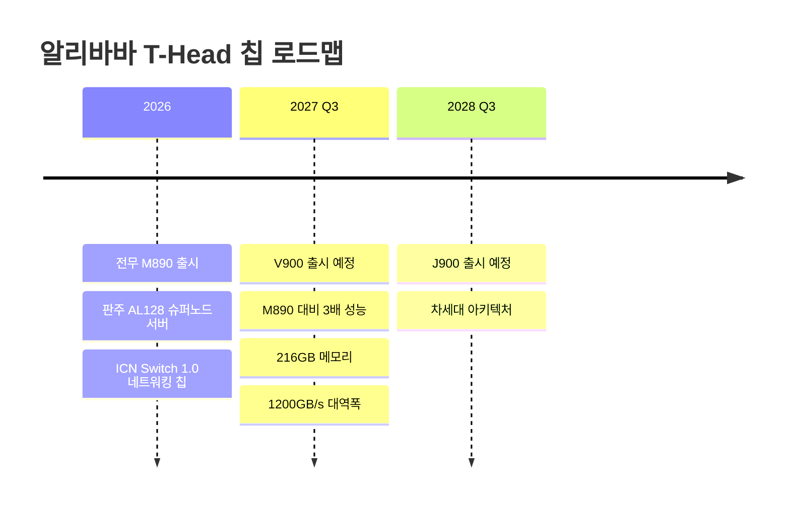
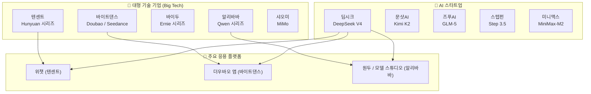
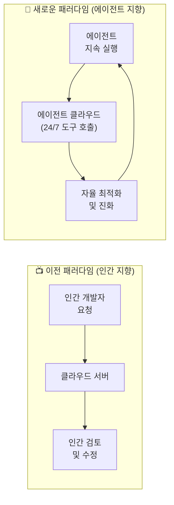

> **"뒤쫓는 자가 나란히 달리기 시작한 순간"**  
> 2025–2026년 중국 AI 생태계의 변곡점을 기록한다.

---
## 관련글

[**중국AI미래지도**](https://www.facebook.com/share/1EAYVXVr1w/)

## 목차

1. [들어가며: 패리티(Parity)의 의미](#1-들어가며)
2. [알리바바의 선언: 에이전트 시대의 AI 공장](#2-알리바바의-선언)
3. [큐웬(Qwen) 3.7 맥스: 무엇이 달라졌는가](#3-큐웬-37-맥스)
4. [칩 전쟁의 내면: 전무(Zhenwu) M890와 판주 AL128](#4-칩-전쟁의-내면)
5. [텐센트의 다른 길: 플랫폼 소유자의 전략](#5-텐센트의-다른-길)
6. [중국 LLM 생태계 전체 지도](#6-중국-llm-생태계-전체-지도)
7. [에이전트 인프라로의 전환: 무엇이 바뀌는가](#7-에이전트-인프라로의-전환)
8. [미·중 AI 격차: 지금 어디까지 왔는가](#8-미중-ai-격차)
9. [산업으로의 확장: AI가 바꿀 실물 경제](#9-산업으로의-확장)
10. [마치며: 변곡점 이후의 세계](#10-마치며)

---

## 1. 들어가며

한 나라에 성능이 우수한 대형 언어 모델(LLM)이 존재한다는 것, 그리고 하나가 아니라 다양한 모델이 경쟁적으로 발전하고 있다는 것은 단순한 기술 뉴스가 아닙니다. 이것은 그 나라의 산업 전반이 얼마나 빠르게 AI 기반으로 재편될 수 있는지를 결정하는 인프라의 문제이며, 농업, 제조업, 서비스업 전반의 생산성과 혁신 속도에 직접적으로 영향을 미치는 국가 경쟁력의 문제입니다.

2026년 5월 현재, 중국 AI는 더 이상 "미국을 따라잡으려는" 단계에 있지 않습니다. 정확히 표현하자면, **패리티(Parity)**, 즉 동등한 위치에 도달한 상태입니다. 추격이 끝나고 경쟁이 시작된 것입니다. 이 문서는 그 변곡점의 실체를 구체적인 사실들을 통해 기록합니다.

---

## 2. 알리바바의 선언: 에이전트 시대의 AI 공장

### 2026 알리바바 클라우드 서밋

2026년 5월 20일과 21일, 중국 항저우에서 열린 **알리바바 클라우드 서밋**은 단순한 신제품 발표 행사가 아니었습니다. 알리바바 클라우드 컴퓨팅 부문 수석 부사장 류웨이광(刘伟光)은 이 자리에서 "우리가 만드는 것은 중국의 AI 공장(China's AI factory)이다"라고 선언했습니다. 이 발언 하나에 알리바바의 전략적 방향이 압축되어 있습니다.

이날 알리바바가 동시에 공개한 것은 세 가지였습니다.

- **큐웬 3.7 맥스(Qwen 3.7-Max)**: 에이전트 시대를 위해 설계된 새로운 플래그십 대형 언어 모델
- **전무 M890(Zhenwu M890)**: 반도체 자회사 핑터우거(平头哥, T-Head)가 개발한 AI 전용 가속기 칩
- **판주 AL128(Panjiu AL128)**: 128개의 M890 가속기를 하나의 랙 단위로 통합한 서버 시스템

세 제품을 동시에 발표한 것 자체가 핵심입니다. 모델, 칩, 서버 인프라를 수직 통합한 하나의 "스택"을 완성했다는 선언이기 때문입니다. 이전까지 알리바바 클라우드가 인간 개발자들을 위한 서비스였다면, 이제부터는 **에이전트를 위한 인프라**로 전면 재편됨을 공식 선언한 것입니다.

### 에이전트 플랫폼으로서의 큐웬 생태계

큐웬이 지향하는 것은 AI 에이전트를 만들려는 기업들에게 모델, 인프라, 칩을 동시에 공급하는 생태계 플랫폼입니다. 비유하자면 카페 창업자에게 원두, 에스프레소 머신, 레시피를 한꺼번에 공급하는 도매 플랫폼과 같습니다. 에이전트 창업자와 기업이 많아질수록 알리바바의 수익이 늘어나는 구조, 즉 플랫폼 비즈니스 모델입니다.

알리바바는 이미 향후 3년간 3,800억 위안(약 530억 달러)을 클라우드 및 AI 인프라에 투자할 것을 선언했으며, 이는 알리바바 역사상 최대 규모의 인프라 투자입니다. 또한 핑터우거(T-Head)의 기업공개(IPO)를 통해 칩 개발 자금을 지속적으로 확보하는 방안도 검토 중인 것으로 알려져 있습니다.

---

## 3. 큐웬(Qwen) 3.7 맥스: 무엇이 달라졌는가

### 장시간 자율 실행 능력

큐웬 3.7 맥스의 가장 핵심적인 업그레이드는 **장시간 작업 능력(Long-Horizon Task Capability)** 의 대폭 강화입니다. 이 모델은 최대 **35시간** 연속으로, 수천 단계의 복잡한 작업을 인간의 개입 없이 자율 실행할 수 있습니다. 그리고 이 과정에서 **1,000회 이상의 도구 호출(Tool Call)** 을 성능 저하 없이 수행합니다.

도구 호출이란 AI 에이전트가 외부 API, 검색 엔진, 코드 실행 환경, CRM, ERP 시스템 등 외부 자원을 자율적으로 불러와 활용하는 기능입니다. 즉, 에이전트가 스스로 필요한 도구를 선택하고 조합하여 복잡한 업무를 완수하는 능력의 핵심입니다.

알리바바는 이를 실제로 검증했습니다. 핑터우거의 자체 칩 플랫폼에서 큐웬 3.7 맥스가 1,000회 이상의 도구 호출과 반복적인 코드 수정을 통해 플랫폼 핵심 커널을 스스로 최적화하는 작업을 수행했고, 그 결과 추론 속도가 이전 버전 대비 약 10배 향상되었습니다.

### 코딩 성능

코딩 능력 측면에서 큐웬 3.7 맥스는 업계 최고 수준에 도달했습니다. 현재 가장 권위 있는 소프트웨어 엔지니어링 능력 평가인 **SWE-Bench 시리즈**에서 딥시크 V4와 동등하거나, 더 높은 난이도의 복잡한 엔지니어링 작업 테스트(**Terminal-Bench 2.0**)에서는 1위를 기록했습니다. 또한 독립 평가 플랫폼 **Artificial Analysis Intelligence Index**에서 56.6점을 기록하며 전체 5위에 올랐습니다.

모델은 프론트엔드 신속 프로토타이핑부터 복잡한 다중 파일 소프트웨어 엔지니어링까지 하나의 모델로 처리하도록 설계되었으며, OpenClaw, Hermes Agent, Claude Code, Qwen Paw, Qoder 등 현재 개발자들이 주로 사용하는 주요 에이전트 프레임워크 모두와 호환됩니다.

### 컨텍스트 창 확장

큐웬 3.7 맥스는 **100만 토큰(1M token)** 의 컨텍스트 창을 지원합니다. 이전 버전인 큐웬 3.6 맥스 프리뷰의 256K 토큰에서 약 4배 확장된 수치입니다. 100만 토큰은 중간 규모의 코드 저장소 전체 또는 방대한 문서 더미를 단일 요청 안에 담을 수 있는 용량입니다.

### 폐쇄형 API로의 전환

큐웬 3.7 맥스는 이전 시리즈와 달리 **오픈소스가 아닌 유료 API 방식**으로만 제공됩니다. 이는 OpenAI나 앤트로픽처럼 폐쇄적 수익 모델로 전환한 것을 의미합니다. 오픈소스 커뮤니티 사이에서 아쉬움 섞인 반응이 나오고 있으나, 이는 알리바바가 에이전트 생태계 플랫폼으로서의 수익 구조를 본격적으로 구축하겠다는 의지를 반영합니다. 알리바바 클라우드는 자사 모델 서비스 플랫폼인 **모델 스튜디오(Model Studio)** 를 통해 API 접근을 제공할 예정입니다.

### 가격 경쟁력

큐웬 3.7 맥스는 Claude Opus와 비교하여 입력 비용은 약 절반, 출력 비용은 약 3분의 1 수준으로 에이전트 워크플로우를 처리합니다. 에이전트 기반 업무는 도구 호출 횟수가 많고 실행 시간이 길어 비용이 빠르게 누적되는 구조이기 때문에, 이 가격 차이는 기업 도입 결정에 실질적인 영향을 미칩니다.

---

## 4. 칩 전쟁의 내면: 전무 M890와 판주 AL128

### 왜 자체 칩인가

미국 정부의 수출 규제로 인해 중국 기업들은 엔비디아(NVIDIA)의 최신 AI 가속기를 구매할 수 없는 상황입니다. 이 구조적 제약이 중국의 자체 AI 칩 개발을 가속화하는 핵심 동인입니다. 알리바바의 반도체 자회사 **핑터우거(T-Head)** 가 바로 이 공백을 채우는 역할을 맡고 있습니다.

### 전무 M890의 스펙

이번에 발표된 **전무 M890**은 전작인 전무 810E 대비 **3배의 성능**을 제공하는 AI 전용 가속기입니다. 주요 사양은 다음과 같습니다.

- **144GB HBM 메모리**: AI 모델 추론 및 훈련에 충분한 용량
- **칩 간 대역폭 800GB/s**: 다중 가속기 간 고속 데이터 전송
- **PCIe 5.0 x16 인터페이스** 지원
- 훈련과 추론을 하나의 칩에서 처리 가능한 통합 아키텍처

T-Head는 신규 네트워킹 칩 **ICN Switch 1.0**도 함께 출시했습니다. 이 칩은 초당 25.6 테라비트(Tbps)의 집계 대역폭을 제공하며 64개 가속기 클러스터 내의 무정체(congestion-free) 통신을 가능하게 합니다. 이는 수많은 에이전트가 동시에 작업을 처리할 때 발생하는 고빈도, 비예측적 추론 요청 패턴에 대응하기 위한 설계입니다.

### 판주 AL128 슈퍼노드 서버

**판주 AL128**은 128개의 M890 가속기를 단일 랙 단위로 통합한 서버 시스템입니다. 내부 대역폭은 PB/s(페타바이트 퍼 세컨드) 규모로, 에이전트 동시 처리에서 발생하는 폭발적이고 불규칙한 추론 요청을 감당하도록 특별히 설계되었습니다. 중국 내 기업 고객은 알리바바 클라우드의 바이리안(Bailian) 플랫폼을 통해 즉시 이용 가능합니다.

T-Head는 현재까지 약 **56만 개의 전무 칩**을 출하했으며, 자동차 제조사와 금융 서비스 회사를 포함한 **20개 산업의 400개 이상 외부 고객**이 이 칩을 배포하여 사용 중입니다.

### 칩 로드맵: 2027~2028

알리바바는 M890에 이은 다음 세대 칩 로드맵도 공개했습니다.

### 현실적인 한계

물론 객관적인 시각도 필요합니다. 반도체 리서치 기업 세미애널리시스(SemiAnalysis)의 분석가 미론 시에는 알리바바가 공개한 메모리 용량과 대역폭 수치가 서구 선도 칩 제조사에 비해 여전히 뒤처진다고 지적하며, 핵심 연산 성능 지표를 아직 공개하지 않았다고 언급했습니다. 업계 분석은 전반적으로 화웨이의 어센드(Ascend) 칩 라인조차 엔비디아 최신 제품보다 최소 2세대 이상 뒤처진다고 평가합니다. T-Head의 M890이 56만 개를 출하한 데 반해, 엔비디아는 AWS 단 한 곳에만 올해 100만 개의 GPU를 공급할 예정입니다.

그러나 중요한 것은 **중국 기업들은 다른 선택지가 없다**는 현실입니다. 수출 규제로 인해 어쩔 수 없이 자국 칩을 써야 하고, 화웨이 어센드 칩은 이미 2026년 120억 달러 이상의 주문을 확보하며 전년 대비 60% 성장을 기록하고 있습니다. 제약이 혁신을 강제하고 있는 것입니다.

---

## 5. 텐센트의 다른 길: 플랫폼 소유자의 전략

### 알리바바와의 근본적 차이

알리바바가 에이전트를 만들려는 외부 기업에게 인프라를 파는 '도매상' 전략을 취한다면, 텐센트는 그 자원을 자사 내부에서 직접 활용하여 부가가치가 높은 서비스를 만드는 '직접 소매상' 전략을 선택했습니다. 카페 비유를 계속 쓰자면, 알리바바가 커피 창업자에게 원두와 머신을 파는 도매 플랫폼이라면, 텐센트는 그 자원으로 직접 최고급 카페를 운영하고 13억 명이 매일 드나드는 상권(위챗) 한가운데 자리를 잡겠다는 전략입니다.

### 위챗 AI 에이전트와 후냥(Hunyuan) 3.0

텐센트는 2026년 3월 18일 4분기 실적 발표 자리에서 **위챗에 AI 에이전트를 개발하고 있다는 사실을 공식 발표**했습니다. 이 에이전트는 오픈소스 에이전트 프레임워크인 OpenClaw를 기반으로 한 **클로우봇(ClawBot, QClaw)** 으로, 위챗 내 미니 프로그램 형태로 통합됩니다. 파일 관리, PC 제어, 음성·이미지 명령 처리, 시간 예약 작업 등을 지원하며, 상거래 및 예약 같은 자율 활동을 위챗의 미니 프로그램 생태계 안에서 수행하는 것을 목표로 합니다.

또한 텐센트는 차세대 대형 언어 모델 **후냥 3.0(Hunyuan 3.0)** 을 2026년 4월에 공개 출시할 예정이라고 밝혔습니다. 이 모델은 기존의 생성형 모델을 넘어 강화된 추론 능력, 확장된 컨텍스트 창, 멀티모달 통합(고품질 오디오·비디오·텍스트의 동시 처리)에 집중할 것으로 예상됩니다.

### 텐센트 클라우드의 에이전트 전략 전환

텐센트는 상하이에서 열린 별도의 서밋에서 AI 에이전트 중심의 새로운 전략을 발표하고, 자사 MaaS(모델 서비스) 플랫폼을 **토큰허브(TokenHub)** 로 업그레이드하고 기반 플랫폼 큐브(Cube)를 오픈소스화했습니다. 텐센트 클라우드는 클로우봇 외에도 **워크버디(WorkBuddy)** 라는 에이전트 제품을 개발 중이며, 기업용 협업 플랫폼 위컴(WeCom)과 QQ에도 AI를 깊이 통합하는 계획을 추진 중입니다.

### 위챗이라는 비교 불가능한 자산

텐센트 전략의 핵심은 위챗이라는 **10억 명 이상의 활성 사용자를 가진 슈퍼앱**입니다. AI 에이전트를 외부에 판매하는 것이 아니라, 위챗 생태계 안에 직접 배포함으로써 즉각적인 사용자 도달과 데이터 피드백 루프를 확보할 수 있습니다. 텐센트의 AI 챗봇 **위안바오(Yuanbao)** 는 이미 2025년 2분기에 월간 활성 사용자(MAU) 4,164만 명을 돌파하며 중국 AI 어시스턴트 앱 중 애플 앱스토어 1위를 기록했습니다.

텐센트의 2025년 매출은 전년 대비 14% 증가한 7,518억 위안(약 1,088억 달러), 순이익은 16% 증가한 2,248억 위안을 기록했습니다. 2025년 자본 지출은 GPU 공급 제약으로 목표에 미치지 못한 792억 위안이었으나, 2026년에는 이를 "대폭 증가"시킬 계획임을 밝혔습니다.

---

## 6. 중국 LLM 생태계 전체 지도

중국의 AI 생태계는 미국처럼 소수의 프런티어 모델 회사에 집중되어 있지 않습니다. 대형 기술 기업, 스타트업, 특화 모델 개발사가 공존하는 **이중 구조**를 가지고 있습니다.

아래에서 주요 모델들을 간략히 살펴봅니다.

### 딥시크(DeepSeek) — 항저우 딥시크 AI

2025년 초 R1 모델로 전 세계에 충격을 준 딥시크는 현재 **V4** 버전까지 발전했습니다. V4는 오픈소스로 공개되어 있으며, 독립 평가 플랫폼 BenchLM에서 오픈 가중치 모델 1위를 기록하고 있습니다. 특히 딥시크 모델들은 캐시 히트 가격 기준 입력 토큰 백만 개당 0.07달러라는 공격적인 가격 정책으로 에이전트 워크플로우 비용을 획기적으로 낮췄습니다. 화웨이는 자사의 어센드 AI 프로세서 기반 클러스터가 딥시크 V4 모델을 지원할 수 있음을 공식 확인하기도 했습니다.

### 키미(Kimi) K2 — 문샷 AI(Moonshot AI)

**키미 K2**는 1조 파라미터 규모의 Mixture-of-Experts(MoE) 모델로, 활성 파라미터는 320억 개 수준입니다. 추론 시 도구 사용을 인터리빙하는 K2 Thinking 변형 모델을 추가로 제공하며, 수학, 코딩, 브라우징, 멀티모달 추론을 망라하는 프런티어 수준의 에이전트 모델로 포지셔닝하고 있습니다. 최대 256,000 토큰의 컨텍스트 창을 지원하며 텍스트와 이미지를 동시에 처리할 수 있습니다.

### GLM-5 — 즈푸 AI(Zhipu AI)

즈푸 AI의 **GLM-5 (Reasoning)** 모델은 최상위 유료 API들과 근접한 점수를 기록하고 있습니다. 즈푸는 대학 연구 기반에서 출발한 독립 AI 연구 기업으로, 기업용 배포 및 엔터프라이즈 접근성에서 강점을 보입니다.

### 더우바오/시드(Doubao/Seed) — 바이트댄스

**더우바오 시드 1.6(Doubao Seed 1.6)**, 또는 더우바오 1.6 Pro로도 불리는 이 모델은 바이트댄스의 플래그십 AI 모델입니다. 긴 문맥 이해와 연산 효율성을 균형 있게 갖추었으며, 바이트댄스의 소비자 앱 더우바오, 볼케인 API, 그리고 Cici 어시스턴트의 핵심 엔진으로 사용됩니다.

### 얼니(Ernie) — 바이두

바이두의 **얼니(文心 Ernie)** 시리즈는 오랜 중국어 처리 역량과 검색 엔진 생태계와의 통합이 강점입니다. 실제 비즈니스 배포와 기업 접근성 측면에서 여전히 무시하기 어려운 위치를 점하고 있으며 Ernie X1.1 Preview 버전이 현재 활용 중입니다.

### 미모(MiMo) — 샤오미

샤오미의 **MiMo-V2-Pro/Omni**는 후발 주자이지만 코딩, 에이전트, 긴 문맥, 멀티모달리티 영역에서 지속적인 성능 개선을 보이고 있습니다.

---

## 7. 에이전트 인프라로의 전환: 무엇이 바뀌는가

알리바바와 텐센트의 전략적 차이에도 불구하고, 두 회사가 공유하는 가장 중요한 공통점이 있습니다. **클라우드 인프라가 인간이 아닌 에이전트를 위한 것으로 재설계되고 있다**는 점입니다.

에이전트는 24시간, 휴일 없이, 지속적으로 도구를 호출하고 작업하고 기억하고 개선하며 스스로 진화합니다. 알리바바가 큐웬 3.7 맥스의 핵심 커널을 스스로 최적화한 사례처럼, AI는 이제 자신이 실행되는 하드웨어 플랫폼의 성능조차 스스로 개선하는 단계에 접어들고 있습니다.

이 전환이 갖는 경제적 의미는 심오합니다. 에이전트 워크플로우가 확산될수록 자국의 칩 수요가 늘어나고, 데이터센터 산업이 성장하며, 그 과정에서 생성되는 방대한 데이터가 다음 세대 AI 훈련의 원료가 됩니다. AI가 만들어내는 데이터가 다시 AI를 더 강하게 만드는 **자기 강화 사이클**이 가동되는 것입니다.

---

## 8. 미·중 AI 격차: 지금 어디까지 왔는가

### RAND 연구소 분석

2026년 1월 RAND 연구소가 발표한 보고서에 따르면, 전 세계 주요 LLM 플랫폼으로의 사이트 방문 횟수는 2024년 4월 월 24억 건에서 2025년 8월 월 82억 건으로 약 3배 증가했습니다. 이 기간 중국 기반 LLM에 대한 사이트 방문은 단 두 달 만에 **460% 급증**했으며, 딥시크의 성장이 다른 중국 모델의 트래픽을 잠식하지 않고 중국 모델 전체의 사용량을 함께 끌어올렸다는 점도 주목됩니다.

### 벤치마크 현황

독립 평가 기관들의 2026년 현재 분석을 종합하면 다음과 같습니다.

- **수학 및 추론**: 중국 모델들(DeepSeek, Qwen, Kimi)이 미국 최상위 모델과 실질적으로 동등한 수준에 도달했습니다.
- **코딩**: 특히 큐웬 3.7 맥스, 딥시크 V4 등이 선두 그룹을 형성하며 미국 모델과 어깨를 나란히 합니다.
- **종합 지능 지수**: LiveBench 전체 평가에서 큐웬 3 맥스가 70.3점으로 DeepSeek V3.2(67.8점)와 Claude Sonnet 4.6(68.1점)을 모두 상회하는 결과가 나타나고 있습니다.
- **여전한 격차**: 고품질 영문 창작 글쓰기, 고밀도 영상 추론, 이미지 생성 등 일부 영역에서는 미국 모델(Claude Opus, Gemini, GPT)이 여전히 우위를 보입니다.

### 비용 파괴

가격 측면의 격차는 더욱 극적입니다. 2023년 초 GPT-4 수준 성능의 비용이 입력 토큰 백만 개당 30달러였다면, 2026년 현재는 1달러 미만으로 연간 10~100배씩 가격이 하락하고 있습니다. 중국 모델들이 이 가격 하락을 주도하고 있으며, 에이전트 워크플로우에 최적화된 캐시 가격 기준으로는 실효 입력 비용이 토큰 백만 개당 0.03~0.07달러까지 내려간 사례도 있습니다.

---

## 9. 산업으로의 확장: AI가 바꿀 실물 경제

중국이 LLM 개발에 투자하는 궁극적 목적은 모델 순위표에서 1위를 차지하는 것이 아닙니다. **농업, 제조업, 서비스업 전반의 생산성 혁신**이 최종 목표입니다.

### 자동차 제조

T-Head는 이미 400개 이상의 외부 고객 중 "주요 자동차 제조사"를 포함한다고 밝혔습니다. 자율주행, 차량 내 음성 인터페이스, 공장 자동화 등 자동차 제조의 전 과정에 AI 에이전트가 침투하고 있습니다. 2026년 2월에는 텐센트와 테슬라가 위챗 위치 데이터를 테슬라 차량에 통합하는 파트너십을 체결하기도 했습니다.

### 금융 서비스

금융 서비스 분야 역시 T-Head의 주요 고객군 중 하나입니다. AI 에이전트가 ERP, CRM, 분석 도구를 연결하며 복잡한 금융 워크플로우를 자율 처리하는 구조가 확산되고 있습니다. 큐웬 3.7 맥스가 API, CRM, ERP 시스템, 클라우드 플랫폼, 분석 도구 등 1,000개 이상의 시스템과 연결되어 비즈니스 시스템 전체의 중앙 컨트롤러 역할을 할 수 있도록 설계된 것도 이 맥락입니다.

### 헬스케어

텐센트는 '**AI 가정의(AI Family Doctor)**' 이니셔티브를 의료 서비스 제공사와 협력하여 추진 중입니다. 위챗의 10억 사용자 기반을 통해 24시간 개인화된 건강 관리 서비스를 직접 배포하는 것을 목표로 합니다. 에이전트가 환자를 적합한 전문의와 연결하고 병원 부서 간 복잡한 조율을 자동화하는 역할을 수행합니다.

### 게임 및 엔터테인먼트

텐센트의 **후냥-게임크래프트(Hunyuan-GameCraft)** 는 수백만 개의 AAA급 게임 녹화 데이터로 훈련된 AI입니다. 게임이라는 디지털 환경은 고위험 산업에 에이전트를 배포하기 전에 기술을 완성하는 저위험 테스트베드 역할을 합니다. 이렇게 게임에서 검증된 에이전트 기술이 실물 산업으로 이전되는 구조입니다.

---

## 10. 마치며: 변곡점 이후의 세계

불과 1년 전만 해도 중국 LLM과 미국 모델 사이에는 현격한 성능 차이가 존재했습니다. 그 간극은 이제 메워졌습니다. Deepseek, KIMI(Moonshot AI), GLM(Zhipu AI), Step(StepFun), Minimax, Doubao/Seedance(ByteDance), Qwen(Alibaba), Hunyuan(Tencent), Ernie(Baidu), MiMo(Xiaomi)에 이르기까지, 중국의 주요 AI 모델들은 미국의 프런티어 모델과 같은 날 같은 주제를 꺼냅니다.

이것을 AI의 '특이점(Singularity)'이라 부르기는 이릅니다. 그러나 패리티(Parity), 즉 **추격이 끝나고 경쟁이 시작된 변곡점**임은 분명합니다.

앞으로 주목해야 할 것은 단순한 모델 성능 순위표가 아닙니다. 에이전트를 돌릴수록 자국의 칩과 에너지, 데이터센터 산업이 성장하고, 그 과정에서 축적된 데이터가 농축수산업, 제조업, 서비스업의 미래를 형성해 나가는 **구조적 복리 효과**입니다.

중국이 지금 구축하고 있는 것은 단순히 좋은 AI 모델이 아닙니다. 에이전트가 24시간 쉬지 않고 자국 산업을 최적화하는 자기 강화 시스템, 즉 **AI 기반 산업 운영 체제(Industrial Operating System)** 입니다. 이 흐름이 얼마나 깊고 빠르게 실물 경제로 침투하는가가 향후 10년 글로벌 산업 경쟁의 지형을 결정할 것입니다.

---

## 참고: 주요 기업 및 모델 현황 요약표

| 기업 | 모델 | 특장점 | 최신 동향 (2026) |
|------|------|--------|-----------------|
| 알리바바 | Qwen 3.7 Max | 에이전트, 코딩, 35시간 자율 실행 | 전무 M890 칩, 판주 AL128 서버와 동시 발표 |
| 텐센트 | Hunyuan 3.0 | 위챗 생태계 통합, 멀티모달 | 4월 출시, WeChat 에이전트 개발 중 |
| 바이두 | Ernie X1.1 Preview | 중국어 특화, 검색 통합 | 기업 배포 중심 |
| 바이트댄스 | Doubao Seed 1.6 | 긴 문맥, 연산 효율 | 소비자 앱 더우바오 엔진 |
| 딥시크 | DeepSeek V4 | 오픈소스, 추론 특화, 저가격 | 오픈 가중치 모델 1위 |
| 문샷AI | Kimi K2 | 1조 파라미터 MoE, 에이전트 | K2 Thinking (도구 사용 인터리빙) |
| 즈푸AI | GLM-5 | 연구 기반, 기업 배포 | 추론 특화 버전 강세 |
| 스텝펀 | Step 3.5 Flash | 오픈소스(Apache 2.0) | 경쟁력 있는 오픈 가중치 모델 |
| 미니맥스 | MiniMax-M2 | 장문맥, 멀티모달 | 지속 업데이트 중 |
| 샤오미 | MiMo-V2-Pro/Omni | 멀티모달, 경량화 | 코딩·에이전트 개선 중 |

---

*작성일: 2026년 5월 23일*

*이 문서는 2026년 5월 20~22일 알리바바 클라우드 서밋 발표 내용, RAND 연구소 보고서(2026년 1월), 텐센트 4분기 실적 발표(2026년 3월), 및 각 기업의 공식 발표와 복수의 독립 기술 분석 기관의 자료를 바탕으로 작성되었습니다. 추측성 내용을 최소화하고 검증된 사실만을 기술하였으나, AI 산업의 빠른 변화 속도를 감안하여 각 기업의 공식 채널을 통한 최신 정보 확인을 권장합니다.*
