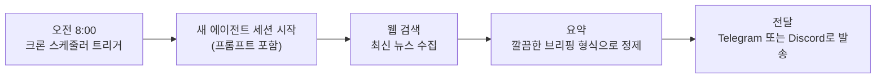
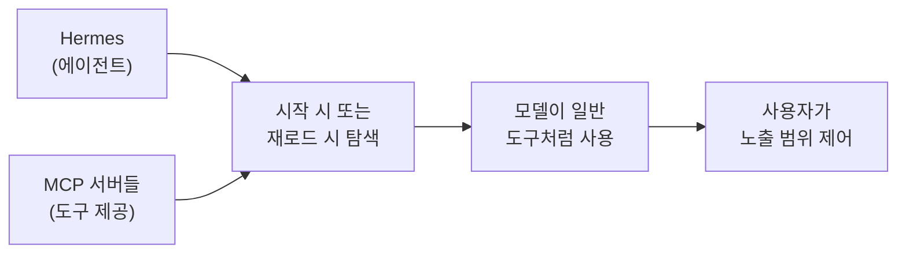
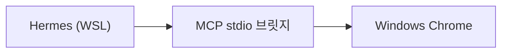

> Nous Research 공식 문서를 바탕으로 작성한 Hermes Agent 심화 활용 가이드입니다.  
> Nous Portal 설정, 실전 팁, 데일리 브리핑 봇 제작, MCP 연동, 스킬 활용까지 다섯 가지 주제를 하나로 통합했습니다.

---

## 목차

1. [Nous Portal로 Hermes 실행하기](#1-nous-portal로-hermes-실행하기)
2. [팁과 모범 사례 (Tips & Best Practices)](#2-팁과-모범-사례-tips--best-practices)
3. [튜토리얼: 데일리 브리핑 봇 만들기](#3-튜토리얼-데일리-브리핑-봇-만들기)
4. [MCP와 Hermes 함께 사용하기](#4-mcp와-hermes-함께-사용하기)
5. [스킬(Skills) 활용하기](#5-스킬skills-활용하기)

---

## 1. Nous Portal로 Hermes 실행하기

### 1-1. 이 가이드의 목적

Nous Portal은 Hermes Agent가 제공하는 구독 기반 통합 서비스입니다. 이 가이드는 구독 가입부터 모든 도구가 Portal을 통해 올바르게 라우팅되는지 검증하는 과정까지 단계별로 안내합니다.

**이 가이드를 따르면 필요 없는 것들**

- OpenAI API 키
- Anthropic API 키
- Firecrawl 계정
- FAL 계정
- Browser Use 계정
- 기타 모든 개별 벤더 크리덴셜

그것이 바로 Portal의 존재 이유입니다.

---

### 1-2. 1단계: 구독 신청

`portal.nousresearch.com/manage-subscription`에 접속해 가입하고 플랜을 선택합니다. 이미 구독 중이라면 2단계로 넘어갑니다.

---

### 1-3. 2단계: 원스톱 설정 실행

```bash
hermes setup --portal
```

이 단 한 줄의 명령이 다섯 가지를 한꺼번에 처리합니다.

1. 브라우저에서 `portal.nousresearch.com`으로 이동해 OAuth 로그인
2. 리프레시 토큰을 `~/.hermes/auth.json`에 저장
3. `~/.hermes/config.yaml`에 `model.provider: nous` 설정
4. 기본 에이전트 모델 선택 (`anthropic/claude-sonnet-4.6` 또는 유사 모델)
5. 웹 검색·이미지 생성·TTS·브라우저 자동화를 위한 Tool Gateway 활성화

명령이 끝나면 바로 채팅을 시작할 수 있는 상태가 됩니다.

**SSH로 원격 서버에 접속 중인 경우**

OAuth는 브라우저가 필요하지만, 로컬 콜백 서버는 Hermes가 실행 중인 기기에서 동작합니다. 두 가지 방법이 있습니다.

```bash
# 방법 A: SSH 포트 포워딩 (권장)
ssh -N -L 8642:127.0.0.1:8642 user@remote-host  # 로컬 터미널에서
hermes setup --portal                            # 원격에서 실행, 로컬 브라우저로 URL 열기

# 방법 B: 수동 붙여넣기 (Cloud Shell, Codespaces, EC2 Instance Connect용)
hermes auth add nous --type oauth --manual-paste
# 이후 `hermes setup --portal` 재실행하여 프로바이더 + 게이트웨이 연결
```

---

### 1-4. 3단계: 작동 검증

```bash
hermes portal status
```

다음과 같이 표시되어야 합니다.

```
  Nous Portal
  ───────────
  Auth:    ✓ logged in
  Portal:  https://portal.nousresearch.com
  Model:   ✓ using Nous as inference provider

  Tool Gateway
  ────────────
  Web search & extract  via Nous Portal
  Image generation      via Nous Portal
  Text-to-speech        via Nous Portal
  Browser automation    via Nous Portal
```

어떤 줄이든 "via Nous Portal" 이외의 내용이 표시되거나 인증이 "not logged in"으로 나온다면 아래 문제 해결 섹션으로 이동합니다.

---

### 1-5. 4단계: 첫 번째 대화 실행

```bash
hermes chat
```

모델과 Tool Gateway를 모두 활용하는 프롬프트로 테스트합니다.

```
"Hermes Agent release notes"를 웹에서 검색하고 상위 3개 결과를 요약해줘.
```

Hermes가 `web_search`(Firecrawl 기반, 게이트웨이 경유)를 호출하고 요약을 반환하면 Portal이 완전히 연결된 것입니다.

---

### 1-6. 5단계: 원하는 모델 선택

`hermes setup --portal` 이후 기본 모델은 범용 모델이지만, 구독의 진짜 가치는 전체 카탈로그 접근에 있습니다. 세션 중에 `/model`로 전환할 수 있습니다.

```bash
/model anthropic/claude-sonnet-4.6     # 최고의 범용 에이전트
/model openai/gpt-5.4                  # 강력한 추론 + 도구 호출
/model google/gemini-2.5-pro           # 거대한 컨텍스트 윈도우
/model deepseek/deepseek-v3.2          # 비용 효율적인 코더
/model anthropic/claude-opus-4.6       # 어려운 문제용 헤비웨이트
```

또는 `/model`만 입력하면 선택 UI가 열립니다. 기본 모델을 영구적으로 변경하려면 다음을 실행합니다.

```bash
hermes config set model.default anthropic/claude-sonnet-4.6
```

> **주의**: Hermes-4-70B와 Hermes-4-405B는 Portal에서 할인 가격으로 제공되지만, 이 모델들은 채팅/추론 모델이지 도구 호출에 최적화된 모델이 아닙니다. 멀티스텝 에이전트 루프에서 어려움을 겪을 수 있습니다. 에이전트 작업에는 위에 나열된 프론티어 에이전트 모델을 사용하세요.

---

### 1-7. 6단계: Tool Gateway 라우팅 커스터마이징 (선택 사항)

게이트웨이는 전체 켜기/끄기가 아니라 도구별로 설정할 수 있습니다. 기존에 Browserbase 계정이 있고 그것을 계속 쓰면서 웹 검색과 이미지 생성만 Nous를 통해 라우팅하고 싶다면 가능합니다.

```bash
hermes tools
# → Web search       → "Nous Subscription"     (권장)
# → Image generation → "Nous Subscription"     (권장)
# → Browser          → "Browserbase"           (기존 키 유지)
# → TTS              → "Nous Subscription"     (권장)
```

도구별 라우팅 현황을 확인하려면 다음을 실행합니다.

```bash
hermes portal tools
```

---

### 1-8. 7단계: 음성 모드 활성화 (선택 사항)

Tool Gateway에 OpenAI TTS가 포함되어 있어 별도 OpenAI 키 없이 음성 모드를 사용할 수 있습니다.

```bash
hermes setup voice
# → TTS로 "Nous Subscription" 선택
# → 음성 인식 백엔드 선택 (로컬 faster-whisper는 무료, 별도 설정 불필요)
```

이후 텔레그램, 디스코드, 시그널 등 메시징 플랫폼에서 음성 메시지를 보내면 Hermes가 전사하고, 응답하고, 합성 음성으로 회신합니다. 모두 Portal 구독 하나로 처리됩니다.

---

### 1-9. 8단계: 크론 + 상시 동작 워크플로우 (선택 사항)

Portal 구독은 크론 작업과 배치 처리에서도 동일하게 작동합니다. OAuth 리프레시 토큰이 자동으로 재사용되므로 추가 설정이 필요 없습니다.

```bash
hermes cron add "Daily AI news summary" "every day at 9am" \
  "Search the web for top AI news and summarize the 5 most important stories"
```

크론 작업이 무인 실행되면서 모델 + 웹 검색 + 요약 모두 Portal 구독을 통해 청구됩니다.

---

### 1-10. 프로파일과 멀티 사용자 설정

Hermes 프로파일(프로젝트별 별도 설정)을 사용하는 경우, Portal 리프레시 토큰은 공유 토큰 저장소를 통해 모든 프로파일에 자동으로 공유됩니다. 한 번 로그인하면 나머지 프로파일이 자동으로 사용합니다.

여러 사람이 한 기기를 공유하는 팀 환경에서는 각 사람이 자신의 Portal 계정을 가져야 합니다. 각 홈 디렉토리의 `~/.hermes/auth.json`이 토큰 경계 역할을 합니다.

---

### 1-11. 문제 해결

**`hermes portal status`에서 "not logged in" 표시**

OAuth 플로우가 완료되지 않은 것입니다. 다시 실행합니다.

```bash
hermes auth add nous --type oauth
```

브라우저가 열리지 않거나 콜백이 실패하는 경우 원격/헤드리스 호스트에 있을 가능성이 높습니다. SSH 포트 포워딩 방법을 사용하세요.

**"Model: currently openrouter" (또는 다른 프로바이더)**

OAuth는 작동했지만 `model.provider`가 다른 프로바이더를 가리키고 있습니다.

```bash
hermes config set model.provider nous
# 또는 대화형으로:
hermes model
```

**Tool Gateway 도구가 파트너 이름으로 표시**

도구별 설정이 게이트웨이를 재정의하고 있습니다.

```bash
hermes tools
# 게이트웨이 라우팅을 원하는 도구에 "Nous Subscription" 선택
```

**세션 중 "재인증 필요" 메시지**

Portal 리프레시 토큰이 무효화됐습니다(비밀번호 변경, 수동 취소, 세션 만료). 토큰이 로컬에 격리되어 Hermes가 무한 재시도하지 않습니다. 다시 로그인합니다.

```bash
hermes auth add nous
```

**처음부터 다시 시작하려면**

```bash
hermes auth remove nous  # 로컬 리프레시 토큰 삭제
# 이후 setup 재실행 또는 Portal 웹 UI에서 구독 제거
```

---

### 1-12. Portal이 주는 것: 숫자로 비교

| Portal 없이 | Portal 있을 때 |
|---|---|
| 1× OpenRouter/Anthropic/OpenAI 키를 `.env`에 | 1× OAuth 리프레시 토큰, `.env` 키 불필요 |
| 1× 웹용 Firecrawl 키 | 게이트웨이를 통한 웹 검색 |
| 1× 이미지 생성용 FAL 키 | 게이트웨이를 통한 이미지 생성 |
| 1× 브라우저용 Browser Use/Browserbase 키 | 게이트웨이를 통한 브라우저 자동화 |
| 1× TTS/음성 모드용 OpenAI 키 | 게이트웨이를 통한 TTS |
| 5개 별도 대시보드, 충전, 인보이스 | 1개 구독, 1개 인보이스 |
| 기기 간 이동 시: 5개 키 모두 복사 | 기기 간 이동 시: 재OAuth 한 번 |

---

## 2. 팁과 모범 사례 (Tips & Best Practices)

### 2-1. 더 좋은 결과를 얻는 방법

**구체적으로 요청하기**

모호한 프롬프트는 모호한 결과를 낳습니다. "코드 고쳐줘" 대신 "api/handlers.py 47번째 줄의 TypeError를 수정해줘 — `process_request()` 함수가 `parse_body()`에서 None을 받고 있어"라고 말하세요. 컨텍스트를 많이 줄수록 반복 횟수가 줄어듭니다.

**컨텍스트를 먼저 제공하기**

파일 경로, 오류 메시지, 기대 동작을 요청 맨 앞에 배치합니다. 잘 작성된 메시지 하나가 세 번의 설명 왕복보다 낫습니다. 에러 트레이스백을 직접 붙여넣으면 에이전트가 파싱할 수 있습니다.

**반복 지침은 컨텍스트 파일 사용**

"탭을 써줘", "pytest를 써", "API는 /api/v2야" 같은 말을 반복하게 된다면 `AGENTS.md` 파일에 넣으세요. 에이전트가 매 세션마다 자동으로 읽으므로 한 번 설정하면 끝입니다.

**에이전트가 도구를 자유롭게 쓰게 두기**

"tests/test_foo.py를 열고, 42번째 줄을 보고, 그런 다음..." 같이 모든 단계를 지시하지 마세요. "실패하는 테스트를 찾아서 고쳐줘"라고 말하면 됩니다. 에이전트에게 파일 검색, 터미널 접근, 코드 실행 권한이 있으니 직접 탐색하고 반복하게 두세요.

**복잡한 워크플로우에는 스킬 활용**

긴 설명 프롬프트를 작성하기 전에 이미 스킬이 있는지 확인하세요. `/skills`로 사용 가능한 스킬을 탐색하거나 `/axolotl`, `/github-pr-workflow`처럼 직접 호출하면 됩니다.

---

### 2-2. CLI 파워 유저 팁

**멀티라인 입력**

`Alt+Enter`, `Ctrl+J`, `Shift+Enter`로 전송 없이 새 줄을 삽입합니다. 모든 터미널에서 `Alt+Enter`와 `Ctrl+J`가 작동합니다.

**붙여넣기 자동 감지**

CLI가 멀티라인 붙여넣기를 자동 감지합니다. 코드 블록이나 에러 트레이스백을 그냥 붙여넣어도 각 줄이 별도 메시지로 전송되지 않습니다.

**중단 후 방향 전환**

에이전트가 응답하는 도중에 `Ctrl+C`를 한 번 눌러 중단하고 새 메시지를 입력해 방향을 바꿀 수 있습니다. 에이전트가 잘못된 방향으로 가기 시작할 때 매우 유용합니다. 2초 내 두 번 누르면 강제 종료됩니다.

**`-c`로 세션 재개**

이전 세션에서 뭔가 빠뜨렸나요? `hermes -c`로 전체 대화 기록이 복원된 상태로 정확히 이어갈 수 있습니다. 제목으로 재개하려면 `hermes -r "my research project"`를 사용합니다.

**클립보드 이미지 붙여넣기**

`Ctrl+V`로 클립보드의 이미지를 채팅에 직접 붙여넣습니다. 에이전트가 비전을 사용해 스크린샷, 다이어그램, 오류 팝업, UI 목업을 분석합니다. 파일로 저장할 필요가 없습니다.

**슬래시 명령어 자동완성**

`/`를 입력하고 `Tab`을 누르면 사용 가능한 모든 명령어가 표시됩니다. 내장 명령어(`/compress`, `/model`, `/title`)와 설치된 모든 스킬이 포함됩니다. 외울 필요가 없습니다.

> `/verbose`로 도구 출력 표시 모드를 순환합니다: `off` → `new` → `all` → `verbose`. "all" 모드는 에이전트 동작을 관찰하기에 좋고, "off"는 단순 Q&A에 깔끔합니다.

---

### 2-3. 컨텍스트 파일 활용

**AGENTS.md: 프로젝트의 두뇌**

프로젝트 루트에 `AGENTS.md`를 만들고 아키텍처 결정, 코딩 규칙, 프로젝트별 지침을 넣으세요. 매 세션에 자동으로 주입되므로 에이전트가 항상 프로젝트 규칙을 알고 있습니다.

```markdown
# 프로젝트 컨텍스트
- 이 프로젝트는 SQLAlchemy ORM을 사용하는 FastAPI 백엔드
- 데이터베이스 작업에는 항상 async/await 사용
- 테스트는 tests/ 폴더에 넣고 pytest-asyncio 사용
- .env 파일은 절대 커밋하지 않음
```

**SOUL.md: 성격 커스터마이징**

Hermes의 기본 어조를 안정적으로 설정하려면 `~/.hermes/SOUL.md`를 편집합니다.

```markdown
# Soul
당신은 시니어 백엔드 엔지니어입니다. 간결하고 직접적으로 말하세요.
요청받지 않으면 설명을 건너뛰세요. 장황한 해결책보다 원라이너를 선호합니다.
항상 에러 처리와 엣지 케이스를 고려하세요.
```

`SOUL.md`는 지속적인 성격을 위해, `AGENTS.md`는 프로젝트별 지침을 위해 사용합니다.

**.cursorrules 호환성**

`.cursorrules`나 `.cursor/rules/*.mdc` 파일이 이미 있다면 Hermes가 그 파일도 읽습니다. 코딩 규칙을 중복으로 작성할 필요가 없습니다.

**발견 방식**

Hermes는 세션 시작 시 현재 작업 디렉토리의 최상위 `AGENTS.md`를 로드합니다. 하위 디렉토리의 `AGENTS.md`는 도구 호출 중 지연 발견되어 도구 결과에 주입됩니다.

> 컨텍스트 파일은 간결하게 유지하세요. 모든 메시지에 주입되므로 모든 글자가 토큰 예산에서 차감됩니다.

---

### 2-4. 메모리와 스킬

**메모리 vs. 스킬: 무엇이 어디에 속하나**

메모리는 사실을 위한 것입니다. 사용자의 환경, 선호도, 프로젝트 위치, 에이전트가 사용자에 대해 학습한 것들입니다. 스킬은 절차를 위한 것입니다. 멀티스텝 워크플로우, 도구별 지침, 재사용 가능한 레시피입니다. 메모리는 "무엇"을 위해, 스킬은 "어떻게"를 위해 사용합니다.

**스킬을 만들어야 할 때**

5단계 이상이 필요한 작업을 반복하게 된다면 에이전트에게 스킬로 저장하라고 요청하세요. "방금 한 것을 deploy-staging이라는 스킬로 저장해줘"라고 말하면 됩니다. 다음에는 `/deploy-staging`만 입력하면 전체 절차가 로드됩니다.

**메모리 용량 관리**

메모리는 의도적으로 제한되어 있습니다(`MEMORY.md` 약 2,200자, `USER.md` 약 1,375자). 가득 차면 에이전트가 항목을 통합합니다. "메모리 정리해줘" 또는 "오래된 Python 3.9 메모를 지워줘 — 지금 3.12야"라고 말해 도움을 줄 수 있습니다.

> **주의**: 메모리는 고정 스냅샷입니다. 세션 중에 변경된 내용은 다음 세션이 시작될 때까지 시스템 프롬프트에 반영되지 않습니다. 에이전트가 디스크에 즉시 쓰지만, 프롬프트 캐시는 세션 중에 무효화되지 않습니다.

---

### 2-5. 성능과 비용 절감

**프롬프트 캐시 깨지 않기**

대부분의 LLM 프로바이더는 시스템 프롬프트 프리픽스를 캐싱합니다. 컨텍스트 파일과 메모리를 동일하게 유지하면 후속 메시지에서 캐시 히트가 발생해 비용이 크게 절감됩니다. 세션 중 모델이나 시스템 프롬프트를 변경하지 마세요.

**한계 도달 전 `/compress` 실행**

응답이 느려지거나 잘리기 시작하면 `/compress`를 실행하세요. 대화 기록을 요약해 핵심 컨텍스트를 보존하면서 토큰 수를 크게 줄입니다. 현재 상태를 확인하려면 `/usage`를 사용합니다.

**병렬 작업에 위임 활용**

세 가지 주제를 동시에 조사해야 하나요? 에이전트에게 병렬 서브태스크로 `delegate_task`를 사용하라고 요청하세요. 각 서브에이전트가 독립적으로 실행되고 최종 요약만 돌아오므로 메인 대화의 토큰 사용량이 크게 줄어듭니다.

**배치 작업에는 `execute_code` 사용**

터미널 명령을 하나씩 실행하는 대신, 모든 것을 한꺼번에 처리하는 스크립트를 작성하게 합니다. "모든 .jpeg 파일을 .jpg로 이름 바꾸는 Python 스크립트를 작성하고 실행해줘"가 개별 이름 변경보다 빠르고 저렴합니다.

> `/usage`로 정기적으로 토큰 소비를 확인하고, `/insights`로 최근 30일간의 사용 패턴을 확인합니다.

---

### 2-6. 메시징 팁

**홈 채널 설정**

선호하는 텔레그램이나 디스코드 채팅에서 `/sethome`을 사용해 홈 채널로 지정하세요. 크론 작업 결과와 예약 작업 출력이 여기로 전달됩니다. 설정하지 않으면 에이전트가 능동적 메시지를 보낼 곳이 없습니다.

**`/title`로 세션 정리**

`/title auth-refactor` 또는 `/title research-llm-quantization`으로 세션 이름을 지정하세요. 이름 있는 세션은 `hermes sessions list`로 쉽게 찾고 `hermes -r "auth-refactor"`로 재개할 수 있습니다.

**팀 접근을 위한 DM 페어링**

허용 목록에 사용자 ID를 수동으로 수집하는 대신 DM 페어링을 활성화하세요. 팀원이 봇에 DM을 보내면 일회용 페어링 코드를 받고, 관리자가 `hermes pairing approve telegram XKGH5N7P`로 승인하면 됩니다.

---

### 2-7. 보안 팁

**신뢰할 수 없는 코드에는 Docker 사용**

신뢰할 수 없는 저장소나 낯선 코드를 실행할 때는 Docker나 Daytona를 터미널 백엔드로 사용하세요.

```ini
# .env 파일에:
TERMINAL_BACKEND=docker
TERMINAL_DOCKER_IMAGE=hermes-sandbox:latest
```

컨테이너 안의 파괴적 명령이 호스트 시스템을 해칠 수 없습니다.

**Windows 인코딩 함정 피하기**

Windows에서 일부 기본 인코딩(cp125x 등)은 모든 유니코드 문자를 표현하지 못합니다. 파일을 열 때 명시적인 UTF-8 인코딩을 사용하세요.

```python
with open("results.txt", "w", encoding="utf-8") as f:
    f.write("✓ All good\n")
```

**"항상" 선택 전 신중하게 생각하기**

에이전트가 위험한 명령어(`rm -rf`, `DROP TABLE` 등) 승인을 요청할 때 네 가지 옵션이 있습니다: 한 번, 세션, 항상, 거부. "항상"은 해당 패턴을 영구적으로 허용 목록에 추가하므로 편안해질 때까지 "세션"으로 시작하세요.

**메시징 봇에는 허용 목록 사용**

터미널 접근이 있는 봇에 절대 `GATEWAY_ALLOW_ALL_USERS=true`를 설정하지 마세요. 플랫폼별 허용 목록이나 DM 페어링을 사용해 에이전트와 상호작용할 수 있는 사람을 제어합니다.

```ini
# 권장: 플랫폼별 명시적 허용 목록
TELEGRAM_ALLOWED_USERS=123456789,987654321
DISCORD_ALLOWED_USERS=123456789012345678
```

---

## 3. 튜토리얼: 데일리 브리핑 봇 만들기

### 3-1. 만들 것

매일 아침 깨어나 관심 있는 주제를 조사하고, 내용을 요약해 텔레그램이나 디스코드로 간결한 브리핑을 전달하는 개인 브리핑 봇을 만듭니다. 코드를 전혀 작성하지 않아도 됩니다.

전체 흐름은 이렇습니다.



---

### 3-2. 사전 준비

- Hermes Agent 설치 완료
- 게이트웨이 실행 중 (크론 실행을 위해 게이트웨이 데몬이 필요합니다)

```bash
hermes gateway install           # 사용자 서비스로 설치
sudo hermes gateway install --system  # Linux 서버: 부팅 시 자동 시작 시스템 서비스
# 또는
hermes gateway                   # 포그라운드에서 실행
```

- Firecrawl API 키: 웹 검색을 위해 환경변수에 `FIRECRAWL_API_KEY` 설정
- 메시징 설정 (선택 사항): 텔레그램 또는 디스코드에 홈 채널 설정

> **메시징 없어도 가능합니다**: `deliver: "local"`을 사용하면 브리핑이 `~/.hermes/cron/output/`에 저장되고 언제든 읽을 수 있습니다.

---

### 3-3. 1단계: 워크플로우 수동 테스트

자동화하기 전에 브리핑이 잘 동작하는지 먼저 확인합니다.

```bash
hermes
```

다음 프롬프트를 입력합니다.

```
AI 에이전트와 오픈소스 LLM에 관한 최신 뉴스를 검색해줘.
상위 3개 기사를 링크와 함께 간결한 브리핑 형식으로 요약해줘.
```

다음과 비슷한 결과가 나오면 자동화할 준비가 된 것입니다.

```
☀️ 오늘의 AI 브리핑 — 2026년 3월 8일

1. Qwen 3 출시, 2,350억 파라미터
   알리바바의 최신 오픈웨이트 모델이 완전 오픈소스를 유지하면서
   여러 벤치마크에서 GPT-4.5에 필적하는 성능 기록
   → https://qwenlm.github.io/blog/qwen3/

2. LangChain, Agent Protocol 표준 출시
   에이전트 간 통신을 위한 새 오픈 표준이 첫 주에
   15개 주요 프레임워크에서 채택
   → https://blog.langchain.dev/agent-protocol/

---
3개 기사 • 검색한 소스: 8개 • Hermes Agent 생성
```

마음에 드는 형식이 나올 때까지 프롬프트를 반복합니다. 이모지 헤더, 2줄 이내 요약 등 원하는 스타일을 지정하세요. 최종 프롬프트가 크론 작업에 들어갑니다.

---

### 3-4. 2단계: 크론 작업 생성

**방법 A: 자연어로 채팅에서 생성**

```
매일 아침 8시에 AI 에이전트와 오픈소스 LLM에 관한 최신 뉴스를 검색해줘.
상위 3개 기사를 링크와 함께 간결한 브리핑 형식으로 요약하고 텔레그램으로 전달해줘.
```

Hermes가 자동으로 크론 작업을 생성합니다.

**방법 B: CLI 슬래시 명령어 사용**

```bash
/cron add "0 8 * * *" "AI 에이전트와 오픈소스 LLM에 관한 최신 뉴스를 검색해줘. 지난 24시간 이내의 기사 최소 5개를 찾아줘. 가장 중요한 상위 3개 기사를 간결한 데일리 브리핑 형식으로 요약해줘. 각 기사에는 명확한 헤드라인, 2문장 요약, 소스 URL을 포함해줘. 친근하고 전문적인 어조를 사용하고 이모지 글머리 기호로 형식을 맞춰줘."
```

---

### 3-5. 황금 규칙: 자체 완결형 프롬프트

> **핵심 개념**: 크론 작업은 완전히 새로운 세션에서 실행됩니다. 이전 대화를 기억하지 못하고, "이전에 설정한 것"에 대한 컨텍스트가 없습니다. 프롬프트 안에 에이전트가 작업을 수행하는 데 필요한 모든 것이 포함되어 있어야 합니다.

**나쁜 프롬프트:**

```
평소처럼 아침 브리핑 해줘.
```

**좋은 프롬프트:**

```
AI 에이전트와 오픈소스 LLM에 관한 최신 뉴스를 검색해줘.
지난 24시간 이내의 기사 최소 5개를 찾아줘.
가장 중요한 상위 3개 기사를 간결한 데일리 브리핑 형식으로 요약해줘.
각 기사에는 명확한 헤드라인, 2문장 요약, 소스 URL을 포함해줘.
친근하고 전문적인 어조를 사용하고 이모지 글머리 기호로 형식을 맞춰줘.
```

좋은 프롬프트는 검색 대상, 기사 수, 형식, 어조를 모두 명시합니다.

---

### 3-6. 3단계: 브리핑 커스터마이징

**멀티 토픽 브리핑**

여러 분야를 하나의 브리핑으로 다룹니다.

```
아침 브리핑을 세 가지 주제로 만들어줘. 각 주제에 대해 지난 24시간의 최신 뉴스를 검색하고 링크와 함께 상위 2개 기사를 요약해줘.

주제:
1. AI와 머신러닝 — 오픈소스 모델과 에이전트 프레임워크 중심
2. 암호화폐 — 비트코인, 이더리움, 규제 뉴스 중심
3. 우주 탐사 — SpaceX, NASA, 민간 우주 중심

섹션 헤더와 이모지가 있는 깔끔한 브리핑으로 형식을 맞추고
오늘 날짜와 동기부여 명언으로 마무리해줘.
```

**병렬 리서치를 위한 위임 활용**

더 빠른 브리핑을 원한다면 각 주제를 서브에이전트에게 위임합니다.

```
서브에이전트에게 리서치를 위임해서 아침 브리핑을 만들어줘.
세 가지 병렬 작업을 위임해:

1. 위임: 지난 24시간의 AI/ML 상위 2개 기사와 링크 검색
2. 위임: 지난 24시간의 암호화폐 상위 2개 기사와 링크 검색
3. 위임: 지난 24시간의 우주 탐사 상위 2개 기사와 링크 검색

모든 결과를 모아 섹션 헤더, 이모지 형식, 소스 링크가 있는 하나의 깔끔한 브리핑으로 합쳐줘. 헤더에 오늘 날짜를 추가해줘.
```

각 서브에이전트가 독립적으로 동시에 검색하고, 메인 에이전트가 모아 완성된 브리핑을 만듭니다.

**평일만 실행**

주말 브리핑이 필요 없다면 월~금 타겟 크론 표현식을 사용합니다.

```bash
/cron add "0 8 * * 1-5" "AI와 기술 최신 뉴스 검색..."
```

**하루 두 번 브리핑**

```bash
/cron add "0 8 * * *"  "아침 브리핑: 지난 12시간의 AI 뉴스 검색..."
/cron add "0 18 * * *" "저녁 요약: 지난 12시간의 AI 뉴스 검색..."
```

**메모리로 개인 컨텍스트 추가**

크론 작업은 대화 메모리 없이 새 세션에서 실행되므로, 개인 컨텍스트는 프롬프트에 직접 포함해야 합니다.

```
당신은 EU의 AI 규제, PyTorch 생태계, 트랜스포머 아키텍처, 오픈웨이트 모델에 관심 있는 시니어 ML 엔지니어를 위한 브리핑을 만들고 있습니다. 오픈소스와 관련 없는 제품 출시나 펀딩 라운드 기사는 건너뛰세요.

이 주제들의 최신 뉴스를 검색하고, 링크와 함께 상위 3개 기사를 요약해줘. 간결하고 기술적으로 — 이 독자는 기본 설명이 필요 없어요.
```

> 브리핑이 누구를 위한 것인지 포함하면 관련성이 크게 향상됩니다. 직책, 관심사, 건너뛸 내용을 알려주세요.

---

### 3-7. 4단계: 작업 관리

**예약된 작업 목록 보기**

```bash
/cron list
# 또는
hermes cron list
```

**작업 삭제**

```bash
/cron remove a1b2c3d4
# 또는 대화형으로:
# 내 아침 브리핑 크론 작업을 삭제해줘.
```

**게이트웨이 상태 확인**

```bash
hermes cron status
```

게이트웨이가 실행 중이 아니면 작업이 실행되지 않습니다. 안정적인 실행을 위해 백그라운드 서비스로 설치합니다.

```bash
hermes gateway install
# 또는 Linux 서버의 경우
sudo hermes gateway install --system
```

---

### 3-8. 더 나아가기

데일리 브리핑 봇 패턴은 무엇이든 응용할 수 있습니다.

- 경쟁사 모니터링
- GitHub 저장소 요약
- 날씨 예보
- 포트폴리오 추적
- 서버 상태 점검
- 일일 조크

프롬프트로 설명할 수 있는 것이라면 스케줄링할 수 있습니다.

---

## 4. MCP와 Hermes 함께 사용하기

### 4-1. MCP를 언제 사용해야 하나

**MCP를 사용해야 할 때**

- 이미 MCP 형태로 존재하는 도구가 있고 Hermes 네이티브 도구를 따로 만들지 않으려는 경우
- Hermes가 깔끔한 RPC 레이어를 통해 로컬 또는 원격 시스템을 조작하게 하려는 경우
- 세밀한 서버별 노출 제어가 필요한 경우
- Hermes 코어를 수정하지 않고 내부 API, 데이터베이스, 사내 시스템을 연결하려는 경우

**MCP를 사용하지 말아야 할 때**

- 이미 있는 Hermes 내장 도구가 잘 해결하는 경우
- 서버가 많은 위험한 도구를 노출하고 필터링 준비가 안 된 경우
- 매우 좁은 통합 하나만 필요하고 네이티브 도구가 더 간단하고 안전한 경우

**MCP 사고 모델**

MCP는 어댑터 레이어입니다.



좋은 MCP 활용은 "모든 것을 연결"이 아닙니다. "올바른 것을, 최소한의 유용한 범위로 연결"하는 것입니다.

---

### 4-2. MCP 지원 설치

표준 설치 스크립트로 설치했다면 MCP 지원이 이미 포함되어 있습니다.

```bash
# 추가 설치가 필요한 경우
cd ~/.hermes/hermes-agent
uv pip install -e ".[mcp]"
```

npm 기반 서버를 위해 Node.js와 npx가 필요합니다.

---

### 4-3. 첫 번째 서버 추가: 안전한 것부터 시작

하나의 서버부터 시작합니다. 예시: 하나의 프로젝트 디렉토리에만 파일 시스템 접근 허용.

```yaml
# ~/.hermes/config.yaml
mcp_servers:
  project_fs:
    command: "npx"
    args: ["-y", "@modelcontextprotocol/server-filesystem", "/home/user/my-project"]
```

Hermes를 시작하고 구체적인 것을 요청합니다.

```
이 프로젝트를 점검하고 저장소 레이아웃을 요약해줘.
```

---

### 4-4. MCP 로드 확인

```bash
# 로드된 MCP 도구 확인
# 채팅에서:
지금 사용 가능한 MCP 기반 도구가 무엇인지 알려줘.

# 설정 변경 후 재로드
/reload-mcp
```

---

### 4-5. 즉시 필터링 시작하기

서버가 많은 도구를 노출한다면 나중으로 미루지 말고 즉시 필터링합니다.

**허용 목록으로 원하는 것만 사용:**

```yaml
mcp_servers:
  github:
    command: "npx"
    args: ["-y", "@modelcontextprotocol/server-github"]
    env:
      GITHUB_PERSONAL_ACCESS_TOKEN: "ghp_xxx"
    tools:
      include: [list_issues, create_issue, search_code]
```

민감한 시스템에는 일반적으로 이것이 최선의 기본값입니다.

**위험한 액션 제외:**

```yaml
mcp_servers:
  stripe:
    url: "https://mcp.stripe.com"
    headers:
      Authorization: "Bearer ***"
    tools:
      exclude: [delete_customer, refund_payment]
```

**유틸리티 래퍼 비활성화:**

```yaml
mcp_servers:
  docs:
    url: "https://mcp.docs.example.com"
    tools:
      prompts: false
      resources: false
```

---

### 4-6. 필터링이 실제로 영향을 미치는 것

MCP 노출 기능에는 두 가지 카테고리가 있습니다.

**서버 네이티브 MCP 도구**: `tools.include`, `tools.exclude`로 필터링

**Hermes 추가 유틸리티 래퍼**: `tools.resources`, `tools.prompts`로 필터링

유틸리티 래퍼 종류:
- 리소스: `list_resources`, `read_resource`
- 프롬프트: `list_prompts`, `get_prompt`

이 래퍼들은 설정에서 허용하고 MCP 서버 세션이 해당 기능을 실제로 지원할 때만 표시됩니다.

---

### 4-7. 실용적인 패턴 4가지

**패턴 1: 로컬 프로젝트 어시스턴트**

```yaml
mcp_servers:
  fs:
    command: "npx"
    args: ["-y", "@modelcontextprotocol/server-filesystem", "/home/user/project"]

  git:
    command: "uvx"
    args: ["mcp-server-git", "--repository", "/home/user/project"]
```

유용한 프롬프트:
```
프로젝트 구조를 검토하고 설정 파일이 어디에 있는지 찾아줘.
로컬 git 상태를 확인하고 최근 변경 사항을 요약해줘.
```

**패턴 2: GitHub 트리아지 어시스턴트**

```yaml
mcp_servers:
  github:
    command: "npx"
    args: ["-y", "@modelcontextprotocol/server-github"]
    env:
      GITHUB_PERSONAL_ACCESS_TOKEN: "ghp_xxx"
    tools:
      include: [list_issues, create_issue, update_issue, search_code]
      prompts: false
      resources: false
```

유용한 프롬프트:
```
MCP에 관한 오픈 이슈를 나열하고, 주제별로 묶어서 가장 흔한 버그에 대한 고품질 이슈를 작성해줘.
```

**패턴 3: 내부 API 어시스턴트**

```yaml
mcp_servers:
  internal_api:
    url: "https://mcp.internal.example.com"
    headers:
      Authorization: "Bearer ***"
    tools:
      include: [list_customers, get_customer, list_invoices]
      resources: false
      prompts: false
```

내부 API처럼 민감한 시스템에는 제외 목록보다 허용 목록이 훨씬 안전합니다.

**패턴 4: 문서/지식 서버**

```yaml
mcp_servers:
  docs:
    url: "https://mcp.docs.example.com"
    tools:
      prompts: true
      resources: true
```

---

### 4-8. WSL2: WSL의 Hermes를 Windows Chrome에 연결하기

다음 상황에서 유용한 설정입니다.

- Hermes가 WSL2 내에서 실행 중
- 제어하려는 브라우저가 Windows의 로그인된 Chrome
- WSL에서 `/browser connect`가 불안정하거나 불편한 경우

이 설정에서 Hermes는 Chrome에 직접 연결하지 않습니다. 대신 Hermes가 WSL에서 로컬 stdio MCP 서버를 시작하고, 그 서버가 Windows interop을 통해 실행되어 라이브 Windows Chrome 세션에 연결됩니다.



이 방식의 장점: 실제 Windows 브라우저 프로파일, 쿠키, 로그인 상태를 유지하면서 Hermes는 지원되는 Unix 환경(WSL2)에서 실행됩니다.

```bash
# Windows Chrome에 원격 디버깅이 활성화된 경우 WSL에서 추가:
hermes mcp add chrome-devtools-win --command cmd.exe --args /c npx -y chrome-devtools-mcp@latest --autoConnect --no-usage-statistics

# 연결 테스트
hermes mcp test chrome-devtools-win

# 새 Hermes 세션 시작 또는:
/reload-mcp
```

**알려진 주의사항**

- Windows stdio 실행 파일을 MCP로 사용할 때 `/mnt/c/Users/...` 같은 Windows 마운트 경로에서 Hermes를 시작해야 합니다.
- `/root`나 `/home/...`에서 시작하면 Windows가 UNC 현재 디렉토리 경고를 출력할 수 있습니다.
- `chrome-devtools-mcp --autoConnect`가 타임아웃된다면 Chrome의 백그라운드/동결된 탭을 줄이고 재시도합니다.

---

### 4-9. 단계적 설정 튜토리얼

**1단계: 좁은 허용 목록으로 GitHub MCP 추가**

```yaml
mcp_servers:
  github:
    command: "npx"
    args: ["-y", "@modelcontextprotocol/server-github"]
    env:
      GITHUB_PERSONAL_ACCESS_TOKEN: "ghp_xxx"
    tools:
      include: [list_issues, create_issue, search_code]
      prompts: false
      resources: false
```

**2단계: 필요할 때만 확장**

이슈 업데이트도 필요해지면 허용 목록에 추가합니다.

```yaml
tools:
  include: [list_issues, create_issue, update_issue, search_code]
```

이후 재로드합니다.

```bash
/reload-mcp
```

**3단계: 다른 정책의 두 번째 서버 추가**

```yaml
mcp_servers:
  github:
    # ... (위와 동일)

  filesystem:
    command: "npx"
    args: ["-y", "@modelcontextprotocol/server-filesystem", "/home/user/project"]
```

이제 Hermes가 두 시스템을 결합할 수 있습니다.

```
로컬 프로젝트 파일을 점검한 다음, 찾은 버그를 요약하는 GitHub 이슈를 생성해줘.
```

멀티 시스템 워크플로우를 Hermes 코어 변경 없이 구현하는 것, 이것이 MCP가 강력한 이유입니다.

---

### 4-10. 문제 해결

| 증상 | 가능한 원인 |
|---|---|
| 서버는 연결되지만 예상한 도구가 없음 | `tools.include`로 필터됨, `tools.exclude`로 제외됨, 리소스/프롬프트 비활성화, 서버가 실제로 해당 기능 미지원 |
| 서버가 설정되었지만 아무것도 로드 안 됨 | `enabled: false` 설정, 실행 파일 없음(npx, uvx), HTTP 엔드포인트 접근 불가, 인증 설정 오류 |
| MCP 서버가 광고하는 것보다 도구가 적음 | Hermes가 서버별 정책과 기능 인식 등록을 따르기 때문. 의도된 동작이며 일반적으로 바람직합니다. |

**설정을 지우지 않고 서버 비활성화:**

```yaml
enabled: false
```

---

### 4-11. 안전한 사용 권장사항

- **위험한 시스템에는 허용 목록 우선**: 금융, 고객 대면, 파괴적 시스템에는 `tools.include`를 사용하고 최소 집합으로 시작합니다.
- **미사용 유틸리티 비활성화**: 모델이 서버 제공 리소스/프롬프트를 탐색하지 않기를 원한다면 `resources: false`, `prompts: false`로 설정합니다.
- **서버 범위를 좁게 유지**: 파일 시스템 서버는 홈 디렉토리 전체가 아닌 하나의 프로젝트 디렉토리에만 루팅합니다.
- **설정 변경 후 재로드**: `tools.include/exclude`, `enabled`, 리소스/프롬프트 토글, 인증 헤더/환경변수 변경 후에는 반드시 `/reload-mcp`를 실행합니다.

---

## 5. 스킬(Skills) 활용하기

### 5-1. 스킬이란 무엇인가

스킬은 Hermes에게 특정 작업을 처리하는 방법을 가르치는 온디맨드 지식 문서입니다. ASCII 아트 생성부터 GitHub PR 관리까지 다양합니다. 스킬은 실제로 필요할 때까지 토큰을 소비하지 않는 효율적인 구조를 가집니다.

**스킬 로딩의 점진적 공개 방식**

에이전트가 모든 것을 한꺼번에 로드하지 않습니다.

1. `skills_list()` — 모든 스킬의 간결한 목록 (~3K 토큰). 세션 시작 시 로드됩니다.
2. `skill_view(name)` — 하나의 스킬에 대한 전체 `SKILL.md` 내용. 에이전트가 필요하다고 판단할 때 로드됩니다.
3. `skill_view(name, file_path)` — 스킬 내의 특정 참조 파일. 필요할 때만 로드됩니다.

즉, 스킬은 실제로 사용될 때까지 토큰을 소비하지 않습니다.

---

### 5-2. 스킬 찾기

```bash
# 채팅 세션에서
/skills

# CLI에서
hermes skills list
```

출력 예시:

```
ascii-art         pyfiglet, cowsay, boxes를 사용한 ASCII 아트 생성...
arxiv             arXiv에서 학술 논문 검색 및 조회...
github-pr-workflow  브랜치 생성, 커밋, PR 생성까지 전체 PR 생명주기...
plan              컨텍스트 점검 후 마크다운 계획 작성...
excalidraw        Excalidraw를 사용한 손그림 스타일 다이어그램 생성...
```

**키워드로 검색:**

```bash
/skills search docker
/skills search music
```

**스킬 허브(공식 선택적 스킬) 탐색:**

```bash
/skills browse
/skills search blockchain
```

---

### 5-3. 스킬 사용하기

설치된 모든 스킬은 자동으로 슬래시 명령어가 됩니다.

```bash
/ascii-art "HELLO WORLD"이라는 배너 만들어줘
/plan todo 앱을 위한 REST API 설계해줘
/github-pr-workflow auth 리팩토링 PR 생성해줘

# 스킬 이름만 입력하면 무엇이 필요한지 설명하게 됩니다
/excalidraw
```

자연스러운 대화로도 스킬을 활성화할 수 있습니다. Hermes에게 특정 스킬을 사용하라고 요청하면 `skill_view` 도구를 통해 로드합니다.

---

### 5-4. 허브에서 설치하기

공식 선택적 스킬은 Hermes와 함께 배송되지만 기본적으로 활성화되어 있지 않습니다.

```bash
# 공식 선택적 스킬 설치
hermes skills install official/research/arxiv

# 채팅 세션에서 허브를 통해 설치
/skills install official/creative/songwriting-and-ai-music

# HTTP(S) URL에서 단일 파일 SKILL.md 직접 설치
hermes skills install https://example.com/SKILL.md --name my-skill
```

설치 후: 스킬 디렉토리가 `~/.hermes/skills/`에 복사되고, `skills_list` 출력에 표시되며, 슬래시 명령어로 사용 가능합니다.

> 설치된 스킬은 새 세션에서 적용됩니다. 현재 세션에서 즉시 사용하려면 `/reset`으로 새로 시작하거나 `--now`를 추가해 프롬프트 캐시를 즉시 무효화합니다(다음 차례에 토큰이 더 소비됩니다).

---

### 5-5. 나만의 스킬 만들기

스킬은 YAML 프론트매터가 있는 마크다운 파일입니다. 5분이면 만들 수 있습니다.

**1단계: 디렉토리 생성**

```bash
mkdir -p ~/.hermes/skills/my-category/my-skill
```

**2단계: SKILL.md 작성**

```markdown
---
name: my-skill
description: 이 스킬이 하는 일에 대한 간략한 설명
version: 1.0.0
metadata:
  hermes:
    tags: [my-tag, automation]
    category: my-category
---

# My Skill

## 언제 사용하나
사용자가 [특정 주제]에 대해 묻거나 [특정 작업]이 필요할 때 이 스킬을 사용합니다.

## 절차
1. 먼저 [전제 조건]이 사용 가능한지 확인
2. `command --with-flags` 실행
3. 출력을 파싱하고 결과 표시

## 함정
- 일반적인 실패: [설명]. 해결: [해결책]
- 주의해야 할 것: [엣지 케이스]

## 검증
`check-command`를 실행해 결과가 올바른지 확인합니다.
```

**3단계: 참조 파일 추가 (선택 사항)**

스킬은 에이전트가 필요 시 로드하는 지원 파일을 포함할 수 있습니다.

```
my-skill/
├── SKILL.md                    # 메인 스킬 문서
├── references/
│   ├── api-docs.md             # API 참조
│   └── examples.md             # 예시 입력/출력
├── templates/
│   └── config.yaml             # 에이전트가 사용할 템플릿
└── scripts/
    └── setup.sh                # 에이전트가 실행할 스크립트
```

SKILL.md에서 참조합니다.

```markdown
API 세부사항은 다음 참조를 로드하세요: `skill_view("my-skill", "references/api-docs.md")`
```

**4단계: 테스트**

```bash
hermes chat -q "/my-skill 해당 작업 도와줘"
```

등록이 필요 없습니다. `~/.hermes/skills/`에 넣기만 하면 바로 사용 가능합니다.

---

### 5-6. 플랫폼별 스킬 관리

어떤 플랫폼에서 어떤 스킬을 사용할 수 있는지 제어합니다.

```bash
hermes skills
```

대화형 TUI가 열려 플랫폼별(CLI, 텔레그램, 디스코드 등)로 스킬을 활성화/비활성화할 수 있습니다. 예를 들어 개발 스킬을 텔레그램에서 끄고 싶을 때 유용합니다.

---

### 5-7. 스킬 vs 메모리 비교

두 가지 모두 세션 간에 지속되지만 서로 다른 목적을 위해 존재합니다.

| | 스킬 | 메모리 |
|---|---|---|
| **무엇** | 절차 지식 — 어떻게 하는지 | 사실 지식 — 무엇이 있는지 |
| **언제** | 온디맨드 로드, 관련될 때만 | 매 세션 자동 주입 |
| **크기** | 클 수 있음 (수백 줄) | 간결해야 함 (핵심 사실만) |
| **비용** | 로드될 때까지 0 토큰 | 작지만 지속적인 토큰 비용 |
| **예시** | "Kubernetes에 배포하는 방법" | "사용자는 다크모드를 선호하고 PST에 거주" |
| **생성자** | 사용자, 에이전트, 또는 허브에서 설치 | 에이전트가 대화를 기반으로 생성 |

**원칙**: 참조 문서에 넣을 내용이라면 스킬, 포스트잇에 쓸 내용이라면 메모리입니다.

---

### 5-8. 스킬 관련 팁

**스킬은 집중적으로 만들기**

"전체 DevOps"를 다루는 스킬은 너무 길고 모호합니다. "Fly.io에 Python 앱 배포하기"처럼 구체적인 스킬이 진정으로 유용합니다.

**에이전트가 스킬을 만들게 하기**

복잡한 멀티스텝 작업 후 Hermes가 종종 스킬로 저장하겠다고 제안합니다. 수락하세요. 에이전트가 작성한 스킬에는 과정에서 발견된 함정을 포함한 정확한 워크플로우가 담겨 있습니다.

**카테고리 활용**

스킬을 하위 디렉토리로 정리합니다(`~/.hermes/skills/devops/`, `~/.hermes/skills/research/`). 목록을 관리하기 쉽고 에이전트가 관련 스킬을 더 빨리 찾을 수 있습니다.

**오래된 스킬 업데이트하기**

스킬을 사용하다 다루지 않은 문제가 생기면 Hermes에게 배운 것을 반영해 스킬을 업데이트하라고 하세요. 유지 관리되지 않는 스킬은 나중에 방해가 됩니다.

---

*작성일: 2026년 5월 24일*  
*참고: Nous Research 공식 Hermes Agent 문서 (hermes-agent.nousresearch.com) — Run with Nous Portal, Tips & Best Practices, Daily Briefing Bot Tutorial, Use MCP with Hermes, Working with Skills*

- [Run Hermes Agent with Nous Portal](https://hermes-agent.nousresearch.com/docs/guides/run-hermes-with-nous-portal)
- [Tips & Best Practices](https://hermes-agent.nousresearch.com/docs/guides/tips)
- [Tutorial: Build a Daily Briefing Bot](https://hermes-agent.nousresearch.com/docs/guides/daily-briefing-bot)
- [Use MCP with Hermes](https://hermes-agent.nousresearch.com/docs/guides/use-mcp-with-hermes)
- [Working with Skills](https://hermes-agent.nousresearch.com/docs/guides/work-with-skills)
