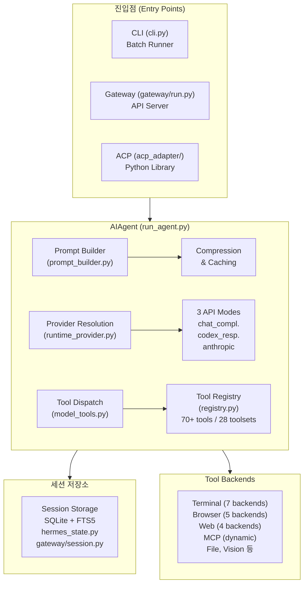
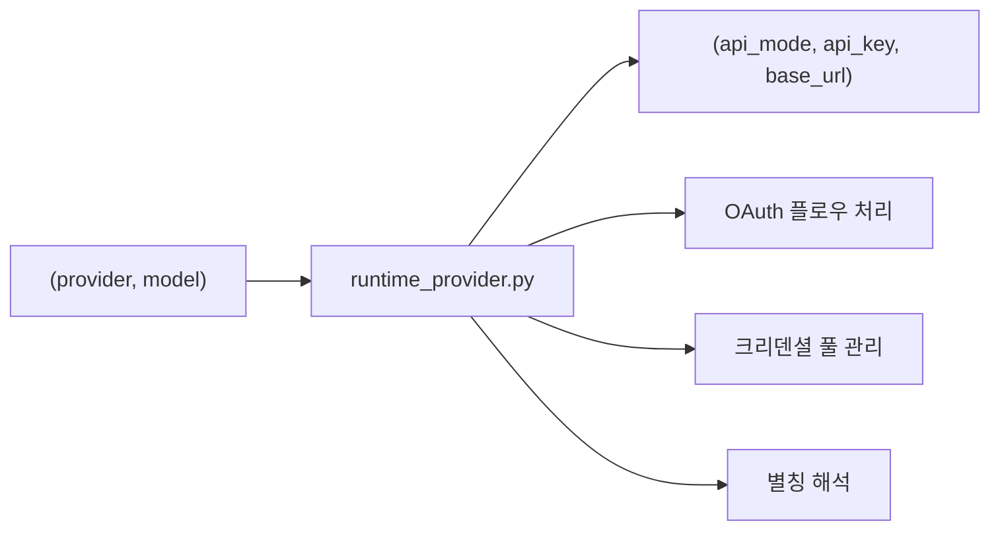
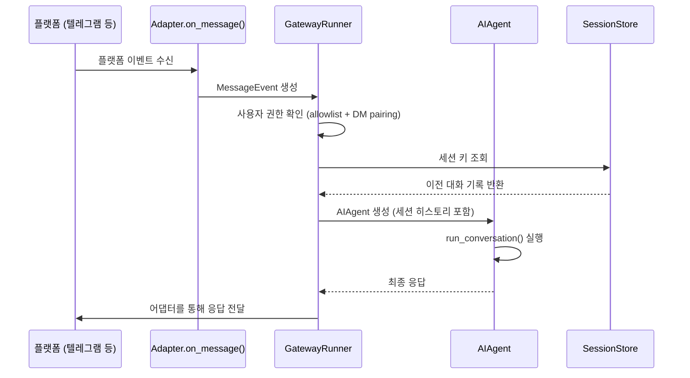
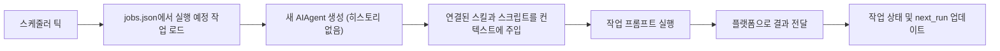
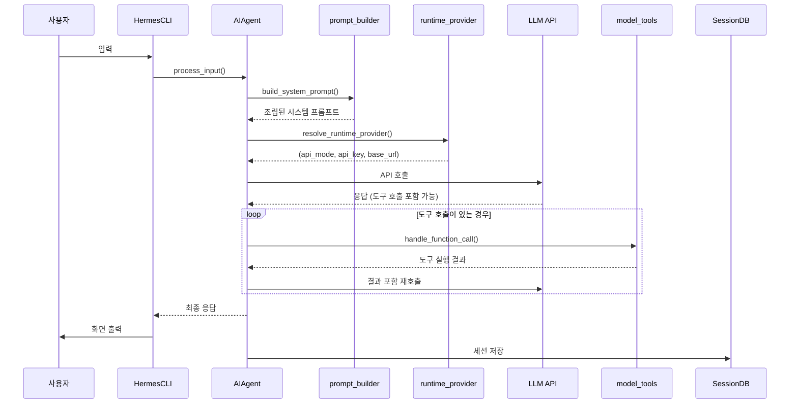
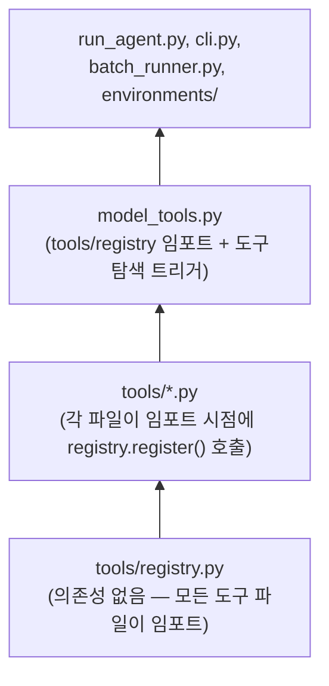

> **Nous Research**가 2026년 2월 공개한 오픈소스 자율 AI 에이전트 **Hermes Agent**의 내부 구조를 공식 문서와 최신 정보를 바탕으로 상세히 설명합니다.

---

## 목차

1. [Hermes Agent란 무엇인가](#1-hermes-agent란-무엇인가)
2. [시스템 전체 구조 개요](#2-시스템-전체-구조-개요)
3. [진입점(Entry Points): 세 가지 접근 방식](#3-진입점entry-points-세-가지-접근-방식)
4. [핵심 엔진: AIAgent (run_agent.py)](#4-핵심-엔진-aiagent-run_agentpy)
5. [프롬프트 시스템](#5-프롬프트-시스템)
6. [프로바이더 해석 (Provider Resolution)](#6-프로바이더-해석-provider-resolution)
7. [도구(Tool) 시스템](#7-도구tool-시스템)
8. [세션 저장소 (Session Storage)](#8-세션-저장소-session-storage)
9. [메시징 게이트웨이 (Gateway)](#9-메시징-게이트웨이-gateway)
10. [플러그인 시스템](#10-플러그인-시스템)
11. [MCP(Model Context Protocol) 통합](#11-mcpmodel-context-protocol-통합)
12. [크론(Cron) 스케줄러](#12-크론cron-스케줄러)
13. [ACP 통합 (IDE 연동)](#13-acp-통합-ide-연동)
14. [디렉토리 전체 구조](#14-디렉토리-전체-구조)
15. [데이터 흐름 상세](#15-데이터-흐름-상세)
16. [설계 원칙 6가지](#16-설계-원칙-6가지)
17. [파일 의존성 체인](#17-파일-의존성-체인)
18. [커뮤니티의 반응: X(트위터) 스레드](#18-커뮤니티의-반응-x트위터-스레드)

---

## 1. Hermes Agent란 무엇인가

Hermes Agent는 **Nous Research**가 2026년 2월 25일 공개한 오픈소스(MIT 라이선스) 자율 AI 에이전트 프레임워크입니다. 단순한 챗봇 래퍼나 IDE 전용 코파일럿이 아니라, 서버 위에서 상시 동작하며 학습 내용을 기억하고 시간이 지날수록 점점 더 유능해지는 구조를 갖추고 있습니다.

공개 7주 만에 GitHub 스타 95,000개를 넘어섰고, 이후 105,000개를 돌파해 2026년 기준 가장 빠르게 성장한 오픈소스 에이전트 프레임워크로 평가됩니다. Linux, macOS, WSL2를 지원하며, 단일 `curl` 명령어 한 줄로 필요한 모든 것을 자동 설치합니다. 모든 데이터는 사용자 본인의 기기에 저장되며 텔레메트리나 클라우드 의존성이 없습니다.

중요한 점은, Hermes Agent의 "자기 개선(self-improvement)"이 모델 자체를 재학습시키는 것이 아니라는 점입니다. 개선은 **스킬(Skill)과 메모리(Memory) 레이어**에서 이루어집니다. 에이전트가 복잡한 작업을 완료하면 해당 절차를 구조화된 스킬 문서로 기록해두고, 이후 유사한 작업이 들어오면 그 스킬을 컨텍스트 윈도우에 불러와 LLM에게 명시적 지침을 제공합니다.

---

## 2. 시스템 전체 구조 개요

아키텍처 문서의 핵심은 아래 계층 구조도에 잘 압축되어 있습니다.



전체 시스템은 크게 네 계층으로 나뉩니다. 가장 위에 사용자가 접근하는 **진입점(Entry Points)** 이 있고, 그 아래에 모든 대화와 도구 실행을 조율하는 **AIAgent 코어**가 있습니다. 코어는 아래로 내려가면서 대화 기록을 유지하는 **세션 저장소**와, 실제 작업을 처리하는 **도구 백엔드**로 연결됩니다.

---

## 3. 진입점(Entry Points): 세 가지 접근 방식

사용자가 Hermes Agent에 접근하는 방법은 세 가지입니다.

### 3-1. CLI (cli.py / HermesCLI)
터미널에서 직접 에이전트와 대화하는 인터랙티브 UI입니다. 가장 기본적인 접근 방식으로, 배치 러너(Batch Runner) 기능도 여기 포함됩니다. 배치 러너는 여러 에이전트 세션을 자동으로 실행하며 학습 데이터용 트라젝토리(trajectory)를 대량 생성하는 데 사용됩니다.

### 3-2. Gateway (gateway/run.py)
메시징 플랫폼을 통해 에이전트와 통신하는 방식입니다. 텔레그램, 디스코드, 슬랙, 왓츠앱, 시그널, 이메일, SMS 등 20개 플랫폼 어댑터가 포함되어 있습니다. 이 방식을 사용하면 평소 쓰는 메신저에서 바로 에이전트에게 메시지를 보낼 수 있습니다.

### 3-3. ACP (acp_adapter/)
VS Code, Zed, JetBrains 같은 IDE에서 에이전트를 직접 사용할 수 있게 해주는 방식입니다. `stdio/JSON-RPC` 프로토콜을 통해 에디터 네이티브 에이전트로 동작합니다.

---

## 4. 핵심 엔진: AIAgent (run_agent.py)

`AIAgent`는 Hermes의 두뇌입니다. CLI, 게이트웨이, ACP, 배치 실행, API 서버 등 모든 진입점이 결국 이 하나의 클래스를 공유합니다. 플랫폼마다 다른 차이는 진입점 레벨에서 처리하고, AIAgent 자체는 플랫폼에 무관합니다.

AIAgent가 하나의 대화 루프에서 수행하는 일을 순서대로 따라가면 이렇습니다.

1. **프롬프트 빌드**: `prompt_builder.py`를 통해 시스템 프롬프트를 조립합니다.
2. **프로바이더 해석**: `runtime_provider.py`를 통해 어떤 LLM API를 쓸지 결정합니다.
3. **API 호출**: 세 가지 API 모드 중 하나로 LLM에 요청을 보냅니다.
4. **도구 실행**: 모델이 도구 호출을 요청하면 `model_tools.py`를 통해 해당 도구를 실행하고 결과를 다시 모델에 전달합니다. 도구 결과가 또 다른 도구 호출로 이어질 수 있어, 이 과정은 루프를 이룹니다.
5. **응답 전달 및 저장**: 최종 응답을 사용자에게 보여주고 세션 DB에 저장합니다.

### 세 가지 API 모드

AIAgent는 세 가지 서로 다른 LLM API 형식을 지원합니다.

- **chat_completions**: OpenAI 호환 API 형식. 대부분의 서드파티 제공자가 이를 따릅니다.
- **codex_responses**: OpenAI의 Responses API를 위한 모드입니다.
- **anthropic**: Anthropic의 Messages API를 직접 사용하는 모드로, Anthropic 전용 기능(프롬프트 캐싱 등)을 활용할 수 있습니다.

---

## 5. 프롬프트 시스템

프롬프트 시스템은 단순히 사용자 입력을 전달하는 것이 아니라, 복잡하고 구조화된 **시스템 프롬프트를 조립**하는 역할을 합니다.

### 5-1. prompt_builder.py — 시스템 프롬프트 조립

시스템 프롬프트는 다음 소스들을 결합해 만들어집니다.

- **SOUL.md**: 에이전트의 성격과 기본 동작 지침
- **MEMORY.md, USER.md**: 에이전트가 이전 대화에서 학습한 기억과 사용자 정보
- **스킬(Skills)**: 재사용 가능한 절차 문서들
- **컨텍스트 파일 (AGENTS.md, .hermes.md)**: 프로젝트별 맥락 정보
- **도구 사용 지침**: 어떤 도구를 어떻게 쓸지에 대한 안내
- **모델별 지침**: 특정 LLM 모델에 맞춘 세부 지침

설계 원칙 중 하나인 **"프롬프트 안정성(Prompt Stability)"** 에 따라, 시스템 프롬프트는 대화 도중에 변경되지 않습니다. 유일한 예외는 사용자가 직접 `/model` 명령어로 모델을 변경할 때뿐입니다. 이는 Anthropic 프롬프트 캐싱의 prefix caching 효과를 극대화하기 위함입니다.

### 5-2. prompt_caching.py — 캐싱 최적화

Anthropic API의 프롬프트 캐싱 기능을 활용합니다. 캐시 브레이크포인트를 적절히 설정해 prefix caching이 효과적으로 작동하도록 합니다. 시스템 프롬프트가 대화 내내 안정적으로 유지되는 것도 이 캐싱 효과를 의도한 설계입니다.

### 5-3. context_compressor.py — 컨텍스트 압축

대화가 길어지면 컨텍스트 윈도우 한계에 도달합니다. 이때 `context_compressor.py`가 중간 대화 턴들을 요약(lossy summarization)해서 압축합니다. 이 과정에서 세션 계보(lineage)가 기록되어, 압축 전후의 세션 연결 관계가 추적됩니다. 컨텍스트 엔진은 추상 인터페이스(ABC)로 설계되어 있어 플러그인으로 교체할 수 있습니다.

---

## 6. 프로바이더 해석 (Provider Resolution)

`hermes_cli/runtime_provider.py`는 CLI, 게이트웨이, 크론, ACP, 보조 호출 등 모든 곳에서 공유하는 런타임 해석기입니다.

이 모듈은 `(provider, model)` 튜플을 입력받아 `(api_mode, api_key, base_url)`을 반환합니다. 18개 이상의 프로바이더를 지원하며, OAuth 플로우, 크리덴셜 풀, 별칭(alias) 해석 등을 처리합니다.



모델 카탈로그(`hermes_cli/models.py`)에는 각 프로바이더별 사용 가능한 모델 목록이 관리되며, `/model` 명령어로 대화 중에 모델을 전환할 수 있습니다.

---

## 7. 도구(Tool) 시스템

Hermes의 도구 시스템은 전체 아키텍처에서 가장 방대한 부분입니다.

### 7-1. 도구 레지스트리 (tools/registry.py)

중앙 도구 레지스트리는 **70개 이상의 도구**를 **28개 툴셋**으로 분류해 관리합니다. 각 도구 파일은 임포트될 때 자동으로 `registry.register()`를 호출해 자신을 등록합니다. 즉, 개발자가 새 도구를 추가할 때 별도의 목록에 수동으로 추가할 필요가 없습니다.

레지스트리가 처리하는 일은 다음과 같습니다.

- 스키마 수집 (LLM에 도구 목록과 사용법을 전달하기 위해)
- 도구 디스패치 (LLM이 요청한 도구를 실제로 실행)
- 가용성 확인 (현재 환경에서 쓸 수 있는 도구인지 체크)
- 오류 래핑

### 7-2. 도구 백엔드 종류

도구들이 실제 작업을 처리하는 백엔드는 다음과 같이 분류됩니다.

| 카테고리 | 백엔드 수 | 주요 내용 |
|---|---|---|
| 터미널 | 7개 | local, Docker, SSH, Daytona, Modal, Singularity, Vercel Sandbox |
| 브라우저 | 5개 | 브라우저 자동화 10개 도구 포함 |
| 웹 | 4개 | web_search, web_extract 등 |
| MCP | 동적 | 외부 MCP 서버를 통해 동적으로 추가 |
| 기타 | - | 파일, 비전, 코드 실행, 서브에이전트 위임 등 |

### 7-3. 주요 도구 파일들

- **terminal_tool.py**: 터미널 오케스트레이션. 위험한 명령어 감지(approval.py)와 연동됩니다.
- **file_tools.py**: `read_file`, `write_file`, `patch`, `search_files`
- **web_tools.py**: `web_search`, `web_extract`
- **browser_tool.py**: 10개의 브라우저 자동화 도구
- **code_execution_tool.py**: 샌드박스 코드 실행
- **delegate_tool.py**: 서브에이전트에게 작업 위임
- **mcp_tool.py**: MCP 클라이언트 (대용량 파일)

### 7-4. 위험 명령어 승인 시스템

`tools/approval.py`가 위험한 명령어를 감지합니다. CLI에서는 사용자에게 승인을 요청하는 콜백(`hermes_cli/callbacks.py`)이 실행됩니다. 설계 원칙 "Observable Execution"에 따라, 모든 도구 호출은 사용자에게 보입니다.

---

## 8. 세션 저장소 (Session Storage)

Hermes는 대화 기록을 SQLite 데이터베이스에 저장합니다. 여기에는 FTS5(Full-Text Search) 전문 검색 기능이 포함되어 있어 과거 대화를 빠르게 검색할 수 있습니다.

관련 파일은 두 개입니다.

- **hermes_state.py**: 에이전트 레벨 세션/상태 데이터베이스
- **gateway/session.py**: 게이트웨이 레벨 대화 영속성

세션의 주요 특징은 다음과 같습니다.

- **계보 추적(Lineage Tracking)**: 컨텍스트 압축이 일어날 때 부모/자식 세션 관계가 기록됩니다.
- **플랫폼별 격리**: 각 플랫폼(CLI, 텔레그램, 디스코드 등)의 세션이 독립적으로 관리됩니다.
- **원자적 쓰기**: 동시 접근 시 충돌이 없도록 원자적 쓰기와 경합 처리가 구현되어 있습니다.

---

## 9. 메시징 게이트웨이 (Gateway)

게이트웨이는 Hermes Agent를 메시징 플랫폼과 연결하는 장기 실행 프로세스입니다.

### 9-1. 지원 플랫폼 (20개)

```
telegram · discord · slack · whatsapp · signal · matrix
mattermost · email · sms · dingtalk · feishu(Lark)
wecom · wecom_callback · weixin · bluebubbles(iMessage 브릿지)
qqbot · homeassistant · webhook · api_server · yuanbao
```

### 9-2. 게이트웨이 메시지 처리 흐름



### 9-3. 사용자 인증

게이트웨이는 **허용 목록(allowlist)** 과 **DM 페어링(DM pairing)** 두 가지 방식으로 사용자를 인증합니다. 인증되지 않은 사용자의 메시지는 에이전트에 도달하지 않습니다.

### 9-4. 훅 시스템 및 미러링

`gateway/hooks.py`는 게이트웨이 생명주기 이벤트에 훅을 등록하는 확장 포인트를 제공합니다. `gateway/mirror.py`는 크로스 세션 메시지 미러링을 담당합니다.

---

## 10. 플러그인 시스템

플러그인 시스템은 세 가지 경로로 플러그인을 탐색합니다.

1. `~/.hermes/plugins/` — 사용자 레벨 플러그인
2. `.hermes/plugins/` — 프로젝트 레벨 플러그인
3. **pip entry points** — Python 패키지로 설치된 플러그인

플러그인은 컨텍스트 API를 통해 도구, 훅, CLI 명령어를 등록할 수 있습니다.

### 특수 플러그인 유형 두 가지

두 가지 특수 플러그인 유형이 있으며, 각각은 **단일 선택(single-select)** 입니다. 즉, 한 번에 하나만 활성화할 수 있습니다.

- **메모리 프로바이더 (`plugins/memory/`)**: 에이전트의 기억 저장 방식을 교체합니다.
- **컨텍스트 엔진 (`plugins/context_engine/`)**: 컨텍스트 압축 방식을 교체합니다.

이 두 플러그인은 `hermes plugins` 명령어나 `config.yaml`을 통해 설정합니다.

---

## 11. MCP(Model Context Protocol) 통합

MCP는 Anthropic이 만든 오픈 표준으로, AI 에이전트가 외부 도구·서비스·데이터 소스에 연결하는 통일된 방식을 제공합니다.

Hermes는 MCP를 **클라이언트**와 **서버** 양방향으로 지원합니다.

### 11-1. MCP 클라이언트 (외부 서버에 연결)

`tools/mcp_tool.py`가 MCP 클라이언트 역할을 합니다. 외부 MCP 서버(GitHub, 데이터베이스, 브라우저 자동화, 파일 시스템, 내부 API 등)에 연결하면, 해당 서버의 도구들이 Hermes 내장 도구와 동일한 방식으로 동작합니다. stdio와 HTTP 두 가지 연결 방식을 모두 지원합니다.

### 11-2. MCP 서버 (Hermes를 외부에 노출)

`hermes mcp serve` 명령으로 Hermes 자신이 MCP 서버가 됩니다. Claude Desktop, Cursor, Claude Code 등 MCP 클라이언트에서 Hermes의 대화 기록 조회, 메시지 발송 등 10개 도구를 사용할 수 있게 됩니다. 읽기 작업은 게이트웨이 없이도 가능하지만, 쓰기(메시지 발송) 작업은 게이트웨이가 실행 중이어야 합니다.

### 11-3. 실용적 활용 사례

- **Claude Code에서 텔레그램 스레드 읽기**: 코딩 세션 중 동료와 나눈 메신저 대화를 참조할 수 있습니다.
- **Cursor에서 Discord 배포 알림 발송**: 빌드 성공 후 Cursor가 MCP를 통해 Hermes에 요청하고, Hermes 게이트웨이가 Discord에 알림을 보냅니다.
- **멀티 에이전트 조율**: 다른 에이전트 프레임워크에서 Hermes의 운영 상태(활성 대화, 플랫폼 연결 현황)를 조회할 수 있습니다.

---

## 12. 크론(Cron) 스케줄러

Hermes의 크론은 단순 셸 스크립트가 아닌 **퍼스트클래스 에이전트 작업**입니다.



주요 특징은 다음과 같습니다.

- 작업은 JSON 파일에 저장됩니다.
- 다양한 스케줄 형식을 지원합니다.
- 스킬과 스크립트를 연결할 수 있습니다.
- 결과를 어떤 플랫폼으로든 전달할 수 있습니다.
- 각 크론 작업은 이전 히스토리 없이 새 AIAgent 인스턴스로 실행됩니다.

---

## 13. ACP 통합 (IDE 연동)

`acp_adapter/` 디렉토리는 Hermes를 IDE 네이티브 에이전트로 노출합니다. VS Code, Zed, JetBrains에서 `stdio/JSON-RPC` 프로토콜로 통신합니다. 이를 통해 편집기 내에서 직접 Hermes Agent의 모든 기능을 사용할 수 있습니다.

---

## 14. 디렉토리 전체 구조

```
hermes-agent/
├── run_agent.py              # AIAgent — 핵심 대화 루프
├── cli.py                    # HermesCLI — 인터랙티브 터미널 UI
├── model_tools.py            # 도구 탐색, 스키마 수집, 디스패치
├── toolsets.py               # 도구 그룹핑 및 플랫폼 프리셋
├── hermes_state.py           # SQLite 세션/상태 DB (FTS5 포함)
├── hermes_constants.py       # HERMES_HOME, 프로파일 경로
├── batch_runner.py           # 배치 트라젝토리 생성
│
├── agent/                    # 에이전트 내부
│   ├── prompt_builder.py     # 시스템 프롬프트 조립
│   ├── context_engine.py     # ContextEngine ABC (교체 가능)
│   ├── context_compressor.py # 기본 엔진 — 손실 요약
│   ├── prompt_caching.py     # Anthropic 프롬프트 캐싱
│   ├── auxiliary_client.py   # 보조 LLM (비전, 요약 등)
│   ├── model_metadata.py     # 모델 컨텍스트 길이, 토큰 추정
│   ├── models_dev.py         # models.dev 레지스트리 연동
│   ├── anthropic_adapter.py  # Anthropic Messages API 형식 변환
│   ├── display.py            # KawaiiSpinner, 도구 미리보기 포맷
│   ├── skill_commands.py     # 스킬 슬래시 명령어
│   ├── memory_manager.py     # 메모리 매니저 오케스트레이션
│   ├── memory_provider.py    # 메모리 프로바이더 ABC
│   └── trajectory.py         # 트라젝토리 저장 헬퍼
│
├── hermes_cli/               # CLI 서브커맨드 및 설정
│   ├── main.py               # 진입점 — hermes 서브커맨드 전체
│   ├── config.py             # DEFAULT_CONFIG, 환경변수, 마이그레이션
│   ├── commands.py           # COMMAND_REGISTRY — 슬래시 명령어 정의
│   ├── auth.py               # PROVIDER_REGISTRY, 크리덴셜 해석
│   ├── runtime_provider.py   # 프로바이더 → api_mode + 크리덴셜
│   ├── models.py             # 모델 카탈로그, 프로바이더 모델 목록
│   ├── model_switch.py       # /model 명령어 로직
│   ├── setup.py              # 인터랙티브 설정 마법사
│   ├── skin_engine.py        # CLI 테마 엔진
│   ├── skills_config.py      # 스킬 활성화/비활성화
│   ├── skills_hub.py         # /skills 슬래시 명령어
│   ├── tools_config.py       # 도구 활성화/비활성화
│   ├── plugins.py            # PluginManager — 탐색, 로딩, 훅
│   ├── callbacks.py          # 터미널 콜백 (승인, sudo 등)
│   └── gateway.py            # hermes gateway 시작/중지
│
├── tools/                    # 도구 구현 (파일 1개 = 도구 1개)
│   ├── registry.py           # 중앙 도구 레지스트리
│   ├── approval.py           # 위험 명령어 감지
│   ├── terminal_tool.py      # 터미널 오케스트레이션
│   ├── process_registry.py   # 백그라운드 프로세스 관리
│   ├── file_tools.py         # read/write/patch/search
│   ├── web_tools.py          # 웹 검색, 추출
│   ├── browser_tool.py       # 브라우저 자동화 10개 도구
│   ├── code_execution_tool.py# 샌드박스 코드 실행
│   ├── delegate_tool.py      # 서브에이전트 위임
│   ├── mcp_tool.py           # MCP 클라이언트
│   └── environments/         # 터미널 백엔드 (local, docker, ssh, modal...)
│
├── gateway/                  # 메시징 플랫폼 게이트웨이
│   ├── run.py                # GatewayRunner — 메시지 디스패치
│   ├── session.py            # SessionStore — 대화 영속성
│   ├── delivery.py           # 아웃바운드 메시지 전달
│   ├── pairing.py            # DM 페어링 인증
│   ├── hooks.py              # 훅 탐색 및 생명주기 이벤트
│   ├── mirror.py             # 크로스 세션 메시지 미러링
│   ├── status.py             # 토큰 잠금, 프로세스 추적
│   └── platforms/            # 20개 어댑터 (telegram, discord, slack...)
│
├── acp_adapter/              # ACP 서버 (VS Code / Zed / JetBrains)
├── cron/                     # 스케줄러 (jobs.py, scheduler.py)
├── plugins/memory/           # 메모리 프로바이더 플러그인
├── plugins/context_engine/   # 컨텍스트 엔진 플러그인
├── skills/                   # 번들 스킬 (항상 사용 가능)
├── optional-skills/          # 공식 선택적 스킬
├── website/                  # Docusaurus 문서 사이트
└── tests/                    # Pytest 테스트 스위트 (3,000개 이상)
```

---

## 15. 데이터 흐름 상세

### 15-1. CLI 세션 흐름



### 15-2. 게이트웨이 메시지 흐름

플랫폼 이벤트가 어댑터를 통해 `MessageEvent`로 변환되고, `GatewayRunner`가 사용자 인증과 세션 조회를 거쳐 AIAgent를 생성합니다. AIAgent는 세션 히스토리를 받아 대화를 실행하고, 결과는 어댑터를 통해 플랫폼으로 돌려보냅니다.

### 15-3. 크론 작업 흐름

스케줄러가 실행 예정 작업을 `jobs.json`에서 로드하고, 히스토리 없이 새 AIAgent를 생성합니다. 연결된 스킬이 컨텍스트에 주입된 뒤 작업 프롬프트가 실행되고, 결과는 지정된 플랫폼으로 전달됩니다.

---

## 16. 설계 원칙 6가지

Hermes Agent의 아키텍처를 이해하려면 이 여섯 가지 원칙을 먼저 파악하는 것이 중요합니다.

| 원칙 | 실제 의미 |
|---|---|
| **프롬프트 안정성** | 시스템 프롬프트는 대화 중 변경되지 않습니다. `/model` 명령어 같은 명시적 사용자 액션만 예외입니다. 이는 캐시 무효화를 방지합니다. |
| **관찰 가능한 실행** | 모든 도구 호출은 사용자에게 보입니다. CLI에서는 스피너로, 게이트웨이에서는 채팅 메시지로 진행 상황이 표시됩니다. |
| **중단 가능성** | API 호출과 도구 실행은 사용자 입력이나 신호(signal)로 언제든 취소될 수 있습니다. |
| **플랫폼 무관한 코어** | 하나의 AIAgent 클래스가 CLI, 게이트웨이, ACP, 배치, API 서버를 모두 담당합니다. 플랫폼 차이는 진입점에서 처리합니다. |
| **느슨한 결합** | MCP, 플러그인, 메모리 프로바이더, RL 환경 같은 선택적 서브시스템은 레지스트리 패턴과 `check_fn` 게이팅을 사용해 하드 의존성을 피합니다. |
| **프로파일 격리** | `hermes -p <name>`으로 각 프로파일은 자체 HERMES_HOME, 설정, 메모리, 세션, 게이트웨이 PID를 갖습니다. 여러 프로파일이 동시에 실행 가능합니다. |

---

## 17. 파일 의존성 체인



이 체인의 핵심은 **도구 등록이 임포트 시점에 자동으로 이루어진다**는 점입니다. `tools/` 디렉토리에 새 파일을 추가하고 파일 상단에 `registry.register()`를 호출하기만 하면 자동으로 탐색됩니다. 어디에도 수동으로 목록을 추가할 필요가 없습니다.

---

## 18. 커뮤니티의 반응: X(트위터) 스레드

2026년 5월 24일, X의 @dotey(宝玉) 계정이 Hermes Agent 공식 문서를 소개하며 "Codex나 Claude Code로 프로젝트 코드베이스를 열고 에이전트가 직접 코드베이스를 설명하게 하는 것이 문서를 읽는 것보다 효과적"이라고 조언하는 글을 올렸습니다.

이에 @Teknium은 "Hermes 안에서 `/hermes-agent` 스킬을 쓰면 설정·디버그·활용을 도와주는 전용 스킬이 있다"고 답했습니다. 이 트윗은 7,633회 조회를 기록했습니다.

스레드에서 나온 실용적 팁들을 정리하면 다음과 같습니다.

**에이전트에게 코드베이스 설명을 요청할 때의 팁**
파일 경로와 줄 번호를 포함해 달라고 요청하고, 진입점에서 주요 흐름까지의 호출 체인을 그리게 하면 이해가 훨씬 빠릅니다. 핵심 결론에 대해서는 에이전트에게 해당 테스트 케이스를 실행해 검증하게 하면 정확도가 높아집니다.

**"에이전트가 자기 자신을 분석하게 한다"는 발상**
이는 Hermes Agent의 특성을 잘 보여줍니다. Hermes는 자기 코드베이스를 읽고 구조를 분석하는 데 자기 자신을 도구로 활용할 수 있습니다.

**커뮤니티의 전반적인 평가**
문서를 읽는 것보다 에이전트에게 직접 설명을 요청하는 것이 3배 빠르다는 의견이 다수를 이루었습니다. AI를 통한 리버스 엔지니어링이 크게 쉬워졌다는 평가도 주목할 만합니다.

---

## 정리: Hermes Agent가 주목받는 이유

Hermes Agent는 단순한 또 다른 에이전트 프레임워크가 아닙니다. 기존 에이전트들이 "메모리 기능이 있다"고 주장하면서도 실제로는 세션이 끝나면 기억을 잃었던 것과 달리, Hermes는 학습 내용이 **디스크 위의 실제 파일**로 저장됩니다. "에이전트가 배웠다"는 말이 열어서 확인할 수 있는 파일을 가리킵니다.

플랫폼 무관한 단일 코어, 20개 메시징 플랫폼 지원, 70개 이상의 도구, MCP 양방향 지원, 프로파일 격리, 크론 기반 자동화, IDE 통합까지 — 이 모든 것이 MIT 라이선스 오픈소스로 제공됩니다. 모든 데이터는 사용자 본인의 기기에 머뭅니다.

---

*작성일: 2026년 5월 24일*  
*참고: Nous Research 공식 [Hermes Agent 아키텍처 문서](https://hermes-agent.nousresearch.com/docs/developer-guide/architecture) (hermes-agent.nousresearch.com), [X/@dotey](https://x.com/dotey/status/2058020600166138188) 스레드, 최신 커뮤니티 리뷰 및 분석 자료*
