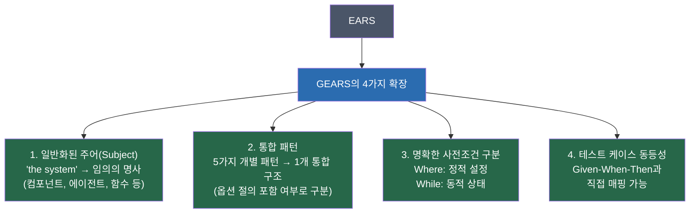
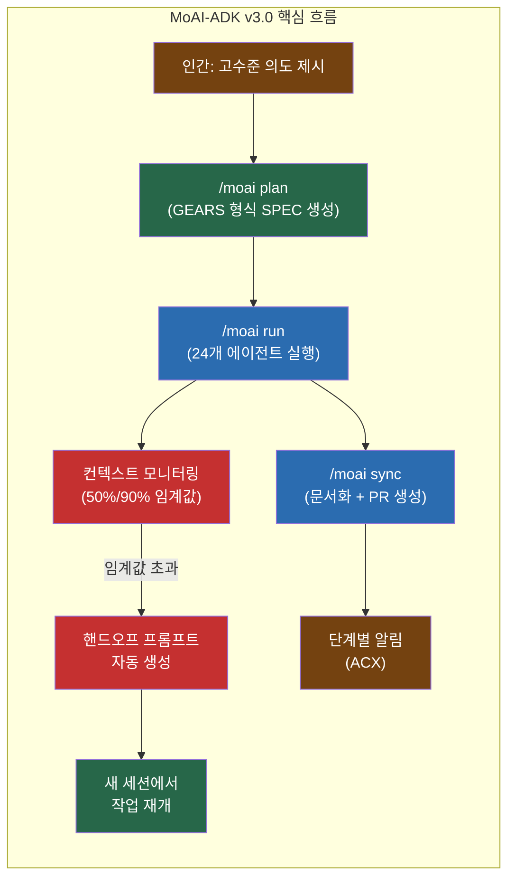
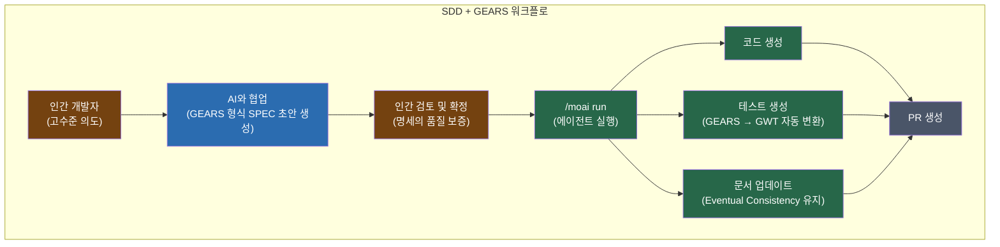
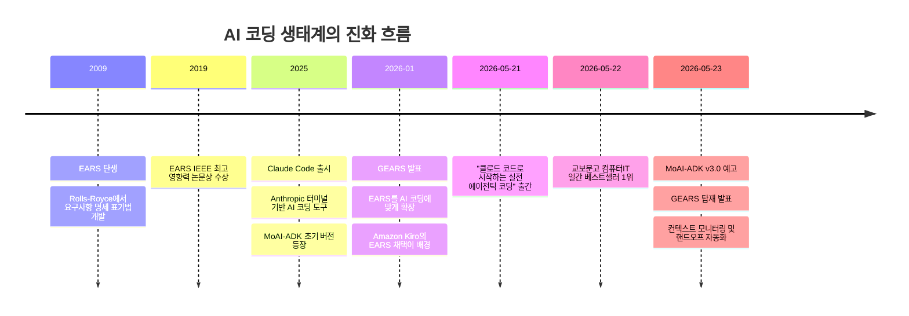

Where the deployment is production, when a request fails,
the service shall retry with exponential backoff.

# While 사용 예: 서킷 브레이커 상태는 언제든 열리거나 닫힐 수 있음
While the circuit breaker is open, when a request arrives,
the service shall return a cached response.
```

### GEARS 예시 모음

**1. Ubiquitous (항상 적용되는 명세)**
```
The mobile phone shall have a mass of less than 150 grams.
```

**2. State-Driven (상태 조건)**
```
While no card is inserted, the ATM shall display "insert card to begin".
```

**3. Event-Driven (이벤트 조건)**
```
When the user selects mute, the audio controller shall suppress all output.
When the cache exceeds 80% capacity, the eviction policy shall remove 
the least recently used entries until capacity falls below 60%.
```

**4. Optional Feature (선택적 기능)**
```
Where sunroof is installed, the vehicle shall include a sunroof control
on the driver door.
```

**5. Complex (상태 + 이벤트 복합)**
```
Where the user has granted file system access, when the user requests 
code generation, the coding agent shall write output to the specified directory.
```

**6. Error Handling (에러 처리)**
```
When an invalid credit card number is entered, the payment form shall display
"please re-enter credit card details".
```

**7. Negative Expression (금지 행동)**
```
When an unauthenticated request arrives, the API shall not include
stack traces in the response.
```

### BDD 테스트 케이스와의 직접 변환

GEARS의 가장 강력한 특징은 BDD의 Given-When-Then 형식을 GEARS 문법으로 직접 변환할 수 있다는 점이다.

**BDD 형식:**
```
Given the user is authenticated
And the session is active
When the user requests their profile
Then the API returns the user's profile data
```

**GEARS 형식 (완전히 동일한 의미):**
```
While the user is authenticated and the session is active,
when the user requests their profile,
the API shall return the user's profile data.
```

요구사항 명세와 테스트 케이스가 동일한 문법 체계를 공유하므로, 하나의 GEARS 문장으로 명세 문서와 테스트 시나리오를 동시에 표현할 수 있다. 이는 LLM이 명세에서 테스트 코드를 자동 생성할 때 해석의 모호성을 크게 줄여준다.

### GEARS가 EARS에서 확장한 4가지 핵심 차이



---

## 6. MoAI-ADK v3.0 주요 변경 사항 예고

Goos Kim이 Facebook을 통해 공개한 MoAI-ADK v3.0의 핵심 변경 사항은 다음 세 가지다.

### 1. 컨텍스트 윈도우 자동 모니터링 및 /clear 안내

Claude Code는 한 세션에서 처리할 수 있는 토큰(정보량) 한계가 있다. Claude Max 플랜의 경우 Opus 모델 기준으로 최대 **1M(100만) 토큰**의 컨텍스트 윈도우를 지원하지만, 긴 작업을 진행하다 보면 한계에 가까워진다.

v3.0에서는 컨텍스트 윈도우 사용량이 일정 임계값을 넘으면 자동으로 알림을 표시한다.

- **Opus 1M 토큰 사용 기준: 50% 초과** → `/clear` 안내 표시
- **200k 토큰 사용 기준: 90% 초과** → `/clear` 안내 표시

`/clear` 명령은 현재 컨텍스트를 초기화하여 토큰을 확보하는 방법이다. 이를 적절한 시점에 안내함으로써 에이전트가 중요한 작업 도중 컨텍스트 한계로 멈추거나 성능이 저하되는 상황을 예방한다.

### 2. 자동 핸드오프 프롬프트 생성

태스크가 완료되거나 `/clear`를 실행할 시점이 되면, **현재까지의 진행 상황, 완료된 작업, 다음에 할 일을 요약한 핸드오프 프롬프트**가 자동으로 생성된다. 사용자는 이를 복사해 새로운 Claude Code 세션에 붙여넣는 것만으로 작업을 끊김 없이 이어갈 수 있다.

Claude Code를 포함한 현재의 LLM 기반 에이전트들은 본질적으로 각 세션 간 기억을 유지하지 않는다. 새 세션을 시작하면 이전에 무엇을 했는지 에이전트는 모른다. 핸드오프 프롬프트는 이 **세션 단절 문제**를 사람이 수동으로 상황을 재설명하지 않아도 되도록 자동화한 해결책이다.

### 3. 단계별 진행 알림 및 보고 체계

에이전틱 코딩에서 가장 불편한 점 중 하나는 에이전트들이 어떤 작업을 수행하고 있는지 **모니터링하기 어렵다**는 것이다. 여러 에이전트가 병렬로 동작할 때 각 에이전트의 진행 상황을 일일이 `ctrl+o`로 확인해야 한다.

v3.0에서는 각 단계가 완료될 때마다 자동으로 알림이 발송되며, 다음 단계에서 진행될 내용이 보고된다. 이를 통해 개발자는 세부 실행 과정을 일일이 추적하지 않고도 전체 흐름을 파악할 수 있다.

Goos Kim은 이를 **에이전틱 코딩 경험(ACX, Agentic Coding eXperience)** 이라고 표현했다. 웹/앱에 UI/UX가 있고 터미널에 TUI/TUX가 있듯이, 에이전틱 코딩에도 그에 맞는 경험 설계가 필요하다는 철학이다.

### v3.0에서의 GEARS 탑재

앞서 설명한 GEARS 명세 문법이 MoAI-ADK v3.0에 공식 통합될 예정이다. 기존에 EARS를 사용하던 SPEC 작성 방식이 GEARS로 업그레이드됨으로써, 더 정교하고 일관성 있는 명세 생성이 가능해진다.

MoAI-ADK의 핵심 철학인 **SDD(Spec Driven Development, 명세 주도 개발)** 에서 명세의 품질이 곧 에이전트 출력의 품질을 결정한다. GEARS는 바로 그 명세 품질을 높이기 위한 언어적 인프라다.



---

## 7. 터미널 화면 분석

공유된 터미널 화면에서는 실제로 MoAI-ADK와 Claude Code가 함께 동작하는 모습을 확인할 수 있다.

### 상단 헤더 정보

```
Claude Code v2.1.148
Opus 4.7 (1M context) with xhigh effort · Claude Max
~/MoAI/moai-adk-go
(ctrl+b to run in background)
```

이 화면은 Claude Code 버전 **v2.1.148**이 실행 중이며, **Claude Opus 4.7 모델**과 **100만 토큰 컨텍스트 윈도우**를 사용하고 있음을 보여준다. `xhigh effort` 설정은 모델이 최대한 깊이 사고하도록 지시하는 모드다. 현재 작업 디렉터리는 `~/MoAI/moai-adk-go`로, Go 언어로 재작성된 MoAI-ADK 소스코드 폴더다.

### 진행 상태 표시줄

```
* Scampering… (1h 16m 46s · ↓ 194.0k tokens)
  └ Tip: Use /clear to start fresh when switching topics and free up context
```

에이전트가 **1시간 16분 46초** 동안 실행 중이며, 이미 **194,000개의 토큰**을 다운스트림으로 처리했다. 시스템이 자동으로 "/clear 사용 팁"을 안내하고 있어, v3.0에서 공식화될 컨텍스트 모니터링 기능의 원형을 볼 수 있다.

### 하단 상태 바

```
Opus 4.7 (1M context) | xhigh·t | v2.1.148 | v3.0.0-rc1 | 8h 33m | MoAI
CW: 58% (⚠/clear) | 5H: 35% (3h 19m) | 7D: 55% (May 28)
moai-adk-go | modu-ai/moai-adk | feat/SPEC-V3R6-SEQ-THINKING-RETIRE-001 +48 | +0 M35 ?13
>> bypass permissions on (shift+tab to cycle)
```

이 상태 바에는 여러 중요한 정보가 담겨 있다.

- `v3.0.0-rc1`: 현재 작업 중인 MoAI-ADK 코드가 **v3.0의 릴리스 후보(RC1)** 버전임을 의미한다
- `CW: 58% (⚠/clear)`: **컨텍스트 윈도우 사용량이 58%** 에 달해 경고(⚠)가 표시되고 있다. v3.0에서 예고한 모니터링 기능이 실제로 작동하는 모습이다
- `5H: 35% (3h 19m)`: 5시간 누적 토큰 사용량 35%, 3시간 19분 경과
- `7D: 55% (May 28)`: 7일 토큰 한도의 55%를 사용했으며, 5월 28일에 한도가 리셋된다
- `feat/SPEC-V3R6-SEQ-THINKING-RETIRE-001`: 현재 작업 중인 Git 브랜치 이름으로, `sequential-thinking MCP의 은퇴(retire)`를 다루는 SPEC 번호 V3R6 작업임을 의미한다

### 브랜치 선택 메뉴

```
• main
○ manager-develop  Q2 run-phase manager-develop M1-M7        19m 33s
```

현재 `main` 브랜치가 선택된 상태이며, `manager-develop` 브랜치에는 19분 33초 전에 진행 중이던 Q2 실행 단계 작업이 있음을 보여준다.

---

## 8. 핸드오프 프롬프트: 세션 연속성 관리

두 번째 화면은 **핸드오프 프롬프트**의 실제 내용을 보여준다. 이것이 v3.0에서 자동 생성될 핵심 기능의 실제 예시다.

### 핸드오프 프롬프트의 구조

핸드오프 프롬프트는 다음과 같은 정보를 포함한다.

**현재 상태 요약:**
```
ultrathink. NAMESPACE-PROTECT-001 PR #1048 admin merge 완료 
(origin/main 767bc04a4). Wave 6 working tree 보존 + dirty 45 items.
```

이 줄 하나가 새 세션을 시작하는 에이전트에게 "현재 PR #1048이 main 브랜치에 합쳐졌으며, Wave 6 작업 트리가 보존된 상태로 45개의 미커밋 변경사항이 있다"는 정확한 상황을 전달한다.

**적용된 교훈(Applied Lessons):**
```
applied lessons:
- project_v3r6_update_namespace_protect_001_merged (본 세션 핸드오프 SoT)
- L7 (specific-path add only, working tree 보존)
- L8 reinforced (branch swap mid-session – 'git branch --show-current' 의무)
- L9 reinforced (race during agent runs – fresh re-measure + stash + AskUserQuestion mitigations)
- L14 reinforced (stash pop silent skip §23.4 variant)
...
```

이 섹션은 이전 세션에서 발견된 문제와 해결책을 "교훈(Lesson)" 형태로 기록한 것이다. L7, L8, L9 등 번호가 붙은 교훈들은 MoAI-ADK 내부의 레슨 시스템으로, 에이전트가 과거에 겪은 문제를 다시 반복하지 않도록 지식을 축적하는 구조다.

**전체 검증 단계:**
```
전체 검증 (병렬 실행 의무 per agent-common-protocol §Parallel Execution):
1) git branch --show-current → 'main' 확인 (L8 detection)
2) git rev-parse origin/main → '767bc04a4' 확인 (NAMESPACE-PROTECT-001 squash merge)
3) git rev-list --count origin/main..HEAD → 0 (perfect sync) + HEAD..origin/main → 0
4) git status --short | wc -l → 45 dirty items 보존 확인 (Wave 6 30 + 기준 15)
```

새 세션에서 첫 번째로 수행할 검증 절차들이다. 이를 통해 에이전트가 예상한 상태와 실제 저장소 상태가 일치하는지 확인한다.

### 핸드오프 프롬프트의 의미

이 내용은 단순한 작업 메모가 아니다. 에이전트에게 **"현재 상태를 정확하게 이해하고 올바른 다음 행동을 선택하는 데 필요한 모든 맥락"** 을 압축해서 전달하는 구조화된 문서다. 인간이 동료에게 업무를 인수인계할 때 작성하는 인수인계 문서와 같은 역할이지만, LLM이 파싱하기 좋은 형식으로 작성된다.

---

## 9. 5가지 작업 옵션 카드

세 번째 화면은 에이전트가 사용자에게 다음 행동 선택지를 제시하는 **5가지 옵션 상세 카드**를 보여준다. 각 카드는 Trigger(발동 조건), Tier(우선순위), 예상 시간, Dependencies(선행 조건), 추천 우선순위 등을 체계적으로 정리한다.

### 옵션 A: Wave 6 main commit + push 직진

| 항목 | 내용 |
|------|------|
| Trigger | 본 세션에서 분리된 Wave 6의 30개 테스트 파일 마무리 우선 |
| Tier | S 미만 (Hybrid Trunk 직진 정책) |
| 예상 시간 | 약 2분 (add → commit → push) |
| Dependencies | 없음 (main에 즉시 진입 가능) |
| 결과 | 30개 테스트 파일 한국어 → 영어 번역 완료 + 누적 비테스트 85% 다음 단계 진행 |
| 추천 우선순위 | 🥇 (가장 가까운 미완료 작업, dirty 정리 효과 + dependency 없음) |

### 옵션 B: Sprint 2 dependency chain 진입

| 항목 | 내용 |
|------|------|
| Trigger | Token Economy Layer 3-5 진행 (계획상 다음 batch) |
| Tier | S → M → L → M (4개 SPEC 체인) |
| 순서 강제 | HOI Tier S → HAE Tier M → AMR Tier L → PC Tier M |
| 이유 | HOI의 observability hook opt-in이 HAE의 enabled:true conditional gating에 의존 |
| 예상 시간 | 4개 SPEC 누적 = 약 5시간 (HOI ~30분, HAE ~1시간, AMR ~2시간, PC ~1시간) |
| 추천 우선순위 | 🥈 (Sprint 2의 주요 목표 — 후크 호출 30% 감소 + 일일 비용 57% 절감) |

### 옵션 C: SEQ-THINKING-RETIRE-001 Tier M run-phase

`sequential-thinking` MCP(Model Context Protocol 플러그인)의 은퇴를 처리하는 작업이다. plan-phase가 이미 완료된 상태(plan-auditor PASS 0.87)이며, `manager-develop` 브랜치에서 DDD cycle_type으로 Section A-E를 실행하면 된다. 독립 진행이 가능하며 예상 시간은 약 1시간이다.

### 옵션 카드 체계의 의미

이 옵션 카드 구조는 에이전트가 단순히 코드를 작성하는 것을 넘어, **작업의 우선순위, 소요 시간, 기술적 의존성, 예상 결과**를 사람이 이해하기 쉬운 형식으로 보고한다는 것을 보여준다. 개발자는 에이전트가 무엇을 왜 해야 하는지 정확히 파악한 상태에서 결정을 내릴 수 있다.

이것이 MoAI-ADK가 강조하는 **"인간은 방향을 잡고, 에이전트는 실행한다"** 는 철학의 실제 구현이다. 에이전트는 스스로 알아서 모든 것을 결정하지 않는다. 대신 가능한 선택지와 그에 따른 결과를 투명하게 제시하고, 최종 결정은 인간에게 맡긴다.

---

## 10. SDD: 명세 주도 개발

### SDD란 무엇인가

**SDD(Spec Driven Development, 명세 주도 개발)** 는 코딩을 시작하기 전에 **형식화된 명세(Specification)** 를 먼저 작성하고, 그 명세를 구현, 테스트, 문서화의 단일 소스 오브 트루스(Source of Truth)로 삼는 소프트웨어 개발 방법론이다.

전통적인 개발에서 요구사항 문서는 코딩이 시작된 후에는 곧 구식이 되어버리거나 무시된다. SDD는 이 문제를 해결하기 위해 명세 문서가 코드와 **"최종 일관성(Eventual Consistency)"** 을 유지하도록 강제한다. 코드가 바뀌면 명세도 함께 업데이트되고, 명세가 바뀌면 코드가 명세를 따른다.

### AI 코딩에서 SDD가 중요한 이유

LLM(대형 언어 모델)은 모호한 지시에 매우 취약하다. "사용자 인증을 만들어줘"라는 한 줄짜리 요청으로는 어떤 인증 방식인지, 어떤 에러를 어떻게 처리하는지, 어떤 보안 기준을 만족해야 하는지를 에이전트가 스스로 가정해야 한다. 이 가정이 개발자의 의도와 다르면 전체 작업이 처음부터 다시 시작된다.

반면 GEARS 형식의 명세가 사전에 존재한다면:

```
Where the user has not completed 2FA setup,
when the user attempts to access admin resources,
the authentication service shall redirect to the 2FA enrollment page.
```

이처럼 조건, 트리거, 기대 행동이 명확히 정의된 상태에서 에이전트를 실행하면, 에이전트가 임의로 가정을 만들 여지가 크게 줄어든다. MoAI-ADK 통계에 따르면 명확한 SPEC은 재작업을 **90% 감소**시킨다고 알려져 있다.

### SDD와 GEARS의 결합



GEARS를 이용한 SDD 워크플로에서는 사람이 직접 모든 명세를 작성할 필요가 없다. 보통 인간 개발자가 고수준의 의도를 제시하면, AI가 GEARS 형식에 맞는 세부 명세 초안을 제안하고, 인간이 이를 검토해 확정한다. 이후 확정된 명세를 기반으로 에이전트가 코드, 테스트, 문서를 동시에 생성한다.

---

## 11. 교보문고 베스트셀러 1위

네 번째 화면에서는 교보문고 온라인 일간 베스트셀러 화면을 볼 수 있다. 날짜는 **2026년 5월 22일**이며, 국내 도서 > 컴퓨터/IT 카테고리에서 **1위**를 달성한 책은 다음과 같다.

**"클로드 코드로 시작하는 실전 에이전틱 코딩"**
- 저자: Goos Kim
- 출판사: 더타이즈
- 출간일: 2026년 5월 21일
- 정가: 33,000원 / 판매가: 29,700원 (10% 할인)
- 분량: 1,650페이지

출간 다음 날 베스트셀러 1위에 오른 것이다. 교보문고 제품 페이지에는 이 책에 대해 다음과 같이 소개한다: "바이브 코딩의 한계를 넘어! 완벽한 통제를 위한 하네스 엔지니어링. 초기 AI 코딩 방식인 '바이브 코딩'은 단순히 프롬프트에 의존하기 때문에 맥락 유실, 품질의 비결정성, 기존 코드 파괴라는 치명적인 문제가 있다."

### 책의 주요 내용

이 책은 단순한 Claude Code 사용법 매뉴얼이 아니다. 에이전틱 코딩의 개념적 토대부터 MoAI-ADK 하네스를 활용한 실전 워크플로까지를 다룬다. 주요 목차에는 `/moai plan`, `/moai run`, `/moai sync` 명령어를 통한 전체 개발 사이클, DDD(Domain Driven Development) 기반의 리팩터링, 자동화 테스트, 그리고 하네스 엔지니어링의 철학이 포함되어 있다.

Goos Kim은 이 책에 대해 "버전이 업데이트되더라도 MoAI Workflow는 지속적으로 승계해서 진행되므로, 책을 보시고 개념만 익히시면 나머지는 MoAI가 리딩하는 대로 따라가시면 됩니다"라고 설명했다. 도구의 세부 명령어보다 **에이전틱 코딩의 개념과 철학**을 이해하는 것이 장기적으로 더 중요하다는 메시지다.

---

## 12. 정리 및 시사점

### 전체 흐름 요약



### 핵심 시사점

에이전틱 코딩의 진화는 세 가지 방향에서 동시에 이루어지고 있다.

**첫째, 언어의 표준화.** EARS에서 GEARS로의 진화가 보여주듯, AI와 소통하는 명세 언어가 표준화되고 정교해지고 있다. 단순한 자연어 프롬프트를 넘어, 구조화된 문법 체계가 AI와 인간 모두를 위한 공통 언어로 자리잡고 있다.

**둘째, 세션 연속성의 해결.** LLM의 근본적인 한계인 세션 간 기억 부재 문제를 핸드오프 프롬프트와 같은 구조적 방법으로 해결하려는 시도가 구체화되고 있다. 이는 에이전트가 더 장기적인 프로젝트를 처리할 수 있게 해주는 기반이다.

**셋째, 투명한 에이전트 제어.** 에이전트가 완전히 자율적으로 모든 것을 결정하는 방향이 아니라, 투명한 보고와 선택지 제시를 통해 인간이 중요한 결정 지점마다 개입할 수 있는 구조가 MoAI-ADK의 철학이다. 이는 완전 자율화(Full Autonomy) 보다 **신뢰할 수 있는 반자율화(Trusted Semi-Autonomy)** 를 지향하는 방향이다.

MoAI-ADK v3.0과 GEARS의 결합은 단순한 기술 업데이트를 넘어, **"어떻게 하면 AI 에이전트를 더 믿고 위임할 수 있는가"** 라는 질문에 대한 체계적인 답변을 내놓으려는 시도다.

---

## 참고 자료

- Σ* (Sublang). *GEARS: The Spec Syntax That Makes AI Coding Actually Work*. Medium/Sublang, January 14, 2026. https://medium.com/sublang/generalized-ears-the-ai-ready-spec-syntax-11ba36a37165
- Mavin, A., Wilkinson, P., Harwood, A., & Novak, M. (2009). Easy Approach to Requirements Syntax (EARS). *17th IEEE International Requirements Engineering Conference*, pp. 317–322. https://doi.org/10.1109/RE.2009.9
- Goos Kim. *클로드 코드로 시작하는 실전 에이전틱 코딩*. 더타이즈, 2026년 5월 21일. https://product.kyobobook.co.kr/detail/S000219929026
- modu-ai/moai-adk. GitHub. https://github.com/modu-ai/moai-adk
- Goos Kim. DevBlog — GoosLAB. https://goos.kim/ko
- Goos Kim. Facebook Post — [MoAI-ADK v3.0 예고 및 교보문고 베스트셀러 1위 달성.](https://www.facebook.com/share/p/18xoc7VbTC/) May 2026.

---

*작성일: 2026년 5월 23일*
