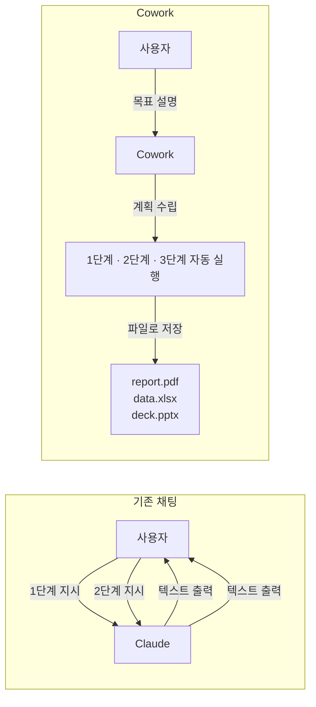
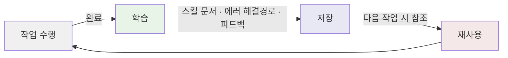
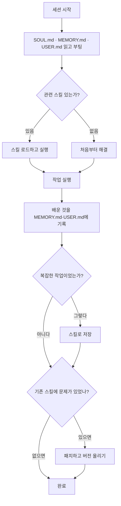
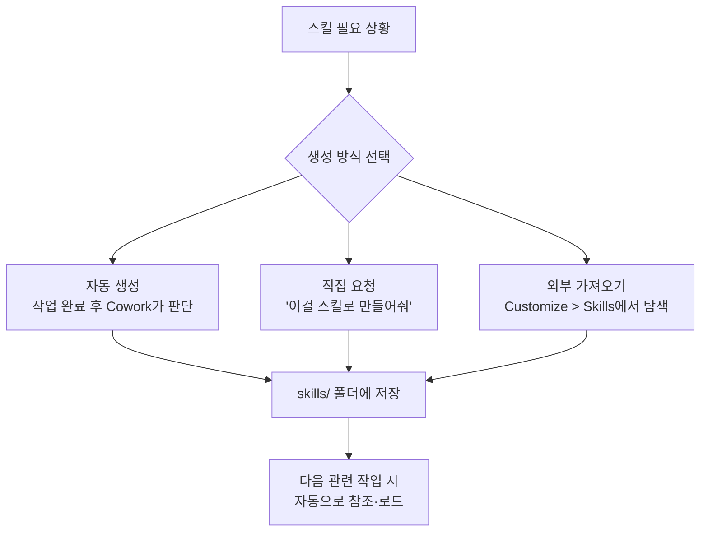
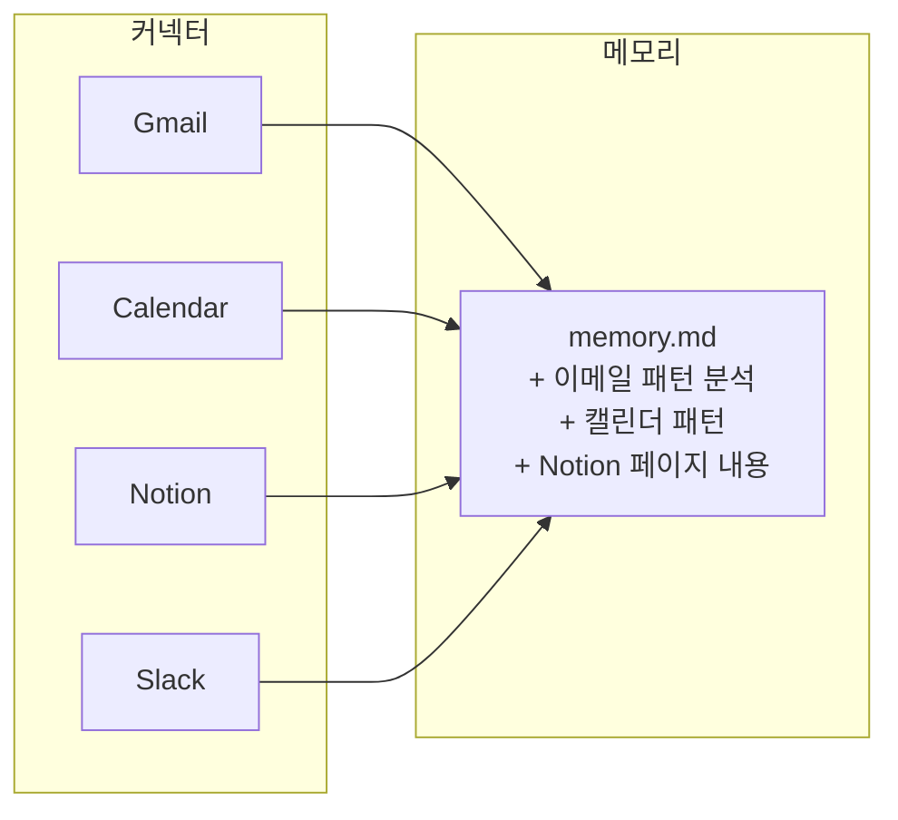
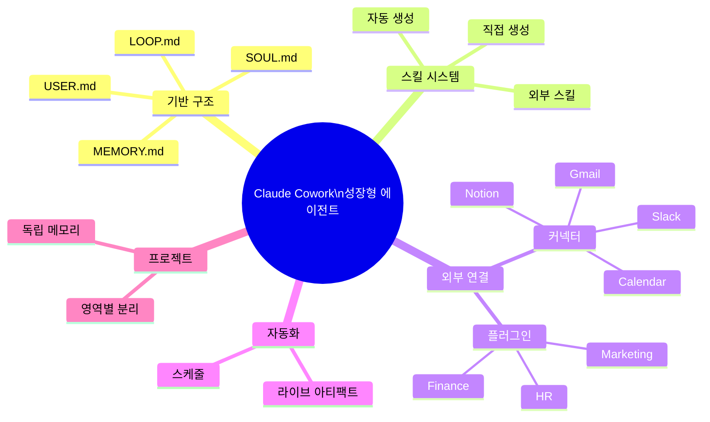
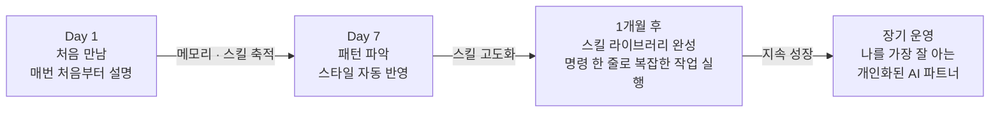

> **출처**: Jay Choi | 인디해커 라이프 유튜브 채널 (2026년 5월 23일 공개)  
> **원본 영상**: [클로드 코워크 완벽 세팅법 (제 설정 다 공개합니다)](https://www.youtube.com/watch?v=Opyk8JzVSyI)  
> **가이드 작성 기준**: 2026년 5월 25일

---

## 목차

1. [이 가이드의 핵심 주제](#1-이-가이드의-핵심-주제)
2. [Claude Cowork란 무엇인가](#2-claude-cowork란-무엇인가)
3. [기존 채팅과 Cowork의 결정적 차이](#3-기존-채팅과-cowork의-결정적-차이)
4. [Cowork의 한계 — 왜 성장하지 못하는가](#4-cowork의-한계--왜-성장하지-못하는가)
5. [Hermes Agent의 폐쇄형 학습 루프 개념](#5-hermes-agent의-폐쇄형-학습-루프-개념)
6. [Agent Skills — Hermes와 Cowork의 공통 표준](#6-agent-skills--hermes와-cowork의-공통-표준)
7. [Cowork에 학습 루프 심기 — 단계별 실습](#7-cowork에-학습-루프-심기--단계별-실습)
8. [생성된 폴더 구조 상세 해설](#8-생성된-폴더-구조-상세-해설)
9. [실제 작업 예시 1 — Gmail 이메일 분석](#9-실제-작업-예시-1--gmail-이메일-분석)
10. [실제 작업 예시 2 — SNS 포스팅 자동 변환](#10-실제-작업-예시-2--sns-포스팅-자동-변환)
11. [스킬(Skills) 심화 활용](#11-스킬skills-심화-활용)
12. [커넥터(Connectors) — 외부 서비스 연결](#12-커넥터connectors--외부-서비스-연결)
13. [플러그인(Plugins) — 분야별 기능 패키지](#13-플러그인plugins--분야별-기능-패키지)
14. [스케줄(Schedule) — 반복 작업 자동화](#14-스케줄schedule--반복-작업-자동화)
15. [프로젝트(Projects) — 영역별 에이전트 분리](#15-프로젝트projects--영역별-에이전트-분리)
16. [라이브 아티팩트(Live Artifacts) — 실시간 대시보드](#16-라이브-아티팩트live-artifacts--실시간-대시보드)
17. [전체 구조 정리](#17-전체-구조-정리)
18. [참고 자료](#18-참고-자료)

---

## 1. 이 가이드의 핵심 주제

이 영상은 Anthropic이 2026년 1월 출시한 **Claude Cowork**를 단순히 "파일을 정리하는 도구"가 아니라, 쓸수록 스스로 학습하고 점점 더 개인화되는 성장형 AI 에이전트로 만드는 방법을 다룹니다.

핵심 아이디어는 하나입니다. Nous Research의 오픈소스 프로젝트인 **Hermes Agent**가 설계한 "폐쇄형 학습 루프(Closed Learning Loop)"라는 원칙을, Cowork 환경에 그대로 이식하는 것입니다. 이 두 프로젝트가 `agentskills.io`라는 동일한 스킬 표준을 따르기 때문에 이런 이식이 가능합니다.

결과적으로 만들어지는 것은 단순한 할 일 처리 도구가 아니라, 복잡한 작업을 해결할 때마다 그 방법을 스킬 문서로 저장하고, 에러를 만날 때마다 해결 경로를 기록하고, 사용자가 피드백을 줄 때마다 그것을 기억하는 에이전트입니다.

---

## 2. Claude Cowork란 무엇인가

Claude Cowork는 Anthropic이 2026년 1월에 출시한 기능으로, Claude Code를 비개발자도 쉽게 쓸 수 있게 만든 도구입니다. 더 정확하게 말하면, Claude Code의 강력한 에이전트 능력을 코딩 말고 일반 사무·지식 업무까지 확장한 버전이라고 볼 수 있습니다.

Anthropic의 공식 설명에 따르면, Claude Code가 개발자의 일하는 방식을 바꿨다면, Cowork는 그 실행력을 모든 사람에게 가져다 주는 것을 목표로 합니다. 즉, 코딩을 전혀 몰라도 복잡한 다단계 작업을 처음부터 끝까지 AI가 알아서 실행해 주는 도구입니다.

Claude Cowork는 Anthropic이 Claude Desktop에 내장한 AI 에이전트 기능으로, 코딩 없이도 복잡한 다단계 업무를 자동 실행할 수 있습니다. "채팅창에 할 일을 말하면, Claude가 파일을 읽고, 수정하고, 웹도 돌아다닌다"는 것이 핵심입니다.

### 접근 방법과 요금

현재 Pro($20/월), Max($100~200/월), Team, Enterprise 유료 플랜에서 사용 가능하며, macOS와 Windows 데스크톱 앱에서만 사용할 수 있고 웹이나 모바일에서는 아직 지원되지 않습니다. Cowork는 가상 머신(VM) 환경에서 격리 실행됩니다. 파일은 로컬에 머물며, 파일 삭제나 수정 전에 사용 승인을 요청합니다.

---

## 3. 기존 채팅과 Cowork의 결정적 차이

Cowork를 처음 접하는 분들이 가장 많이 하는 오해는 "어차피 Claude 채팅이랑 비슷한 거 아니야?"입니다. 실제로는 근본적으로 다릅니다.

### 파일 접근 방식의 차이

기존 채팅에서는 파일을 직접 업로드해야 하며, 한 번에 최대 20개 파일까지만 첨부할 수 있습니다. Cowork는 내 로컬 폴더에 직접 접근하므로 이 제한이 없습니다. 폴더를 하나 지정하면 그 안에 파일이 몇백 개가 있든 전부 읽을 수 있습니다.

### 결과물 형태의 차이

기존 채팅에서 보고서를 요청하면 채팅창에 텍스트로 결과를 출력합니다. 그 텍스트를 복사해서 직접 파일로 저장해야 하는 번거로움이 있습니다. Cowork는 실제 파일을 만들어서 지정한 폴더에 저장합니다. Excel, PDF, PowerPoint, Markdown 등 원하는 형식으로 직접 저장됩니다.

### 작업 방식의 차이

기존 채팅에서는 "이것 해줘", "다음에 저것 해줘" 하나하나 지시해야 합니다. Cowork는 목표를 설명하면 스스로 계획을 세우고, 단계를 나누고, 실행합니다.



---

## 4. Cowork의 한계 — 왜 성장하지 못하는가

대부분의 사람들이 Cowork를 일회성으로 씁니다. 파일 정리를 한 번 하거나, 이메일 답장을 한 번 시키거나. 이렇게 쓰면 큰 문제가 하나 있습니다.

**Cowork는 이전 작업을 기억하지 못합니다.** 새 작업을 시작할 때마다 Cowork는 완전히 처음 만나는 상태로 초기화됩니다. 이전에 내가 어떤 글쓰기 스타일을 선호한다고 알려줬든, 어떤 포맷으로 보고서를 만들었든, 전부 사라집니다.

이것은 Cowork만의 문제가 아니라 대부분의 AI 도구가 공유하는 구조적 한계입니다. 이 한계를 극복하는 방법이 바로 이 영상의 핵심인 **학습 루프 이식**입니다.

---

## 5. Hermes Agent의 폐쇄형 학습 루프 개념

Hermes Agent는 Nous Research가 만든 오픈소스 AI 에이전트 프레임워크입니다. GitHub 스타 수가 빠르게 증가해 가장 빠르게 성장한 오픈소스 에이전트 프레임워크 중 하나가 되었는데, 그 이유는 "폐쇄형 학습 루프(Closed Learning Loop)"라는 독특한 설계 때문입니다.

이 학습 루프의 핵심은 세 가지 상황에서 자동으로 무언가를 기록하는 것입니다.

**첫 번째:** 복잡한 작업을 완료하면 그 처리 방법을 스킬 문서로 저장합니다. 다음에 비슷한 작업이 오면 처음부터 다시 고민하지 않고 저장된 스킬을 꺼내 씁니다.

**두 번째:** 에러를 만나서 해결하면 그 해결 경로를 기록합니다. 같은 에러가 다시 발생했을 때 이전보다 빠르게 처리할 수 있습니다.

**세 번째:** 사용자가 결과물을 수정하거나 피드백을 주면 그 피드백을 기억합니다. 다음 작업에 그 선호도가 반영됩니다.



이 구조가 의미하는 것은, 에이전트를 쓸수록 처음보다 더 잘 해낸다는 것입니다. 해결된 워크플로우를 재사용 가능한 스킬로 전환할 수 있고, 비슷한 작업이 다시 등장하면 에이전트가 해당 스킬을 불러와 이전 단계를 적용하고 개선합니다.

---

## 6. Agent Skills — Hermes와 Cowork의 공통 표준

이 이식이 가능한 기술적 이유가 있습니다. Hermes Agent와 Claude Cowork 둘 다 **agentskills.io**라는 동일한 스킬 표준을 채택하고 있습니다.

Agent Skills는 AI 에이전트에게 새로운 능력과 전문 지식을 부여하기 위한 경량화된 오픈 포맷입니다. 스킬의 핵심 구조는 `SKILL.md` 파일 하나입니다. 이 파일은 스킬의 이름과 설명(메타데이터), 그리고 특정 작업을 수행하는 방법을 에이전트에게 알려주는 지시사항으로 구성됩니다. 스킬은 실행 가능한 스크립트, 참고 자료, 템플릿, 리소스도 함께 포함할 수 있습니다.

```
my-skill/
├── SKILL.md        # 필수: 메타데이터 + 지시사항
├── scripts/        # 선택: 실행 가능한 코드
├── references/     # 선택: 참고 문서
└── assets/         # 선택: 템플릿, 리소스
```

두 시스템이 같은 포맷을 쓰기 때문에, Hermes에서 만든 스킬을 Cowork에서 그대로 활용하거나, 반대로 Cowork에서 만든 스킬을 다른 에이전트와 공유하는 것이 가능합니다.

---

## 7. Cowork에 학습 루프 심기 — 단계별 실습

### 7-1. 작업 폴더 만들기

먼저 Cowork가 작업할 전용 폴더를 하나 만듭니다. 폴더 이름은 자유롭게 설정하면 됩니다. 이 폴더가 앞으로 에이전트의 "작업 공간"이자 "기억 저장소"가 됩니다.

### 7-2. Cowork 앱에서 폴더 지정

Claude Desktop 앱을 열고 Cowork 탭으로 이동한 다음, 방금 만든 폴더를 작업 폴더로 지정합니다.

### 7-3. 핵심 프롬프트로 구조 생성

폴더를 지정한 상태에서 다음과 같이 요청합니다.

```text
헤르메스 에이전트(github.com/NousResearch/hermes-agent)의
폐쇄형 학습 루프 원칙을 참고해서 이 폴더를 성장하는 에이전트
구조로 세팅해줘.
난 이 코워크 환경을 헤르메스 에이전트처럼 세팅하고 싶어.
```

이 요청 하나만으로 Cowork는 Hermes Agent의 GitHub 레포지토리와 공식 문서를 직접 참조한 다음, 폴더 구조를 만들고 필요한 파일들을 작성합니다.

---

## 8. 생성된 폴더 구조 상세 해설

Cowork가 자동으로 생성한 폴더 구조는 다음과 같습니다.

```
cowork/                    ← 작업 루트 폴더
│
├── SOUL.md               ← 에이전트의 정체성과 행동 원칙
├── LOOP.md               ← 학습 루프 운영 프로토콜
├── README.md             ← 전체 구조 설명
│
├── memories/             ← 에이전트 자동 편집 메모리 시스템
│   ├── MEMORY.md         ← 교훈·패턴·도구 특성 축적
│   └── USER.md           ← 사용자 프로필 및 선호도
│
├── skills/               ← 재사용 가능한 업무 매뉴얼
│   ├── _templates/       ← 새 스킬 생성용 템플릿
│   ├── research/         ← 리서치 관련 스킬
│   ├── writing/          ← 글쓰기 관련 스킬
│   ├── coding/           ← 코딩 관련 스킬
│   │   ├── debug-loop/   ← 체계적 디버깅
│   │   └── refactor/     ← 코드 리팩토링
│   └── data/             ← 데이터 처리 스킬
│       ├── csv-cleanup/  ← CSV 데이터 정제
│       └── chart-gen/    ← 시각화 차트 생성
│
├── knowledge/            ← 리서치 결과·참고 자료 저장소
├── sessions/             ← 세션 메타데이터
└── logs/                 ← 작업 로그
```

각 파일과 폴더의 역할을 하나씩 이해하는 것이 중요합니다.

### SOUL.md

에이전트의 정체성과 행동 원칙을 정의합니다. Hermes의 SOUL.md에 대응하는 파일로, "성장하는 파트너"로서의 원칙과 Closed Learning Loop를 정의합니다. 에이전트가 매 세션마다 이 파일을 먼저 읽고 자신의 역할을 인식합니다.

### MEMORY.md와 USER.md

에이전트가 자동으로 편집하는 메모리 시스템입니다. MEMORY.md에는 교훈, 패턴, 도구 특성이 누적되고 대화가 많아질수록 더 정확해집니다. USER.md에는 사용자에 대한 정보를 기록하므로, 쓸수록 사용자를 더 잘 이해하는 에이전트가 됩니다.

### skills/ 폴더

4개 카테고리(research, writing, coding, data)로 구성된 스킬 저장소입니다. 각 스킬은 Trigger(언제 이 스킬을 사용할지), Procedure(처리 절차), Pitfalls(주의사항), Version History(개선 이력) 구조를 가집니다.

### LOOP.md

Solve → Document → Retrieve → Improve → Repeat 루프의 구체적인 운영 프로토콜입니다. 스킬 생성 기준, 메모리 업데이트 빈도, 매 작업 후 자동 점검 체크리스트까지 포함됩니다.

### 에이전트가 작동하는 흐름



---

## 9. 실제 작업 예시 1 — Gmail 이메일 분석

구조 설정이 끝난 다음, 실제로 작동하는지 테스트해봅니다. 첫 번째 예시는 Gmail 이메일 분석입니다.

### 요청

```text
내가 이메일 작업을 많이 하는데, 내 답변 특징을 먼저 파악하고 싶어.
Gmail 확인해서 분석하도록 해.
```

### 처리 과정

Cowork는 Gmail 커넥터를 통해 보낸 메일함에 접근합니다. 대표적인 이메일 30건을 확인하고 전문을 분석한 다음 패턴을 도출합니다.

### 실제 분석 결과 예시

| 항목 | 결과 |
|---|---|
| 분석 메일 수 | 20건 이상 |
| 평균 답변 길이 | 4~6줄 |
| 거절 비율 | 약 70% |
| 사용 언어 | 한국어/영어 이중 언어 |

**구조 패턴:**

1. 인사 + 상대방 이름 호칭
2. 감사 표현(연락·제안에 대해)
3. 본론(수락·거절·질문)
4. 마무리 인사 + 서명

### 핵심: 자동 메모리 기록

작업이 완료되면 Cowork는 스스로 `MEMORY.md`에 이 분석 결과를 기록합니다. "이 사용자는 이메일 답변 시 4~6줄을 선호하고 한영 이중언어를 사용한다"는 정보가 저장됩니다. 이후 이메일 관련 작업을 시킬 때 Cowork가 이 패턴을 자동으로 참조합니다.

---

## 10. 실제 작업 예시 2 — SNS 포스팅 자동 변환

두 번째 예시는 하나의 문서를 여러 SNS 채널에 맞게 변환하는 작업입니다. 콘텐츠 크리에이터, 마케터, 1인 사업자에게 특히 유용한 활용법입니다.

### 상황 설명

2026 Google I/O 관련 자료 파일(docx)을 Cowork에 넣어두고 요청합니다.

### 요청

```text
이 글을 읽고, X용 쓰레드, 링크드인 포스트, 스레드 앱용 포스트로
각각 변환해줘.
플랫폼별 톤이랑 길이를 맞추고, 각각 별도 파일로 저장해줘.
```

### 처리 결과

Cowork는 세 개의 플랫폼 특성을 각각 적용해서 작성합니다.

**X(트위터) 포스트 — 영어, 274자:** BIP 커뮤니티 톤으로 핵심 변화를 불릿 중심으로 날카롭게 정리하고, 마지막에 답변 부담을 낮춘 질문으로 마무리하는 구조

**Threads 포스트 — 한국어, 398자:** "AI한테 물어보는 시대가 끝났다"로 시작해 개인적 감성 중심의 대화체로 작성. X 포스트의 번역이 아니라, 경험 공유 중심의 구조로 완전히 다르게 구성

**LinkedIn 포스트 — 한국어, 1,284자:** 첫 3줄에 강력한 훅을 걸고, 스토리텔링 구조로 전개한 다음 마지막은 실무 적용 관점의 소프트 질문으로 마무리

세 포스트 모두 이모지, 해시태그, 외부 링크, 직접적인 CTA 없이 작성됩니다.

### 자동 스킬 생성

작업이 끝나면 Cowork는 이 과정을 `skills/writing/sns-post/SKILL.md`로 자동 저장합니다. 이 스킬 파일의 내용은 다음과 같은 구조입니다.

```markdown
# Skill: sns-post

원본 콘텐츠를 X, Threads, LinkedIn 등 텍스트 기반 SNS에 맞는 포맷으로 변환한다.

## Trigger
- 사용자가 "X 포스트", "링크드인 글", "SNS 글" 등을 언급할 때
- 긴 콘텐츠를 소셜 미디어로 요약·변환해야 할 때

## Procedure
1. 원본 콘텐츠의 핵심 메시지를 추출한다
2. 타깃 플랫폼의 제약 조건을 확인한다 (X: 280자, LinkedIn: 3000자 등)
3. 플랫폼 톤에 맞춰 초안을 작성한다
4. Hook(첫 문장)이 강렬한지 검토한다
5. 해시태그/맨션을 적절히 추가한다
6. 2~3개 변형을 제시하여 선택하게 한다

## Pitfalls
- X는 링크가 23자로 카운팅됨
- LinkedIn은 "더 보기" 접힘이 ~210자에서 발생
- 각 플랫폼별 최적 게시 시간대가 다름

## Version History
| Version | Date       | Changes   |
|---------|------------|-----------|
| 0.1.0   | 2026-05-21 | 초기 생성 |
```

이 스킬이 저장되고 나면, 다음에 비슷한 요청을 할 때 Cowork는 이 스킬을 자동으로 로드해서 처음부터 고민하는 과정 없이 더 빠르고 정확하게 처리합니다.

---

## 11. 스킬(Skills) 심화 활용

스킬은 두 가지 방식으로 만들 수 있습니다.

**자동 생성:** 앞서 본 것처럼, 작업을 완료한 뒤 Cowork가 스스로 판단해서 스킬로 저장합니다. 사용자가 별도로 요청하지 않아도 됩니다.

**직접 만들기:** 작업을 여러 번 주고받으면서 원하는 결과를 만든 다음 "이 과정을 스킬로 만들어줘"라고 요청합니다. 혹은 처음부터 원하는 스킬을 설계해서 요청해도 됩니다.

**외부 스킬 가져오기:** Cowork 사이드바에서 Customize > Skills로 들어가면 기본 제공 스킬 목록과, 다른 사람이 만든 스킬을 가져오는 기능이 있습니다. `skill-creator`라는 기본 스킬도 포함되어 있는데, 이것을 활용하면 스킬을 만들고 평가하고 개선하는 과정을 구조적으로 진행할 수 있습니다.



---

## 12. 커넥터(Connectors) — 외부 서비스 연결

커넥터는 Cowork를 외부 서비스와 연결하는 기능입니다. Cowork 사이드바에서 Customize > 커넥터를 통해 설정할 수 있습니다.

MCP(Model Context Protocol)를 통해 Google Drive, Slack, Gmail 같은 외부 서비스와 연결할 수 있습니다. 2026년 2월 커넥터 대폭 확장 이후, 조직의 기존 도구들을 Cowork에 연결해서 사용할 수 있습니다.

지원되는 주요 커넥터로는 Gmail, Google Calendar, Notion, Slack, Google Drive 등이 있습니다.

### 커넥터를 연결해야 하는 이유

커넥터의 진짜 가치는 단순히 "편하게 데이터를 가져올 수 있다"는 것이 아닙니다. **커넥터로 들어온 데이터도 메모리에 쌓입니다.** 즉, Gmail을 연결하면 내 이메일 패턴이 memory.md에 누적되고, Calendar를 연결하면 일정 패턴이 기록됩니다. 이 데이터들이 쌓일수록 이후에 내가 직접 설명하지 않아도 Cowork가 알아서 맥락을 파악해서 작업합니다.



최소한 Gmail과 Google Calendar는 연결해두는 것을 권장합니다. 이 두 가지만 연결되어도 일정 기반 리마인드, 이메일 스타일 학습, 맥락 있는 보고서 작성이 가능해집니다.

---

## 13. 플러그인(Plugins) — 분야별 기능 패키지

플러그인은 스킬과 커넥터를 하나로 묶어 놓은 패키지입니다. 특정 분야에서 필요한 스킬과 커넥터를 한 번에 받아볼 수 있습니다.

플러그인 초기(2026년 1월 30일) 당시는 11개의 플러그인이 제공되었고, 이후 업데이트를 통해 HR, 디자인, 엔지니어링, 운영, 재무 분석, 투자은행, 주식 리서치, 프라이빗 에쿼티, 자산 관리 분야 등 다양한 분야의 플러그인이 새롭게 추가되었습니다.

플러그인은 Cowork 사이드바의 Customize > 플러그인 탐색에서 찾아볼 수 있습니다. 필요한 분야의 플러그인을 설치하면 관련 스킬과 커넥터가 한 번에 활성화됩니다.

---

## 14. 스케줄(Schedule) — 반복 작업 자동화

스케줄은 반복 작업을 예약하는 기능입니다. 한 번 설정하면 지정한 시간에 Cowork가 자동으로 실행합니다. 예를 들어 다음처럼 요청할 수 있습니다.

```text
매일 아침 9시에 AI 관련 Reddit 핫 포스트를 확인하고
Cowork 페이지에 기록해줘.
```

이 요청 하나로 스케줄이 등록되고, 사이드바의 Scheduled 탭에서 등록된 작업을 확인할 수 있습니다.

### 스케줄 사용 시 주의사항

스케줄이 돌아가려면 두 가지 조건이 필요합니다. 첫째, 컴퓨터가 켜져 있어야 합니다. 둘째, Claude Desktop 앱이 열려 있어야 합니다. PC가 계속 켜져 있어야 하며 Claude 앱이 켜져 있어야 명령을 실행할 수 있습니다. 설정에서 "절전모드 방지"를 꼭 켜두는 것을 권장합니다.

Cowork 사이드바의 Scheduled 탭 상단에 "절전 모드 방지" 토글이 있습니다. 스케줄을 사용한다면 이 토글을 켜두어야 예약된 시간에 작업이 누락되지 않습니다.

---

## 15. 프로젝트(Projects) — 영역별 에이전트 분리

실생활에서는 다루어야 할 일의 영역이 여러 개입니다. 업무와 개인 생활, 또는 서로 다른 프로젝트들이 섞이면 Cowork가 맥락을 혼동할 수 있습니다.

프로젝트는 이런 맥락 혼동을 방지하기 위해 서로 다른 작업 영역을 독립적으로 분리하는 기능입니다. 각 프로젝트는 자기만의 폴더, 지시사항, 메모리를 가질 수 있습니다. 쉽게 말하면, 프로젝트 하나가 독립된 에이전트 하나라고 생각하면 됩니다.

### 프로젝트 분리 vs. 폴더 역할 분리

이 영상에서는 흥미로운 관점을 제시합니다. 프로젝트를 완전히 분리하기보다, 처음에 만든 하나의 Cowork 폴더 안에서 작업 성격에 따라 하위 폴더를 만들어 역할을 분리하는 방식이 더 유용할 수 있다는 것입니다.

하나의 폴더 안에서 역할을 분리하면 모든 메모리는 공유되면서 작업 영역만 깔끔하게 구분됩니다. 프로젝트를 완전히 나눠버리면 이런 시너지가 사라진다는 점을 고려해서 선택합니다.

---

## 16. 라이브 아티팩트(Live Artifacts) — 실시간 대시보드

라이브 아티팩트는 Cowork의 기능 중 가장 독특한 것 중 하나입니다.

기존 채팅에서 Claude에게 차트나 대시보드를 만들어 달라고 하면, 그 순간의 데이터로 시각화를 보여줍니다. 다음 날 다시 열어보면 어제 데이터 그대로이고, 업데이트하려면 다시 부탁해야 합니다.

라이브 아티팩트는 다릅니다. 한 번 만들어두면 Cowork 사이드바의 Live Artifacts 탭에 영구적으로 저장됩니다. 열 때마다 연결된 커넥터(Google Sheets, YouTube Data API 등)에서 최신 데이터를 자동으로 가져와 업데이트합니다.

예를 들어 YouTube 채널 분석 대시보드를 만들면, 오늘 열면 오늘 기준 데이터가 보이고, 다음 주 열면 다음 주 기준 데이터가 보입니다. 한 번 만들면 계속 쓸 수 있는 나만의 살아있는 대시보드입니다.

### 라이브 아티팩트 생성 예시

```text
내 YouTube 채널 분석 대시보드를 만들어줘.
총 조회수, 총 좋아요, 평균 조회수, 좋아요율을 보여주고
영상별 조회수와 좋아요를 차트로 시각화해줘.
```

이 요청으로 만들어진 대시보드는 YouTube 채널 데이터에 실시간으로 연결되어, 열 때마다 최신 상태를 반영합니다.

---

## 17. 전체 구조 정리

이 영상에서 다룬 내용을 한 장으로 정리하면 다음과 같습니다.



### 이 구조가 만들어내는 변화

처음 설정할 때는 약간의 시간이 필요하지만, 설정이 완료된 이후에는 다음과 같은 일이 자동으로 일어납니다.

첫째, 새 작업을 시킬 때 Cowork는 SOUL.md와 MEMORY.md를 먼저 읽고 내가 어떤 스타일을 선호하는지 파악한 상태로 시작합니다. 둘째, 관련 스킬이 있으면 자동으로 로드해서 기존에 해결한 방식대로 빠르게 처리합니다. 셋째, 작업이 끝나면 스스로 메모리를 업데이트하고 스킬을 개선합니다.

이것이 "쓸수록 성장하는 에이전트"의 실체입니다.



---

## 18. 참고 자료

| 자료 | 링크 |
|---|---|
| 원본 영상 (Jay Choi \| 인디해커 라이프) | https://www.youtube.com/watch?v=Opyk8JzVSyI |
| Hermes Agent GitHub | https://github.com/NousResearch/hermes-agent |
| Agent Skills 공식 문서 | https://agentskills.io |
| Claude Desktop 다운로드 | https://claude.ai/download |
| Anthropic 공식 홈페이지 | https://www.anthropic.com |

---

*이 문서는 Jay Choi | 인디해커 라이프 유튜브 채널의 영상(2026년 5월 23일 공개)을 기반으로, 최신 정보 검색을 통해 보완하여 작성되었습니다.*
