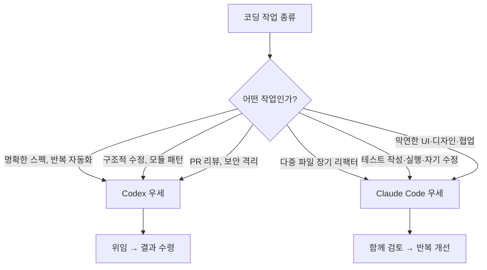
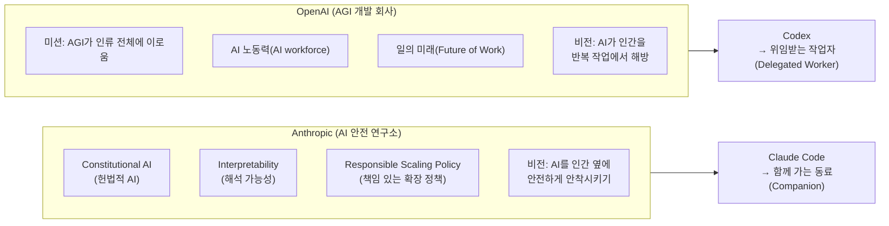
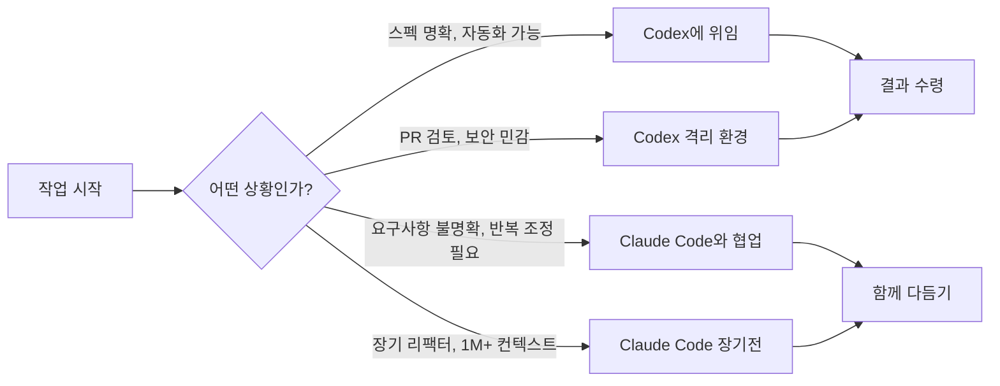
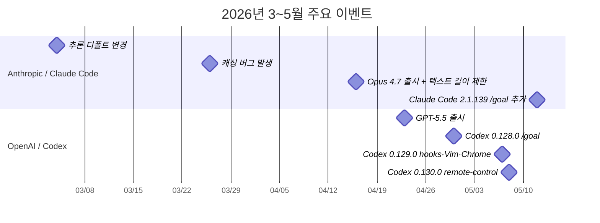

> **출처**: 요즘IT (yozm.wishket.com) — [「정말로 지금은 Codex가 Claude Code보다 나을까?」](https://yozm.wishket.com/magazine/detail/3771/)  
> **작성 기준 시점**: 2026년 5월  
> **요약**: 두 도구는 경쟁 관계가 아니라 역할이 다른 한 쌍에 가깝다. 맡기고 결과를 받는 작업엔 Codex, 옆에서 함께 조율해야 하는 작업엔 Claude Code가 더 잘 맞는다.

---

## 목차

1. [배경: 왜 지금 이 비교가 나왔는가](#1-배경)
2. [균열의 세 가지 원인](#2-균열의-세-가지-원인)
3. [성능 비교: 작업 유형별 우세 도구](#3-성능-비교-작업-유형별-우세-도구)
4. [한도·컨텍스트·접근성 비교](#4-한도-컨텍스트-접근성-비교)
5. [철학 비교: 두 회사의 정체성](#5-철학-비교-두-회사의-정체성)
6. [설계 철학이 도구에 반영된 방식](#6-설계-철학이-도구에-반영된-방식)
7. [결론: 싸우지 말고 같이 쓴다](#7-결론)
8. [주요 타임라인 정리](#8-주요-타임라인-정리)

---

## 1. 배경

2026년 초반, AI 코딩 에이전트를 쓰는 개발자들 사이에서 **Claude Code**는 사실상 기본값이었습니다. "코딩 에이전트 뭐 써요?" 라고 물으면 열에 아홉은 Claude Code를 꼽을 정도였습니다. 매일 쓰는 도구로 단단하게 자리 잡은 상태였고, 경쟁 도구가 그 지위를 흔들 것이라고 생각한 사람은 많지 않았습니다.

그런데 2026년 5월 들어 상황이 조금씩 달라졌습니다. 커뮤니티에서 **Codex**가 좋다는 말이 슬그머니 늘기 시작했습니다. 물론 이 평가에는 객관성 문제가 있었습니다. 이미 Claude Code에 실망해서 Codex로 넘어간 사람들이 주로 목소리를 냈기 때문입니다. 실망 이후의 비교는 새 도구에 관대하고 옛 도구에 엄격하기 마련입니다.

그렇기 때문에 이 글은 **공식 자료를 1차 소스**로 삼고, 외부 측정 데이터와 커뮤니티 분석을 더해 최대한 균형 잡힌 비교를 시도합니다. 결론부터 말하면, 둘 중 하나가 압도적으로 낫다는 단정은 내리기 어렵습니다. 다만 **Codex는 위임과 자동화에, Claude Code는 협업과 검증에** 강점이 있다는 구도 정도는 명확히 보입니다.

---

## 2. 균열의 세 가지 원인

Claude Code의 독보적 우위가 흔들리기 시작한 데에는 세 가지 원인이 복합적으로 작용했습니다.

### 2-1. 토큰 효율: GPT-5.5 > Opus 4.7

2026년 4월 16일, Anthropic이 **Claude Opus 4.7**을 출시했습니다. 이 버전에는 새로운 토크나이저가 탑재됐는데, 같은 영문 텍스트를 이전보다 **더 많은 토큰으로 매핑**한다는 것이 문제였습니다.

공식 가이드는 기존 대비 **1.0~1.35배** 수준의 토큰 증가를 안내했지만, 외부 측정 결과는 영문·코드 기준으로 **1.20~1.47배**까지 올라갔습니다. 수치로 보면 대수롭지 않아 보이지만, 실제 사용자 입장에서는 체감이 컸습니다. 주간 한도가 더 빨리 차기 때문입니다. "복잡한 프롬프트 하나 던지면 5시간 한도의 절반이 그 자리에서 빠진다"는 개발자 불만이 Reddit 등 커뮤니티에서 쏟아졌습니다.

반대로 4월 23일, OpenAI는 **GPT-5.5**를 발표하면서 Codex가 **이전 GPT-5.4 대비 더 적은 토큰으로 더 나은 결과**를 낸다고 밝혔습니다. AI 도구 비교 플랫폼 **Vellum**은 약 **40%의 토큰 효율** 향상을 보고했고, AI 빌딩 플랫폼 **MindStudio**의 분석에서는 GPT-5.5가 Opus 4.7 대비 **약 72% 적은 토큰**을 사용한다는 수치도 제시됐습니다.

두 도구를 직접 비교한 측정 글에서는 "같은 작업에 Claude Code가 토큰을 4배 더 쓴다"는 결론도 있었습니다.

```
토큰 효율 요약
─────────────────────────────────────────
Opus 4.7 토크나이저   → 기존 대비 1.20~1.47배 더 많은 토큰 사용
GPT-5.5 (Codex)      → GPT-5.4 대비 ~40% 효율 향상
GPT-5.5 vs Opus 4.7  → GPT-5.5가 약 72% 적은 토큰 사용 (MindStudio 기준)
```

### 2-2. Codex가 따라잡은 기능들

토큰 효율 문제와 맞물려, Codex CLI는 2026년 4~5월 사이에 굵직한 기능들을 연달아 출시했습니다. 이 기능들의 상당수는 Claude Code가 먼저 정착시킨 영역이었지만, Codex가 이를 빠르게 따라잡으며 격차를 좁혔습니다.

| 날짜 | 버전 | 주요 업데이트 내용 |
|------|------|--------------------|
| 4월 30일 | 0.128.0 | `/goal` 워크플로 도입: 여러 턴, 여러 세션, 날짜에 걸친 목표를 설정·추적하는 기능 |
| 5월 7일 | 0.129.0 | `/hooks` 브라우저, Vim 모드, 플러그인 워크스페이스 공유 동시 출시. Chrome 확장도 별도 공개 |
| 5월 8일 | 0.130.0 | `codex remote-control` (모바일·데스크톱 작업 인계), AWS Bedrock 자격증명 연동, 플러그인 공유 메타데이터 |

특히 주목할 부분은 `/goal` 기능입니다. 이것은 **랄프 루프(ralph Loop) 방법론**을 소프트웨어 워크플로로 구현한 것으로, 원래 Codex가 먼저 만들고 Claude Code가 뒤따라 출시한 사례입니다. hooks, Vim 모드, Chrome 확장, 모바일 연계 등은 Claude Code 생태계가 먼저 다진 영역이지만, 이제 Codex도 동등한 수준에서 제공하게 됐습니다.

### 2-3. Claude Code 내부의 아쉬움

Codex가 성장하는 동안 Claude Code 쪽에서는 실망스러운 소식이 이어졌습니다. 외부 측정과 커뮤니티 피드백을 종합하면 3~5월 사이에 다음과 같은 사건들이 있었습니다.

**AMD 시니어 디렉터 스텔라 로렌조(Stella Laurenzo)의 측정 결과**가 가장 구체적입니다. 그는 Opus 4.7 출시 이후 **6,852개 세션과 234,760번의 도구 호출**을 분석했는데, 다음과 같은 수치 하락을 확인했습니다.

- **사고 깊이(thinking depth) 중앙값: 67% 하락**
- **편집 1회당 파일 읽기 수: 6.6개 → 2.0개로 감소**

이는 모델이 실제 코드를 이해하는 과정에서 전보다 훨씬 피상적으로 처리한다는 의미로 해석됩니다.

이러한 성능 변화의 배경으로 지목된 세 가지 사건은 다음과 같습니다.

1. **3월 4일**: 추론(reasoning) 디폴트 설정 변경
2. **3월 26일**: 캐싱 버그 발생
3. **4월 16일**: Opus 4.7 출시와 동시에 엄격한 텍스트 길이 제한 프롬프트로 변경

어제까지 잘 쓰던 도구가 갑자기 달라졌을 때 사용자가 느끼는 배신감은 크고, 한 번 신뢰를 잃으면 그 이후의 모든 행동이 불신의 렌즈로 해석됩니다. 이것이 커뮤니티의 여론이 빠르게 기울어진 배경입니다.

---

## 3. 성능 비교: 작업 유형별 우세 도구

여러 비교 글, 커뮤니티 후기, 1차 벤치마크 수치를 종합해 작업 유형별로 정리합니다. **2026년 5월 시점 기준**이며, 사례에 따라 반대 결과도 존재합니다.



### 3-1. Codex가 나은 영역

#### ① 일상 코딩 — 특히 명확한 스펙이 있을 때

Reddit 등 커뮤니티 댓글 500개 이상을 분석한 dev.to 메타분석에 따르면, **65%의 개발자가 데일리 코딩에는 Codex를 더 선호**한다고 응답했습니다.

핵심 이유는 두 가지입니다.

첫째, **토큰 효율**입니다. "Codex Plus $20로 종일 돌려도 막히지 않는데, Claude Code는 복잡한 프롬프트 하나에 5시간 한도 절반이 날아간다"는 경험담이 공통적으로 등장합니다.

둘째, **흐름 끊김 없이 끝까지 진행하는 설계**입니다. "Codex는 권한을 묻느라 멈추는 일 없이 끝까지 가는데, Claude Code는 자꾸 확인을 요청하며 멈춘다"는 평이 많습니다. 스펙이 명확하면 사람이 매 단계 확인할 필요가 없으므로, 한 번 권한을 잡으면 자율적으로 완료하는 Codex의 설계가 빛을 발합니다.

#### ② 구조적 수정 — 상위 모듈 패턴 인식

잘 구조화된 코드베이스, 충분한 타입 체크와 테스트가 가드레일로 갖춰진 환경에서 **다중 파일을 한꺼번에 자율적으로 변환**하는 작업에서 Codex가 높은 평가를 받습니다. SitePoint의 분석은 "Codex는 잘 구조화된 코드베이스와 타입/테스트 환경에서 다중 파일 변경을 자율적으로 잘 처리한다"고 정리했습니다.

단, 이것은 타입과 테스트가 충분한 환경이라는 전제가 붙습니다. 레거시 코드나 문서화가 부족한 환경에서의 비교는 별개입니다.

#### ③ PR 리뷰 및 샌드박스 격리

dev.to의 분석은 "Codex PR 리뷰어는 어느 도구보다 낫지만, 실제 코딩은 Claude Code가 데일리 드라이버"라는 평가를 소개합니다.

보안 측면에서도 Codex는 기본값에서 더 엄격합니다. **커널 레벨 격리**(Seatbelt + Landlock/seccomp)와 **Codex Cloud의 격리 컨테이너**가 기본 제공되기 때문에, 출처를 알기 어려운 PR을 검토하는 상황에서 안전 측면에서 우위가 있습니다.

---

### 3-2. Claude Code가 나은 영역

#### ① 다중 파일·8시간 이상 장기 리팩터

벤치마크 수치에서 차이가 가장 두드러지는 영역입니다.

- **SWE-bench Pro**: Opus 4.7 **64.3%** vs GPT-5.4 **57.7%**
- **SWE-bench Verified**: Opus 4.7 **87.6%** vs GPT-5.4 **74.9%**

MindStudio는 "Opus 4.7은 다중 파일 리팩터링과 버그 재현에서 특히 강한데, 실제 코드베이스에서 정말 중요한 영역이 바로 이 부분이다"라고 분석했습니다.

ticnote의 직접 비교에서도 "지저분한 요구사항을 끌고 가는 장기 작업은 Opus 4.7 쪽이 답을 보여주고, Codex는 빠르고 도구 호출이 많은 짧은 루프에서 빛난다"고 정리했습니다.

컨텍스트 윈도우 측면에서도 Claude Code는 **1M 토큰 컨텍스트를 추가 요금 없이 정식 지원**합니다. 반면 Codex는 현재 **400K가 기본이고, 1M은 opt-in 요청 단계**에 머물러 있습니다. 따라서 수십 개의 파일을 동시에 불러와 수 시간 동안 작업해야 하는 대규모 리팩터링에서는 Claude Code가 자연스럽습니다.

#### ② 테스트 작성·실행·자기 수정

Reddit 500개 이상 후기의 메타분석에 따르면, Claude Code가 만든 코드는 "더 깔끔하고, 관용적이고, 구조가 잘 잡혀 있다"는 평가가 많습니다. Opus 4.7이 테스트 통과 기반 벤치마크에서 우세한 점도 이와 맞물립니다.

단, 수정 루프의 속도 자체는 Codex가 더 빠르다는 보고도 있습니다. 정리하자면 이렇습니다.

> **최종 결과물의 품질**을 우선하면 → **Claude Code**  
> **수정 루프의 속도**를 우선하면 → **Codex**

#### ③ 막연한 UI·디자인·사람 손맛 카피

요구사항이 명확하지 않고, 여러 파일에 걸쳐 시각적으로 다듬어야 하는 프론트엔드 작업에서는 Claude Code가 강점을 보입니다. MindStudio는 "Claude는 UI나 디자인 시스템처럼 사람이 직접 마주하는 영역에서 자연스러운 선택"이라고 했습니다.

한국 개발자 sean_kk의 클린 환경 비교 후기에는 흥미로운 뉘앙스가 있었습니다. "Codex 결과물은 디자인이 훨씬 세련됐는데, 오류가 나거나 동작이 어긋났다"는 것입니다. 이것이 의미하는 바는 이렇습니다.

> **디자인 발상과 시각적 세련미** → Codex가 더 인상적일 수 있다  
> **동작 정확성·세부 조정까지의 완결성** → Claude Code 쪽이 더 낫다

---

## 4. 한도·컨텍스트·접근성 비교

### 4-1. 5시간 세션 기준 토큰 한도

| 구분 | 플랜 | 토큰/메시지 한도 |
|------|------|------------------|
| **Claude Code** | Max 5x | 약 88K 토큰 (헤비 유저 측정 기반 추정, Anthropic 미공식) |
| **Claude Code** | Max 20x | 약 220K 토큰 (헤비 유저 측정 기반 추정) |
| **Codex** | Plus ($20) | 15~80개 메시지 |
| **Codex** | Pro ($100) | 80~400개 메시지 |
| **Codex** | Pro ($200) | 300~1,600개 메시지 |

> **주의**: Codex의 메시지 한도는 "메시지 1개 = 작업 1건"이 아닙니다. 작업 복잡도에 따라 가중치가 달라지므로 단순 수치 비교는 주의가 필요합니다.  
> Claude Code의 수치는 TokenMix 등 헤비 유저의 측정 기반 추정이며, Anthropic이 공식으로 공시한 수치가 아닙니다.

### 4-2. 컨텍스트 윈도우 한계

| 도구 | 최대 컨텍스트 | 추가 요금 |
|------|--------------|-----------|
| **Claude Code** | 1M 토큰 | 없음 (정식 지원) |
| **Codex** | 400K 토큰 (기본) | 1M은 opt-in 요청 단계 |

### 4-3. 외부 도구 접근성 변화

Claude Code에는 중요한 정책 변경이 예고돼 있습니다. 외부 세션을 여는 `claude -p` 명령어가 **월간 크레딧 기반**으로 바뀔 예정이라는 발표가 있었습니다.

슬랙이나 텔레그램 봇을 통해 Claude Code 세션과 직접 소통하는 구조를 운영 중인 팀이라면 이 변경이 상당한 영향을 줄 수 있습니다. 실제로 Anthropic이 **OpenClaw 연결을 일시 차단**한 사례도 있었습니다. 외부 도구 연동이 업무 흐름의 핵심인 사용자라면, 이 접근성 정책이 앞으로 어떻게 전개될지를 주시해야 합니다.

---

## 5. 철학 비교: 두 회사의 정체성

성능 수치만으로는 설명되지 않는 차이가 있습니다. 두 도구를 만드는 회사의 정체성이 도구의 설계와 동작 방식에 직접 영향을 미치고 있기 때문입니다.



### 5-1. Anthropic의 정체성

Anthropic은 스스로를 **AI 안전 연구소이자 공익 법인(Public Benefit Corporation)** 으로 정의합니다. 세 가지 핵심 원칙이 회사 전반을 관통합니다.

- **헌법적 AI(Constitutional AI)**: 모델이 따라야 할 원칙을 명문화하고, 그 원칙에 따라 스스로를 평가하도록 학습시키는 방법론입니다.
- **해석 가능성(Interpretability)**: 인간이 모델 내부를 들여다볼 수 있어야 한다는 원칙입니다. 블랙박스 AI가 아니라 설명 가능한 AI를 지향합니다.
- **책임 있는 확장 정책(Responsible Scaling Policy)**: 모델의 능력이 올라가기 전에 단계별 안전 인증을 받아야 한다는 정책입니다.

이 모든 원칙의 방향은 하나로 수렴합니다. **AI를 인간 옆에 안전하게 안착시키는 것**입니다.

### 5-2. OpenAI의 정체성

OpenAI는 스스로를 **AGI를 만드는 회사**로 정의합니다. 공식 미션은 "AGI가 인류 전체에 이로움을 준다"입니다. 커뮤니케이션에서 자주 등장하는 어휘가 회사의 방향을 잘 드러냅니다. **AI 노동력(AI workforce)**, **일의 미래(Future of Work)**, **대규모 자율 노동**이 반복적으로 사용됩니다.

이 비전에서 AI는 인간을 반복 작업에서 해방시키는 **자율적 노동력**입니다.

---

## 6. 설계 철학이 도구에 반영된 방식

두 회사의 정체성 차이는 도구의 구체적인 동작 방식에 그대로 들어가 있습니다.

### 6-1. Claude Code의 설계: 협업과 공동 관리

Claude Code에서는 안전을 외부 가드레일이 아니라 **모델 내부**에 두려 합니다. 학습 단계에서부터 공을 들이는 방식입니다.

메모리 구조도 이 철학을 반영합니다. 사용자가 직접 쓰는 **CLAUDE.md**와 모델이 스스로 작성하는 **자동 메모리(Auto Memory)** 가 함께 작동하는 구조입니다. 인간과 모델이 시스템을 **공동으로 관리**하는 흐름이죠.

작업 방식도 사용자가 옆에서 함께 참여하는 구조입니다.
- 작동의 거의 모든 단계에 **hooks**를 걸어 개입할 수 있습니다.
- CLAUDE.md와 자동 메모리에 **합의된 구조**를 쌓아갑니다.
- 슬래시 커맨드로 묶은 팀 워크플로를 **skills**로 공유합니다.

공식 문서에 자주 등장하는 단어도 이 방향을 반영합니다. **팀 동료**, **프로그래밍 지원**, **엔진** 같은 표현이 반복됩니다.

Agent Teams 공식 문서에는 이런 문장이 있습니다. "팀 동료가 각자 자신의 컨텍스트 안에서 독립적으로 일하면서 서로 직접 소통한다." 에이전트끼리도 상호작용하는 방식을 지향하는 것입니다.

### 6-2. Codex의 설계: 위임과 자율 운항

Codex Cloud의 페이지는 제목부터 다릅니다. **"클라우드의 Codex에게 위임하라(Delegate to Codex in the cloud)"**. 인간은 매니저(manager), Codex는 일꾼(worker)이라는 노동 분업의 메타포가 전면에 있습니다.

운영 구조도 위임에 최적화돼 있습니다.
- 처음부터 **Auto·Read-only·Full Access** 세 단계 권한 프로파일이 내장돼 있습니다.
- 클라우드 환경에서 **격리된 채 병렬로** 여러 작업이 동시에 굴러갑니다.

공식 문서에 자주 등장하는 단어도 다릅니다. **위임**, **자동 운항**, **사전 설정**, **인계** 같은 표현이 반복됩니다.

Subagents 구조도 이 철학을 반영합니다. 각 지점에 에이전트를 한 명씩 보내고, 전부 끝날 때까지 기다린 다음 결과를 모아 요약하는 방식입니다. Claude Code의 에이전트들이 서로 실시간으로 소통하는 방식과 대비됩니다.

### 6-3. 두 설계 철학의 핵심 차이 요약

| 구분 | Claude Code | Codex |
|------|-------------|-------|
| **핵심 메타포** | 함께 가는 동료(Companion) | 위임받는 작업자(Delegated Worker) |
| **안전 위치** | 모델 내부 (학습 단계에서) | 외부 격리 환경 (커널, 컨테이너) |
| **메모리 구조** | 사용자 CLAUDE.md + 모델 자동 메모리 공동 관리 | 사전 설정 권한 프로파일 기반 |
| **에이전트 소통** | 에이전트끼리 실시간 상호작용 | 순차적 처리 후 결과 취합 |
| **사용자 역할** | 매 단계 개입 가능한 파트너 | 권한 경계를 정해두는 매니저 |
| **핵심 키워드** | 팀 동료, 검증, 협업, 엔진 | 위임, 자동화, 격리, 인계 |

---

## 7. 결론

### 어떤 작업에 어떤 도구를?

두 도구를 둘러싼 수많은 분석과 커뮤니티 의견을 종합했을 때 도달하는 결론은 이렇습니다. **두 도구는 경쟁 구도가 아니라 역할이 다른 짝**에 가깝습니다.



**Codex를 우선 선택할 때**
- 요구사항이 명확하고 중간 확인 없이 자율적으로 처리하길 원할 때
- 토큰 한도가 빨리 차는 것에 불만이 있을 때
- PR 리뷰, 보안 격리가 중요한 환경
- 짧은 루프로 빠르게 반복하는 작업

**Claude Code를 우선 선택할 때**
- 대규모 코드베이스, 수십 개 파일에 걸친 장기 리팩터링
- 요구사항이 모호하고 협업하며 다듬어야 하는 프론트엔드·UI
- 테스트 작성과 자기 검증이 결과물에 포함돼야 할 때
- 기존에 쌓아온 CLAUDE.md 컨텍스트와 팀 워크플로가 중요할 때

**둘 다 쓸 때**
가장 이상적인 방식은 **두 도구를 함께 사용하는 것**입니다. 하나의 작업물에 대해 두 도구가 각자의 결과를 내고 서로 다른 의견을 내도록 활용할 수 있고, 작업 단위에 따라 더 나은 결과를 내는 도구에 위임하는 전략도 가능합니다.

### 앞으로의 변수들

이 비교는 **2026년 5월 시점** 기준입니다. 코딩 에이전트 시장은 단기간에 바뀝니다. 주시해야 할 변수들이 있습니다.

- **Claude Opus 5.0 또는 GPT-5.6의 등장**: 어느 한쪽이 기습적으로 치고 올라오면 균형추가 다시 기울 수 있습니다.
- **Cursor 등 에디터 기반 도구**: IDE와 더 깊이 통합된 방향으로 발전하며 이 구도에 끼어들 가능성이 있습니다.
- **Google의 Antigravity 2.0**: 첫 등장은 아쉬운 평가를 받았지만, Claude Code·Codex와 유사한 방향성을 가졌습니다. 빠른 속도로 따라잡고 있어 주시가 필요합니다.
- **Claude Code 외부 접근성 정책**: `claude -p`의 월간 크레딧 전환이 어떤 영향을 미칠지는 아직 불확실합니다.

AI 도구가 빨라질수록, 어떤 도구를 쓰느냐보다 **여러 도구의 사각지대를 어떻게 겹쳐서 덮느냐**가 중요해집니다. 도구를 쓰기 위해 일을 하는 게 아니라, 내 일의 문제를 풀기 위해 도구를 쓰는 것이기 때문입니다.

---

## 8. 주요 타임라인 정리



### 각 이벤트 상세 설명

**Anthropic / Claude Code**

- **3월 4일** — 추론(reasoning) 디폴트 설정 변경. 일부 사용자가 이후 사고 깊이 저하를 경험하기 시작.
- **3월 26일** — 캐싱 버그 발생. 작업 연속성과 결과 일관성에 영향을 미쳤다는 보고가 이어짐.
- **4월 16일** — Claude Opus 4.7 출시와 동시에 엄격한 텍스트 길이 제한 프롬프트로 변경. AMD 스텔라 로렌조의 분석에 따르면 이 시점 이후 사고 깊이 중앙값이 67% 하락.
- **5월 12일** — Claude Code 2.1.139 업데이트로 /goal 기능 추가. Codex의 /goal을 뒤따른 것.

**OpenAI / Codex**

- **4월 23일** — GPT-5.5 발표. Codex 작업에서 GPT-5.4 대비 약 40% 토큰 효율 향상 발표 (Vellum 기준).
- **4월 30일** — Codex CLI 0.128.0 출시. /goal 워크플로 도입. 여러 세션과 날짜에 걸친 목표 설정·추적 가능.
- **5월 7일** — Codex CLI 0.129.0 출시. /hooks 브라우저, Vim 모드, 플러그인 워크스페이스 공유 동시 출시. Chrome 확장 별도 공개.
- **5월 8일** — Codex CLI 0.130.0 출시. codex remote-control(모바일·데스크톱 작업 인계), AWS Bedrock 자격증명 연동 추가.

---

## 참고 자료

본 문서는 아래 출처를 바탕으로 작성되었습니다.

- [Codex vs Claude Code: honest guide after weeks of testing](https://dev.to) — 500개 이상 Reddit 댓글 메타분석 포함
- [Claude Code vs Codex 2026: What 500 Reddit Developers Really Think](https://dev.to)
- [Codex CLI vs Claude Code 2026](https://sitepoint.com)
- [Codex vs Claude Code](https://ticnote.com)
- "Ask HN: Is Codex really on Par with Claude Code?" — Hacker News 스레드
- MindStudio — GPT-5.5 vs Opus 4.7 토큰 효율 분석
- Vellum — Codex 토큰 효율 벤치마크
- Codex Changelog (공식) — 0.128.0 ~ 0.130.0 릴리즈 노트
- AMD 시니어 디렉터 스텔라 로렌조(Stella Laurenzo) — Opus 4.7 이후 6,852개 세션 분석
- OpenAI Help Center — Codex rate card
- 원문 출처: [요즘IT — 정말로 지금은 Codex가 Claude Code보다 나을까?](https://yozm.wishket.com/magazine/detail/3771/)

---

*이 문서는 2026년 5월 기준 정보를 담고 있으며, 코딩 에이전트 시장은 빠르게 변화합니다. 새로운 모델 출시나 정책 변경에 따라 이 비교는 달라질 수 있습니다.*
