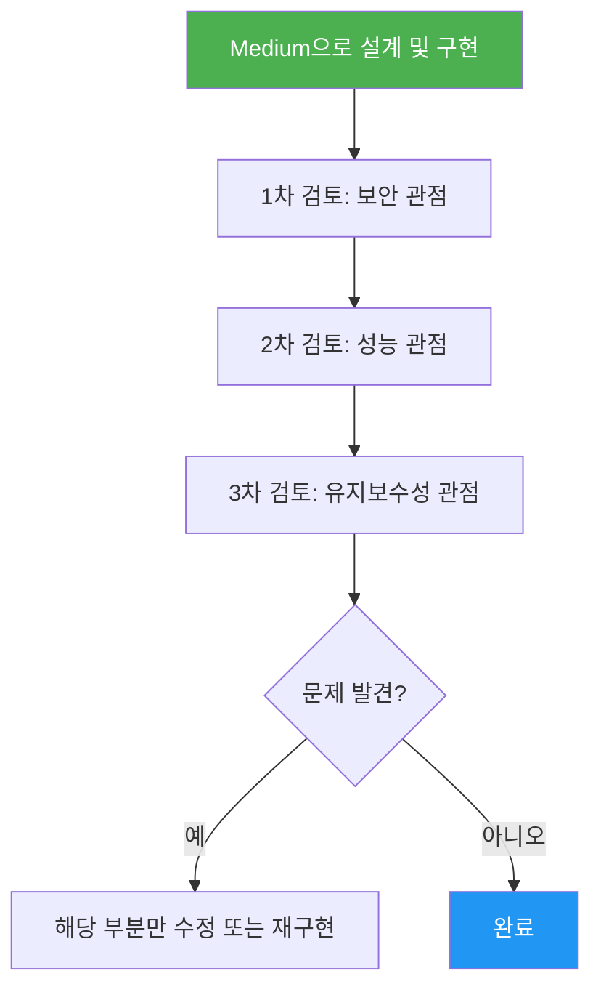
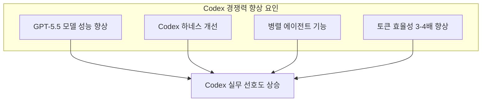
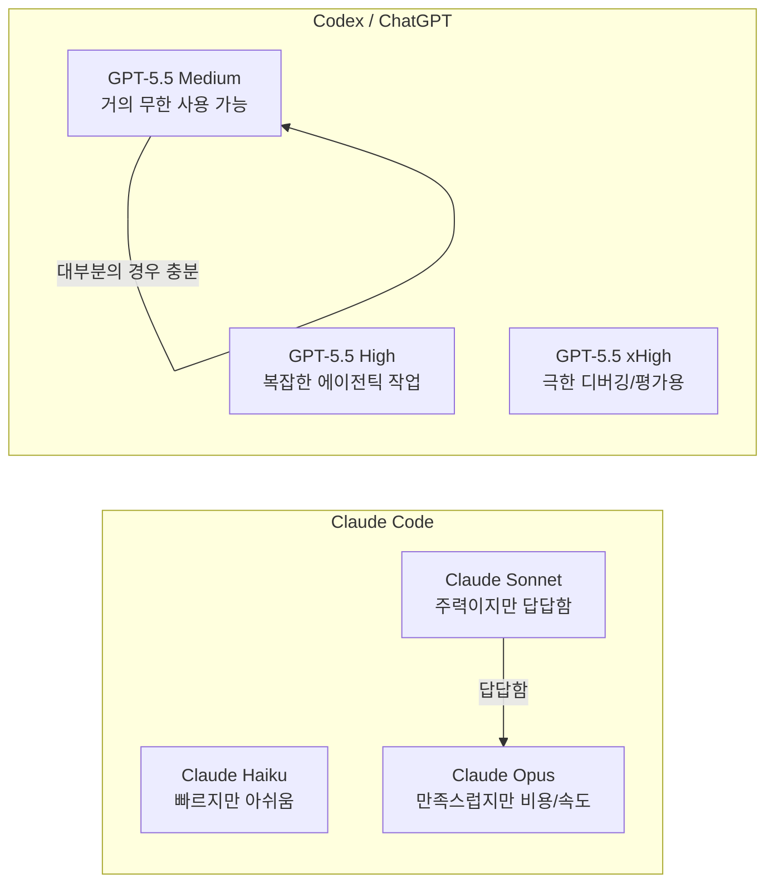
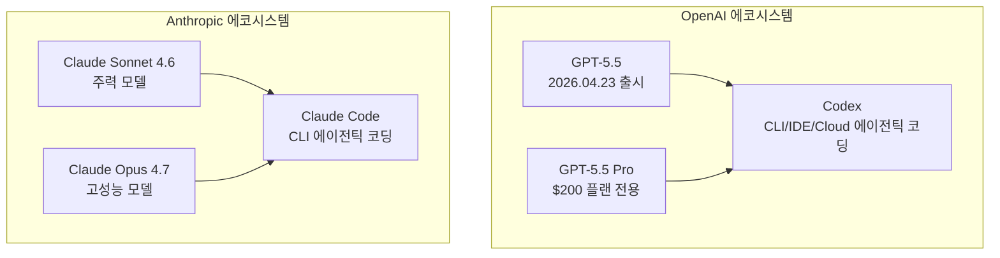

> 출처: Threads @golbin (골빈해커) 포스트 및 관련 댓글 스레드 기반 분석  
> 최신 공개 정보(2026년 5월 기준)를 포함하여 상세 서술

---

## 1. 배경: GPT-5.5란 무엇인가

GPT-5.5는 OpenAI가 2026년 4월 23일에 출시한 플래그십 추론 모델이다. OpenAI는 이 모델을 "복잡한 전문 업무를 위한 가장 지능적인 모델"로 소개했다. GPT-5.5는 단순히 더 똑똑한 모델이 아니라, **추론 수준(reasoning effort)을 사용자가 직접 조절할 수 있다**는 점에서 이전 세대와 구조적으로 다르다.

ChatGPT 및 Codex를 통해 Plus, Pro, Business, Enterprise 플랜 사용자에게 순차적으로 배포되었으며, API 접근은 4월 24일부터 시작되었다. 가격은 API 기준 입력 토큰 100만 개당 $5, 출력 100만 개당 $30으로, 전작인 GPT-5.4 대비 약 2배 높다.

---

## 2. 추론 수준(Reasoning Effort) 시스템의 구조

GPT-5.5의 가장 핵심적인 특징은 `reasoning.effort` 파라미터다. 이 파라미터는 다섯 단계로 구성된다.

각 수준의 특성은 다음과 같다.

- **none**: 추론 과정 없이 바로 응답. 음성 응답, 빠른 정보 검색, 분류 작업처럼 응답 속도가 절대적으로 중요한 경우에 사용한다.
- **low**: 효율적 추론. 지연 시간에 민감하지만 여전히 도구 사용, 계획 수립, 다단계 의사결정이 필요한 워크플로에 적합하다.
- **medium (기본값)**: 지연 시간, 성능, 비용의 균형을 맞춘 추천 출발점이다. OpenAI가 공식적으로 권장하는 기본 설정이다.
- **high**: 추론이 어렵고 지연 시간보다 품질이 더 중요한 복잡한 에이전틱 작업에 사용한다.
- **xhigh**: 가장 어려운 비동기 에이전틱 작업, 또는 모델의 지능 한계를 시험하는 평가(eval)용. OpenAI는 eval 시 이 설정을 기본으로 사용한다.

> **OpenAI 공식 입장**: "더 높은 추론 수준이 자동으로 더 좋은 것은 아니다. 충돌하는 지침이나 약한 종료 기준, 개방형 도구 접근 상황에서는 오히려 과도한 추론, 불필요한 검색, 출력 품질 저하로 이어질 수 있다."

---

## 3. @golbin의 실무 경험: Medium이 왜 High/xHigh보다 나은가

골빈해커(@golbin)는 GPT-5.5를 소프트웨어 설계 및 구현에 집중적으로 사용하는 개발자로, 실무 경험을 바탕으로 흥미로운 관찰을 공유했다.

### 3-1. 설계·구현에서의 Medium의 우위

그의 핵심 주장은 간단하다. **대부분의 설계 및 구현 케이스에서 Medium이 High보다 오히려 낫다**는 것이다. xHigh가 효과를 발휘하는 경우는 "매우 고난이도의 디버깅"이 필요한 극히 제한적인 상황으로 좁혀진다.

이는 OpenAI의 공식 문서와도 일치한다. 높은 추론 수준은 단순히 "더 많이 생각"하는 것이 아니라, 지시 사항 이상의 것을 스스로 하려는 경향을 만들어낸다. 한 댓글 참여자도 이 점을 지적하며 "5.5도 4.7도 xhigh의 경우에는 지시한 것 다음의 작업까지 하려 해서 의도대로 동작하지 않는 것 같다"고 말했다. 즉, 추론 수준이 높을수록 모델이 **'과잉 행동(over-execution)'** 을 하는 부작용이 생긴다.

반면 Medium은 지시한 범위 안에서만 충실하게 작동하는 경향이 있어, 특히 에이전틱 코딩처럼 작업 단위를 명확히 구분해야 하는 환경에서 더 예측 가능한 결과를 낸다.

### 3-2. 다면적 검토 전략

Medium을 사용해 설계 및 구현을 진행한 뒤, 동일한 작업물을 **보안, 성능, 유지보수성 등 서로 다른 시각에서 서너 번 검토**시키는 방법이 처음부터 High/xHigh를 사용하는 것보다 전체적으로 낫다고 결론 내렸다. 다만, **어떤 관점으로 검토를 시킬지는 여전히 사람이 판단해야 한다**는 점을 솔직하게 인정했다. 이 부분은 아직 자동화되지 않은 영역이다.

---

## 4. 토큰 사용량과 비용 효율: Medium의 압도적인 장점

| 추론 수준 | $200 플랜 기준 주간 1% 소모 시간 | 동시 작업 |
|---------|-------------------------------|---------|
| xHigh   | 30분 ~ 1시간                   | 단일    |
| Medium  | 약 10시간                       | 두세 개 동시 가능 |

xHigh를 사용하면 월 $200 플랜에서 주간 사용량의 1%를 단 30분~1시간 만에 소진하지만, Medium으로는 두세 개 작업을 동시에 돌려도 10시간에 1%밖에 쓰지 않는다. @golbin의 표현을 빌리면 "진짜 거의 무한대로 느껴진다."

이 차이는 에이전틱 코딩 환경에서 특히 중요하다. Codex처럼 장시간 실행되는 비동기 작업을 여러 개 병렬로 돌릴 때, xHigh로는 금방 한도에 부딪히지만 Medium은 사실상 하루 종일 돌릴 수 있는 수준이다.

다른 댓글 참여자도 "저도 보안 리뷰 제외하고는 미디엄인데, 불만 없이 쓰고 있네요. 클코에 비해서 토큰이 너무 널널함"이라며 같은 경험을 공유했다. 

---

## 5. ChatGPT Pro 모델의 특별한 위치

이는 공개된 정보와 일치한다. ChatGPT Pro ($200/mo)에서 제공되는 **GPT-5.5 Pro**는 일반 GPT-5.5와 달리 병렬 테스트 타임 컴퓨트(parallel test-time compute)를 활용하는 별도 변형 모델이다. API 가격 기준으로도 GPT-5.5 Pro는 입력 $30/백만 토큰, 출력 $180/백만 토큰으로 일반 GPT-5.5 대비 6배 비싸다.

샘 알트만도 xHigh를 공개적으로 언급한 바 있으며, 일부 사용자들은 지침 준수율 면에서 xHigh가 Medium보다 확실히 높다는 의견을 댓글에서 피력했다. 실무 경험은 개인차가 있지만, "면밀히 설계된 작업"과 "즉흥적인 요청" 사이에서 결과가 갈린다는 점은 공통적이다.

---

## 6. Codex vs Claude Code: 현재 여론은 왜 Codex 쪽인가

포스트의 또 다른 주요 주제는 OpenAI의 **Codex**와 Anthropic의 **Claude Code** 비교다.

### 6-1. "CC가 최고다" → "Codex가 최고다" 여론 전환의 배경

불과 1~2년 전만 해도 Claude Code(CC)가 에이전틱 코딩 도구의 선두라는 인식이 지배적이었다. @golbin은 그 시기에도 꾸준히 "Codex가 더 나은 에이전틱 코딩 도구"라고 주장해왔으며, 현재는 그의 주장이 다수 여론과 일치하는 방향으로 바뀌었다.

이 전환의 원인에 대해 @golbin은 단호하게 답했다. **"모델과 하네스가 둘 다 좋아졌습니다."** 어느 한 가지 이유가 아니라는 것이다.

### 6-2. "겉보기"와 "속"의 차이

Claude는 답변의 언어적 표현력이 풍부하고, 코드와 함께 제공하는 설명과 UI 결과물의 완성도가 높다. "그냥 해줘"라고 명령했을 때 눈에 보이는 결과물이 인상적으로 나오는 경향이 있다. 그러나 **실무에서는 제대로 만드는 것이 중요**하고, 전문가는 애초에 "그냥 해줘"가 아니라 면밀히 설계한 후 작업을 시키기 때문에, 그 기준에서는 GPT(Codex)가 이전부터 더 나았다는 것이다.

이는 매우 중요한 관찰이다. AI 도구 평가에서 흔히 발생하는 **'표현 편향(presentation bias)'** — 결과물이 얼마나 그럴듯하게 보이느냐가 실제 코드 품질보다 더 크게 인식에 영향을 미치는 현상 — 을 정확히 지적하고 있다.

### 6-3. 실제 벤치마크 현황 (2026년 5월 기준)

현재 공개된 벤치마크를 그대로 받아들이기 전에 맥락을 이해할 필요가 있다.

| 벤치마크 | GPT-5.5 (Codex) | Claude Opus 4.7 (Claude Code) | 비고 |
|---------|----------------|-------------------------------|------|
| SWE-bench Verified | **88.7%** | 87.6% | OpenAI 발표 |
| SWE-bench Pro | — | **64.3%** | Anthropic 발표 |
| Terminal-Bench 2.0 | **82.7%** | — | OpenAI 발표 |

주의할 점은 두 회사가 서로 다른 테스트 세트를 사용한다는 것이다. SWE-bench Verified는 선별·통제된 문제 세트이고, SWE-bench Pro는 더 어려운 실제 멀티파일 문제를 사용한다. **각 회사가 자신들이 유리한 변형에서 점수를 발표하는 구조**다. 따라서 원시 벤치마크 수치만으로 우열을 판단하기는 어렵다.

실사용 측면에서는, 2026년 3월 기준으로 Claude Code가 하루에 최대 32만 6,000개의 GitHub 커밋을 생성하는 수준의 채택률을 기록했다는 데이터가 있다. 이는 실제 개발 현장에서 두 도구 모두 광범위하게 사용되고 있음을 보여준다.

---

## 7. Claude Code의 한계: Sonnet으로는 답답하다

댓글 스레드에서 또 하나 주목할 만한 지적이 나왔다. **Claude Code에서 Claude Sonnet 모델을 사용하면 답답함이 느껴진다**는 것이다.

한 참여자는 "클코는 Opus 안 쓰면 답답해지는데"라고 말하며, Codex에서 Medium을 써도 전혀 불만이 없는 경험과 대조시켰다. 이에 대해 @golbin은 "Opus의 reasoning 레벨이 다른 정도"라고 설명하며, GPT에도 mini 버전이 별도로 있다는 점을 언급했다.

이는 두 에코시스템의 구조적 차이를 보여준다.

Claude Code 생태계에서는 Sonnet이 주력 모델이지만, 실제로 만족스러운 결과를 얻으려면 Opus를 써야 하는 상황이 자주 생긴다. 그런데 Opus는 속도와 비용 모두 부담이 크다. 반면 Codex/ChatGPT에서는 Medium이 이미 실무에서 충분한 수준을 제공하면서도 사용량 부담이 극히 낮다. 이것이 현재 많은 개발자들이 Codex 쪽으로 기울어지는 실질적인 이유 중 하나다.

---

## 8. 프론트엔드 디자인: 도구의 사용 방식이 결과를 결정한다

한 댓글 참여자는 "프론트 디자인의 경우 너무 엉성하게 큰 공백, 줄 띄움 등 기본적인 것도 못해주던데, 프론트도 클코보다 더 낫다고 보시나요?"라고 물었다.

이 답변에는 그의 전체 철학이 압축되어 있다. AI 코딩 도구를 평가할 때 "그냥 해줘" 수준의 프롬프트로 얻는 결과와, 구체적인 설계(Figma든 텍스트로 구체화된 디자인 명세든)를 전제로 한 결과는 근본적으로 다른 척도다. 그에게 "그냥 해줘"는 프로토타입에나 사용할 수 있는 방식이며, 실제 제품 개발에는 적합하지 않다. 따라서 프론트엔드에서 두 도구를 비교할 때도 "무엇을 얼마나 구체적으로 지시했느냐"가 결과를 좌우한다.

---

## 9. 요약: 실무 개발자에게 주는 핵심 시사점

이 스레드 전체에서 얻을 수 있는 시사점을 정리하면 다음과 같다.

**추론 수준 선택 원칙**

작업의 성격에 따라 추론 수준을 의도적으로 선택해야 한다. 대부분의 설계·구현 작업에는 Medium이 충분하고, 과도한 수준은 오히려 지시를 벗어난 행동을 유발한다. xHigh는 극한의 디버깅이나 성능 평가 목적으로 아껴 써야 한다.

**다면적 검토 전략**

한 번 높은 수준으로 완벽하게 만들려 하기보다, Medium으로 구현한 뒤 여러 관점에서 반복 검토하는 방식이 결과적으로 더 낫다. 단, 어떤 관점으로 검토할지는 여전히 사람의 판단이 필요하다.

**도구 평가 기준**

"그냥 해줘" 수준의 결과로 도구를 평가하면 표현력과 디자인 감각이 뛰어난 쪽이 유리하게 보인다. 실무적 기준은 "면밀한 설계를 전제로 했을 때 얼마나 정확하게 구현하는가"다.

**Codex vs Claude Code**

현재 Codex에 대한 긍정적 여론은 모델(GPT-5.5)과 하네스(Codex 시스템) 두 가지 모두의 개선이 맞물린 결과다. Claude Code는 표현력과 Opus 모델에서의 품질이 강점이지만, Sonnet 수준에서의 실용성과 토큰 효율성 측면에서 현재 Codex에 밀리는 경향이 있다. 두 도구의 병행 사용이 현실적인 선택이다.

---

## 참고: 관련 모델 및 도구 계보

---

*작성일: 2026년 5월 25일*
