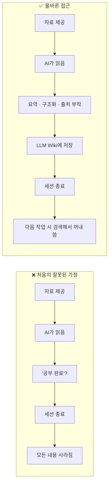
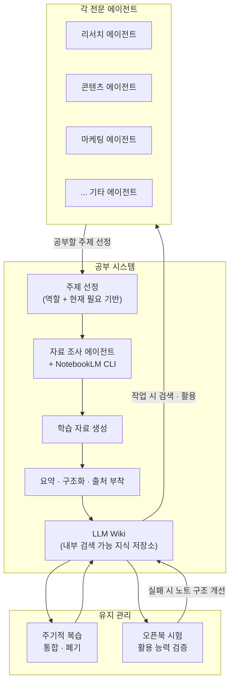
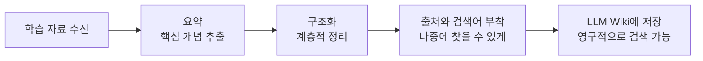
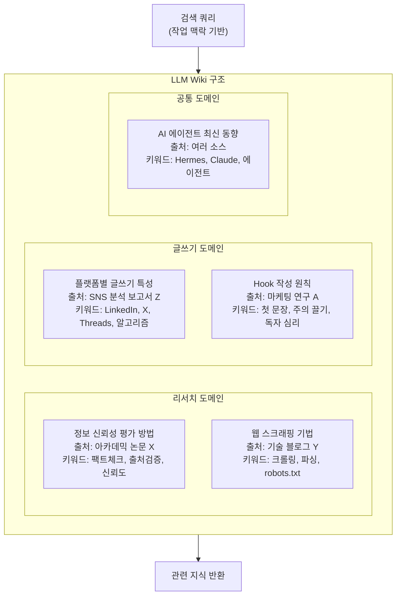
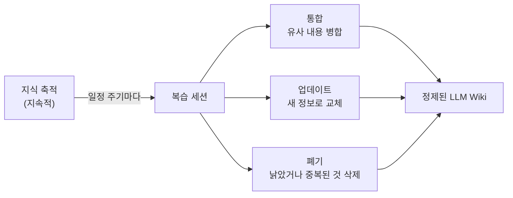
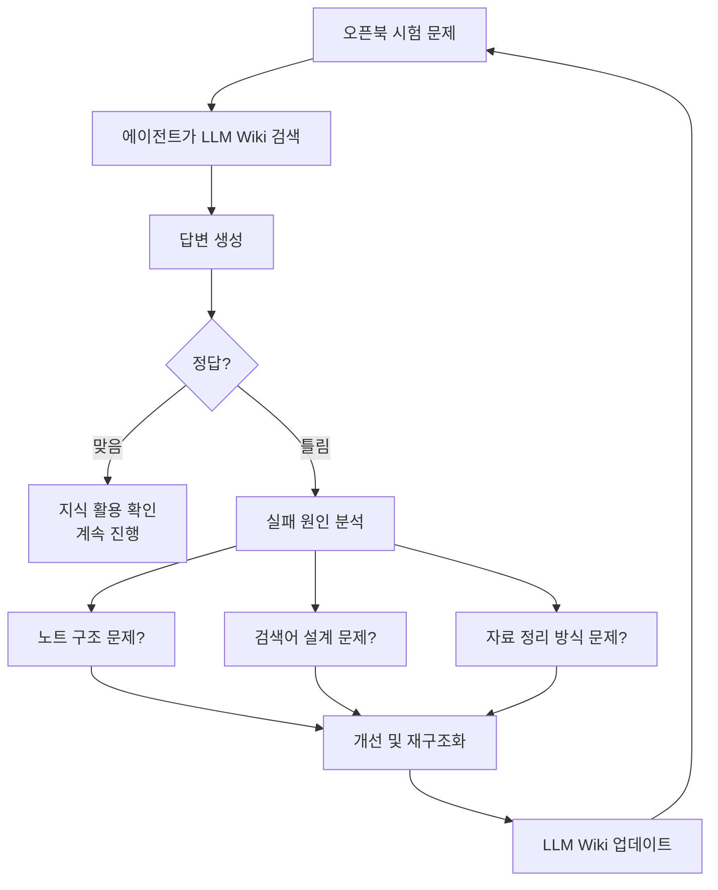
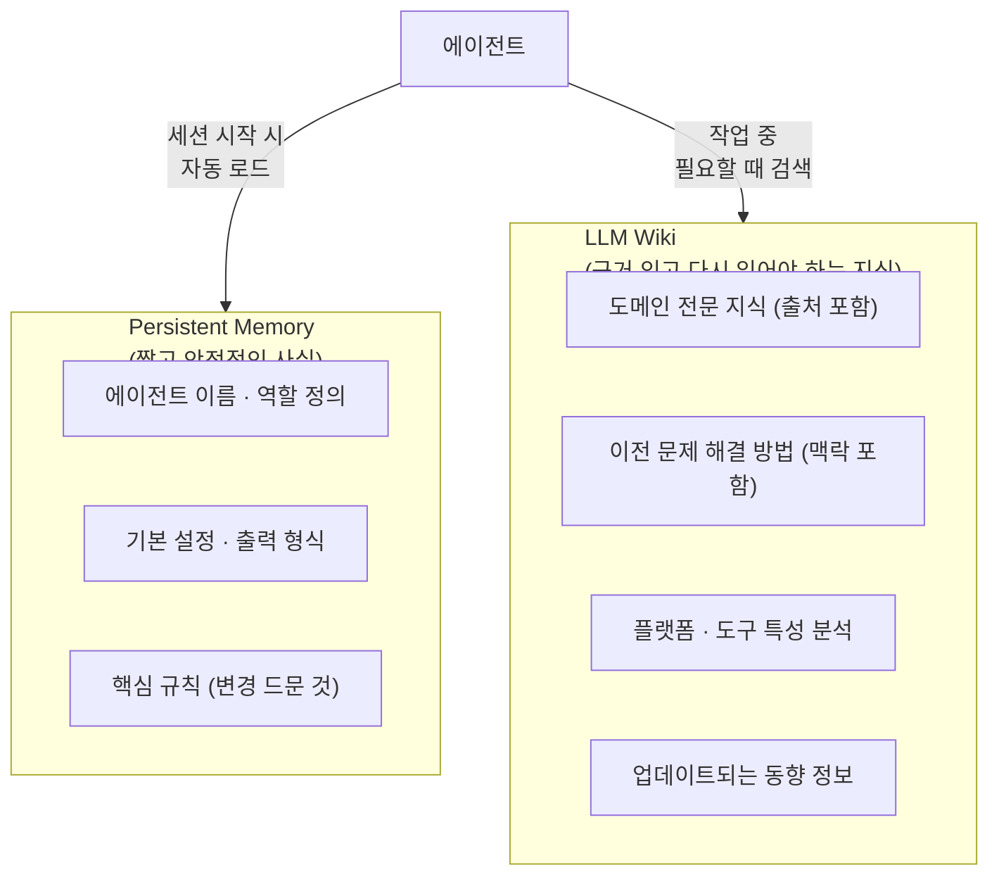

> **출처**: Threads [@black.d.raccoon](https://www.threads.com/@black.d.raccoon/post/DYv1VWEE_up) 포스트  
> **가이드 작성 기준**: 2026년 5월 25일

---

## 목차

1. [왜 이 시스템이 필요한가](#1-왜-이-시스템이-필요한가)
2. [핵심 통찰 — AI 학습의 본질 문제](#2-핵심-통찰--ai-학습의-본질-문제)
3. [시스템 전체 구조](#3-시스템-전체-구조)
4. [NotebookLM CLI란 무엇인가](#4-notebooklm-cli란-무엇인가)
5. [자료 조사 에이전트의 역할](#5-자료-조사-에이전트의-역할)
6. [각 Agent가 공부 주제를 고르는 방식](#6-각-agent가-공부-주제를-고르는-방식)
7. [단순 읽기에서 구조화된 저장으로](#7-단순-읽기에서-구조화된-저장으로)
8. [LLM Wiki — 검색 가능한 지식 저장소 설계](#8-llm-wiki--검색-가능한-지식-저장소-설계)
9. [지식 쌓임의 문제 — 쓰레기장이 되지 않으려면](#9-지식-쌓임의-문제--쓰레기장이-되지-않으려면)
10. [오픈북 시험 — 진짜 활용이 되는지 검증하는 방법](#10-오픈북-시험--진짜-활용이-되는지-검증하는-방법)
11. [Persistent Memory와 LLM Wiki의 역할 분리](#11-persistent-memory와-llm-wiki의-역할-분리)
12. [이 시스템이 전제하는 AI 학습의 정의](#12-이-시스템이-전제하는-ai-학습의-정의)
13. [아직 열려 있는 질문들](#13-아직-열려-있는-질문들)

---

## 1. 왜 이 시스템이 필요한가

멀티 에이전트 시스템을 운영하다 보면 한 가지 한계에 자연스럽게 부딪힙니다. 각 에이전트가 자신의 역할을 수행하는 것은 가능하지만, **시간이 지날수록 더 잘하게 되는 구조**를 만드는 것은 전혀 다른 문제입니다.

Hermes에서 리서치 에이전트, 콘텐츠 에이전트, 마케팅 에이전트처럼 역할이 나뉜 구조를 운영할 때, 각 에이전트의 전문성을 키우려면 어떻게 해야 할까요? 이 Threads 포스트는 그 질문에 대한 실험적인 접근을 담고 있습니다.

목표는 단순합니다. **에이전트가 나중에 작업할 때 이전에 공부한 내용을 실제로 활용하게 만드는 것.** 그리고 이것이 생각보다 훨씬 까다로운 문제라는 것을 발견하는 과정이 이 글의 핵심입니다.

---

## 2. 핵심 통찰 — AI 학습의 본질 문제

이 시스템을 설계하면서 가장 먼저 마주친 문제는 "AI가 공부한다"는 것이 무슨 의미인지에 대한 오해였습니다.

처음의 직관은 이랬습니다. **자료를 조사해서 AI에게 읽히면 공부가 된다.** 사람이 책을 읽으면 지식이 쌓이듯, AI에게 문서를 읽히면 그 내용이 남을 것이라고 생각했습니다.

문제는 금방 드러났습니다. **세션이 끝나면 읽었던 내용은 사라집니다.** AI는 컨텍스트 윈도우 안에서는 방금 읽은 내용을 활용할 수 있지만, 세션이 닫히는 순간 그 모든 것은 초기화됩니다. 읽었다는 사실만으로는 아무것도 남지 않습니다.

이 통찰이 시스템 설계 방향을 바꿨습니다. AI의 "학습"은 사람의 학습과 근본적으로 다르게 설계되어야 합니다. 세션이 끝난 뒤에도 다시 찾고 쓸 수 있는 형태로 남아야 비로소 학습이라고 부를 수 있습니다.

---

## 3. 시스템 전체 구조

이 공부 시스템의 전체 구조를 먼저 파악하고, 이후 각 구성 요소를 상세히 살펴봅니다.

---

## 4. NotebookLM CLI란 무엇인가

이 시스템에서 학습 자료를 만드는 핵심 도구로 **NotebookLM CLI**를 사용합니다. 이것이 무엇인지 먼저 이해해야 합니다.

### NotebookLM이란

NotebookLM은 Google이 개발한 소스 기반 AI 리서치 도구입니다. 일반적인 챗봇이 인터넷 전체 지식으로 답하는 것과 달리, NotebookLM은 사용자가 직접 업로드한 문서만을 바탕으로 요약, Q&A, 브리핑을 생성합니다. PDF, 구글 문서, 웹페이지, 유튜브 링크 등 다양한 소스를 처리할 수 있으며, Audio Overview(팟캐스트 형식 요약) 기능으로도 유명합니다.

### NotebookLM CLI의 등장

기존 NotebookLM의 문제는 모든 기능이 웹 UI에 갇혀 있다는 점이었습니다. 노트북을 여러 개 관리하거나, 정기적으로 소스를 추가하거나, 다른 AI 에이전트와 연동하려면 일일이 브라우저를 클릭해야 했습니다.

`notebooklm-mcp-cli`는 이 한계를 해결합니다. 2026년 1월 대규모 리팩터링을 통해 기존에 분리되어 있던 CLI 패키지(`notebooklm-cli`)와 MCP 서버 패키지(`notebooklm-mcp-server`)가 `notebooklm-mcp-cli`라는 단일 패키지로 통합되었습니다.

이 도구를 사용하면 NotebookLM의 거의 모든 기능을 터미널 명령어와 AI 에이전트에서 프로그래밍 방식으로 사용할 수 있습니다. Hermes 에이전트가 자동으로 NotebookLM에 자료를 추가하고, 요약을 생성하고, 결과를 다시 가져오는 파이프라인 구축이 가능해집니다.

다만 이 도구는 공식 API가 없는 환경에서 리버스 엔지니어링으로 만들어진 실험적 도구임을 인식해야 합니다. Google의 정책 변화에 따라 동작 방식이 바뀔 수 있습니다.

---

## 5. 자료 조사 에이전트의 역할

이 시스템에는 **자료 조사를 전담하는 에이전트**가 하나 있습니다. 이 에이전트의 역할은 다음과 같습니다.

첫째, 다른 에이전트들이 공부하기로 선정한 주제에 대해 자료를 수집합니다. 웹 검색, 문서 파싱, 유튜브 자막 추출 등 다양한 방법으로 원자료를 확보합니다.

둘째, 확보한 원자료를 NotebookLM CLI를 통해 NotebookLM 노트북에 추가합니다. NotebookLM의 소스 기반 처리 능력을 활용해서 자료 간의 관계를 분석하고 요약된 학습 자료를 생성합니다.

셋째, 생성된 학습 자료를 각 에이전트에게 전달합니다. 하지만 이 전달 단계에서 단순히 넘겨주는 것으로 끝나지 않습니다. 다음 단계에서 설명할 구조화 과정이 핵심입니다.

---

## 6. 각 Agent가 공부 주제를 고르는 방식

각 에이전트는 무작위로 공부 주제를 받는 것이 아니라, 두 가지 기준으로 스스로 주제를 선정합니다.

**첫 번째 기준: 자기 역할.** 리서치 에이전트라면 리서치 방법론, 정보 신뢰성 평가, 데이터 수집 기법을 공부할 것이고, 콘텐츠 에이전트라면 플랫폼별 글쓰기 특성, 바이럴 구조, 독자 심리를 공부할 것입니다.

**두 번째 기준: 현재 필요한 주제.** 최근 작업에서 부족함을 느낀 영역, 실패한 작업에서 드러난 지식 공백, 다가오는 작업에서 필요할 것으로 예상되는 내용이 주제 선정에 반영됩니다.

이 두 기준의 결합이 중요합니다. 역할만 고려하면 추상적이고 일반적인 공부가 되기 쉽고, 현재 필요만 고려하면 근시안적이 될 수 있습니다. 역할이라는 장기 방향과 현재 필요라는 단기 필요가 함께 작동할 때 유용한 공부가 됩니다.

---

## 7. 단순 읽기에서 구조화된 저장으로

핵심 문제를 해결하기 위한 실질적인 변화가 여기서 일어납니다. 학습 자료를 받았을 때 **단순히 읽고 끝내는 것이 아니라**, 다음 과정을 거치도록 설계했습니다.

**요약:** 학습 자료의 핵심 개념과 주요 주장을 추출합니다. 원문 전체를 저장하는 것이 아니라 핵심만 압축합니다.

**구조화:** 추출한 내용을 계층적으로 정리합니다. 어떤 개념이 상위이고 어떤 것이 하위인지, 어떤 개념들이 서로 관련되는지를 명시적으로 표현합니다.

**출처와 검색어 부착:** 이 단계가 특히 중요합니다. 나중에 다른 작업을 할 때 이 지식이 필요한 상황에서 실제로 검색해서 찾을 수 있어야 하기 때문입니다. 원본 출처, 핵심 키워드, 이 지식이 유용한 상황 등을 함께 저장합니다.

**LLM Wiki에 저장:** 이렇게 구조화된 지식을 내부 검색 가능한 저장소에 저장합니다. 세션이 끝나도 사라지지 않는 형태로 남아 있게 됩니다.

이 과정의 목적은 명확합니다. 나중에 다른 작업을 할 때 검색해서 꺼내 쓸 수 있게 만드는 것. 공부 자체가 목적이 아니라, 나중에 일할 때 실제로 활용되는 지식을 만드는 것이 목적입니다.

---

## 8. LLM Wiki — 검색 가능한 지식 저장소 설계

**LLM Wiki**는 이 시스템의 핵심 구성 요소입니다. 에이전트들이 공부한 내용이 쌓이는 내부 지식 저장소로, 다음 특성을 가져야 합니다.

**검색 가능성:** 에이전트가 작업 중에 관련 지식이 필요할 때 키워드나 맥락으로 검색해서 즉시 꺼낼 수 있어야 합니다. 단순히 파일을 폴더에 쌓아두는 것이 아니라, 검색 인덱스가 구성되어 있어야 합니다.

**출처 추적 가능성:** 저장된 모든 지식에는 어디서 왔는지 출처가 명시되어야 합니다. 에이전트가 지식을 활용할 때 필요하면 원본을 다시 참조할 수 있어야 하고, 지식의 신뢰도를 판단하기 위해서도 출처가 필요합니다.

**버전 관리:** 지식은 시간이 지나면서 업데이트됩니다. 이전 버전과 현재 버전이 어떻게 다른지 추적할 수 있어야 합니다.

**접근 권한 구조:** 모든 에이전트가 모든 지식에 접근하는 것이 항상 적합하지는 않습니다. 어떤 지식은 특정 역할의 에이전트에게만 관련이 있습니다.

---

## 9. 지식 쌓임의 문제 — 쓰레기장이 되지 않으려면

공부 시스템에서 간과하기 쉬운 문제가 있습니다. **그냥 계속 쌓기만 하면 지식이 아니라 쓰레기장이 됩니다.**

시간이 지나면서 다음과 같은 문제들이 발생합니다. 중복된 내용이 여러 형태로 저장됩니다. 오래된 정보가 최신 정보와 뒤섞입니다. 서로 모순되는 내용이 공존합니다. 검색 결과가 너무 많아져서 정작 필요한 것을 찾기 어렵습니다.

이것을 방지하기 위해 **일정 주기마다 복습과 정리**를 거치도록 설계했습니다.

**통합:** 비슷한 주제를 다루는 여러 항목을 하나의 더 완성된 항목으로 병합합니다. 이 과정에서 각 항목의 가장 좋은 부분이 살아남습니다.

**업데이트:** 시간이 지나 낡은 정보는 최신 내용으로 교체합니다. 특히 빠르게 변하는 분야(AI 기술, 플랫폼 알고리즘 등)에서는 이 작업이 중요합니다.

**폐기:** 더 이상 유효하지 않거나 중복된 내용은 과감하게 삭제합니다. 정보 저장소의 품질을 유지하려면 추가만큼이나 삭제도 중요합니다.

이 정리 작업도 자동화하는 것이 이상적입니다. 사람이 일일이 지식 저장소를 관리하는 것은 현실적으로 지속 가능하지 않습니다.

---

## 10. 오픈북 시험 — 진짜 활용이 되는지 검증하는 방법

공부했다고 해서 실제로 활용할 수 있는 것은 아닙니다. 이 시스템은 **주기적인 오픈북 시험**을 통해 에이전트가 정말로 필요한 자료를 찾아서 활용할 수 있는지 검증합니다.

### 오픈북 시험의 설계 원칙

오픈북 시험이란 에이전트가 LLM Wiki에 자유롭게 접근하면서 문제를 풀도록 하는 방식입니다. 지식을 암기했는지가 아니라, 필요한 지식을 적시에 찾아서 올바르게 적용할 수 있는지를 평가합니다.

이 방식을 선택한 이유는 실제 작업 상황과 가장 유사하기 때문입니다. 에이전트가 실제 작업을 할 때도 모든 것을 "외워서" 처리하지 않고, 필요한 지식을 저장소에서 검색해서 꺼내 씁니다. 오픈북 시험은 그 과정을 정확하게 재현합니다.

### 실패했을 때 무엇을 보는가

시험에서 에이전트가 틀렸을 때, 이 시스템은 에이전트를 탓하지 않습니다. 대신 다음 세 가지를 점검합니다.

**노트 구조:** 해당 지식이 적절하게 계층화되어 있는가? 필요한 내용이 너무 깊은 곳에 묻혀 있지는 않은가?

**검색어:** 사용한 검색어로는 관련 지식이 제대로 검색되지 않았는가? 검색어 설계가 잘못된 것은 아닌가?

**자료 정리 방식:** 원본 자료의 핵심 내용이 제대로 추출되어 저장되었는가? 중요한 내용이 요약 과정에서 빠진 것은 아닌가?

이 관점이 중요한 이유가 있습니다. 에이전트의 실패를 에이전트의 능력 문제로 돌리면 개선할 방법이 없습니다. 하지만 지식 저장소의 구조 문제로 보면 구체적으로 무엇을 고쳐야 하는지 알 수 있습니다.

---

## 11. Persistent Memory와 LLM Wiki의 역할 분리

이 시스템에서 두 가지 저장 메커니즘을 구분해서 사용합니다. 이 구분이 시스템의 안정성과 효율성에 직접 영향을 미칩니다.

### Persistent Memory(영구 메모리)

Persistent Memory는 짧고 안정적인 사실을 저장하는 데 적합합니다. 예를 들어 "이 에이전트의 이름은 A다", "기본 언어는 한국어다", "결과물은 반드시 markdown 형식으로 작성한다"처럼 거의 변하지 않는 설정 수준의 정보들입니다.

이런 정보는 매 세션마다 빠르게 로드되어야 하고, 근거를 다시 읽을 필요가 없는 성격입니다. Memory Provider에 짧은 형태로 저장하는 것이 맞습니다.

### LLM Wiki

반면 LLM Wiki는 근거가 있고 다시 읽어야 하는 지식을 저장하는 데 적합합니다. "플랫폼별 알고리즘 특성", "특정 도메인의 전문 용어와 개념", "이전에 해결했던 복잡한 문제의 접근 방법"처럼, 맥락과 근거가 함께 있어야 제대로 활용할 수 있는 지식들입니다.

이런 지식을 Persistent Memory에 넣으면 두 가지 문제가 생깁니다. 첫째, 메모리가 너무 길어져서 처리 비용이 증가합니다. 둘째, 근거 없이 결론만 저장된 지식은 새로운 상황에서 올바르게 적용하기 어렵습니다.

이 구분이 모호해지면 Persistent Memory는 비대해지고, LLM Wiki는 활용되지 않는 상태가 됩니다. 각 저장소의 목적을 명확하게 유지하는 것이 이 시스템의 안정성을 위해 중요합니다.

---

## 12. 이 시스템이 전제하는 AI 학습의 정의

이 공부 시스템 전체를 관통하는 하나의 주장이 있습니다.

> **"AI가 공부했다"는 말을 하려면, 최소한 세션이 끝난 뒤에도 다시 찾고 쓸 수 있는 형태로 남아야 한다.**

이것은 AI 에이전트 설계에서 중요한 구분입니다. 현재 세션에서 활용되는 것(일시적 컨텍스트)과 세션이 끝나도 남아 있는 것(영구적 지식) 사이의 차이입니다.

사람의 학습에 비유하자면, 책을 읽는 동안 내용이 머릿속에 있는 것(작업 기억)과 나중에 그 내용을 회상하거나 관련 상황에서 활용할 수 있는 것(장기 기억)의 차이와 유사합니다. AI에게는 이 두 번째가 기본적으로 주어지지 않습니다. 의도적으로 설계해야 합니다.

이 시스템은 그 설계를 시도합니다. 아직 실험 단계이고 잘 굴러갈지는 더 봐야 하지만, 방향성 자체는 분명합니다.

---

## 13. 아직 열려 있는 질문들

이 포스트의 저자 스스로 "이 시스템이 잘 굴러갈지는 아직 봐야 한다"고 밝히고 있습니다. 실제로 이 설계에는 아직 답이 필요한 질문들이 있습니다.

**검색 품질 문제:** LLM Wiki가 커질수록 검색 결과의 정확도가 유지되는가? 노이즈가 쌓이면 관련 있는 지식을 찾지 못하는 상황이 발생하지 않는가?

**공부 효율 판단:** 어떤 주제를 언제 공부해야 하는지를 에이전트가 스스로 잘 판단하는가? 실제로 필요하지 않은 주제에 리소스를 낭비하지는 않는가?

**지식의 시효:** 저장된 지식이 얼마나 지나면 낡은 것으로 판단해야 하는가? 특히 빠르게 변하는 분야의 지식은 폐기 주기를 어떻게 설정해야 하는가?

**활용 측정:** 에이전트가 실제 작업에서 LLM Wiki를 얼마나 자주, 얼마나 효과적으로 활용하는지 어떻게 측정하는가?

**오픈북 시험 설계:** 어떤 문제를 어떤 주기로 출제해야 하는가? 시험 자체가 너무 많은 리소스를 소비하지는 않는가?

이 질문들에 대한 답은 실제 운영을 통해서만 나올 수 있습니다. 이 시스템의 가치는 완성된 해법이 아니라, AI 에이전트의 전문성 성장이라는 문제를 올바른 방향에서 접근하는 프레임워크를 제시했다는 데 있습니다.

---

## 핵심 요약

이 포스트가 담고 있는 핵심 아이디어를 세 문장으로 정리하면 다음과 같습니다.

첫째, AI 에이전트에게 자료를 읽히는 것은 학습이 아닙니다. 세션이 끝나면 사라지기 때문입니다.

둘째, 진짜 학습은 요약 · 구조화 · 출처 부착을 거쳐 검색 가능한 형태로 저장될 때 시작됩니다.

셋째, 저장은 끝이 아닙니다. 주기적 복습과 오픈북 시험을 통해 실제로 꺼내 쓸 수 있는지 계속 검증해야 합니다.

---

*이 문서는 Threads @black.d.raccoon의 포스트를 기반으로, NotebookLM CLI 관련 최신 정보를 검색 · 보완하여 작성되었습니다.*
