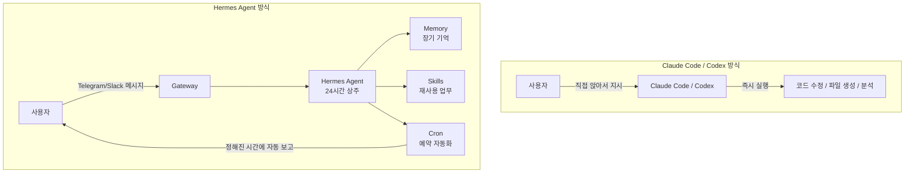
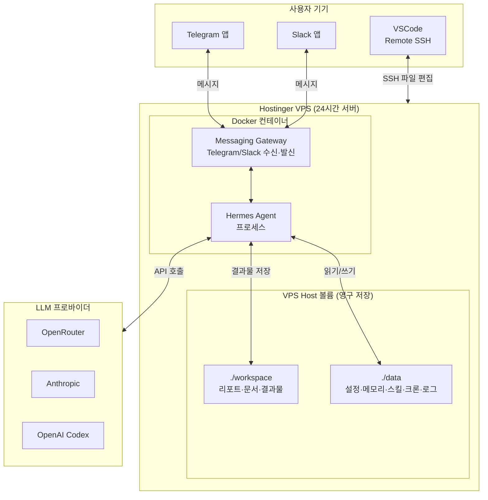
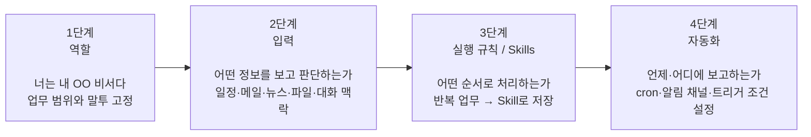
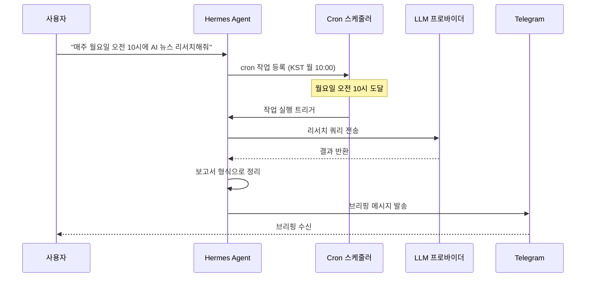
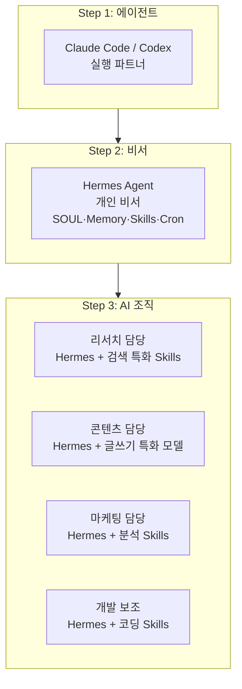

> **출처**: 시민개발자 구씨 유튜브 채널 (2026년 5월 23일 공개)  
> **원본 영상**: [현시점 최고의 24시간 AI 비서? Hermes Agent 꼭 써보세요!](https://www.youtube.com/watch?v=fVSdfEviwsQ)  
> **가이드 작성 기준**: 2026년 5월 25일

---

## 목차

1. [이 가이드는 무엇을 다루는가](#1-이-가이드는-무엇을-다루는가)
2. [Hermes Agent란 무엇인가](#2-hermes-agent란-무엇인가)
3. [Claude Code·Codex와 Hermes의 근본적인 차이](#3-claude-codecodex와-hermes의-근본적인-차이)
4. [전체 시스템 구조 한눈에 보기](#4-전체-시스템-구조-한눈에-보기)
5. [Hostinger VPS 준비와 Docker Manager 설정](#5-hostinger-vps-준비와-docker-manager-설정)
6. [Hermes Agent 배포 — Docker 컨테이너 설치](#6-hermes-agent-배포--docker-컨테이너-설치)
7. [Telegram 봇 연결하기](#7-telegram-봇-연결하기)
8. [Slack 앱 연결하기](#8-slack-앱-연결하기)
9. [Gateway 연결 테스트](#9-gateway-연결-테스트)
10. [data·workspace 폴더 구조 이해와 설정](#10-dataworkspace-폴더-구조-이해와-설정)
11. [SSH Key와 VSCode Remote SSH 연결](#11-ssh-key와-vscode-remote-ssh-연결)
12. [SOUL.md로 비서 정체성 만들기](#12-soulmd로-비서-정체성-만들기)
13. [Memory 시스템 — 장기 기억의 원리](#13-memory-시스템--장기-기억의-원리)
14. [비서 셋업 4단계 프로세스](#14-비서-셋업-4단계-프로세스)
15. [첫 번째 스킬 설계 — research-brief](#15-첫-번째-스킬-설계--research-brief)
16. [자동화 — cron으로 아침 브리핑 예약하기](#16-자동화--cron으로-아침-브리핑-예약하기)
17. [에이전트에서 AI 조직으로 확장하기](#17-에이전트에서-ai-조직으로-확장하기)
18. [보안 체크리스트](#18-보안-체크리스트)
19. [비용 관리 체크리스트](#19-비용-관리-체크리스트)
20. [자주 묻는 질문 FAQ](#20-자주-묻는-질문-faq)
21. [참고 자료](#21-참고-자료)

---

## 1. 이 가이드는 무엇을 다루는가

이 문서는 Nous Research가 2026년 2월에 출시한 오픈소스 AI 에이전트 프레임워크인 **Hermes Agent**를 활용해서, Hostinger VPS 위에 24시간 작동하는 개인 AI 비서를 구축하는 전 과정을 상세하게 설명합니다.

단순히 "설치하는 방법"을 넘어서, 왜 이런 구조를 선택했는지, 각 구성 요소가 어떤 역할을 하는지, 실제로 비서처럼 활용하려면 무엇을 어떻게 설정해야 하는지를 처음부터 끝까지 서술식으로 설명합니다.

이 가이드가 특히 도움이 될 분은 다음과 같습니다.

- AI 도구를 매번 직접 켜서 쓰는 것이 아니라, 내가 자리를 비울 때도 알아서 일을 처리해주는 구조를 원하는 분
- Claude Code나 Codex는 써봤지만 "24시간 켜두는 비서" 개념으로 확장하고 싶은 분
- 비개발자이지만 VPS, Docker, SSH 같은 개념을 이해하면서 AI 환경을 직접 구성하고 싶은 분
- 아침마다 자동으로 오는 일정 브리핑, 반복 리서치, 후속 알림 같은 자동화 업무를 설계하고 싶은 분

---

## 2. Hermes Agent란 무엇인가

Hermes Agent는 Nous Research가 2026년 2월 25일에 공개한 오픈소스 자율 AI 에이전트 프레임워크입니다. 서버 위에 상주하면서 학습한 것을 기억하고, 실행 시간이 길어질수록 더 능숙해지는 방식으로 설계된 시스템입니다. Linux, macOS, WSL2를 지원하며 단일 curl 명령어로 모든 의존성을 자동 설치합니다. 모든 데이터는 사용자 머신 안에만 저장되고, 텔레메트리나 클라우드 연동 없이 완전히 로컬에서 동작합니다.

출시 이후 성장 속도가 매우 빠른데, 공개 7주 만에 GitHub 스타 95,000개를 넘겼고, 2026년 4월 기준으로는 약 105,000개에 달해 올해 가장 빠르게 성장한 오픈소스 에이전트 프레임워크가 되었습니다.

Hermes의 핵심 개념은 세 가지입니다.

**Memory(메모리):** 일반적인 AI 채팅 도구는 대화가 끝나면 맥락을 잊어버립니다. Hermes는 사용자에 대한 정보, 반복 규칙, 프로젝트 맥락을 디스크의 파일 형태로 저장하여 다음 세션에서도 이어서 활용합니다. 이 방식이 다른 프레임워크와 결정적으로 다른 점은, '학습'이 실제로 디스크의 파일을 읽으면서 검증할 수 있는 형태로 이루어진다는 것입니다.

**Skills(스킬):** Hermes는 해결된 워크플로우를 재사용 가능한 스킬로 전환할 수 있습니다. 비슷한 작업이 다시 등장하면 에이전트가 해당 스킬을 불러와 이전 단계를 적용하고 개선합니다. 이는 에이전트를 세션 기억에서 절차적 학습으로 전환시키는 핵심 구조입니다.

**Cron(크론):** 정해진 시간에 자동으로 작업을 실행하는 예약 기능입니다. 아침 브리핑, 주간 리서치, 후속 확인 같은 반복 업무를 한 번 설정하면 이후에는 사용자가 요청하지 않아도 알아서 실행하고 보고합니다.

Hermes는 CLI, 메시징 플랫폼(Telegram, Discord, WhatsApp 등), 에디터 통합을 포함한 다양한 인터페이스를 지원하며, OpenAI와 호환되는 어떤 LLM 프로바이더도 사용할 수 있습니다. 로컬, 컨테이너, 클라우드 실행 환경 모두를 지원합니다.

---

## 3. Claude Code·Codex와 Hermes의 근본적인 차이

많은 사람들이 "Claude Code나 Codex로도 비슷한 걸 할 수 있지 않나?"라고 묻습니다. 이 질문에 제대로 답하려면 각 도구의 **설계 의도**를 이해해야 합니다.

Claude Code와 Codex는 기본적으로 내가 컴퓨터 앞에 앉아서 직접 지시하는 구조입니다. 프로젝트를 열고, 원하는 작업을 말하면, 에이전트가 그 자리에서 실행합니다. 코드 수정, 파일 생성, 문서 분석, 리포트 작성처럼 "지금 이 작업을 같이 하자"는 흐름에 최적화되어 있습니다.

이 도구들을 24시간 켜두는 비서처럼 쓰려면 cron, gateway, memory 구조를 별도로 설계해야 하는데, 이것이 비개발자에게는 상당한 부담입니다. 그리고 Claude Code는 Anthropic 모델 중심, Codex는 OpenAI 모델 중심으로 모델 선택의 자유도가 제한됩니다.

반면 Hermes는 처음부터 "24시간 상주 비서"를 전제로 설계되었습니다. Telegram, Slack 같은 메시징 플랫폼에 바로 연결되고, memory와 skills, cron이 기본 축으로 내장되어 있습니다. Hermes Agent v0.9.0의 경우 '어디서나 실행 가능한 릴리스'라는 컨셉으로 2026년 4월에 업데이트되었으며, 어떤 OpenAI 호환 LLM 프로바이더도 연결할 수 있습니다.

아래 다이어그램은 두 접근 방식의 차이를 구조적으로 보여줍니다.



정리하면, 판단 기준은 간단합니다. 내가 직접 앉아서 실무를 처리하는 데 도움이 필요하면 Claude Code나 Codex가 맞고, 내가 없어도 반복 업무를 알아서 처리하고 보고해주는 비서가 필요하다면 Hermes가 맞습니다.

두 가지를 배타적으로 선택할 필요는 없습니다. Claude Code로 처음 익힌 업무가 반복 패턴으로 굳어질 때, 그 업무를 Hermes의 스킬로 이전하는 방식으로 같이 쓸 수 있습니다.

---

## 4. 전체 시스템 구조 한눈에 보기

이 가이드에서 구축하는 시스템은 다음 구조로 이루어집니다.



각 구성 요소의 역할을 하나씩 짚어보겠습니다.

**VPS(가상 사설 서버):** 내 노트북이 꺼져 있어도 24시간 인터넷에 연결된 상태를 유지하는 클라우드 서버입니다. Hermes가 여기서 상주합니다.

**Docker 컨테이너:** Hermes를 서버 전체에 설치하지 않고, 독립된 실행 환경(컨테이너)에 넣어 관리합니다. 컨테이너를 교체하거나 새로 만들어도 데이터는 바깥 볼륨에 안전하게 유지됩니다.

**Messaging Gateway:** Telegram 또는 Slack에서 보낸 메시지를 Hermes가 받아서 처리하고, 결과를 다시 메시징 채널로 보내는 연결 다리입니다.

**data 폴더:** `.env`(API 키), `SOUL.md`(비서 정체성), `memories/`(장기 기억), `skills/`(재사용 업무), `cron/`(예약 작업), `logs/`(기록)이 여기에 저장됩니다.

**workspace 폴더:** Hermes가 작업을 수행하면서 만들어내는 리포트, PDF 문서, 코드 파일 등 결과물이 저장됩니다. 운영 데이터와 결과물을 분리하는 목적으로 별도로 구성합니다.

---

## 5. Hostinger VPS 준비와 Docker Manager 설정

### VPS가 필요한 이유

Hermes를 내 컴퓨터에서 실행하면, 컴퓨터를 끄거나 재우는 순간 에이전트도 멈춥니다. 24시간 켜두는 비서 역할을 하려면 항상 켜져 있는 별도 서버가 필요합니다. 맥미니 같은 장비를 직접 구매해서 자택에 두는 방법도 있지만, 비용과 관리 부담이 큽니다. VPS는 이런 서버를 월정액으로 빌려 쓰는 개념입니다.

### Hostinger VPS 선택 이유

이 영상에서 Hostinger를 선택한 이유는 두 가지입니다. 첫째, 가격이 저렴합니다. KVM2 플랜 기준으로 2년 약정 시 월 약 13,000원 수준으로 시작할 수 있습니다. 둘째, Docker Manager라는 GUI 도구가 내장되어 있어서, 명령어 없이 클릭만으로 Hermes 컨테이너를 배포할 수 있습니다.

### VPS 생성 절차

Hostinger에서 VPS를 생성할 때 선택해야 할 주요 옵션은 다음과 같습니다.

**서버 리전:** 한국 사용자라면 레이턴시를 줄이기 위해 아시아 리전(싱가포르, 말레이시아, 인도네시아 등)을 선택하는 것이 좋습니다.

**운영체제:** Ubuntu 24.04 LTS를 선택합니다. Hermes의 공식 지원 환경이며, 안정성이 검증되어 있습니다.

**추가 옵션:** 결제 과정에서 Malware Scanner(악성코드 탐지)와 Docker Manager를 선택합니다. Malware Scanner는 보안 강화, Docker Manager는 Hermes 배포를 위해 필요합니다.

VPS가 생성되면 Hostinger 대시보드에서 Overview 화면이 나타납니다. 여기서 좌측 메뉴의 Docker Manager를 선택하면 컨테이너 배포 화면으로 진입할 수 있습니다.

---

## 6. Hermes Agent 배포 — Docker 컨테이너 설치

### Docker Manager에서 Hermes 배포

Docker Manager에서 Catalog(카탈로그) 또는 Template(템플릿) 목록을 열면 Hermes Agent가 등록되어 있습니다. 이것을 선택해서 배포하면 컨테이너가 자동으로 생성됩니다.

배포 시 설정하는 Admin Username과 Password는 Hermes 관리용 자격증명입니다. 이 값은 안전하게 별도로 기록해두어야 합니다.

배포가 완료되면 Docker Manager에 컨테이너 목록이 나타나고, 각 컨테이너에는 Terminal(터미널)과 Manage(관리) 버튼이 있습니다. Terminal을 누르면 브라우저에서 직접 컨테이너 내부로 접속할 수 있습니다.

### Docker Compose 파일 구조 이해

Hermes 컨테이너는 내부적으로 다음과 같은 Docker Compose 설정으로 동작합니다. Manage > YAML Editor에서 확인할 수 있습니다.

```yaml
services:
  hermes-agent:
    image: ghcr.io/hostinger/hvps-hermes-agent:latest
    restart: unless-stopped
    ports:
      - "4860"
    env_file:
      - .env
    volumes:
      - ./data:/opt/data
```

여기서 `volumes` 항목이 핵심입니다. `./data`는 VPS host 쪽 폴더이고, `/opt/data`는 컨테이너 안에서 Hermes가 데이터를 저장하는 경로입니다. 이 두 경로를 연결(마운트)해두었기 때문에, 컨테이너를 삭제하고 새로 만들어도 기억과 설정은 VPS의 `./data` 폴더에 그대로 유지됩니다.

### Hermes 초기 설정 (Quick Setup)

컨테이너 터미널에서 `hermes setup`을 실행하면 초기 설정 마법사가 시작됩니다. Quick Setup을 선택하면 다음 항목을 순서대로 설정하게 됩니다.

첫 번째로 **모델 프로바이더**를 선택합니다. 처음 시작하는 분께는 OpenAI Codex를 추천합니다. ChatGPT 구독이 있으면 추가 API 비용 없이 해당 구독 계정으로 바로 연결할 수 있기 때문입니다. 물론 Anthropic, OpenRouter, DeepSeek 등 다양한 프로바이더 중 원하는 것을 선택할 수 있습니다.

두 번째로 **사용할 모델명**을 지정합니다. 예를 들어 Codex를 선택했다면 GPT-4.1 또는 o3 같은 모델을 지정합니다.

세 번째로 **메시징 플랫폼**을 선택합니다. Telegram, Slack, Discord 등에서 선택할 수 있습니다. 여러 개를 동시에 선택하는 것도 가능합니다.

---

## 7. Telegram 봇 연결하기

### 왜 Telegram인가

Telegram은 Hermes와 연결하기 가장 간단한 메시징 플랫폼입니다. 봇 생성과 토큰 발급이 몇 분 내에 완료되고, 설정 단계도 Slack보다 훨씬 적습니다. 처음 시도하는 분께는 Telegram으로 먼저 성공 경험을 쌓고, 이후에 Slack을 추가하는 순서를 권장합니다.

### Telegram 봇 생성 절차

Telegram 앱을 열고 검색창에 `@BotFather`를 검색합니다. BotFather는 Telegram 공식 봇 생성 도구입니다. 대화창에서 `/newbot` 명령어를 입력하면 봇 생성 과정이 시작됩니다.

BotFather는 먼저 봇의 이름을 묻습니다. 이것은 사용자에게 표시되는 이름으로, 예를 들어 `Jarvis`처럼 원하는 이름을 자유롭게 설정하면 됩니다. 다음으로 봇 username을 입력하는데, 영어와 숫자로 구성된 고유한 값이어야 하고 반드시 `_bot`으로 끝나야 합니다. 예를 들어 `jarvis_mybot`처럼 설정합니다.

설정이 완료되면 BotFather가 **봇 토큰(Bot Token)**을 발급합니다. 이 토큰은 Hermes가 Telegram API에 인증할 때 사용하는 비밀 키입니다. 절대 외부에 노출하면 안 됩니다.

### 내 Telegram User ID 확인

Hermes는 아무에게나 응답하면 안 됩니다. 허용된 사용자만 Hermes에게 명령을 내릴 수 있도록 설정해야 합니다. 이를 위해 내 Telegram User ID가 필요합니다.

`@userinfobot`을 검색해서 대화를 시작하면 숫자로 된 나의 User ID를 확인할 수 있습니다. 이 숫자값을 Hermes 설정에 입력합니다.

여러 명을 허용하려면 쉼표로 구분해서 입력합니다.

```
TELEGRAM_BOT_TOKEN="{{TELEGRAM_BOT_TOKEN}}"
TELEGRAM_ALLOWED_USERS="{{USER_ID_1}},{{USER_ID_2}}"
```

> ⚠️ Hermes는 터미널 명령 실행과 파일 시스템 접근까지 할 수 있는 강력한 에이전트입니다. 봇 토큰만 넣고 Allowed Users를 비워두면 누구나 명령을 내릴 수 있는 상태가 됩니다. 반드시 Allowed Users를 설정하세요.

---

## 8. Slack 앱 연결하기

### Slack 연결이 더 복잡한 이유

Slack 연결은 Telegram보다 단계가 많습니다. Slack의 보안 모델이 더 정교하게 설계되어 있어서, App Token, Bot Token, Socket Mode, 권한 범위(Scope), 채널 초대까지 차례로 설정해야 합니다. 하지만 업무 채널에서 Hermes를 쓰고 싶다면 이 과정을 한 번은 거쳐야 합니다.

### Slack App 생성 절차

`api.slack.com/apps`에 접속해서 Create New App을 클릭합니다. `From a manifest`를 선택하면 설정 파일을 붙여넣기만 해도 대부분의 권한이 자동으로 설정됩니다.

Hermes는 필요한 권한과 이벤트 설정이 담긴 Slack manifest JSON 파일을 자동으로 생성합니다. 컨테이너 터미널에서 다음 명령으로 확인할 수 있습니다.

```bash
cat /opt/data/slack-manifest.json
```

이 JSON을 복사해서 Slack의 App Manifest 페이지에 붙여넣으면, 수동으로 권한을 하나씩 체크하는 번거로움 없이 한 번에 설정이 완료됩니다.

### Socket Mode와 App Token

Slack과의 실시간 통신을 위해 Socket Mode를 활성화해야 합니다. Socket Mode를 켜고 `connections:write` 권한이 포함된 App-level Token을 생성합니다. 이 토큰은 `xapp-`으로 시작하는 형태입니다.

앱을 Slack 워크스페이스에 설치하면 `xoxb-`로 시작하는 Bot Token이 발급됩니다. 이 두 토큰과 함께, 내 Slack Member ID와 기본 채널 ID를 Hermes 설정에 입력합니다.

내 Slack Member ID는 자신의 프로필에서 '멤버 ID 복사'를 통해 확인할 수 있고, 채널 ID는 해당 채널 이름을 클릭해서 채널 정보를 열면 하단에 표시됩니다.

마지막으로 Slack 채널에서 `/invite @봇이름` 명령으로 봇을 초대하면 설정이 완료됩니다.

---

## 9. Gateway 연결 테스트

설정이 완료되면 Hermes의 메시징 게이트웨이가 실제로 작동하는지 확인해야 합니다. 컨테이너 터미널에서 `hermes`를 실행하면 Claude Code처럼 터미널 기반의 대화 인터페이스가 열립니다.

이 인터페이스에서 Hermes에게 게이트웨이 연결 테스트를 요청합니다. 이때 프롬프트 작성의 핵심은 이미 게이트웨이가 실행 중이라면 중복 실행하지 않고 로그만 확인하도록 안내하는 것입니다. 아래는 권장 프롬프트입니다.

```text
Hermes Gateway를 실행해서 Telegram/Slack 봇 연결을 테스트해줘.

공식 Hermes Docker 컨테이너 안이므로 root로 hermes gateway run을
직접 실행하지 말고, /entrypoint.sh 또는
/opt/hermes/docker/entrypoint.sh를 통해 실행해줘.

이미 gateway가 실행 중이면 중복 실행하지 말고 로그만 확인해줘.
5초 후 Telegram/Slack connected 여부만 짧게 요약해줘.
토큰 원문은 절대 출력하지 마.
```

게이트웨이 연결이 성공하면 Telegram 봇 대화창에서 메시지를 보냈을 때 Hermes가 응답합니다. Slack도 마찬가지로 봇을 초대한 채널에서 `@봇이름`으로 멘션하면 응답이 옵니다.

---

## 10. data·workspace 폴더 구조 이해와 설정

### Docker 볼륨의 핵심 개념

Docker 컨테이너는 기본적으로 "일회용" 실행 환경입니다. 컨테이너를 삭제하면 그 안의 데이터도 모두 사라집니다. 이 문제를 해결하는 것이 볼륨(Volume) 마운트입니다.

`./data:/opt/data` 설정은 VPS host의 `./data` 폴더와 컨테이너 안의 `/opt/data` 경로를 연결합니다. Hermes가 `/opt/data`에 뭔가를 저장하면, 실제로는 VPS의 `./data` 폴더에 저장됩니다. 컨테이너가 교체되어도 이 파일들은 VPS에 그대로 남아 있습니다.

### Hermes 데이터 홈 파일 구조

Hermes가 운영되면서 생성하고 참조하는 주요 파일들의 구조는 다음과 같습니다.

```
data/
├── config.yaml              ← Hermes 전체 설정
├── .env                     ← API 키, 봇 토큰 (내용 노출 절대 금지)
├── SOUL.md                  ← 비서의 이름, 성격, 역할, 말투 정의
├── memories/
│   ├── USER.md              ← 사용자(나)에 대한 정보
│   └── MEMORY.md            ← Hermes의 장기 기억과 운영 원칙
├── skills/                  ← 재사용 가능한 업무 매뉴얼
├── cron/                    ← 예약 자동화 작업 목록
├── sessions/                ← 대화 세션 기록
└── logs/                    ← 실행 로그
```

### workspace 볼륨 추가

Hermes가 리서치하고 만들어내는 보고서, PDF 파일, 코드 결과물은 운영 데이터(`data/`)와 분리해서 관리하는 것이 좋습니다. YAML Editor에서 다음과 같이 `workspace` 볼륨을 추가합니다.

```yaml
volumes:
  - ./data:/opt/data
  - ./workspace:/workspace
```

이렇게 설정하면 Hermes에게 "결과물은 `/workspace` 아래에 저장해줘"라고 지시할 수 있고, VPS의 `./workspace` 폴더에서 그 파일들을 직접 확인하고 관리할 수 있습니다.

---

## 11. SSH Key와 VSCode Remote SSH 연결

### SSH Key를 써야 하는 이유

비밀번호로만 VPS에 접속하면 보안이 취약합니다. SSH Key 방식은 공개키와 비밀키 쌍을 활용합니다. 내 컴퓨터에만 있는 비밀키(Private Key)와 서버에 등록된 공개키(Public Key)가 쌍을 이루어야만 접속이 가능하기 때문에 훨씬 안전합니다.

| 구분 | 위치 | 공개 가능 여부 | 역할 |
|---|---|---|---|
| Private Key | 내 Mac/PC | 절대 공개 금지 | 실제 열쇠 |
| Public Key (`.pub`) | 서버에 등록 | 등록 가능 | 열쇠 구멍 |
| Passphrase | 내 기억/키체인 | 절대 공개 금지 | 비밀키 보호 비밀번호 |

서버에 등록하는 것은 반드시 `.pub` 확장자가 붙은 공개키입니다. `.pub` 없는 파일이 비밀키이므로 절대 공유하면 안 됩니다.

### SSH Key 생성 방법 (Mac 기준)

Mac 터미널을 열고 다음 명령어를 실행합니다.

```bash
ssh-keygen -t ed25519 -C "my-macbook-hostinger-hermes"
```

`-C` 다음의 값은 이 키가 어떤 용도인지 알아보기 위한 주석입니다. 파일 저장 경로를 묻는 프롬프트에서 그냥 Enter를 누르면 기본 경로(`~/.ssh/id_ed25519`)에 저장됩니다.

이어서 Passphrase를 설정하라고 합니다. 이것은 비밀키 파일 자체를 보호하는 추가 비밀번호입니다. 설정해두면 설령 비밀키 파일이 유출되더라도 Passphrase를 모르면 사용할 수 없습니다.

생성된 공개키를 확인합니다.

```bash
cat ~/.ssh/id_ed25519.pub
```

이 한 줄 전체를 복사해서 Hostinger의 Settings > SSH Keys 메뉴에 등록합니다.

### SSH Config 설정으로 편하게 접속하기

매번 `ssh root@123.456.789.012`처럼 긴 명령을 치는 것은 불편합니다. `~/.ssh/config` 파일에 단축 설정을 추가하면 짧은 별명으로 접속할 수 있습니다.

```bash
nano ~/.ssh/config
```

아래 내용을 추가합니다.

```
Host hostinger-hermes
  HostName {{VPS_PUBLIC_IP}}
  User root
  IdentityFile ~/.ssh/id_ed25519
  AddKeysToAgent yes
  UseKeychain yes
```

저장 후(`Ctrl+O` → Enter → `Ctrl+X`) 다음 명령으로 접속을 테스트합니다.

```bash
ssh hostinger-hermes
```

Passphrase를 입력하면 VPS에 접속됩니다.

### VSCode Remote SSH로 파일 편집하기

터미널에서 파일을 직접 편집하는 것은 불편합니다. VSCode의 Remote SSH 확장을 사용하면 VPS의 파일을 마치 로컬 파일처럼 편집할 수 있습니다.

VSCode에서 확장 탭을 열고 `Remote - SSH`를 검색해 설치합니다. 설치 후 `Cmd+Shift+P`(Mac) 또는 `Ctrl+Shift+P`(Windows)를 눌러 `Remote-SSH: Connect to Host...`를 선택합니다. 목록에서 `hostinger-hermes`를 선택하면 연결됩니다.

연결된 상태에서 Open Folder를 통해 Docker 폴더(예: `/docker/hermes-agent-xxxx`) 안의 `data`와 `workspace` 폴더를 열어두면, Hermes가 만들어내는 파일을 실시간으로 확인하고 편집할 수 있습니다.

### 더 강력한 보안: Tailscale VPN

퍼블릭 IP로 SSH 접속을 허용하면 인터넷 어디서든 시도가 가능합니다. SSH Key와 Passphrase를 쓰면 충분히 안전하지만, 더 강화하고 싶다면 Tailscale 같은 사설 VPN을 설치해서 Tailscale 네트워크를 통해서만 접속하고 퍼블릭 SSH는 차단하는 방법을 사용할 수 있습니다. 이 설정 방법은 Telegram에서 Hermes에게 물어보면 친절하게 안내받을 수 있습니다.

---

## 12. SOUL.md로 비서 정체성 만들기

### SOUL.md가 필요한 이유

설치가 완료된 Hermes는 아직 "서버에 올라간 범용 AI"에 불과합니다. 진짜 비서처럼 작동하려면 이 비서가 어떤 사람이고, 어떤 역할을 담당하며, 어떤 말투로 보고해야 하는지를 명확하게 정의해야 합니다. `SOUL.md`가 바로 그 역할을 합니다.

이 파일은 매 세션마다 Hermes가 가장 먼저 읽는 정체성 문서입니다. 여기에 이름, 목표, 역할, 말투, 보안 원칙을 적어두면 Hermes는 항상 이 정체성을 바탕으로 응답합니다.

### SOUL.md 기본 예시

아래 예시를 `/opt/data/SOUL.md`에 저장합니다. `{{AI_ASSISTANT_NAME}}`과 `{{USER_NAME}}`은 본인 상황에 맞게 바꿔 사용하면 됩니다.

```bash
cat > /opt/data/SOUL.md <<'EOF'
# SOUL.md — Jarvis

너의 이름은 Jarvis다.
너는 내 24시간 업무관리 AI 비서다.

목표:
- 내가 직접 해야 할 일과, 비서에게 위임해도 되는 일을 구분해준다.
- 반복 업무, 리서치, 일정 확인, 알림, 아이디어 정리를 도와준다.
- 중요한 결정에 집중할 수 있도록 정보를 짧고 실행 가능하게 정리한다.

역할:
- 오늘 할 일, 놓친 이슈, 리마인드가 필요한 일을 먼저 정리한다.
- 리서치가 필요하면 핵심 결론, 근거, 불확실한 점을 나눠서 보고한다.
- 자동 실행보다 확인이 필요한 일은 먼저 사용자에게 물어본다.
- 외부 발송, 결제, 삭제, 권한 변경은 반드시 승인 후 실행한다.

말투:
- 차분하고 명확하게 보고한다.
- 결론 먼저, 필요한 근거를 뒤에 붙인다.
- 길게 설명하기보다 실행 가능한 체크리스트로 정리한다.

보안:
- API 키, 비밀번호, bot token은 절대 출력하지 않는다.
- .env 파일 내용과 SSH private key는 절대 노출하지 않는다.
- 확실하지 않은 정보는 "확인 필요"로 표시한다.
EOF
```

SOUL.md를 저장한 뒤 Hermes 대화창에서 `/new`를 입력해 세션을 새로 시작하면 바뀐 정체성이 로드됩니다. "이름이 뭐야?"라고 물어보면 SOUL.md에 설정한 이름으로 답하는 것을 확인할 수 있습니다.

---

## 13. Memory 시스템 — 장기 기억의 원리

### Memory 파일이 자동으로 생성되는 방식

Hermes와 대화를 나누다 보면 `memories/` 폴더 안에 `USER.md`와 `MEMORY.md` 파일이 자동으로 생성됩니다. 사용자가 직접 만들 필요가 없습니다.

`USER.md`는 Hermes가 나(사용자)에 대해 파악한 정보를 누적하는 파일입니다. 내 업무 분야, 선호하는 보고 형식, 현재 진행 중인 프로젝트, 관심 있는 주제 등이 쌓입니다.

`MEMORY.md`는 Hermes 자신의 운영 원칙과 누적된 학습 내용을 저장하는 파일입니다. 어떤 방식으로 리서치를 해야 하는지, 어떤 규칙으로 일정을 처리해야 하는지 같은 절차적 기억이 여기에 기록됩니다.

### 비서 온보딩 — 처음에 할 질문

Hermes에게 처음 하면 좋은 질문은 비서가 나를 파악할 수 있게 도와주는 것입니다.

```text
네가 내 비서로서 일을 잘하기 위해서 나에 대해 더 궁금한 사항을 질문해줘.
한 번에 너무 많이 묻지 말고, 지금 바로 알아야 할 질문 5개만 우선순위대로 물어봐줘.
```

Hermes는 업무 영역, 직접 결정해야 할 일과 위임해도 되는 일의 기준, 브리핑 선호 시간대, 현재 중요한 목표, 선호하는 보고 방식 같은 것들을 물어볼 것입니다.

이 질문들에 최대한 상세하게 답변해두면, 이후 Hermes는 그 내용을 `USER.md`에 저장하고 모든 작업에 반영합니다. 실제로 새 비서에게 첫날 미팅을 하듯이, 한두 시간을 투자해서 친절하게 알려주는 것이 이후 활용도를 크게 높입니다.

---

## 14. 비서 셋업 4단계 프로세스

좋은 비서를 만드는 것은 "좋은 프롬프트 한 문장"이 아닙니다. 비서가 일하는 구조 전체를 설계하는 것입니다. 이 영상에서 제시한 프레임워크는 4단계로 구성됩니다.



**1단계: 역할 정의.** SOUL.md를 통해 비서의 이름, 업무 범위, 말투를 먼저 고정합니다. "너는 내 24시간 업무관리 AI 비서다"처럼 명확하게 정의해야 이후 모든 작업이 일관성을 유지합니다.

**2단계: 입력 구조.** 비서가 어떤 정보를 보고 판단하는지 정의합니다. 일정, 이메일, 뉴스, 프로젝트 파일, 이전 대화 맥락 중 무엇을 참고하는지 설정합니다.

**3단계: 실행 규칙과 Skills.** 반복적으로 요청하는 업무가 생기면 그 처리 절차를 Skills로 저장합니다. Hermes는 업무를 처리하면서 스스로 적합한 스킬을 생성하기도 합니다. 이것이 절차적 학습의 핵심입니다.

**4단계: 자동화.** 내가 요청하지 않아도 정해진 시간에 실행되는 cron 작업을 설정합니다. 언제, 어디로, 어떤 내용을 보고할지 정해두면 비서가 알아서 실행합니다.

---

## 15. 첫 번째 스킬 설계 — research-brief

### 왜 research-brief부터 시작하는가

처음부터 복잡한 업무를 맡기면 결과가 기대에 못 미칠 가능성이 높습니다. 신입 직원 온보딩처럼 작고 반복적인 업무부터 맡기면서 피드백을 통해 개선하는 것이 효과적입니다. research-brief는 이 목적에 가장 적합한 첫 번째 스킬입니다.

### research-brief 요청 프롬프트

Hermes에게 다음과 같이 리서치 프로세스를 설계해달라고 요청합니다.

```text
리서치 작업을 해주는 프로세스를 셋업하고 싶어.

입력:
- 내가 던진 주제 하나

출력:
1. 핵심 결론 3줄
2. 지금 봐야 할 이유
3. 확인한 출처 목록
4. 아직 불확실한 부분
5. 내가 다음에 할 행동 1개

규칙:
- 출처 없는 숫자는 단정하지 마.
- 공식 문서나 원문이 있으면 우선해.
- 모르면 모른다고 말해.
```

이 요청을 처리하면서 Hermes는 두 가지 일을 동시에 합니다. 먼저 사용자의 요청 패턴을 `USER.md`에 기록합니다. 그리고 이 리서치 업무를 `single-topic-research-briefs`라는 이름의 스킬로 자동 생성합니다.

바로 이것이 Hermes의 핵심 가치입니다. 스킬을 만들어달라고 요청하지 않았는데도, 업무를 처리하면서 스스로 재사용 가능한 매뉴얼을 만들어 저장합니다.

### 리서치 작업 실행

스킬이 만들어진 이후에는 간단하게 주제만 던져도 됩니다.

```text
아래 주제로 리서치 해줘.
주제: 소규모 팀에서 AI 비서를 도입할 때 가장 먼저 자동화하면 좋은 업무
```

Hermes는 웹 검색을 포함한 여러 도구를 활용해서 리서치를 진행하고, 설정한 형식에 맞게 결과를 정리합니다. 결과물을 PDF 파일로도 저장하고 싶다면 이렇게 요청합니다.

```text
리서치 작업할 때는 /workspace 폴더 안에 PDF 파일로도 보고서를 제작해서 생성해주면 좋겠어.
```

Hermes는 워크스페이스 접근 권한을 확인하고, 필요하면 권한을 요청한 뒤 PDF를 생성합니다.

---

## 16. 자동화 — cron으로 아침 브리핑 예약하기

### 자동화가 비서를 진짜 비서로 만드는 이유

내가 물어봐야 답하는 AI는 여전히 검색 도구에 가깝습니다. 내가 묻지 않아도 정해진 시간에 먼저 보고해주는 AI가 진짜 비서입니다. Hermes의 cron 기능이 이 차이를 만들어줍니다.

### 아침 브리핑 설계

아침 브리핑에 어떤 항목을 포함할지는 업무 특성에 따라 달라지지만, 일반적으로 도움이 되는 항목은 다음과 같습니다.

- 오늘의 일정과 회의
- 답장이 필요한 메시지
- 관련 업계의 주요 업데이트
- 오늘 처리해야 할 우선순위 1~3개
- Hermes에게 위임해도 되는 일 목록

### cron 설정 방법

Hermes에게 자연어로 요청하기만 하면 cron 설정이 자동으로 이루어집니다.

```text
최근 AI 에이전트 관련해서 비개발자 입장에서 의미 있는 뉴스를
매주 월요일 오전 10시에 리서치해서 Telegram으로 알려줘.
```

Hermes는 이 요청을 받아서 cron 작업을 등록하고, 시간대를 UTC에서 한국 시간(KST, UTC+9)으로 변환해서 설정합니다.



---

## 17. 에이전트에서 AI 조직으로 확장하기

### 3단계 성장 모델

Hermes를 잘 활용하다 보면 자연스럽게 하나의 비서로는 부족한 시점이 옵니다. 이 영상에서 제시한 확장 모델은 3단계입니다.

**Step 1: 에이전트.** Claude Code나 Codex처럼 내가 직접 앉아서 지시하는 실행 파트너. 코드 수정, 파일 생성, 문서 분석이 주 업무입니다.

**Step 2: 비서.** Hermes처럼 내 선호도와 보고 형식, 장기 기억을 바탕으로 반복 업무를 맡는 개인 비서. 업무관리, 반복 브리핑, 일정·알림이 주 업무입니다.

**Step 3: 조직 설계.** 비서 한 명을 넘어서 직무별 AI 팀원을 구성하는 단계. 리서치 담당, 콘텐츠 담당, 마케팅 담당, 개발 보조 같은 역할별 에이전트를 skills·cron·모델 조합으로 운영합니다.



목표는 "챗봇을 하나 더 만드는 것"이 아닙니다. 내가 매번 직접 판단하던 반복 업무를 줄이는 구조를 만드는 것입니다.

---

## 18. 보안 체크리스트

Hermes는 터미널 명령 실행과 파일 시스템 접근까지 할 수 있는 강력한 에이전트입니다. 이 능력이 편리함의 원천이지만, 동시에 보안 사고의 위험이 될 수도 있습니다.

| 항목 | 해야 할 일 | 위험 시나리오 |
|---|---|---|
| API Key | `.env`에만 저장, 절대 노출 금지 | 유출 시 모델 비용 청구 및 권한 탈취 |
| Bot Token | 외부 공개 금지, 유출 즉시 BotFather에서 revoke | 누구나 Hermes에게 명령 가능 |
| Allowed Users | Telegram·Slack 모두 반드시 설정 | 설정 없으면 전 세계 누구나 접근 가능 |
| SSH Private Key | 내 컴퓨터에만 보관 | 유출 시 서버 전체 탈취 |
| 자동 실행 | 삭제·외부 발송·결제·권한 변경은 승인 기반 | 실수로 되돌릴 수 없는 작업 발생 |
| data 백업 | `./data`와 `./workspace` 주기적 백업 | VPS 장애 시 기억·설정·결과물 전체 손실 |
| .env 파일 | Git에 절대 포함 금지 | GitHub 공개 시 토큰 자동 스캔·악용 |

---

## 19. 비용 관리 체크리스트

AI 에이전트를 24시간 운영하면 예상치 못한 비용이 발생할 수 있습니다. 주요 비용 요소와 관리 방법은 다음과 같습니다.

| 비용 요소 | 확인 방법 | 절감 방법 |
|---|---|---|
| LLM API 호출 | Provider 대시보드 사용량 확인 | 가벼운 브리핑은 저렴한 모델 사용 |
| VPS 서버 비용 | Hostinger 결제 내역 | 처음에는 작은 스펙으로 시작 |
| 반복 cron 작업 | cron 목록 주기 확인 | 매시간보다 하루 1~2회부터 시작 |
| 긴 리서치 | 토큰 사용량 | Telegram에는 요약 중심, 본문은 workspace 파일로 |
| 컨텍스트 관리 | 세션 길이 | `/new` 또는 `/compact`로 주기적 초기화 |

---

## 20. 자주 묻는 질문 FAQ

### Q. `/help`가 작동하지 않으면 어떻게 하나요?

Hermes CLI 경로가 다를 수 있습니다. 다음 명령으로 직접 실행해보세요.

```bash
hermes setup
# 또는
/opt/hermes/.venv/bin/hermes
```

### Q. Telegram 메시지를 보내도 응답이 없어요.

확인해야 할 사항이 네 가지입니다. 첫째, `.env`의 `TELEGRAM_BOT_TOKEN`이 올바른지 확인합니다. 둘째, `TELEGRAM_ALLOWED_USERS`에 내 Telegram 숫자 ID가 등록되어 있는지 확인합니다. 셋째, Gateway가 실행 중인지 로그를 확인합니다. 넷째, 봇 대화창에서 `/start`를 한 번 눌러봅니다.

### Q. Slack 설정이 너무 복잡해요.

처음에는 Telegram 하나로만 설정하고 성공을 확인한 다음 Slack을 추가하는 순서를 권장합니다. Slack은 App Token, Bot Token, Socket Mode, 권한 Scope, 채널 초대까지 단계가 많아서 처음에는 진입 장벽이 있습니다.

### Q. 컨테이너를 삭제하면 Hermes의 기억이 사라지나요?

YAML에서 `./data:/opt/data` 볼륨이 설정되어 있다면 사라지지 않습니다. `./data` 폴더는 VPS의 host 파일시스템에 저장되기 때문에 컨테이너와 독립적으로 유지됩니다. 다만 볼륨 설정 없이 컨테이너 안에서만 파일을 만들었다면 컨테이너 삭제 시 함께 사라집니다.

### Q. 처음부터 복잡한 업무를 맡겨도 되나요?

권장하지 않습니다. 신입 직원 온보딩처럼 작은 반복 업무부터 맡기고 피드백을 주면서 점진적으로 확장하는 것이 훨씬 효과적입니다. 처음부터 "내 사업 전체를 관리해줘"라고 하면 결과가 애매해지기 쉽습니다.

### Q. Hermes가 민감한 작업을 자동으로 실행할 수 있나요?

삭제, 외부 발송, 결제, 권한 변경 같이 되돌리기 어려운 작업은 SOUL.md에 "반드시 승인 후 실행"으로 명시해두는 것이 안전합니다. Hermes는 SOUL.md의 지시를 따르기 때문에 이 규칙이 있으면 먼저 확인을 요청합니다.

---

## 21. 참고 자료

| 자료 | 링크 |
|---|---|
| Hermes Agent GitHub | https://github.com/NousResearch/hermes-agent |
| Hermes Agent 공식 문서 | https://hermes-agent.nousresearch.com/docs |
| Hermes Docker 공식 문서 | https://hermes-agent.nousresearch.com/docs/user-guide/docker |
| Hermes Messaging Gateway 문서 | https://hermes-agent.nousresearch.com/docs/user-guide/messaging |
| Hermes Telegram 문서 | https://hermes-agent.nousresearch.com/docs/user-guide/messaging/telegram |
| Hermes Memory 문서 | https://hermes-agent.nousresearch.com/docs/user-guide/features/memory |
| Hermes Skills 문서 | https://hermes-agent.nousresearch.com/docs/user-guide/features/skills |
| Hermes Cron 문서 | https://hermes-agent.nousresearch.com/docs/user-guide/features/cron |
| Hostinger Hermes Agent 공식 가이드 | https://www.hostinger.com/support/how-to-get-started-with-hermes-agent-at-hostinger/ |
| 원본 영상 (시민개발자 구씨) | https://www.youtube.com/watch?v=fVSdfEviwsQ |
| 상세 설명 가이드 (GitHub README) | https://github.com/citizendev9c/yt-assets/blob/main/automation/hermes-agent/hermes-agent-26-05-23/README.md |

---

## 마지막 정리

이 가이드 전체를 통해 구축한 것은 단순한 챗봇이 아닙니다. 내 선호도와 반복 업무를 기억하고, 정해진 시간에 먼저 보고하며, 사용할수록 더 정교해지는 24시간 AI 비서 환경입니다.

시작점으로 돌아와서, 핵심 세 가지만 기억하면 됩니다.

첫째, Telegram으로 연결해서 Hermes와 대화가 가능한 상태를 만드세요. 둘째, SOUL.md로 비서의 이름, 역할, 말투를 정해주세요. 셋째, 가장 자주 하는 반복 업무 하나를 골라 스킬로 만들고 cron으로 자동화해보세요.

이 세 가지가 완성되면, AI를 매번 불러 쓰는 도구가 아니라 내 일을 기억하고 알아서 처리해주는 비서로 활용하는 구조가 갖춰집니다.

---

*이 문서는 시민개발자 구씨 유튜브 채널의 영상(2026년 5월 23일 공개)과 함께 제공된 GitHub README를 기반으로, 최신 정보 검색을 통해 보완하여 작성되었습니다.*
