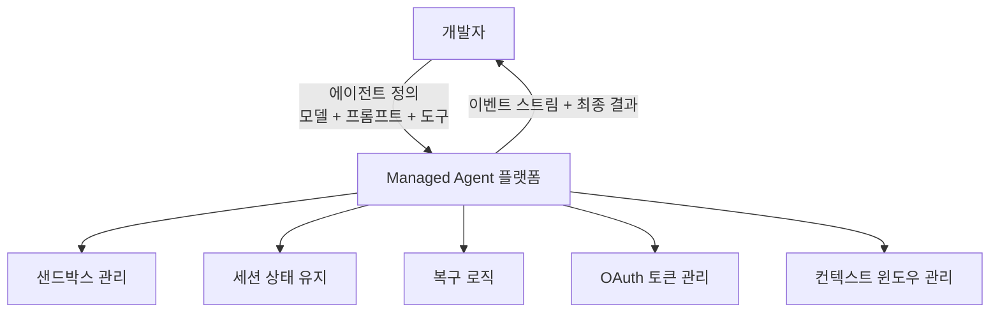
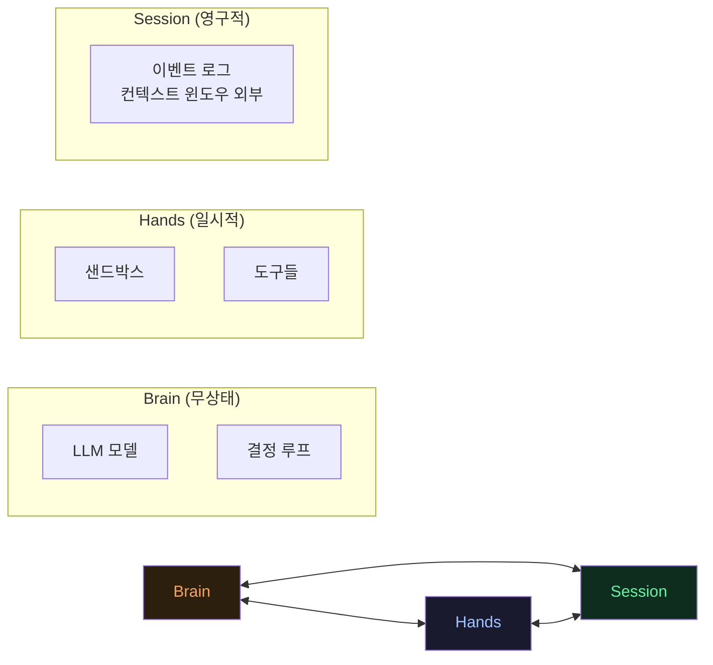
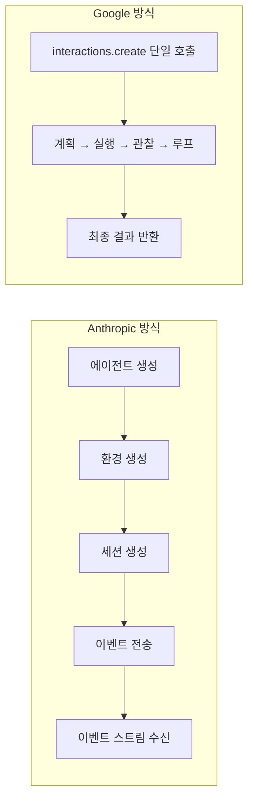
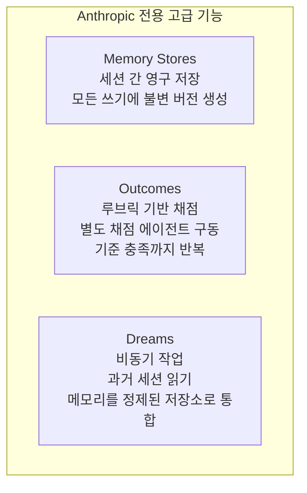
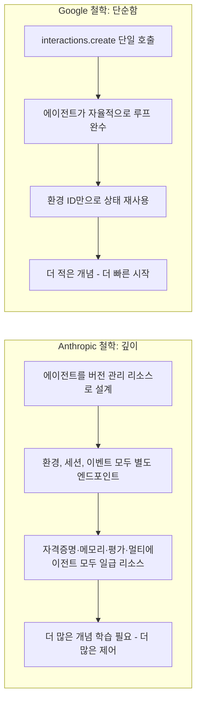
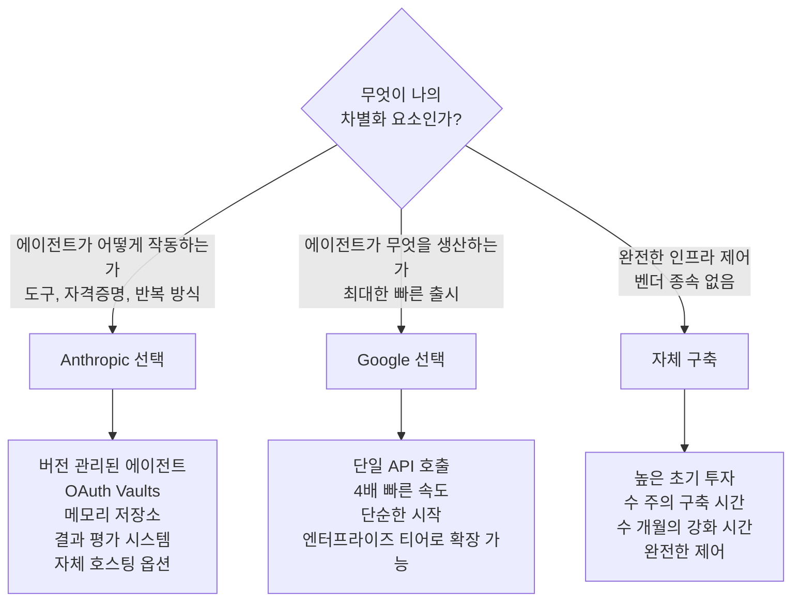

### Anthropic vs Google — 두 가지 철학, 하나의 카테고리

> **원본 영상**: Prompt Engineering 채널, *"Anthropic vs Google's Managed Agents — Two Philosophies"*
>
> **영상 링크**: https://www.youtube.com/watch?v=PnEusTChQcE

---

## 목차

1. [들어가며: 왜 Managed Agents인가?](#1-들어가며-왜-managed-agents인가)
2. [Managed Agent란 무엇인가?](#2-managed-agent란-무엇인가)
3. [Brain·Hands·Session: 세 가지 구성 요소](#3-brainhandssession-세-가지-구성-요소)
4. [직접 구축할 때 마주치는 4가지 고통](#4-직접-구축할-때-마주치는-4가지-고통)
5. [Anthropic vs Google: API 구조 비교](#5-anthropic-vs-google-api-구조-비교)
6. [도구(Tools) 생태계 비교](#6-도구tools-생태계-비교)
7. [Anthropic만 출시한 3가지 기능](#7-anthropic만-출시한-3가지-기능)
8. [실행 환경과 비용 비교](#8-실행-환경과-비용-비교)
9. [Google의 숨겨진 두 번째 제품: 엔터프라이즈 티어](#9-google의-숨겨진-두-번째-제품-엔터프라이즈-티어)
10. [깊이(Depth) vs 단순함(Simplicity): 두 가지 철학](#10-깊이depth-vs-단순함simplicity-두-가지-철학)
11. [비용·속도·가치의 실제 계산](#11-비용속도가치의-실제-계산)
12. [벤더 종속(Vendor Lock-in)과 모델 드리프트](#12-벤더-종속vendor-lock-in과-모델-드리프트)
13. [결론: 무엇을 선택해야 하는가?](#13-결론-무엇을-선택해야-하는가)

---

## 1. 들어가며: 왜 Managed Agents인가?

2026년 현재, AI 에이전트 개발 분야에서 가장 주목해야 할 흐름은 **Managed Agents(관리형 에이전트)** 다. Anthropic이 먼저 이 개념을 선보였고, 이후 Google이 Gemini API의 일부인 **Antigravity 2.0** 업데이트를 통해 자체 Managed Agents를 출시하면서 업계 전체가 이 방향으로 수렴하고 있다. AWS의 AgentCore, OpenAI의 Responses API 등 주요 프런티어 랩 모두가 같은 흐름을 따르고 있다.

이 변화의 핵심을 한 문장으로 요약하면 이렇다: **프로바이더들이 지금 출시하고 있는 것은 더 이상 모델이 아니라 런타임(Runtime)이다.**

예전의 AI 에이전트는 단순히 하나의 API 호출로 끝나는 단발성 응답(single-turn response)에 머물렀다. 하지만 실제 비즈니스에서 유용한 에이전트는 수분, 수시간에 걸쳐 복잡한 작업을 수행하는 장기 실행(long-horizon task)이 필요하다. 그리고 그런 긴 작업을 안정적으로 돌리는 데 필요한 인프라를 직접 구축하는 일이야말로 가장 어렵고 시간이 오래 걸리는 부분이다. Managed Agents는 바로 이 문제를 해결하기 위해 등장했다.

---

## 2. Managed Agent란 무엇인가?

**Managed Agent는 에이전트 루프(agent loop)를 대신 실행해 주는 호스팅 런타임이다.**

기존 방식에서 개발자는 다음 세 가지를 정의하고 나머지는 모두 직접 처리해야 했다.

- 어떤 **모델**을 쓸 것인가
- 어떤 **시스템 프롬프트**로 동작할 것인가
- 어떤 **도구(tools)** 를 쓸 것인가

이 세 가지를 정의한 뒤, 개발자는 메시지를 보내기만 하면 된다. **나머지 모든 것은 플랫폼이 처리한다.** 그 "나머지"에 해당하는 것들이 바로 가장 어렵고 시간이 많이 드는 부분들이다.

에이전트가 오래 실행될수록 처리해야 할 인프라적 복잡성은 기하급수적으로 커진다. 구체적으로 다음과 같은 것들을 모두 해결해야 한다.

- 코드를 안전하게 실행할 **샌드박스 컨테이너** 구동
- 도구 호출(tool call) 사이에 **상태 유지**
- **컨텍스트 윈도우 관리** (모델이 기억할 수 있는 정보의 한계 관리)
- 장애 발생 시 **복구 및 재시도**
- 사용자 자격 증명의 **OAuth 토큰 갱신**
- **네트워크 격리** 및 컨테이너 보안

Managed Agent 플랫폼은 이 모든 것을 프로바이더 측 샌드박스로 흡수한다. 개발자는 이벤트 스트림과 최종 결과물만 받으면 된다.



---

## 3. Brain·Hands·Session: 세 가지 구성 요소

Anthropic이 제시한 Managed Agent의 개념적 모델은 에이전트를 세 가지 분리된 구성 요소로 나누는 것이다. 이 분리(decoupling)가 왜 중요한지를 이해하면 Managed Agent의 핵심 설계 철학을 이해할 수 있다.

### 🧠 Brain (뇌): 모델과 의사결정 루프

Brain은 LLM 모델 자체와 그 결정 루프다. 중요한 특성은 **무상태(stateless)** 라는 점이다. Brain은 자체적으로 어떤 상태도 저장하지 않으므로, 충돌하거나 재시작해도 세션 전체가 날아가지 않는다. 새로운 Brain을 깨워서 세션 로그를 넘겨주면 마지막으로 기록된 지점부터 이어갈 수 있다.

### 🤲 Hands (손): 샌드박스와 도구들

Hands는 실제로 코드를 실행하고 외부 세계와 상호작용하는 샌드박스와 도구들이다. 이것들은 **일시적이고 교체 가능(ephemeral and disposable)** 하다. 하나가 실패하면 플랫폼이 새로운 것을 띄우고 세션은 계속 이어진다. 기존 방식에서는 실행 환경이 죽으면 모든 것이 처음부터 다시 시작해야 했지만, 이 구조에서는 Hands만 교체하면 된다.

### 📋 Session (세션): 지속 가능한 이벤트 로그

Session은 **추가만 가능한(append-only) 이벤트 로그**다. 가장 중요한 특성은 이것이 **모델의 컨텍스트 윈도우 바깥에 존재**한다는 점이다. Brain이 충돌해도, Hands가 교체되어도, Session은 살아남는다. 이 로그를 통해 에이전트는 항상 마지막으로 기록된 이벤트부터 이어서 작업을 재개할 수 있다.



이 세 요소를 서로 분리함으로써 어떤 부분이 실패해도 전체 작업이 처음부터 시작되지 않는다. 이것이 Managed Agent를 장기 실행 워크로드에서 진정으로 탄력적(resilient)으로 만드는 설계 원칙이다.

---

## 4. 직접 구축할 때 마주치는 4가지 고통

Managed Agent가 해결하려는 문제를 구체적으로 이해하기 위해, 개발자가 직접 에이전트 루프를 구축할 때 반드시 마주치게 되는 4가지 주요 고통 지점을 살펴보자.

### 고통 1: 코드 실행 (Code Execution)

에이전트가 bash 명령, Python 스크립트, 또는 에이전트 스스로 작성한 코드를 실행해야 하는 경우, 그 코드는 샌드박스 없이는 실제 인프라에서 직접 실행된다. 이는 보안상 매우 위험하다. 이를 안전하게 처리하려면 다음이 모두 필요하다.

- 세션당 하나의 컨테이너
- 에이전트가 읽고 쓸 수 있는 파일 시스템
- 패키지 매니저
- 네트워크 정책
- 세션이 끝날 때 깔끔하게 종료하는 메커니즘

이 인프라를 제대로 구축하는 것만으로도 상당한 시간과 노력이 든다.

### 고통 2: 지속적인 상태 관리 (Persistent State)

장기 실행 에이전트는 하나의 API 호출이 아니라 **루프**다. 루프 안에서 모델이 도구를 선택하고, 결과가 돌아오고, 모델이 다시 결정하는 과정이 반복된다.

```
모델 결정 → 도구 실행 → 결과 반환 → 모델 재결정 → ...
```

만약 이 루프가 중간에 충돌하면, 아무것도 없으면 처음부터 다시 시작해야 한다. 이를 막으려면 **모델의 컨텍스트 윈도우 바깥에 존재하면서 컨테이너 재시작에서도 살아남는 추가 전용(append-only) 이벤트 로그**가 필요하다. 이는 단순한 설정 변경이 아니라 완전히 새로운 아키텍처적 사고방식을 요구한다.

### 고통 3: 자격 증명 관리 (Credentials)

에이전트가 사용자를 대신해서 Slack에 메시지를 올리거나 GitHub 레포지토리를 읽는 경우, OAuth 토큰이 필요하다. 이 토큰을 샌드박스 안에 넣어두면 **프롬프트 인젝션 공격**으로 토큰이 유출될 수 있다. 그래서 다음이 필요하다.

- OAuth 토큰 안전 저장소
- 토큰 만료 시 자동 갱신 흐름
- 샌드박스 바깥에서의 토큰 격리
- 에이전트 신원을 사용자 신원처럼 다루는 체계

이것을 제대로 구축하는 데는 수 주, 이를 강화하는 데는 수 개월이 걸린다.

### 고통 4: 장애 복구 (Failure Recovery)

세션이 오래 실행될수록 무언가 잘못될 가능성도 커진다. 네트워크 순단, 컨테이너의 메모리 초과(OOM), API 레이트 리밋 도달 등 수많은 장애 시나리오가 존재한다.

만약 에이전트 하네스(harness)가 메모리 안에만 존재한다면, 하나의 장애가 세션 전체를 죽인다. 해법은 하네스를 무상태로 만들고 모든 상태를 이벤트 로그에 밀어 넣는 것이다. 이것은 단순한 설정 변경이 아니라 **아키텍처 수준의 변화**다.

---

## 5. Anthropic vs Google: API 구조 비교

두 회사 모두 Managed Agent를 제공하지만, API 설계 철학은 정반대다.

### Anthropic: 4개 리소스, 4개 엔드포인트

Anthropic의 접근은 에이전트를 여러 독립적인 리소스로 분해한다.

| 리소스 | 역할 |
|--------|------|
| `agent` | 에이전트 정의 (모델, 프롬프트, 도구). **버전 관리 가능** |
| `environment` | 에이전트가 실행되는 샌드박스 환경 |
| `session` | 특정 환경에서의 실행 세션. **타입된 이벤트 스트림 반환** |
| `events` | 세션 중 발생하는 이벤트들 (`agent.message`, `agent.tool_use`, `session.status_idle` 등) |

이 구조의 강점은 세밀한 제어에 있다. 실행 중간에 새 메시지로 에이전트 방향을 바꿀 수 있고, 실행 사이에 도구나 MCP 서버를 업데이트할 수 있으며, 에이전트 자체를 버전 관리하여 업데이트를 점진적으로 배포할 수 있다.

### Google: 단 하나의 호출

Google의 접근은 극단적으로 단순하다.

```python
interactions.create(
    agent="antigravity...",
    input="...",
    environment="remote"
)
```

`interactions.create` 하나를 호출하면 에이전트가 계획을 세우고, 실행하고, 결과를 관찰하고, 루프를 반복하다가 완료되면 최종 출력을 돌려준다. 상태를 재사용하고 싶으면 동일한 `environment` ID를 다음 호출에 넘기면 된다. 그게 전부다.



**결론:** Anthropic은 더 많은 제어 노브를 제공하고, Google은 더 적은 개념으로 단순함을 추구한다. 같은 아이디어에 대한 정반대의 베팅이다.

---

## 6. 도구(Tools) 생태계 비교

두 플랫폼의 현재 도구 지원 현황을 비교하면 격차가 뚜렷하게 드러난다.

### Anthropic: 완전한 키트

Anthropic은 다음의 사전 구축된 도구 세트를 제공한다.

- `bash` — 쉘 명령 실행
- `file ops` — 파일 읽기/쓰기
- `web_search` — 웹 검색
- `web_fetch` — URL 콘텐츠 가져오기
- **MCP (Model Context Protocol) 일급 지원** — MCP 서버 연결
- **커스텀 도구** — 클라이언트에서 정의하고 실행
- **사전 구축 스킬** — Excel, PDF 처리 등
- **Vaults (자격 증명 저장소)** — 사용자별 OAuth 자격 증명을 Anthropic이 관리하고 토큰을 자동 갱신

### Google (Gemini API, Antigravity Agent): 4가지 도구

Google의 공개 API 버전은 현재 다음 네 가지만 제공한다.

- `code_execution` — 코드 실행
- `google_search` — Google 검색
- `url_context` — URL 컨텍스트 가져오기
- `filesystem` — 파일 시스템 접근

MCP 지원 없음, 커스텀 함수 호출 없음, Vaults 없음. 여러 중요한 기능이 빠져 있다. 단, 이 비교는 출시 시점 기준이며 Google이 추격 중이라는 점을 염두에 두어야 한다. (Anthropic 출시 이후 약 6주 뒤에 Google이 출시했다.)

---

## 7. Anthropic만 출시한 3가지 기능

기본 루프 위에서 Anthropic이 현재 Google 없이 단독으로 제공하는 세 가지 고급 기능이 있다. 이 기능들은 에이전트를 단순한 작업 실행기가 아니라 학습하고 개선하는 시스템으로 만드는 데 중요하다.

### 기능 1: Memory Stores (메모리 저장소)

세션이 끝나도 데이터가 사라지지 않는 영구 저장소다. 각 쓰기(write) 작업은 **변경 불가능한 버전(immutable version)** 을 생성한다. 이는 에이전트가 이전 세션에서 배운 내용을 다음 세션에서도 활용할 수 있게 하며, 모든 변경 이력이 추적된다.

### 기능 2: Outcomes (결과 평가 시스템)

에이전트에게 루브릭(채점 기준)을 제공하면, 플랫폼이 **별도의 채점 에이전트(grader)** 를 띄워 작업을 평가하고 기준에 만족할 때까지 에이전트가 반복 개선하도록 한다. 인간의 개입 없이 에이전트가 자체적으로 품질을 향상시키는 자율 개선 루프를 가능하게 한다.

### 기능 3: Dreams (비동기 메모리 통합 작업)

지난 세션들을 읽어서 메모리를 정리하고 더 깔끔한 저장소로 통합하는 **비동기(async) 백그라운드 작업**이다. 에이전트가 누적한 방대한 이벤트 로그를 자동으로 정제하여 핵심 지식만 남긴다.



---

## 8. 실행 환경과 비용 비교

두 플랫폼의 인프라 선택지와 가격 정책도 크게 다르다.

### 실행 환경

**Anthropic**은 두 가지 옵션을 제공한다.

- **호스팅 클라우드 컨테이너**: Anthropic의 인프라에서 모든 것이 실행
- **자체 호스팅 샌드박스(Self-hosted sandbox)**: 오케스트레이션은 Anthropic에 남아 있지만, 도구 실행은 고객 자체 인프라로 이동. 데이터 레지던시나 컴플라이언스 요구사항이 있는 기업에게 중요한 옵션이다.

**Google**은 현재 **클라우드 전용**이다. 자체 호스팅 옵션이 없고 데이터 레지던시 관련 선택지도 없다.

### 가격 정책

| | Anthropic | Google (Antigravity, 미리보기 기간) |
|---|---|---|
| 기본 요금 | 표준 토큰 요금 | 토큰 요금만 |
| 추가 요금 | **세션 시간당 $0.08** | 샌드박스 컴퓨팅 **무료** (미리보기 중) |

표면적으로 Google이 더 저렴해 보이지만, 실제로 에이전트 루프는 수백만 개의 토큰을 소모할 수 있다. Google 자체 테스트에 따르면 단일 상호작용에서 300만~500만 토큰을 소모하면 비용이 약 $5에 달할 수 있다. 토큰당 단가가 낮다고 해서 실행당 비용이 항상 낮은 것은 아니다.

---

## 9. Google의 숨겨진 두 번째 제품: 엔터프라이즈 티어

영상에서 중요하게 다루는 내용 중 하나는 Google에 사실 **두 가지 Managed Agent 제품**이 있다는 점이다. 이는 공식 발표에서는 잘 언급되지 않았고, 문서를 직접 읽어봐야 발견할 수 있는 내용이다.

### 일반 버전: Antigravity Agent (Gemini API, 공개 미리보기)

- 단일 `interactions.create` 호출
- 4가지 도구 (코드 실행, Google 검색, URL 컨텍스트, 파일 시스템)
- MCP 없음, 커스텀 함수 없음, Vaults 없음, 메모리 없음
- 지금 당장 사용 가능

### 고급 버전: Managed Agents (Enterprise Agent Platform, 비공개 미리보기)

같은 Antigravity 하네스를 사용하지만 기능 세트가 훨씬 풍부하다.

- **MCP 서버 지원** 추가
- **OAuth 기반 인증 관리자(Auth Manager)** 추가
- **Memory Bank** — Anthropic의 Memory Stores와 유사하게 동작
- **스킬 레지스트리(Skill Registry)** — 커스텀 스킬 등록 및 재사용
- **Agent2Agent 프레임워크** — 여러 에이전트 간 협력 (멀티 에이전트 조율)

단, 이 버전은 현재 **비공개 미리보기(private preview)** 상태이므로 기밀 데이터를 사용하지 말라고 Google이 명시하고 있다. Anthropic과의 기능 동등성을 원한다면 이 엔터프라이즈 티어가 해당 위치이지만, 대부분의 개발자는 Gemini API의 단순 버전으로 시작하게 될 것이다.

---

## 10. 깊이(Depth) vs 단순함(Simplicity): 두 가지 철학

이 비교에서 가장 핵심적인 통찰은 두 회사가 Managed Agent가 무엇이어야 하는지에 대해 **근본적으로 다른 베팅**을 하고 있다는 점이다.

### Anthropic의 베팅: 깊이(Depth)

Anthropic은 에이전트 런타임을 **운영 체제처럼** 취급한다. 자격 증명, 메모리 저장소, 결과 평가, 멀티 에이전트 조율 등 모든 개념이 별도의 일급 리소스(first-class resource)로 노출된다. 개발자는 이것들을 조합하여 원하는 시스템을 만든다.

- 배워야 할 개념이 더 많다는 것이 단점이다.
- 하지만 현재 시장에서 사용자별 OAuth Vault, 버전 관리되는 크로스 세션 메모리를 제공하는 유일한 제품이다.
- Anthropic은 "런타임이 제품이고, 모델은 그 안에 있는 엔진"이라는 관점을 갖고 있다.

### Google의 베팅: 단순함(Simplicity)

Google은 에이전트가 **단일 API 호출처럼 느껴져야 한다**는 관점이다. 복잡한 런타임이 보이지 않게 단일 호출 안으로 사라지길 원한다. Gemini Flash 모델은 다른 프런티어 모델보다 약 4배 빠르게 실행되는데, 에이전트가 긴 루프를 돌릴 때 속도는 중요한 요소다.

- 아직 존재하지 않는 기능 카테고리 전체(MCP, 커스텀 도구, Vaults, 메모리)가 없다는 것이 단점이다.
- "모델이 충분히 빠르고 API가 충분히 단순하다면, 런타임은 단일 호출 안으로 사라져야 한다"는 관점이다.



---

## 11. 비용·속도·가치의 실제 계산

이 비교에서 종종 오해되는 부분이 가격이다. 헤드라인 가격과 실제 실행당 비용은 다를 수 있다.

Gemini Flash는 토큰당 단가가 이전 Flash 세대보다 여러 배 높아졌다. 그럼에도 여전히 Anthropic Opus보다는 저렴하다. 하지만 에이전트 루프는 단일 실행에서 300만~500만 토큰을 소모할 수 있다. Google의 자체 테스트에서 이 규모의 실행은 약 $5에 달한다. 따라서 "토큰당 저렴함"이 항상 "실행당 저렴함"을 의미하지는 않는다.

Google의 베팅은 속도와 단순한 API, 낮은 토큰 단가가 합쳐져 승리한다는 것이다. 실제 실행당 비용은 에이전트가 무엇을 하느냐에 따라 크게 달라진다.

**어떤 플랫폼을 선택해야 하는가에 대한 간단한 기준:**

- 에이전트가 **어떻게 작동하는지**가 차별화 요소라면 (도구, 자격 증명, 목표를 향한 반복 방식 등) → **Anthropic**이 현재 그것을 위해 구축된 플랫폼이다.
- 에이전트가 **무엇을 생산하는지**가 차별화 요소이고, 최대한 빠르게 출시하는 것이 목표라면 → **Google**이 반대 베팅이다.

---

## 12. 벤더 종속(Vendor Lock-in)과 모델 드리프트

영상에서 특히 강조하는 리스크 중 하나가 벤더 종속 문제인데, 여기에는 명백한 부분과 덜 명백한 부분 두 가지가 있다.

### 명백한 종속

Anthropic API는 Gemini와 호환되지 않고 그 반대도 마찬가지다. 한 플랫폼에 커밋하면 그 프로바이더의 로드맵, 가격, 레이트 리밋, 가용성에 종속된다. 이것은 예상 가능한 트레이드오프다.

### 덜 명백한 종속: 모델 드리프트

훨씬 더 위험할 수 있는 것은 **모델 동작 자체가 변한다**는 점이다. 프런티어 랩들은 다음과 같은 작업을 사용자에게 알리지 않고 한다.

- 속도와 비용을 위해 모델을 은밀히 양자화(quantize)
- 시스템 프롬프트를 내부적으로 업데이트
- 안전성 및 기타 사이클에서 동작을 재조정

이 변경 중 어느 것도 변경 로그에 나타나지 않는다. 개발자는 평가(eval) 지표가 드리프트하거나 사용자 불만이 들어오고 나서야 알게 된다. 도구 호출이 악화되고, 추론 체인이 짧아지고, 지난주엔 잘 되던 특정 작업이 갑자기 실패하기 시작한다.

**이에 대한 실용적인 조언:**

1. 평가 하네스(evaluation harness)에 투자하라 — 출력물을 시간에 걸쳐 추적하라.
2. 모델 동작에 대한 가정을 시스템의 중요한 부분에 하드코딩하지 마라.
3. 모델은 비결정론적(non-deterministic) 시스템임을 항상 기억하라.

### 기타 트레이드오프

두 제품 모두 **현재 상태 유지(stateful) 설계**이므로 **제로 데이터 유지(Zero Data Retention)** 및 **HIPAA BAA(비즈니스 파트너 계약)** 의 대상이 되지 않는다. 두 제품 모두 미리보기 또는 베타 상태이므로 가격과 기능 세트가 변경될 수 있다.

---

## 13. 결론: 무엇을 선택해야 하는가?

Managed Agents는 이미 프런티어 AI 제공업체가 에이전트 역량을 제공하는 기본 방식이 되어가고 있다. Anthropic이 먼저 시작했고, Google이 따랐으며, AWS(AgentCore), OpenAI(Responses API)가 바로 뒤를 따르고 있다. 단일 API 호출보다 더 오래 실행되는 무언가를 만들고 있다면, 이 선택은 반드시 직면하게 된다.



### 요약 비교표

| 항목 | Anthropic | Google (Gemini API) | Google (Enterprise, 비공개) |
|------|-----------|---------------------|------------------------------|
| API 구조 | 4 리소스, 4 엔드포인트 | 단일 호출 | 에이전트 API + 상호작용 API |
| 기본 도구 | bash, file ops, web_search, web_fetch | code_execution, google_search, url_context, filesystem | (위와 같음 + 추가) |
| MCP 지원 | ✅ 일급 지원 | ❌ | ✅ |
| 커스텀 도구 | ✅ | ❌ | ✅ |
| OAuth Vaults | ✅ | ❌ | ✅ (Auth Manager) |
| 메모리 저장소 | ✅ | ❌ | ✅ (Memory Bank) |
| 결과 평가 | ✅ (Outcomes) | ❌ | 미확인 |
| 비동기 메모리 정제 | ✅ (Dreams) | ❌ | 미확인 |
| 멀티 에이전트 | ✅ | ❌ | ✅ (Agent2Agent) |
| 자체 호스팅 | ✅ | ❌ | 미확인 |
| 가격 | 토큰 요금 + $0.08/세션시간 | 토큰 요금만 (미리보기 중 컴퓨팅 무료) | 별도 |
| 출시 상태 | 공개 (베타) | 공개 미리보기 | 비공개 미리보기 |

---

## 부록: 스폰서 데모 — N8N MCP 서버 활용 사례

영상 중반부에는 스폰서인 N8N의 MCP 서버 기능 데모가 포함되어 있다. 이 데모는 Managed Agent와 자동화 워크플로우 플랫폼의 통합을 보여주는 실용적인 예시로, 현재의 에이전트 생태계가 어떻게 조합될 수 있는지를 잘 보여준다.

N8N은 노드 기반 자동화 워크플로우 플랫폼으로, 클라우드와 자체 호스팅 모두를 지원한다. 최근 MCP 서버를 출시하여 Claude Code 같은 코딩 에이전트에서 워크플로우를 직접 생성하고 편집할 수 있게 되었다.

데모에서 Claude Code에 다음 작업을 지시했다.

- 웹훅 POST로 주제(topic)를 받는다
- arXiv에서 최신 논문을 가져온다
- Hacker News에서 최신 이야기를 가져온다
- GitHub에서 트렌딩 레포지토리를 가져온다
- (위 세 가지를 병렬로 실행)
- AI 에이전트가 종합 요약을 생성한다
- 결과를 데이터베이스에 저장한다

Claude는 MCP 서버를 통해 N8N 워크플로우 전체를 자동으로 생성했다. 테스트 중 arXiv의 레이트 리밋 문제가 발견되었고, 에이전트는 MCP 서버를 통해 워크플로우를 계속 업데이트하여 문제를 해결했다. 이 예시는 **에이전트가 도구를 통해 인프라를 직접 수정하고 반복 개선하는 패턴**을 잘 보여준다.

---

*이 문서는 Prompt Engineering 채널의 영상 "Anthropic vs Google's Managed Agents — Two Philosophies"의 내용을 바탕으로 작성되었습니다. 영상 공개일 기준(2026년 5월) 정보이며, 각 플랫폼의 기능과 가격은 변경될 수 있습니다.*
