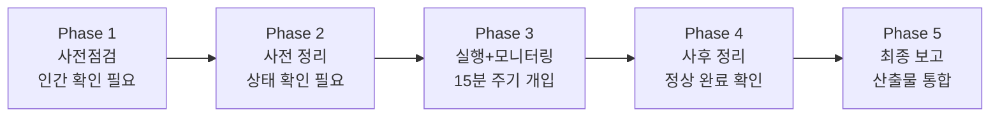
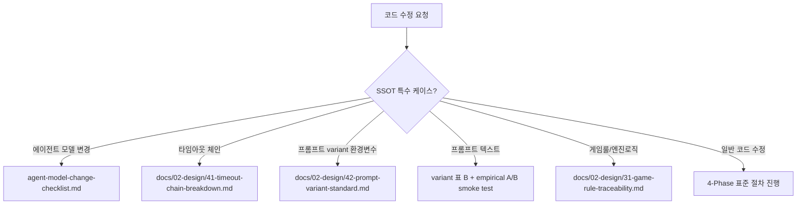
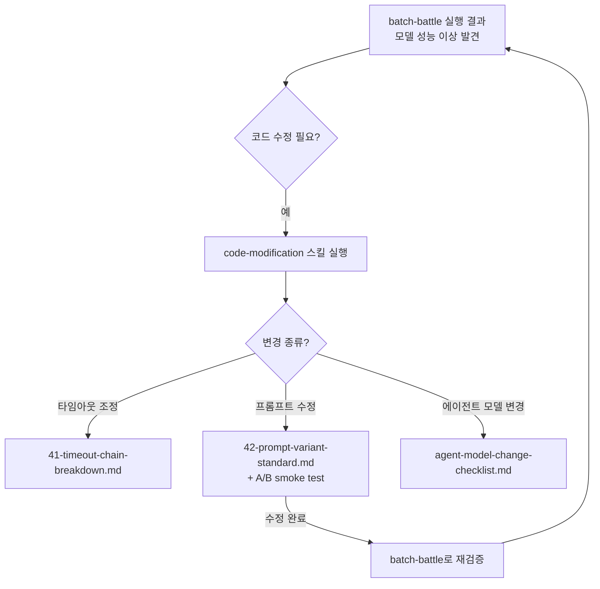

> **평가 대상**: [`.claude/skills/batch-battle`](https://github.com/k82022603/RummiArena/tree/main/.claude/skills/batch-battle) / [`.claude/skills/code-modification`](https://github.com/k82022603/RummiArena/tree/main/.claude/skills/code-modification)
>
> **프로젝트**: [RummiArena](https://github.com/k82022603/RummiArena) — Kubernetes 기반 멀티 LLM 루미큐브 대전 플랫폼 (Sprint 1~7 + 핫픽스, 2026-05-10 종료)

---

## 평가 요약

| 항목 | batch-battle | code-modification |
|------|-------------|-------------------|
| 다단계 정당성 | ✅ 명확히 필요 | ✅ 명확히 필요 |
| 프론트매터 품질 | ✅ 우수 | ⚠️ 트리거 범위 넓음 |
| 본문 완성도 | ✅ 매우 높음 | ✅ 높음 |
| 사고 사례 반영 | ✅ 3회 개정, 구체적 | ✅ 1회 개정, 체계적 |
| 번들 리소스 분리 | ⚠️ 본문 비대화 우려 | ✅ 외부 문서 위임 적절 |
| SSOT 연결성 | ✅ 타임아웃/variant 문서 연결 | ✅ 4종 전용 체크리스트 연결 |
| 종합 점수 | **A** | **A-** |

---

## 1. batch-battle 평가

### 1-1. 다단계 구조가 정당한가

결론부터 말하면, 5단계 구조는 이 스킬에서 완전히 정당합니다. AI 대전 배치는 "원고 하나 입력 → 수정본 하나 출력" 같은 단순 변환이 아닙니다. 각 Phase는 사람이 개입하거나 상태를 확인해야 하는 실제 체크포인트입니다.



각 단계는 독립적인 이유로 존재합니다. Phase 1을 건너뛰었다가 DNS 장애로 Run 7/9/10이 오염된 사고, Phase 2를 생략했다가 좀비 게임이 남아 다음 배치가 오염된 사고, Phase 4 cleanup을 잊어 자식 Python 프로세스가 잔존했던 사고 — 이 모든 것이 현재의 5단계 구조를 만든 실제 근거입니다. 단계 수가 많다고 무거운 것이 아닙니다. 배치 실행이라는 작업 자체가 5개의 상태 전환을 요구합니다.

### 1-2. 프론트매터(Level 1) 품질

```yaml
name: batch-battle
description: AI 대전 배치 실행. K8s 사전점검→Redis/게임 정리→대전 실행→실시간 모니터링→사후 정리 5단계. 4개 LLM 모델 전략 비교 실험의 실행 게이트.
```

**잘된 점:** 클로드가 이 description을 읽고 "AI 대전 배치 작업이 들어오면 이 스킬을 써야 한다"고 판단하기에 충분한 정보가 담겨 있습니다. 5단계 흐름이 한 줄에 요약되어 있고, "실행 게이트"라는 표현이 스킬의 성격을 정확히 드러냅니다.

**개선 여지:** 실제 트리거가 될 키워드나 문장 예시가 없습니다. 예를 들어 "사용자가 'AI 대전 시작', 'multirun 실행', '배치 돌려줘'라고 요청할 때 사용하세요"처럼 자연어 트리거를 명시하면 클로드가 스킬을 더 정확하게 자동 호출합니다.

또한 "4개 LLM 모델"이라고 되어 있지만 실제 SKILL.md 본문은 주로 DeepSeek/GPT/Claude 3개 모델을 다루고 있습니다. Ollama는 별도 처리이므로 description 값이 본문 내용과 살짝 어긋납니다. description은 클로드가 항상 읽는 Level 1이므로 정확성이 중요합니다.

### 1-3. 본문(Level 2) 품질

**사고 기반 진화**: 이 스킬의 가장 큰 강점은 실제 사고를 통해 만들어졌다는 점입니다. 아래 세 사고가 각각 스킬 버전을 하나씩 만들었습니다.

| 사고 날짜 | 내용 | 반영 버전 |
|----------|------|----------|
| 2026-04-10 | 좀비 게임 사고 — Redis 미정리로 게임 잔존 | v1.0 (스킬 최초 작성) |
| 2026-04-19 | false success 사고 — argparse error가 tee pipe에 마스킹되어 "Pass 10/10" 거짓 보고 | v1.1 |
| 2026-04-20 | DNS 장애 — WSL2 resolv.conf 동기화 지연으로 Run 7/9/10 오염 | v1.2 |

이처럼 "살면서 당한 것"이 그대로 스킬 체크리스트가 된 구조는 매우 건강합니다. 추상적인 모범 사례가 아니라, 이 시스템에서 실제로 발생한 실패를 방지하는 절차입니다.

**Phase 3c 모니터링 설계**: 15분 주기 능동 보고, 10개 지표 고정 테이블, ScheduleWakeup 패턴 조합은 야간 장시간 배치를 혼자 돌릴 때 발생하는 "조용히 대기" 문제를 구조적으로 해결합니다. 단순히 "모니터링해라"가 아니라 보고 포맷, 파일 경로, 차단 조건까지 결정적(deterministic)으로 정의되어 있습니다.

**Phase 2 trap 핸들러 패턴**: orchestrator 스크립트에 `trap 'cleanup_all' EXIT INT TERM`을 강제하는 것은 Ctrl-C나 예외 종료로 배치가 끊겼을 때도 자식 프로세스가 leak되지 않도록 하는 핵심 안전장치입니다. 이 패턴을 스킬 본문에 포함시킨 것은 올바른 판단입니다.

**개선이 필요한 부분:**

본문 길이가 공식 권장치인 500줄을 상당히 초과합니다. Phase 1c(DNS 검증 bash 스크립트), Phase 2 Cleanup 체크리스트 전체, Phase 3c의 tick 마크다운 템플릿 등은 Level 3 번들 파일로 분리할 수 있습니다. 현재 `VALIDATION_GATES.md`를 별도 파일로 분리한 것은 올바른 접근이고, 같은 논리를 더 적용하면 됩니다.

```
현재 구조 (개선 전)
.claude/skills/batch-battle/
└── SKILL.md         ← 모든 내용이 몰려 있음 (500줄+ 추정)

권장 구조 (개선 후)
.claude/skills/batch-battle/
├── SKILL.md         ← Phase 개요 + 핵심 원칙 + 금지 사항 (~200줄)
├── VALIDATION_GATES.md   ← 이미 분리됨 ✅
├── phase1-dns-check.sh   ← DNS 검증 bash 스크립트
├── phase2-cleanup.sh     ← cleanup 절차 스크립트
└── monitoring-tick-template.md  ← tick 보고 마크다운 템플릿
```

이렇게 하면 스킬이 트리거될 때 SKILL.md 본문만 즉시 로드되고, Phase별 상세 스크립트는 클로드가 필요하다고 판단할 때만 번들에서 가져오므로 토큰 효율도 높아집니다.

### 1-4. 프로젝트 맥락과의 적합성

RummiArena는 K8s 기반 멀티 서비스 플랫폼으로, 게임 서버/AI 어댑터/Redis/PostgreSQL이 동시에 실행됩니다. 배치 실행 중 하나라도 잘못되면 비용 초과, 데이터 오염, 결과 무효화가 발생합니다. 이 규모의 실험을 반복 실행하려면 batch-battle 같은 스킬이 없으면 매번 절차를 처음부터 기억해야 합니다. 스킬이 실제 필요에서 만들어졌다는 것이 구조 전반에서 느껴집니다.

---

## 2. code-modification 평가

### 2-1. 다단계 구조가 정당한가

4단계 구조(분석 → 계획 → 구현 → 검증) 역시 정당합니다. 코드 수정은 "원고 하나 입력 → 결과 하나 출력"이 아닙니다. 수정 전 영향 분석이 없으면 숨겨진 의존성을 놓치고, 계획 없이 구현하면 범위를 벗어나며, 검증 없이 제출하면 빌드는 되지만 런타임이 망가집니다. 이 네 단계는 각각 다른 종류의 실패를 막습니다.

특히 13명 에이전트 체제에서 go-dev, node-dev, frontend-dev, devops 에이전트가 각자 다른 서비스를 수정할 때, 공통 표준 절차가 없으면 에이전트마다 품질이 달라집니다. code-modification은 그 표준을 강제하는 역할을 합니다.

### 2-2. 프론트매터(Level 1) 품질

```yaml
name: code-modification
description: Dev 에이전트 코드 수정 표준. 영향 분석(Phase 1)→수정(Phase 2)→검증(Phase 3)→티어링 판단(Phase 4). 타임아웃 체인/프롬프트 variant/게임룰 등 SSOT 특수 케이스 포함.
```

**잘된 점:** "Dev 에이전트 코드 수정 표준"이라는 표현이 적용 대상을 명확히 합니다. SSOT 특수 케이스가 있다는 힌트도 담겨 있어, 클로드가 단순 코드 수정뿐 아니라 설정값 변경에도 이 스킬을 적용해야 한다고 이해할 수 있습니다.

**개선 여지:** 트리거 조건이 너무 넓습니다. "소스 코드를 한 줄이라도 수정하기 전"이 핵심 조건인데, 이것은 Dev 에이전트가 하는 거의 모든 작업에 해당합니다. description에 명시적 사용 조건이 없으면 클로드가 스킬을 언제 자동으로 로드해야 할지 판단하기 어렵습니다.

두 가지 방향으로 개선할 수 있습니다.

**방향 A**: `user-invocable: true`만 설정하고, 에이전트가 코드 수정 전에 항상 `/code-modification`을 명시적으로 호출하도록 CLAUDE.md에 규칙을 적습니다. 수동 호출이지만 정확합니다.

**방향 B**: description을 더 구체화합니다. 예를 들어 "Go/NestJS/Next.js 소스 파일을 수정하거나, 타임아웃/프롬프트 variant/에이전트 모델/게임룰을 변경하기 전에 사용하세요"처럼 구체적인 파일 유형이나 변경 대상을 나열하면 자동 트리거 정확도가 올라갑니다.

### 2-3. 본문(Level 2) 품질

**SSOT 라우팅 테이블**: 이 스킬의 가장 강력한 부분입니다. 코드 수정 중 특수 케이스에 해당하면 즉시 전용 체크리스트로 보내는 구조입니다.



이 분기 구조 덕분에 일반 코드 수정과 민감한 설정 변경이 혼동되지 않습니다. 특히 "프롬프트 텍스트 변경 시 A/B smoke test ≥ 30턴 N=1 선행" 조건은 Day 5의 실제 regression 사고에서 나온 것으로, 추상적 규칙이 아닌 경험에서 나온 수치입니다.

**Phase 4 티어링**: 긴급도에 따라 검증 범위를 달리하는 설계는 현실적입니다. 프로덕션 긴급 장애 시 "모든 테스트 먼저"는 불가능하므로, 핫픽스 최소 티어를 허용하되 24시간 내 표준 재검증을 의무화하는 방식이 안전성과 민첩성을 모두 잡습니다.

**롤백 준비 의무화**: Phase 4.4에서 롤백 준비를 선택이 아닌 필수로 규정한 것도 올바릅니다. 사고가 났을 때 원복 명령을 즉흥으로 작성하다가 2차 장애가 나는 패턴을 사전 차단합니다.

**개선이 필요한 부분:**

code-fix/SKILL.md와의 역할 경계가 본문 읽기만으로는 불명확합니다. code-modification은 "Dev 에이전트의 코드 수정 절차"이고, code-fix는 "아키텍트→Dev→QA 팀 워크플로우"로 보이는데, 이 두 스킬이 어떤 관계인지 본문에 한 줄이라도 정리되어 있으면 에이전트 간 혼동을 줄일 수 있습니다.

또한 Phase 2에서 계획을 정리한 이후 "아키텍트 승인"이 필요한지 여부가 이 스킬만으로는 알 수 없고 code-fix/SKILL.md를 봐야 합니다. 최소한 "규모가 큰 변경(예: 인터페이스 변경, 타임아웃 체인 수정)은 아키텍트 승인 후 구현 시작"이라는 한 줄만 있어도 에이전트가 독단적으로 진행하는 리스크를 줄입니다.

### 2-4. agent-model-change-checklist.md 연동 평가

별도 문서(문서 15)로 분리된 체크리스트는 Level 3 번들 리소스의 좋은 사례입니다. SSOT 두 지점(frontmatter의 `model:` 필드와 CLAUDE.md §Agent Model Policy)을 동시에 수정해야 한다는 원칙이 Phase 0~4의 체크리스트로 구체화되어 있고, grep 기반 교차 검증 명령까지 포함되어 있습니다.

특히 "눈으로 훑지 말고 명령으로 검증한다"는 원칙은 인간과 AI 모두에게 중요합니다. 클로드도 주관적 판단보다 `grep -E "^model:" .claude/agents/*-agent.md` 같은 결정론적 명령의 결과를 더 신뢰할 수 있습니다.

---

## 3. 두 스킬의 관계와 전체 설계 평가

이 두 스킬은 독립적이면서도 연결됩니다.



batch-battle은 실험의 실행 게이트이고, code-modification은 실험 결과로부터 발생하는 코드 변경의 품질 게이트입니다. 두 스킬이 같은 docs/02-design 문서들을 SSOT로 공유하고 있다는 점도 일관성 있는 설계입니다.

RummiArena처럼 멀티 에이전트 체제에서 복잡한 실험을 반복하는 프로젝트에서 이 두 스킬의 조합은 다음 효과를 가져옵니다. 에이전트마다 절차가 달라지는 것을 방지하고, 사고 경험이 스킬 안에 누적되어 같은 실수가 반복되지 않으며, 사람이 개입해야 할 지점이 명시되어 자율 실행과 인간 감독의 경계가 명확해집니다.

---

## 4. 개선 제안 요약

### batch-battle 개선 제안

**즉시 적용 가능한 것:**

첫째, 프론트매터 description에 자연어 트리거를 추가합니다. "사용자가 'AI 대전 시작', 'multirun 실행', '배치 돌려줘', '3모델 순차 대전'이라고 요청할 때 사용하세요"처럼 구체적인 예를 넣으면 자동 트리거 정확도가 올라갑니다.

둘째, description의 "4개 LLM 모델"을 실제 본문 내용에 맞게 수정합니다. 현재 본문은 DeepSeek/GPT-5-mini/Claude 3개 모델을 기본으로 다루고 있습니다.

**다음 버전(v1.3)에서 적용할 것:**

Phase 1c DNS 검증 스크립트, Phase 2 Cleanup 스크립트, Phase 3c tick 마크다운 템플릿을 번들 파일로 분리하여 본문을 500줄 이하로 유지합니다.

### code-modification 개선 제안

**즉시 적용 가능한 것:**

프론트매터 description에 적용 대상 파일 유형을 명시합니다. "Go/NestJS/Next.js 소스 파일, Helm values, ConfigMap, 또는 타임아웃/프롬프트/게임룰 관련 설정을 변경하기 전에 사용하세요"처럼 구체화합니다.

**다음 개정에서 적용할 것:**

code-fix/SKILL.md와의 역할 경계를 본문에 한 단락으로 정리하고, 대규모 변경 시 아키텍트 승인이 필요한 기준을 명시합니다.

---

## 5. 스킬 설계 원칙 관점에서의 총평

앞서 소개된 ["스킬은 다단계만 정답이 아니다"](https://k82022603.github.io/posts/%ED%81%B4%EB%A1%9C%EB%93%9C-%EC%8A%A4%ED%82%AC(claude-skills),-%EB%8B%A8%EA%B3%84%EA%B0%80-%EC%A0%81%EC%9D%84%EC%88%98%EB%A1%9D-%EB%8D%94-%EC%A0%95%ED%99%95%ED%95%A0-%EC%88%98-%EC%9E%88%EB%8B%A4/)는 통찰, 즉 입력과 출력이 1대 1이고 중간 검토가 없으면 1단계가 더 정확하다는 원칙을 이 두 스킬에 적용해보면 결론은 명확합니다. 두 스킬 모두 1단계로 만들면 안 됩니다.

batch-battle은 다섯 번의 상태 전환이 각각 다른 종류의 실패를 막습니다. code-modification은 분석 없이 구현하거나, 검증 없이 제출하는 것이 실제로 팀에 피해를 준 경험에서 나온 구조입니다. 단계가 많다고 무거운 게 아니라, 작업 성격이 그 단계 수를 요구하는 것입니다.

두 스킬 모두 실제 사고와 실패에서 진화했고, SSOT를 중심으로 설계되었으며, 번들 리소스를 적절히 활용합니다. RummiArena 프로젝트의 복잡도를 고려할 때, 이 수준의 스킬 설계는 성숙한 AI 에이전트 운영 체계를 보여줍니다.

---

*작성일: 2026년 5월 25일*
