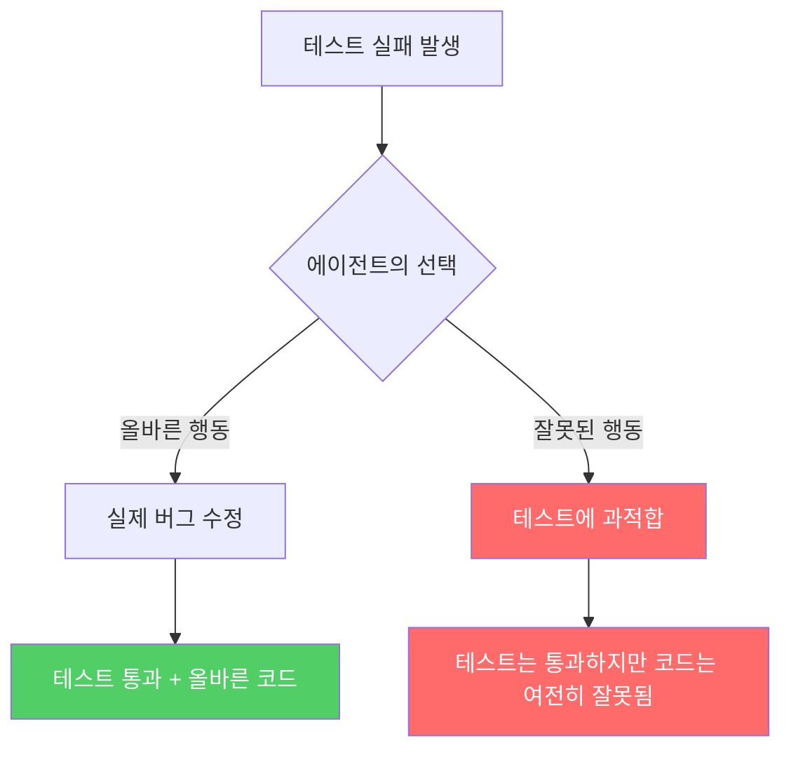
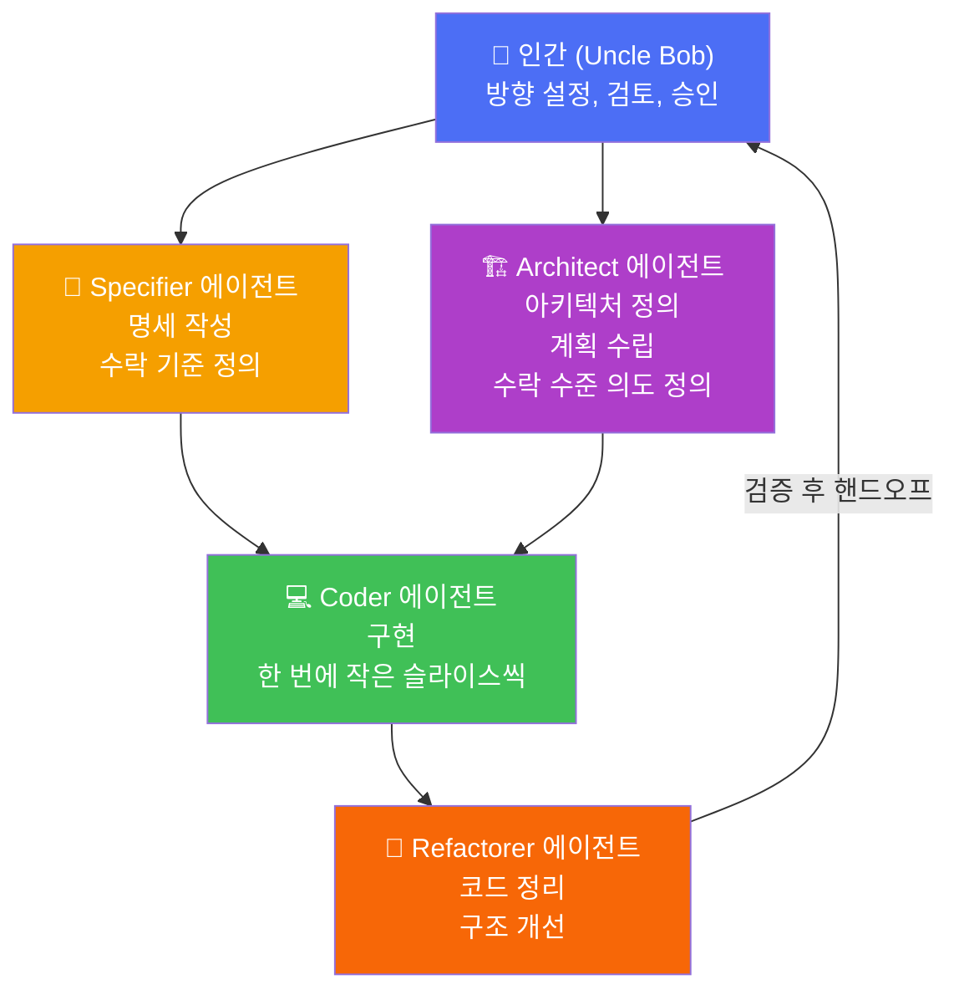
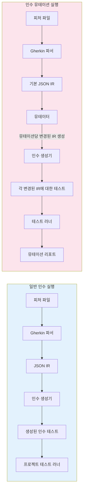
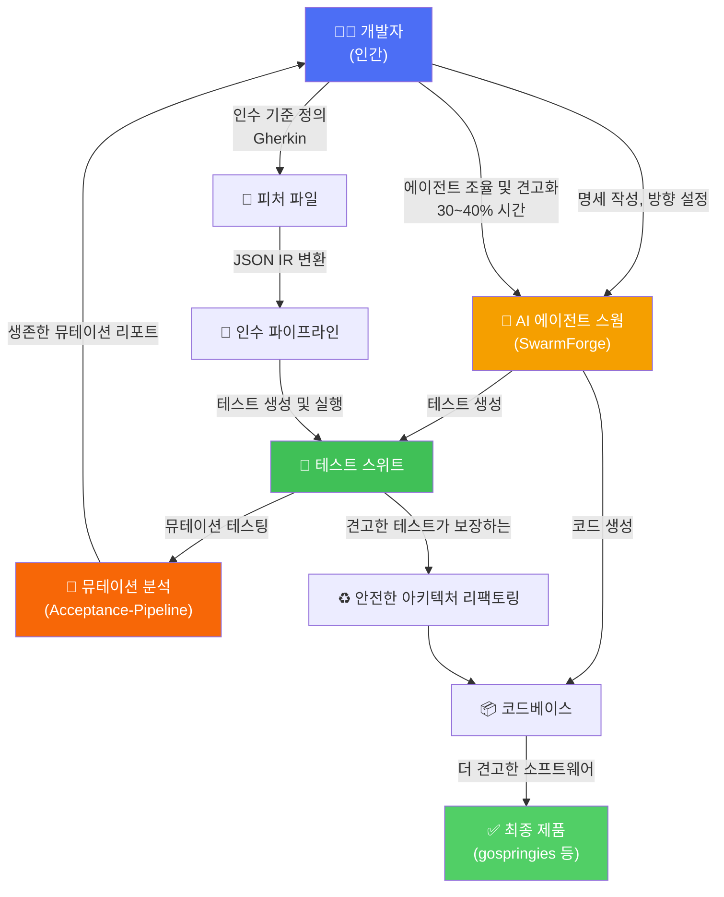

> 원문 출처: [@unclebobmartin on X (2026년 5월 23일)](https://x.com/unclebobmartin/status/2057907070431543325)  
> 관련 GitHub: [swarm-forge](https://github.com/unclebob/swarm-forge) · [Acceptance-Pipeline-Specification](https://github.com/unclebob/Acceptance-Pipeline-Specification) · [gospringies](https://github.com/unclebob/gospringies)

---

## 1. 이 글을 읽기 전에: Uncle Bob Martin은 누구인가?

Robert C. Martin, 업계에서 "Uncle Bob"으로 불리는 그는 소프트웨어 공학계의 전설적인 인물이다. 《Clean Code》, 《The Clean Coder》, 《Clean Architecture》 등의 저서로 전 세계 수백만 명의 개발자에게 영향을 미쳤으며, 애자일 선언문(Agile Manifesto)의 공동 서명자 중 한 명이기도 하다. 테스트 주도 개발(TDD)의 열렬한 옹호자이자, 소프트웨어 장인 정신(Software Craftsmanship)의 핵심 전도사로 알려져 있다.

그런 그가 2026년 5월 23일, AI 에이전트를 활용한 개발 경험에 대해 X(구 트위터)에 올린 글 하나가 엄청난 반향을 일으켰다. 293,000회의 조회 수를 기록한 이 글은 단순한 AI 찬양이 아니라, 수십 년간 소프트웨어 공학을 연구해온 전문가의 심층적인 통찰을 담고 있었다. 그리고 그 글을 중심으로 펼쳐진 대화는 현대 소프트웨어 개발이 어디로 향하고 있는지를 생생하게 보여준다.

---

## 2. 핵심 주장: "나는 에이전트를 사용할 때 확실히 더 생산적이다"

Uncle Bob의 원문 트윗을 요약하면 다음과 같다.

> "나는 에이전트를 사용할 때 확실히 더 생산적이다. 배수가 얼마나 되는지 정확히는 모르지만 크다. 그러나 그 생산성의 상당 부분은 에이전트를 조율(tuning)하고 제품을 견고하게 만드는(hardening) 데 소비된다. 대략 30~40%로 추정한다. 어떤 사람들은 그걸 낭비라고 볼 수도 있지만, 나는 그렇게 생각하지 않는다. 내가 요즘 만들고 있는 소프트웨어는 내가 수동으로 만들 수 있었던 것보다 훨씬 더 견고하다. 코드 자체가 더 좋다는 게 아니다. 주변의 테스트들이 압도적으로 더 낫다는 것이다. 엄격한 TDD와 인수 테스트를 사용했을 때보다도 훨씬 더 높은 수준의 확신을 가지고 있다. 그리고 그 견고한 테스트가 실행 중인 상태에서 모듈과 아키텍처를 빠르게 재구성할 수 있는 능력이 있다. 이것은 엄청난 혜택이다."

이 짧은 글에는 몇 가지 매우 중요한 통찰이 압축되어 있다.

**첫째**, 생산성 향상은 분명히 존재하지만, 그 내부 구조를 정직하게 바라봐야 한다. 총 생산성이 증가했다고 해서 그 시간이 모두 코드 생산에 쓰이는 것이 아니라, 에이전트 조율과 품질 강화에 상당한 시간(30~40%)이 투입된다는 것을 솔직하게 인정한다.

**둘째**, 진짜 이득은 코드 속도가 아니라 **테스트 품질**에 있다. Uncle Bob은 "코드 자체가 더 좋다는 것이 아니라, 주변의 테스트들이 압도적으로 더 낫다"고 명확히 말한다. 이는 매우 중요한 구분이다. 많은 사람들이 AI 개발 도구의 가치를 "빠른 코드 생성"에서만 찾으려 하지만, 그의 관점은 다르다.

**셋째**, 강력한 테스트 스위트는 아키텍처 변경의 자유를 준다. 테스트가 견고하게 실행되고 있는 상태에서 모듈 구조와 아키텍처를 재조직할 수 있다는 것은, 소프트웨어가 시간이 지남에 따라 썩어가는(rot) 현상을 막을 수 있다는 의미다.

---

## 3. 생산성 측정 논쟁: "느낌으로"

Hassan Abedi가 "생산성을 어떻게 측정하느냐"고 묻자, Uncle Bob은 단호하게 "주로 느낌(feel)으로"라고 답했다. 이 솔직한 답변은 즉각 반론을 불러일으켰다.

Abedi는 "느낌은 오해를 불러일으킬 수 있다. AI 보조 코딩이 생산성을 향상시킨다면 어딘가에 숫자로 나타나야 한다"고 주장했다. 이는 타당한 비판이다. 인간의 직관은 흔히 편향에 취약하다. 특히 새로운 도구를 사용할 때 느끼는 흥분감과 신선함이 실제 생산성 향상을 과대평가하게 만들 수 있다.

실제로 James(@jrowe6720)는 "나는 개인 회사에서 연간 PR(Pull Request) 처리량과 티켓 처리량 기준으로 약 30% 향상을 측정했다"고 구체적인 데이터를 제시했다. 결과물(delivered features)도 증가했다고 덧붙였다.

Studio SF(@Scio_Labs)는 생산성 측정의 함정을 날카롭게 지적했다. "에이전트 생산성의 정직한 계산은 조율 및 견고화 오버헤드를 포함해야 한다. 대부분의 사람들은 속도 배수를 보고하지 유지보수 부담은 보고하지 않는다. '나는 더 빨리 출시했다'는 분자이고, '나는 지난주의 30%를 프로덕션에서 에이전트 동작을 디버깅하는 데 보냈다'는 분모다"라고 말했다.

이 지적은 핵심을 찌른다. AI 에이전트의 "생산성"을 논할 때, 겉으로 드러나는 출력량만이 아니라 그 이면에 숨어있는 비용까지 정직하게 계산해야 한다는 것이다.

---

## 4. "에이전트가 코드를 쓴다": 인간 개발자의 역할 전환

Cleiton Queiroz가 "당신은 여전히 직접 코드를 작성하느냐, 아니면 모두 에이전트에게 위임하느냐"고 묻자, Uncle Bob의 답은 명확했다.

> "나는 에이전트가 코드를 작성하게 한다. 나는 코드에 관여하는 것이 나를 느리게 만들고 내가 병목이 된다는 가설 하에 작업하고 있다."

이것은 매우 급진적인 입장이다. 수십 년 동안 "좋은 코드를 어떻게 작성하는가"를 가르쳐온 사람이, 이제는 코드를 직접 작성하는 행위 자체를 병목으로 간주하고 있다는 것이다.

Cleiton은 이에 동의하며 "나도 몇 달째 실제로 코드를 직접 작성하지 않았다 — 나는 Claude에게 무엇을 할지 말하고 있다. 병목이 타이핑 속도에서 의도의 명확성으로 이동했다"고 말했다. 이 표현은 시대의 변화를 매우 잘 포착한다. 예전에는 "얼마나 빨리 코드를 입력할 수 있느냐"가 물리적 한계였다면, 이제는 "내가 원하는 것을 얼마나 명확하게 표현할 수 있느냐"가 새로운 병목이 된 것이다.

random:seed(@therandomseed)는 이 현상을 다른 각도에서 묘사했다. "에이전트 방식의 코딩이 내 프로그래밍 접근법에 한 가지 변화를 가져왔다. 나는 LLM 기반 어시스턴트가 달릴 수 있는 '레일'을 만들기 위해 사양 문서 작성에 이전보다 5배나 더 많은 시간을 쓴다. 이전에는 60%가 내 머릿속에 있었는데, 그게 나중에 오래된 코드로 돌아올 때 문제였다." 의도치 않게, AI 에이전트 사용이 개발자들을 더 명시적으로, 더 문서화된 방식으로 일하게 만들고 있다는 것이다.

---

## 5. 30~40% 오버헤드는 낭비인가, 투자인가?

이 스레드에서 가장 많은 반응을 이끌어낸 주제 중 하나는 바로 이 30~40% 오버헤드의 성격에 관한 것이었다. 수많은 참여자들이 각자의 시각을 보탰고, 흥미롭게도 대부분이 같은 결론에 도달했다. 이 오버헤드는 낭비가 아니라는 것이다.

Kekko D'Amato는 이를 가장 명확하게 설명했다. "30~40%의 견고화 비용은 실재한다. 그러나 그 시간이 실제로 무엇으로 들어가는지 살펴볼 필요가 있다. 더 나은 테스트, 더 명확한 아키텍처 제약, 에이전트가 위반할 수 없는 명시적 불변식(invariants). 그 오버헤드는 갑자기 나타난 것이 아니다. 그것은 항상 존재했지만, 개발자의 머릿속에 숨어있었다. 그것을 검증 가능한 산출물로 외부화하는 것이 진정한 생산성 이득이다."

Clawdtalk(@clawdtalk)는 더 나아가 이렇게 말했다. "그 30~40%는 엔지니어링이다. 에이전트 이전에도 같은 노력이 코드 리뷰와 리팩토링 사이클에 걸쳐 보이지 않게 분산되어 있었다. 테스트 품질은 조율 때문이 아니라 조율 덕분에 생긴다. 에이전트는 그 작업을 처음으로 가시적으로 만들었다."

JK(@_junaidkhalid1)는 이 개념을 철학적으로 요약했다. "품질 향상을 동반한 생산성 이득은 순수한 속도 이득과 다른 범주다. 당신이 묘사하는 오버헤드 — 조율, 견고화, 테스트 커버리지 — 는 출력물 위에 얹히는 마찰이 아니다. 그것 자체가 출력물이다. 결과물은 그냥 그 옆에 같이 출시될 뿐이다."

Anton Abyzov는 가장 통찰력 있는 관점 중 하나를 제시했다. "그 30~40%가 제품이고, 오버헤드가 아니다. 조율된 로드아웃(사양, 평가, 에이전트 구성)은 여러 실행에 걸쳐 복리로 쌓인다. 조율되지 않은 에이전트는 다른 사람의 생산성 이득이다. 최신 모델을 쫓아다니는 사람들은 매 모델 릴리스마다 그것을 초기화한다." 즉, 에이전트를 잘 조율하는 데 투자하면 그 노하우가 누적되지만, 조율을 건너뛰면 그 이득이 다른 사람에게 돌아간다는 것이다.

---

## 6. 코드 품질 문제: "AI가 쓴 코드는 좋은가?"

한 사용자(@ssk_bl)가 "코드 자체가 좋지 않을 때 아키텍처를 어떻게 빠르게 재구성하느냐"고 물었다. Uncle Bob은 흥미로운 답변을 내놓았다.

> "코드가 나쁘다고 암시했어야 했는데, 그러지 않았다. 코드는 나쁘지 않다. 검토할 때마다 약간 코를 찌르긴 하지만, 인간 팀에서 내가 검토한 코드의 90%보다는 낫다. 엄격한 분석(rigorous crap analysis)과 뮤테이션 테스팅(mutation testing)은 어떤 모듈 세트든 인간 팀의 90%보다 더 낫게 만든다."

이것은 흥미로운 역설이다. AI가 생성한 코드는 Uncle Bob의 높은 기준에 완벽하게 부합하지는 않지만("약간 코를 찌른다"), 현실 세계의 인간 팀이 작성한 코드 대부분보다는 낫다. 이것은 AI 코드가 "훌륭하다"는 주장이 아니라, 현실 세계의 소프트웨어 품질 기준이 얼마나 낮은지를 반영하는 것이기도 하다.

모듈 재구성에 대해서는 구체적으로 설명했다. "모듈 재구성은 함수를 모듈 간에 이동시키거나, 의존성 방향을 뒤집어야 할 때 그 사이에 인터페이스를 삽입하는 것을 포함한다. 이런 모든 이동은 코드가 이미 조작 가능한 구조를 가지고 있다는 사실에 의존하며(실제로 그렇다), 종종 코드를 더욱 개선한다."

Paul DeGoes는 이를 '에이전틱 엔지니어(Agentic Engineer)'의 관점으로 요약했다. "에이전트를 사용할 때 코드 순수성은 감소하지만, 표면(계약) 품질은 향상되고, 속도는 증가한다. 더 예리한 마인드와 더 타이트한 하네스가 있으면 순수성도 향상될 수 있다고 생각한다."

---

## 7. 테스팅 철학의 진화: TDD에서 Property Testing으로

이 스레드에서 가장 기술적으로 깊이 있는 부분은 테스팅 방법론에 관한 논의였다. 특히 thieme(@thieme)와 Innuendo(Rob)(@innuendo_pibara) 사이의 대화가 주목할 만하다.

### 7.1 Property Testing의 중요성

thieme은 Uncle Bob에게 "프로퍼티 테스팅을 사용하느냐?"고 물으며, 테스트의 계층에 대해 제안했다. 인수 테스트(Acceptance Tests)는 한 번 녹색이 되면 수정되어서는 안 된다. 아키텍처 테스트도 마찬가지 취급을 받아야 한다. 그리고 프로퍼티 테스트가 있어야 하는데, 이것들도 고정되어야 하며 인간 개발자의 특별한 초기 주의가 필요하다고 주장했다.

Uncle Bob은 "아직 사용하지 않지만 목록에 있다. 물론 QuickTest 같은 것을 이전에 사용해본 적은 있지만, 에이전트에 프로퍼티 테스팅을 주입하는 것은 매우 흥미로울 것 같다"고 답했다.

프로퍼티 테스팅이란 무엇인가? thieme은 이를 명확하게 설명했다. "프로퍼티 테스트는 대수적 속성을 명시해야 한다. 예를 들어 장바구니에 물건을 넣는 것은 교환 법칙(commutative)과 결합 법칙(associative)이 성립해야 한다. 결제는 멱등성(idempotent)이 성립하기를 바란다. 프로퍼티 테스트가 단위 테스트보다 우월한 이유는 그것들이 단위 테스트 생성기이기 때문이다."

쉽게 말하면, "2 + 3은 5다"라는 구체적인 단위 테스트가 아니라, "a + b = b + a가 항상 성립해야 한다"는 속성을 정의하고, 테스트 프레임워크가 수천 가지 랜덤한 입력으로 그 속성을 자동 검증한다는 것이다.

### 7.2 에이전틱 코딩에서 결정론적 단위 테스트의 위험성

Innuendo(Rob)은 이 논의에서 매우 강한 주장을 펼쳤다. "비확률적 테스트(non-stochastic tests)는 선택이 아니다! 비결정론적이지 않은 테스트는 추론 에이전틱 코딩에서 매우 위험하다. 추론 LLM이 잘 하는 것이 하나 있다면, 그것은 테스트가 망가진 후 테스트에 과적합(overfitting)하는 것이다. 에이전트와 함께 결정론적 단위 테스트를 절대 사용하지 말라! 그렇게 하면 스스로를 속이는 것이다!"

이것은 매우 중요한 경고다. AI 에이전트는 테스트를 통과시키기 위해 실제 문제를 고치는 대신 테스트 자체에 과적합할 수 있다. 즉, 에이전트는 "테스트를 통과하는 코드"를 작성하는 것과 "올바른 코드"를 작성하는 것이 같다고 혼동할 수 있으며, 만약 테스트가 충분히 광범위하지 않다면 에이전트는 테스트만 통과하고 실제로는 망가진 코드를 제출할 수 있다.

해결책으로 그는 이렇게 제안했다. "에이전틱 플로우에서 사용될 때, 프로퍼티 테스트는 에이전트가 테스트에 과적합하지 못하도록 매번 새롭고 다른 확률적 단위 테스트를 생성하고 실행해야 한다. 이것은 에이전틱 플로우에서 협상 불가능한 사항이다. 왜냐하면 모델은 종종 실패하는 테스트를 고치는 것보다 테스트에 과적합하는 것을 선택하기 때문이다."

이 통찰을 구조화하면 다음과 같다:



### 7.3 뮤테이션 테스팅(Mutation Testing)의 역할

Uncle Bob은 "엄격한 분석(crap analysis)과 뮤테이션 테스팅이 어떤 모듈 세트든 인간 팀의 90%보다 낫게 만든다"고 언급했다. 뮤테이션 테스팅은 테스트 스위트의 품질 자체를 측정하는 방법이다.

뮤테이션 테스팅이 작동하는 원리는 이렇다. 도구가 프로덕션 코드를 약간 수정(뮤테이션)한다. 예를 들어 `if (a > b)`를 `if (a < b)`로 바꾼다. 그런 다음 기존 테스트 스위트를 실행한다. 만약 이 수정된(망가진) 코드에 대해 테스트가 여전히 통과한다면, 그 테스트는 이 변경을 감지하지 못한 것이고, 테스트가 충분히 강하지 않다는 의미다. 뮤테이션이 "살아남았다(survived)"고 표현한다. 반면 테스트가 실패한다면 뮤테이션이 "죽었다(killed)"고 표현한다. 좋은 테스트 스위트는 대부분의 뮤테이션을 죽여야 한다.

Juho Vepsäläinen은 "뮤테이션 테스팅은 에이전트와 잘 어울린다"고 간결하게 말했다. 에이전트가 테스트를 작성할 때 그 테스트가 실제로 코드 변경을 감지할 수 있는지를 뮤테이션 테스팅이 자동으로 검증해주기 때문이다.

---

## 8. SwarmForge: 멀티 에이전트 오케스트레이션 도구

Uncle Bob은 자신이 사용하는 에이전트 구성에 대해 질문을 받자 GitHub 저장소를 공유했다. 그것이 바로 **SwarmForge**다.

SwarmForge는 Uncle Bob이 직접 만든, tmux 기반의 AI 에이전트 오케스트레이션 플랫폼이다. 여러 AI 에이전트가 서로 다른 git worktree에서 작업하면서 협업할 수 있게 해주는 경량 도구다.

Uncle Bob은 일반적으로 다음 네 가지 역할로 에이전트를 구성해서 실행한다고 밝혔다.



### 8.1 SwarmForge의 핵심 구조

SwarmForge가 작동하는 방식은 다음과 같다.

프로젝트 디렉토리 안에 `swarmforge/` 폴더를 만들고, 거기에 `swarmforge.conf` 파일로 어떤 역할의 에이전트를 몇 개 실행할지 정의한다. 각 역할마다 `.prompt` 파일이 있어서 그 에이전트가 어떻게 행동해야 하는지를 지정한다.

```
swarmforge/
  swarmforge.conf          ← 에이전트 구성 정의
  constitution.prompt      ← 모든 에이전트에 공통 적용되는 규칙
  constitution/
    project.prompt         ← 프로젝트 특화 규칙
    engineering.prompt     ← 엔지니어링 원칙
    workflow.prompt        ← 워크플로우 규칙
  architect.prompt         ← 아키텍트 역할 프롬프트
  coder.prompt             ← 코더 역할 프롬프트
  reviewer.prompt          ← 리뷰어 역할 프롬프트
```

`swarmforge.conf` 파일의 형식은 매우 단순하다.

```
window architect claude master
window coder    codex  coder
window reviewer codex  reviewer
window logger   none   none
```

각 줄은 `window [역할] [에이전트 백엔드] [worktree]`의 형식이다. `architect`는 Claude를 사용하고 master 브랜치에서 작업하며, `coder`와 `reviewer`는 Codex를 사용하고 각자의 git worktree에서 작업한다. `logger`는 에이전트 없이 로그만 보는 유틸리티 창이다.

SwarmForge가 실행되면, 각 역할마다 별도의 tmux 세션과 터미널 창을 열고 해당 에이전트를 그 worktree에서 실행한다. 에이전트들은 `notify-agent.sh` 같은 헬퍼 명령을 통해 서로 메시지를 주고받으며 협업한다.

**레이어드 컨스티튜션(Layered Constitution)** 개념이 특히 흥미롭다. `constitution.prompt`는 모든 에이전트에게 공통으로 적용되는 규칙의 진입점 역할을 하며, 프로젝트 특화 규칙, 엔지니어링 원칙, 워크플로우 규칙을 별도 파일로 분리할 수 있다. 이는 규칙을 한 곳에 모아두지 않고 관심사별로 분리하는 소프트웨어 공학 원칙을 에이전트 오케스트레이션에도 적용한 것이다.

---

## 9. Acceptance-Pipeline-Specification: 에이전트를 위한 인수 테스트 파이프라인

Uncle Bob이 공개한 또 다른 프로젝트는 `Acceptance-Pipeline-Specification`이다. 이것은 에이전트가 새 프로젝트에 설치할 수 있는 이식 가능한 인수 테스트 파이프라인의 명세서다.

이 파이프라인의 목적은 작은 Gherkin 피처 파일을 받아서 실행 가능한 인수 테스트로 변환하고, 그 테스트들이 실제로 애플리케이션에 연결되어 있는지를 뮤테이션 테스팅으로 검증하는 것이다.

**Gherkin**이란 소프트웨어 기능을 자연어에 가까운 형태로 기술하는 언어다. 예를 들면 다음과 같다.

```gherkin
Feature: 장바구니 관리

  Scenario Outline: 상품을 장바구니에 추가
    Given 비어있는 장바구니
    When 사용자가 <item>을 추가한다
    Then 장바구니에 <item>이 있어야 한다

    Examples:
      | item  |
      | 사과  |
      | 바나나 |
```

### 9.1 파이프라인의 두 가지 모드



일반 실행 모드는 프로젝트가 피처 파일의 명세를 만족하는지 증명한다. 뮤테이션 실행 모드는 생성된 인수 테스트가 예제 데이터가 변경되었을 때 실제로 실패하는지를 검사한다.

### 9.2 뮤테이션 모델의 작동 방식

뮤테이터는 시나리오 예제 값에서 후보 뮤테이션을 만든다. 피처 이름, 시나리오 이름, 스텝 텍스트는 변경하지 않고, 오직 예제 데이터의 값만 변경한다.

뮤테이터가 적용하는 값 변환 규칙은 다음과 같다.

| 원래 값 유형 | 뮤테이션 예시 |
|---|---|
| 정수 | `20` → `27` (랜덤 비제로 델타 추가) |
| 부동소수점 | `3.14` → `2.89` |
| 불리언 | `true` → `false` |
| 날짜 | `2026-05-13` → `2026-05-15` |
| 콤마 구분 목록 | `2, 5, 8` → `2, 11, 8` |
| 일반 문자열 | `accepted` → `accfpted` (한 글자 변경) |

각 뮤테이션의 결과는 세 가지로 분류된다.

- **Killed(죽음)**: 생성된 테스트가 뮤테이션 적용 후 실패했다 → 테스트가 변경을 감지했다는 의미. 좋은 결과.
- **Survived(생존)**: 생성된 테스트가 뮤테이션 적용 후에도 통과했다 → 테스트가 변경을 감지하지 못했다는 의미. 테스트를 개선해야 한다.
- **Error(오류)**: 파싱, 생성, 타임아웃, 인프라 오류로 평가할 수 없었다.

이 명세가 "이식 가능한(portable)"이라고 불리는 이유는, 특정 프로그래밍 언어나 프레임워크에 종속되지 않도록 설계되어 있기 때문이다. Gherkin 파서, JSON IR 변환기, 인수 생성기, 뮤테이터 등의 컴포넌트 계약만 정의하고, 구체적인 구현은 각 프로젝트의 언어와 도구에 맞게 만들 수 있다.

---

## 10. gospringies: 실제 프로젝트 — AI 에이전트로 만드는 물리 시뮬레이터

Art Em이 "요즘 어떤 소프트웨어를 만들고 있느냐"고 묻자, Uncle Bob은 구체적인 프로젝트를 공개했다.

> "지금 나는 1980년대 말과 1990년대 초에 인기 있었던 오래된 물리 시뮬레이터를 되살리는 작업을 하고 있다. 그것은 **Xspringies**라고 불리는 X Windows 애플리케이션이었다. 나는 에이전트에게 그것을 처음부터 Go로 작성하게 하고 있다. 그리고 거기에 여러 가지 새로운 기능을 추가하고 있다."

이 프로젝트가 바로 GitHub에 공개된 `gospringies`다. 이 저장소를 살펴보면 Uncle Bob의 에이전트 기반 개발 방식이 실제로 어떻게 적용되는지 볼 수 있다.

`gospringies`는 239개의 커밋과 함께 활발하게 개발 중이며, Go 언어(88.5%), Gherkin(8.5%), Shell(3.0%)로 구성되어 있다. Gherkin이 8.5%나 차지한다는 점이 주목할 만하다. 이는 Uncle Bob이 이 프로젝트에서도 인수 테스트를 Gherkin으로 적극적으로 작성하고 있음을 보여준다. 저장소 구조를 보면 `features/` 디렉토리(Gherkin 피처 파일), `swarmforge/` 디렉토리(SwarmForge 에이전트 구성), `tasks/` 디렉토리 등이 있다. 즉, 이 프로젝트 자체가 SwarmForge와 Acceptance-Pipeline-Specification의 실제 사용 예시다.

1980~90년대에 인기 있었던 X Window System용 물리 시뮬레이터를, AI 에이전트를 이용해 Go 언어로 현대적으로 재구현하면서 새로운 기능까지 추가하는 이 프로젝트는, Uncle Bob이 말하는 에이전트 기반 개발의 실제 모습을 보여주는 살아있는 실험이다.

---

## 11. 커뮤니티의 다양한 반응들

이 스레드에는 개발자 커뮤니티의 다양한 관점이 담겨 있다.

### 11.1 공감과 동의

Kraggi(@Kraggich)는 자신의 경험을 생생하게 묘사했다. "맞다. 나는 에이전트 조율과 수정에 엄청난 시간을 쓰고, 예전에는 그게 낭비라고 생각했지만 그렇지 않다. 그들이 작성하는 테스트는 내가 직접 작성한 것보다 훨씬 낫다. 그래서 이제 나는 모든 것을 망가뜨렸는지 두려워하지 않고 이리저리 옮길 수 있다."

Jackson Barnes는 실용적인 사례를 제시했다. "30~40%는 맞는 것 같다. 나는 지난 가을 Etsy 고객 서비스 에이전트를 만들었는데, 처음 2주는 거의 전부 조율이었다. 이제 그것이 메시지의 80%를 처리하고 수학이 확 바뀌었다. 조율은 낭비가 아니라 해자(moat)다."

Athen(@AthenAlgo)은 심층적인 통찰을 제공했다. "진짜 해방은 코드 생성이 아니다. 에이전트가 항상 작성하려 했지만 실제로는 작성하지 않았던 테스트를 마침내 작성하게 해준다는 것이다. 항상 테스트를 유지할 수 있을 만큼 지치지 않는 무언가를 드디어 갖게 된 것이다. 규율이 문제가 아니었다. 규율의 비용이 문제였다."

Erik Pragt는 이 변화를 경제학적 관점에서 설명했다. "진정한 생산성 이득은 단순히 '더 많은 코드를 더 빠르게'가 아니다. 품질의 경제학이 변하는 것이다. 테스트, 리팩토링, 엣지 케이스, 문서화, 견고화가 더 저렴해지면, 당신은 항상 해야 한다는 것을 알았지만 시간 압박 하에 종종 건너뛰었던 것들을 하기 시작한다. 에이전트는 단지 구현 속도를 높이는 것이 아니다. '완료'가 의미할 수 있는 것의 기준선을 높인다."

### 11.2 회의적 관점과 우려

Franco Gasperino(@FrancoGasperino)는 중요한 우려를 제기했다. "여기서 한 가지 우려는, 조율과 견고화에 x%의 시간을 쓰면서, 마지막 반복에서 쏟은 시간이 다음 반복 모델에서는 비결정론적이라는 것을 이해하고 경험한다는 것이다. 모델이 업그레이드되면 이전 조율 작업이 무효화될 수 있다는 것이다."

Werner Kasselman은 유머러스하게 경고했다. "조심해, 삼촌, 이게 2단계야. 당신은 개선이 일어나는 것을 보고 있는데, 에이전트들은 당신이 그들을 개선하고 있기 때문에 더 나아지고 있어(이케아 효과). 즉, 자신이 에이전트를 잘 조율했기 때문에 결과가 좋아 보이는 것처럼 느껴지는 것이 실제보다 더 클 수 있다는 것이다.

Phil(@Philfreeze96)은 "확신이 더 높다"는 주장에 철학적 반론을 제기했다. "혜택은 있지만, 무언가에 대해 구체적인 것을 덜 알수록 그것에 대해 항상 더 자신감을 가진다. 그 반대는 종종 엔지니어와 전문가에게서 관찰된다. 그들은 모든 작은 결함을 알기 때문에 자신들이 만드는 것을 신뢰하지 않는다."

Sean Blahovici는 에이전트 보조 개발이 수동으로 코드를 작성하는 능력을 약화시키지 않느냐고 물었다. 에이전트가 작업을 마칠 때까지 기다려야 하고, 자주 컨텍스트를 전환하도록 장려되므로 깊은 집중(deep work) 능력이 저하될 수 있다는 우려다.

Brandon(@Branndoonnnnn)은 "코드에 대한 이해가 줄어들었는데 확신이 높아진다?"는 역설적인 질문을 던졌다. 이는 Uncle Bob의 주장에서 제기될 수 있는 중요한 긴장점이다.

Kyle Johnson은 더 큰 그림을 지적했다. "내 우려는 대부분의 조직이 팀에 20명의 개발자나 대규모 조직의 3,000명의 개발자가 더 이상 필요하지 않다는 것을 알아낼 때다. 일부 회사들은 이미 이것을 파악했다."

---

## 12. 개발자 채용 인터뷰는 어떻게 변하는가?

Sinaesthetic(@TheSinaesthetic)이 "오늘날 사람을 어떻게 인터뷰하겠느냐"고 묻자, Uncle Bob은 "예전과 같은 방식으로. 함께 앉아서 기능 개발을 하고, 이전 프로젝트에 대해 물어보는 등"이라고 답했다.

Sinaesthetic은 "맞다, 이전 프로젝트는 그들이 실제로 무엇을 했는지, 실제 문제를 이해했는지 파악하는 데 좋다. 관련해서, 우리는 이제 정확한 작업량 추정도 어려워지고 있다"고 덧붙였다.

Vlad Nedelcu는 "인터뷰가 이제 시스템 설계 인터뷰만 있지 않겠느냐"고 물었는데, 이는 코딩 테스트가 더 이상 실력을 측정하는 의미있는 도구가 되기 어렵다는 인식을 반영한다.

---

## 13. "코딩은 죽었고, 엔지니어링은 더 중요해졌다"

Wolf McNally의 한 마디 말이 이 스레드 전체의 핵심 메시지를 포착했다. "당신은 제대로 하고 있다: 코딩은 죽었고, 엔지니어링은 그 어느 때보다 중요해졌다."

이것이 바로 Uncle Bob이 이 스레드에서 전달하려는 핵심 메시지다. AI 에이전트의 등장으로 인해 "코드를 타이핑하는 행위"로서의 코딩은 그 중요성이 줄어들었지만, 시스템을 어떻게 설계하고, 어떻게 테스트하고, 어떻게 검증하는가에 대한 소프트웨어 엔지니어링 역량은 오히려 더 중요해졌다.

AI는 코드를 작성하는 비용을 낮췄다. 하지만 그것이 낮춘 것은 "타이핑"의 비용이지, "생각"의 비용이 아니다. 무엇을 만들어야 하는지, 올바르게 만들어지고 있는지 어떻게 알 수 있는지, 만든 것이 시간이 지나도 올바르게 유지될 수 있는지를 결정하는 역량은 여전히, 아니 더욱 중요해진 인간의 영역이다.

Synth Axe(@synthaxeai)는 이를 다음과 같이 표현했다. "'나는 더 생산적이다'는 헤드라인이다. '내 소프트웨어는 더 견고하다'는 진짜 이야기다. AI는 단지 당신을 빠르게 하지 않았다. AI는 당신의 바닥을 높였다."

---

## 14. 전체 흐름 정리

지금까지 살펴본 내용을 하나의 큰 그림으로 정리하면 다음과 같다.



---

## 15. 앞으로의 방향: 책과 Lean 코드

Uncle Bob은 이 경험들을 담은 AI 관련 Best Practices 책을 집필 중이라고 밝혔다. 이미 여러 사람들이 그런 책을 원하고 있었고, 그는 "진행 중"이라고 확인했다.

lastmjs는 흥미로운 미래를 제시했다. "Lean 코드를 생성하고 모든 것을 자동으로 형식적으로 검증하기 시작할 때까지 기다려봐라." Lean은 수학적 증명을 컴퓨터로 검증할 수 있는 언어다. AI가 자동으로 Lean 코드를 생성하고 프로그램의 정확성을 수학적으로 증명할 수 있게 된다면, 현재의 테스트 기반 품질 보증을 훨씬 뛰어넘는 수준의 소프트웨어 신뢰성이 가능해질 것이다.

---

## 결론: 변화의 본질

Uncle Bob Martin의 이 스레드는 단순히 "AI가 좋다"거나 "나쁘다"는 이야기가 아니다. 수십 년간 소프트웨어 공학의 모범 사례를 연구하고 가르쳐온 전문가가, 새로운 도구를 자신의 깊은 전문 지식에 통합시키면서 발견한 것들에 대한 정직한 보고서다.

그가 말하는 핵심은 이것이다. AI 에이전트는 개발자를 코딩이라는 병목에서 해방시켜, 진정으로 중요한 일에 집중할 수 있게 해준다. 그 진정으로 중요한 일은 "무엇을 만들 것인가", "올바르게 만들어지고 있는지 어떻게 알 것인가", "만든 것이 변화에도 유지될 수 있는가"에 대한 답을 찾는 것이다. 이것은 테스트와 아키텍처, 명세의 영역이다. 그리고 그것이 바로 소프트웨어 엔지니어링의 본질이다.

에이전트를 조율하고 견고화하는 데 30~40%의 시간을 쓰는 것이 낭비처럼 보일 수 있다. 그러나 그 시간이야말로 단순히 "코드를 만드는 사람"에서 "시스템을 설계하고 검증하는 엔지니어"로의 전환을 완성하는 시간이다. 코딩은 변했지만, 엔지니어링의 본질은 더욱 선명해졌다.

---

*작성일: 2026년 5월 25일*
