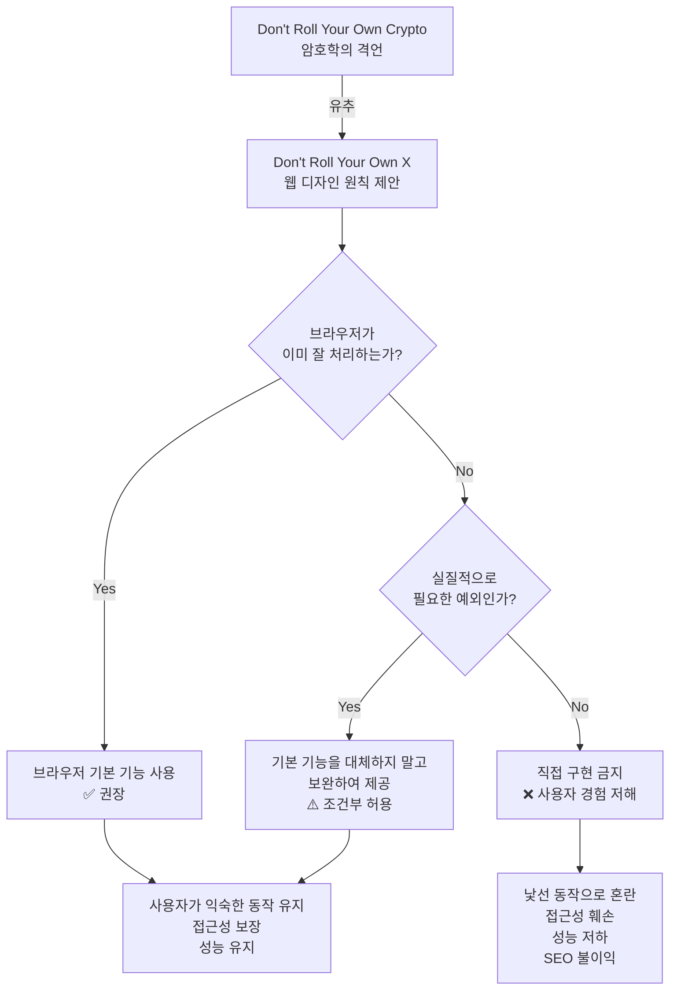
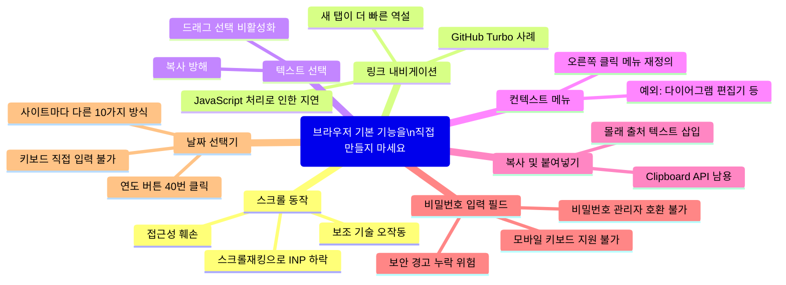
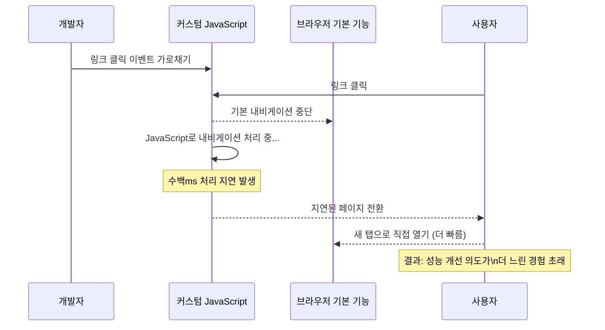

### Susam Pal의 현대 웹 디자인 비판

> **원문**: [https://susam.net/do-not-roll-your-own.html](https://susam.net/do-not-roll-your-own.html)  
> **원문 작성일**: 2026년 5월 23일 (Susam Pal)

---

## 목차

1. [글의 배경과 핵심 전제](#1-글의-배경과-핵심-전제)
2. ["직접 만들지 마세요" — 암호학에서 웹 디자인으로](#2-직접-만들지-마세요--암호학에서-웹-디자인으로)
3. [7가지 금지 목록 개요](#3-7가지-금지-목록-개요)
4. [항목별 심층 분석](#4-항목별-심층-분석)
   - 4-1. [스크롤 동작 — 스크롤재킹의 폐해](#4-1-스크롤-동작--스크롤재킹의-폐해)
   - 4-2. [링크 내비게이션 — GitHub의 사례](#4-2-링크-내비게이션--github의-사례)
   - 4-3. [텍스트 선택 및 컨텍스트 메뉴](#4-3-텍스트-선택-및-컨텍스트-메뉴)
   - 4-4. [복사 및 붙여넣기](#4-4-복사-및-붙여넣기)
   - 4-5. [비밀번호 입력 필드](#4-5-비밀번호-입력-필드)
   - 4-6. [날짜 선택기 (Date Picker)](#4-6-날짜-선택기-date-picker)
5. [브라우저 개발자 도구가 폭로한 현실 — turbo.es2017-esm.js](#5-브라우저-개발자-도구가-폭로한-현실--turboes2017-esmjs)
6. [UI 잦은 변경이 노령 사용자에게 미치는 영향](#6-ui-잦은-변경이-노령-사용자에게-미치는-영향)
7. [이 원칙의 의의와 한계](#7-이-원칙의-의의와-한계)
8. [커뮤니티 반응과 실제 논의](#8-커뮤니티-반응과-실제-논의)
9. [전체 구조 요약 (Mermaid 다이어그램)](#9-전체-구조-요약-mermaid-다이어그램)

---

## 1. 글의 배경과 핵심 전제

이 글은 소프트웨어 개발자이자 보안 전문가인 Susam Pal이 2026년 5월 23일에 자신의 개인 블로그에 올린 에세이입니다. 한마디로 요약하자면 **"브라우저가 이미 잘하고 있는 일을 개발자가 굳이 직접 만들어서 사용자 경험을 망치지 말라"** 는 내용입니다.

저자는 평소 웹 서비스의 사용자 입장에서 느낀 불편함을 솔직하게 털어놓으면서, 이것이 단순한 개인적 불평이 아니라 업계 전반이 다시 생각해봐야 할 관행의 문제라고 말합니다. 글의 도입부에서 저자는 스스로 "나는 UX 전문가가 아니며, 이것은 디자인 가이드가 아니라 한 웹 사용자의 한탄"이라고 솔직히 밝힙니다. 그러나 그 이면에 담긴 논리는 상당히 탄탄합니다.

---

## 2. "직접 만들지 마세요" — 암호학에서 웹 디자인으로

### "Don't Roll Your Own Crypto" 원칙

저자는 보안 분야에서 매우 유명한 격언인 **"암호화 알고리즘을 직접 만들지 마라(Don't roll your own crypto)"** 를 이야기의 출발점으로 삼습니다.

이 원칙이 의미하는 바는 다음과 같습니다. 암호화 코드는 누군가는 반드시 만들어야 하지만, 일반적인 프로덕션 서비스가 사용자의 민감한 데이터를 보호하기 위해 검증되지 않은 자체 구현에 의존해서는 안 된다는 것입니다. 보안 커뮤니티의 광범위한 검토를 거친 검증된 패키지와 알고리즘을 사용해야 합니다.

저자는 20년 전 자신의 커리어 초창기에 RC4 암호화를 직접 구현한 코드들을 다수 목격했다고 회고합니다. 그 코드들은 초기화 벡터가 잘못 처리되거나, 키스트림이 예측 가능하거나, 평문의 일부가 암호문에 누출되는 등의 심각한 결함을 지니고 있었습니다. 오늘날에는 대형 전자상거래 사이트나 은행이 자체 제작 암호화를 사용하는 경우는 거의 없으며, 의료·결제·개인정보 처리 등 규제 대상 분야에서는 이를 위반할 경우 막대한 금전적 제재를 받을 수 있습니다.

### 웹 디자인에 같은 원칙을 적용하면

저자는 "웹 디자인이 암호화는 아니다. 스크롤바가 고장나는 것이 암호화 알고리즘이 깨지는 것과 같은 수준의 실패는 아니다"라고 인정합니다. 하지만 그럼에도 불구하고 웹 디자인에도 비슷한 격언이 있어야 한다고 주장합니다. 브라우저가 이미 잘 처리하고 있고, 사용자들이 매일 의존하고 있는 기능들은 개발자가 직접 구현해서는 안 된다는 것입니다.

---

## 3. 7가지 금지 목록 개요

저자가 제시하는 "직접 만들지 말아야 할 것"의 목록은 다음과 같습니다.

| # | 항목 | 브라우저 기본 기능 |
|---|------|-------------------|
| 1 | 페이지 스크롤 | 마우스 휠, 터치패드, 키보드 스크롤 |
| 2 | 링크 내비게이션 | HTML `<a>` 태그 클릭 처리 |
| 3 | 텍스트 선택 | 드래그 또는 더블클릭으로 텍스트 선택 |
| 4 | 컨텍스트 메뉴 | 마우스 오른쪽 클릭 메뉴 |
| 5 | 복사 및 붙여넣기 | Ctrl+C / Ctrl+V 동작 |
| 6 | 비밀번호 입력 필드 | `<input type="password">` |
| 7 | 날짜 선택기 | `<input type="date">` |

저자는 물론 이것들을 직접 구현해야만 하는 정당한 예외 상황이 있다는 점을 인정합니다. 그러나 이 글에서는 그런 예외보다는, **직접 구현해서는 안 되는 경우와 그로 인해 발생하는 더 나쁜 사용자 경험**에 집중합니다.

---

## 4. 항목별 심층 분석

### 4-1. 스크롤 동작 — 스크롤재킹의 폐해

저자가 가장 심각하게 불편함을 느끼는 것이 바로 **커스텀 스크롤 동작**입니다. 이를 업계에서는 **"스크롤재킹(Scrolljacking)"** 이라고 부릅니다.

사용자는 자신의 마우스, 터치패드, 키보드가 스크롤에 어떻게 반응하는지에 이미 깊이 익숙해져 있습니다. 이 동작은 너무 자연스러워서 평상시엔 의식조차 하지 않습니다. 그런데 웹사이트가 브라우저의 기본 스크롤 동작을 JavaScript로 가로채면, 그 페이지는 갑자기 너무 느리거나 너무 빠르게 움직입니다. 키보드 스크롤이 아예 작동하지 않기도 합니다. 저자는 이것을 "내가 너무나 익숙해서 생각조차 하지 않던 것을, 이제 다시 생각해야 하는 낯선 것으로 바꿔버린다"고 표현합니다.

이 문제는 개인적 불편의 수준을 넘어섭니다. 2026년 현재, UX 연구 및 성능 공학 커뮤니티에서는 스크롤재킹이 다음과 같은 실질적인 문제를 야기한다고 지적합니다.

- **접근성 훼손**: 보조 기술(스크린 리더, 키보드 전용 내비게이션)을 사용하는 사용자들에게 페이지가 사실상 사용 불가능해집니다.
- **INP(Interaction to Next Paint) 지표 하락**: scroll 이벤트를 지속적으로 감시하는 무거운 JavaScript는 브라우저의 메인 스레드에 과부하를 줍니다. 이로 인해 버튼 클릭 등 다른 상호작용에 대한 응답 속도가 크게 떨어집니다.
- **SEO 불이익**: Google은 Core Web Vitals 지표가 나쁜 사이트를 검색 순위에서 불이익을 줍니다.
- **프레임 드롭**: 일반적인 업무용 노트북에서 애니메이션이 뚝뚝 끊기는 현상이 나타납니다.

2026년 2월에 Springer Nature에 게재된 학술 논문 "A Usability and Universal Design Investigation into Scrolljacking for Web Pages"에서는 스크롤재킹이 있는 프로토타입과 없는 프로토타입을 직접 비교 실험한 결과를 발표했습니다. 이 연구는 스크롤재킹이 유니버설 디자인 원칙에 부합하지 않으며 사용성을 저하시킨다는 것을 실증적으로 보여줬습니다.

---

### 4-2. 링크 내비게이션 — GitHub의 사례

링크를 따라가는 것은 웹 브라우저가 존재하는 가장 근본적인 이유입니다. HTML의 하이퍼링크는 수십 년 동안 클릭하면 목적지로 이동하는 단순하고 신뢰할 수 있는 동작을 해왔습니다. 저자는 "이 동작을 굳이 건드릴 이유가 없다. 정말로 건드려야겠다면, 당신이 이루려는 목표가 그만한 가치가 있는지 다시 한번 생각해봐야 한다"고 말합니다.

저자가 이 부분에서 가장 심각한 사례로 지목한 곳이 바로 **GitHub**입니다.

GitHub에서 링크를 클릭하면, 예를 들어 파일 링크나 이슈 링크를 클릭하면, 브라우저가 해당 URL로 직접 이동하는 것이 아닙니다. 대신 **거대한 JavaScript 코드가 그 클릭 이벤트를 가로채** 내비게이션을 직접 처리합니다. 저자는 이것을 직접 확인하는 방법까지 제시합니다.

> Firefox 또는 Chrome에서 GitHub 페이지를 열고, F12를 눌러 개발자 도구를 엽니다. 'Debugger' 또는 'Sources' 탭으로 이동한 다음, 우측 사이드바에서 'Event Listener Breakpoints'를 찾아 'Mouse' 항목을 펼치고 'click'에 체크합니다. 이제 GitHub의 링크를 클릭해보면, JavaScript 디버거가 멈추면서 GitHub의 코드가 링크 클릭을 처리하고 있다는 것을 직접 눈으로 확인할 수 있습니다.

이 글에 첨부된 디버거 화면을 보면 `turbo.es2017-esm.js` 파일이 열려 있으며, `LinkClickObserver`라는 클래스가 클릭 이벤트를 감지하고 내비게이션을 처리하는 코드가 분명히 보입니다. GitHub는 [Hotwire Turbo](https://turbo.hotwired.dev/)라는 JavaScript 프레임워크를 사용하여 페이지 전체 새로고침 없이 링크 클릭을 SPA(Single Page Application)처럼 처리합니다.

저자가 지적하는 아이러니는 이것입니다. **"GitHub에서 클릭한 링크가 때로는 너무 오래 걸린다. 현재 탭에서 GitHub의 JavaScript가 내비게이션을 처리할 때까지 기다리는 것보다, 그냥 새 탭으로 링크를 여는 것이 더 빠른 경우가 있다."** 성능을 개선하겠다는 의도로 만든 코드가 오히려 더 느린 역설입니다.

실제로 2026년 5월에 GitHub 공식 블로그에서 "From Latency to Instant: Modernizing GitHub Issues Navigation Performance"라는 글을 발행했습니다. 이 글에서 GitHub는 자신들의 내비게이션 구조 중 가장 많은 비중을 차지하는 경로가 동시에 가장 느린 경로였다는 것을 측정 데이터로 확인했으며, 이를 개선하기 위한 다층적인 아키텍처 변경(IndexedDB 캐시, 인메모리 레이어, 서비스 워커 등)을 시도했다고 밝혔습니다. 이는 Susam Pal의 비판이 단순한 개인적 불만이 아니라 GitHub 내부에서도 인식한 실제 성능 문제였음을 간접적으로 뒷받침합니다.

---

### 4-3. 텍스트 선택 및 컨텍스트 메뉴

텍스트를 드래그해서 선택하거나, 단어를 더블클릭해서 선택하는 동작도 브라우저가 이미 완벽하게 처리합니다. 일부 웹사이트는 특정 영역에서 텍스트 선택을 JavaScript로 비활성화하거나, 선택 동작 자체를 재정의합니다. 이는 사용자가 텍스트를 복사하거나 참조하는 기본적인 행위를 방해합니다.

마우스 오른쪽 버튼을 클릭했을 때 나타나는 컨텍스트 메뉴도 마찬가지입니다. 많은 웹사이트들이 브라우저의 기본 컨텍스트 메뉴를 차단하고 자체 메뉴를 제공합니다. 저자는 이것이 사용자에게 낯설고 불편한 경험을 준다고 지적합니다.

단, 이 부분에 대해서는 커뮤니티 내에서도 예외를 인정하는 목소리가 있습니다. 예를 들어 다이어그램 편집기 같은 복잡한 웹 애플리케이션에서는 노드를 클릭할 때 유용한 기능을 제공하기 위해 커스텀 컨텍스트 메뉴가 실질적으로 도움이 될 수 있습니다. 저자의 비판은 이런 특수 목적 도구가 아니라, 일반적인 콘텐츠 중심 웹사이트에서의 불필요한 재정의를 향한 것입니다.

---

### 4-4. 복사 및 붙여넣기

`Ctrl+C`와 `Ctrl+V`는 거의 모든 사용자가 반사적으로 사용하는 동작입니다. 일부 사이트는 Clipboard API를 사용해 복사 시 추가 텍스트를 몰래 삽입하거나("출처: [사이트명]" 같은 문구), 특정 영역의 복사를 아예 차단합니다. 저자는 이러한 조작이 사용자와의 기본적인 신뢰를 훼손한다고 봅니다.

---

### 4-5. 비밀번호 입력 필드

브라우저가 제공하는 기본 `<input type="password">` 필드는 다음과 같은 강력한 기능을 갖추고 있습니다.

- **비밀번호 저장 및 자동 완성**: 브라우저의 내장 비밀번호 관리자와 연동됩니다.
- **강력한 비밀번호 생성 제안**: Chrome, Firefox, Safari 등은 새 계정 생성 시 강력한 비밀번호를 자동으로 제안합니다.
- **비보안 연결 경고**: HTTP 페이지에서 비밀번호가 전송될 때 경고를 표시합니다.
- **외부 비밀번호 관리자 호환**: 1Password, Bitwarden, LastPass 등의 서드파티 도구와 원활하게 작동합니다.
- **모바일 키보드 및 접근성 도구 지원**: 스크린 키보드가 비밀번호 모드로 전환되고, 입력 내용이 화면에 표시되지 않습니다.

그런데 이 필드를 자체 구현으로 대체하면 이 모든 기능이 한꺼번에 사라집니다. 더 심각한 것은, 개발자가 일반 텍스트 필드(`<input type="text">`)에 JavaScript로 마스킹 처리를 하는 경우입니다. 이 경우 브라우저, 운영체제, 혹은 접근성 도구는 그 입력값을 일반 텍스트로 취급할 수 있으며, 비밀번호가 의도치 않게 노출될 위험이 생깁니다.

저자는 다행히도 커스텀 비밀번호 필드는 최근 몇 년 사이에 점점 드물어지고 있다고 말합니다. 그러나 여전히 완전히 사라지지는 않았습니다.

---

### 4-6. 날짜 선택기 (Date Picker)

커스텀 날짜 선택기는 아마도 "직접 구현한 버전이 더 나쁜 경우"를 가장 잘 보여주는 사례입니다.

저자는 날짜 범위 선택이 필요한 경우, `<input type="date">` 두 개를 나란히 두는 것이 충분하다고 말합니다. 약간의 불편함은 있지만, 어느 웹사이트에서나 동일한 방식으로 작동하는 브라우저 기본 날짜 선택기를 사용할 수 있다면 그 불편함은 감수할 만하다는 것입니다.

반면 저자가 실제로 마주한 커스텀 날짜 선택기들의 문제를 열거하면 이렇습니다.

- 연도를 선택하려면 월 뷰에서 연도 뷰로 전환해야 하고, 그 상태에서 다시 월을 바꾸려면 다시 월 뷰로 돌아와야 합니다.
- 이전 연도 버튼을 40번씩 눌러야 자신의 생년을 입력할 수 있습니다.
- 날짜를 키보드로 직접 입력하는 것이 아예 불가능합니다.
- 웹사이트마다 서로 다른 10가지 방식의 날짜 선택기가 존재합니다.

저자는 이렇게 말합니다. "나는 당신의 캘린더 위젯을 사용하는 방법을 배우고 싶지 않습니다. 그냥 내 브라우저의 날짜 선택기를 쓰고 싶을 뿐입니다."

저자가 제안하는 절충안은 합리적입니다. 브라우저 기본 날짜 선택기 지원이 미흡한 경우를 위해 커스텀 위젯을 추가하되, 브라우저 기본 입력을 **대체하는 것이 아니라 병행하여 제공**하면 된다는 것입니다. 즉, `<input type="date">` 요소를 그대로 두고, 같은 필드를 조작하는 커스텀 위젯을 추가로 제공하는 방식입니다.

---

## 5. 브라우저 개발자 도구가 폭로한 현실 — turbo.es2017-esm.js

이 글의 중요한 논거 중 하나는 GitHub의 링크 내비게이션이 JavaScript에 의해 처리된다는 사실을 직접 눈으로 확인할 수 있다는 점입니다.

이 글에 첨부된 Firefox 개발자 도구 화면을 보면, 브라우저가 GitHub 페이지에서의 클릭 이벤트를 디버거에서 중단한 상태를 보여줍니다. 화면에서 열려 있는 파일은 `turbo.es2017-esm.js`이며, 1134번째 줄부터 시작하는 `LinkClickObserver` 클래스가 보입니다. 이 클래스의 역할은 이름 그대로 링크 클릭을 감시하는 것입니다.

코드를 보면 다음과 같은 동작을 확인할 수 있습니다.

```javascript
class LinkClickObserver {
  constructor(delegate, eventTarget) {
    this.started = false;
    this.clickCaptured = () => {
      this.eventTarget.removeEventListener("click", this.clickBubbled, false);
      this.eventTarget.addEventListener("click", this.clickBubbled, false);
    };
    this.clickBubbled = (event) => {
      if (event instanceof MouseEvent && this.clickEventIsSignificant(event)) {
        const target = (event.composedPath && event.composedPath()[0]) || event.tar...
        const link = this.findLinkFromClickTarget(target);
        if (link && doesNotTargetIFrame(link)) {
          const location = this.getLocationForLink(link);
          if (this.delegate.willFollowLinkToLocation(link, location, event)) {
```

이 코드는 GitHub이 사용하는 **Hotwire Turbo** 프레임워크의 일부입니다. Turbo는 페이지 전체를 다시 로드하지 않고 링크 클릭 시 필요한 부분만 교체하는 방식으로 작동하여 SPA(단일 페이지 애플리케이션)처럼 빠른 내비게이션을 목표로 합니다.

오른쪽 사이드바에는 "Event Listener Breakpoints" 패널이 보이며, `Mouse > click`에 체크 표시가 되어 있습니다. 이것이 바로 저자가 글에서 직접 설명한 "GitHub에서 링크를 클릭했을 때 JavaScript 디버거가 어떻게 동작하는지 확인하는 방법"입니다.

GitHub 자신도 이 구조에 성능 문제가 있음을 인지하고 있습니다. 2026년 5월, GitHub 엔지니어링 블로그는 Turbo 내비게이션, 하드 내비게이션(전체 페이지 로드), React 소프트 내비게이션 세 가지 경로 중 Turbo 내비게이션이 가장 많이 사용되면서 동시에 가장 느린 경우가 많았음을 공식적으로 인정했습니다. 이를 해결하기 위해 코드 분할(code splitting), 경로별 지연 로딩, 인텐트 기반 프리페칭(hover 시 사전 로딩) 등 다양한 최적화를 도입했습니다.

---

## 6. UI 잦은 변경이 노령 사용자에게 미치는 영향

저자는 글의 말미에 조금 더 감성적이고 인간적인 이야기를 꺼냅니다. 단지 기술적 문제를 넘어, 웹사이트가 몇 달마다 인터페이스를 바꾸는 관행이 **노령 사용자들에게 가하는 부담**을 이야기합니다.

젊고 디지털 친화적인 사용자는 인터페이스 변화에 어느 정도 적응합니다. 그러나 고령의 친인척들은 그렇지 않습니다. 그들에게 인터페이스 변경은 단순한 업데이트가 아니라 익숙한 도구를 처음부터 다시 배우는 일입니다. 모든 웹사이트가 몇 달마다 이것을 반복한다면, 그들은 기능적 이익 없이 이미 알고 있던 것을 끊임없이 재학습해야 합니다.

저자는 이를 생생한 비유 두 가지로 표현합니다.

첫 번째 비유는 리눅스 배포판이 몇 달마다 핵심 명령어와 옵션을 바꾸는 경우를 상상해보라는 것입니다. `ls`, `grep`, `ssh` 같은 명령어의 동작 방식이 매번 달라진다면 개발자들은 어떻게 느낄까요?

두 번째 비유는 더 직관적입니다. 매일 아침 세탁기의 버튼 위치가 바뀌어 있다면 어떨까요? 어제는 왼쪽에 있던 시작 버튼이 오늘은 오른쪽으로 이동해 있다면요.

---

## 7. 이 원칙의 의의와 한계

저자의 주장은 흑백논리가 아닙니다. 저자 자신도 크리에이티브 컴퓨팅을 즐기고 직접 도구를 만드는 사람으로서, 무언가를 스스로 만드는 것 자체를 반대하지는 않습니다. 그가 강조하는 것은 **사람들이 실제 업무에 사용해야 하는 진지한 웹사이트**를 만들 때에는, 어떤 기능을 추가하고 무엇을 브라우저에 맡길지에 대해 더 보수적으로 판단해야 한다는 것입니다.

핵심 원칙을 다시 정리하면 이렇습니다.

- 브라우저가 이미 잘하고 있는 일은, 브라우저가 하도록 두십시오.
- 사용자가 매일 의존하는 동작을 재정의할 때는 그만한 이유가 있어야 합니다.
- "더 좋게 만들겠다"는 의도가 실제로는 더 나쁜 경험을 만들 수 있음을 인식하십시오.
- 폼 컨트롤을 건드리면 거의 항상 기존 문제를 해결하면서 새 문제를 만듭니다.

물론 한계도 있습니다. 다이어그램 편집기나 코드 에디터처럼 복잡한 웹 애플리케이션에서는 커스텀 컨텍스트 메뉴나 특수한 키보드 단축키가 정당화될 수 있습니다. `<input type="date">`가 날짜 범위 선택을 지원하지 않는 것처럼, 브라우저 기본 기능에 실질적인 한계가 있는 경우도 있습니다. 이런 경우에는 기본 기능을 **대체하기보다는 보완**하는 방향이 최선입니다.

---

## 8. 커뮤니티 반응과 실제 논의

이 글은 기술 커뮤니티 사이트인 Lobsters에서도 토론이 이루어졌습니다. 반응의 주요 내용을 살펴보면 다음과 같습니다.

대체로 스크롤재킹과 링크 내비게이션 재정의에 대해서는 저자와 같은 의견이 많았습니다. 특히 **"스크롤재킹을 정당화하는 합법적인 사용 사례는 없다"** 는 의견도 있었습니다.

반면 컨텍스트 메뉴에 대해서는 다이어그램 편집기 같은 특수 용도의 경우 커스텀 메뉴가 유용하다는 반론도 있었습니다. 이 부분은 저자도 이미 예외를 인정하고 있습니다.

일부 참여자는 암호화 원칙과 스크롤 동작을 같은 선상에 놓는 비유가 두 분야의 성격 차이를 무시한다고 지적하기도 했습니다. 하지만 저자의 일반적인 주장, 즉 웹사이트가 너무 많은 것을 직접 처리하려 한다는 비판에는 공감을 표했습니다.

UX 연구 분야의 시각도 저자의 주장을 지지합니다. 닐슨 노먼 그룹(Nielsen Norman Group)은 스크롤재킹에 관한 연구에서 이것이 사용성을 저해하는 패턴임을 지적한 바 있으며, 2025년 CHIRA 학술 대회에서 발표된 연구도 같은 결론에 도달했습니다.

---

## 9. 전체 구조 요약 (Mermaid 다이어그램)

### 핵심 논지 흐름



### 7가지 항목과 브라우저 기본 기능의 관계



### 직접 구현 시 발생하는 문제 연쇄



---

## 결론

Susam Pal의 이 에세이는 기술적으로 정교하거나 혁신적인 주장을 하는 글이 아닙니다. 오히려 역설적으로, 그것이 이 글의 강점입니다.

저자는 "덜 만들어라"고 말합니다. 웹 개발자들은 종종 무언가를 더 추가하거나 직접 구현하면 더 좋아질 것이라고 믿지만, 사용자의 관점에서 보면 그 반대인 경우가 많습니다. 브라우저가 20년 이상 다듬어온 기본 동작들은, 개발자가 며칠 만에 만든 커스텀 구현보다 훨씬 많은 엣지 케이스를 처리하고, 접근성을 보장하며, 다양한 기기와 보조 도구와 호환됩니다.

"직접 만들지 마세요"는 개발자의 창의성을 억누르는 주장이 아닙니다. 그것은 **사용자의 익숙한 경험을 존중하라는 요청**입니다. 웹이 사람들이 실제로 사용하는 도구인 이상, 그 도구는 사용자가 기대하는 방식으로 작동해야 합니다.

---

*작성일: 2026년 5월 25일*  
*원문 출처: Susam Pal, "Don't Roll Your Own …", https://susam.net/do-not-roll-your-own.html (2026년 5월 23일)*
