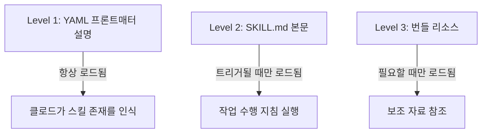
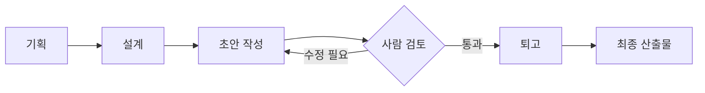
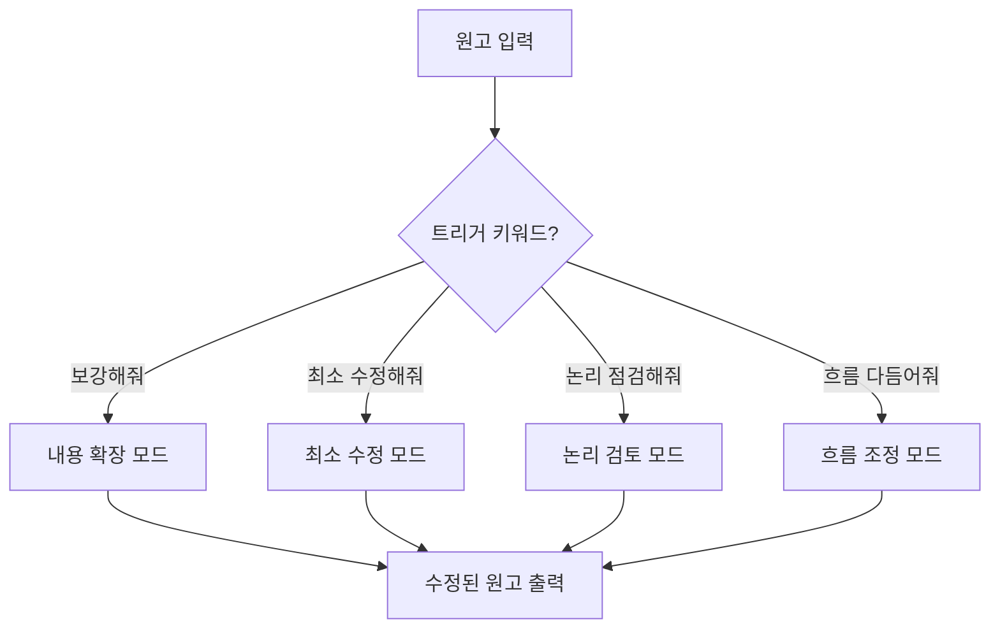
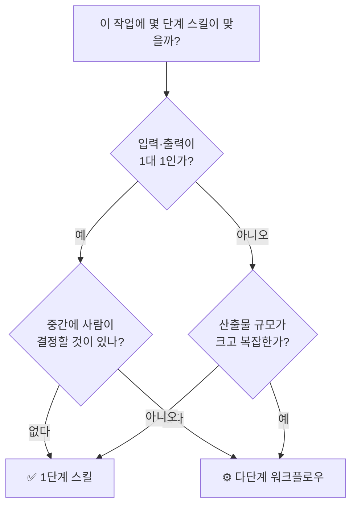

> [**카페에서 시작된 작은 발견이 AI 도구 설계의 핵심 원칙 하나를 바꾸다**](https://www.facebook.com/share/p/1Cmn9v2n6A/)
>
>오전 일찍 카페에 앉았습니다. 그동안 쌓아둔 4종의 원고 수정 프롬프트를 클로드 스킬로 옮기는 작업을 했습니다.
>
>지금까지 클로드 스킬은 워크플로우여야 한다고 생각했습니다. 기획, 설계, 초안, 퇴고. 단계가 있어야 스킬다웠습니다. 그래서 새 스킬을 만들 때마다 4단계나 5단계로 짰습니다. 그런데 막상 4종 프롬프트를 한 스킬로 묶으려고 보니, 단계로 쪼갤 일이 없었습니다. 입력은 원고 하나, 출력은 수정본 하나. 중간에 제가 확인하거나 검토할 단계가 없었습니다.
>
>클로드에게 1단계 스킬로 만들어 달라고 요청해서 만들었습니다. 단계가 적은 스킬의 장점은 분명했습니다. 여러 단계를 거치지 않고 프롬프트처럼 즉시 사용할 수 있다는 점입니다. 자주 쓰는 프롬프트를 스킬 안에 넣어두면 트리거 한 줄로 호출됩니다. 매번 1,500자짜리 프롬프트를 메모장에서 복사해 붙여넣던 일이 "보강해줘" 한 마디로 줄었습니다.
>
>페이스북으로 사용하는 스킬과 함께 두 개를 만들었습니다. 둘 다 1단계 구조입니다. 트리거 키워드 하나로 호출하면 끝납니다. 페이스북 일상 에세이 스킬은 "페이스북 일상 에세이로 써줘"로 부릅니다. 원고 수정 스킬(edit-quick)은 "보강해줘", "최소 수정해줘", "논리 점검해줘", "흐름 다듬어줘" 네 가지 트리거가 각각 다른 모드를 부릅니다.
>
>만들어놓고 보니 기준이 보이네요. 입력과 출력이 1대 1로 매핑되고, 중간에 제가 결정할 것이 없으면 1단계로 충분합니다. 반대로 산출물이 크고 단계별로 검토가 필요하면 워크플로우가 맞습니다. 책 집필이나 강의 슬라이드는 후자, 페북 글이나 원고 빠른 수정은 전자입니다.
>
>스킬은 다단계만 정답이 아니었습니다. 자주 쓰는 일을 짧게 부르는 도구이기도 했습니다. 단계가 적다고 가벼운 것이 아닙니다. 작업 성격에 맞으면 1단계가 더 정확합니다.
>

---

## 들어가며: 쌓아둔 프롬프트를 꺼내는 날

어느 이른 아침, 한 사람이 카페에 앉아 노트북을 열었습니다. 그동안 메모장 어딘가에 쌓아두었던 원고 수정용 프롬프트 4종을 클로드 스킬(Claude Skills)로 옮기는 작업을 시작하기 위해서였습니다. 표면적으로는 단순한 이전 작업처럼 보이지만, 그 과정에서 스킬 설계에 대한 근본적인 오해가 하나씩 풀리기 시작했습니다.

---

## 클로드 스킬이란 무엇인가

본격적인 이야기에 앞서, 클로드 스킬이 무엇인지를 먼저 짚고 넘어가야 합니다.

클로드 스킬(Claude Skills)은 Anthropic이 2025년 10월 16일에 공개한 기능으로, 반복적인 AI 작업이나 특정 업무 절차를 `SKILL.md`라는 마크다운 파일로 정의하고, 이를 기반으로 클로드가 일관된 방식으로 작업을 수행하도록 만드는 시스템입니다. 쉽게 말하면, 클로드에게 "이런 요청이 들어오면 이렇게 처리해라"라는 업무 매뉴얼을 사전에 심어두는 것입니다.

스킬은 세 가지 계층 구조로 로드됩니다.



Level 1의 프론트매터 설명(description)은 클로드가 항상 참조합니다. 클로드는 이 설명을 보고 현재 사용자의 요청이 이 스킬을 트리거해야 하는지 판단합니다. Level 2의 본문은 스킬이 실제로 트리거된 이후에야 로드되며, 구체적인 작업 지침이 담깁니다. Level 3의 번들 리소스는 스킬 실행에 필요한 보조 자료로, 클로드가 필요하다고 판단할 때만 불러옵니다. 이러한 구조 덕분에 불필요한 토큰 소모 없이 스킬이 효율적으로 작동합니다.

스킬 파일의 기본 구조는 다음과 같습니다.

```
~/.claude/skills/
└── my-skill/
    └── SKILL.md        ← 핵심 파일 (YAML 프론트매터 + 마크다운 본문)
```

`SKILL.md` 파일 안에는 다음 내용이 들어갑니다.

```yaml
---
name: "my-skill"
description: "이 스킬이 무엇을 하는지, 언제 사용해야 하는지 기술합니다.
              클로드는 이 설명을 바탕으로 스킬 실행 여부를 결정합니다."
---

# 스킬 제목

## 목적
...

## 처리 단계
...

## 출력 형식
...
```

---

## 스킬은 '워크플로우'여야 한다는 고정관념

이 글의 주인공은 그동안 클로드 스킬을 만들 때 반드시 여러 단계를 두어야 한다고 믿었습니다. 글 쓰는 작업을 예로 들면, 기획 → 설계 → 초안 작성 → 퇴고처럼 명확한 단계가 있어야 스킬답다고 생각했습니다. 그래서 새 스킬을 만들 때마다 4단계, 5단계로 쪼개 구성했습니다.

이것은 꽤 자연스러운 사고방식입니다. '워크플로우를 자동화한다'는 개념 자체가 여러 단계의 흐름을 연결하는 이미지를 떠올리게 하기 때문입니다. 실제로 복잡한 산출물을 만들 때는 이 구조가 유효합니다. 책 한 권을 집필하거나 강의 슬라이드를 만드는 경우처럼, 중간에 사람이 검토하고 방향을 조정해야 하는 작업은 단계별 워크플로우 구조가 적합합니다.



그런데 문제는, 이 구조가 **모든 종류의 작업에 적합한 것은 아니라는 점**입니다.

---

## 프롬프트를 스킬로 묶으려는 순간 드러난 것

4종의 원고 수정 프롬프트를 하나의 스킬로 묶으려고 시도했을 때, 예상치 못한 상황이 벌어졌습니다. 단계로 쪼갤 것이 없었던 것입니다.

각 프롬프트가 하는 일을 분석해 보면 구조는 단순합니다. **원고 하나가 입력되면, 수정본 하나가 출력됩니다.** 그 사이에 사람이 확인하거나 추가로 결정할 것이 없었습니다.


이것을 억지로 3단계나 4단계로 나누면 어떻게 될까요? 오히려 불필요한 중간 과정이 생기고, 프롬프트처럼 즉각적으로 쓸 수 없게 됩니다. 스킬을 만들었는데 오히려 쓰기 불편해지는 역설이 발생합니다.

---

## 1단계 스킬의 발견과 그 이점

그래서 클로드에게 직접 1단계 스킬로 만들어달라고 요청했습니다. 결과적으로 이 단순한 선택이 사용 경험을 크게 바꿨습니다.

1단계 스킬의 핵심 장점은 **즉시성**입니다. 여러 단계를 거치지 않고, 프롬프트처럼 바로 결과를 받을 수 있습니다. 자주 쓰는 프롬프트를 스킬 안에 넣어두면, 트리거 키워드 한 줄로 그 프롬프트 전체를 불러옵니다. 매번 1,500자짜리 프롬프트를 메모장에서 복사해 붙여넣던 반복 작업이 한 마디로 줄어드는 것입니다.

---

## 실제로 만든 두 가지 스킬

이 원칙을 바탕으로 두 개의 스킬이 만들어졌습니다. 둘 다 1단계 구조입니다.

### 1. 페이스북 일상 에세이 스킬

트리거 키워드: **"페이스북 일상 에세이로 써줘"**

일상적인 글감이나 메모를 페이스북에 게시할 에세이 형식으로 변환하는 스킬입니다. 입력은 날것의 글감이고, 출력은 페이스북에 바로 올릴 수 있는 완성된 에세이입니다. 중간에 검토하거나 방향을 바꿀 이유가 없으므로 1단계로 충분합니다.

### 2. 원고 빠른 수정 스킬 (edit-quick)

이 스킬은 하나의 스킬 안에 **네 가지 수정 모드**를 트리거 키워드로 구분하여 탑재했다는 점이 특징입니다.

| 트리거 키워드 | 수행 내용 |
|---|---|
| `보강해줘` | 내용을 더 풍부하게 확장하고 보완 |
| `최소 수정해줘` | 원문을 최대한 살리면서 최소한만 다듬기 |
| `논리 점검해줘` | 글의 논리 구조와 주장의 일관성 확인 |
| `흐름 다듬어줘` | 문장과 문단의 흐름을 자연스럽게 조정 |

같은 원고라도 목적에 따라 다른 방식으로 수정이 필요하다는 현실적인 판단이 반영된 설계입니다. 네 키워드는 각각 다른 내부 수정 로직을 실행하지만, 사용자 입장에서는 원고를 붙여넣고 키워드 하나만 입력하면 됩니다.



---

## 스킬 설계 선택의 기준: 어떤 작업에 몇 단계가 맞는가

이 경험에서 도출된 스킬 설계 판단 기준은 명확합니다.

**1단계 스킬이 적합한 경우**는 입력과 출력이 1대 1로 매핑되고, 중간에 사람이 결정하거나 검토할 것이 없을 때입니다. 작업의 성격이 변환(transform)에 가깝고, 산출물이 비교적 작으며, 반복 사용 빈도가 높을수록 1단계 구조의 이점이 더 드러납니다.

**다단계 워크플로우 스킬이 적합한 경우**는 산출물의 규모가 크고, 단계별로 사람의 검토와 의사결정이 필요할 때입니다. 책 집필, 강의 슬라이드 제작, 복잡한 기획서 작성처럼 중간 결과물을 확인하면서 방향을 수정해야 하는 작업이 여기에 해당합니다.



이 판단 기준을 구체적인 예시로 정리하면 다음과 같습니다.

| 작업 종류 | 입출력 관계 | 중간 검토 필요 | 적합한 스킬 구조 |
|---|---|---|---|
| 원고 빠른 수정 | 1대 1 | 없음 | 1단계 |
| 페이스북 에세이 작성 | 1대 1 | 없음 | 1단계 |
| 책 한 권 집필 | 복잡 | 많음 | 다단계 워크플로우 |
| 강의 슬라이드 제작 | 복잡 | 많음 | 다단계 워크플로우 |
| 이메일 초안 작성 | 1대 1 | 없음 | 1단계 |
| 보고서 기획 및 작성 | 복잡 | 중간 | 다단계 워크플로우 |

---

## 왜 이 발견이 중요한가

이 사례는 단순히 스킬 하나를 만든 이야기가 아닙니다. AI 도구를 어떻게 설계해야 하는지에 대한 실용적인 원칙을 담고 있습니다.

**도구의 복잡성은 작업의 복잡성을 따라야지, 도구 자체의 외형을 위해 존재해선 안 됩니다.** 멋있어 보이는 5단계 워크플로우를 만들었더라도, 그 작업이 본질적으로 입력→출력의 단순 변환이라면 5단계 구조는 오히려 사용을 방해합니다. 반대로, 복잡한 산출물을 단 1단계로 뭉뚱그리면 중간에 방향이 어긋나도 수정할 기회를 놓칩니다.

클로드 스킬은 워크플로우 자동화 도구이기도 하지만, **자주 쓰는 프롬프트를 짧게 호출하는 단축키**이기도 합니다. 단계가 적다고 가볍거나 덜 정교한 것이 아닙니다. 작업 성격에 맞게 설계되었을 때, 1단계 스킬은 오히려 더 정확하고 빠릅니다.

---

## 정리

이른 아침 카페에서 시작된 작업은 결국 스킬 두 개와 하나의 설계 원칙으로 마무리되었습니다.

클로드 스킬을 만들 때 가장 먼저 물어야 할 질문은 단계 수가 아닙니다. "이 작업에서 나는 어느 시점에 개입해야 하는가?"입니다. 개입할 필요가 없다면 1단계로 충분합니다. 개입이 필요하다면 그 개입 지점 수만큼 단계를 만들면 됩니다.

단계는 목적을 위한 수단이지, 스킬의 품질을 보여주는 지표가 아닙니다.

---

## 참고: 클로드 스킬 관련 공식 자료

- [Claude Skills 공식 문서 (Anthropic)](https://platform.claude.com/docs/ko/build-with-claude/skills-guide)
- [Claude Code Skills 확장 가이드](https://code.claude.com/docs/ko/skills)
- Anthropic Claude Skills 출시일: 2025년 10월 16일

---

*작성일: 2026년 5월 25일*
