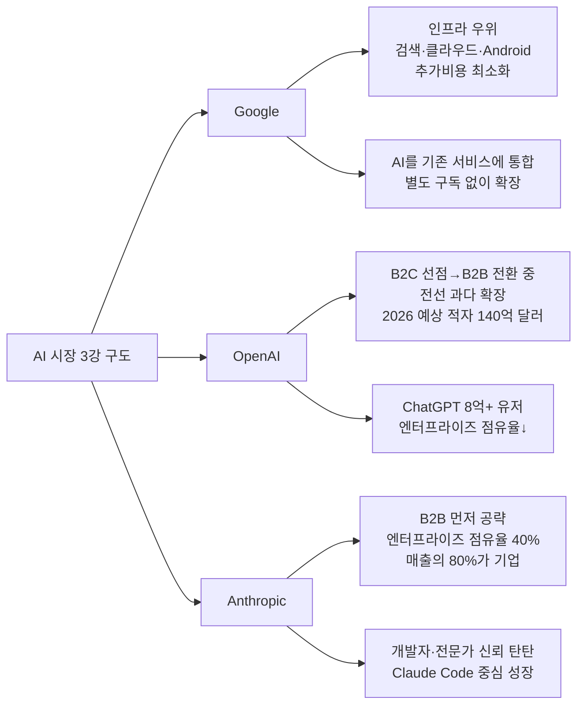
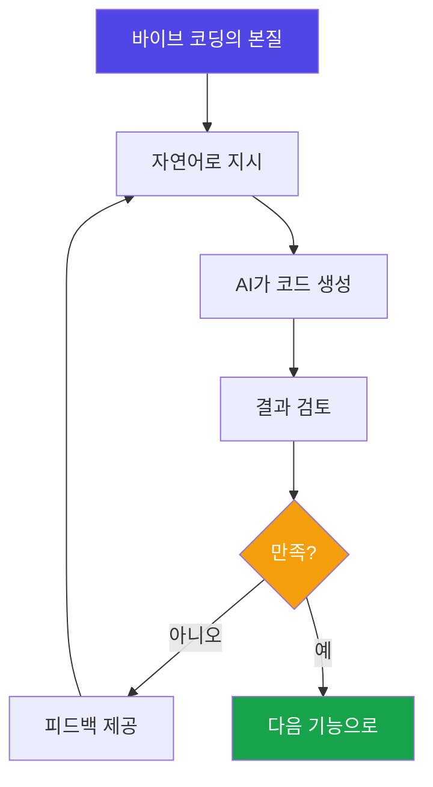
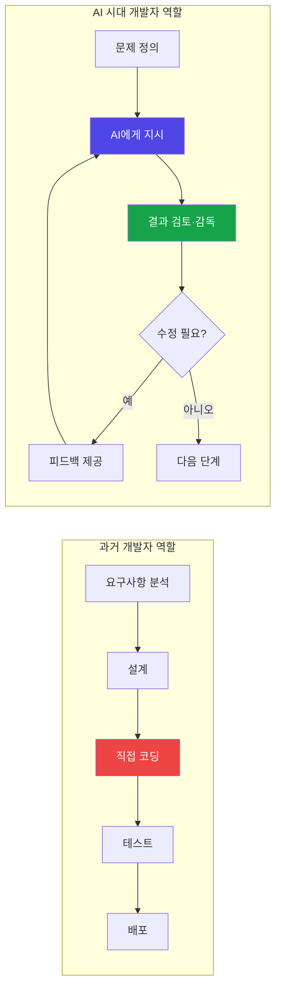
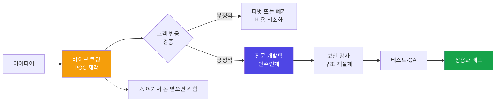
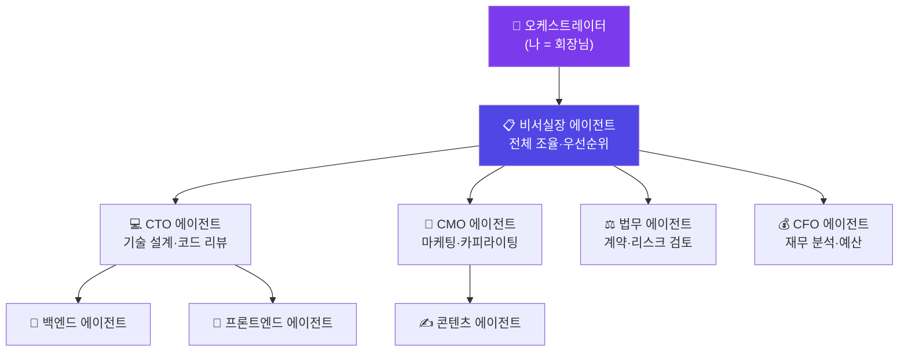
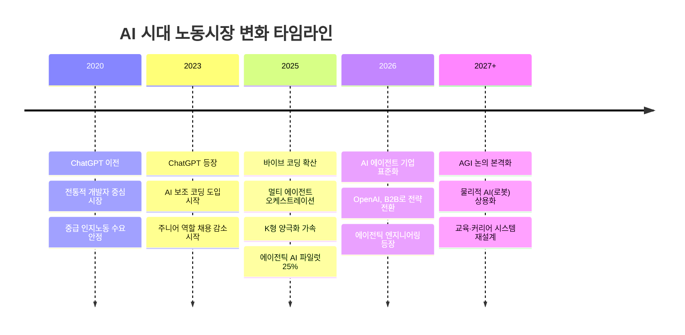

## — AI 시대, 바이브 코딩·에이전트·노동시장·교육을 둘러싼 10가지 통찰

> 이 글은 AI 산업, 바이브 코딩, 교육의 미래 등 다양한 주제를 다룬 지인들 간의 대화 메모를 원문으로 삼아, 각 주제를 심층적으로 풀어쓰고 최신 데이터를 보완하여 재구성한 분석 리포트입니다.

---

## 목차

1. [AI 시장, 결국 3명만 링 위에 남는다](#1-ai-시장-결국-3명만-링-위에-남는다)
2. [바이브 코딩은 코딩이 아니다, 업무 지시다](#2-바이브-코딩은-코딩이-아니다-업무-지시다)
3. [프레임워크 없이 AI를 시키면 출근시간도 못 지킨다](#3-프레임워크-없이-ai를-시키면-출근시간도-못-지킨다)
4. [개발자의 역할이 '마님'으로 바뀌었다](#4-개발자의-역할이-마님으로-바뀌었다)
5. [대표가 직접 바이브 코딩을 해봐야 하는 진짜 이유](#5-대표가-직접-바이브-코딩을-해봐야-하는-진짜-이유)
6. [바이브 코딩으로 돈 받기 시작하면 거기서부터 지옥이다](#6-바이브-코딩으로-돈-받기-시작하면-거기서부터-지옥이다)
7. [AI 에이전트를 비서실 조직도로 만들어라](#7-ai-에이전트를-비서실-조직도로-만들어라)
8. [싱가포르가 깨끗한 게 왜 문제인가](#8-싱가포르가-깨끗한-게-왜-문제인가)
9. [미래 교육은 과목이 아니라 역량이다](#9-미래-교육은-과목이-아니라-역량이다)
10. [금붕어와 인간의 차이, 그리고 150세](#10-금붕어와-인간의-차이-그리고-150세)

---

## 1. AI 시장, 결국 3명만 링 위에 남는다

### 대화의 출발점

대화에 참여한 이들은 지금의 AI 시장 구도를 냉정하게 평가했습니다. 수십 개의 AI 스타트업이 시장에 존재하지만, 결국 최후의 링 위에서 싸울 플레이어는 **Google, OpenAI, Anthropic** 세 곳뿐이라는 게 공통된 결론이었습니다. 나머지는 서서히 퇴장하거나, 세 플레이어 중 하나에 인수당하는 경로를 밟게 될 것이라는 전망입니다.

### Google의 체급: 인프라가 곧 해자(垓子)

Google은 말 그대로 '체급이 다른' 플레이어입니다. 검색, 클라우드(GCP), 안드로이드, 유튜브까지 AI를 올릴 수 있는 인프라가 이미 전 세계에 구축되어 있기 때문입니다. AI 기능을 자사 서비스에 얹을 때 추가 비용이 사실상 거의 발생하지 않는 구조입니다. Gemini를 Google Search나 Gmail, Docs에 통합하는 방식처럼, AI를 '별도 구독 상품'이 아니라 기존 서비스 속에 자연스럽게 녹여 넣는 전략입니다. 이 덕분에 Google은 ChatGPT처럼 '유저를 새로 획득'하는 비용을 쓰지 않아도 됩니다.

### OpenAI의 딜레마: 너무 넓게 벌린 전선

OpenAI는 전혀 다른 처지입니다. ChatGPT로 소비자 시장(B2C)을 먼저 장악했지만, 동시에 모델 개발을 위한 인프라 투자도 직접 감당해야 했습니다. B2C로 시작했다가 뒤늦게 기업 시장(B2B)으로 전환을 시도하고 있는데, 그 과정에서 전선이 지나치게 넓어졌습니다. Sora(영상), 하드웨어 투자, 광고 플랫폼, 검색까지 동시에 추진한 결과, 2026년 예상 적자가 140억 달러에 달한다는 분석이 나올 정도입니다. 실제로 2026년 3월 기준, OpenAI는 사내 회의를 통해 핵심 외 프로젝트를 대폭 축소하고 기업용 프로그래밍 솔루션 중심으로 전략을 재편하겠다는 방침을 공식화한 것으로 알려졌습니다.

### Anthropic의 포지셔닝: B2B 선점의 힘

반면 Anthropic은 처음부터 B2B 시장을 먼저 공략했습니다. 전문가·개발자·기업 고객을 우선 타깃으로 삼았고, 그 결과 엔터프라이즈 LLM 시장에서의 점유율이 2023년 15%에서 2025년 말 40%까지 급등했습니다(Menlo Ventures 데이터). Anthropic 매출의 80%가 기업 고객에서 나오는 구조로, B2C 위주인 OpenAI(기업 매출 40% 수준)와 뚜렷이 대비됩니다.

### 밸류에이션의 두 얼굴

소프트뱅크가 OpenAI에 대규모 베팅을 해서 장부 기준으로 큰 수익을 봤다는 이야기도 나왔습니다. 중요한 포인트는, **기술적 가치와 캐피털 마켓에서의 밸류에이션은 별개의 게임**이라는 점입니다. Anthropic의 IPO 밸류에이션이 논의되는 수준은 이미 기술 자체의 가치가 아니라 성장 기대치와 자본시장 논리가 지배하는 영역이라는 인식이 대화에서도 공유됐습니다.

---

## 2. 바이브 코딩은 코딩이 아니다, 업무 지시다

### '바이브 코딩'이란 무엇인가

**바이브 코딩(Vibe Coding)** 이라는 개념은 2025년 초 AI 연구자 안드레이 카르파티(Andrej Karpathy)가 처음 명명한 개념입니다. 코드를 직접 한 줄씩 작성하는 대신, 자연어(일상 언어)로 AI에게 원하는 것을 설명하고, AI가 만들어낸 결과를 받아서 계속 수정·발전시켜 나가는 방식을 뜻합니다. 중요한 점은 개발자가 생성된 코드를 전부 이해하지 않아도 작동하는 소프트웨어를 만들 수 있다는 것입니다.

### "이건 코딩이 아니라 업무 지시다"

대화에서 나온 가장 핵심적인 통찰은 이것입니다. **바이브 코딩을 기존 코딩의 업그레이드 버전이라고 생각하면 안 된다**는 것. 과거 DOS를 쓰다가 Windows로 넘어간 수준 이상의 패러다임 전환입니다. 새로운 언어를 배운다고 생각해야지, 기존 언어의 심화 과정이 아니라는 거죠.

이 변화를 가장 잘 표현한 비유가 바로 "개발자들 데리고 24시간 회의하는 것"입니다. AI를 팀원으로 두고 업무를 지시하고, 결과를 검토하고, 피드백을 주고, 다시 시키는 과정. 이게 바이브 코딩의 본질입니다. AI가 코드를 짜는 게 아니라, **사람이 AI에게 무엇을 만들지를 정확히 지시하는 것**이 핵심 역량이 됩니다.

### 도파민 보상 체계: 왜 이렇게 중독적인가

바이브 코딩이 주는 중독성의 정체는 온라인 게임의 퀘스트 클리어와 구조가 동일합니다. 내가 원하는 기능을 AI에게 시켜서 결과가 화면에 나타나는 그 순간의 성취감은, 게임에서 보스를 처치하고 보상을 받을 때의 도파민 분비 패턴과 일치합니다. "이거 하나만 더 해보고 자야지"라는 생각이 밤샘으로 이어지는 이유입니다.

### 능력의 본질이 바뀌었다

"시키지 않으면 못하는 거야. 시켜서 끌어내야 해." AI는 시키면 기가 막히게 잘 합니다. 그런데 **무엇을 시킬지를 모르면 아무 소용이 없습니다**. 결국 AI 시대의 핵심 역량은 코드 작성 능력이 아니라, **문제를 정의하고, 구조화하고, AI에게 효과적으로 지시하는 능력**이 됩니다.

---

## 3. 프레임워크 없이 AI를 시키면 출근시간도 못 지킨다

### 규칙 없는 AI는 표류한다

AI에게 구체적인 규칙 없이 일을 맡기면 어떻게 될까요? 대화에서 나온 비유가 인상적입니다. "출근하라고 했더니 어떤 날은 7시에 나오고, 어떤 날은 9시에 나오는 거야. 몇 시에 오라는 말이 없었잖아요."

AI는 지시가 모호하면 자기 나름의 판단으로 행동합니다. 그리고 그 판단이 우리가 원하는 결과와 다를 때, AI를 탓할 수가 없습니다. 애초에 명확한 규칙을 주지 않았으니까요.

### 취업규칙처럼 AI에게도 규정이 필요하다

해결책은 회사의 취업규칙처럼, AI에게도 명확한 운영 지침(프레임워크)을 제공하는 것입니다. 이미 GitHub에는 검증된 오픈소스 프레임워크들이 많이 공개되어 있습니다. "다른 회사 취업규칙 가져다가 이름만 바꿔서 쓰는 것"처럼, 검증된 프레임워크를 기반으로 자신의 업무와 상황에 맞게 수정하면 됩니다.

새 차를 받으면 기본 상태에서 시작하듯이, AI 도구도 처음에는 기본 상태입니다. 그 상태에서 자신의 업무 방식, 원하는 출력 형식, 금지 사항, 우선순위 등을 명확히 정의해주는 파인 튜닝 과정이 필요합니다. 이게 바로 **프롬프트 엔지니어링**이나 **컨텍스트 엔지니어링**이라는 개념이 중요해진 배경입니다.

---

## 4. 개발자의 역할이 '마님'으로 바뀌었다

### 일꾼에서 감독자로

과거의 개발자는 직접 코드를 짜는 사람이었습니다. 그릇을 직접 손으로 닦는 일꾼이었죠. 하지만 AI 도구가 일상화된 지금, 개발자의 역할은 근본적으로 달라지고 있습니다. 이제 개발자는 AI가 만들어낸 결과를 감시하고, 피드백을 주고, 잘못된 부분을 지적하고, 다시 지시하는 **'마님' 역할**로 전환되고 있습니다.

### 왜 베테랑 개발자가 더 어려운가

역설적으로, **코딩 경력이 오래된 개발자일수록 이 전환이 어렵습니다**. 20년간 직접 코드를 짜온 사람에게 "이제는 AI한테 시키세요"라고 하면, 자연스럽게 "내가 그냥 할게요"라는 반응이 나옵니다. 자기가 직접 하는 게 더 빠르고 정확하다는 확신, 그리고 자신의 방법론에 대한 자부심이 새로운 접근을 거부하게 만듭니다.

"우리 문파가 아니다. 사파다 사파"라는 반응은 이 심리를 단적으로 보여줍니다. 오래된 기술 공동체(문파)에서 검증받은 방법이 아닌 것은 정통이 아니다, 이상한 방법이다라는 인식이죠.

### 백지 신입이 날아다니는 이유

반면에 개발 경험이 전혀 없는, 즉 기존 방법론에 대한 편견도 없는 사람들을 대상으로 실험해봤더니 결과가 달랐습니다. 커뮤니케이션 능력과 논리적 사고력을 갖춘 비개발자 4명이 바이브 코딩으로 실제 성과를 냈다는 사례입니다. "와, 날아다녀요 얘들이."

이 현상의 배경을 이해하려면 **바이브 코딩의 핵심 역량이 무엇인지**를 알아야 합니다. 바이브 코딩에서 필요한 능력은 문법(syntax) 암기가 아니라, **문제를 논리적으로 정의하고, 맥락을 명확히 전달하고, 결과를 비판적으로 검토하는 능력**입니다. 이건 좋은 소통 능력을 가진 사람이라면 충분히 갖출 수 있는 역량입니다.

실제로 2025년 연구 데이터에 따르면, AI 도구에 노출된 직군에서 AI를 보조 도구로 활용하는 'AI 인접 역할(AI-adjacent roles)'의 채용 공고는 26% 증가한 반면, AI가 직접 대체하는 역할의 채용은 14% 감소했습니다. 역할의 재정의가 실제로 일어나고 있는 것입니다.

---

## 5. 대표가 직접 바이브 코딩을 해봐야 하는 진짜 이유

### 요리사를 쓰려면 요리를 알아야 한다

"부엌에서 하루 종일 요리할 생각은 없는데, 요리사를 시키려면 기본은 알아야 돼." 이 비유가 모든 것을 설명합니다. 비전 제시자, 의사결정자로서의 대표나 리더가 바이브 코딩을 직접 경험해야 하는 이유는, 자신이 직접 요리사(개발자·AI)가 되려는 게 아닙니다. 무엇이 가능한지, 어느 정도의 시간이 걸리는지, 결과물의 수준이 어떤지를 피부로 알아야 팀을 올바르게 이끌 수 있기 때문입니다.

### 판이 바뀌었다는 걸 모르면 기준이 틀린다

더 중요한 포인트는 이것입니다. "판때기가 일식에서 중식으로 바뀐 거야. 옛날 일식 경험 가지고 주방장 골라봤자 중식이 안 되는 거야." AI 이전의 개발 경험을 기준으로 인재를 평가하고 프로젝트 일정을 잡으면, 근본적으로 틀린 판단이 나올 수 있습니다. 도구가 바뀌면 판단 기준도 바뀌어야 합니다.

### 프로토타이핑의 혁명

바이브 코딩이 리더십 레벨에서 가장 강력한 효과를 발휘하는 영역이 바로 **프로토타이핑**입니다. 과거에는 아이디어를 파워포인트 슬라이드로 설명하면 개발자가 다르게 이해해서 다른 결과물을 가져오는 일이 빈번했습니다. 바이브 코딩으로 직접 HTML이나 실동작하는 데모를 만들어 보여주면, 이 커뮤니케이션 갭이 대폭 줄어듭니다.

실제 사례로 보험사 대상 세일즈 대시보드 데모를 바이브 코딩으로 직접 만들어 보여줬더니, 그 자리에서 "감동이다"라는 반응이 나왔다는 경험담이 공유됐습니다. 개발 업체에 맡겼으면 1년 걸렸을 작업을 일주일 안에 해낼 수 있다는 확신이 생겼다는 것입니다.

---

## 6. 바이브 코딩으로 돈 받기 시작하면 거기서부터 지옥이다

### POC와 상용화는 완전히 다른 게임

이 부분은 대화에서 가장 강하게 경고가 나온 지점입니다. 바이브 코딩으로 프로토타입을 만들어서 "이거 팔 수 있겠다"는 생각이 드는 순간, 완전히 다른 세계로 진입하게 됩니다.

"돈을 받는 순간 나는 품질 보증을 해야 한다." 소비자에게 돈을 받았다는 것은 유지보수, 보안 패치, 구조적 문제 해결, 고객의 추가 수정 요청을 모두 감당하겠다는 계약을 한 것과 같습니다. 바이브 코딩으로 만든 코드는 기능은 돌아가지만, 보안 취약점, 유지보수 불가능한 구조, 스케일 확장 시 붕괴 등의 문제를 내재하고 있는 경우가 많습니다.

### 현실 데이터가 말하는 것

실제로 2025~2026년 업계에서 이 패턴이 반복적으로 관찰되었습니다. AI로 멋진 데모를 만들었는데, 실제 프로덕션 배포 이후 현실이 찾아오는 경우입니다. 보안 요건, 실제 사용자 부하, 다양한 엣지 케이스를 AI 생성 코드가 감당하지 못하는 것입니다.

### 안전한 경로: POC는 무료로, 상용화는 전문팀이

권장되는 접근법은 명확합니다. **POC(개념 증명) 단계까지는 바이브 코딩으로 빠르게 검증**하되, 실제 상용화 단계에서는 전문 개발 조직이 코드를 인수받아(take over) 재설계하는 것입니다. 두 단계를 혼동하는 것이 문제의 근원입니다.

---

## 7. AI 에이전트를 비서실 조직도로 만들어라

### 단일 AI에서 조직 구조로

AI를 쓰는 방식이 점점 정교해지고 있습니다. 처음에는 단일 AI에게 무엇이든 물어보는 방식으로 시작했다면, 이제는 **여러 AI 에이전트를 조직도처럼 편성해 운영**하는 것이 트렌드로 자리 잡고 있습니다.

"나는 회장님이고, 비서실장 에이전트를 만들어놓고, 그 밑에 팀들을 쫙 만드는 거지." CTO, 법무, HR, 마케팅 등 C레벨 임원진 각각의 역할에 특화된 에이전트를 두고, 이들이 서로 협업하며 결과를 만들어내는 구조입니다.

### 오케스트레이션: 이 시대의 핵심 역량

이런 멀티 에이전트 운영의 상위 개념을 **오케스트레이션(Orchestration)** 이라고 부릅니다. 오케스트라 지휘자가 각 악기 파트를 조율해 하나의 음악을 만들어내듯, 여러 AI 에이전트를 조율해 복잡한 업무를 처리하는 것입니다.

실제로 Gartner의 2025년 에이전틱 AI 연구에 따르면, 조사에 참여한 AI 솔루션 벤더 중 거의 50%가 AI 오케스트레이션을 자사의 핵심 차별화 요소로 꼽았습니다. McKinsey의 2025년 AI 도입 조사에서는 기업의 68%가 이미 단일 AI 사용 사례를 넘어 멀티 에이전트 배포 단계로 진입했다고 응답했습니다.

### 결과는 시키는 사람의 능력에 달렸다

"결국은 시키는 사람의 능력에 따라서 발휘가 되는 거예요. AI를 탓할 필요가 없어." 이 문장은 오케스트레이션의 핵심을 정확히 짚습니다. 멀티 에이전트 시스템이 아무리 정교해도, 전체 구조를 설계하고 각 에이전트에게 적절한 역할과 지시를 부여하는 사람의 역량이 최종 결과물의 질을 결정합니다.

---

## 8. 싱가포르가 깨끗한 게 왜 문제인가

### 표면의 청결함, 그 이면

"싱가포르 바닥을 보세요. 껌 자국도 없지, 벽에 낙서도 없지." 싱가포르는 세계에서 가장 깨끗하고 안전한 도시 국가 중 하나입니다. 그런데 이 대화에서는 그게 오히려 창업 생태계의 취약점과 연결된다는 분석이 나왔습니다.

"파괴가 없으면 크리에이티브가 없고, 크리에이티브가 없으면 스타트업도 없다." 파괴적 혁신은 규칙을 깨는 것에서 시작합니다. 규칙을 철저히 준수하도록 훈련된 사회에서는, 기존 질서를 뒤흔드는 아이디어가 나오기 어렵다는 논리입니다.

### 싱가포르 유니콘의 파운더는 대부분 외국인

실제로 싱가포르의 유니콘 기업 파운더를 살펴보면 대부분 외국인입니다. 가장 대표적인 사례가 그랩(Grab)입니다. 동남아시아 최대 슈퍼앱으로 성장한 그랩은 원래 말레이시아에서 시작됐습니다. 테마섹(싱가포르 국부펀드)이 투자를 조건으로 본사를 싱가포르로 이전시킨 케이스입니다. 싱가포르 로컬 파운더가 만들어낸 유니콘이 거의 없다는 것이 이 분석을 뒷받침합니다.

### 한국의 역설: 서울에서 치고받는 천재들

"천재들이 모여서 서울에서 지들끼리 치고받고 싸우더라고요. 서양에서는 바보들이 모여서 전 세계를 상대로 하고." 이 문장은 한국 스타트업 생태계의 특성을 날카롭게 포착합니다. 한국에는 뛰어난 인재들이 많지만, 국내 시장이라는 좁은 링 안에서 경쟁하는 경향이 있다는 것입니다. 반면 실리콘밸리에서는 개별 역량보다 글로벌 시장을 겨냥하는 야망과 문화가 먼저라는 대비가 흥미롭습니다.

---

## 9. 미래 교육은 과목이 아니라 역량이다

### 지금 학교에서 가르치는 것의 역설

"지금의 교육은 이미 사라져가는 과거 패러다임을 배우고 있습니다. 그거는 기득권들의 라이센스 싸움이에요." 강한 표현이지만 핵심을 찌릅니다. 의사, 변호사, 회계사 등의 전문직 면허는 AI 이전 시대에 '자동화 불가능한 희소 지식'을 보증하는 시스템이었습니다. 하지만 AI가 법률 문서를 분석하고, 의료 영상을 판독하고, 재무제표를 해석하는 지금, 그 전제가 흔들리고 있습니다.

### AI가 대체하기 어려운 영역으로

그렇다면 어디로 가야 할까요? 대화에서 제시된 방향은 **인문학, 심리학, 언어학, 순수 문학, 예술, 즉 '휴먼 네이처(Human Nature)'의 영역**입니다. 인간 본연의 감성, 공감 능력, 관계 형성, 창의적 표현은 AI가 모방하기 가장 어려운 영역이기도 합니다.

### 미래 교육의 핵심 역량

대화에서 도출된 미래 교육의 키워드는 다음과 같습니다.

- **논리적 사고**: 문제의 구조를 파악하고 인과관계를 추론하는 능력
- **문제 해결**: 주어진 도구(AI 포함)를 활용해 실제 문제를 해결하는 능력
- **추론**: 불완전한 정보로 합리적인 결론을 도출하는 능력
- **커뮤니케이션**: 복잡한 생각을 명확하게 전달하고, 상대를 설득하는 능력
- **메타인지**: 자신이 무엇을 알고 모르는지 파악하고, 학습 방법을 스스로 설계하는 능력

### 창업이 학위가 되는 모델

흥미로운 아이디어도 나왔습니다. 창업 자체가 학위가 되는 교육 모델입니다. 스페인의 **몬드라곤 협동조합**이 참고 사례로 언급됐습니다. 1956년에 설립된 몬드라곤은 교육과 노동, 창업을 통합한 독특한 협동조합 모델로, 노동자가 곧 소유자이고, 학교가 곧 공장이 되는 구조를 만들었습니다. 이론 교육보다 실제 문제를 해결하는 과정에서 역량을 키우는 접근법입니다.

---

## 10. 금붕어와 인간의 차이, 그리고 150세

### 손정의의 AGI 타임라인

소프트뱅크 회장 손정의가 제시한 AGI 이후의 미래 전망이 대화에 등장합니다. AGI(범용 인공지능)가 도래한 이후, 10년이 지나면 인간과 AGI의 지능 격차가 현재 원숭이와 인간의 차이 수준이 되고, 20년이 지나면 금붕어와 인간의 차이 수준이 된다는 전망입니다.

"금붕어가 어떻게 사람의 마음을 이해하겠습니까? 하지만 금붕어가 사람을 어떻게 일 시키는지를 배워야 해요." 이 역설이 바로 지금 우리가 배워야 할 것의 본질을 담고 있습니다. AGI를 이해하는 것이 목표가 아니라, AGI를 어떻게 활용하고 지시할 것인지를 배우는 것이 실용적 생존 전략이라는 거죠.

### 일론 머스크의 피지컬 AI

3년 전만 해도 사람들이 웃었던 일론 머스크의 휴머노이드 로봇 프로젝트(옵티머스)가 이제 현실로 다가오고 있습니다. AI와 피지컬 AI(로봇)가 결합되면, 외과 수술처럼 고도로 정밀한 신체 작업까지 AI가 수행하는 시대가 올 수 있습니다. 3년 후에는 외과 의사보다 나을 것이라는 전망도 과장이 아닐 수 있습니다.

### K형 양극화와 150세

산업혁명 이후 중산층이 형성되고 확장되었다가, 지금은 다시 중산층이 줄어드는 **K형 양극화** 시대로 접어들고 있습니다. AI가 인지 노동을 대규모로 대체하면서, 고부가가치 역량을 가진 소수와 그렇지 않은 다수 사이의 격차가 벌어지는 것입니다.

여기에 역노화 기술과 유전자 치료 기술까지 더해지면, "지금 태어난 아이들은 150세를 살 수도 있다"는 말이 농담이 아닌 현실적 시나리오가 됩니다. 수명이 두 배 늘어나는데 교육과 커리어 설계 방식은 그대로라면, 그 시스템 자체가 근본적으로 재설계되어야 한다는 의미이기도 합니다.

---

## 종합: 핵심 통찰 요약

대화 전체를 관통하는 하나의 핵심 문장이 있습니다.

> **"휴대폰 부품 뜯어본들 뭘 알겠습니까. 근데 잘 쓰잖아요. 결국 이해하는 게 아니라 잘 시키는 게 능력인 AI 시대가 온 겁니다."**

이 문장은 AI 시대 역량의 본질을 정확히 짚습니다. 스마트폰이 어떻게 작동하는지 몰라도 잘 쓰는 사람이 생산성이 높듯, AI가 내부적으로 어떻게 작동하는지 몰라도 **무엇을 어떻게 시킬지**를 아는 사람이 이 시대의 생산성을 주도합니다.

| 과거 시대의 능력 | AI 시대의 능력 |
|---|---|
| 코드 문법 암기 | 문제 정의와 구조화 |
| 직접 실행 | 지시와 검토 |
| 전문 지식 보유 | 전문가(AI 포함)를 활용하는 능력 |
| 개인 역량 | 오케스트레이션 |
| 학위·자격증 | 실제 문제 해결 이력 |

한국은 빠른 얼리어답터 민족성과 FOMO(뒤처지면 안 된다는 공포) 문화가 결합되어, 새로운 기술을 받아들이는 속도가 유독 빠릅니다. 이 특성이 AI 전환의 맥락에서도 강점으로 작동할 수 있습니다. 다만 열정 있는 소수를 잘 선별해 집중 지원하는 구조적 뒷받침이 함께 따라야 한다는 것이 대화의 마지막 결론이었습니다.

---

## 참고 및 데이터 출처

- GitLab, "From Vibe Coding to Agentic AI" (2025)
- Menlo Ventures, Enterprise LLM Market Share Data (2025)
- Gartner, Agentic AI Research (2025)
- McKinsey, AI Adoption Survey (2025)
- Frontiers in Human Dynamics, "AI-Driven Labor Market Displacement" (2026)
- Deloitte, Generative AI Enterprise Adoption Survey (2025)
- World Economic Forum, Future of Jobs Report (2025)
- Andrej Karpathy, Vibe Coding (February 2025)

---

