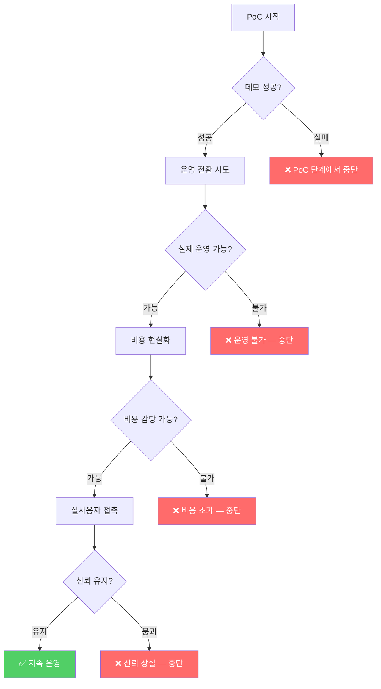
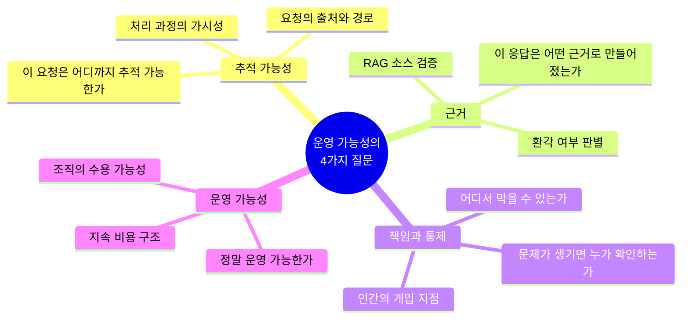
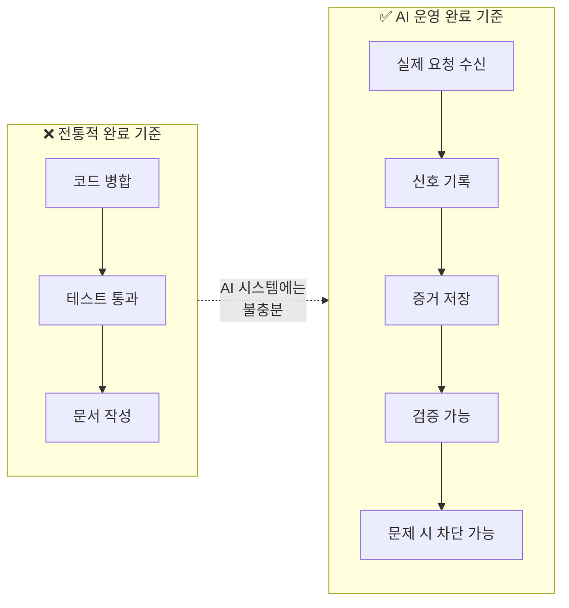
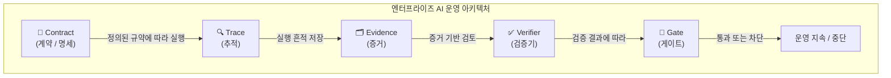

> *"AI를 잘 설명하는 회사보다, AI를 끝까지 운영해 본 회사가 더 드물기 때문에."*
>
> — [Facebook 단상](https://www.facebook.com/share/p/1aaGdp9RGv/), 2025

---

## 들어가며 — 왜 이 글이 중요한가

이 글은 짧은 단상이지만, 그 안에 엔터프라이즈 AI 현장에서 수년간 축적된 실질적인 통찰이 담겨 있다. AI 업계에서 매일 쏟아지는 화려한 기술 마케팅과는 결이 전혀 다른, 실제 운영 현장의 목소리다.

필자는 스스로를 "AI 희망고문을 하는 사람처럼 보일 수 있다"고 말하면서도, 그럼에도 계속 가는 이유를 냉정하게 설명한다. 이 글을 이해하려면 먼저 엔터프라이즈 AI의 현실부터 짚고 넘어가야 한다.

---

## 1. "AI 희망고문"이란 무엇인가

### 희망고문이라는 표현의 무게

"희망고문"은 한국어 특유의 표현으로, 희망을 주는 척하면서 결국 아무것도 이루어지지 않는 상태를 반복하는 고통을 뜻한다. 필자는 이 단어를 AI 업계 전체에 적용하고 있다.

Agent, Knowledge, Workflow, Runtime, Autonomous, Copilot — 이 단어들은 현재 AI 업계의 핵심 키워드다. 모든 컨퍼런스, 모든 벤더의 발표자료, 모든 뉴스레터에 넘쳐흐른다. 그러나 필자의 핵심 지적은 단호하다. **단어는 넘쳐나는데 실제 현장에서 끝까지 운영되는 사례는 많지 않다.**

이것이 바로 희망고문의 구조다. 우리는 매일 새로운 AI 기능 발표를 접하고, 인상적인 데모를 보고, "이번에는 진짜 바뀔 것 같다"는 기대를 품는다. 그러나 그 기대는 현장의 현실 앞에서 번번이 좌절된다.

### 숫자로 확인되는 현실

이것은 개인의 주관적 관찰이 아니다. 2024~2025년에 걸쳐 진행된 다수의 기관 조사가 동일한 결론을 가리킨다.

- **RAND Corporation** 분석에 따르면, AI 프로젝트의 80% 이상이 의미 있는 운영 단계에 도달하지 못한다. 이는 일반 IT 프로젝트 실패율의 두 배에 달한다.
- **S&P Global Market Intelligence**의 2025년 조사(북미·유럽 1,000개 이상 기업 대상)에서는 42%의 기업이 2025년에 대부분의 AI 이니셔티브를 포기했으며, 이는 2024년의 17%에서 급격히 증가한 수치다.
- 평균적으로 조직들은 AI 개념검증(PoC)의 **46%를 운영 단계 이전에 폐기**했다.
- **MIT Project NANDA(2025)** 의 분석에 따르면, 생성형 AI를 도입한 기업 중 **95%가 측정 가능한 재무적 성과를 전혀 내지 못했다**.
- **Gartner**는 생성형 AI 프로젝트의 30%가 2025년 말까지 PoC 단계에서 폐기될 것으로 예측했으며, 에이전트 기반 AI 프로젝트의 40% 이상이 2027년까지 취소될 것으로 내다봤다.

---

## 2. PoC의 덫 — 4단계 실패 구조

필자는 엔터프라이즈 AI 프로젝트가 실패하는 패턴을 네 단계의 연쇄 구조로 정확하게 묘사하고 있다.

### 1단계: 데모는 되지만 운영이 안 된다

PoC(Proof of Concept, 개념 검증)는 AI 프로젝트의 첫 관문이다. 정제된 샘플 데이터, 통제된 시나리오, 충분한 시간이 주어진 환경에서 AI는 인상적인 결과를 내놓는다. 경영진은 감탄하고, 예산이 승인된다.

그러나 운영 환경으로 넘어가는 순간 현실이 달라진다. 실제 기업 데이터는 PoC에서 사용한 깔끔한 샘플과 전혀 다르다. 여러 시스템에 분산되어 있고, 부서마다 "고객"이나 "매출"의 정의가 다르며, 수년치 불일치와 누락이 쌓여 있다. 에이전트는 이 복잡한 현실 앞에서 흔들리기 시작한다.

또한 PoC는 특정 시나리오에 최적화된 반면, 실제 운영에서는 수백 가지 예외 케이스가 쏟아진다. 한 번의 그럴듯한 데모와, 매일 수천 건의 요청을 안정적으로 처리하는 것 사이에는 엄청난 격차가 존재한다.

### 2단계: 운영이 되면 비용이 감당되지 않는다

운영의 벽을 넘었다고 가정하자. 이번에는 비용이 문제가 된다. 대형 언어 모델(LLM) API 호출 비용, 벡터 데이터베이스 유지비, GPU 컴퓨팅 비용, 모니터링 인프라 비용이 누적된다.

PoC 단계에서는 소규모 실험이었기 때문에 비용이 눈에 띄지 않았다. 그러나 실제 업무 트래픽이 붙으면 비용 구조가 완전히 달라진다. 많은 기업이 이 단계에서 ROI 계산을 다시 해보고는 계획을 접는다. 2024년 AI 인프라 현황 조사에 따르면 기업들이 GPU 스케줄링 도구에 대한 불만족도가 74%에 달할 정도로, 비용 효율적인 인프라 운영 자체가 난제다.

### 3단계: 비용을 감당하면 신뢰가 무너진다

비용 문제까지 해결했다고 하자. 이제 실사용자와 접촉한다. 그런데 AI가 틀린 답을 내놓거나, 없는 정보를 있는 것처럼 말하거나(환각, hallucination), 맥락을 벗어난 응답을 한다. 한 번의 큰 실수가 수개월의 신뢰를 무너뜨린다.

엔터프라이즈 환경에서 신뢰의 붕괴는 단순한 불편함이 아니다. 법적 책임, 규제 리스크, 브랜드 손상으로 이어질 수 있다. 결국 담당자들은 AI를 끄고 다시 사람이 처리하는 방식으로 돌아간다.

### 4단계: "역시 아직은 아닌 것 같다"

이 세 단계를 거치면서 조직 내에 AI 회의론이 쌓인다. "역시 아직은 아닌 것 같다"는 말이 반복된다. 이 말은 틀리지 않다 — 현재의 접근 방식으로는 정말 아직인 경우가 많기 때문이다. 필자는 이 말을 "이해 못하는 건 아니다"고 말하면서도, 동시에 그 말이 나오게 되는 구조적 이유를 정확히 알고 있다.

---

## 3. 거창한 표현에서 작은 질문으로 — 사고의 전환

필자는 이 실패 패턴을 수없이 목격하면서 스스로의 접근 방식을 바꾸었다고 말한다. "일부러 거창한 표현보다 작은 질문을 더 자주 본다"는 것이 그 변화의 핵심이다.

이 네 가지 질문은 각각 심층적인 의미를 담고 있다.

### 질문 1: "이 요청은 실제로 어디까지 추적 가능한가"

추적 가능성(Traceability)은 단순히 로그를 남기는 것이 아니다. 사용자가 무언가를 요청했을 때, 그 요청이 어떤 경로로 처리되었는지, 어떤 데이터를 참조했는지, 어떤 결정 분기를 거쳤는지를 사후에 완전히 재현할 수 있어야 한다는 뜻이다.

현대의 에이전트 AI 시스템에서 이것은 특히 어렵다. 에이전트는 여러 도구를 호출하고, 여러 모델을 거치며, 중간에 수십 가지 판단을 내린다. 이 과정이 블랙박스로 남아 있으면 문제가 생겼을 때 원인을 찾을 수 없다.

업계에서는 이를 위해 OpenTelemetry의 생성형 AI 시맨틱 컨벤션 같은 표준이 등장하고 있다. 프롬프트, 응답, 모델 및 에이전트 스팬, 도구 호출, 토큰 수, 안전 필터 결과를 모두 캡처하는 방식이다. 그러나 이것을 실제 운영에 구축하는 것은 여전히 상당한 엔지니어링 투자가 필요하다.

### 질문 2: "이 응답은 어떤 근거로 만들어졌는가"

AI가 내놓은 응답이 어디서 비롯되었는지 설명할 수 있어야 한다는 뜻이다. RAG(검색 증강 생성) 시스템에서는 어떤 문서를 참조했는지, 그 문서의 신뢰도는 어떠한지, 모델이 자체 추론으로 생성한 부분은 얼마나 되는지를 알 수 있어야 한다.

특히 엔터프라이즈 환경에서 AI가 잘못된 정책이나 오래된 데이터를 참조해 중요한 결정을 내린다면, 그 근거를 추적하지 못하면 문제를 재발 방지할 수도 없다. "모델이 그렇게 말했다"는 것은 엔터프라이즈에서 허용되는 설명이 아니다.

### 질문 3: "문제가 생기면 누가 확인하고 어디서 막을 수 있는가"

이것은 거버넌스(Governance)와 인간-루프(Human-in-the-Loop)의 문제다. AI 시스템이 잘못된 방향으로 동작하기 시작했을 때, 그것을 감지하는 사람이 누구이고, 그 사람이 어떤 권한으로 어떻게 시스템을 중단시킬 수 있는지가 설계 단계에서 명확해야 한다.

2025년 현재 보안 업계는 OWASP LLM 애플리케이션 Top 10을 통해 프롬프트 인젝션, 안전하지 않은 출력 처리, 모델 서비스 거부 공격 등의 위협을 정의하고 있으며, MITRE ATLAS 프레임워크는 AI 시스템에 대한 적대적 전술을 체계화하고 있다. "어디서 막을 수 있는가"라는 질문은 이러한 실질적 위협에 대응하는 아키텍처의 핵심이다.

### 질문 4: "정말 운영 가능한가"

앞의 세 질문을 모두 만족시킨다고 해도 마지막 질문이 남는다. 이 시스템이 주 7일, 하루 24시간, 수개월, 수년에 걸쳐 지속적으로 운영될 수 있는가? 비용 구조는 장기적으로 지속 가능한가? 담당자가 바뀌어도 운영이 이어질 수 있는가? 규제 환경이 변해도 대응할 수 있는가?

이 질문에 "예스"라고 답할 수 있는 엔터프라이즈 AI 시스템은 현재까지도 극히 드물다.

---

## 4. "완료"의 재정의 — 책임의 기준

필자가 제시하는 가장 실용적이고 혁신적인 관점 중 하나는 "완료"의 기준을 다시 정의하는 것이다.

전통적인 소프트웨어 개발에서 "완료"는 보통 코드가 병합되고, 테스트가 통과되고, 문서가 작성된 상태를 의미한다. 그러나 필자는 AI 시스템에서 이 기준이 근본적으로 달라야 한다고 말한다.

### 코드가 있다고 완료가 아니다

코드가 작성되었다는 것은 시스템이 특정 조건에서 특정 방식으로 동작할 수 있다는 것을 보여줄 뿐이다. AI 모델은 비결정론적으로 동작한다. 같은 입력에도 다른 출력이 나올 수 있고, 엣지 케이스에서 예상치 못한 방식으로 실패할 수 있다. 코드의 존재가 운영 안전성을 보장하지 않는다.

### 테스트가 통과했다고 완료가 아니다

AI 시스템의 테스트는 일반 소프트웨어와 다르다. 정해진 입력에 대한 정해진 출력을 확인하는 단위 테스트만으로는 충분하지 않다. 분포 외 입력(out-of-distribution inputs), 적대적 프롬프트, 오랜 시간에 걸친 모델 드리프트, 데이터 변화에 따른 성능 저하 등은 기존 테스트 패러다임으로는 잡히지 않는다.

실제로 에이전트 AI 시스템은 "구문적으로는 올바르지만 의미적으로 잘못된" 방식으로 실패하는 경우가 많다. 오류 메시지 없이 그럴듯하게 틀린 결과를 내놓는다. 이는 전통적인 모니터링 스택으로는 탐지 자체가 어렵다.

### 문서가 정리됐다고 완료가 아니다

문서는 시스템이 어떻게 동작해야 하는지를 설명하지만, 실제로 어떻게 동작하고 있는지는 말해주지 않는다. 특히 LLM 기반 시스템에서는 모델 버전이 바뀌거나, 프롬프트가 미묘하게 변하거나, 참조 데이터가 업데이트되면 문서에 적힌 내용과 실제 동작 사이에 괴리가 생긴다.

### 진정한 완료의 다섯 가지 조건

필자가 제시하는 실질적 완료의 기준은 다음과 같다.

1. **실제 요청이 들어온다**: 통제된 환경이 아닌 현실의 사용자로부터 실제 업무 요청이 유입된다.
2. **신호가 남는다**: 모든 요청과 응답, 그 과정에서 발생한 이벤트가 추적 가능한 형태로 기록된다.
3. **증거가 저장된다**: 단순한 로그가 아니라 사후 감사와 검증이 가능한 형태의 증거 체계가 갖추어진다.
4. **검증이 가능하다**: 응답의 정확성, 근거의 적절성, 처리 과정의 적합성을 독립적으로 확인할 수 있다.
5. **문제가 생기면 막을 수 있다**: 이상 징후 감지 시 자동 또는 수동으로 시스템을 중단하거나 격리할 수 있는 메커니즘이 존재한다.

---

## 5. 다섯 가지 핵심 개념 — Contract, Evidence, Verifier, Gate, Trace

이 글에서 필자가 제시하는 다섯 단어는 엔터프라이즈 AI 운영 아키텍처의 핵심 레이어를 나타낸다. 각각을 자세히 살펴보자.

### Contract — 계약과 명세

Contract는 AI 시스템이 무엇을 해야 하고, 무엇을 하면 안 되며, 어떤 조건 하에서 어떻게 동작해야 하는지를 명시적으로 정의한 계약이다. 이것은 단순한 프롬프트 지침이 아니다.

시스템 수준의 Contract는 입출력 스키마, 허용된 도구와 API, 데이터 접근 범위, 응답 형식 규약, 실패 시 폴백 동작 등을 포함한다. 이 명세가 명확할수록 이후의 Verifier와 Gate가 의미 있게 작동할 수 있다.

전통적인 소프트웨어에서 API 명세나 서비스 수준 협약(SLA)에 해당하는 개념을 AI 에이전트 시스템에 적용한 것이다. 엔터프라이즈 AI가 성숙해질수록 이 Contract의 엄밀성이 시스템의 신뢰성을 결정하게 된다.

### Evidence — 증거

Evidence는 시스템이 실제로 어떻게 동작했는지를 사후에 증명할 수 있는 기록이다. 단순 로그와의 차이는 검증 가능성과 불변성에 있다.

예를 들어, "AI가 이 계약서 초안을 작성했다"는 주장이 나중에 법적 문제로 이어진다면, 어떤 프롬프트가 사용되었는지, 어떤 데이터를 참조했는지, 모델 버전은 무엇이었는지, 출력에 어떤 사후 처리가 적용되었는지가 Evidence로 남아야 한다. 이것은 컴플라이언스와 감사 가능성의 기반이다.

EU AI Act는 고위험 AI 시스템에 대해 이런 수준의 기록 보관을 의무화하고 있으며, 위반 시 글로벌 매출의 최대 7%에 해당하는 과징금이 부과된다. Evidence는 규제 대응의 핵심 인프라다.

### Verifier — 검증기

Verifier는 AI 시스템의 출력물이 Contract에 정의된 기준을 충족하는지를 독립적으로 검토하는 메커니즘이다. 이것은 AI가 AI를 검증하는 구조(LLM-as-judge)일 수도 있고, 규칙 기반 자동화 시스템일 수도 있으며, 사람의 검토 절차일 수도 있다.

중요한 것은 출력물을 그대로 신뢰하지 않고 별도의 검증 레이어를 두는 설계 철학이다. 에이전트 AI 관찰성 플랫폼들은 현재 온라인 평가(real-time scoring)를 통해 실시간으로 에이전트 응답의 품질을 채점하고, 임계값 이하일 경우 알림을 발송하는 기능을 제공하고 있다.

### Gate — 게이트

Gate는 특정 조건이 충족되지 않으면 AI 시스템의 동작을 차단하거나 보류하는 통제 지점이다. 이것은 소프트웨어 CI/CD 파이프라인의 "빌드 게이트"와 유사한 개념을 AI 운영에 적용한 것이다.

예를 들어, 민감한 데이터를 처리하는 에이전트가 특정 도구를 비정상적으로 많이 호출한다면 자동으로 실행을 중단시키고 인간의 검토를 요청하는 Gate가 작동해야 한다. 또는 Verifier가 응답의 품질이 기준 이하라고 판단했을 때 그 응답이 사용자에게 전달되기 전에 차단되는 Gate가 필요하다.

이 개념은 LangGraph 같은 에이전트 프레임워크에서 "Human-in-the-Loop" 스텝으로 구현되기도 하고, 보안 관제 시스템에서 자동화된 격리(quarantine) 플레이북으로 구현되기도 한다.

### Trace — 추적

Trace는 AI 시스템의 전체 실행 경로를 시작부터 끝까지 연결하는 분산 추적 기술이다. 사용자의 의도, 플래너의 작업 분해, 도구 호출, 각 단계의 소요 시간과 비용, 최종 응답 생성에 이르는 전 과정이 하나의 연결된 흐름으로 가시화된다.

Trace가 없으면 문제가 생겼을 때 어느 지점에서 무슨 이유로 잘못된 방향으로 갔는지 알 수 없다. 이는 단순한 디버깅의 문제가 아니라, AI 시스템을 지속적으로 개선할 수 있는 학습 루프의 기반이 된다.

---

## 6. AI가 운영 시스템 안으로 들어오면 — 환상에서 책임으로

필자는 "결국 AI도 운영 시스템 안으로 들어오면 환상이 아니라 책임의 영역이 된다"고 말한다. 이 문장이 이 글의 가장 핵심적인 명제다.

### 환상의 단계

AI가 "환상"으로 존재하는 단계는 다음과 같은 특징을 갖는다. 데모 환경에서만 작동하고, 성능이 좋을 때의 결과물만 보여주며, 실패 사례는 조용히 감춰진다. 운영 비용과 유지보수 부담은 계산에 포함되지 않는다. "AI가 이렇게 할 수 있습니다"라는 가능성의 영역에 머무른다.

### 책임의 단계

AI가 "책임"의 영역에 들어오는 단계는 근본적으로 다른 요구를 만든다. 시스템이 잘못 동작했을 때 누가 책임지는가? 이 AI의 결정이 나중에 감사받을 때 어떻게 설명할 것인가? 사용자 데이터는 어떻게 보호되고 있는가? 규제 기관이 요청할 경우 처리 과정을 얼마나 투명하게 공개할 수 있는가?

이 전환이 일어나는 순간 "좋은 모델"과 "좋은 프롬프트"만으로는 부족하다. Contract, Evidence, Verifier, Gate, Trace가 모두 작동하는 시스템이 필요해진다. 그것이 바로 필자가 말하는 "운영 가능한 AI"다.

---

## 7. "꿈이 무너지지 않게 붙들 구조를 만드는 일"

이 구절은 이 글에서 가장 시적이면서도 가장 정확한 표현이다.

많은 AI 실무자들은 두 극단 사이에서 갈등한다. 한편으로는 AI가 가져올 변화에 대한 진심 어린 믿음이 있다. 다른 한편으로는 현실에서 반복되는 실패를 보면서 생기는 냉소가 있다.

필자는 이 갈등을 해소하는 방식이 독특하다. 꿈 자체를 버리거나, 혹은 꿈만을 이야기하는 방식이 아니라, "꿈이 현실에서 무너지지 않도록 붙들어줄 구조를 만드는 것"이 자신의 일이라고 정의한다.

이것은 엔지니어링적 접근이자 동시에 매우 성숙한 현실주의다. AI의 가능성을 믿기 때문에, 그 가능성이 현실에서 지속될 수 있도록 기반 구조를 만드는 일에 집중한다는 것이다.

---

## 8. "길이 없다는 사실이 방향이 된다" — 개척자의 논리

필자의 마지막 통찰은 역설적이다. "아직 엔터프라이즈에서 누구도 제대로 끝까지 가보지 못했기 때문에", "길이 없다는 사실 자체가 오히려 방향이 되기도 한다"고 말한다.

이것은 단순한 낙관론이 아니다. 이미 잘 닦인 길을 따라가는 것은 상대적으로 쉽지만, 그 길은 이미 많은 경쟁자가 있고 차별화가 어렵다. 반면 길이 없는 곳은 어렵고 불확실하지만, 성공했을 때의 가치가 다르다.

현재 엔터프라이즈 AI 운영의 완전한 구현 — Contract부터 Evidence, Verifier, Gate, Trace까지 모두 작동하는 체계 — 을 끝까지 완성한 회사는 실제로 드물다. Gartner에 따르면 2025년 기준으로 전체 기업 애플리케이션에서 태스크 특화 AI 에이전트를 갖춘 비율이 5% 미만이었으며, 이 비율이 2026년 말까지 40%로 증가할 것으로 예측하고 있다. 즉, 지금은 바로 그 길이 만들어지는 시점이다.

---

## 9. "AI를 잘 설명하는 회사보다 끝까지 운영해 본 회사" — 시장의 비대칭

이 마지막 문장은 현재 AI 시장의 구조적 비대칭을 정확히 짚는다.

현재 시장에는 AI를 잘 설명하는 회사들이 넘쳐난다. 인상적인 화이트페이퍼, 설득력 있는 케이스 스터디, 유려한 데모 영상을 가진 곳들이다. 이들은 PoC를 성공적으로 이끌고, 고객의 첫 번째 계약을 따내는 데 능숙하다.

그러나 실제로 엔터프라이즈 환경에서 AI를 6개월, 1년, 2년 이상 안정적으로 운영하면서 운영 시스템 안에서 Contract, Evidence, Verifier, Gate, Trace가 모두 작동하도록 만들어본 경험을 가진 조직은 현재 극히 드물다. MIT의 조사에서 나타난 95%의 실패율, RAND의 80% 이상 미전환율이 이를 뒷받침한다.

결국 이 경험 자체가 향후 몇 년 안에 가장 귀한 자원이 될 것이라는 것이 이 글의 궁극적인 주장이다.

---

## 마치며 — 시행착오가 현실 위에서 만들어진 흔적이길

필자는 "지금 하는 일들이 몇 년 뒤 돌아보면 시행착오로 남을 수도 있다"는 것을 인정한다. 이 솔직함이 이 글의 신뢰를 높인다.

하지만 조건이 있다. **그 시행착오가 실제 운영과 현실 위에서 만들어진 흔적이어야 한다는 것**이다.

이론적으로 설계된 시스템이 아니라, 실제 사용자 트래픽 위에서 테스트된 아키텍처. 데모 환경이 아니라 운영 환경에서 발생한 오류들. 성공 케이스만이 아니라 실패와 수정의 이력까지 포함한 경험. 이런 실전의 흔적이야말로 나중에 진짜 가이드가 될 수 있다는 것이다.

AI 기술이 계속 발전하고, 더 강력한 모델이 출시되고, 더 좋은 프레임워크가 등장할 것이다. 그러나 엔터프라이즈에서 AI를 "끝까지 운영하는" 방법에 대한 지식은 기술의 발전과 함께 단순히 주어지지 않는다. 그것은 오직 실패하고 고치고 다시 시도하는 현장 경험으로만 축적된다.

이 글은 그 경험을 쌓아가는 과정 중에 쓰인 메모다. 화려한 선언이 아니라, 진지하게 길을 만들어가는 사람의 중간 보고서다.

---

## 참고 — 주요 용어 정리

| 용어 | 설명 |
|------|------|
| **PoC (Proof of Concept)** | 개념 검증. 기술이나 아이디어의 실현 가능성을 소규모로 검증하는 단계. 본격 운영과 구별된다. |
| **에이전트 (Agent)** | 주어진 목표를 달성하기 위해 자율적으로 판단하고 도구를 사용하며 여러 단계를 거쳐 작업을 수행하는 AI 시스템. |
| **RAG (Retrieval-Augmented Generation)** | 외부 데이터베이스에서 관련 정보를 검색해 LLM 응답 생성에 활용하는 기법. 환각 감소와 최신 정보 반영에 활용된다. |
| **환각 (Hallucination)** | LLM이 사실에 근거하지 않고 그럴듯하게 보이는 잘못된 정보를 생성하는 현상. |
| **Contract** | AI 시스템의 입출력, 허용 행동 범위, 실패 처리 등을 명시적으로 정의한 운영 명세. |
| **Evidence** | AI 시스템의 동작을 사후에 재현하고 감사할 수 있도록 보존되는 불변성 있는 실행 기록. |
| **Verifier** | AI 출력물이 정의된 Contract를 충족하는지 독립적으로 검토하는 자동화 또는 인간 검증 메커니즘. |
| **Gate** | 특정 조건 미충족 시 AI 시스템의 동작을 차단하거나 보류하는 통제 지점. |
| **Trace** | AI 에이전트의 전체 실행 경로를 시작부터 끝까지 연결하는 분산 추적 데이터. |
| **Human-in-the-Loop** | AI 시스템의 주요 결정 지점에 인간의 검토와 승인을 포함시키는 설계 패턴. |
| **Observability** | 시스템의 내부 상태를 외부 출력(로그, 메트릭, 트레이스)으로부터 이해할 수 있는 정도를 나타내는 운영 역량. |

---

*작성일: 2026년 5월 26일*
