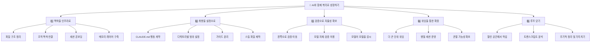
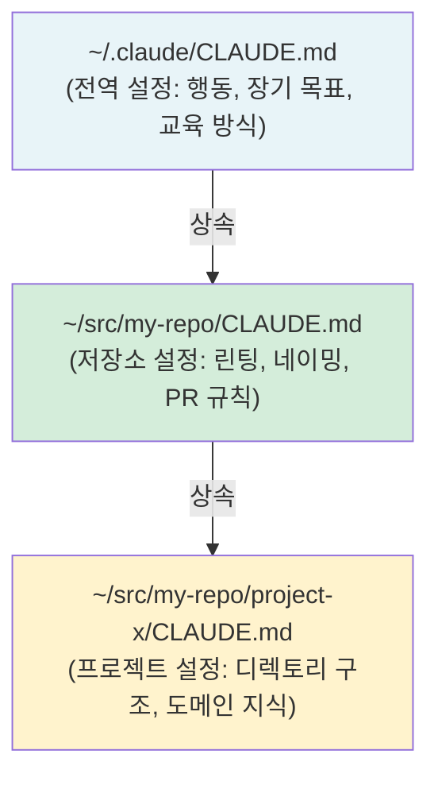
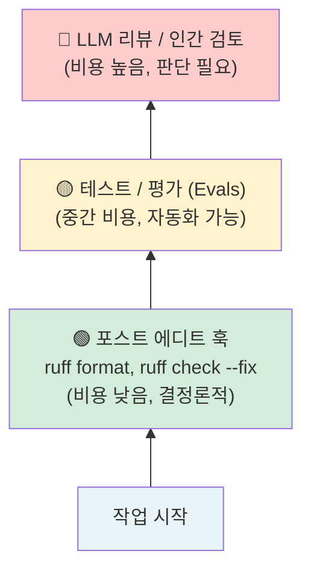
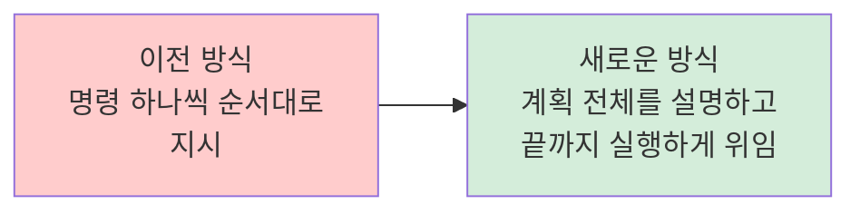
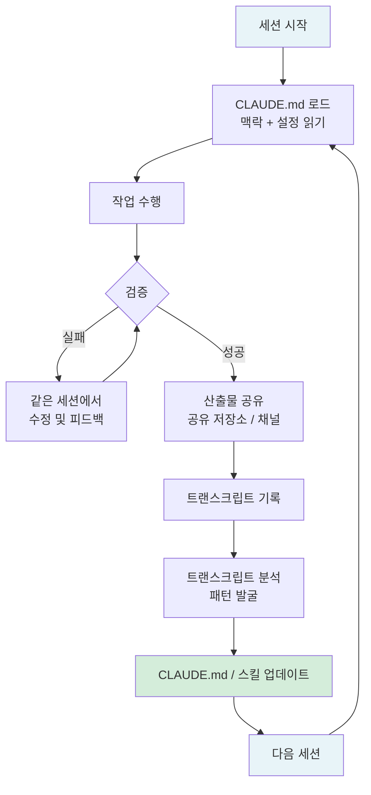

## Eugene Yan의 "How to Work and Compound with AI" 상세 분석

> **원문**: [How to Work and Compound with AI](https://eugeneyan.com/writing/working-with-ai/)  
> **저자**: Eugene Yan (Anthropic, Member of Technical Staff)  
> **원문 발행일**: 2026년 5월 3일

---

## 들어가며 — 이 글을 쓴 사람은 누구인가

이 글은 Eugene Yan이 작성했다. 그는 현재 Anthropic의 Member of Technical Staff으로 재직 중이며, 이전에는 Amazon에서 Principal Applied Scientist로서 추천 시스템(RecSys), 검색, 요약, 번역, Q&A 등 대규모 AI 시스템을 구축했다. Alibaba, Lazada, 헬스케어 스타트업 등을 거치며 ML 팀을 이끈 실무 경력을 갖추고 있다. 그는 머신러닝과 LLM 적용의 "현장 지식(ghost knowledge)"을 외부에 공유하는 것으로 잘 알려져 있으며, eugeneyan.com을 통해 꾸준히 기술 글을 써온 인물이다.

이 글은 2026년 5월에 발행된 것으로, 현재 AI 엔지니어링 커뮤니티에서 가장 실질적이고 체계적인 AI 협업 워크플로우 안내서 중 하나로 평가받고 있다.

---

## 핵심 전제 — "복리(Compound)"란 무엇을 의미하는가

글의 제목에 들어간 "Compound(복리)"라는 단어는 금융에서 차용한 개념이다. 단순히 AI를 도구로 활용하는 것을 넘어서, 매 세션에서 생산된 결과물(코드, 문서, 분석, 의사결정)이 다음 세션의 맥락(context)이 되고, 매번의 수정 사항이 설정 파일을 업데이트하여 미래의 오류를 줄이는 방식으로 작동하는 것을 뜻한다.

쉽게 말하면, AI와 함께 일할수록 AI가 점점 더 나를 잘 이해하게 되고, 내 작업 흐름에 더 정밀하게 맞춰지며, 결과적으로 적은 수정 작업으로 더 좋은 결과물을 얻게 되는 상태를 목표로 한다. Eugene Yan은 이것이 단순히 AI에 국한된 이야기가 아니라, 새로운 팀원을 온보딩하고 함께 일하는 방식과 본질적으로 동일하다고 강조한다.

이 글 전체를 관통하는 다섯 가지 원칙은 다음과 같다.



---

## 1장 — 맥락을 인프라로 (Context as Infrastructure)

### 1.1 모델이 맥락을 탐색하도록 돕기

AI 모델이 좋은 결과를 내려면 적절한 맥락을 찾을 수 있어야 한다. Eugene Yan은 자신의 모든 코드를 `~/src` 디렉토리에, 지식 작업 관련 파일은 모두 `~/vault` 아래에 두고, `projects/`, `notes/`, `kb/` 등으로 체계적으로 분류해 둔다고 밝힌다. 이렇게 정리된 디렉토리 구조는 모델이 `grep`이나 `glob` 명령어를 통해 필요한 맥락을 빠르게 찾을 수 있게 해준다. 단순히 파일을 찾는 것에서 그치지 않고, 이전 코드, 프로젝트 문서, 분석 자료 등을 발견하고 현재 작업에 활용할 수 있는 환경을 만드는 것이 핵심이다.

이 부분은 마치 새로운 개발자가 팀에 합류했을 때, 잘 정리된 저장소와 문서가 있으면 혼자 작업을 이어받을 수 있는 것과 같은 이치다.

### 1.2 조직의 맥락을 모델과 연결하기

업무에서 중요한 맥락은 종종 Slack, Google Drive, Gmail 같은 협업 도구 안에 흩어져 있다. 대부분의 서비스는 Claude Code, Cowork, Claude.ai와 연동할 수 있는 MCP(Model Context Protocol)를 지원한다.

Eugene Yan은 여기서 한 걸음 더 나아가 각 프로젝트마다 `INDEX.md` 파일을 유지한다. 이 파일은 단순한 링크 목록이 아니라, 각 문서나 채널에 대해 URL, 담당자, 그리고 "이 문서 안에 무엇이 있고 언제 읽어야 하는가"를 설명하는 짧은 단락을 포함한 주석 달린 인덱스다. 주석이 없는 URL 목록만 있으면 모델이 모든 링크를 열어 관련성을 확인해야 하기 때문에 시간과 컨텍스트 창을 낭비하게 된다. 주석을 통해 이 판단 작업을 사전에 한 번만 해두면, 이후 모든 세션에서 효율이 높아진다.

### 1.3 각 새 세션을 신입 직원처럼 온보딩하기

AI 모델은 기본적으로 이전 세션을 기억하지 못한다. 매 세션은 완전한 빈 슬레이트(blank slate)에서 시작된다. 따라서 프로젝트별 `CLAUDE.md` 파일을 첫날 신입에게 건네는 온보딩 문서처럼 작성해야 한다.

Eugene Yan의 `CLAUDE.md`에는 두문자어(acronym) 용어 설명, 프로젝트 코드명 해설, 같은 이름을 가진 팀원 구분 방법 같은 세심한 정보가 담겨 있다고 한다. 또한 문서를 읽는 순서도 안내한다. 예컨대 "먼저 `INDEX.md`를 훑어보고, 그다음 `TODOS.md`, 마지막으로 특정 주제 노트를 읽어라"는 식의 독서 순서를 명시하여, 모델이 처음부터 작업에 필요한 맥락을 올바른 순서로 습득할 수 있게 한다.

### 1.4 메모리 레이어 구축하기

모델이 이전 세션을 기억하지 못한다는 한계를 극복하기 위해, 세션 간에 지속되어야 할 모든 것은 디스크에 기록해 두어야 한다. Eugene Yan은 이 메모리 레이어를 두 가지 버킷으로 나눈다.

- **`~/vault`**: 프로젝트 상태, 산출물, 도메인 지식 등 **사실(facts)** 을 저장한다. 이것은 맥락을 제공하는 역할을 한다.
- **`~/.claude`** (및 그 안의 `CLAUDE.md`, `skills/`, `guides/`): 나의 선호도, 워크플로우, 개인적인 취향을 저장한다. 이것은 설정(configuration)을 제공하는 역할을 한다.

이 두 버킷의 구분이 중요하다. 전자는 "무엇을 알고 있는가"에 관한 것이고, 후자는 "어떻게 행동해야 하는가"에 관한 것이다. 이 둘을 함께 갖출 때 AI는 맥락에 맞는 방식으로 작업을 수행할 수 있다.

---

## 2장 — 취향을 설정으로 (Taste as Configuration)

### 2.1 `~/.claude/CLAUDE.md`에서 시작하기

모든 세션의 시작점이 되는 핵심 파일이 바로 전역 `~/.claude/CLAUDE.md`다. Eugene Yan은 이 파일을 "행동 계약서(behavioral contract)"라고 표현한다. 이 파일에는 다음과 같은 내용이 담긴다.

- **행동 방식**: 얼마나 직접적으로 말해야 하는가, 언제 반박해야 하는가, 실수를 어떻게 처리하는가, 작업 범위를 얼마나 좁게 유지해야 하는가
- **교육 방식**: 처음 접하는 용어가 등장할 때 어떻게 설명해야 하는가

실제 예시로 제시된 설정 파일의 일부는 다음과 같다.

```xml
<behavior>
- Be direct and push back when you disagree; if my approach has problems, say so.
- When unsure about something, say you're unsure rather than guessing confidently.
- When something fails, investigate the root cause before retrying.
- Keep diffs scoped to the task: no drive-by reformats or unrelated refactors.
</behavior>

<teaching>
I'm always picking up new systems and domains. When a key term surfaces that I
likely haven't internalized, explain it in 1-2 sentences and then move on.
Format: 💡 followed by 1-2 sentence explanation
</teaching>
```

이런 설정 파일이 있다는 것은, AI가 매 세션마다 동일한 방식으로 행동하도록 "훈련"시키는 것과 유사하다. 단, 이 훈련은 대화를 통한 반복이 아니라 파일로 성문화(codify)된 형태다.

### 2.2 디렉토리별로 범위를 좁혀가기: 전역 → 저장소 → 프로젝트

CLAUDE.md는 계층적으로 운영된다. Claude Code를 하위 디렉토리에서 시작하면, 디렉토리 트리를 위로 올라가며 각 `CLAUDE.md`를 순서대로 로드한다. 또한 세션 도중 모델이 다른 하위 디렉토리로 이동하면 그 디렉토리의 `CLAUDE.md`도 자동으로 불러온다.



이 계층 구조 덕분에 어디서나 공통으로 적용되어야 할 규칙(행동 방식, 교육 방식)은 전역에 두고, 특정 저장소나 프로젝트에만 적용되는 규칙(코드 스타일, 도메인 용어)은 해당 위치에 두는 분리가 가능해진다.

### 2.3 `CLAUDE.md`가 너무 길어지면 분리하기

`CLAUDE.md`가 길어질수록 문제가 생긴다. 매 세션마다 전체를 로드하기 때문에, 현재 작업과 무관한 내용이 컨텍스트 창을 불필요하게 차지하게 된다. Eugene Yan은 이를 "컨텍스트 세금(context tax)"이라고 표현한다.

해결책은 관련 섹션들을 별도의 가이드 파일로 분리하고, `CLAUDE.md`에서는 "언제 읽어라"는 지시만 남겨두는 것이다. `@import`로 인라인으로 불러오면 결국 같은 문제가 발생하기 때문에, 지연 로딩(lazy loading) 방식을 택한다. 예컨대 문서 작성 세션은 대시보드 가이드를 건너뛰고, 평가(eval) 구축 세션은 작성 가이드를 건너뛸 수 있다.

### 2.4 주 1회 이상 하는 작업은 스킬로 만들기

스킬(Skill)은 이름, 트리거, 절차를 담은 마크다운 파일로, 모델이 필요할 때만 로드해서 실행한다. 스킬은 단순한 단계별 지침이 아니라, 조건에 따라 어떤 단계를 밟아야 하는지 판단 로직까지 포함할 수 있다.

Eugene Yan이 실제로 사용하는 스킬 예시는 다음과 같다.

| 스킬 이름 | 하는 일 |
|---|---|
| `/polish` | 버그 확인, 코드 단순화, 결과물 검증(eval 또는 브라우저), 피드백 반복, PR 초안 작성 |
| `/write` | 개요 인터뷰, 리서치 서브에이전트 생성, 초안 작성, 비판적 리뷰어 관점 피드백, 반복 개선 |
| `/daily` | 캘린더·Slack·PR·전날 로그를 읽고 오늘의 우선순위 작성 |

스킬 파일 자체는 워크플로우와 라우팅 로직만 담고 작게 유지한다. 실제 지식(템플릿, 스크립트)은 별도 파일에 두고 필요할 때만 모델이 불러읽는다. 이것이 가이드의 지연 로딩과 같은 원리다.

**스킬 부트스트래핑 방법**은 다음과 같이 설명된다.

1. 먼저 해당 작업을 일반 세션에서 대화형으로 한 번 직접 수행한다.
2. 그 직후 모델에게 "방금 우리가 한 것을 스킬로 만들어달라"고 요청한다.
3. 같은 또는 유사한 작업에 그 스킬을 실행해본다.
4. 결과를 수정해야 할 부분이 있으면, **같은 세션 안에서** 수정하여 피드백이 트랜스크립트에 기록되게 한다.
5. 마지막으로 모델에게 피드백을 반영해서 스킬을 업데이트해달라고 요청한다.

**중요한 원칙**: 스킬을 정제할 때는 `SKILL.md` 파일을 직접 편집하지 않는다. 세션 안에서 피드백을 제공하면 "이전-이후(before-after)" 쌍이 트랜스크립트에 쌓이고, 이를 토대로 모델이 스킬을 업데이트한다. 이 방식이 반복될수록 스킬이 점점 정교해지고, 최종 결과물을 거의 수정하지 않아도 되는 상태에 이른다.

### 2.5 모든 작업에 이 맥락이 필요하지는 않다

브레인스토밍, 탐색적 사고, 초안 작성에는 단순 모드(`CLAUDE_CODE_SIMPLE=1 claude`)가 더 적합할 수 있다. 이 모드에서는 `CLAUDE.md`는 여전히 로드되지만 에이전틱 하니스(hooks, skills, tool-heavy loops)는 작동하지 않는다. 결과물을 출시할 때가 아니라 소리 내어 생각할 때, 복잡한 설정보다는 모델 자체에 더 가까이 접근하는 것이 더 유익할 수 있다.

---

## 3장 — 검증으로 자율성 확보 (Verification for Autonomy)

AI가 더 큰 작업을 자율적으로 수행하게 하려면, 결과물을 신뢰할 수 있어야 한다. 이를 위해서는 체계적인 검증 구조가 필요하다.

### 3.1 검증을 왼쪽으로 이동하기 — 오류는 발생 시점에 잡아라

Eugene Yan은 검증을 사다리(ladder)로 비유한다. 사다리 아래일수록 비용이 적고 결정론적이며, 위로 갈수록 비싸고 판단이 필요하다. 이상적으로는 오류를 가장 낮은 계단에서, 즉 발생하는 즉시 잡아야 한다.



가장 낮은 계단의 예는 모델이 파일을 수정한 직후 자동으로 실행되는 포스트 에디트 훅(post-edit hook)이다. Python 파일이라면 `ruff format`과 `ruff check --fix`가 자동으로 실행되어 형식 오류와 린트 문제를 즉시 수정한다. 이 과정은 추가 토큰을 소비하지 않으며 결정론적으로 작동한다. 더 높은 계단으로는 테스트, 평가(evals), LLM 리뷰 등이 있다.

### 3.2 모델이 스스로 검증할 수 있게 하기

모델에게 피드백 루프를 제공하면 스스로 결과물을 개선할 수 있다. 구체적인 예시는 다음과 같다.

- **시스템이 지표를 생산하는 경우**: 모델이 직접 평가(eval)를 실행하고 그 결과를 최적화하게 한다.
- **결과물이 브라우저에서 렌더링되는 경우**: Claude in Chrome을 통해 모델이 직접 결과를 확인하게 한다(툴팁 렌더링, 레이블 겹침, 수치와 내러티브 일치 여부 등).
- **둘 다 해당하지 않는 경우**: 모델이 코드를 실행하고 오류 메시지를 읽도록 한다.

Docker 이미지 구축 시에는 모델이 빌드하고 → 오류를 읽고 → Dockerfile을 수정하고 → 재빌드하는 과정을 자율적으로 반복한다. 평가 하니스(eval harness)를 조정할 때는 모델이 평가를 실행하고 → 트랜스크립트를 읽고 → 실패를 수정하는 방식으로 작동한다.

### 3.3 장기 실행 작업에서는 모델이 모델을 감시하게 하기

세션이 길어지면 오류가 누적되며 처음 의도에서 벗어나는 "드리프트(drift)"가 발생할 수 있다. Eugene Yan은 이를 두 가지 유형으로 구분한다.

- **실행 드리프트(Execution Drift)**: 작업을 올바른 방식으로 하고 있는가? 오류를 무시하거나, 잘못된 지표를 보고하거나, 원래 명세에서 벗어나는 등의 전술적·국지적 문제다. **자주** 확인해야 한다.
- **방향 드리프트(Direction Drift)**: 올바른 작업을 하고 있는가? 모델이 초기 의도를 잘못 해석하여 몇 시간 동안 엉뚱한 것을 만들어가는 전략적·거시적 문제다. **가끔** 확인하면 된다.

해결책은 신선한 컨텍스트를 가진 보조 세션을 실행하여, 원본 명세와 기본 세션의 최근 대화를 비교하게 하는 것이다. Eugene Yan의 최소 설정은 두 개의 tmux 창이다. 하나는 기본 개발 세션, 다른 하나는 페어 프로그래머 세션이다. 페어 프로그래머는 주기적으로 기동되어 명세와 기본 세션의 최근 트랜스크립트를 비교하고, 문제가 있으면 수정 피드백을 제공한다.

---

## 4장 — 위임을 통한 확장 (Scaling via Delegation)

### 4.1 점점 더 큰 단위의 작업을 위임하기

초기에는 AI와 짝 프로그래밍(pair programming)을 한다. 짧은 작업, 빠른 피드백, 루프 안에 머무르는 방식이다. 그러나 모델이 더 강력해질수록, 더 큰 단위의 작업을 통째로 위임해야 한다.

위임의 핵심은 **의도, 제약 조건, 성공 기준**을 사전에 명확히 설명하고, 그 이후로는 모델이 스스로 작업하게 두는 것이다. "검증할 수 없는 것은 위임할 수 없다"는 원칙 때문에, 위임하려면 먼저 성공 기준과 측정 지표를 정의해야 한다. 작업을 지시하는 방식의 변화는 다음과 같다.



실제 위임 지시의 예시는 다음과 같다.

> "이 평가 스위트들을 기반으로, 각 스위트마다 격리된 컨테이너를 만들고 빌드가 되는지 스모크 테스트를 진행해라. 그런 다음 전체 실행을 하고, 평가 지표와 트랜스크립트를 로깅하고, 서브에이전트를 사용해 트랜스크립트를 읽고 평가가 올바르게 실행되었는지 확인해라. 신뢰 구간 확보를 위해 각 평가를 n번씩 실행해라. 마지막으로 보고서를 생성하고, 보고서 가이드를 따르고 있는지 검증한 후, 결과와 보고서 URL을 Slack으로 보내라."

### 4.2 병렬 세션을 실행하고 병목을 찾기

더 큰 작업을 위임할 수 있다는 것은, 동시에 여러 작업을 실행할 수 있다는 뜻이다. Eugene Yan은 보통 3~6개의 세션을 동시에 실행한다고 밝힌다.

이때 병목은 "작업 수행"에서 "명확한 명세 작성"과 "결과물 검토를 빠르게 수행하여 파이프라인을 원활하게 유지하는 것"으로 이동했다. 즉, 중간 실행 단계는 AI가 채우고, 인간의 역할은 방향 설정과 품질 검토로 집중된다.

여러 세션이 같은 저장소를 공유할 경우, `git worktrees`를 사용하여 각 세션이 독립적인 체크아웃 환경에서 작업하도록 함으로써 서로의 변경 사항을 덮어쓰는 충돌을 방지한다.

### 4.3 세션을 관찰 가능하게 만들기

여러 세션을 동시에 운영하면, 각 세션의 상태를 빠르게 파악할 수 있어야 한다. Eugene Yan의 관찰 체계는 다음과 같다.

- **스톱 훅(Stop Hook)**: 세션이 완료되면 맥OS에서 소리가 재생된다. 어느 창을 봐야 할지 소리가 알려준다.
- **tmux 창 제목**: 상태 이모지(⏳ 작업 중, 🟢 완료)와 Claude Haiku가 생성한 짧은 레이블로 각 창이 무엇을 하고 있는지 파악할 수 있다.
- **Claude Code 상태 줄**: 컨텍스트 사용량과 현재 모드를 표시한다.

이 세 가지가 함께 작동하면 소리로 완료를 인지하고 → 창 제목으로 어떤 세션인지 확인하고 → 상태 줄에서 세부 사항을 파악하는 관찰 흐름이 완성된다.

### 4.4 자리를 비워도 체크인할 수 있다

Claude Code의 `/remote-control` 기능을 사용하면 이동 중에도 Claude 앱의 코드 탭을 열어 어떤 세션이 실행 중이고 무엇이 막혀 있는지 확인할 수 있다. 막힌 세션이 있다면 추가 맥락이나 새 지시를 제공해서 해제할 수 있다. 단, 긴급한 상황이 아닐 때는 이를 자제하고 온전히 현재에 집중하는 것을 권한다.

---

## 5장 — 루프 닫기 (Closing the Loop)

### 5.1 열린 공간에서 작업하여 맥락을 풍부하게 유지하기

공유 문서, 저장소, 채널에서 작업을 수행하면 모든 사람이(AI 포함) 그 맥락에서 혜택을 받을 수 있다. 오늘 공유한 것이 내일의 조직 맥락이 된다.

간단한 테스트를 해볼 수 있다. "신입 팀원이 공유된 맥락만으로 지난 주의 내 작업을 재현할 수 있는가?" 가능하다면 조직 맥락에 충분히 기여하고 있는 것이다. 불가능하다면 소중한 맥락이 내 머릿속에만 갇혀 있는 것이다.

Eugene Yan은 이를 자동화하기 위해 `CLAUDE.md`에 "큰 작업이 완료될 때마다 작업 로그 채널에 짧은 업데이트를 올려라"는 지시를 넣어두었다고 한다. 링크도 함께 첨부되어 결과물 PR이나 문서로 바로 이동할 수 있게 한다.

### 5.2 트랜스크립트에서 설정 업데이트를 발굴하기

세션이 쌓이면, 과거 트랜스크립트를 분석해서 설정의 빈틈을 찾을 수 있다. Eugene Yan은 약 2,500개의 과거 발화를 스캔한 결과, 상당한 비율이 "~도 해줄 수 있어?", "확인했어?", "아직도 틀렸어" 같은 패턴을 포함하고 있었다고 밝힌다.

이런 패턴들은 두 가지 신호 중 하나를 나타낸다. 하나는 모델이 별도의 지시 없이도 자동으로 했어야 할 작업이 `CLAUDE.md`나 스킬에 반영되지 않았다는 것이고, 다른 하나는 검증 단계가 누락되거나 작동하지 않고 있다는 것이다.

발생 빈도가 높은 수정 패턴이 있다면 `CLAUDE.md`나 스킬 파일을 업데이트하여 다음번에는 같은 실수가 반복되지 않도록 해야 한다. 이것이 "복리(compound)"가 실제로 작동하는 메커니즘이다.

### 5.3 주기적으로 정리하고 가지치기

설정 파일들은 시간이 지나면서 서로 겹치거나 충돌할 수 있다. 모델이 어떤 규칙을 무시하는 것처럼 보인다면, 다른 규칙이 그것과 상충하기 때문일 수 있다. 이를 고치려면 주기적으로 설정을 리팩터링해야 한다.

각 규칙이나 선호도는 정확히 한 곳에만 존재해야 한다(단, 핵심 지시는 메인 `CLAUDE.md`에 중복해서 적어도 된다). 또한 디렉토리별로 흩어진 `settings.json` 파일들을 발견하면 `~/.claude`로 통합해야 한다.

---

## 전체 흐름 요약: 복리가 쌓이는 구조



이 흐름에서 핵심은 **루프를 닫는 것**이다. 각 세션에서의 수정과 피드백이 설정 파일을 업데이트하고, 업데이트된 설정이 다음 세션의 품질을 높이며, 이 과정이 반복될수록 점점 적은 수정으로 더 좋은 결과가 나오는 복리 효과가 나타난다.

---

## 이 글이 개인 도구 이상을 말하는 이유

글 말미에서 Eugene Yan은 이 모든 원칙이 개인 생산성 도구를 넘어서 에이전트 하니스(agent harness) 설계, 팀 규범 설정, 조직 인프라 구축에도 동일하게 적용된다고 말한다.

"여기서 우리가 하고 있는 것은 협력자를 훈련시키는 것이다, 한 번에 하나의 피드백씩."

그리고 이 원칙들은 AI에만 국한된 것이 아니라, 인간 팀과 함께 일하는 방식과 본질적으로 동일하다는 관찰로 마무리된다. 좋은 맥락을 제공하고, 선호도를 문서화하고, 검증을 싸게 만들고, 더 많이 위임하고, 루프를 닫는 것. 이것은 AI 시대의 새로운 협업 철학이자, 오래된 협업의 지혜가 새로운 형태로 표현된 것이다.

---

## 핵심 원칙 요약

| 원칙 | 핵심 개념 | 실천 방법 |
|---|---|---|
| **맥락을 인프라로** | 모델이 필요한 맥락을 스스로 찾을 수 있게 한다 | 파일 구조 정리, INDEX.md 주석, CLAUDE.md 온보딩, vault + .claude 메모리 레이어 |
| **취향을 설정으로** | 선호도와 행동 방식을 파일로 성문화한다 | CLAUDE.md 행동 계약, 계층적 범위 설정, 가이드 지연 로딩, 스킬 파일 제작 |
| **검증으로 자율성 확보** | 결과물을 신뢰할 수 있어야 위임할 수 있다 | 포스트 에디트 훅, 모델 자체 검증 루프, 페어 프로그래머 세션 |
| **위임을 통한 확장** | 더 큰 단위의 작업을 통째로 맡긴다 | 의도·제약·성공 기준 사전 정의, 병렬 세션, git worktrees |
| **루프 닫기** | 각 세션의 피드백이 다음 세션의 품질을 높인다 | 열린 공간에서 작업, 트랜스크립트 분석, 주기적 설정 정리 |

---

*원문: Eugene Yan, "How to Work and Compound with AI", eugeneyan.com, 2026년 5월 3일*  
