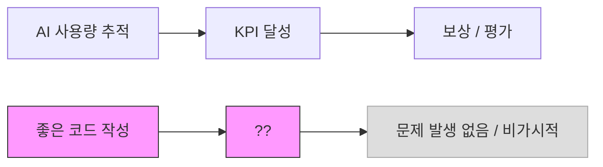
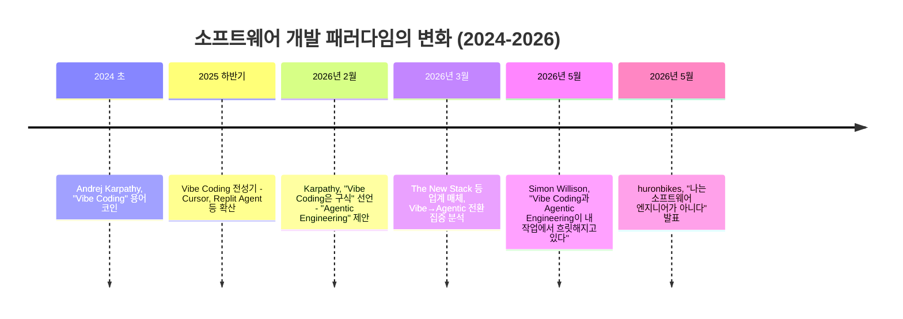
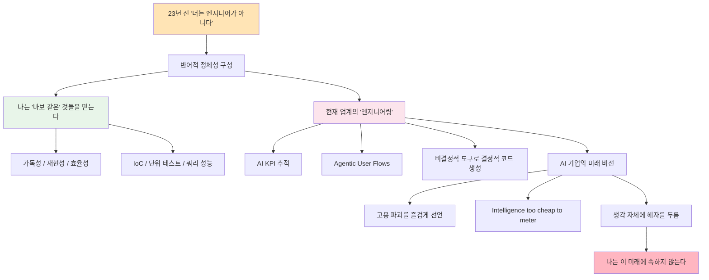

> 원문: [huronbikes.mataroa.blog](https://huronbikes.mataroa.blog/blog/i-am-not-a-software-engineer/) (2026년 5월 19일)  
> GeekNews 한국어 토론: [news.hada.io/topic?id=29730](https://news.hada.io/topic?id=29730) (2026년 5월 21일)

---

## 1. 이 글은 무엇인가 — 글의 성격과 배경

이 글은 `huronbikes`라는 닉네임을 사용하는 소프트웨어 개발자가 개인 블로그 플랫폼 Mataroa에 2026년 5월 19일 게재한 에세이다. 필자는 자신의 이름이나 재직 회사를 밝히지 않았으며, 글의 어조는 냉소적인 반어(irony)로 일관된다. 제목 자체가 반어다. "나는 소프트웨어 엔지니어가 아니다"라는 말은 문자 그대로가 아니라, "이 업계가 지금 '소프트웨어 엔지니어링'이라고 부르는 것이 진짜 엔지니어링이라면, 나는 그 정의 안에 들어가고 싶지 않다"는 선언에 가깝다.

글이 GeekNews에 올라오면서 한국어권 개발자 커뮤니티에서도 반향을 일으켰고, Lobste.rs(개발자 커뮤니티 링크 공유 사이트)에서도 논의가 이루어졌다.

---

## 2. 반어의 시작 — 23년 전의 낙인

필자의 서사는 23년 전, 즉 2003년 무렵으로 거슬러 올라간다. 당시 커리어를 막 시작했을 때 동료로부터 "당신은 좋은 해커(hacker)지만 엔지니어는 아니다"라는 평가를 들었다. 그 말이 이 에세이의 씨앗이 된다.

흥미로운 점은 필자가 그 평가를 23년이 지난 지금도 기억하고 있다는 것이다. 그리고 그 평가를 반어의 도구로 전환한다. "그래, 나는 소프트웨어 엔지니어가 아니다. 왜냐하면 나는 지금 이 업계가 '엔지니어링'이라고 부르는 것들을 하지 않으니까."

---

## 3. 에이전트 패러다임에 대한 비판

### 3-1. "비결정적 프로그램으로 결정적 프로그램을 만든다"는 모순

필자가 가장 날카롭게 지적하는 부분은 현재의 AI 기반 개발 방식이 가진 근본적인 모순이다.

AI 언어 모델(LLM)은 본질적으로 **비결정적(non-deterministic)** 이다. 같은 입력을 주어도 매번 조금씩 다른 출력이 나올 수 있다. 반면 소프트웨어 코드는 **결정적(deterministic)** 이어야 한다. 같은 입력에 반드시 같은 출력이 나와야 하고, 이것이 소프트웨어의 신뢰성과 재현성(reproducibility)의 기반이다.

필자는 이를 이렇게 표현한다: "비결정적 출력을 내는 프로그램으로 결정적이어야 하는 프로그램을 쓰는 것이 소프트웨어 엔지니어링의 미래로 제시되고 있다." 실제 시스템에서 재현성을 확보하는 것은 이미 충분히 어려운 일인데, 코드 작성 자체를 "움직이는 모래(shifting sands)" 위에 세우는 것은 이 문제를 더 심각하게 만든다는 것이다.

### 3-2. Waylon Smithers 비유

필자는 AI 코딩 에이전트를 **Waylon Smithers**에 빗댄다. Waylon Smithers는 미국 애니메이션 「심슨 가족(The Simpsons)」에 등장하는 캐릭터로, 사장 Mr. Burns의 아첨꾼 비서다. 시키는 대로 하고, 실수하지 않으려 애쓰지만 결국 주인의 뜻을 맹목적으로 따르는 존재다.

현재의 AI 코딩 에이전트에게 요구되는 것이 "실수하지 말아라", "너는 전문 소프트웨어 엔지니어다"라고 프롬프트를 주는 것이라면, 그것은 진짜 엔지니어링이 아니라 아첨꾼 기계에게 지시를 내리는 것에 불과하다는 조롱이다.

### 3-3. COBOL 비유의 아이러니

직장 동료가 "손으로 코드를 쓰는 것은 곧 COBOL을 쓰는 것처럼 취급받게 될 것"이라고 말했다고 필자는 전한다. 이 비유가 흥미로운 이유가 있다.

COBOL(Common Business-Oriented Language)은 1959년에 개발된 언어로, 주로 금융 및 행정 시스템에서 지금도 사용된다. 오래된 언어라는 이유로 종종 시대착오적인 것의 상징으로 쓰인다. 그러나 COBOL로 작성된 시스템들은 수십 년째 금융 인프라를 안정적으로 돌리고 있다. "손으로 쓴 코드 = COBOL처럼 낡은 것"이라는 프레이밍에는, 역설적으로 그 안정성과 재현성에 대한 무지가 담겨 있다는 것이 필자의 숨은 논지다. 필자는 이 비유가 자신의 것이 아니라 동료가 쓴 것이라고 명시하며, COBOL 커뮤니티에 대한 존중도 잊지 않는다.

---

## 4. 코드에 대한 신념 — 필자의 가치관

필자가 "소프트웨어 엔지니어가 아니기 때문에 믿는 바보 같은 것들"이라며 나열하는 항목들은 사실 소프트웨어 공학의 핵심 원칙들이다.

**가독성과 이해 가능성**: 코드는 기계가 실행하는 것이지만, 동시에 사람이 읽고 이해할 수 있어야 한다. 코드가 읽히지 않으면 유지보수가 불가능하다.

**효율성과 추론 가능성**: 코드가 왜 그렇게 작성되었는지 논리적으로 추론할 수 있어야 한다.

**재현성**: 같은 입력에 같은 출력. 이것은 테스트와 디버깅의 기반이다.

**제어의 역전(Inversion of Control, IoC)**: 의존 관계를 직접 생성하지 않고 외부에서 주입받는 설계 패턴으로, 모듈 간 결합도를 낮추고 테스트 가능성을 높인다.

**쿼리 성능에 대한 고민**: 집계 표현식을 포함한 하위 쿼리로 구성된 뷰가 쿼리 성능에 미칠 영향을 미리 생각하는 것.

**단위 테스트를 위한 설계**: 특정 기능을 메서드에서 분리해 독립적으로 테스트할 수 있도록 만드는 것.

필자는 동료들이 "이런 것들을 걱정하기에는 너무 바쁘게 소프트웨어 엔지니어로 일하고 있다"고 말한다. 이것이 반어의 핵심이다. 진짜 엔지니어링을 걱정하는 사람이 오히려 "엔지니어가 아닌" 취급을 받는다.

---

## 5. Agentic User Flows에 대한 회의

필자의 직장에서는 "agentic user flows"를 원하고, 그 예시로 사용자가 자연어로 텍스트 박스에 원하는 것을 입력하는 인터페이스를 제시한다고 한다.

필자는 이것이 왜 "매우 작은 선택지 집합에서 고르는 것"보다 나은지 이해하지 못하겠다고 한다. 이것은 단순한 거부가 아니라, UX의 본질에 대한 질문이기도 하다.

자연어 입력은 사용자가 원하는 것을 명확하게 알고 있을 때도 있지만, 그렇지 않을 때가 더 많다. 잘 설계된 UI는 사용자가 무엇을 원하는지 발견하도록 돕는다. 반면 열린 텍스트 박스는 사용자에게 모든 부담을 전가한다. 게다가 LLM 기반의 자연어 처리는 동일한 입력에 다른 출력을 낼 수 있어, 사용자 경험의 일관성을 해친다.

---

## 6. KPI와 좋은 코드 — 측정 가능성의 함정

직장에서 AI 사용량이 KPI로 추적되기 시작했다고 필자는 말한다. 이것은 현재 많은 테크 기업에서 실제로 벌어지는 일이다. AI 도구 도입을 내부 지표로 측정하는 것이다.

필자는 23년 동안 KPI를 신경 쓴 적이 없다고 한다. 대신 좋은 코드를 쓰는 것에 집중했다. 그가 받은 최고의 칭찬은 "수학 전공자가 쓴 것 같다"는 평이었다. 이것은 코드의 논리적 엄밀함, 수학적 추론 가능성을 인정받은 것으로 해석한다.

반면 같은 직장의 한 스태프 소프트웨어 엔지니어가 구현한 것은:
- 명시적 인터페이스 부재
- DI(의존성 주입) 컨테이너를 `public static` 멤버로 노출 — 이는 전역 상태를 만들어 테스트 가능성을 크게 훼손하는 안티패턴이다
- 테이블 형식 데이터를 표현하기에 부적합한 CSV를 "비즈니스 사용자가 쓰기 쉽다"는 이유로 설정 파일 형식으로 사용

필자는 이것이 나쁜 설계라고 말했다가 오히려 문제가 되었다. 조직의 논리가 "좋은 코드"보다 "비즈니스 사용자의 편의"나 "동료와의 마찰 없음"을 더 중시했기 때문이다.

---

## 7. AI 소프트웨어에 대한 근본적 우려

### 7-1. 사고 과정의 탈취(co-option)

필자는 AI 소프트웨어가 "사고 과정을 방해하거나 적극적으로 가져간다"고 표현한다. 이것은 많은 개발자들이 공감하는 경험이다. 코드 자동완성이나 AI 제안이 나타나는 순간, 개발자는 스스로 다음 줄을 생각하는 대신 제안된 것을 수용할지 거부할지 평가하는 역할로 전환된다. 이 과정에서 심층적인 문제 해결 사고가 일어나는 공간이 줄어든다.

### 7-2. 절도와 착취 위에 세워진 AI

필자는 AI 소프트웨어가 가능해진 방식에 대해서도 우려를 표한다. AI 모델 학습에 사용된 방대한 데이터가 창작자들의 동의 없이 수집된 것이라는 점, 그리고 그 데이터를 처리하는 데이터 라벨러들의 저임금 노동이 있다는 점을 "절도"와 "대규모 착취"로 표현한다. 이것은 법적으로나 윤리적으로나 아직 진행 중인 논쟁이다.

---

## 8. "Intelligence Too Cheap to Meter" — 이 표현의 유래와 맥락

필자는 대형 AI 기업 리더들이 "intelligence too cheap to meter(측정하기에 너무 싼 지능)"라는 표현을 쓴다고 언급한다.

이 표현은 OpenAI CEO **Sam Altman**이 사용했다. 원래 "too cheap to meter"는 1954년 미국 원자력위원회 의장이 핵에너지에 대해 한 발언에서 비롯된 문구다 — "전기가 너무 싸서 측정할 필요가 없게 될 것"이라는 낙관적 예측이었다. 그러나 이 예측은 실현되지 않았고, 핵발전소의 전기는 여전히 유료다.

Altman은 2025년 7월 연방준비제도(Fed) 컨퍼런스에서 "지난 5년간 AI 지능의 단위당 비용을 매년 10배 이상 낮춰왔다. intelligence too cheap to meter를 실현하게 될 것 같다"고 말했다. 코딩 작업의 예시로 "전문가가 며칠 걸릴 작업을 AI가 5분 만에 1달러 미만의 비용으로 해결했다"고 언급하기도 했다.

필자의 비판은 "지능이 무언가 측정할 수 있는 것"이라는 전제 자체다. 지능을 토큰(token)으로 환산하고, 토큰 가격을 낮추면 "지능이 싸진다"는 발상은 지능에 대한 매우 단순화된 이해라고 볼 수 있다. 필자는 이 표현이 "지능을 마치 전기나 물처럼 계량하고 판매할 수 있는 상품으로 취급한다"는 점에서 불쾌함을 느낀다.

---

## 9. "생각에 해자를 두른다" — 가장 강렬한 비판

필자가 AI의 미래를 "끔찍하다"고 표현하는 지점이 여기다.

> "그 미래가 끔찍한 이유는 기계가 모두를 종이클립으로 만들기 때문이 아니라, 그들이 생각 자체에 해자를 두르는 상상을 하기 때문이다."

"종이클립으로 만든다"는 것은 AI 안전 분야의 사고 실험인 **Paperclip Maximizer**를 가리킨다 — 종이클립을 최대한 많이 만들도록 설계된 초지능 AI가 결국 우주 전체를 종이클립으로 바꾼다는 극단적 AI 위험 시나리오다. 필자는 이 시나리오를 두려워하는 것이 아니라고 말한다.

오히려 두려운 것은 현실적인 시나리오다. AI 기업 리더들이 스스로를 "생각이라는 자원 주변에 해자를 두르는 자"로 상상한다는 것. 즉, AI를 통해 인간의 사고 능력 자체를 하나의 서비스로 전환하고, 그 서비스의 게이트키퍼가 되려 한다는 것이다. 이것은 Altman의 "intelligence too cheap to meter" 비전과도 직결된다 — 지능을 싸게 공급하는 자가 그 지능의 독점적 공급자가 되는 구조.

---

## 10. 고용에 미치는 영향 — 필자의 우려가 근거 없지 않다

필자는 대형 AI 기업 리더들이 "자사 제품이 고용에 devastating effects(파괴적 영향)를 줄 것"이라고 즐겁게 발표한다고 쓴다. 이것은 실제 발언에 근거한다.

**Dario Amodei** Anthropic CEO는 2025년부터 AI가 향후 수년 내에 화이트칼라 초급 일자리의 약 50%를 대체할 수 있으며, 실업률이 최대 20%까지 치솟을 수 있다고 경고해왔다. 2026년 1월에는 "unusually painful(유례없이 고통스러운)" 고용 시장 붕괴가 올 것이라고 말했다.

실제 데이터도 이를 뒷받침한다. 2025년 미국에서 AI가 원인으로 지목된 해고가 약 5만 5천 건에 달했고, 빅테크의 신입 채용은 팬데믹 이전 수준 대비 거의 절반으로 줄었다는 SignalFire 보고서도 있다. MIT 연구에 따르면 AI는 이미 미국 노동 시장의 11.7%의 업무를 수행할 수 있는 상태다.

다만 Deutsche Bank는 2026년에는 실제 다른 이유로 이루어진 해고를 AI 탓으로 돌리는 "AI redundancy washing"이 기업들 사이에서 유행할 것이라는 경고도 내놓았다.

---

## 11. 더 넓은 맥락 — Vibe Coding과 Agentic Engineering의 충돌

이 에세이가 게재된 2026년 5월은 소프트웨어 개발 방식을 둘러싼 논쟁이 가장 격렬하게 벌어지고 있는 시점이다.

**Andrej Karpathy** (전 OpenAI 공동창업자, 전 Tesla AI 헤드)가 2024년 초 "vibe coding"이라는 말을 만들었다. 원래는 자연어로 AI에게 의도를 전달하고 AI가 코드를 생성하는 방식을 가리키는 비공식적 표현이었다. 그런데 이 말이 너무 빠르게 퍼지면서, 품질이나 이해보다 속도와 결과물만을 중시하는 개발 방식의 상징처럼 되어버렸다.

Karpathy 자신도 2026년 2월, "이제 vibe coding이라는 말보다 **agentic engineering**이 더 정확하다"고 밝혔다. 그 의미는 이렇다: "Agentic — 99%의 경우 코드를 직접 쓰지 않고, 코드를 쓰는 에이전트를 오케스트레이션하고 감독하는 역할. Engineering — 그럼에도 불구하고 예술과 과학, 전문성이 요구된다."

그러나 huronbikes의 에세이는 이 "agentic engineering"이라는 프레임마저 의심한다. 에이전트를 감독하는 역할이 정말 엔지니어링인가? 이해 없이 감독만 하는 것이 가능한가?

---

## 12. GeekNews와 Lobste.rs의 반응 분석

### 12-1. Deming의 일화 — 불량품을 만들라는 지시

GeekNews에 소개된 Lobste.rs 댓글 중 하나는 Mary Walton의 W. Edwards Deming 책에 나오는 일화를 인용한다. 공장 노동자가 기계 고장으로 불량품이 계속 나오는 상황에서 감독이 "그냥 돌려라"고 지시했다는 이야기다. 그 노동자는 "불량품을 만들고 돈을 받고 싶지 않다"며 "작업자로서의 자부심은 어디 있는가"라고 했다.

이 비유는 huronbikes의 에세이와 강하게 공명한다. AI가 생성한 품질 낮은 코드를 그냥 받아들이고 배포하는 것을 "그냥 돌려라"는 감독의 지시와 같은 차원으로 본 것이다. 장인 정신(craftsmanship)과 품질에 대한 자부심의 문제다.

W. Edwards Deming은 품질 관리의 선구자로, "품질은 검사로 만들어지는 것이 아니라 공정에 내재되어야 한다"고 주장한 인물이다.

### 12-2. 핵심 논지를 비껴간 비판에 대한 반박

한 Lobste.rs 댓글은 "23년 전 평가에 집착하는 것은 남의 의견을 너무 신경 쓰는 것"이라는 비판을 했고, 이에 대해 다른 댓글이 반박한다.

핵심 반박은 이렇다: "이 글의 요지는 필자가 실제로 소프트웨어 엔지니어가 아니라는 게 아니다. 업계가 변한 모습에 대한 반응으로 그 정체성에서 스스로를 배제한다는 것이다. '이것이 소프트웨어 엔지니어링이라면, 나는 그것이 아니다'라고 말하는 셈이다."

### 12-3. "소프트웨어 엔지니어링"이라는 이름 자체의 문제

같은 댓글에서는 더 깊은 문제도 제기한다. 소프트웨어 개발을 "엔지니어링"이라고 부르는 것 자체가 다른 공학 분야에 대한 모욕일 수 있다는 것이다. 토목 엔지니어는 다리가 무너지는 일을 극도로 심각하게 받아들이고, 큰 붕괴 사고가 나면 업계 전체가 배우고 재발을 막으려 한다. 반면 소프트웨어 "엔지니어"는 완전히 예방 가능한 이유로 프로덕션 장애를 내고도 이를 이력서에 성공담으로 쓸 수 있다. AI 생성 코드를 검토 없이 배포하는 현재의 흐름은 이 문제를 더 심화시킨다.

---

## 13. 이 에세이가 말하지 않는 것

이 글의 균형 잡힌 이해를 위해, 필자가 주장하지 않는 것도 명확히 할 필요가 있다.

필자는 AI 도구 전체를 반대하는 것이 아니다. 특정 AI 도구를 구체적으로 비판하지도 않는다. "AI를 쓰는 모든 개발자는 나쁘다"고 말하지도 않는다. 다른 동료들이 AI를 쓰는 것을 비난하지도 않는다.

그가 비판하는 것은:
1. AI 사용을 KPI로 측정하는 관료적 접근
2. 품질보다 속도를 우선하는 조직 문화
3. AI 기업 리더들이 고용 파괴를 즐겁게 선언하는 태도
4. "지능"을 계량화하고 상품화하는 세계관
5. 자신이 작성하고 배포하는 코드의 품질에 무관심한 개발 문화

---

## 14. 전체 논지 구조 정리

---

## 15. 결론 — 이 글이 왜 지금 중요한가

huronbikes의 에세이는 분노 섞인 독백이지만, 그 안에 중요한 질문들이 들어 있다.

소프트웨어 개발에서 **이해(understanding)** 와 **책임(accountability)** 은 어디에 있는가? AI가 코드를 생성했을 때, 그 코드에 대한 책임은 누가 지는가? 코드를 이해하지 못하면 그 책임을 질 수 있는가?

AI 도구가 생산성을 높이는 것은 사실일 수 있다. 그러나 생산성의 증가가 품질의 저하를 동반한다면, 그리고 그 품질 저하가 개발자 개인이 아니라 사용자와 사회 전체에 전가된다면, 그것은 진보인가?

"소프트웨어 엔지니어링"이라는 이름에 걸맞은 엄밀함과 책임감이 있다면, 그것은 어떤 도구를 쓰는가와 무관하게 유지되어야 한다. 그것이 이 에세이가 반어를 통해 말하고 싶은 것이다.

---

