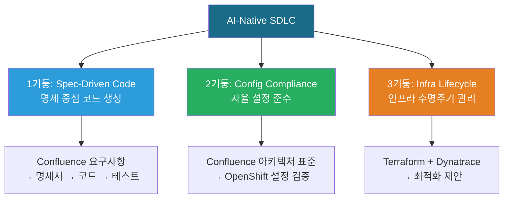
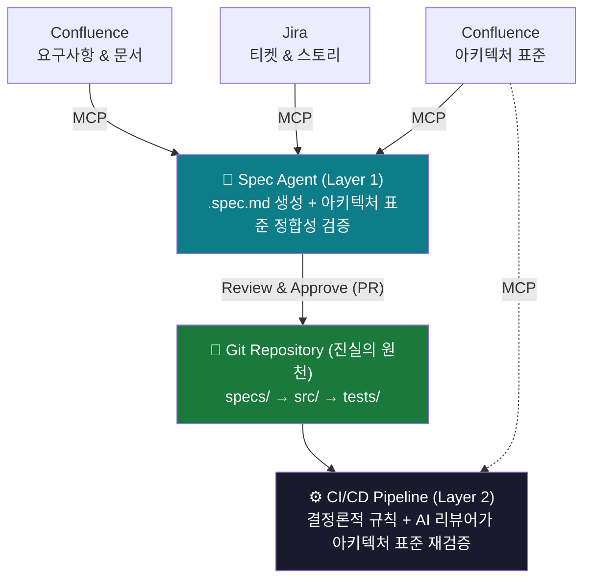
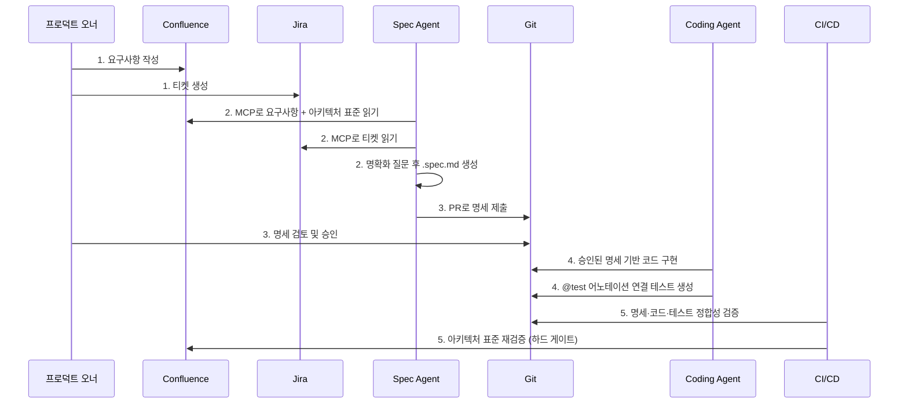
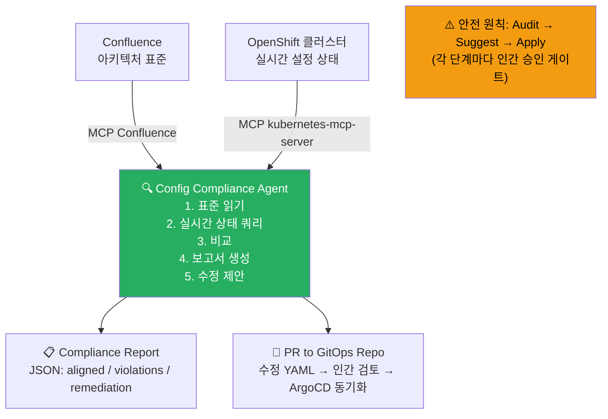
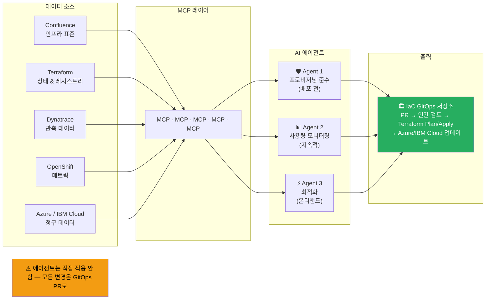
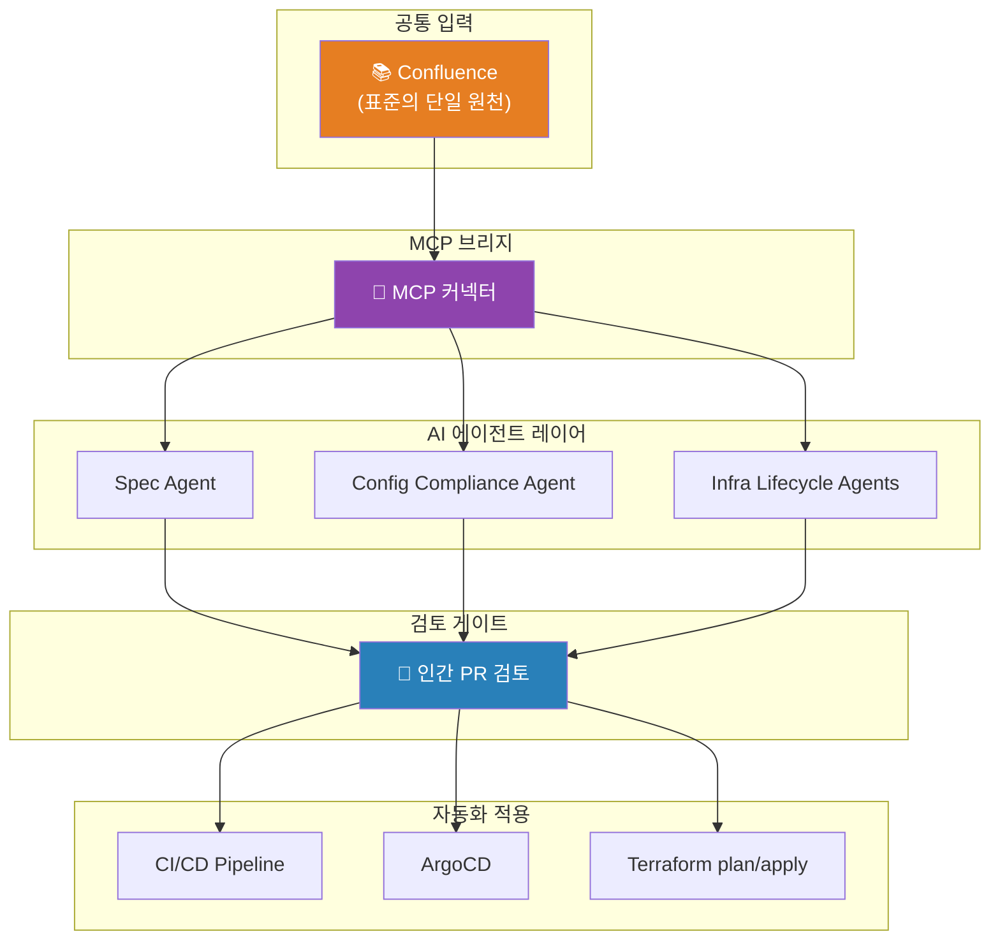
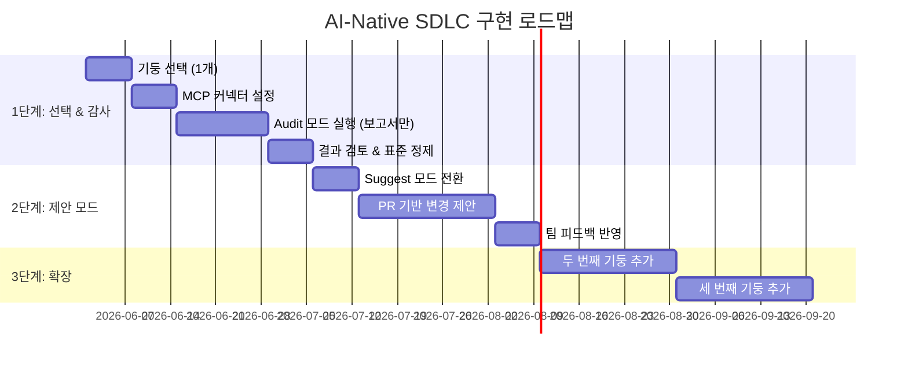

> **원문**: Roman Łada-Grodzicki, ["The AI-Native SDLC"](https://medium.com/@roman.lada.grodzicki/the-ai-native-sdlc-01991ca0e3bc) (Medium, 2026년 4월 9일)  
> **주제**: Spec-Driven Development(명세 중심 개발), Config Compliance(설정 준수), Infrastructure Lifecycle Management(인프라 수명주기 관리)를 하나로 묶는 3기둥 프레임워크

---

## 들어가며: 왜 지금, AI-Native SDLC인가?

소프트웨어 개발 조직 대부분은 AI를 도입했다고 해도 두 가지 한계적인 방식에 머물러 있습니다. 첫 번째는 코드 한 줄씩을 도와주는 '코딩 어시스턴트' 수준의 활용입니다. 자동차에 비유하면 크루즈 컨트롤 정도에 해당하며, 개발자가 여전히 핸들을 잡고 있어야 합니다. 두 번째는 짧은 프롬프트 하나로 기능 전체를 생성하는 이른바 **'바이브 코딩(Vibe Coding)'** 방식입니다. AI가 개발자의 의도를 알아서 파악해 줄 것이라 기대하는 이 방식은 금방 한계에 부딪힙니다. 결과물의 일관성이 없고, 아키텍처 표준을 따르지 않으며, 유지보수가 어렵습니다.

이 글이 제시하는 **AI-Native SDLC**는 이 두 방식을 모두 뛰어넘는 체계입니다. 코드 생성을 넘어, 인프라 설정 방식과 클라우드 자원 전체 생명주기 관리까지 AI 에이전트가 주도하도록 연결합니다. 핵심은 **Model Context Protocol(MCP)** 이라는 표준 통신 규약을 통해 기존 도구들을 AI 에이전트와 유기적으로 연결하는 것입니다.

---

## MCP(Model Context Protocol)란 무엇인가?

본 프레임워크 전체의 기반이 되는 기술이기 때문에 먼저 이해할 필요가 있습니다.

**MCP**는 Anthropic이 2024년 말에 오픈소스로 공개한 프로토콜로, AI 에이전트가 외부 도구와 데이터 소스에 표준화된 방식으로 접근할 수 있도록 합니다. 쉽게 말하면, AI 에이전트가 Confluence 문서를 읽고, Jira 티켓을 조회하고, OpenShift 클러스터 상태를 확인하고, Terraform 상태를 가져오는 모든 작업을 하나의 공통 프로토콜로 처리할 수 있게 해주는 '표준 어댑터'입니다.

2026년 현재, MCP는 Linux Foundation 산하 Agentic AI Foundation(AAIF)이 관리하며, Red Hat을 포함한 140개 이상의 조직이 멤버로 참여하고 있습니다. Red Hat은 OpenShift AI 3.4에 MCP 카탈로그를 공식 탑재하여, Terraform, Dynatrace, Azure, IBM Cloud 등의 MCP 서버를 중앙에서 관리할 수 있게 했습니다. MCP 사양은 2026년 7월 28일 릴리스 후보(RC)가 공개되었고, 이번 버전은 출시 이래 가장 큰 개정으로서 HTTP 인프라에서 확장되는 무상태(stateless) 코어와 장기 실행 작업을 위한 Tasks 확장이 포함됩니다.

```
[AI 에이전트]
     │
     │  MCP (공통 프로토콜)
     │
     ├──► Confluence (문서, 표준)
     ├──► Jira (티켓, 스토리)
     ├──► OpenShift (클러스터 상태)
     ├──► Terraform (IaC 상태)
     └──► Dynatrace (관측 데이터)
```

---

## 세 가지 기둥 개요

이 프레임워크는 세 가지 독립적이면서도 동일한 구조를 공유하는 기둥으로 구성됩니다.



세 기둥 모두 동일한 원칙을 따릅니다. **표준은 Confluence에 존재**하고, **에이전트는 MCP로 표준을 읽으며**, **변경사항은 PR(Pull Request)로 제안**되고, **인간이 검토·승인**하며, **CI/CD가 실제 적용을 강제**합니다.

---

## 1기둥: Spec-Driven AI SDLC (명세 중심 AI 개발)

### 문제의 핵심: 연결되지 않는 네 개의 시스템

대부분의 엔터프라이즈 조직에서 **요구사항은 Confluence**에 있고, **티켓은 Jira**에 있고, **아키텍처 표준은 또 다른 Confluence 페이지**에 있으며, **코드베이스는 Git**에 있습니다. 이 네 가지는 구조적으로 연결되어 있지 않습니다.

코드가 작성된 순간, Confluence 페이지는 이미 낡은 것이 됩니다. Jira 티켓이 완료되면, 그 수락 기준은 역사적인 기록이 됩니다. 구현 내용이 달라져도 아무도 문서로 돌아가 업데이트하지 않습니다. 이것이 기술 부채와 아키텍처 드리프트의 근본 원인입니다.

Tessl의 창업자 Guy Podjarny가 정의한 해법은 명확합니다. **명세는 구조화되고 검증 가능한 언어로 의도를 포착해야 하며, 에이전트가 그 명세에 맞게 코드를 생성해야 한다**는 것입니다.

2026년 InfoQ 분석에 따르면, AI 생성 코드에서 발생하는 문제는 코드 자체의 오류가 아니라 **명세의 공백**에서 비롯됩니다. 코드를 직접 수정하면 명세와의 간격이 더 벌어질 뿐이고, AI의 비결정적 특성 때문에 그 간격은 코드를 재생성할 때마다 다른 형태로 반복해서 나타납니다. 즉, **명세가 진실의 원천**이어야 하고, 모든 수정은 명세로부터 출발해야 합니다.

### 아키텍처: Confluence를 입력으로, Git 저장소를 진실의 원천으로



핵심적인 통찰은, **프로젝트 팀이 자신들의 작업 방식을 전혀 바꿀 필요가 없다**는 것입니다. 프로덕트 오너는 계속 Confluence에 씁니다. 엔지니어는 Jira에서 티켓을 관리합니다. 아키텍트는 Confluence에서 표준을 관리합니다. AI 에이전트 브리지는 이들에게 보이지 않습니다.

### 명세(Spec)란 정확히 무엇인가?

명세는 저장소 안에 살아있는 **마크다운 파일**로, YAML 전문(frontmatter)을 포함합니다. 중요한 것은 **어떻게(how)** 가 아니라 **무엇을(what)** 해야 하는지를 포착한다는 점입니다.

```yaml
---
name: User Subscription Management
jira: PROJ-1234
confluence: https://wiki.yourco.com/pages/subscription-reqs
targets:
  - ../src/subscriptions/*.ts
---
# 사용자 구독 관리

사용자는 구독을 생성, 업그레이드, 취소할 수 있습니다.

## 오류 처리
- 만료된 결제 수단은 402 반환
  [@test] ../tests/subscriptions/test_expired_payment.ts

## 아키텍처 준수
- AS-012 표준에 따라 이벤트 소싱 사용 필수
- 모든 상태 변경은 Kafka로 도메인 이벤트 발행
```

이 파일은 Jira 티켓 번호, Confluence 페이지 URL, 적용 대상 파일, 테스트 파일까지 모두 링크되어 있습니다. 코드베이스와 요구사항, 테스트가 하나의 파일로 연결됩니다.

### 두 겹의 검증 레이어

**Layer 1 - Spec Agent (설계 시점)**

Spec Agent가 Confluence에서 요구사항을 읽고 명세를 생성할 때, 동시에 MCP를 통해 아키텍처 표준도 읽습니다. 코드가 단 한 줄도 작성되기 전에 기술 스택, API 관례, 보안 패턴과의 정합성을 검증합니다. 이것은 건축가가 설계도를 검토하는 것과 같습니다. 초기에 아키텍처 불일치를 잡는 것은 사후에 잡는 것보다 훨씬 저렴합니다.

**Layer 2 - CI/CD Pipeline (빌드 시점)**

Coding Agent가 코드를 생성한 후, 파이프라인은 두 단계로 검증합니다. 첫째로 린팅, 아키텍처 적합성 함수, 보안 스캐너 같은 **결정론적 규칙**을 실행합니다. 둘째로 **AI가 다시 한번** Confluence에서 표준을 읽고 생성된 코드와 비교합니다. 이것은 건물 감리사가 실제 시공을 점검하는 것과 같습니다. 두 겹의 검증이 모두 필요합니다.

### 5단계 워크플로우



**1단계**: 프로젝트 팀이 Confluence에 요구사항을 작성하고 Jira 티켓을 생성합니다. 기존 워크플로우 그대로입니다.

**2단계**: Spec Agent가 MCP를 통해 요구사항, 아키텍처 표준, 티켓을 읽습니다. 명확화 질문을 한 후 `.spec.md` 파일을 생성합니다.

**3단계**: 팀이 표준 PR을 통해 명세를 검토하고 승인합니다. 명세는 버전 관리되고, 비교 가능하며, Jira 티켓까지 추적 가능합니다.

**4단계**: Coding Agent가 승인된 명세를 기반으로 구현합니다. `[@test]` 어노테이션을 통해 각 요구사항에 연결된 테스트가 생성됩니다.

**5단계**: CI/CD가 명세, 코드, 테스트의 정합성을 검증합니다. 아키텍처 표준 재검증이 통과 불가 게이트로 작동합니다.

---

## 2기둥: 자율적 OpenShift 설정 준수

### 개념의 확장

Spec-Driven SDLC의 핵심 개념은 자연스럽게 인프라 영역으로 확장됩니다. AI 에이전트가 Confluence의 아키텍처 표준을 읽고 코드를 검증할 수 있다면, 똑같은 방식으로 **인프라 설정**을 검증할 수 있습니다.

대부분의 조직은 OpenShift 환경 표준(리소스 제한, 네트워크 정책, 보안 컨텍스트, 명명 규칙, 허용 이미지 목록)을 Confluence에 관리합니다. 그리고 대부분의 조직은 이 준수 여부를 수동으로 확인하거나, 아예 확인하지 않습니다.

### 핵심 구성 요소: OpenShift MCP 서버

Red Hat의 `openshift/openshift-mcp-server`는 오픈소스 프로젝트로, AI 어시스턴트가 MCP를 통해 Kubernetes 및 OpenShift 클러스터와 상호작용할 수 있게 합니다. 주요 기능은 다음과 같습니다.

- 모든 리소스에 대한 전체 CRUD 작업
- 파드 작업(로그, 실행, 메트릭)
- Helm 관리
- 다중 클러스터 지원
- 읽기 전용, 비파괴적, 전체 접근 등 설정 가능한 안전 모드
- RBAC 준수 접근

2026년 5월, Red Hat은 OpenShift AI 3.4에서 MCP 카탈로그를 공식 지원하기 시작했으며, Dynatrace MCP 서버도 포함되어 에이전트가 성능 데이터를 직접 쿼리할 수 있게 되었습니다.

### Config Compliance Agent 아키텍처



### 세 가지 자동화 수준

조직의 성숙도에 따라 세 가지 수준으로 구현할 수 있습니다.

**Level 1: Claude Code 헤드리스 모드**

Claude Code는 AI 에이전트 SDK를 통해 비대화식 CLI로 실행할 수 있습니다. `-p` 플래그로 프롬프트를 입력하면 결과를 출력하고 종료합니다.

```bash
claude -p "
  Confluence 페이지 ENV-STANDARDS에서 OpenShift 환경 표준 읽기.
  'production' 클러스터의 'production' 네임스페이스 현재 상태 쿼리.
  모든 리소스를 표준과 비교.
  구조화된 준수 보고서 출력.
" \
  --allowedTools "mcp__kubernetes__*,mcp__confluence__*,Read" \
  --output-format json \
  --permission-mode dontAsk
```

`--allowedTools` 플래그는 파이프라인 환경에서 중요합니다. 파이프라인에는 승인을 기다릴 사람이 없으므로, 에이전트가 필요로 하는 특정 MCP 도구만 미리 허용해야 합니다.

**Level 2: CI/CD 파이프라인 통합 (권장)**

```yaml
# .gitlab-ci.yml 예시
stages:
  - audit
  - propose

compliance-audit:
  stage: audit
  script:
    - |
      claude -p "Confluence에서 OpenShift 표준 읽기.
        prod-east 클러스터의 모든 네임스페이스 쿼리.
        준수 보고서 생성." \
        --allowedTools "mcp__kubernetes__get*,mcp__kubernetes__list*,mcp__confluence__*,Read" \
        --output-format json > compliance-report.json
  rules:
    - if: $CI_PIPELINE_SOURCE == "schedule"  # 야간 실행

propose-fixes:
  stage: propose
  needs: [compliance-audit]
  script:
    - |
      claude -p "compliance-report.json 읽기.
        각 위반 사항에 대한 수정 YAML 생성.
        GitOps 저장소에 병합 요청 생성." \
        --allowedTools "Read,Write,Bash(git *)"
```

감사 단계에서 `--allowedTools`는 OpenShift에서 `get`과 `list` 작업만 허용합니다. `create`, `update`, `delete`는 허용하지 않습니다. 에이전트는 수정 YAML을 파일에 기록하고 PR을 제출할 뿐, 클러스터를 직접 건드리지 않습니다.

**Level 3: 자율 오케스트레이션**

수십 개의 클러스터를 지속적으로 관리하는 경우, GSD 같은 프레임워크가 CI 파이프라인과 크론 작업을 위한 헤드리스 오케스트레이션을 제공합니다. 장기 실행 작업의 컨텍스트 윈도우 관리, 충돌 복구, 비용 추적, 진행 현황 대시보드를 지원합니다.

### 세 단계 안전 모델

단계를 건너뛰지 않는 것이 중요합니다.

| 단계 | 설명 | 클러스터 직접 변경 |
|------|------|------------------|
| **Audit 모드** | 읽기 전용. 준수 보고서만 생성. 변경 제안 없음. **여기서 시작** | ❌ |
| **Suggest 모드** | 클러스터를 읽고 GitOps 저장소에 PR로 변경 제안. 클러스터 직접 접근 없음. **대부분의 조직의 정상 상태** | ❌ |
| **Apply 모드** | 변경당 명시적 인간 승인 후, OpenShift MCP 서버의 비파괴 모드(dry-run)를 거쳐 실제 적용. 신뢰된 표준 검사에만 예약 | ✅ (인간 승인 후) |

---

## 3기둥: 인프라 수명주기 관리

### 대부분의 조직이 놓치는 세 번째 차원

1기둥은 소프트웨어가 어떻게 **작성**되는지를 다루고, 2기둥은 환경이 어떻게 **설정**되는지를 다룹니다. 그러나 세 번째 차원이 있습니다. **프로비저닝 이후에 인프라에 무슨 일이 일어나는가?**

팀들은 Terraform을 통해 VM, 데이터베이스, 로드 밸런서, 스토리지, OpenShift 클러스터를 주문합니다. 표준은 Confluence에 문서화되어 있습니다. 그러나 일단 프로비저닝되고 나면, 아무도 체계적으로 그 인프라가 실제로 사용되고 있는지, 올바른 크기인지, 아직 필요한지를 확인하지 않습니다.

엔터프라이즈 기업들은 일반적으로 **유휴 또는 과도하게 프로비저닝된 자원에 클라우드 지출의 20~40%를 낭비**합니다.

### MCP 툴체인



**HashiCorp Terraform MCP 서버**: HashiCorp의 공식 MCP 서버로, AI 에이전트가 Terraform 생태계와 원활하게 통합할 수 있게 합니다. 프로바이더 탐색, 모듈 검색, 설정 검증, 워크스페이스 관리, HCP Terraform 또는 Terraform Enterprise에서의 실행 트리거를 지원합니다. Stdio(로컬)와 StreamableHTTP(원격) 이중 전송을 지원하며, `ENABLE_TF_OPERATIONS` 플래그로 쓰기 작업을 제어합니다.

**Dynatrace MCP 서버**: AI 어시스턴트가 Dynatrace 플랫폼과 상호작용하고 실시간 관측 데이터에 접근할 수 있게 합니다. 메트릭, 로그, 트레이스, 문제, 토폴로지를 자연어로 쿼리하는 도구를 제공합니다. Azure SRE Agent, GitHub Copilot, Atlassian Rovo 등과 통합되어 있습니다. Red Hat OpenShift AI 3.4의 MCP 카탈로그에서 공식 지원됩니다.

**OpenShift MCP 서버**: 2기둥에서 이미 사용하는 서버로, 리소스 사용 메트릭도 노출합니다.

**Azure Cost Management / IBM Cloud 청구 API**: 커스텀 MCP 서버나 직접 API 통합을 통해 접근 가능하며, 재무적 차원을 제공합니다.

### 세 에이전트의 역할 분담

**Agent 1: 프로비저닝 준수 (배포 전)**

`terraform apply` 실행 전, 이 에이전트는 Confluence에서 프로비저닝 표준을 읽고 Terraform 계획을 검증합니다. `.tf` 파일을 수정하는 모든 PR에 CI/CD 단계로 실행됩니다.

Terraform MCP 서버 덕분에 에이전트는 HCL을 직접 파싱하지 않고도 프로바이더 문서를 쿼리하고, 설정을 검증하고, 워크스페이스 상태를 확인할 수 있습니다. 예를 들어 이런 질문에 답할 수 있습니다. "이 계획이 개발 워크로드에 bx2-4x16 이하만 사용해야 한다는 IBM Cloud VM 정책을 준수하는가?"

**Agent 2: 사용량 모니터링 (지속적)**

야간 또는 주간 스케줄로 실행되는 지속적 인텔리전스 레이어입니다.

- MCP를 통해 Dynatrace에서 리소스 활용 메트릭 쿼리: CPU, 메모리, I/O, 응답 시간, 요청 볼륨. Dynatrace의 토폴로지 데이터는 "이 VM은 CPU 5%"가 아니라 "이 VM은 지난 7일간 3번 요청을 받은 서비스를 호스팅하고 있다"는 맥락을 제공합니다.
- Azure Cost Management 또는 IBM Cloud 청구에서 지출 데이터 쿼리: 각 리소스 비용, 시간별 추이, 예산 대비 실적.
- MCP를 통해 Terraform 상태 쿼리: 무엇이 언제, 누구에 의해, 어떤 의도된 수명주기로 프로비저닝됐는가.
- 실제 사용량을 주문된 것과 표준이 허용하는 것과 비교.
- 구조화된 인프라 건강 보고서 생성: 유휴 자원, 과도하게 프로비저닝된 인스턴스, 미사용 스토리지, 의도된 수명주기가 지난 자원, 비용 이상.

> **왜 Dynatrace인가?**
> 일반적인 클라우드 모니터링은 CPU 퍼센트를 제공합니다. Dynatrace는 맥락을 제공합니다. 자동으로 의존성을 매핑하고, 서비스 토폴로지를 이해하며, 메트릭과 실제 사용자 행동을 연관 짓습니다. "이 데이터베이스가 사용되고 있는가?"라고 물으면, 단순히 활용률 숫자가 아니라 "이 데이터베이스는 2개의 활성 서비스를 지원하며 업무 시간에 분당 150건 처리하지만, 서비스 X는 14일간 연결이 없었습니다"라고 답합니다. 이것이 숫자와 실행 가능한 통찰의 차이입니다.

**Agent 3: 최적화 (온디맨드)**

모니터링 보고서를 받아 구체적인 조치를 생성합니다.

- **적정 크기 조정 제안**: 실제 사용량 기반으로 인스턴스를 조정하는 Terraform 계획 수정 (예: Azure에서 Standard_D8s_v5를 Standard_D4s_v5로 다운그레이드, IBM Cloud에서 bx2-16x64를 bx2-8x32로)
- **정리 제안**: 유휴 자원 제거 - I/O가 없는 스토리지 볼륨, 연결이 없는 VM, 백엔드가 없는 로드 밸런서
- **OpenShift 조정**: Dynatrace 관측 트래픽 패턴 기반으로 HPA 제한, 리소스 쿼터, 파드 자동 스케일링 수정
- **예약 권장**: 안정적인 사용 패턴 기반으로 Azure Reserved Instances 또는 IBM Cloud 약정 할인 제안

**모든 제안은 IaC 저장소에 PR로 제출됩니다.** 에이전트는 `terraform apply`를 직접 실행하지 않습니다.

### 헤드리스 파이프라인 예시

```bash
# 주간 스케줄: 인프라 건강 점검
claude -p "
  1. MCP를 통해 Confluence에서 인프라 프로비저닝 표준 읽기.
  2. MCP를 통해 Dynatrace에서 'production' 관리 영역의 
     모든 모니터링 호스트와 서비스에 대한 리소스 활용 메트릭 쿼리.
  3. 'production' 태그의 모든 워크스페이스에 대한 Terraform 상태 쿼리.
  4. 지난 30일간 리소스 그룹별 Azure Cost Management 지출 쿼리.
  5. 각 리소스에 대해 활용률을 표준 임계값과 비교.
  6. 준수, 미활용, 유휴, 과대 규모 포함한 JSON 보고서 출력.
  7. 위반 사항에 대해 Terraform 계획 수정 생성.
" \
  --allowedTools "mcp__terraform__*,mcp__dynatrace__*,mcp__confluence__*,Read,Write" \
  --output-format json \
  --permission-mode dontAsk
```

---

## 통합 패턴: 하나의 구조, 세 가지 출력

세 기둥은 실제로 세 가지 출력을 가진 하나의 시스템입니다. 아래 표는 각 기둥의 속성을 비교합니다.

| 속성 | 1기둥: 코드 | 2기둥: 설정 | 3기둥: 인프라 |
|------|-----------|-----------|--------------|
| **표준 위치** | Confluence | Confluence | Confluence |
| **브리지** | MCP | MCP | MCP |
| **대상** | 애플리케이션 코드 | OpenShift 설정 | Terraform / IaC |
| **에이전트** | Spec Agent | Config Compliance | Infra Lifecycle |
| **관측 가능성** | — | OpenShift 메트릭 | Dynatrace + 청구 |
| **출력** | .spec.md → 코드 → 테스트 | 보고서 → YAML 수정 | 보고서 → TF 계획 변경 |
| **게이트** | PR 검토 | PR 검토 | PR 검토 |
| **Layer 2** | CI/CD | ArgoCD | Terraform plan/apply |



---

## 올바른 시작 방법

세 기둥을 동시에 시작하려 하지 마십시오. 그것은 아무도 감동받지 못하는 반쪽짜리 개념 증명으로 끝납니다. 대신, 지금 당장 가장 고통스러운 문제를 해결하는 하나의 기둥을 선택하고, 에이전트에게 공급할 수 있는 데이터와 문서가 이미 양호한 곳에서 시작하십시오.

### 세 가지 자가 진단 질문

**어디서 팀이 가장 많은 시간을 낭비하는가?**

- 개발자들이 Jira 티켓을 코드로 번역하는 데 며칠을 보내고, 그 결과가 프로덕트 오너가 원하던 것과 다르다면 → **1기둥**에서 시작
- 운영팀이 수동 준수 감사에 빠져 있다면 → **2기둥**에서 시작
- 클라우드 청구서가 분기마다 모두를 놀라게 한다면 → **3기둥**에서 시작

**어디서 Confluence 문서가 실제로 좋은가?**

에이전트는 읽는 표준만큼만 유용합니다. 아키텍처 표준 페이지가 사람들이 신뢰하는 잘 관리된 상세 문서라면 그것이 진입점입니다. 3년된 스텁에 세 개의 글머리표만 있다면, 에이전트가 마법처럼 그것을 고쳐주지 않습니다. 소스 자료가 탄탄한 기둥을 선택하십시오.

**어디서 가장 빠르게 가치를 보여줄 수 있는가?**

1주차에 실제 드리프트를 잡는 준수 보고서는 세 달 걸리는 완벽한 SDLC 전환보다 더 설득력 있습니다. 빠른 성과가 신뢰를 쌓고, 신뢰가 확장할 여지를 줍니다.

### 구현 순서



기둥들이 동일한 아키텍처를 공유하기 때문에 두 번째 기둥은 첫 번째보다 훨씬 쉽습니다. MCP 커넥터는 이미 설정되어 있고, 팀은 패턴을 이해하고 있으며, 신뢰가 확립되어 있습니다. 대부분의 팀은 첫 번째 기둥에 걸린 시간의 절반으로 두 번째 기둥을 추가할 수 있습니다.

---

## 측정 지표

프레임워크의 효과를 측정하기 위한 핵심 지표입니다.

| 지표 | 설명 |
|------|------|
| **구현 소요 시간** | Jira 티켓에서 병합된 PR까지의 시간 |
| **명세-코드 정합율** | 첫 번째 CI 실행에서 Layer 2를 통과하는 명세의 비율 |
| **설정 준수율** | 모든 표준 검사를 통과하는 네임스페이스의 비율 |
| **인프라 낭비 감소** | 제거된 유휴 자원의 비율 |
| **비용 절감** | 적정 크기 조정 및 정리를 통한 월간 클라우드 지출 감소 |
| **평균 수정 시간** | 드리프트 감지에서 수정 적용까지의 시간 |

---

## 더 큰 그림: 개발자의 역할이 바뀐다

명세 중심 개발은 아직 초기 단계입니다. AI 에이전트를 통한 인프라 수명주기 관리는 더욱 초기 단계입니다. 모든 표준이 Confluence로 거슬러 올라가고 모든 변경이 GitOps를 통해 흐르는 통합된 명세 중심 시스템으로 연결된 곳은 아직 없습니다.

그러나 방향은 명확합니다.

- **명세(Spec)** 가 코드를 대신해 기본 산출물이 되고 있습니다.
- **인프라 표준**이 부족 지식을 대신해 진실의 원천이 되고 있습니다.
- 기존 도구와 AI 에이전트 사이의 MCP 브리지에 지금 투자하는 조직은 이것이 소프트웨어를 구축하고 운영하는 기본 방식이 될 때 상당한 선점 우위를 갖게 될 것입니다.

미래는 개발자나 운영 엔지니어를 대체하는 것이 아닙니다. 그들의 작업 형태를 바꾸는 것입니다.

- 코드와 YAML을 작성하는 것에서 → **명세를 검토하고 AI가 생성한 제안을 승인**하는 것으로
- 수동 준수 감사에서 → **지속적이고 자동화된 검증**으로
- 월간 FinOps 검토에서 → **실시간 최적화**로

---

## 참고 자료

- **Ran Isenberg**: "AI-Driven SDLC: Build Secure, Scalable Software with AI" (Feb 2026)
- **Martin Fowler's site**: "Understanding Spec-Driven Development: Kiro, spec-kit, and Tessl"
- **Tessl**: "From Vibe Coding to Spec-Driven Development" (Jan 2026)
- **Microsoft Tech Community**: "An AI-led SDLC: Building an End-to-End Agentic SDLC with Azure and GitHub" (Feb 2026)
- **InfoQ**: "Spec-Driven Development – Adoption at Enterprise Scale" (Feb 2026)
- **Red Hat**: "Building effective AI agents with Model Context Protocol (MCP)" (Jan 2026)
- **Red Hat**: "The MCP catalog is here: Discover, deploy, and connect on Red Hat OpenShift AI" (May 2026)
- **MCP Blog**: "The 2026 MCP Roadmap" (Mar 2026)

---

*작성 기준일: 2026년 5월 27일*  
*원문 저자: Roman Łada-Grodzicki (Medium, Apr 9, 2026)*
