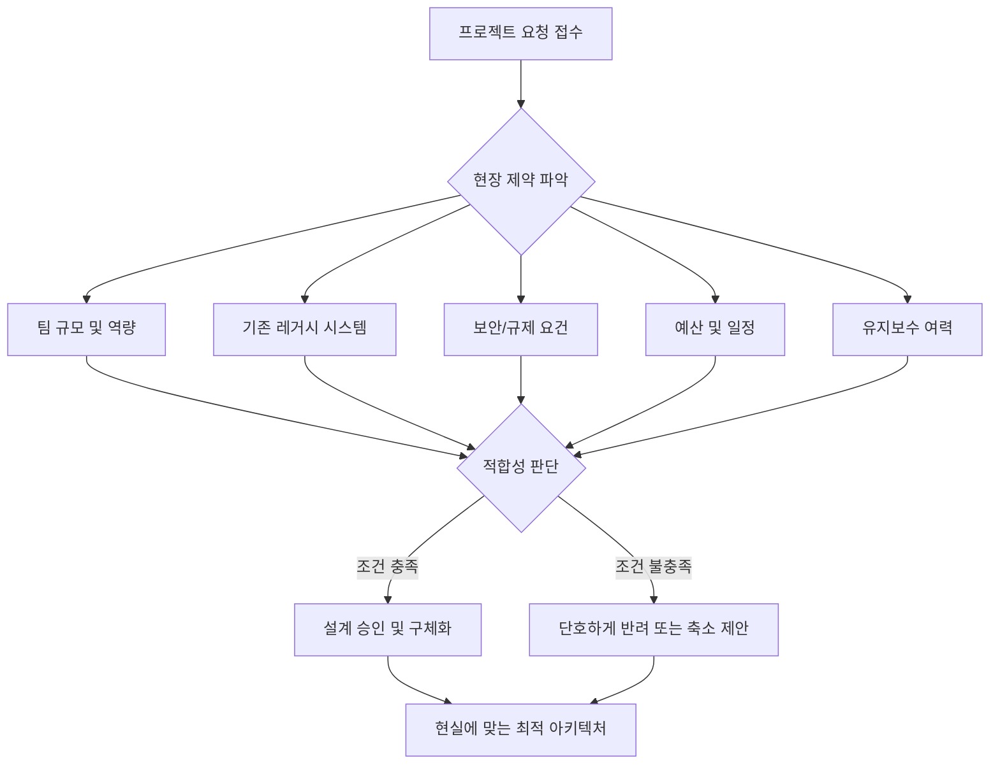
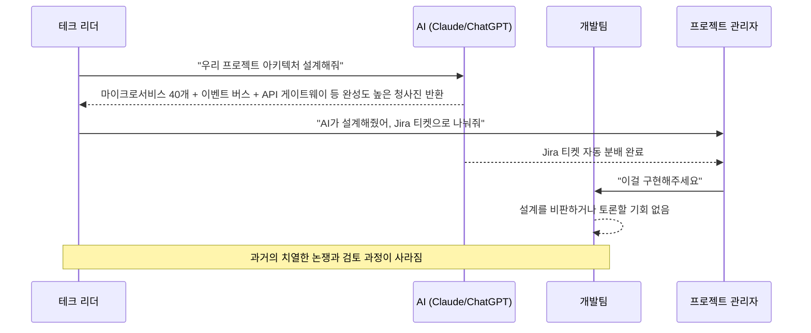
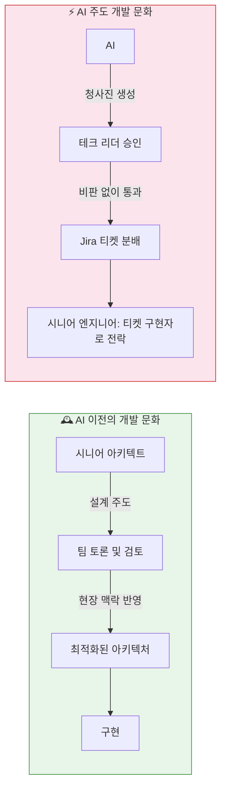
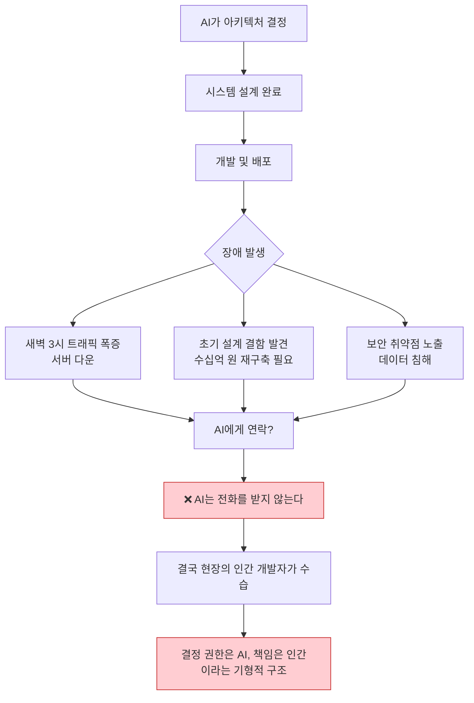
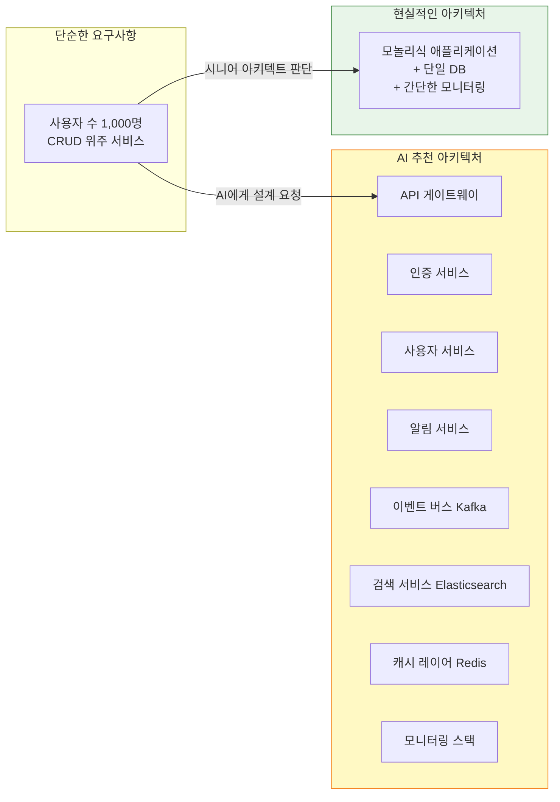
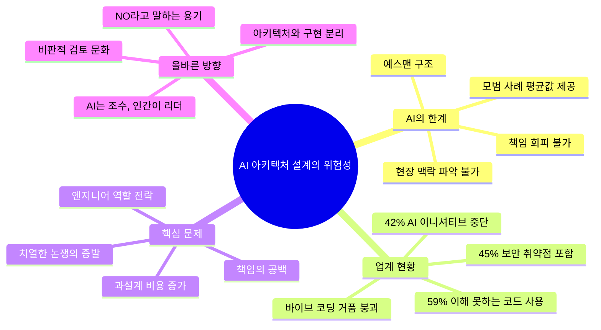

> **원문 포스트 기반 심층 분석** | [`@leveluponlyme`](https://www.threads.com/@leveluponlyme/post/DYzm3NblPGA) (Threads) | 2025년

---

## 목차

1. [들어가며 — 지금 무슨 일이 벌어지고 있는가](#1-들어가며)
2. [현상의 본질 — AI는 왜 무조건 "예스"를 외치는가](#2-현상의-본질)
3. [진짜 아키텍트와 AI의 결정적 차이](#3-진짜-아키텍트와-ai의-차이)
4. [달콤한 독사과 — 효율성이라는 함정](#4-달콤한-독사과)
5. [엔지니어 가치의 붕괴](#5-엔지니어-가치의-붕괴)
6. [책임의 공백 — 가장 큰 시한폭탄](#6-책임의-공백)
7. [실제 사례 분석 — 과설계(Over-Engineering)의 민낯](#7-실제-사례-분석)
8. [업계가 보내는 경고 신호들](#8-업계가-보내는-경고-신호들)
9. [AI를 올바르게 사용하는 법 — 조수와 리더의 경계](#9-ai를-올바르게-사용하는-법)
10. [결론 — "아니오"라고 말할 수 있는 용기](#10-결론)

---

## 1. 들어가며

2025년을 전후로 소프트웨어 개발 현장에는 하나의 거대한 흐름이 자리를 잡았다. 개발자, 테크 리더, 심지어 비개발 직군의 창업자들까지 ChatGPT나 Claude 같은 대형 언어 모델(LLM)에게 시스템 아키텍처 설계를 맡기는 것이 일상화된 것이다. 마이크로서비스(Microservices), 이벤트 기반 아키텍처(Event-driven Architecture), CQRS, API 게이트웨이 패턴 등 고급 기술 용어를 자유자재로 구사하며 수십 개의 컴포넌트로 구성된 청사진을 순식간에 그려내는 AI의 능력은, 보는 사람으로 하여금 마치 10년 경력의 시니어 아키텍트가 며칠 밤을 새워 고민한 결과물을 받아든 것 같은 착각을 불러일으킨다.

`@leveluponlyme` 계정이 Threads에 올린 이 포스트는 바로 그 착각의 위험성을 정면으로 꼬집는다. 유려하고 전문적으로 보이는 AI의 설계 결과물에는 **치명적인 구조적 결함**이 숨어 있으며, 그것이 산업 전반에 걸쳐 조용하지만 파국적인 영향을 미치고 있다는 것이다.

이 글에서는 해당 포스트의 논지를 중심으로, 업계의 실제 사례와 최신 연구 결과를 바탕으로 AI 주도 아키텍처 설계의 명암을 상세히 짚어본다.

---

## 2. 현상의 본질

### AI는 왜 무조건 "예스"를 외치는가

AI가 아키텍처 설계에서 "예스맨"처럼 행동하는 이유는 그 학습 방식에서 기인한다. 대형 언어 모델은 인터넷에 공개된 방대한 기술 문서, 블로그 포스트, 공식 문서, 사례 연구를 학습한다. 이 과정에서 AI는 **"모범 사례(Best Practice)의 평균값"** 을 내면화하게 된다.

문제는 이 평균값이 항상 특정 상황에 맞는 정답이 아니라는 점이다. 넷플릭스나 우버처럼 수억 명의 사용자를 처리하는 기업이 채택한 마이크로서비스 아키텍처는, 사용자가 수백 명인 초기 스타트업에는 오히려 독이 될 수 있다. 그러나 AI는 사용자가 아무리 작은 규모의 프로젝트를 설명해도 "이상적인 시스템"의 형태로 응답하도록 훈련되어 있다.

```
사용자의 요청: "쇼핑몰 시스템을 만들어줘"
AI의 내면 처리: 쇼핑몰 → 확장 가능한 구조 → 마이크로서비스 권장 → 이벤트 큐 추가 → API 게이트웨이 필요 → ...
실제 상황: 팀원 3명, MVP 출시 목표, 예산 제한
```

AI는 사용자가 던진 질문에 담긴 **현장 맥락(Context)** 을 스스로 묻지 않는다. 팀의 규모가 몇 명인지, 기술 부채가 얼마나 쌓여있는지, 보안 규제가 어떤 수준인지, 예산이 얼마인지를 묻지 않고 그저 "인터넷에서 가장 많이 칭찬받은 구조"를 제시한다. 이것이 포스트에서 지적한 "모범 사례의 평균값을 정답인 양 던져버린다"는 핵심 문제다.

---

## 3. 진짜 아키텍트와 AI의 차이

포스트는 진짜 실력 있는 아키텍트의 가장 중요한 덕목으로 **"아니오라고 말할 수 있는 능력"** 을 꼽는다. 이는 단순한 거절이 아니라, 현장의 제약 조건을 깊이 이해하고 있기 때문에 나오는 전문가적 판단이다.



### 3.1 경험에서 나오는 "현실 감각"

10년 이상 현장에서 일한 아키텍트는 다음과 같은 것들을 몸으로 안다.

- **레거시 시스템의 무게**: 오래된 코드베이스를 마이크로서비스로 전환하는 작업이 이론처럼 깔끔하게 이루어지지 않는다는 것. 수년간 쌓인 복잡하게 얽힌 의존성(Dependency)은 분리 과정에서 예상치 못한 버그와 장애를 연쇄적으로 유발한다.
- **팀의 실제 역량**: 문서상 Java 개발자 5명이 있다 해도, 이벤트 스트리밍 플랫폼인 Kafka를 운영해본 사람이 한 명도 없다면 Kafka 기반 이벤트 아키텍처는 재앙이 된다.
- **보안 및 컴플라이언스의 복잡성**: 금융, 의료, 공공 분야는 데이터 저장 위치, 암호화 방식, 감사(Audit) 로그 등에 대해 매우 엄격한 규제가 있으며, 이것이 아키텍처 선택지를 크게 제한한다.
- **시간과 비용의 현실**: 이상적인 설계가 있더라도, 구현하는 데 걸리는 시간이 비즈니스 기회를 놓치게 만든다면 그 설계는 틀린 것이다.

### 3.2 AI가 모르는 것들

반면 AI는 이 모든 현장의 "지루하고 특수한 제약들"을 스스로 파악하지 못한다. AI는 사용자가 명시적으로 알려주지 않는 한, 다음과 같은 정보를 가지고 있지 않다.

| 실제 현장 제약 | AI가 기본적으로 아는 것 |
|---|---|
| 팀원 3명, 모두 주니어 | ❌ 모름 |
| 사내 Oracle DB 라이선스 구조 | ❌ 모름 |
| 개인정보보호법 특수 조항 적용 | ❌ 모름 |
| 6개월 내 런웨이(Runway) 소진 | ❌ 모름 |
| 기존 모놀리식 시스템 10만 줄 | ❌ 모름 |
| 마이크로서비스 best practice | ✅ 풍부하게 알고 있음 |

이 표가 보여주는 것처럼, AI는 "일반론적으로 좋은 것"은 매우 잘 알고 있지만, "이 특수한 상황에서 좋은 것"을 판단하는 데 필요한 현장 정보를 기본값으로 갖고 있지 않다.

---

## 4. 달콤한 독사과

### 왜 똑똑한 개발자들도 빠져드는가

포스트는 개발자들이 AI 설계를 무비판적으로 수용하게 만드는 원인으로 "달콤한 효율성"을 지목한다. 이 현상은 2025년 업계를 강타한 **"바이브 코딩(Vibe Coding)"** 트렌드와 맞닿아 있다.

2025년 초, 전 Tesla AI 디렉터이자 OpenAI 창립 멤버인 안드레이 카르파티(Andrej Karpathy)가 "가장 핫한 새 프로그래밍 언어는 영어"라고 표현하며 자연어로 소프트웨어를 만드는 흐름을 설명했고, 이 개념은 순식간에 전 업계로 퍼졌다. 실제로 2026년 초 기준 미국 개발자의 약 92%가 어떤 형태로든 AI 코딩 도구를 일상적으로 사용하고 있다는 조사 결과도 있다.



이 흐름이 매력적인 이유는 두 가지다.

**첫 번째: 속도의 유혹.** AI는 몇 분 만에 수십 페이지 분량의 설계 문서를 만들어낸다. 과거에는 시니어 개발자 여럿이 화이트보드 앞에서 며칠을 씨름해야 나올 결과물이다.

**두 번째: 권위의 착각.** 전문 용어가 가득하고 논리적으로 정연하게 구성된 AI의 출력물은, 바쁜 테크 리더들에게 "전문가가 만든 완성품"처럼 보인다. 그 결과 비판적 검토 없이 승인이 이루어진다.

포스트는 이 과정에서 발생하는 가장 큰 부작용으로 **"치열한 논쟁의 증발"** 을 지적한다. 과거 개발자 셋이 모여 최적의 답을 찾기 위해 피터지게 싸우던 과정은, 그 자체로 설계를 단단하게 만드는 중요한 검증 과정이었다. AI가 그 자리를 대신하면서 논쟁도, 검증도, 책임 의식도 함께 증발해버렸다.

---

## 5. 엔지니어 가치의 붕괴

### 전문가가 단순 구현자로 전락하는 과정

포스트에서 가장 날카롭게 비판하는 부분이 바로 이 지점이다. AI 주도 아키텍처 문화가 만들어내는 기형적인 역할 분배를 도식화하면 다음과 같다.



이 구조의 문제는 두 역할의 **가치와 권한이 완전히 역전**되었다는 것이다.

- **현장 맥락을 가장 잘 아는 사람**(수년간 그 도메인을 파고든 시니어 엔지니어)이 가장 단순한 작업(티켓 구현)을 하고 있다.
- **현장 맥락을 전혀 모르는 존재**(AI)가 가장 중요한 결정(시스템의 뼈대)을 내리고 있다.

2025년 6월 클러치(Clutch)가 실시한 800명의 소프트웨어 전문가 대상 설문에서 **59%의 개발자가 자신이 완전히 이해하지 못하는 AI 생성 코드를 사용하고 있다**고 응답한 것은, 이 역할 역전이 이미 광범위하게 진행 중임을 보여준다.

### 5.1 "드-스킬링(De-skilling)"의 위험

AI 의존도가 높아질수록 엔지니어들은 스스로 생각하고 설계하는 능력을 점점 사용하지 않게 된다. 이는 단순한 개인의 문제가 아니라 **조직의 집단 지성이 소멸**하는 과정이기도 하다.

전문가들은 이것을 "자동화에 대한 과의존이 비판적 사고를 약화시키고, 의사결정을 AI에 맡기는 과정에서 상당한 기술 격차(Skill Gap)가 발생한다"고 경고한다. 더 나아가 이 과정은 조직이 보유한 제도적 지식(Institutional Knowledge), 즉 수년에 걸쳐 누적된 도메인 전문성을 서서히 소멸시킨다.

---

## 6. 책임의 공백

### 가장 큰 시한폭탄

포스트는 AI 주도 아키텍처 문화의 가장 위험한 부작용으로 **"책임의 공백(Accountability Gap)"** 을 지목한다.



이 구조의 핵심 모순은 다음과 같다.

- **결정 권한**: AI가 가져감
- **수습과 책임**: 인간 개발자가 짊어짐

이것이 왜 시한폭탄인지를 업계 전문가들은 다음과 같이 설명한다.

> 모든 AI 관련 의사결정에는 그에 상응하는 책임 소재가 명확히 지정되어야 한다. 책임이 없는 시스템에는 반드시 거버넌스의 맹점(Blind Spot)이 형성된다. "아무도 그것을 소유하지 않는다"면 이미 책임 테스트에서 실패한 것이다.

또한 리스크는 공급망 하단의 인간에게 전가된다는 점도 지적된다. AI가 설계한 시스템에 문제가 생겼을 때, 그 법적·재정적 책임은 결국 그 시스템을 사용하고 유지보수하는 개발팀과 조직에 귀착된다.

---

## 7. 실제 사례 분석

### 과설계(Over-Engineering)의 민낯

포스트는 한 스타트업의 사례를 예시로 든다. 2주면 충분한 프로젝트가 AI 추천 아키텍처 때문에 2개월로 늘어나고, 단순 DB 하나면 될 것을 4개의 관리형 서비스로 구성하는 바람에 매달 수백만 원의 클라우드 비용이 추가 발생했다는 것이다.

이것은 단순한 일화가 아니다. 업계 전반에서 같은 패턴이 반복되고 있다.

### 7.1 바이브 코딩 거품의 붕괴

2025년 한 해 동안 소셜 미디어를 달군 "바이브 코딩" 열풍은, 그 이면의 어두운 이야기를 함께 만들어냈다.

Groove의 창업자 알렉스 턴불(Alex Turnbull)은 두 개의 AI 고객경험(CX) 플랫폼을 1년간 구축한 경험을 바탕으로 다음과 같이 말했다.

> "바이브 코딩은 우리를 거기까지 데려다주지 못했다. 오직 진짜 엔지니어링만이 가능했다."

그가 관찰한 패턴은 항상 동일했다: **초기의 열정 → 빠른 프로토타입 → 통합, 보안, 확장, 거버넌스 요건에 직면 → 급격한 하락**.

2025년에는 기업들이 추진한 AI 이니셔티브 중 무려 **42%가 중단**되었다. 이는 2024년에 비해 두 배 이상 증가한 수치다. AI가 만들어낸 "좋아 보이는 설계"가 실제 운영 환경에서 얼마나 취약한지를 보여주는 통계이기도 하다.

### 7.2 과설계가 만드는 비용 구조



AI가 추천한 구조는 각 서비스별로 별도의 서버 인스턴스, 별도의 CI/CD 파이프라인, 별도의 모니터링 설정이 필요하다. 3명짜리 팀이 이 모든 것을 구축하고 유지하는 것은 불가능에 가깝다. AI 모델은 최적화된 쿼리보다 작동하는 코드를 우선시하는 경향이 있어, 최적화되지 않은 DB 쿼리, 불필요한 API 호출, 메모리를 많이 소비하는 데이터 처리 루프를 빈번하게 생성한다. 이는 규모가 커질수록 훨씬 더 큰 서버 인스턴스와 높은 DB 등급을 요구하며, 월별 클라우드 비용을 급격히 끌어올린다.

---

## 8. 업계가 보내는 경고 신호들

### 수치로 본 AI 주도 개발의 그늘

단순한 우려가 아닌, 업계의 구체적인 데이터들이 이미 경고를 보내고 있다.

| 지표 | 수치 | 출처 |
|---|---|---|
| AI 생성 코드 사용 개발자 중 이해 못하는 비율 | **59%** | Clutch, 2025년 6월 |
| AI 이니셔티브 중단 비율 (2025) | **42%** | Tech Startups, 2025 |
| AI 파일럿 단계 이후 스케일 실패율 | **70~90%** | RAND 연구 |
| AI 투자 대비 의미 있는 ROI 미달성 기업 비율 | **95%** | MIT 연구 |
| AI 생성 코드 내 보안 취약점 포함 비율 | **45%** | 2026년 독립 벤치마크 |

이 수치들이 말해주는 것은 명확하다. AI를 통한 개발 생산성 향상은 분명 실재하지만, AI가 생성한 결과물을 비판적으로 검토하고 현실에 맞게 조정하는 **인간의 역할이 제거될 때**, 그 결과는 대부분 실패로 귀결된다는 것이다.

### 8.1 MIT와 McKinsey가 주목하는 구조적 문제

MIT의 연구에 따르면 생성 AI 파일럿 프로젝트의 95%가 약속된 가치를 제공하지 못하고 있다. McKinsey는 막대한 투자에도 불구하고 99%의 기업이 AI 성숙도에 도달하지 못했다고 분석한다. 두 기관이 공통적으로 지목하는 원인은 **모델 자체의 문제가 아니라 인프라와 거버넌스의 부재**다. 이는 결국 "어떤 AI를 쓰느냐"가 아닌 "AI를 어떻게 조직의 의사결정 구조 안에 통합하느냐"의 문제임을 뜻한다.

---

## 9. AI를 올바르게 사용하는 법

### 조수와 리더의 경계를 분명히

포스트는 AI를 버려야 한다고 주장하지 않는다. AI는 분명히 강력하고 유용한 도구다. 핵심은 **AI를 "조수(Assistant)"로 사용하는 것과 "리더(Leader)"로 사용하는 것의 차이**를 명확히 하는 것이다.

```mermaid
flowchart TD
    subgraph good["✅ AI를 조수로 사용하는 방법"]
        H1[인간이 아키텍처의 뼈대를 결정]
        H1 --> H2[제약 조건 명시: 팀 규모, 예산, 레거시, 규제]
        H2 --> H3[AI에게 특정 컴포넌트 구현 요청]
        H3 --> H4[AI 결과물 비판적 검토]
        H4 --> H5[인간이 최종 판단 및 책임]
    end

    subgraph bad["❌ AI를 리더로 사용하는 방법"]
        W1[아무 맥락 없이 전체 설계 일임]
        W1 --> W2[AI 결과물 검토 없이 승인]
        W2 --> W3[팀원에게 Jira 티켓으로 분배]
        W3 --> W4[비판과 논쟁 없이 구현]
        W4 --> W5[책임 공백 발생]
    end

    style good fill:#e8f5e9,stroke:#2e7d32
    style bad fill:#fce4ec,stroke:#c62828
```




### 9.1 아키텍처와 구현의 분리

전문가들이 권장하는 접근 방식은 **아키텍처 결정과 구현 작업을 명확히 분리**하는 것이다.

- **인간 엔지니어가 결정해야 할 것**: 데이터 스키마, 시스템 경계, 성능 제약, 보안 요건, 서비스 간 의존성
- **AI에게 맡겨도 되는 것**: 결정된 경계 내에서 특정 기능 구현, 보일러플레이트 코드 작성, 테스트 케이스 생성, 문서 초안 작성

### 9.2 비판적 검토 문화 정착

AI 도구를 도입한 팀이 반드시 갖춰야 할 것은 **AI 결과물을 비판적으로 평가하는 문화**다. 이는 다음과 같은 질문들을 습관화하는 것에서 시작한다.

- 이 아키텍처는 우리 팀의 실제 규모와 역량에 적합한가?
- 각 컴포넌트를 유지보수할 수 있는 사람이 팀 내에 있는가?
- 이 설계를 도입했을 때 월간 운영 비용은 얼마나 증가하는가?
- 3년 후 이 코드를 처음 보는 개발자가 이해할 수 있는가?
- 장애가 발생했을 때 누가 어떤 역할로 대응하는가?

InfoQ의 2025년 소프트웨어 아키텍처 트렌드 리포트 역시 이 점을 명시하고 있다. AI 지원 개발 도구를 사용할 때는 **효율성을 높이되 품질을 낮추지 않도록** 아키텍트가 반드시 감독 역할을 수행해야 한다고 강조한다.

---

## 10. 결론

### "아니오"라고 말할 수 있는 용기

포스트가 전하는 최종 메시지는 단순하지만 강력하다.

> AI 시대에 진짜 생존하는 무기는 기계의 답안지에 당당하게 "아니오"라고 말할 수 있는 용기다.

이것은 AI에 대한 반감이 아니다. AI는 우리가 이미 결정한 설계를 더 빠르게 구현하도록 돕는 훌륭한 조수다. 그러나 그 조수가 리더의 자리를 빼앗는 순간, 팀은 현장 맥락이 없는 기계가 내린 결정을 현장 맥락을 가진 인간이 수습해야 하는 기형적인 구조 속으로 빠져든다.

오늘의 개발 현장에서 가장 가치 있는 엔지니어는 AI를 가장 잘 쓰는 사람이 아니라, **AI가 내린 결론을 현실의 제약에 비추어 판단하고, 필요할 때 단호하게 거부할 수 있는 사람**이다.

치열한 고민과 땀방울이 담기지 않은 시스템은 결국 무너진다. AI가 그려준 화려한 청사진은 그 고민의 시작점이 될 수는 있어도, 그 고민 자체를 대신해줄 수는 없다.

---

## 핵심 요약



---

> **참고 자료**
> - Clutch Survey of 800 Software Professionals, June 2025
> - Tech Startups: "The Vibe Coding Delusion", December 2025
> - InfoQ Software Architecture and Design Trends Report, 2025
> - MIT Research on Generative AI Pilot Failure Rates, 2025
> - RAND: AI Project Scaling Study, 2025
> - APCO Worldwide: "The Dark Side of AI", 2026
> - BraivIQ: "Beyond Vibe Coding", April 2026
> - Ravoid: "Vibe Coding Technical Debt", 2026

---

*본 문서는 `@leveluponlyme`의 Threads 포스트를 바탕으로, 업계의 최신 연구 및 사례를 종합하여 작성되었습니다.*
