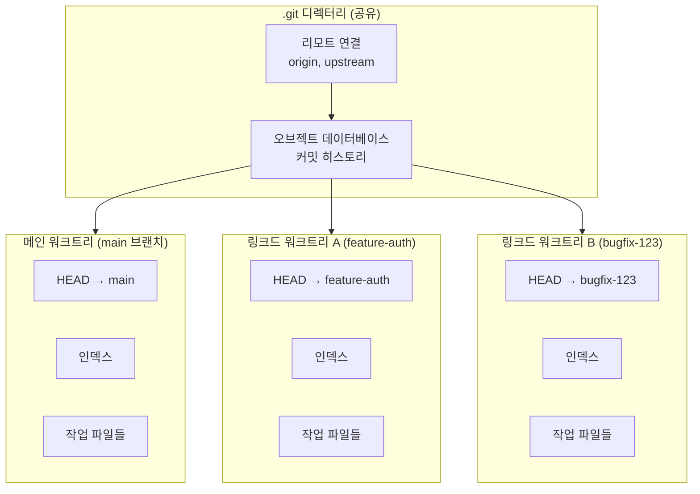
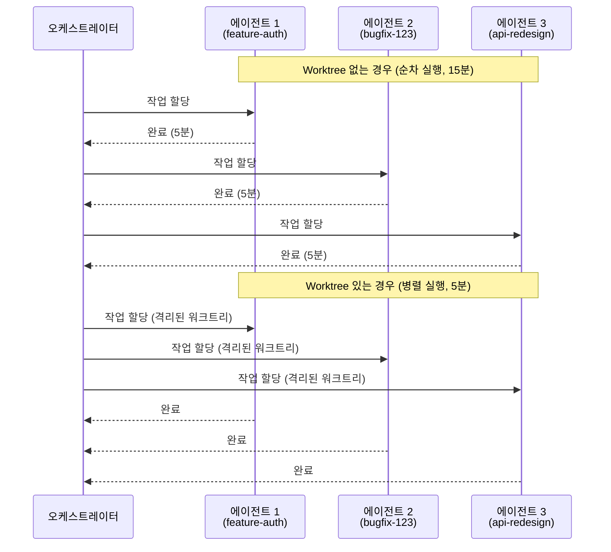
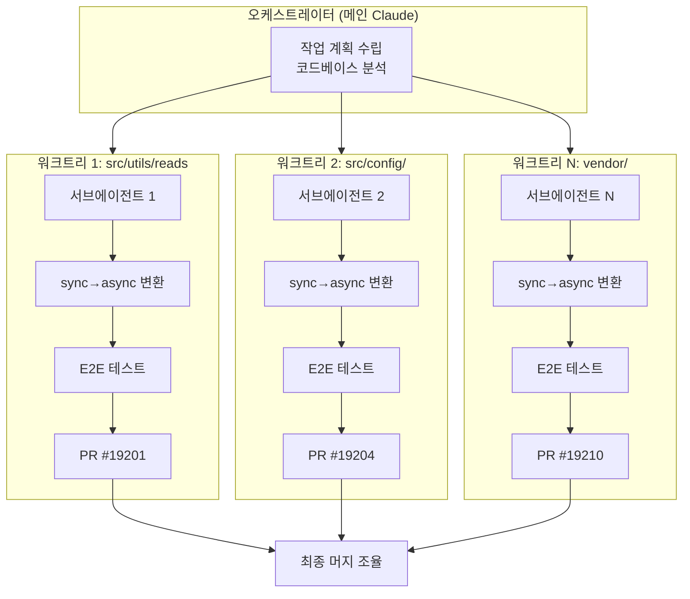
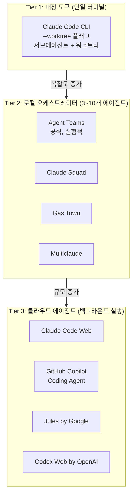

> **출처**: Boris Cherny(@bcherny) X/Threads 게시물, [aicoffeechat](https://www.threads.com/@aicoffeechat/post/DVANmxQEnKN/) Threads 해설, softdaddy_o / yozum.vibe / passionplus_ai / ai_digitalbrian Threads 커뮤니티  
> **핵심 버전**: Claude Code v2.1.49 (2026-02-19) / v2.1.50 (2026-02-20)  
> **분석 작성일**: 2026-05-27

---

## 목차

1. [배경: 왜 지금 이 발표가 중요한가](#1-배경-왜-지금-이-발표가-중요한가)
2. [Git Worktree란 무엇인가](#2-git-worktree란-무엇인가)
3. [AI 코딩 에이전트 시대에 Worktree가 필수인 이유](#3-ai-코딩-에이전트-시대에-worktree가-필수인-이유)
4. [Claude Code v2.1.50의 5가지 핵심 변화](#4-claude-code-v2150의-5가지-핵심-변화)
5. [실전 활용 시나리오](#5-실전-활용-시나리오)
6. [Hooks 시스템: 워크트리 생명주기 자동화](#6-hooks-시스템-워크트리-생명주기-자동화)
7. [커뮤니티가 발견한 추가 가능성들](#7-커뮤니티가-발견한-추가-가능성들)
8. [Claude Code Workflows: 차세대 오케스트레이션](#8-claude-code-workflows-차세대-오케스트레이션)
9. [CodeGraph: 토큰 소비를 근본적으로 줄이는 지식 그래프](#9-codegraph-토큰-소비를-근본적으로-줄이는-지식-그래프)
10. [더 넓은 생태계: 멀티에이전트 오케스트레이션의 현재](#10-더-넓은-생태계-멀티에이전트-오케스트레이션의-현재)
11. [개발자 일하는 방식의 변화](#11-개발자-일하는-방식의-변화)
12. [정리 및 전망](#12-정리-및-전망)

---

## 1. 배경: 왜 지금 이 발표가 중요한가

2026년 2월 20일, Anthropic의 Claude Code 프로덕트 리드인 Boris Cherny는 X(구 트위터)를 통해 한 줄의 명령어를 공개했다.

```
$ claude --worktree
```

이 짧은 명령어는 단순한 기능 추가가 아니라, AI 보조 개발이 '단일 에이전트, 순차적 실행'에서 '멀티에이전트, 병렬 실행'으로 전환되는 변곡점을 상징한다. 발표 직후 해당 게시물은 빠르게 42,400회 이상의 조회수를 기록하며 개발자 커뮤니티에서 광범위한 토론을 촉발했다.

중요한 점은 이 업데이트가 단 하나의 기능을 추가한 것이 아니라는 사실이다. v2.1.49(2026년 2월 19일)와 v2.1.50(2026년 2월 20일) 두 릴리스에 걸쳐, 에이전트 격리(agent isolation)라는 단일 개념을 중심으로 다섯 가지 변화가 동시에 이루어졌다. 이 변화들의 공통 목표는 명확하다. **격리된 병렬 실행을 AI 코딩의 표준 인프라로 만드는 것.**

---

## 2. Git Worktree란 무엇인가

Git worktree는 새로운 기능이 아니다. 2015년 Git 2.5 버전부터 존재해온, 10년이 넘은 기능이다. 그러나 AI 에이전트 시대가 도래하면서 갑자기 주목받기 시작했다.

### 개념 이해: 주방 비유

Git worktree의 개념은 주방에 비유하면 직관적으로 이해된다.

| 개념 | 주방 비유 | Git 용어 |
|------|----------|----------|
| 저장소(Repository) | 주방 전체 | `.git` 디렉터리 |
| 메인 워크트리 | 메인 작업대 | `git clone`으로 만든 최초 디렉터리 |
| 링크드 워크트리 | 추가 작업대 | `git worktree add`로 만든 디렉터리 |
| 공유 자원 | 냉장고, 식재료 창고 | 커밋 히스토리, 오브젝트 DB, 리모트 |
| 개별 자원 | 도마, 칼, 현재 조리 중인 재료 | HEAD, 인덱스, 작업 파일 |

주방에서 메인 작업대가 하나라면, 한 번에 한 요리사만 작업할 수 있다. 추가 작업대를 놓으면 여러 요리사가 동시에, 각자의 재료를 가지고, 서로 방해 없이 작업할 수 있다. Git worktree가 정확히 이 역할을 한다.

### 기술적 작동 원리



하나의 `.git` 디렉터리에서 여러 작업 디렉터리가 파생된다. 각 디렉터리는 서로 다른 브랜치를 체크아웃하고, 각자의 HEAD와 인덱스를 가진다. 하지만 커밋 히스토리, 리모트 연결, 오브젝트 데이터베이스는 모두 공유한다. 이것이 `git clone`을 여러 번 하는 것과 결정적으로 다른 점이다. 클론은 완전히 분리된 저장소를 만들지만, worktree는 동일한 저장소에서 독립된 작업 공간만 파생시킨다.

---

## 3. AI 코딩 에이전트 시대에 Worktree가 필수인 이유

전통적인 개발 환경에서 Git worktree는 "있으면 좋은" 기능이었다. 하지만 여러 AI 에이전트가 동시에 하나의 코드베이스를 수정하기 시작하면서, worktree는 선택이 아닌 필수 인프라가 되었다.

### 세 가지 근본 문제

**첫째, 파일 충돌(File Conflict)**

에이전트 A가 `auth.ts`를 수정하는 동안 에이전트 B도 같은 파일을 건드리면, 한쪽의 변경사항이 덮어씌워진다. 더 심각한 것은 두 에이전트 모두 자신의 수정이 올바르다고 "확신"한다는 점이다. 에이전트는 다른 에이전트의 존재를 인식하지 못하기 때문에, 결과물은 조용히 망가진다.

**둘째, 컨텍스트 오염(Context Contamination)**

AI 에이전트의 가장 큰 자산은 코드베이스에 대한 깊은 이해, 즉 컨텍스트다. 에이전트가 "이 파일 구조는 이렇고, 이 함수는 저기서 호출되고"라는 맥락을 쌓아놓은 상태에서, 다른 에이전트가 브랜치를 전환해버리면 그 컨텍스트가 한순간에 무효화된다. 에이전트는 잘못된 현실 인식을 바탕으로 작업을 계속 진행하게 된다.

**셋째, 순차 실행의 병목(Sequential Bottleneck)**

에이전트 하나가 5분짜리 작업을 3개 순서대로 처리하면 15분이 걸린다. 하지만 3개를 병렬로 돌리면 5분이면 끝난다. 이 차이는 작업이 복잡해질수록, 에이전트 수가 늘어날수록 기하급수적으로 벌어진다.



---

## 4. Claude Code v2.1.50의 5가지 핵심 변화

이번 업데이트는 다섯 가지 변화를 한꺼번에 가져왔다. 각각의 변화가 서로 다른 사용자 계층과 사용 시나리오를 정확하게 겨냥하고 있다.

| # | 변화 | 대상 | 핵심 |
|---|------|------|------|
| 1 | `--worktree` 플래그 | CLI 사용자 | 한 줄로 격리된 에이전트 실행 |
| 2 | 워크트리 모드 | Desktop 앱 사용자 | 체크박스로 활성화 |
| 3 | 서브에이전트 워크트리 | 병렬 작업 | 하위 에이전트도 격리 |
| 4 | `isolation: worktree` | 커스텀 에이전트 | 선언적 격리 정책 |
| 5 | 비Git SCM 지원 | Mercurial, Perforce, SVN | 워크트리 훅으로 격리 |

### 변화 1: `claude --worktree` — CLI에서 즉시 격리

이전까지 개발자들이 Claude Code와 git worktree를 함께 사용하려면 꽤 번거로운 과정을 거쳐야 했다. 터미널에서 직접 `git worktree add`를 실행하고, 해당 디렉터리로 이동한 뒤, 거기서 Claude를 시작하는 식이었다. 실제로 incident.io의 엔지니어링 팀은 이 마찰을 해결하기 위해 자체 bash 함수까지 만들었을 정도였다.

이번 업데이트는 이 모든 수작업을 `--worktree` 플래그 하나로 대체한다.

```bash
# 워크트리 이름을 지정해서 시작
claude -w feature-auth
# → .claude/worktrees/feature-auth/ 디렉터리에 새 브랜치가 생성됨

# 다른 터미널에서 별도의 워크트리로 또 다른 세션 시작
claude -w bugfix-123

# 이름을 생략하면 Claude가 자동으로 이름을 생성
claude -w
```

워크트리는 `<repo>/.claude/worktrees/<name>` 경로에 생성되고, 기본 리모트 브랜치에서 분기한다. 세션 도중에 자연어로 "워크트리에서 작업해줘(work in a worktree)"라고 요청해도 자동으로 워크트리가 만들어진다.

세션이 끝나면 정리도 자동화되어 있다. 변경사항이 없으면 워크트리와 브랜치가 자동으로 삭제된다. 커밋이나 수정 내역이 있으면 Claude가 유지할지 삭제할지를 사용자에게 물어본다. 유지하기로 선택하면 나중에 돌아와서 이어서 작업할 수 있다.

`--tmux` 플래그를 추가하면 Claude가 자체 Tmux 세션에서 실행되어, 여러 워크트리를 하나의 터미널에서 관리하기가 한결 편해진다.

### 변화 2: Desktop 앱의 워크트리 모드

터미널이 익숙하지 않은 개발자를 위해 Claude Desktop 앱의 Code 탭에서도 "worktree mode" 체크박스가 제공된다. 체크 하나로 CLI와 동일한 격리 효과를 GUI 환경에서 누릴 수 있다. 별도의 설정이나 명령어 없이 활성화된다는 점이 핵심이다.

CLI든 Desktop이든, "에이전트를 격리된 환경에서 돌린다"는 경험이 동일하게 제공되는 셈이다.

### 변화 3: 서브에이전트의 워크트리 격리

이번 업데이트에서 실질적으로 가장 강력한 변화다. 서브에이전트는 Claude Code 안에서 특정 작업을 전담하는 하위 에이전트다. 코드 리뷰어, API 설계자, 테스트 작성자 같은 전문가 역할을 맡기는 용도로 사용된다.

Claude Code는 최대 10개의 태스크를 동시에 병렬 처리할 수 있는데, 이제 이 서브에이전트들이 각각 자기만의 워크트리에서 작업할 수 있게 되었다. Boris Cherny는 이 기능이 "대규모 배치 변경과 코드 마이그레이션에서 특히 강력하다"고 강조했다.

사용법은 단순하다. Claude에게 자연어로 "에이전트들한테 워크트리를 써서 작업시켜줘(use worktrees for its agents)"라고 요청하면 된다. CLI, Desktop 앱, IDE 확장, 웹, 심지어 모바일 앱에서도 사용 가능하다.

실제 활용 예시를 보면 그 위력이 명확해진다. 다음은 "모든 sync io를 async로 마이그레이션하고, 변경사항을 배치로 나눠 10개의 병렬 에이전트를 워크트리 격리로 실행하라"는 단 한 줄의 프롬프트로 Claude가 자동으로 생성한 결과물이다.

| # | 담당 범위 | PR |
|---|----------|-----|
| 1 | src/utils/ reads | #19201 |
| 2 | src/utils/ writes | #19202 |
| 3 | src/tools/ readdir | #19203 |
| 4 | src/config/ | #19204 |
| 5 | src/bootstrap/ | #19205 |
| 6 | src/permissions/ | #19206 |
| 7 | src/hooks/ | #19207 |
| 8 | src/services/mcp/ | #19208 |
| 9 | src/utils/git/ | #19209 |
| 10 | vendor/ | #19210 |

오케스트레이터가 코드베이스를 10개 모듈로 분류하고, 각 에이전트가 격리된 워크트리에서 담당 모듈을 수정한 뒤, 엔드투엔드 테스트를 직접 돌리고, PR까지 자동으로 올린 것이다. 이 모든 과정이 병렬로 진행된다.

주방 비유를 확장하면, 메인 셰프(오케스트레이터)가 "그릴 스테이션에서 스테이크 굽고, 소스 스테이션에서 레드와인 소스 만들고, 가르드망제에서 샐러드 준비해"라고 지시하는 상황이다. 각 스테이션(서브에이전트)은 독립적으로 작업하되, 최종 플레이팅(머지)은 메인 셰프가 조율한다.



### 변화 4: 커스텀 에이전트의 `isolation: worktree` 프론트매터

서브에이전트에게 매번 "워크트리를 써라"고 요청하는 것과, 에이전트 정의 자체에 격리 정책을 내장하는 것은 차원이 다른 이야기다. 이번 업데이트는 후자를 가능하게 한다.

`.claude/agents/` 디렉터리에 커스텀 에이전트를 정의할 때 프론트매터에 `isolation: worktree`를 추가하면, 해당 에이전트가 호출될 때마다 자동으로 격리된 워크트리에서 실행된다.

```yaml
# 파일 경로: .claude/agents/worktree-worker.md
---
name: worktree-worker
model: haiku
isolation: worktree
---

# 여기서부터 에이전트 지시사항 작성
```

이것이 왜 중요한가? 에이전트 행동이 특정 개인의 프롬프트 습관에 의존하지 않고, 팀 전체가 공유하는 코드베이스(`.claude/agents/` 디렉터리)에 정책으로 박힌다는 것이다. Git으로 버전 관리되고, PR로 리뷰되며, 팀 전체에 일관되게 적용된다. 선언적 격리 정책(declarative isolation policy)이 탄생한 것이다.

### 변화 5: 비Git SCM 지원

AI 코딩 에이전트 생태계가 거의 전적으로 Git 중심으로 돌아가는 상황에서, Anthropic은 Mercurial, Perforce, SVN 등 비Git 소스 관리 도구를 사용하는 조직까지 고려했다.

이는 현실적인 채택 장벽 문제다. "Claude Code를 도입하려면 먼저 Git으로 마이그레이션하세요"라고 하는 것과 "기존 소스 관리 도구 위에서 바로 쓰세요"라고 하는 것은 기업 입장에서 엄청난 차이가 있다. WorktreeCreate/WorktreeRemove 훅을 통해 비Git 도구에서도 유사한 격리 효과를 구현할 수 있게 되었다.

---

## 5. 실전 활용 시나리오

### 시나리오 1: 대규모 배치 변경

코드베이스 전체에 걸친 마이그레이션이나 리팩토링 작업에서, 여러 서브에이전트가 각각 다른 모듈을 동시에 수정할 수 있다. 앞서 소개한 "sync → async 마이그레이션" 예시가 바로 이 패턴이다. 과거에 며칠이 걸리던 전체 코드베이스 리팩토링이 몇 시간으로 단축된다.

### 시나리오 2: Best-of-N 비교

같은 기능을 여러 에이전트가 독립적으로 구현하게 한 뒤, 가장 좋은 결과물을 선택하는 전략이다. 아키텍처 설계나 알고리즘 구현처럼 "정답이 하나가 아닌" 문제에서 특히 빛을 발한다. 각 에이전트가 서로의 접근법을 모르는 상태에서 독립적으로 작업하기 때문에, 다양성이 보장된다.

### 시나리오 3: 역할 분리 개발

한 에이전트는 테스트를 작성하고, 다른 에이전트는 그 테스트를 통과하는 코드를 구현하는 방식이다. 테스트 작성자는 구현을 볼 수 없고, 구현자는 테스트만 받아서 작업하므로, TDD(테스트 주도 개발)의 정신을 AI 에이전트 수준에서 실현한다.

### 시나리오 4: 인터랙티브 개발과 병렬 탐색

실제 개발 현장에서 개발자가 메인 브랜치에서 작업을 계속하면서, 동시에 다른 접근 방식을 탐색하는 에이전트를 별도 워크트리에서 실행할 수 있다. 주 작업에 방해 없이 실험적 변경을 시도하고 결과를 비교하는 워크플로우가 가능해진다.

---

## 6. Hooks 시스템: 워크트리 생명주기 자동화

이번 업데이트와 함께 두 개의 새로운 훅이 추가되었다. `WorktreeCreate`와 `WorktreeRemove`다.

```json
// .claude/settings.json
{
  "hooks": {
    "WorktreeCreate": [
      { "command": "jj workspace add \"$(cat /dev/stdin | jq -r '.name')\"" }
    ],
    "WorktreeRemove": [
      { "command": "jj workspace forget \"$(cat /dev/stdin | jq -r '.worktree_path')\"" }
    ]
  }
}
```

위 예시는 Jujutsu(jj)라는 비Git 버전 관리 도구와의 연동 예시다. 워크트리가 생성될 때 자동으로 jj 워크스페이스를 추가하고, 워크트리가 제거될 때 자동으로 정리한다.

이 훅 시스템이 가진 실질적 의미는 크다. 예를 들어 Laravel Herd나 Valet처럼 특정 디렉터리 구조를 요구하는 개발 환경에서는, 워크트리가 기본 경로(`.claude/worktrees/`)에 생성되면 NGINX 설정이 맞지 않을 수 있다. WorktreeCreate 훅을 통해 워크트리 생성 시 자동으로 커스텀 디렉터리로 심볼릭 링크를 걸거나 환경을 구성하는 스크립트를 실행할 수 있다.

---

## 7. 커뮤니티가 발견한 추가 가능성들

### 3~10개 동시 실행이 실용적인 범위

개발자 커뮤니티(@softdaddy_o 등)에서는 Claude Code를 3~10개 동시에 돌리는 것이 실용적인 범위라는 경험이 공유되고 있다. ColeMedin 같은 헤비 유저는 평소에 3~10개를 동시에 돌리고, 더 많이 돌리는 경우도 있다고 언급했다. 각 에이전트가 완전히 독립된 워크트리에서 작업하기 때문에 A 기능을 구현하면서 동시에 B 기능을 테스트하고 C 버그를 수정하는 것이 현실적으로 가능해졌다.

### Spren: AI 에이전트 전용 워크스페이스

에이전트가 코드를 짜는 동안 개발자는 터미널, GitLab, Jira, Slack, 뽀모도로 앱 등 7개 이상의 앱을 전환하게 된다는 문제의식에서 출발한 도구가 등장했다. Spren은 macOS용 AI 에이전트 전용 워크스페이스로, 에이전트의 작업 현황을 실시간으로 모니터링하면서 다른 도구들과 통합하는 환경을 제공한다. 이는 멀티에이전트 워크플로우가 현실화되면서 "에이전트를 관리하는 인터페이스" 자체가 새로운 문제 영역이 되었음을 보여주는 사례다.

---

## 8. Claude Code Workflows: 차세대 오케스트레이션

공식 발표 전에 커뮤니티 분석가들이 코드를 직접 분석해서 발견한 기능이 있다. 바로 Claude Code의 [**Workflows**](https://github.com/shinpr/claude-code-workflows) 기능이다.

### 기존 방식의 한계

멀티에이전트 시스템에서 그동안은 메인 AI 에이전트가 매니저 역할을 담당했다. 즉, 어떤 서브에이전트를 언제 호출할지, 작업 순서는 어떻게 할지를 AI가 실시간으로 판단하며 조율했다. 이 방식은 유연하지만, AI의 판단에 의존하기 때문에 예측 불가능하고 재현이 어렵다는 단점이 있다.

### Workflows: 코드가 매니저를 대신한다

Workflows는 이 매니저 역할을 '코드'가 담당하게 한다. 개발자가 JavaScript 파일로 워크플로우를 정의하면, 그 파일이 에이전트 간의 조율을 직접 처리한다.

VSCode의 `.claude/workflows/` 디렉터리에서 발견된 실제 코드 구조를 보면 개념이 명확해진다.

```javascript
// .claude/workflows/triage-sentry.js
/**
 * triage-sentry — fix the Sentry issues that affect the most users.
 *
 * Pull unresolved issues, keep only those over a user-count threshold
 * (default 20), then fix and verify each one.
 * 
 * Workflow({ name: 'triage-sentry', args: { minUsers: 20 } })
 */

export const meta = {
  name: 'triage-sentry',
  description: 'Pull Sentry issues, fix the ones affecting more than a threshold of users, verify each',
  phases: [
    { title: 'Pull issues' },
    { title: 'Fix', detail: 'one agent per issue' },
    { title: 'Verify' },
  ],
}
```

이 워크플로우는 세 단계로 구성된다.

1. **Pull issues**: Sentry에서 미해결 이슈를 가져온다. 임계값(기본 20명 이상 영향받은 이슈)으로 필터링한다.
2. **Fix**: 각 이슈마다 개별 에이전트를 투입한다(one agent per issue). 각 에이전트는 독립된 워크트리에서 수정 작업을 수행한다.
3. **Verify**: 수정 결과를 검증한다.

### Workflows의 의미

AI가 매번 판단하는 것이 아니라 코드로 정의된 절차에 따라 에이전트들이 움직이기 때문에 몇 가지 중요한 특성이 생긴다.

**재현 가능성**: 같은 워크플로우를 실행하면 항상 같은 구조로 에이전트들이 움직인다. AI의 즉흥적 판단에 의존하지 않는다.

**버전 관리**: 워크플로우 자체가 `.js` 파일이므로 Git으로 버전 관리되고, PR로 리뷰되며, 팀 전체가 동일한 워크플로우를 공유한다.

**확장성**: 워크플로우 파일에서 일반 JavaScript의 if문, 조건 분기, 반복문을 사용할 수 있어 복잡한 오케스트레이션 논리를 표현할 수 있다.

이것은 "AI가 알아서 해줘"에서 "우리가 설계한 절차대로 AI가 실행해줘"로의 전환이다. AI 에이전트의 예측 가능성과 신뢰성을 높이는 중요한 방향이다.

---

## 9. CodeGraph: 토큰 소비를 근본적으로 줄이는 지식 그래프

멀티에이전트 워크플로우의 또 다른 큰 문제는 토큰 소비다. Claude Code가 코드베이스를 탐색할 때, Explore 에이전트들이 `grep`, `glob`, `Read`로 파일을 스캔하면서 모든 도구 호출마다 토큰을 소비한다. 대규모 저장소에서는 하나의 아키텍처 질문에 답하기 위해 수십 번의 파일 읽기와 서브에이전트 생성이 일어날 수 있다.

### CodeGraph의 접근법

오픈소스 프로젝트 CodeGraph(colbymchenry/codegraph)는 이 문제를 근본부터 다르게 접근한다. AI 에이전트가 탐색을 시작하기 전에 코드베이스를 **사전 인덱싱(pre-indexed)** 하여 심볼 관계, 호출 그래프, 코드 구조를 담은 지식 그래프를 만들어둔다. 에이전트는 파일을 직접 스캔하는 대신 이 그래프를 쿼리한다.

100% 로컬 아키텍처를 채택하여 코드베이스 데이터가 외부 서버로 전송되지 않는다는 점도 기업 환경에서 중요한 특성이다.

### 실측 성능 수치

v0.9.4(2026년 5월 24일 재검증) 기준으로 7개의 실제 오픈소스 코드베이스, 7개 언어를 대상으로 테스트한 결과는 다음과 같다.

| 지표 | 절감 효과 |
|------|----------|
| API 비용 | 평균 35% 절감 |
| 토큰 수 | 평균 57% 절감 |
| 응답 속도 | 평균 46% 단축 |
| 도구 호출 횟수 | 평균 71% 절감 |

대형 저장소에서는 효과가 더욱 두드러진다. 코드베이스가 클수록 기존 방식은 더 많은 파일 읽기와 서브에이전트를 생성하지만, CodeGraph를 사용하면 인덱스에서 즉시 답을 가져온다.

기술적으로는 MCP 서버 형태로 동작한다. Claude Code의 MCP 설정에 CodeGraph 서버를 등록하면, 에이전트가 코드베이스를 탐색할 때 자동으로 `codegraph_context`나 `codegraph_explore` 도구를 호출하게 된다.

---

## 10. 더 넓은 생태계: 멀티에이전트 오케스트레이션의 현재

### 2026년 멀티에이전트 계층 구조

2026년 초를 기점으로 Claude Code 기반 멀티에이전트 생태계는 세 계층으로 분화되었다.



**Tier 1**은 단일 터미널에서 Claude Code를 직접 사용하는 방식이다. `--worktree` 플래그와 서브에이전트를 조합하면 3~10개 에이전트를 관리할 수 있다. 추가 도구 설치 없이 시작할 수 있는 진입점이다.

**Tier 2**는 로컬 오케스트레이터 도구들이다. Agent Teams(Anthropic 공식, 실험적), Gas Town, Multiclaude, Claude Squad 등이 있다. Agent Teams는 한 세션이 팀 리드가 되어 공유 작업 목록으로 다른 에이전트들을 조율하는 방식이며, Claude Code v2.1.32+와 `CLAUDE_CODE_EXPERIMENTAL_AGENT_TEAMS` 플래그가 필요하다. 이 계층은 이미 알려진 코드베이스에서 3~10개 에이전트를 돌리는 데 적합하다.

**Tier 3**는 클라우드 VM에서 에이전트가 실행되는 방식이다. 작업을 할당하고 노트북을 닫으면, 에이전트가 백그라운드에서 작업을 완료하고 PR을 올린다. 로컬 설정 없이 백로그를 처리하는 데 적합하다.

### Claude Managed Agents (2026년 4월 공개 베타)

2026년 4월 8일, Anthropic은 Claude Managed Agents를 공개 베타로 출시했다. 코디네이터가 작업을 분해하여 전문 서브에이전트에게 위임하고, 서브에이전트들이 병렬로 작동하며 결과를 리더의 컨텍스트로 피드백하는 구조다. Notion, Sentry, Asana 등 실제 기업 고객들이 이를 활용한 구체적인 워크플로우를 구현했다. Sentry의 경우 버그 식별부터 PR 생성까지 완전 자율적으로 처리하는 에이전트를 구현했다.

---

## 11. 개발자 일하는 방식의 변화

### 패러다임의 전환

이번 업데이트가 가져오는 변화를 가장 명확하게 표현하면, **"AI와 페어 프로그래밍"에서 "AI 팀 관리"로의 전환**이다.

기존의 Claude Code 사용 방식은 개발자가 AI와 실시간으로 대화하며 코드를 작성하는 것이었다. 개발자가 프롬프트를 입력하고, AI가 응답하고, 개발자가 검토하고, 다시 프롬프트를 입력하는 순환이다. 이것은 본질적으로 순차적이고, 개발자의 컨텍스트 전환 비용이 크다.

워크트리 기반 멀티에이전트 패러다임에서는 개발자가 오케스트레이터 역할을 한다. 작업을 분해하고, 각 에이전트에게 위임하고, 에이전트들이 병렬로 작업하는 동안 개발자는 다른 고수준 결정을 내린다. 에이전트들이 완료되면 결과물을 검토하고 머지한다.

### 현실적 고려사항

그러나 이 패러다임이 모든 상황에 적합하지는 않다. 2026년 현재 멀티에이전트 워크플로우는 몇 가지 현실적인 제약을 가진다.

첫째, 비용 문제가 크다. 에이전트가 많을수록 토큰 소비가 폭발적으로 증가한다. 일부 개발자들은 Claude Max 계정을 여러 개 운영하거나 사용량 한도에 금세 도달하는 경험을 보고하고 있다. 이 문제는 CodeGraph 같은 도구로 완화할 수 있지만 근본적으로 해결된 것은 아니다.

둘째, 관찰 가능성(observability)이 아직 성숙하지 않았다. 어떤 에이전트가 무슨 작업을 했는지, 왜 특정 결정을 내렸는지 추적하기가 어렵다.

셋째, 서브에이전트 간 공유 상태 관리와 컨텍스트 전달이 섬세하게 설계되어야 한다. 잘못 설계하면 에이전트들이 서로 모순되는 변경을 만들어내거나, 한 에이전트가 다른 에이전트의 가정을 무너뜨리는 상황이 발생한다.

전문가들의 공통 조언은 멀티에이전트를 먼저 소규모(2~3개)로 시작하고, 초기 프롬프트에 충분한 시간을 투자하며, 각 에이전트의 권한 범위를 명확히 제한하라는 것이다.

---

## 12. 정리 및 전망

Claude Code v2.1.50의 git worktree 네이티브 지원은 단순한 편의 기능이 아니다. 이것은 AI 보조 개발의 인프라 레이어에 대한 근본적인 선언이다.

다섯 가지 변화를 종합하면 하나의 메시지로 수렴된다. **"격리된 병렬 실행을 표준으로 만들겠다."** CLI, Desktop, 서브에이전트, 커스텀 에이전트, 비Git 도구까지, 모든 접점에서 동일한 격리 철학이 일관되게 적용되었다.

git worktree 자체는 2015년부터 존재한 기능이다. 그러나 AI 에이전트가 코드베이스를 수정하는 주체가 되는 순간, 이 10년 된 도구는 필수 인프라가 되었다. 적절한 도구가 적절한 시점에 재발견된 것이다.

이후 발전 방향은 명확하다. Workflows 기능이 공식화되면 코드로 오케스트레이션을 정의하는 패턴이 표준화될 것이다. Managed Agents가 성숙하면 기업 수준에서 더 복잡한 자율 에이전트 팀이 운영될 것이다. CodeGraph 같은 효율화 도구들이 토큰 비용 문제를 완화할 것이다.

개발자 입장에서 지금 주목해야 할 핵심은 하나다. **에이전트 주변의 하네스(harness)와 인프라가, 에이전트 모델 자체만큼 중요해지고 있다는 것.** 어떤 모델을 쓰느냐만큼, 그 모델을 어떤 격리 환경에서, 어떤 워크플로우로, 어떤 효율화 도구와 함께 운영하느냐가 실질적인 생산성을 결정한다.

---

*태그: `claude-code`, `git-worktree`, `multi-agent`, `parallel-execution`, `agentic-ai`, `workflow`, `codegraph`, `ai-coding`*

*작성일: 2026-05-27*
