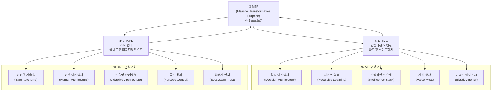
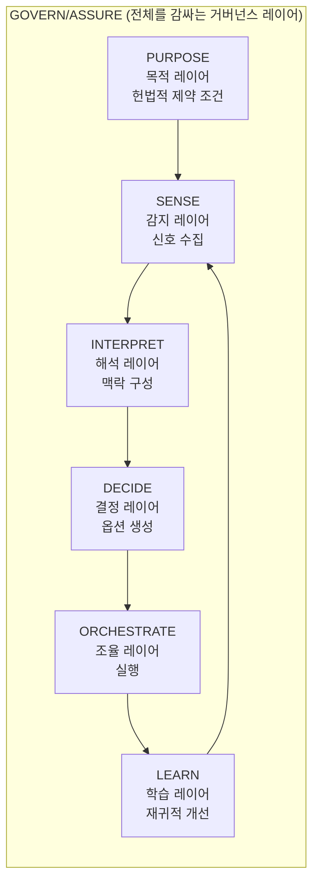
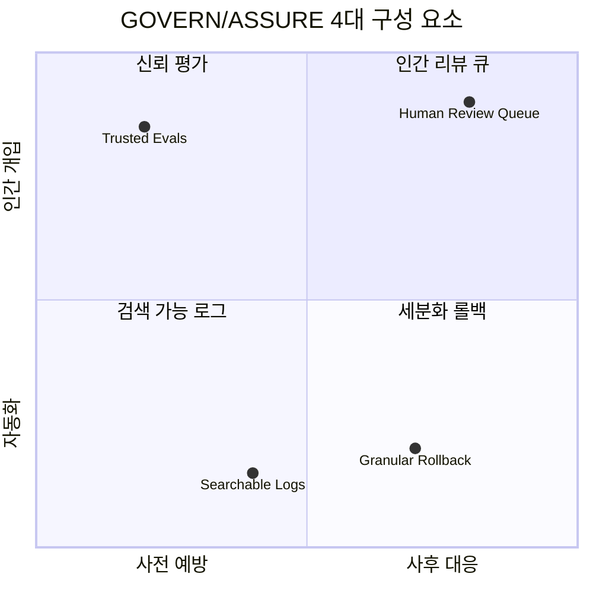
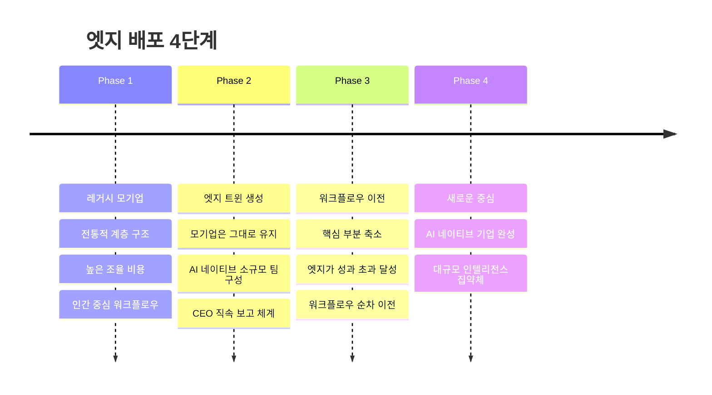
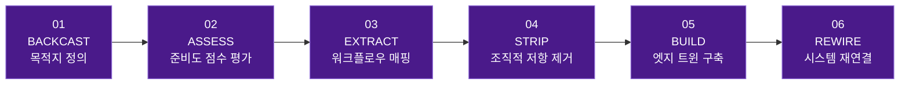
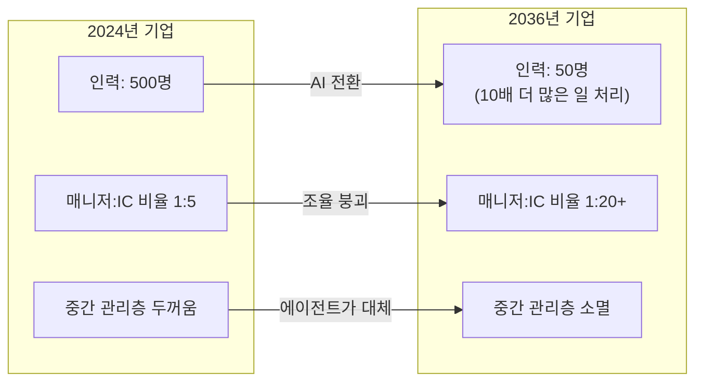
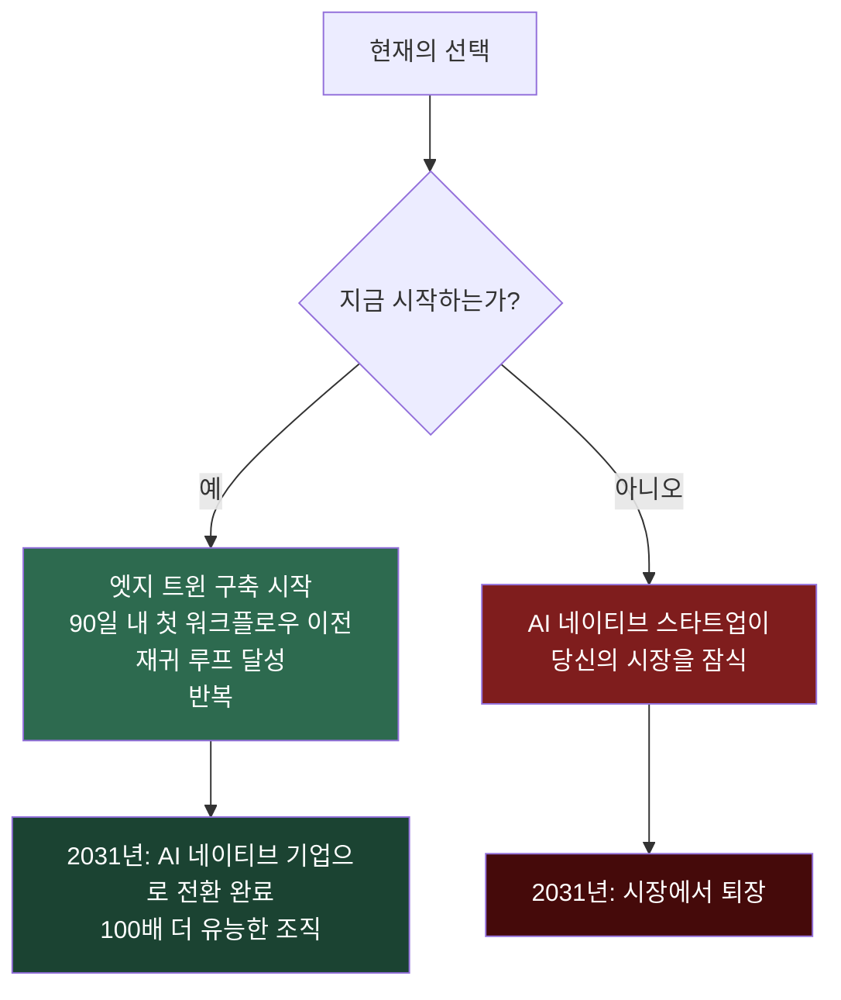

**출처:** [Moonshots with Peter Diamandis, EP #258](https://www.youtube.com/watch?v=I9c8STV7Hnw)  
**발표자:** Peter H. Diamandis & Salim Ismail  
**녹화일:** 2026년 5월 16일  
**주제:** AI 에이전트, AI 네이티브 워크플로우, 재귀적 자기개선이 기업 구조를 어떻게 재편하는가

---

## 목차

1. [왜 지금인가 — 100년 된 조직 이론의 붕괴](#1-왜-지금인가--100년-된-조직-이론의-붕괴)
2. [치명적 실수: 레거시 위에 AI를 얹는 것](#2-치명적-실수-레거시-위에-ai를-얹는-것)
3. [수탁자 쐐기(Fiduciary Wedge): 조직이 여전히 필요한 이유](#3-수탁자-쐐기fiduciary-wedge-조직이-여전히-필요한-이유)
4. [조직의 특이점이란 무엇인가](#4-조직의-특이점이란-무엇인가)
5. [ExO 3.0: 목적지 아키텍처](#5-exo-30-목적지-아키텍처)
6. [인텔리전스 스택: 6개 계층의 작동 원리](#6-인텔리전스-스택-6개-계층의-작동-원리)
7. [GOVERN/ASSURE: 4가지 핵심 통제 장치](#7-governassure-4가지-핵심-통제-장치)
8. [에이전트끼리 대화할 때: 기업 간 운영 아키텍처](#8-에이전트끼리-대화할-때-기업-간-운영-아키텍처)
9. [자기 파괴 탐침(Self-Disruption Probe)](#9-자기-파괴-탐침self-disruption-probe)
10. [중간 60% 문제](#10-중간-60-문제)
11. [엣지 배포 4단계: 모기업이 줄고 엣지가 성장한다](#11-엣지-배포-4단계-모기업이-줄고-엣지가-성장한다)
12. [REWRITE 방법론: 6단계 순서](#12-rewrite-방법론-6단계-순서)
13. [격동의 전환기: 2026~2031](#13-격동의-전환기-20262031)
14. [2036년의 기업: 100배 더 유능한 조직](#14-2036년의-기업-100배-더-유능한-조직)
15. [살아남는 것과 사라지는 것](#15-살아남는-것과-사라지는-것)
16. [결론: 지금 당장 해야 할 일](#16-결론-지금-당장-해야-할-일)

---

## 1. 왜 지금인가 — 100년 된 조직 이론의 붕괴

이 에피소드의 핵심 메시지는 단순하지만 충격적이다. 우리가 지난 100년 가까이 당연하게 여겨온 기업 조직의 존재 이유가 AI의 등장으로 근본적으로 무너지고 있다는 것이다.

1937년, 경제학자 로널드 코스(Ronald Coase)는 "기업의 본질(The Nature of the Firm)"이라는 논문에서 다음과 같은 이론을 제시했다. 대기업이 점점 커지는 이유는 회사 내부에서 일을 처리하는 비용(거래비용, 조율비용)이 외부에 맡기는 것보다 저렴하기 때문이라는 것이다. 모든 직원이 월급을 받고 있으니 마음대로 지시할 수 있고, 그 결과 외부 시장보다 효율적으로 움직일 수 있다는 논리였다. 코스는 이 논문으로 노벨경제학상을 수상했고, 이 이론은 이후 80여 년간 현대 기업 경영의 근간이 되었다.

그 이후 수십 년 동안 허버트 사이먼, 클레이튼 크리스텐슨, 스탠리 맥크리스탈 등 여러 위대한 경영 사상가들이 코스의 이론을 확장하거나 보완했다. 살림 이스마일이 집필한 《지수 조직(Exponential Organizations)》도 커뮤니티, 군중, AI를 활용하여 조율비용을 기업 외부로 옮기는 방식으로 코스의 법칙을 연장하는 시도였다. 우버가 운전기사와 승객을 매칭하는 핵심 사업 기능을 조직 내부가 아닌 외부 세계에서 수행하도록 설계한 것이 대표적인 예다.

그러나 이제 AI 에이전트가 등장하면서 이 모든 이론이 한꺼번에 무너진다고 살림 이스마일은 선언한다. 과거에는 회사 웹사이트 하나를 만들려면 브랜딩팀, 법무팀, IT팀의 승인을 차례로 거쳐야 했다. 그 과정에만 몇 주, 때로는 몇 달이 걸렸다. 하지만 오늘날에는 Vercel 같은 도구를 개인 컴퓨터에서 5분 만에 사용하여 브랜드 가이드라인을 반영한 웹사이트를 무료로 만들고, 여러 버전을 동시에 시장에 출시해볼 수 있다. 이것이 무엇을 의미하는가? **'기능을 구축하는 비용이 그 기능에 대한 회의를 여는 비용보다 저렴해졌다'** 는 것이다. 조율(coordination)이라는 행위 자체가 실행(execution)보다 비싸지는 순간, 코스의 법칙은 무의미해진다.

---

## 2. 치명적 실수: 레거시 위에 AI를 얹는 것

현재 기업에서 진행 중인 AI 도입 프로젝트의 80% 이상이 실패하고 있다. 그 이유는 기술이 부족해서가 아니다. **접근 방식 자체가 잘못되었기 때문이다.**

기존 기업들은 사람과 사람 사이의 워크플로우를 전제로 설계되어 있다. 승인 체계, 보고 라인, 병목 구조가 모두 인간 중심으로 만들어져 있다. 이런 구조 위에 AI 도구를 끼워 넣는 것은, 초기 텔레비전 방송에서 라디오 아나운서를 카메라 앞에 세워두고 새 매체를 활용했다고 착각하는 것과 같다. 새로운 미디어의 본질을 전혀 사용하지 않는 것이다.

이를 도식적으로 표현하면 두 가지 상반된 접근 방식이 있다.

**잘못된 방식(Bolted-On):** 기존의 계층적 조직도에 AI를 추가로 얹는 것이다. 이 방식은 잘못된 것들을 자동화하고, 조직의 가장 깊은 마찰 지점은 건드리지 않은 채로 남겨둔다. 가장 중요한 문제를 해결하지 못하면서 표면적인 효율화에만 그친다.

**올바른 방식(Designed-In):** AI를 조직 구조 자체에 내장(設計)하는 것이다. 이것은 합성 노드(synthetic nodes)가 구조적 교차점 전반에 걸쳐 매끄럽게 통합된 상태를 말한다. 이 방식은 레거시 아키텍처에 대한 솔직한 평가를 전제로 한다.

살림 이스마일의 핵심 경고는 이것이다. **레거시 아키텍처를 제대로 파악하지 않고는 인텔리전스 주도 전환을 달성할 수 없다.** 현재 자신의 조직이 어떻게 작동하는지를 정직하게 직시하지 않으면, 그 위에 아무리 좋은 AI를 올려도 실패한다.

---

## 3. 수탁자 쐐기(Fiduciary Wedge): 조직이 여전히 필요한 이유

AI가 조율비용과 실행비용을 거의 제로에 가깝게 만든다면, 우리는 과연 회사라는 조직이 더 이상 필요한지 의문을 가질 수 있다. 그 답은 "여전히 필요하다"이고, 그 이유가 바로 '수탁자 쐐기(Fiduciary Wedge)'라는 개념으로 설명된다.

기업은 앞으로 점점 더 다음과 같은 기능에 특화된 컨테이너로 변모할 것이다.

- **목적 컨테이너:** 조직의 존재 이유와 방향성을 담는 그릇
- **수탁자(Fiduciary) 컨테이너:** 재정적 책임의 주체
- **법적 컨테이너:** 법률적 실체로서의 기능
- **책임(Liability) 컨테이너:** 잘못에 대한 책임을 지는 주체

즉, AI가 실제 업무의 대부분을 수행하더라도, 그 행위에 대한 법적·윤리적 책임을 지는 인간 조직이 필요하다. 이것이 '수탁자 쐐기'다. 인간의 판단과 책임이 AI가 할 수 있는 것 사이의 간극, 바로 그 간극이 기업 조직이 앞으로도 존재해야 하는 이유다.

조직이라는 컨테이너 안에는 앞으로 자산(Assets), 지식재산(IP), AI 에이전트들, 그리고 소수의 인간이 함께 존재하게 될 것이다. 에이전트들은 외부 API를 호출하고, 정보를 수집하며, 심지어 사람에게 직접 연락하는 일도 한다.

---

## 4. 조직의 특이점이란 무엇인가

'조직의 특이점(Organizational Singularity)'이라는 개념은 물리학에서 블랙홀의 중심부처럼 기존 법칙이 더 이상 적용되지 않는 지점을 가리키는 '특이점(Singularity)'에서 착안했다. 기업 세계에서 이것은 **AI 에이전트, AI 네이티브 워크플로우, 재귀적 자기개선이 결합되어 기존의 계층적 조직 구조가 근본적으로 의미를 잃는 순간**을 말한다.

이 개념의 핵심은 다음 한 문장으로 요약된다.

> **"과거의 모든 조직 구조는 위계(Hierarchy)를 중심으로 설계되었다. 이제 그것은 지능(Intelligence)을 중심으로 설계되어야 한다."**

이것은 단순한 디지털 전환이나 자동화가 아니다. 조직을 설계하는 근본 원리 자체가 바뀌는 것이다. 위계(누가 누구에게 보고하는가)가 아니라, 지능(어떤 에이전트가 어떤 결정을 내리는가)이 조직의 구조를 결정하게 된다.

또한 이 개념은 재귀적 자기개선(Recursive Self-Improvement)이라는 핵심 아이디어와 연결된다. 예를 들어 송장(Invoice) 처리 워크플로우가 AI 에이전트에 의해 수행될 때, 그 에이전트는 단순히 작업을 처리하는 것에 그치지 않고 매 루프마다 스스로 개선 방법을 찾는다. 이 루프가 한번 돌아가기 시작하면, 모든 것이 자동으로 개선되는 선순환이 만들어진다. 이것이 바로 조직의 특이점의 본질이다.

---

## 5. ExO 3.0: 목적지 아키텍처

살림 이스마일은 이 새로운 조직 형태를 'ExO 3.0'이라고 부른다. 이는 《지수 조직(ExO 1.0)》, 《지수 조직 2.0》에 이은 세 번째 진화 모델이다. ExO 3.0의 전체 아키텍처는 세 가지 핵심 요소로 구성된다.

### MTP: 단순한 구호가 아닌 프로토콜

**MTP(Massive Transformative Purpose, 거대 변혁 목적)** 는 기존에도 ExO 모델의 중심에 있었지만, ExO 3.0에서는 그 역할이 완전히 달라진다. 과거에는 MTP가 사무실 벽에 붙여 놓는 슬로건이었다면, 이제는 AI 에이전트와 인간 에이전트 모두가 따라야 하는 **실제 프로토콜**이 된다.

MTP는 에이전트들이 어떤 행동을 해야 하고 하지 말아야 하는지를 정의하는 경계 조건(Boundary Conditions)을 포함한다. 피드백 루프는 어떤 행위가 MTP의 범위 안에 있는지 밖에 있는지를 실시간으로 판단한다. 예를 들어 과거 우버의 경우, 특정 고객이 항상 서지 프라이싱을 감수한다고 알고리즘이 판단하면 그 고객에게만 서지 요금을 적용했다. 이는 MTP의 윤리적 경계를 넘어서는 행위였다. ExO 3.0에서는 이런 상황을 MTP 아키텍처가 사전에 방지한다.

### DRIVE와 SHAPE: 엔진과 선체

**DRIVE는 인텔리전스 엔진**이다. 결정 아키텍처, 재귀적 학습, 인텔리전스 스택, 가치 해자, 탄력적 에이전시로 구성되며, 조직이 빠르고 스마트하게 움직이도록 한다.

**SHAPE는 조직의 형태**다. 안전한 자율성, 인간 아키텍처, 적응형 아키텍처, 목적 통제, 생태계 신뢰로 구성되며, 조직이 올바른 방향으로, 그리고 회복탄력성을 갖추고 움직이도록 한다.

이 두 요소의 관계에 대해 살림 이스마일은 명확하게 경고한다. **"DRIVE 없는 SHAPE는 멈추고, SHAPE 없는 DRIVE는 충돌한다."** 속도와 방향이 함께 있어야 한다는 뜻이다.

---

## 6. 인텔리전스 스택: 6개 계층의 작동 원리

ExO 3.0의 핵심 엔진은 '인텔리전스 스택(Intelligence Stack)'이다. 이것은 군사 전략 이론인 **보이드의 OODA 루프(Observe-Orient-Decide-Act)** 를 기업 아키텍처로 구현한 것이다. 단, 사람이 아닌 기계 속도로, 그리고 지속적으로 작동한다.

각 계층이 실제로 어떻게 작동하는지를 구체적인 사례로 살펴보자. 어떤 소매 기업의 경쟁사가 갑자기 당일 배송을 발표했다고 가정해보자.

**1단계 — PURPOSE(목적):** 조직의 헌법적 제약 조건이다. 모든 에이전트의 행위가 조직의 MTP 범위 안에 있는지를 규정하는 최상위 레이어다.

**2단계 — SENSE(감지):** 외부에 배치된 감지 에이전트들이 "경쟁사가 당일 배송을 발표했다"는 정보를 포착하여 내부로 전달한다. 이 레이어는 24시간 365일 작동하는 '자기 파괴 탐침(Self-Disruption Probe)'을 포함한다.

**3단계 — INTERPRET(해석):** 해석 에이전트들이 그 정보의 의미를 분석한다. "이것이 우리 사업의 특정 라인에 위협이 되는가? 여러 라인에 영향을 미치는가? 실존적 위협인가? 얼마나 심각한가?" 이 모든 분석이 자동으로 이루어진다.

**4단계 — DECIDE(결정):** 결정 에이전트들이 옵션을 생성한다. 우리도 당일 배송을 도입해야 하는가? 당일 배송 스타트업을 인수해야 하는가? 이 트렌드가 효과가 없을 것이므로 무시해야 하는가? 기존에는 최고전략책임자, 마케팅책임자 등이 수개월에 걸쳐 회의를 통해 내렸던 결정이 이제 몇 시간, 며칠 안에 이루어진다. 물론 각 레이어에서 인간이 검토하고 승인하는 과정이 포함된다.

**5단계 — ORCHESTRATE(조율):** 결정이 내려지면 조율 에이전트가 실행 계획을 수립한다. 예를 들어 스타트업 인수를 결정했다면, 관련 스타트업들을 찾고, M&A 적합성을 분석하고, 기업개발팀에 알리고, 법무 에이전트를 준비시키는 일련의 과정을 조율한다.

**6단계 — LEARN(학습):** 이전에 비슷한 인수를 한 적이 있는가? 그 결과는 어땠는가? 이 학습이 다음 번 결정의 품질을 높이고, 재귀적 개선 루프를 만들어낸다.

이 전체 스택을 감싸는 것이 **GOVERN/ASSURE** 레이어다. 이것은 모든 레이어를 실시간으로 모니터링하고, 모든 결정을 기록하며, 가이드라인을 집행하고, 에스컬레이션을 발동시키며, 필요 시 에이전트를 즉시 중단시키는 킬 스위치를 보유한다.

---

## 7. GOVERN/ASSURE: 4가지 핵심 통제 장치

GOVERN/ASSURE는 추상적인 개념이 아니다. 네 가지 구체적인 작동 기본 요소(Operational Primitives)로 이루어지며, 단 한 순간도 꺼지지 않는다.

**01. 신뢰 평가(Trusted Evals):** 고객이 이상 징후를 발견하기 전에, 시스템이 조용히 일어나는 드리프트(편차)를 사전에 포착한다. 에이전트의 행위가 기준에서 서서히 벗어나는 것을 지속적으로 감시한다.

**02. 검색 가능 로그(Searchable Logs):** 모든 결정의 감사 추적이 검색 가능한 형태로 기록된다. 나중에 "왜 그런 결정이 내려졌는가?"를 언제든지 추적하고 검증할 수 있어야 한다. 이것은 법적 책임과 연결된다.

**03. 세분화 롤백(Granular Rollback):** 에이전트가 잘못된 방향으로 나아가기 시작했을 때, 전체 시스템을 중단하지 않고도 이전 상태로 되돌릴 수 있어야 한다. 과거에 실제로 일어난 사례처럼, 어떤 에이전트가 렌터카 회사의 방대한 데이터를 삭제하는 일이 일어나더라도 복구할 수 있는 메커니즘이 필요하다.

**04. 인간 리뷰 큐(Human Review Queue):** 법이 요구하는 곳에서 인간의 책임을 확실히 유지하는 장치다. 에이전트가 아무리 스마트해져도, 특정 결정에 대해서는 반드시 인간이 최종 승인을 해야 한다.

이 네 가지를 하나의 수식으로 표현하면 다음과 같다.

> **GOVERN/ASSURE = 신뢰 평가 + 검색 가능 로그 + 세분화 롤백 + 인간 리뷰 큐**

---

## 8. 에이전트끼리 대화할 때: 기업 간 운영 아키텍처

미래에는 단순히 한 회사 안에서만 에이전트가 작동하는 것이 아니라, 서로 다른 회사의 에이전트들이 서로 상호작용하는 세상이 온다. 이때 필요한 것은 선의(Goodwill)가 아니라 **아키텍처**다. 구체적으로 세 가지 요건이 있다.

**1. 정책 통제형 API 서피스(Policy-Controlled API Surface)**

외부 에이전트들에게 중개되고 범위가 제한된 접근권이 부여된다. 이들을 마치 API 소비자처럼 취급해야 한다. 즉, 자격증명, 접속 속도 제한, 허용 행위 화이트리스트, 킬 스위치 권한이 명확히 설정되어 있어야 한다.

**2. 데이터와 함께 이동하는 데이터-객체 메타데이터(Data-Object Metadata)**

데이터가 무엇인지, 누가 발행했는지, 어떻게 사용될 수 있는지, 잘못되면 어떻게 되는지를 포함하는 메타데이터가 데이터 자체와 함께 이동해야 한다. 이것은 마치 각 에이전트에게 **'여권(Passport)'** 을 발급하는 것과 같다. 그 여권에는 해당 에이전트가 할 수 있는 일과 할 수 없는 일이 명시되어 있다.

**3. 사전에 공동 설계된 책임 프레임워크(Liability Framework Codesigned in Advance)**

에러 예산, 완화 경로, 중재 메커니즘 등이 에이전트가 실제로 거래를 시작하기 전에 미리 합의되어 있어야 한다. 법정에서 다투는 것이 아니라, 사전에 설계하는 것이다.

이 세 가지가 갖추어진 조직의 핵심 통찰은 다음과 같다.

> **"능력(Capability)이 아니라 책임 추적 가능성(Accountability)이 희소 자원이 된다. 가장 신뢰받는 책임 스택이 새로운 가치 해자(Value Moat)다."**

즉, 앞으로 기업의 경쟁 우위는 "무엇을 할 수 있느냐"가 아니라 "그것에 대해 얼마나 투명하고 책임지는가"에서 나온다.

---

## 9. 자기 파괴 탐침(Self-Disruption Probe)

이것은 SENSE 레이어에서 24시간 365일 작동하는 하나의 질문이다.

> **"3인 팀이 에이전트를 이용해 우리의 가장 높은 마진을 자랑하는 사업을 90일 안에 복제할 수 있는가?"**

이 질문이 중요한 이유는 그것이 현실이기 때문이다. 살림 이스마일은 모든 CEO와 임원에게 묻는다. 당신 사업에서 두 명이 오픈소스 AI 도구(Open Claude, Hermes 등)를 가지고 60~90일 안에 복제할 수 있는 고마진 사업 라인이 있는가? 만약 있다면, 이미 누군가가 그것을 하고 있다고 보면 된다.

이 탐침이 실제로 작동하는 방식은 다음과 같다.

환경 인텔리전스 에이전트들이 AI 네이티브 경쟁자들의 섀도우 시뮬레이션을 지속적으로 실행한다. 이 시뮬레이션은 경쟁자가 당신의 가장 높은 마진 기능을 타겟으로 할 경우를 상정하여, 필요한 인력 규모, 비용 구조, 실행 속도를 모델링한다. 만약 섀도우 모델이 30% 낮은 비용으로, 50% 이하의 인원으로 동일한 기능을 복제할 수 있다고 나타나면, 경보가 발동된다. 그리고 해당 기능은 다음번 '엣지 트윈(Edge Twin)' 후보가 된다. 즉, 내부에서 먼저 AI 네이티브로 전환해야 할 대상이 되는 것이다.

---

## 10. 중간 60% 문제

AI 전환이 조직에 미치는 영향을 이해할 때, 많은 사람들이 "직업을 잃는다"는 부분에만 집중한다. 하지만 살림 이스마일은 훨씬 더 세밀하고 솔직한 분석을 제시한다. 이것이 바로 **'중간 60% 문제(The Middle 60% Problem)'** 다. 이것은 단순한 노동 문제가 아니라, 전환이 성공하느냐 실패하느냐를 결정하는 핵심 아키텍처 결정이다.

조직의 구성원을 세 그룹으로 나누면 다음과 같다.

**상위 20%: 번성한다**

이들은 고판단력 운영자(High-Judgment Operators)들이다. AI가 루틴 작업을 처리함으로써 이들은 더 넓은 범위의 책임을 맡게 된다. 승진하고, 더 많은 보수를 받으며, 더 큰 범위를 관장한다. 이들이 '새로운 AI 엘리트', 즉 WRITER 2026 데이터에 따르면 임원의 92%가 이 계층을 적극적으로 육성하고 있다고 밝힌 바로 그 계층이다. 최고경영진은 이 새로운 세계에서 전략적 평가자이자 검증자, 대시보드 감독자로서의 역할을 맡는다. 에이전트가 전략적 평가를 수행하면, 이들은 "이 평가가 올바른 방향인가?"를 판단하는 최종 권한자가 된다.

**중간 60%: 진짜 위기**

이들이 바로 문제의 핵심이다. 이들은 탁월한 조율자이자 프로세스 관리자들이다. 그런데 그 조율과 프로세스 관리야말로 AI가 정확히 압축하는 기능이다. 현재 많은 기업들이 이들에게 "당신들은 이제 예외 처리자(Exception Handlers)가 될 것이다"라고 말한다. 하지만 이것은 범주 오류다. 이들의 전문성과 경력은 조율에 있었다. 그것이 사라졌을 때 예외 처리라는 전혀 다른 역할을 맡기는 것은, 마치 숙련된 회계사에게 갑자기 고객 서비스를 하라고 하는 것과 같다.

이에 대한 해결책으로 살림 이스마일이 제시하는 것은 **적극적이고 공격적인 도제(Apprenticeship) 프로그램**이다. 갑자기 역할이 줄어든 중간 관리자가 최고재무책임자 옆에서 함께 대안을 모색하는 방식으로, 실제 업무를 통해 새로운 역할을 습득하게 하는 것이다. 이는 중세 시대의 도제 제도나 길드 모델로의 회귀라고도 볼 수 있다.

중요한 경고: **전환을 공개적으로 발표하기 전에 다리를 먼저 설계하라.** 존엄성(Dignity)은 사후적으로 생각하는 것이 아니라 설계 파라미터(Design Parameter)로 처음부터 반영해야 한다.

**하위 20%: 가장 먼저 대체된다**

루틴 업무 실행자들이다. 이들은 이미 이동이 시작되고 있다. 이들의 대체는 중간 60%에게 앞으로 무슨 일이 일어날지를 예고하는 선례가 된다. 한 연구에 따르면 Z세대 직원의 44%가 AI에게 나쁜 정보를 제공하여 자신의 업무를 학습하지 못하도록 의도적으로 방해하고 있다고 한다. 이것이 바로 조직의 면역 체계가 인간 차원에서 작동하는 방식이다.

---

## 11. 엣지 배포 4단계: 모기업이 줄고 엣지가 성장한다

가장 중요한 실행 지침은 이것이다. **기존 조직을 고치거나 바꾸려 하지 마라.** 버크민스터 풀러의 말처럼 "기존 시스템을 고칠 수는 없다. 새로운 시스템을 주변부에 만들어서 그것이 새로운 중심이 되도록 해야 한다."

이 원칙에 따른 전환 과정은 4단계로 이루어진다.

**1단계 — 레거시 모기업:** 지금 대부분의 기업이 있는 곳이다. 전통적인 계층 구조, 높은 조율 비용, 인간 중심 워크플로우가 특징이다.

**2단계 — 엣지 트윈 생성:** 기존 조직 외부의 엣지에 AI 네이티브 디지털 트윈을 만든다. 3~5명의 혁신적이고 열정적인 젊은 직원들과 함께, 컨설팅 회사가 아닌 실제 빌더(Builder) 회사(풀타임 배포 엔지니어를 보유한)와 파트너십을 맺는다. 이 엣지 트윈은 반드시 CEO에게 직접 보고해야 한다. 만약 이것이 중간 관리자에게 보고하는 구조라면, 기존 조직의 면역 체계에 의해 죽게 된다.

**3단계 — 워크플로우 이전:** 선택한 워크플로우를 엣지 트윈에서 재구성하기 시작한다. 여기서 중요한 것은 기존 워크플로우를 '이동'시키는 것이 아니라 '복사'하는 것이다. 모기업에서 데이터를 포크(Fork)하여 엣지 트윈에서 병렬로 운영한다. 만약 무언가 크게 잘못되어도 모기업에는 영향이 없다. 엣지 트윈에서의 개선 루프가 기존 방식보다 훨씬 빠르다는 것이 확인되면, 품질 검증을 거친 후 기존 방식을 서서히 폐기한다. 그런 다음 다음 워크플로우로 이동한다. 이것을 반복한다.

**4단계 — 새로운 중심:** 디지털 트윈이 재귀적 자기개선 상태에 도달하면, 그것이 새로운 조직의 중심이 된다. 이 시점에서 예측되는 성능 개선은 연간 100배 이상이다. 즉, 지금 1개의 송장을 처리한다면 내년에는 100개를 처리해야 하고, 지금 100일이 걸리는 작업이라면 1일로 줄어야 한다.

Nespresso는 이 원칙의 좋은 예다. 네슬레는 1976년 네스프레소를 만들었지만, 처음 10년 동안 모기업 안에서 운영하면서 실패를 거듭했다. 다른 브랜드, 다른 공급망, 다른 고객 제안이 기존 조직과 충돌했기 때문이다. 결국 별도의 독립적인 공간으로 분리했을 때 비로소 폭발적으로 성장했다. 오늘날 네스프레소는 네슬레의 가장 높은 성과를 내는 사업 중 하나다.

---

## 12. REWRITE 방법론: 6단계 순서

살림 이스마일은 ExO 3.0으로의 전환을 위한 구체적인 방법론을 **REWRITE**라고 부른다. 이 6단계의 순서는 협상 불가능하다(Non-Negotiable). 그리고 GOVERN/ASSURE는 첫날부터 모든 단계 전반에 걸쳐 작동한다.

**1단계 — BACKCAST(역산 설계):** 미래의 목적지를 먼저 정의하고, 거기서 거꾸로 현재로 내려오는 방법론이다. 미래 학(Futures Studies)에서 가져온 기법으로, "화성에 7년 안에 가려면 5년 후에는 어디 있어야 하는가? 3년 후에는?" 이런 식으로 역산하여 로드맵을 만든다. 출발점에서 출발해서는 어디로 가야 할지 알 수 없다. 이 단계에서는 AI 네이티브 방식으로 MTP와 아키텍처를 실현했을 때 그 기업이 어떤 모습일지를 그려낸다. 대형 언어 모델과의 대화가 이 역산 과정을 놀랍도록 쉽게 만들어준다.

**2단계 — ASSESS(평가):** REWRITE 준비도 점수(REWRITE Readiness Score)를 산출한다. 7가지 차원에서 스스로를 평가하는 방식이며, 이 점수표는 웹사이트에서 무료로 이용할 수 있다. 대표적인 두 가지 지표는 다음과 같다. 첫째, 조직적 저항(Organizational Drag)이다. 어떤 일을 실행하려면 5~6개의 결정 루프와 승인을 통과해야 하는가, 아니면 창업자에게 직접 가서 예스/노를 받을 수 있는가? 둘째, AI가 조직 내에서 일등 시민(First Class Citizen)인가? 만약 IT 부서가 주입하는 도구 수준이라면 낮은 점수다. 반면 최고AI책임자(Chief AI Officer)를 두고 AI 네이티브 역량을 이미 구축 중이라면 높은 점수다.

**3단계 — EXTRACT(추출):** 가장 구체적인 워크플로우들을 매핑하고 문서화한다. 이때 핵심 과제는 **암묵지(Tacit Knowledge)** 를 포착하는 것이다. 예를 들어 영상 제작 워크플로우라면, 숙련된 프로듀서가 외부에서는 보이지 않고 어디에도 문서화되지 않은 수십 가지 단계를 거친다. 그 사람이 떠나면 AI도 그 지식을 즉시 습득할 수 없다. 바로 이 암묵지가 다음 단계의 엣지 트윈 후보가 된다.

**4단계 — STRIP(제거):** 조직적 저항을 잘라낸다. 현재 10단계가 필요한 프로세스를 3단계로 줄이는 것을 목표로 한다. 불필요한 승인 레이어를 제거하고, 실제로 부서진다는 것을 확인할 때까지 계속 단순화한다. 3단계 이하로 줄었을 때 비로소 디지털 트윈으로 이전할 준비가 된 것이다.

**5단계 — BUILD(구축):** 엣지 트윈을 실제로 세우고, 워크플로우를 하나씩 이전한다. 한 워크플로우 이전이 성공하면 다음으로 넘어간다. 이것을 반복한다. 처음 진입부터 몇 개의 워크플로우를 작동시키는 데까지 약 90일이 걸린다고 이스마일은 예상한다.

**6단계 — REWIRE(재연결):** 파드(Pod) 기반 인텔리전스 네트워크로 시스템 전체를 재연결한다. 점점 더 많은 흐름이 엣지로 향하고, 최종적으로 엣지가 기업 자체가 된다.

---

## 13. 격동의 전환기: 2026~2031

이 전환은 한순간에 일어나지 않는다. 살림 이스마일은 2026년부터 2031년까지를 **'격동의 전환기(The Turbulent Transition)'** 로 규정한다. 이 기간 동안 대부분의 기업들은 구조적 무인 지대(No Man's Land)에 머물게 되며, 손익계산서는 나아지기 전에 먼저 나빠진다.

### 이중 비용: J 커브

레거시 조직을 유지하는 비용과 AI 네이티브 엣지를 구축하는 비용을 동시에 지불해야 한다. 비용이 교차하는 시점은 일반적으로 18~30개월이다. 이 트러프(Trough, 저점) 구간에서 이사회가 이니셔티브를 죽이는 경우가 많다. 따라서 이사회에 처음부터 J 커브를 설명하고 재정을 미리 확보하는 것이 필수적이다.

### 노동 역학

이분화 위험이 계층 구조를 만든다. 의도적인 아키텍처 없이는 정치적으로 롤아웃 자체를 죽여버리는 카스트 시스템이 형성된다. 경제적으로 성과를 증명하기 전에 정치적으로 죽는 이니셔티브를 막기 위해서는 처음부터 인간 전환 계획을 설계해야 한다.

### 불균등한 부문별 타임라인

모든 산업이 동일한 속도로 전환되는 것이 아니다.

- **정보 집약형 기업:** 수개월 안에 전환 가능
- **하이브리드형(제조, 소매, 물류):** 1~3년
- **규제 집약형(금융 서비스, 의료, 정부):** 3~7년

자신의 업종 타임라인을 기준으로 판단해야 하며, 다른 업종의 속도와 비교해서는 안 된다.

### 지정학적 파편화

미국, 중국, EU, 인도가 각각 다른 AI 스택을 개발하고 있다. 두 개 이상의 진영에 걸쳐 운영하는 기업들은 블록 간 번역 레이어, 병렬 인증, 성능 저하 모드 프로토콜이 필요하게 된다.

---

## 14. 2036년의 기업: 100배 더 유능한 조직

2036년, 즉 이 전환이 완료된 이후의 기업은 오늘날의 기업과 근본적으로 다른 모습을 하고 있을 것이다. 이것은 추측이 아니다. Cognition Labs는 이 풀 시스템을 구현했을 때 ARR이 73배 성장했다. 이것이 첫 번째 데이터 포인트다.

**인력 규모:** 2024년 500명이 필요했던 조직이 2036년에는 50명으로 운영된다. 그런데 중요한 것은 그 50명이 더 적은 일을 하는 것이 아니라, **10배 더 많은 일**을 한다는 점이다. 전체 조직은 연간 100배 이상의 성능 향상을 달성한다.

**매니저 대 개인 기여자 비율:** 현재 1:5에서 3 수준인 이 비율이 1:20 이상으로 변한다. 중간 관리층이 조율 레이어로서 사라지기 때문이다. 잭 도시(Jack Dorsey)는 이 개념을 극단까지 밀어붙여, CEO와 모든 직원이 직접 연결된 구조를 시도했다. 그것이 가능한 이유는 AI가 그 연결을 유지하는 모든 작업을 처리하기 때문이다.

**새로운 경영 지표:** 매출 규모가 아닌 직원 1인당 매출(Revenue-per-Employee) 곡선이 새로운 핵심 지표가 된다. 잭 도시는 2026년 3월에 이렇게 말했다고 한다. **"모든 기업은 이제 미니 AGI가 될 수 있다."**

---

## 15. 살아남는 것과 사라지는 것

변화의 모든 단계에서 승리하는 특성이 바뀐다. 공룡은 사라진 세계에 최적화되어 있었다. 기업도 마찬가지다.

### 살아남는 것

**MTP, 프로토콜로 인코딩된 것:** 조직의 목적이 에이전트들이 따르는 실제 프로토콜로 내장되어 있는 것.

**책임 쉘(Accountability Shell):** 법적 실체, 수탁자, 책임 컨테이너로서의 기능. 에이전트가 일을 처리하더라도, 법적·윤리적 책임을 지는 인간 조직은 여전히 필요하다.

**LEARN 레이어의 고유 인텔리전스:** 경쟁자가 가질 수 없는 데이터, 즉 독점적 학습 데이터와 인사이트. 이것이 진정한 장기 경쟁 우위다. 클로드(Claude)나 GPT의 학습 루프가 다른 경쟁자보다 앞서 있는 것과 같은 원리로, 한번 앞서면 따라잡기 매우 어렵다.

**조율 프로토콜:** 비탈릭 부테린의 메커니즘 디자인처럼, AI가 완화한 주의력을 활용하여 확장된 조율 프로토콜.

**큐레이션 판단력(Curatorial Judgment):** 실행이 거의 무료가 되면, 무엇을 만들지에 대한 **판단력과 취향(Taste)** 이 진정한 해자(Moat)가 된다. 강한 브랜드는 MTP와 함께, 최종 소비자와의 감정적 연결을 강화하는 방향으로 이 새로운 에이전트 역량을 활용해야 한다.

### 사라지는 것

**전통적 의미의 조직도:** 다윗 로스가 말했듯이, 20세기에 당신을 성공하게 만든 조직 구조가 21세기에는 당신을 실패하게 만든다. 실제로 그것이 맞았다. 다만 조금 시간이 걸렸을 뿐이다.

**5년 계획:** 아니, 어떤 정적인 계획도 살아남지 못한다. 지금은 특이점의 한가운데 있다. 1년 후의 세계가 어떤 모습일지 아무도 모른다. 계획 자체가 지속적인 학습 루프여야 한다. 조직도는 M&A나 새로운 사업 라인 출시처럼 중요한 이벤트가 있을 때만 바뀌는 것이 아니라, 현재 상황에 끊임없이 적응하는 아메바처럼 역동적으로 변해야 한다.

**조율 레이어로서의 중간 관리층:** 데이터를 수집하여 경영진이 소화할 수 있는 형태로 재포장하는 기능이 90% 줄어든다.

**의사결정 단위로서의 분기 검토:** 분기 단위의 검토는 너무 느리다.

**연간 계획 프로세스:** 같은 이유로 사라진다.

**관성적 해자(Inertia Moat):** "고객들이 전환하기 귀찮아서 우리를 떠나지 않는다"는 방어막. AI 에이전트가 전환 비용을 제로로 만들어버릴 수 있다.

**에이전트 경제에서의 낭비 자산:** 더 이상 활용되지 못하는 정적인 자원들.

---

## 16. 결론: 지금 당장 해야 할 일

이 에피소드에서 살림 이스마일과 피터 디아만디스가 공통적으로 강조하는 핵심 메시지는 세 가지다.

**첫째, 지금 당신의 사업을 위협하는 것은 가장 큰 경쟁자가 아니다.** 당신이 얼마나 느리게 움직이는지를 알고, 당신이 얼마나 많은 이익을 내고 있는지를 알고, 그것을 빼앗으러 오는 AI 네이티브 스타트업이다.

**둘째, 전환의 방법은 명확하다.** 기존 조직을 고치려 하지 말고, 엣지에 AI 네이티브 디지털 트윈을 구축하라. CEO 직속으로, 이사회의 전폭적인 지원 하에, 작은 워크플로우 하나에서 시작하여 재귀적 자기개선 루프가 돌아갈 때까지 증명하라. 그런 다음 다음 워크플로우로 넘어가라.

**셋째, 인간의 역할은 사라지는 것이 아니라 변한다.** 독일의 공장 바닥에서 아무도 일하지 않아도 실업률이 치솟지 않은 것처럼, 인간은 더 고차원적인 문제 해결, 예외 처리, 효율 증대, 디자인 씽킹으로 이동한다. 기업은 5배 더 많이 창출될 것이고, 창업가 정신의 캄브리아기 대폭발이 일어날 것이다.

살림 이스마일은 대학들이 이 흐름을 가장 빠르게 인식하고 접근해오고 있다고 전한다. 콘텐츠 전달에서 실행과 창업가 정신의 허브로 변모하는 것이 미래의 교육이라는 인식이 퍼지고 있다. "당신은 4년 동안 공학을 공부했습니다"가 아니라 "당신은 4년 동안 이것들을 만들었고 자격을 인정받았습니다"가 미래의 공학 학위가 될 것이다.

마지막으로 이 에피소드가 던지는 가장 근본적인 질문으로 돌아가자.

> **"두 명이 오픈소스 AI 도구를 이용해 60~90일 안에 당신의 가장 수익성 높은 사업을 복제할 수 있는가?"**

만약 그 대답이 "예스"라면, 지금 바로 시작해야 한다. 누군가는 이미 시작했을 것이기 때문이다.

---

## 참고 정보

| 항목 | 내용 |
|------|------|
| **발표자** | Peter H. Diamandis (XPRIZE, Singularity University 창립자), Salim Ismail (OpenExO 창립자, ExO 시리즈 저자) |
| **방법론 문의** | kevin@openexo.com 또는 organizationalsingularity.com |
| **파일럿 프로그램** | openexo.com/organizational-singularity-pilot |
| **메타트렌드 뉴스레터** | diamandis.com/metatrends |
| **Salim Ismail 유튜브** | @salimismail |
| **녹화일** | 2026년 5월 16일 |
| **공개일** | 2026년 5월 27일 |

---

*본 문서는 Peter H. Diamandis와 Salim Ismail의 Moonshots 팟캐스트 EP #258 "The New Era of Jobs: Organizational Singularity"의 내용을 바탕으로, 슬라이드 자료와 발언 내용을 종합하여 작성되었습니다.*
