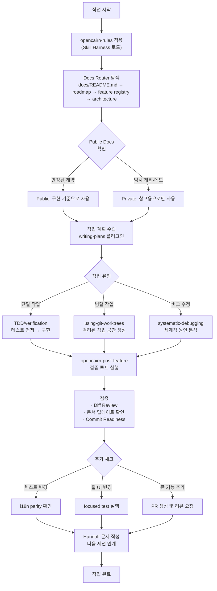

> **원문 출처:** Threads [@kimsungbin1119](https://www.threads.com/@kimsungbin1119/post/DYWlYZbkxZs) 포스트 (2025~2026년 AI 에이전트 개발 실무 경험 기반)

---

## 목차

1. [바이브 코딩에 대한 오해](#1-바이브-코딩에-대한-오해)
2. [구조 설계 우선 접근법](#2-구조-설계-우선-접근법)
3. [Docs Router: 에이전트의 나침반](#3-docs-router-에이전트의-나침반)
4. [Public Docs vs. Private Docs: 정보의 신뢰도 분리](#4-public-docs-vs-private-docs-정보의-신뢰도-분리)
5. [Skill Harness: 규칙을 사람이 아닌 구조가 강제한다](#5-skill-harness-규칙을-사람이-아닌-구조가-강제한다)
6. [Post-Feature 검증 루프: "됐습니다"로 끝내지 않는다](#6-post-feature-검증-루프-됐습니다로-끝내지-않는다)
7. [Superpowers 플러그인: 작업 단계별 전문 도구](#7-superpowers-플러그인-작업-단계별-전문-도구)
8. [진짜 병목은 코드 생성이 아니다](#8-진짜-병목은-코드-생성이-아니다)
9. [전체 구조 흐름 요약](#9-전체-구조-흐름-요약)
10. [마치며: 에이전트 시대의 개발자 역할 변화](#10-마치며-에이전트-시대의-개발자-역할-변화)

---

## 1. 바이브 코딩에 대한 오해

**바이브 코딩(Vibe Coding)** 이라는 용어는 2025년 2월 OpenAI 공동창업자이자 전 테슬라 AI 리더인 **Andrej Karpathy**가 처음 사용했다. 이 단어는 개발자가 코드를 한 줄 한 줄 작성하는 대신, AI에게 자연어로 의도를 전달하고 AI가 구현을 처리하는 방식을 가리킨다. 같은 해 3월 Merriam-Webster가 "슬랭 & 트렌드" 표현으로 등재했고, Collins 영어 사전은 2025년 올해의 단어로 선정할 만큼 빠르게 확산된 개념이다.

그런데 많은 사람들이 바이브 코딩을 "AI에게 '이거 만들어줘'라고 던지고 결과물을 받는 것"으로 이해한다. 이 해석은 절반만 맞다.

초기 단계, 즉 간단한 스크립트나 프로토타입을 만들 때는 그런 방식이 통한다. 하지만 실제 제품 수준의 코드베이스가 쌓이고, 여러 세션에 걸쳐 AI 에이전트와 협업해야 하는 순간부터 "던지기" 방식은 빠르게 한계에 부딪힌다.

Threads 포스트의 작성자 김성빈은 자신의 접근법이 오히려 그 반대에 가깝다고 말한다. 그가 하는 일은 AI에게 일을 던지는 게 아니라, **AI가 길을 잃지 않도록 저장소(repository) 안에 구조 자체를 먼저 설계해두는 것**이다.

---

## 2. 구조 설계 우선 접근법

AI 에이전트는 사람과 달리 대화가 끝나면 기억을 초기화한다. 새 세션이 시작될 때 에이전트는 사실상 백지 상태로 돌아온다. 이때 에이전트가 의지할 수 있는 유일한 정보는 **파일시스템 위에 남겨진 구조**뿐이다.

이 문제는 업계에서도 빠르게 공식화되고 있다. 2025년 8월 OpenAI, Google, Cursor, Factory 등 주요 AI 코딩 생태계가 협력해 **AGENTS.md**라는 오픈 표준을 공동 발표했다. 이 파일은 에이전트에게 기술 스택, 코딩 컨벤션, 아키텍처 패턴, 행동 제약을 알려주는 공유 문서 규약이다. Cursor에서는 `.cursorrules`, Claude Code에서는 `CLAUDE.md`라는 이름으로 각자 구현하고 있다.

김성빈의 접근법은 바로 이 원칙을 한 단계 더 깊이 구현한 것이다. 단순히 규칙 파일 하나를 놓는 것이 아니라, 저장소 전체가 에이전트에게 **명확한 지도**가 되도록 설계한다.

요점은 이렇다: **코드를 건드리기 전에, 에이전트가 읽어야 할 문서를 먼저 깔아둔다.**

---

## 3. Docs Router: 에이전트의 나침반

OpenCairn 저장소에는 **docs router**라는 개념이 있다. 이것은 에이전트가 작업을 시작할 때 가장 먼저 탐색해야 하는 문서 구조다.

### 문서 구조의 역할

```
docs/
├── README.md          ← 입구 (에이전트의 첫 출발점)
├── roadmap.md         ← 현재 제품 상태와 방향
├── feature-registry/  ← 이미 구현된 기능 목록과 소유 경로
└── architecture/      ← API / DB / Worker / Web 경계 정의
```

각 문서는 서로 다른 역할을 가진다.

**`docs/README.md` (입구)** 는 에이전트가 저장소에 진입할 때 가장 먼저 읽어야 할 파일이다. 이 파일은 에이전트에게 "어디에 무엇이 있는지"를 알려주는 지도 역할을 한다. 에이전트는 코드를 열기 전에 이 파일을 통해 전체 맥락을 파악한다.

**roadmap.md**는 현재 제품이 어떤 상태에 있는지, 다음에 무엇을 해야 하는지를 담는다. 에이전트가 임의로 기능을 추가하거나 이미 완료된 작업을 재작업하는 실수를 방지한다.

**feature registry**는 이미 구현된 기능과 그 기능을 소유하는 파일 경로를 목록으로 정리한 문서다. 에이전트가 "이 기능이 어디 있지?"를 찾아 코드베이스를 무작위로 탐색하는 대신, 이 목록을 보고 정확한 위치로 직행할 수 있게 한다.

**architecture docs**는 시스템의 경계를 정의한다. API 레이어, 데이터베이스, 워커, 웹 프론트엔드가 서로 어떻게 분리되어 있는지를 명확히 적어둔다. 에이전트가 레이어 경계를 넘어 잘못된 의존성을 만드는 것을 사전에 막는다.

### 왜 이 구조가 필요한가

실제로 에이전트에게 코드베이스를 그냥 주면 어떤 일이 일어날까? 에이전트는 코드를 직접 읽으면서 맥락을 파악하려 한다. 이때 잘못된 패턴을 학습하거나, 이미 존재하는 기능을 새로 만들거나, 아키텍처 경계를 무시한 코드를 작성할 가능성이 높다. 이 문제를 업계에서는 **컨텍스트 드리프트(context drift)** 라고 부른다.

docs router는 에이전트가 코드를 보기 전에 "어디를 건드려야 하는지"를 먼저 찾게 함으로써 이 드리프트를 원천 차단한다.

---

## 4. Public Docs vs. Private Docs: 정보의 신뢰도 분리

문서가 많다고 다 좋은 게 아니다. **어떤 문서를 믿어야 하는지**를 에이전트에게 알려주지 않으면, 에이전트는 임시 메모와 확정된 사양을 구분하지 못한다.

이 포스트에서 강조하는 핵심 설계 원칙 중 하나가 바로 **public docs와 private docs의 분리**다.

### Public Docs (공개 문서)

기여자와 사용자가 봐도 되는 **안정된 계약**이다. 이미 확정된 API 스펙, 기능 설명서, 아키텍처 결정 사항처럼 "지금 당장 이 내용이 사실이다"라고 보장할 수 있는 문서들이 여기에 해당한다.

에이전트는 이 문서들을 **사실(fact)** 로 읽어야 한다. 구현할 때 기준점이 되고, 판단이 흔들릴 때 돌아와야 하는 근거가 된다.

### Private Docs (내부 문서)

내부 계획, 감사(audit) 기록, 세션 간 인계(handoff) 메모, 다음 세션에서 사용할 프롬프트 초안, 아직 방향이 결정되지 않은 제품 계획 등이 포함된다.

이 문서들은 **작업 중인 생각**이지, 확정된 사양이 아니다.

### 왜 이 분리가 중요한가

이 분리를 하지 않으면 어떤 일이 벌어질까? 에이전트가 3개월 전에 작성한 임시 계획서, 폐기된 설계 초안, 아직 검토 중인 내부 메모를 제품 사양과 동일한 무게로 읽기 시작한다. 그러면 에이전트는 실제로 구현되어서는 안 되는 아이디어를 구현하거나, 이미 폐기된 방식으로 코드를 작성하는 실수를 범한다.

Public/Private 분리는 에이전트에게 **"이 문서는 믿어도 된다, 저 문서는 참고용이다"** 라는 명확한 신뢰 계층을 부여한다.

---

## 5. Skill Harness: 규칙을 사람이 아닌 구조가 강제한다

이 포스트에서 소개하는 또 다른 핵심 개념이 **skill harness**다.

### Harness Engineering이란

**하네스 엔지니어링(Harness Engineering)** 은 2025년 이후 AI 에이전트 개발 커뮤니티에서 주목받기 시작한 개념이다. 이 용어는 Mitchell Hashimoto(HashiCorp 공동창업자)에게 처음 귀속되는 것으로 알려져 있으며, 프롬프트 엔지니어링이나 컨텍스트 엔지니어링과는 구별되는 별개의 아키텍처 레이어를 가리킨다.

- **프롬프트 엔지니어링:** 단일 상호작용에서 지시를 최적화하는 것
- **컨텍스트 엔지니어링:** 하나의 컨텍스트 윈도우 내에서 토큰 집합을 관리하는 것
- **하네스 엔지니어링:** 여러 세션, 여러 에이전트에 걸쳐 작동하는 외부 구조를 설계하는 것. 컨텍스트 초기화, 구조화된 인계 아티팩트, 단계별 게이트를 도입해 일관된 방향을 유지하게 한다.

핵심 통찰은 이것이다: **"프롬프트로 규칙을 설명하는 것"과 "코드로 규칙을 강제하는 것"은 근본적으로 다르다.** 전자는 확률적 준수에 의존하고, 후자는 결정론적 제약을 만든다.

### OpenCairn의 `opencairn-rules`

OpenCairn 작업이 시작될 때 `opencairn-rules`라는 skill harness가 자동으로 적용된다. 이 harness는 다음과 같은 규칙들을 담는다:

| 영역 | 규칙 |
|------|------|
| **프론트엔드** | DB를 직접 import 금지 (레이어 분리 강제) |
| **API** | Hono + permission helper만 사용 |
| **워커** | Temporal 사용 (장기 실행 작업 오케스트레이션) |
| **LLM 호출** | provider abstraction을 통해서만 호출 |
| **문자열/텍스트** | i18n JSON을 통해서만 관리 |
| **GitHub 작업** | gh CLI만 사용 |

이 규칙들을 세션마다 사람이 다시 설명할 필요가 없다. **에이전트는 작업을 시작하면 harness를 읽고, 규칙을 이미 알고 있는 상태에서 코드를 작성한다.**

### 각 기술 선택의 의미

**Hono**는 Edge Computing 환경에 최적화된 경량 TypeScript 웹 프레임워크다. Express보다 훨씬 빠르며, Cloudflare Workers 같은 환경에서 자주 사용된다. `permission helper`를 함께 요구하는 것은 에이전트가 임의로 권한 검사를 생략하는 것을 막기 위한 조치다.

**Temporal**은 장기 실행 워크플로우를 신뢰성 있게 오케스트레이션하는 오픈소스 플랫폼이다. 워커 레이어를 Temporal로 통일하면 에이전트가 별도의 큐 시스템이나 cron 방식을 혼용해 코드베이스를 복잡하게 만드는 것을 방지한다.

**provider abstraction for LLM**은 특정 LLM 공급자(OpenAI, Anthropic 등)에 직접 의존하지 않도록 추상 레이어를 두는 것이다. 나중에 공급자를 교체하거나 모델을 바꿀 때 코드 전체를 수정하지 않아도 되게 한다.

**i18n JSON**은 앱 내 모든 문자열을 별도의 언어 파일로 관리하는 방식이다. 에이전트가 하드코딩된 문자열을 코드 곳곳에 뿌려놓는 것을 막고, 다국어 지원과 텍스트 변경을 용이하게 한다.

---

## 6. Post-Feature 검증 루프: "됐습니다"로 끝내지 않는다

작업이 완료됐다고 해서 그냥 넘어가지 않는다. `opencairn-post-feature`라는 검증 루프가 작업 종료 시점에 강제로 실행된다.

### 검증 항목

이 루프는 다음 항목들을 체크한다:

**1. 검증(Verification)**
코드가 실제로 의도한 대로 동작하는지 확인한다.

**2. Diff Review**
변경된 코드가 의도하지 않은 파일을 건드리지는 않았는지, 예상치 못한 부작용은 없는지 검토한다.

**3. 문서 업데이트 필요성 확인**
기능이 추가되거나 변경됐다면 관련 문서도 업데이트해야 한다. feature registry, architecture docs, roadmap 중 갱신이 필요한 항목이 있는지 확인한다.

**4. Commit Readiness**
코드가 커밋 가능한 상태인지 점검한다.

### 상황별 추가 체크

단순히 위 네 가지에서 끝나지 않는다. 작업의 성격에 따라 추가 조건이 붙는다:

- **텍스트를 건드렸다면:** i18n parity 확인 (모든 언어 파일에 동일하게 반영됐는지)
- **웹 UI를 변경했다면:** focused test 실행
- **큰 기능을 추가했다면:** PR 생성 및 리뷰 요청
- **작업이 완전히 끝났다면:** 다음 세션을 위한 handoff 문서 작성

### Handoff 문서의 중요성

handoff 문서는 다음 세션의 에이전트(또는 사람)가 현재 세션에서 어디까지 왔는지를 정확히 이해할 수 있게 해주는 인수인계 문서다.

이런 형태를 가진다:

```markdown
## Handoff: 결제 모듈 PRD-7

**상태:** 웹훅 연결 완료, 단위 테스트 81개 통과
**변경된 파일:** hooks/payment-webhook.ts, helpers/stripe-helper.ts
**결정 사항:** webhook 처리는 PostToolUse:Task에 배치
**블로킹 이슈:** 환불 플로우가 아직 stripe API 응답 형식을 처리 못함
**다음 작업:** PRD-8, 통합 테스트 작성
```

이 구조가 있으면 다음 세션의 에이전트는 긴 히스토리를 읽지 않아도, 이 문서 하나로 정확히 어디서 이어가야 하는지를 파악한다.

---

## 7. Superpowers 플러그인: 작업 단계별 전문 도구

김성빈은 **Superpowers 플러그인**을 단계에 맞게 조합해서 사용한다고 밝힌다. 각각이 특정 유형의 문제에 특화된 도구다.

| 플러그인 | 사용 시점 | 하는 일 |
|----------|-----------|---------|
| **writing-plans** | 계획 수립 시 | 구조화된 작업 계획 작성 |
| **systematic-debugging** | 버그 발생 시 | 체계적인 원인 분석 및 수정 |
| **TDD/verification** | 구현 시 | 테스트 먼저 작성하고 구현 |
| **using-git-worktrees** | 병렬 작업 시 | 여러 작업을 동시에 독립적으로 실행 |
| **finishing branch/review workflow** | 작업 완료 시 | 브랜치 마무리 및 리뷰 프로세스 |

### Git Worktrees를 이용한 병렬 작업

특히 `using-git-worktrees`는 2025년 이후 AI 에이전트 개발에서 급부상한 패턴이다. **Git Worktree**는 하나의 저장소에서 여러 브랜치를 동시에 다른 폴더에 체크아웃하는 기능이다.

AI 에이전트는 기본적으로 파일시스템에 대한 단독 접근을 가정한다. 에이전트 두 개가 같은 폴더에서 동시에 작업하면 파일 충돌, 잠금(lock) 오류, 상태 불일치가 발생한다. Git Worktree를 사용하면 각 에이전트가 서로 다른 폴더에서 격리된 채 작업하면서도, 동일한 Git 히스토리를 공유한다.

```
내 저장소/
├── main/           ← 메인 작업 공간 (에이전트 A)
├── feature-auth/   ← 인증 기능 (에이전트 B)
└── bugfix-api/     ← API 버그 수정 (에이전트 C)
```

세 에이전트가 동시에, 서로를 방해하지 않으면서 작업한다. VS Code는 2025년 7월, JetBrains는 2026년 3월에 각각 공식 worktree 지원을 추가했다.

### TDD를 통한 검증

**TDD(Test-Driven Development, 테스트 주도 개발)** 는 코드를 작성하기 전에 먼저 테스트를 작성하는 방식이다. 에이전트에게 TDD를 강제하면 두 가지 이점이 생긴다. 첫째, 에이전트가 무엇을 만들어야 하는지 사전에 명확히 정의하게 된다. 둘째, 생성된 코드가 즉시 검증 가능한 상태가 된다. "에이전트가 뭔가 만들었는데 잘 동작하는지 모르겠다"는 불안함을 제거한다.

---

## 8. 진짜 병목은 코드 생성이 아니다

이 포스트의 핵심 통찰이 여기에 있다.

지금까지 AI 코딩 도구를 사용하면서 많은 사람들이 느낀 불편함은 "AI가 코드를 못 만든다"가 아니었다. 오히려 반대다. AI는 코드를 꽤 잘 만든다. 문제는 다른 곳에 있다.

### 진짜 문제: 프로젝트가 기억하지 못한다

```
❌ AI가 뭘 했는지 모른다
❌ AI가 뭘 검증했는지 모른다
❌ 어떤 문서를 믿어야 하는지 모른다
❌ 다음 세션이 어디서 이어가야 하는지 모른다
```

이 네 가지 문제는 모두 **프로젝트 기억력(project memory)** 의 부재에서 비롯된다.

### 업계의 실증 사례

OpenAI는 2025년 8월 말 빈 저장소에서 시작해 5개월간 단 3명의 팀이 코드를 한 줄도 직접 쓰지 않고 Codex 에이전트만으로 개발을 진행하는 실험을 했다. 결과물은 약 100만 줄의 프로덕션 코드와 1,500개의 merged PR이었다.

그런데 이 실험에서 팀이 부딪힌 가장 큰 문제는 코드 생성 능력이 아니었다. "어떤 추상화 레이어를 써야 하는가?", "네이밍 컨벤션이 뭔가?", "지난주 아키텍처 논의가 어떻게 결론 났나?" 같은 **맥락 정보의 부재**가 에이전트를 반복적으로 잘못된 결정으로 이끌었다.

Spotify의 내부 시스템 Honk는 2024년 중반부터 수백 개의 저장소에서 1,500개 이상의 AI 생성 PR을 병합했는데, 이 시스템이 구축한 것도 코드 생성 능력이 아니라 **검증 루프(verification loop)** 였다.

### 왜 이것이 구조 문제인가

"코딩 표준을 따르세요"라고 프롬프트에 쓰는 것과, 표준을 위반하면 PR이 차단되도록 린터를 연결하는 것은 근본적으로 다른 접근이다.

전자는 에이전트가 말을 "잘 들을 수도 있고 아닐 수도 있다"는 확률에 기댄다.  
후자는 규칙을 어기면 물리적으로 진행이 불가능하다는 결정론적 제약을 만든다.

김성빈이 구축한 것은 후자다. 규칙을 매번 설명하는 대신, **규칙을 어기면 워크플로우가 막히도록** 저장소 구조 자체를 설계했다.

---

## 9. 전체 구조 흐름 요약

아래는 이 포스트에서 설명한 접근법의 전체 흐름을 시각화한 것이다.



---

## 10. 마치며: 에이전트 시대의 개발자 역할 변화

이 포스트는 AI 코딩 도구가 주류가 된 시대에 개발자의 역할이 어떻게 달라졌는지를 잘 보여준다.

예전의 개발자는 코드를 직접 쓰는 사람이었다.  
지금의 개발자는 **에이전트가 올바르게 작동할 수 있는 환경을 설계하는 사람**이다.

코드를 잘 쓰는 능력보다, 에이전트가 잘못된 방향으로 가지 않도록 제약과 지침을 구조화하는 능력이 더 중요해졌다. 업계에서는 이 역할을 "AI-first developer"라고 부르기 시작했다.

김성빈의 접근법을 한 문장으로 정리하면 이렇다:

> **"AI를 똑똑하게 만드는 것보다, AI가 지켜야 하는 개발 습관을 저장소에 박아두는 것이 더 효과적이다."**

바이브 코딩의 병목은 더 이상 코드 생성이 아니다. 병목은 **에이전트가 작업한 내용, 검증 여부, 신뢰할 수 있는 문서, 다음 세션의 출발점**을 프로젝트가 기억하지 못하는 것이다. 이 기억을 파일시스템 위에 구조적으로 남겨두는 일, 그것이 지금 시대의 진짜 엔지니어링이다.

---

### 참고한 주요 개념 및 기술

- **Vibe Coding:** Andrej Karpathy가 2025년 2월 처음 사용한 용어. AI에게 자연어로 의도를 전달하고 구현을 맡기는 개발 방식.
- **AGENTS.md:** 2025년 8월 OpenAI, Google, Cursor 등이 공동 발표한 AI 에이전트용 저장소 규약 파일 표준.
- **Harness Engineering:** 프롬프트/컨텍스트 엔지니어링과 구별되는 아키텍처 레이어. 여러 세션과 에이전트에 걸쳐 일관성을 유지하게 하는 구조 설계.
- **Hono:** Edge 환경에 최적화된 경량 TypeScript 웹 프레임워크.
- **Temporal:** 장기 실행 워크플로우 오케스트레이션 플랫폼.
- **Git Worktrees:** 하나의 저장소에서 여러 브랜치를 동시에 다른 폴더에 체크아웃해 병렬 작업을 가능하게 하는 Git 기능.
- **Context Drift:** AI 에이전트가 세션이 거듭될수록 일관성 없는 결정을 내리게 되는 현상.

---

*작성일: 2026년 5월 27일*
