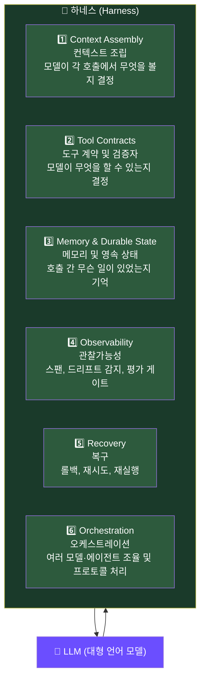
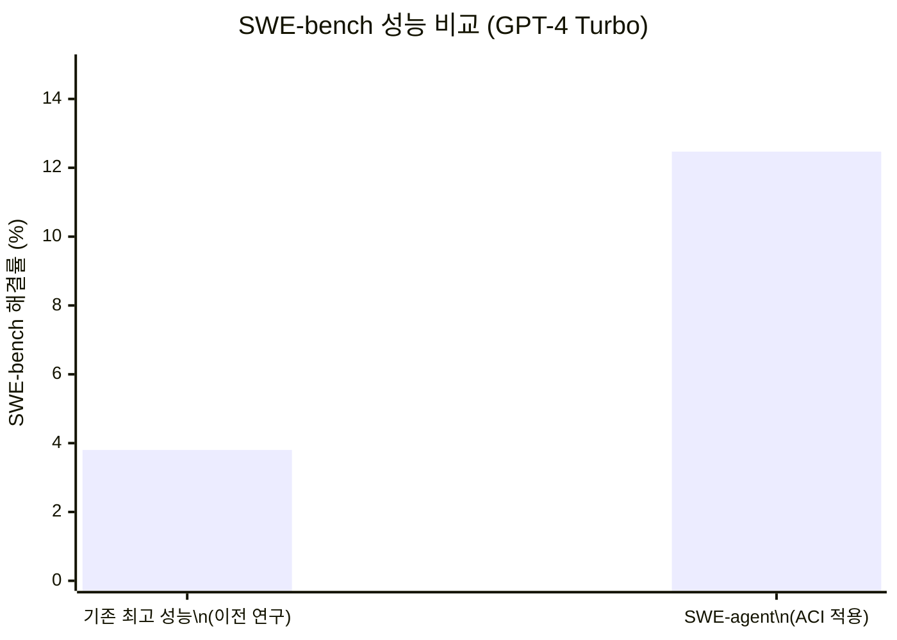
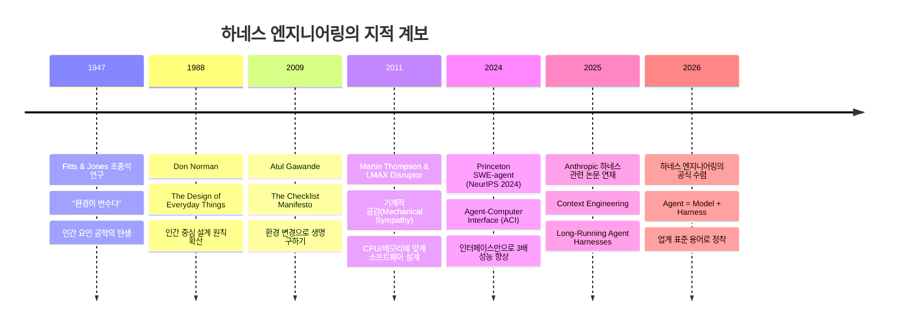
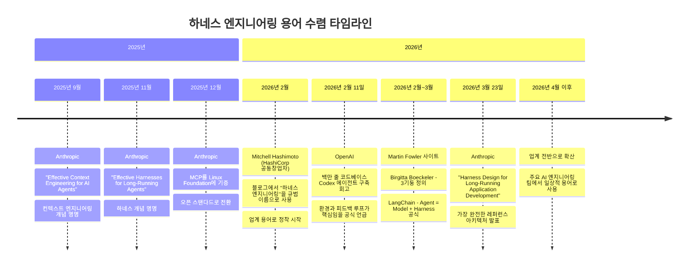
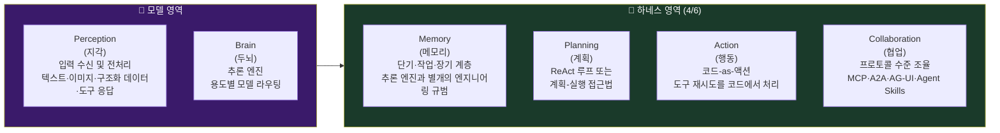
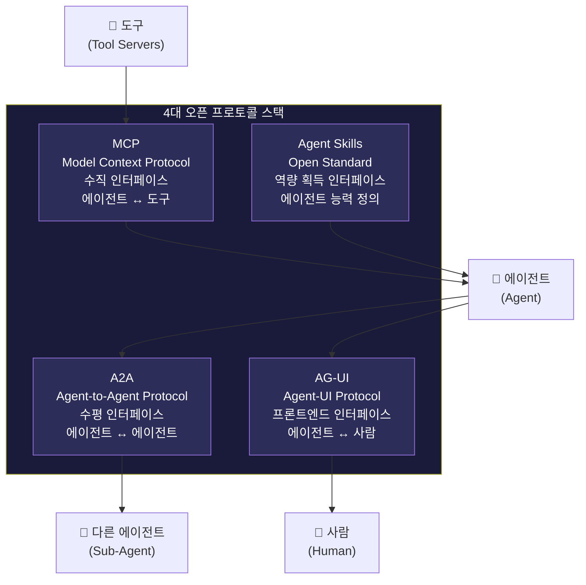
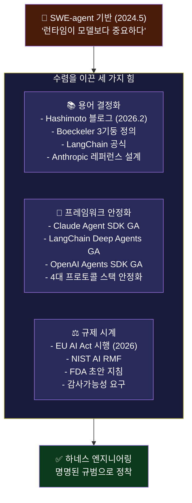

> **원문**: "What Is Harness Engineering? The Engineering Discipline for Production AI Agents"  
> **저자**: Rick Hightower (Spillwave Solutions, Claude Certified Architect)  
> **원문 게재일**: 2026년 5월 7일  
> **원문 링크**: https://medium.com/spillwave-solutions/what-is-harness-engineering-the-engineering-discipline-for-production-ai-agents-aaaa20997404  
> 

---

## 목차

1. [핵심 메시지: 모델은 어려운 부분이 아니다](#1-핵심-메시지-모델은-어려운-부분이-아니다)
2. [하네스(Harness)란 무엇인가](#2-하네스harness란-무엇인가)
3. [하네스가 수행하는 6가지 기능](#3-하네스가-수행하는-6가지-기능)
4. [이 규범의 탄생: 2024년 5월 SWE-agent의 계시](#4-이-규범의-탄생-2024년-5월-swe-agent의-계시)
5. [역사적 뿌리: 1947년 조종석 연구](#5-역사적-뿌리-1947년-조종석-연구)
6. [기계적 공감(Mechanical Sympathy)의 새로운 적용](#6-기계적-공감mechanical-sympathy의-새로운-적용)
7. [LLM의 4가지 고유 실패 모드](#7-llm의-4가지-고유-실패-모드)
8. [용어의 수렴: 2025년 후반~2026년 초의 격동](#8-용어의-수렴-2025년-후반2026년-초의-격동)
9. [하네스 내부와 모델 내부: 무엇이 어디에 속하는가](#9-하네스-내부와-모델-내부-무엇이-어디에-속하는가)
10. [에이전트 시스템의 6차원 해부학](#10-에이전트-시스템의-6차원-해부학)
11. [4대 오픈 프로토콜 스택](#11-4대-오픈-프로토콜-스택)
12. [하네스가 아닌 것: 가장 흔한 오해](#12-하네스가-아닌-것-가장-흔한-오해)
13. [수렴이 우연이 아닌 이유: 세 가지 동인](#13-수렴이-우연이-아닌-이유-세-가지-동인)
14. [규제 환경과 하네스 엔지니어링](#14-규제-환경과-하네스-엔지니어링)
15. [오늘날 에이전트를 구축하는 팀에게 주는 시사점](#15-오늘날-에이전트를-구축하는-팀에게-주는-시사점)
16. [실제 현장의 맥락: 2026년 업계 현황](#16-실제-현장의-맥락-2026년-업계-현황)
17. [참고문헌 및 출처](#17-참고문헌-및-출처)

---

## 1. 핵심 메시지: 모델은 어려운 부분이 아니다

이 글의 저자인 Rick Hightower는 AI 에이전트 개발 실무에서 가장 중요한 통찰을 도발적인 한 문장으로 시작한다. **"모델은 어려운 부분이 아니다. 오래 전부터 그래왔다."**

이 주장은 직관에 반하는 것처럼 들린다. 우리가 GPT-5니, Claude Sonnet이니, Gemini Ultra니 하면서 모델의 능력 경쟁에 집중하는 동안, 실제로 프로덕션 환경에서 AI 에이전트를 작동시키는 데 가장 중요한 요소는 모델 그 자체가 아니라 **모델을 둘러싼 런타임 환경**, 즉 하네스(Harness)라는 것이다.

저자는 Spillwave LLC라는 회사를 설립하기 이전부터, 그리고 "하네스"라는 용어가 존재하기 이전부터 하네스를 구축하고 있었다고 고백한다. 당시에는 이름도 없었고, 팀마다 다르게 불렀다. 누군가는 "래퍼(wrapper)"라 불렀고, 누군가는 "에이전트 루프(agent loop)", 혹은 "오케스트레이션 레이어(orchestration layer)", 또는 그냥 "런타임(runtime)"이라고 불렀다. 하지만 모두가 같은 문제를 해결하고 있었다.

### 개발 환경과 프로덕션 환경의 간극

실무에서 직면하는 가장 고통스러운 현실은, **데모는 잘 작동하지만 프로덕션에서는 무너진다**는 것이다. 이해관계자들에게 왜 이 복잡한 "비계(scaffolding)"가 필요한지 설명하기 어렵다. "개발 환경에서는 잘 돌아가는데 왜 이 모든 추가 작업이 필요한가?" 라는 질문이 끊임없이 제기된다.

문제는 6주 후 프로덕션에서 드리프트(drift)가 발생할 때 아무도 재현하지 못한다는 데 있다. 그때가 되어서야 비계가 얼마나 중요했는지 깨닫게 된다. 저자는 이 상황을 **"유리로 된 미닫이문을 보지 못하고 뛰어 들어가는 것"** 에 비유한다. 멈추지는 않았다. 그냥 유리를 뚫고 지나갔다. 상처를 입었다. 그 상처가 교훈이 됐다.

드리프트 감지 없이 프롬프트에 퓨샷(few-shot)을 추가하거나, 더 많은 도구를 붙이거나, 더 많은 서브에이전트 분해를 추가하는 것을 저자는 이렇게 표현한다: **"종이에 베인 상처를 덮은 채 알코올 수영장에서 수영하는 것이다. 그건 '최첨단 기술'이 아니라 의도적인 자해다."**

**이름을 붙이는 것이 문을 여는 손잡이를 만드는 것이다.** 공유된 용어가 생기면, 다음 팀은 유리를 뚫지 않아도 된다. 문을 보고, 손잡이를 찾고, 그냥 열고 들어가면 된다. 이것이 하네스 엔지니어링이 이 분야에 주는 가치다.

---

## 2. 하네스(Harness)란 무엇인가

### 한 단락으로 정의하는 하네스

**하네스는 대형 언어 모델(LLM)을 감싸고, 그 원시 텍스트 출력을 신뢰할 수 있는 시스템 동작으로 변환하는 엔지니어링된 런타임이다.**

그리고 **하네스 엔지니어링**은 이 런타임을 마치 SRE(Site Reliability Engineering)가 프로덕션 인프라를 코드로 다루듯, 일급 엔지니어링 아티팩트(first-class engineering artifact)로 취급하는 규범이다.

중요한 비유: 하네스는 모델이 실패하는 것을 막기 위한 `try-catch` 래퍼가 **아니다**. 하네스는 유능한 모델이 혼자서는 할 수 없는 더 크고, 더 길고, 더 자율적인 작업을 수행할 수 있게 해주는 **엔지니어링된 환경**이다.

좋은 조종석은 조종사가 추락하지 않도록 막는 것만이 아니라, **더 나쁜 조종석에서는 생존할 수 없는 임무를 수행할 수 있게 해준다.** 이 구분이 하네스라는 개념을 처음 접할 때 가장 많이 오해하는 부분이다.

### LangChain이 압축한 공식

업계의 수렴 이후, LangChain은 다음과 같은 간결한 공식으로 전체 그림을 정리했다:

```
Agent = Model + Harness
```

모델은 원시 지능(raw intelligence)을 제공한다. 하네스는 메모리, 도구, 재시도, 인간 승인, 관찰가능성을 관리하여 모델이 추론에 집중할 수 있게 한다.

---

## 3. 하네스가 수행하는 6가지 기능

하네스는 모델이 혼자서는 할 수 없는 정확히 6가지 일을 한다:



각 기능을 좀 더 상세히 설명하면 다음과 같다:

**① 컨텍스트 조립(Context Assembly)**: 모델이 각 호출에서 무엇을 볼지를 결정한다. 어떤 정보를 프롬프트에 포함할지, 어떤 순서로 배치할지, 얼마나 압축할지를 제어한다. 이것은 단순한 프롬프트 엔지니어링과 다르다. 하네스가 동적으로, 매 호출마다 컨텍스트를 조립하는 것이다.

**② 도구 계약 및 검증자(Tool Contracts & Validators)**: 모델이 무엇을 할 수 있는지를 결정한다. 어떤 도구에 접근할 수 있는지, 도구 출력이 올바른지 검증하며, 구문적으로 잘못된 출력이 시스템에 적용되기 전에 거부한다.

**③ 메모리 및 영속 상태(Memory & Durable State)**: 호출 간 무슨 일이 있었는지를 기억한다. 단기 메모리, 작업 메모리, 장기 메모리라는 각기 다른 계층으로 구성된다. LLM은 상태가 없으므로(stateless), 상태 관리는 전적으로 하네스의 책임이다.

**④ 관찰가능성(Observability)**: 모델이 무엇을 생산했는지를 감시한다. 분산 추적 스팬(spans), 드리프트 감지, 평가 게이트 등을 포함한다. 프로덕션에서 무슨 일이 일어나는지 보지 못하면 수정할 수 없다.

**⑤ 복구(Recovery)**: 무언가 잘못되었을 때 대응한다. 롤백, 재시도, 재실행을 포함하며, 장시간 실행되는 워크플로우가 중단된 지점에서 재개될 수 있도록 한다.

**⑥ 오케스트레이션(Orchestration)**: 여러 모델이나 에이전트가 관여할 때 조율한다. 어떤 에이전트가 어떤 작업을 맡을지, 결과를 어떻게 통합할지, 프로토콜 수준의 통신을 어떻게 처리할지를 결정한다.

---

## 4. 이 규범의 탄생: 2024년 5월 SWE-agent의 계시

대부분의 엔지니어링 규범은 공식적인 탄생일이 없다. 하네스 엔지니어링에는 있다. **2024년 5월**이다.

프린스턴 대학의 연구팀(Yang, Jimenez, Wettig, Lieret, Yao, Narasimhan, Press)이 **"SWE-agent: Agent-Computer Interfaces Enable Automated Software Engineering"** 이라는 논문을 발표했다. 이 논문은 나중에 NeurIPS 2024에서 arXiv 2405.15793로 발표되었다.

### 실험 설계: 놀라울 정도로 단순한 발상

이 팀이 한 일은 회고해보면 당연해 보이지만, 당시에는 범주 오류처럼 보였다.

그들은 **모델을 고정했다.** GPT-4 Turbo, 파인튜닝 없음, 프롬프트 트릭 없음. 그런 다음 모델과 코드베이스 사이에 작은 레이어를 구축하고 이것을 **에이전트-컴퓨터 인터페이스(ACI, Agent-Computer Interface)** 라고 불렀다. 그리고 오직 이 레이어만 변경했다.

ACI는 4가지 요소로 구성되었다:
- **파일 검색 결과 상한선**: 최대 50개 결과로 제한
- **상태 유지 파일 뷰어**: 한 번에 100줄 표시, 호출 간 위치 기억
- **편집 시 린터**: 구문적으로 깨진 패치를 적용 전에 거부
- **컨텍스트 윈도우 관리자**: 추적이 길어질수록 오래된 관찰을 압축

그것이 전부였다. 같은 모델, 같은 가중치, 같은 벤치마크.

### 결과: 3배 이상의 성능 향상



SWE-bench 성능이 3.8%에서 12.47%로 증가했다. **3배 이상의 향상, 오직 인터페이스 설계만으로.**

이 숫자 자체도 놀랍지만, 해석이 더 놀랍다. SWE-agent 팀이 의도적으로 측정 가능하게 증명한 것은, **모델 주변의 런타임이 모델 자체보다 더 중요할 수 있다**는 사실이었다. 그 시점까지 에이전트 연구의 암묵적 가정은 "더 나은 에이전트는 더 나은 모델이 필요하다"는 것이었다. ACI 절제 실험(ablation study)은 "더 나은 에이전트는 더 나은 인터페이스에서 나올 수 있다"는 것을 모델 고정 조건에서 증명했다.

이 논문은 이 규범의 기초 설계 문서다. 이후에 나오는 모든 것, 하네스 패턴, 워크플로우 패턴, 4대 프로토콜 스택, 프로덕션 회고록은 모두 SWE-agent가 증명한 것의 일반화다.

> 💡 **최신 동향**: SWE-agent는 2026년에도 계속 발전하고 있다. 2026년 2월, Claude 3.7 Sonnet과 결합한 SWE-agent 1.0이 SWE-Bench Verified에서 최고 성능(State of the Art)을 달성했다. Mini-SWE-Agent는 Python 코드 100줄로 SWE-bench verified에서 65%를 달성하기도 했다.

---

## 5. 역사적 뿌리: 1947년 조종석 연구

SWE-agent 저자들은 이 원칙을 발명한 것이 아니다. 그들은 명시적으로 그 이름을 밝혔다: **인간 요인 공학(human-factors engineering)**. 그 계보는 컴퓨팅보다 오래되었다.

### 피츠와 존스의 연구 (1947)

1947년, Paul Fitts와 Richard Jones는 **"항공기 조종 장치 작동 중 460건의 조종사 오류 경험에 기여한 요인 분석(Analysis of Factors Contributing to 460 Pilot Error Experiences in Operating Aircraft Controls)"** 을 발표했다. 이 연구는 전후 항공 사고 급증 이후 미 공군 항공 의학 연구소(USAF Aero Medical Laboratory)의 의뢰로 진행되었다.

당시 공군은 이 사고들을 "조종사 오류"로 분류하고 있었다. Fitts와 Jones는 조종사들을 면담하고 조종석을 직접 살펴봤다. 그들이 발견한 것은 조종사 오류가 아니었다. 그들이 발견한 것은:
- 같은 컨트롤이 항공기마다 다르게 배치되어 있었다
- 시각적으로 동일한 레버가 완전히 다른 기능을 수행했다
- 스트레스 상황에서 경험 많은 조종사들도 잘못된 컨트롤을 잡았다. 왜냐하면 환경이 인간이 실제로 행동하는 방식을 고려하지 않고 설계되었기 때문이다

### 결론: 환경을 재설계하라

그들의 결론은 전체 분야를 재구성했다. **"더 나은 조종사를 훈련하려 하지 마라. 환경을 재설계하라. 조종석이 변수다."**

이 결론은 인간 요인 공학을 탄생시켰고, Don Norman의 『일상적인 것들의 디자인(The Design of Everyday Things, 1988)』과 Atul Gawande의 『체크리스트 매니페스토(The Checklist Manifesto, 2009)』를 통해 전파되었다. 수술실과 중환자실 체크리스트 문헌들은 환경 변경으로 생명을 구할 수 있다는 것을 증명했다.

SWE-agent 논문은 LLM을 조종사 자리에 앉히고 같은 논리를 적용했다. **ACI는 에이전트를 위한 조종석 재설계다.**



이 맥락이 중요한 이유는, 하네스 엔지니어링을 80년 역사를 가진 측정 가능한 결과를 가진 전통 안에 위치시키기 때문이다. 이 규범은 유행이 아니다. 운영자가 같은 실수를 반복할 때, 환경이 변수라는 원칙이 적용될 때마다 참으로 입증된 원칙의 최신 사례다.

---

## 6. 기계적 공감(Mechanical Sympathy)의 새로운 적용

조종석 비유가 하나의 렌즈라면, 소프트웨어 엔지니어에게 더 강하게 닿는 다른 렌즈가 있다: **기계적 공감(Mechanical Sympathy)**.

이 용어는 레이싱 드라이버 Jackie Stewart가 만들었다. 그는 "자동차를 이해하지 못하면 빠르게 운전할 수 없다"고 말했다. Martin Thompson은 2011년경 LMAX Disruptor와 함께 이 개념을 소프트웨어 엔지니어링에 도입했다. 그의 주장은, CPU 캐시 라인, 분기 예측, 메모리 계층, 거짓 공유(false sharing), 페이지 폴트 등 하드웨어가 실제로 어떻게 동작하는지를 존중하는 코드를 작성하면, 범용 하드웨어에서 초당 수백만 번의 연산을 처리할 수 있다는 것이었다.

**기계적 공감은 실행되는 기반(substrate)에 맞서 싸우는 대신 적응하는 소프트웨어를 작성하는 규범이다.**

하네스 엔지니어링은 이 기계적 공감을 새로운 기반에 적용한 것이다. 기반은 LLM이고, 컨텍스트 메모리이며, 어텐션 예산이다.

### 두 규범의 대응 관계

| 기계적 공감 (소프트웨어, ~2011) | 하네스 엔지니어링 (AI 에이전트, ~2026) |
|---|---|
| CPU가 작동하는 방식에 맞는 소프트웨어 작성 | LLM이 작동하는 방식에 맞는 에이전트 작성 |
| 메모리가 작동하는 방식에 맞게 | 컨텍스트 메모리가 작동하는 방식에 맞게 |
| 디스크가 작동하는 방식에 맞게 | 어텐션 예산이 작동하는 방식에 맞게 |
| 해결 대상: 캐시 미스, 분기 오예측, 거짓 공유, 페이지 폴트 | 해결 대상: 컨텍스트 부패, 컨텍스트 패닉, lost-in-the-middle, U자형 어텐션 |

이 프레임은 계보를 더 명확하게 설명한다. 하드웨어 기계적 공감은 약 2011년에 소프트웨어 엔지니어들에게 CPU와 메모리 레이아웃을 존중하도록 가르쳤다. 2024년 SWE-agent 논문은 기계적 공감이 CPU에서 LLM으로 넘어간 순간을 표시했다. 같은 통찰이 새로운 기반에 적용되어 코딩 에이전트 성능을 3배 이상 높였다. 하네스 엔지니어링은 그 통찰을 프로덕션 에이전트 시스템 전체로 일반화한 것이다.

---

## 7. LLM의 4가지 고유 실패 모드

하네스 엔지니어링이 설계를 통해 회피하는 네 가지 실패 모드는 실제 프로덕션에서 반복적으로 발생하는, 이름 붙여지고 측정 가능한 현상들이다.

### 실패 모드 1: 컨텍스트 부패 (Context Rot)

컨텍스트 윈도우가 낡은(stale) 토큰이나 신호 낮은(low-signal) 토큰으로 채워질수록 모델 성능이 저하되는 현상이다. 컨텍스트가 쌓이면 쌓일수록 모델은 점점 더 나빠진다. 이것은 단순한 직관이 아니라 문서화된 성능 저하다.

**하네스의 해결책**: 컨텍스트 압축(context compression), 오래된 관찰 삭제, 핵심 정보만 남기기

### 실패 모드 2: 컨텍스트 패닉 (Context Panic)

컨텍스트 압박 하에서 에이전트가 단계를 건너뛰고 계획을 단락 처리(short-circuit)하기 시작하는 실패 모드다. 모델이 "나머지는 생략하겠습니다"라고 선언하거나, 이전 단계들을 완료하지 않은 채 결론으로 뛰어가는 현상이다.

**하네스의 해결책**: 작업 메모리 규율(working-memory discipline), 서브에이전트 격리

### 실패 모드 3: Lost-in-the-Middle (중간 분실)

긴 프롬프트의 중간에 묻힌 정보는 시작과 끝에 있는 정보에 비해 신뢰할 수 있게 덜 주목된다는 연구 결과다. TACL 2024에 발표된 "Lost in the Middle" 연구에서 재현 가능하게 확인되었다.

**하네스의 해결책**: 검색 순서 최적화, 중요 정보를 컨텍스트 시작이나 끝에 배치

### 실패 모드 4: U자형 어텐션 (U-shaped Attention)

Lost-in-the-Middle의 더 광범위한 일반화다. 모델의 어텐션은 컨텍스트의 시작과 끝에 집중되고 중간은 상대적으로 약해지는 U자형 패턴을 보인다.

**하네스의 해결책**: 구조화된 노트 테이킹(structured note-taking), 검색 기반 컨텍스트 관리

---

## 8. 용어의 수렴: 2025년 후반~2026년 초의 격동

하네스를 구축하는 실천은 이름보다 오래되었다. 2024년과 2025년 내내 에이전트 시스템을 프로덕션에 배포하는 팀들은 이미 도구 레이어, 컨텍스트 조립 파이프라인, 검증자, 메모리 계층, 관찰가능성 스팬, 복구 루프를 모델 주변에 구축하고 있었다. 공유된 어휘가 없었다. 모든 팀이 다르게 불렀고, 각 팀은 자신들의 버전이 맞춤 제작이라고 생각했다.

### Anthropic의 어휘 선점 (2025년 하반기)

Anthropic은 어휘를 먼저 형성했다. 대부분의 팀들이 여전히 모델 주변의 레이어를 "래퍼"나 "에이전트 루프"라고 부르던 2025년 하반기에, Anthropic은 이미 "하네스"를 예술 용어로 사용하는 엔지니어링 글을 발표하고 있었다:

- **2025년 9월 28일**: *"Effective Context Engineering for AI Agents"* — 컨텍스트 엔지니어링을 프롬프트 엔지니어링과 별개의 엔지니어링 관심사로 명명
- **2025년 11월 25일**: *"Effective Harnesses for Long-Running Agents"* — 하네스 자체를 고유한 설계 문제를 가진 별개의 아티팩트로 명명

또한 Anthropic은 이 규범의 기반 프리미티브들을 만들고 오픈했다:
- **모델 컨텍스트 프로토콜(MCP)**: 2025년 12월 Linux Foundation에 기증
- **Agent Skills 오픈 스탠다드**: agentskills.io에 공개 명세로 공개
- **서브에이전트 설계 패턴**: Claude Code에서 도입, 이후 Codex, OpenCode, Gemini CLI, LangChain Deep Agents에 채택



### Mitchell Hashimoto의 기여 (2026년 2월)

HashiCorp의 공동창업자 Mitchell Hashimoto는 2026년 2월 개인 블로그에서 자신의 AI 도입 여정을 소개하며 "하네스 엔지니어링"이라는 용어를 사용했다. 그는 에이전트 실수를 프롬프트가 아닌 **하네스를 개선함으로써** 체계적으로 수정하는 실천을 이 용어로 설명했다. Anthropic이 단어를 가지고 있었다면, Hashimoto는 그것을 규범의 이름으로 만들었다.

그의 핵심 원칙은 단순했다: "에이전트가 실수를 저지를 때마다, 그 에이전트가 다시는 같은 실수를 하지 않도록 하는 해결책을 엔지니어링하는 시간을 가져라. 대부분의 경우, 그 해결책은 개선된 하네스의 형태로 나타난다."

### OpenAI의 공식화 (2026년 2월 11일)

2026년 2월 11일, OpenAI는 Codex 에이전트로 100만 줄짜리 프로덕션 코드베이스를 구축한 공식 회고를 발표했다. 그들은 자신들의 주요 엔지니어링 과제가 모델 능력이 아니라 **모델 주변의 환경, 피드백 루프, 제어 시스템을 설계하는 것**이라고 설명했다. 이 포스트는 용어를 제도화했다. 세계 최전선 AI 연구소 중 두 곳이 이제 공개 엔지니어링 글에서 같은 어휘를 사용하고 있었다.

### Birgitta Boeckeler의 3기둥 정의 (2026년 2~3월)

Martin Fowler의 사이트에 글을 쓴 Birgitta Boeckeler는 하네스를 세 가지 관심사로 프레임화했다:
1. **컨텍스트 엔지니어링**: 모델이 무엇을 보는가
2. **아키텍처 제약**: 모델이 무엇을 할 수 있는가
3. **오류 가비지 컬렉션**: 나쁜 아티팩트와 드리프트를 전파되기 전에 지속적으로 정리

### Anthropic의 레퍼런스 아키텍처 (2026년 3월 23일)

마지막으로 Anthropic은 *"Harness Design for Long-Running Application Development"* 를 발표했다. 이것은 짧은 에세이가 아니라 컨텍스트 조립, 메모리 계층, 평가 게이트, 복구 루프, 장시간 실행 에이전트에 필요한 운영 패턴을 다루는 완전한 레퍼런스 아키텍처다. 이 포스트는 사실상 수렴 창(convergence window)을 닫았다. "하네스"라는 단어를 처음 인쇄물에 사용한 연구소가 업계가 이제 참조하는 레퍼런스 설계도 발표했다.

---

## 9. 하네스 내부와 모델 내부: 무엇이 어디에 속하는가

유용한 에이전트 설계는 에이전트의 어떤 차원이 모델 관심사이고 어떤 차원이 하네스 관심사인지 정확히 아는 데 달려 있다.

저자가 발견한 가장 명확한 작업 모델은 6차원으로 구성된다:

```
Agent = Perception + Brain + Memory + Planning + Action + Collaboration
```

이 6가지 차원 중 **2가지(Perception, Brain)는 주로 모델이 결정**하고, **나머지 4가지(Memory, Planning, Action, Collaboration)는 주로 하네스가 결정**한다. 4대 2라는 비율이 "엔지니어링 노력이 실제로 어디로 가는가?"라는 질문의 답이다. 하네스로 간다.

---

## 10. 에이전트 시스템의 6차원 해부학



### 지각 (Perception) - 모델 영역

에이전트가 입력을 수신하고 전처리하는 방법이다. 텍스트, 이미지, 구조화 데이터, 도구 응답을 포함한다. 입력이 모델에 어떻게 표현되는지는 주로 모델 선택과 프롬프트 설계에 의해 형성된다.

### 두뇌 (Brain) - 모델 영역

추론 엔진이다. 종종 하네스에 의해 라우팅되는 모델 패밀리를 포함한다. 추출을 위한 빠른 모델, 오케스트레이션을 위한 강력한 모델, 고위험 결정을 위한 프론티어 모델 등으로 구성될 수 있다.

### 메모리 (Memory) - 하네스 영역

메모리는 그 자체로 하나의 엔지니어링 규범이다. 단기, 작업, 장기 계층으로 나뉘며 추론 엔진과 별개다. 세션 간 지식 지속, 작업 컨텍스트 관리, 장기 지식 저장을 각기 다른 메커니즘으로 처리한다.

### 계획 (Planning) - 하네스 영역

두 가지 주요 접근법이 있다:
- **ReAct 루프**: 각 단계에서 추론하고 행동 (reason-then-act)
- **계획-실행 접근법**: 미리 분해하고, 가능한 경우 병렬로 단계 실행

### 행동 (Action) - 하네스 영역

점점 더 **코드-as-액션(code-as-action)** 방식이 주류가 되고 있다. 에이전트는 여러 도구를 호출하고, 코드에서 재시도를 처리하고, 단일 깔끔한 출력을 반환하는 짧은 스크립트를 작성한다. 이는 루프를 통해 개별 도구 호출을 스트리밍하는 것보다 효율적이다.

### 협업 (Collaboration) - 하네스 영역

이제 프로토콜 수준의 관심사가 되었으며, 4개의 오픈 스탠다드에 의해 관리된다.

---

## 11. 4대 오픈 프로토콜 스택



**MCP (Model Context Protocol)**: 에이전트와 도구 사이의 수직 인터페이스다. Anthropic이 2024년 도입한 후 2025년 12월 Linux Foundation 산하 Agentic AI Foundation에 기증했다. Claude Code, OpenAI Codex CLI, Cursor, GitHub Copilot, Goose, Gemini CLI에 구현되었다.

**A2A (Agent-to-Agent Protocol)**: 에이전트 사이의 수평 인터페이스다. 2026년 초 150개 이상의 조직의 지원을 받아 버전 1.0에 도달했다.

**AG-UI**: 에이전트와 인간 사용자 사이의 프론트엔드 인터페이스다. Amazon Bedrock AgentCore와 Microsoft Agent Framework에서 네이티브 지원을 받았다.

**Agent Skills 오픈 스탠다드**: 역량 획득 인터페이스다. agentskills.io에 공개 명세로 배포되었으며 Claude Code, OpenAI Codex CLI, Cursor, GitHub Copilot, Goose, Gemini CLI에 구현이 이루어졌다.

### 서브에이전트 패턴

이 4개 공식 프로토콜 외에, 하나의 준표준(quasi-standard)이 있다: **서브에이전트 패턴**. 메인 오케스트레이터 에이전트의 컨텍스트를 깨끗하게 유지하기 위해 프로세스 내의 서브에이전트에게 개별 작업을 위임하는 것이다. Claude Code가 도입하고 이후 Codex, OpenCode, Gemini CLI, LangChain Deep Agents가 채택했다.

2026년 4월 기준으로 이 기반 프로토콜 레이어는 모두 충분히 안정적으로 빌드에 사용할 수 있다.

---

## 12. 하네스가 아닌 것: 가장 흔한 오해

용어에 대한 가장 일반적인 오독은 **실패 방지 프레임**에서 나온다. 저자는 이것을 명확히 반박한다:

하네스는 **다음이 아니다**:
- 모델 실패를 방지하는 `try/catch` 블록
- 도덕적 공황의 의미에서의 가드레일
- 모델이 당혹스러운 말을 하지 못하게 막기 위한 래퍼

하네스는 **모델이 혼자서는 할 수 없는 작업을 할 수 있게 해주는 것**이다.

조종석 비유가 정확하다. 1944년 전투기의 조종사와 현대 플라이-바이-와이어 전투기의 조종사는 비슷한 반사 신경을 가지고 있다. 그들이 달성할 수 있는 것의 차이는 압도적으로 조종석, 항공 전자 장비, 기체에 있다. 같은 조종사, 다른 작전 범위(envelope). 하네스 엔지니어링은 새로운 작전 범위를 구축하는 것이다.

**역량 프레임이 중요한 이유**: 하네스를 실패 방지 수단으로 취급하면, 더 적은 나쁜 결과로 측정한다. 역량 활성화로 취급하면, 더 크고, 더 길고, 더 자율적으로 성공적으로 완료된 작업으로 측정한다. 프레임 전환을 이룬 프로덕션 팀들은 두 번째 지표가 실제로 비즈니스를 움직이는 것이라고 보고한다.

---

## 13. 수렴이 우연이 아닌 이유: 세 가지 동인

SWE-agent 기반 위에서 지난 12개월 동안 세 가지 힘이 수렴했다. 어떤 것도 조율되지 않았다.

### 동인 1: 용어의 결정화

2026년 2월, Hashimoto의 에세이, Birgitta Boeckeler의 Martin Fowler 사이트의 3기둥 정의, LangChain의 "에이전트 하네스의 해부학", Anthropic의 하네스 설계 논문이 몇 주 사이에 나타났다. 그것들이 수렴한 것은 각자가 풀고 있던 문제가 같은 형태를 가졌기 때문이다. AGENTS.md라는 오픈 컨벤션은 이 작업에서 나와 1년 미만에 60,000개 이상의 프로젝트에 채택되었다.

### 동인 2: 프레임워크의 안정화

Claude Agent SDK, LangChain Deep Agents, 재구축된 OpenAI Agents SDK가 모두 지난 6개월 내에 일반 가용성(GA)에 도달했다. 그 아래의 4대 프로토콜 스택도 같은 시기에 안정화되었다.

### 동인 3: 규제 시계

이것이 세 번째이자 가장 과소평가된 동인이다. EU AI Act 시행 마감이 2026년에 적중했다. NIST의 AI 리스크 관리 프레임워크는 현재 미국 연방 계약업체에게 사실상 표준이다. FDA는 규제 환경에서의 AI에 대한 초안 지침을 발표했다.

컴플라이언스 팀들은 이제 엔지니어링 팀에게 하네스가 제공하는 바로 그 감사가능성(auditability)을 보여달라고 요청하고 있다. **블랙박스 프롬프트는 감사할 수 없다. 기록하고, 감시하고, 통제하는 엔지니어링된 하네스만 감사할 수 있다.**



---

## 14. 규제 환경과 하네스 엔지니어링

2026년의 규제 환경은 하네스 엔지니어링을 선택이 아닌 필수로 만드는 추가적인 압력을 가하고 있다.

**EU AI Act**: 2026년 시행 마감이 도래했다. 고위험 AI 시스템은 문서화, 감사 추적, 설명가능성을 갖춰야 한다. 하네스가 없으면 이 요건을 충족할 수 없다.

**NIST AI RMF**: 미국 연방 계약업체들에게 사실상 표준이 되었다. AI 시스템의 위험 관리, 모니터링, 거버넌스를 요구하며, 이 모든 것이 하네스 설계의 핵심 관심사다.

**FDA 초안 지침**: 규제 환경에서 AI 사용을 위한 초안 지침을 발표했다. 의료 AI가 하네스 없이 배포될 수 없는 시대가 왔다.

컴플라이언스의 핵심 통찰: **블랙박스 프롬프트는 감사할 수 없다.** 프롬프트가 무엇을 했는지, 어떤 정보를 봤는지, 어떤 결정을 내렸는지 추적할 방법이 없다. 반면 엔지니어링된 하네스는 모든 호출, 모든 컨텍스트 조립, 모든 도구 사용, 모든 출력에 대한 감사 추적을 자연스럽게 생성한다.

---

## 15. 오늘날 에이전트를 구축하는 팀에게 주는 시사점

저자는 명확한 실용적 메시지로 마무리한다. **당신은 하네스 엔지니어링을 하고 있다. 그것을 그렇게 부르든 안 부르든 간에.**

공유 어휘 없이 하는 비용은 실제다. 팀들은 같은 패턴을 재발명한다. 같은 실패 모드를 놓친다. 같은 인프라를 세 번 재구축한다.

### 현재 활용 가능한 자원들

어휘는 이제 충분히 안정적으로 사용할 수 있다. 레퍼런스 설계들이 공개되어 있다:
- Anthropic의 3개 하네스 포스트 (2025년 9월, 11월, 2026년 3월)
- SWE-agent ACI 절제 실험
- LangChain의 Deep Agents 하네스 해설

패턴 카탈로그들은 어떤 조율도 없이 같은 형태에 수렴하고 있다. 하네스 레이어 아래의 오픈 프로토콜(MCP, A2A, AG-UI, Agent Skills)은 빌드에 사용할 수 있을 만큼 충분히 안정적이다.

### 용어 전환의 시점

지금까지 "래퍼", "루프", "런타임"이라고 불러왔다면, 이제 전환할 때다. 하네스가 올바른 이름이다. 규범은 하네스 엔지니어링이다.

그리고 원칙은 1947년 Fitts와 Jones가 명확히 표현하고, SWE-agent 팀이 2024년 LLM에 적용한 것과 동일하며, 모든 세대에서 참이다: **운영자가 같은 실수를 반복할 때, 환경이 변수다.**

---

## 16. 실제 현장의 맥락: 2026년 업계 현황

검색을 통해 확인된 2026년 현재 업계의 실제 상황을 추가로 정리한다.

### AI 에이전트 프로젝트의 88% 실패율

AI 에이전트 프로젝트의 88%가 프로덕션에 도달하지 못하며, 하네스 엔지니어링은 이 격차를 줄이는 규범으로 주목받고 있다. 하네스 없이 에이전트를 배포하려는 시도가 얼마나 위험한지를 보여주는 수치다. 주목할 점은, 실패의 27%는 모델 한계나 하네스 아키텍처가 아닌 데이터 품질 문제에서 비롯된다는 사실이다. 하네스만으로 모든 것이 해결되지 않는다는 현실적인 경고이기도 하다.

### 프로덕션 하네스의 5개 레이어

프로덕션 등급 하네스는 다섯 개의 레이어를 포함한다: 도구 오케스트레이션, 검증 루프, 컨텍스트 및 메모리, 가드레일, 관찰가능성.

이 오케스트레이션, 검증, 메모리, 가드레일, 관찰가능성이 AI 에이전트 주변에 구축되는 것이 출력이 안전하고 규모 있게 프로덕션에 도달하는지를 결정한다. 이 레이어에 투자하는 팀들이 에이전트 지원 코드를 실제 시스템에 지속적으로 투입하는 팀들이다.

### Microsoft Azure SRE 에이전트 사례

Microsoft의 Azure SRE 에이전트는 35,000건 이상의 프로덕션 인시던트를 자율적으로 처리했으며, Azure App Service의 평균 해결 시간을 40.5시간에서 3분으로 단축했다. 이 사례는 하네스 엔지니어링의 실질적 비즈니스 가치를 보여주는 가장 강력한 증거 중 하나다.

이 아키텍처는 MCP 도구, 텔레메트리, 코드 저장소, 인시던트 관리 플랫폼을 단일 에이전트 하네스에 통합하고 인간-루프(human-in-the-loop) 거버넌스를 갖췄다.

### 하네스 엔지니어링의 3세대 진화

현재의 하네스 엔지니어링은 AI 코딩 에이전트의 세 번째 단계에 해당한다. 프롬프트 엔지니어링, 컨텍스트 엔지니어링에 이어, 이제는 자율성, 정확성, 제어의 문제를 다루고 있다.

하네스 엔지니어링은 핵심 LLM을 고정된 유틸리티, 즉 추론 계산기로 취급한다. 안전성, 실행 정확도, 다단계 오케스트레이션, 적응형 메모리를 보장하는 책임은 모델에서 제거되어 호스트 애플리케이션의 인프라에 직접 부여된다.

### AGENTS.md의 폭발적 채택

AGENTS.md는 이 움직임에서 나온 오픈 컨벤션으로, 1년 미만에 60,000개 이상의 프로젝트에 채택되었다. 이는 하네스 엔지니어링이 단순한 이론적 개념이 아니라 실제 개발 현장에서 빠르게 표준화되고 있음을 보여준다.

---

## 17. 참고문헌 및 출처

### 원문 참고문헌 (저자 Rick Hightower 제공)

1. Yang, Jimenez, Wettig, Lieret, Yao, Narasimhan, Press. *SWE-agent: Agent-Computer Interfaces Enable Automated Software Engineering.* NeurIPS 2024; arXiv 2405.15793.
2. Jimenez, Yang, Wettig, Yao, Pei, Press, Narasimhan. *SWE-bench: Can Language Models Resolve Real-World GitHub Issues?* ICLR 2024.
3. Fitts and Jones. *Analysis of Factors Contributing to 460 Pilot Error Experiences in Operating Aircraft Controls.* USAF Aero Medical Laboratory, 1947.
4. Don Norman. *The Design of Everyday Things*, Revised and Expanded Edition. Basic Books, 1988/2013.
5. Atul Gawande. *The Checklist Manifesto.* Metropolitan Books, 2009.
6. Martin Thompson et al. *LMAX Disruptor* (mechanical sympathy in high-performance Java systems), circa 2011.
7. Anthropic. *Effective Context Engineering for AI Agents.* September 2025.
8. Anthropic. *Effective Harnesses for Long-Running Agents.* November 2025.
9. Anthropic. *Harness Design for Long-Running Application Development.* March 2026.
10. Mitchell Hashimoto. Personal blog, February 2026 (coined harness engineering as a discipline name).
11. OpenAI. *Building a million-line production codebase with Codex agents.* February 11, 2026.
12. Birgitta Boeckeler / Martin Fowler's site. Three-pillar harness definition (context engineering, architectural constraints, error garbage collection), February 2026.
13. LangChain. *Anatomy of an Agent Harness and Improving Deep Agents with Harness Engineering*, 2026.
14. Liu, Lin, Hewitt, Paranjape, Bevilacqua, Petroni, Liang. *Lost in the Middle: How Language Models Use Long Contexts.* TACL 2024.
15. Du et al. *Context Length Alone Hurts LLM Performance Despite Perfect Retrieval.* EMNLP Findings 2025; arXiv 2510.05381.

### 추가 참고 자료 (최신 검색 기반)

- Atlan. *What Is Harness Engineering AI? The Definitive 2026 Guide.* https://atlan.com/know/what-is-harness-engineering/ (2026년 4월)
- Faros. *Harness Engineering: Making AI Coding Agents Work in 2026.* https://www.faros.ai/blog/harness-engineering (2026년 5월)
- NxCode. *What Is Harness Engineering? Complete Guide for AI Agent Development (2026).* https://www.nxcode.io/resources/news/what-is-harness-engineering-complete-guide-2026 (2026년 3월)
- GitHub ai-boost. *Awesome Harness Engineering.* https://github.com/ai-boost/awesome-harness-engineering (2026년 5월)
- SWE-agent GitHub. https://github.com/SWE-agent/SWE-agent (Princeton/Stanford)

---

> 📅 **작성 일자**: 2026-05-27
