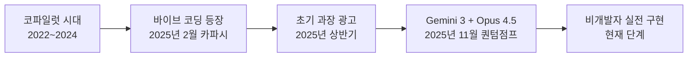
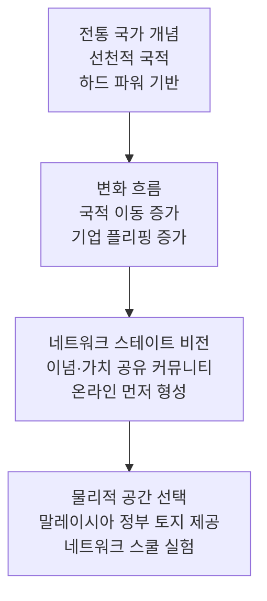
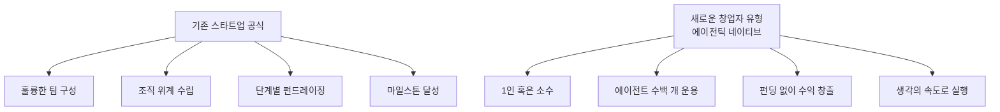
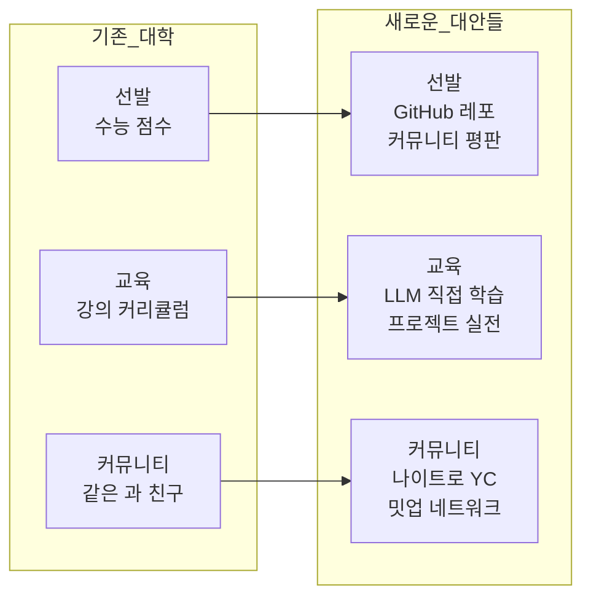
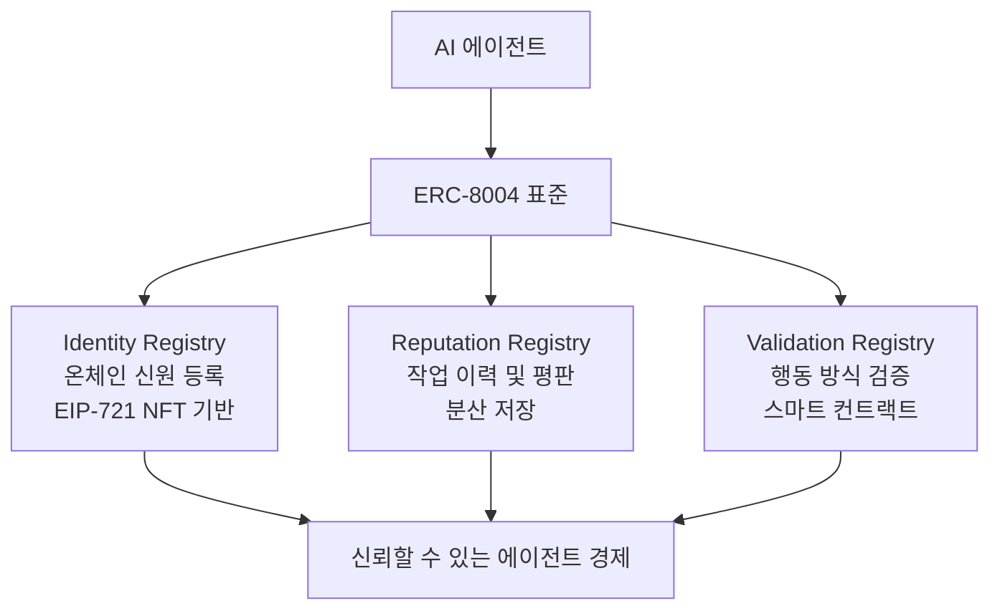
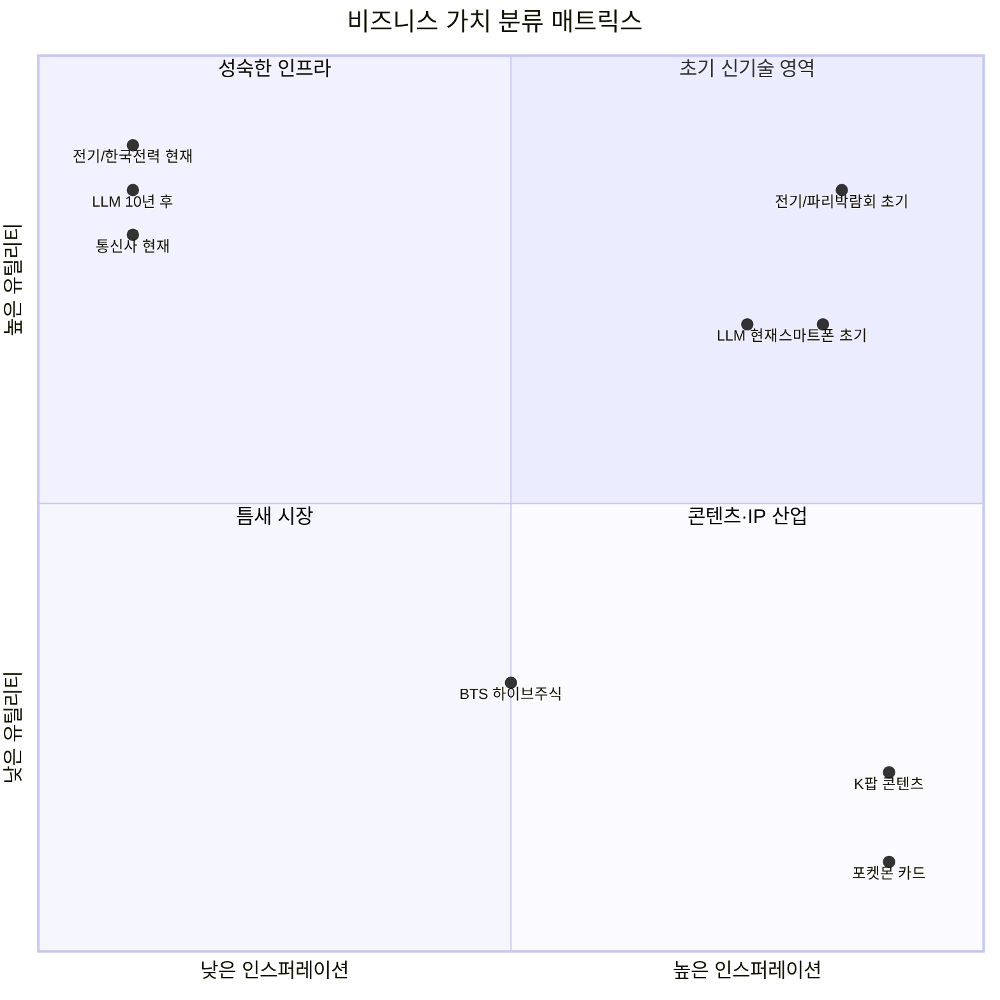
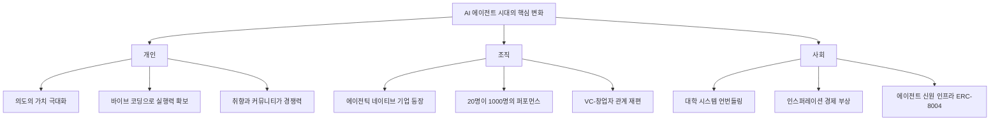

## AI 프론티어 EP.98 — 해시드 김서준 대표 심층 분석

> **출처:** YouTube · AI 프론티어 채널 (노정석 진행)  
> **게스트:** 김서준 해시드(Hashed) 대표  
> **공개일:** 2026년 5월 26일  
> 

---

## 목차

1. [에피소드 개요와 핵심 메시지](#1-에피소드-개요와-핵심-메시지)
2. [김서준과 해시드: 배경 이해](#2-김서준과-해시드-배경-이해)
3. [바이브 코딩의 등장과 코파일럿의 차이](#3-바이브-코딩의-등장과-코파일럿의-차이)
4. [AI 검색 시대의 신호: AEO와 GEO](#4-ai-검색-시대의-신호-aeo와-geo)
5. [네트워크 스테이트와 발라지 스리니바산](#5-네트워크-스테이트와-발라지-스리니바산)
6. [LLM 검색 랭킹의 역공학과 GPTO](#6-llm-검색-랭킹의-역공학과-gpto)
7. [정보 유통의 공정성과 스테이블코인 콘텐츠 생태계](#7-정보-유통의-공정성과-스테이블코인-콘텐츠-생태계)
8. [딸깍의 순간: 비개발자 1인 창업의 현실화](#8-딸깍의-순간-비개발자-1인-창업의-현실화)
9. [Gemini 3와 Claude Opus 4.5: 퀀텀 점프](#9-gemini-3와-claude-opus-45-퀀텀-점프)
10. [이더리움 밸류에이션 대시보드를 4시간에](#10-이더리움-밸류에이션-대시보드를-4시간에)
11. [비행기에서 만든 아부다비 여행 플랫폼](#11-비행기에서-만든-아부다비-여행-플랫폼)
12. [VC의 위기와 새로운 창업자 종의 등장](#12-vc의-위기와-새로운-창업자-종의-등장)
13. [해시드가 줄 수 있는 세 가지 가치](#13-해시드가-줄-수-있는-세-가지-가치)
14. [AI 네이티브 탤런트의 정의](#14-ai-네이티브-탤런트의-정의)
15. [대학 시스템의 언번들링과 커뮤니티 기반 학습](#15-대학-시스템의-언번들링과-커뮤니티-기반-학습)
16. [에이전트 시대의 신원과 평판: ERC-8004](#16-에이전트-시대의-신원과-평판-erc-8004)
17. [끝까지 남는 영역: 취향과 인스퍼레이션 경제](#17-끝까지-남는-영역-취향과-인스퍼레이션-경제)
18. [TCG 카드 펀드와 IP 소유의 새로운 방식](#18-tcg-카드-펀드와-ip-소유의-새로운-방식)
19. [에이전트 생태계 인프라 투자 관점](#19-에이전트-생태계-인프라-투자-관점)
20. [인간 김서준을 만든 것들](#20-인간-김서준을-만든-것들)
21. [AI 시대의 교육 재설계](#21-ai-시대의-교육-재설계)
22. [소스코드 공유 문화와 가치의 소재](#22-소스코드-공유-문화와-가치의-소재)
23. [마무리: 관계의 깊이와 의도가 있는 시간](#23-마무리-관계의-깊이와-의도가-있는-시간)
24. [종합 평가 및 시사점](#24-종합-평가-및-시사점)

---

## 1. 에피소드 개요와 핵심 메시지

AI 프론티어 EP.98은 해시드 대표 김서준이 출연하여 AI 에이전트 시대, 블록체인과 AI의 결합, 새로운 창업자 유형의 등장, 그리고 인간에게 최후까지 남을 가치가 무엇인지를 약 1시간 30분에 걸쳐 깊이 있게 다룬 대담이다.

에피소드 전체를 관통하는 핵심 명제는 단 하나다.

> **"AI가 실행을 담당하는 시대가 되면, 인간에게 남는 것은 오직 의도(Intent)뿐이다."**

이 한 문장 안에는 개인의 삶, 기업 조직, 투자 생태계, 교육 시스템, 그리고 문명 전반에 걸친 근본적인 재편에 대한 김서준의 세계관이 압축되어 있다. 대기업 직원은 위에서 내려오는 의도에 따라 실행을 반복하고, 스타트업 창업자는 의도의 공간이 넓어지며, 에이전틱 네이티브 기업으로 갈수록 한 사람이 에이전트 수백 개를 거느리며 자신의 의도만으로 회사를 운영하는 시대가 도래한다는 것이다.

---

## 2. 김서준과 해시드: 배경 이해

김서준은 2017년 해시드(Hashed)를 공동 창업한 인물로, 한국을 대표하는 블록체인·Web3 전문 벤처캐피탈을 이끌고 있다. 컴퓨터공학 전공 출신이지만 실제 개발자로 활동한 기간보다 투자자로서의 커리어가 훨씬 길며, 대담 시점 기준으로 10년 이상 터미널에서 손을 뗀 상태였다.

해시드는 2017년 설립 당시 6억 원의 자본금으로 시작해 불과 1년 반 만에 2,500억 원 이상 규모의 크립토펀드로 성장했다. 서울 본사를 중심으로 샌프란시스코, 싱가포르, 아부다비 등에 글로벌 거점을 두고 있으며, 누적 200여 개 이상의 Web3·AI·콘텐츠 기업에 투자해왔다. 최근에는 바이브랩스(Vibe Labs)에서 나이트로(Naitro)로 이름을 바꾼 AI 네이티브 창업자 육성 프로그램을 운영하며 기존 VC 모델의 재정의를 시도하고 있다.

김서준은 페이스북에 정기적으로 AI와 미래에 관한 에세이를 게재하며, 이 글들의 깊이와 일관성이 업계에서 높은 평가를 받고 있다. 노정석 진행자는 그를 "에메랄드 캐슬"—즉, 꿈꾸는 미래상에 대한 선명한 비전을 가진 인물—이라고 표현했다.

---

## 3. 바이브 코딩의 등장과 코파일럿의 차이

### 코파일럿 시대의 한계

바이브 코딩(Vibe Coding)이라는 개념은 2025년 2월 안드레이 카파시(Andrej Karpathy, 전 테슬라 AI 책임자, OpenAI 공동창업자)가 처음 제시했다. 코파일럿(Copilot)과 바이브 코딩 사이의 가장 근본적인 차이는 인간과 AI의 역할 비중에 있다.

코파일럿은 인간이 주도하고 AI가 보조하는 구도다. 코드의 뼈대는 인간이 직접 잡고, AI는 디버깅이나 미완성 부분을 채워주는 역할을 한다. 마이크로소프트 제품에 코파일럿이 탑재되었을 때도 "내가 장표를 만들면 AI가 조금 꾸며준다"는 수준이었다.

반면 바이브 코딩은 자연어로 의도를 전달하면 AI가 실제 작동하는 코드를 통째로 만들어주는 방식이다. 인간은 "무엇을 만들고 싶다"는 의도와 맥락만 제공하면 된다.

### 초기에는 과장 광고였다

김서준은 솔직하게 털어놓는다. 2025년 초 바이브 코딩 영상들이 쏟아져 나왔을 때, 직접 시도해보니 생각보다 잘 되지 않았다고. 컴퓨터공학 전공 출신임에도 불구하고 10년 이상 실전 코딩을 쉬었던 터라, 다시 공부해서 ROI를 내기 어렵겠다는 판단에 두세 달에 한 번씩 시도해보다가 포기를 반복했다.

이는 2026년 현재 시점에서 돌아보면 중요한 시기 인식을 제공한다. 2025년 초 바이브 코딩은 데모 영상의 완성도와 실제 사용 경험 사이에 상당한 괴리가 있었다.

---

## 4. AI 검색 시대의 신호: AEO와 GEO

### SEO에서 AEO·GEO로의 전환

전환의 신호탄은 GPTO라는 서비스와 어크로스(Across)라는 회사에서 왔다. 대표 이재홍은 제일기획 출신의 완전한 비개발자였다. 그는 2년간 한국을 떠나 발리, 말레이시아, 싱가포르를 전전하며 독학으로 개발을 익혔고, 그 결과물이 GPTO 서비스였다.

GPTO가 포착한 변화는 명쾌했다. 사람들이 구글 검색을 거의 안 하고 AI 검색으로 트래픽이 이동하고 있다는 것이다. AI는 쿼리에 대해 많아야 5개의 답변만 추천한다. 여기에 들지 못하면 선택지 자체가 사라진다. 인터넷 광고 시장의 근간인 SEO 생태계 전체가 흔들리는 구조적 변화다.

**AEO(Answer Engine Optimization, 답변 엔진 최적화)** 와 **GEO(Generative Engine Optimization, 생성형 엔진 최적화)** 는 이 새로운 환경에 대응하는 방법론이다.

- **SEO:** 구글 검색 결과 페이지에서 상위 노출을 목표로 하는 전통적인 최적화
- **AEO:** 검색엔진의 AI 요약(Featured Snippet, AI Overview) 등에 콘텐츠가 정확한 출처로 반영되도록 최적화
- **GEO:** ChatGPT, Perplexity, Claude, Gemini 등 생성형 AI가 답변을 생성할 때 자신의 브랜드/콘텐츠가 인용되도록 최적화

2026년 현재 데이터에 따르면, 검색의 60%가 클릭 없이 끝나며, AI 오버뷰가 표시될 경우 1위 자리의 클릭률이 2.6%까지 하락한다. 생성형 AI 플랫폼에서 유입되는 트래픽은 1년 사이 300% 이상 증가했다.

### LLM 검색 랭킹의 역공학

GPTO가 구현한 핵심 기술은 LLM의 웹 검색 방식을 역공학(reverse engineering)한 것이다. 방법은 의외로 간단하면서도 깊다. ChatGPT에게 답변을 요청한 후, 그 답변의 근거를 "너 왜 이걸 찾았어? 무엇으로 검색했어?"라고 역으로 물으면, AI가 사용한 툴 콜(tool call) 목록을 보여준다는 점을 활용했다.

각 LLM마다 웹 검색 시 선호하는 쿼리 패턴과 소스 유형이 다르다. 이를 수천 번의 테스트를 통해 파악하고, 각 LLM이 "쫓아올 만한 길목"에 콘텐츠를 배치하는 방식이다. 김서준은 이를 "헨젤과 그레텔처럼 LLM이 따라올 만한 길목에 쿠키를 계속 깔아놓는 것"이라고 묘사했다.

---

## 5. 네트워크 스테이트와 발라지 스리니바산

이재홍 대표가 GPTO를 개발한 배경에는 발라지 스리니바산(Balaji Srinivasan)이 주도하는 네트워크 스쿨(Network School)이 있었다. 발라지는 앤드리슨 호로위츠(a16z)의 제너럴 파트너와 코인베이스 CTO를 역임한 인물로, 샌프란시스코 베이 에어리어에서 가장 영향력 있는 사상가 중 한 명으로 꼽힌다.

그는 3년 전부터 **네트워크 스테이트(Network State)** 라는 개념을 책과 컨퍼런스를 통해 발전시키고 있다. 핵심 개념은 국가가 네트워크 기반으로 재구성될 수 있다는 것이다.

전통적인 국적은 선천적으로 획득되고, 국가의 힘은 군사력 같은 하드 파워에서 나왔다. 국적을 바꾸는 것도 극도로 어려웠다. 그러나 이제 이 개념이 변하고 있다. 규제 환경, 과세 체계, 시장 조건을 찾아 사람과 기업이 자유롭게 이동하는 시대에, 국적은 점점 '멤버십'으로 바뀌고 있다는 것이다.

말레이시아 총리가 발라지의 개념에 공감해 실제로 땅을 제공, 현재 약 200명이 상주하는 코워킹 커뮤니티 공간이 만들어져 있다. 이 공간이 바로 네트워크 스쿨이며, 이재홍 대표가 이곳에서 2년간 체류하며 GPTO를 개발했다.

---

## 6. LLM 검색 랭킹의 역공학과 GPTO

비개발자였던 이재홍이 이처럼 기술적인 문제를 풀어낼 수 있었다는 사실 자체가 김서준에게 큰 충격을 주었다. LLM이라는 도구가 천재 엔지니어가 해야 할 일을 개발 비전공자도 할 수 있는 수준으로 끌어내렸다는 증거였기 때문이다.

두 번째로 충격적이었던 것은 회사를 혼자 운영한다는 점이었다. 보통 스타트업을 창업하면 백엔드 개발자, 웹 개발자, iOS/안드로이드 개발자, UX 디자이너, 마케터가 각각 필요하다는 공식이 통용되어왔다. 그런데 이재홍은 이 모든 역할을 혼자 소화하고 있었다.

돈도 벌기 시작했다. 그것도 VC 펀딩 없이.

---

## 7. 정보 유통의 공정성과 스테이블코인 콘텐츠 생태계

어크로스의 문제의식은 단순히 SEO의 대안을 만드는 것에 머물지 않는다. 이재홍이 가진 더 근본적인 문제의식은 "현재 우리가 접하는 정보는 과연 공정하게 유통되는가?"라는 질문이다. 미국의 거대 미디어 재벌과 정치 권력이 '진실'을 규정하는 현재 구조에 대한 비판적 시각이다.

이 관점에서 어크로스가 준비하는 모델은 콘텐츠 생태계를 탈중앙화하는 것이다. 네이버 블로그가 좋은 콘텐츠에 수익을 제공해 참여자를 모으고, 트위터/X가 일정 임팩트 이상의 콘텐츠에 수익을 지급하는 것처럼, 사람들이 AI가 학습하는 채널에 콘텐츠를 올리고 스테이블코인으로 보상을 받는 생태계를 구축하려 한다.

이는 소수의 광고주 중심으로 돌아가는 현재 정보 유통 구조에 대한 블록체인 기반의 대안이다. 랭킹 권력의 탈중앙화라는 개념으로도 읽힌다.

---

## 8. 딸깍의 순간: 비개발자 1인 창업의 현실화

이재홍을 직접 만나고, 그의 작업 방식을 눈으로 확인한 순간이 김서준에게 결정적인 전환점이 되었다. 지인이 자신의 눈앞에서 실제로 해내는 것을 보는 것은, 미국 오피스를 통해 간접적으로 트렌드를 파악하는 것과는 차원이 다른 경험이었다.

"이제 올 게 왔다. 완전 비개발자가 이렇게 기술적인 문제를 풀면서 혼자 모든 걸 다 하면서 돈까지 벌기 시작한 걸 보고서, 큰일 났다, 이제 VC 망했구나, 그 생각을 하게 됐습니다."

모든 것을 바이브 코딩으로 만들고 있었다. 이 순간을 김서준은 "딸깍"이라는 표현으로 설명한다. 눈에 보이는 것은 다 만들 수 있는 세상이 되어버렸다는 깨달음의 순간이다.

---

## 9. Gemini 3와 Claude Opus 4.5: 퀀텀 점프

이재홍과의 만남으로 다시 바이브 코딩을 시작하려는 찰나, 2025년 11월 초 두 가지 중요한 모델이 연달아 출시되었다.

첫 번째는 Gemini 3(Google의 최신 Gemini 모델)로, 바이브 코딩 관점에서 이전 버전 대비 뚜렷한 퀀텀 점프가 있었다는 평가다. 그리고 불과 일주일 후 Claude Opus 4.5가 출시되었다. 김서준은 이 두 모델의 출시 시점에 맞춰 실제 바이브 코딩을 본격 시작하는 행운을 누렸다.

Opus 4.5가 만들어낸 비포·애프터는 현재도 업계에서 회자될 만큼 컸다. 처음에는 Claude Code가 아닌 웹 인터페이스만으로 작업을 시작했다가, 약 보름 후 터미널 환경으로 전환했다. 그 정도로 그는 개발 환경과 멀어져 있었지만, 그럼에도 불구하고 실질적인 결과물을 만들어낼 수 있었다는 점이 중요하다.

2026년 현재 바이브 코딩의 확산을 보여주는 수치들은 인상적이다. 전 세계에서 생성되는 코드의 41%가 AI의 손을 거치고 있으며, Y Combinator의 2025년 겨울 배치 스타트업 중 25%는 코드베이스의 95% 이상을 AI가 작성했다고 밝혔다. 개발자의 84%가 이미 AI 도구를 사용하고 있거나 사용할 계획이라고 응답했다.

---

## 10. 이더리움 밸류에이션 대시보드를 4시간에

Claude Opus 4.5를 처음 사용한 날, 김서준이 시도한 첫 번째 프로젝트는 이더리움의 가치 평가 대시보드를 만드는 것이었다. 이더리움이 왜 가치 있는지를 데이터로 보여주고 싶다는 생각을 몇 년 동안 품어왔지만, 실행에 옮기지 못하고 있던 과제였다.

과정은 놀라울 만큼 단순했다. 이더리움 생태계에서 트래킹할 만한 지표 30개를 나열하고, "이것들에 대해서 데이터를 찾고 그래프로 한번 그려봐"라고 지시한 후 화장실에 다녀왔다. 돌아와보니 HTML 파일이 생성되어 있었고, 30개 중 20개가 실시간 데이터를 정상적으로 표시하고 있었다.

블록체인의 특성상 대부분의 API가 개방되어 있는데, Claude가 직접 바이낸스, 코인마켓캡 등의 소스를 찾아내어 라이브 데이터를 가져온 것이었다. 어디서 찾아오라고 지시하지 않았음에도 알아서 수행한 것이다.

충격을 받은 그는 곧바로 4시간 동안 집중해 나머지 깨진 API를 연결하고, 자본시장의 8가지 밸류에이션 방법론을 적용한 대시보드를 완성해 트위터에 공개했다. 이 게시물은 블록체인 업계 트위터 파워 랭킹을 집계하는 Kaito 플랫폼에서 전 세계 1위를 기록했다.

수십억 원의 개발 비용과 수개월의 시간이 필요했을 프로젝트가 4시간에 완성되는 경험이었다. 그리고 이것이 진짜 "딸깍"의 순간이었다.

---

## 11. 비행기에서 만든 아부다비 여행 플랫폼

또 하나의 상징적인 에피소드가 있다. 연말 아부다비 출장 비행기 안에서 에티하드 항공사의 101가지 아부다비 볼거리 사이트가 엉망진창임을 발견하고, 그 자리에서 더 나은 여행 플랫폼을 만들기 시작했다.

비행기 안에서 한 작업들을 구체적으로 나열하면 다음과 같다.

- 아부다비 101가지 명소 리스트 수집
- 구글 맵스 서드파티 플랫폼을 통한 리뷰 크롤링 (일부 베뉴는 리뷰 10만 개 이상)
- LLM을 통한 리뷰 자연어 분석 (가족 적합, 커플 적합, 사진 스팟, 액티비티, 힐링 등 카테고리별 별점)
- 지도 시각화 및 인근 베뉴 연동

결과물은 트립어드바이저보다 우수한 UX와 데이터를 갖춘 플랫폼이었다. 착륙 후 에티하드 회장에게 보여주자 그분들이 놀라워했다고 한다.

이 경험에서 나온 표현이 "생각하는 속도로 실행이 된다"는 것이다. 빌 게이츠의 책 제목이기도 했던 이 표현이, 드디어 문자 그대로 현실이 되었다는 선언이었다.

---

## 12. VC의 위기와 새로운 창업자 종의 등장

바이브 코딩의 본격화가 VC 생태계에 어떤 의미를 갖는지에 대한 김서준의 분석은 냉정하다. 이는 소프트웨어 스타트업에 한정되는 이야기다.

소프트웨어 스타트업이 VC에 투자를 받는 가장 큰 이유는 개발자 인건비다. 구글 전체 비용의 절반 이상이 개발자 연봉으로 나가고, 일반적인 스타트업도 전체 비용의 3분의 2 정도가 개발팀 관련 비용이다. 이 구조가 근본적으로 흔들리고 있다.

바이브 코딩할 수 있는 사람 한 명이 초기 단계 전체를 건너뛸 수 있게 되었다. 초기 단계를 건너뛰고 돈까지 벌기 시작하면 VC를 찾아오지 않는다. 이것이 "VC 망했구나"라는 탄식의 근거다.

김서준은 이를 단순한 위기 인식이 아니라, "새로운 창업자 종(種)의 등장"으로 해석한다. 기존 창업자들이 따르던 공식—훌륭한 팀 구성, 조직 위계 수립, 단계별 펀드레이징—과는 전혀 다른 방식으로 작동하는 새로운 유형이다.

---

## 13. 해시드가 줄 수 있는 세 가지 가치

아부다비에서 심사역을 급히 불러 이틀간의 브레인스토밍을 통해 도출한 결론은 "이 새로운 종의 창업자들에게 해시드가 줄 수 있는 가치가 무엇인가"였다. 세 가지로 정리됐다.

### 첫 번째: 같은 눈높이의 멘토십

단순한 멘토십으로는 부족하다. 에이전트 기반의 빌딩에 몰입해 있는 창업자들과 같은 언어로 대화할 수 있어야 한다. 바이브 코딩에 직접 빠져봤고, 에이전트 생태계를 실제로 이해하는 투자사가 되어야 한다. 이 때문에 해시드의 심사역 포함 전 팀원이 바이브 코딩을 무조건 시작하도록 했다.

### 두 번째: 신뢰의 숏컷 (글로벌 네트워크)

"눈에 보이는 건 다 오픈소스다"라는 표현처럼, 이제 웬만한 서비스 영역은 딸깍으로 만들 수 있다. B2C는 다소 다를 수 있지만, B2B에서 1,000개의 제품이 존재할 때 결국 중요한 것은 누가 이것을 연결해주느냐다.

아부다비 여행 앱을 예로 들면, 만약 그것이 관광 스타트업이었다면 에티하드 회장에게 연결해줄 수 있는 네트워크의 유무가 결정적 차이를 만든다. 해시드가 Web3를 통해 쌓아온 글로벌 네트워크가 이 역할을 한다.

### 세 번째: 피어(Peer) 그룹

명문대에서 선생님보다 또래 집단에서 더 많이 배우는 것처럼, 에이전틱 빌딩에 완전히 몰입한 사람들끼리의 커뮤니티가 필요하다. 이 생태계에서 활동하는 사람들은 특유의 불안과 초조함을 공유한다.

"눈 뜨고 트위터 한 번 리프레시하면 무서운 게 계속 떠 있다. 내가 지금 만들던 게 내일 과연 의미가 있을까."

이런 들뜸과 걱정, 불안감을 가지고 있는 최고 수준의 빌더들을 모아놓는 커뮤니티가 나이트로(Naitro) 프로그램의 세 번째 핵심 가치다.

---

## 14. AI 네이티브 탤런트의 정의

김서준은 AI 네이티브 탤런트를 단순히 "AI 도구를 잘 쓰는 사람"으로 정의하지 않는다.

> "인류 역사에 드디어 인간보다 많은 영역에서 우월한 새로운 종이 등장했다. 우리랑 같이 사는 새로운 종으로서 이들을 어떻게 활용할지를 액티브하게 고민하면서, 의도를 가지고 하루하루를 발전시켜 나가는 사람들이 내가 생각하는 AI 네이티브다."

강아지를 도시에서 키우려면 등록이 필요하듯, AI 에이전트도 우리와 함께 살아가는 새로운 종으로 이해하고, 그 종과 어떻게 함께 생활할지를 주체적으로 설계하는 사람이 AI 네이티브라는 것이다.

AI 네이티브 창업자들의 출신 배경도 흥미롭다. 개발자 중에는 놀랍게도 특성화고 출신이 굉장히 많다. 불과 몇 년 전까지 전통적 관점에서 "최고 수준의 개발자와는 거리가 멀다"고 여겨졌던 사람들이, AI 도구를 통해 크로스 섹터 전문성의 벽을 허물며 두각을 나타내고 있다.

꿈꾸는 사람들의 세상이 열렸다는 표현이 여기서 나온다. 예전에는 구체적인 아이디어가 있어도 실행 수단이 없었다. 이제는 생각의 속도로 실행이 된다. 의도를 가지고 이것저것 실험하는 사람, 안 될 거라는 생각 없이 "No가 없는" 사람이 가장 중요해지는 세상이 된 것이다.

---

## 15. 대학 시스템의 언번들링과 커뮤니티 기반 학습

김서준은 대학이 해주던 역할을 세 가지로 분류한다.

1. **선발**: 성실함과 지능을 수능 점수로 선별하는 과정
2. **교육**: 커리큘럼에 따른 지식 전달 과정
3. **커뮤니티**: 또래 그룹 형성 과정

그리고 이 세 가지가 모두 언번들링(unbundling)되고 있다고 진단한다.

흥미롭게도 이 세 가지는 해시드(나이트로)가 창업자들에게 제공하려는 세 가지 가치—멘토십, 네트워크, 피어—와 정확히 대응된다.

**선발의 변화:** 좋은 학교 졸업장보다 GitHub의 레포지토리와 Star 수가 개발자 실력을 더 잘 증명하는 세상이 됐다.

**교육의 변화:** 스탠퍼드나 버클리 CS 강의를 들을 필요도 이제는 없다. Opus와 대화하면 그것이 다 가르쳐주기 때문이다. MOOC(대규모 공개 온라인 강좌)조차 필요 없어지는 시대가 됐다.

**커뮤니티의 변화:** 밋업 문화가 폭발적으로 성장하고 있다. 자신의 의도를 가지고 커뮤니티에 참여하면 학교의 같은 반, 같은 과 친구보다 훨씬 강력한 커뮤니티가 형성된다.

대학이 여전히 의미 있는 이유는 브랜드다. 그러나 그 브랜드의 기능도 Y Combinator 같은 액셀러레이터, 혹은 나이트로 같은 커뮤니티 프로그램이 대체하기 시작했다. "나는 YC 출신이야", "나는 나이트로 1기야"라는 표현이 "나는 서울대 출신이야"와 동등한 신호로 작동하기 시작하는 것이다.

---

## 16. 에이전트 시대의 신원과 평판: ERC-8004

에이전트들이 일상과 경제 전반에 개입하게 되면, 에이전트 자체에 대한 신원과 평판 체계가 반드시 필요하다. 마치 1604년 네덜란드 동인도회사가 법인이라는 개념을 창안해 경제 공동체에 법인격을 부여했듯이, 에이전트에게도 그에 준하는 신원 체계가 필요하다는 논리다.

이 문제를 해결하기 위해 이더리움 생태계에서 나온 제안이 **ERC-8004**다.

### ERC-8004의 탄생과 발전

ERC-8004는 2025년 8월 13일 MetaMask의 Marco De Rossi와 이더리움 재단의 Davide Crapis가 초안을 제출한 것이 시작이다. Google이 A2A(Agent-to-Agent) 통신 프로토콜을 리눅스 재단에 기증한 것이 촉매가 되었다. A2A 프로토콜이 에이전트 간 언어를 정의했다면, ERC-8004는 그 환경에서 필요한 신뢰와 신원 레이어를 추가하는 것이다.

이더리움 재단, MetaMask, Google, Coinbase의 기여자들이 공동으로 개발했으며, ENS, EigenLayer, The Graph, Taiko 등 주요 생태계 플레이어들이 지지를 표명했다. 2026년 1월 29일 이더리움 메인넷에 공식 배포되었다.

### ERC-8004의 구조

ERC-8004는 세 개의 경량 온체인 레지스트리로 구성된다.

**1. Identity Registry (신원 레지스트리)**
EIP-721 NFT 표준을 기반으로 에이전트에게 온체인 신원을 부여한다. 사람이 태어나면 출생 등록을 하듯, 에이전트도 NFT 형태로 온체인에 등록된다.

**2. Reputation Registry (평판 레지스트리)**
에이전트가 수행해온 작업들의 기록을 쌓는다. 상품을 구매할 때 리뷰 수와 별점을 보듯, 에이전트와 거래할 때도 신뢰도를 확인할 수 있는 체계다.

**3. Validation Registry (검증 레지스트리)**
에이전트의 행동 방식을 스마트 컨트랙트로 명세하고, 독립적으로 검증할 수 있는 레이어다.

메인넷 배포 첫 달에 45,000개 이상의 AI 에이전트가 여러 블록체인에 등록되었으며, 50개 이상의 조직이 표준 확정에 기여했다.

### 왜 블록체인인가

에이전트의 신원과 행동 기록을 특정 기업의 서버에 저장하면, 그 기업이 기록을 임의로 수정할 수 있다. 퍼블릭 블록체인에 저장하면 변조가 불가능한 투명한 기록이 된다. 구글조차도 ERC-8004에 참여하며 자체 서버가 아닌 블록체인을 선택한 이유가 여기에 있다. 구글의 서버에 이 기록을 저장하면 다른 참여자들이 신뢰하지 않을 것이기 때문이다.

텔레그램이나 페이스북의 가짜 계정 뒤에 에이전트가 있는 현실, 에이전트를 통한 사기 사건들이 이 표준의 필요성을 더욱 명확히 보여준다.

---

## 17. 끝까지 남는 영역: 취향과 인스퍼레이션 경제

모든 생산 수단이 AI·로봇·에이전트로 자동화될 때, 인간에게 무엇이 남는가? 김서준의 답은 "취향(taste)"이다.

일론 머스크가 언급한 것처럼 궁극적으로 풍족한 기본소득 사회가 된다면, 사람들이 하는 것은 취향의 표현뿐이다. 이를 김서준은 아부다비에서 직접 목격한다. UAE 시민권자(에미라티)는 기본소득이 약 2억 원 수준이며, 이를 하회하면 국가가 차액을 지원한다. 집과 땅도 지급한다. 먹고사는 문제가 해결된 상태에서 사람들이 하는 것을 보면, 취향의 경쟁과 표현뿐이다. 포켓몬 카드, 피규어 자동차, IP 수집—이것이 인간 활동의 핵심으로 남는다.

### 유틸리티 vs 인스퍼레이션의 2×2 매트릭스

김서준은 모든 비즈니스를 두 축으로 분류한다.

- **유틸리티 축:** 실용적 필요를 충족하는 가치
- **인스퍼레이션 축:** 영감, 감동, 취향을 자극하는 가치

파리 박람회에서 전구가 처음 켜졌을 때 그것은 유틸리티이자 인스퍼레이션이었다. 지금 한국전력은 순수한 유틸리티의 끝에 있다. 스마트폰이 처음 나왔을 때의 경이로움도 지금은 통신사가 제공하는 당연한 유틸리티다.

LLM과 AI도 지금은 놀랍지만 10년 후에는 "원래 그냥 물어보면 해주는 거야"가 될 것이다. 그 시점에서 사람들이 지속적으로 관심을 갖는 영역, 즉 유틸리티화되지 않는 영역이 바로 콘텐츠와 내러티브 산업, 인스퍼레이션 산업이다.

인류 역사를 보면 선사시대 이후 생산자로서의 인간 역할이 점점 줄어들고 있다. 산업화, 자동화, AI가 이 과정을 가속한다. 광대, 딴따라, 예술가가 "쓸모없는" 직업으로 여겨졌던 시대는 끝나고, 인간이 인간에게 영감을 주고 이야기를 나누는 활동의 가치가 두터워지는 시대가 온다.

---

## 18. TCG 카드 펀드와 IP 소유의 새로운 방식

이 관점에서 김서준이 현재 진행 중인 구체적인 시도가 아부다비 기반의 **TCG(Trading Card Game) 카드 전문 펀드**다.

포켓몬 카드, 유희왕 카드, 드래곤볼 카드만을 매입 대상으로 하는 펀드다. 구조는 두 가지 영역으로 나뉜다.

**1. 아트 펀드형 운용 (큰 비중)**
실물 카드를 매입하고 보관했다가 판매하는 방식. 피카츄 일러스트레이터 카드가 200억 원 이상에 낙찰되는 등, TCG 시장은 이미 미술 시장의 논리로 움직이고 있다. 다만 미술보다 접근성이 높다. 미술은 공부 없이는 왜 비싼지 모르지만, IP 기반 카드는 드래곤볼을 본 사람이라면 손오공 카드가 왜 가치 있는지 직관적으로 안다.

**2. 벤처 투자형 운용 (일부 비중)**
아직 카드화되지 않은 IP—K-POP이나 일본 애니메이션 등의 잠재적 IP—를 발굴해 TCG 카드로 민팅하는 작업. IP 소유에 투자하고 업사이드를 얻는 방법이다.

더 흥미로운 것은 이 실물 카드를 블록체인과 연결하는 실험들이다. 카드 한 장당 1:1로 온체인 토큰을 발행하고, 토큰을 클레임하면 실물 카드를 받을 수 있는 구조다. 이는 과거 NFT가 실패했던 방식과 근본적으로 다르다. NFT는 새로운 포맷에서의 인스퍼레이션 가치였지, 실질적 IP 가치를 담지 못했다. 실물 담보가 있는 온체인 토큰은 이 문제를 해결한다.

현재 BTS를 좋아하면 하이브 주식을 사고, 미키마우스를 좋아하면 디즈니 주식을 산다. 그러나 IP 단위로, 그것도 커뮤니티와 연결된 방식으로 소유할 수 있는 수단은 아직 충분하지 않다. TCG와 블록체인의 결합이 이 해상도를 높일 것이라는 게 김서준의 전망이다.

---

## 19. 에이전트 생태계 인프라 투자 관점

에이전트 세계가 도래할 때 필요한 기둥들이 무엇인지를 중심으로, 구독자들에게 현실적인 투자 관점을 제시하는 부분이다. 이미 많은 사람들이 주목하는 삼성전자, 하이닉스, LLM 기업 외에, 상대적으로 덜 주목받는 영역을 짚는다.

에이전트 생태계가 작동하려면 세 가지 기둥이 필요하다.

**1. 에이전트 간 언어 (A2A 프로토콜)**  
에이전트와 에이전트가 서로 소통하는 표준 언어. Google이 A2A 프로토콜을 리눅스 재단에 기증한 것이 이 영역의 개방형 표준화 흐름이다.

**2. 결제 수단**  
에이전트와 에이전트가 거래할 수 있는 결제 인프라. 현재 스테이블코인이 이 역할을 담당하고 있으며, x402 같은 프로토콜도 이 맥락에서 등장했다.

**3. 신원 및 능력 증명 (MCP)**  
에이전트가 자신이 무엇을 할 수 있는지를 증명하는 이력서 같은 것이 MCP(Model Context Protocol)다. 변호사가 명함에 자격증을 적듯, 에이전트는 MCP를 통해 웹 서치, 크롤링, 결제 등의 능력을 증명한다.

이 모든 인프라의 기반이 퍼블릭 블록체인이 된다는 것이 김서준의 전망이다. 그 맥락에서 이더리움을 주목한다. 현재 이더리움의 가격이 5년 전과 비슷하지만, 펀더멘털은 완전히 달라졌다. 트랜잭션의 양과 질, 확장성, 수수료 효율성 모두 개선되었다.

스테이블코인 유통량을 기준으로 보면 현재 전 세계 스테이블코인의 약 60%가 이더리움에서 발행되고 유통되고 있다. 에이전트 경제가 폭발하면 이 위에서 어마어마한 트랜잭션이 발생할 것이며, 그것의 인프라 자체가 퍼블릭 블록체인이 된다는 논리다.

김서준은 "에이전트 세계는 아직 1%도 안 왔다"고 말한다. 커피숍에 앉아있는 모든 사람들이 자신의 에이전트와 함께 일상을 영위하는 시대가 되면, 그 트랜잭션과 가치 교환의 규모는 상상을 초월할 것이다.

---

## 20. 인간 김서준을 만든 것들

대담의 후반부에서 노정석 진행자는 김서준을 형성한 배경을 물었다.

**빌더 성향:** 어린 시절부터 만드는 것을 좋아했다. 과학 상자와 레고가 항상 원하는 선물이었다. 모든 인간에게는 빌더 성향이 있지만, 어느 순간 만들고 싶은 것을 만드는 창의적 활동을 포기하고 주어진 과제를 수행하는 쪽으로 가는 경우가 많다. 이 본능을 놓지 않으려 노력해왔다는 것이다.

**류중희 대표와의 인연:** 고등학교 10년 선배인 류중희 대표(올라웍스 창업자)와의 만남이 결정적이었다. 그의 회사에서 인턴을 했을 당시 "웹 2.0이란 무엇인가"를 주제로 수많은 세미나가 열렸고, 이 경험이 웹3가 열릴 때 유사한 커뮤니티를 만들 수 있다는 청사진이 됐다.

노정석 진행자도 그 당시를 기억한다. 당시 태터툴즈를 운영하고 있었고, "웹 2.0"이라는 단어를 쓰는 사람이 정말 몇 명 없었다. 마이너한 집단이 꿈꾸는 미래가 현실이 되는 경험을 통해, 의도를 가지고 노력하는 방향으로 미래가 만들어진다는 포지티브 피드백을 받았다.

---

## 21. AI 시대의 교육 재설계

AI가 모든 지식을 제공할 수 있게 된 시대에 학교가 무엇을 해야 하는가에 대한 질문에 대해, 김서준은 명확한 답을 제시한다.

**없애야 하는 것:** 다른 학생의 등을 보고 앉아서 일방적으로 칠판 강의를 듣는 시간. 지식 전달의 효용이 거의 사라졌기 때문이다. 스마트폰을 가진 초등학생도 과거에는 상상할 수 없는 수준의 정보 리터러시를 갖고 있다.

**남겨야 하는 것:** 서로 얼굴을 보고 해야 하는 것들—토론, 그리고 몸을 쓰는 운동. 이것들은 AI가 대체할 수 없다.

동시에, 변화의 열차에 탑승하지 못하는 사람들에 대한 질문도 나왔다. 모든 사람이 사업가 성향을 가질 수 없다. 이에 대해 김서준은 "인간성이 무엇인지에 대한 모두의 논의가 필요하다"고 말하면서도, 구체적인 처방보다는 교육 시스템의 방향성을 제시한다. 획일적인 지식 척도가 아니라, 각자가 원하는 방향으로 마음껏 가볼 수 있는 권리를 부여하는 교육으로의 전환이다.

---

## 22. 소스코드 공유 문화와 가치의 소재

나이트로 프로그램의 창업팀과 펠로우들 사이에서 김서준이 목격한 놀라운 현상은 소스코드 공유 문화다.

일반적으로 회사의 깃허브 레포지토리에 접근 권한을 주는 것은 근로계약서와 보안 각서 체결 후에나 가능한 일이다. 그러나 나이트로 생태계에서는 수많은 창업자들과 펠로우들이 서로의 회사 메인 레포지토리에 아무런 인센티브 정렬 없이 초대되어, 서로 코드를 짜주고 밤새워 도움을 주는 일이 벌어지고 있다.

이게 가능한 이유를 이들 스스로 설명하는 논리가 있다. 지금 만들어 놓은 것은 딸깍으로 다른 사람들도 만들 수 있다. 그렇다면 코드 자체를 지키는 것보다, 서로 도움을 주고받으며 더 빠르게 발전하는 상태가 함께 되는 것이 훨씬 가치 있다. 타이밍을 놓치지 않는 것, 함께 성장하는 것이 가치의 핵심이지 코드 한 줄이 아니라는 인식이다.

가치는 깃허브 바깥에 있다. 타이밍, 암묵지, 브랜드, 네트워크—이것들이 실제 사업 가치의 소재다.

---

## 23. 마무리: 관계의 깊이와 의도가 있는 시간

김서준이 구독자들에게 남기는 두 가지 키워드로 대담이 마무리된다.

**관계의 깊이:** 사람과 사람 사이의 관계, 그리고 내가 성취하고 싶거나 좋아하는 것에 대한 깊이. 에이전트 시대에 강소기업들이 많아지고 소수의 사람들이 더 큰 임팩트를 내게 되면, 피상적인 기업 대 기업의 관계에서 일하는 사람들 사이의 관계가 더 중요해진다. 회사의 미래가 사람 단위까지 떨어지는 시대다.

**의도가 있는 시간:** 의도는 인간이 가지는 마지막 조각이다. AI는 먼저 의도를 가지지 않는다. AI는 실행하는 레이어고, AI에게 사람이 줄 것은 의도뿐이다. 의도를 잘 정리하고 깊이 있게 관계를 가져가야 의도 자체가 발전한다.

"예전에 1만 시간의 법칙이라는 게 있었는데, 이제 중요한 것은 1만 시간을 그냥 하는 것이 아니라 의도를 가지고 100시간을 고민한 사람이 의도 없이 1만 시간을 고민했던 사람들보다 더 아웃퍼포밍할 수 있는 환경이 됐다."

어르신들이 "인생은 속도가 아니다, 방향이다"라고 했는데, AI 시대는 역설적으로 한 명의 인간이 만들어내는 임팩트가 더 커지는 시대다. 수백 개의 에이전트를 데리고 자신의 의도를 실행하는 개인의 가치는 작아지는 게 아니라 오히려 더 커진다.

---

## 24. 종합 평가 및 시사점

이 대담이 단순한 AI 트렌드 보고서와 다른 이유는, 투자자로서 베팅을 실제로 집행하고 있는 실천가의 시각이기 때문이다. 이론이 아니라 4시간에 만든 대시보드, 비행기에서 만든 여행 앱, 나이트로 커뮤니티의 실제 창업자들—이 모든 구체적인 증거들이 주장을 뒷받침한다.

주요 시사점을 정리하면 다음과 같다.

**개인에게:** 의도를 가지고 시간을 보내는 것이 가장 중요해졌다. 바이브 코딩에 빠져서 뭔가를 만들어보는 것, 그 과정에서 자신이 정말 만들고 싶은 게 무엇인지 발견하는 것이 곧 경쟁 우위가 된다.

**창업자에게:** 이제 초기 단계의 기술적 장벽은 거의 사라졌다. 남은 것은 의도의 품질, 연결할 수 있는 네트워크, 그리고 타이밍이다. 코드가 가치의 핵심이 아닌 시대에서 진짜 해자(moat)가 무엇인지 다시 생각해야 한다.

**투자자에게:** AI 에이전트 생태계가 작동하려면 신원, 결제, 언어의 인프라가 필요하다. 이 인프라의 핵심에 퍼블릭 블록체인이 있고, 스테이블코인 유통이 그 활성도를 보여주는 지표다. 아직 1%도 오지 않은 에이전트 세계의 인프라 레이어에 주목할 시점이다.

**사회 전반에:** 인스퍼레이션 경제의 부상은 피할 수 없는 흐름이다. 유틸리티가 AI에 의해 자동화되고 저비용화될수록, 취향과 내러티브와 IP의 가치는 더 커진다. TCG 카드, K-POP, 애니메이션—이것들을 소유하고 투자하는 새로운 수단들이 본격화된다.

---

*작성일: 2026-05-28*
