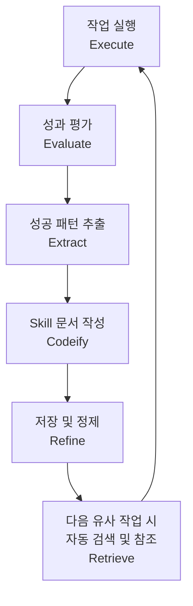
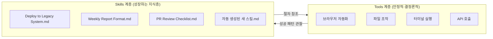
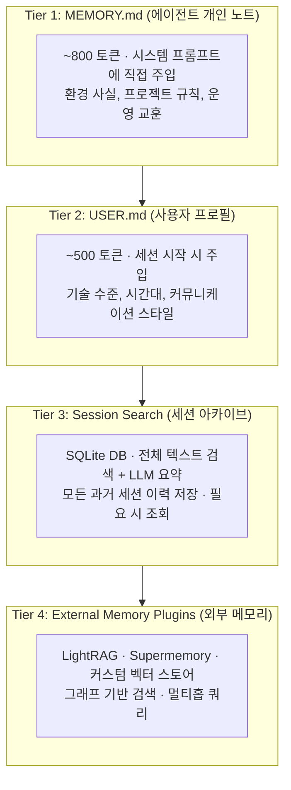
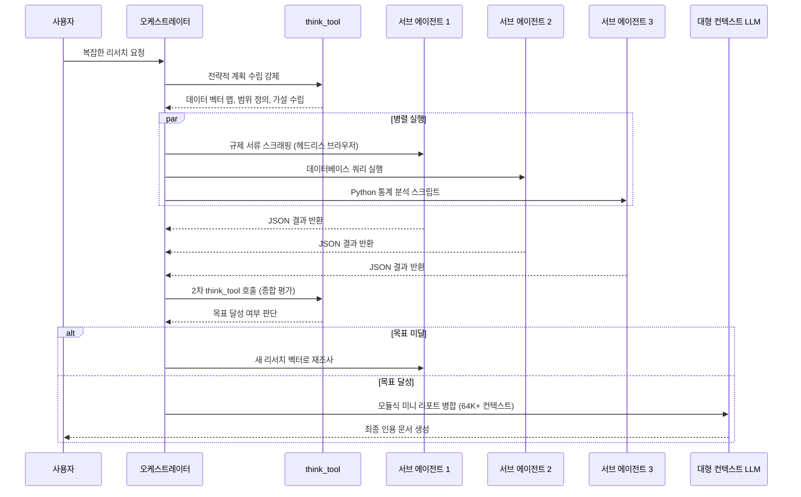
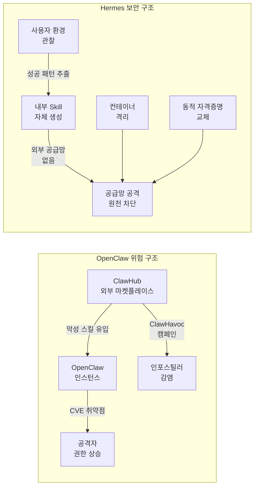
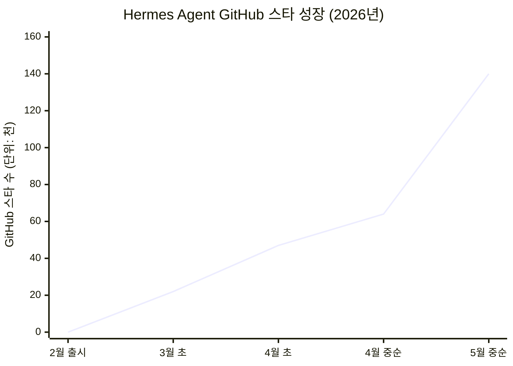
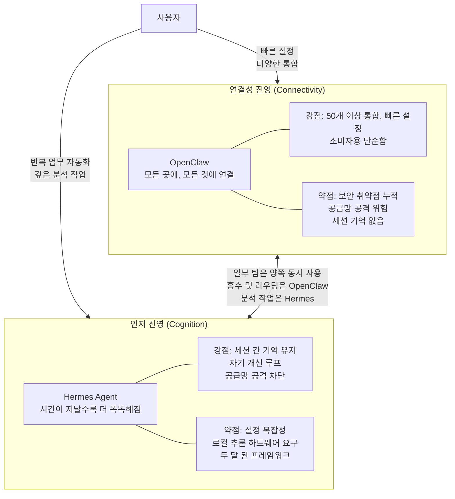

> **원문**: Kristopher Dunham, "Hermes Agent: The Open-Source AI Agent That Actually Remembers What It Learned Yesterday" (Medium, 2026년 4월 14일)  
> **분석 기준일**: 2026-05-28  
> **작성**: Claude Sonnet 4.6 (Anthropic)

---

## 목차

1. [배경: AI 에이전트가 가진 근본적인 문제](#1-배경-ai-에이전트가-가진-근본적인-문제)
2. [Hermes Agent란 무엇인가?](#2-hermes-agent란-무엇인가)
3. [핵심 아키텍처: 닫힌 학습 루프](#3-핵심-아키텍처-닫힌-학습-루프)
4. [Skills vs Tools: 결정적인 차이](#4-skills-vs-tools-결정적인-차이)
5. [4계층 메모리 시스템](#5-4계층-메모리-시스템)
6. [딥 리서치 기능의 작동 방식](#6-딥-리서치-기능의-작동-방식)
7. [보안 비교: Hermes vs OpenClaw](#7-보안-비교-hermes-vs-openclaw)
8. [설치 및 사용 방법 (실전 가이드)](#8-설치-및-사용-방법-실전-가이드)
9. [한계와 솔직한 평가](#9-한계와-솔직한-평가)
10. [최신 현황 (2026년 5월 기준)](#10-최신-현황-2026년-5월-기준)
11. [AI 에이전트 생태계에서의 위치](#11-ai-에이전트-생태계에서의-위치)
12. [결론](#12-결론)

---

## 1. 배경: AI 에이전트가 가진 근본적인 문제

지금까지 사람들이 사용해온 거의 모든 AI 에이전트에는 동일한 구조적 문제가 있었다. 월요일에 무언가를 가르쳐주면, 화요일에는 전부 잊어버린다. 다시 처음으로 돌아가서, 프로젝트 구조는 무엇인지, 어떤 방식을 선호하는지, 전체 워크플로우가 어떻게 돌아가는지를 일일이 다시 설명해야 한다. 마치 매일 아침 새로운 인턴을 교육하는 것과 다름없다.

이러한 '세션 기반 망각(session-based forgetting)' 문제는 AI 에이전트를 반복 업무에 투입할 때 특히 치명적으로 작용한다. 에이전트는 사용자의 레거시 시스템 통합 방식, 커밋 메시지 포맷 규칙, 특정 API 호출 시퀀스처럼 시간이 쌓여야 비로소 파악되는 컨텍스트를 매 세션마다 처음부터 재습득해야 했다. 이 문제를 해결하기 위해 Nous Research가 설계한 것이 바로 **Hermes Agent**다.

---

## 2. Hermes Agent란 무엇인가?

Hermes Agent는 **Nous Research**가 2026년 2월에 공개한 오픈소스 자율 AI 에이전트다. 기존의 코딩 코파일럿(IDE에 종속된 도구)이나 단일 API 래퍼 형태의 챗봇과는 근본적으로 다른 존재다.

- **자체 서버에서 실행**: 사용자의 서버나 노트북 위에서 상주하며 장기 실행된다.
- **세션을 넘어 기억 유지**: 재시작 후에도 프로젝트, 선호도, 컨텍스트가 유지된다.
- **자기 개선(self-improving)**: 작업을 완료할수록 점점 더 능숙해진다.
- **MIT 라이선스**: 상업적 사용, 수정, 재배포가 모두 자유롭다.
- **데이터 로컬 처리**: 텔레메트리 없음, 클라우드 종속 없음, 모든 데이터는 사용자 기기에 남는다.

출시 이후 가파른 성장세를 보여, 2026년 5월 기준으로 **GitHub 스타 140,000개 이상**을 달성하며 OpenRouter 기준 전 세계에서 가장 많이 사용되는 AI 에이전트가 되었다. NVIDIA도 공식 블로그를 통해 Hermes Agent를 RTX PC와 DGX Spark에서 실행하기 위한 권장 에이전트로 소개했다.

---

## 3. 핵심 아키텍처: 닫힌 학습 루프

Hermes의 가장 핵심적인 개념은 **닫힌 학습 루프(closed learning loop)** 다. 대부분의 에이전트가 작업을 완료하면 결과를 기록하고 끝내는 반면, Hermes는 작업 완료 후 다음 과정을 수행한다.



이 루프의 작동 방식은 다음과 같다.

**실행(Execute)**: 에이전트가 주어진 작업을 수행한다.

**평가(Evaluate)**: 작업 완료 후 사후 평가(post-execution evaluation)가 이루어진다. 어떤 단계들이 실행되었고, 어떤 도구 호출이 사용되었으며, 어떤 추론 과정을 거쳐 결과가 도출되었는지를 분석한다.

**추출(Extract)**: 성공적인 결과를 만들어낸 정확한 단계 시퀀스를 식별한다.

**정교화(Refine)**: 추출된 지식을 정제하여 재사용 가능한 형태로 변환한다.

**검색(Retrieve)**: 다음번에 유사한 작업을 만났을 때, 에이전트는 저장된 Skill 문서를 검색해 참조한다.

Nous Research가 발표한 벤치마크에 따르면, 자체 생성 스킬을 사용하는 에이전트는 제로 프롬프트 튜닝 상태의 신규 인스턴스 대비 리서치 작업을 **40% 더 빠르게** 완료했다. 단돈 5달러짜리 VPS에서 3개월간 실행된 Hermes 인스턴스는 사용자의 코드베이스, 배포 특이사항, 선호 커밋 메시지 포맷, 레거시 통합에서 작동하는 정확한 API 호출 시퀀스를 모두 알게 된다.

---

## 4. Skills vs Tools: 결정적인 차이

Hermes는 **Skills**와 **Tools** 사이의 명확한 아키텍처적 구분을 두고 있으며, 이 차이는 생각보다 훨씬 중요하다.

### Tools (도구)

Tools는 JSON 스키마를 통해 AI 모델에 노출되는 Python 함수들이다. 결정론적(deterministic)으로 실행된다. 브라우저 자동화, 파일 조작, 스트리밍 프로세스 등이 여기에 해당한다. Tools를 변경하려면 핵심 Python 파일을 직접 수정해야 한다.

### Skills (스킬)

Skills는 마크다운 문서다. 에이전트는 이를 마치 지침서처럼 읽고 문서에 기술된 절차를 자율적으로 따른다. 결정적인 차별점은 다음과 같다: **에이전트 자신이 Skills를 직접 작성할 수 있다.** 코드를 수정할 필요도, 사람이 설정 파일을 편집할 필요도 없다. 에이전트가 어떤 작업에 성공하는 것을 스스로 관찰하고, 어떻게 했는지를 마크다운으로 기록하며, 다음번을 위해 그 지식을 저장한다.



이 구조 덕분에 에이전트는 **자신의 소스 코드를 건드리지 않고도 점점 더 똑똑해진다**. 결정론적 도구 계층은 안정적이고 안전하게 유지되며, 지식 계층만 지속적으로 성장한다. 이 설계 철학은 안전성과 자기 개선 능력을 동시에 달성하는 핵심 메커니즘이다.

---

## 5. 4계층 메모리 시스템

컨텍스트가 너무 적으면 에이전트가 나쁜 결정을 내린다. 반대로 너무 많으면 토큰을 낭비하고 지연 시간이 급증하며, 모델이 프롬프트 깊숙이 묻힌 지시사항을 잊어버리기 시작한다. Hermes는 이 딜레마를 정보의 긴급도에 따라 계층화된 **4단계 메모리 시스템**으로 해결한다.



### Tier 1: 에이전트 개인 노트 (MEMORY.md)

환경 사실, 프로젝트 규칙, 운영 교훈을 저장한다. 약 800 토큰으로 제한되며, 세션 시작 시 시스템 프롬프트에 직접 주입된다. 에이전트의 '치트시트'라고 생각하면 된다.

### Tier 2: 사용자 프로필 (USER.md)

사용자가 어떤 사람인지에 대한 모델을 유지한다. 기술 숙련도, 시간대, 커뮤니케이션 스타일 등 약 500 토큰 분량의 정보를 담으며, 마찬가지로 세션 시작 시 주입된다.

### Tier 3: 세션 검색 아카이브

모든 과거 세션의 전체 내용을 SQLite 데이터베이스에 보관한다. 에이전트가 필요할 때 전체 텍스트 검색과 LLM 요약 기능을 결합하여 온디맨드로 조회한다. 이곳에 깊은 역사적 컨텍스트가 살아있다.

### Tier 4: 외부 메모리 플러그인

LightRAG, Supermemory, 또는 커스텀 벡터 스토어와 같은 그래프 기반 검색 시스템에 연결된다. 복잡한 관계 맵에 대한 멀티홉 쿼리가 가능하여, 엔터프라이즈 규모의 멀티 에이전트 워크플로우에서 진가를 발휘한다.

### 동결 스냅샷(Frozen Snapshot) 패턴

Tier 1과 Tier 2는 "동결 스냅샷" 패턴을 사용한다. 변경 사항은 즉시 디스크에 기록되지만, 활성 시스템 프롬프트는 다음 세션이 시작될 때까지 수정되지 않는다. 이는 언어 모델의 **프리픽스 캐시(prefix cache)** 를 보존하여 긴 세션 전반에 걸쳐 지연 시간을 낮게 유지한다. 대화 도중에 프롬프트를 변경하면 이 캐시가 무효화되어 추론 속도가 크게 저하되기 때문이다.

### 주기적 넛지(Periodic Nudge) 메커니즘

단순히 사용자가 중요한 정보를 저장하라고 알려주기를 기다리는 것이 아니라, Hermes 런타임은 유휴 시간에 에이전트에게 능동적으로 프롬프트를 제공한다. 최근 상호작용을 평가하고, 컨텍스트 윈도우가 가득 차서 오래된 대화 내용이 압축되어 사라지기 전에 중요한 사실을 추출하도록 한다. 이 명시적 플러시 과정에서 에이전트가 표시하지 않은 사실은 단순히 살아남지 못한다. 메모리 관리에 대한 '사용하거나 잃거나(use-it-or-lose-it)' 방식이다.

---

## 6. 딥 리서치 기능의 작동 방식

Hermes에 복잡한 리서치 작업을 맡기면 단순히 웹 검색을 하는 것이 아니라 정교한 다단계 프로세스가 가동된다.



### 강제적 전략 계획 (think_tool)

에이전트는 복잡한 리서치 과제를 받으면 가장 먼저 `think_tool`을 호출한다. 이는 실제로 어떤 것도 실행하기 전에 모델이 구체적인 조사 계획을 명시적으로 표현하도록 강제하는 메커니즘이다. 데이터 벡터를 매핑하고, 범위를 정의하고, 가설을 수립한다. 이 계획 단계가 완료된 후에야 실행이 시작된다.

### 병렬 서브 에이전트 실행

`ConductResearch` 도구는 단일 쿼리를 발사하는 것이 아니라, 각각의 독립적인 컨텍스트 윈도우, 격리된 터미널 세션, 제한된 도구 세트를 가진 독립적인 서브 에이전트들에게 특정 리서치 주제를 위임한다. 예를 들어 한 서브 에이전트는 헤드리스 브라우저를 통해 규제 서류를 스크래핑하고, 다른 하나는 데이터베이스를 쿼리하고, 세 번째는 통계 분석을 위한 Python 스크립트를 실행한다. 이들은 동시에 실행되어 구조화된 JSON 결과를 주 오케스트레이터에게 반환한다.

### 2차 합성 평가

병렬 작업이 완료되면 에이전트는 다시 `think_tool`을 호출한다. 이 두 번째 단계는 수집된 결과를 평가하고 목표가 달성되었는지 판단한다. 미달이면 새로운 리서치 벡터로 루프가 반복되고, 달성되면 `ResearchComplete`를 호출해 보고서 생성 단계로 진입한다. 미리 정의된 깊이 한계가 무한 재귀를 방지한다.

### 최종 보고서 생성

모듈식 미니 리포트들은 최소 64K 토큰 컨텍스트 윈도우를 가진 대형 컨텍스트 모델에 의해 하나의 인용이 포함된 완성도 높은 문서로 병합된다.

---

## 7. 보안 비교: Hermes vs OpenClaw

이 섹션은 단순한 기능 비교를 넘어서 두 프로젝트 간의 **구조적 보안 철학 차이**를 드러낸다.

### OpenClaw의 보안 위기 (2026년 실제 사건)

OpenClaw는 2026년 초 극심한 보안 위기를 겪었으며, 이는 다음과 같이 문서화되어 있다.

**취약점 폭발**:
- 2026년 3월 18일~21일, 단 4일 동안 9개의 CVE가 공개되었다.
- 그 중 `CVE-2026-32922`는 CVSS 9.9 점의 심각도로, 인증된 사용자가 단일 API 호출만으로 관리자 권한 및 원격 코드 실행(RCE) 능력을 얻을 수 있는 취약점이었다. ARMO는 이를 "OpenClaw 역사상 가장 심각한 취약점"으로 명명했다.
- 2026년 2월~4월 사이 63일간 총 138개 이상의 CVE가 추적되었으며, 이는 평균 15시간마다 하나씩 새로운 취약점이 발표된 셈이다.
- 마이크로소프트, 카스퍼스키, CrowdStrike 등은 민감한 데이터가 있는 기기에서의 OpenClaw 배포를 권고하지 않는다는 공식 입장을 발표했다.

**공급망 공격 (ClawHavoc 캠페인)**:
- 공식 ClawHub 마켓플레이스에서 1,184개 이상의 악성 스킬이 확인되었다. 이는 피크 시점에 전체 패키지의 약 20%에 해당하는 수치다.
- 악성 스킬들은 Gmail, Notion, Slack, GitHub 통합 도구로 위장하여 AMOS(Atomic macOS Stealer) 인포스틸러 등의 악성 코드를 심었다.
- SecurityScorecard는 인터넷에 노출된 135,000개 이상의 OpenClaw 인스턴스를 발견했으며, 그 중 63%는 인증 설정조차 되어 있지 않았다.



### Hermes의 보안 접근법

Hermes는 근본적으로 더 보수적인 접근을 취한다.

**공급망 공격 벡터 제거**: 에이전트가 사용자의 특정 워크플로우를 기반으로 내부적으로 스킬을 생성하기 때문에, 익명 기여자가 작성한 코드를 외부 레지스트리에서 가져오는 행위 자체가 없다. 공급망 공격의 전제가 아예 성립하지 않는 것이다.

**인프라 수준 보안**:
- 터미널 실행에 대한 필수 컨테이너 격리
- 서브 에이전트 프로세스에 대한 암호화 네임스페이스 분리
- 동적 자격증명 교체
- 외부 데이터를 시스템 프롬프트에 주입하기 전 프롬프트 인젝션 스캔

물론 OpenClaw의 패치 대응 속도는 종종 당일 또는 다음 날이었으며, 프로젝트 자체가 근본적으로 망가진 것은 아니다. 그러나 아키텍처 수준에서의 공격 표면 차이는 명백히 존재한다.

---

## 8. 설치 및 사용 방법 (실전 가이드)

### 사전 요구사항

Git만 설치되어 있으면 된다. 설치 스크립트가 Python 3.11+, Node.js v22, ripgrep, ffmpeg를 자동으로 처리한다. **Linux, macOS, WSL2, Android (Termux)** 에서 실행된다. 네이티브 Windows는 실험적 지원 수준이므로 WSL2를 권장한다.

### Step 1: 설치

```bash
curl -fsSL https://raw.githubusercontent.com/NousResearch/hermes-agent/main/scripts/install.sh | bash
```

설치 스크립트가 OS를 자동으로 감지하고 의존성을 프로비저닝한다. Python은 Rust 기반 패키지 매니저인 `uv`를 통해 실행되며, sudo 없이 격리된 가상환경을 생성한다.

### Step 2: 초기 설정

```bash
hermes setup
```

대화형 마법사가 모델 선택과 초기 설정을 안내한다. OpenClaw에서 마이그레이션하는 경우, 마법사가 `~/.openclaw`를 자동으로 감지하고 설정, 메모리, 스킬, API 키 마이그레이션을 제안한다.

```bash
hermes claw migrate   # OpenClaw에서 마이그레이션
```

### Step 3: 모델 선택

```bash
hermes model
```

Hermes는 모델에 구애받지 않는다. Anthropic, OpenAI, DeepSeek, OpenRouter(400개 이상 모델에 단일 엔드포인트로 접근) 등에 연결할 수 있다. 딥 리서치 작업에는 최소 64K 토큰 컨텍스트 모델이 필요하다.

**완전한 로컬 실행 (API 비용 없음, 데이터 유출 없음)**:
```bash
ollama pull qwen2.5-coder:32b
# 그 후 Hermes 설정에서 http://localhost:11434/v1 로 엔드포인트 지정
```

단, 실전에서는 하드웨어 현실을 직시해야 한다. 32B 모델을 기본 오케스트레이터로 실행하는 것은 가능하지만, 딥 리서치의 병렬 서브 에이전트 실행은 각각 독립적인 추론 스레드와 컨텍스트 윈도우가 필요하므로 상당한 GPU 자원을 요구한다. 단일 소비자용 GPU 환경에서는 병렬 리서치 워크플로우에 병목 현상이 발생할 수 있다.

### Step 4: 메시징 게이트웨이 설정 (선택사항, 강력 권장)

```bash
hermes gateway setup
```

Telegram, Discord, Slack, WhatsApp, Signal 등에 Hermes를 연결한다. 게이트웨이가 백그라운드 서비스로 실행되므로, 서버에서 무거운 작업이 돌아가는 동안 스마트폰으로 에이전트에게 메시지를 보낼 수 있다.

**Telegram 연결 예시**:
1. BotFather를 통해 봇 등록 → 토큰 획득
2. @userinfobot을 통해 User ID 확인
3. 두 값을 Hermes 설정에 입력

메시징 인터페이스는 모니터링과 비동기 업데이트에는 훌륭하지만, 본질적으로 선형적이다. 복잡한 코드베이스 변경 같은 깊은 협업 작업에는 CLI나 전용 워크스페이스가 더 적합하다.

현재(2026년 5월 기준) Hermes는 18개 이상의 메시징 플랫폼을 지원한다: Telegram, Discord, Slack, WhatsApp, Signal, Feishu/Lark, WeCom, QQBot, Microsoft Teams 등.

### Step 5: 컨테이너 격리 실행 (반드시 수행할 것)

```bash
hermes config set terminal.backend docker
```

이렇게 하면 에이전트가 생성하는 모든 코드가 격리된 컨테이너 안에서 실행된다. 무언가 잘못되더라도 호스트 시스템은 안전하게 유지된다.

### Step 6: 학습 루프 가동

간단하고 반복 가능한 작업으로 시작하는 것이 좋다: 주간 보고서, PR 리뷰, API 데이터 처리, 리서치 컴파일 등. Skills 디렉토리를 주시하면, 성공적인 작업 완료 후 새로운 `.md` 파일들이 생성되는 것을 확인할 수 있다. 이것이 에이전트가 스스로 작성한 플레이북이다. 몇 주가 지나면 분 단위로 걸리던 작업이 초 단위로 완료되기 시작한다.

### 주요 CLI 명령어 요약

| 명령어 | 설명 |
|--------|------|
| `hermes` | 대화형 CLI 시작 |
| `hermes model` | LLM 제공자 및 모델 선택 |
| `hermes tools` | 활성화할 도구 설정 |
| `hermes setup` | 전체 설정 마법사 실행 |
| `hermes gateway` | 메시징 게이트웨이 시작 |
| `hermes mcp` | MCP 서버 설치·설정·인증 |
| `hermes logs` | 구조화된 로그 파일 확인 |
| `hermes doctor` | 설정 문제 진단 |
| `hermes update` | 최신 버전으로 업데이트 |
| `hermes claw migrate` | OpenClaw에서 마이그레이션 |

---

## 9. 한계와 솔직한 평가

### 로컬 추론의 하드웨어 현실

32B 모델을 Ollama로 로컬에서 실행하는 것은 기본 오케스트레이터에는 충분하지만, 병렬 서브 에이전트 리서치 워크플로우는 심각한 GPU 자원을 요구한다. 단일 소비자용 GPU에서는 병렬 리서치 기능이 병목에 걸린다. 보다 현실적인 로컬 설정은 서브 에이전트 라우팅과 데이터 추출에 소형 양자화 모델을 사용하고, 기본 오케스트레이터와 최종 합성에만 32B 모델을 예약하는 방식이다.

### 자체 작성 스킬의 취약성

내부 스킬 시스템이 OpenClaw의 공급망 위험을 우회하는 것은 사실이지만, 마크다운 플레이북은 세상이 그 아래에서 바뀌면 깨진다. 레거시 API가 인증 흐름을 업데이트하거나 웹사이트가 DOM을 재설계하면, 에이전트가 기억해둔 절차가 실패한다. 결정론적 워크플로우 도구와 달리, Hermes는 실패하고, 재평가하고, 스킬을 처음부터 다시 작성해야 한다. 학습 루프가 이를 처리하지만, 즉각적이지는 않다.

### Tier 4 메모리는 실제로 필요한 경우에만

LightRAG와 Supermemory 통합은 매력적으로 들리지만, 대부분의 단일 서버 설정에서는 SQLite 전체 텍스트 검색(Tier 3)이 속도와 재현율의 최상의 균형을 제공한다. 무거운 외부 벡터 데이터베이스와 플랫 MEMORY.md 파일을 동기화하면 엔터프라이즈 규모의 멀티 에이전트 워크플로우가 아닌 이상 감당할 가치가 없는 지연 시간과 상태 충돌 문제가 생긴다.

### 설정 복잡성

OpenClaw는 설치에서 작동 에이전트까지 더 빠르게 도달한다. 50개 이상의 플랫폼 통합과 소비자 수준의 단순함이 필요하다면, OpenClaw가 여전히 더 접근하기 쉬운 선택이다.

### 자기 개선은 점진적이다, 마법이 아니다

벤치마크 40% 향상은 며칠이 아니라 수 주에 걸친 지속적인 사용을 통해 이루어진 것이다. 즉각적인 변신을 기대해서는 안 된다. 학습 루프는 실제로 작동하지만, 복리처럼 시간이 쌓여야 한다.

---

## 10. 최신 현황 (2026년 5월 기준)

원문이 작성된 2026년 4월 이후에도 Hermes Agent는 매우 빠른 속도로 발전하고 있다. 실제 검색을 통해 확인한 최신 현황은 다음과 같다.

### 버전 현황

가장 최근 공개된 정식 릴리스는 **v0.14.0 (v2026.5.16, 2026년 5월 16일)** 으로, 다음과 같은 내용이 포함되었다.

- **xAI Grok 지원**: SuperGrok OAuth 프로바이더로 추가, grok-4.3 모델에 1M 컨텍스트 윈도우 지원
- **OpenAI 호환 로컬 프록시**: OAuth 인증된 Hermes 프로바이더(Claude Pro, ChatGPT Pro, SuperGrok)를 Codex, Aider, Cline, VS Code Continue가 사용할 수 있는 엔드포인트로 변환
- **x_search 도구**: OAuth 또는 API 키 인증을 통한 X(트위터) 검색 도구 정식 추가
- **Microsoft Teams 완전 통합**: Graph 인증, 웹훅 리스너, 파이프라인 런타임, 아웃바운드 전송 전체 구현
- **Foundation 릴리스**: "어디서든 설치·실행되고, 실제로 원하는 것들을 탑재하며, 원하지 않는 것들은 제거하는" 방향으로 대규모 정비

v0.13.0 이후 808개의 커밋, 633개의 병합 PR, 165,061줄의 코드 추가가 이루어졌으며, 545개의 이슈가 종료되었다. 215명의 커뮤니티 기여자가 참여했다.

원문에서 언급한 v0.8.0(2026년 4월 8일) 이후 v0.14.0까지의 주요 릴리스 흐름:

| 버전 | 날짜 | 주요 내용 |
|------|------|---------|
| v0.8.0 | 2026-04-08 | Logs 명령어, 게이트웨이 개선 |
| v0.9.0 | 2026-04-23 | React/Ink 기반 CLI 전면 재작성, 플러그인 아키텍처 |
| v0.11.0 | 2026-04-30 | 인터페이스 릴리스, AWS Bedrock 지원 |
| v0.12.0 | 2026-05-07 | 내구성 멀티 에이전트 칸반 보드, 체크포인트 v2 |
| v0.13.0 | 2026-05-13 | 성능 안정화, 자율 큐레이터 개선 |
| v0.14.0 | 2026-05-16 | Foundation 릴리스, xAI Grok, x_search, Teams |

### GitHub 스타 성장 추이



### 생태계 확장

- **OpenRouter 기준 전 세계 1위** 에이전트 (생산성, 코딩 에이전트, 개인 에이전트, CLI 에이전트 전 부문 1위)
- **NVIDIA 공식 파트너**: RTX PC, DGX Spark에서의 공식 권장 에이전트로 선정
- **지원 메시징 플랫폼**: 18개 이상 (Telegram, Discord, Slack, WhatsApp, Signal, Feishu/Lark, WeCom, QQBot, Yuanbao, Microsoft Teams 등)
- **지원 터미널 백엔드**: 7가지 (로컬, Docker, SSH, Singularity, Modal, Daytona, Vercel Sandbox)
- **Hermes WebUI**: 별도 프로젝트로 웹 브라우저 및 모바일에서 사용 가능한 UI 제공
- **Nous Portal**: Hermes와 통합된 구독 서비스로 300개 이상 모델, 웹 검색(Firecrawl), 이미지 생성(FAL), TTS(OpenAI), 클라우드 브라우저(Browser Use) 등을 단일 구독으로 제공

### Nous Research 배경

Hermes Agent의 개발사 Nous Research는 Hermes, Nomos, Psyche 모델 패밀리를 개발한 AI 안전성 및 역량 연구 조직이다. CEO Jeffrey Quesnelle은 이전에 이더리움 MEV 인프라 프로젝트 Eden Network의 수석 엔지니어를 역임했다. 2026년 4월 기준으로 총 7천만 달러의 자금을 조달했으며, 투자자들은 주로 암호화폐 분야 기관들로 구성되어 있다.

---

## 11. AI 에이전트 생태계에서의 위치

원문 저자가 제시하는 핵심 관점은 AI 에이전트 공간이 두 개의 진영으로 분열되고 있다는 것이다.



같은 복잡한 워크플로우를 반복해서 실행하는 사람에게, 시간이 지날수록 실제로 학습하는 에이전트의 복리 효과는 무시하기 어렵다. 일부 팀은 이미 양쪽을 동시에 사용하고 있다. 흡수와 라우팅에는 OpenClaw를, 깊은 분석 작업에는 Hermes를 사용하는 방식이다.

---

## 12. 결론

Hermes Agent는 AI 에이전트의 가장 근본적인 한계, 즉 매 세션마다 처음으로 돌아가는 '세션 기반 망각' 문제를 아키텍처 수준에서 해결한 첫 번째 오픈소스 에이전트 중 하나다. 닫힌 학습 루프, 4계층 메모리 시스템, 자체 스킬 작성 능력, 그리고 공급망 공격을 원천 차단하는 내부 지식 구조 등이 결합되어, 단순한 도구가 아니라 시간이 지날수록 사용자의 환경에 맞춰 최적화되는 장기 파트너로서의 가능성을 보여준다.

2026년 2월 출시 후 불과 3개월 만에 GitHub 스타 140,000개를 돌파하고 OpenRouter 전 부문 1위를 달성한 사실은, 개발자 커뮤니티가 이 가능성을 이미 강력하게 인식하고 있음을 말해준다. 아직 두 달 된 프레임워크의 거친 면이 존재하고, 로컬 추론의 하드웨어 요건이나 스킬 취약성 같은 현실적인 한계도 있다.

그러나 설치는 5분이면 충분하다. 학습 루프가 나머지를 책임진다. 같은 복잡한 워크플로우를 반복해서 처리하는 사용자라면, 지금 시작할 이유는 충분하다.

---

## 참고 링크

- **공식 웹사이트**: https://hermes-agent.org/
- **GitHub 레포지토리**: https://github.com/NousResearch/hermes-agent
- **원문 아티클**: https://medium.com/@creativeaininja/hermes-agent-the-open-source-ai-agent-that-actually-remembers-what-it-learned-yesterday-278441cd1870
- **Nous Research**: https://nousresearch.com/
- **OpenClaw 보안 위기 분석**: https://conscia.com/blog/the-openclaw-security-crisis/
- **NVIDIA 공식 블로그**: https://blogs.nvidia.com/blog/rtx-ai-garage-hermes-agent-dgx-spark/

---

*작성일: 2026-05-28*
