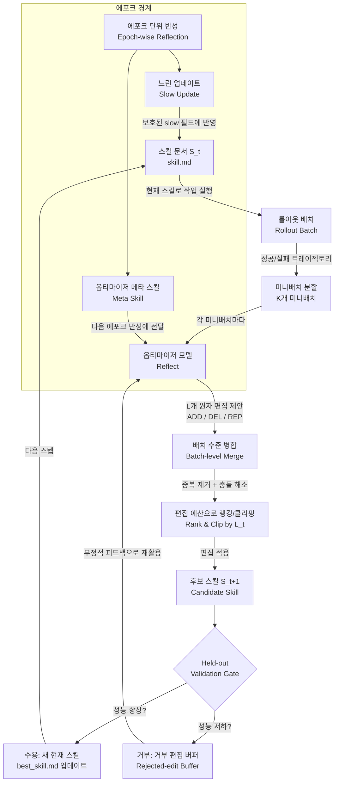

> **논문명:** SkillOpt: Executive Strategy for Self-Evolving Agent Skills  
> **출처:** arXiv:2605.23904 (2026년 5월 22일 공개, 5월 25일 v2)  
> **소속:** Microsoft, 상하이 교통대학교, 통지대학교, 푸단대학교  
> **공식 사이트:** https://microsoft.github.io/SkillOpt/  
> **코드:** https://github.com/microsoft/SkillOpt  

---

## 1. 배경: 왜 이 연구가 필요했는가

현대의 AI 에이전트는 복잡한 작업을 수행하기 위해 **스킬(Skill)** 이라는 개념을 활용한다. 스킬이란 에이전트가 특정 작업을 어떻게 수행할지를 자연어(텍스트)로 기술한 지침 파일로, 흔히 마크다운(`.md`) 형식으로 작성된다. 예를 들어 스프레드시트를 다루는 에이전트라면 "엑셀 파일을 열 때는 먼저 시트 목록을 확인하라", "수식이 포함된 셀은 openpyxl 라이브러리로 처리하라"와 같은 절차적 지침이 스킬 파일에 담긴다.

문제는 이러한 스킬을 어떻게 만들고 개선하느냐에 있다. 기존의 방식은 크게 세 가지였다.

첫째, **사람이 직접 작성하는 방식(Hand-crafted)** 이다. 도메인 전문가가 직접 스킬 파일을 작성하는 이 방법은 높은 품질을 기대할 수 있지만, 시간과 비용이 많이 들고 새로운 과제마다 처음부터 다시 만들어야 한다는 한계가 있다.

둘째, **LLM이 한 번에 생성하는 방식(One-shot LLM generation)** 이다. GPT 같은 언어 모델에게 스킬 파일 작성을 맡기는 방법으로, 빠르게 스킬을 만들 수 있지만 실제 작업 수행 결과를 반영하지 못하기 때문에 최적화된 스킬이라 보기 어렵다.

셋째, **느슨한 자기 수정 방식(Loose self-revision)** 이다. 에이전트가 자신의 스킬을 스스로 수정하는 방식이지만, 수정이 얼마나 이루어질지 통제되지 않아 불안정하고, 수정이 잘못 이루어졌을 때 되돌리기 어렵다는 문제가 있다.

연구팀은 이 세 가지 방식 모두 **딥러닝 옵티마이저처럼 체계적으로 스킬을 개선하지 못한다**는 공통된 문제를 갖고 있다고 지적한다. 딥러닝에서 신경망의 가중치(weight)를 학습률(learning rate)과 검증 손실(validation loss)을 기반으로 조금씩 체계적으로 업데이트하듯, 스킬 문서도 같은 원칙에 따라 훈련되어야 한다는 것이다.

---

## 2. SkillOpt의 핵심 아이디어: 텍스트 공간에서의 딥러닝

SkillOpt가 제안하는 핵심 아이디어는 **"스킬 문서를 동결된(frozen) 에이전트의 외부 상태(external state)로 간주하고, 딥러닝과 동일한 원칙으로 이를 훈련시킨다"** 는 것이다.

이 아이디어를 이해하기 위해 딥러닝의 학습 과정과 SkillOpt를 비교해보면 다음과 같다.

| 딥러닝 개념 | SkillOpt에서의 대응 개념 |
|---|---|
| 파라미터 (parameter) | 스킬 문서 (skill.md) |
| 그래디언트 방향 (gradient direction) | 트레이젝토리에서 도출된 편집 방향 (edit direction) |
| 학습률 (learning rate) | 편집 예산 (edit budget) |
| 검증 확인 (validation check) | Held-out 선택 게이트 (selection gate) |
| 안정적 학습 설정 | 배치/미니배치/스케줄/게이트 |

중요한 점은 **모델의 가중치는 전혀 수정하지 않는다**는 것이다. 에이전트 모델 자체는 완전히 동결된 채로 유지되며, 변경되는 것은 오직 스킬 문서 텍스트뿐이다. 이는 기존의 파인튜닝(fine-tuning) 방식과 근본적으로 다르다. 파인튜닝은 모델 가중치를 수정하므로 비용이 크고, 수정된 모델을 다른 환경에 쉽게 이전하기 어렵다. 반면 SkillOpt가 만들어내는 결과물은 단 하나의 텍스트 파일(`best_skill.md`)이며, 이 파일은 어떤 모델에도 붙여 사용할 수 있다.

---

## 3. SkillOpt의 파이프라인 상세 설명

SkillOpt의 학습 루프는 크게 네 단계인 **롤아웃(Rollout) → 반성(Reflect) → 편집(Edit) → 게이트(Gate)** 로 구성된다. 이를 하나씩 살펴보자.

### 3-1. 롤아웃: 증거 수집

첫 번째 단계는 현재의 스킬 문서를 사용하여 에이전트가 실제 작업을 수행하는 것이다. 에이전트는 훈련 데이터셋의 작업들을 수행하면서 자신의 행동 기록(트레이젝토리)을 남긴다. 이 기록에는 에이전트가 내린 메시지, 사용한 도구 호출, 검증기(verifier)의 피드백, 작업 메타데이터, 그리고 최종 점수가 모두 포함된다.

이 트레이젝토리들은 훈련 분할(train split), 검증 분할(validation split), 테스트 분할(test split)의 세 가지 데이터셋으로 나뉜다. 훈련 분할은 스킬 편집의 근거가 되는 롤아웃 증거로 사용되고, 검증 분할은 업데이트 여부를 결정하는 게이트 역할을 하며, 테스트 분할은 최종 보고서까지 잠겨 있어 과적합(overfitting)을 방지한다.

### 3-2. 미니배치 반성: 무엇이 잘 되었고 무엇이 잘못되었는가

수집된 롤아웃 배치는 K개의 미니배치로 나뉘어 **별도의 옵티마이저 모델**에 전달된다. 중요한 점은 성공한 트레이젝토리와 실패한 트레이젝토리를 **분리하여 반성**한다는 것이다. 실패 패턴에 대한 반성은 반복되는 오류를 수정하는 편집을 이끌어내고, 성공 패턴에 대한 반성은 이미 잘 작동하는 행동이 지워지지 않도록 보호하는 편집을 제안한다.

각 미니배치마다 옵티마이저 모델은 L개의 **원자적 편집(atomic edit)** 을 제안한다. 원자적 편집이란 스킬 문서에 대한 구체적이고 단위적인 변경으로, 세 가지 종류가 있다.

- **ADD**: 새로운 규칙이나 절차를 스킬 문서에 추가한다.
- **DEL**: 불필요하거나 잘못된 규칙을 삭제한다.
- **REP(Replace)**: 기존 규칙을 더 나은 버전으로 교체한다.

### 3-3. 배치 수준 병합 및 편집 예산

K개의 미니배치에서 나온 편집 제안들은 하나로 병합(merge)된다. 이 과정에서 중복된 편집은 제거되고, 서로 충돌하는 편집은 해소된다. 이후 **편집 예산(edit budget) L_t**에 따라 편집들이 랭킹되고 클리핑(clipping)된다.

편집 예산은 딥러닝의 학습률(learning rate)과 같은 역할을 한다. 한 스텝에 너무 많은 편집이 이루어지면 스킬 문서가 크게 변하여 작동하던 부분까지 망가질 수 있다(파국적 망각, catastrophic overwrite). 편집 예산은 이를 방지하는 **텍스트 공간의 학습률**이다. 편집 예산은 에포크가 진행될수록 스케줄에 따라 감소하도록 설계되어, 초반에는 빠르게 학습하고 후반에는 세밀하게 조정한다.

### 3-4. Held-out 검증 게이트

편집이 적용된 후보 스킬(`S_t+1`)은 **훈련에 사용되지 않은 검증 분할(held-out validation set)** 에서 평가된다. 검증 점수가 현재 최고 점수(`best_skill`)보다 **엄격하게 향상**되었을 때에만 편집이 수용된다. 점수가 같거나 떨어지면 편집은 거부된다.

이 게이트는 SkillOpt가 단순한 자기 수정(unconditional self-editing)이 아니라 **제안-검증 방식의 최적화(propose-and-test optimization)** 임을 보여주는 핵심 메커니즘이다. 무조건적으로 스킬을 바꾸는 것이 아니라, 반드시 성능이 향상된 경우에만 새 스킬을 채택한다.

거부된 편집들은 쓸모없이 버려지는 것이 아니라 **거부 편집 버퍼(rejected-edit buffer)** 에 저장된다. 이 버퍼는 이후 옵티마이저 모델이 반성을 수행할 때 부정적 피드백으로 제공되어, 이미 실패한 방향으로 편집을 반복하지 않도록 돕는다.

### 3-5. 에포크 단위 느린 업데이트와 메타 스킬

SkillOpt는 스텝 단위 루프 외에도 **에포크 단위의 장기 기억 메커니즘**을 갖추고 있다. 에포크가 끝날 때마다 두 가지 특별한 업데이트가 이루어진다.

**느린 업데이트(Slow Update)**: 이전 에포크의 스킬과 현재 에포크의 스킬을 비교하여 무엇이 개선되고, 무엇이 퇴보하고, 무엇이 지속적으로 실패하고, 무엇이 안정적으로 성공하는지를 분석한다. 이 장기적 교훈은 스킬 문서의 **보호된 슬로우 필드(slow field)** 에 기록된다. 슬로우 필드는 빠른 스텝별 편집으로는 덮어쓸 수 없어, 에포크를 거치면서 축적된 핵심 지식이 안전하게 보존된다.

**옵티마이저 메타 스킬(Meta Skill)**: 에포크 반성의 결과로 생성되는 메타 스킬은 "어떤 편집이 도움이 되었는가", "어떤 편집이 실패했는가", "남아 있는 반복 실패 패턴은 무엇인가"를 요약한 것이다. 이 메타 스킬은 옵티마이저 모델에게만 전달되며, 다음 에포크의 반성 작업 앞에 붙어 보다 효과적인 편집 방향을 안내한다.

---

## 4. SpreadsheetBench 케이스 스터디: 실제 스킬 진화 과정

SkillOpt가 실제로 어떻게 스킬을 개선해 나가는지 SpreadsheetBench 사례를 통해 구체적으로 살펴보자.

**초기 스킬(Step 0)**: 스킬 문서는 매우 단순하다. "스프레드시트 스킬 - python(openpyxl / pandas)을 사용하라" 정도의 기본 지침만 포함하고 있으며, held-out 테스트 점수는 **40.4점**이다.

**첫 번째 수용(Step 1)**: 첫 번째 롤아웃 결과를 분석한 옵티마이저 모델은 에이전트가 셀 쓰기 전에 시트 구조를 확인하지 않아 오류가 많이 발생했다는 것을 발견한다. 이에 따라 "어떤 셀에도 쓰기 전에 시트, 헤더, 타겟 범위를 먼저 확인하라", "결과 범위가 비어 있으면 한 번 재시도하라"는 규칙이 추가된다. 검증 게이트를 통과하여 점수는 **48.2점**으로 오른다.

**두 번째 거부(Step 2)**: 다음 편집이 제안되지만 검증 점수가 44.1점으로 오히려 떨어진다. 이 편집은 **거부**되고 거부 편집 버퍼에 저장된다.

**세 번째 수용(Step 3)**: 거부된 편집 방향을 피하면서 새로운 편집이 제안된다. "채점자는 셀을 직접 읽으므로 평가된 숫자를 쓰고 전체 범위를 채워라", "조회 전에 키 타입을 강제 변환하고 공백을 제거하라"와 같은 규칙이 추가되며 점수는 **62.5점**으로 크게 오른다.

**최종(Final)**: 여러 수용 편집이 누적된 최종 스킬은 "먼저 검사하라 - 시트, 헤더, 범위를 나열하고 실제 셀을 읽어라", "정적 값을 써라", "조회 전에 정규화하라" 등의 구체적이고 실전적인 지침으로 가득 차 있으며, 최종 held-out 점수는 **78.9점**으로 초기 대비 **+38.5점** 향상된다.

이처럼 SkillOpt는 추상적인 일반 지침에서 시작해 실제 오류 패턴을 수정하는 구체적 절차 지식으로 스킬을 진화시킨다.

---

## 5. 기존 방법과의 비교: 52개 설정 전승

SkillOpt는 다음 6개 벤치마크, 7개 대상 모델, 3개 실행 하네스(harness)의 조합인 **52개 전체 설정**에서 최고 성능을 달성했다.

### 벤치마크 성능 비교 (SkillOpt vs 최고 기준선)

| 벤치마크 | SkillOpt 점수 | 최고 기준선 대비 향상 | 설명 |
|---|---|---|---|
| SearchQA | 80.0 | +1.9 | 정보 검색 과제 |
| SpreadsheetBench | 51.7 | +4.4 | 스프레드시트 조작 |
| OfficeQA | 52.4 | +4.1 | 오피스 문서 작업 |
| DocVQA | 89.1 | +1.7 | 문서 시각 질답 |
| LiveMath | 42.9 | +9.2 | 수학 문제 풀이 |
| ALFWorld | 84.3 | +8.9 | 텍스트 기반 가상 환경 |

비교 대상 방법들은 다음과 같다.

- **No skill**: 스킬 없이 직접 실행
- **Human skill**: 전문가가 직접 작성한 스킬
- **LLM skill**: LLM이 한 번에 생성한 스킬
- **Trace2Skill**: 트레이젝토리에서 스킬을 추출하는 방법
- **TextGrad**: 텍스트 그래디언트 기반 최적화
- **GEPA**: 진화적 프롬프트 최적화
- **EvoSkill**: 공동 진화 검증 기반 자기 진화 스킬

SkillOpt는 이 모든 방법보다 우수하거나 동등한 성능을 보였다. 특히 주목할 점은 GPT-5.5와 같은 강력한 모델에서뿐만 아니라, GPT-5.4-nano, Qwen3.5-4B와 같은 소형 모델에서도 일관되게 성능 향상을 달성한다는 것이다.

### 모델별 평균 성능 향상 (스킬 없는 기준선 대비)

| 대상 모델 | 실행 환경 | 평균 향상 |
|---|---|---|
| GPT-5.5 | Direct chat | +23.5 |
| GPT-5.4-nano | Direct chat | +24.9 |
| GPT-5.2 | Direct chat | +16.6 |
| Qwen3.5-4B | Direct chat | +19.2 |
| GPT-5.5 | Codex | +21.8 |
| GPT-5.5 | Claude Code | +18.6 |

---

## 6. 에포크 체크포인트 학습 곡선 분석

SpreadsheetBench, SearchQA, LiveMath 세 벤치마크에서 에포크가 진행됨에 따른 성능 변화를 살펴보면 SkillOpt의 학습 안정성을 확인할 수 있다.

세 가지 곡선이 추적된다. 첫째는 **훈련 롤아웃 점수(Train rollout)** 로, 에이전트가 훈련 데이터에서 수행한 점수이다. 둘째는 **선택 최고점(Selection best)** 으로, 검증 게이트를 통과한 최고 스킬의 검증 점수이다. 셋째는 **미확인 테스트 점수(Unseen test)** 로, 최종 평가에 사용되는 테스트 분할에서의 성능이다.

SpreadsheetBench에서는 에포크 1에서 40%대에 불과했던 점수가 에포크 2에 80%로 급등하며, 이후 안정적으로 유지된다. 훈련 롤아웃 점수는 지속적으로 상승하지만, 선택 게이트가 과적합을 방지하여 테스트 성능은 안정적으로 유지된다는 것을 볼 수 있다.

SearchQA에서는 훈련 롤아웃 점수가 에포크 8에서 크게 떨어지는 것을 볼 수 있다. 그러나 선택 게이트가 이 시점의 스킬을 거부하고 느린 업데이트를 통해 복구되어, 최종 테스트 성능은 안정적으로 유지된다. 이는 게이팅 메커니즘의 실질적인 효과를 보여준다.

LiveMath에서는 에포크가 진행될수록 선택 최고점이 지속적으로 상승하여, SkillOpt가 더 오래 학습할수록 더 좋아진다는 것을 확인할 수 있다.

---

## 7. 어블레이션 스터디: 각 구성 요소의 기여

SkillOpt의 핵심 구성 요소들이 실제로 얼마나 기여하는지 검증하기 위해 연구팀은 각 요소를 하나씩 제거한 어블레이션 실험을 수행했다.

### 편집 예산(학습률)의 효과

편집 예산이 있는 경우와 없는 경우를 비교하면 다음과 같다.

| 설정 | SearchQA | SpreadsheetBench | LiveMath |
|---|---|---|---|
| 편집 예산 적용 (기본) | 87.1 | 77.5 | 61.3 |
| 편집 예산 없음 | 84.6 | 75.7 | 57.3 |

편집 예산이 없으면 한 번에 너무 많은 편집이 이루어져 파국적 덮어쓰기가 발생한다. 편집 예산은 새로운 절차를 배울 만큼의 유연성은 유지하면서 유용한 규칙이 덮어쓰이는 것을 방지한다.

### 거부 편집 버퍼의 효과

| 설정 | SearchQA | SpreadsheetBench | LiveMath |
|---|---|---|---|
| 버퍼 있음 (기본) | 87.1 | 77.5 | 61.3 |
| 버퍼 없음 | 85.5 | 72.9 | 58.9 |

거부된 편집들을 부정적 피드백으로 재활용하지 않으면 옵티마이저 모델이 같은 실패 방향을 반복하게 된다. SpreadsheetBench에서 4.6점의 차이는 특히 두드러진다.

### 업데이트 메모리(느린 업데이트 + 메타 스킬)의 효과

| 설정 | SearchQA | SpreadsheetBench | LiveMath |
|---|---|---|---|
| 메타 스킬 + 느린 업데이트 (기본) | 87.1 | 77.5 | 61.3 |
| 둘 다 없음 | 86.3 | 55.0 | 59.7 |

SpreadsheetBench에서 22.5점의 차이는 장기 기억 메커니즘이 특히 복잡한 작업에서 결정적으로 중요함을 보여준다. 에포크를 넘어서 누적된 교훈 없이는 스킬이 단기적 편집에만 머물러 장기적인 개선을 이끌어내지 못한다.

---

## 8. 스킬 전이 가능성: 하나의 파일, 어디서나 적용

SkillOpt의 가장 실용적인 강점 중 하나는 **최적화된 스킬이 다른 모델, 다른 환경, 다른 벤치마크로 자유롭게 전이된다**는 것이다. 전이는 세 가지 축에서 검증되었다.

### 모델 간 전이 (Cross-model Transfer)

GPT-5.4를 대상으로 최적화된 스킬을 GPT-5.4-mini와 GPT-5.4-nano에 그대로 적용했을 때 평균 **+5.6점** 향상이 확인되었다. 더 강력한 모델에서 학습된 절차적 지식이 더 작은 모델에도 유효하다는 것을 보여준다.

또한 GPT-5.4로 최적화된 LiveMath 스킬을 GPT-5.4-nano에 적용했을 때 **+15.2점** 향상이 있었다.

### 하네스 간 전이 (Cross-harness Transfer)

Codex 환경에서 훈련된 SpreadsheetBench 스킬을 Claude Code 환경으로 그대로 이전했을 때 **+31.8점** 향상이 확인되었다. 이는 스킬 파일에 담긴 절차적 지식이 특정 실행 환경에 종속되지 않음을 증명한다.

### 벤치마크 간 전이 (Cross-benchmark Transfer)

OlympiadBench를 대상으로 최적화된 수학 스킬을 Omni-MATH라는 다른 수학 벤치마크에 추가 최적화 없이 적용했을 때 **+2.3점** 향상이 있었다. 유사한 도메인이라면 재최적화 없이도 스킬을 재사용할 수 있다.

### 자기 옵티마이저 설정

GPT-5.4-nano가 자신의 옵티마이저 역할까지 맡아 스스로를 최적화했을 때 SpreadsheetBench에서 **+10.4점** 향상이 있었다. 이는 더 강력한 옵티마이저 모델이 더 큰 향상을 가져오지만, 같은 모델이 옵티마이저 역할을 해도 일정 수준의 개선이 가능함을 보여준다. 연구팀은 SkillOpt의 개선이 단순히 더 강한 모델로부터의 증류(distillation)가 아님을 강조한다. 제약된 편집, 버퍼, 검증이 있는 한 자기 최적화도 효과적이다.

---

## 9. 배포 효율성: 추론 시 추가 비용 없음

SkillOpt의 최적화는 오프라인에서 이루어진다. 학습이 완료된 후 대상 모델에는 **`best_skill.md` 파일 하나**만 제공된다. 옵티마이저 모델, 반성 프로세스, 버퍼 등 최적화에 사용된 모든 메커니즘은 배포 시에는 전혀 불필요하다. 이는 추론 시간 비용을 전혀 증가시키지 않음을 의미한다.

---

## 10. ALFWorld 실험: 단계별 스킬 진화 추적

ALFWorld는 텍스트 기반 가상 가정 환경에서 에이전트가 물체를 집고 이동시키는 등의 지시를 수행하는 벤치마크이다. GPT-5.4-mini를 대상 모델로, GPT-5.5를 옵티마이저 모델로 사용하여 실험을 진행했다.

스킬은 간단한 ALFWorld 지침 파일에서 시작하여 텍스트 공간에서 편집된다. 각 스텝에서 선택 게이트가 작동한 결과를 보면, 스텝 3에서는 느린 업데이트가 성능 하락을 구제했으며, 스텝 4는 훈련 점수는 높았지만 검증에서 실패하여 거부되었다. 최종적으로 선택된 스킬은 ALFWorld 테스트 하드(hard) 점수를 **70.9%에서 85.8%로 향상**시켰다.

이 사례는 검증 게이트 없이는 스텝 4에서 학습이 잘못된 방향으로 갔을 것임을 보여준다. 게이트가 없었다면 훈련 점수가 높다는 이유로 성능이 나쁜 스킬이 채택되었을 것이다.

---

## 11. 관련 연구 및 AI 에이전트 스킬 생태계

SkillOpt는 급속히 성장하고 있는 AI 에이전트 스킬 연구 생태계 안에 위치한다. Hugging Face Paper Bot이 유사 논문으로 추천한 최신 연구들을 보면 이 분야가 얼마나 활발히 발전하고 있는지 알 수 있다.

- **SkillEvolver** (2026): 스킬 학습을 메타-스킬로 접근
- **SkillGen** (2026): 검증 추론 시간 에이전트 스킬 합성
- **SkillMAS** (2026): LLM 기반 다중 에이전트 시스템에서의 스킬 공동 진화
- **SkillFlow** (2026): 자율 에이전트의 평생 스킬 발견과 진화 벤치마크
- **EvoSkills** (2026): 공동 진화 검증을 통한 자기 진화 에이전트 스킬
- **ClawTrace** (2026): LLM 에이전트 스킬 증류를 위한 비용 인식 추적

Microsoft는 SkillOpt와 함께 **SkillLens**라는 동반 프로젝트도 운영하고 있다. SkillLens는 모델이 생성하는 에이전트 스킬을 연구하는 프로젝트로, SkillOpt가 스킬을 최적화하는 방법을 연구한다면 SkillLens는 스킬을 이해하고 분석하는 방향에 초점을 맞춘다.

---

## 12. 의의와 한계

### 의의

SkillOpt의 가장 중요한 학술적 기여는 **에이전트 스킬의 훈련을 딥러닝과 같이 체계적으로 정형화했다**는 점이다. 편집 예산, 검증 게이트, 거부 버퍼, 느린 업데이트라는 네 가지 요소가 유기적으로 결합하여 안정적이고 재현 가능한 스킬 훈련을 가능하게 한다.

실용적 측면에서는 세 가지 강점이 있다.

첫째, **모델을 수정하지 않는다**. 기존 모델 그대로 사용하면서 스킬 파일만 개선하므로, 어떤 LLM에도 적용할 수 있고 모델 제공자의 제약을 받지 않는다.

둘째, **결과물이 이식 가능하다**. 최적화의 결과물은 텍스트 파일 하나이므로 모델, 환경, 벤치마크를 가로질러 재사용할 수 있다.

셋째, **배포 비용이 없다**. 추론 시간에 추가적인 모델 호출이나 연산이 필요하지 않아 운영 비용을 증가시키지 않는다.

### 한계 및 주의사항

논문에서 명시적으로 언급된 한계는 다음과 같다.

벤치마크 데이터셋은 저장소에 포함되어 있지 않으므로 직접 준비해야 한다. 또한 강력한 옵티마이저 모델(GPT-5.5)을 사용할 때 가장 큰 성능 향상이 나타나는 만큼, 최적의 성능을 위해서는 강력한 옵티마이저 모델이 필요하다. 다만 자기 옵티마이저 설정(자기 자신을 옵티마이저로 사용)에서도 의미 있는 개선이 가능하다는 점은 긍정적이다.

---

## 정리

SkillOpt는 AI 에이전트의 스킬을 딥러닝의 원칙으로 훈련시키는 최초의 체계적인 텍스트 공간 옵티마이저이다. 모델 가중치를 건드리지 않고, 오직 자연어 스킬 문서만을 점진적으로 개선함으로써 6개 벤치마크, 7개 모델, 3개 실행 환경의 52개 설정 전체에서 최고 성능을 달성했다. 최적화의 결과물인 `best_skill.md` 파일은 모델, 환경, 벤치마크를 넘나들며 재사용 가능하며, 배포 시 추가 연산 비용이 전혀 없다.

이 프레임워크는 AI 에이전트를 더 잘 수행하게 만들기 위해 매번 모델을 재훈련하거나 수작업으로 프롬프트를 수정하는 대신, 에이전트의 "행동 방침"을 자동으로 체계적으로 학습시킨다는 새로운 패러다임을 제시한다.

---

*작성일: 2026년 5월 28일*  
*참고: arXiv:2605.23904, https://microsoft.github.io/SkillOpt/, https://github.com/microsoft/SkillOpt*
