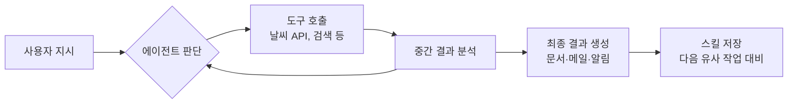
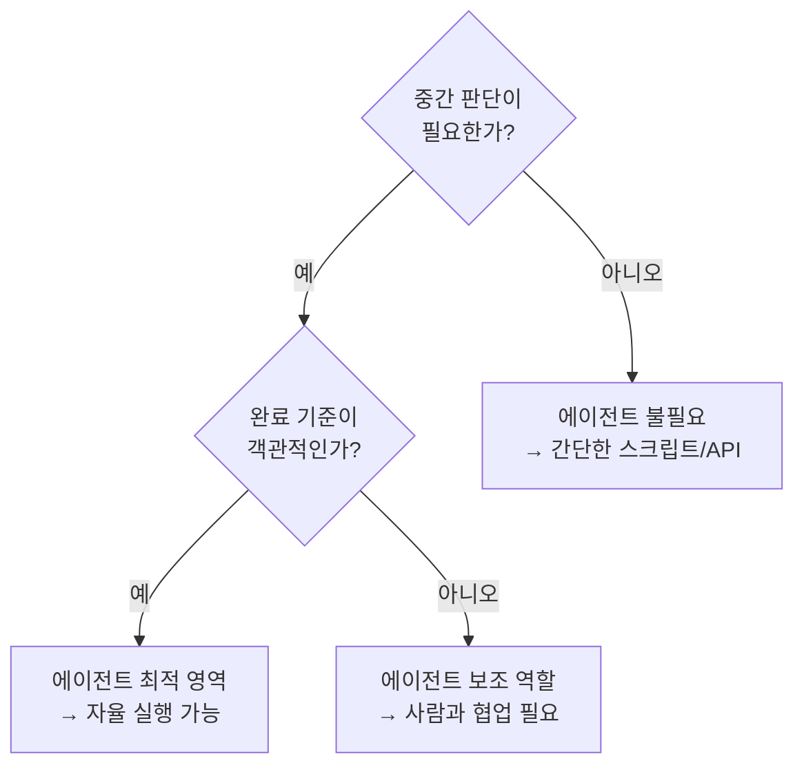
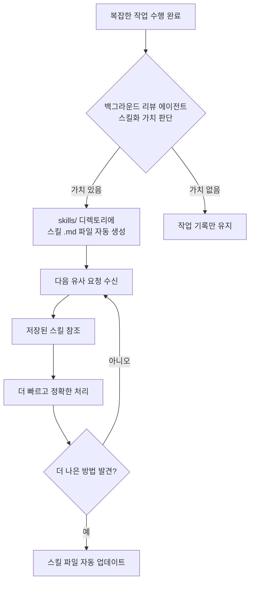
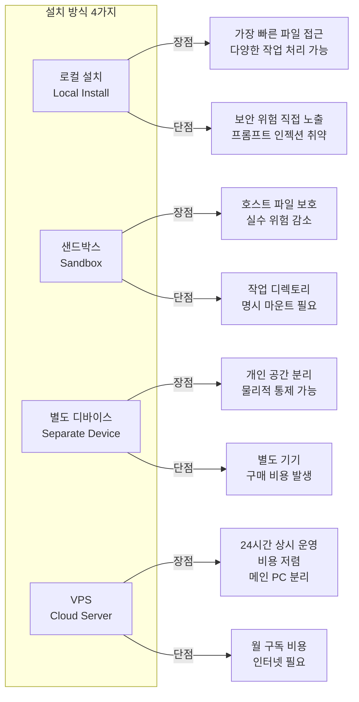
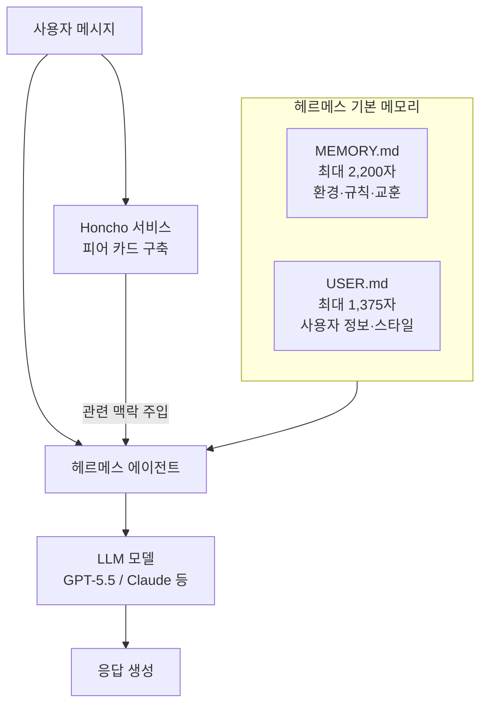
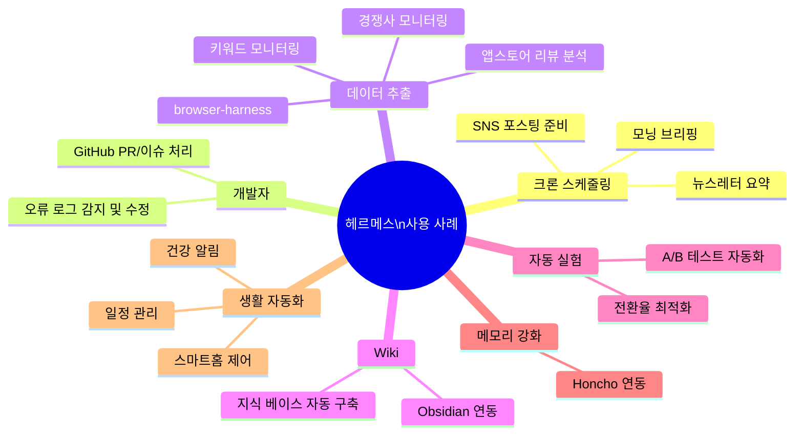

> **출처**: YouTube 영상 3편 종합 분석
> 1. ["헤르메스 에이전트 모르면 매일 시간 낭비하는겁니다"](https://www.youtube.com/watch?v=fWCbzdrinJ8) (2026.05.28), 
> 2. ["헤르메스 에이전트 20분 총정리"](https://www.youtube.com/watch?v=WXka6bp1aYw) (Jay Choi, 2026.05.09), 
> 3. ["you need to use Hermes RIGHT NOW!!"](https://www.youtube.com/watch?v=QQEgIo4Juxg) (NetworkChuck, 2026.05.21) 및 최신 공개 정보 종합
>
> **작성일**: 2026-05-28

---

## 목차

1. [헤르메스 에이전트란 무엇인가](#1-헤르메스-에이전트란-무엇인가)
2. [AI 에이전트 기초 개념](#2-ai-에이전트-기초-개념)
3. [AI 에이전트를 어디에 써야 효과적인가](#3-ai-에이전트를-어디에-써야-효과적인가)
4. [헤르메스가 주목받는 이유 — 4가지 성장 메커니즘](#4-헤르메스가-주목받는-이유--4가지-성장-메커니즘)
5. [OpenClaw와의 철학적 차이](#5-openclaw와의-철학적-차이)
6. [설치 방식 4가지 비교](#6-설치-방식-4가지-비교)
7. [실습 가이드: VPS 설치 및 초기 설정](#7-실습-가이드-vps-설치-및-초기-설정)
8. [핵심 기능 상세 분석](#8-핵심-기능-상세-분석)
9. [고급 기능 및 확장](#9-고급-기능-및-확장)
10. [실전 사용 사례](#10-실전-사용-사례)
11. [2026년 최신 업데이트 현황](#11-2026년-최신-업데이트-현황)
12. [결론 및 활용 전략](#12-결론-및-활용-전략)

---

## 1. 헤르메스 에이전트란 무엇인가

헤르메스 에이전트(Hermes Agent)는 미국의 AI 연구소 **누스 리서치(Nous Research)** 가 개발한 오픈소스 자율 AI 에이전트 프레임워크다. 2026년 2월 25일 공식 출시되었으며, MIT 라이선스 하에 GitHub에 공개되어 있다. 헤르메스라는 이름은 누스 리서치가 자체적으로 개발·훈련해온 LLM 모델 패밀리 이름과 동일하며, 에이전트 프로젝트는 내부 연구 도구로 약 6~7개월 전부터 사용되던 것을 대중에 공개한 것이다.

공식 슬로건은 **"나와 함께 성장하는 AI 에이전트(The Agent That Grows With You)"** 로, 단순히 질문에 답하는 챗봇이 아니라 서버 위에서 24시간 지속적으로 동작하면서 사용자의 작업 패턴을 학습하고 스스로 능력을 발전시켜 나가는 시스템을 지향한다.

### 현재 위치와 성장 지표

출시 약 3개월 만에 헤르메스 에이전트는 오픈소스 AI 에이전트 생태계에서 가장 빠르게 성장하는 프로젝트로 자리잡았다. 구체적인 수치로는, 2026년 5월 10일 기준으로 OpenRouter 글로벌 일일 토큰 사용량에서 OpenClaw를 추월하여 1위를 차지했다. 당시 헤르메스가 하루에 처리한 토큰은 2,240억 개로, OpenClaw의 1,860억 개를 앞섰다. 5월 21일 기준으로는 하루 토큰 처리량이 4,580억 개로 더욱 증가하여 OpenClaw(1,730억 개)와의 격차가 크게 벌어진 상태다.

GitHub 스타도 출시 3개월 미만 시점에 약 16만 개를 달성했으며, 기여자 수는 295명에 달한다. OpenClaw가 3년의 누적 역사와 37만 개 이상의 스타를 보유하고 있다는 점을 고려하면, 헤르메스의 성장 속도는 오픈소스 역사에서도 이례적인 수준이다.

---

## 2. AI 에이전트 기초 개념

### 챗봇과 AI 에이전트의 차이

많은 사람들이 ChatGPT나 Claude 같은 LLM 기반 챗봇을 이미 사용하고 있지만, AI 에이전트는 이들과 근본적으로 다른 동작 방식을 가진다. 챗봇은 기본적으로 사용자가 질문하면 텍스트로 답변을 돌려주는 대화형 도구다. 예를 들어 "이번 주말 서울 날씨 어때?"라고 물으면 날씨 정보를 텍스트로 알려주는 데서 끝난다.

반면 AI 에이전트는 여기서 한 발 더 나아간다. "이번 주말 날씨 확인해서 비 안 오는 날에 한강 근처 카페 추천 리스트 정리하고 메일로 보내줘"라고 명령하면, 에이전트는 날씨를 직접 검색하고, 조건에 맞는 카페를 찾아 정리된 문서를 만든 뒤 이메일을 발송하는 전 과정을 자율적으로 처리한다. 즉, 스스로 판단하고 도구를 사용하며 결과를 만들어낸다는 점이 핵심 차이다.

헤르메스 에이전트는 더 나아가 단순 실행 이후에도 학습하고 성장한다는 점에서, 기존의 단발성 에이전트 도구들과 차별화된다.

---

## 3. AI 에이전트를 어디에 써야 효과적인가

AI 에이전트는 만능이 아니다. 잘못된 작업에 에이전트를 도입하면 오히려 불필요한 비용과 복잡성만 추가된다. 영상에서 제시하는 판단 기준은 두 가지다.

첫째, **중간에 판단이 필요한 작업인가?** 단계가 미리 고정되어 있고 분기점이 없는 작업이라면 굳이 AI 에이전트를 쓸 필요가 없다.

둘째, **작업이 끝났는지 객관적으로 확인할 수 있는가?** 완료 기준이 사람마다 다를 수 있는 주관적인 작업이라면, 에이전트가 "완료됐다"고 판단해도 결국 사람이 다시 검토해야 하므로 자율 실행이 어렵다.

이 두 기준을 토대로 작업 영역을 세 가지로 구분할 수 있다.

### 영역 1: 에이전트가 불필요한 작업

입력과 출력이 고정되어 있고 중간 판단이 없는 작업들이 해당된다. 예를 들어 "매일 아침 피드를 읽어서 정해진 템플릿으로 요약한 다음 슬랙에 올려줘" 같은 작업이다. 이런 경우는 Make(구 Integromat) 같은 워크플로우 자동화 도구나 간단한 Python 스크립트, API 한 번 호출로 충분히 처리 가능하다. 굳이 AI 에이전트를 쓰면 시스템 프롬프트, 도구 호출, 메모리 조회 같은 불필요한 과정이 추가되어 비용만 더 든다.

### 영역 2: 에이전트가 진가를 발휘하는 작업

중간에 판단이 필요하면서도 완료 기준을 객관적으로 확인할 수 있는 작업들이다. 구체적인 예시로는 "프로젝트 코드 에러를 모두 찾아 수정하고 테스트를 통과시키기", "문서 전체의 말투를 일관되게 통일하기", "다른 프로젝트의 기능을 가져와서 우리 프로젝트에 적용하고 테스트하기" 등이 있다. 이런 작업들은 파일을 하나씩 읽고 수정하고 결과를 확인하는 반복적인 판단 과정이 필요한데, 바로 이 지점에서 AI 에이전트의 도구 활용 능력과 판단 능력이 빛을 발한다.

### 영역 3: 에이전트의 한계가 드러나는 작업

"이 문장을 자연스럽게 다듬어 줘"나 "코드 구조를 더 보기 좋게 개선해 줘" 같이 완료 기준 자체가 주관적인 작업이 여기에 해당한다. 이런 작업을 에이전트에게 완전히 맡기면 아직 다듬을 부분이 남아있는데 끝났다고 판단하거나, 반대로 충분히 잘됐는데도 계속 수정하는 무한 루프에 빠질 수 있다. 이 영역에서는 에이전트를 자율 실행보다는 보조 도구로 활용하고, 사람이 한 단계씩 결과를 확인하며 방향을 조정해 주는 방식이 현실적이다.

---

## 4. 헤르메스가 주목받는 이유 — 4가지 성장 메커니즘

헤르메스 에이전트의 공식 웹사이트는 "나와 함께 성장하는 AI 에이전트"라는 슬로건을 중심으로 네 가지 핵심 메커니즘을 설명한다. 이 네 가지가 유기적으로 결합되어 "쓸수록 더 똑똑해지는" 에이전트를 구현한다.

### 메커니즘 1: 메모리(Memory)

메모리는 에이전트가 **작업 환경과 규칙, 그리고 누적된 교훈**을 기억하는 기능이다. 헤르메스는 `~/.hermes/memories/` 디렉토리 안에 두 개의 마크다운 파일을 통해 이 정보를 영속적으로 저장한다.

**MEMORY.md**: 주로 작업 환경과 관련된 정보가 저장된다. 사용 중인 도구, 프로젝트 구조, 언어 설정 등 개발·업무 환경 전반과 코드 컨벤션, 문서 형식, 커뮤니케이션 기준 같은 반복 적용 규칙, 그리고 이전 작업에서 시행착오를 통해 얻은 노하우와 개선 포인트가 담긴다. 최대 2,200자까지 저장 가능하다.

**USER.md**: 사용자 자신에 관한 정보가 저장된다. 이름, 역할, 선호하는 응답 길이나 스타일, 작업 방식, 커뮤니케이션 스타일 등이 담기며, 최대 1,375자까지 저장 가능하다.

이 두 파일의 용량 제한이 가진 의미가 중요하다. 한정된 공간이 에이전트로 하여금 정말 중요한 정보만 선별해서 저장하도록 강제한다. 공간이 꽉 차면 덜 중요한 정보를 삭제하고 더 중요한 내용으로 갱신해야 하는데, 이 과정이 에이전트의 "집중력"을 유지시켜 준다. OpenClaw가 시간이 지날수록 메모리가 무거워져 성능이 저하되는 문제를 겪는 반면, 헤르메스는 이 구조 덕분에 장기간 사용해도 가볍고 안정적으로 동작한다.

또한 헤르메스는 대화 10턴마다 백그라운드 에이전트가 자동으로 실행되어 최근 대화 내용 중 메모리에 반영할 만한 정보가 있는지 검토한다. OpenClaw는 세션이 종료될 때만 이 작업을 수행하지만, 헤르메스는 세션 진행 중에도 능동적으로 메모리를 갱신한다.

에이전트는 매번 새 대화를 시작할 때 이 두 파일을 자동으로 시스템 프롬프트에 로드하기 때문에, 한 번 저장된 정보는 새로운 대화에서도 자연스럽게 이어진다. 한국어로 대화를 나눠도 메모리 파일은 사용 중인 LLM 모델이 선택한 언어(주로 영어)로 저장될 수 있는데, 이는 에이전트가 내부적으로 처리 효율이 높은 방식을 선택한 것이다.

### 메커니즘 2: 사용자 프로필(User Profile)

사용자 프로필은 메모리가 **"환경"을 기억**한다면, **"사람"을 파악**하는 기능이다. 응답 길이에 대한 선호, 작업 스타일(큰 그림 먼저 보고 싶은지 세부 사항부터 보고 싶은지), 언어 선호, 피드백 방식, 자주 요청하는 작업 유형 등을 지속적으로 파악해 나간다. 상호작용 횟수가 늘수록 프로필이 더 정교해지며, 같은 질문을 해도 처음보다 한 달 후에 훨씬 자신의 취향에 맞는 답변을 받게 된다.

### 메커니즘 3: 스킬 자동 생성(Skill Auto-Generation)

스킬 시스템은 헤르메스의 가장 강력한 차별화 포인트다. 복잡한 작업을 수행하는 과정에서 여러 단계의 도구 호출이 충분히 누적되면, 작업 완료 후 백그라운드 리뷰 에이전트가 자동으로 실행된다. 이 에이전트는 "방금 수행한 작업 흐름을 스킬로 저장해 둘 만한 가치가 있는가?"를 판단하고, 가치가 있다고 판단되면 `~/.hermes/skills/` 디렉토리에 마크다운 형태의 절차서 파일을 자동 생성한다.

이 스킬 파일에는 해당 작업을 수행할 때 "어떤 순서로 무엇을 해야 하는지"가 체계적으로 정리된다. 이후 비슷한 요청이 들어오면 에이전트는 저장된 스킬을 참조하여 처음 시도하는 것보다 훨씬 빠르고 정확하게 처리할 수 있다. 더 나아가, 사용하다가 더 나은 방법을 발견하면 기존 스킬 파일을 자동으로 수정하여 개선해 나간다. 즉, 사용하면 사용할수록 스킬의 품질이 높아진다.

스킬 생성 흐름은 다음과 같다.

OpenClaw는 스킬을 마켓플레이스에서 내려받거나 사용자가 직접 만들어야 하지만, 헤르메스는 사용 경험에서 스킬이 자동으로 만들어지고 개선된다는 점에서 근본적으로 다른 접근 방식을 취한다. NetworkChuck은 Twingate 클라이언트 설정 작업을 지시했더니 에이전트가 스스로 "Twingate Client Operations" 스킬을 생성하는 장면을 라이브로 시연했다.

사용자가 직접 수동으로 스킬을 만들 수도 있다. "시스템 체크라는 이름의 스킬을 생성해줘"와 같이 요청하면 에이전트가 지정한 절차를 정리한 스킬 파일을 생성해 준다.

### 메커니즘 4: 백그라운드 큐레이터(Background Curator)

스킬 자동 생성이 계속되면 파일이 무한정 쌓일 수 있다. 이를 방지하기 위해 헤르메스는 7일마다 한 번씩 큐레이터 에이전트가 자동으로 실행된다. 큐레이터는 그동안 쌓인 스킬들을 검토하여 내용이 유사한 것들을 병합하고, 오래되거나 더 이상 사용되지 않는 스킬을 아카이브하거나 삭제한다. 스킬은 활성(Active), 오래됨(Stale), 보관(Archived) 상태로 관리된다.

이 네 가지 메커니즘의 역할을 정리하면, 메모리와 사용자 프로필이 "사용자가 누구이고 어떤 환경에 있는지"를 기억하고, 스킬이 "어떻게 일을 처리할지"를 쌓아가며, 큐레이터가 그 모든 것이 깔끔하게 유지되도록 관리한다. 이 조합이 "함께 성장하는 에이전트"라는 슬로건의 실체다.

---

## 5. OpenClaw와의 철학적 차이

헤르메스와 OpenClaw는 표면적으로 유사해 보이지만, 설계 철학부터 다르다.

**OpenClaw**는 중앙 게이트웨이를 중심으로 설계되어 있다. 여러 메시징 채널로부터 메시지를 라우팅하고 여러 에이전트를 관리하는 컨트롤 센터에 가까운 구조다. 스킬은 마켓플레이스에서 찾아 설치해야 하며, 메모리 관리를 사용자가 직접 신경 써야 한다. 장기 사용 시 메모리가 점점 무거워져 성능이 저하되는 경향이 있으며, 업데이트 이후 간헐적으로 연결이 끊기는 안정성 문제도 보고된다.

**헤르메스**는 에이전트 자체를 중심으로 설계되어 있다. 작업을 수행하고 거기서 배우고 더 잘하도록 성장하는 학습 루프(Execute → Learn → Grow)가 핵심이다. 스킬은 경험에서 자동으로 만들어지며, 메모리는 용량 제한을 통해 자동으로 정제된다.

누스 리서치 공동창업자 Jeff Quesnelle은 이 철학을 간결하게 표현했다. "모델들은 스마트하다. 모델의 방식대로 하게 두면 된다. 우리가 할 일은 그들에게 손과 발, 손가락을 주는 것이다." 즉, 에이전트 하네스(harness)는 모델이 세상과 상호작용할 수 있는 촉각 피드백 시스템이며, 모델 자체의 지능을 과소평가하지 말라는 것이다.

실용적인 측면에서의 차이도 명확하다. OpenClaw는 프로젝트처럼 느껴지고 직접 트러블슈팅해야 하는 번거로움이 있는 반면, 헤르메스는 제품처럼 느껴지고 그냥 동작한다는 평가가 많다. NetworkChuck은 한 달 사용 기간 동안 본인이 직접 일으키지 않은 장애는 한 건도 없었다고 밝혔다.

### 클로드 코드(Claude Code)와의 관계

헤르메스와 Claude Code(Codex)는 비교 대상이 아니다. Claude Code는 코드 저장소 안에서 주로 코딩 관련 작업에 특화되어 있는 반면, 헤르메스는 서버에서 리서치, 브리핑, 자동화 같은 코딩 외 작업을 담당한다. 소프트웨어 개발 작업에는 Claude Code, 나머지 자동화·리서치 작업에는 헤르메스를 함께 사용하는 것이 가장 효과적인 조합이다.

---

## 6. 설치 방식 4가지 비교

헤르메스 에이전트는 네 가지 방식으로 설치·운영할 수 있다. 각 방식마다 장단점이 뚜렷하므로 본인의 환경과 목적에 맞게 선택해야 한다.

### 로컬 설치

헤르메스를 사용자의 개인 컴퓨터에 직접 설치하는 방식이다. 파일 편집, 명령어 실행, 도구 설치 등 다양한 작업을 바로 처리할 수 있다는 장점이 있다. 다만 프롬프트 인젝션, 자격 증명 유출, 파일 시스템 손상 등 보안 위험이 직접 PC에 영향을 줄 수 있어 주의가 필요하다. 보안 리스크를 감수하기 어려운 환경이라면 추천하지 않는다.

### 샌드박스 방식

Docker나 컨테이너 같은 격리 환경 안에서 실행하는 방식이다. 샌드박스 밖의 파일은 보호되기 때문에 실수로 중요한 문서가 삭제되거나 다른 영역이 건드려질 위험을 크게 줄인다. 다만 기본 설정상 호스트와 격리되어 있어 작업 대상 파일 디렉토리를 명시적으로 마운트해야 한다.

### 별도 디바이스 방식

사용하지 않는 노트북이나 맥미니 같은 별도 기기에 헤르메스를 설치하는 방식이다. 로컬 설치의 유연성은 그대로 살리면서 개인 작업 공간과 분리할 수 있다. 항상 켜두고 자동화 작업이나 반복 작업을 맡기기에 적합하다. 단, 별도 기기 구매 비용이 발생한다.

### VPS 방식 (권장)

클라우드 가상 서버에 헤르메스를 설치하는 방식으로, 영상에서도 가장 권장하는 방법이다. 월 10~20달러 수준의 비용으로 24시간 상시 운영이 가능하고, 메인 컴퓨터와 물리적으로 분리되어 있어 보안 리스크가 가장 낮다. 테스트 용도뿐 아니라 실제 운영 환경으로도 적합하다. 헤르메스 공식 문서와 Nous Research 모두 가상 환경 사용을 권장한다.

---

## 7. 실습 가이드: VPS 설치 및 초기 설정

### VPS 선택: 호스팅어(Hostinger)

영상에서는 호스팅어(Hostinger)를 VPS 서비스로 사용한다. 이를 선택한 주된 이유는 헤르메스 에이전트 원클릭 설치 기능을 지원하기 때문이다. 일반적으로 VPS에 에이전트를 설치하려면 터미널에 여러 명령어를 직접 입력해야 하지만, 호스팅어에서는 클릭 몇 번으로 설치가 완료된다. 호스팅어 외에도 다양한 VPS 서비스에서 헤르메스를 수동 설치할 수 있으며, 공식 문서의 설치 명령어를 순서대로 실행하면 된다.

플랜 선택 시에는 1개 CPU 코어·4GB RAM을 제공하는 KVM1부터 8개 코어·32GB RAM의 KVM4까지 네 가지 플랜이 있으며, 영상에서는 안정적인 테스트와 운영 모두를 감당할 수 있는 **KVM2** 플랜을 권장한다.

### 초기 설정 과정

VPS 구매 및 헤르메스 원클릭 설치 이후, 도커 매니저에서 포트 매핑된 주소를 클릭하면 헤르메스 초기 설정 화면이 열린다. 퀵셋업을 선택하면 다음 단계들을 순서대로 진행한다.

**1단계: 모델 프로바이더 선택**

Anthropic, OpenAI, DeepSeek, Grok, Kimi 등 다양한 프로바이더를 지원한다. 처음 시작하기에 가장 편리한 방식은 **오픈라우터(OpenRouter)** 를 사용하는 것이다. API 키 하나로 Claude, GPT, Gemini 등 여러 모델을 사용할 수 있고, 무료 모델도 제공하기 때문에 별도 결제 없이 바로 시작할 수 있다.

성능을 최우선으로 한다면 Claude Opus 4.7이나 GPT-5.5 Codex를 권장한다. 특히 ChatGPT 구독자라면 Codex OAuth 연동을 통해 추가 비용 없이 헤르메스의 브레인으로 사용할 수 있다. Grok은 최근 xAI와의 파트너십을 통해 SuperGrok 구독을 그대로 연동할 수 있는 옵션이 추가되었다. 로컬 모델(LM Studio의 Qwen 등)도 지원한다.

무료 모델을 사용할 경우 스킬 생성 등 복잡한 작업에서 처리 시간이 길어질 수 있다는 점을 감안해야 한다.

**2단계: 터미널 백엔드 선택**

VPS 위의 도커 컨테이너에서 실행하는 경우 추가적인 격리가 필요하지 않으므로 기본값인 로컬(Local)을 선택한다.

**3단계: 메시징 채널 설정**

텔레그램, 디스코드, 슬랙, 매트릭스, iMessage, WeChat, WhatsApp, Microsoft Teams, Google Chat 등 20개 이상의 메시징 플랫폼을 지원한다. 설정이 가장 간단한 텔레그램을 선택하는 경우가 많다.

### 텔레그램 연동 방법

1. 텔레그램에서 **@BotFather**를 검색하여 `/newbot` 명령어를 입력한다.
2. 봇 이름과 사용자 이름(반드시 `bot`으로 끝나야 함)을 입력하면 봇 토큰이 발급된다.
3. 발급된 토큰을 헤르메스 초기 설정 화면에 붙여넣는다.
4. 텔레그램에서 **@userinfobot**을 검색하여 스타트 버튼을 누르면 본인의 유저 ID를 확인할 수 있다.
5. 유저 ID를 입력하면 해당 사용자만 에이전트에 명령을 내릴 수 있도록 접근 제어가 설정된다.

설정이 완료되면 텔레그램 앱에서 생성한 봇과 대화하는 것만으로 VPS 서버에서 동작하는 헤르메스 에이전트에 작업을 지시하고 결과를 받아볼 수 있다. 외출 중이나 이동 중에도 스마트폰으로 에이전트와 상호작용이 가능해진다.

### VS Code를 통한 파일 시각적 확인

터미널만으로 VPS 내부 파일을 확인하는 것은 불편하다. VS Code의 Remote SSH 확장을 활용하면 VPS에 SSH로 접속하여 파일들을 로컬 PC에서 시각적으로 편리하게 확인할 수 있다. VS Code → 익스텐션에서 "Remote - SSH"(Microsoft 제공)를 설치한 뒤, 명령 팔레트(Cmd+Shift+P / Ctrl+Shift+P)에서 "Add New SSH Host"를 선택하고 VPS의 루트 액세스 주소를 입력하면 된다. 이후 호스팅어 대시보드에서 루트 패스워드를 확인하여 연결하면 된다.

---

## 8. 핵심 기능 상세 분석

### 8.1 자체 메모리 시스템

앞서 설명한 MEMORY.md와 USER.md의 동작 방식을 실습으로 확인하는 방법을 보면, 헤르메스에게 "안녕. 내 이름은 에이든이고 5년차 백엔드 개발자야. AI 관련 정보들을 쉽게 소개하는 유튜브 채널을 운영하고 있어. 앞으로 답변할 때는 너무 길게 설명하지 말고 핵심만 간결하게 알려줬으면 좋겠어"와 같이 자기소개를 하면, 에이전트가 응답한 뒤 USER.md 파일을 자동으로 갱신한다.

한국어로 대화해도 메모리 파일은 사용 중인 모델의 선호 언어(보통 영어)로 저장될 수 있다. 이는 에이전트가 자체적으로 판단한 처리 효율 측면의 선택이다.

메모리 시스템은 기본 내장(MEMORY.md/USER.md) 외에도 **Honcho** 같은 외부 메모리 레이어를 플러그인으로 연결하여 기능을 확장할 수 있다.

### 8.2 Honcho — 장기 기억 강화 레이어

Honcho는 Plastic Labs가 개발한 메모리 강화 도구로, 헤르메스와 연동하면 장기 기억을 더 체계적으로 관리할 수 있다.

동작 원리는 다음과 같다. 사용자가 헤르메스에게 메시지를 보낼 때마다 동시에 Honcho에도 해당 메시지가 전달된다. Honcho는 별개의 서비스로서 사용자의 메시지를 지속적으로 분석하여 사용자가 누구인지에 대한 "피어 카드(Peer Card)"를 구축한다. 시간이 지날수록 사용자의 일상 습관, 선호, 성격 특성 등에 관한 결론을 도출하고 저장한다.

그 결과, 에이전트가 새 메시지를 받을 때 기본 MEMORY.md와 USER.md 외에, Honcho가 "지금 이 순간 에이전트가 사용자에 대해 알아야 할 가장 관련성 높은 맥락"을 추가로 시스템 프롬프트에 주입한다. 이 조합이 만들어내는 개인화 수준은 MEMORY.md만 사용하는 것과 체감 차이가 크다.

아래 그림은 헤르메스의 메모리 프로바이더 선택 화면으로, Honcho 외에도 byterover, hindsight, holographic, mem0, openviking, retaindb, supermemory 등 다양한 외부 메모리 시스템과 연동이 가능하다.

헤르메스의 메모리 설정 구조:

### 8.3 스킬 시스템 심화

헤르메스에는 Nous Research 팀이 직접 큐레이션한 내장 스킬 라이브러리가 포함되어 있다. 예를 들어 GitHub PR 리뷰 스킬은 공동창업자인 Teknium이 수천 건의 PR을 직접 검토하는 과정을 통해 쌓인 노하우를 결정화한 것이다.

내장 스킬로는 Claude Code / Codex 실행, ASCII 아트 생성, Excalidraw 다이어그램, GitHub 연관 작업, Spotify·YouTube 제어, LLM 위키 빌더 등이 있다. 커뮤니티에서 추가 스킬을 공유받아 설치하거나 위키피디아, 논문 등의 자료를 넣어 새로운 스킬을 직접 만드는 것도 가능하다.

### 8.4 크론 스케줄링(Cron Scheduling)

크론 스케줄링은 정해진 시간에 특정 작업을 자동으로 실행해 주는 기능이다. 대화 중에 "매일 아침 9시에 그날의 AI 관련 새로운 소식을 요약해서 텔레그램으로 보내줘"라고 입력하면, 에이전트가 이 작업을 크론 스케줄로 등록하고 매일 해당 시간에 자동으로 실행한다.

내부 동작 원리를 살펴보면, 게이트웨이 프로세스 안에서 동작하는 백그라운드 스레드가 60초마다 한 번씩 등록된 작업 목록을 확인하고, 실행할 시간이 된 작업을 자동으로 처리한다. 단, 1분 단위까지만 지원하여 30초 같은 더 짧은 주기는 설정할 수 없다.

크론 작업 목록은 `~/.hermes/cron/tasks.json` 파일에 저장되며, VS Code 등으로 열어보면 등록된 작업의 스케줄과 내용을 확인할 수 있다. 최신 버전(v0.13.0 이상)에서는 `no_agent watchdog` 모드가 추가되어 에이전트 없이도 기본 스케줄 작업을 모니터링할 수 있다.

### 8.5 슬래시 명령어

헤르메스는 다양한 슬래시 명령어를 통해 에이전트 동작을 제어할 수 있다.

| 명령어 | 기능 |
|--------|------|
| `/model` | 사용 중인 LLM 모델 변경 |
| `/new` | 새 세션 시작 |
| `/skin [테마명]` | UI 테마 변경 (CLI 환경) |
| `/insight` | 실행된 모든 세션의 분석 확인 |
| `/steer [지시]` | 진행 중인 작업에 개입하여 방향 변경 |
| `/btw [질문]` | 질문은 답변받지만 기억에는 저장하지 않음 |
| `/goal [목표]` | 여러 턴에 걸쳐 에이전트가 목표를 기억하고 추진 |
| `/memory setup` | 메모리 프로바이더 설정 변경 |

`/steer` 명령어는 특히 유용한데, 예를 들어 "내가 답장해야 할 메일 알려줘"라고 요청한 뒤 작업이 진행 중일 때 `/steer 받은 편지함에 있는 것만`이라고 입력하면 작업을 중단하지 않고 방향을 바꿀 수 있다.

---

## 9. 고급 기능 및 확장

### 칸반 보드(Kanban)

2026년 5월 7일 출시된 v0.13.0에서 새롭게 추가된 기능이다. 장기간 실행되는 복잡한 작업을 태스크로 등록하고 진행 상황을 시각적으로 관리할 수 있다. 하트비트 모니터링, 좀비 탐지(응답 없는 작업 자동 감지), 할루시네이션 복구, 작업별 재시도 등 강건한 다중 에이전트 관리 기능이 포함되어 있다. 작업 도중 사람의 입력이 필요하면 자동으로 일시정지하고 알림을 보낸다.

### 헤르메스 대시보드

웹 기반 대시보드를 통해 스킬과 플러그인을 관리하고, 여러 에이전트 프로필을 관리하고, 다양한 모델을 추가할 수 있다. 보조 모델 설정도 가능하여, 주 작업에는 대형 모델을, 리서치나 위임 작업에는 별도 모델을 사용하도록 구성할 수 있다. 업적(Achievements) 시스템도 포함되어 있다.

### 스텔스 브라우저 및 브라우저 하네스

헤르메스에는 스텔스 브라우저가 내장되어 구조화된 데이터 추출이 가능하다. 경쟁사 가격 페이지 모니터링, 경쟁사 디자인 변경 감지, SNS 게시물 분석, 특정 유튜브 채널이나 키워드 모니터링 등을 설정할 수 있다. 브라우저 하네스(browser-harness) 도구를 사용하면 에이전트가 실제 브라우저를 직접 조작하는 컴퓨터 유스(Computer Use) 기능도 사용할 수 있다.

### LLM 위키 빌더

헤르메스에는 Andrej Karpathy의 LM 위키가 내장 스킬로 탑재되어 있다. 위키 생성을 지시하고 소스를 지정하면 상호 연결된 마크다운 파일로 자동 정리해 준다. Obsidian과 연결하면 자동으로 업데이트되는 지식 그래프를 시각적으로 확인할 수 있다.

### 자동 실험(Auto-Research)

에이전트가 무언가를 조금씩 바꾸고 그게 효과가 있는지 테스트하고, 좋은 결과를 유지하고 다시 시도하는 루프를 자동으로 반복하는 기능이다. 이메일 오픈율, 랜딩 페이지 전환율 같은 지표를 계산하기 위해 목표와 제약 조건을 정의하면 헤르메스가 알아서 실험을 돌린다. 학습 루프 덕분에 무작위 테스트가 아닌 이전 결과를 기반으로 어떤 변경이 효과적일지 예측하면서 실험한다.

### Nous Tool Gateway

2026년 4월 16일 업데이트에서 추가된 기능으로, Nous Portal 구독자는 별도 API를 설정하지 않아도 웹 검색, AI 이미지 생성, 텍스트 음성 변환, 브라우저 자동화를 에이전트를 통해 바로 사용할 수 있다.

---

## 10. 실전 사용 사례

### 크론 스케줄링 기반 자동화

**모닝 브리핑**: 이메일, 캘린더, 관심 토픽 몇 개를 연결해 놓으면 매일 아침 요약이 날아온다. 2주가 지나면 브리핑 품질이 달라진다. 어떤 사람에게 답장하는지, 어떤 회의를 준비하는지, 어떤 주제에서 후속 질문을 하는지에 따라 스킬이 자동 업데이트되기 때문이다.

**SNS 포스팅 준비**: 매일 아침 특정 분야 정보를 바탕으로 올릴 만한 포스팅 세 가지를 세줄 요약으로 작성해 달라고 지시할 수 있다. 사용자의 SNS 이력과 스타일을 학습시켜 두면 더욱 개인화된 결과물을 얻을 수 있다.

**뉴스레터 요약**: 매주 수요일 수신되는 뉴스레터를 자동으로 요약하도록 설정할 수 있다.

### 개발자 작업 자동화

**오류 로그 감지 및 수정**: Posthog, Sentry 같은 서비스에서 오류 로그를 실시간으로 감지하고 수정을 제안하거나 직접 수정해 둔다. 아침에 일어나면 밤사이 어떤 에러가 발생했고 어떻게 수정했는지 보고를 받을 수 있다.

**GitHub PR / 이슈 처리**: GitHub 이슈나 PR을 동일한 방식으로 처리할 수 있다. Nous Research 팀은 실제로 자신들의 Discord 채널에서 헤르메스를 팀원처럼 활용하고 있다.

### 데이터 추출 및 모니터링

**경쟁사 모니터링**: 경쟁사 가격 페이지를 주기적으로 모니터링하여 변화가 생기면 알림을 보내도록 설정할 수 있다.

**키워드 모니터링**: 특정 키워드에 대한 언급이 발생하면 자동으로 수집·정리한다.

**앱스토어 리뷰 분석**: 경쟁 제품의 저점수 리뷰를 모아 불만 패턴을 정리해 달라고 요청할 수 있다.

### 생활 자동화

헤르메스는 기술적인 작업뿐 아니라 일상의 소프트한 문제도 처리할 수 있다. 자꾸 까먹는 것, 매일 반복하는 귀찮은 것들을 자동화하거나 알림으로 받을 수 있다. 물 마시기 알림처럼 단순해 보이는 것도 실질적인 도움이 된다. 또한 "자기 전에 내 삶을 편하게 해줄 도구를 만들어 줘"라고 명령하고 일어나서 확인하는 식의 활용도 가능하다.

NetworkChuck은 헤르메스를 Home Assistant 및 UniFi 네트워크 장비와 연동하여 조명 제어, 블라인드 제어 등 스마트홈 자동화에도 활용하는 모습을 시연했다.

---

## 11. 2026년 최신 업데이트 현황

헤르메스 에이전트는 2026년 2월 25일 공식 출시 이후 매우 빠른 릴리스 속도를 유지하고 있다. 최근 30일 기준 62건의 태그 릴리스가 이루어졌을 정도다.

### 주요 버전별 업데이트 내역

**v0.13.0 "Tenacity" (2026년 5월 7일)**

이 버전의 핵심 테마는 "시작한 작업을 끝까지 완수한다"이다. 864건의 커밋, 588건의 PR 병합, 295명의 기여자가 참여했다. 주요 추가 사항은 다음과 같다.

- 지속성 있는 다중 에이전트 **칸반 보드** 출시 (하트비트 모니터링, 좀비 탐지, 할루시네이션 복구, 작업별 재시도 포함)
- `/goal` 명령어로 여러 턴에 걸쳐 목표를 추적하는 Ralph 루프 추가
- 체크포인트 v2: 상태 저장 구조 개선
- 게이트웨이 세션 재시작 후 자동 재개
- 크론에 `no_agent watchdog` 모드 추가
- **Google Chat**이 20번째 메시징 플랫폼으로 추가

**v0.14.0 "Foundation" (2026년 5월 16일)**

1,393개 파일 변경, 165,061건의 코드 삽입, 545건의 이슈 해결(P0 12건, P1 50건 포함), 215명의 커뮤니티 기여자가 참여했다.

- xAI **Grok**이 SuperGrok OAuth 프로바이더로 추가 (grok-4.3, 100만 컨텍스트 윈도우)
- **OpenAI 호환 로컬 프록시** 추가: Claude Pro, ChatGPT Pro, SuperGrok 등 OAuth 인증된 헤르메스 프로바이더를 Codex/Aider/Cline/Continue가 직접 사용할 수 있는 엔드포인트로 변환
- **X(트위터) 검색** 도구 퍼스트클래스 지원 (OAuth 또는 API 키 방식)
- **Microsoft Teams** 완전 지원 (Graph 인증 + 웹훅 리스너 + 파이프라인 런타임)
- `pip install hermes-agent && hermes` 명령어로 PyPI 패키지 설치 지원 추가 (기존 셸 설치 방식 대체)
- 클로드를 사용할 때 1시간짜리 **크로스세션 프롬프트 캐시** 추가 (세션 시작 응답 속도 및 비용 개선)
- 브라우저 도구의 `browser_console` 평가 속도 **180배 향상**

**v0.11.0 (2026년 4월 23일) — "Interface" 릴리스**

CLI를 React/Ink로 완전 재작성하고, 플러그인 트랜스포트 아키텍처 도입, AWS Bedrock 네이티브 지원, GPT-5.5(Codex OAuth) 추가, 17번째 메시징 플랫폼 QQBot 추가.

**v2026.4.16 — Nous Tool Gateway**

Nous Portal 구독자에게 웹 검색, AI 이미지 생성, 텍스트 음성 변환, 브라우저 자동화를 별도 API 설정 없이 제공. 에이전트가 직접 보고, 말하고, 웹을 탐색할 수 있게 됨.

**v2026.4.13 — Android Termux 지원**

Android(Termux) 네이티브 지원 추가, iMessage 및 WeChat 메시징 추가, OpenAI 및 Anthropic 프로바이더의 **Fast Mode** 도입으로 응답 지연 대폭 단축.

### OpenClaw 마이그레이션 지원

헤르메스는 기존 OpenClaw 사용자를 위한 마이그레이션 경로를 제공한다. `hermes-claw-migrate` 명령어를 실행하면 기존 `~/.openclaw` 디렉토리를 자동으로 감지하여 설정, 메모리, 스킬, API 키를 선택적으로 헤르메스로 이전할 수 있다. 드라이런(dry run) 미리보기 기능도 지원한다.

---

## 12. 결론 및 활용 전략

### 헤르메스 에이전트가 가져오는 패러다임 전환

헤르메스의 등장 이면에는 "맥락이 새로운 코드다(Context is the new code)"라는 패러다임이 있다. Andrej Karpathy는 "지금 나와 있는 도구들을 제대로 활용하려면 내가 병목이 되어서는 안 된다. 매번 프롬프트를 입력해 줘야 하는 구조는 한계가 있고, 내가 루프 밖으로 나와야 한다"고 말했다. 즉 시스템이 완전히 자율적으로 동작하도록 세팅되어야 하며, 헤르메스는 정확히 그걸 지향한다. 한번 세팅해 놓으면 알아서 돌아가고, 알아서 학습하고, 알아서 성장한다.

누스 리서치의 Jeff Quesnelle 공동창업자는 이를 이렇게 표현한다. "AI는 사람을 대체하기 위한 게 아니라 매일 더 나은 버전의 자신이 될 수 있게 돕기 위한 것이다."

### 실용적 활용 전략

처음 시작하는 사람에게 가장 좋은 접근법은 단순하다. 일단 설치하고 자신이 매일 반복하는 작업 하나를 맡겨 한 달간 사용해보는 것이다. 한 달 이후에 에이전트를 진정으로 평가할 수 있다.

대부분의 사람들이 에이전트를 설치하고 단순 챗봇처럼 사용하다가 끝낸다. 하지만 헤르메스는 처음부터 마법 같은 결과를 기대하는 것이 아니라, 내 삶을 인수인계하는 과정이라 생각하고 충분한 정보를 넣어주는 시간이 필요하다. 내 정보를 정리해서 넣어주는 투자가 결국 복리로 돌아온다.

최적화에 빠지지 않는 것도 중요하다. 에이전트 세팅 자체가 핵심이 아니라, 그것으로 무엇을 해내느냐가 진짜 핵심이다. 최적화에 빠지지 말고 내 삶의 가치를 더하는 것, 내 사업의 가치를 더하는 것에 집중해야 한다.

### 헤르메스의 현재 위치

2026년 5월 기준, 헤르메스 에이전트는 GitHub 스타 약 16만 개, OpenRouter 일일 토큰 처리량 기준 오픈소스 AI 에이전트 1위를 기록하고 있다. 출시 후 3개월 만에 이루어진 이 성과는, 단순한 기능 추가나 마케팅이 아니라 "작업 경험에서 스스로 성장하는" 학습 루프라는 아키텍처 차별화가 이끌어낸 결과다.

---

*작성일: 2026-05-28*
