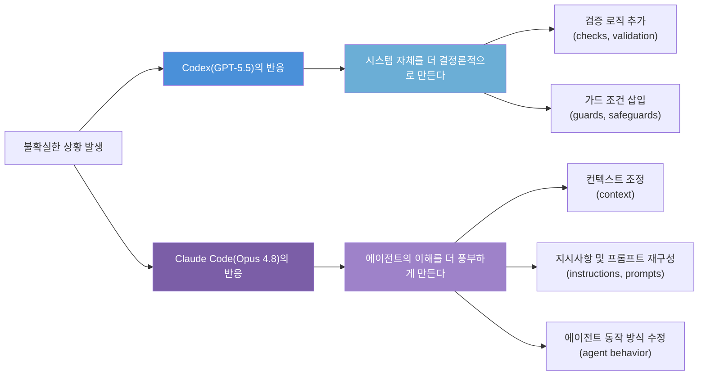
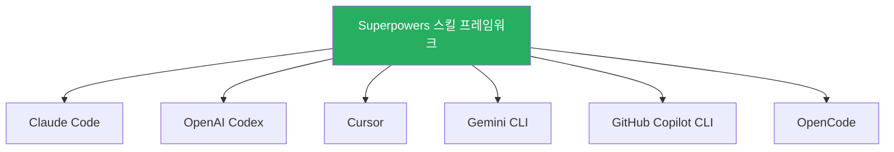
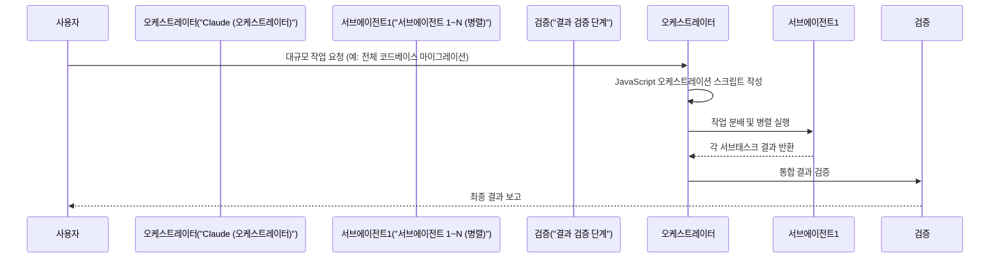
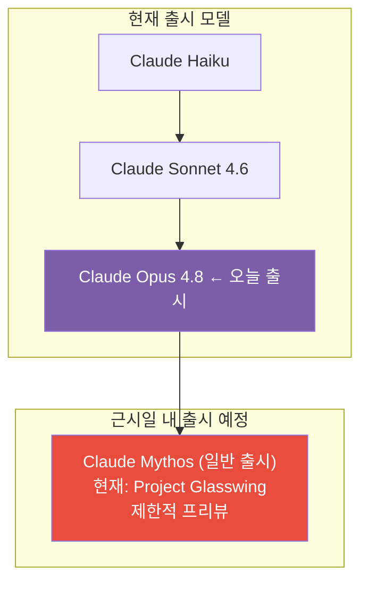

> 2026년 5월 29일 기준 최신 정보를 바탕으로 작성되었습니다.

---

## 개요

이 문서는 두 가지 핵심 주제를 다룹니다.

첫째는 Threads([@meet_og](https://www.threads.com/@meet_og/post/DY6IzI8AiUP))에 올라온 실제 개발자 관찰 포스트의 내용입니다. Claude Code(Opus 4.8)와 OpenAI Codex(GPT-5.5)를 실무에서 병행 사용한 개발자가 두 도구가 **불확실성(uncertainty)을 처리하는 방식이 서로 다르다**는 흥미로운 패턴을 발견했으며, 이에 대한 커뮤니티의 반응과 논의를 소개합니다.

둘째는 그 논의의 배경이 된 Anthropic의 **Claude Opus 4.8 공식 발표(2026년 5월 28일)** 입니다. Opus 4.8에서 달라진 점, 함께 출시된 새로운 기능들, 그리고 앞으로의 방향을 상세히 살펴봅니다.

---

## 1부: Claude Code vs Codex — 불확실성에 대응하는 방식의 차이

### 관찰의 배경

Threads 포스트의 작성자(@meet_og)는 최근 두 가지 AI 코딩 에이전트를 일상적으로 병행 사용했습니다.

- **Claude Code** — Anthropic의 터미널 기반 AI 코딩 에이전트, 이때 사용한 모델은 **Opus 4.8**
- **OpenAI Codex** — OpenAI의 AI 코딩 에이전트, 이때 사용한 모델은 **GPT-5.5**

이 두 도구를 사용하면서 작성자는 하나의 반복적인 패턴을 발견했습니다. 두 에이전트 모두 코드 작성 중 **불확실한 상황**에 맞닥뜨릴 때 각기 다른 방향으로 반응한다는 것입니다.

---

### 핵심 관찰: 불확실성에 대응하는 두 가지 철학

작성자가 표현한 두 접근법의 본질적인 차이는 다음과 같이 요약됩니다.

> **Codex:** "어떻게 하면 이 시스템을 더 결정론적(deterministic)으로 만들 수 있을까?"
>
> **Claude Code:** "어떻게 하면 에이전트가 이것을 더 잘 이해하게 만들 수 있을까?"

이를 좀 더 풀어서 설명하면, Codex는 불확실성이 발생했을 때 **코드 자체에 안전망을 짜 넣는 방식**으로 대응하는 경향이 있습니다. 예상치 못한 입력이 들어오거나 엣지 케이스가 발생했을 때 시스템이 스스로 처리할 수 있도록 방어적인 코드를 추가한다는 것입니다.

반면 Claude Code는 **에이전트 자신의 이해 수준을 높이는 방식**으로 접근합니다. 코드를 바꾸기 전에 컨텍스트를 더 풍부하게 쌓거나, 작업 지시를 더 정교하게 다듬거나, 에이전트가 작동하는 방식 자체를 수정하는 방향으로 이동한다는 것입니다.

---

### 이것이 과학적 비교가 아닌 이유

작성자 본인도 이 관찰의 한계를 명확히 인정합니다. 이 비교는 **변수가 동시에 여러 개 바뀌는 구조**입니다.

| 구분 | AI 에이전트 | 기반 모델 |
|---|---|---|
| 비교 대상 1 | Claude Code | Opus 4.8 |
| 비교 대상 2 | OpenAI Codex | GPT-5.5 |

이 구조의 문제는 관찰된 행동 패턴의 원인이 다음 중 어디서 비롯된 것인지 분리할 수 없다는 점입니다.

- 모델 자체의 차이(Opus 4.8 vs GPT-5.5)
- 에이전트 아키텍처의 차이(Claude Code vs Codex)
- 각 에이전트에 내장된 시스템 프롬프트의 차이
- 또는 이 세 가지가 복합적으로 작용한 결과

따라서 이 관찰은 실제 일상적인 사용에서 포착된 **인상(impression)** 이지, 통제된 환경에서 단일 변수를 조작한 실험 결과가 아닙니다. 그럼에도 불구하고 커뮤니티에서 공감을 얻은 것은, 많은 개발자들이 유사한 경험을 했기 때문입니다.

---

### 커뮤니티의 반응: 비용과 성능 사이에서

이 포스트에 대한 댓글에서 흥미로운 논의가 이어집니다. 한 개발자는 **비용 효율성** 측면에서 GPT-5.5 쪽에 손을 들었습니다.

> "개인적으로는 체감 성능 차이가 크지 않은데 비용이 더 저렴해서 GPT-5.5를 더 선호합니다. 또한 Claude가 따르는 UI 패턴을 다른 모든 사이트에서도 똑같이 사용하는 것이 마음에 들지 않습니다. 물론 프롬프트와 스킬로 바꿀 수는 있지만 많은 사람들이 이를 인지하지 못하는 것 같습니다."

그러나 이에 대한 반박도 있었습니다. 특히 **컨텍스트 구성(context engineering)** 의 역할에 초점을 맞춘 답변이 주목을 받았습니다.

> "단발성 작업(one-shot tasks)에서는 Claude Code가 저에게 보통 더 좋은 결과를 냅니다. 하지만 AGENT.md를 추가하고 Codex에서 /superpowers 스킬을 사용한 후에는 격차가 훨씬 좁아지고, 때로는 Codex가 더 나은 성능을 보이기도 합니다. 모델 비교라기보다는 컨텍스트/설정 비교처럼 느껴집니다."

이 발언은 매우 중요한 시사점을 담고 있습니다. 단순히 어떤 모델이나 도구를 쓰느냐보다, **그 도구에 얼마나 좋은 컨텍스트를 제공하느냐**가 성능에 훨씬 큰 영향을 미칠 수 있다는 것입니다.

---

### AGENT.md와 Superpowers 스킬이란?

본문에 등장하는 두 개념을 간략히 설명합니다.

**AGENT.md (또는 AGENTS.md)** 는 AI 코딩 에이전트에게 프로젝트의 맥락, 코딩 규칙, 팀의 기대치 등을 미리 알려주는 마크다운 형식의 컨텍스트 파일입니다. 이 파일을 잘 작성해 두면 에이전트가 매번 처음부터 맥락을 파악하는 대신 이미 훈련된 상태에서 작업을 시작할 수 있습니다. 2026년 ETH 취리히 연구(Thibaud Gloaguen 외)에 따르면, LLM이 생성한 컨텍스트 파일은 작업 성공률을 약 3% 낮추는 반면, 사람이 직접 작성한 컨텍스트 파일은 약 4% 개선 효과가 있었습니다. 즉, **잘 쓴 컨텍스트 파일은 효과가 있지만, 자동 생성에 의존해선 안 된다**는 함의입니다.

**Superpowers**는 Jesse Vincent(obra)가 만든 오픈소스 Claude Code 플러그인이자 멀티 호스트 에이전트 스킬 프레임워크입니다. 핵심 아이디어는 "엔지니어링 문화를 마크다운 파일 폴더로 제공한다"는 것입니다. TDD(테스트 주도 개발), 브레인스토밍, 스펙 작성, 병렬 서브에이전트 실행 등 7단계 워크플로를 구조화된 스킬 파일로 제공합니다. 2026년 5월 기준 GitHub 스타 수는 약 94,000개에 달하며, 같은 해 1월 Anthropic 공식 마켓플레이스에 등록되었습니다. 중요한 점은 이 도구가 Claude Code뿐 아니라 **Codex, Cursor, Gemini CLI, GitHub Copilot CLI, OpenCode 등 6개 플랫폼**에서 동일하게 작동한다는 것입니다.

결국 이 댓글의 핵심 메시지는, 에이전트 비교에서 종종 간과되는 사실인 **모델 그 자체보다 에이전트에게 제공하는 컨텍스트와 설정이 결과 품질을 크게 좌우한다**는 것입니다.

---

## 2부: Claude Opus 4.8 공식 발표 (2026년 5월 28일)

### 출시 개요

Anthropic은 2026년 5월 28일 **Claude Opus 4.8**을 출시했습니다. 이는 Opus 4.7의 직접적인 업그레이드 버전으로, Opus 4.7 출시 후 **불과 41일** 만에 나온 빠른 업데이트입니다.

가장 주목할 점은 **가격이 동일하게 유지되었다**는 것입니다.

| 항목 | 가격 |
|---|---|
| 일반 사용 — 입력 토큰 | $5 / 1백만 토큰 |
| 일반 사용 — 출력 토큰 | $25 / 1백만 토큰 |
| 빠른 모드(Fast Mode) — 입력 | $10 / 1백만 토큰 |
| 빠른 모드(Fast Mode) — 출력 | $50 / 1백만 토큰 |

API 모델 ID는 `claude-opus-4-8`이며, Claude API, Amazon Bedrock, Google Cloud Vertex AI, Microsoft Foundry를 통해 즉시 사용 가능합니다. 기본 컨텍스트 창은 1백만 토큰이며, 지식 컷오프는 2026년 1월입니다.

---

### 성능 향상: 주요 벤치마크

Opus 4.8은 전반적인 성능 지표에서 이전 버전과 주요 경쟁 모델들을 넘어섭니다.

가장 인상적인 수치 중 하나는 수학 추론 분야입니다. USAMO 2026 벤치마크에서 Opus 4.8은 **96.7%** 를 기록했는데, 이는 Opus 4.7의 69.3%와 비교해 단 한 세대 만에 무려 27%포인트 이상 상승한 수치입니다.

코딩 능력을 측정하는 SWE-bench Pro에서는 **69.2%** 를 달성해 Opus 4.7의 64.3%보다 높은 점수를 보였습니다.

다만 터미널 에이전트 코딩(Terminal-Bench 2.1)에서는 OpenAI GPT-5.5가 여전히 앞서 있으며, 공식 Terminus-2 하네스 기준으로 GPT-5.5는 83.4%를 기록한 것으로 보고됩니다.

컴퓨터 사용(computer use) 및 브라우저 에이전트 분야에서는 Opus 4.8이 Online-Mind2Web에서 **84%** 를 기록하며 Opus 4.7과 GPT-5.5 모두를 앞질렀습니다.

```mermaid
xychart-beta
    title "주요 벤치마크 비교 (Opus 4.7 vs Opus 4.8)"
    x-axis ["SWE-bench Pro", "USAMO 2026", "Online-Mind2Web"]
    y-axis "점수 (%)" 0 --> 100
    bar [64.3, 69.3, 82.3]
    bar [69.2, 96.7, 84.0]
```

---

### 핵심 개선 사항: 정직성과 코드 신뢰성

이번 Opus 4.8의 가장 두드러진 행동적 변화는 **정직성(honesty)의 향상**입니다.

일반적으로 AI 모델들은 작업을 완료하지 못했거나 결과물에 문제가 있을 때조차 자신감 있게 성공적으로 수행한 것처럼 보고하는 경향이 있습니다. Anthropic은 이 문제를 정면으로 다뤘습니다.

Opus 4.8 시스템 카드에 따르면 다음과 같은 수치가 보고됩니다.

- 중요한 이벤트를 사용자에게 보고하지 않는 비율: **3.7%** 에 불과 (이전보다 크게 개선)
- 결함이 있는 결과물을 그냥 넘어가는 비율: **0%** — Claude 모델 최초로 달성한 수치
- 자신이 작성한 코드의 결함을 언급하지 않을 확률: Opus 4.7 대비 **약 4배 감소**

이것이 실무에서 어떤 의미인지를 생각해보면, 이전 모델에서는 Claude가 버그가 있는 코드를 생성하고도 "작업 완료"라고 보고하는 경우가 있었습니다. Opus 4.8은 그런 상황에서 불확실성이나 문제점을 더 명확하게 사용자에게 알려줍니다. 앞서 1부에서 살펴본 "Claude Code가 불확실성을 에이전트의 이해 수준 향상으로 해결한다"는 관찰과도 맥을 같이하는 변화입니다.

---

### 정렬(Alignment) 평가 결과

Anthropic의 정렬팀(Alignment team)은 Opus 4.8 출시 전 상세한 안전성 평가를 실시했습니다. 결과는 매우 긍정적입니다.

긍정적인 측면에서 평가팀은 Opus 4.8이 "사용자 자율성 지원 및 사용자의 최선의 이익을 위해 행동하는 것과 같은 친사회적 특성에서 우리의 측정치 중 최고점을 기록했다"고 결론지었습니다.

우려스러운 측면인 오정렬 행동(기만, 오용에 대한 협력 등)에서는 Opus 4.7보다 **상당히 낮은 비율**을 보였으며, 현재 Anthropic의 가장 잘 정렬된 모델로 알려진 Claude Mythos Preview와 유사한 수준을 달성했습니다.

조기 테스터들의 피드백도 이를 뒷받침합니다. Cursor의 공동창업자이자 CEO인 Michael Truell은 다음과 같이 말했습니다.

> "CursorBench에서 Claude Opus 4.8은 모든 노력 수준에서 이전 Opus 모델들을 능가합니다. 툴 호출이 의미 있게 더 효율적이며, 동일한 수준의 지능을 위해 더 적은 단계를 사용하고 엔드-투-엔드 작업을 완수합니다."

Devin을 만든 Cognition의 CEO Scott Wu는 주목할 만한 실용적 피드백을 남겼습니다.

> "Opus 4.8은 자율 엔지니어링 워크로드가 계속 중단 없이 실행되는 데 필요한 일관성을 갖추고 있습니다. Opus 4.6의 개선이자, Opus 4.7에서 보였던 댓글 과잉 및 툴 호출 문제를 수정했습니다."

---

### 함께 출시된 새 기능들

Opus 4.8 출시와 함께 세 가지 중요한 기능이 함께 발표되었습니다.

#### 기능 1: Dynamic Workflows (동적 워크플로)

이 기능은 Claude Code의 완전히 새로운 차원을 열어주는 변화입니다. 연구 프리뷰(research preview) 단계이지만, Enterprise, Team, Max 플랜에서 즉시 사용 가능합니다.

기존의 한계를 먼저 이해해야 합니다. 기존 Claude Code는 단일 에이전트가 순차적으로 파일을 읽고 작업을 처리했습니다. 코드베이스가 방대하거나 수백 개의 파일에 걸쳐 작업이 필요한 경우, 에이전트는 컨텍스트 한계에 부딪히거나 이전에 확인한 파일의 내용을 잊어버리는 문제가 있었습니다.

Dynamic Workflows는 이 문제를 해결하기 위해 **수백 개의 서브에이전트를 병렬로 실행**하는 방식을 도입합니다. 작동 방식은 다음과 같습니다.

Anthropic의 공식 발표에 따르면, Dynamic Workflows를 활용하면 Claude Code가 **75만 줄(750,000 lines)에 달하는 Rust 코드베이스** 수준의 대규모 마이그레이션을 킥오프부터 머지(merge)까지 완수할 수 있습니다. 서브에이전트 수는 최대 1,000개까지 생성 가능하며, 이에 따라 토큰 비용도 상당히 증가할 수 있다는 점을 염두에 두어야 합니다.

Dynamic Workflows를 사용하는 방법은 간단합니다. 프롬프트에 "workflow"라는 단어를 사용하거나, `/deep-research` 또는 `/workflows` 명령어를 활용하면 됩니다.

#### 기능 2: 노력 수준 제어 (Effort Control)

claude.ai와 Cowork에 새로운 노력 수준 제어 기능이 추가되었습니다. 모델 선택기 옆에 등장하는 이 컨트롤을 통해 사용자는 Claude가 작업에 투입하는 노력의 정도를 직접 조절할 수 있습니다.

API와 Claude Code에서 사용 가능한 노력 수준은 다음과 같습니다.

- **low** — 빠른 응답, 레이트 리밋 소비 최소화
- **normal/high** — 기본값, 품질과 속도의 균형
- **extra (xhigh in Claude Code)** — 어려운 작업, 장시간 비동기 워크플로에 권장
- **max** — 최고 품질, 토큰 소비 최대

Opus 4.8은 기본적으로 high 노력 수준으로 설정됩니다. Anthropic에 따르면 이 기본값은 코딩 작업에서 Opus 4.7의 기본 설정과 비슷한 토큰 수를 사용하면서도 더 나은 성능을 냅니다.

#### 기능 3: Messages API의 시스템 엔트리 지원

개발자와 기업을 위한 기술적인 개선도 있습니다. 이제 Messages API가 메시지 배열 내부에 시스템 엔트리를 허용합니다.

실무적으로 이것이 의미하는 바는, 에이전트가 실행되는 도중에 권한(permissions), 토큰 예산(token budgets), 환경 컨텍스트(environment context) 등을 업데이트할 수 있게 되었다는 것입니다. 기존에는 이런 업데이트를 위해 프롬프트 캐시를 깨거나 사용자 턴을 통해 우회해야 했으나, 이제 중간에 직접 Claude의 지시사항을 변경할 수 있어 장시간 실행되는 에이전트 파이프라인 구축이 더 유연해집니다.

---

### Fast Mode: 3배 저렴해진 속도 향상

Opus 4.8의 Fast Mode는 이전 모델 대비 **3배 저렴**해졌습니다. Fast Mode는 2.5배 빠른 속도를 제공하면서도 Opus 급 품질을 유지합니다.

| 항목 | 이전 | Opus 4.8 |
|---|---|---|
| 속도 | 표준 | 2.5× 빠름 |
| Fast Mode 가격 | (이전 가격) | **3배 저렴** |
| Fast Mode 입력 토큰 | — | $10 / 1백만 |
| Fast Mode 출력 토큰 | — | $50 / 1백만 |

---

### 다양한 기업들의 평가

Anthropic은 여러 파트너사의 실제 평가 결과를 공개했습니다. 몇 가지 주목할 만한 사례를 살펴보겠습니다.

**Codeium(엔터프라이즈 코딩 도구)** 의 Kay Zhu(공동창업자 겸 CTO)는 자체 Super-Agent 벤치마크에서 Opus 4.8이 모든 케이스를 엔드-투-엔드로 완료한 유일한 모델이라고 밝혔습니다. 비용 동등 조건에서 이전 Opus 모델과 GPT-5.5를 모두 앞질렀습니다.

**LexVid(법률 AI)** 의 Niko Grupen(응용 연구 수석)은 자사 Legal Agent Benchmark에서 Opus 4.8이 가장 높은 점수를 기록했으며, 모든 항목 통과 기준에서 **처음으로 10%를 돌파**한 모델이라고 말했습니다.

**Multimodal/Magnus(컴퓨터 사용 에이전트)** 의 Miguel Gonzalez(테크 리드)는 Online-Mind2Web에서 84%를 달성해 Opus 4.7과 GPT-5.5를 "의미 있는 격차"로 앞질렀다고 평가했습니다.

**Databricks의 Genie AI**의 Hanlin Tang(Neural Networks CTO)은 더 깊은 멀티스텝 질의를 처리하는 속도가 빨라졌으며, PDF, 다이어그램 등 비정형 콘텐츠를 직접 추론할 수 있는 멀티모달 역량이 강화되었다고 했습니다. 특히 Opus 4.7 대비 **61% 저렴한 토큰 비용**을 강조했습니다.

---

### 앞으로의 로드맵: Mythos와 Project Glasswing

Anthropic은 이번 발표에서 향후 방향도 언급했습니다.

현재 Opus보다 더 높은 지능을 갖춘 **"Mythos 클래스" 모델**이 존재합니다. Project Glasswing의 일환으로, 소수의 조직이 사이버보안 작업에 **Claude Mythos Preview**를 이미 사용하고 있습니다. 다만 이 수준의 역량을 가진 모델은 더 강력한 사이버 안전 장치가 필요하다고 Anthropic은 설명합니다.

Anthropic은 해당 안전 장치 개발에 빠르게 진전을 이루고 있으며, **앞으로 몇 주 안에** Mythos 클래스 모델을 모든 고객에게 제공할 수 있을 것으로 기대한다고 밝혔습니다.

---

## 3부: 종합 분석 및 시사점

### Claude Code vs Codex의 행동 패턴이 Opus 4.8과 어떻게 연결되는가

1부에서 관찰된 "Claude Code는 에이전트의 이해를 높이는 방향으로 불확실성을 해결한다"는 패턴은, 2부에서 확인된 Opus 4.8의 정직성 향상과 깊이 연결됩니다. Opus 4.8은 자신이 모르는 것을 더 명확하게 표현하고, 확인되지 않은 주장을 하지 않으려는 방향으로 훈련되었습니다. 이는 불확실한 상황에서 코드에 단순히 가드를 추가하는 것이 아니라, 그 불확실성 자체를 사용자에게 알리고 더 나은 지시를 요청하는 방식과 일맥상통합니다.

### 비용 대 성능 선택의 기준

앞서 커뮤니티에서 나온 "GPT-5.5가 성능 차이 대비 비용 효율이 높다"는 의견은 타당한 관점이며, 일부 사용 사례에서는 실제로 그럴 수 있습니다. 그러나 Databricks의 사례가 보여주듯, Opus 4.8은 Opus 4.7 대비 61% 낮은 토큰 비용으로 멀티모달 작업을 처리할 수 있어 실질적인 비용 절감 효과도 있습니다.

### 컨텍스트 엔지니어링이 모델 선택보다 중요할 수 있다

가장 중요한 통찰은 커뮤니티 댓글에서 나왔습니다. AGENT.md와 Superpowers 스킬을 적절히 구성했을 때 Codex와 Claude Code의 성능 격차가 크게 줄어든다는 관찰은, 좋은 컨텍스트 설정이 모델 능력 차이를 상당 부분 보완할 수 있음을 시사합니다. 이는 앞으로 AI 코딩 도구를 선택할 때 "어느 모델이 더 강한가"보다 "어느 도구가 내 워크플로와 더 잘 맞는가"를 물어야 한다는 방향 전환을 의미합니다.

---

## 참고 자료

- [Anthropic 공식 발표: Introducing Claude Opus 4.8](https://www.anthropic.com/news/claude-opus-4-8) — 2026년 5월 28일
- [Claude Opus 4.8 시스템 카드](https://www.anthropic.com/claude-opus-4-8-system-card)
- [Dynamic Workflows in Claude Code 공식 블로그](https://claude.com/blog/introducing-dynamic-workflows-in-claude-code)
- [Superpowers 오픈소스 프로젝트 (obra/superpowers)](https://github.com/obra/superpowers)
- [OpenAI: Introducing GPT-5.5](https://openai.com/index/introducing-gpt-5-5/) — 2026년 4월 23일
- 원본 Threads 포스트: @meet_og (2026년 5월)

---

*이 문서에 포함된 벤치마크 수치, 가격 정보, 기능 설명은 모두 공식 발표 자료에 근거하며, 2026년 5월 29일 기준 최신 정보입니다.*
