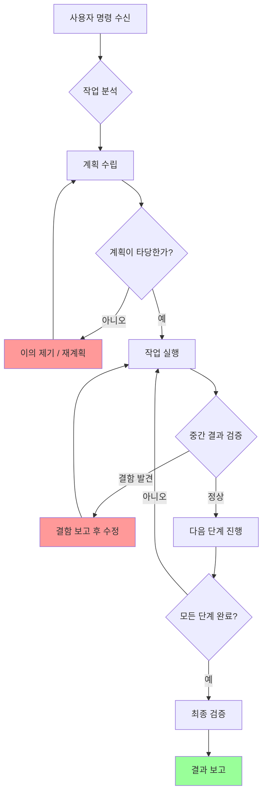
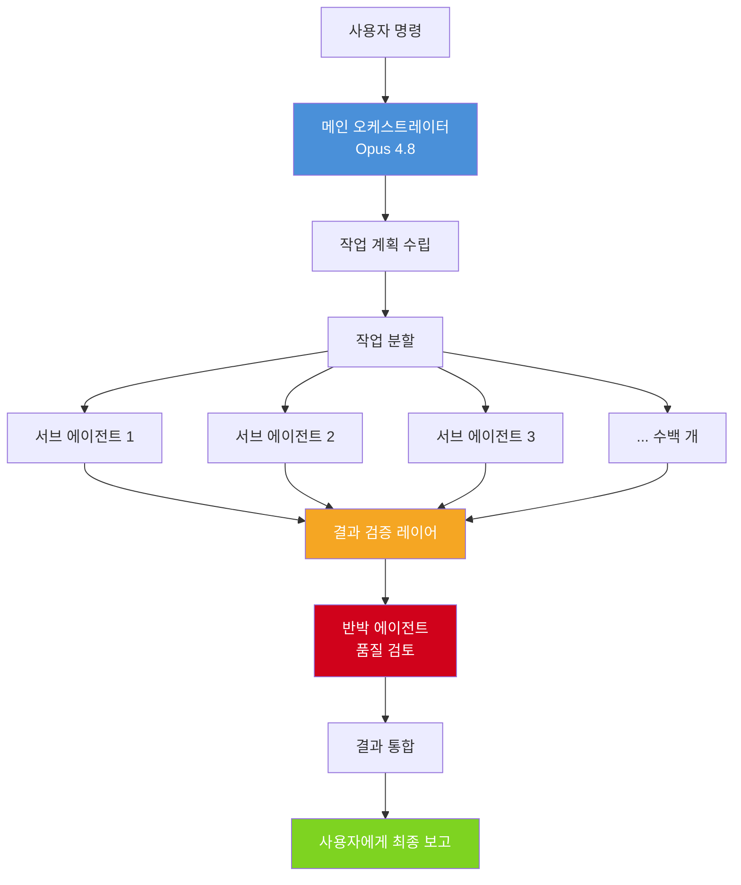
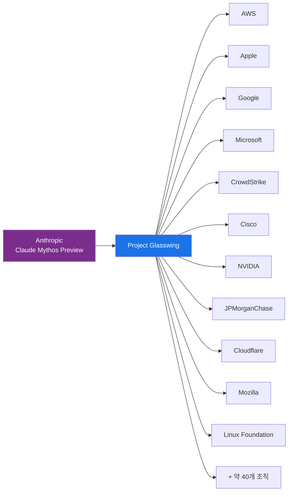

> **작성일**: 2026년 5월 29일  
> **출처**: [Anthropic 공식 발표]( https://www.anthropic.com/news/claude-opus-4-8), [커뮤니티 반응](https://news.hada.io/topic?id=29960), 외부 벤치마크 분석  
> **버전**: Claude Opus 4.8 (모델 ID: `claude-opus-4-8`)

---

## 목차

1. [개요: 무엇이 출시되었는가](#1-개요)
2. [출시 배경과 타이밍](#2-출시-배경과-타이밍)
3. [벤치마크 성능 상세 분석](#3-벤치마크-성능)
4. [핵심 개선사항: 정직성(Honesty)](#4-정직성-강화)
5. [에이전트 능력과 협업](#5-에이전트-능력)
6. [새로운 기능들](#6-새로운-기능들)
7. [가격 및 기술 스펙](#7-가격-및-기술-스펙)
8. [Claude Mythos와 Project Glasswing](#8-claude-mythos와-project-glasswing)
9. [커뮤니티 반응과 실사용 후기](#9-커뮤니티-반응)
10. [향후 계획](#10-향후-계획)
11. [정리 및 결론](#11-정리-및-결론)

---

## 1. 개요

2026년 5월 28일, AI 연구 기업 Anthropic은 자사의 최상위 플래그십 모델인 **Claude Opus** 시리즈의 최신 버전 **Claude Opus 4.8**을 공개했습니다. 이 모델은 직전 버전인 Opus 4.7을 기반으로 코딩, 에이전트 작업, 수학적 추론, 그리고 특히 **정직성(Honesty)** 측면에서 의미 있는 향상을 이루었습니다.

Anthropic은 이번 출시를 "전임 모델 대비 겸손하지만 체감 가능한 개선(a modest but tangible improvement)"이라고 스스로 표현했습니다. 이는 전례 없이 솔직한 자기 평가로, 커뮤니티에서 신선하다는 반응을 얻기도 했습니다.

Claude Opus 4.8의 가장 중요한 특징은 **같은 가격에 더 나은 성능**을 제공한다는 점입니다. 표준 API 요금은 입력 $5/백만 토큰, 출력 $25/백만 토큰으로 Opus 4.7과 동일하게 유지되었습니다. 여기에 더해, 동시에 여러 개의 새로운 기능들이 함께 출시되었습니다.

---

## 2. 출시 배경과 타이밍

### 잦아진 업데이트 주기

Claude Opus 4.8은 Opus 4.7 출시 후 불과 **41일** 만에 공개되었습니다. 이는 Anthropic의 역사상 가장 빠른 플래그십 모델 업데이트 주기입니다. Opus 4.5 이후 4.6, 4.7, 4.8로 이어지는 잦은 마이너 릴리즈 패턴에 대해 커뮤니티에서는 두 가지 시각이 나뉩니다.

하나는 "점진적이고 안정적인 개선을 통해 사용자가 예측 가능한 품질 향상을 경험하게 한다"는 긍정적 해석이고, 다른 하나는 "모델의 실질적인 능력 향상보다는 비용 제어, 마진 관리, 사용자 유지율을 위한 백엔드 조정이 더 큰 목적일 수 있다"는 비판적 시각입니다.

### Opus 4.7에 대한 부정적 평가가 촉발

Opus 4.7은 일부 사용자들에게 "처음으로 이전 버전(4.6)으로 되돌아가야 했던 버전"으로 평가받았습니다. 코딩 작업에서 더 게으르고 나쁜 결정을 내린다는 의견, BrowseComp(웹 검색 품질) 벤치마크에서 오히려 4.6보다 퇴보했다는 지적 등이 있었습니다. Opus 4.8은 이런 불만을 해소하기 위한 명확한 답변이기도 합니다.

### AI 경쟁 환경

2026년 4월, OpenAI가 GPT-5.5를 출시하며 코딩 벤치마크에서 Claude 모델들을 여러 항목에서 앞섰습니다. Anthropic 입장에서는 시장 선두 지위를 유지하거나 탈환할 필요가 있었고, 이 맥락에서 Opus 4.8의 타이밍이 이해됩니다.

---

## 3. 벤치마크 성능

### 주요 벤치마크 비교표

아래는 Opus 4.8, Opus 4.7, 그리고 경쟁 모델인 GPT-5.5의 주요 벤치마크 결과입니다.

| 벤치마크 | Opus 4.8 | Opus 4.7 | GPT-5.5 | 비고 |
|----------|----------|----------|---------|------|
| **SWE-bench Verified** | 88.6% | 87.6% | - | 실제 GitHub 이슈 해결 |
| **SWE-bench Pro** | **69.2%** | 64.3% | ~59% | 더 어려운 버전 |
| **Terminal-Bench 2.1** | 74.6% | 66.1% | **78.2%** | CLI 터미널 코딩 |
| **GPQA Diamond** | 93.6% | - | - | 대학원 수준 과학 |
| **USAMO 2026** | **96.7%** | 69.3% | - | 수학 올림피아드 |
| **GDPval-AA (Elo)** | **1890** | 1753 | 1769 | 실제 업무 종합 |
| **OSWorld-Verified** | 83.4% | 82.3% | - | 컴퓨터 사용 에이전트 |

```mermaid
xychart-beta
    title "주요 벤치마크 비교 (%)"
    x-axis ["SWE-bench Verified", "SWE-bench Pro", "Terminal-Bench 2.1", "USAMO 2026"]
    y-axis "점수 (%)" 0 --> 100
    bar [88.6, 69.2, 74.6, 96.7]
    bar [87.6, 64.3, 66.1, 69.3]
    bar [0, 59, 78.2, 0]
```

### 벤치마크별 의미 설명

**SWE-bench Verified**는 실제 오픈소스 GitHub 저장소의 이슈(버그 리포트 등)를 AI가 직접 읽고 코드를 수정하여 해결하는 능력을 측정합니다. 88.6%라는 점수는 AI가 실제 소프트웨어 개발 현장에서 인간 개발자의 많은 부분을 대체할 수 있는 수준에 도달했음을 의미합니다.

**SWE-bench Pro**는 Verified보다 훨씬 어렵고, 데이터 오염(contamination) 가능성이 낮은 새로운 이슈들로 구성됩니다. Opus 4.8이 GPT-5.5를 약 10 퍼센트포인트 이상 앞서며 이 항목에서 압도적인 우위를 보입니다.

**Terminal-Bench 2.1**은 터미널(명령줄 환경)에서의 코딩 능력을 측정합니다. 이 항목에서는 GPT-5.5(78.2%)가 Opus 4.8(74.6%)을 앞섭니다. 즉, CLI 환경에서의 순수 코딩 속도와 정확성은 여전히 OpenAI의 모델이 강세를 보입니다.

**USAMO 2026**에서의 27.4 퍼센트포인트 급등(69.3% → 96.7%)은 단일 업데이트 주기에서 Opus 시리즈 역사상 가장 큰 수학적 추론 능력 도약입니다. 이는 단순한 점진적 개선이 아니라 수학적 사고 깊이에서 질적 변화가 있었음을 의미합니다.

**GDPval-AA**는 Artificial Analysis가 실제 업무(코딩, 분석, 글쓰기 등)를 종합한 독립적 리더보드입니다. Opus 4.8은 1890 Elo 점수로 2위인 GPT-5.5(1769 Elo)보다 121점 앞서며 종합 1위를 차지했습니다.

### 경쟁 모델과의 관계

Opus 4.8은 GPT-5.5 Regular 기준으로 코딩(이슈 레벨), 에이전트 도구 사용, 장문 컨텍스트, 지식 업무 등 최소 12개 벤치마크에서 우위를 보입니다. 반면 GPT-5.5는 터미널/CLI 환경과 웹 브라우징 일부 항목에서 앞서거나 동등한 수준입니다.

---

## 4. 정직성 강화

### 왜 정직성이 중요한가

AI 모델의 가장 큰 문제 중 하나는 "hallucination(환각)"이라고 불리는 현상, 즉 근거 없이 자신 있게 틀린 정보를 제공하는 것입니다. 에이전트 코딩 맥락에서는 이것이 더욱 치명적입니다. 모델이 코드에 버그가 있는데도 "작업 완료"라고 선언하거나, 실제로 확인하지 않은 채 "이 코드는 정상 작동합니다"라고 말하면, 개발자는 잘못된 코드를 프로덕션 환경에 배포하게 됩니다.

### Opus 4.8의 정직성 수치

Anthropic의 평가에 따르면 Opus 4.8은 다음과 같은 정직성 지표를 기록했습니다.

- 사용자에게 중요한 이벤트를 알리지 않는 비율: **3.7%** (매우 낮은 수준)
- 결함 있는 결과를 비판 없이 보고하는 비율: **0%** (Claude 역사상 처음)
- 코드에서 결함을 놓치는 확률: Opus 4.7 대비 **약 4배 감소**

시스템 카드에는 "Opus 4.8은 불확실성을 표시하고, 스스로 버그를 잡아내며, 이른 승리 선언 대신 문제를 솔직히 알린다"는 내용이 기재되어 있습니다.

실제로 Simon Willison 같은 저명한 AI 연구자/블로거의 독립 테스트에서도 Opus 4.8은 여섯 개 모델 중 모든 벤치마크에서 가장 낮은 오답률을 기록했습니다. 흥미롭게도 이 성과는 "더 많이 맞히기" 때문이 아니라 "불확실할 때 답을 내놓지 않기(abstaining)" 덕분이었습니다.

### 정렬(Alignment) 평가 결과

Anthropic의 정렬 팀은 Opus 4.8에 대해 "사용자 자율성 지원 및 사용자의 이익을 위해 행동하는 등 친사회적(prosocial) 특성 측정에서 새로운 최고 기록에 달했다"고 결론지었습니다.

또한 기만(deception)이나 오용 협조 등 잘못된 정렬 행동(misaligned behavior) 비율은 Opus 4.7보다 현저히 낮아졌으며, Anthropic이 아직 일반에 공개하지 않은 실험 모델인 Claude Mythos Preview와 유사한 수준을 보였습니다.

---

## 5. 에이전트 능력

에이전트(Agentic) 능력이란 AI가 단순히 질문에 답하는 것을 넘어, 여러 단계로 이루어진 복잡한 작업을 자율적으로 계획하고 실행하는 능력을 말합니다. 예를 들어 "이 코드베이스에서 보안 취약점을 찾아 수정하라"는 명령을 받으면, AI가 스스로 파일을 탐색하고, 문제를 식별하며, 수정 코드를 작성하고, 테스트를 실행하는 일련의 과정을 자율적으로 수행하는 것입니다.

### Opus 4.8의 에이전트 개선점

초기 테스터들의 보고에 따르면, Opus 4.8은 복잡한 다단계 작업을 수행할 때 다음과 같은 향상된 능력을 보입니다.

첫째, **판단력이 더 날카로워졌습니다.** 작업 계획이 타당하지 않을 때 스스로 의문을 제기하고, 잘못된 방향으로 가고 있다고 판단하면 중간에 이의를 제기합니다.

둘째, **자신의 실수를 더 잘 포착합니다.** 이전 모델들은 중간 단계에서 오류를 저질러도 계속 진행하는 경향이 있었지만, Opus 4.8은 실수를 발견하면 멈추고 수정을 시도합니다.

셋째, **더 나은 협업자 역할을 합니다.** 단순히 명령을 받고 수행하는 것이 아니라, 개발자와 함께 문제를 풀어나가는 파트너로서 작동하는 느낌을 준다는 평가가 많습니다.

---

## 6. 새로운 기능들

Opus 4.8과 함께 세 가지 중요한 신기능이 동시에 출시되었습니다.

### 6.1 다이내믹 워크플로우 (Dynamic Workflows)

**다이내믹 워크플로우**는 Claude Code에서 사용할 수 있는 기능으로, 현재 리서치 프리뷰 단계입니다. Enterprise, Team, Max 플랜에서 이용 가능합니다.

이 기능의 핵심은 하나의 세션에서 수백 개의 서브 에이전트를 **병렬**로 실행할 수 있다는 점입니다. 기존에는 하나의 Claude Code 인스턴스가 순차적으로 작업을 처리했다면, 이제는 메인 오케스트레이터가 작업을 계획하고, 수백 개의 독립적인 서브 에이전트에게 각각 다른 파트를 맡겨 동시에 처리한 뒤, 결과를 검증하고 사용자에게 최종 보고하는 방식으로 동작합니다.

실제 사용 사례로 가장 인상적인 것은 **Bun 프레임워크의 Zig → Rust 마이그레이션**입니다. Jarred Sumner가 다이내믹 워크플로우를 활용해 약 75만 줄의 코드를 11일 만에 마이그레이션했으며, 기존 테스트 스위트 통과율이 **99.8%** 에 달했습니다.

다이내믹 워크플로우의 주요 특징은 다음과 같습니다.

- **수백 개의 병렬 서브 에이전트**: 대규모 코드베이스를 여러 부분으로 나눠 동시에 처리
- **중단 후 재개**: 인터럽트된 작업을 처음부터 재시작하지 않고 중단된 지점에서 이어서 실행
- **자기 검증**: 서브 에이전트들의 결과를 "반박 에이전트(refutation agent)"가 검토하는 구조
- **대규모 마이그레이션 가능**: 수십만 줄의 코드를 처음 시작부터 병합(merge)까지 자동화

### 6.2 노력 제어 (Effort Control)

**노력 제어**는 claude.ai와 Cowork 앱에서 사용자가 모델 선택기 옆에서 조절할 수 있는 새로운 컨트롤입니다. 모든 플랜에서 사용 가능합니다.

이 기능은 Claude가 응답에 쏟는 노력의 수준을 사용자가 직접 선택할 수 있게 합니다. 설정 수준과 효과는 다음과 같습니다.

| 설정 수준 | 동작 방식 | 적합한 상황 |
|-----------|-----------|------------|
| **low** | 빠르게 응답, 추론 최소화 | 간단한 질문, 빠른 초안 작업 |
| **high** (기본값) | 적절한 추론 후 응답 | 일반적인 대부분의 작업 |
| **extra (xhigh)** | 더 깊이 생각하고 응답 | 어려운 작업, 비동기 장기 워크플로우 |
| **max** | 최대한 깊게 추론 | 가장 복잡하고 중요한 작업 |

Anthropic은 Opus 4.8의 기본값을 **high**로 설정했습니다. 코딩 작업에서 high 설정은 Opus 4.7의 기본 설정과 비슷한 토큰 수를 사용하면서도 더 나은 성능을 발휘합니다. Claude Code에서는 xhigh 설정이 더 긴 작업에 권장되며, 높은 노력 수준에 맞게 속도 제한(rate limit)도 상향되었습니다.

### 6.3 Messages API 시스템 엔트리 업데이트

기술적으로 중요한 API 개선 사항입니다. 기존에는 시스템 프롬프트(system prompt)를 대화 흐름 중간에 변경하면 **프롬프트 캐시(prompt cache)** 가 깨져 비용이 증가하고 속도가 느려졌습니다. 또한 업데이트 내용이 사용자 턴(user turn)을 통해 우회해야 했습니다.

이제 시스템 엔트리를 메시지 배열 내에 직접 포함할 수 있게 되어, 에이전트가 실행 중인 상태에서도 다음과 같은 내용을 캐시를 깨뜨리지 않고 업데이트할 수 있습니다.

- 권한(permissions) 변경
- 토큰 예산 조정
- 환경 컨텍스트 업데이트

이는 장시간 실행되는 에이전트 파이프라인을 구축하는 개발자에게 매우 실용적인 개선입니다.

---

## 7. 가격 및 기술 스펙

### 가격표

| 모드 | 입력 (per 1M 토큰) | 출력 (per 1M 토큰) |
|------|------------------|--------------------|
| **일반 모드** | $5 | $25 |
| **패스트 모드** | $10 | $50 |

패스트 모드는 2.5배 빠른 속도를 제공하며, 가격은 이전 모델(Opus 4.6/4.7)의 패스트 모드($30/$150)보다 **3배 저렴**해졌습니다. 단, 패스트 모드는 현재 리서치 프리뷰로 제공되며 계정 매니저에게 별도 신청이 필요합니다.

### 기술 스펙

| 항목 | 스펙 |
|------|------|
| **모델 ID** | `claude-opus-4-8` |
| **컨텍스트 윈도우** | 1,000,000 토큰 (1M) |
| **최대 출력 토큰** | 128,000 토큰 |
| **지식 컷오프** | 2026년 1월 |
| **지원 입력** | 텍스트, 비전 (이미지) |
| **지원 출력** | 텍스트 |

### 이용 가능한 플랫폼

Opus 4.8은 출시 즉시 다음 플랫폼에서 사용 가능합니다.

- **Claude API** (Anthropic 직접)
- **Amazon Bedrock**
- **Google Cloud Vertex AI**
- **Microsoft Foundry** (단, 컨텍스트 윈도우 200K로 제한)
- **GitHub Copilot** (Pro+, Business, Enterprise 사용자 대상)

---

## 8. Claude Mythos와 Project Glasswing

Opus 4.8 출시 발표에서 많은 사람들이 모델 자체보다 더 흥미롭다고 반응한 부분이 바로 **Claude Mythos**와 **Project Glasswing**에 대한 내용입니다.

### Claude Mythos란 무엇인가

Claude Mythos는 Opus보다 더 높은 지능을 가진 새로운 클래스의 AI 모델입니다. Anthropic은 이 모델을 아직 일반에 공개하지 않았으며, 현재는 극히 제한된 조직만이 접근할 수 있습니다.

Mythos는 현재 Anthropic의 가장 강력하고 동시에 가장 제한적인 모델입니다. 코드베이스를 대규모로 이해하고, 정교한 보안 취약점을 자율적으로 발견하며, 이에 대한 실제 익스플로잇(exploit, 취약점 공격 코드)도 스스로 구성할 수 있는 능력을 가졌습니다.

Claude Opus 4.8 출시 발표에서 Anthropic은 "몇 주 안에 모든 고객에게 Mythos급 모델을 공개할 계획"이라고 밝혔습니다.

### Project Glasswing

Project Glasswing은 Anthropic이 2026년 4월 7일 발표한 사이버보안 방어 이니셔티브입니다. 이 프로젝트는 Claude Mythos Preview를 **방어적 사이버보안 목적**으로만 활용하기 위해 선별된 파트너 조직들에게 제한적으로 제공하는 프로그램입니다.

프로그램의 규모와 성과를 요약하면 다음과 같습니다.

- **예산**: 모델 사용 크레딧 $1억, 오픈소스 보안 단체 기부 $400만 달러
- **파트너**: AWS, Apple, Broadcom, Cisco, Cloudflare, CrowdStrike, Google, JPMorganChase, Linux Foundation, Microsoft, Mozilla, NVIDIA, Palo Alto Networks 등 총 50여 개 조직
- **성과 (2026년 5월 22일 발표 기준)**: 1,000개 이상의 오픈소스 프로젝트 스캔, 23,019개 취약점 발견, 이 중 6,202개가 높음(High) 또는 위험(Critical) 등급
- **검증**: 독립 보안 기업이 1,752건을 표본 검사한 결과 90.6%가 실제 취약점임을 확인

주목할 만한 발견 중 하나는 **CVE-2026-5194**라는 wolfSSL 취약점으로, 수십억 개의 IoT 및 산업용 기기에서 TLS 인증서 위조를 허용할 수 있는 결함이었습니다. Mozilla는 Firefox 150 단일 릴리즈에서 Mythos가 발견한 271개의 취약점을 패치했습니다.

한편 Anthropic은 Opus 4.8 발표문에서 "Mythos급 모델은 강력한 사이버 안전장치가 마련될 때까지 일반에 공개할 수 없다"고 명확히 밝혔습니다. 특히 Opus 4.8 자체를 Mythos 공개 전 안전장치 테스트 플랫폼으로 활용하겠다고 언급했습니다.

---

## 9. 커뮤니티 반응

커뮤니티(GeekNews, Hacker News 등)에서의 반응은 크게 세 가지 관점으로 나눌 수 있습니다.

### 긍정적 평가

**에이전트 코딩 도구로서의 개선**: 실제 사용자들은 Claude Code + Opus 4.8의 조합이 특히 단일 HTML/JS/CSS 파일로 복잡한 애플리케이션을 생성하는 작업 등에서 이전 버전 대비 "지금까지 최고의 결과"를 냈다고 보고합니다. 한 사용자는 WarCraft, StarCraft 스타일의 RTS 게임을 단일 파일로 생성하는 테스트에서 Opus 4.8 + ultracode 모드가 가장 우수한 결과를 보였다고 공유했습니다.

**웹 검색 품질 회복**: Opus 4.7에서 BrowseComp 점수가 4.6보다 퇴보했던 문제가 4.8에서 해소되었습니다. "4.7이나 4.6보다 훨씬 좋아졌다"는 평가가 있습니다.

**사용량 효율성**: 일부 분석에 따르면 Opus 4.8은 동일한 작업 처리에 Opus 4.7보다 약 35% 적은 출력 토큰을 사용합니다. 같은 가격에 더 효율적으로 작동하는 셈입니다.

### 중립/유보적 평가

**체감의 한계**: 4.5 이후 4.6, 4.7, 4.8로 이어지는 모델 변화에서 "무엇이 좋아졌는지 확실히 잡히지 않는다"는 의견이 많습니다. 실제 모델 능력의 향상보다 컨텍스트 창 확대(200K → 1M), Claude Code 하네스(harness) 개선 등 주변 환경의 개선이 체감되는 성능 향상의 더 큰 요인이라는 시각도 있습니다.

**4.7과의 역할 분담**: 일부 전문 개발자들은 4.6/4.7/GPT-5.5를 각각의 역할에 맞게 함께 사용하고 있습니다. "계획과 아키텍처는 Opus, 순수 코딩은 GPT"라는 식의 역할 분담이 현실적으로 더 효율적이라는 의견입니다.

### 비판적 평가

**버전 업데이트의 잦은 주기**: 너무 잦은 마이너 업데이트가 "비용 제어, 마진 관리를 위한 백엔드 조정 수단"이 될 수 있다는 비판이 있습니다. 또한 출시 때마다 벤치마크를 선별적으로 제시하는 "체리피킹(cherry-picking)" 문제도 지적됩니다. 실제로 Opus 4.7에서 제시했던 12개 벤치마크 중 일부가 4.8에서는 슬그머니 제외되었습니다.

**Claude Code 안정성 문제**: Opus 4.8 출시 당일 백엔드 롤아웃 과정에서 Claude Code에서 "thinking blocks를 수정할 수 없다"는 오류가 발생하여 장기 실행 세션이 멈추는 문제가 보고되었습니다. 새 모델 출시 시마다 코드 도구가 불안정해지는 패턴에 대한 불만도 있습니다.

---

## 10. 향후 계획

### Mythos급 모델의 일반 공개

Anthropic이 가장 명확히 예고한 사항은 Claude Mythos급 모델을 "몇 주 안에" 일반 고객에게 제공할 계획이라는 것입니다. 커뮤니티에서는 2026년 6월 중순을 예상하고 있습니다. 이 모델이 공개되면 Claude Max 플랜 이상의 구독자에게 우선 제공될 가능성이 높다는 분석도 나옵니다.

### Opus급 성능의 저비용 모델

Anthropic은 "Opus와 동일한 많은 기능을 더 낮은 비용으로 제공하는 모델"도 개발 중임을 밝혔습니다. 이는 중국 경쟁사들(DeepSeek, Qwen 등)이 가격 대비 성능에서 점점 강세를 보이는 상황에서 경쟁력을 유지하기 위한 전략으로 해석됩니다.

### AI 모델 발전의 구조적 변화

커뮤니티의 심층 분석에 따르면, 향후 AI 경쟁 구도는 대형 파라미터 모델의 단순 확장보다 소형 모델의 추론 능력 개선 쪽으로 이동할 가능성이 있습니다. GRAM(Graph-based Reasoning Augmentation Method) 같은 기법을 활용하면 30~60B 규모의 상대적으로 작은 모델이 현재 1조 파라미터급 모델의 추론 성능을 따라잡을 수 있다는 분석입니다. 2~3년 안에 60~90B 모델이 코딩 작업에서 현재 최고 수준을 넘을 가능성이 상당히 높다는 전망도 있습니다.

---

## 11. 정리 및 결론

Claude Opus 4.8을 한 문장으로 요약하면 다음과 같습니다.

> **같은 가격에, 더 정직하고, 더 강력한 에이전트 코딩 능력을 가진, 수학적 추론이 급격히 향상된 모델**

Anthropic의 자체 표현처럼 "겸손하지만 체감 가능한 개선"이라는 평가가 대체로 정확합니다. 혁명적인 도약은 아니지만, Opus 4.7에서 지적된 주요 문제들(BrowseComp 퇴보, 정직성 부족, 코드 결함 미보고)이 실질적으로 개선되었습니다.

특히 주목할 부분은 모델 자체의 성능 향상보다 **동시에 출시된 기능들**입니다. 다이내믹 워크플로우가 실제로 성숙한다면, 수십만 줄 규모의 코드 마이그레이션이나 전체 코드베이스 보안 감사를 AI가 자율적으로 수행하는 시대가 가시권에 들어오게 됩니다.

그리고 무엇보다, 조만간 공개될 **Claude Mythos**의 존재가 Opus 4.8 출시보다 더 큰 의미를 가질 수 있습니다. AI가 자율적으로 10,000개 이상의 제로데이 취약점을 발견하는 능력을 가진 모델이 일반에 공개된다는 것은, AI 활용의 패러다임 자체가 다시 한번 전환될 수 있음을 의미합니다.

---

## 참고 자료

- [Anthropic 공식 발표](https://www.anthropic.com/news/claude-opus-4-8) (2026.05.28)
- [GeekNews 커뮤니티 토론](https://news.hada.io/topic?id=29960)
- [Project Glasswing 공식 페이지](https://www.anthropic.com/glasswing)
- [VentureBeat: Claude Opus 4.8 분석](https://venturebeat.com/technology/anthropics-claude-opus-4-8-is-here-with-3x-cheaper-fast-mode-and-near-mythos-level-alignment)
- [Simon Willison의 독립 평가](https://simonwillison.net/2026/May/28/claude-opus-4-8/)
- [Project Glasswing: 23,019 버그 발견 보고](https://www.buildfastwithai.com/blogs/project-glasswing-claude-mythos-vulnerabilities-2026)
- [GitHub Copilot Changelog: Opus 4.8 지원](https://github.blog/changelog/2026-05-28-claude-opus-4-8-is-generally-available-for-github-copilot/)

---

*이 문서는 2026년 5월 29일 기준 공개된 정보를 바탕으로 작성되었습니다.*
