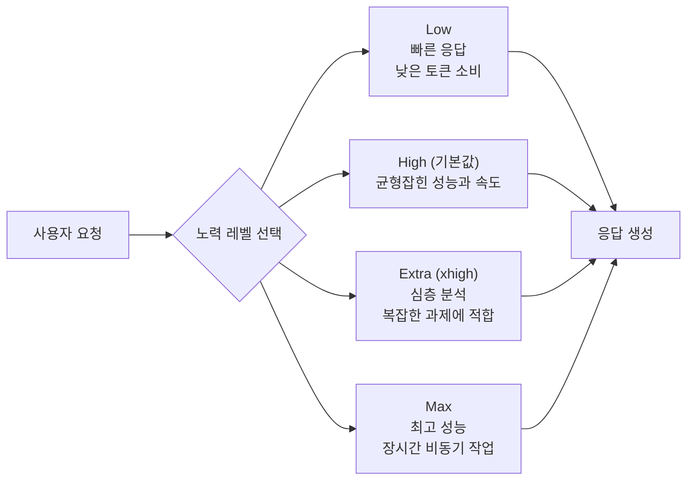
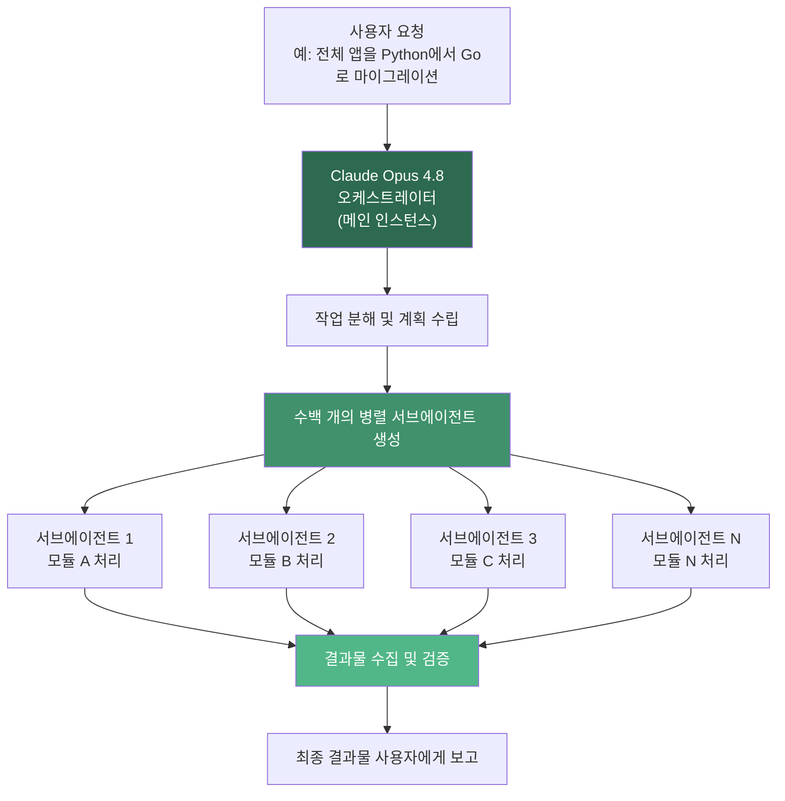
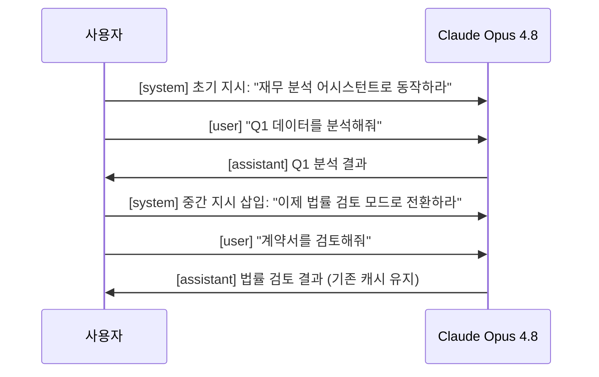
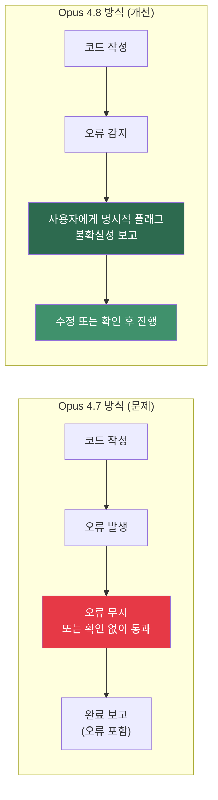
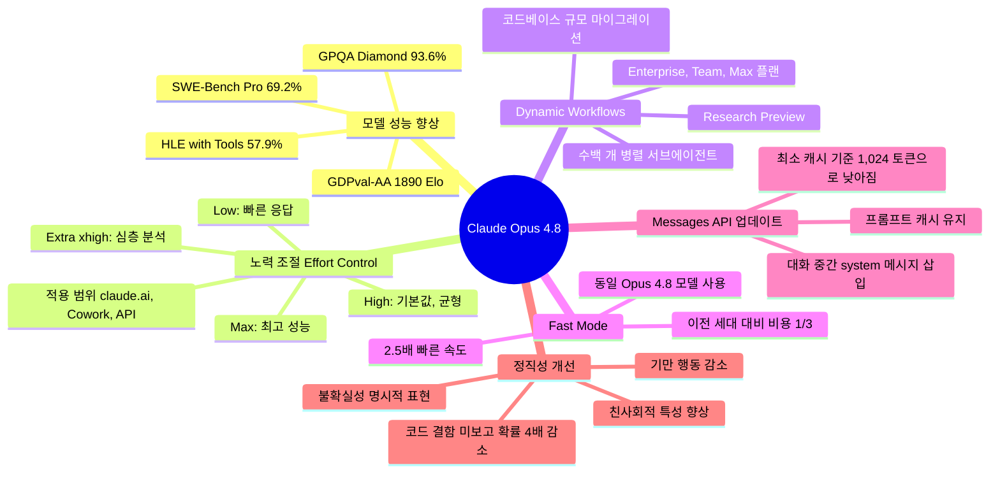

> **출처**: Anthropic 공식 발표 (2026년 5월 28일)  
> **본 문서 작성 기준일**: 2026년 5월 29일

---

## 1. 들어가며: 이번 업데이트의 핵심 방향

2026년 5월 28일, Anthropic은 기존 Claude Opus 4.7의 직접적인 후속 모델인 **Claude Opus 4.8**을 공식 출시했습니다. 이번 업데이트는 출시 발표 전부터 업계에서 주목받았던 것과는 달리, Anthropic 스스로도 **"modest but tangible improvement(겸손하지만 실질적인 개선)"** 라고 표현할 만큼 절제된 톤으로 소개했습니다. 즉, 혁명적인 새 모델이 아니라 기존 모델 위에 정확하고 실용적인 개선을 쌓아올린 업데이트입니다.

Opus 4.7이 출시된 지 불과 **41일 만**에 등장한 이번 버전은, AI 모델의 업그레이드 주기가 얼마나 빨라졌는지를 잘 보여줍니다. 그리고 이 빠른 사이클 속에서도 Anthropic이 이번 업데이트에서 특히 강조한 방향은 하나입니다. 모델이 "더 똑똑해졌다"는 것보다, **모델이 스스로 하는 일을 사람이 더 잘 조절하고 감독할 수 있게 됐다**는 것입니다.

긴 작업을 AI에게 맡길 때, 사람은 얼마나 깊이 개입해야 할까요? 모델이 틀린 것을 스스로 인지하고 사람에게 알려줄 수 있을까요? 큰 문제를 AI 혼자 끝까지 풀어낼 수 있을까요? Claude Opus 4.8은 바로 이런 질문들에 대한 Anthropic의 현재 답변입니다.

---

## 2. 출시 현황 및 접근 방법

Claude Opus 4.8은 출시 당일부터 다음의 모든 환경에서 즉시 사용 가능합니다.

- **claude.ai** (웹, 모바일, 데스크톱 앱)
- **Claude API** (모델 ID: `claude-opus-4-8`)
- **Claude Code** (CLI 기반 코딩 도구)
- **Amazon Bedrock**, **Google Cloud Vertex AI**, **Microsoft Foundry** (클라우드 플랫폼)

기존 Opus 4.7을 사용하던 개발자는 코드에서 모델 이름을 `claude-opus-4-7`에서 `claude-opus-4-8`로 한 줄만 바꾸면 됩니다. 컨텍스트 창(1M 토큰)과 최대 출력(128K 토큰)은 동일하게 유지되며, **가격도 변경되지 않았습니다.** 입력 토큰 백만 개당 5달러, 출력 토큰 백만 개당 25달러의 요금 구조가 그대로 이어집니다.

---

## 3. 성능 벤치마크: 어느 정도나 좋아졌나

Anthropic은 이번 업데이트와 함께 여러 벤치마크 결과를 공개했습니다. 수치를 보면 개선 방향이 뚜렷하게 드러납니다.

```mermaid
xychart-beta
    title "Claude Opus 4.8 vs 4.7 주요 벤치마크 비교"
    x-axis ["SWE-Bench Pro", "HLE w/ Tools", "OSWorld-Verified"]
    y-axis "점수 (%)" 0 --> 90
    bar [64.3, 54.7, 82.1]
    bar [69.2, 57.9, 83.4]
```

**SWE-Bench Pro**는 실제 GitHub 이슈를 AI가 얼마나 잘 해결하는지 측정하는 코딩 벤치마크입니다. Opus 4.7의 64.3%에서 Opus 4.8은 **69.2%** 로 약 5포인트 상승했습니다. 이 점수는 같은 시점 기준 OpenAI의 GPT-5.5(58.6%)와 Google의 Gemini 3.1 Pro를 앞서는 수치입니다.

**Humanity's Last Exam(HLE)** 는 세계 최고 수준의 전문가들이 만든 고난이도 문제들로 구성된 시험으로, 도구 사용 시 57.9%를 기록하며 다학제적 추론 능력에서 현재 공개된 모델 중 최고 수준을 보여줍니다.

여기에 더해, 장기 실용 업무 성과를 측정하는 **GDPval-AA 리더보드**에서 Opus 4.8은 1890 Elo 점수를 기록했는데, 이는 GPT-5.5보다 121점, Opus 4.7보다 137점 높은 수치입니다.

또한 SWE-bench Verified(검증된 코딩 과제 해결 능력)에서는 88.6%, GPQA Diamond(과학 전문 지식 추론)에서는 93.6%를 달성했습니다.

성능 개선의 방향이 단순히 '더 많이 아는 것'이 아니라, **장기 에이전틱 작업, 코딩, 추론, 컴퓨터 사용** 등 실제 자율 작업 능력에 집중되어 있다는 점이 주목할 만합니다.

---

## 4. 핵심 기능 ① — 노력 조절(Effort Control): 작업 깊이를 내가 선택한다

### 어떤 기능인가

Claude Opus 4.8과 함께 **claude.ai**와 **Cowork** 사용자에게는 모델이 응답에 얼마나 많은 '생각'을 쏟을지 직접 선택할 수 있는 **노력 조절(Effort Control)** 기능이 추가되었습니다. 모델 선택기 옆에 새로운 슬라이더 형태의 컨트롤이 생겼으며, 사용자는 요청의 성격에 맞게 이 레벨을 조정할 수 있습니다.

### 레벨별 특징

**Low** 레벨은 빠른 응답이 필요할 때 사용합니다. 토큰 소비를 줄이고 Rate Limit을 천천히 소진하기 때문에, 빠른 정보 검색이나 간단한 질문에 적합합니다.

**High** 레벨은 Opus 4.8의 **기본값**입니다. Anthropic에 따르면, Opus 4.8을 High 설정으로 사용하면 Opus 4.7을 기본값(xhigh)으로 사용했을 때와 비슷한 토큰 수를 소비하면서도 더 나은 성능을 냅니다. 즉, 이전보다 똑같은 비용으로 더 좋은 결과를 얻을 수 있다는 뜻입니다.

**Extra(xhigh)** 레벨은 복잡한 문제나 장시간 비동기 워크플로우에 권장됩니다. Claude Code에서는 `/xhigh` 명령어로 활성화할 수 있습니다.

**Max** 레벨은 가장 깊이 있는 추론을 원할 때 사용합니다. 한 사용자가 직접 테스트한 결과에 따르면, Max 레벨을 사용했을 때 25개의 입력 토큰과 17,167개의 출력 토큰을 소비해 약 0.43달러가 과금되었습니다. 이 레벨은 분명히 비용이 증가하지만, 그만큼 가장 깊고 정교한 결과를 기대할 수 있습니다.

### API에서의 활용

개발자는 API 요청 시 `effort` 파라미터를 명시적으로 설정할 수 있습니다. 기존에 이 파라미터를 이미 설정하고 있었다면 기존 설정이 유지됩니다. 설정하지 않은 경우에는 `high`가 기본값으로 적용됩니다. 코딩이나 높은 자율성이 필요한 작업에는 `xhigh`를 명시적으로 설정하도록 권장합니다.

---

## 5. 핵심 기능 ② — Dynamic Workflows: 큰 문제를 수백 개의 하위 작업으로

### 개념 이해

**Dynamic Workflows**는 현재 **Research Preview(연구 미리보기)** 상태로 제공되는 기능으로, **Claude Code**에서 작동합니다. 이 기능은 Claude Opus 4.8의 가장 획기적인 변화 중 하나라는 평가를 받고 있습니다.

기존의 AI 코딩 도구는 사용자가 제시한 하나의 문제를 순차적으로 처리했습니다. 하지만 실제 소프트웨어 개발에서 마주치는 문제들, 예컨대 수십만 줄의 레거시 코드를 새 언어로 마이그레이션하거나, 대규모 코드베이스 전체에서 버그를 찾아 고치는 작업은 이런 방식으로는 한계가 있었습니다.

Dynamic Workflows는 이 문제를 다음과 같이 해결합니다.

### 작동 방식

Claude가 하나의 세션 안에서 스스로 **수백 개의 병렬 서브에이전트**를 생성하고, 각 에이전트가 큰 문제의 작은 부분을 독립적으로 처리한 뒤, 결과물을 오케스트레이터 에이전트가 검증하여 사용자에게 최종 보고하는 방식입니다. 현재 최대 **1,000개**의 서브에이전트를 하나의 세션에서 실행할 수 있습니다.

Anthropic의 발표에 따르면, 이 기능으로 **수십만 줄의 코드에 걸친 코드베이스 규모의 마이그레이션을 처음 커밋부터 최종 병합(merge)까지** 완수하는 것이 가능해졌습니다. 예를 들어 전체 애플리케이션을 다른 프로그래밍 언어로 다시 작성하는 것처럼 이전에는 상상하기 어려웠던 규모의 자동화 작업을 수행할 수 있습니다.

### 기술적 배경

이 기능의 내부 구현은 `xhigh` 노력 레벨과 후술할 **대화 중 system 메시지 삽입** 기능이 결합된 것입니다. 서브에이전트들은 메인 컨텍스트를 오염시키지 않으면서 독립적으로 동작하며, Opus 4.8에서는 각 에이전트가 더 오래, 더 깊이 작동할 수 있게 됩니다.

### 이용 가능 플랜

Dynamic Workflows는 현재 **Enterprise, Team, Max 플랜** 사용자에게만 제공됩니다.

---

## 6. 핵심 기능 ③ — Fast Mode: 2.5배 빠르게, 비용은 1/3로

### 무엇이 달라졌나

**Fast Mode**는 이름 그대로 속도를 극단적으로 높인 모드입니다. 핵심 포인트는 다음 두 가지입니다.

첫째, Opus 4.8의 Fast Mode는 **이전 모델 대비 약 2.5배 빠른** 출력 속도(Output tokens per second)를 제공합니다. 응답 대기 시간이 중요한 실시간 인터랙션이나 인터랙티브 코딩 세션에서 체감 차이가 큽니다.

둘째, 그리고 더 중요한 것은 **가격 구조의 변화**입니다. 이전 세대 모델의 Fast Mode는 기본 요금의 약 6배 수준이었습니다. Opus 4.8의 Fast Mode는 **기본 요금의 3배** 수준으로 떨어졌습니다. 구체적으로는 입력 토큰 백만 개당 10달러, 출력 토큰 백만 개당 50달러입니다.

즉, 이전 세대에서 Fast Mode를 사용하려면 비용 부담이 너무 컸기 때문에 잘 활용되지 않았다면, Opus 4.8에서는 비용 대비 속도 효율이 크게 개선된 셈입니다.

### 언제 사용하면 좋을까

Fast Mode는 단순히 빠른 것이 아닙니다. 중요한 점은 Fast Mode가 **작고 싸고 능력이 낮은 별도의 모델이 아니라**, 동일한 Opus 4.8 모델을 더 빠르게 실행하는 것입니다. 따라서 성능의 본질적인 저하 없이 속도를 높일 수 있습니다. 짧은 응답이 필요한 인터랙션, 코드 리뷰 스위프, 에이전트 루프에서 짧게 반복되는 턴(turn)들에 특히 유효합니다.

반면, 모델이 장시간 깊이 생각해야 하는 복잡한 분석이나 `xhigh` 노력 레벨을 쓰는 경우라면 Fast Mode보다 표준 모드가 더 적합합니다.

---

## 7. 핵심 기능 ④ — Messages API 업데이트: 대화 중에 지시를 바꿀 수 있다

### 기존의 한계

AI API를 사용하는 개발자들은 일반적으로 대화 시작 시 `system` 프롬프트(지시문)를 설정합니다. 이 system 프롬프트는 모델이 어떻게 행동해야 할지, 어떤 역할을 맡아야 할지 등을 정의합니다. 문제는 기존 모델들에서 이 system 프롬프트는 대화 시작 시에만 넣을 수 있었다는 것입니다.

만약 긴 에이전틱 작업 중간에 지시를 바꾸고 싶다면, 개발자들은 기존 방법으로는 **대화 컨텍스트 전체를 새로 구성**해야 했습니다. 이 과정에서 이미 캐시된 이전 대화 내용이 모두 무효화되어, 비용이 증가하고 속도가 느려지는 문제가 있었습니다.

### 새로운 기능

Claude Opus 4.8은 **Messages API에서 대화 중간에 `role: "system"` 메시지를 삽입**할 수 있게 됩니다. 구체적으로는 `messages` 배열 안에서 사용자의 턴(turn) 직후에 system 메시지를 넣을 수 있습니다.

### 왜 중요한가

이 기능의 핵심 가치는 **프롬프트 캐시 유지**에 있습니다. 대화 이전 부분에 대한 프롬프트 캐시 히트(cache hit)를 그대로 유지하면서 새로운 지시를 추가할 수 있습니다. 이는 에이전틱 루프에서의 입력 비용을 대폭 절감시킵니다.

또한 Opus 4.8에서는 프롬프트 캐시의 최소 토큰 기준이 **1,024 토큰으로 낮아졌습니다** (이전 모델 대비). 이전에는 짧은 system 프롬프트는 캐시가 되지 않아서 매번 새로 계산해야 했는데, 이제는 더 짧은 프롬프트도 캐시의 혜택을 받을 수 있게 됩니다.

단, 이전 모델들(`claude-opus-4-7` 포함)은 `messages` 배열 안에 `role: "system"`을 넣으면 **400 오류**를 반환했습니다. Opus 4.8에서 추가된 기능이므로, 이전 버전과의 호환성에 주의해야 합니다.

---

## 8. 정직성 개선: 코드 결함을 그냥 넘길 확률 약 1/4로 감소

### AI의 오래된 문제: "모르면서도 아는 척"

AI 모델이 틀린 결과를 자신 있게 내놓거나, 자신이 작성한 코드에 오류가 있어도 그냥 완성된 것처럼 보고하는 문제는 실제 업무에서 큰 위험 요소입니다. 특히 장기 에이전틱 작업에서 모델이 중간에 발생한 오류를 자체적으로 무시하고 계속 진행한다면, 최종 결과물 전체가 엉망이 될 수 있습니다.

### Opus 4.8의 개선 사항

Anthropic의 평가에 따르면, Claude Opus 4.8은 전작인 Opus 4.7과 비교해 **자신이 작성한 코드의 결함을 아무 언급 없이 그냥 넘길 가능성이 약 4배 감소**했습니다.

쉽게 말하면, Opus 4.7이 100번 코드를 작성했을 때 X번 결함을 그냥 넘겼다면, Opus 4.8은 같은 상황에서 약 X/4번만 그냥 넘깁니다. 결함을 발견하면 사용자에게 알리고, 불확실한 부분에 대해서도 더 솔직하게 표현합니다.

### 정직성의 실질적 의미

이는 단순히 '더 꼼꼼해졌다'는 의미가 아닙니다. 초기 테스터들의 보고에 따르면, Opus 4.8은 자신의 작업에 대한 **불확실성을 더 적극적으로 표시하고, 근거 없는 주장을 덜 한다**고 합니다.

Anthropic은 이를 **정렬(Alignment)** 측면에서도 성과로 설명합니다. 사용자의 자율성을 지지하고 사용자의 최선의 이익을 위해 행동하는 '친사회적(prosocial)' 특성 지표에서 Opus 4.8은 새로운 최고 수준에 도달했습니다. 또한 기만(deception)과 같은 비정렬(misaligned) 행동 비율은 Opus 4.7보다 낮아졌으며, 현재 Anthropic의 가장 앞선 모델인 **Claude Mythos Preview**와 유사한 수준으로 낮아졌다고 합니다.

---

## 9. 가격 및 사양 요약

| 항목 | 내용 |
|------|------|
| **출시일** | 2026년 5월 28일 |
| **모델 ID** | `claude-opus-4-8` |
| **컨텍스트 창** | 1,000,000 토큰 (Anthropic API, Bedrock, Vertex AI 기준) |
| **최대 출력** | 128,000 토큰 |
| **표준 입력 가격** | $5 / 100만 토큰 |
| **표준 출력 가격** | $25 / 100만 토큰 |
| **Fast Mode 입력 가격** | $10 / 100만 토큰 |
| **Fast Mode 출력 가격** | $50 / 100만 토큰 |
| **Fast Mode 속도** | 표준 대비 약 2.5배 |
| **기본 노력 레벨** | High (API 및 Claude Code 포함) |
| **지원 플랫폼** | Claude API, claude.ai, Claude Code, Amazon Bedrock, Google Vertex AI, Microsoft Foundry |

---

## 10. 전체 기능 구조 한눈에 보기

---

## 11. 이 업데이트가 의미하는 것: 비용 조절 가능한 AI 협업자

### 사용자 관점에서

claude.ai와 Cowork 사용자는 이제 각 요청에 Claude가 얼마나 깊이 생각할지를 직접 조절할 수 있습니다. 간단한 질문에 최대 수준의 연산 자원을 쏟을 필요가 없어졌고, 반대로 중요한 문서나 복잡한 코드 작업에는 Max 레벨을 설정해 Claude의 모든 역량을 집중시킬 수 있게 됩니다.

### 개발자 관점에서

API를 활용하는 개발자에게 이번 업데이트의 가장 큰 변화는 두 가지입니다. 하나는 대화 중간에 system 지시를 삽입할 수 있게 되어 에이전틱 루프 설계가 더 유연해졌다는 것, 다른 하나는 동일한 성능을 내면서 더 적은 비용으로 작업할 수 있는 Fast Mode가 현실적인 가격대로 내려왔다는 것입니다.

### 기업/팀 관점에서

Dynamic Workflows는 인간이 일일이 분해하고 지시해야 했던 대규모 작업을 Claude가 스스로 계획하고 병렬로 처리할 수 있게 해줍니다. 수십만 줄에 달하는 코드 마이그레이션처럼 이전에는 수주 또는 수개월이 걸렸을 작업이 단일 세션에서 처리 가능해진다는 것은 기업 소프트웨어 개발의 패러다임 변화를 예고합니다.

---

## 12. 앞으로의 방향: Mythos-class 모델이 온다

Anthropic은 이번 발표와 함께, 현재 일부 기관에만 제한 공개된 **Claude Mythos Preview**의 상용화를 **"수 주 내"** 에 모든 사용자에게 제공할 계획임을 밝혔습니다. Mythos-class 모델은 Opus 4.8보다 훨씬 높은 수준의 인공지능을 제공하는 모델로, 현재는 사이버 보안 취약점 분석 등 고위험 영역에서의 남용 우려로 인해 새로운 안전장치(guardrails) 개발이 완료되는 시점에 맞춰 출시할 예정입니다.

즉, Claude Opus 4.8은 Mythos-class 모델 출시 이전까지 Anthropic의 공개 가용 최고 성능 모델로 자리잡습니다.

---

## 13. 정리

Claude Opus 4.8은 **Anthropic이 AI 모델을 더 유능하게 만드는 것과, 더 통제 가능하게 만드는 것을 동시에 추구한 업데이트**입니다.

SWE-Bench Pro 69.2%라는 코딩 성과, 정직성 4배 개선, 수백 개 서브에이전트를 동원한 Dynamic Workflows는 모델의 능력 향상을 보여줍니다. 동시에 Effort Control 슬라이더, Fast Mode 가격 인하, 대화 중 system 메시지 삽입은 사람이 AI 작업을 더 세밀하게 제어하고 비용을 관리할 수 있게 해줍니다.

가격은 전작과 동일합니다. AI 모델이 계속 발전하면서도 비용 구조를 유지하거나 개선하는 흐름은, 앞으로 AI 활용이 더 넓어질 수 있다는 신호이기도 합니다.

---

*본 문서는 2026년 5월 29일 기준 Anthropic 공식 발표 및 관련 보도를 바탕으로 작성되었습니다.*  
*원본 인포그래픽: Jayden Choe ([@jayden.choe](https://www.threads.com/@jayden.choe/post/DY6l2QhmJeR)) / 출처: Anthropic, Introducing Claude Opus 4.8*
