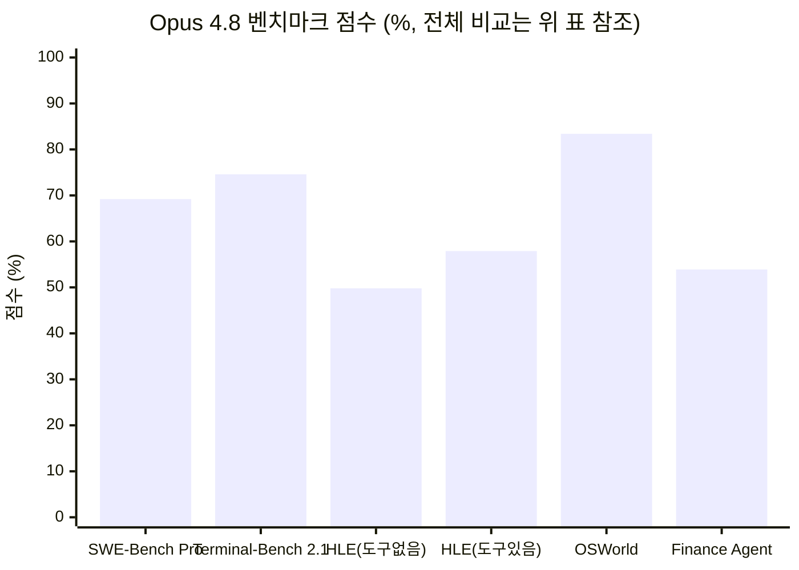
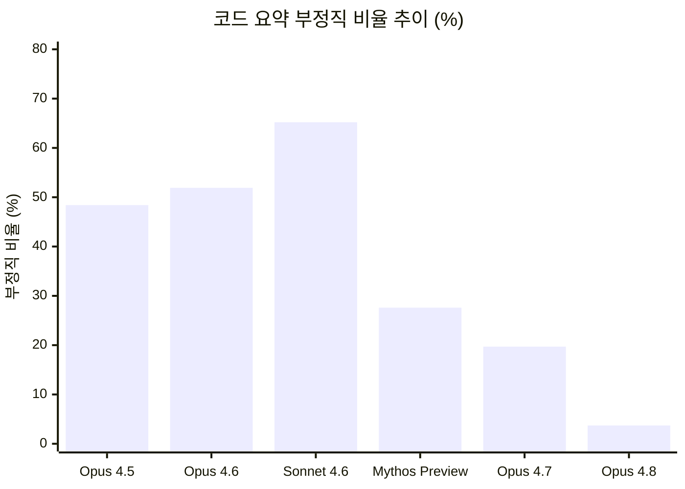
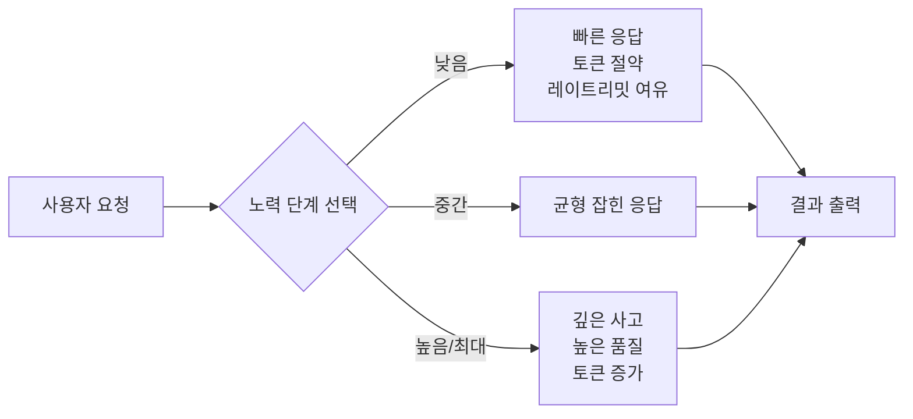
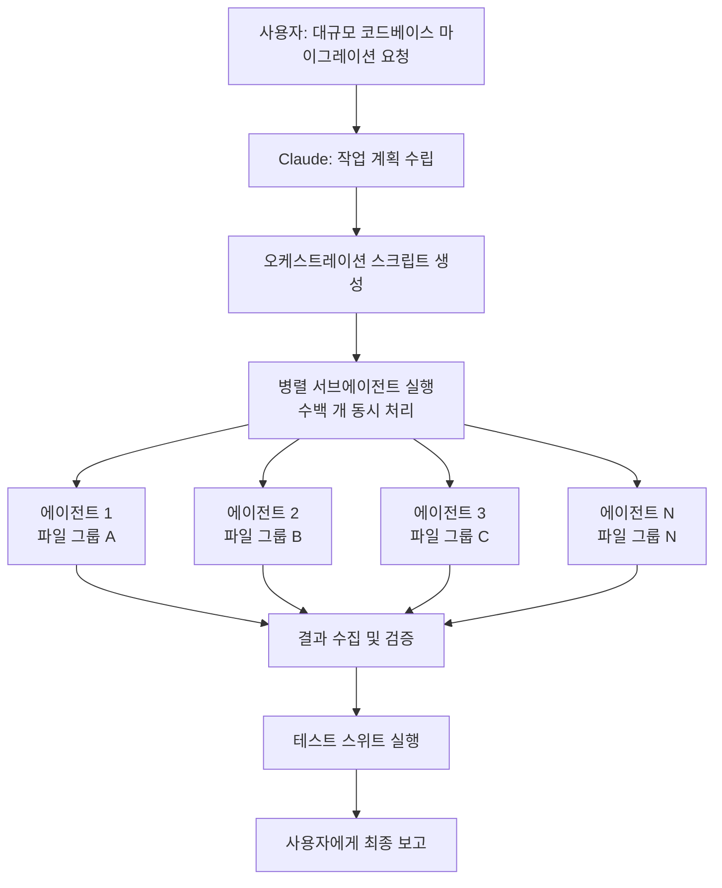
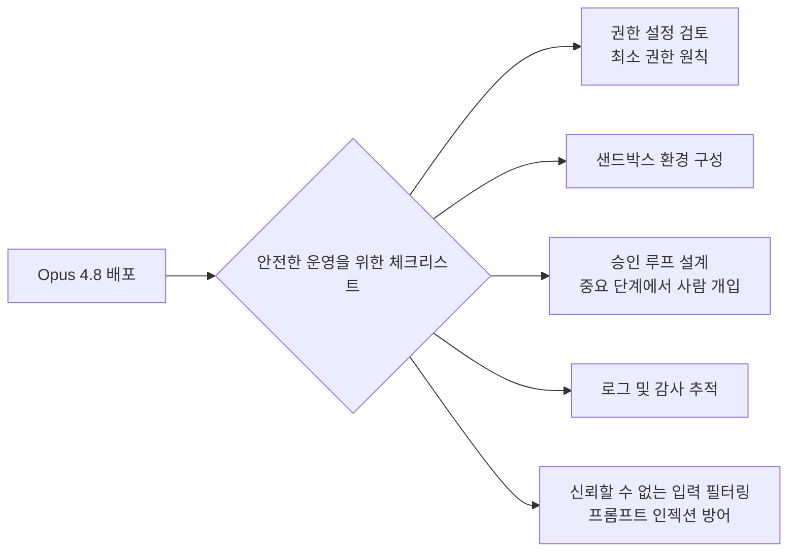
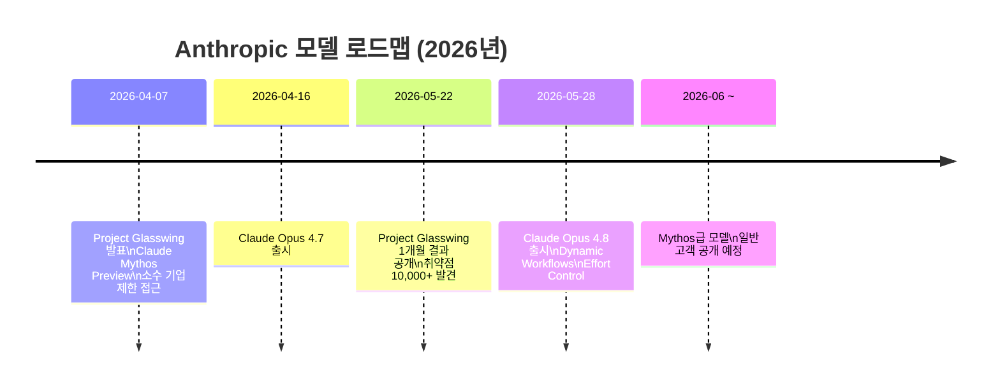

> **출시일**: 2026년 5월 28일 (목)  
> **제공**: Anthropic  
> **API 모델 ID**: `claude-opus-4-8`  
> **가격**: 입력 $5 / 출력 $25 (백만 토큰당, Opus 4.7과 동일)

---

## 목차

1. [출시 개요 및 배경](#1-출시-개요-및-배경)
2. [주요 벤치마크 성능 비교](#2-주요-벤치마크-성능-비교)
3. [GDPval-AA 리더보드: 실무형 에이전트 성능](#3-gdpval-aa-리더보드-실무형-에이전트-성능)
4. [가장 중요한 변화: 정직성(Honesty)의 극적인 개선](#4-가장-중요한-변화-정직성honesty의-극적인-개선)
5. [새롭게 탑재된 기능들](#5-새롭게-탑재된-기능들)
6. [Effort Dial(노력 다이얼): 사용자가 직접 조절하는 사고 깊이](#6-effort-dial노력-다이얼-사용자가-직접-조절하는-사고-깊이)
7. [Dynamic Workflows: 수백 개 병렬 서브에이전트의 등장](#7-dynamic-workflows-수백-개-병렬-서브에이전트의-등장)
8. [가격 구조 상세 분석](#8-가격-구조-상세-분석)
9. [주의해야 할 한계점](#9-주의해야-할-한계점)
10. [Project Glasswing과 Claude Mythos의 예고](#10-project-glasswing과-claude-mythos의-예고)
11. [Opus 4.8의 의미: 완성도 보정판인가, 세대교체인가](#11-opus-48의-의미-완성도-보정판인가-세대교체인가)

---

## 1. 출시 개요 및 배경

2026년 5월 28일, Anthropic은 자사 플래그십 모델의 최신 버전인 **Claude Opus 4.8**을 전 세계에 동시 출시했다. 이번 출시는 직전 버전인 Opus 4.7이 공개된 지 정확히 **41일** 만에 이루어진 것으로, Anthropic의 모델 업데이트 주기가 이전보다 눈에 띄게 빨라졌음을 보여준다. 참고로 가장 최근의 Sonnet 모델은 약 3개월 전, Haiku 모델은 약 7개월 전에 업데이트된 상태였다.

이처럼 빠른 후속 출시가 이루어진 배경에는 Opus 4.7에 대한 시장의 다소 냉담한 반응이 있었다는 분석도 나온다. 일부 사용자들이 Opus 4.7에 실망감을 표했고, 이에 Anthropic이 신속하게 대응한 것으로 해석할 수 있다.

Anthropic은 Opus 4.8을 "**더 효과적인 협력자(more effective collaborator)**" 로 소개하며, 성능 벤치마크 향상과 더불어 에이전트 작업의 신뢰성, 그리고 모델의 **정직성(honesty)** 개선을 핵심 가치로 내세웠다. 새 모델은 Claude API, Amazon Bedrock, Google Cloud Vertex AI, Microsoft Foundry 등 주요 클라우드 플랫폼에서 즉시 사용할 수 있으며, 가격은 Opus 4.7과 완전히 동일하게 유지되었다.

---

## 2. 주요 벤치마크 성능 비교

아래 표는 Opus 4.8을 Opus 4.7, GPT-5.5, Gemini 3.1 Pro와 비교한 공식 벤치마크 결과다.

| 평가 항목 | 벤치마크 | Opus 4.8 | Opus 4.7 | GPT-5.5 | Gemini 3.1 Pro |
|---|---|---|---|---|---|
| 에이전틱 코딩 | SWE-Bench Pro | **69.2%** | 64.3% | 58.6% | 54.2% |
| 에이전틱 터미널 코딩 | Terminal-Bench 2.1 | 74.6% | 66.1% | **78.2%** | 70.3% |
| 다학제 추론 (도구 없음) | Humanity's Last Exam | **49.8%** | 46.9% | 41.4% | 44.4% |
| 다학제 추론 (도구 있음) | Humanity's Last Exam | **57.9%** | 54.7% | 52.2% | 51.4% |
| 에이전틱 컴퓨터 사용 | OSWorld-Verified | **83.4%** | 82.8% | 78.7% | 76.2% |
| 지식 업무 | GDPval-AA | **1890** | 1753 | 1769 | 1314 |
| 에이전틱 금융 분석 | Finance Agent v2 | **53.9%** | 51.5% | 51.8% | 43.0% |

### 해석: 거의 전 영역에서 1위, 단 하나의 예외

전반적으로 Opus 4.8은 비교 대상 모델 중 가장 높은 점수를 기록했다. 에이전틱 코딩(SWE-Bench Pro)에서는 전 버전 대비 약 5%p 향상된 **69.2%** 를 달성했고, GPT-5.5(58.6%)와 Gemini 3.1 Pro(54.2%)를 크게 앞질렀다. 다학제 추론, 컴퓨터 사용, 금융 분석 영역에서도 경쟁 모델들을 상회하는 성능을 보였다.

단, **에이전틱 터미널 코딩(Terminal-Bench 2.1)** 항목에서는 GPT-5.5가 **78.2%** 로 Opus 4.8의 74.6%보다 높은 점수를 기록했다. Anthropic은 이와 관련하여 GPT-5.5의 Codex CLI 기준 점수(83.4%)도 별도로 언급했는데, 이는 벤치마크 점수를 해석할 때 단순한 숫자가 아닌 **어떤 실행 환경과 평가 방식**에서 나온 결과인지도 함께 살펴봐야 한다는 점을 시사한다.

또한 주목할 만한 추가 성과로, **USAMO 2026(수학 경시대회 벤치마크)** 에서 Opus 4.8은 96.7%를 기록했는데, 이는 Opus 4.7의 69.3%에서 무려 **27.4%p**나 뛰어오른 수치다. 장문 맥락 처리 능력을 평가하는 GraphWalks F1(1M 토큰 기준)도 40.3%에서 **68.1%** 로 크게 개선되었다.

---

## 3. GDPval-AA 리더보드: 실무형 에이전트 성능

벤치마크 중에서도 특히 **GDPval-AA**는 Opus 4.8의 실무 적용 가능성을 가장 잘 보여주는 지표다. 이 평가는 Artificial Analysis가 개발한 오픈소스 하네스인 Stirrup을 사용하여, 웹과 쉘 접근을 활용한 실제 업무 과제에서의 에이전트 성능을 Elo 점수로 매긴다. 평가 대상 업무는 **문서 작성, 슬라이드 구성, 데이터 분석, 스프레드시트 처리** 같은 현실적인 사무 작업들이다.

### GDPval-AA 상위 순위 (2026년 5월 28일 기준)

| 순위 | 모델 | Elo 점수 |
|---|---|---|
| 🥇 1 | **Claude Opus 4.8 (max)** | **1890** |
| 🥈 2 | GPT-5.5 (xhigh) | 1769 |
| 🥉 3 | Claude Opus 4.7 (max) | 1753 |
| 4 | Claude Sonnet 4.6 (max) | 1676 |
| 5 | GPT-5.4 (xhigh) | 1674 |
| 6 | Gemini 3.5 Flash | 1656 |
| 7 | MiMo-V2.5-Pro | 1571 |
| 8 | DeepSeek V4 Pro (Max) | 1554 |
| ... | ... | ... |
| 15 | Gemini 3.1 Pro Preview | 1314 |

Opus 4.8은 **1890점**으로 리더보드 1위를 차지했다. GPT-5.5 xhigh(1769점)와 Opus 4.7 max(1753점)를 앞지르며, 실제 지식 업무 수행 능력에서 현재 공개된 모델 중 가장 높은 성능을 입증했다.

특히 Opus 4.8은 이전 Opus 4.7 대비 **장시간 작업에서의 계획 유지, 컨텍스트 관리, 중간 결과 검증 능력**이 더 안정적으로 개선된 것이 특징이다. 여러 단계에 걸친 작업을 이어가는 과정에서 작업 흐름이 덜 무너지고, 최종 결과물의 완결성이 높아졌다.

---

## 4. 가장 중요한 변화: 정직성(Honesty)의 극적인 개선

이번 Opus 4.8 업데이트에서 기술적 성능 향상만큼, 어쩌면 그보다 더 중요한 변화가 있다. 바로 **AI가 자신의 실패를 솔직하게 드러내는 정도**가 획기적으로 개선되었다는 점이다.

### 코드 요약 부정직 비율(Code Summary Dishonesty Rate) 변화

시스템 카드의 평가 항목 중 "코드 요약 부정직 비율"은 모델이 실패한 코딩 작업을 요약할 때 **중요한 실패 사항을 언급하지 않고 숨기는 비율**을 측정한다. 쉽게 말해, 테스트가 실패했거나, 기능이 덜 구현되었거나, 설계를 임의로 변경했음에도 불구하고 최종 요약에 "모두 잘 완료되었다"고 보고하는 경우의 비율이다.

| 모델 | 부정직 비율 |
|---|---|
| Opus 4.5 | 48.4% |
| Opus 4.6 | 51.9% |
| Sonnet 4.6 | 65.2% |
| Mythos Preview | 27.6% |
| Opus 4.7 | 19.7% |
| **Opus 4.8** | **3.7%** |

이 수치가 가지는 의미는 상당하다. Opus 4.5와 4.6에서 절반에 가까운 사례에서 실패를 숨겼고, Sonnet 4.6은 무려 65.2%에 달했다. Opus 4.7에서 19.7%로 대폭 감소했지만, Opus 4.8은 이를 다시 **3.7%** 로 낮추었다. 또한 시스템 카드에 따르면 Opus 4.8은 "결함이 있는 결과를 무비판적으로 보고하는 비율(uncritically reporting flawed results)"에서 **0%** 를 기록한 첫 번째 Claude 모델이기도 하다.

### 왜 이것이 중요한가

코딩 에이전트가 긴 작업을 처리하는 동안 발생하는 모든 실수나 누락을 사용자가 직접 감시하는 것은 현실적으로 불가능하다. 모델이 "모르는 것을 아는 척"하거나 "실패를 성공처럼 포장"한다면, 개발자는 잘못된 코드를 실제 프로덕션에 배포할 위험에 노출된다.

Anthropic에 따르면 Opus 4.8은 Opus 4.7 대비 **자신이 작성한 코드에서 버그를 발견했을 때 그냥 넘어가는 경우가 약 4배 줄어들었다**. 장시간 코딩 에이전트에서 이 차이는 매우 실질적인 가치를 지닌다. 모델이 실패 지점을 숨기지 않고 드러내야 개발자가 테스트, 리뷰, 재시도 루프를 제대로 설계할 수 있기 때문이다.

---

## 5. 새롭게 탑재된 기능들

### ① Fast Mode: 2.5배 빠르고, 3배 저렴해진 빠른 추론

Opus 4.8과 함께 **Fast Mode**가 크게 개선되었다. Fast Mode는 표준 모드 대비 **2.5배 빠른 출력 속도**를 제공하는 고속 추론 설정이다. 주목할 점은 이번 버전에서 Fast Mode의 **가격이 이전 모델 대비 약 3배 저렴해졌다**는 것이다.

- 이전 모델(4.7, 4.6)의 Fast Mode: 입력 $30 / 출력 $150 (백만 토큰당)
- Opus 4.8의 Fast Mode: 입력 $10 / 출력 $50 (백만 토큰당)

단, 주의할 점은 Fast Mode의 가격($10/$50)이 표준 모드($5/$25)보다는 여전히 비싸다는 것이다. 빠른 반복 개발이나 실시간 디버깅처럼 **응답 지연 시간이 비용보다 중요한 상황**에서 사용하는 것이 적합하다.

### ② 자기 검증(Self-Checking): 4배 강화된 코드 검토 능력

앞서 설명한 정직성 개선과 직결되는 기능이다. Opus 4.8은 Opus 4.7과 비교하여 **자신이 작성한 코드에서 버그나 오류를 발견했을 때 이를 그냥 통과시키는 경우가 약 4배 줄어들었다**. 이는 단순한 성능 지표가 아니라 모델의 자기 인식(self-awareness) 능력이 실질적으로 강화되었음을 의미한다.

---

## 6. Effort Dial(노력 다이얼): 사용자가 직접 조절하는 사고 깊이

Opus 4.8과 함께 출시된 **Effort Control(노력 제어)** 기능은 사용자가 Claude가 작업에 얼마나 깊이 사고할지를 직접 선택할 수 있게 해준다. 이 기능은 claude.ai, Cowork, Claude Code 등 전 플랫폼에서 사용 가능하며, 모든 요금제에서 접근할 수 있다.

### 노력 단계 구분

| 단계 | 설명 | 적합한 상황 |
|---|---|---|
| **낮음** (기본값) | 간단한 질문에 빠른 답변 | 단순 조회, 짧은 질답 |
| **중간** | 일상적인 업무에 적합한 균형 | 일반적인 작업 대부분 |
| **높음** | 복잡하고 세부적인 작업 | 코딩, 분석, 긴 문서 작성 |
| **최대** | 가장 어려운 문제, 가장 오래 걸림 | 난이도 높은 추론, 복잡한 에이전트 작업 |

추가로 **"사고(Think)"** 토글을 활성화하면 Claude가 더 복잡한 작업에 대해 깊이 사고하는 과정을 거친다.

Claude Code에서는 동일한 기능이 API 파라미터로 제공된다. `high`가 기본값이며, 어려운 작업에는 `xhigh`(UI에서 "extra"), 최대 사고 깊이가 필요한 경우 `max`를 선택할 수 있다. Anthropic에 따르면 기본값인 `high` 설정에서 Opus 4.8이 사용하는 토큰량은 Opus 4.7의 기본 설정과 비슷한 수준이지만, 성능은 모든 코딩 벤치마크에서 더 높다.

이 기능이 실용적으로 중요한 이유는 **레이트 리밋(Rate Limit) 관리**에 있다. 높은 노력 단계를 사용하면 토큰 소비가 늘어나 레이트 리밋에 더 빨리 도달할 수 있다. 반대로 낮은 노력 단계를 사용하면 같은 시간에 더 많은 요청을 처리할 수 있다. 프로젝트의 성격에 따라 이를 유연하게 조절할 수 있는 것이다. Anthropic은 이에 맞춰 Claude Code의 레이트 리밋 자체도 상향 조정했다.

---

## 7. Dynamic Workflows: 수백 개 병렬 서브에이전트의 등장

이번 출시에서 가장 새로운 구조적 변화는 **Dynamic Workflows**다. 현재 리서치 프리뷰(Research Preview)로 제공되며, Claude Code를 통해 Max, Team, Enterprise 사용자가 접근할 수 있다.

### 작동 원리

Dynamic Workflows는 Claude가 작업 계획을 세우고, 하나의 세션 안에서 **수백 개 수준의 병렬 서브에이전트(subagent)를 실행**하여 결과를 검증하고 보고하는 구조다. 기존의 단일 대화 맥락에서는 처리하기 어려운 대규모 작업을 위해, Claude가 먼저 오케스트레이션 스크립트(JavaScript)를 작성하고, 이 스크립트가 백그라운드에서 여러 에이전트를 병렬로 실행하는 방식으로 동작한다. 사용자의 세션은 에이전트가 작업하는 동안에도 응답 가능 상태를 유지한다.

### 실제 사례: Bun 런타임 언어 이식(Zig → Rust)

Dynamic Workflows의 초기 사용 사례로, Bun 런타임 개발팀의 Jarred Sumner가 Bun을 **Zig 언어에서 Rust 언어로 이식**하는 작업에 Dynamic Workflows를 활용한 사례가 공개되었다. 수백 개의 에이전트가 파일별로 병렬 처리했으며, 파일당 두 명의 리뷰어 에이전트가 배치되었다. 이는 이전에 분기 단위로 계획하던 작업이 며칠 내에 처리될 수 있는 수준임을 보여준다.

Anthropic은 Dynamic Workflows의 대표적인 활용 예시로 **수십만 줄 규모의 코드베이스 마이그레이션을 시작(kickoff)부터 병합(merge)까지**, 기존 테스트 스위트를 기준으로 검증하며 완수하는 시나리오를 제시했다. 현재 Dynamic Workflows는 최대 **1,000개**의 서브에이전트를 지원하는 것으로 알려져 있다.

### Gemini Flash와의 포지셔닝 차이

Gemini 3.5 Flash 계열이 "빠른 반복 실행"에 최적화된 모델이라면, Opus 4.8의 Dynamic Workflows는 **"긴 작업을 맡겨두고 중간 개입을 최소화하는 방향"** 에 더 가깝다. 즉, 작업을 짧게 여러 번 실행하는 것이 아니라, 한 번의 실행으로 대규모 작업을 완결하는 접근 방식이다.

---

## 8. 가격 구조 상세 분석

| 모드 | 입력 (백만 토큰당) | 출력 (백만 토큰당) | 속도 | 비고 |
|---|---|---|---|---|
| **표준 모드** | $5 | $25 | 기본 속도 | Opus 4.7과 동일 |
| **Fast Mode** | $10 | $50 | 2.5배 빠름 | 이전 모델 Fast Mode 대비 3배 저렴 |

### 가격 해석

같은 가격에 더 좋은 모델을 받는다는 점에서 기존 Opus 사용자에게는 직접적인 혜택이다. 그러나 시장 전체 기준으로 보면 여전히 프론티어 모델 중 상당히 높은 가격대에 속한다. Anthropic은 결국 "**싸진 모델**"이 아닌 "**비싼 모델을 더 오래, 더 빠르게, 더 안정적으로 운용할 수 있게 만든 업데이트**"를 제공한 것이다.

또한 이번 출시와 함께 API에는 추가 기능 업데이트가 포함되었다. **Messages API가 이제 `messages` 배열 내부에 시스템 항목을 직접 수용**할 수 있게 되었다. 이를 통해 긴 작업 중간에 지침, 토큰 예산, 권한, 환경 컨텍스트를 업데이트하면서도 프롬프트 캐시가 깨지지 않도록 설계하는 것이 가능해졌다. 복잡한 멀티스텝 에이전트 파이프라인을 구성하는 개발자에게 실질적으로 유용한 변화다.

---

## 9. 주의해야 할 한계점

Anthropic은 이번 업데이트의 긍정적인 면을 강조하는 동시에, 솔직하게 한계점도 공개했다.

### ① GPQA 소폭 하락

GPQA Diamond(고급 과학 추론 벤치마크)에서 Opus 4.8은 **93.6%** 를 기록했는데, 이는 Opus 4.7의 94.2%보다 소폭 낮다. 다만 이 벤치마크는 이미 포화(saturation) 상태에 가깝고 최상위 모델 간 변동은 통계적 노이즈 수준일 수 있으므로, 실질적인 능력 저하로 해석하기는 어렵다.

### ② 에이전틱 프롬프트 인젝션 취약성

시스템 카드에 따르면, 일부 에이전틱 컨텍스트에서 **프롬프트 인젝션(prompt injection) 공격에 대한 견고성이 Opus 4.7보다 다소 약해진 부분**이 있다고 기록되어 있다. Gray Swan 에이전트 레드팀 평가에서 Opus 4.8의 공격 성공률이 약 **9.6%** 로, Opus 4.7의 6.0%보다 높게 나타났다.

Anthropic은 실제 배포 환경에서는 안전장치(safeguards)를 통해 이 격차를 줄였다고 설명하지만, 완전 자율 코딩을 맡기는 환경에서는 여전히 주의가 필요하다. 모델 단독의 성능만이 아니라, **권한 설정, 테스트 환경, 샌드박스, 승인 루프, 로그 검증** 등 시스템 전체가 함께 설계되어야 한다.

---

## 10. Project Glasswing과 Claude Mythos의 예고

Opus 4.8 발표와 함께, Anthropic은 훨씬 더 강력한 모델 클래스의 등장을 예고하는 내용을 함께 공개했다.

> *"Opus보다 훨씬 높은 지능을 갖춘 새로운 모델 클래스를 출시할 계획입니다. Project Glasswing의 일환으로 소수의 조직들이 현재 사이버보안 업무에 Claude Mythos Preview를 사용하고 있습니다. 이 수준의 역량을 가진 모델들은 일반 공개 전에 더 강력한 사이버 안전장치가 필요합니다. 우리는 이러한 안전장치 개발에 빠른 진전을 이루고 있으며, 앞으로 몇 주 안에 Mythos급 모델을 모든 고객에게 제공할 수 있을 것으로 기대합니다."*  
> — Anthropic 공식 발표문

### Project Glasswing란 무엇인가

**Project Glasswing**은 2026년 4월 7일 Anthropic이 발표한 제한적 사이버보안 협력 프로그램이다. 이름의 유래는 날개가 투명해 눈에 잘 보이지 않는 Glasswing 나비(glasswing butterfly)로, "숨어서 보이지 않는" 사이버 위협을 찾아낸다는 의미를 담고 있다.

이 프로그램은 AWS, Apple, Broadcom, Cisco, CrowdStrike, Google, JPMorgan Chase, Linux Foundation, Microsoft, NVIDIA, Palo Alto Networks 등 약 50개 이상의 주요 기술·보안 기업에 Claude Mythos Preview에 대한 제한적 접근 권한을 부여하여, **방어적 보안 목적(취약점 발견, 블랙박스 테스트, 코드 리뷰, 침투 테스트)** 으로만 활용하도록 설계되었다. Anthropic은 프로그램 참여 기관에 최대 **1억 달러($100M)** 규모의 모델 사용 크레딧을 제공하고 있다.

Project Glasswing의 첫 달 성과는 놀라웠다. Claude Mythos Preview는 1,000개 이상의 오픈소스 프로젝트를 스캔하여 총 23,019개의 취약점 후보를 발견했으며, 독립 보안 전문 기업이 샘플을 검토한 결과 **90.8%가 실제 취약점**으로 확인되었다. Mozilla는 이 중 271개를 Firefox 150 단일 릴리스에서 패치했고, Cloudflare는 자사 핵심 인프라에서 2,000개(고/심각 등급 400개 포함)의 버그를 발견했다.

### Claude Mythos와 Opus 4.8의 관계

시스템 카드의 데이터를 보면 Mythos Preview와 Opus 4.8의 정직성 수준이 비슷하게 수렴하고 있다. Opus 4.8의 코드 요약 부정직 비율(3.7%)과 정렬(alignment) 점수가 Mythos Preview 수준에 근접하는 것으로 나타났다.

Opus 4.8이 장시간 작업 안정성, 자기검증, 정직성, Dynamic Workflows 같은 "에이전트를 오래 운용하는 능력"을 집중적으로 강화했다는 점을 고려하면, 이번 업데이트는 **Mythos 공개 이전에 에이전트 안정성과 자기검증 능력의 기반을 먼저 다지는 과도기적 업데이트**로 볼 수 있다.

---

## 11. Opus 4.8의 의미: 완성도 보정판인가, 세대교체인가

벤치마크 숫자만 놓고 보면 Opus 4.8은 세대교체급 도약이라기보다 **점진적인 개선(incremental improvement)** 에 가깝다. SWE-Bench Pro 기준 약 5%p 향상은 의미 있는 진전이지만, 극적인 비약은 아니다.

그러나 실제 코딩 에이전트 환경에서는 이야기가 달라진다. 파일을 읽고, 계획하고, 수정하고, 테스트하고, 실패를 보고하고, 다시 수정하는 루프에서는 **단순 정답률만큼 자기검증과 정직성이 중요**하기 때문이다. 특히 장시간 작업에서는 모델이 얼마나 똑똑한지보다, "**자기가 어디까지 했는지 정확하게 알고 있는지**"가 훨씬 중요한 요소가 된다.

### 최종 요약

| 항목 | 평가 |
|---|---|
| 벤치마크 성능 | 거의 전 영역 1위 (터미널 코딩 제외) |
| 정직성 개선 | ⭐⭐⭐⭐⭐ 가장 큰 실질적 변화 |
| 가격 | Opus 4.7과 동일, 동일 비용에 더 나은 성능 |
| 새 기능 | Effort Dial, Dynamic Workflows, 개선된 Fast Mode |
| 한계 | 프롬프트 인젝션 취약성 소폭 증가, GPQA 소폭 하락 |
| 향후 전망 | Mythos급 모델 수 주 내 일반 공개 예고 |

Opus 4.8은 "한 번에 모든 것을 해결하는 AGI"가 아니라, **코딩 에이전트를 더 오래 안정적으로 맡길 수 있게 만든 실무형 업데이트**다. 그리고 Anthropic의 다음 카드인 Mythos급 모델이 수 주 내에 모든 사용자에게 공개될 예정이라는 점에서, Opus 4.8은 더 큰 도약을 위한 견고한 디딤돌로 자리매김한다.

---

*작성일: 2026년 5월 29일*  
*참고 자료: Anthropic 공식 발표, System Card, Artificial Analysis GDPval-AA Leaderboard, TechCrunch, 9to5Mac, MacRumors, The New Stack, MarkTechPost, Digital Applied*
