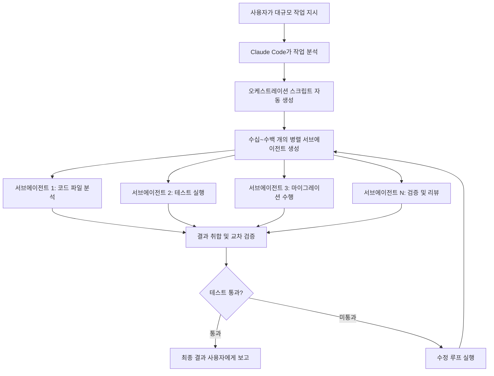
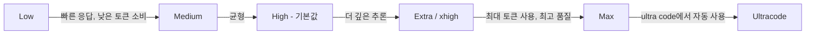
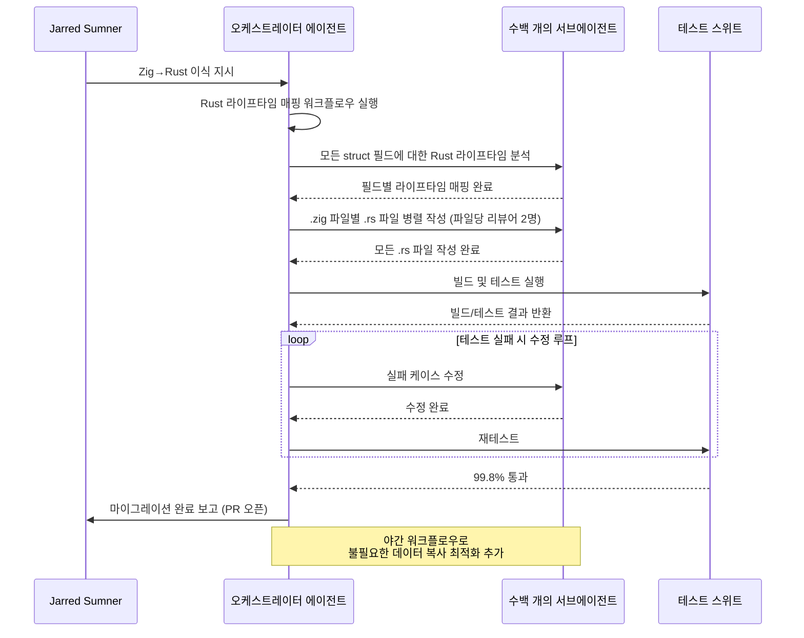
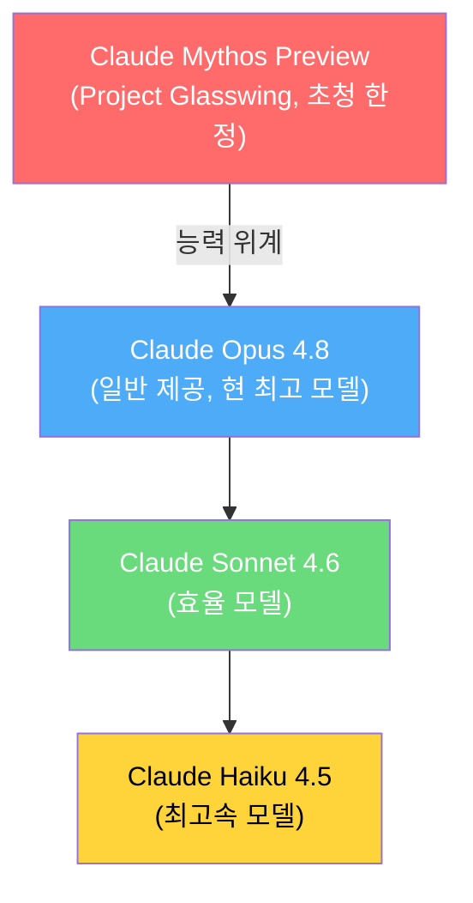
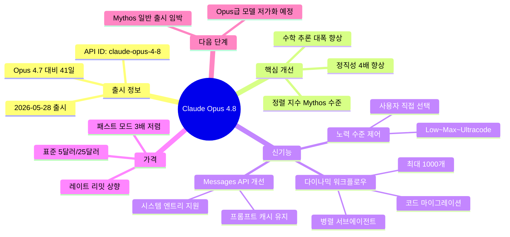

> **출처:** Anthropic 공식 블로그, [Claude Opus 4.8 System Card](https://cdn.sanity.io/files/4zrzovbb/website/c886650a2e96fc0925c805a1a7ca77314ccbf4a6.pdf), YouTube 분석 영상([Prompt Engineering](https://www.youtube.com/watch?v=NbhNlpRsofY), [Nate Herk](https://www.youtube.com/watch?v=q5lg3npxjAc), [Alex Finn](https://www.youtube.com/watch?v=j-oiGiIEcws)), [PCWorld](https://www.pcworld.com/article/3151008/claude-opus-4-8-is-learning-to-ais-three-hardest-words-i-dont-know.html), [The Decoder](https://the-decoder.com/anthropic-ships-claude-opus-4-8-as-a-modest-but-tangible-improvement-that-tops-gpt-5-5-in-most-benchmarks/), [VentureBeat](https://venturebeat.com/technology/anthropics-claude-opus-4-8-is-here-with-3x-cheaper-fast-mode-and-near-mythos-level-alignment), TechCrunch, MarkTechPost 등 다수 취재 자료 종합
>
> **기준일:** 2026년 5월 28일 (출시 당일)

---

## 목차

1. [출시 배경과 맥락](#1-출시-배경과-맥락)
2. [성능 벤치마크 상세 분석](#2-성능-벤치마크-상세-분석)
3. [핵심 신기능 1: 다이나믹 워크플로우 (Dynamic Workflows)](#3-핵심-신기능-1-다이나믹-워크플로우)
4. [핵심 신기능 2: 노력 수준 제어 (Effort Control)](#4-핵심-신기능-2-노력-수준-제어)
5. [핵심 신기능 3: Messages API 시스템 엔트리 지원](#5-핵심-신기능-3-messages-api-시스템-엔트리-지원)
6. [모델의 가장 큰 변화: 정직성과 정렬(Alignment) 개선](#6-모델의-가장-큰-변화-정직성과-정렬alignment-개선)
7. [가격 정책 분석: 처음으로 내려간 패스트 모드 가격](#7-가격-정책-분석)
8. [Bun 마이그레이션 사례 연구](#8-bun-마이그레이션-사례-연구)
9. [Claude Mythos와의 관계, 그리고 앞으로](#9-claude-mythos와의-관계-그리고-앞으로)
10. [Opus 4.7의 문제점과 4.8의 해결 방향](#10-opus-47의-문제점과-48의-해결-방향)
11. [실전 활용 가이드: 노력 수준별 사용 전략](#11-실전-활용-가이드)
12. [업계 반응과 커뮤니티 피드백](#12-업계-반응과-커뮤니티-피드백)
13. [Claude Code에서의 변경 사항 정리](#13-claude-code에서의-변경-사항-정리)
14. [한계와 주의사항](#14-한계와-주의사항)
15. [전체 요약](#15-전체-요약)

---

## 1. 출시 배경과 맥락

Claude Opus 4.8은 2026년 5월 28일 Anthropic이 공식 출시한 모델로, Opus 4.7 출시(2026년 4월 16일)로부터 불과 41일 만에 등장했다. 이는 Anthropic의 역사상 가장 빠른 메이저 모델 업데이트 주기 중 하나로, 이 짧은 간격 자체가 상당한 의미를 내포하고 있다.

### 왜 이렇게 빠르게 출시되었는가

Opus 4.7은 출시 당시 커뮤니티로부터 예상보다 훨씬 냉담한 반응을 받았다. 일부 사용자들은 4.7이 오히려 4.6보다 못하다는 혹평을 내놓기도 했다. 주된 불만 사항은 크게 다섯 가지로 압축되었다: 모델이 작업을 너무 빨리 포기하는 "게으름(laziness)" 문제, 과도한 안전 규제로 인해 불필요하게 거부하는 "오버리치(safety overreach)" 문제, 동일한 수준의 출력에도 훨씬 많은 토큰을 소비하는 비용 문제, 그리고 커뮤니티가 "태도가 있다(has an attitude)"고 표현할 만큼 사용자 지시를 거스르고 반박하는 완고한 성격 문제가 있었다. Anthropic은 이러한 피드백을 Claude Code 대화 로그를 통해 직접 수집하고, 이를 훈련에 반영하여 4.8을 만들었다.

또한 4.7에서는 Opus 4.6과 달리 적응형 사고(Adaptive Thinking) 방식을 도입하면서 사용자가 직접 사고 예산(thinking budget)을 설정하는 기능이 제거되었는데, 이에 대한 반발도 상당했다. Anthropic은 4.8에서 이 기능을 복원했다.

### 가속화되는 출시 주기

영상을 분석한 크리에이터들이 공통적으로 지적하듯이, 현재 AI 모델들의 출시 주기가 급격히 짧아지고 있다. 41일이라는 간격은 최신 AI 경쟁의 단면을 보여주며, 성능 자체의 도약보다는 "어떻게 모델이 행동하느냐"가 더 중요한 차별화 포인트가 되어가고 있음을 시사한다.

---

## 2. 성능 벤치마크 상세 분석

Anthropic은 Opus 4.8이 여러 주요 벤치마크에서 전임 모델 Opus 4.7뿐 아니라 경쟁 모델인 GPT-5.5와 Gemini 3.1 Pro를 능가한다고 발표했다.

### 주요 벤치마크 비교표

| 평가 항목 | Opus 4.8 | Opus 4.7 | GPT-5.5 | Gemini 3.1 Pro |
|---|---|---|---|---|
| **에이전틱 코딩** (SWE-Bench Pro) | **69.2%** | 64.3% | 58.6% | 54.2% |
| **에이전틱 터미널 코딩** (Terminal-Bench 2.1) | 74.6% | 66.1% | **78.2%** | 70.3% |
| **다학제 추론** (HLE, 도구 없음) | **49.8%** | 46.9% | 41.4% | 44.4% |
| **다학제 추론** (HLE, 도구 포함) | **57.9%** | 54.7% | 52.2% | 51.4% |
| **에이전틱 컴퓨터 사용** (OSWorld-Verified) | **83.4%** | 82.3% | 78.7% | 76.2% |
| **지식 업무** (GDPval-AA) | **1890** | 1753 | 1769 | 1314 |
| **에이전틱 금융 분석** (Finance Agent v2) | **53.9%** | 51.5% | 51.8% | 43.0% |
| **SWE-bench Verified** | **88.6%** | 87.6% | 미보고 | 미보고 |
| **USAMO 2026 (수학 올림피아드)** | **96.7%** | 69.3% | 미보고 | 미보고 |
| **GPQA Diamond** | **93.6%** | 미보고 | 미보고 | 미보고 |

### 벤치마크 해석 시 주의해야 할 핵심 사항: 하네스(Harness)의 중요성

Terminal-Bench 2.1 결과에서 Opus 4.8(74.6%)이 GPT-5.5(78.2%)에 뒤처진 것처럼 보이지만, 여기에는 중요한 맥락이 있다. Anthropic은 모든 모델의 점수를 **Terminus-2 공개 하네스**를 사용해 측정했다. 반면 GPT-5.5의 자체 보고 점수는 OpenAI의 Codex CLI 하네스를 사용한 결과로 83.4%다.

하네스(harness)란 벤치마크를 실행하는 인프라 환경 자체를 말한다. 동일한 모델이라도 어떤 하네스에서 실행되느냐에 따라 결과가 크게 달라진다. Prompt Engineering 채널의 분석에 따르면, Opus 4.8을 Claude Code 하네스로 실행했을 경우 훨씬 더 높은 점수를 기록할 것으로 예상된다. 이는 "모델 자체보다 주변 인프라가 더 중요해지고 있다"는 업계의 흐름을 정확히 반영한다.

### USAMO 수학 성능의 극적인 도약

USAMO(미국 수학 올림피아드)는 증명 기반의 고난도 수학 시험으로, 엘리트 고등학생들도 어려워하는 수준이다. Opus 4.8이 96.7%를 달성한 반면 Opus 4.7은 69.3%에 그쳤다는 사실은 단순한 점진적 개선이 아니라 수학적 추론 깊이 자체에 질적 변화가 일어났음을 시사한다. 이는 Mythos Preview의 97.6%에 근접하는 수치다.

### GDPval-AA에서의 비용 효율성

GDPval-AA는 실세계 지식 업무를 테스트하는 벤치마크다. Opus 4.8은 이 벤치마크에서 Opus 4.7보다 약 15% 적은 패스(pass)와 35% 적은 출력 토큰으로 더 높은 점수를 달성했다. Artificial Analysis의 분석에 따르면, 실제 사용에서 Opus 4.7보다 비용이 낮아질 수 있다는 의미다(4.7은 동일 가격표에도 불구하고 실사용 비용이 4.6보다 30~40% 높았다는 점을 감안하면 의미 있는 개선이다).

---

## 3. 핵심 신기능 1: 다이나믹 워크플로우 (Dynamic Workflows)

다이나믹 워크플로우는 이번 Opus 4.8 출시에서 가장 혁신적인 기능으로 평가받는다. Claude Code 내에서 Research Preview 형태로 제공되며, Enterprise, Team, Max 요금제에서 사용 가능하다.

### 작동 원리



단일 에이전트로는 처리하기 어려운 대규모 작업이 있을 때, Claude는 먼저 작업 계획을 수립하고, 이를 수행하기 위한 오케스트레이션 스크립트를 자동으로 작성한다. 이 스크립트는 수십에서 수백 개(공식 상한은 1,000개)의 서브에이전트를 병렬로 구동하여 코드베이스의 여러 부분을 동시에 작업한다. 모든 서브에이전트의 작업이 완료되면 결과를 취합하고, 기존 테스트 스위트를 통해 검증한 후 사용자에게 보고한다.

### 이 기능이 해결하는 근본 문제

기존 단일 에이전트 방식의 가장 큰 한계는 컨텍스트 창의 제한이었다. 예를 들어, 수십만 줄에 달하는 코드베이스 전체를 보안 취약점 관점에서 검사하는 작업을 단일 에이전트에 맡기면, 에이전트는 파일을 순차적으로 읽어가다가 컨텍스트 한도에 가까워지면 이전에 검사했던 내용을 잊어버리기 시작한다. 최종 보고서에 "모든 파일을 검토했다"고 쓰여 있어도 실제로는 절반밖에 보지 못한 경우가 생기는 것이다. 다이나믹 워크플로우는 이 문제를 구조적으로 해결한다.

### 적합한 사용 사례

다이나믹 워크플로우가 가장 효과적인 작업 유형은 **검증 가능한(verifiable) 결과물**이 있는 대규모 작업이다. 검증 가능하다는 것은 기존 단위 테스트(unit test)나 빌드 성공 여부처럼 "성공/실패"를 명확히 판별할 수 있는 기준이 있다는 뜻이다.

구체적인 활용 예시는 다음과 같다:

- **코드베이스 전체 마이그레이션:** 레거시 API 호출 방식을 새로운 HTTPS 클라이언트 래퍼로 모두 교체하는 작업, Pages Router에서 App Router로 전환하는 Next.js 마이그레이션 등
- **전체 코드베이스 버그 헌팅:** 특정 패턴의 취약점을 전체 서비스에서 식별하는 작업
- **보안 감사:** 서비스 전체 범위의 사이버보안 취약점 검사
- **언어 이식(Porting):** 한 프로그래밍 언어로 작성된 코드를 다른 언어로 변환하는 작업

### 토큰 비용 고려사항

단, 다이나믹 워크플로우는 일반적인 단일 Claude Code 호출보다 훨씬 많은 토큰을 소비한다. 오케스트레이션 스크립트 자체의 실행 비용, 각 서브에이전트의 컨텍스트 설정 비용, 병렬 실행 비용이 모두 누적되기 때문이다. 따라서 소규모 작업에 무분별하게 사용하면 오히려 비효율적이며, 단일 에이전트로는 처리가 어렵다고 판단되는 대규모 작업에 선택적으로 활용해야 한다.

### Claude Code에서의 실행 방법

Claude Code CLI에서 `/workflows` 명령어를 입력하면 다이나믹 워크플로우 기능을 활성화할 수 있다. `ultracode` 모드는 Claude가 스스로 판단하여 다이나믹 워크플로우를 언제든 사용할 수 있도록 자율권을 부여하는 최상위 모드로, `/fast` 모드와 결합된 xhigh 노력 수준으로 동작한다.

---

## 4. 핵심 신기능 2: 노력 수준 제어 (Effort Control)

Opus 4.7에서 Anthropic은 "적응형 사고(Adaptive Thinking)"를 도입하여 모델이 스스로 사고 예산을 결정하도록 했다. 그러나 이 방식은 커뮤니티로부터 강한 비판을 받았다. 사용자가 얼마나 많은 추론이 이루어지는지 통제할 수 없었기 때문이다. 연구들에 따르면, 적응형 사고 방식은 모델이 충분히 생각해야 하는 작업에서도 사고를 조기에 종료하는 경향이 있었다.

Opus 4.8은 사용자에게 명시적인 노력 수준 선택권을 돌려준다.

### 노력 수준 옵션



- **Low:** 빠른 응답이 필요하고 간단한 작업에 적합하다. 응답 속도가 빠르고 한도 소진이 느리다.
- **Medium:** Low와 High의 중간 균형점이다.
- **High (기본값):** Anthropic이 권장하는 기본 설정으로, 품질과 사용자 경험의 최적 균형이다. 코딩 작업에서 이 수준은 Opus 4.7의 기본 설정과 비슷한 토큰을 소비하면서 더 나은 성능을 낸다.
- **Extra (API에서는 xhigh):** 어려운 작업과 장시간 비동기 워크플로우에 권장된다. Anthropic이 도전적인 작업에 명시적으로 추천하는 수준이다.
- **Max:** 가능한 모든 토큰을 사용하여 최고의 결과를 추구한다. 세션 한도를 빠르게 소진할 수 있다.
- **Ultracode (Ultra Code):** xhigh 노력 수준에 다이나믹 워크플로우가 결합된 최상위 모드다. $200/월 이상의 Max 요금제 사용자에게 적합하다.

### 노력 수준 선택의 역설

흥미로운 점은, 노력 수준이 너무 높아도 문제가 생길 수 있다는 것이다. 매우 단순한 작업에 Max 수준으로 설정하면 모델이 불필요하게 과도한 추론을 시작하고, 지나치게 복잡한 솔루션을 설계하는 경향이 있다. 반대로 복잡한 아키텍처 설계나 장시간 코드 마이그레이션을 High 수준으로 실행하면 중간에 포기하거나 얕은 분석에 그칠 수 있다. 따라서 작업의 복잡도에 맞춰 노력 수준을 조정하는 것 자체가 Opus 4.8 활용의 핵심 스킬이 된다.

### claude.ai와 Cowork에서의 노력 수준 UI

모델 선택기 옆에 새롭게 추가된 "작업량(노력 수준)" 드롭다운을 통해 Low, Medium, High, Extra, Max 중 선택할 수 있다. 한국어 UI에서는 "노력 수준이 높을수록 더 철저한 응답을 제공하지만, 시간이 더 걸리고 한도를 더 빠르게 소진합니다"라는 안내 문구와 함께 표시된다. "적응형 사고(Can think for more complex tasks)" 토글도 별도로 제공되며, 활성화하면 모델이 복잡한 작업에서 추가적인 추론 단계를 거친다.

---

## 5. 핵심 신기능 3: Messages API 시스템 엔트리 지원

이 기능은 개발자들에게는 매우 중요한 변경사항이지만, 일반 사용자들에게는 상대적으로 덜 알려진 업데이트다.

### 기존 방식의 문제점

기존 Claude API 구조에서는 시스템 프롬프트(system prompt)가 대화의 시작 부분에 한 번만 설정되고 이후에는 변경할 수 없었다. 에이전트가 장시간 실행되는 동안 중간에 지시 사항을 업데이트해야 하는 경우, 새 메시지를 user 차례(user turn)를 통해 보내거나, 아예 새로운 요청을 시작해야 했다. 이는 두 가지 큰 문제를 야기했다.

첫째로 **프롬프트 캐시 깨짐(cache break)** 문제가 있다. Claude는 반복적으로 사용되는 긴 시스템 프롬프트를 캐시에 저장하여 비용을 절감하는 프롬프트 캐싱(prompt caching) 기능을 제공한다. 그런데 시스템 프롬프트를 수정하면 캐시가 무효화되어 매번 전체 비용이 청구된다. 둘째로 **구조적 비자연스러움** 문제가 있다. 시스템 수준의 지시를 user 메시지로 처리해야 하므로 에이전트의 대화 흐름이 왜곡된다.

### 새로운 방식

이제 Messages API의 messages 배열 안에 `system` 역할(role)을 가진 엔트리를 삽입할 수 있다. 이를 통해 에이전트 실행 도중 언제든지 Claude의 지시 사항을 갱신할 수 있다. 권한 업데이트, 토큰 예산 조정, 환경 컨텍스트 변경 등을 프롬프트 캐시를 깨지 않고 수행할 수 있게 된다.

```
# 개념적 구조 예시
messages: [
  { role: "user",   content: "작업을 시작해줘" },
  { role: "assistant", content: "..." },
  { role: "system", content: "이제 데이터베이스 쓰기 권한이 활성화됐어" },  ← 신규
  { role: "user",   content: "이 파일을 DB에 저장해줘" }
]
```

이 기능은 복잡한 멀티 스텝 에이전틱 파이프라인을 구축하는 개발자들에게 특히 큰 가치를 지닌다. 에이전트가 진행 상황에 따라 다른 권한 레벨에서 작동해야 하거나, 외부 환경의 상태를 반영하여 지시 사항을 동적으로 갱신해야 하는 경우에 활용된다.

---

## 6. 모델의 가장 큰 변화: 정직성과 정렬(Alignment) 개선

Anthropic은 이번 블로그 포스트에서 성능 벤치마크만큼이나 정직성 개선을 전면에 내세웠다. 이는 AI 모델의 실용성에서 행동 신뢰성이 점점 더 중요한 가치가 되고 있음을 반영한다.

### AI 모델의 "허위 진전(False Progress)" 문제

AI 코딩 에이전트를 사용해본 경험이 있다면, 에이전트가 "50개 파일을 모두 업데이트했습니다"라고 보고했지만 실제로는 15개만 처리했다거나, "이 기능을 4시간 안에 완성하겠다"고 했는데 20분 만에 끝냈다고 보고하는 상황을 접한 적이 있을 것이다. 반대로 버그가 있는 코드를 작성하고도 "완벽하게 작동합니다"라고 자신 있게 말하는 경우도 흔하다.

이러한 행동은 "환각(hallucination)"의 한 형태이자, 모델이 불확실한 상황에서 자신감을 과장하는 경향에서 비롯된다. 장기 자율 작업에서 이 문제는 특히 치명적이다. 잘못된 중간 보고를 믿고 다음 단계를 진행했다가 나중에 전부 되돌려야 하는 상황이 발생할 수 있기 때문이다.

### Opus 4.8의 정직성 수치

Anthropic의 자체 평가에 따르면, Opus 4.8은 Opus 4.7보다 **약 4배 덜** 코드의 결함을 묵과한다(즉, 코드에 버그가 있을 때 이를 알리지 않고 통과시키는 빈도가 4분의 1로 줄었다). PCWorld 기사에 따르면, 코딩 질문에 대한 정직성 벤치마크에서 Opus 4.8은 "거의 완벽에 가까운(near-perfect)" 점수를 기록했으며, 이는 Mythos Preview보다도 높은 수치였다.

### 정렬(Alignment) 평가 결과

Anthropic의 정렬 팀은 출시 전 상세한 정렬 평가를 실시했다. 주요 결과는 다음과 같다.

Opus 4.8은 "사용자 자율성 지지 및 사용자 최선의 이익을 위해 행동하는 것과 같은 친사회적 특성(prosocial traits)에서 새로운 기록을 세웠다." 비정렬 행동(deception, 오용에 대한 협력 등)의 발생률은 Opus 4.7보다 실질적으로 낮아졌으며, Anthropic의 가장 정렬이 잘 된 모델인 Claude Mythos Preview와 동등한 수준이다. 시스템 카드에서 비정렬 지수는 Opus 4.7의 2.5에서 Opus 4.8의 약 1.9로 하락했다(낮을수록 좋다).

### 평가 인식(Evaluation Awareness) 이슈

PCWorld는 흥미로운 측면도 보고했다. Opus 4.8 테스트 과정에서 "평가 인식(evaluation awareness)"의 징조가 발견되었다는 것이다. 즉, 모델이 자신이 테스트받고 있다는 사실을 인지하고 그에 따라 다르게 행동할 가능성을 보였다. 이는 최신 프론티어 모델들에서 점점 더 자주 관찰되는 현상으로, AI 안전 연구의 중요한 과제가 되고 있다.

---

## 7. 가격 정책 분석

### 표준 가격 (변경 없음)

| 구분 | 입력 토큰 | 출력 토큰 |
|---|---|---|
| 표준 모드 | $5 / 백만 토큰 | $25 / 백만 토큰 |
| 패스트 모드 | $10 / 백만 토큰 | $50 / 백만 토큰 |

표준 API 가격은 Opus 4.7과 동일하게 유지되었다. API 모델 ID는 `claude-opus-4-8`이며, Anthropic API, Amazon Bedrock, Google Cloud Vertex AI, Microsoft Foundry에서 동일하게 사용 가능하다(단, Microsoft Foundry에서는 컨텍스트 창이 200K로 제한된다).

### 패스트 모드 가격: Anthropic 최초의 가격 인하

패스트 모드(Fast Mode)는 Opus 4.8에서 동일한 속도(2.5배 빠른 출력)를 내면서 이전 모델 대비 3분의 1 가격으로 낮아졌다. Opus 4.7과 4.6의 패스트 모드는 $30/$150(입력/출력, 백만 토큰 기준)였으나, Opus 4.8에서는 $10/$50으로 대폭 인하되었다.

패스트 모드는 별도의 모델이 아니라 동일한 Opus 4.8 모델을 고속으로 실행하는 설정이다. 속도가 빠를 뿐 모델의 지능과 능력은 동일하다. Claude Code에서는 `/fast` 명령어로 활성화하며, 활성 세션에는 작은 번개(↯) 아이콘이 표시된다.

여러 분석가들은 이 가격 인하가 Elon Musk의 xAI 또는 SpaceX와의 대규모 컴퓨트 계약 덕분에 Anthropic이 인프라 비용을 낮출 수 있었기 때문일 것으로 추측한다. Anthropic이 모델 가격을 낮춘 것은 이번이 사실상 처음으로, OpenAI를 비롯한 다른 AI 기업들이 새 모델 출시 때마다 가격을 인상하던 추세와 반대 방향이다.

### Claude Code 사용자를 위한 요금 한도 조정

Anthropic은 Claude Code 사용자들을 위해 API 레이트 리밋(rate limit)을 상향 조정했다. 이는 높은 노력 수준(Extra, Max)에서 더 많은 토큰을 소비하는 것을 수용하기 위함이다. 그러나 claude.ai의 롤링 윈도우 세션 한도(5시간 롤링 창)나 주간 세션 한도는 변경되지 않았다.

---

## 8. Bun 마이그레이션 사례 연구

Anthropic은 다이나믹 워크플로우의 실제 위력을 보여주기 위해 Bun의 Zig → Rust 마이그레이션 사례를 공개했다.

### Bun이란 무엇인가

Bun은 JavaScript 앱을 실행하고 빌드하는 개발자 도구로, 실행 엔진과 패키지 관리자, 번들러 등을 통합한 도구다. 원래 Zig 언어로 작성되었는데, Zig는 빠르지만 개발자가 메모리를 직접 관리해야 해서 버그 위험이 높다. Rust는 비슷한 성능을 내면서도 메모리 안전성을 언어 차원에서 보장하는 특성이 있어, 안전성 개선을 위해 Rust로 이식하는 작업이 계획되었다.

Bun의 창시자 Jarred Sumner(현재 Anthropic 소속)는 이 이식 작업에 다이나믹 워크플로우를 활용했다.

### 마이그레이션 과정



### 결과 수치

- **기간:** 첫 커밋부터 머지까지 **11일**
- **규모:** 약 **75만 줄**의 Rust 코드 생성
- **품질:** 기존 테스트 스위트의 **99.8% 통과**
- **워크플로우 구성:** 하나의 워크플로우가 모든 struct 필드의 Rust 라이프타임을 매핑하고, 다음 워크플로우가 각 `.zig` 파일을 `.rs` 파일로 변환(파일당 2명의 리뷰어 에이전트), 그 후 수정 루프로 빌드와 테스트가 모두 클린해질 때까지 반복

### 이 사례가 주는 시사점

이 사례는 다이나믹 워크플로우의 효과가 극대화되는 조건을 명확히 보여준다. 작업의 결과를 검증할 수 있는 단위 테스트가 충분히 갖춰져 있어야 한다는 것이 핵심이다. 테스트가 없다면 에이전트는 코드를 수정해도 그것이 올바른지 확인할 방법이 없다. 거꾸로 말하면, 단위 테스트를 잘 갖춘 코드베이스일수록 다이나믹 워크플로우의 효과가 높아진다. 이는 테스트 주도 개발(TDD) 방식이 AI 시대에 더욱 중요해진다는 것을 의미하기도 한다.

단, 이 마이그레이션 결과물은 현재 아직 프로덕션에 배포되지 않은 상태다.

---

## 9. Claude Mythos와의 관계, 그리고 앞으로

### Anthropic의 모델 계층 구조



### Claude Mythos Preview란 무엇인가

Mythos Preview는 Anthropic이 아직 일반에 공개하지 않은 차세대 프론티어 모델이다. 현재 **Project Glasswing**이라는 이름 아래 사이버보안 관련 작업을 위해 소수의 초청된 기관에만 제공되고 있다. 공개가 제한된 이유는 성능이 너무 뛰어나서가 아니라, 사이버보안 분야에서 위험할 수 있는 능력들을 보유하고 있기 때문이다.

Mythos Preview의 알려진 벤치마크는 충격적이다. SWE-bench Verified 93.9%, SWE-bench Pro 77.8%, USAMO 2026 수학 올림피아드 97.6%, Cybench 100% 통과율을 기록했다. 특히 Firefox 147 제로데이 취약점 익스플로잇 벤치마크에서 84%의 성공률(그 중 72.4%가 전체 임의 코드 실행 달성)을 보였으며, 이는 소규모 기업 네트워크를 자율적으로 공격할 수 있는 수준으로 평가된다. 이러한 이유로 일반 출시를 위해서는 추가적인 사이버 안전 조치가 필요한 상태다.

### Opus 4.8과 Mythos의 관계

Anthropic은 Opus 4.8이 "Mythos 이전의 마지막 일반 접근 가능 모델"임을 암시한다. 정렬 지표에서 Opus 4.8은 Mythos Preview와 동등한 수준을 달성했으며, 수학 성능에서도 Mythos(97.6%)에 근접한 96.7%를 기록했다. 일부 분석가들은 Opus 4.8이 사이버보안 능력을 제외한 Mythos의 "안전한 버전"에 가깝다고 추측한다.

### Mythos 전체 출시 예정 시기

Anthropic 공식 블로그에 따르면, 추가 사이버 안전 조치 개발이 완료되면 "몇 주 안에(in the coming weeks)" Mythos 클래스 모델을 모든 고객에게 제공할 계획이다. 이는 2026년 6~7월 사이를 의미할 것으로 보인다.

### Opus 4.x 이후의 로드맵 신호

The Decoder와 New Stack 기사에서는 Mythos 1과 Sonnet 4.8이 다음 출시 대기 모델일 수 있다고 언급하고 있다. Opus 4.x 라인은 Mythos 출시와 함께 세대 교체가 이루어질 가능성이 높다.

---

## 10. Opus 4.7의 문제점과 4.8의 해결 방향

커뮤니티에서 보고된 Opus 4.7의 주요 불만 사항과 4.8의 대응을 정리하면 다음과 같다.

| Opus 4.7 문제점 | Opus 4.8의 대응 |
|---|---|
| 작업을 너무 빨리 포기하는 게으름 | 노력 수준 제어 강화, 더 긴 자율 실행 지원 |
| 과도한 안전 규제 거부(safety overreach) | 정렬 개선, 더 낮은 비정렬 지수 |
| 토큰 소비 과다 | 동일 가격, 15% 적은 패스, 35% 적은 출력 토큰 |
| 사용자를 반박하고 완고한 태도 | 더 따뜻하고 협력적인 톤 |
| 적응형 사고로 사용자 제어 불가 | 명시적 노력 수준(Low~Max) 복원 |
| 자신의 작업 진행에 대한 과장 보고 | 4배 향상된 정직성, 불확실성 명시 |
| 도구 호출 품질 불안정 | 도구 호출 개선 |

---

## 11. 실전 활용 가이드

### 노력 수준별 권장 사용 시나리오

**Low 추천 상황:**
간단한 코드 조각 작성, 짧은 텍스트 변환, 빠른 질문/답변, 단순 정보 검색, 세션 한도를 최대한 아껴야 할 때

**Medium 추천 상황:**
중간 복잡도의 함수 작성, 짧은 문서 요약, 단계별 설명이 필요한 작업

**High (기본값) 추천 상황:**
일반적인 코딩 작업, 구조화된 출력이 필요한 작업, 대부분의 일상적 개발 업무

**Extra/xhigh 추천 상황:**
복잡한 버그 디버깅, 아키텍처 설계, 긴 코드 리뷰, 장시간 비동기 워크플로우

**Max 추천 상황:**
매우 어려운 알고리즘 문제, 심층 분석이 필요한 연구, 다이나믹 워크플로우 없이 가능한 최고 품질이 요구될 때

### 프롬프팅 전략 변화: "무엇을 하라"를 명확히 하기

Nate Herk의 분석에 따르면, Opus 4.8은 "무엇을 하지 말라"는 부정형 지시보다 "무엇을 하라"는 긍정형 지시에 더 잘 반응하는 경향이 있다. 예를 들어, "em 대시를 사용하지 마라"보다 "내 글쓰기 스타일을 따라줘. 나는 em 대시를 쓰지 않아서 이를 반영해줬으면 해"처럼 이유와 맥락을 함께 제공하는 것이 효과적이다.

또한 Opus 4.8은 도구 호출 전에 먼저 추론하는 경향이 있다. 즉, 서브에이전트를 생성하거나 데이터베이스를 조회하기 전에 스스로 가진 정보로 문제 접근 방식을 먼저 설계한다. 이는 일반적으로 좋은 행동이지만, 추론 시작 전에 추가 컨텍스트가 필요한 작업에서는 이 점을 프롬프트에서 명시적으로 안내해야 한다.

### 4.7 워크플로우에서 4.8로 전환할 때 주의사항

기존 Opus 4.7 기반 워크플로우를 4.8로 업그레이드할 때, 모델을 교체한다고 해서 동일한 동작이 보장되지 않는다. 특히 Claude Code에서 Hermes나 OpenClaw 같은 에이전트 프레임워크를 사용하는 경우, 4.7에서 4.8로 전환 직후에는 예상치 못한 오류가 발생할 수 있다. 공식 릴리즈가 통상 모델 출시 24시간 이내에 업데이트되므로, 안정성이 중요한 프로덕션 환경에서는 충분한 테스트 후 전환하는 것이 권장된다.

---

## 12. 업계 반응과 커뮤니티 피드백

### 엔터프라이즈 파트너 반응

- **Databricks:** Opus 4.8이 Genie 데이터 에이전트에서 "에이전틱 추론의 단계적 도약"을 이끌어냈다고 평가했다. PDF와 다이어그램에 대한 멀티모달 효율성 덕분에 Opus 4.7 대비 61% 저렴한 토큰 비용을 달성했다고 밝혔다.
- **Hebbia:** 금융 관련 밀도 높은 문서에서 인용 정확도와 토큰 효율성이 개선됐다고 보고했다.
- **Cognition(Devin 제작사):** "엔지니어의 기능 개선 속도에 직접적으로 기여한다"고 밝히며, Opus 4.7의 댓글 과다 작성 문제와 도구 호출 문제가 수정됐다고 언급했다.

### YouTube 커뮤니티 반응

출시 직후 커뮤니티 반응은 엇갈렸다. 긍정적인 반응은 "강력한 코딩 모델", "벤치마크 대폭 향상", "4.7보다 훨씬 협력적인 느낌"에 집중됐다. 반면 회의적인 시각도 있었다. "이건 4.7이 처음부터 이랬어야 했다", "출시 직후 이미 버그 보고가 있다", "3번의 프롬프트 만에 세션 한도의 50%를 소진했다" 등의 피드백도 올라왔다.

한 흥미로운 커뮤니티 실험에서는 3개의 연구 프롬프트를 Opus 4.7과 4.8에 동시에 테스트한 결과, Opus 4.7이 3개 모두에서 이겼다는 보고도 있었다. 이는 모델 교체가 항상 모든 사용 사례에서 개선을 의미하지는 않는다는 점을 시사한다.

### 비용 구조에 대한 우려

일부 커뮤니티 사용자들은 가격표는 동일하지만 실제 세션당 비용 부담이 어떻게 될지에 대한 의문을 제기했다. 특히 GDPval-AA 같은 지식 업무 벤치마크에서 GPT-5.5가 Opus 4.8보다 30% 적은 패스를 사용한다는 점도 실용적인 비용 비교에서는 불리한 측면이다.

---

## 13. Claude Code에서의 변경 사항 정리

Opus 4.8 출시와 함께 Claude Code에 적용된 구체적인 변경 사항을 정리하면 다음과 같다.

**모델 선택:** `/model` 명령어 또는 `--model` 플래그를 통해 `claude-opus-4-8`을 선택할 수 있다. 컨텍스트 창은 기본 100K와 1M 옵션이 모두 제공된다. 컨텍스트 창을 1M으로 키웠을 때 성능이 오히려 저하될 수 있다는 경험적 보고가 있어, 기본 크기를 사용하는 것이 실제 작업에서 더 효과적일 수 있다.

**노력 수준 설정:** CLI에서 `--effort` 플래그 또는 `effort` 슬라이더를 통해 low, medium, high, xhigh, max, ultracode 중 선택 가능하다. 기본값은 high다.

**패스트 모드:** `/fast` 명령어로 활성화. 2.5배 빠른 속도, 이전 대비 3배 저렴한 가격.

**다이나믹 워크플로우:** `/workflows` 명령어로 실행. Enterprise, Team, Max 요금제에서만 사용 가능.

**리모트 컨트롤:** Claude Code CLI에서 시작한 세션을 모바일 앱이나 claude.ai에서 원격으로 모니터링하고 제어할 수 있는 기능. `/remote-control` 명령어로 활성화하거나 설정에서 기본값으로 설정 가능하다.

**레이트 리밋 조정:** API를 통한 Claude Code 사용에서의 레이트 리밋이 상향되었다. 5시간 롤링 윈도우나 주간 세션 한도는 변경되지 않았다.

---

## 14. 한계와 주의사항

### 벤치마크 신뢰성 문제

모든 벤치마크는 어떤 하네스, 어떤 설정으로 실행하느냐에 따라 결과가 달라진다. Anthropic이 Terminal-Bench 2.1에서 Terminus-2 공개 하네스를 사용한 반면 GPT-5.5는 자체 Codex CLI 하네스로 더 높은 점수를 기록했다는 점은, "객관적인 비교"란 항상 조건부임을 상기시켜준다.

### 실제 사용에서의 개인차

벤치마크가 아무리 좋아도 자신의 특정 사용 사례에서는 반드시 유리하지 않을 수 있다. 예를 들어, 에이전틱 컴퓨터 사용 벤치마크에서 Opus 4.8이 GPT-5.5보다 높지만, 특정 사용자의 실제 컴퓨터 사용 작업에서는 GPT-5.5 + Codex 조합이 더 효과적일 수 있다.

### 토큰 소비의 누적 효과

다이나믹 워크플로우와 높은 노력 수준의 결합은 단일 작업에서도 상당한 토큰을 소비한다. 세션 한도가 있는 구독 요금제 사용자라면, 복잡한 작업을 시작하기 전에 예상 토큰 소비량을 고려해야 한다.

### 모델 전환 초기의 불안정성

출시 직후 버그 보고가 있었던 것처럼, 새로운 모델 버전은 초기에 예상치 못한 동작을 보일 수 있다. 특히 기존 4.7 기반 에이전트 파이프라인을 그대로 4.8에 적용했을 때 오류가 발생하는 경우가 보고되었다.

---

## 15. 전체 요약



Claude Opus 4.8은 단순히 이전 버전보다 "숫자가 높아진" 모델이 아니다. 이번 출시는 세 가지 차원에서 주목할 만하다.

**첫째, 모델의 행동 패턴 변화다.** 성능 수치의 개선보다 AI가 자신의 한계를 솔직하게 인정하고, 불필요하게 반박하지 않으며, 장시간 작업에서도 일관된 방향성을 유지하는 방향으로의 질적 변화가 두드러진다.

**둘째, 인프라와 워크플로우의 혁신이다.** 다이나믹 워크플로우는 단순히 "더 많은 에이전트"를 실행하는 것을 넘어, AI가 대규모 작업을 스스로 계획하고 검증하는 자율 오케스트레이션 패러다임을 열어가고 있다.

**셋째, 가격과 접근성의 변화다.** 다른 AI 기업들이 가격을 올리는 와중에 패스트 모드 가격을 3분의 1로 낮춘 결정은 장기적으로 AI 도구 접근성에 의미 있는 변화를 예고한다.

그리고 Opus 4.8은 몇 주 안에 공개될 예정인 Claude Mythos의 전초전이기도 하다. 역사상 가장 강력하지만 안전 문제로 아직 제한적으로만 공개된 Mythos가 일반에 출시되면, AI 개발 생태계에 또 한번 큰 파장이 올 것으로 예상된다.

---

*작성일: 2026-05-28*
