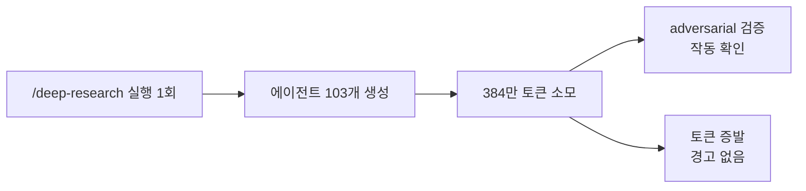
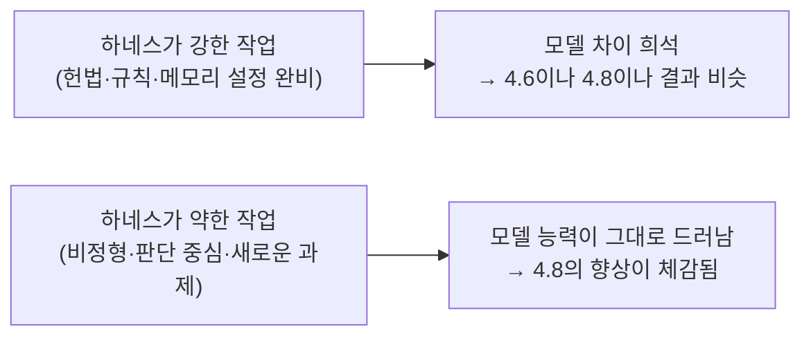
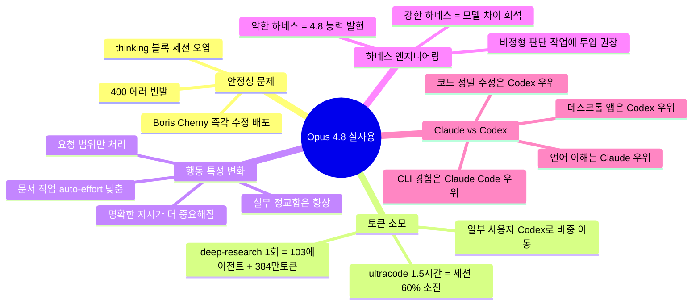

## 벤치마크 밖의 현실: 출시 당일 사용자들이 실제로 겪은 것들

> 이 문서는 Claude Opus 4.8 출시 직후(2026년 5월 28일) 실사용자들이 Threads에 올린 후기와, 관련 GitHub 이슈·공식 API 문서를 교차 검증하여 작성하였습니다. 출시 당일 현장의 목소리를 있는 그대로 담되, 확인되지 않은 내용은 명시합니다.

---

## 1. 출시 첫날 터진 버그: 400 에러

### 1.1 무슨 일이 있었나

Opus 4.8이 공개된 지 몇 시간도 채 안 되어 사용자들 사이에서 **400 에러**가 빈번하게 보고되기 시작했습니다. 에러 메시지는 다음과 같습니다.

```
API Error: 400 messages.1.content.4:
`thinking` or `redacted_thinking` blocks in the latest assistant message
cannot be modified. These blocks must remain as they were in the original response.
```

쉽게 말해, Claude가 확장 사고(extended thinking)를 사용한 세션에서 대화를 계속 이어가려 하면 에러가 발생하면서 세션 자체가 영구적으로 망가지는 현상입니다. 같은 세션에서 새로운 프롬프트를 입력해도, 아무것도 하지 않는 명령을 보내도 동일한 400 에러가 반복되어 리와인드 외에는 방법이 없는 상황이 생겼습니다.

GitHub 이슈(#63147)에 따르면, 이 버그의 원인은 **Claude Code가 확장 사고 블록을 세션 기록 파일(.jsonl)에 저장할 때 thinking 텍스트 내용은 빈 문자열("")로 비워두고 서명(signature) 필드만 남기는 방식** 때문입니다. 그런데 API는 이 서명이 있는 블록이 수정되거나 누락되면 400 에러를 반환합니다. Claude Code 2.1.153 버전에서 발생했고, 구독 기반 사용자 전반에 영향을 미쳤습니다.

Claude Code를 만든 **Boris Cherny**가 빠르게 반응하여 소셜미디어에 "Fix going out now(수정 배포 중)"라고 직접 답변했습니다.

### 1.2 구조적 배경: 왜 이런 버그가 생기나

이 버그는 사실 더 큰 구조 변화의 부산물입니다. Anthropic은 Opus 4.7부터 사용자가 직접 추론 예산을 지정하는 **수동 확장 사고(manual extended thinking)** 방식을 제거했습니다. 기존에는 `thinking: {type: "enabled", budget_tokens: N}` 파라미터로 얼마나 깊이 생각할지 직접 지정할 수 있었는데, Opus 4.7과 4.8에서는 이 파라미터를 사용하면 **즉시 400 에러**가 반환됩니다.

공식 API 문서에 따르면, Opus 4.7과 4.8에서는 `thinking: {type: "adaptive"}`만 지원하며, 사고 깊이는 `/effort` 파라미터로 조절합니다. 이는 의도적인 설계 변경이지만, Claude Code 내부의 세션 직렬화 로직이 이 변화를 완전히 따라가지 못하면서 버그가 발생한 것입니다.

### 1.3 한국 사용자들의 반응

출시 당일 400 에러를 겪은 사용자들은 "몇 분 작동하다가 400 에러 떠서 리와인드해야 한다"는 식의 불편함을 호소했습니다. 공식 수정이 빠르게 배포되었지만, 출시 첫날 안정성에 대한 의문은 자연스럽게 남았습니다.

---

## 2. Dynamic Workflows와 토큰 소모: 숫자로 보는 현실

### 2.1 /deep-research 한 번의 비용

이번 업데이트에서 가장 충격적인 실사용 데이터 중 하나는 **/deep-research 명령어 1회 실행 결과**입니다.

한 사용자가 공유한 데이터에 따르면, `/deep-research` 한 번 실행에 **에이전트 103개와 384만 토큰**이 소모되었습니다. 이 과정에서 드러난 흥미로운 점도 있었습니다. adversarial 검증이 실제로 작동하여 "MCP가 공격 성공 가능성이 있다"는 arXiv 주장이 검증 에이전트에 의해 0-3으로 기각된 사례가 있었습니다. 손으로 직접 검증했다면 훨씬 오래 걸렸을 작업이 에이전트 간 반박 구조 덕분에 자동화된 것입니다. 이 리서치 결과물은 talks/ 디렉토리에서 source_researches로 인용될 수 있을 만큼 품질이 충분했다는 평가입니다.

그러나 384만 토큰은 명백히 무거운 비용입니다. 이 사실을 모르고 `/deep-research`를 사용했다가 토큰이 한 번에 증발하는 경험을 한 사용자도 있었습니다.



### 2.2 ultracode 1.5시간의 현실

ultracode를 켜고 웹페이지 가독성 향상 작업을 진행한 사용자의 경험입니다. 실제 작업 시간은 약 1.5시간(회의 시간 제외)이었는데, **5시간 세션 리밋의 60%가 소진**되었습니다. 반면 컨텍스트(compact와 clear를 의도적으로 수행하지 않은 상태)는 48%가 남아 있었습니다.

이 사용자의 평가는 결과물 측면에서는 긍정적이었습니다. 4.7에서는 정확하게 지시해야 겨우 원하는 결과를 얻을 수 있었는데, 4.8은 사용자가 놓쳤던 부분(마커 위 글자 겹침 문제, 인터랙티브 전환, 연결선 삽입 등)까지 스스로 제안했습니다. 그러나 동시에 "토큰 소모량이 워낙 많아 플랜 모드 정도에 적합할 수 있다"는 결론을 내렸습니다.

### 2.3 토큰 때문에 Claude Code를 줄이는 사람들

일부 사용자는 Opus의 토큰 소모량이 부담스러워 **사용 비중 자체를 조정**하기 시작했습니다.

원래 Claude Code 8 : Codex 2의 비율로 사용하다가, 토큰 소모가 눈에 보이자 Codex 8 : Claude Code 2로 비율을 뒤집었다는 사용자도 있었습니다. "Opus를 풀로 돌리면 MAX $20 플랜의 주간 쿼터를 하루 안에 다 소진할 자신이 있다"는 표현도 나왔습니다. 서브에이전트들이 Sonnet과 Haiku를 사용하더라도 오케스트레이터 Opus 자체의 소모량이 상당하기 때문입니다.

이와 관련해 참고할 수 있는 구조적 맥락이 있습니다. Claude Code 토큰 한도는 5시간 롤링 윈도우 방식으로 운영됩니다. 2026년 5월 기준 Max 5x 플랜은 세션당 약 88,000 토큰, Max 20x 플랜은 약 220,000 토큰 수준이며, 여기에 주간 한도가 추가로 적용됩니다. /deep-research 한 번이 384만 토큰을 소모한다면, 이는 Max 20x 기준 세션 예산의 17배가 넘는 수치입니다. 이 숫자는 API 과금 방식(구독이 아닌 토큰당 과금)으로 사용할 때의 상황이며, 구독 플랜에서는 한도가 소진되는 형태로 작동합니다.

---

## 3. 실사용 행동 특성: 사용자들이 체감한 것

### 3.1 "자율성"의 실제 의미

Anthropic이 Opus 4.8의 특징으로 강조한 "자율성 향상"에 대해 사용자들의 평가는 흥미롭게 엇갈립니다.

한 사용자는 "자율성을 가졌다고 하는데 오히려 4.7보다 **명확해야 일을 잘한다**. 시키지 않은 건 안 하는데 뭐가 자율성인지 모르겠다"고 평가했습니다. 반면 다른 사용자는 바로 이 특성을 긍정적으로 봤습니다. "내가 요청한 것에 대해서만 딱 결과물을 내니까 결과물이 더 잘 나오는 것 같다. Codex 쓸 때의 느낌과 비슷해지고 있다"는 것입니다.

이 두 평가는 모순처럼 보이지만 사실 같은 현상을 다른 맥락에서 바라본 것입니다. Opus 4.8은 요청 범위를 넘어서 스스로 판단해 추가 작업을 벌이는 "과잉 에이전틱" 행동이 줄었습니다. 이는 지시를 명확하게 구성할 수 있는 숙련 사용자에게는 정밀한 도구가 되지만, 모호한 지시에도 알아서 채워주기를 기대했던 사용자에게는 오히려 이전보다 더 구체적인 지시가 필요하게 된 것처럼 느껴집니다.

### 3.2 문서 작업: 자동 effort 조절의 이중성

문서 작업을 요청한 사용자들에게서 공통적으로 관찰된 현상이 있습니다. Opus 4.8이 문서 작성 요청을 "낮은 수준의 작업"으로 스스로 판단하고 effort를 낮춰서 처리하는 것입니다.

결과물이 "기존 대비 간결해진 느낌"이라는 평가가 여러 명에게서 나왔습니다. Anthropic이 설계한 자동 effort 조절이 의도대로 작동하는 것이지만, 사용자 입장에서는 이전 모델보다 "빈약한" 문서가 나온 것처럼 체감될 수 있습니다. 이를 보완하려면 `/effort high` 또는 `/effort xhigh`를 명시적으로 지정하거나, 프롬프트에 원하는 깊이와 분량을 구체적으로 명시해야 합니다.

### 3.3 실무 정교함은 향상됐다

반대로 실무 디자인 및 코딩 작업에서는 4.8이 뚜렷이 나아졌다는 평가도 있습니다. 기존 디자인을 넘겨주고 추가 작업을 요청할 때, 4.7은 지시한 범위 내에서만 작업했다면 4.8은 **사용자가 미처 언급하지 않은 문제점**까지 분석해서 제안하는 경향이 있습니다. 웹페이지 수정 과정에서 마커 위 텍스트 겹침 문제를 자동 발견하고, 인터랙티브 전환을 제안하며, 연결선까지 삽입한 사례가 보고되었습니다. "사용 방법에 따라 다르겠지만 AI가 일반 사람 1~2명 이상의 힘은 한다"는 평가가 나오기도 했습니다.

---

## 4. 하네스 엔지니어링: 모델 업그레이드가 체감되지 않는 이유

이번 후기 중 가장 통찰력 있는 분석 중 하나는 Opus 4.6에서 4.8로 전환한 콘텐츠 작업자의 경험에서 나왔습니다.

### 4.1 핵심 관찰

이 사용자는 Opus 4.8로 전환 후 콘텐츠 작업에서 **차이를 거의 느끼지 못했습니다.** 그 이유를 분석하면, 이미 구성해 둔 시스템(헌법, 프로젝트 지시, 메모리 설정)이 출력을 강하게 잡고 있기 때문입니다. 모델이 바뀌어도 이 구조가 결과를 거의 동일하게 제어하는 것입니다.

그러나 시스템 메타 감리(모델이 어떻게 생각하고 일하는지 관찰)를 해보면, 사고력과 일하는 방식은 확실히 향상되었다는 것이 이 사용자의 결론입니다.

### 4.2 하네스 강도와 모델 능력의 관계

이로부터 도출된 중요한 원리가 있습니다.



이 원리에 따르면, "더 좋은 모델로 바꿨는데 왜 그대로지?"라는 느낌이 드는 것은 모델이 부족한 것이 아니라, **시스템이 이미 잘 잡혀 있다는 신호**일 수 있습니다. 반대로 말하면, 최신 모델의 향상을 최대한 활용하고 싶다면 하네스를 느슨하게 두고 **비정형 판단 작업**에 투입하는 것이 효과적입니다. 정형화된 반복 작업에는 최신 모델이 굳이 필요하지 않습니다.

이 통찰은 앞서 언급한 문서 작업에서 차이를 못 느낀다는 사용자들의 경험과도 연결됩니다. 출력이 이미 시스템 프롬프트나 스타일 지시로 강하게 고정되어 있는 경우, 모델이 아무리 발전해도 체감 차이는 작을 수밖에 없습니다.

---

## 5. 경쟁 구도: Claude Code vs Codex 실사용 비교

실사용자들 사이에서 Claude Code와 Codex(GPT-5.5 기반)를 병행 사용하는 비교 경험이 상당히 많이 공유되고 있습니다.

여러 사용자의 의견을 종합하면 다음과 같은 패턴이 나타납니다.

언어 이해와 자연스러운 대화는 Claude Code(Opus)가 앞선다는 것이 전반적인 평가입니다. 복잡한 지시를 더 잘 파악하고, 문맥 유지도 낫다는 의견이 많습니다. 반면 코드 수정 정밀도, 즉 딱 필요한 부분만 건드리는 능력은 Codex 초기 출시 버전(GPT-5.5)이 더 낫다는 평가가 있습니다. Claude Code는 여러 군데를 동시에 건드리는 경향이 있다는 것입니다. 데스크톱 앱의 완성도 면에서는 Codex가 앞서고, CLI 경험 면에서는 Claude Code가 낫다는 의견이 일치합니다.

한 사용자는 "GPT 5.4, Opus 4.6 이후로는 별 차이를 못 느끼는 것 같고, 그냥 취향 차이"라는 결론을 내렸습니다. 또한 벤치마크에 대해서도 "그냥 숫자 놀음이 된 듯 싶다"는 냉소적 평가가 나왔습니다. 다음 메이저 버전(질적 도약)이 오기 전까지는 **사용자 실력이 모델 성능보다 더 중요하다**는 주장도 제기되었습니다.

Terminal-Bench 2.1에서 Opus 4.8이 1위라는 일부 사용자의 주장은 사실과 다릅니다. 공식 자료에 따르면 이 벤치마크에서는 GPT-5.5가 78.2%로 Opus 4.8(74.6%)을 앞서고 있습니다.

---

## 6. 주요 사용 경험 요약

아래는 출시 첫날 실사용자들의 경험을 주제별로 정리한 것입니다.



---

## 7. 실사용자들이 공통으로 권장하는 운영 방법

출시 당일 실사용자들의 경험을 종합해 도출할 수 있는 실용적 지침은 다음과 같습니다.

**Dynamic Workflows와 /deep-research는 반드시 사전에 토큰 예산을 계산하고 시작해야 합니다.** `/deep-research` 한 번에 수백만 토큰이 소모될 수 있습니다. 첫 실행 전에 Claude Code가 보여주는 실행 예정 에이전트 수와 예상 범위를 꼭 확인하고 승인해야 합니다.

**문서 작업이나 가벼운 작업에서 결과물이 빈약하게 느껴지면 `/effort high` 또는 `/effort xhigh`를 명시적으로 지정해야 합니다.** 4.8은 작업 유형을 스스로 평가해 effort를 낮추는 경향이 있기 때문입니다.

**이미 시스템 프롬프트, 헌법, 메모리 설정이 잘 구성되어 있는 작업은 굳이 Opus 4.8을 최대 effort로 돌릴 필요가 없습니다.** 하네스가 강한 작업은 Sonnet이나 Haiku로도 충분한 경우가 많습니다. Opus의 강점은 비정형 판단, 새로운 문제, 복잡한 추론이 필요한 영역에서 발휘됩니다.

**ultra code나 Dynamic Workflows는 "꼭 필요한 대규모 작업"에만 사용하는 것이 좋습니다.** 1M 토큰 이상이 순식간에 소모될 수 있으므로, 일상적인 작업에는 standard 모드나 high effort로 충분합니다.

---

## 8. 결론: 출시 첫날이 드러낸 것

Claude Opus 4.8의 출시 첫날은 크게 세 가지를 드러냈습니다.

**첫째, 강력함과 불안정성의 공존입니다.** 400 에러 버그는 빠르게 수정되었지만, 대규모 기능 릴리즈 직후의 불안정 구간은 엄연히 존재했습니다. 프로덕션에서 중요한 작업을 Opus 4.8로 바로 전환하기 전에 충분한 테스트 기간을 두는 것이 필요합니다.

**둘째, Dynamic Workflows의 비용은 예상보다 훨씬 높습니다.** 384만 토큰이 한 번의 deep-research로 소모된다는 것은, 이 기능이 범용 도구가 아닌 특정 대규모 작업 전용 도구임을 의미합니다. 아무 맥락 없이 ultracode나 workflow를 켜는 것은 권장하지 않습니다.

**셋째, 모델 성능의 상향평준화 속에서 사용자의 역량이 더 중요해지고 있습니다.** "GPT 5.4 이후로는 별 차이를 못 느낀다", "벤치마크는 숫자 놀음", "사용자 실력이 더 중요하다"는 현장의 목소리는, AI 모델이 충분히 강력해진 지금 병목이 어디에 있는지를 다시 묻게 합니다. 작업을 어떻게 정의하고, 하네스를 어떻게 구성하고, 에이전트를 어떻게 오케스트레이션하는가가 모델 버전 번호보다 더 큰 변수가 되어가고 있습니다.

---

*작성일: 2026년 5월 29일*

*이 문서는 Threads(@gptaku_ai, @buildnwrite, @logue007, @bohe76, @timeismine__, @chanation, @chunghwemo, @flowkater, @vyblor) 실사용 후기, GitHub anthropics/claude-code 이슈 #63147, Anthropic 공식 API 문서(platform.claude.com/docs/build-with-claude/extended-thinking), Boris Cherny의 공개 답변을 기반으로 작성되었습니다.*
