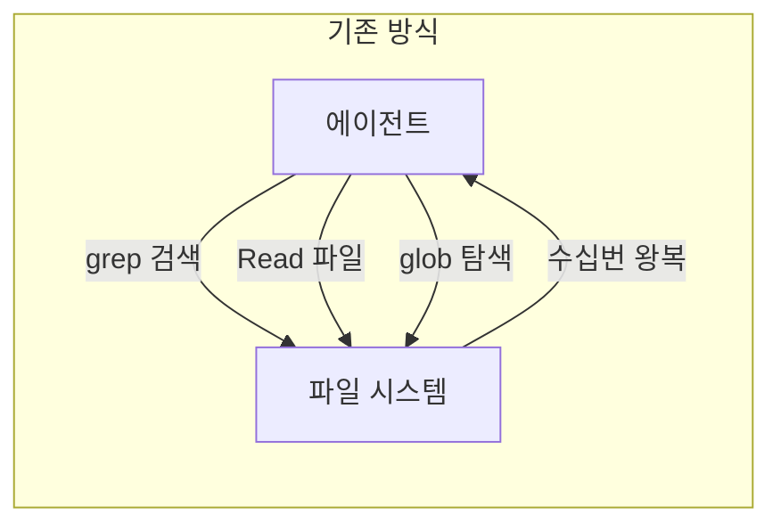
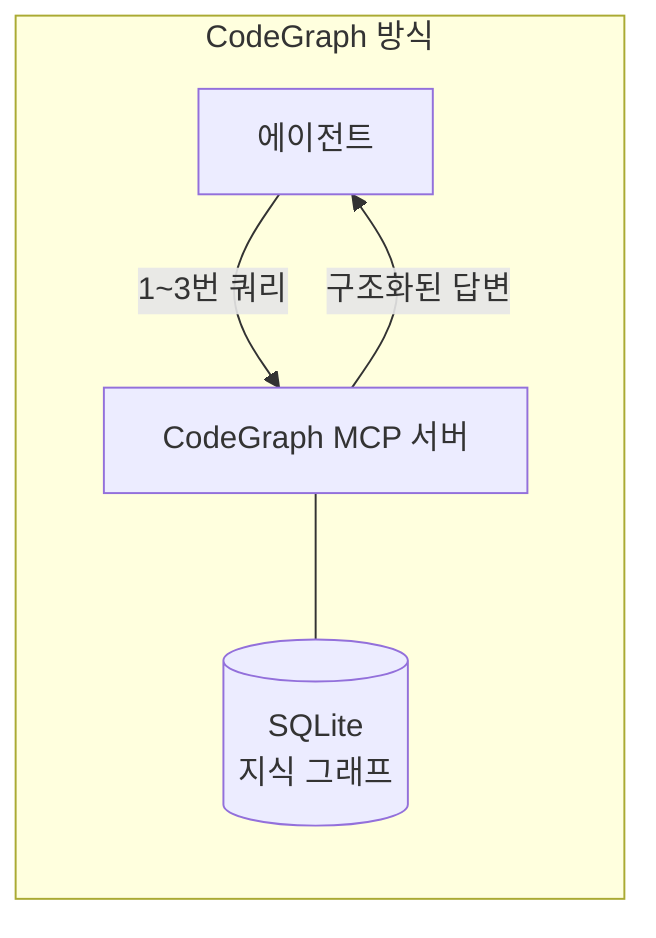
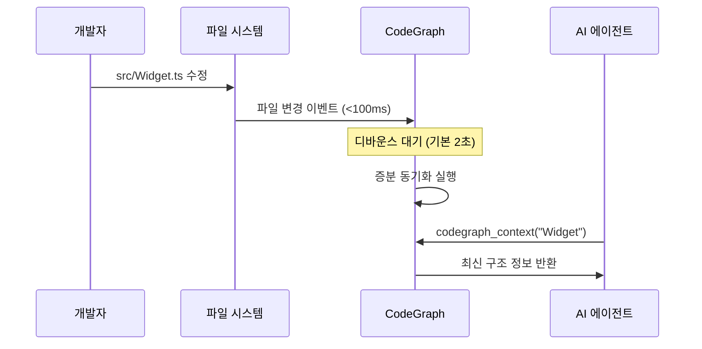
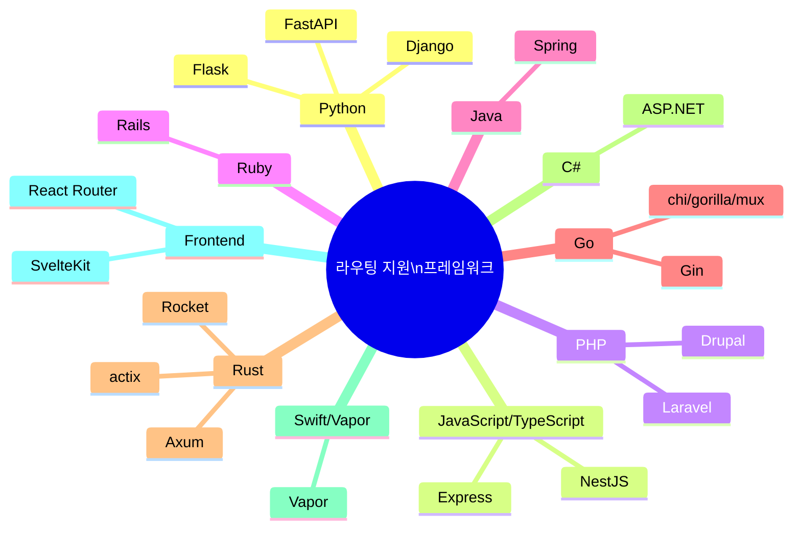
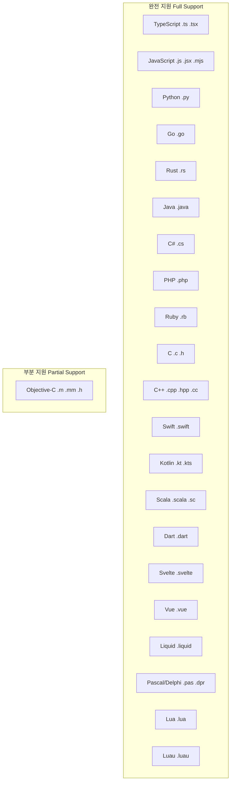
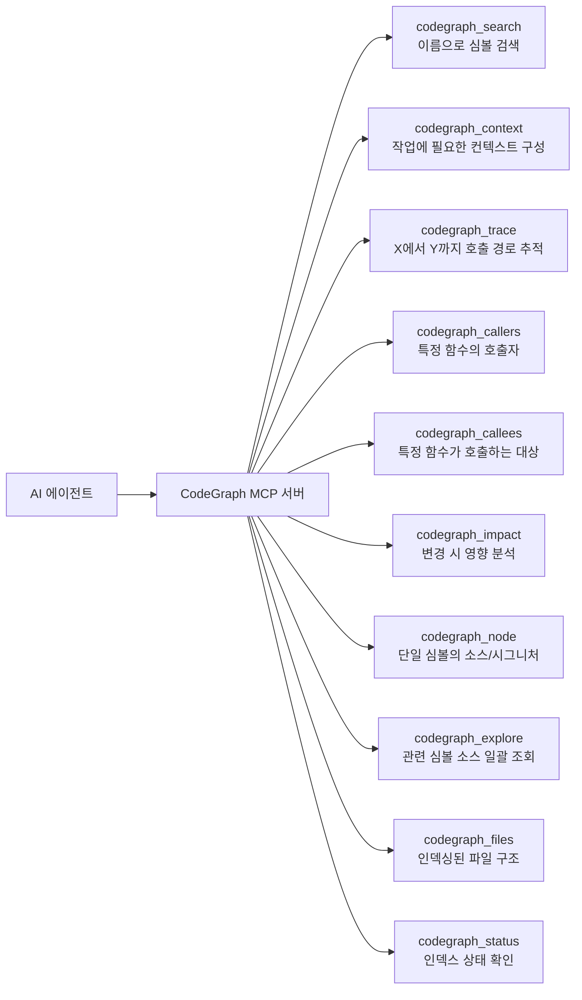
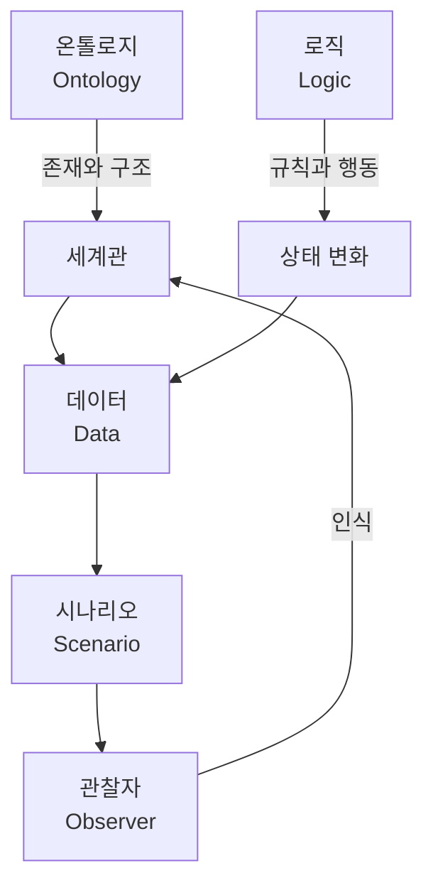
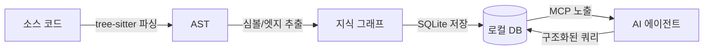

## AI 코딩 에이전트를 위한 코드 지식 그래프 — 완전 해설

> **작성 기준:** 2026년 5월 28일 | **최신 버전:** CodeGraph v0.9.4 (2026-05-24 재검증)

---

## 목차

1. [배경: 왜 지금 이 주제인가?](#1-배경)
2. [CodeGraph란 무엇인가?](#2-codegraph란-무엇인가)
3. [핵심 작동 원리](#3-핵심-작동-원리)
4. [주요 기능 상세 해설](#4-주요-기능-상세-해설)
5. [벤치마크 결과 분석](#5-벤치마크-결과-분석)
6. [지원 언어 및 프레임워크](#6-지원-언어-및-프레임워크)
7. [설치 및 사용 방법](#7-설치-및-사용-방법)
8. [MCP 도구 참조](#8-mcp-도구-참조)
9. [온톨로지 기반 바이브코딩 — 김태영 대표의 발표 맥락](#9-온톨로지-기반-바이브코딩)
10. [관련 생태계와 경쟁 도구](#10-관련-생태계와-경쟁-도구)
11. [결론: 이 접근이 의미하는 것](#11-결론)

---

## 1. 배경: 왜 지금 이 주제인가?

2026년 현재, LLM(대형 언어 모델) 기반 코딩 에이전트는 개발자의 일상 업무 속으로 깊숙이 들어왔다. Claude Code, Cursor, Codex CLI, OpenCode, Gemini CLI 등 수많은 에이전트가 등장했고, 이들 사이의 경쟁은 이제 **모델 자체의 성능**보다 **컨텍스트 효율성**으로 옮겨가고 있다.

### 기존 방식의 문제점

AI 코딩 에이전트가 코드베이스를 탐색할 때, 기존 방식은 다음과 같이 작동한다.

```
에이전트: "이 프로젝트에서 인증은 어떻게 처리되나?"
  → grep 으로 'auth' 검색
  → glob 으로 파일 목록 수집
  → 관련 파일 10개 읽기 (Read × 10)
  → 그 파일 안에서 다시 관련 심볼 추적
  → 또 다른 파일들 읽기...
  → 수십 번의 도구 호출 끝에 답변
```

이 과정에서 발생하는 비용은 결코 작지 않다. 파일을 읽을 때마다 토큰이 소모되고, 에이전트가 또 다른 탐색 하위 에이전트(Explore sub-agent)를 생성하면 비용은 기하급수적으로 늘어난다. VS Code 같은 대형 코드베이스(약 10,000개 파일)에서는 단 하나의 아키텍처 질문에 수십 번의 도구 호출과 상당한 비용이 발생한다.

**CodeGraph는 이 근본적인 비효율을 해결하기 위해 만들어졌다.** 코드베이스를 미리 파싱하고 구조화된 지식 그래프로 인덱싱해두면, 에이전트가 파일을 하나씩 읽는 대신 즉시 쿼리로 답을 얻을 수 있다.

---

## 2. CodeGraph란 무엇인가?

CodeGraph는 개발자 Colby McHenry가 만든 오픈소스 프로젝트로, **AI 코딩 에이전트를 위한 로컬 코드 지식 그래프(Local Code Knowledge Graph)** 도구다. npm 패키지 `@colbymchenry/codegraph`로 배포되며, MIT 라이선스로 공개되어 있다.

핵심 아이디어는 단순하면서도 강력하다. 코드베이스를 **사전에(pre-indexed)** 파싱하여 심볼 관계, 호출 그래프, 코드 구조를 SQLite 데이터베이스에 저장해두고, 에이전트가 MCP(Model Context Protocol)를 통해 이 그래프를 즉시 쿼리할 수 있도록 한다. 에이전트는 파일을 열어보는 대신 그래프에 질문을 던지고, 그래프는 이미 계산된 구조적 정보를 돌려준다.





---

## 3. 핵심 작동 원리

CodeGraph의 동작은 크게 네 단계로 나뉜다.

### 3.1 추출 (Extraction) — tree-sitter 기반 파싱

CodeGraph는 [tree-sitter](https://tree-sitter.github.io/)라는 범용 파서를 사용한다. tree-sitter는 각 프로그래밍 언어의 문법 규칙에 따라 소스 코드를 **추상 구문 트리(AST, Abstract Syntax Tree)** 로 변환한다. 이 AST에서 언어별 특화 쿼리를 통해 다음 정보를 추출한다.

- **노드(Nodes):** 함수, 클래스, 메서드, 타입 등 코드의 구성 요소
- **엣지(Edges):** 호출 관계(calls), 임포트(imports), 상속(extends), 구현(implements) 등 노드 간의 관계

이 과정은 LLM이 코드를 "요약"하거나 "해석"하는 것과 전혀 다르다. tree-sitter는 문법 규칙에 따라 코드를 결정론적(deterministic)으로 파싱하기 때문에, 동일한 코드에 대해 항상 동일한 결과가 나온다. 추측이나 환각(hallucination)이 개입할 여지가 없다.

### 3.2 저장 (Storage) — SQLite + FTS5

추출된 모든 정보는 프로젝트 폴더 내 `.codegraph/codegraph.db`라는 SQLite 데이터베이스 파일에 저장된다. 특히 SQLite의 **FTS5(Full-Text Search 5)** 확장을 활용하여 심볼명 전체 텍스트 검색을 밀리초 단위로 수행할 수 있다. 모든 데이터는 로컬에만 존재하며, 외부 서버나 API로 전송되지 않는다.

### 3.3 해소 (Resolution) — 참조 연결

단순 추출만으로는 부족하다. 함수 호출이 실제로 어떤 정의를 가리키는지, 임포트가 어떤 소스 파일과 연결되는지를 추가로 해소(resolve)하는 단계가 필요하다. 이 단계에서 CodeGraph는 다음을 처리한다.

- 함수 호출 → 정의 위치로 연결
- 임포트 경로 → 실제 소스 파일 매핑
- 클래스 상속 및 인터페이스 구현 관계 확립
- Django, Flask, Express 등 프레임워크별 라우팅 패턴 인식

### 3.4 자동 동기화 (Auto-Sync) — 네이티브 OS 파일 감시

코드베이스는 계속 변한다. CodeGraph는 운영체제 네이티브 파일 감시 메커니즘을 활용하여 인덱스를 최신 상태로 유지한다.

- **macOS:** FSEvents
- **Linux:** inotify
- **Windows:** ReadDirectoryChangesW

파일이 변경되면 기본 2초의 디바운스(debounce) 창 이후 증분 동기화(incremental sync)가 실행된다. 동기화가 아직 진행 중인 파일을 에이전트가 쿼리할 경우, `⚠️` 배너를 통해 해당 파일을 직접 읽도록 안내한다.



---

## 4. 주요 기능 상세 해설

### 4.1 스마트 컨텍스트 구축 (Smart Context Building)

`codegraph_context` 도구 하나로 진입점(entry points), 관련 심볼, 코드 스니펫을 한 번에 반환받는다. 에이전트가 "이 기능이 어떻게 작동하는가?"를 물을 때, 여러 번 grep과 Read를 반복하는 대신 단 한 번의 호출로 관련된 모든 정보가 구성된다.

### 4.2 전체 텍스트 검색 (Full-Text Search)

FTS5 기반으로 코드베이스 전체에서 심볼명을 즉시 검색한다. 예를 들어 `UserService`를 검색하면, 해당 클래스가 선언된 위치와 이를 호출하는 모든 곳의 목록이 즉시 반환된다.

### 4.3 영향 분석 (Impact Analysis)

코드를 수정하기 전에 `codegraph_impact` 도구로 해당 심볼을 변경했을 때 영향을 받는 모든 코드를 미리 파악할 수 있다. 호출자(callers), 피호출자(callees), 전체 영향 반경(impact radius)을 추적하여 의도치 않은 사이드 이펙트를 사전에 방지한다.

### 4.4 호출 경로 추적 (Call Path Tracing)

`codegraph_trace` 도구는 "X가 어떻게 Y에 도달하는가?"라는 질문에 답한다. 단순한 정적 분석을 넘어 동적 디스패치(dynamic dispatch), 콜백, React 리렌더, 인터페이스→구현 체인까지 추적한다. grep으로는 발견할 수 없는 간접적인 호출 경로도 한 번의 호출로 확인된다. 각 홉(hop)의 코드 본문이 인라인으로 포함되어 반환되므로, 에이전트가 추가 파일 읽기 없이도 전체 흐름을 파악할 수 있다.

### 4.5 프레임워크 인식 라우팅 (Framework-aware Routes)

웹 프레임워크의 라우팅 파일을 자동으로 인식하고, URL 패턴을 해당 핸들러 함수나 클래스와 연결한다. 예를 들어 Django의 `urls.py`에서 `path('/login', LoginView.as_view())`를 인식하면, 에이전트가 `/login` 경로에 대해 질문했을 때 `LoginView` 클래스까지 즉시 연결해서 보여준다.

현재 지원하는 14개 프레임워크는 다음과 같다.



### 4.6 iOS/React Native/Expo 크로스 언어 브리징

실제 iOS 및 React Native 코드베이스는 여러 언어에 걸쳐 있다. Swift 코드가 Objective-C 셀렉터를 호출하고, JavaScript 코드가 네이티브 모듈을 통해 Swift/Kotlin 코드를 실행한다. 일반적인 정적 파싱은 언어 경계에서 멈추지만, CodeGraph는 이 경계를 넘어 엔드투엔드로 연결한다.

지원하는 브리지 유형:

| 브리지 | JS/Swift 쪽 | 네이티브 쪽 |
|--------|-------------|------------|
| Swift ↔ ObjC | Swift `obj.foo(bar:)` | ObjC 셀렉터 `-fooWithBar:` |
| RN 레거시 브리지 | JS `NativeModules.X.fn(...)` | ObjC `RCT_EXPORT_METHOD`, Java/Kotlin `@ReactMethod` |
| RN TurboModules | JS `import M from './NativeM'` | Codegen 스펙 기반 네이티브 구현 |
| RN 네이티브 → JS 이벤트 | JS `NativeEventEmitter.addListener('e', cb)` | Swift/Kotlin `.emit("e", ...)` |
| Expo Modules | JS `requireNativeModule('X').fn(...)` | Swift/Kotlin Expo DSL |
| Fabric 뷰 컴포넌트 | JSX `<MyView prop={v}/>` | TS Codegen 스펙 + 네이티브 구현 |

각 브리지는 `provenance:'heuristic'` 태그와 `metadata.synthesizedBy` 필드를 갖는 엣지를 생성하므로, 에이전트가 어떤 방식으로 해당 연결이 도출되었는지 투명하게 파악할 수 있다.

---

## 5. 벤치마크 결과 분석

CodeGraph v0.9.4 기준(2026-05-24 재검증), 7개 실제 오픈소스 코드베이스에서 7개 언어를 대상으로 벤치마크를 수행했다. Claude Opus 4.7을 헤드리스 모드로 실행하여 아키텍처 질문 하나에 대해 CodeGraph 유/무 상황을 각각 4회 실행하고 중간값을 비교했다.

### 5.1 요약 결과

**평균: 35% 저렴 · 57% 토큰 절감 · 46% 빠름 · 71% 도구 호출 감소**

| 코드베이스 | 언어 · 파일 수 | 비용 절감 | 토큰 절감 | 속도 향상 | 도구 호출 감소 |
|-----------|--------------|---------|---------|---------|-------------|
| VS Code | TypeScript · ~10,000개 | 26% | 78% | 52% | 85% |
| Excalidraw | TypeScript · ~640개 | 52% | 90% | 73% | 96% |
| Django | Python · ~3,000개 | 12% | 36% | 19% | 53% |
| Tokio | Rust · ~790개 | 82% | 86% | 71% | 92% |
| OkHttp | Java · ~645개 | 2% | 13% | 31% | 45% |
| Gin | Go · ~110개 | 21% | 34% | 27% | 40% |
| Alamofire | Swift · ~110개 | 47% | 64% | 48% | 83% |

### 5.2 원시 수치 비교 (CodeGraph 사용 → 미사용)

| 코드베이스 | 비용 | 토큰 | 시간 | 도구 호출 수 |
|-----------|-----|-----|-----|-----------|
| VS Code | $0.60 → $0.80 | 601k → 2.8M | 1분 10초 → 2분 26초 | 8 → 55 |
| Excalidraw | $0.43 → $0.90 | 344k → 3.5M | 48초 → 2분 58초 | 3 → 79 |
| Django | $0.59 → $0.67 | 739k → 1.2M | 1분 19초 → 1분 38초 | 9 → 19 |
| Tokio | $0.42 → $2.41 | 379k → 2.6M | 53초 → 3분 2초 | 4 → 53 |
| OkHttp | $0.47 → $0.47 | 636k → 730k | 42초 → 1분 1초 | 6 → 11 |
| Gin | $0.37 → $0.47 | 444k → 675k | 44초 → 1분 0초 | 6 → 10 |
| Alamofire | $0.61 → $1.14 | 1.0M → 2.8M | 1분 17초 → 2분 27초 | 12 → 69 |

### 5.3 결과 해석

수치를 보면 몇 가지 패턴이 뚜렷하게 드러난다.

**코드베이스 규모와 절감 효과의 비례 관계:** Tokio(Rust, ~790개 파일)에서 비용이 82% 절감된 반면, Gin(Go, ~110개 파일)에서는 21%에 그쳤다. 코드베이스가 클수록 에이전트가 탐색에 소비하는 비용이 커지기 때문에 CodeGraph의 효과도 커진다. 반대로 작은 코드베이스에서는 네이티브 파일 탐색 자체가 이미 저렴해서 절감 폭이 좁아진다.

**도구 호출 수의 극적인 감소:** Excalidraw에서 CodeGraph 사용 시 단 3번의 도구 호출로 아키텍처 질문에 답변했다. 반면 미사용 시에는 79번이었다. 이는 CodeGraph가 에이전트의 탐색 패턴 자체를 바꾼다는 것을 의미한다. 에이전트가 "발견(discovery)"에 시간을 쓰는 대신 "이해(comprehension)"에 집중할 수 있게 된다.

**Tokio의 특이한 비용 차이:** CodeGraph 미사용 시 Tokio에서는 비용이 $2.41까지 치솟았는데, 이는 Rust 비동기 런타임의 복잡한 내부 구조로 인해 에이전트가 탐색에 극도로 많은 자원을 소모했기 때문이다. 4회 실행 중간값임에도 이 수치가 나온다는 것은 미사용 경우의 비용 변동성이 얼마나 큰지를 보여준다.

---

## 6. 지원 언어 및 프레임워크

CodeGraph는 현재 20개 이상의 프로그래밍 언어를 지원한다.



특히 주목할 점은 **Luau** 지원으로, 이는 Roblox 게임 개발 플랫폼에서 사용하는 Lua 파생 언어다. Roblox의 인스턴스 경로 기반 `require` 방식까지 지원한다.

**Vue** 지원에는 Nuxt 프레임워크의 페이지, API, 미들웨어 라우트 인식이 포함된다. **Svelte** 지원에는 Svelte 5의 runes 문법과 SvelteKit의 파일 기반 라우팅 구조가 포함된다.

---

## 7. 설치 및 사용 방법

### 7.1 설치

Node.js가 없어도 사용 가능하다. 운영체제별 자체 런타임이 번들로 포함된 바이너리가 배포되기 때문이다.

**macOS / Linux:**
```bash
curl -fsSL https://raw.githubusercontent.com/colbymchenry/codegraph/main/install.sh | sh
```

**Windows (PowerShell):**
```powershell
irm https://raw.githubusercontent.com/colbymchenry/codegraph/main/install.ps1 | iex
```

**Node.js가 있는 경우:**
```bash
npx @colbymchenry/codegraph        # 즉시 실행 (설치 불필요)
npm i -g @colbymchenry/codegraph   # 전역 설치
```

### 7.2 에이전트 구성 자동화

설치 실행 시 대화형 인스톨러가 시작되어 다음을 자동으로 처리한다.

- 설치된 에이전트 자동 감지 (Claude Code, Cursor, Codex CLI, opencode, Hermes Agent, Gemini CLI, Antigravity IDE, Kiro)
- MCP 서버 설정 파일 자동 작성
- 에이전트별 지침 파일 생성 (`CLAUDE.md`, `.cursor/rules/codegraph.mdc`, `~/.codex/AGENTS.md` 등)
- Claude Code 사용 시 자동 허용 권한 설정

### 7.3 프로젝트 초기화

```bash
cd your-project
codegraph init -i
```

이 명령은 프로젝트 루트에 `.codegraph/` 디렉터리를 생성하고, 전체 코드베이스를 파싱하여 SQLite 지식 그래프를 구축한다. 이후 에이전트가 `.codegraph/` 디렉터리를 감지하면 자동으로 CodeGraph MCP 서버를 활용한다.

### 7.4 주요 CLI 명령어 정리

| 명령어 | 설명 |
|--------|-----|
| `codegraph init [path]` | 프로젝트 초기화 |
| `codegraph index [path]` | 전체 재인덱싱 (--force로 강제 재실행) |
| `codegraph sync [path]` | 수동 증분 업데이트 |
| `codegraph status [path]` | 인덱스 상태 및 통계 확인 |
| `codegraph query <검색어>` | 심볼 검색 |
| `codegraph context <작업>` | AI용 컨텍스트 구성 |
| `codegraph callers <심볼>` | 특정 함수의 호출자 목록 |
| `codegraph callees <심볼>` | 특정 함수가 호출하는 함수 목록 |
| `codegraph impact <심볼>` | 변경 영향 분석 |
| `codegraph affected [파일...]` | 변경된 파일에 영향받는 테스트 파일 탐색 |
| `codegraph serve --mcp` | MCP 서버 시작 |
| `codegraph uninstall` | 모든 에이전트에서 CodeGraph 제거 |

### 7.5 CI/CD 연동 예시

`codegraph affected` 명령어를 활용하면 변경된 소스 파일에 영향받는 테스트만 선택적으로 실행하는 CI 파이프라인을 구성할 수 있다.

```bash
#!/usr/bin/env bash
# 변경된 파일에 영향받는 테스트만 실행
AFFECTED=$(git diff --name-only HEAD | codegraph affected --stdin --quiet)
if [ -n "$AFFECTED" ]; then
  npx vitest run $AFFECTED
fi
```

---

## 8. MCP 도구 참조

CodeGraph는 MCP 서버로 실행될 때 에이전트에게 다음 10개의 도구를 제공한다.



### 에이전트를 위한 도구 선택 기준

CodeGraph가 에이전트에게 제공하는 지침(CLAUDE.md)에는 도구 선택 기준도 명시되어 있다.

| 도구 | 사용 상황 |
|------|---------|
| `codegraph_context` | 작업/기능/영역을 처음 파악할 때 — 검색, 노드, 호출자, 피호출자를 하나의 호출로 합성 |
| `codegraph_trace` | "X가 어떻게 Y에 도달하는가?" — 동적 디스패치 홉까지 포함한 호출 경로 |
| `codegraph_explore` | 여러 관련 심볼의 소스를 하나의 예산 제한 호출로 일괄 조회 |
| `codegraph_search` | 이름으로 심볼 찾기 |
| `codegraph_callers` / `codegraph_callees` | 한 홉씩 호출 흐름 탐색 |
| `codegraph_impact` | 수정 전 영향받는 코드 확인 |
| `codegraph_node` | 단일 심볼의 소스/시그니처 조회 |

---

## 9. 온톨로지 기반 바이브코딩

### 9.1 발표 배경

2026년 한국인공지능학회(KAIC)는 「개발자와 연구자를 위한 Vibe Coding: 가능성과 한계, 그리고 실전」 강좌를 운영하고 있다. 이 자리에서 AIFactory 대표 김태영은 "**온톨로지 기반 바이브코딩 — 코드베이스를 지식 그래프로 변환해 LLM 코딩 에이전트에게 제공하기**"라는 주제로 발표를 예정하고 있다.

김태영 대표는 발표 전 페이스북에 긴 서론을 공유했는데, 이 서론은 단순한 기술 소개를 넘어 그가 왜 이 주제에 깊은 관심을 갖는지를 철학적으로 풀어낸다.

### 9.2 발표의 핵심 주장 (발표 초록 기반)

발표 초록(Abstract)에서 그는 다음 5가지 핵심 논점을 제시한다.

1. **경쟁 축의 이동:** LLM 코딩 에이전트가 확산되면서 경쟁의 축은 모델 성능에서 **컨텍스트 효율**로 이동하고 있다.

2. **코드 지식 그래프 인덱싱의 이점:** 에이전트가 매번 grep과 read_file로 탐색하는 대신, 코드를 사전에 지식 그래프로 인덱싱하고 MCP로 노출하면 동일한 인덱스를 **여러 에이전트가 공유**할 수 있다.

3. **5가지 핵심 요소 식별:** 최근 관련 프로젝트들을 분석해 주요 구성 요소 5가지를 도출한다.

4. **벤치마크 근거:** 비용, 토큰, 시간, 도구 호출 감소를 실측 수치로 제시한다.

5. **단계별 채택 절차:** 자체 환경에서 이 접근법을 도입하려는 팀을 위한 실용적 가이드를 제안한다.

### 9.3 온톨로지와 객체지향의 연결

김태영 대표의 서론에서 가장 흥미로운 부분은 프로그래밍 패러다임과 철학적 세계관의 연결이다.

그는 **객체지향 프로그래밍(OOP)** 이 "존재"에 대한 이야기를 깊이 있게 다룬다고 말한다. UML 다이어그램으로 세상을 표현하지만, 프로그래밍의 기저에는 결국 로직이 있다. 로직은 세상을 움직이는 규칙이지, 세상 그 자체가 아니다.

**온톨로지(Ontology)** 는 바로 이 간극을 메운다. 철학에서 온톨로지는 "존재의 본질"을 다루는 학문이다. 컴퓨터 과학에서는 어떤 도메인 내의 **개념, 속성, 관계를 형식적으로 표현하는 체계**를 의미한다. 로직이 "무엇이 일어나는가"를 기술한다면, 온톨로지는 "무엇이 존재하는가"와 "어떻게 연결되어 있는가"를 기술한다.



그의 세계관 모델을 정리하면 이렇다.

- **온톨로지** → 존재와 구조를 표현한다 (세계관)
- **로직** → 세계를 움직이는 규칙이다
- **데이터** → 상태가 바뀌는 것이다
- **시나리오** → 온톨로지와 로직으로 만들어지는 결과다
- **관찰자** → 이 전체를 인식하는 주체다

### 9.4 코드베이스를 온톨로지로 바라보다

여기서 CodeGraph와의 연결이 성립한다. 코드베이스는 단순한 텍스트 파일의 집합이 아니다. 코드베이스에는 설계자가 상상한 세계가 담겨 있다. 클래스는 개념이고, 메서드는 행동이며, 관계는 연결이다. 이것이 바로 온톨로지다.

**코드에서 지식 그래프를 추출한다는 것**은, 누군가가 코드로 표현한 세계를 다시 온톨로지적 시각으로 재구성하는 행위다. tree-sitter가 AST를 파싱하고, CodeGraph가 심볼과 엣지를 추출하는 과정이 바로 이것이다.

그리고 이 지식 그래프를 LLM 코딩 에이전트에게 제공한다는 것은, 에이전트가 단순히 파일을 읽는 것을 넘어 **코드베이스의 세계관을 이해하는 것**을 돕는 일이다.

김태영 대표가 "이 얼마나 멋진 메타인가?"라고 표현한 것은 바로 이 점이다. 누군가가 상상했던 세상이 로직으로 풀려 코드가 되고, 그 코드에서 다시 존재와 관계를 추출해 하나의 세계를 재구성한다. 코드가 온톨로지가 되고, 온톨로지가 다시 에이전트의 인식 기반이 된다.

### 9.5 바이브코딩(Vibe Coding)이란?

바이브코딩은 2025년경 등장한 개념으로, LLM 에이전트와 자연어로 대화하며 코드를 생성·수정하는 개발 방식을 말한다. 전통적인 키보드 입력 중심의 코딩과 달리, 의도와 맥락을 자연어로 표현하고 에이전트가 이를 코드로 변환한다.

온톨로지 기반 바이브코딩은 여기에 구조적 이해를 더한다. 에이전트가 코드베이스의 지식 그래프를 보유하고 있으므로, 개발자가 "UserService의 인증 흐름을 리팩터링해"라고 말하면 에이전트는 이미 `UserService`가 어떤 클래스를 상속하고, 어떤 메서드를 갖고, 어디서 호출되는지를 알고 있는 상태에서 작업을 시작한다.

---

## 10. 관련 생태계와 경쟁 도구

CodeGraph의 등장은 유사한 접근법을 가진 여러 프로젝트를 촉발시켰다.

### 10.1 Codebase-Memory (학술 논문)

2026년 3월 공개된 arXiv 논문 "Codebase-Memory: Tree-Sitter-Based Knowledge Graphs for LLM Code Exploration via MCP"는 66개 언어를 지원하는 유사 접근법을 제안하고, 출시 4주 만에 GitHub 900개 스타를 기록했다. 이 논문은 Claude Code, Codex CLI, Gemini CLI 등 10개 코딩 에이전트가 자동 감지하는 MCP 서버 형태로 제공된다.

### 10.2 codemap (Rust 재구현)

CodeGraph에서 영감을 받은 개발자가 Go 대신 Rust로 재구현한 프로젝트다. 컴파일된 바이너리 형태로 배포하여 런타임 의존성을 완전히 제거하고 시작 오버헤드를 줄이는 것을 목표로 한다.

### 10.3 graphify (SKILL 기반)

일부 개발자는 Claude Code의 SKILL 파일 시스템을 통해 비슷한 지식 그래프 기능을 구현한 `graphify`라는 SKILL을 사용하고 있었다고 GeekNews 댓글에서 언급된다. CodeGraph와의 비교 논의가 커뮤니티에서 이루어지고 있다.

### 10.4 공통된 흐름

이 모든 프로젝트가 공유하는 핵심 패턴은 다음과 같다.



이 패턴은 단일 도구의 성공을 넘어 **코드 이해를 위한 새로운 인프라 계층**의 출현을 시사한다.

---

## 11. 결론: 이 접근이 의미하는 것

### 11.1 기술적 의미

CodeGraph와 유사 도구들이 보여주는 것은 단순한 최적화가 아니다. AI 코딩 에이전트의 작동 방식을 근본적으로 재구성하는 접근이다.

기존 에이전트는 파일 시스템을 탐색하며 코드를 이해했다. 이는 마치 도서관의 책을 하나씩 꺼내 읽으며 "이 도서관에는 어떤 책이 있는가?"를 파악하는 것과 같다. CodeGraph는 도서관 카탈로그를 먼저 만들어두는 것이다. 카탈로그가 있으면 필요한 책을 바로 찾을 수 있다.

### 11.2 에이전트와 컨텍스트의 관계

현재 AI 코딩 에이전트의 성능은 **컨텍스트 윈도우의 효율적 사용**에 크게 의존한다. 에이전트가 관련 없는 파일을 읽는 데 컨텍스트를 낭비하면, 실제 문제 해결에 사용할 수 있는 공간이 줄어든다. 지식 그래프는 에이전트가 처음부터 관련성 높은 코드만 컨텍스트에 포함시킬 수 있도록 돕는다.

### 11.3 온톨로지적 관점의 함의

김태영 대표가 강조한 것처럼, 코드베이스를 온톨로지로 바라보는 시각은 개발 문화에도 영향을 미칠 수 있다. 코드를 잘 짠다는 것이 단순히 동작하는 코드를 작성하는 것을 넘어, **에이전트가 이해하기 쉬운 구조를 설계하는 것**을 의미하게 될 수 있다.

명확한 심볼 명명, 잘 분리된 모듈 구조, 일관된 함수 인터페이스는 인간 개발자를 위해서만이 아니라 AI 에이전트를 위해서도 중요한 설계 원칙이 된다. 코드의 온톨로지적 명확성이 에이전트의 효율과 직결되기 때문이다.

### 11.4 한국 AI 커뮤니티의 시각

한국의 개발자 커뮤니티인 GeekNews에서 CodeGraph에 대한 논의가 활발히 이루어졌다. 일부 사용자는 "이런 Graph류가 엄청 많아지는 느낌"이라며 관련 도구의 급증을 언급했고, 또 다른 사용자는 "이게 진짜 유효한 범위가 어디일지 궁금하다"며 실제 적용 가능성에 대한 균형 잡힌 질문을 던졌다.

이 질문은 중요하다. CodeGraph 자체의 벤치마크가 보여주듯, 효과는 코드베이스 규모와 복잡성에 비례한다. 소규모 프로젝트에서는 이점이 제한적이고, 대규모 프로젝트에서 가장 큰 효과를 발휘한다.

---

## 부록: 핵심 용어 정리

| 용어 | 설명 |
|-----|-----|
| **MCP (Model Context Protocol)** | Anthropic이 설계한 AI 모델과 외부 도구 간의 표준 통신 프로토콜. AI 에이전트가 외부 서비스/데이터에 접근하는 방식을 표준화한다. |
| **tree-sitter** | 범용 파서 생성기. 여러 프로그래밍 언어의 소스 코드를 각 언어의 문법에 따라 결정론적으로 AST로 변환한다. |
| **AST (Abstract Syntax Tree)** | 소스 코드의 구문 구조를 트리 형태로 표현한 것. 코드의 의미적 구조를 계층적으로 표현한다. |
| **FTS5 (Full-Text Search 5)** | SQLite의 전체 텍스트 검색 확장 모듈. 대량의 텍스트 데이터에서 빠른 검색을 가능하게 한다. |
| **온톨로지 (Ontology)** | 철학적으로는 존재의 본질을 다루는 학문. 컴퓨터 과학에서는 특정 도메인 내 개념, 속성, 관계를 형식적으로 표현하는 체계. |
| **지식 그래프 (Knowledge Graph)** | 개체(entity)와 그 관계를 노드와 엣지로 표현한 그래프 구조. 구조화된 정보를 관계 중심으로 표현한다. |
| **바이브코딩 (Vibe Coding)** | LLM 에이전트와 자연어 대화를 통해 코드를 생성·수정하는 개발 방식. |
| **WAL 모드 (Write-Ahead Logging)** | SQLite의 동시성 제어 방식. 읽기 작업이 쓰기 작업에 의해 차단되지 않아 MCP 서버에서 동시 접근 문제를 방지한다. |
| **FTS5 디바운스** | 짧은 시간 내 여러 파일 변경이 감지될 때 일정 시간 기다린 후 한 번에 처리하는 방식. CodeGraph에서는 기본 2초를 사용한다. |

---

*본 문서는 CodeGraph GitHub 저장소(colbymchenry/codegraph), 공식 문서(colbymchenry.github.io/codegraph), 한국인공지능학회 발표 초록, 김태영 대표의 페이스북 게시물, GeekNews 토론 등을 바탕으로 작성되었습니다. 모든 벤치마크 수치는 CodeGraph v0.9.4 기준이며 2026년 5월 24일에 재검증된 값입니다.*
