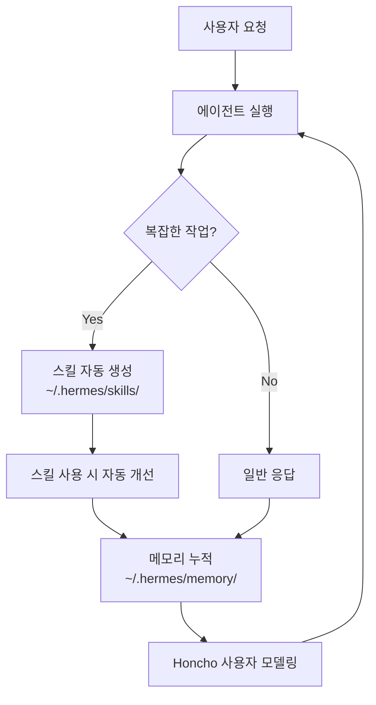
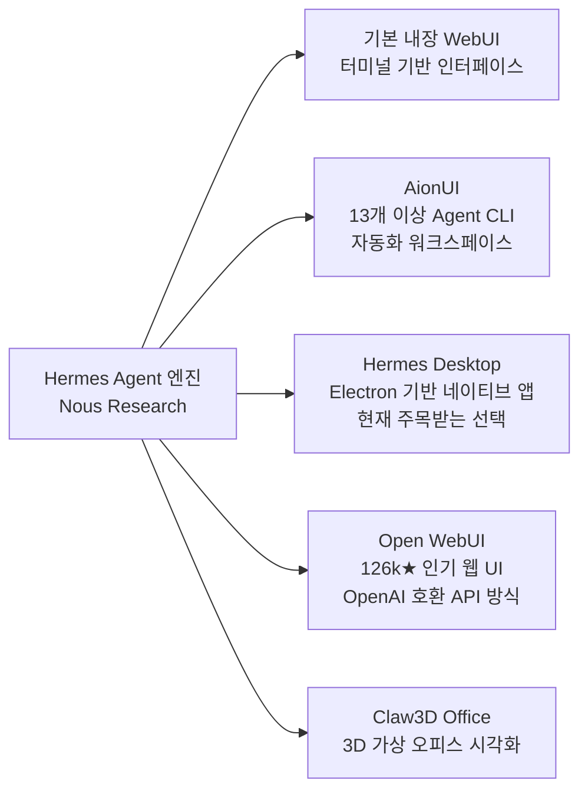
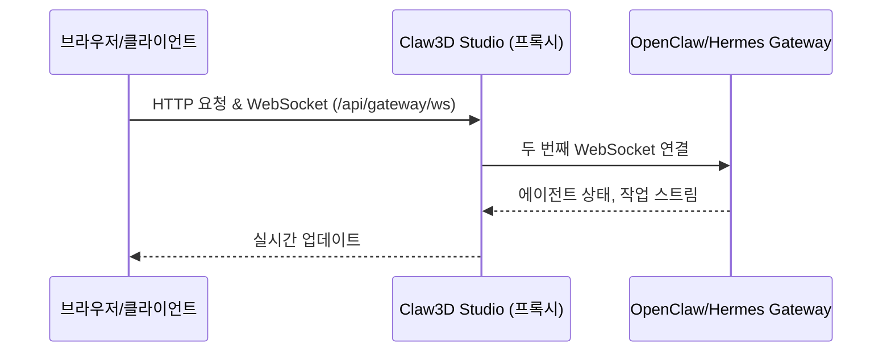
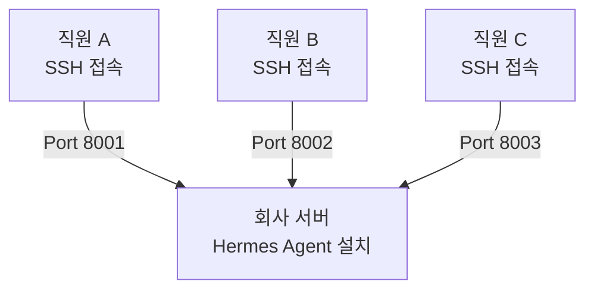
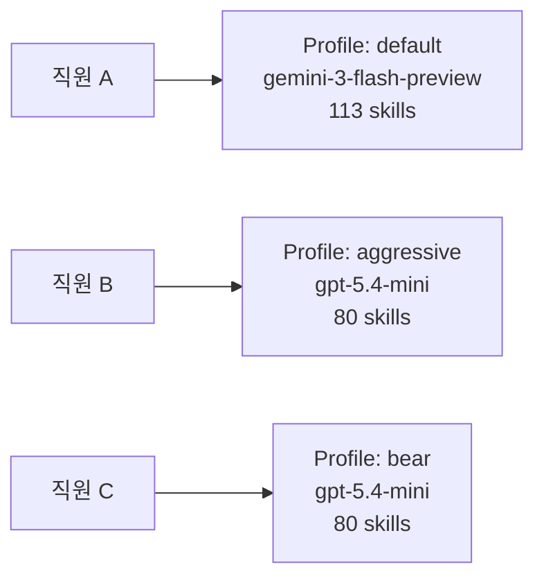
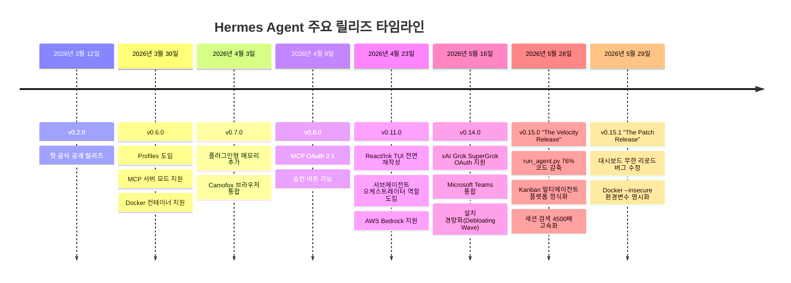

---

## 목차

1. [Hermes Agent란 무엇인가](#1-hermes-agent란-무엇인가)
2. [핵심 철학: "에이전트가 자란다"](#2-핵심-철학-에이전트가-자란다)
3. [자기학습 루프의 구조](#3-자기학습-루프의-구조)
4. [Profiles: 격리된 에이전트 작업공간](#4-profiles-격리된-에이전트-작업공간)
5. [UI 생태계: 어떤 화면으로 접근할까](#5-ui-생태계-어떤-화면으로-접근할까)
6. [Claw3D Office: AI 에이전트의 3D 사무실](#6-claw3d-office-ai-에이전트의-3d-사무실)
7. [가상 오피스 시나리오: 3인 이상 사무실 활용법](#7-가상-오피스-시나리오-3인-이상-사무실-활용법)
8. [Gateway: 모든 메시징 플랫폼을 하나로](#8-gateway-모든-메시징-플랫폼을-하나로)
9. [버전 안정성 문제와 v0.15.0 릴리즈](#9-버전-안정성-문제와-v0150-릴리즈)
10. [픽셀아트 가상 회사: AI 팀 구조의 시각화](#10-픽셀아트-가상-회사-ai-팀-구조의-시각화)
11. [정리 및 전망](#11-정리-및-전망)

---

## 1. Hermes Agent란 무엇인가

Hermes Agent는 **Nous Research**가 개발한 오픈소스 자율 AI 에이전트로, MIT 라이선스 하에 2026년 3월 공개되었다. 출시 3개월 만에 GitHub 스타 수가 **14만 개를 돌파**했고, 2026년 5월 기준 OpenRouter 플랫폼에서 전 세계에서 가장 많이 사용되는 에이전트로 집계됐다.

보통 사람들이 생각하는 AI 도구와 Hermes의 차이를 한 문장으로 정리하면 이렇다.

> **챗봇은 매번 새로 태어나지만, Hermes는 매번 성장한다.**

챗GPT나 Claude 같은 일반 챗봇은 대화가 끝나면 맥락을 잊는다. 반면 Hermes는 서버나 개인 컴퓨터 위에 **상주(常駐)하는 프로세스**로 실행되며, 대화가 끝나도 메모리와 기술(스킬)을 그대로 축적한다. 즉, 오늘 가르쳐준 내용을 내일도 기억하고, 복잡한 작업을 처리한 뒤에는 그 방법을 스스로 문서화해 다음에 같은 일이 생기면 더 빠르고 정확하게 처리한다.

Hermes는 Linux, macOS, WSL2(Windows 하위 시스템)에서 실행되며, 설치는 단 한 줄의 `curl` 명령어로 완료된다. Docker, SSH, Daytona, Modal 등 다양한 실행 환경도 지원한다.

---

## 2. 핵심 철학: "에이전트가 자란다"

Hermes를 단순히 "도구"라고 부르기 어려운 이유는 그것이 시간과 함께 변화하기 때문이다.

일반적인 소프트웨어 도구는 기능이 고정되어 있다. 기능이 추가되려면 개발자가 업데이트를 배포해야 한다. 반면 Hermes는 사용자와 상호작용하는 과정에서 **스스로 능력을 확장**한다. 복잡한 문제를 해결했을 때, 그 풀이 과정을 "스킬 문서"로 자동 작성하여 저장한다. 다음에 비슷한 문제가 오면 이 스킬을 참조해 더 효율적으로 대응한다.

이것이 Hermes가 강조하는 **"닫힌 학습 루프(Closed Learning Loop)"** 의 핵심이다. 어떤 AI 회사의 클라우드 서버가 아닌, 사용자 자신의 인프라 위에서 지식이 쌓인다는 점도 중요하다. 모든 데이터는 로컬에 머문다. 텔레메트리도 없고, 추적도 없다.

---

## 3. 자기학습 루프의 구조

Hermes의 학습 메커니즘은 네 가지 계층으로 구성된다.

**① 메모리(Memory)**
대화 이력, 사용자 프로필, 에이전트 노트가 `~/.hermes/` 경로 아래 마크다운 파일 형태로 저장된다. 직접 편집도 가능하다. FTS5(전문 검색 엔진)와 LLM 요약 기능이 결합되어 세션을 넘나드는 맥락 회수가 가능하며, v0.15.0에서는 세션 검색 속도가 이전 버전 대비 **4,500배** 빨라졌다.

**② 스킬(Skills)**
`~/.hermes/skills/` 디렉토리에 저장되는 절차 지식 문서다. 각 스킬은 `SKILL.md` 파일과 선택적 참조 자료로 구성된다. 에이전트가 복잡한 작업 후 자동으로 작성하며, 사용자가 직접 작성하거나 `agentskills.io` 오픈 표준을 통해 커뮤니티와 공유하는 것도 가능하다. v0.15.0에서는 한 번의 슬래시 명령으로 스킬 묶음 전체를 불러오는 "스킬 번들" 기능이 추가됐다.

토큰 효율성을 위해 스킬 로딩은 3단계 점진적 방식으로 작동한다.
- **Level 0**: 에이전트가 스킬 이름과 설명 목록만 확인 (약 3,000 토큰)
- **Level 1**: 특정 스킬의 전체 내용을 필요할 때 로딩
- **Level 2**: 스킬 내 특정 참조 파일만 선택적으로 로딩

**③ Honcho 사용자 모델링**
단순히 대화를 기억하는 것을 넘어, "이 사람은 어떤 방식으로 일하는가"에 대한 모델을 구축한다. 사용하는 툴, 선호하는 응답 스타일, 자주 다루는 프로젝트 등이 복합적으로 학습된다.

**④ 자기 개선(Self-Improvement)**
스킬은 생성 이후에도 고정되지 않는다. 에이전트가 해당 스킬을 실제로 사용하면서 더 나은 방식을 발견하면 스킬 자체를 업데이트한다.

---

## 4. Profiles: 격리된 에이전트 작업공간

위에서 언급한 두 번째 첨부물은 Hermes Desktop의 **Profiles 화면**을 보여준다. 이 화면에서 가장 중요한 점은 화면 상단의 설명 문구다.

> *"Each profile is an isolated Hermes workspace with its own config, memory, and skills"*
> (각 프로필은 설정, 메모리, 스킬이 독립적으로 분리된 Hermes 작업공간입니다)

즉, 프로필은 단순한 "계정 전환" 수준이 아니다. 프로필마다 완전히 다른 에이전트가 살아 움직이는 것과 같다. 각 프로필은 서로 다른 LLM 제공자와 모델을 사용할 수 있고, 보유한 스킬 수도 다르며, 기억하는 내용도 완전히 분리된다.

화면에서 확인되는 프로필 목록은 다음과 같다.

| 프로필 이름 | 제공자 | 모델 | 스킬 수 | Gateway |
|---|---|---|---|---|
| default (활성) | Openrouter | gemini-3-flash-preview | 113개 | Off |
| aggressive | Openai-codex | gpt-5.4-mini | 80개 | Off |
| bear | Openai-codex | gpt-5.4-mini | 80개 | Off |
| buddy | Openrouter | gemini-3-flash-preview | 113개 | Off |
| bull | Openai-codex | gpt-5.4-mini | 80개 | Off |
| collector | Openai-codex | gpt-5.4-mini | 80개 | Off |

`default` 프로필이 현재 활성 상태이며, Openrouter를 통해 `gemini-3-flash-preview` 모델을 사용하고 있다. 스킬 수가 113개로 나머지보다 월등히 많은 것을 확인할 수 있는데, 이는 해당 프로필이 더 오랫동안 학습을 통해 스킬을 축적해왔음을 의미한다. 

오른쪽 상단의 **"+ New Agent"** 버튼으로 새 프로필을 생성할 수 있으며, 각 프로필 카드의 **"Chat"** 버튼으로 해당 프로필의 에이전트와 바로 대화를 시작할 수 있다.

한 가지 현재 한계점으로 지적된 부분이 있다. Threads 게시글에서 한 사용자가 언급했듯이, Hermes 내부에서 만든 프로필은 아직 3D Office 환경(Claw3D)에서 에이전트로 등록되지 않는 문제가 있다. 다만 Profiles 화면에서는 Hermes에서 등록한 에이전트들이 표시되는 것은 확인됐다.

---

## 5. UI 생태계: 어떤 화면으로 접근할까

Hermes 자체는 백엔드 에이전트 엔진이며, 사용자가 이와 상호작용하는 방법은 여러 가지다. Threads 게시글에서 언급된 것처럼 기본 내장 WebUI, AionUI, Hermes Desktop 등 다양한 선택지가 있다.

**기본 내장 WebUI**: Hermes Agent 공식 배포에 포함된 웹 인터페이스로, 별도 설치 없이 사용 가능하다. 그러나 사용성이나 기능면에서 서드파티 대안들보다 기능이 제한적이라는 평가가 있다.

**AionUI**: 13개 이상의 AI 에이전트 CLI를 하나의 창에서 관리할 수 있는 자동화 워크스페이스다. 사무용 문서 자동 생성 엔진과 무인 크론 잡(Cron Job) 관리 기능이 내장되어 있다. 그러나 여러 에이전트 CLI를 하나로 통합하다 보니 설정 복잡도가 높다는 평가도 있다.

**Hermes Desktop**: 현재 Threads 커뮤니티에서 가장 많은 관심을 받고 있는 선택지다. Electron 기반의 네이티브 앱으로 macOS, Windows, Linux를 모두 지원한다. Profiles 관리, Claw3D Office 통합, Gateway 설정, 스킬 관리, 로그 뷰어, 자동 업데이트 기능이 하나의 앱에 담겨 있다. 글 작성 시점(2026년 5월)을 기준으로 활발하게 개발 중이다.

**Open WebUI**: 12만 6천 개의 스타를 보유한 인기 자체 호스팅 채팅 인터페이스다. Hermes Agent의 OpenAI 호환 API 서버에 연결해 사용할 수 있으며, 이 경우 Hermes의 모든 도구(터미널, 파일 조작, 웹 검색, 메모리, 스킬)가 Open WebUI를 통해 작동한다.

---

## 6. Claw3D Office: AI 에이전트의 3D 사무실

첫 번째 첨부물은 **Hermes Desktop 내의 Claw3D Office** 화면이다. 화면 상단에는 "LORP HEADQUARTERS"라는 사무실 이름이 표시되어 있고, 중앙에는 등각 투영(isometric) 방식의 3D 오피스 레이아웃이 펼쳐진다.

Claw3D는 AI 에이전트들이 실제로 **"일하는 모습"을 시각화**하기 위해 설계된 3D 가상 오피스 레이어다. 기존에 AI 자동화를 모니터링하는 방식이 로그 파일이나 대시보드 숫자였다면, Claw3D는 이를 직관적인 3D 공간으로 전환한다.

화면 왼쪽의 사이드바에는 다음과 같은 메뉴가 있다.

- **Chat**: 에이전트와 직접 대화
- **Office**: 3D 가상 오피스 뷰
- **Notebook**: 메모 및 기록
- **Schedule**: 예약된 작업 관리
- **Database**: 저장된 데이터 조회
- **Settings**: 에이전트 설정

3D 화면 안에서는 "Lobby", "Hermes Floor" 등 공간이 구분되어 있으며, 에이전트들이 각자의 데스크에 배치된다. 에이전트가 작업을 수행할 때는 실시간으로 움직임과 활동 신호가 표시된다.

Claw3D가 지원하는 기능은 다음과 같다.

- **실시간 에이전트 모니터링**: 에이전트가 현재 어떤 작업을 하고 있는지 3D 공간에서 확인
- **스탠드업(Standup) 진행**: GitHub, Jira와 연동된 에이전트들과 가상 스탠드업 회의 진행
- **PR 리뷰**: 오피스 안에서 Pull Request 검토
- **QA 파이프라인 모니터링**: 품질 관리 파이프라인과 로그를 오피스 환경에서 감시
- **에이전트 훈련**: "Gym" 공간에서 에이전트에게 새로운 스킬 훈련
- **세션 초기화**: "Janitor" 시스템으로 컨텍스트 정리

기술적으로 Claw3D는 다음과 같은 구조로 작동한다.

브라우저가 Gateway에 직접 연결하는 것이 아니라 Studio가 중간에서 프록시 역할을 한다. 이 구조 덕분에 CORS(교차 출처 리소스 공유) 문제가 발생하지 않으며, Gateway 연결 정보가 브라우저에 노출되지 않는다.

---

## 7. 가상 오피스 시나리오: 3인 이상 사무실 활용법

Threads 게시글에서 핵심 아이디어로 제안된 **"3인 이상 사무실에서 Hermes를 활용하는 시나리오"** 는 매우 실용적이면서도 앞으로의 업무 방식 변화를 예고하는 내용이다. 다음과 같은 4단계 구조로 설명된다.

### 7-1. 회사 서버에 Hermes 설치, SSH로 원격 접근

Hermes는 SSH 터미널 백엔드를 기본 지원하므로, 각 직원이 자신의 컴퓨터에서 회사 서버에 SSH 방식으로 접속하여 에이전트를 사용할 수 있다. 이때 각 직원은 **서로 다른 포트 번호**로 구분된 독립된 에이전트 환경을 갖는다. 예를 들어 직원 A는 포트 8001, 직원 B는 포트 8002, 직원 C는 포트 8003을 사용하는 방식이다.

이 구조의 장점은 다음과 같다.

- 모든 에이전트 데이터(메모리, 스킬)가 회사 서버에 중앙 집중되어 관리된다
- 각 직원은 노트북이나 PC에 Hermes를 별도로 설치할 필요 없이 접근 가능하다
- 회사 보안 정책에 따라 서버 접근을 통제할 수 있다

### 7-2. Profile과 Port가 1:1로 매칭 — 직원마다 다른 Hermes 환경

Profiles 화면에서 각 프로필마다 **Gateway를 시작하고 포트 번호를 열어놓으면**, 프로필과 사람이 1:1로 매칭되는 구조가 완성된다. 즉, 직원 A는 "aggressive" 프로필을 사용하고, 직원 B는 "bear" 프로필을 사용하는 방식이다. 각 직원은 서로 완전히 다른 메모리, 스킬, 모델 설정을 가진 Hermes Desktop 환경을 갖게 된다.

### 7-3. 서브에이전트(SubAgent)로 팀 구성

각 직원이 담당하는 에이전트 아래에 **서브에이전트**를 두어 팀을 꾸릴 수 있다. 예를 들어 마케팅 담당 직원은 자신의 리더 에이전트 아래에 "콘텐츠 작성 담당 에이전트", "데이터 분석 담당 에이전트", "SNS 모니터링 담당 에이전트"를 서브에이전트로 배치할 수 있다.

Threads 게시글에서 제안된 표현을 빌리면:

> **"직원 한 명 = 마케팅 팀장 + 리더 에이전트 with 다른 에이전트들"**

이는 단순한 비유가 아니다. Hermes v0.11.0(2026년 4월 23일 릴리즈)부터 서브에이전트가 명시적인 오케스트레이터 역할을 가질 수 있게 됐으며, 서브에이전트들은 파일 시스템을 공유하면서도 서로 충돌 없이 작업할 수 있는 파일 조정 레이어가 도입됐다.

### 7-4. Slack/Discord 채널에서 팀 회의

각 직원의 에이전트를 Slack 또는 Discord 채널에 초대하면, **사람과 AI 에이전트가 함께 참여하는 팀 회의**를 채팅 형식으로 진행할 수 있다. Hermes의 Gateway는 Telegram, Discord, Slack, WhatsApp, Signal, Matrix, Email, SMS 등 15개 이상의 메시징 플랫폼을 지원하므로, 기존 업무 채팅 도구를 바꾸지 않고도 에이전트를 회의에 참여시킬 수 있다.

---

## 8. Gateway: 모든 메시징 플랫폼을 하나로

Gateway는 Hermes Agent가 다양한 메시징 플랫폼과 연결되는 통합 인터페이스다. 하나의 Gateway 프로세스로 다음 플랫폼들을 동시에 커버한다.

Telegram, Discord, Slack, WhatsApp, Signal, Matrix, Email, SMS, iMessage(BlueBubbles), Feishu/Lark, WeCom, Home Assistant, ntfy (v0.15.0에서 새로 추가된 23번째 플랫폼) 등이 지원된다.

Profiles 화면에서 각 프로필의 "Gateway off" 상태를 확인할 수 있는데, Gateway를 켜면 해당 프로필의 에이전트가 설정된 메시징 플랫폼에서 수신 대기 상태가 된다. 예를 들어 "default" 프로필의 Gateway를 켜고 Telegram과 연결하면, Telegram에서 메시지를 보내는 것만으로 서버의 Hermes 에이전트와 대화할 수 있다.

에이전트는 온라인 상태가 아니어도 **크론 스케줄러**를 통해 정해진 시간에 작업을 실행하고 결과를 메시징 플랫폼으로 전달한다. 예를 들어 "매일 아침 9시에 뉴스 요약을 Telegram으로 보내줘"와 같은 설정이 가능하다.

---

## 9. 버전 안정성 문제와 v0.15.0 릴리즈

두 번째 Threads 게시글의 작성자는 Hermes의 빠른 업데이트 속도에 따른 **안정성 문제**를 지적했다. 업스트림(최신 개발 버전)을 사용하다가 버그로 인해 제대로 작동하지 않는 경험을 반복하면서, 공식 릴리즈 버전 위에 개인 수정 사항을 올려 사용하는 방식을 택했다고 밝혔다.

게시글을 작성하던 시점에서는 v0.15.0이 나왔어야 할 주말이 지났음에도 소식이 없었고, GitHub 저장소에 열려있는 PR과 이슈가 각각 수천 개에 달하는 상황이 버전 지연의 원인이라고 분석했다.

그러나 이 상황은 게시글 작성 이후 곧 해소되었다. 실제 릴리즈 기록은 다음과 같다.

**v0.15.0 "The Velocity Release"** (2026년 5월 28일)는 단순한 기능 추가가 아닌 대규모 **구조 개편**을 포함했다. v0.14.0까지 16,083줄이었던 `run_agent.py` 파일이 3,821줄로 무려 76% 감축되었으며, 14개의 응집력 있는 모듈로 분리됐다. 이는 장기적인 유지보수와 안정성 향상을 위한 "The Big Refactor"의 결과물이다.

v0.15.0 릴리즈에 포함된 기타 주요 내용은 다음과 같다.

- **Kanban 멀티에이전트 플랫폼**: 오케스트레이터 자동 분해, 스웜(Swarm) 토폴로지, 예약 작업, 작업별 모델 오버라이드 지원이 104개의 PR에 걸쳐 정식 플랫폼으로 완성됐다.
- **보안 강화**: Bitwarden Secrets Manager가 도입되어 여러 API 키를 하나의 부트스트랩 토큰으로 관리할 수 있게 됐다. "Brainworm-class" 프롬프트웨어 공격 방어 기능도 추가됐다.
- **이미지 생성 확장**: Krea 2 (Medium + Large), FAL 플러그인 포팅으로 이미지 생성 제공자가 늘었다.
- **xAI 심층 통합**: Grok 모델 관련 웹 검색 플러그인, OAuth 프록시, 자연스러운 TTS 음성 태그 등이 추가됐다.
- **19,932개 스킬 카탈로그**: v0.15.1 패치에서 전체 `skills.sh` 카탈로그(19,932개 항목)가 포함됐다.

v0.15.1(2026년 5월 29일)은 v0.15.0 당일에 배포된 핫픽스로, Docker 및 로컬 루프백 모드에서 대시보드가 무한 리로드되는 심각한 버그를 수정했다. 릴리즈 주기가 짧고 PR/이슈 숫자가 방대한 만큼, 메이저 릴리즈 직후 패치가 빠르게 따라오는 패턴은 앞으로도 이어질 가능성이 높다.

---

## 10. 픽셀아트 가상 회사: AI 팀 구조의 시각화

세 번째 첨부물은 픽셀아트 스타일로 표현된 **가상 회사 오피스**로, 네 개의 팀이 각각 독립된 공간에 배치되어 있다. 이는 AI 에이전트들이 팀 구조를 이루며 협업하는 모습을 게임적으로 시각화한 사례다.

화면에 등장하는 팀 구성은 다음과 같다.

**企画チーム (기획팀)**
- Clio (시니어 직급)
- Sage (리더 직급, CEO 배지 보유)
— 이 팀의 Sage가 전체 조직의 CEO를 겸하는 구조임을 배지가 나타낸다.

**開発チーム (개발팀)**
- Nova (시니어), Bolt (시니어), Aria (리더), JOBS (리더)
— 가장 인원이 많은 팀으로, 두 명의 리더가 공존하는 구조다.

**品質管理チーム (품질관리팀)**
- DORO (시니어), Lint (시니어, 현재 휴식 중), Hawk (리더)
— Lint가 "休憩室(휴게실)" 상태로 표시되어 있어, 에이전트의 현재 상태도 실시간으로 반영됨을 알 수 있다.

**インフラセキュリティチーム (인프라보안팀)**
- Pipe (시니어), Vault (리더)

이 픽셀아트 시각화는 앞서 설명한 Hermes의 **서브에이전트 팀 구성 시나리오**를 게임적 UI로 표현한 것이라 볼 수 있다. 에이전트마다 이름, 직급(시니어/리더), 현재 상태(근무 중/휴식 중)가 표시되어 있어, AI 에이전트 팀을 실제 인사 조직처럼 시각적으로 관리하는 개념을 보여준다.

Hermes의 Claw3D가 3D 등각 투영 방식의 사무실이라면, 이 픽셀아트 방식은 레트로 감성의 게임 스타일 UI로 같은 개념을 표현한 것이다. AI 에이전트를 단순한 소프트웨어 도구가 아닌, 역할과 직급을 가진 "팀원"으로 바라보는 시각이 반영되어 있다.

---

## 11. 정리 및 전망

지금까지 살펴본 내용을 종합하면, Hermes Agent Desktop은 단순한 AI 챗봇 인터페이스가 아닌 **지속적으로 성장하는 에이전트 플랫폼**이다.

개인 사용자에게는 매 대화마다 맥락을 다시 설명할 필요 없이, 자신의 작업 방식과 환경을 학습한 에이전트가 점점 더 효율적으로 일을 처리해주는 경험을 제공한다.

조직 환경에서는 회사 서버에 Hermes를 설치하고, 각 직원에게 독립된 Profile을 부여하며, Profile 아래에 서브에이전트 팀을 꾸리는 방식으로 **AI 에이전트 조직 구조**를 구성할 수 있다. Slack이나 Discord 같은 기존 업무 채널에 에이전트를 초대해 사람과 AI가 함께 회의하는 풍경도 이미 기술적으로 가능한 수준에 이르렀다.

물론 v0.15.0 릴리즈 당일 핫픽스가 배포될 만큼 아직 안정성 측면에서 완성도를 높여야 하는 부분이 있다. 그러나 3개월 만에 GitHub 스타 14만 개를 돌파하고, 300명 이상의 커뮤니티 기여자가 매주 수백 개의 PR을 쏟아내는 개발 속도를 감안하면, 지금 이 시점이 Hermes 생태계가 급격히 성숙해지는 임계점에 가까워진 순간임은 분명하다.

---

> 작성일: 2026년 5월 29일
> 
> 본 문서는 Threads([@gugu.bro](https://www.threads.com/@gugu.bro/post/DY4ixfDE2IM), [@black.d.raccoon](https://www.threads.com/@black.d.raccoon/post/DY4rp2nE1Lc)) 게시글, NousResearch/hermes-agent GitHub 릴리즈 노트, 공식 문서(hermes-agent.nousresearch.com), NVIDIA 블로그 등 공개 자료를 바탕으로 작성되었습니다.
