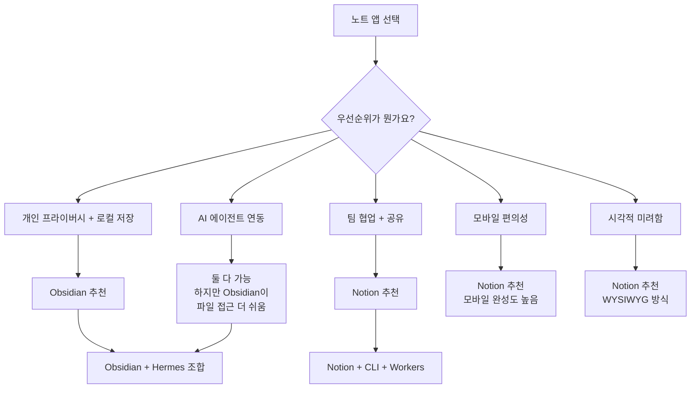
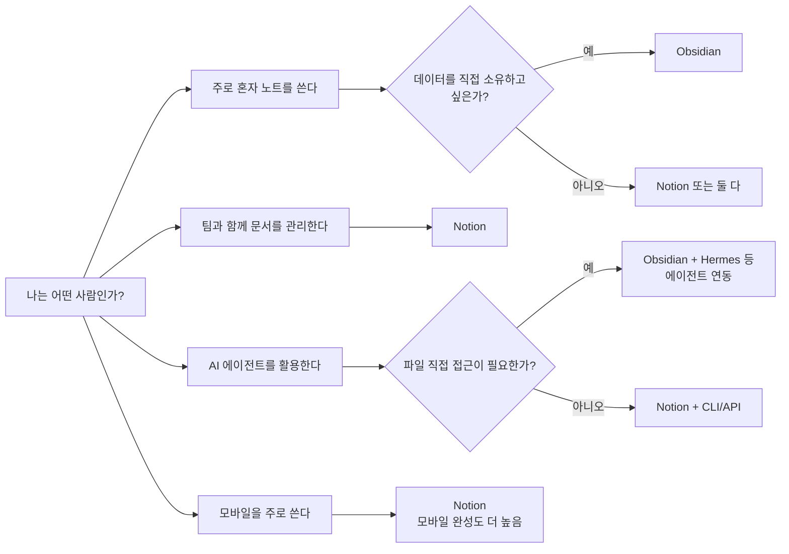

> Threads [@k_sanbal](https://www.threads.com/@k_sanbal/post/DY2JdmziVo5) 분석 — 2026년 5월 기준 최신 정보 반영

---

## 1. 스레드 개요

이 스레드는 Threads 사용자 **k_sanbal**이 올린 짧은 게시물에서 시작되었습니다. 핵심 메시지는 간단합니다. "**Obsidian에서 Notion으로 다시 돌아갑니다.**" 하지만 이 짧은 선언 뒤에는 AI 에이전트, 지식 관리 도구, 그리고 개발자 생태계의 최신 변화들이 촘촘하게 연결되어 있습니다. 댓글들도 각자의 사용 패턴과 관점을 솔직하게 공유하면서, 노트 앱 선택이 얼마나 개인적이고 맥락 의존적인 문제인지를 잘 보여줍니다.

---

## 2. 등장 도구들 이해하기

### 2-1. Obsidian이란?

Obsidian은 2020년 3월에 처음 공개된 개인용 지식 관리 앱입니다. 모든 노트가 **마크다운(.md) 파일** 형태로 사용자의 로컬 기기에 직접 저장되며, 클라우드 서버에 의존하지 않습니다. 이른바 **"로컬 퍼스트(local-first)"** 철학을 가진 도구입니다.

가장 큰 특징은 노트 간의 연결을 시각적으로 표현하는 **지식 그래프(Knowledge Graph)** 기능입니다. 노트에 `[[다른 노트 이름]]` 형식으로 링크를 걸면, 전체 노트들이 서로 어떻게 연결되어 있는지를 그래프로 볼 수 있습니다. 이는 마치 자신의 생각이 어떻게 얽혀 있는지를 지도로 그리는 것과 같습니다.

2025년 기준으로 Obsidian은 **월간 활성 사용자 150만 명**을 돌파했으며, 전년 대비 22% 성장했습니다. 놀라운 점은 이 성장이 벤처캐피털 투자 없이, 즉 외부 투자금 없이 커뮤니티의 자발적인 유료 플러그인 구매만으로 이루어졌다는 것입니다. Discord 커뮤니티에는 11만 명 이상이 활동하고 있으며, 커뮤니티가 자체적으로 만든 플러그인만 2,000개가 넘습니다.

**Obsidian의 주요 특징을 정리하면 다음과 같습니다:**

- 모든 데이터가 마크다운 파일로 로컬에 저장됨 → 앱이 사라져도 내 노트는 사라지지 않음
- 인터넷 없이도 완전히 동작하는 오프라인 모드
- 2,000개 이상의 커뮤니티 플러그인으로 무한에 가까운 확장 가능성
- 지식 그래프를 통한 노트 간 관계 시각화
- 개인 사용자에게는 기본 기능 100% 무료
- 유료 부가 서비스: Obsidian Sync(연 $48, 기기 간 동기화), Obsidian Publish(연 $96, 웹 퍼블리싱)
- CLI(명령줄 인터페이스)도 별도로 제공됨

**단점으로 자주 언급되는 것들:**

- 마크다운 형식 특성상 **모바일에서 읽기·편집이 불편**함 (태그, 링크 문법이 날것으로 보임)
- 팀 협업 기능이 기본적으로 매우 제한적임
- 플러그인이 많아질수록 **앱 시작 시 인덱싱(파일 목록 재구축) 시간이 길어짐**
- 특히 대용량 볼트(vault)를 모바일에서 열 때 1분 이상 걸리는 문제가 꾸준히 보고되고 있음

### 2-2. Notion이란?

Notion은 2013년에 시작된 통합 워크스페이스 플랫폼입니다. 노트 작성, 데이터베이스, 캘린더, 프로젝트 관리, 위키, 태스크 관리 등을 하나의 앱에서 처리할 수 있다는 것이 가장 큰 강점입니다. 모든 데이터는 Notion의 클라우드 서버에 저장되며, 기기 간 실시간 동기화가 자동으로 이루어집니다.

모바일 앱의 완성도가 높아 스마트폰에서도 페이지 생성, 데이터베이스 편집, AI 기능 사용 등이 자연스럽게 가능합니다. UI가 시각적으로 깔끔하고 세련되어 있어 비개발자도 쉽게 접근할 수 있습니다.

**2025~2026년 Notion의 주요 업데이트:**

Notion은 2025년부터 AI 기능을 본격적으로 강화했습니다. 2025년 9월에는 **Notion 3.0 "Agents"** 를 출시하면서 AI가 Notion 안에서 직접 작업을 수행할 수 있는 에이전트 워크플로우를 도입했습니다. GPT-4, Claude(Anthropic), Gemini 등 여러 AI 모델 중 원하는 것을 선택해 사용할 수 있습니다.

그리고 스레드에서 언급된 **Notion CLI**는 2026년 5월에 공식 출시된 완전히 새로운 기능입니다.

### 2-3. Notion CLI란? (2026년 5월 신규 출시)

2026년 5월 13일, Notion은 **Notion Developer Platform**을 공식 발표하면서 CLI(Command-Line Interface, 명령줄 도구)를 함께 선보였습니다. 이 CLI는 개발자와 AI 코딩 에이전트를 주요 대상으로 만들어졌으며, 터미널에서 Notion을 프로그래밍 방식으로 조작할 수 있게 해 줍니다.

CLI를 통해 할 수 있는 것들:
- 터미널에서 Notion 워크스페이스에 로그인
- 페이지 읽기, 생성, 수정 등의 작업 수행
- **Workers(워커스)** 코드를 작성하고 Notion 인프라에 배포
- 외부 서비스와의 데이터 동기화, 웹훅(webhook) 트리거 설정 자동화

특히 **Workers**는 매우 주목할 만한 기능입니다. 직접 서버를 운영하지 않아도 Notion의 호스팅 환경에서 커스텀 코드를 실행할 수 있으며, AI 코딩 에이전트와 함께 코드를 작성하고 CLI로 배포하면 안전한 샌드박스 환경에서 실행됩니다. Workers는 베타 기간 동안 무료이며, 2026년 8월 11일부터는 Notion 크레딧을 소모하게 됩니다.

이처럼 Notion은 단순한 노트 앱에서 **개발자 플랫폼**으로의 전환을 선언한 셈입니다.

### 2-4. Hermes Agent란?

게시글의 핵심 맥락 중 하나는 "**Hermes를 쓰면서 Obsidian을 자산화 프로그램으로 사용했다**"는 부분입니다. 여기서 Hermes는 **오픈소스 AI 에이전트 프레임워크**입니다.

Hermes는 Claude 같은 AI 모델에게 자체적인 컴퓨터, 도구 세트, 그리고 사용자 선호에 대한 기억(메모리)을 부여하는 경량 프레임워크입니다. 쉽게 말하면, AI에게 내 Mac을 빌려주고 Telegram 같은 메신저로 지시를 내리면 AI가 직접 파일을 정리하거나, 일정을 관리하거나, 코드를 실행하는 등의 작업을 수행하게 만드는 도구입니다.

**Hermes의 주요 특징:**

- Mac, Linux, WSL(Windows) 등에서 단 하나의 명령어로 설치 가능
- 40개 이상의 빌트인 도구 제공 (Apple Notes, Reminders, iMessage, Find My 등)
- SQLite에 성공적인 작업 이력을 저장하는 **내장 메모리 시스템**
- OpenRouter를 활용해 토큰 비용을 최대 90% 절감 가능
- Docker 컨테이너 환경에서 격리 실행 지원
- Obsidian 전용 플러그인 **Hermes Console**도 별도 제공됨

k_sanbal이 Hermes + Obsidian 조합을 사용한 방식은 다음과 같았을 것으로 추정됩니다. Hermes 에이전트가 Obsidian 볼트(vault, 노트 저장 폴더)에 직접 접근해 마크다운 파일을 자동으로 생성·정리·분류하는 일종의 **개인 지식 자산 관리 시스템**을 구축한 것입니다. 예를 들어 "이번 주 중요한 일들 정리해줘"라고 Telegram으로 지시하면, 에이전트가 알아서 Obsidian 볼트 안에 구조화된 마크다운 파일을 만들어주는 방식입니다.

---

## 3. 스레드 본문 분석

### 원글 — k_sanbal

> **"Obsidian에서 Notion으로 다시 돌아갑니다...!!"**

k_sanbal이 Hermes + Obsidian 조합을 버리고 Notion으로 복귀하는 이유는 두 가지로 명확하게 정리됩니다.

**첫 번째 이유: 모바일 인덱싱 문제**

Obsidian은 앱을 열 때 볼트 안의 모든 파일을 스캔하고 인덱스를 재구성하는 과정을 거칩니다. 데스크탑에서는 이 과정이 비교적 빠르게 처리되지만, 모바일(특히 Android)에서는 대용량 볼트의 경우 인덱싱에 수 분이 걸리는 것이 알려진 문제입니다. Obsidian 공식 포럼에는 "모바일에서 앱을 열 때마다 인덱싱이 새로 시작된다", "Android 1.7.4 업데이트 이후 로딩 시간이 1분 이상으로 늘어났다"는 불만 글들이 꾸준히 올라오고 있습니다. Hermes 에이전트가 지속적으로 파일을 생성하고 수정하는 방식으로 사용했다면, 볼트 안의 파일 수와 복잡도가 늘어나면서 이 문제가 더 심각하게 체감되었을 것입니다.

**두 번째 이유: 마크다운의 가독성 문제**

Obsidian은 마크다운 파일을 기반으로 하기 때문에, 글을 편집 모드로 볼 때는 `**굵게**`, `[[링크]]`, `#태그` 같은 마크다운 문법이 그대로 노출됩니다. 물론 미리보기(Preview) 모드로 전환하면 렌더링된 깔끔한 형태로 볼 수 있지만, 모바일에서 편집과 읽기를 자주 전환하는 것은 번거롭습니다. 반면 Notion은 처음부터 WYSIWYG(What You See Is What You Get) 방식으로 설계되어 있어, 편집 중에도 항상 최종 결과물처럼 보입니다.

**왜 다시 Notion으로?**

- Notion CLI의 등장으로 개발자/자동화 관점에서도 Notion을 프로그래밍적으로 제어할 수 있게 됨
- Notion의 전반적인 UI가 Obsidian보다 시각적으로 더 아름답다는 개인적 선호
- Notion 모바일 앱도 완성도가 높아 실용적으로 사용 가능

물론 k_sanbal 본인도 "Notion도 모바일은 불편하지만"이라고 솔직히 인정합니다. 완벽한 도구는 없으며, 결국 자신에게 더 익숙하고 덜 불편한 쪽을 선택한 것입니다.

---

## 4. 댓글 분석

### 댓글 1 — k12j34 vs k_sanbal (CLI 논쟁)

> k12j34: "옵시디언도 cli가 있지 않나요?"
>
> k_sanbal: "네 옵시디언도 있습니다! 그래서 옵시디언으로 먼저 시작했었는데, 저는 노션이 쓰기 더 익숙한 것 같아요"

이 짧은 대화는 중요한 사실을 짚어줍니다. **Obsidian도 CLI가 있다**는 것입니다. 실제로 GitHub에 Obsidian API를 활용한 CLI 도구들이 여럿 존재하며, Hermes Console 플러그인처럼 터미널과 Obsidian을 연동하는 방법도 있습니다. 즉 CLI의 유무가 결정적인 이유는 아니었고, **사용 습관과 친숙함**이 최종 결정의 핵심이었다는 것을 k_sanbal 스스로 인정합니다.

이것은 도구 선택에서 매우 중요한 진실을 담고 있습니다. 기능의 우열보다 **자신이 어떤 도구에 더 자연스럽게 몸이 반응하는가**가 장기적인 생산성을 결정합니다.

### 댓글 2 — woody_growup (반대 방향의 전환)

> "엇 나는 노션에서 옵시디언으로 갓는데! 나는 노션이 오히려 더 불편했던것같애ㅜㅜ 노션이 더 이쁘긴해..ㅋㅋ"

이 댓글은 도구 선택의 주관성을 아주 잘 보여줍니다. woody_growup은 정반대 방향으로 전환했습니다. 즉, **같은 두 도구를 두고 어떤 사람은 Notion이 편하고, 어떤 사람은 Obsidian이 편하다**는 것입니다.

woody_growup이 왜 Notion이 더 불편하다고 느꼈는지 본문에 전부 나오지는 않지만, 일반적으로 Obsidian 쪽을 선호하는 사람들이 드는 이유들은 다음과 같습니다:
- Notion의 데이터베이스 기능이 단순 노트 작성에는 과도하게 복잡함
- 인터넷 연결이 없으면 접근이 어려움
- 텍스트 편집 속도가 Obsidian보다 느리게 느껴짐 (특히 대형 페이지)
- 자신의 데이터가 외부 서버에 있다는 것에 대한 심리적 불편함

그럼에도 "노션이 더 이쁘긴 해"라는 말은 누구나 인정하는 사실입니다.

### 댓글 3 — 익명 사용자 (분리 사용 전략 + DIY 정신)

이 스레드에서 가장 실용적이고 흥미로운 관점이 담긴 댓글입니다.

> "노션 = 공유용 (남한테 공유 필요한 것만 옮겨서 사용)
> 옵시디언 = 개인용 LLM wiki
> 근데 저도 불편해서 시간날 때 제가 개인 프로그램 만들어서 쓰고 싶어요"

이 사용자는 두 도구를 **목적에 따라 명확히 분리**해서 사용하는 전략을 취합니다. 이 방식은 2026년 현재 많은 개발자들 사이에서 인기 있는 접근법입니다.

**Notion = 공유용**: 협업자, 클라이언트, 팀원 등 외부 사람에게 공유해야 하는 내용들을 Notion에 정리합니다. Notion은 링크 하나로 누구에게나 페이지를 공유할 수 있고, 상대방이 Notion 계정이 없어도 읽을 수 있으며, 공동 편집도 실시간으로 가능합니다.

**Obsidian = 개인용 LLM wiki**: 특히 "LLM wiki"라는 표현이 인상적입니다. 이는 Obsidian을 단순한 노트 앱이 아니라 **LLM(대형 언어 모델, 즉 ChatGPT나 Claude 같은 AI) 에이전트가 참조하고 읽는 개인 지식 베이스**로 활용한다는 뜻입니다. 모든 노트가 마크다운 파일로 로컬에 있기 때문에, AI 에이전트가 해당 파일들을 직접 읽고, 쓰고, 검색하는 것이 기술적으로 매우 쉽습니다. Hermes 같은 에이전트 프레임워크나 Claude 같은 AI가 직접 파일 시스템에 접근하면 되기 때문입니다.

**"불편하면 직접 만든다"는 DIY 정신**: 이 사용자는 두 도구 모두 완전히 만족스럽지는 않다며, 직접 자신만의 프로그램을 만들겠다고 합니다. k_sanbal도 이에 "역시 요즘은 불편하면 직접 만들어쓰는거죠!!"라고 동의합니다.

이는 2025~2026년의 개발자 문화에서 두드러진 트렌드입니다. AI 코딩 도구(Claude Code, Cursor, GitHub Copilot 등)의 발전으로 비전문 개발자도 자신만의 도구를 만드는 데 드는 진입장벽이 크게 낮아졌습니다.

---

## 5. Obsidian vs Notion 핵심 비교 (2026년 기준)

### 데이터 저장 방식

| 항목 | Obsidian | Notion |
|------|----------|--------|
| 저장 위치 | 로컬 기기 (마크다운 파일) | Notion 클라우드 서버 |
| 오프라인 사용 | 완전 지원 | 제한적 |
| 데이터 소유권 | 사용자 완전 소유 | Notion 서버 의존 |
| 파일 형식 | .md (범용 텍스트) | 독점 포맷 (내보내기 필요) |
| AI 에이전트 직접 접근 | 매우 쉬움 (파일 시스템) | API 필요 |

### 모바일 경험

Obsidian 모바일은 대용량 볼트, 특히 플러그인이 많이 설치된 볼트를 열 때 인덱싱 지연이 발생하는 것이 커뮤니티에서 잘 알려진 문제입니다. Obsidian 공식 포럼에는 50,000개 이상의 노트를 가진 볼트를 Android에서 열 때 인덱싱에만 27분이 걸렸다는 보고도 있습니다. 플러그인을 60개 이상 설치한 경우에는 안전 모드(safe mode)로 열면 빠르게 완료되지만, 일반 모드에서는 현저히 느려집니다.

반면 Notion 모바일 앱은 비교적 잘 최적화되어 있으며, 스마트폰에서도 페이지 생성, 데이터베이스 편집, AI 기능 사용이 자연스럽게 가능합니다.

### AI 기능 철학의 차이

Obsidian은 근본적으로 **AI에 중립적인(anti-AI) 철학**을 가지고 있습니다. 마크다운 파일 자체에는 AI 기능이 없으며, AI를 활용하려면 커뮤니티 플러그인을 통한 우회 방법을 사용해야 합니다. 이는 사용자가 자신의 노트와 AI 사이의 통합 방식을 완전히 제어할 수 있다는 의미이기도 합니다.

반면 Notion은 2023년부터 AI를 적극적으로 통합했습니다. 2025년 9월 출시된 Notion 3.0은 아예 에이전트 중심으로 재설계되었으며, GPT-4, Claude, Gemini 중 원하는 모델을 선택해 사용할 수 있습니다.

### 가격 비교 (2026년 기준)

개인 사용자 기준으로 비교하면:

- **Obsidian**: 기본 기능 무료. Sync(기기 간 동기화) 연 $48, AI 기능은 커뮤니티 플러그인으로 무료 대체 가능.
- **Notion**: Plus 플랜 월 $8 + AI 기능 추가 시 월 $10 = 연 $216. AI 없이 쓰면 연 $96.

5인 팀 기준으로는 Notion Business 플랜이 연 $900, Obsidian Sync가 연 $300으로 Obsidian이 훨씬 저렴합니다.

---

## 6. 2026년 노트 앱 생태계의 트렌드

이 스레드는 단순한 앱 선호도 문제를 넘어서, 2026년 현재 지식 관리 도구 생태계의 몇 가지 중요한 흐름을 보여줍니다.

### 트렌드 1: AI 에이전트와 지식 베이스의 통합

Hermes + Obsidian 조합이 등장한 것에서 볼 수 있듯이, 단순히 사람이 노트를 쓰는 것에서 벗어나 **AI 에이전트가 지식 베이스를 관리하고 자동으로 업데이트**하는 방식으로 활용 형태가 진화하고 있습니다. Obsidian의 로컬 마크다운 파일은 이런 용도로 특히 적합합니다. AI가 파일 시스템에 직접 접근해 파일을 읽고 쓰는 것이 어떤 API보다 간단하기 때문입니다.

### 트렌드 2: CLI와 자동화의 민주화

Notion이 CLI를 출시한 것은 상징적입니다. 일반 사용자 중심의 GUI 앱이 개발자 친화적인 CLI를 추가한다는 것은, 그만큼 "프로그래밍 방식으로 도구를 제어하려는 사용자"가 늘어났다는 방증입니다. Obsidian도 이미 CLI를 갖추고 있으며, 두 도구 모두 자동화 파이프라인의 일부로 활용되는 사례가 늘고 있습니다.

### 트렌드 3: "불편하면 직접 만든다"는 문화

댓글에서 등장한 "직접 만들어서 쓰겠다"는 발언은 AI 코딩 도구의 발전으로 인해 형성된 새로운 DIY 문화를 반영합니다. Claude Code, Cursor 같은 AI 개발 도구들이 비전문 개발자도 자신만의 개인화된 생산성 도구를 만들 수 있도록 진입장벽을 낮추고 있습니다.

### 트렌드 4: 두 도구의 병행 사용

"Notion = 공유용, Obsidian = 개인용"이라는 분리 전략은 점점 더 일반화되고 있습니다. 하나의 도구로 모든 것을 해결하려다 양쪽 모두에서 불만족스러운 결과가 나오기보다, 각 도구의 강점에 맞게 역할을 분담하는 방식이 더 효과적이라는 인식이 퍼지고 있습니다.

---

## 7. 나에게 맞는 도구는?

**Obsidian이 더 맞는 사람:**
- 데이터의 완전한 소유와 프라이버시를 중시하는 사람
- 오프라인 환경에서도 완전히 동작하는 도구가 필요한 사람
- 마크다운 문법에 익숙하고 텍스트 중심의 단순한 노트 앱을 원하는 사람
- AI 에이전트에게 파일 시스템 수준의 접근 권한을 부여해 자동화를 구축하고 싶은 개발자

**Notion이 더 맞는 사람:**
- 팀원, 클라이언트 등 외부 사람과 문서를 자주 공유하는 사람
- 모바일에서도 빠르고 편리하게 노트를 작성하고 싶은 사람
- 데이터베이스, 캘린더, 프로젝트 관리 등 다양한 기능을 하나의 앱에서 쓰고 싶은 사람
- AI 기능이 네이티브로 통합된 환경을 선호하는 사람
- 마크다운 문법을 모르거나 불편해하는 사람

---

## 8. 결론

이 스레드는 겉으로는 간단한 앱 선택 이야기처럼 보이지만, 실제로는 2026년 지식 관리 도구 생태계의 복잡한 단면을 압축적으로 담고 있습니다. Hermes라는 AI 에이전트, Notion CLI라는 신규 기능, 그리고 "불편하면 직접 만든다"는 DIY 정신까지, 기술 커뮤니티가 도구를 바라보는 시각이 얼마나 빠르게 변화하고 있는지를 보여줍니다.

무엇보다 핵심 메시지는 명확합니다. **완벽한 도구는 없다.** 기능의 많고 적음, 더 비싸고 더 싼 것보다 **자신의 워크플로우와 습관에 가장 잘 맞는 도구가 최고의 도구**입니다. k_sanbal처럼 한 도구를 오래 써보고 불편함을 느껴 다른 도구로 전환하는 것, 혹은 두 도구를 목적에 따라 분리해 사용하는 것, 혹은 아예 자신만의 도구를 만드는 것—모두 유효한 선택입니다.

---

*본 문서는 Threads 커뮤니티 스레드(@k_sanbal, 2026년 5월 게시)의 내용을 바탕으로, 최신 공개 정보를 검색하여 작성하였습니다. Notion 관련 정보는 notion.com/releases 공식 릴리스 노트를, Obsidian 관련 정보는 obsidian.md 공식 사이트 및 커뮤니티 포럼을 참고하였습니다.*
