> 작성일: 2026-05-29  

---

## 목차

1. [서론](#1-서론)
2. [전체 시스템 아키텍처 개요](#2-전체-시스템-아키텍처-개요)
3. [도메인 및 마이크로서비스 설계](#3-도메인-및-마이크로서비스-설계)
4. [API Gateway 설계](#4-api-gateway-설계)
5. [소프트웨어 스택](#5-소프트웨어-스택)
6. [Kubernetes (AWS EKS) 구축 설계](#6-kubernetes-aws-eks-구축-설계)
7. [CI/CD 파이프라인](#7-cicd-파이프라인)
8. [API 인증 및 인가 설계](#8-api-인증-및-인가-설계)
9. [Backing 서비스 설계](#9-backing-서비스-설계)
10. [네트워크 및 인프라 구성](#10-네트워크-및-인프라-구성)

---

## 1. 서론

### 1.1 프로젝트 개요

WLT 2.0은 모바일 서비스 플랫폼이다. 기존 모놀리식(Monolithic) 구조에서 벗어나 마이크로서비스 아키텍처(MSA, Microservices Architecture)로 전환하는 것이 이번 2.0 버전의 핵심 목표이다. 클라우드 네이티브 환경(AWS EKS)에서 컨테이너 기반으로 운영되며, GitOps 방식의 배포 자동화, 서비스 메시(Istio), Helm Chart 기반 릴리즈 관리 등 현대적인 클라우드 인프라 패턴을 전면 도입한다.

이 설계서는 WLT 2.0의 전반적인 아키텍처를 기술하며, 도메인 설계, API G/W, 소프트웨어 스택, Kubernetes 구축 설계, CI/CD 파이프라인, 보안 설계를 포함한다.

### 1.2 설계 원칙

WLT 2.0 아키텍처는 다음의 핵심 원칙 위에 설계되었다.

첫째, **도메인 중심 분리(Domain-Driven Design)** 이다. 서비스는 비즈니스 경계를 기준으로 독립 배포 가능하게 분리하며, 각 서비스는 하나의 책임만 갖는다. 기존의 레거시 서비스는 코어·어드민 서비스로 통합되어 총 5개의 도메인으로 재편되었다.

둘째, **컨테이너 기반 불변 인프라(Immutable Infrastructure)** 이다. 모든 애플리케이션은 Docker 컨테이너 이미지로 패키징되어 AWS ECR에 관리되며, 환경마다 동일한 이미지를 사용한다. 환경 차이는 Helm values.yaml을 통한 설정 주입으로만 처리한다.

셋째, **GitOps 기반 배포 자동화**이다. ArgoCD를 통해 GitLab 저장소의 Helm Chart 변경이 즉시 Kubernetes 클러스터에 반영되도록 자동화한다. 모든 배포 이력은 Git으로 추적 가능하다.

넷째, **Zero-Trust 보안 모델**이다. Istio 서비스 메시의 mTLS 통신, AuthorizationPolicy를 통한 세밀한 접근 제어, API G/W의 토큰 기반 인증·인가를 계층적으로 적용한다.

---

## 2. 전체 시스템 아키텍처 개요

### 2.1 업무 흐름도

WLT 2.0의 전체 트래픽 흐름은 크게 사용자 채널, 퍼블릭 존(Public Zone), 랜딩 존(Landing Zone), 그리고 WLT 2.0 클라우드 영역으로 구분된다.

사용자는 모바일 앱 또는 웹 브라우저를 통해 서비스에 접근한다. 외부에서 유입된 트래픽은 퍼블릭 존의 CDN(CloudFront) 및 Web Server를 거쳐 API G/W로 전달된다. WLT 2.0 클라우드 내부에는 Front Group(Service Front, Admin Front)과 API Group(코어 API, 회원 API, 제휴 API, 인증 API)이 AWS EKS 클러스터 위에서 Kubernetes Pod로 운영된다.

백엔드 서비스들은 대내 API G/W를 통해 내부 서비스를 호출하고, 대외 API G/W 및 EIC API G/W를 통해 외부 시스템(A카드, B증권, 오픈뱅킹 등)과 연계한다.

CI/CD 파이프라인은 GitLab CI, GitLab Runner를 통해 소스 빌드 및 컨테이너 이미지를 생성하고, ArgoCD가 Helm Chart 변경을 감지하여 EKS 클러스터에 자동 배포한다. 배포 현황은 DevOps Portal에서 통합 관리된다.

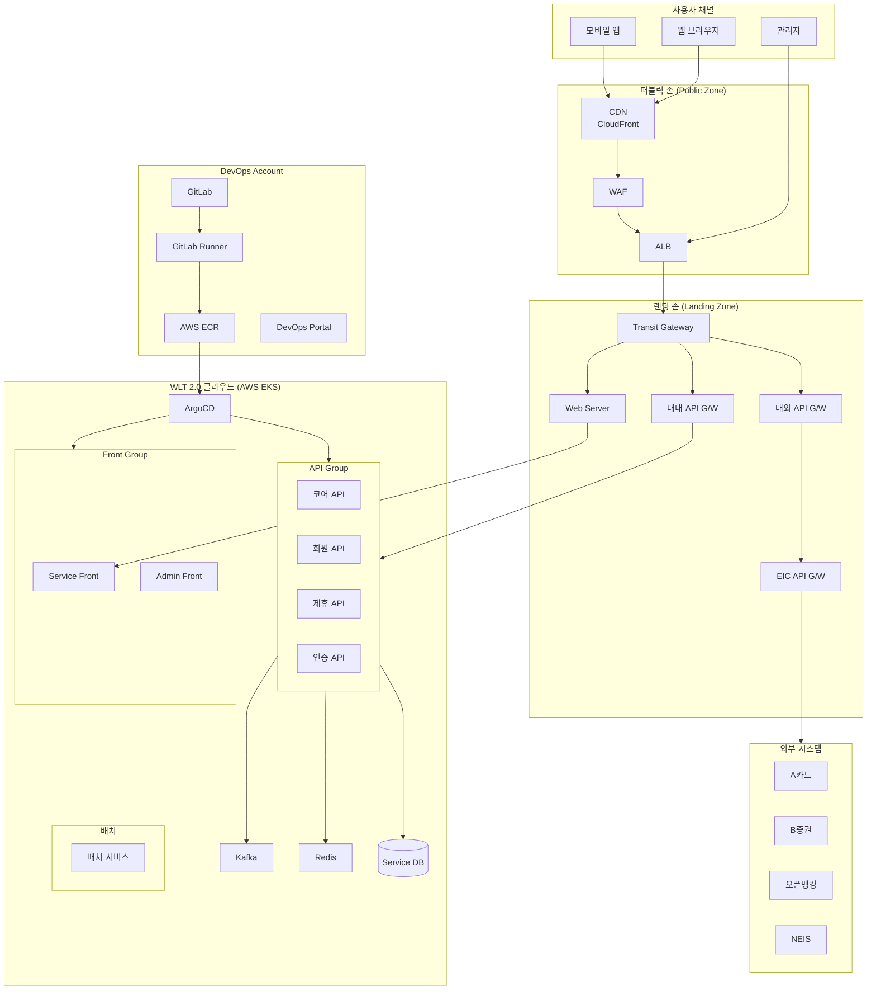

### 2.2 서비스 계층 구성

WLT 2.0의 클라우드 서비스 계층은 다음과 같이 구성된다.

**프론트엔드 레이어**: Next.js 14 기반의 Service Front와 Admin Front로 구성된다. Service Front는 일반 사용자가 접근하는 앱 화면을 서빙하고, Admin Front는 운영자 관리 화면을 담당한다.

**API 레이어**: Spring Boot 3.2 기반의 회원 API, 코어 API, 제휴 API, 인증 API로 구성된다. 각 API는 독립적으로 배포되며, Istio Envoy Proxy를 통해 서비스 간 통신이 이루어진다.

**메시지 레이어**: Kafka를 통해 비동기 이벤트 처리가 이루어지며, 알림(Jennifer), 이체, 거래 이벤트 등을 처리한다.

**데이터 레이어**: 각 도메인별 Service DB와 Redis 캐시로 구성된다.

---

## 3. 도메인 및 마이크로서비스 설계

### 3.1 도메인 설계 배경

WLT 2.0은 기존 모놀리식 구조를 마이크로서비스 아키텍처로 전환하는 프로젝트이다. 전환 과정에서 레거시 서비스는 코어 서비스로, 배치 서비스는 어드민 서비스로 통합되어 최종적으로 5개의 도메인으로 정리되었다. 각 도메인은 독립적인 데이터베이스와 배포 단위를 갖는다.

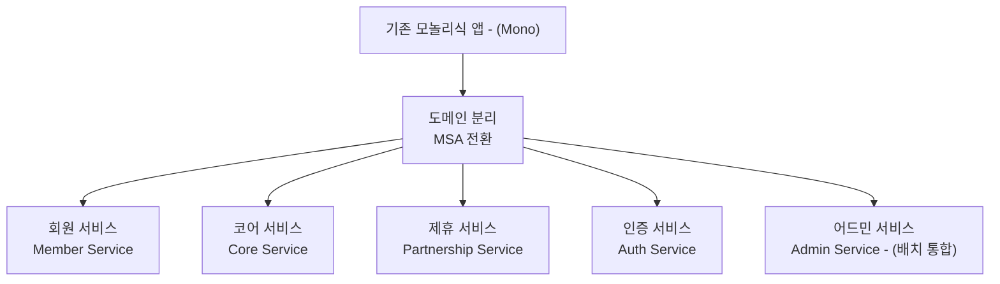

### 3.2 도메인별 서비스 구성

#### 3.2.1 회원 서비스 (Member Service)

회원 서비스는 WLT 앱의 사용자 라이프사이클을 관리한다. 회원가입(일반/멀티), 로그인/로그아웃/세션 연장, 회원정보 관리, 법정대리인 관리, 발송 관리(푸시/UMS/카카오 알림), 인증 관리(ARS 전자서류/AuthService/패턴 인증/인증코드), 카드 관리, 개인화 설정, 1:1 문의 기능을 포함한다.

특히 법정대리인 관리는 서비스 규정 준수를 위해 별도 모듈로 설계되었으며, 발송 관리는 외부 메시징 시스템(UMS, 카카오 알림톡)과의 연동을 담당한다.

#### 3.2.2 코어 서비스 (Core Service)

코어 서비스는 WLT의 핵심 서비스 기능을 담당한다. 기능A, 기능B, 기능C, 기능D, 기능E, 기능F, 기능G, 기능H, 기능I, 기능J, 기능K를 포함한 다양한 핵심 서비스 기능들이 포함된다.

기존의 레거시 서비스가 이 서비스에 통합되었으며, 다양한 서비스 콘텐츠와 인터랙티브 기능들이 하나의 도메인 내에서 관리된다.

#### 3.2.3 제휴 서비스 (Partnership Service)

제휴 서비스는 외부 기관 및 파트너와의 연계를 담당한다. A카드, B증권, D파트너, C마켓, 파트너 채널과의 연동을 처리한다. 이 서비스는 EIC API G/W를 통해 외부 시스템과 통신하며, 각 파트너사의 API 스펙에 맞는 어댑터 레이어를 포함한다.

#### 3.2.4 인증 서비스 (Auth Service)

인증 서비스는 토큰 기반 인증 체계를 담당한다. Token 발행과 Token 인증 두 가지 핵심 기능으로 구성되며, JWT(JSON Web Token) 기반의 공개키/개인키 쌍을 활용한 암호화된 인증 처리를 수행한다. Secret Manager와 연동하여 키를 안전하게 관리한다.

#### 3.2.5 어드민 서비스 (Admin Service)

어드민 서비스는 운영자 관리 기능을 통합한다. CMS(콘텐츠 관리), CS 응대, 이벤트 관리, 배치 이력 관리, 거래 로그 관리, 시스템 관리, 통계/배치 기능을 포함한다. 기존의 배치 서비스가 이 서비스로 통합되어 운영 효율성이 향상되었다.

### 3.3 도메인 구성 전체 구조

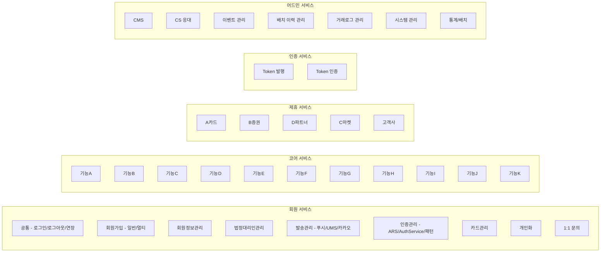

> **[각주 1]** 도메인 주도 설계(DDD, Domain-Driven Design)는 MSA 전환의 핵심 방법론으로, 비즈니스 경계를 기준으로 서비스를 분리하는 Bounded Context 개념을 핵심으로 한다. Spring Boot 3.x 기반 마이크로서비스 아키텍처에서는 각 서비스가 독립적인 데이터베이스와 배포 단위를 가지며, 서비스 간 통신은 API 또는 비동기 이벤트(Kafka)로 처리하는 것이 2025년 현재의 모범 사례이다. 참조: [Java Microservices Architecture Guide - Spring Boot Best Practices 2025](https://medium.com/@shahharsh172/java-microservices-architecture-guide-spring-boot-best-practices-for-production-2025-9aa5c287248f)

---

## 4. API Gateway 설계

### 4.1 API G/W 개요

WLT 2.0 API G/W는 서비스에서 처리하는 각 요소별 기능에 따라 세 가지 유형으로 구분된다. **대내 API G/W**는 WLT 클라우드 내부 서비스 간 통신을 중계하며, **대외 API G/W**는 외부 파트너 시스템(A카드, B증권, 오픈뱅킹 등)과의 연동을 처리하고, **EIC API G/W(External Interface Connection Gateway)** 는 외부 인터페이스 연계를 전담한다.

각 API G/W는 공통적으로 API Route, 트래픽 제어, 인증/인가, 프로토콜 변환, 커스텀 핸들러, 트랜잭션 로깅의 여섯 가지 기능 모듈을 가진다.

### 4.2 API G/W 논리 구성

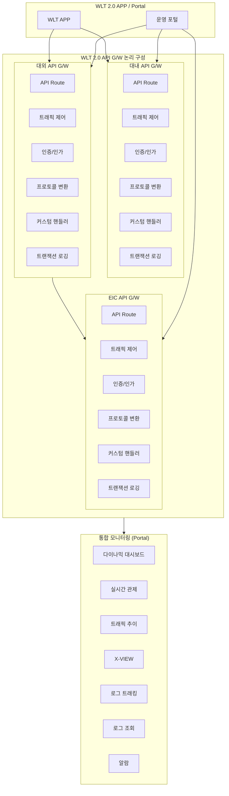

### 4.3 각 G/W 상세 기능 설명

**API Route**는 들어온 요청을 목적지 서비스로 라우팅하는 핵심 기능이다. URL 패턴, 헤더, 메서드를 기반으로 동적 라우팅이 가능하며, 서비스 디스커버리와 연동하여 건강한 인스턴스로만 트래픽을 보낸다.

**트래픽 제어**는 Rate Limiting, Circuit Breaker, Retry, Timeout 등의 탄력성 패턴을 구현한다. 특정 서비스에 트래픽이 집중될 경우 자동으로 제한하여 전체 시스템 안정성을 보호한다.

**인증/인가**는 API 요청에 대한 신원 확인 및 권한 검증을 수행한다. Basic Auth 기반의 API 연계키 인증과 JWT 기반의 앱 인증이 함께 적용된다. 인가는 API G/W 레벨에서 선처리되어 불필요한 백엔드 호출을 차단한다.

**프로토콜 변환**은 외부 시스템과의 프로토콜 불일치를 해소한다. REST↔SOAP, JSON↔XML 등의 변환을 처리하며, 특히 대외/EIC G/W에서 레거시 외부 시스템과의 연동 시 중요한 역할을 한다.

**커스텀 핸들러**는 프로젝트 특화된 비즈니스 로직을 플러그인 형태로 적용할 수 있는 확장 포인트이다.

**트랜잭션 로깅**은 모든 API 호출 이력을 기록한다. 전문 ID, 요청/응답 페이로드, 처리 시간, 오류 코드 등이 기록되며, 거래 추적 및 감사(Audit) 목적으로 활용된다.

**통합 모니터링**은 Portal 레이어에서 세 G/W 전체의 트래픽을 통합 관제한다. X-VIEW를 통한 트랜잭션 추적, 실시간 대시보드, 알람 발송 기능을 제공한다.

> **[각주 2]** 현대 API Gateway는 단순한 리버스 프록시를 넘어, 인증·인가, 트래픽 관리, 관측성(Observability)을 통합하는 플랫폼으로 진화하고 있다. 2025-2026년 API 보안 트렌드로는 TLS 1.3 강제, JWT 만료 시간 최소화(5~15분 권장), Non-Human Identity 관리 강화가 주목받고 있다. Salt Labs의 2025 API 보안 보고서에 따르면 전체 조직의 99%가 API 보안 문제를 경험했으며, 그중 인증 관련 문제가 29%를 차지한다. 참조: [API Gateway Security Best Practices for 2026](https://www.practical-devsecops.com/api-gateway-security-best-practices/)

---

## 5. 소프트웨어 스택

### 5.1 프론트엔드 스택

WLT 2.0의 프론트엔드는 Next.js 14(React 18 기반)를 핵심 프레임워크로 채택하였다. Next.js의 SSR(Server-Side Rendering)과 React Server Components를 활용하여 초기 로딩 성능을 최적화하고, 코드 스플리팅을 통해 불필요한 번들 로딩을 최소화한다.

| 구분 | 기술 | 버전 |
|------|------|------|
| 프레임워크 | Next.js (React 기반) | 14 (using React 18) |
| 런타임 | Node.js | v20.12.0 (LTS) |
| 컨테이너 | Docker | 20.10.9 |
| 오케스트레이션 | AWS EKS | - |

Node v20.12.0은 LTS(Long-Term Support) 버전으로 프로덕션 환경에서의 안정성이 검증되어 있다. 컨테이너는 Docker 20.10.9로 빌드하여 AWS EKS에서 운영된다.

> **[각주 3]** Next.js 14는 React Server Components를 완전히 지원하는 최초의 프레임워크로, 서버에서 렌더링된 UI를 최소한의 JavaScript와 함께 클라이언트로 전달하는 방식으로 성능을 혁신적으로 향상시킨다. React 18의 Concurrent Rendering과 자동 배칭(Automatic Batching)은 UI 응답성을 크게 개선하며, Suspense 기반 스트리밍 SSR은 높은 우선순위 콘텐츠를 먼저 클라이언트에 전달한다. 2026년 현재 Next.js 15.5까지 출시되어 Turbopack 빌드 베타, 안정적인 Node.js 미들웨어, TypeScript 개선이 이루어졌다. 참조: [React & Next.js in 2025 - Modern Best Practices](https://strapi.io/blog/react-and-nextjs-in-2025-modern-best-practices)

### 5.2 백엔드 스택

백엔드는 Spring Boot 3.2(Spring Framework 6.1.2) 기반으로 구성된다. Java 17 LTS(Eclipse Temurin 배포판)를 사용하며, 컨테이너 이미지는 `eclipse-temurin-17.0.9_9-jre-alpine` 을 기반으로 하여 이미지 크기를 최소화한다.

| 구분 | 기술 | 버전 |
|------|------|------|
| WAS | Tomcat Embedded | 10.1.17 |
| 프레임워크 | Spring Boot | 3.2 (Spring 6.1.2) |
| JDK | Eclipse Temurin | 17.0.9 (JRE Alpine) |
| 빌드 도구 | Maven | 3.9.6 |
| ORM | Mybatis | 3.5.14 |
| 직렬화 | Lombok | 1.18.30 |
| 객체 매핑 | MapStruct | 1.5.5.Final |
| JWT | nimbus-jose-jwt | 9.24.4 |
| 컨테이너 | Docker | 20.10.9 |
| 오케스트레이션 | AWS EKS | - |

### 5.3 주요 라이브러리 설명

**Spring Boot 3.2**는 소프트웨어 플랫폼으로 설계된 프레임워크로, 자동 구성과 내장 설정을 통해 개발자들이 빠르고 쉽게 Application 구성을 가능하게 한다. Spring Boot 3.x는 Jakarta EE 10을 기반으로 하며, `javax.*`에서 `jakarta.*`로의 패키지 전환이 이루어졌다. AOT(Ahead-of-Time) 컴파일을 통한 네이티브 실행 파일 생성도 지원한다.

**Mybatis 3.5.14**는 자바 객체와 SQL 쿼리 사이의 매핑을 처리하는 개발 친화적 ORM(Object-Relational Mapping) 프레임워크이다. SQL을 XML 또는 어노테이션으로 분리 관리하여 복잡한 비즈니스 도메인의 쿼리를 효율적으로 다룰 수 있다.

**nimbus-jose-jwt 9.24.4**는 Java 기반의 JWT(JSON Web Token) 처리 라이브러리로, JOSE(JSON Object Signing and Encryption) 표준을 완벽히 구현한다. RS256, ES256 등 다양한 서명 알고리즘을 지원하며, WLT API 인증 체계의 핵심 컴포넌트이다.

**MapStruct 1.5.5.Final**은 Java Bean 간의 타입 안전한 매핑 코드를 컴파일 타임에 자동 생성하는 프레임워크이다. DTO↔도메인 객체 변환에 사용되며, 리플렉션 기반 매퍼 대비 현저히 높은 성능을 제공한다.

**Apache Commons Utils(guava, logback)** 는 문자열 처리, 파일 및 디렉토리 조작, 함수형 유틸리티를 제공하는 오픈소스 라이브러리들이다.

> **[각주 4]** Spring Boot 3.x는 Virtual Threads(Project Loom), GraalVM Native Image 지원, OpenTelemetry 통합 등을 통해 마이크로서비스의 성능과 관측성을 크게 향상시켰다. 특히 Virtual Threads는 기존의 스레드 풀 기반 모델에서 가상 스레드 기반으로 전환하여 높은 동시성 환경에서 메모리 효율을 극적으로 개선한다. 참조: [New Concepts in Java Spring Boot Microservices 2025 Edition](https://medium.com/codetodeploy/new-concepts-in-java-spring-boot-microservices-2025-edition-c19208de7691)

### 5.4 소프트웨어 스택 전체 구성도

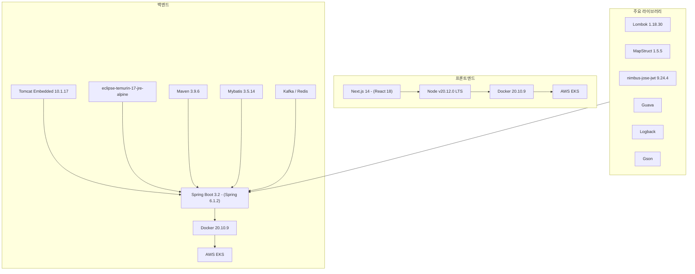

---

## 6. Kubernetes (AWS EKS) 구축 설계

WLT 2.0 Kubernetes 인프라는 AWS EKS를 기반으로 하며, 서비스 메시(Istio), Helm Chart 기반 패키지 관리, ArgoCD를 통한 GitOps 배포 자동화로 구성된 완전한 클라우드 네이티브 플랫폼이다. 이 장에서는 EKS 클러스터 구성, Istio 서비스 메시, Helm Chart 상세 설계, ArgoCD 설치 및 운영 방법을 포함하여 가장 상세하게 기술한다.

### 6.1 AWS EKS 클러스터 구성

#### 6.1.1 클러스터 아키텍처

WLT 2.0의 AWS EKS 클러스터는 DevOps Account와 WLT DEV Account로 분리 운영된다. DevOps Account에는 GitLab Runner, ArgoCD, AWS CodePipeline 등 CI/CD 인프라가 위치하고, WLT DEV Account에는 실제 서비스가 운영되는 EKS 클러스터가 구성된다.

NLB(Network Load Balancer)를 통해 EKS 클러스터로 트래픽이 유입되며, EKS 클러스터 내부에서는 ALB(Application Load Balancer)가 Front Router와 API Router로 트래픽을 분기한다.

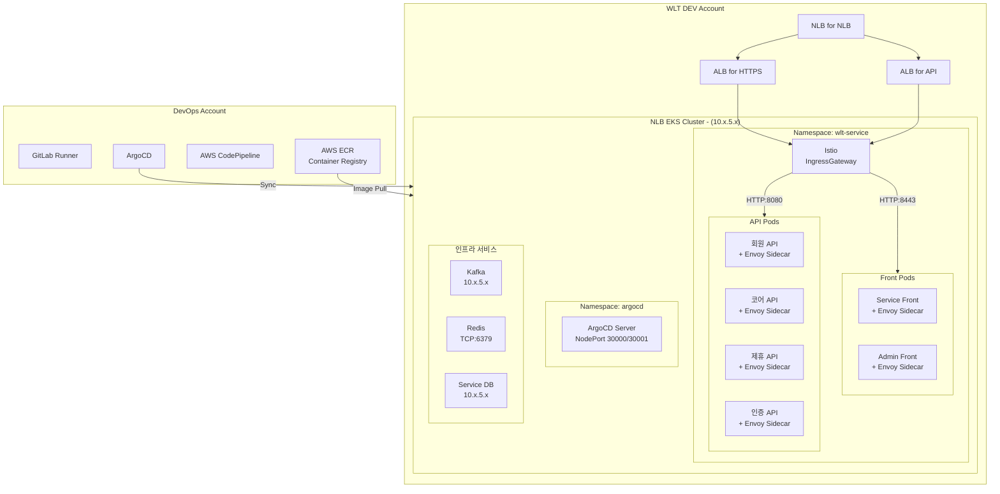

#### 6.1.2 네임스페이스 구성

EKS 클러스터 내 주요 네임스페이스는 다음과 같다.

`wlt-service` 네임스페이스는 WLT 2.0의 모든 애플리케이션 Pod가 배포되는 공간이다. Istio 사이드카 자동 주입이 활성화되어 있으며, 모든 서비스 간 통신은 Envoy Proxy를 통해 처리된다.

`argocd` 네임스페이스는 ArgoCD 서버와 관련 컴포넌트가 배포되는 공간이다. NodePort 30000(HTTP)/30001(HTTPS) 로 외부에서 접근 가능하며, DevOps 팀의 전용 컨트롤 플레인 노드에 스케줄링된다.

`kube-system` 네임스페이스는 CoreDNS, AWS VPC CNI, kube-proxy 등 클러스터 핵심 컴포넌트가 위치한다.

#### 6.1.3 노드 구성 전략

EKS 클러스터는 Managed Node Group 방식으로 노드를 관리한다. Managed Node Group은 AWS가 노드 프로비저닝, 업데이트, 교체를 자동으로 처리하며, 노드 종료 시 자동 드레이닝(Draining)을 통해 애플리케이션 가용성을 보장한다.

컨트롤 플레인 전용 노드에는 ArgoCD와 같은 운영 도구만 스케줄링되고, 일반 서비스 노드에는 애플리케이션 Pod가 배포된다. 이는 `nodeSelector`를 통해 구현된다.

> **[각주 5]** AWS EKS는 2025년 말 EKS Capabilities를 발표하여 ArgoCD와 같은 플랫폼 컴포넌트를 AWS 관리형 서비스로 제공하기 시작했다. EKS Capabilities 방식에서는 ArgoCD가 EKS 서비스 소유 계정에서 실행되어 고객이 인프라 패치, 스케일링, 업데이트를 직접 관리할 필요가 없다. Hub-and-Spoke 아키텍처를 통해 단일 중앙 EKS 클러스터에서 다수의 워크로드 클러스터를 관리하는 패턴이 표준으로 자리잡고 있다. 참조: [Announcing Amazon EKS Capabilities for workload orchestration](https://aws.amazon.com/blogs/aws/announcing-amazon-eks-capabilities-for-workload-orchestration-and-cloud-resource-management/)

### 6.2 Istio 서비스 메시 설계

#### 6.2.1 Istio 도입 배경 및 아키텍처

WLT 2.0은 컨테이너 기반 서비스를 위해 AWS EKS를 사용하고, 서비스 메시 구성을 위해 Istio를 적용한다. 서비스 컨테이너에 대한 접근은 서비스 메시의 HTTP 프록시를 통해 이루어진다.

Istio는 각 Pod에 Envoy Proxy를 사이드카(Sidecar) 방식으로 자동 주입한다. 이를 통해 애플리케이션 코드의 수정 없이 서비스 간 mTLS 암호화, 트래픽 라우팅, 관측성을 확보한다.

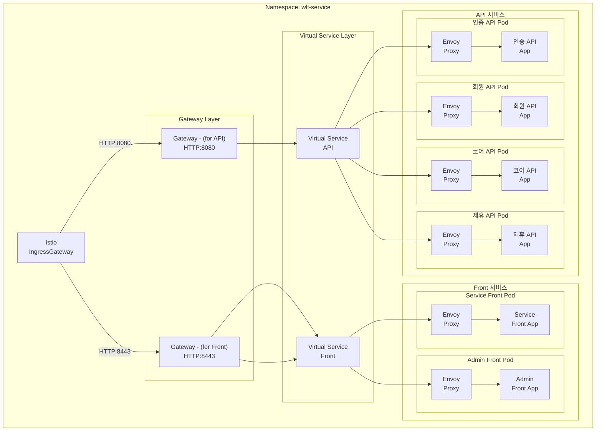

#### 6.2.2 트래픽 흐름 상세

Istio IngressGateway는 외부에서 클러스터로 유입되는 모든 트래픽의 진입점이다. 8443 포트로 입력된 요청은 Front 서비스로, 8080 포트로 입력된 요청은 API 서비스로 전달된다. 클러스터 컴포넌트 내 통신은 HTTP 프로토콜을 이용하며, mTLS는 Istio가 자동으로 처리한다.

Envoy Proxy는 Istio의 핵심 구성 요소로, 마이크로서비스 간의 모든 트래픽을 중계하고 라우팅한다. 각 Pod에 사이드카로 주입되어 서비스 간 통신을 투명하게 제어하며, 로드 밸런싱, 헬스 체크, Circuit Breaker, 관측성 메트릭 수집을 담당한다.

#### 6.2.3 DestinationRule 설정

DestinationRule은 특정 서비스로 트래픽이 라우팅된 이후의 정책을 정의한다. WLT 2.0에서는 ROUND_ROBIN 방식의 로드 밸런싱 정책을 기본으로 적용한다. 이를 통해 동일 서비스의 여러 Pod 인스턴스 간에 균등하게 트래픽이 분산된다.

```yaml
# DestinationRule 예시 (values.yaml → destinationrule.yaml 반영)
apiVersion: networking.istio.io/v1alpha3
kind: DestinationRule
metadata:
  name: api-destination-rule
  namespace: wlt-service
spec:
  host: member-api-service
  trafficPolicy:
    loadBalancer:
      simple: ROUND_ROBIN
```

#### 6.2.4 AuthorizationPolicy (Pod 접근 제어)

Istio의 AuthorizationPolicy를 통해 서비스 간 세밀한 접근 제어를 구현한다. 특정 서비스 어카운트에서만 대상 서비스에 접근할 수 있도록 설정하여 Zero-Trust 보안 모델을 구현한다.

접근 제어 경로는 `클러스터/site/system/wlt-apingw/gateway-service account → wlt-gateway → wlt-gateway` 로 정의되며, Helm의 `values.yaml`의 `authorizationPolicy` 섹션에 정의된 값이 `authorizationpolicy.yaml`에 반영된다.

> **[각주 6]** Istio는 2025년 CNCF를 졸업하며 엔터프라이즈 표준으로 자리잡았다. 가장 주목할 만한 변화는 Ambient Mesh의 GA(General Availability) 달성으로, 기존 사이드카 모델 대비 메모리 사용량을 70% 절감한다. Ambient Mesh는 ztunnel(L4 mTLS 담당)과 Waypoint Proxy(L7 기능 담당)의 두 컴포넌트로 사이드카를 대체하여 운영 복잡성을 대폭 줄인다. 또한 Istio 1.27에서 멀티 클러스터 Ambient Mesh 알파가 공개되어 클러스터 간 지연 시간을 30% 줄이는 성과를 보여주었다. 참조: [Istio Roadmap for 2025-2026](https://istio.io/latest/blog/2025/roadmap/)

### 6.3 Helm Chart 설계

#### 6.3.1 Helm 도입 배경

Helm은 Kubernetes의 패키지 관리자로, 여러 Kubernetes Manifest 파일(Deployment, Service, HPA, ConfigMap 등)을 하나의 Chart로 패키징하여 관리한다. WLT 2.0에서는 Helm을 통해 Application별로 Kubernetes 자원을 자동 생성하며, ArgoCD가 이 Helm Chart를 참조하여 배포를 수행한다.

#### 6.3.2 Helm Chart GitLab 배치 구조

Helm Chart는 GitLab 저장소의 별도 Branch(`helm`)에서 관리된다. ArgoCD가 이 Branch를 참조(Watch)하여 변경이 감지되면 자동으로 동기화(Sync)한다.

```
helm/
├── chart/          # Chart 메타데이터 및 템플릿
│   ├── Chart.yaml
│   ├── values.yaml         # 기본 값
│   ├── values-dev.yaml     # 개발 환경 오버라이드
│   ├── values-stg.yaml     # 스테이징 환경 오버라이드
│   └── templates/
│       ├── deployment.yaml
│       ├── service.yaml
│       ├── hpa.yaml
│       ├── persistentvolume.yaml
│       ├── authorizationpolicy.yaml
│       ├── destinationrule.yaml
│       └── configmap.yaml
├── obj/            # 오브젝트 정의
└── rel/            # 릴리즈 관리
```

#### 6.3.3 API 서비스 Chart 상세 구성

API 서비스 Chart는 WLT의 백엔드 API(회원/코어/제휴/인증)에 공통적으로 적용되는 Helm Chart이다. `values.yaml`에 정의된 값이 각 Kubernetes 오브젝트 템플릿에 반영된다.

**Deployment 설정**

Deployment는 Pod의 복제본 수, 컨테이너 이미지, 환경변수, 볼륨 마운트, 프로브(Probe) 설정을 포함한다. `values.yaml`의 `deployment` 섹션에 이미지 경로, 태그, 리소스 요청/제한값을 정의한다.

**K8s Probe (헬스체크) 설정**

Kubernetes Probe는 컨테이너의 상태를 주기적으로 확인하는 메커니즘이다. WLT 2.0에서는 세 가지 Probe를 모두 활용한다.

- **livenessProbe**: 컨테이너의 생존 상태를 확인한다. 일정 횟수 이상 실패하면 Kubernetes가 컨테이너를 재시작한다. `values.yaml`의 `deployment.livenessProbe`에 설정값을 기재하고 `deployment.yaml`에 반영된다.

- **readinessProbe**: 컨테이너가 트래픽을 받을 준비가 되었는지 확인한다. 헬스체크 API를 호출하여 Application이 정상 기동되었음을 검증한다. 미통과 시 Service의 엔드포인트에서 제외되어 트래픽이 전달되지 않는다.

- **startupProbe**: 컨테이너의 초기 기동 시간을 허용하는 Probe이다. Spring Boot 애플리케이션과 같이 초기화에 시간이 걸리는 애플리케이션에서 liveness/readiness Probe가 너무 이른 시점에 실패 판정하지 않도록 보호한다.

```yaml
# values.yaml Probe 설정 예시
deployment:
  livenessProbe:
    httpGet:
      path: /actuator/health/liveness
      port: 8080
    initialDelaySeconds: 30
    periodSeconds: 10
    failureThreshold: 3
  readinessProbe:
    httpGet:
      path: /actuator/health/readiness
      port: 8080
    initialDelaySeconds: 15
    periodSeconds: 5
    failureThreshold: 3
  startupProbe:
    httpGet:
      path: /actuator/health
      port: 8080
    initialDelaySeconds: 10
    periodSeconds: 5
    failureThreshold: 30
```

**HPA (Horizontal Pod Autoscaler) 설정**

HPA는 CPU 사용률 또는 메모리 사용량을 기반으로 Pod 수를 자동으로 조정한다. `values.yaml`의 `autoscaling` 섹션에 최소/최대 레플리카 수와 목표 CPU 사용률을 정의하면 `hpa.yaml`에 반영된다.

```yaml
# values.yaml HPA 설정 예시
autoscaling:
  enabled: true
  minReplicas: 2
  maxReplicas: 10
  targetCPUUtilizationPercentage: 70
```

**PersistentVolume 설정**

영속적인 데이터 저장이 필요한 서비스를 위해 PersistentVolume을 구성한다. `values.yaml`의 `volumes`와 `volumeMounts` 섹션에 정보를 기재하면 `deployment.yaml`에 반영된다. 주로 로그 파일, 임시 데이터 저장에 활용된다.

**ConfigMap 설정**

Application에 필요한 환경 설정 정보를 Kubernetes ConfigMap으로 관리한다. k8s web proxy의 `nginx.conf` 파일을 ConfigMap으로 생성하여 사용하며, 경로는 `templates/configmap.yaml`에 적용된다. `values.yaml`의 `configmap` 섹션에 설정값을 정의한다.

#### 6.3.4 Front 서비스 Chart

Front 서비스 Chart는 Next.js 기반의 Service Front와 Admin Front에 적용된다. API 서비스 Chart와 동일한 구조를 따르며, Probe 설정, HPA, DestinationRule이 포함된다.

#### 6.3.5 Beast(배치) Chart

Beast Chart는 배치 서비스에 특화된 Helm Chart이다. 배치 서비스는 `beast-hv-go` Pod들로 구성되며, HPA 설정 시 `beast-hv-go`, `beast-hv-go`, `beast-hv-go`의 세 Pod에 대한 정보를 기재한다. PersistentVolume 설정을 통해 배치 작업 결과물을 영속적으로 저장한다.

#### 6.3.6 Web Proxy Chart

Web Proxy Chart는 Nginx 기반의 Web Proxy에 적용된다. 특이점은 `initContainer` 설정으로, Nginx 컨테이너 생성 이전 단계에서 별도 컨테이너가 먼저 실행된다. `k8s-web-proxy`의 `nginx.cache` 설정이 컨테이너를 쉽게 관리하고 운영하기 위한 설정으로 활용된다.

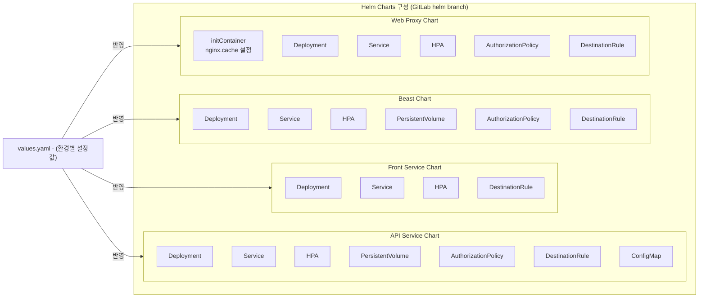

> **[각주 7]** Helm은 2025-2026년 현재 Kubernetes 패키지 관리의 사실상 표준으로, GitOps 워크플로우에서 ArgoCD/Flux와 결합하여 사용된다. 최신 Helm 모범 사례로는 Library Chart를 활용한 공통 템플릿 재사용, 환경별 values 파일 분리(dev/stg/prod), `helm lint`와 `kubeconform`을 통한 CI 검증, liveness/readiness Probe 필수 정의, 리소스 requests/limits 명시적 정의 등이 권장된다. 특히 GitOps 환경에서는 Helm Release를 Git 저장소에서 선언적으로 관리하여 모든 배포 이력을 추적 가능하게 유지해야 한다. 참조: [Helm Charts in Kubernetes 2026 Guide](https://atmosly.com/knowledge/helm-charts-in-kubernetes-definitive-guide-for-2025)

### 6.4 ArgoCD 설치 및 운영 설계

#### 6.4.1 ArgoCD 설치 절차

ArgoCD는 GitOps 방식의 지속적 배포(CD)를 구현하는 핵심 도구이다. Kubernetes 클러스터에 선언적으로 설치되며, DevOps Account의 EKS 클러스터에 배포된다.

**1단계 – 사전 준비 (nodeSelector 설정)**

ArgoCD는 컨트롤 플레인 전용 노드에만 스케줄링되도록 `nodeSelector`를 설정한다. 이를 통해 ArgoCD가 운영 중 다른 서비스 Pod와 함께 일반 워크로드 노드에 배포되는 것을 방지하여 안정적인 GitOps 운영 환경을 보장한다.

**2단계 – ArgoCD Namespace 및 패키지 설치**

```bash
# Namespace 생성
kubectl create namespace argocd

# ArgoCD 패키지 설치 (GitLab Helm Chart 활용)
helm install argocd argocd/argo-cd -n argocd
```

**3단계 – ArgoCD Server NodePort 설정**

ArgoCD Server의 Service 타입을 NodePort로 변경하여 외부 접근을 허용한다. `kubectl edit service argocd-server -n argocd` 명령어로 Service Manifest를 수정한다.

```yaml
# ArgoCD Server Service (NodePort 설정)
spec:
  clusterIP: 10.x.x.x
  externalTrafficPolicy: Cluster
  internalTrafficPolicy: Cluster
  ipFamilies:
    - IPv4
  ipFamilyPolicy: SingleStack
  ports:
    - name: http
      nodePort: 30000   # HTTP 접근 포트
      port: 80
      protocol: TCP
      targetPort: 8080
    - name: https
      nodePort: 30001   # HTTPS 접근 포트
      port: 443
      protocol: TCP
      targetPort: 8080
  type: NodePort
```

변경 사항 적용 확인:
```bash
kubectl get svc argocd-server -n argocd
# NAME             TYPE       CLUSTER-IP    EXTERNAL-IP   PORT(S)                      AGE
# argocd-server    NodePort   10.x.6.x   <none>        80:30000/TCP,443:30001/TCP   10m
```

ArgoCD Server 재시작:
```bash
kubectl rollout restart deployment argocd-server -n argocd
```

#### 6.4.2 ArgoCD 초기 설정

**RBAC 설정**

ArgoCD의 RBAC 설정은 `argocd-cm.yaml`에 정의된 GitLab의 Role Group 이름을 기준으로 적용된다. ArgoCD에서 사용하는 GitLab의 Role Group 이름이 `argocd-cm.yaml`에 등록되어 있어야 정상적인 RBAC 권한이 적용된다. RBAC 설정 유/무에 관계없이 이 등록은 필수이다.

**초기 비밀번호 확인 및 변경**

ArgoCD 설치 후 초기 비밀번호는 `argocd-server` Pod에서 확인한다.

```bash
# 초기 비밀번호 확인
/mcpApps/mcdApp/getInitialPass.sh

# ArgoCD CLI를 통한 비밀번호 변경 (설치 이후 반드시 변경)
argocd account update-password
```

#### 6.4.3 Repository 연결

ArgoCD는 GitLab 저장소를 등록하여 Helm Chart 변경을 감지한다. GitOps 원칙에 따라 ArgoCD 클러스터에 접속된 GitLab Repository를 등록하며, GitLab ID를 통해 적절한 읽기/쓰기 권한을 설정한다.

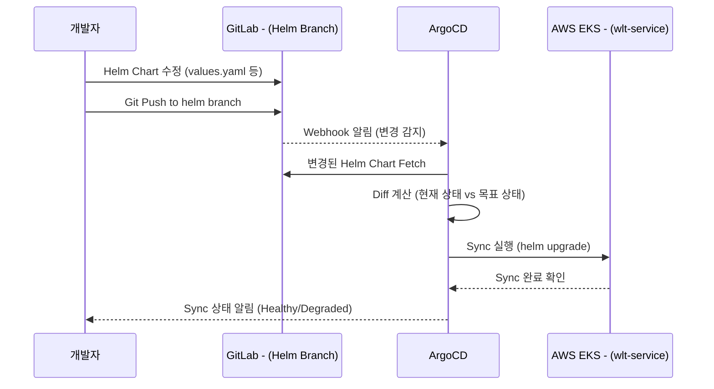

#### 6.4.4 ArgoCD Pod 상태 확인

ArgoCD 운영 중 Pod 상태는 다음 명령어로 확인한다.

```bash
# ArgoCD Namespace의 모든 Pod 상태 확인
kubectl get pods -n argocd

# ArgoCD Server 로그 확인
kubectl logs -f deployment/argocd-server -n argocd

# ArgoCD 클러스터 상태 확인
argocd cluster-status
```

ArgoCD Pod는 `argocd-server`, `argocd-application-controller`, `argocd-repo-server`, `argocd-dex-server`, `argocd-redis` 등의 컴포넌트로 구성된다.

#### 6.4.5 Application 등록 및 관리

**Application 등록**

ArgoCD에서 Application을 등록할 때는 Helm Chart가 위치한 GitLab 경로(Path)를 지정한다.

```yaml
# ArgoCD Application 등록 예시 (YAML 에디터)
apiVersion: argoproj.io/v1alpha1
kind: Application
metadata:
  name: member-api
  namespace: argocd
spec:
  project: default
  source:
    repoURL: https://gitlab.internal/wlt/helm-charts.git
    targetRevision: helm
    path: helm/chart/member-api
  destination:
    server: https://kubernetes.default.svc
    namespace: wlt-service
  syncPolicy:
    automated:
      prune: true
      selfHeal: true
```

**Application 삭제**

ArgoCD 대시보드에서 삭제할 Application을 선택한 후 상세화면 상단의 "DELETE" 버튼을 클릭하거나, CLI 명령어를 사용한다.

#### 6.4.6 Helm Chart 배포 프로세스

Helm Chart 배포는 두 단계로 이루어진다.

**1단계 – Helm Chart 수정 및 Push**: 개발자 또는 운영자가 GitLab의 Helm Branch에 Chart 수정 내용을 Push한다. dev, stg 브랜치 별로 Sync가 이루어진다.

**2단계 – ArgoCD Sync**: ArgoCD가 변경을 감지하고 자동(또는 수동) Sync를 수행한다. 수동 Sync 시에는 ArgoCD 대시보드의 "SYNC" 버튼을 클릭하거나 CLI를 사용한다.

```bash
# ArgoCD CLI를 통한 수동 Sync
argocd app sync member-api

# Sync 상태 확인
argocd app get member-api
```

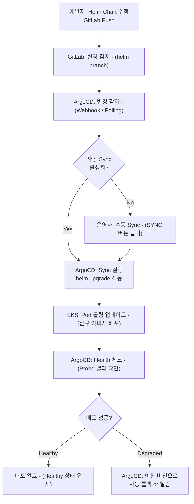

> **[각주 8]** ArgoCD는 2024 CNCF Survey에서 Kubernetes 최종 사용자의 45% 이상이 프로덕션에서 사용하거나 사용 계획 중이라고 응답하며 GitOps CD의 사실상 표준으로 자리잡았다. AWS는 2025년 말 EKS Capability로 ArgoCD를 완전 관리형 서비스로 제공하기 시작했으며, Hub-and-Spoke 아키텍처(중앙 허브 클러스터에서 다수의 워크로드 클러스터를 관리)가 엔터프라이즈 표준으로 확산되고 있다. Cross-region/cross-account 시나리오에서도 VPC Peering이나 Transit Gateway 없이 ArgoCD Capability를 통해 관리할 수 있게 되었다. 참조: [Deep dive: Streamlining GitOps with Amazon EKS capability for Argo CD](https://aws.amazon.com/blogs/containers/deep-dive-streamlining-gitops-with-amazon-eks-capability-for-argo-cd/)

### 6.5 K8s 클러스터 운영 설계 요약

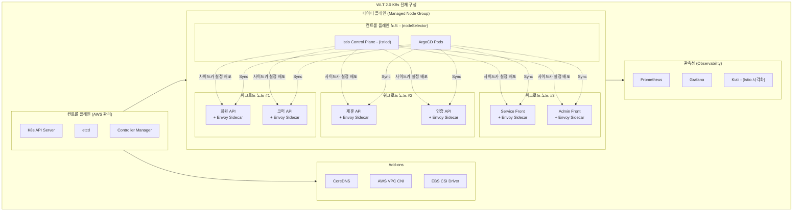

> **[각주 9]** AWS EKS 2025년 모범 사례에 따르면, 프로덕션 클러스터는 최소 3개 가용 영역(AZ)에 걸쳐 워커 노드를 배포하고, EKS Managed Node Group의 Node Auto Repair 기능을 활성화하여 비정상 노드를 자동으로 교체하는 것이 권장된다. IAM Roles for Service Accounts(IRSA)를 통해 Pod별 최소 권한 원칙을 적용하고, 워커 노드를 Private Subnet에 배포하여 직접 인터넷 노출을 차단해야 한다. 또한 IP 주소 고갈을 방지하기 위해 VPC CIDR를 충분히 할당(최소 /16)하는 것이 중요하다. 참조: [EKS Architecture Best Practices: Building Production-Ready Kubernetes Clusters on AWS](https://tasrieit.com/blog/eks-architecture-best-practices-building-production-ready-kubernetes-clusters-on-aws-2026)

---

## 7. CI/CD 파이프라인

### 7.1 CI/CD 전체 흐름

WLT 2.0의 CI/CD 파이프라인은 GitLab을 중심으로 소스 코드 관리, 빌드, 컨테이너 이미지 생성, AWS ECR 업로드, ArgoCD 기반 K8s 자동 배포까지 완전 자동화된 체계를 구성한다.

```mermaid
flowchart LR
    DEV["개발자\n코드 작성"] --> GITLAB_PUSH["GitLab\nMR / Push"]
    GITLAB_PUSH --> GITLAB_CI[".gitlab-ci.yml\n파이프라인 실행"]

    subgraph CI_PIPELINE["CI Pipeline (GitLab Runner)"]
        CI1["1. 버전 확인 - (SNAPSHOT 여부)"]
        CI2["2. ap-common 빌드 - (의존성 라이브러리)"]
        CI3["3. Base Image 기반\nLayered JAR 빌드"]
        CI4["4. Docker Image 빌드 - (eclipse-temurin-17-jre-alpine)"]
        CI5["5. AWS ECR Push - (이미지 태그: version)"]
        CI1 --> CI2 --> CI3 --> CI4 --> CI5
    end

    GITLAB_CI --> CI_PIPELINE
    CI5 --> ECR["AWS ECR\n컨테이너 레지스트리"]
    ECR --> ARGOCD_WATCH["ArgoCD\n이미지 변경 감지"]
    ARGOCD_WATCH --> HELM_UPDATE["Helm values.yaml\n이미지 태그 업데이트"]
    HELM_UPDATE --> K8S_DEPLOY["K8s Rolling Update - (신규 Pod 배포)"]
    K8S_DEPLOY --> HEALTH["헬스체크 - (Probe 확인)"]
    HEALTH --> COMPLETE["배포 완료"]
```

### 7.2 Base Image 관리

#### 7.2.1 Base Image 구조

Spring Boot 애플리케이션은 Layered JAR 방식으로 빌드된다. Maven Spring Boot Plugin으로 빌드된 `layered JAR`는 다음 레이어로 구성된다.

- **dependencies**: Spring 및 서드파티 라이브러리 레이어
- **SNAPSHOT**: 내부 SNAPSHOT 의존성 레이어
- **application**: Application 클래스 및 클래스패스로 설정하는 Bean 클래스들

이 Layered JAR 구조를 활용하면 코드 변경 시 `application` 레이어만 재빌드되어 이미지 빌드 속도와 캐시 효율이 크게 향상된다.

#### 7.2.2 Base Image 프로젝트 관리

Base Image는 GitLab의 `base` Branch에서 별도 프로젝트로 관리된다.

- ECR Registry: `http://registry.internal:8080/booapp/develop/api/api-pom-base`
- Base Image 버전 11과 17 두 가지를 제공한다. Spring Boot 2.4.x 프로젝트는 `base11`을, Spring Boot 3.x 프로젝트는 `base17`을 사용한다.
- WLT 2.0은 Spring Boot 3.2 기반이므로 `eclipse-temurin-17-jre-alpine` 기반의 `base17`을 사용한다.

#### 7.2.3 Base Image 생성 프로세스

Base Image 업데이트 프로세스는 다음 순서로 진행된다.

1. 개발팀이 요구사항 변경(버전 업그레이드 등)을 Base Image 프로젝트에 전달
2. Base Image 프로젝트의 `pom.xml` 수정 (Spring Boot 버전, Java 버전 등)
3. MR(Merge Request) 생성 및 승인
4. gitlab-ci 파이프라인에서 Base Image 자동 빌드
5. ECR에 새 버전 Base Image Push

#### 7.2.4 ap-common 라이브러리 관리

`ap-common`은 WLT 2.0의 공통 라이브러리 프로젝트로, 모든 백엔드 서비스가 의존하는 공통 코드(유틸리티, 공통 설정, 공통 예외 처리 등)를 관리한다.

`by-common` 프로젝트의 `pom.xml`에서 `dependencyManagement`를 통해 버전을 중앙 관리하며, 기능 브랜치(예: `기능/1.5`)에서 개발된 변경사항은 SNAPSHOT 버전으로 라이브러리 의존성 빌드 후 최종적으로 `by-common 1.5.0-SNAPSHOT`으로 배포된다.

### 7.3 GitLab CI Pipeline 설계

`.gitlab-ci.yml`은 GitLab CI/CD 파이프라인의 핵심 설정 파일이다. 소스 Push 또는 MR 생성 시 자동으로 트리거된다.

#### 7.3.1 버전 체크 및 SNAPSHOT 관리

파이프라인 시작 시 `pom.xml`의 버전을 확인한다. `SNAPSHOT` 버전인 경우 개발/테스트 빌드로 처리하고, Release 버전인 경우 스테이징/프로덕션 배포 파이프라인으로 분기된다.

```yaml
# .gitlab-ci.yml 주요 구성 예시
stages:
  - version-check
  - dependency-build
  - app-build
  - docker-build
  - ecr-push

version-check:
  stage: version-check
  script:
    - VERSION=$(mvn help:evaluate -Dexpression=project.version -q -DforceStdout)
    - echo "Building version: $VERSION"
    - if [[ "$VERSION" == *"SNAPSHOT"* ]]; then echo "SNAPSHOT build"; fi

docker-build:
  stage: docker-build
  script:
    - docker build -t $ECR_REGISTRY/$APP_NAME:$VERSION .
    - docker push $ECR_REGISTRY/$APP_NAME:$VERSION
```

#### 7.3.2 Base Image PipeLine (Centro-X Dev Merge)

GitLab CI 파이프라인은 Centro-X Dev Merge 흐름에 따라 통합 관리된다. 기능 브랜치 → Dev 브랜치 MR → 자동 파이프라인 실행 → 이미지 빌드 및 ECR Push → ArgoCD Sync의 전체 흐름이 자동화된다.

> **[각주 10]** GitLab CI/CD와 AWS ECR 연동은 2025년 현재 가장 많이 사용되는 컨테이너 이미지 관리 패턴 중 하나이다. 특히 BuildKit이 Kaniko를 대체하는 현대적인 이미지 빌드 도구로 자리잡으며, 우수한 캐싱 능력과 성능, 보안 기능을 제공한다. Docker의 Layered JAR + ECR을 활용한 불변 아티팩트(Immutable Artifact) 패턴은 GitOps 원칙의 핵심으로, 동일한 이미지가 모든 환경에서 실행되어 "Works on my machine" 문제를 근본적으로 제거한다. 참조: [End-to-End Kubernetes CI/CD With GitLab, Docker, AWS ECR & Helm](https://medium.com/@anil.goyal0057/end-to-end-kubernetes-ci-cd-with-gitlab-docker-aws-ecr-helm-792bbb406e5c)

---

## 8. API 인증 및 인가 설계

### 8.1 인증 체계 개요

WLT 2.0의 API 인증/인가는 대내 API G/W를 중심으로 Public Key/Private Key 기반의 토큰 체계를 활용한다. 인증은 두 가지 경로로 구분된다.

- **앱 초기 설정 단계**: Admin에서 앱 연계키 발급(Basic Auth)을 통해 API 연계키를 설정하고, 공개키/개인키 쌍을 Secret Manager에 등록한다.
- **앱 런타임 단계**: 앱 기동 시 보호토큰(Protected Token)을 요청하고, 인증서비스에서 발급된 토큰을 사용하여 API를 호출한다.

### 8.2 대내 API 인증/인가 시퀀스

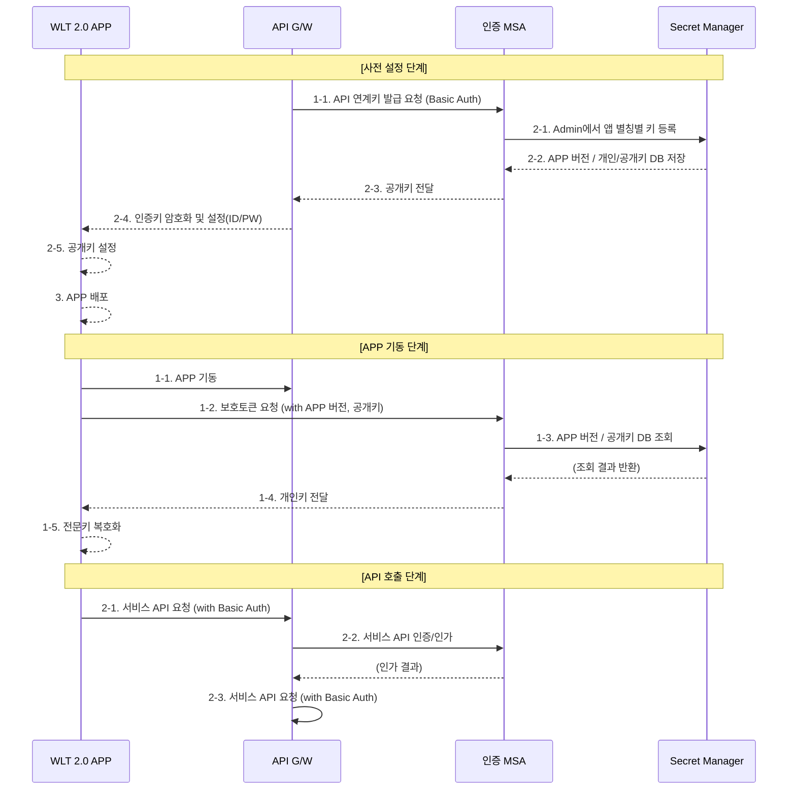

### 8.3 인증 흐름 상세 설명

**사전 설정 단계**에서는 운영자가 Admin Portal을 통해 앱 별칭별로 API 연계키를 등록하고 공개키/개인키 쌍을 Secret Manager에 저장한다. API G/W가 인증 MSA에 API 연계키 발급을 요청(Basic Auth)하면, 인증 MSA는 Secret Manager에 버전과 키 정보를 저장한 후 공개키를 API G/W를 통해 앱에 전달한다.

**앱 기동 단계**에서는 앱이 시작될 때 인증 서비스에 보호토큰을 요청한다. 이때 APP 버전과 공개키를 함께 전달하면, 인증 서비스가 Secret Manager에서 해당 앱 버전의 키를 조회하고 개인키를 반환한다. 앱은 전달받은 개인키로 전문키를 복호화하여 보관한다.

**API 호출 단계**에서는 앱이 서비스 API를 호출할 때 Basic Auth 방식으로 인증 정보를 포함한다. API G/W는 인증 서비스에 인증/인가 검증을 요청하고, 검증이 완료된 요청만 실제 서비스로 전달한다.

> **[각주 11]** JWT와 Public Key/Private Key 기반 인증 체계는 무상태(Stateless) 마이크로서비스 인증의 표준이다. nimbus-jose-jwt 라이브러리는 RSA, EC, OKP 키 쌍과 다양한 서명 알고리즘(RS256, ES256 등)을 지원한다. 2025년 API 보안 트렌드로는 JWT 토큰 만료 시간을 5~15분으로 최소화하고, Refresh Token Rotation 패턴을 적용하며, TLS 1.3만을 지원하고 TLS 1.2 이하를 비활성화하는 것이 권장된다. Secret Manager와의 통합은 키 로테이션을 자동화하여 키 노출 위험을 최소화한다. 참조: [Implementing JWT for API Security](https://api7.ai/learning-center/api-101/implementing-jwt-for-api-security)

---

## 9. Backing 서비스 설계

### 9.1 CDN 활용 – Web 자원 캐싱

#### 9.1.1 CDN 도입 개요

Static Web 자원은 사용자에게 빠르게 제공될 수 있도록 CDN(Amazon CloudFront)을 통해 캐싱한다. CDN으로 제공되는 Web 자원의 타입은 `htm, html, gif, jpg, png, svg, js, css, pdf`로 한정한다.

#### 9.1.2 CDN 트래픽 흐름

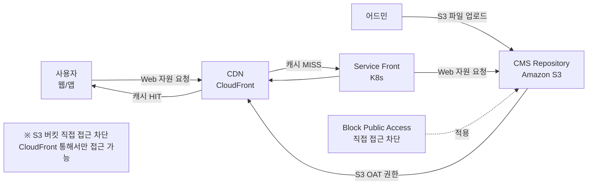

#### 9.1.3 S3 및 CloudFront 설정

CMS Repository는 Amazon S3에 구성되며, Block Public Access 설정을 통해 S3 버킷에 직접 접근을 차단한다. CloudFront는 S3 OAT(Origin Access Token) 권한을 통해 S3 버킷에 접근하며, 일반 사용자는 반드시 CloudFront를 통해서만 Web 자원에 접근 가능하다.

Web 자원 관리 흐름은 다음과 같다.
- 어드민이 CMS를 통해 Web 자원(html, js, css 등)을 S3에 업로드한다.
- Service Front가 API 요청을 받으면 S3에서 Web 자원을 가져와 제공한다.
- CloudFront는 S3 PUT/LIST 권한을 통해 S3와 상호작용하며, 캐싱된 자원을 전 세계 엣지 노드에서 빠르게 제공한다.

### 9.2 MSA 구성 – 서비스 메시 HTTP Proxy

#### 9.2.1 서비스 메시 아키텍처 구현

컨테이너 기반 서비스를 위해 AWS EKS를 사용하고 서비스 메시 구성을 위해 Istio를 적용한다. 서비스 컨테이너에 대한 접근은 서비스 메시인 HTTP 프록시를 통해 이루어진다.

Istio 서비스 메시 아키텍처의 핵심 구성 요소와 역할은 다음과 같다.

**Istio IngressGateway**: 클러스터 외부에서 내부로 진입하는 트래픽의 단일 진입점이다. 8443 포트로 입력된 API 요청은 Front 서비스로, 8080 포트로 입력된 API 요청은 API 서비스로 전달된다.

**Gateway**: IngressGateway에서 수신한 트래픽을 Virtual Service로 연결하는 라우팅 규칙을 정의한다. Front용 Gateway와 API용 Gateway 두 개가 별도로 구성된다.

**Virtual Service**: Gateway로부터 트래픽을 받아 실제 서비스(Pod)로 라우팅하는 규칙을 정의한다. URL 경로, 헤더, 가중치 기반 트래픽 분할 등 고급 라우팅 기능을 제공한다.

**Envoy Proxy**: Istio의 핵심 구성 요소로, 마이크로서비스 간의 모든 트래픽을 중계하고 라우팅한다. 각 Pod에 사이드카 형태로 자동 주입되며, 컴포넌트 내 통신은 HTTP 프로토콜을 이용한다.

---

## 10. 네트워크 및 인프라 구성

### 10.1 전체 네트워크 구성

WLT 2.0의 네트워크는 클라우드 네트워크 망 설계와 WLT DEV Account의 두 계층으로 구성된다.

**클라우드 네트워크 망 설계 영역**에는 NAT(x.x.x.x/x.x.x.x), ABS(TLS 종료), 대내/대외 API G/W, Web Server가 위치한다.

**WLT DEV Account 영역**에는 NLB EKS, ALB(HTTPS/API 분기), Front Router, 애플리케이션 Pod들, Kafka, Redis, Service DB가 위치한다.

두 영역은 Transit Gateway를 통해 연결된다.

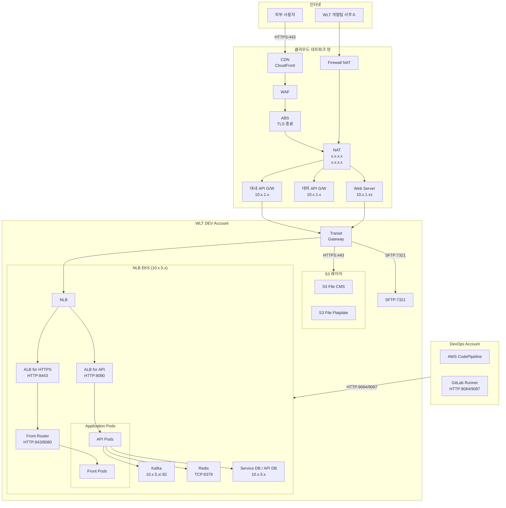

### 10.2 네트워크 보안 설계

외부에서 WLT 2.0으로 유입되는 트래픽은 반드시 WAF와 ABS(TLS 종료 처리)를 통과한다. ABS에서 TLS가 종료된 이후의 내부 통신은 Istio의 mTLS를 통해 암호화된다.

S3 버킷은 Block Public Access 설정으로 직접 접근을 차단하고, CloudFront OAT를 통해서만 접근 가능하다. EKS 워커 노드는 Private Subnet에 배포되어 직접 인터넷 트래픽을 받지 않는다.

SFTP(포트 7321)는 특정 외부 시스템(파트너사)과의 파일 전송에 사용된다.

### 10.3 주요 포트 및 프로토콜 정의

| 구분 | 포트 | 프로토콜 | 설명 |
|------|------|----------|------|
| Istio IngressGateway → Front | 8443 | HTTPS | 프론트엔드 트래픽 |
| Istio IngressGateway → API | 8080 | HTTP | API 트래픽 (내부 mTLS) |
| ALB for HTTPS | 443 | HTTPS | 외부 HTTPS 진입 |
| ALB for API | 8090 | HTTP | API 트래픽 |
| Front Router | 843/8080 | HTTP | 프론트 라우팅 |
| ArgoCD NodePort (HTTP) | 30000 | HTTP | ArgoCD UI 접근 |
| ArgoCD NodePort (HTTPS) | 30001 | HTTPS | ArgoCD HTTPS 접근 |
| Kafka | 9092 | TCP | 메시지 브로커 |
| Redis | 6379 | TCP | 캐시 서버 |
| Service DB | 2541 | TCP | 데이터베이스 |
| API DB | 2541 | TCP | API 전용 DB |
| SFTP | 7321 | SFTP | 외부 파일 전송 |
| GitLab Runner | 9084/9087 | HTTP | DevOps 파이프라인 |

---

## 부록: 기술 스택 요약

| 계층 | 기술 | 버전 | 역할 |
|------|------|------|------|
| 프론트엔드 프레임워크 | Next.js | 14 (React 18) | SSR/CSR 프론트엔드 |
| 백엔드 프레임워크 | Spring Boot | 3.2 (Spring 6.1.2) | REST API 서버 |
| WAS | Tomcat Embedded | 10.1.17 | 내장 웹서버 |
| JDK | Eclipse Temurin | 17 (JRE Alpine) | Java 런타임 |
| 빌드 도구 | Maven | 3.9.6 | 프로젝트 빌드 관리 |
| ORM | Mybatis | 3.5.14 | SQL 매핑 |
| 인증 | nimbus-jose-jwt | 9.24.4 | JWT 처리 |
| 객체 매핑 | MapStruct | 1.5.5.Final | DTO 변환 |
| 메시징 | Apache Kafka | - | 비동기 이벤트 처리 |
| 캐시 | Redis | - | 세션/데이터 캐싱 |
| 컨테이너 | Docker | 20.10.9 | 컨테이너화 |
| 오케스트레이션 | AWS EKS | - | K8s 관리형 서비스 |
| 서비스 메시 | Istio + Envoy | - | 트래픽 제어/보안 |
| 패키지 관리 | Helm | - | K8s 릴리즈 관리 |
| GitOps CD | ArgoCD | - | 선언적 배포 자동화 |
| CI | GitLab CI | - | 빌드/테스트 자동화 |
| 컨테이너 레지스트리 | AWS ECR | - | Docker 이미지 저장 |
| CDN | Amazon CloudFront | - | 정적 자원 배포 |
| 오브젝트 스토리지 | Amazon S3 | - | CMS 자원 저장 |
| 소스 관리 | GitLab | - | 버전 관리 |

---

*이 문서는 WLT 2.0 아키텍처 정의서의 이미지 자료 및 산출물을 기반으로 작성되었으며, 최신 기술 동향 각주는 공개된 기술 문서 및 블로그를 참조하였습니다.*

*작성일: 2026-05-29*

---



## 별첨 A. Base Image 빌드 스크립트 및 배포 방식

### A.1 Base Image 개념 및 목적

WLT 2.0의 모든 백엔드 서비스는 공통 Base Image를 기반으로 컨테이너 이미지를 빌드한다. Base Image는 JDK, 공통 라이브러리, 보안 패치가 사전 적용된 표준 이미지로, 개별 서비스가 Base Image를 상속하여 애플리케이션 레이어만 추가하는 방식이다. 이를 통해 JDK 버전 관리와 보안 취약점 대응을 중앙에서 일괄 처리할 수 있다.

Spring Boot 3.x 기반 서비스는 `base17` (eclipse-temurin-17-jre-alpine 기반)을 사용하고, Spring Boot 2.4.x 이하 레거시 서비스는 `base11`을 사용한다.

### A.2 Base Image Dockerfile 구성

```dockerfile
# base17 Base Image Dockerfile 예시
# eclipse-temurin-17-jre-alpine 기반 최소화 이미지

FROM eclipse-temurin:17.0.9_9-jre-alpine AS base

LABEL maintainer="platform-team@internal"
LABEL base.version="${BASE_IMAGE_VERSION}"

# 보안 패치 및 필수 패키지 설치
RUN apk update && apk upgrade --no-cache \
    && apk add --no-cache \
       curl \
       tzdata \
    && rm -rf /var/cache/apk/*

# 시간대 설정
ENV TZ=Asia/Seoul
RUN ln -snf /usr/share/zoneinfo/$TZ /etc/localtime && echo $TZ > /etc/timezone

# 보안: non-root 사용자로 실행
RUN addgroup -S appgroup && adduser -S appuser -G appgroup
USER appuser

WORKDIR /app

# Layered JAR 기본 구조 지정
# 실제 애플리케이션 레이어는 서비스별 Dockerfile에서 COPY
```

서비스별 Dockerfile은 위 Base Image를 FROM으로 참조한다.

```dockerfile
# 서비스별 Dockerfile 예시 (member-api)
FROM registry.internal:8080/booapp/develop/api/api-pom-base:17-${BASE_IMAGE_VERSION}

# Layered JAR의 각 레이어를 순서대로 복사
# (레이어 캐시 최대 활용: 자주 바뀌지 않는 레이어를 먼저)
COPY --chown=appuser:appgroup extracted/dependencies/ ./
COPY --chown=appuser:appgroup extracted/spring-boot-loader/ ./
COPY --chown=appuser:appgroup extracted/snapshot-dependencies/ ./
COPY --chown=appuser:appgroup extracted/application/ ./

EXPOSE 8080

ENTRYPOINT ["java", \
  "-XX:+UseContainerSupport", \
  "-XX:MaxRAMPercentage=75.0", \
  "-Djava.security.egd=file:/dev/./urandom", \
  "-Dspring.profiles.active=${SPRING_PROFILES_ACTIVE}", \
  "org.springframework.boot.loader.launch.JarLauncher"]
```

### A.3 Layered JAR 추출 스크립트

Base Image 빌드 전 Maven Spring Boot Plugin으로 Layered JAR를 빌드하고, 레이어별로 추출하는 과정이 필요하다.

```bash
#!/bin/bash
# build-layered-jar.sh
# Layered JAR 빌드 및 레이어 추출 스크립트

set -e

APP_NAME="${1:-app}"
VERSION="${2:-1.0.0-SNAPSHOT}"

echo "[1/4] Maven 빌드 (Layered JAR)"
./mvnw clean package -DskipTests \
  -Dspring-boot.repackage.layered=true \
  -Dspring-boot.repackage.includeRelevantJarModeJar=true

JAR_FILE="target/${APP_NAME}-${VERSION}.jar"

echo "[2/4] 추출 디렉토리 초기화"
rm -rf extracted && mkdir -p extracted

echo "[3/4] Layered JAR 레이어 추출"
java -Djarmode=tools -jar "${JAR_FILE}" extract \
  --destination extracted

echo "[4/4] 레이어 구성 확인"
echo "--- 추출된 레이어 ---"
ls -la extracted/
echo "완료: Layered JAR 추출 → extracted/"
```

### A.4 Base Image GitLab CI Pipeline

Base Image의 빌드와 ECR 배포는 GitLab CI/CD 파이프라인으로 자동화된다. GitLab의 `base` Branch에서 `pom.xml` 변경이 감지되면 파이프라인이 트리거된다.

```yaml
# .gitlab-ci.yml (Base Image 프로젝트)
stages:
  - version-check
  - build
  - push
  - notify

variables:
  ECR_REGISTRY: "registry.internal:8080"
  BASE_IMAGE_REPO: "booapp/develop/api/api-pom-base"
  DOCKER_BUILDKIT: "1"

# 1. 버전 체크: SNAPSHOT이면 개발 빌드, release이면 정식 배포
version-check:
  stage: version-check
  script:
    - VERSION=$(mvn help:evaluate -Dexpression=project.version -q -DforceStdout)
    - echo "BASE_IMAGE_VERSION=${VERSION}" >> build.env
    - |
      if [[ "$VERSION" == *"SNAPSHOT"* ]]; then
        echo "SNAPSHOT 빌드 - dev 태그로 배포"
        echo "IMAGE_TAG=dev-${VERSION}" >> build.env
      else
        echo "Release 빌드 - 버전 태그로 배포"
        echo "IMAGE_TAG=${VERSION}" >> build.env
      fi
  artifacts:
    reports:
      dotenv: build.env

# 2. ap-common 공통 라이브러리 빌드 (의존성 우선 처리)
build-common:
  stage: build
  script:
    - cd ap-common
    - mvn clean install -DskipTests
    - echo "ap-common 빌드 완료"

# 3. Base Image Docker 빌드
build-base-image:
  stage: build
  needs: [version-check, build-common]
  script:
    - docker build
        --build-arg BASE_IMAGE_VERSION=${IMAGE_TAG}
        --cache-from ${ECR_REGISTRY}/${BASE_IMAGE_REPO}:latest
        -t ${ECR_REGISTRY}/${BASE_IMAGE_REPO}:${IMAGE_TAG}
        -t ${ECR_REGISTRY}/${BASE_IMAGE_REPO}:latest
        -f Dockerfile.base17 .
    - echo "Base Image 빌드 완료: ${IMAGE_TAG}"

# 4. ECR Push
push-to-ecr:
  stage: push
  needs: [build-base-image]
  script:
    - aws ecr get-login-password --region ap-northeast-2
        | docker login --username AWS --password-stdin ${ECR_REGISTRY}
    - docker push ${ECR_REGISTRY}/${BASE_IMAGE_REPO}:${IMAGE_TAG}
    - docker push ${ECR_REGISTRY}/${BASE_IMAGE_REPO}:latest
    - echo "ECR Push 완료"
  only:
    - base    # base 브랜치에서만 ECR Push 실행
```

### A.5 Base Image 버전 관리 및 서비스 배포 연계

Base Image가 ECR에 push되면, 각 서비스 팀은 자신의 `Dockerfile`과 Helm Chart의 `values.yaml`에서 Base Image 버전을 업데이트하여 재배포한다.

```mermaid
flowchart LR
    DEV["플랫폼팀\npom.xml 수정"] --> GITLAB_BASE["GitLab\nbase branch Push"]
    GITLAB_BASE --> CI_BASE["GitLab CI\nBase Image 빌드"]
    CI_BASE --> ECR["AWS ECR\n:17-x.x.x 태그 Push"]
    ECR --> NOTIFY["서비스팀 공지\n(MR/이슈 생성)"]
    NOTIFY --> SVC_UPDATE["각 서비스팀\nDockerfile FROM 버전 업"]
    SVC_UPDATE --> SVC_CI["서비스 GitLab CI\n서비스 이미지 재빌드"]
    SVC_CI --> ECR_SVC["AWS ECR\n서비스 이미지 Push"]
    ECR_SVC --> ARGOCD["ArgoCD Sync\nK8s Rolling Update"]
```

Base Image 배포 시 각 서비스의 재배포는 순차적으로 진행된다. ArgoCD의 Sync 기능을 통해 서비스별로 롤링 업데이트가 수행되며, Probe 설정에 의해 신규 Pod가 정상 기동된 후 구 Pod가 종료되는 무중단 배포가 보장된다.

> **배포 흐름 요약**: Base Image 변경 → ECR Push → 서비스팀 Dockerfile 업데이트 → 서비스 CI Pipeline 트리거 → 서비스 이미지 ECR Push → ArgoCD가 Helm values.yaml의 이미지 태그 감지 → K8s Rolling Update → Probe 검증 → 배포 완료

---

## 별첨 B. AWS 환경 외 Private Cloud Native Kubernetes 구축 시 변경 사항

WLT 2.0은 AWS EKS 기반으로 설계되었으나, Private Cloud 또는 On-premise 환경에 구축할 경우 AWS 관리형 서비스를 대체하는 컴포넌트가 필요하다. 본 별첨은 각 AWS 서비스별 대체 방안과 구성 변경 사항을 기술한다.

### B.1 컴포넌트 대체 매핑표

| AWS 서비스 | 역할 | Private K8s 대체 방안 |
|-----------|------|----------------------|
| Amazon EKS | Kubernetes 관리형 서비스 | kubeadm / Rancher / OpenShift / k3s |
| AWS ECR | 컨테이너 이미지 레지스트리 | Harbor / Nexus Repository / GitLab Registry |
| AWS ALB/NLB | 로드 밸런서 | MetalLB + NGINX Ingress / HAProxy / F5 BIG-IP |
| Amazon CloudFront | CDN | Nginx Cache / Varnish / 사설 CDN |
| Amazon S3 | 오브젝트 스토리지 | MinIO / Ceph RGW / NetApp StorageGRID |
| AWS Secret Manager | 시크릿 관리 | HashiCorp Vault / Sealed Secrets / External Secrets |
| AWS IAM/IRSA | 서비스 계정 권한 | K8s RBAC + ServiceAccount |
| AWS RDS/Aurora | 관리형 데이터베이스 | PostgreSQL / MySQL (Self-managed or Operator) |
| Amazon Route53 | DNS | CoreDNS + external-dns + 내부 DNS |
| AWS VPC | 네트워크 격리 | Calico / Cilium / Flannel CNI |
| AWS CodePipeline | CI/CD 파이프라인 | GitLab CI / Jenkins / Tekton |
| AWS CloudWatch | 모니터링/로깅 | Prometheus + Grafana + Loki / ELK Stack |

### B.2 Kubernetes 클러스터 직접 구축

AWS EKS 대신 베어메탈 또는 VM 기반으로 Kubernetes를 직접 구축하는 경우 kubeadm 또는 Rancher를 사용한다.

```bash
# kubeadm 기반 Control Plane 초기화 예시
kubeadm init \
  --pod-network-cidr=10.244.0.0/16 \
  --service-cidr=10.96.0.0/12 \
  --apiserver-advertise-address=<CONTROL_PLANE_IP> \
  --control-plane-endpoint=<LOAD_BALANCER_ENDPOINT>:6443 \
  --upload-certs

# Worker Node 조인
kubeadm join <CONTROL_PLANE_IP>:6443 \
  --token <TOKEN> \
  --discovery-token-ca-cert-hash sha256:<HASH>
```

**고가용성(HA) 구성** 을 위해 Control Plane은 최소 3개 노드(홀수)로 구성하고, etcd 클러스터를 별도로 운영하거나 stacked etcd 방식으로 구성한다. Control Plane 앞단에는 HAProxy 또는 Keepalived 기반의 VIP를 구성하여 단일 장애점을 제거한다.

### B.3 사설 컨테이너 레지스트리 (Harbor)

AWS ECR 대체로 Harbor를 사용한다. Harbor는 이미지 취약점 스캔(Trivy/Clair), RBAC, 이미지 복제(Replication), Helm Chart 저장 기능을 통합 제공한다.

```yaml
# harbor helm values.yaml 핵심 설정 예시
expose:
  type: ingress
  ingress:
    hosts:
      core: registry.internal
  tls:
    enabled: true
    certSource: secret

externalURL: https://registry.internal

persistence:
  persistentVolumeClaim:
    registry:
      storageClass: "ceph-rbd"   # Ceph 기반 스토리지
      size: 500Gi

trivy:
  enabled: true   # 이미지 취약점 스캔 활성화

chartmuseum:
  enabled: true   # Helm Chart 저장소 기능 활성화
```

GitLab CI에서 ECR 대신 Harbor를 사용하려면 Docker login 명령어의 레지스트리 주소만 변경하면 된다.

```bash
# ECR → Harbor 변경
# 기존 (AWS ECR)
aws ecr get-login-password | docker login --username AWS --password-stdin $ECR_REGISTRY

# 변경 (Harbor)
echo "$HARBOR_PASSWORD" | docker login registry.internal \
  --username $HARBOR_USER --password-stdin
```

### B.4 로드 밸런서 (MetalLB)

Private Kubernetes 환경에서 AWS ALB/NLB를 대체하기 위해 MetalLB를 사용한다. MetalLB는 베어메탈 환경에서 LoadBalancer 타입 Service에 실제 IP를 할당하는 네트워크 로드 밸런서이다.

```yaml
# MetalLB IPAddressPool 설정 예시
apiVersion: metallb.io/v1beta1
kind: IPAddressPool
metadata:
  name: wlt-pool
  namespace: metallb-system
spec:
  addresses:
    - 192.168.10.100-192.168.10.120   # 내부망 IP 대역 할당
---
apiVersion: metallb.io/v1beta1
kind: L2Advertisement
metadata:
  name: wlt-l2-adv
  namespace: metallb-system
spec:
  ipAddressPools:
    - wlt-pool
```

Istio IngressGateway의 Service 타입을 `LoadBalancer`로 유지하면 MetalLB가 자동으로 VIP를 할당하여 외부 트래픽을 수신한다.

### B.5 시크릿 관리 (HashiCorp Vault)

AWS Secret Manager 대체로 HashiCorp Vault를 사용한다. Vault는 동적 시크릿 생성, PKI 인증서 관리, Key/Value 저장, K8s 통합을 지원한다.

```yaml
# External Secrets Operator를 통한 Vault 연동 예시
apiVersion: external-secrets.io/v1beta1
kind: SecretStore
metadata:
  name: vault-backend
  namespace: wlt-service
spec:
  provider:
    vault:
      server: "https://vault.internal:8200"
      path: "secret"
      version: "v2"
      auth:
        kubernetes:
          mountPath: "kubernetes"
          role: "wlt-app-role"
---
apiVersion: external-secrets.io/v1beta1
kind: ExternalSecret
metadata:
  name: wlt-api-keys
  namespace: wlt-service
spec:
  refreshInterval: "1h"
  secretStoreRef:
    name: vault-backend
    kind: SecretStore
  target:
    name: wlt-api-keys
  data:
    - secretKey: JWT_PRIVATE_KEY
      remoteRef:
        key: wlt/api-keys
        property: jwt-private-key
```

### B.6 오브젝트 스토리지 (MinIO)

Amazon S3 대체로 MinIO를 사용한다. MinIO는 S3 호환 API를 제공하므로, 애플리케이션 코드 변경 없이 엔드포인트 URL만 변경하면 된다.

```yaml
# Spring Boot application.yml - S3 → MinIO 전환
cloud:
  aws:
    s3:
      endpoint: https://minio.internal:9000   # MinIO 엔드포인트
      path-style-access-enabled: true          # MinIO는 path-style 필수
    credentials:
      access-key: ${MINIO_ACCESS_KEY}
      secret-key: ${MINIO_SECRET_KEY}
    region:
      static: us-east-1   # MinIO는 region 무관하나 설정 필요
```

### B.7 모니터링 스택 (Prometheus + Grafana + Loki)

AWS CloudWatch 대체로 Prometheus + Grafana + Loki 스택을 구성한다. kube-prometheus-stack Helm Chart를 사용하면 한 번에 구성 가능하다.

```bash
# kube-prometheus-stack 설치
helm repo add prometheus-community https://prometheus-community.github.io/helm-charts
helm install monitoring prometheus-community/kube-prometheus-stack \
  --namespace monitoring --create-namespace \
  --set grafana.adminPassword=<SECURE_PASSWORD> \
  --set prometheus.prometheusSpec.retention=30d \
  --set prometheus.prometheusSpec.storageSpec.volumeClaimTemplate.spec.storageClassName=ceph-rbd

# Loki 로그 수집 추가
helm repo add grafana https://grafana.github.io/helm-charts
helm install loki grafana/loki-stack \
  --namespace monitoring \
  --set promtail.enabled=true \
  --set loki.persistence.enabled=true \
  --set loki.persistence.storageClassName=ceph-rbd
```

### B.8 Private 환경 전환 체크리스트

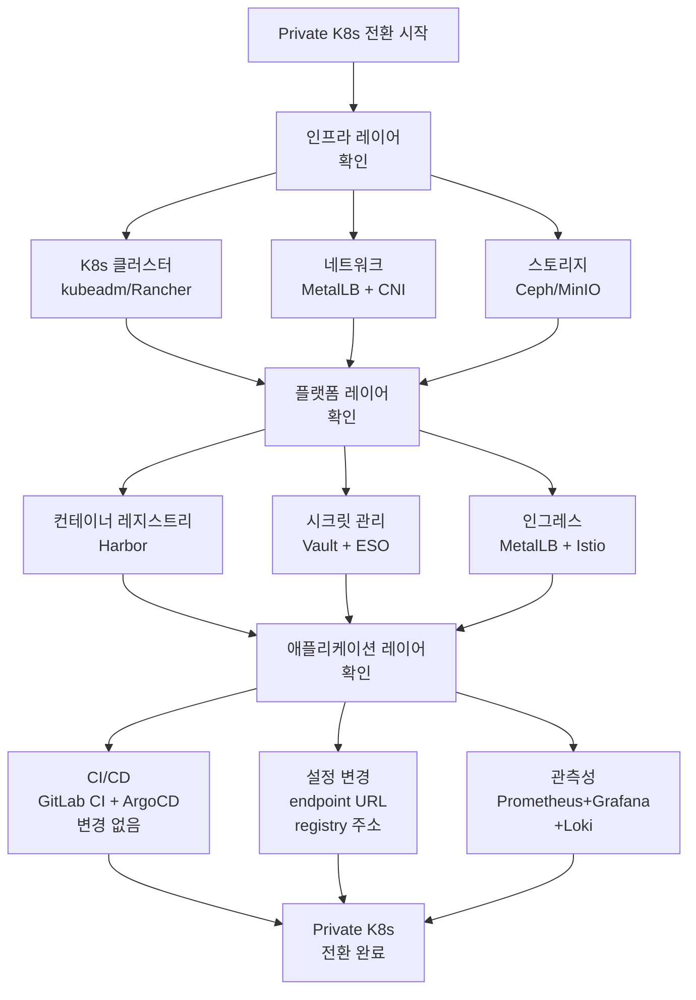

---

## 별첨 C. 아키텍처 개선 사항

현재 WLT 2.0 아키텍처는 MSA 전환과 클라우드 네이티브 기반을 갖추었으나, 안정적인 운영과 장기적인 확장성을 위해 다음과 같은 개선이 권장된다.

### C.1 Ingress Controller 전환 (긴급)

현재 아키텍처는 Istio IngressGateway를 사용하고 있어 Ingress NGINX 지원 종료(별첨 D 참조)의 직접적인 영향을 받지 않는다. 그러나 내부 Nginx Web Proxy가 있거나, 향후 Ingress NGINX 기반 컴포넌트가 도입될 가능성이 있다면 사전에 대응 방안을 수립해야 한다.

**현재 상태**: Istio IngressGateway (Envoy 기반) → 영향 없음  
**주의 대상**: Web Proxy 컴포넌트의 Nginx 버전 관리 및 보안 패치 주기 점검 필요

### C.2 Istio Ambient Mesh 전환 검토

현재 사이드카 방식의 Istio 서비스 메시는 각 Pod마다 Envoy Proxy 컨테이너가 추가되어 메모리 오버헤드가 발생한다. Istio 1.24(2025년 GA)부터 Ambient Mesh가 정식 지원되어, 사이드카 없이 서비스 메시의 핵심 기능을 제공한다.

Ambient Mesh는 기존 사이드카 모델 대비 메모리 사용량을 약 70% 절감하며, 노드 단위의 `ztunnel`이 L4 mTLS를 처리하고 L7 기능이 필요한 경우에만 `Waypoint Proxy`를 선택적으로 배포한다. 서비스 Pod 수가 많을수록 절감 효과가 크며, 배포 복잡성도 낮아진다.

**개선 우선순위**: 중간 (서비스 안정화 후 단계적 전환 권장)

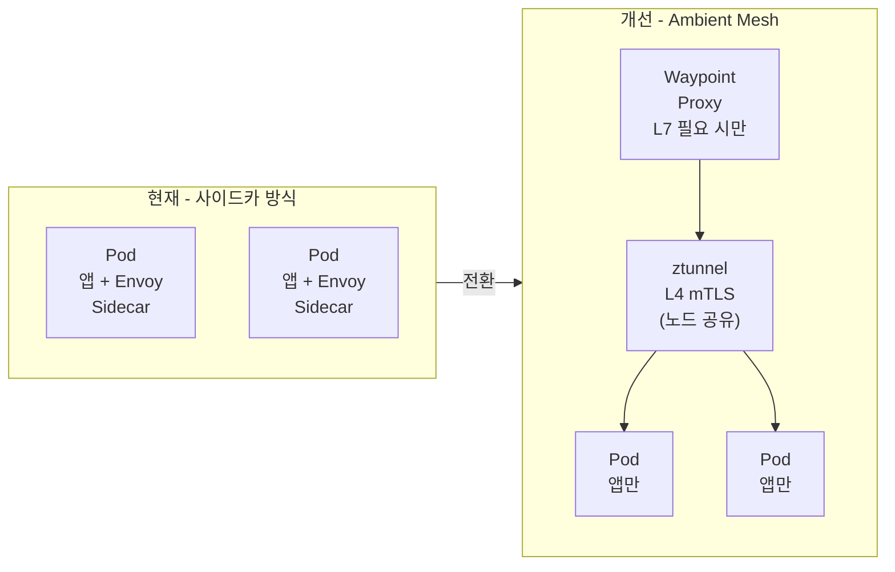

### C.3 멀티 클러스터 전략 수립

현재 단일 EKS 클러스터에 모든 서비스가 배포되어 있어 클러스터 수준의 장애 시 전체 서비스에 영향을 미친다. 장기적으로 Active-Active 멀티 클러스터 구성을 검토해야 한다.

단기적으로는 ArgoCD의 App of Apps 패턴을 도입하여 멀티 클러스터 배포를 준비한다. App of Apps 패턴은 상위 ArgoCD Application이 하위 Application들을 관리하는 계층적 구조로, 클러스터 수가 증가해도 일관된 배포 관리가 가능하다.

```yaml
# App of Apps 패턴 예시
apiVersion: argoproj.io/v1alpha1
kind: Application
metadata:
  name: wlt-apps       # 상위 Application
  namespace: argocd
spec:
  source:
    repoURL: https://gitlab.internal/wlt/helm-charts.git
    targetRevision: helm
    path: apps/         # 하위 Application YAML들이 위치한 경로
  destination:
    server: https://kubernetes.default.svc
    namespace: argocd
  syncPolicy:
    automated:
      prune: true
      selfHeal: true
```

### C.4 관측성(Observability) 강화

현재 아키텍처에 X-VIEW 기반 APM이 포함되어 있으나, 클라우드 네이티브 표준인 OpenTelemetry(OTel) 통합을 추가로 검토한다.

Spring Boot 3.x는 Micrometer + OpenTelemetry 자동 설정을 지원하므로, 별도 코드 변경 없이 분산 추적(Distributed Tracing)과 메트릭 수집이 가능하다. Grafana Tempo를 Distributed Tracing 백엔드로 사용하고, Jaeger와 연동하면 마이크로서비스 간 호출 흐름을 시각화할 수 있다.

```yaml
# Spring Boot application.yml - OpenTelemetry 설정 추가
management:
  tracing:
    sampling:
      probability: 1.0   # 100% 샘플링 (프로덕션에서는 0.1~0.3 권장)
  otlp:
    tracing:
      endpoint: http://tempo.monitoring:4318/v1/traces
  metrics:
    export:
      otlp:
        url: http://prometheus.monitoring:9090/api/v1/otlp
```

### C.5 컨테이너 이미지 보안 강화

현재 빌드 파이프라인에 컨테이너 이미지 취약점 스캔이 명시적으로 포함되어 있지 않다. CI Pipeline에 Trivy 또는 Grype를 통합하여 Critical/High 취약점이 있는 이미지의 ECR Push를 자동으로 차단하는 보안 게이트를 추가해야 한다.

```yaml
# .gitlab-ci.yml에 추가할 이미지 스캔 단계
image-scan:
  stage: scan
  needs: [build-base-image]
  image: aquasec/trivy:latest
  script:
    - trivy image
        --exit-code 1
        --severity CRITICAL,HIGH
        --no-progress
        ${ECR_REGISTRY}/${APP_NAME}:${IMAGE_TAG}
  allow_failure: false   # Critical/High 취약점 시 파이프라인 중단
```

### C.6 네트워크 정책(NetworkPolicy) 강화

현재 Istio AuthorizationPolicy를 통해 서비스 간 접근 제어를 구현하고 있으나, Kubernetes 기본 NetworkPolicy도 함께 적용하여 L3/L4 수준의 이중 방어를 구현하는 것이 권장된다. NetworkPolicy는 Istio가 누락된 상황에서도 기본 격리를 보장한다.

```yaml
# wlt-service 네임스페이스 기본 Deny-All 정책
apiVersion: networking.k8s.io/v1
kind: NetworkPolicy
metadata:
  name: default-deny-all
  namespace: wlt-service
spec:
  podSelector: {}
  policyTypes:
    - Ingress
    - Egress
---
# 회원 API → 인증 API 허용 예시
apiVersion: networking.k8s.io/v1
kind: NetworkPolicy
metadata:
  name: allow-member-to-auth
  namespace: wlt-service
spec:
  podSelector:
    matchLabels:
      app: auth-api
  ingress:
    - from:
        - podSelector:
            matchLabels:
              app: member-api
      ports:
        - port: 8080
```

### C.7 Helm Chart 개선 사항

현재 Helm Chart 구조는 서비스별로 Chart가 분리되어 있어 공통 설정이 중복된다. Library Chart 패턴을 도입하여 공통 템플릿을 재사용하면 관리 비용을 줄일 수 있다.

또한 현재 HPA는 CPU 기반으로만 구성되어 있는데, 요청 수(RPS) 기반 또는 커스텀 메트릭 기반 HPA를 추가하면 더 정밀한 자동 스케일링이 가능하다. KEDA(Kubernetes Event-Driven Autoscaling)를 도입하면 Kafka 메시지 큐 깊이나 외부 메트릭 기반의 스케일링도 가능해진다.

---

## 별첨 D. Ingress NGINX 지원 종료 안내

> 출처: [Ingress NGINX 지원 종료 안내 (Kubernetes Ingress Controller)](https://nginxstore.com/blog/kubernetes/ingress-nginx-%EC%A7%80%EC%9B%90-%EC%A2%85%EB%A3%8C-%EC%95%88%EB%82%B4-kubernetes-ingress-controller/)  
> 원문 작성일: 2025-11-24 / 최종 수정: 2026-05-12

### D.1 개요

Kubernetes 커뮤니티는 **Ingress NGINX 프로젝트(kubernetes/ingress-nginx)가 2026년 3월부로 지원 종료(EOL)** 된다고 공식 발표했다. 지원 종료 이후에는 업데이트, 버그 수정, 보안 패치가 완전히 중단된다.

지원이 종료되는 Ingress NGINX Controller는 NGINX 기반의 커뮤니티 오픈소스 프로젝트로, 상용 F5 NGINX Ingress Controller와는 별개의 프로젝트임을 유의해야 한다.

### D.2 지원 종료 배경

지원 종료 결정의 주요 배경은 두 가지이다.

첫째, 구조적 유지보수 한계이다. 오랜 기간 소수의 개발자(1~2명)가 야간·주말에 유지보수를 이어온 구조로, 프로젝트가 보유한 자원만으로는 안정적인 지원이 어려운 상황이었다.

둘째, 중대한 보안 취약점 대응의 한계이다. 2025년에 발생한 **IngressNightmare (CVE-2025-1974)** 취약점을 해결하는 과정에서 커뮤니티 자원의 한계가 드러났다. 이 취약점은 악의적인 사용자가 Ingress NGINX Controller를 통해 클러스터 전체를 탈취할 수 있는 심각한 수준의 취약점이었다.

기존에 클러스터에 배포된 Ingress NGINX 배포본은 계속 동작하지만, 보안 패치가 제공되지 않는 Ingress Controller를 운영하는 것은 중대한 보안 리스크를 초래한다. Kubernetes 커뮤니티는 Ingress NGINX 사용자들에게 다른 Ingress Controller로의 전환(마이그레이션)을 공식 권고하고 있다.

### D.3 WLT 2.0에 대한 영향 분석

WLT 2.0은 외부 트래픽 진입점으로 **Istio IngressGateway(Envoy 기반)** 를 사용하고 있어 Ingress NGINX 지원 종료의 **직접적인 영향은 없다**.

그러나 다음 사항을 점검해야 한다.

| 점검 항목 | 현황 | 권고 사항 |
|-----------|------|-----------|
| 외부 트래픽 진입 | Istio IngressGateway 사용 | 영향 없음 |
| Web Proxy (Nginx) | k8s-web-proxy 컴포넌트 | 오픈소스 Nginx 버전 주기적 업데이트 필요 |
| 내부 Nginx Ingress 존재 여부 | 확인 필요 | 사용 중이면 마이그레이션 계획 수립 |
| 향후 신규 컴포넌트 도입 | - | Ingress NGINX 신규 도입 금지 |

### D.4 권장 대안

Kubernetes 커뮤니티 및 업계 전문가가 권장하는 대안은 다음과 같다.

**1. F5 NGINX Plus Ingress Controller**
국내외에서 가장 많이 사용되는 상용 인그레스 컨트롤러로, 기존 Ingress NGINX 사용자에게 가장 매끄러운 전환 경로를 제공한다. 정기적인 보안 패치, 버그 수정, 성능 최적화가 상업적 SLA와 함께 제공된다. 기존 ingress-nginx annotation과의 높은 호환성으로 마이그레이션 부담이 낮다.

**2. NGINX Gateway Fabric (NGF)**
Kubernetes의 차세대 표준인 [Gateway API](https://kubernetes.io/docs/concepts/services-networking/gateway/) 기반의 신형 아키텍처이다. Ingress + 내부 서비스 트래픽 제어까지 확장 가능한 구조로, WLT 2.0과 같이 이미 Istio를 사용하는 환경에서 Istio와 Gateway API 레벨에서 통합하는 방향도 고려할 수 있다.

**3. 현재 구조 유지 (Istio IngressGateway)**
WLT 2.0은 이미 Istio IngressGateway를 사용하고 있으므로, Ingress NGINX 없이도 완전한 인그레스 기능을 제공한다. Istio Gateway API 지원이 Stable로 승격(Istio 1.22)됨에 따라 표준 Gateway API 기반 라우팅을 활용하는 것이 장기적으로 가장 권장되는 방향이다.

### D.5 마이그레이션 가이드 (Ingress NGINX → Istio Gateway API)

현재 Ingress NGINX를 사용하는 경우 아래 순서로 Istio Gateway API로 전환한다.

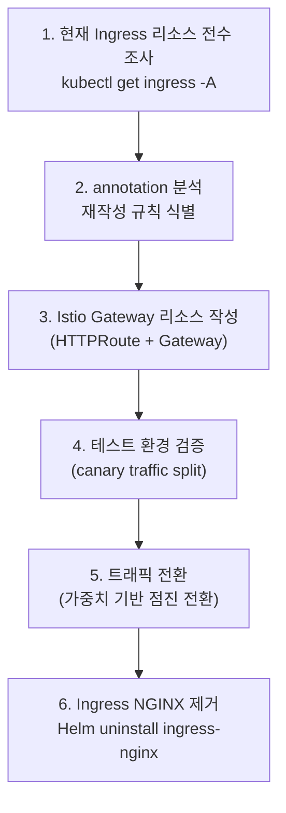

```yaml
# Ingress NGINX → Istio HTTPRoute 변환 예시

# [기존] kubernetes.io/Ingress
apiVersion: networking.k8s.io/v1
kind: Ingress
metadata:
  name: member-api-ingress
  annotations:
    nginx.ingress.kubernetes.io/rewrite-target: /
spec:
  rules:
    - host: api.example.internal
      http:
        paths:
          - path: /member
            pathType: Prefix
            backend:
              service:
                name: member-api-svc
                port:
                  number: 8080

---
# [변경] Istio HTTPRoute (Gateway API)
apiVersion: gateway.networking.k8s.io/v1
kind: HTTPRoute
metadata:
  name: member-api-route
  namespace: wlt-service
spec:
  parentRefs:
    - name: wlt-gateway
      namespace: wlt-service
  hostnames:
    - "api.example.internal"
  rules:
    - matches:
        - path:
            type: PathPrefix
            value: /member
      backendRefs:
        - name: member-api-svc
          port: 8080
```

### D.6 참고 자료

- Ingress NGINX 은퇴 공식 공지: [https://kubernetes.io/blog/2025/11/11/ingress-nginx-retirement/](https://kubernetes.io/blog/2025/11/11/ingress-nginx-retirement/)
- Kubernetes Ingress NGINX GitHub: [https://github.com/kubernetes/ingress-nginx/](https://github.com/kubernetes/ingress-nginx/)
- Istio Gateway API 지원 문서: [https://istio.io/latest/docs/tasks/traffic-management/ingress/gateway-api/](https://istio.io/latest/docs/tasks/traffic-management/ingress/gateway-api/)
- NGINX Gateway Fabric: [https://docs.nginx.com/nginx-gateway-fabric/](https://docs.nginx.com/nginx-gateway-fabric/)

---

*작성일: 2026-05-29*

---

## 별첨 E. Helm Chart 구성 샘플 및 ArgoCD 연동 상세

### E.1 WLT 2.0 Helm Chart 전체 디렉토리 구조

WLT 2.0의 Helm Chart는 GitLab 저장소의 `helm` 브랜치에서 관리되며, 서비스 유형별로 Chart 디렉토리를 분리한다. ArgoCD는 이 브랜치를 Watch하다가 변경이 감지되면 해당 서비스만 선택적으로 Sync한다.

```
helm/                                    # GitLab helm branch 루트
├── apps/                                # App of Apps 패턴 - ArgoCD Application 정의
│   ├── member-api-app.yaml
│   ├── core-api-app.yaml
│   ├── partner-api-app.yaml
│   ├── auth-api-app.yaml
│   ├── service-front-app.yaml
│   ├── admin-front-app.yaml
│   └── beast-app.yaml
│
├── chart/                               # 서비스별 Helm Chart 디렉토리
│   ├── member-api/                      # 회원 API Chart
│   │   ├── Chart.yaml
│   │   ├── values.yaml                  # 기본값 (공통)
│   │   ├── values-dev.yaml              # 개발 환경 오버라이드
│   │   ├── values-stg.yaml              # 스테이징 환경 오버라이드
│   │   └── templates/
│   │       ├── _helpers.tpl             # 공통 헬퍼 함수
│   │       ├── deployment.yaml
│   │       ├── service.yaml
│   │       ├── hpa.yaml
│   │       ├── configmap.yaml
│   │       ├── authorizationpolicy.yaml
│   │       ├── destinationrule.yaml
│   │       └── pvc.yaml
│   │
│   ├── core-api/                        # 코어 API Chart (동일 구조)
│   ├── partner-api/                     # 제휴 API Chart (동일 구조)
│   ├── auth-api/                        # 인증 API Chart (동일 구조)
│   │
│   ├── service-front/                   # Service Front Chart
│   │   ├── Chart.yaml
│   │   ├── values.yaml
│   │   ├── values-dev.yaml
│   │   └── templates/
│   │       ├── deployment.yaml          # initContainer 포함
│   │       ├── service.yaml
│   │       ├── hpa.yaml
│   │       ├── configmap-nginx.yaml     # Nginx 설정 ConfigMap
│   │       └── destinationrule.yaml
│   │
│   ├── admin-front/                     # Admin Front Chart (동일 구조)
│   │
│   └── beast/                           # 배치 서비스 Chart
│       ├── Chart.yaml
│       ├── values.yaml
│       └── templates/
│           ├── deployment.yaml
│           ├── service.yaml
│           ├── hpa.yaml
│           ├── pvc.yaml
│           ├── authorizationpolicy.yaml
│           └── destinationrule.yaml
│
└── obj/                                 # 공통 Kubernetes 오브젝트
    ├── namespace.yaml                   # wlt-service 네임스페이스 정의
    └── serviceaccount.yaml              # 서비스 어카운트 정의
```

### E.2 Chart.yaml — 차트 메타데이터

```yaml
# helm/chart/member-api/Chart.yaml
apiVersion: v2
name: member-api
description: "WLT 2.0 회원 API 서비스 Helm Chart"
type: application
version: "1.0.0"        # Chart 버전 (Chart 구조 변경 시 올림)
appVersion: "2.0.0"     # 애플리케이션 버전 (서비스 릴리즈 버전)
keywords:
  - wlt
  - member
  - api
  - spring-boot
maintainers:
  - name: platform-team
    email: platform@internal
```

### E.3 values.yaml — 기본값 전체 샘플

`values.yaml`은 서비스별 배포 설정의 단일 진실 공급원(Single Source of Truth)이다. 모든 Kubernetes 리소스 템플릿은 이 파일의 값을 참조한다.

```yaml
# helm/chart/member-api/values.yaml

# ──────────────────────────────────────────────────────────────
# 1. 이미지 설정
# ──────────────────────────────────────────────────────────────
image:
  registry: "registry.internal:8080"
  repository: "wlt/member-api"
  tag: "2.0.0"                          # CI 파이프라인에서 자동 업데이트
  pullPolicy: IfNotPresent
  pullSecrets:
    - name: ecr-pull-secret             # ECR 인증 시크릿

# ──────────────────────────────────────────────────────────────
# 2. 레플리카 설정 (HPA와 함께 사용 시 minReplicas와 일치)
# ──────────────────────────────────────────────────────────────
replicaCount: 2

# ──────────────────────────────────────────────────────────────
# 3. 서비스 설정
# ──────────────────────────────────────────────────────────────
service:
  type: ClusterIP
  port: 80
  targetPort: 8080
  name: http

# ──────────────────────────────────────────────────────────────
# 4. 컨테이너 리소스 요청/제한
# ──────────────────────────────────────────────────────────────
resources:
  requests:
    cpu: "250m"
    memory: "512Mi"
  limits:
    cpu: "1000m"
    memory: "1024Mi"

# ──────────────────────────────────────────────────────────────
# 5. 환경 변수 (ConfigMap/Secret 참조 포함)
# ──────────────────────────────────────────────────────────────
env:
  - name: SPRING_PROFILES_ACTIVE
    value: "dev"
  - name: SERVER_PORT
    value: "8080"
  - name: JAVA_OPTS
    value: "-XX:+UseContainerSupport -XX:MaxRAMPercentage=75.0"
  - name: DB_URL
    valueFrom:
      secretKeyRef:
        name: member-api-db-secret
        key: url
  - name: DB_USERNAME
    valueFrom:
      secretKeyRef:
        name: member-api-db-secret
        key: username
  - name: DB_PASSWORD
    valueFrom:
      secretKeyRef:
        name: member-api-db-secret
        key: password

# ──────────────────────────────────────────────────────────────
# 6. Probe 설정
# ──────────────────────────────────────────────────────────────
livenessProbe:
  enabled: true
  httpGet:
    path: /actuator/health/liveness
    port: 8080
  initialDelaySeconds: 60
  periodSeconds: 15
  timeoutSeconds: 5
  failureThreshold: 3
  successThreshold: 1

readinessProbe:
  enabled: true
  httpGet:
    path: /actuator/health/readiness
    port: 8080
  initialDelaySeconds: 30
  periodSeconds: 10
  timeoutSeconds: 5
  failureThreshold: 3
  successThreshold: 1

startupProbe:
  enabled: true
  httpGet:
    path: /actuator/health
    port: 8080
  initialDelaySeconds: 10
  periodSeconds: 5
  failureThreshold: 30     # 최대 150초(5 * 30) 기동 시간 허용

# ──────────────────────────────────────────────────────────────
# 7. HPA (Horizontal Pod Autoscaler)
# ──────────────────────────────────────────────────────────────
autoscaling:
  enabled: true
  minReplicas: 2
  maxReplicas: 10
  targetCPUUtilizationPercentage: 70
  targetMemoryUtilizationPercentage: 80
  scaleDownStabilizationWindowSeconds: 300   # 5분간 안정화 후 스케일다운

# ──────────────────────────────────────────────────────────────
# 8. PersistentVolume (로그 볼륨)
# ──────────────────────────────────────────────────────────────
persistence:
  enabled: true
  storageClass: "gp3"
  accessMode: ReadWriteOnce
  size: "5Gi"
  mountPath: "/app/logs"

# ──────────────────────────────────────────────────────────────
# 9. ConfigMap (애플리케이션 설정)
# ──────────────────────────────────────────────────────────────
configmap:
  enabled: true
  data:
    application.yml: |
      spring:
        datasource:
          driver-class-name: com.mysql.cj.jdbc.Driver
          hikari:
            maximum-pool-size: 10
            minimum-idle: 2
        redis:
          host: redis.wlt-service.svc.cluster.local
          port: 6379
      management:
        endpoints:
          web:
            exposure:
              include: health,info,prometheus
        tracing:
          sampling:
            probability: 0.1

# ──────────────────────────────────────────────────────────────
# 10. Istio AuthorizationPolicy (Pod 접근 제어)
# ──────────────────────────────────────────────────────────────
authorizationPolicy:
  enabled: true
  allowedPrincipals:
    - "cluster.local/ns/wlt-service/sa/wlt-gateway-sa"
    - "cluster.local/ns/wlt-service/sa/core-api-sa"
    - "cluster.local/ns/wlt-service/sa/auth-api-sa"

# ──────────────────────────────────────────────────────────────
# 11. Istio DestinationRule (로드 밸런싱 정책)
# ──────────────────────────────────────────────────────────────
destinationRule:
  enabled: true
  loadBalancerAlgorithm: ROUND_ROBIN
  connectionPool:
    tcp:
      maxConnections: 100
    http:
      http1MaxPendingRequests: 50
      http2MaxRequests: 100
  outlierDetection:
    consecutiveErrors: 5
    interval: "30s"
    baseEjectionTime: "30s"

# ──────────────────────────────────────────────────────────────
# 12. 노드 배치 설정
# ──────────────────────────────────────────────────────────────
nodeSelector: {}
tolerations: []
affinity:
  podAntiAffinity:
    preferredDuringSchedulingIgnoredDuringExecution:
      - weight: 100
        podAffinityTerm:
          labelSelector:
            matchLabels:
              app: member-api
          topologyKey: kubernetes.io/hostname   # 노드 분산 배포 선호
```

### E.4 환경별 오버라이드 values 파일

개발/스테이징/프로덕션 환경의 차이는 오버라이드 values 파일로 처리한다. ArgoCD의 각 Application이 참조하는 values 파일을 달리하여 동일 Chart로 여러 환경에 배포한다.

```yaml
# helm/chart/member-api/values-dev.yaml
# 개발 환경 오버라이드 (values.yaml과 병합)

image:
  tag: "latest"                 # 개발환경은 latest 태그 사용

replicaCount: 1                 # 개발환경은 단일 인스턴스

resources:
  requests:
    cpu: "100m"
    memory: "256Mi"
  limits:
    cpu: "500m"
    memory: "512Mi"

autoscaling:
  enabled: false                # 개발환경은 HPA 비활성화

env:
  - name: SPRING_PROFILES_ACTIVE
    value: "dev"
  - name: LOG_LEVEL
    value: "DEBUG"

persistence:
  size: "1Gi"                   # 개발환경은 소용량
```

```yaml
# helm/chart/member-api/values-stg.yaml
# 스테이징 환경 오버라이드

image:
  tag: "stg-2.0.0"

replicaCount: 2

autoscaling:
  enabled: true
  minReplicas: 2
  maxReplicas: 5                # 스테이징은 최대 5개

env:
  - name: SPRING_PROFILES_ACTIVE
    value: "stg"
```

### E.5 templates/deployment.yaml

```yaml
# helm/chart/member-api/templates/deployment.yaml
apiVersion: apps/v1
kind: Deployment
metadata:
  name: {{ include "member-api.fullname" . }}
  namespace: {{ .Release.Namespace }}
  labels:
    {{- include "member-api.labels" . | nindent 4 }}
  annotations:
    deployment.kubernetes.io/revision: "{{ .Release.Revision }}"
spec:
  {{- if not .Values.autoscaling.enabled }}
  replicas: {{ .Values.replicaCount }}
  {{- end }}
  selector:
    matchLabels:
      {{- include "member-api.selectorLabels" . | nindent 6 }}
  strategy:
    type: RollingUpdate
    rollingUpdate:
      maxUnavailable: 0         # 무중단 배포: 기존 Pod를 유지하면서 신규 Pod 배포
      maxSurge: 1               # 동시에 1개 초과 Pod 허용
  template:
    metadata:
      labels:
        {{- include "member-api.selectorLabels" . | nindent 8 }}
        version: {{ .Values.image.tag | quote }}
      annotations:
        sidecar.istio.io/inject: "true"
        prometheus.io/scrape: "true"
        prometheus.io/port: "8080"
        prometheus.io/path: "/actuator/prometheus"
    spec:
      serviceAccountName: {{ include "member-api.fullname" . }}-sa
      {{- with .Values.image.pullSecrets }}
      imagePullSecrets:
        {{- toYaml . | nindent 8 }}
      {{- end }}
      containers:
        - name: {{ .Chart.Name }}
          image: "{{ .Values.image.registry }}/{{ .Values.image.repository }}:{{ .Values.image.tag }}"
          imagePullPolicy: {{ .Values.image.pullPolicy }}
          ports:
            - name: http
              containerPort: 8080
              protocol: TCP
          env:
            {{- toYaml .Values.env | nindent 12 }}
            - name: POD_NAME
              valueFrom:
                fieldRef:
                  fieldPath: metadata.name
            - name: POD_NAMESPACE
              valueFrom:
                fieldRef:
                  fieldPath: metadata.namespace
          {{- if .Values.configmap.enabled }}
          volumeMounts:
            - name: app-config
              mountPath: /app/config/application.yml
              subPath: application.yml
              readOnly: true
            {{- if .Values.persistence.enabled }}
            - name: log-volume
              mountPath: {{ .Values.persistence.mountPath }}
            {{- end }}
          {{- end }}
          {{- if .Values.livenessProbe.enabled }}
          livenessProbe:
            httpGet:
              path: {{ .Values.livenessProbe.httpGet.path }}
              port: {{ .Values.livenessProbe.httpGet.port }}
            initialDelaySeconds: {{ .Values.livenessProbe.initialDelaySeconds }}
            periodSeconds: {{ .Values.livenessProbe.periodSeconds }}
            timeoutSeconds: {{ .Values.livenessProbe.timeoutSeconds }}
            failureThreshold: {{ .Values.livenessProbe.failureThreshold }}
          {{- end }}
          {{- if .Values.readinessProbe.enabled }}
          readinessProbe:
            httpGet:
              path: {{ .Values.readinessProbe.httpGet.path }}
              port: {{ .Values.readinessProbe.httpGet.port }}
            initialDelaySeconds: {{ .Values.readinessProbe.initialDelaySeconds }}
            periodSeconds: {{ .Values.readinessProbe.periodSeconds }}
            timeoutSeconds: {{ .Values.readinessProbe.timeoutSeconds }}
            failureThreshold: {{ .Values.readinessProbe.failureThreshold }}
          {{- end }}
          {{- if .Values.startupProbe.enabled }}
          startupProbe:
            httpGet:
              path: {{ .Values.startupProbe.httpGet.path }}
              port: {{ .Values.startupProbe.httpGet.port }}
            initialDelaySeconds: {{ .Values.startupProbe.initialDelaySeconds }}
            periodSeconds: {{ .Values.startupProbe.periodSeconds }}
            failureThreshold: {{ .Values.startupProbe.failureThreshold }}
          {{- end }}
          resources:
            {{- toYaml .Values.resources | nindent 12 }}
      volumes:
        {{- if .Values.configmap.enabled }}
        - name: app-config
          configMap:
            name: {{ include "member-api.fullname" . }}-config
        {{- end }}
        {{- if .Values.persistence.enabled }}
        - name: log-volume
          persistentVolumeClaim:
            claimName: {{ include "member-api.fullname" . }}-pvc
        {{- end }}
      {{- with .Values.nodeSelector }}
      nodeSelector:
        {{- toYaml . | nindent 8 }}
      {{- end }}
      {{- with .Values.affinity }}
      affinity:
        {{- toYaml . | nindent 8 }}
      {{- end }}
      terminationGracePeriodSeconds: 60   # Graceful shutdown 60초 허용
```

### E.6 templates/service.yaml

```yaml
# helm/chart/member-api/templates/service.yaml
apiVersion: v1
kind: Service
metadata:
  name: {{ include "member-api.fullname" . }}-svc
  namespace: {{ .Release.Namespace }}
  labels:
    {{- include "member-api.labels" . | nindent 4 }}
spec:
  type: {{ .Values.service.type }}
  ports:
    - port: {{ .Values.service.port }}
      targetPort: {{ .Values.service.targetPort }}
      protocol: TCP
      name: {{ .Values.service.name }}
  selector:
    {{- include "member-api.selectorLabels" . | nindent 4 }}
```

### E.7 templates/hpa.yaml

```yaml
# helm/chart/member-api/templates/hpa.yaml
{{- if .Values.autoscaling.enabled }}
apiVersion: autoscaling/v2
kind: HorizontalPodAutoscaler
metadata:
  name: {{ include "member-api.fullname" . }}-hpa
  namespace: {{ .Release.Namespace }}
  labels:
    {{- include "member-api.labels" . | nindent 4 }}
spec:
  scaleTargetRef:
    apiVersion: apps/v1
    kind: Deployment
    name: {{ include "member-api.fullname" . }}
  minReplicas: {{ .Values.autoscaling.minReplicas }}
  maxReplicas: {{ .Values.autoscaling.maxReplicas }}
  metrics:
    - type: Resource
      resource:
        name: cpu
        target:
          type: Utilization
          averageUtilization: {{ .Values.autoscaling.targetCPUUtilizationPercentage }}
    {{- if .Values.autoscaling.targetMemoryUtilizationPercentage }}
    - type: Resource
      resource:
        name: memory
        target:
          type: Utilization
          averageUtilization: {{ .Values.autoscaling.targetMemoryUtilizationPercentage }}
    {{- end }}
  behavior:
    scaleDown:
      stabilizationWindowSeconds: {{ .Values.autoscaling.scaleDownStabilizationWindowSeconds }}
      policies:
        - type: Pods
          value: 1
          periodSeconds: 60     # 60초마다 최대 1개씩 스케일다운
    scaleUp:
      stabilizationWindowSeconds: 0
      policies:
        - type: Pods
          value: 2
          periodSeconds: 60     # 60초마다 최대 2개씩 스케일업
{{- end }}
```

### E.8 templates/configmap.yaml

```yaml
# helm/chart/member-api/templates/configmap.yaml
{{- if .Values.configmap.enabled }}
apiVersion: v1
kind: ConfigMap
metadata:
  name: {{ include "member-api.fullname" . }}-config
  namespace: {{ .Release.Namespace }}
  labels:
    {{- include "member-api.labels" . | nindent 4 }}
data:
  {{- toYaml .Values.configmap.data | nindent 2 }}
{{- end }}
```

### E.9 templates/authorizationpolicy.yaml

```yaml
# helm/chart/member-api/templates/authorizationpolicy.yaml
{{- if .Values.authorizationPolicy.enabled }}
apiVersion: security.istio.io/v1beta1
kind: AuthorizationPolicy
metadata:
  name: {{ include "member-api.fullname" . }}-authz
  namespace: {{ .Release.Namespace }}
  labels:
    {{- include "member-api.labels" . | nindent 4 }}
spec:
  selector:
    matchLabels:
      {{- include "member-api.selectorLabels" . | nindent 6 }}
  action: ALLOW
  rules:
    - from:
        - source:
            principals:
              {{- range .Values.authorizationPolicy.allowedPrincipals }}
              - {{ . | quote }}
              {{- end }}
      to:
        - operation:
            ports:
              - "8080"
{{- end }}
```

### E.10 templates/destinationrule.yaml

```yaml
# helm/chart/member-api/templates/destinationrule.yaml
{{- if .Values.destinationRule.enabled }}
apiVersion: networking.istio.io/v1alpha3
kind: DestinationRule
metadata:
  name: {{ include "member-api.fullname" . }}-dr
  namespace: {{ .Release.Namespace }}
  labels:
    {{- include "member-api.labels" . | nindent 4 }}
spec:
  host: {{ include "member-api.fullname" . }}-svc
  trafficPolicy:
    loadBalancer:
      simple: {{ .Values.destinationRule.loadBalancerAlgorithm }}
    connectionPool:
      tcp:
        maxConnections: {{ .Values.destinationRule.connectionPool.tcp.maxConnections }}
      http:
        http1MaxPendingRequests: {{ .Values.destinationRule.connectionPool.http.http1MaxPendingRequests }}
        http2MaxRequests: {{ .Values.destinationRule.connectionPool.http.http2MaxRequests }}
    outlierDetection:
      consecutive5xxErrors: {{ .Values.destinationRule.outlierDetection.consecutiveErrors }}
      interval: {{ .Values.destinationRule.outlierDetection.interval }}
      baseEjectionTime: {{ .Values.destinationRule.outlierDetection.baseEjectionTime }}
{{- end }}
```

### E.11 templates/_helpers.tpl — 공통 헬퍼 함수

```yaml
# helm/chart/member-api/templates/_helpers.tpl
{{/*
차트 전체 이름 생성
*/}}
{{- define "member-api.fullname" -}}
{{- printf "%s-%s" .Release.Name .Chart.Name | trunc 63 | trimSuffix "-" }}
{{- end }}

{{/*
공통 레이블
*/}}
{{- define "member-api.labels" -}}
helm.sh/chart: {{ .Chart.Name }}-{{ .Chart.Version }}
app.kubernetes.io/name: {{ .Chart.Name }}
app.kubernetes.io/instance: {{ .Release.Name }}
app.kubernetes.io/version: {{ .Values.image.tag | quote }}
app.kubernetes.io/managed-by: {{ .Release.Service }}
{{- end }}

{{/*
셀렉터 레이블 (Deployment ↔ Service 매칭)
*/}}
{{- define "member-api.selectorLabels" -}}
app: {{ .Chart.Name }}
app.kubernetes.io/name: {{ .Chart.Name }}
app.kubernetes.io/instance: {{ .Release.Name }}
{{- end }}
```

### E.12 Front 서비스 Chart — initContainer 특이사항

Front 서비스는 Nginx 기반 Web Proxy를 포함하므로 `initContainer`를 활용하여 메인 컨테이너 시작 전에 nginx.conf를 동적으로 생성한다.

```yaml
# helm/chart/service-front/templates/deployment.yaml (핵심 부분)
spec:
  template:
    spec:
      initContainers:
        - name: nginx-config-init
          image: busybox:1.35
          command: ['sh', '-c']
          args:
            - |
              # 환경별 Nginx 프록시 설정을 동적으로 생성
              cat /config-template/nginx.conf.tpl \
                | sed "s|{{API_ENDPOINT}}|${API_ENDPOINT}|g" \
                | sed "s|{{CACHE_DURATION}}|${CACHE_DURATION}|g" \
                > /etc/nginx/nginx.conf
              echo "Nginx 설정 생성 완료"
          env:
            - name: API_ENDPOINT
              value: "http://member-api-svc.wlt-service.svc.cluster.local"
            - name: CACHE_DURATION
              value: "1d"
          volumeMounts:
            - name: nginx-config-template
              mountPath: /config-template
            - name: nginx-config-shared
              mountPath: /etc/nginx
      containers:
        - name: service-front
          image: "{{ .Values.image.registry }}/{{ .Values.image.repository }}:{{ .Values.image.tag }}"
          volumeMounts:
            - name: nginx-config-shared
              mountPath: /etc/nginx
              readOnly: true
      volumes:
        - name: nginx-config-template
          configMap:
            name: service-front-nginx-template
        - name: nginx-config-shared
          emptyDir: {}    # initContainer와 메인 컨테이너 간 공유 볼륨
```

---

### E.13 ArgoCD Application 정의 — 서비스별 배포 설정

ArgoCD는 `Application` 오브젝트를 통해 GitLab 저장소의 특정 경로와 브랜치를 감시하고, 변경 감지 시 Kubernetes 클러스터에 Helm Chart를 자동으로 적용한다.

```yaml
# helm/apps/member-api-app.yaml
# ArgoCD Application — 회원 API (개발 환경)
apiVersion: argoproj.io/v1alpha1
kind: Application
metadata:
  name: member-api-dev
  namespace: argocd
  labels:
    environment: dev
    service: member-api
  finalizers:
    - resources-finalizer.argocd.argoproj.io   # 삭제 시 K8s 리소스도 함께 정리
spec:
  project: wlt-project

  # ① 소스: GitLab의 helm 브랜치, 특정 Chart 경로
  source:
    repoURL: https://gitlab.internal/wlt/helm-charts.git
    targetRevision: helm              # 감시할 브랜치
    path: chart/member-api            # Chart 디렉토리 경로
    helm:
      releaseName: member-api-dev
      valueFiles:
        - values.yaml                 # 기본값
        - values-dev.yaml             # 개발 환경 오버라이드 (병합)
      parameters:
        - name: image.tag
          value: "latest"             # ArgoCD Image Updater가 자동 업데이트

  # ② 목적지: 배포할 클러스터 및 네임스페이스
  destination:
    server: https://kubernetes.default.svc
    namespace: wlt-service

  # ③ 동기화 정책
  syncPolicy:
    automated:
      prune: true        # Git에서 삭제된 리소스를 K8s에서도 제거
      selfHeal: true     # K8s 리소스가 수동으로 변경되면 Git 상태로 복원
    syncOptions:
      - CreateNamespace=true           # 네임스페이스 없으면 자동 생성
      - PrunePropagationPolicy=foreground
      - RespectIgnoreDifferences=true
    retry:
      limit: 3
      backoff:
        duration: "10s"
        factor: 2
        maxDuration: "3m"
```

**여러 환경을 위한 Application 예시:**

```yaml
# helm/apps/member-api-stg-app.yaml (스테이징 환경)
apiVersion: argoproj.io/v1alpha1
kind: Application
metadata:
  name: member-api-stg
  namespace: argocd
spec:
  project: wlt-project
  source:
    repoURL: https://gitlab.internal/wlt/helm-charts.git
    targetRevision: helm
    path: chart/member-api
    helm:
      releaseName: member-api-stg
      valueFiles:
        - values.yaml
        - values-stg.yaml             # 스테이징 오버라이드
  destination:
    server: https://kubernetes.default.svc
    namespace: wlt-service-stg
  syncPolicy:
    automated:
      prune: true
      selfHeal: false                 # 스테이징은 자동 복원 비활성화 (수동 검증 필요)
```

### E.14 App of Apps 패턴 — 전체 WLT 서비스 통합 관리

App of Apps 패턴은 상위 ArgoCD Application이 하위 Application들을 선언하는 방식이다. 단일 Sync로 전체 WLT 2.0 서비스를 일괄 배포하거나, 개별 서비스만 선택적으로 Sync할 수 있다.

```yaml
# helm/apps/wlt-all-apps.yaml (App of Apps 루트)
apiVersion: argoproj.io/v1alpha1
kind: Application
metadata:
  name: wlt-all-services
  namespace: argocd
spec:
  project: wlt-project
  source:
    repoURL: https://gitlab.internal/wlt/helm-charts.git
    targetRevision: helm
    path: apps/             # 하위 Application YAML들이 있는 경로
    directory:
      recurse: true         # 하위 디렉토리까지 재귀적으로 탐색
  destination:
    server: https://kubernetes.default.svc
    namespace: argocd
  syncPolicy:
    automated:
      prune: true
      selfHeal: true
```

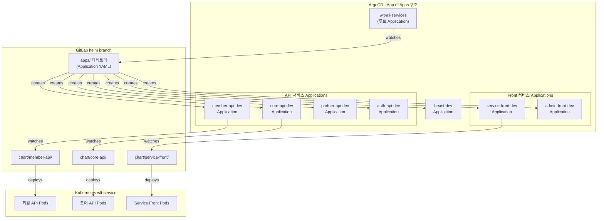

---

### E.15 ArgoCD + Helm 작동 원리 상세

#### E.15.1 전체 동기화 흐름

ArgoCD는 GitLab 저장소의 `helm` 브랜치를 주기적으로(기본 3분) 폴링하거나, GitLab Webhook을 통해 즉시 변경을 감지한다. 감지된 변경이 실제로 Kubernetes 리소스에 반영되기까지의 과정은 다음과 같다.

```mermaid
sequenceDiagram
    participant DEV as 개발자
    participant GITLAB as GitLab (helm branch)
    participant ARGOCD_REPO as ArgoCD Repo Server
    participant ARGOCD_APP as ArgoCD App Controller
    participant K8S as Kubernetes API Server
    participant POD as Application Pod

    DEV->>GITLAB: values.yaml 수정 (image.tag 변경) 후 Push

    Note over ARGOCD_REPO,GITLAB: 폴링 (3분) 또는 Webhook 즉시 감지
    ARGOCD_REPO->>GITLAB: helm branch 최신 커밋 확인
    ARGOCD_REPO->>GITLAB: 변경된 Chart 파일 Fetch
    ARGOCD_REPO->>ARGOCD_REPO: helm template 렌더링\n(values.yaml + values-dev.yaml 병합)

    ARGOCD_APP->>K8S: 현재 클러스터 상태 조회\n(kubectl get all -n wlt-service)
    ARGOCD_APP->>ARGOCD_APP: Diff 계산\n(Git 목표 상태 vs 현재 클러스터 상태)
    ARGOCD_APP-->>DEV: 상태: OutOfSync (변경 감지됨)

    alt 자동 Sync (automated.selfHeal: true)
        ARGOCD_APP->>K8S: kubectl apply (변경된 리소스만 적용)
    else 수동 Sync
        DEV->>ARGOCD_APP: SYNC 버튼 클릭 또는 argocd app sync
        ARGOCD_APP->>K8S: kubectl apply
    end

    K8S->>POD: Rolling Update 실행\n(신규 Pod 생성 → Probe 통과 → 구 Pod 종료)
    POD-->>K8S: startupProbe 통과 → readinessProbe 통과
    K8S-->>ARGOCD_APP: 배포 완료
    ARGOCD_APP-->>DEV: 상태: Synced / Healthy
```

#### E.15.2 Diff 계산 메커니즘

ArgoCD는 동기화 전에 반드시 Diff를 계산하여 어떤 리소스가 변경되는지 확인할 수 있다. Diff 결과는 ArgoCD UI 또는 CLI로 확인 가능하다.

```bash
# Diff 확인 (실제 적용 전 미리보기)
argocd app diff member-api-dev

# 출력 예시:
# --- a/Deployment/wlt-service/member-api-dev-member-api
# +++ b/Deployment/wlt-service/member-api-dev-member-api
# @@ -25,7 +25,7 @@
#      containers:
#      - name: member-api
# -      image: registry.internal:8080/wlt/member-api:2.0.0
# +      image: registry.internal:8080/wlt/member-api:2.0.1
```

#### E.15.3 Sync 옵션별 동작 방식

| 옵션 | 값 | 동작 |
|------|----|----|
| `automated.prune` | `true` | Git에서 삭제된 K8s 리소스를 클러스터에서도 삭제 |
| `automated.selfHeal` | `true` | K8s 리소스를 수동으로 변경하면 Git 상태로 자동 복원 |
| `syncOptions.CreateNamespace` | `true` | 네임스페이스가 없으면 자동 생성 |
| `retry.limit` | `3` | Sync 실패 시 최대 3회 재시도 |

#### E.15.4 Helm 렌더링 방식

ArgoCD는 내부적으로 `helm template` 명령어를 실행하여 Kubernetes Manifest를 생성한다. values 파일은 선언 순서대로 병합(후자 우선)된다.

```bash
# ArgoCD가 내부적으로 실행하는 명령어와 동일한 로컬 렌더링
helm template member-api-dev ./chart/member-api \
  -f ./chart/member-api/values.yaml \
  -f ./chart/member-api/values-dev.yaml \
  --namespace wlt-service \
  --set image.tag=2.0.1 \
  > rendered-manifests.yaml

# 렌더링 결과 확인 (ArgoCD UI의 Diff와 동일)
kubectl diff -f rendered-manifests.yaml
```

#### E.15.5 롤백 방법

ArgoCD에서 배포에 문제가 발생한 경우 이전 버전으로 즉시 롤백할 수 있다. 롤백은 Git 히스토리의 특정 커밋 시점으로 복원한다.

```bash
# 배포 히스토리 확인
argocd app history member-api-dev
# ID  DATE       REVISION
# 1   2026-05-29 helm@abc1234
# 2   2026-05-29 helm@def5678  ← 현재
# 3   2026-05-29 helm@ghi9012  ← 문제 발생 이전

# 특정 ID로 롤백
argocd app rollback member-api-dev 1

# 롤백 후 자동 Sync 비활성화 (수동 검토 시간 확보)
argocd app set member-api-dev --sync-policy none
```

#### E.15.6 ArgoCD Project를 통한 권한 분리

여러 팀이 동일 ArgoCD를 사용하는 경우 `AppProject`를 통해 팀별 접근 범위를 제한한다.

```yaml
# ArgoCD AppProject 설정
apiVersion: argoproj.io/v1alpha1
kind: AppProject
metadata:
  name: wlt-project
  namespace: argocd
spec:
  description: "WLT 2.0 서비스 배포 프로젝트"
  sourceRepos:
    - "https://gitlab.internal/wlt/*"   # WLT 관련 GitLab 저장소만 허용
  destinations:
    - namespace: wlt-service
      server: https://kubernetes.default.svc
    - namespace: wlt-service-stg
      server: https://kubernetes.default.svc
  clusterResourceWhitelist:
    - group: ""
      kind: Namespace                    # 네임스페이스 생성만 허용
  namespaceResourceWhitelist:
    - group: "apps"
      kind: Deployment
    - group: ""
      kind: Service
    - group: "autoscaling"
      kind: HorizontalPodAutoscaler
    - group: "networking.istio.io"
      kind: DestinationRule
    - group: "security.istio.io"
      kind: AuthorizationPolicy
  roles:
    - name: developer
      description: "개발팀 - Sync만 가능"
      policies:
        - p, proj:wlt-project:developer, applications, sync, wlt-project/*, allow
        - p, proj:wlt-project:developer, applications, get, wlt-project/*, allow
      groups:
        - wlt-dev-team
    - name: platform
      description: "플랫폼팀 - 전체 권한"
      policies:
        - p, proj:wlt-project:platform, applications, *, wlt-project/*, allow
      groups:
        - wlt-platform-team
```

#### E.15.7 전체 배포 파이프라인 통합 요약

```mermaid
flowchart TD
    subgraph DEV_PHASE["개발 단계"]
        CODE["소스 코드 수정"] --> MR["GitLab MR 생성"]
        MR --> CI_BUILD["GitLab CI 빌드\n테스트 + Docker 빌드"]
        CI_BUILD --> ECR_PUSH["AWS ECR Push\n이미지 태그: 2.0.1"]
    end

    subgraph HELM_PHASE["Helm Chart 업데이트 단계"]
        HELM_UPDATE["values.yaml 수정\nimage.tag: 2.0.1"] --> HELM_PUSH["GitLab\nhelm branch Push"]
    end

    subgraph ARGOCD_PHASE["ArgoCD 배포 단계"]
        ARGOCD_DETECT["ArgoCD\nWebhook 수신 또는 폴링"] --> ARGOCD_RENDER["helm template 렌더링\nvalues 파일 병합"]
        ARGOCD_RENDER --> ARGOCD_DIFF["Diff 계산\n현재 상태 vs 목표 상태"]
        ARGOCD_DIFF --> ARGOCD_SYNC["Sync 실행\nkubectl apply"]
    end

    subgraph K8S_PHASE["Kubernetes 배포 단계"]
        ROLLING["Rolling Update\n신규 Pod 생성"] --> STARTUP["startupProbe 통과\n초기화 완료 확인"]
        STARTUP --> READINESS["readinessProbe 통과\n트래픽 수신 준비"]
        READINESS --> OLD_TERM["구 Pod 종료\nGraceful Shutdown 60초"]
        OLD_TERM --> COMPLETE["배포 완료\nArgoCD: Healthy"]
    end

    ECR_PUSH --> HELM_UPDATE
    HELM_PUSH --> ARGOCD_DETECT
    ARGOCD_SYNC --> ROLLING
```


---

## 별첨 F. Spring Cloud Gateway 기반 API G/W 적용 — 장점 및 미적용 시 어려움

### F.1 개요

WLT 2.0의 대내 API G/W, 대외 API G/W, EIC API G/W 세 가지는 모두 **Spring Cloud Gateway(SCG)** 를 기반으로 구현되었다. Spring Cloud Gateway는 Spring 생태계의 공식 API G/W 라이브러리로, Spring Boot 3.x 기반의 리액티브(Reactive) 아키텍처 위에서 동작한다. 상용 API G/W 솔루션을 별도 도입하지 않고 Java 코드로 직접 구현된 G/W를 사용한다는 점이 WLT 2.0 아키텍처의 중요한 특징이다.

```mermaid
graph LR
    subgraph WLT_GW["WLT 2.0 API G/W Layer - Spring Cloud Gateway"]
        INNER["대내 API G/W\nSpring Cloud Gateway"]
        OUTER["대외 API G/W\nSpring Cloud Gateway"]
        EIC["EIC API G/W\nSpring Cloud Gateway"]
    end
    subgraph STACK["공통 기술 스택"]
        WEBFLUX["Spring WebFlux\nReactive Non-blocking"]
        SECURITY["Spring Security\nJWT 인증/인가"]
        RESILIENCE["Resilience4j\nCircuit Breaker"]
        ACTUATOR["Spring Actuator\n모니터링/헬스체크"]
    end
    WLT_GW --> STACK
```

### F.2 Spring Cloud Gateway 핵심 아키텍처

Spring Cloud Gateway는 **Route → Predicate → Filter** 세 가지 핵심 개념으로 동작한다. 클라이언트의 요청이 들어오면 Predicate(조건)를 평가하고, 매칭되는 Route를 찾은 후, 정의된 Filter 체인을 거쳐 목적지 서비스로 전달한다.

```mermaid
sequenceDiagram
    participant CLIENT as 클라이언트
    participant SCG as Spring Cloud Gateway
    participant PRE as Pre Filter 체인\n(인증/로깅/변환)
    participant ROUTE as Route 매칭\nPredicate 평가
    participant POST as Post Filter 체인\n(응답 변환/로깅)
    participant SVC as 백엔드 서비스

    CLIENT->>SCG: HTTP 요청
    SCG->>PRE: Pre Filter 실행\n(JWT 검증, 요청 헤더 추가 등)
    PRE->>ROUTE: Predicate 매칭\n(Path, Header, Method 등)
    ROUTE->>SVC: WebClient 비동기 요청
    SVC-->>POST: 응답 반환
    POST-->>CLIENT: Post Filter 실행 후\n최종 응답 반환
```

### F.3 Spring Cloud Gateway 적용의 주요 장점

#### F.3.1 Java/Spring 생태계 일관성 — 단일 기술 스택

WLT 2.0의 모든 백엔드 서비스는 Spring Boot 3.2 기반으로 구현된다. API G/W도 동일한 기술 스택을 사용함으로써 팀 전체가 하나의 언어와 프레임워크만 숙지하면 된다. 별도의 Lua(Kong), NGINX conf, 또는 독자적인 DSL을 학습할 필요가 없다.

G/W 코드가 일반 Spring Boot 애플리케이션과 동일한 구조를 가지므로, 백엔드 개발자가 G/W 로직을 직접 수정하고 기여할 수 있다. 코드 리뷰, 테스트 작성, CI/CD 파이프라인 모두 기존 백엔드 서비스와 동일하게 적용된다.

```java
// Spring Cloud Gateway Route 설정 — 일반 Spring Boot 코드와 동일한 방식
public class InnerApiGatewayConfig {

    @Bean
    public RouteLocator innerGatewayRoutes(RouteLocatorBuilder builder,
                                            JwtAuthenticationFilter jwtFilter,
                                            TransactionLoggingFilter txFilter) {
        return builder.routes()
            // 회원 API 라우트
            .route("member-api-route", r -> r
                .path("/api/member/**")
                .and().method(HttpMethod.GET, HttpMethod.POST, HttpMethod.PUT)
                .filters(f -> f
                    .filter(jwtFilter)          // JWT 인증 필터 (Java로 작성)
                    .filter(txFilter)           // 트랜잭션 ID 주입 필터
                    .rewritePath("/api/member/(?<segment>.*)", "/${segment}")
                    .addRequestHeader("X-Internal-Service", "inner-gw")
                    .circuitBreaker(cb -> cb
                        .setName("member-api-cb")
                        .setFallbackUri("forward:/fallback/member"))
                    .retry(rc -> rc
                        .setRetries(3)
                        .setBackoff(Duration.ofMillis(100), Duration.ofSeconds(1), 2, true)))
                .uri("lb://member-api-svc"))    // 서비스 디스커버리 연동
            .build();
    }
}
```

#### F.3.2 WebFlux 기반 비동기/Non-Blocking I/O — 고성능 처리

Spring Cloud Gateway는 **Spring WebFlux**와 **Project Reactor**를 기반으로 비동기, Non-Blocking I/O 방식으로 동작한다. 전통적인 서블릿 기반(Zuul 1.x, 톰캣) G/W는 요청 1건당 스레드 1개를 소비하지만, WebFlux 기반 SCG는 소수의 이벤트 루프 스레드로 수천 개의 동시 연결을 처리한다.

일반적으로 동일 하드웨어에서 SCG는 Zuul 1.x 대비 2~3배 높은 처리량을 보이며, 메모리 사용량은 1/3 수준으로 낮다. 금융 서비스처럼 순간적인 트래픽 폭증이 발생하는 환경에서 G/W 레이어가 병목이 되지 않는다는 것은 중요한 이점이다.

```
[처리 모델 비교]

전통 서블릿 방식 (Zuul 1.x / Tomcat)
  요청 1 → 스레드 1 할당 → 대기 → 응답 → 스레드 반환
  요청 2 → 스레드 2 할당 → 대기 → ...
  동시 요청 1,000개 → 스레드 1,000개 필요 (높은 메모리 소비)

Spring Cloud Gateway (WebFlux / Netty)
  이벤트 루프 스레드 N개 (보통 CPU 코어 수)
  → 요청 수신 → 비동기 처리 시작 → 즉시 다음 요청 수신
  동시 요청 10,000개도 N개 스레드로 처리 가능
```

#### F.3.3 커스텀 필터를 통한 비즈니스 로직 내재화

Spring Cloud Gateway의 가장 큰 강점 중 하나는 **커스텀 GlobalFilter/GatewayFilter를 Java 코드로 자유롭게 작성**할 수 있다는 점이다. WLT 2.0의 G/W는 다음과 같은 비즈니스 특화 필터들을 Java로 구현하였다.

```java
// GlobalFilter 예시 1: 트랜잭션 ID 자동 주입
public class TransactionLoggingFilter implements GlobalFilter {

    private static final String TX_ID_HEADER = "X-Transaction-Id";

    @Override
    public Mono<Void> filter(ServerWebExchange exchange, GatewayFilterChain chain) {
        String txId = Optional
            .ofNullable(exchange.getRequest().getHeaders().getFirst(TX_ID_HEADER))
            .orElse(UUID.randomUUID().toString());  // 없으면 신규 생성

        long startTime = System.currentTimeMillis();

        ServerHttpRequest mutatedRequest = exchange.getRequest().mutate()
            .header(TX_ID_HEADER, txId)
            .header("X-Gateway-Timestamp", String.valueOf(startTime))
            .build();

        return chain.filter(exchange.mutate().request(mutatedRequest).build())
            .doFinally(signal -> {
                long elapsed = System.currentTimeMillis() - startTime;
                log.info("TX={} path={} status={} elapsed={}ms",
                    txId,
                    exchange.getRequest().getPath(),
                    exchange.getResponse().getStatusCode(),
                    elapsed);
            });
    }
}

// GlobalFilter 예시 2: JWT 인증 및 클레임 추출
public class JwtAuthenticationFilter implements GlobalFilter {

    private final JwtTokenValidator jwtValidator;   // nimbus-jose-jwt 활용

    @Override
    public Mono<Void> filter(ServerWebExchange exchange, GatewayFilterChain chain) {
        String token = extractBearerToken(exchange.getRequest());
        if (token == null) {
            exchange.getResponse().setStatusCode(HttpStatus.UNAUTHORIZED);
            return exchange.getResponse().setComplete();
        }

        return Mono.fromCallable(() -> jwtValidator.validate(token))
            .flatMap(claims -> {
                // 검증된 클레임을 헤더로 백엔드에 전달
                ServerHttpRequest enrichedRequest = exchange.getRequest().mutate()
                    .header("X-User-Id", claims.getUserId())
                    .header("X-User-Roles", claims.getRoles())
                    .build();
                return chain.filter(exchange.mutate().request(enrichedRequest).build());
            })
            .onErrorResume(e -> {
                exchange.getResponse().setStatusCode(HttpStatus.UNAUTHORIZED);
                return exchange.getResponse().setComplete();
            });
    }
}
```

이처럼 G/W의 모든 공통 처리 로직(인증, 로깅, 헤더 조작, Rate Limiting 등)이 Java 코드로 명확하게 표현되어 유지보수성과 테스트 용이성이 높다.

#### F.3.4 Spring Security와의 네이티브 통합

Spring Cloud Gateway는 Spring Security와 동일한 생태계에 속하므로, Spring Security의 WebFlux 지원 모듈과 자연스럽게 통합된다. JWT 파싱 및 검증을 위한 nimbus-jose-jwt, OAuth2 Resource Server 설정, CORS 정책 등을 Spring Security 표준 방식으로 구성할 수 있다.

```java
// Spring Security + SCG 통합 보안 설정
public class SecurityConfig {

    @Bean
    public SecurityWebFilterChain springSecurityFilterChain(ServerHttpSecurity http) {
        return http
            .csrf(ServerHttpSecurity.CsrfSpec::disable)
            .cors(cors -> cors.configurationSource(corsConfigurationSource()))
            .authorizeExchange(exchanges -> exchanges
                .pathMatchers("/actuator/health", "/fallback/**").permitAll()
                .pathMatchers("/api/auth/**").permitAll()     // 인증 서비스는 공개
                .anyExchange().authenticated()
            )
            .oauth2ResourceServer(oauth2 -> oauth2
                .jwt(jwt -> jwt.jwtAuthenticationConverter(jwtConverter()))
            )
            .build();
    }
}
```

#### F.3.5 Resilience4j 통합 — 탄력성 패턴 내장

Circuit Breaker, Retry, Rate Limiter, Bulkhead 등의 탄력성 패턴을 Resilience4j와 통합하여 G/W 레벨에서 적용한다. 백엔드 서비스 장애 시 G/W가 Fallback 응답을 즉시 반환하여 장애 전파를 차단한다.

```yaml
# application.yml - Resilience4j + SCG 통합 설정
spring:
  cloud:
    gateway:
      routes:
        - id: core-api-route
          uri: lb://core-api-svc
          predicates:
            - Path=/api/core/**
          filters:
            - name: CircuitBreaker
              args:
                name: core-api-cb
                fallbackUri: forward:/fallback/core-api
            - name: Retry
              args:
                retries: 3
                statuses: SERVICE_UNAVAILABLE, GATEWAY_TIMEOUT
                backoff:
                  firstBackoff: 100ms
                  maxBackoff: 1000ms
                  factor: 2
            - name: RequestRateLimiter
              args:
                redis-rate-limiter.replenishRate: 100    # 초당 100 요청
                redis-rate-limiter.burstCapacity: 200    # 최대 버스트 200
                redis-rate-limiter.requestedTokens: 1
                key-resolver: "#{@userKeyResolver}"

resilience4j:
  circuitbreaker:
    instances:
      core-api-cb:
        slidingWindowSize: 10
        failureRateThreshold: 50
        waitDurationInOpenState: 10s
        permittedNumberOfCallsInHalfOpenState: 3
```

#### F.3.6 Route 동적 구성 및 코드 기반 관리

Spring Cloud Gateway는 YAML 설정 파일 외에 Java 코드(`RouteLocatorBuilder`)로도 Route를 정의할 수 있다. 이를 통해 복잡한 조건 분기, 환경별 Route 동적 로딩, 데이터베이스 기반 Route 구성 등이 가능하다. 또한 모든 Route 설정이 Git으로 버전 관리되어 변경 이력 추적이 용이하다.

```java
// 환경별 동적 Route 구성 예시
public RouteLocator eicGatewayRoutes(RouteLocatorBuilder builder) {
    return builder.routes()
        // EIC G/W: 외부 파트너사별 프로토콜 변환 라우트
        .route("eic-a-card", r -> r
            .path("/eic/a-card/**")
            .filters(f -> f
                .rewritePath("/eic/a-card/(?<segment>.*)", "/v1/${segment}")
                .addRequestHeader("X-Partner-Id", "A-CARD")
                .addRequestHeader("Authorization", "Bearer ${partner.a-card.token}")
                .modifyRequestBody(String.class, String.class,
                    (exchange, body) -> Mono.just(convertToPartnerFormat(body))))
            .uri("https://api.a-card.external"))
        .build();
}
```

#### F.3.7 Spring Actuator를 통한 통합 모니터링

Spring Cloud Gateway는 Spring Actuator와 완전히 통합되어 있어, 별도 에이전트 설치 없이 다음 정보를 모니터링할 수 있다.

```yaml
management:
  endpoints:
    web:
      exposure:
        include: health, info, metrics, gateway, prometheus
  endpoint:
    gateway:
      enabled: true   # /actuator/gateway/routes, /actuator/gateway/filters 엔드포인트 활성화
```

`/actuator/gateway/routes`를 통해 현재 활성화된 모든 Route를 런타임에서 확인하고, Prometheus를 통해 Route별 처리 시간, 요청 수, 오류율을 Grafana 대시보드에 통합할 수 있다.

#### F.3.8 대내/대외/EIC G/W별 특화 적용 포인트

WLT 2.0의 세 G/W는 동일한 Spring Cloud Gateway 기반이지만, 각각의 역할에 맞게 필터와 Route 설정을 달리 구성한다.

| 구분 | 특화 필터/설정 | 목적 |
|------|--------------|------|
| **대내 API G/W** | JWT 검증 필터, 트랜잭션 ID 주입, 내부 서비스 디스커버리 연동 | 앱↔내부 서비스 간 통신 보안 및 추적 |
| **대외 API G/W** | Partner API Key 검증, 요청/응답 변환 필터, 외부망 IP 허용 목록 | 외부 파트너사와의 안전한 연동 |
| **EIC API G/W** | 프로토콜 변환 필터(REST↔XML/ISO), EIC 전문 ID 생성, 암호화/복호화 필터 | 레거시 외부 시스템(ISO, 전문 방식)과의 연동 |

---

### F.4 Spring Cloud Gateway 미적용 시 어려움

Spring Cloud Gateway를 사용하지 않고 상용 API G/W 솔루션이나 다른 오픈소스를 채택하거나, 아예 G/W 없이 서비스를 운영하는 경우 다음과 같은 어려움이 발생한다.

#### F.4.1 상용/외부 솔루션 도입 시

**기술 스택 이원화**가 가장 큰 문제이다. Java 기반 MSA에 Kong(Lua 기반), AWS API Gateway(콘솔 기반), NGINX(conf 파일 기반) 등 이질적인 기술을 추가하면 팀이 두 가지 기술 스택을 동시에 유지보수해야 한다.

Java 개발자가 Lua 플러그인이나 NGINX 설정 문법을 학습해야 하며, 이는 온보딩 비용 증가와 실수 가능성 상승으로 이어진다. 또한 G/W 설정 변경과 백엔드 서비스 변경이 서로 다른 파이프라인을 통해 배포되므로, 동기화 실패로 인한 장애 위험이 높아진다.

```
[기술 스택 이원화의 문제]

Spring Cloud Gateway 사용 시:
  백엔드 서비스 변경 → GitLab CI → ECR Push → ArgoCD Sync
  G/W 변경            → (동일 파이프라인)

상용 G/W 사용 시:
  백엔드 서비스 변경 → GitLab CI → ECR Push → ArgoCD Sync
  G/W 변경            → Kong Admin API 호출 / AWS 콘솔 / Nginx conf 수정
                       → 별도 배포 절차 → 버전 불일치 위험
```

#### F.4.2 커스텀 비즈니스 로직 삽입의 어려움

WLT 2.0의 G/W는 단순 라우팅을 넘어 JWT 파싱 후 클레임 추출, 전문 ID 생성, 프로토콜 변환, 파트너사별 인증 헤더 삽입 등 복잡한 비즈니스 로직을 포함한다.

이런 로직을 외부 솔루션에 구현하려면 각 솔루션이 제공하는 플러그인 확장 메커니즘(Kong: Lua/Go 플러그인, AWS API Gateway: Lambda Authorizer, NGINX: njs 모듈)을 사용해야 한다. 이는 Java 코드 대비 개발 생산성이 낮고, 단위 테스트 작성이 어려우며, 디버깅도 복잡하다. 특히 EIC G/W처럼 ISO 전문 방식의 레거시 시스템과 연동하는 복잡한 프로토콜 변환 로직은 Java 외 언어로 구현하면 개발 비용이 크게 증가한다.

#### F.4.3 API G/W 자체를 두지 않을 경우

G/W 없이 각 서비스가 직접 외부 요청을 받는 경우, 인증/인가 로직이 모든 서비스에 중복으로 구현되어야 한다. JWT 검증, Rate Limiting, 트랜잭션 ID 관리, CORS 처리 등 공통 관심사가 각 서비스에 흩어지면 다음과 같은 문제가 발생한다.

공통 로직 변경 시 모든 서비스를 동시에 수정하고 재배포해야 하므로 배포 코스트가 높다. 또한 서비스별 구현이 미묘하게 달라지면서 일관성 없는 인증 처리로 보안 취약점이 생길 수 있다. 트래픽 모니터링과 로깅의 집중화도 불가능하여 운영 관측성이 떨어진다.

```mermaid
graph TD
    subgraph WITHOUT_GW["G/W 없는 경우 - 각 서비스에 공통 로직 중복"]
        CL[클라이언트]
        A["회원 API\n인증로직 포함\n로깅 포함\nRate Limit 포함"]
        B["코어 API\n인증로직 포함\n로깅 포함\nRate Limit 포함"]
        C["제휴 API\n인증로직 포함\n로깅 포함\nRate Limit 포함"]
        CL --> A & B & C
    end
    subgraph WITH_GW["G/W 있는 경우 - 공통 로직 중앙화"]
        CL2[클라이언트]
        GW["Spring Cloud Gateway\n인증/로깅/Rate Limit\n한 곳에서 처리"]
        A2["회원 API\n비즈니스 로직만"]
        B2["코어 API\n비즈니스 로직만"]
        C2["제휴 API\n비즈니스 로직만"]
        CL2 --> GW --> A2 & B2 & C2
    end
```

#### F.4.4 Zuul 1.x 사용 시 (레거시 G/W)

Netflix Zuul 1.x는 Spring Cloud의 이전 세대 G/W로, 서블릿 기반 블로킹 I/O를 사용한다. Spring Boot 3.x 환경에서는 공식 지원이 종료되었으며, Spring Cloud Gateway 대비 처리 성능이 현저히 낮다. 특히 동시 연결이 많은 환경에서는 스레드 고갈(Thread Pool Exhaustion)이 발생할 수 있다. Zuul 1.x를 사용하는 기존 시스템은 Spring Cloud Gateway로 마이그레이션이 권장된다.

---

### F.5 Spring Cloud Gateway vs 주요 대안 비교

| 구분 | Spring Cloud Gateway | Kong | AWS API Gateway | NGINX Plus |
|------|---------------------|------|----------------|------------|
| **기반 기술** | Java/WebFlux | Lua/OpenResty | AWS 관리형 | C/Lua |
| **커스텀 로직** | Java 코드 (용이) | Lua 플러그인 | Lambda 함수 | njs/Lua 모듈 |
| **Spring 통합** | 네이티브 완전 지원 | 별도 연동 필요 | 별도 연동 필요 | 별도 연동 필요 |
| **성능** | 높음 (Non-blocking) | 높음 | 관리형 (자동) | 매우 높음 |
| **운영 복잡성** | 낮음 (동일 스택) | 중간 | 낮음 (관리형) | 중간 |
| **라이선스 비용** | 무료 (OSS) | 유료 (Enterprise) | 종량제 과금 | 유료 (상용) |
| **Private 환경** | 가능 | 가능 | AWS 의존 | 가능 |
| **Java 팀 친화성** | 매우 높음 | 낮음 | 중간 | 낮음 |
| **Circuit Breaker** | Resilience4j 내장 | 플러그인 | 없음 (Lambda) | 제한적 |
| **테스트 용이성** | JUnit/MockMvc 사용 | 제한적 | 어려움 | 어려움 |

> Spring Cloud Gateway는 Java 팀이 운영하는 MSA 환경에서 가장 낮은 마찰(friction)로 도입 가능한 API G/W이다. 특히 WLT 2.0처럼 Spring Boot 기반의 서비스가 다수이고, 복잡한 비즈니스 로직이 G/W에 포함되어야 하는 경우 Spring Cloud Gateway는 사실상 최선의 선택이다.

---

> **[각주 12]** Spring Cloud Gateway는 2025년 현재 CNCF 생태계에서 Java 기반 MSA의 사실상 표준 API G/W로 자리잡았다. Reactive Streams 사양(Project Reactor)을 기반으로 하여 기존 Zuul 1.x 대비 동일 리소스에서 2~3배의 처리량을 달성하며, Spring Boot 3.x의 Virtual Thread 지원과 결합하면 추가적인 성능 향상도 가능하다. 2025년 발표된 우선순위 인식 리액티브 API 연구에 따르면, WebFlux 기반 G/W는 금융 서비스처럼 SLA가 엄격한 환경에서 트래픽 계층화와 우선순위 처리에 특히 유리한 것으로 나타났다.
> 참조: [API Gateways in 2025: From NGINX to Spring Cloud Gateway](https://medium.com/devdomain/api-gateways-in-2025-from-nginx-to-spring-cloud-gateway-2f1ca03e41a7) · [Priority-Aware Reactive APIs with Spring WebFlux](https://eu-opensci.org/index.php/ejece/article/view/19743) · [Spring Cloud Gateway 공식 문서](https://spring.io/projects/spring-cloud-gateway/)

