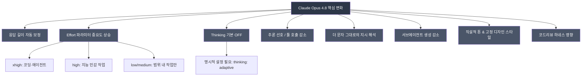
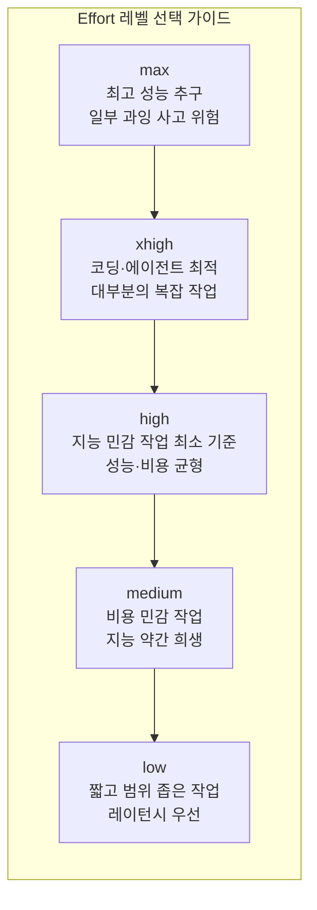
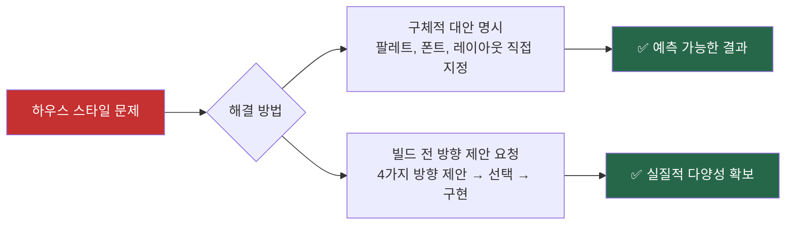
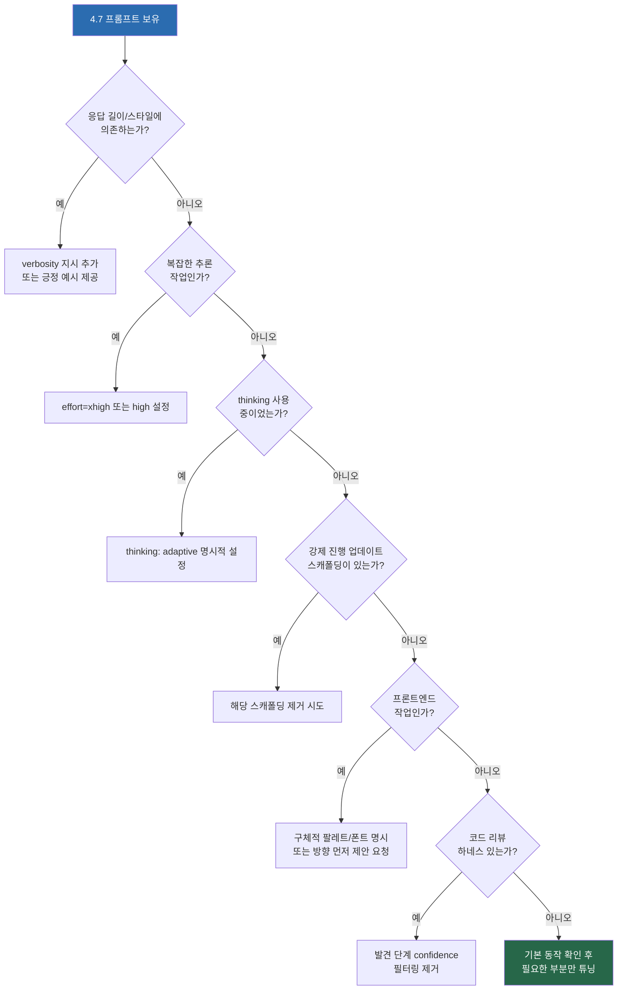

### Anthropic 공식 문서 기반 심층 분석 — 4.7 대비 달라진 점과 실전 활용법

> **출처:** [Anthropic 공식 프롬프팅 베스트 프랙티스 문서](https://platform.claude.com/docs/en/build-with-claude/prompt-engineering/claude-prompting-best-practices) (2026년 5월 30일 기준 최신)  
> **대상 독자:** Claude API를 활용하는 개발자, 프롬프트 엔지니어, AI 제품 기획자

## 관련글

[**Claude Opus 4.8 이 오늘 새로 발표되면서, 4.8에 최적화된 프롬프팅 베스트 프랙티스 가이드라인 문서가 업데이트되었습니다.**](https://www.facebook.com/share/18uPBWJKfP)


---

## 개요

2026년 5월 30일, Anthropic은 **Claude Opus 4.8**을 출시하면서 공식 프롬프팅 가이드라인 문서를 대폭 업데이트했습니다. 4.8은 기존 4.7 프롬프트에서 "바로(out of the box)" 잘 동작하는 설계를 갖추고 있으나, 모델의 특성이 여러 측면에서 근본적으로 바뀌었기 때문에 제대로 활용하려면 기존 방식과 다른 접근이 필요합니다.

이 문서는 Anthropic 공식 문서를 직접 검색하여 확인한 내용을 바탕으로, Claude Opus 4.8에 특화된 10가지 핵심 프롬프팅 변화를 상세히 설명합니다. **막연한 추측이나 미확인 정보는 일절 포함하지 않았습니다.**

---

## 한눈에 보는 4.7 → 4.8 핵심 변화



---

## Part 1. Claude Opus 4.8 전용 프롬프팅 가이드

### 1. 응답 길이와 Verbosity (장황함) 자동 보정

**무엇이 달라졌는가**

4.7까지는 모델이 비교적 고정된 verbosity(응답 길이와 상세도)를 유지하는 경향이 있었습니다. 그러나 4.8은 **작업의 복잡도를 스스로 판단하여 응답 길이를 동적으로 조절**합니다. 단순한 사실 조회에는 짧고 간결하게 답하고, 개방형 분석이나 복잡한 논리 추론에는 훨씬 길고 상세하게 답하는 방식입니다.

**왜 중요한가**

만약 여러분의 제품이 응답의 길이나 스타일을 특정 방식으로 기대하고 있다면, 4.8에서는 그 기대가 어긋날 수 있습니다. 예를 들어, 챗봇 UI에서 언제나 2~3줄짜리 간결한 답변을 원했다면, 이제 프롬프트로 명시적으로 지정해야 합니다.

**공식 권장 사항**

응답을 간결하게 유지하고 싶다면 다음과 같이 명시합니다.

```
Provide concise, focused responses. Skip non-essential context, and keep examples minimal.
```

단, 부정형 지시("~하지 마라")보다는 **긍정적 예시**가 더 효과적입니다. 원하는 응답 스타일의 예시를 직접 보여주는 것이 "과잉 설명하지 마라"라고 금지하는 것보다 훨씬 강력합니다.

---

### 2. Effort 파라미터 — 4.8에서 가장 중요한 레버

**무엇이 달라졌는가**

Anthropic 공식 문서는 effort 파라미터가 **"이 모델에서 이전 어떤 Opus보다 중요하다(more important for this model than for any prior Opus)"** 고 명시합니다. 4.8은 effort 레벨을 이전 모델보다 훨씬 엄격하게(strictly) 따릅니다. 특히 `low` 쪽에서 이 경향이 두드러집니다.

**Effort 레벨별 특성**



**핵심 원칙: 프롬프트로 우회하지 말고 Effort를 올려라**

4.7까지는 복잡한 문제에서 얕은 추론이 나올 때 "더 깊이 생각해라", "단계별로 분석해라" 같은 프롬프트 트릭으로 어느 정도 보완할 수 있었습니다. 그러나 4.8에서는 **프롬프트로 우회하는 것보다 effort를 `high` 또는 `xhigh`로 올리는 것이 더 효과적**입니다.

`low` 또는 `medium` effort에서는 모델이 "요청된 범위 내에서만 작업하고 그 이상을 하지 않는" 방식으로 동작하기 때문에, 복잡한 문제에서 얕은 추론이 나오는 것은 능력 부족이 아니라 설계된 동작입니다. 꼭 `low` effort를 유지해야 한다면 다음 가이드를 추가할 수 있습니다.

```
This task involves multi-step reasoning. Think carefully through the problem before responding.
```

---

### 3. Thinking(추론) — 기본값이 OFF로 변경됨

**무엇이 달라졌는가**

4.8에서는 thinking이 **기본적으로 꺼져 있습니다.** 이전 모델에서 thinking이 기본 활성화되거나 자동으로 트리거되던 것과 달리, 4.8에서 extended thinking 또는 adaptive thinking을 사용하려면 반드시 명시적으로 설정해야 합니다.

**활성화 방법**

```python
client.messages.create(
    model="claude-opus-4-8",
    max_tokens=64000,
    thinking={"type": "adaptive"},
    output_config={"effort": "high"},
    messages=[{"role": "user", "content": "..."}]
)
```

`thinking: {type: "adaptive"}`를 명시하지 않으면 thinking은 작동하지 않습니다.

**Adaptive Thinking의 동작 방식**

Adaptive thinking은 모델이 스스로 "이 문제에 깊은 추론이 필요한가?"를 판단하여 thinking을 켜고 끄는 방식입니다. 두 가지 요소가 thinking 발동을 결정합니다.

- `effort` 파라미터의 높낮이 (높을수록 더 자주 thinking)
- 쿼리의 복잡도 (복잡할수록 더 자주 thinking)

크거나 복잡한 시스템 프롬프트를 사용할 경우, 모델이 과하게 생각하는 경향이 생길 수 있습니다. 이럴 때는 다음 가이드를 추가합니다.

```
Thinking adds latency and should only be used when it will meaningfully improve answer quality — 
typically for problems that require multi-step reasoning. When in doubt, respond directly.
```

**max/xhigh effort 사용 시 출력 토큰 예산**

`max` 또는 `xhigh` effort에서 4.8을 실행할 때는 서브에이전트와 툴 호출을 위한 공간이 충분히 필요하므로, **`max_tokens`를 64k에서 시작하여 튜닝**하는 것이 권장됩니다.

---

### 4. 툴 호출 트리거 변화 — 추론 우선 경향

**무엇이 달라졌는가**

4.8은 4.7에 비해 **툴을 직접 호출하는 것보다 추론(내부 논리)으로 해결하는 것을 선호**하는 경향이 생겼습니다. 대부분의 경우 이는 더 나은 결과를 만들어내지만, 특정 상황에서는 툴 사용이 필요한데도 모델이 스스로 추론으로 처리하려 할 수 있습니다.

**어떻게 조정하는가**

툴 사용량을 늘리고 싶다면 가장 효과적인 방법은 **effort를 올리는 것**입니다. 특히 지식 작업(knowledge work)에서 `high` 또는 `xhigh` effort는 검색 툴과 코딩 툴 사용을 크게 늘립니다.

추가로, 언제 어떤 툴을 써야 하는지 프롬프트에서 명시적으로 설명하는 것도 효과적입니다. 예를 들어 웹 검색 툴이 있는데 모델이 사용하지 않는다면, 시스템 프롬프트에 "최신 정보가 필요한 경우 반드시 웹 검색 툴을 사용하라"고 명시합니다.

---

### 5. 사용자 대면 진행 상황 업데이트

**무엇이 달라졌는가**

4.8은 긴 에이전트 작업 동안 **자체적으로 더 규칙적이고 품질 높은 중간 진행 상황 업데이트**를 제공합니다. 4.7에서는 이 기능이 부족해서 개발자들이 "3번 툴 호출마다 진행 상황을 요약하라"처럼 강제 스캐폴딩을 프롬프트에 추가하는 경우가 많았습니다.

**실전 조언**

4.7용 프롬프트에 이런 강제 업데이트 스캐폴딩이 있다면 **제거해 보는 것을 권장**합니다. 4.8은 이미 스스로 적절한 업데이트를 제공하므로 오히려 중복되거나 불필요한 노이즈가 될 수 있습니다. 업데이트의 내용이나 형식이 원하는 것과 다르다면, 어떤 업데이트를 원하는지 예시와 함께 명시하면 됩니다.

---

### 6. 더 문자 그대로(Literal)의 지시 해석

**무엇이 달라졌는가**

이것은 4.7 → 4.8에서 가장 체감하기 쉬운 변화 중 하나입니다. 4.8은 **프롬프트를 더 문자 그대로, 더 명시적으로 해석**합니다. 특히 낮은 effort 레벨에서 이 경향이 강합니다.

구체적으로 이것이 의미하는 바는 다음과 같습니다.

첫째, 한 항목에 대한 지시가 있더라도, 다른 항목에 조용히 일반화하지 않습니다. 예를 들어 "첫 번째 섹션의 제목을 굵게 표시하라"고 했을 때 나머지 섹션에는 적용하지 않습니다.

둘째, 요청하지 않은 것을 추론하여 수행하지 않습니다. 이전에는 "이 코드를 리팩토링해라"고 하면 관련 테스트도 업데이트하거나 주석도 개선해주곤 했는데, 4.8에서는 정확히 요청된 것만 합니다.

**장점과 단점**

이 특성은 예측 가능성과 정밀성이라는 큰 장점을 줍니다. 구조적 데이터 추출, API 파이프라인, 정교하게 튜닝된 프롬프트를 가진 제품에서 특히 유용합니다. 그러나 지시를 넓게 적용하길 원한다면, **범위를 명시적으로 선언**해야 합니다.

```
Apply this formatting to every section, not just the first one.
```

---

### 7. 톤과 글쓰기 스타일의 변화

**무엇이 달라졌는가**

모든 새 모델이 그렇듯, 4.8도 산문 스타일에서 변화가 있습니다. 4.8은 **직설적이고 의견이 분명한(direct, opinionated) 스타일**을 기본으로 합니다.

구체적으로는 검증·맞장구성 표현이 줄었습니다. "좋은 질문이에요!", "물론이죠!" 같은 문구를 자제하는 방향입니다. 이모지 사용도 절제됩니다. 전체적으로 더 효율적이고 전문적인 어조입니다.

**실전 조언**

제품의 목소리(brand voice)가 이와 다르다면 프롬프트를 새 기준선에 맞춰 재평가해야 합니다. 예를 들어 더 따뜻하고 대화적인 톤을 원한다면 다음을 추가합니다.

```
Use a warm, collaborative tone. Acknowledge the user's framing before answering.
```

---

### 8. 서브에이전트 스포닝(Subagent Spawning) 감소

**무엇이 달라졌는가**

4.8은 기본적으로 서브에이전트를 **더 적게 생성**합니다. 참고로 4.6은 오히려 서브에이전트를 과다하게 생성하는 경향(과도한 서브에이전트 남용)이 있었는데, 4.8에서는 이 방향이 반전되었습니다.

**어떻게 조정하는가**

이 동작은 프롬프트로 조절 가능합니다. 서브에이전트를 더 많이 생성하길 원한다면 언제 서브에이전트가 바람직한지 명시적인 가이드를 줍니다.

```
Do not spawn a subagent for work you can complete directly in a single response 
(e.g. refactoring a function you can already see).

Spawn multiple subagents in the same turn when fanning out across items or reading multiple files.
```

---

### 9. 디자인과 프론트엔드 기본값 — "하우스 스타일" 문제

**무엇이 달라졌는가**

4.8은 강한 디자인 본능과 함께 **일관된 고정 "하우스 스타일"** 을 갖게 되었습니다. 이 기본 스타일의 특징은 다음과 같습니다.

크림/오프화이트 배경(약 `#F4F1EA`)을 사용합니다. 세리프 디스플레이 폰트(Georgia, Fraunces, Playfair Display 등)를 선호합니다. 이탤릭 강조와 테라코타/앰버 계열 액센트 색상을 기본으로 합니다. 슬라이드 덱을 만들 때도 웹 UI와 동일한 스타일이 적용됩니다.

이 기본값은 에디토리얼, 호스피탈리티, 포트폴리오 류의 디자인에는 잘 맞지만, 대시보드, 개발 도구, 핀테크, 헬스케어, 엔터프라이즈 앱에는 어울리지 않습니다.

**왜 문제인가**

이 하우스 스타일은 매우 끈질기게(persistent) 유지됩니다. "크림 배경 쓰지 마라", "미니멀하게 해라" 같은 일반적인 부정 지시를 하면, 모델이 또 다른 고정 팔레트로 옮겨갈 뿐 진정한 다양성이 생기지 않습니다.



**방법 1: 구체적 대안 명세**

```
Design a desktop landing page for a supplement brand called AEFRM.

Color palette should stay within this range:
#E9ECEC, #C9D2D4, #8C9A9E, #44545B, #11171B.

Use a square, angular sans-serif with wider letter spacing in headings.
```

**방법 2: 빌드 전 방향 제안 요청**

```
Before building, propose 4 distinct visual directions tailored to this brief 
(each as: bg hex / accent hex / typeface — one-line rationale). 
Ask the user to pick one, then implement only that direction.
```

**긍정적인 측면**

4.8은 이전 모델보다 더 적은 프론트엔드 프롬프팅으로도 "AI slop" 미감(generic하고 인공적인 느낌의 디자인)을 피할 수 있습니다. 이전에는 긴 `frontend-design` 스킬 스니펫이 필요했지만, 4.8에서는 다음 간결한 스니펫으로도 충분합니다.

```
<frontend_aesthetics>
NEVER use generic AI-generated aesthetics like overused font families (Inter, Roboto, Arial, 
system fonts), cliched color schemes (particularly purple gradients on white or dark backgrounds), 
predictable layouts and component patterns, and cookie-cutter design that lacks 
context-specific character. Use unique fonts, cohesive colors and themes, and animations 
for effects and micro-interactions.
</frontend_aesthetics>
```

---

### 10. 코드 리뷰 하네스 — 하네스 효과 이해하기

**무엇이 달라졌는가**

4.8은 4.7보다 버그 탐지 능력이 의미 있게(meaningfully) 향상되었으며, Anthropic 내부 평가에서 recall과 precision이 모두 높아졌습니다. 그런데 역설적으로, 4.7용으로 튜닝된 코드 리뷰 하네스를 그대로 쓰면 **처음에는 recall이 낮아 보일 수 있습니다.**

**왜 이런 일이 생기는가**

이것은 능력 저하가 아니라 **하네스 효과(harness effect)** 입니다. 4.8은 지시를 더 충실하게 따르기 때문에, 기존 하네스에 포함된 "high-severity만 보고하라", "보수적으로 하라" 같은 지시를 정말로 엄격히 따릅니다. 결과적으로 모델이 코드를 깊이 조사하고 버그를 발견하더라도, 심각도가 낮다고 판단되면 보고하지 않습니다.

**해결 방법**

버그 탐지 단계에서는 confidence 필터링을 제거하고, "커버리지가 목표"임을 명시합니다.

```
Report every issue you find, including ones you are uncertain about or consider low-severity. 
Do not filter for importance or confidence at this stage - a separate verification step will do that. 
Your goal here is coverage: it is better to surface a finding that later gets filtered out 
than to silently drop a real bug. For each finding, include your confidence level and 
an estimated severity so a downstream filter can rank them.
```

실제로 2단계 검증 파이프라인이 없더라도 이 프롬프트는 효과적입니다. 중요한 것은 발견 단계에서 모델이 필터링을 담당하지 않도록 명시하는 것입니다.

---

### 11. 인터랙티브 코딩 제품 — 토큰 사용량 증가 주의

**무엇이 달라졌는가**

4.8은 자율적 단일 턴 코딩 에이전트와 인터랙티브 다중 턴 코딩 환경 사이에서 동작이 다릅니다. 특히 **인터랙티브(동기적, 다중 턴) 환경에서 사용자 턴 이후 더 많이 추론**하여 토큰을 더 소비하는 경향이 있습니다.

이는 장기적 일관성과 지시 수행 능력을 향상시키는 긍정적 효과가 있지만, 토큰 비용이 늘어납니다.

**권장 접근 방식**

`xhigh` 또는 `high` effort를 사용합니다. 자동 모드(auto mode) 같은 자율 기능을 추가합니다. 사용자가 입력해야 하는 횟수를 줄이도록 제품을 설계합니다. 첫 번째 턴에서 작업, 의도, 제약을 최대한 명확히 명시합니다.

첫 턴에서 작업을 잘 정의하면 자율성과 효율이 모두 극대화됩니다. 반대로 애매하게 시작해서 여러 턴에 걸쳐 정보를 조금씩 제공하는 패턴은 토큰 효율과 성능 모두를 저하시킵니다.

---

## Part 2. 일반 프롬프팅 원칙 (모든 모델 공통)

### 명확하고 직접적으로 작성하기

Claude는 명확하고 명시적인 지시에 잘 반응합니다. "당연히 알겠지"라고 가정하지 말고, 원하는 바를 정확히 기술해야 합니다. 공식 문서에서 제안하는 황금 룰은 다음과 같습니다.

> **"프롬프트를 맥락을 모르는 동료에게 보여주었을 때 그 사람이 혼란스러워한다면, Claude도 혼란스러워할 것이다."**

단계별로 순서가 중요한 지시는 번호 목록으로 작성하고, 구체적인 출력 형식과 제약 조건을 명시합니다.

### 맥락과 이유 제공하기

지시 뒤에 그 이유를 설명하면 Claude가 목표를 더 잘 이해하고 더 적합한 응답을 생성합니다. "왜 이런 형식이 필요한지"를 설명하면 모델이 지능적으로 일반화할 수 있습니다.

### 예시(Few-Shot) 활용하기

예시는 출력 형식, 톤, 구조를 조정하는 가장 신뢰할 수 있는 방법입니다. 공식 문서에서는 3~5개의 예시를 권장하며, 예시는 `<example>` 태그로 감싸는 것이 좋습니다. 예시를 만들 때는 실제 사용 사례를 반영하고, 엣지 케이스를 포함하며, 의도하지 않은 패턴을 학습하지 않도록 충분히 다양하게 구성합니다.

### XML 태그로 프롬프트 구조화하기

XML 태그는 복잡한 프롬프트에서 지시, 맥락, 예시, 입력 변수를 명확히 구분합니다. 일관된 태그 이름을 사용하고, 계층 구조가 있을 때는 중첩 태그를 활용합니다.

```xml
<instructions>
여기에 지시 내용
</instructions>

<context>
관련 배경 정보
</context>

<input>
처리할 실제 입력
</input>
```

### 역할(Role) 부여하기

시스템 프롬프트에 역할을 설정하면 Claude의 동작과 톤이 목적에 맞게 집중됩니다. 한 문장만으로도 효과가 있습니다.

```
You are a helpful coding assistant specializing in Python.
```

---

## Part 3. 툴 사용 최적화

### 명시적 지시가 핵심

4.8을 포함한 최신 Claude 모델은 정밀한 지시 수행에 최적화되어 있습니다. "변경 사항을 제안해줄 수 있나요?"라고 하면 Claude가 제안만 하고 실제 구현하지 않을 수 있습니다. 툴로 실제 행동을 원한다면 더 명시적으로 요청해야 합니다.

기본적으로 행동하도록 만들고 싶다면 다음을 시스템 프롬프트에 추가합니다.

```
<default_to_action>
By default, implement changes rather than only suggesting them. If the user's intent is unclear, 
infer the most useful likely action and proceed, using tools to discover any missing details 
instead of guessing.
</default_to_action>
```

반대로 신중하게 행동하도록 하려면 다음을 사용합니다.

```
<do_not_act_before_instructions>
Do not jump into implementation or change files unless clearly instructed to make changes. 
When the user's intent is ambiguous, default to providing information, doing research, 
and providing recommendations rather than taking action.
</do_not_act_before_instructions>
```

### 병렬 툴 호출 최적화

최신 모델은 병렬 툴 실행을 잘 수행합니다. 여러 파일을 동시에 읽거나, 여러 검색을 동시에 실행합니다. 이 동작을 강화하고 싶다면 다음을 추가합니다.

```
<use_parallel_tool_calls>
If you intend to call multiple tools and there are no dependencies between the tool calls, 
make all of the independent tool calls in parallel. Maximize use of parallel tool calls 
where possible to increase speed and efficiency.
</use_parallel_tool_calls>
```

---

## Part 4. 에이전트 시스템 구축 가이드

### 장기 추론과 상태 추적

4.8을 포함한 최신 모델들은 매우 긴 에이전트 작업에서 강력한 상태 추적 능력을 보입니다. 점진적 진행에 집중하고, 여러 컨텍스트 윈도우에 걸쳐 작업할 때도 상태를 잘 유지합니다.

컨텍스트 창이 자동으로 압축(compact)되는 환경이라면, 모델에게 이를 알려주어야 합니다.

```
Your context window will be automatically compacted as it approaches its limit, 
allowing you to continue working indefinitely from where you left off. 
Therefore, do not stop tasks early due to token budget concerns.
```

### 다중 컨텍스트 윈도우 작업 권장 패턴

긴 작업을 여러 컨텍스트 윈도우에 걸쳐 수행할 때 권장되는 방식이 있습니다.

첫 컨텍스트 윈도우는 프레임워크 설정에 사용합니다. 테스트 작성, 설정 스크립트 생성 같은 기초 작업을 합니다.

이후 컨텍스트 윈도우에서는 할 일 목록(todo list)을 기반으로 반복 작업합니다.

JSON 같은 구조화된 형식으로 진행 상태와 테스트 결과를 관리합니다.

git을 상태 추적에 적극 활용합니다. 최신 Claude 모델은 git을 활용한 세션 간 상태 관리를 특히 잘 수행합니다.

### 자율성과 안전성 균형

Claude Opus 4.6까지는 가이드 없이도 파일 삭제, 강제 푸시, 외부 서비스 게시 같은 되돌리기 어려운 행동을 취할 수 있었습니다. 4.8에서 이를 방지하려면 다음 가이드를 제공합니다.

```
Consider the reversibility and potential impact of your actions. 
You are encouraged to take local, reversible actions like editing files or running tests, 
but for actions that are hard to reverse, affect shared systems, or could be destructive, 
ask the user before proceeding.
```

---

## Part 5. 마이그레이션 핵심 체크리스트

### Claude Opus 4.7 → 4.8 마이그레이션



### API 파라미터 변경사항

공식 문서는 API 파라미터 변경(샘플링 파라미터, effort 기본값, 1M 컨텍스트 기본값, 중간 시스템 메시지 등)에 대해서는 **별도의 Migration Guide**를 참조하도록 안내하고 있습니다. 이 내용이 필요하다면 공식 Migration Guide를 확인하시기 바랍니다.

[Migration Guide 바로 가기](https://platform.claude.com/docs/en/about-claude/models/migration-guide#migrating-from-claude-opus-47)

---

## 결론: 핵심 메시지 요약

Anthropic 공식 문서가 4.7에서 4.8로의 전환에서 전달하는 가장 중요한 메시지는 하나입니다.

> **"이전처럼 모델을 다그치거나(anti-laziness) 강제 스캐폴딩을 넣기보다, 스캐폴딩을 제거하고 effort 레버와 명시적 범위 지정으로 조절하라."**

4.8은 더 자율적이고, 더 정밀하며, 더 예측 가능한 모델입니다. 이 특성을 최대한 활용하려면 과거의 "모델을 강제로 끌고 가는" 방식의 프롬프트 엔지니어링에서 벗어나, 모델의 판단을 신뢰하되 **명확한 범위와 올바른 effort 레벨로 방향을 잡아주는** 방식으로 전환해야 합니다.

어정쩡하게 튜닝된 CLAUDE.md나 복잡한 하네스 패키지보다, 간결하고 명확한 바닐라 프롬프트에 올바른 effort 설정이 더 높은 성능을 만들어낼 가능성이 높습니다.

---

*이 문서는 [Anthropic 공식 프롬프팅 베스트 프랙티스](https://platform.claude.com/docs/en/build-with-claude/prompt-engineering/claude-prompting-best-practices) 문서를 직접 검색하여 확인한 내용만을 바탕으로 작성되었습니다. 2026년 5월 30일 기준입니다.*
