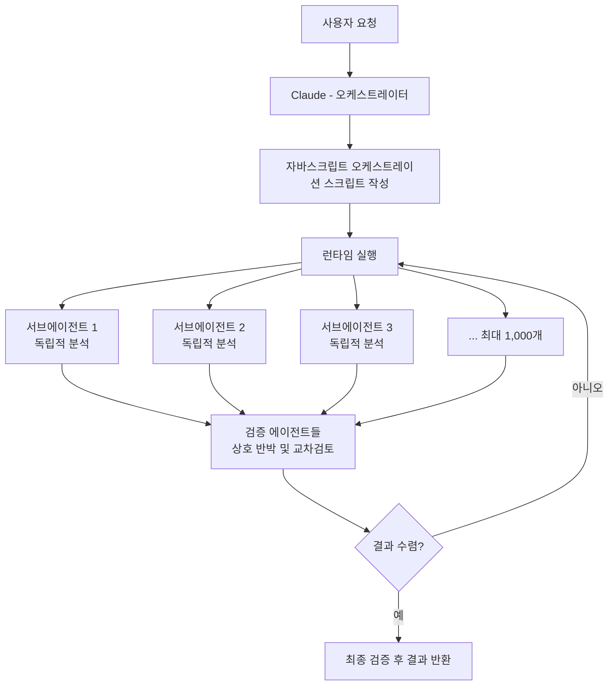
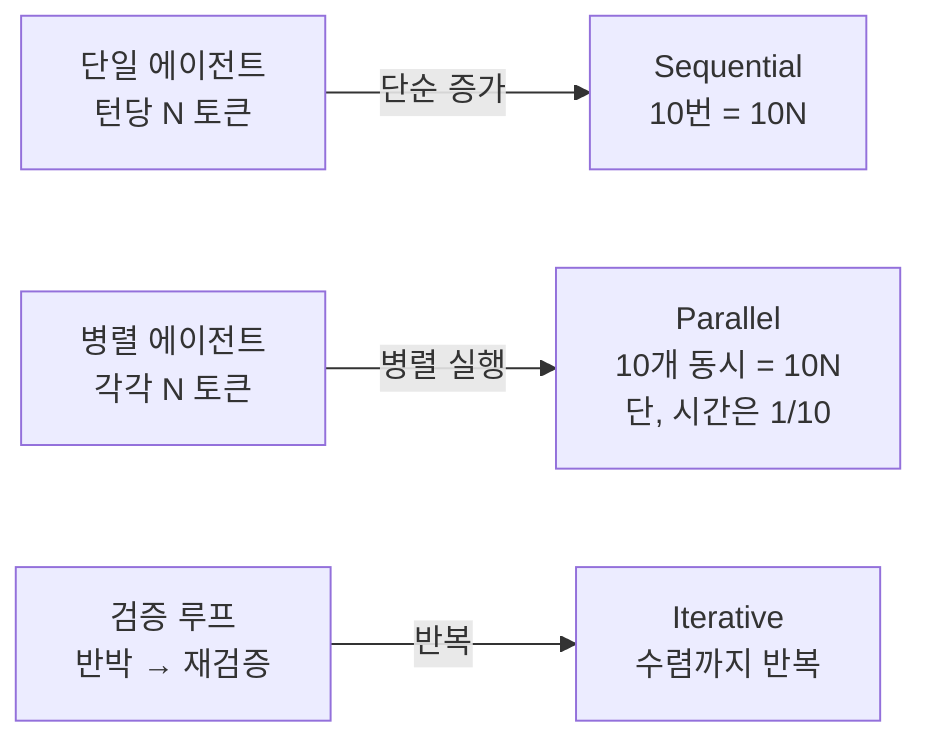
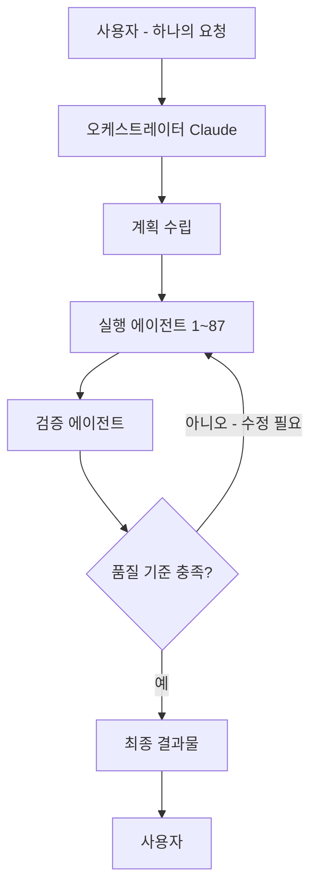
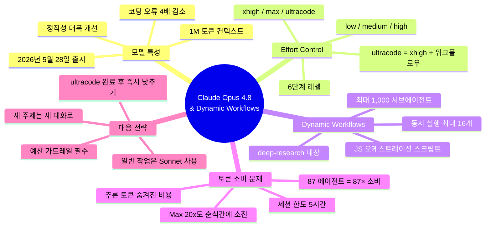

> 작성일: 2026년 5월 30일  
> 이 문서는 세 장의 게시물과 최신 공개 정보를 바탕으로 작성되었습니다.

---

## 목차

1. [무슨 일이 벌어지고 있는가?](#1-무슨-일이-벌어지고-있는가)
2. [Claude Opus 4.8이란 무엇인가?](#2-claude-opus-48이란-무엇인가)
3. [Effort 레벨과 Ultracode란?](#3-effort-레벨과-ultracode란)
4. [Dynamic Workflows: AI가 팀으로 일하는 방식](#4-dynamic-workflows-ai가-팀으로-일하는-방식)
5. [왜 토큰이 5분 만에 녹는가?](#5-왜-토큰이-5분-만에-녹는가)
6. [Claude Max 플랜의 사용량 한도 구조](#6-claude-max-플랜의-사용량-한도-구조)
7. [Deep Research와 자동 전환 문제](#7-deep-research와-자동-전환-문제)
8. [에이전틱 AI의 철학적 의미: 질문 하나 vs. 팀 운영](#8-에이전틱-ai의-철학적-의미-질문-하나-vs-팀-운영)
9. [비용과 운영 전략: 어떻게 써야 하나?](#9-비용과-운영-전략-어떻게-써야-하나)
10. [요약 및 결론](#10-요약-및-결론)

---

## 1. 무슨 일이 벌어지고 있는가?

2026년 5월 28일, Anthropic은 Claude Opus 4.8을 출시했습니다. 이 모델의 출시와 함께 **Dynamic Workflows**라는 새로운 오케스트레이션 기능도 연구 미리보기(Research Preview) 형태로 공개되었습니다. 그런데 이 기능이 활성화된 직후부터, 소셜 미디어에서는 공통된 한탄이 쏟아지기 시작했습니다.

> ["5분 만에 내 5백만 토큰이 사라졌다."](https://www.threads.com/@danielchoi.ai/post/DY7CJczifRl)  
> ["월 200달러짜리 최고 구독 플랜인데, 화장실 다녀온 사이 한도가 바닥났다."](https://www.threads.com/@nodji_k/post/DY7HKylGoqC)  
> ["Max 20x도 벌벌 떨면서 쓴다."](https://www.threads.com/@thanhnguyenduy2026/post/DY8fNslkzhd)

세 장의 게시물은 이 현상을 서로 다른 관점에서 포착하고 있습니다. 하나는 실제로 87개의 Opus 4.8 에이전트를 동시에 가동한 사용자의 경험담이고, 또 하나는 사용량 한도(Plan usage limits)가 현재 세션에서 100% 소진되었음을 보여주는 화면이며, 마지막 하나는 허락 없이 deep-research 모드로 전환되어 남은 주간 한도를 순식간에 소모당한 사용자의 불만입니다.

이 세 가지 이야기는 사실 하나의 큰 흐름을 가리키고 있습니다. AI 사용 방식이 "질문 하나, 답변 하나"에서 "수십~수백 개의 에이전트가 병렬로 협업하는 팀 운영"으로 전환되고 있다는 것입니다. 그리고 이 전환은 토큰 소비 패턴을 근본적으로 바꿔놓았습니다.

---

## 2. Claude Opus 4.8이란 무엇인가?

Claude Opus 4.8은 Anthropic이 2026년 5월 28일에 출시한 최신 플래그십 모델입니다. Opus 4.7의 출시로부터 불과 41일 만에 나온 빠른 후속 업데이트로, Anthropic 스스로 "전작 대비 소폭이지만 체감 가능한 개선(a modest but tangible improvement)"이라고 솔직하게 표현했습니다.

### 주요 사양

| 항목 | 내용 |
|------|------|
| 출시일 | 2026년 5월 28일 |
| 컨텍스트 윈도우 | 1,000,000 토큰 (1M) |
| 최대 출력 토큰 | 128,000 토큰 |
| 지식 기준 날짜 | 2026년 1월 |
| API 모델 ID | `claude-opus-4-8` |
| 기본 가격 | 입력 $5/백만 토큰, 출력 $25/백만 토큰 |
| Fast Mode 가격 | 입력 $10/백만 토큰, 출력 $50/백만 토큰 |

### 성능 개선 사항

Opus 4.8에서 가장 두드러진 변화는 **정직성(honesty)** 입니다. 기존 모델보다 코딩 오류를 지나치거나 모르는 것을 아는 척하는 경우가 약 4배 감소했습니다. 불확실한 사항에 대해 스스로 "모른다"고 인정하고, 확인되지 않은 주장을 자신 있는 것처럼 포장하는 경향이 크게 줄었습니다.

벤치마크 측면에서도 발전이 있었습니다. 에이전틱 코딩 성능이 64.3%에서 69.2%로, 도구를 활용한 다학제 추론이 54.7%에서 57.9%로 향상되었으며, 컴퓨터 사용 벤치마크(Online-Mind2Web)에서 84%를 기록해 이전 Opus 버전들을 앞섰습니다.

---

## 3. Effort 레벨과 Ultracode란?

Opus 4.8과 함께 도입된 가장 중요한 사용자 인터페이스 변화 중 하나는 **Effort Control**입니다. Claude Code에서 "Faster ↔ Smarter"로 표시되는 슬라이더를 통해 모델이 작업에 얼마나 깊이 사고할지를 직접 조절할 수 있습니다.

### Effort 레벨 단계

```
Faster ←────────────────────────────────→ Smarter
  low    medium    high    xhigh    max    ultracode
                                          (xhigh + workflows)
```

총 여섯 단계가 있으며, 각 단계의 특성은 다음과 같습니다.

- **low**: 응답 속도가 빠르고 토큰 소비가 가장 적습니다. 단순하고 명확하게 정의된 작업에 적합합니다.
- **medium**: 일반적인 작업에 균형 잡힌 선택입니다.
- **high**: Anthropic이 기본값(default)으로 설정한 레벨입니다. Opus 4.7의 기본값과 유사한 토큰 소비로 더 높은 성능을 제공합니다.
- **xhigh (extra)**: 어려운 작업과 장기 실행 비동기 워크플로우에 권장됩니다. 더 많은 토큰을 소비합니다.
- **max**: 가장 높은 단일 에이전트 추론 수준입니다.
- **ultracode**: **xhigh 추론 + Dynamic Workflows 자동 오케스트레이션**이 결합된 최상위 설정입니다. Claude Code 전용이며, Claude가 스스로 각 요청이 워크플로우를 필요로 하는지 판단합니다.

### Ultracode의 핵심

Ultracode는 단순히 "더 열심히 생각하는" 모드가 아닙니다. 이 설정을 켜면 Claude는 세션 전체에 걸쳐 각 요청을 먼저 사전 평가한 뒤, 단순한 작업은 평소처럼 처리하고 복잡한 작업은 수십~수백 개의 서브에이전트를 자율적으로 배치합니다. 개발자가 "지금 워크플로우를 써라"고 명시적으로 지시하지 않아도, Claude가 스스로 판단해서 워크플로우를 작동시킵니다. 이것이 바로 세션 도중 토큰이 예상보다 훨씬 빠르게 소진되는 핵심 이유입니다.

---

## 4. Dynamic Workflows: AI가 팀으로 일하는 방식

### 개념 자체가 다르다

기존의 Claude Code는 단일 에이전트가 작업을 순차적으로 처리했습니다. Claude가 파일을 읽고, 코드를 수정하고, 결과를 확인하는 과정을 한 번에 하나씩 수행했습니다. Dynamic Workflows는 이 패러다임을 완전히 뒤집습니다.

Dynamic Workflow가 시작되면, Claude는 사용자의 요청을 분석해 **자바스크립트 오케스트레이션 스크립트**를 직접 작성합니다. 이 스크립트는 별도의 런타임 환경에서 실행되며, 수십~수백 개의 서브에이전트가 동시에 같은 문제를 여러 각도에서 공격합니다. 사용자의 채팅 세션은 그 동안 계속 응답 가능한 상태를 유지합니다.

### 작동 방식의 핵심 구조



### 구체적인 숫자로 보는 한계

- 동시 실행 에이전트: 최대 16개
- 한 번의 실행에서 총 사용 가능한 에이전트: 최대 1,000개
- 각 에이전트는 1M 토큰 컨텍스트 윈도우를 가질 수 있음
- 오케스트레이션 스크립트 자체는 파일 시스템이나 셸에 직접 접근 불가 (보안 격리)

### 작동 조건

Dynamic Workflows는 두 가지 방식으로 활성화됩니다.

첫 번째는 **수동 트리거**입니다. 프롬프트에 "workflow"라는 단어를 포함시키면 Claude Code가 이를 인식하고 워크플로우 계획을 수립합니다.

두 번째는 **ultracode 자동 모드**입니다. `/effort ultracode`를 설정하면 Claude가 매 요청마다 스스로 워크플로우 필요 여부를 판단합니다.

### 내장 워크플로우: /deep-research

Claude Code에는 `/deep-research`라는 내장 워크플로우가 포함되어 있습니다. 이 워크플로우는 단순히 첫 번째로 그럴듯한 답을 찾는 게 아니라, **스스로의 결론을 반증하도록 설계**되어 있습니다. 여러 각도로 검색을 펼치고, 소스 간 교차 검증을 수행하며, 각 주장에 대해 내부 투표를 진행한 뒤, 반박을 견뎌낸 주장만을 최종 보고서에 포함시킵니다.

---

## 5. 왜 토큰이 5분 만에 녹는가?

게시물에 등장한 "5분 만에 5M(500만) 토큰 소진"이라는 현상을 이해하려면 토큰 소비의 구조를 파악해야 합니다.

### 단순 계산으로 보는 규모

단일 에이전트가 50,000개의 입력 토큰과 10,000개의 출력 토큰을 사용한다고 가정해 보겠습니다. 200개의 병렬 서브에이전트가 동시에 이 작업을 수행하면:

```
총 토큰 소비 = (50,000 + 10,000) × 200 = 12,000,000 토큰
```

87개의 에이전트가 각각 1M 컨텍스트를 들고 검증 작업을 수행한다면, 이론적 최대치는 87M 토큰에 달합니다. 실제 게시물에서 언급된 4.9M~5M 토큰 소비는 이 맥락에서 보면 오히려 절제된 수치입니다.

### 토큰 소비가 기하급수적이 되는 이유



문제는 단순히 에이전트가 많다는 게 아닙니다. 각 에이전트는 자신의 컨텍스트 안에 **시스템 프롬프트, 파일 내용, 도구 정의, 이전 대화 내역**을 모두 담고 있습니다. 에이전틱 세션에서는 매 턴마다 이 모든 내용이 재전송됩니다. 컨텍스트가 클수록, 에이전트가 많을수록, 반복 횟수가 많을수록 소비는 기하급수적으로 증가합니다.

### 추론 토큰의 숨겨진 비용

Opus 4.8의 확장 사고(Adaptive Thinking) 기능은 내부적으로 "생각하는 과정"을 생성합니다. 사용자는 최종 응답 500토큰만 보지만, 실제로는 수천 토큰의 내부 추론이 먼저 생성됩니다. 이 추론 토큰도 출력 토큰으로 과금되며 사용 한도에 포함됩니다.

---

## 6. Claude Max 플랜의 사용량 한도 구조

첫 번째 게시물의 화면은 Claude Max 5x 플랜의 사용량 현황을 보여줍니다. 이 화면을 제대로 이해하려면 Claude의 한도 구조를 알아야 합니다.

### 세션 한도 (Current session)

- 5시간마다 초기화되는 단기 한도입니다.
- 화면에서는 "100% used, 3시간 24분 후 리셋"이라고 표시되어 있습니다.
- 즉, 현재 세션에서 허용된 토큰을 모두 소진한 상태입니다.
- Max 5x 플랜 기준으로 이 5시간 한도가 기준 플랜 대비 5배로 확장되어 있습니다.

### 주간 한도 (Weekly limits)

- 매주 수요일 오후 11시에 초기화됩니다.
- **All models**: 36% 사용됨 — 전체 모델 통합 주간 한도 중 36% 소진 상태
- **Sonnet only**: 2% 사용됨 — Sonnet 모델만의 한도에서는 2% 소진

이 화면이 보여주는 상황은 주간 전체 한도는 아직 넉넉하지만, 현재의 5시간 세션 한도를 이미 다 써버렸다는 것입니다. 다음 세션 리셋까지 약 3시간 24분을 기다려야 작업을 재개할 수 있는 상태입니다.

### Max 5x vs Max 20x

Max 5x는 월 $100이며 기준 Pro 플랜 대비 5배의 처리량을 제공합니다. Max 20x는 월 $200이며 20배의 처리량을 제공합니다. 그러나 Dynamic Workflows와 ultracode를 적극적으로 활용하면, Max 20x($200/월) 구독자조차 예상보다 훨씬 빠르게 한도에 도달할 수 있습니다. "Max 20도 벌벌 떨면서 쓴다"는 표현이 과장이 아닌 이유입니다.

---

## 7. Deep Research와 자동 전환 문제

세 번째 게시물은 허락 없는 자동 전환이라는 실질적인 불만을 담고 있습니다. 이 사용자는 금 가격과 금리에 관한 리서치를 요청하고 잠시 자리를 비웠습니다. 돌아왔을 때 Claude는 스스로 deep-research 모드로 전환해 있었고, 남은 주간 한도를 5분 안에 모두 소진해 버렸습니다.

세 번째 게시물 속 Claude의 응답 자체도 이 상황을 잘 보여줍니다.

> "이 주제는 깊이 있는 다중 소스 리서치가 필요하니 deep-research 하네스를 쓰겠습니다."

Claude가 스스로 판단해 deep-research 워크플로우를 선택한 것입니다. Ultracode가 켜져 있거나, 프롬프트가 복잡한 리서치 작업으로 해석될 경우, Claude는 자율적으로 워크플로우를 가동합니다. 문제는 이 자율성이 사용자에게 충분히 명확하게 공지되지 않았다는 점입니다.

Anthropic은 Enterprise 플랜의 경우 Dynamic Workflows가 기본적으로 꺼져 있고 관리자가 설정에서 켜야 한다고 명시했습니다. 그러나 Max 및 Team 플랜에서는 기본 활성화 상태여서, 사용자가 명시적으로 비활성화하지 않으면 언제든지 자동으로 워크플로우가 트리거될 수 있습니다.

---

## 8. 에이전틱 AI의 철학적 의미: 질문 하나 vs. 팀 운영

두 번째 게시물의 핵심 메시지는 기술적 설명을 넘어 AI 사용 패러다임의 전환을 이야기합니다.

### 이전: 질문-응답 모델

```
사용자 → 질문 하나 → Claude → 답변 하나 → 사용자
```

이 구조에서 AI의 가치는 "얼마나 똑똑하게 답하느냐"로 측정됩니다. 토큰 소비는 예측 가능하고 선형적입니다.

### 지금: 에이전틱 팀 운영 모델



이 구조에서 AI의 가치는 "얼마나 많은 에이전트를 동시에 병렬로 검증할 수 있느냐"로 측정됩니다.

### 검증 품질의 구조적 개선

게시물에서 지적된 핵심 통찰은 품질 문제의 본질에 관한 것입니다. 품질 문제는 대부분 "확인했다고 생각했는데 놓친 것"에서 발생합니다. 단일 에이전트는 아무리 뛰어나도 자신의 맹점을 스스로 발견하기 어렵습니다.

그러나 에이전트 구조에 감사(Audit), 검증(Verify), 교차검토(Cross Check)를 명시적으로 넣으면 결과가 달라집니다. 87명의 리뷰어가 동시에 하나의 결과물을 서로 다른 각도에서 검토하는 것과 같은 효과이기 때문입니다.

### 비용의 재정의

기존 AI 비용의 핵심 변수는 프롬프트 길이, 즉 입력 토큰의 크기였습니다. 하지만 에이전틱 AI 시대의 비용은 에이전트 설계에서 결정됩니다. 몇 개의 에이전트가 동시에 일하는지, 검증 루프를 몇 번 돌리는지, 각 에이전트의 컨텍스트 크기는 얼마인지가 총 비용을 결정합니다.

---

## 9. 비용과 운영 전략: 어떻게 써야 하나?

이 상황에서 실용적인 대응 방법은 무엇일까요?

### 모델과 Effort 레벨의 현명한 선택

Anthropic 공식 권고 사항과 전문가들의 권장 사항을 종합하면 다음과 같습니다.

- 단순 Q&A, 코드 완성, 문서 요약 등 일상적인 작업에는 **Sonnet 4.6 또는 Haiku 4.5**를 사용합니다. Opus 대비 훨씬 적은 토큰을 소비하면서 대부분의 작업을 충분히 처리합니다.
- 아키텍처 수준의 복잡한 리팩토링이나 심층 분석에만 **Opus 4.8**을 선택합니다.
- Ultracode는 반드시 필요한 대규모 작업에만 사용하고, 작업이 끝나면 즉시 `/effort high`로 낮춥니다.

### 컨텍스트 관리

컨텍스트 윈도우가 클수록 토큰 소비가 커집니다. 새로운 주제에 대해서는 새 대화를 시작하고, 자주 참조하는 문서는 프로젝트 지식(Project Knowledge)에 저장해 두면 매번 재업로드하지 않아도 됩니다.

### 예산 한도 설정

Dynamic Workflows를 프로덕션 환경에서 사용하기 전에 반드시 예산 가드레일을 설정해야 합니다. 서브에이전트가 많아질수록 비용은 선형이 아닌 방식으로 증가합니다.

### Claude Max 플랜 구독자를 위한 현실적 조언

Claude.ai의 구독 한도는 Claude Code 터미널, Claude.ai 채팅, Cowork 데스크톱 도구의 사용량을 모두 합산해 계산합니다. 한 채널에서 많이 쓰면 다른 채널의 할당량이 줄어듭니다. Research 모드나 deep-research 워크플로우는 복수의 검색과 종합 분석을 실행하기 때문에 일반 대화 대비 훨씬 빠르게 한도를 소진합니다.

---

## 10. 요약 및 결론



세 장의 게시물이 보여주는 현실은 매우 명확합니다. Claude Opus 4.8과 Dynamic Workflows는 단순히 더 좋은 AI가 아니라, AI를 사용하는 방식 자체를 바꾸는 기술입니다.

예전에는 AI를 사용했습니다. 지금은 AI 팀을 운영합니다.

5분 만에 5백만 토큰이 녹는 것은 버그가 아니라, 수십 명의 디지털 워커가 동시에 5분간 일한 결과입니다. 문제는 이 강력한 기능이 사용자의 명시적 동의 없이 자동으로 활성화될 수 있다는 점이며, 이것이 현재 사용자들이 겪는 가장 큰 불만의 원천입니다.

앞으로 AI 시대의 경쟁력은 더 좋은 모델을 아는 것보다, 이 모델들로 이루어진 팀을 어떻게 효율적으로 운영하느냐에서 나올 가능성이 높습니다. 그리고 그 운영에는 토큰 비용을 의식적으로 관리하는 능력이 반드시 포함되어야 합니다.

---

*참고 출처: Anthropic 공식 발표 (2026년 5월 28일), Claude API 문서, Amazon Bedrock 모델 카드, 9to5Mac, MarkTechPost, Simon Willison의 기술 블로그, Threads 사용자 게시물*
