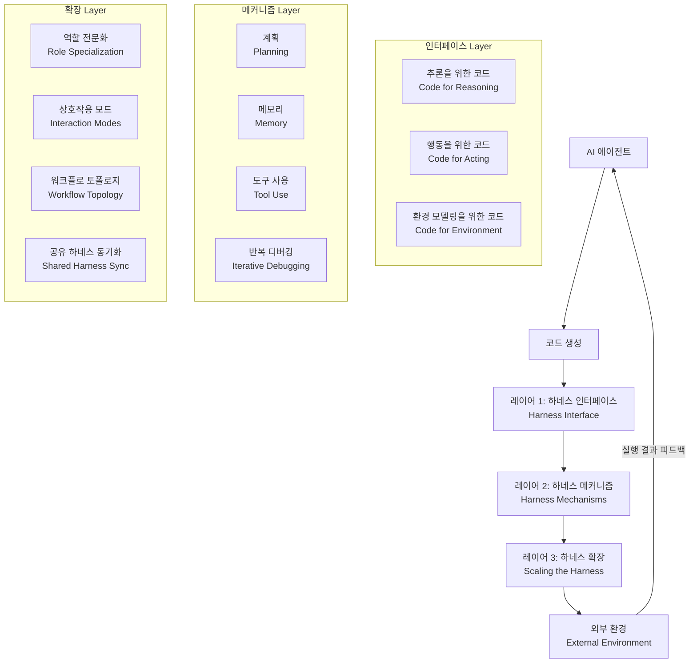
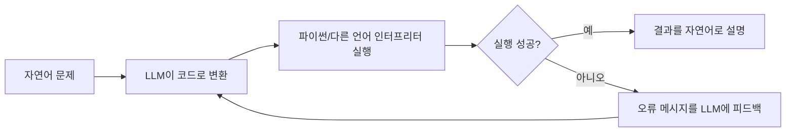
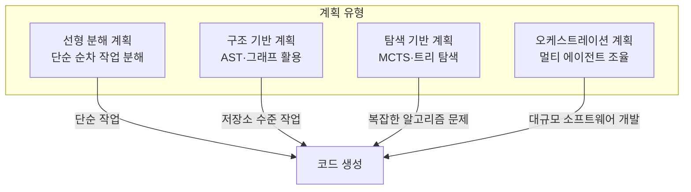
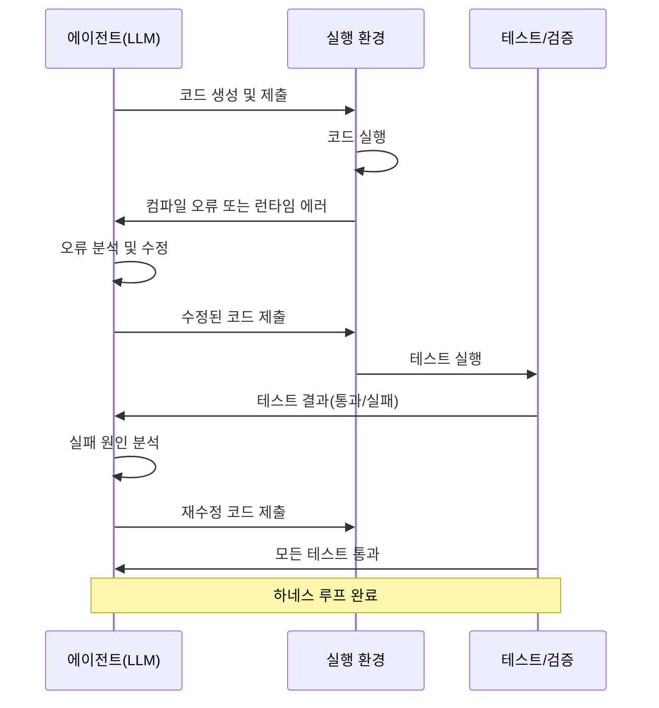
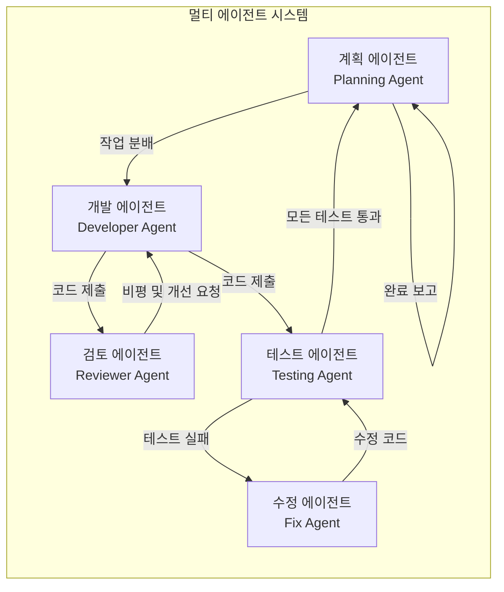
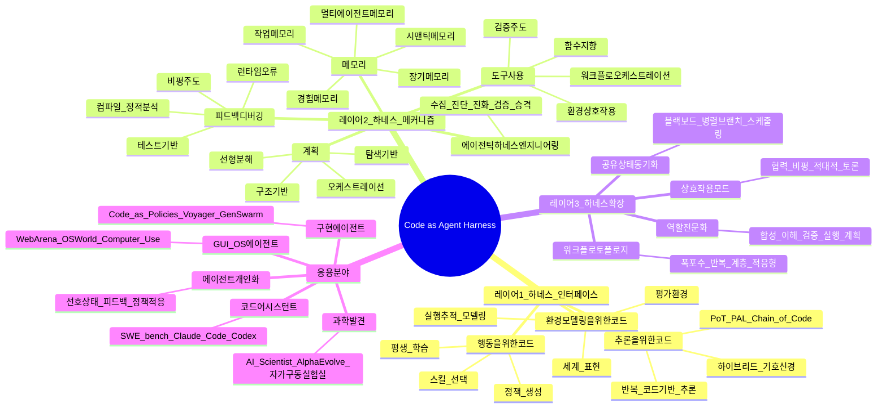

> **논문 정보**  
> 제목: *Code as Agent Harness: Toward Executable, Verifiable, and Stateful Agent Systems*  
> arXiv: [2605.18747](https://arxiv.org/abs/2605.18747) · 발표: 2026년 5월 18일  
> 저자: Xuying Ning, Katherine Tieu, Dongqi Fu, Tianxin Wei, Zihao Li, Yuanchen Bei 외 36명 (UIUC 등)  
> GitHub: [YennNing/Awesome-Code-as-Agent-Harness-Papers](https://github.com/YennNing/Awesome-Code-as-Agent-Harness-Papers)  
> HuggingFace: #1 Paper of the Day 선정

---

## 0. 왜 이 논문이 중요한가

**Figure 1:Taxonomy of code as agent harness.**

**Figure 2:Overview of code as the harness interface, connecting agents to reasoning, action, and environment modeling through executable programs, tool calls, state tracking, and feedback traces.**

**Figure 3:Roadmap of the harness interface, organized by code’s role in reasoning, acting, and environment modeling, with representative works ordered chronologically within each role.**

**Figure 4:A roadmap overview of agent harness mechanisms.**

**Figure 5:Overview of planning mechanisms for agent harnesses.**

**Figure 6:Overview of memory and context engineering mechanisms for agent harnesses.**

**Figure 7:Overview of tool-using mechanisms for agent harnesses.**

**Figure 8:Overview of harness control through PEV loop.**

**Figure 9:Overview of harness engineering for adaptive harness optimization.**

**Figure 10:Overview of scaling the agent harness through multi-agent orchestration over code. The figure illustrates how role-specialized agents, shared code-centric substrates, execution feedback, and adaptive collaboration topologies address single-agent limitations in context, specialization, and self-correction.**

**Figure 11:Roadmap of scaling code harnesses for multi-agent orchestration, organized by workflow collaboration, shared repository state, execution verification, and adaptive coordination.**

**Figure 12:Overview of code as an agent harness across five emerging domains, including coding assistants, GUI/OS agents, scientific discovery, personalization, and embodied agents.**

LLM(대형 언어 모델)이 코드를 잘 쓴다는 사실은 이미 잘 알려져 있습니다. 그런데 이 논문은 완전히 다른 질문을 던집니다.

> "코드를 *출력하는* 것을 넘어, 코드를 *에이전트가 작동하는 인프라 자체*로 쓸 수 있지 않을까?"

지금까지 대부분의 연구는 LLM이 코드를 얼마나 잘 *생성*하느냐에 집중했습니다. 하지만 현실의 AI 에이전트는 코드를 생성하는 것 이상을 해야 합니다. 여러 단계에 걸쳐 계획하고, 도구를 사용하고, 실패에서 회복하고, 복수의 에이전트가 협력하며, 그 상태를 지속적으로 추적해야 합니다.

이 논문은 그 모든 과정에서 **코드가 에이전트의 뼈대(harness)** 역할을 한다고 주장합니다. 코드는 단순히 생성물이 아니라, 에이전트가 추론하고 행동하고 환경을 모델링하는 *운영 기반(operational substrate)* 이라는 것입니다.

Stanford·MIT 연구팀의 Meta-Harness 논문(arXiv:2603.28052)이 밝힌 것처럼, OpenAI의 실제 Codex 팀도 "초반 진행이 느렸던 건 모델의 능력 부족이 아니라 환경이 제대로 명시되지 않았기 때문"이라고 회고했습니다. 즉 **하네스(harness)가 제대로 설계되지 않으면 아무리 강력한 모델도 제대로 작동하지 않습니다.**

---

## 1. 핵심 개념: "하네스(Harness)"란 무엇인가

원래 harness는 마차를 끄는 말에 씌우는 마구(馬具)를 의미합니다. 소프트웨어 테스트 분야에서는 테스트 대상 코드를 둘러싸서 실행·검증하는 보조 코드를 테스트 하네스라고 불렀습니다. 이 논문에서 **에이전트 하네스**란 AI 에이전트가 작업을 수행할 때 그것을 둘러싸서 가이드하는 모든 코드 기반 인프라를 뜻합니다.

구체적으로, 코드가 하네스로 기능한다는 것은 다음 세 가지를 의미합니다.

- **실행 가능성(Executable):** 모델의 출력이 코드 형태이면, 인터프리터나 런타임이 즉시 실행하여 결과를 확인할 수 있습니다. "맞을 것 같다"는 추측이 아니라, 실행 결과가 참/거짓을 객관적으로 판별해 줍니다.
- **검증 가능성(Verifiable):** 실행 결과, 테스트 통과 여부, 컴파일러 오류, 정적 분석 결과 등이 에이전트에게 피드백으로 돌아옵니다. 이를 통해 에이전트는 스스로를 교정할 수 있습니다.
- **상태 보존성(Stateful):** 코드는 변수, 데이터 구조, 파일, 저장소 형태로 상태를 유지합니다. 에이전트는 이 상태를 읽고 쓰면서 장기적인 작업을 이어갈 수 있습니다.

---

## 2. 논문의 3층 구조 개요

이 논문은 코드가 에이전트 하네스로 기능하는 방식을 **세 개의 연결된 레이어**로 체계화합니다.

이 세 레이어는 독립적인 개념이 아니라 서로 맞물려 있습니다. 인터페이스가 코드를 "어떤 형태로" 에이전트 루프에 끌어들이는지를 정의하고, 메커니즘이 그 코드를 "어떻게 실행하고 유지하는지"를 담당하며, 확장이 이 구조를 "복수의 에이전트로 어떻게 키우는지"를 다룹니다.

---

## 3. 레이어 1 — 하네스 인터페이스 (Harness Interface)

인터페이스 레이어는 코드가 에이전트와 환경 사이의 접점 역할을 하는 세 가지 방식을 설명합니다.

### 3.1 추론을 위한 코드 (Code for Reasoning)

기존의 "생각의 사슬(Chain-of-Thought)" 방식에서 LLM은 자연어로 중간 추론 단계를 기술합니다. 하지만 자연어 추론은 오류가 있어도 표면적으로 그럴듯하게 보일 수 있고, 중간 계산을 직접 검증하기 어렵습니다.

코드 기반 추론은 이 한계를 돌파합니다. 예를 들어 **Program of Thoughts(PoT)** 방식은 LLM이 수치 추론 문제를 파이썬 코드로 표현하도록 합니다. 그러면 실제 계산은 파이썬 인터프리터가 수행하므로, "LLM이 123 × 456을 잘못 계산하는" 실수가 발생하지 않습니다. **PAL(Program-aided Language Models)**, **Chain of Code**, **MathCoder** 등이 이 계열의 대표 연구들입니다.

더 나아가 **하이브리드 기호-신경 실행(Hybrid Symbolic–Neural Execution)** 방식은 코드로 표현된 논리를 SAT 솔버나 기호 추론 엔진에 넘겨 검증합니다. **CodeSteer**는 LLM이 언제 코드 경로를 타고 언제 자연어 경로를 탈지를 스스로 결정하도록 유도합니다.

**반복적 코드 기반 추론(Iterative Code-Grounded Reasoning)** 에서는 실행 결과가 다음 추론 단계의 입력이 됩니다. **CodeRL**, **RLEF**, **StepCoder** 등은 컴파일러·테스트 피드백을 강화학습 보상 신호로 사용하여 모델이 실행 가능한 코드를 점점 더 잘 생성하도록 훈련합니다.

### 3.2 행동을 위한 코드 (Code for Acting)

에이전트가 무언가를 "한다"는 것은 환경에 영향을 미치는 행동을 취한다는 뜻입니다. 코드는 이 행동을 프로그래밍적으로 표현하는 가장 정밀한 방법입니다.

**근거 기반 스킬 선택(Grounded Skill Selection)** 에서는 LLM이 로봇이나 에이전트가 실제로 수행할 수 있는 스킬 목록을 코드 함수 형태로 관리하고, 현재 상황에 맞는 스킬을 선택·조합합니다. **Do As I Can(SayCan)**, **Voyager**의 스킬 라이브러리 등이 이 접근의 선구자들입니다.

**프로그래마틱 정책 생성(Programmatic Policy Generation)** 에서는 LLM이 행동 자체를 코드(정책)로 생성합니다. **Code as Policies**는 자연어 명령을 로봇 제어 코드로 변환하고, **ReAct**는 추론(Reasoning)과 행동(Acting)을 교대로 수행하는 에이전트 루프를 코드 수준에서 구현합니다.

**평생 학습 코드 기반 에이전트(Lifelong Code-Based Agents)** 는 새로운 경험을 스킬 코드로 변환하여 라이브러리에 추가하고, 이후 유사 상황에서 재활용합니다. Minecraft 환경에서 새로운 스킬을 끊임없이 학습한 **Voyager**가 대표적 사례입니다.

### 3.3 환경 모델링을 위한 코드 (Code for Environment Modeling)

에이전트가 장기적으로 행동하려면 환경의 상태를 모델링해야 합니다. 코드는 환경 상태를 구조화된 방식으로 표현하는 자연스러운 수단입니다.

**구조화된 세계 표현(Structured World Representations):** 프로그램 라이브러리나 씬(scene) 생성 코드를 통해 세계의 구조를 명시적으로 모델링합니다. **PoE-World**는 프로그래마틱 전문가들의 곱(product)으로 세계를 구성하는 방식을 제안합니다.

**실행 추적 기반 세계 모델링(Execution-Trace World Modeling):** 코드 실행 과정에서 생기는 추적 기록(변수 변화, 함수 호출 순서 등)이 세계 모델의 데이터가 됩니다. **WorldCoder**는 LLM 에이전트가 코드를 작성하고 환경과 상호작용하면서 직접 세계 모델을 구축합니다.

**코드 기반 평가 환경(Code-Grounded Evaluation Environments):** **SWE-bench**, **CRUXEval**, **LiveCodeBench** 등은 실제 GitHub 이슈, 코드 추론, 코드 실행 문제를 벤치마크로 제공합니다. 이런 환경에서는 코드 실행 결과가 에이전트의 정답 여부를 객관적으로 판별합니다.

---

## 4. 레이어 2 — 하네스 메커니즘 (Harness Mechanisms)

코드를 에이전트 루프 안에 집어넣은 후에는, 그 루프가 실제로 잘 작동하도록 만드는 메커니즘이 필요합니다. 이 레이어는 계획, 메모리, 도구 사용, 피드백 기반 디버깅의 네 가지 핵심 메커니즘을 다룹니다.

### 4.1 코드 에이전트를 위한 계획 (Planning for Code Agents)

계획은 에이전트가 의도를 실행 가능한 단계로 외재화하는 방법입니다.

**선형 분해 계획(Linear Decomposition Planning)** 은 작업을 순차적인 하위 작업으로 분해합니다. **Self-planning Code Generation**은 LLM이 먼저 자연어 계획을 세운 후 코드를 생성하게 합니다. **ReAct** 역시 생각→행동→관찰을 반복하는 선형 계획 루프를 사용합니다.

**구조 기반 계획(Structure-Grounded Planning)** 은 코드 저장소의 의존성 그래프, AST(추상 구문 트리), 지식 그래프 같은 구조를 계획에 활용합니다. **CodePlan**은 저장소 전체를 이해하고 변경 계획을 세우며, **LocAgent**는 그래프 기반으로 수정이 필요한 코드 위치를 찾아냅니다.

**탐색 기반 계획(Search-Based Planning)** 은 Monte Carlo Tree Search(MCTS) 같은 트리 탐색 기법을 코드 생성 공간에 적용합니다. **CodeTree**, **RethinkMCTS**, **Tree-of-Code** 등이 여러 코드 경로를 탐색하여 최선의 해를 찾습니다.

**오케스트레이션 기반 계획(Orchestration-Based Planning)** 은 여러 에이전트가 계획의 다른 부분을 담당하도록 조율합니다. **MapCoder**는 유사 문제, 알고리즘 설계, 코드 생성, 디버깅을 각각 담당하는 에이전트로 역할을 분담합니다.

### 4.2 메모리와 컨텍스트 엔지니어링 (Memory and Context Engineering)

LLM은 컨텍스트 창(context window) 안의 정보만 참조할 수 있으므로, 무엇을 어떻게 기억하는지는 에이전트 성능의 핵심입니다.

**작업 메모리(Working Memory)** 는 현재 실행 중인 작업의 상태입니다. **SWE-agent**는 에이전트-컴퓨터 인터페이스(ACI)를 설계하여, 컨텍스트 창에 저장소의 어떤 파일과 코드를 넣을지를 관리합니다. **Agentless**는 반대로 복잡한 메모리 관리 없이 파일 위치 파악과 패치 생성을 단순화하는 접근을 취합니다.

**시맨틱 메모리(Semantic Memory)** 는 저장소 지식, 코드 패턴, API 문서 같은 배경 지식을 검색 가능한 형태로 보관합니다. **RepoCoder**는 현재 코드와 의미적으로 유사한 코드 조각을 반복적으로 검색해서 컨텍스트에 추가하는 방식을 씁니다.

**경험 메모리(Experiential Memory)** 는 과거 성공·실패 경험을 저장하고 유사 상황에서 재활용합니다. **ExpeL**은 에이전트가 경험으로부터 규칙을 추출하여 새 태스크에 적용하는 방법을 보여줍니다.

**장기 메모리(Long-Term Memory)** 는 여러 대화·세션에 걸쳐 지속되는 정보입니다. **MemGPT**는 LLM을 운영체제처럼 설계하여 활성 컨텍스트와 외부 저장소 간의 페이징을 관리합니다.

**멀티 에이전트 메모리(Multi-Agent Memory)** 는 여러 에이전트가 공유하는 메모리 구조입니다. **G-Memory**는 멀티 에이전트 시스템을 위한 계층적 메모리 추적 방법을 제시합니다.

### 4.3 코드 에이전트를 위한 도구 사용 (Tool Usage for Code Agents)

도구 사용은 에이전트가 코드를 실행하고, 파일을 읽고, API를 호출하고, 결과를 검증하는 행동 레이어입니다.

**함수 지향 도구 사용(Function-Oriented Tool Use):** 에이전트가 API, 라이브러리, 외부 서비스를 함수 호출 형태로 사용합니다. **ToolCoder**는 LLM에게 API 검색 도구를 사용하는 방법을 가르칩니다.

**환경 상호작용 도구 사용(Environment-Interaction Tool Use):** 에이전트가 특정 실행 환경(OS, 브라우저, 터미널)과 직접 상호작용합니다. **ExeCoder**는 환경과의 상호작용을 LLM 에이전트의 핵심 루프로 통합합니다.

**검증 주도 도구 사용(Verification-Driven Tool Use):** 에이전트가 생성한 코드의 안전성이나 정확성을 검증하는 도구를 체계적으로 사용합니다. **VeriGuard**는 형식 검증을 통해 LLM이 생성한 코드의 안전성을 보장하려 합니다.

**워크플로 오케스트레이션 도구 사용(Workflow-Orchestration Tool Use):** **OpenHands**는 코드 실행, 파일 편집, 브라우저 제어 등 다양한 도구를 통합한 오픈 플랫폼을 제공합니다. **Executable Code Actions**는 JSON 행동 대신 코드 실행 행동이 LLM 에이전트를 더 강력하게 만든다는 것을 실험으로 보여줍니다.

### 4.4 피드백 기반 반복 디버깅 (Feedback-Guided Iterative Debugging)

디버깅은 하네스 루프를 닫는 핵심 메커니즘입니다. 개발 환경이 실패 신호를 노출하고, 에이전트가 그 신호를 교정 행동으로 변환합니다.

**개발 환경의 종류:**

저장소 인식 환경(Contextual Environments)은 대규모 코드베이스를 이해하는 데 필요한 컨텍스트를 제공합니다. Model Context Protocol(MCP)는 에이전트와 코드 도구 간의 표준화된 통신 프로토콜입니다. **CodexGraph**는 코드 저장소를 그래프 데이터베이스로 변환하여 에이전트가 쿼리하도록 합니다.

인간-LLM 협업 환경(Interactive Environments)은 Language Server Protocol(LSP), Debug Adapter Protocol(DAP) 같은 기존 IDE 프로토콜을 활용하여 에이전트가 개발 도구와 통합됩니다.

실행·검증 환경(Execution and Validation Environments)은 샌드박스에서 코드를 실행하고 테스트를 돌려 객관적인 피드백을 생성합니다. **RepoST**는 실제 저장소 수준 코딩 환경을 확장 가능하게 구성하는 방법을 제시합니다.

**피드백 메커니즘의 종류:**

컴파일·정적 분석 피드백은 컴파일러 오류, 린터 경고, 정적 분석 결과를 에이전트에 돌려줍니다. 런타임 오류·예외 피드백은 실행 중 발생하는 스택 트레이스와 예외를 디버깅 신호로 활용합니다. 테스트 기반 실행 피드백에서는 단위 테스트 통과/실패가 가장 강력한 피드백 신호입니다. **Teaching Large Language Models to Self-Debug**는 LLM이 테스트 결과를 보고 자신의 코드를 스스로 고치는 방법을 학습시킵니다. 비평 주도 피드백에서는 다른 에이전트나 인간이 코드를 검토하고 피드백을 줍니다.

### 4.5 적응형 하네스 최적화를 위한 에이전틱 하네스 엔지니어링 (Agentic Harness Engineering)

이 논문이 2026년에 새로 제시한 개념으로, 하네스 자체를 자동으로 개선하는 메타 레이어입니다. 에이전트가 자신의 실행 기록(어떤 프롬프트를 썼는지, 어떤 도구 호출이 실패했는지, 비용이 얼마나 들었는지)을 수집하고 분석하여 하네스 구성 자체를 최적화합니다.

**AutoHarness**, **Agentic Harness Engineering**, **Meta-Harness** 등의 연구가 이 방향을 탐구합니다. 핵심 과정은 다음과 같습니다.

1. **수집:** 프롬프트, 비용, 도구 호출 로그를 수집합니다.
2. **진단:** 낭비된 행동, 무효 액션, 병목 구간을 파악합니다.
3. **진화:** 검색, 도구, 워크플로를 수정하는 진화 에이전트를 실행합니다.
4. **재검증:** 수정된 하네스를 기존 태스크에 다시 돌려보고 성능을 측정합니다.
5. **승격:** 검증된 개선만 프로덕션 하네스에 반영합니다.

---

## 5. 레이어 3 — 하네스 확장: 멀티 에이전트 코드 중심 시스템

단일 에이전트로 해결하기 어려운 대규모·복잡 작업에는 여러 에이전트가 협력하는 시스템이 필요합니다. 이 레이어는 복수의 에이전트가 코드를 공유 하네스로 삼아 어떻게 협력하는지를 다룹니다.

### 5.1 기능적 역할 전문화 (Functional Role Specialization)

복잡한 소프트웨어 개발 과정을 여러 에이전트가 나눠 맡습니다.

- **프로그램 합성 에이전트:** 실제 코드를 작성합니다. **MetaGPT**, **ChatDev**, **AgentCoder** 등이 이 역할을 담당합니다.
- **프로그램 이해 에이전트:** 기존 코드베이스를 분석하고 이슈를 파악합니다. **HyperAgent**, **MAGIS** 등이 저장소 수준 이해를 담당합니다.
- **검증 에이전트:** 생성된 코드의 정확성, 보안, 테스트 통과 여부를 확인합니다. **AutoSafeCoder**는 정적 분석과 퍼징을 통한 보안 검증 에이전트를 포함합니다.
- **실행 에이전트:** 코드를 실제로 실행하고 결과를 수집합니다.
- **계획 에이전트:** 전체 작업의 분해와 조율을 담당합니다.

### 5.2 상호작용 모드 (Interaction Modes)

멀티 에이전트 시스템에서 에이전트들이 어떻게 소통하는지에 따라 네 가지 상호작용 모드가 구분됩니다.

**협력 합성(Collaborative Synthesis):** 여러 에이전트가 함께 코드를 작성합니다. **CodePori**에서는 에이전트들이 자율적으로 소프트웨어를 공동 개발합니다.

**비평 및 수정(Critique and Repair):** 한 에이전트가 생성한 코드를 다른 에이전트가 비평하고, 그 피드백을 바탕으로 수정이 이루어집니다. **AgentCoder**가 이 방식의 대표 사례입니다.

**적대적 검증(Adversarial Validation):** 공격 에이전트와 방어 에이전트가 대립하는 방식으로 코드의 결함이나 보안 취약점을 찾습니다. **AutoSafeCoder**에서 퍼징 에이전트가 이 역할을 합니다.

**추론 토론(Reasoning Debate):** 여러 에이전트가 서로 다른 입장을 취하고 논쟁을 통해 최선의 해를 찾습니다. **ChatDev**에서 에이전트들이 소프트웨어 설계 결정을 토론합니다.

### 5.3 워크플로 토폴로지 (Workflow Topology)

에이전트들이 어떤 구조로 연결되는지가 시스템의 성능에 큰 영향을 미칩니다.

**미리 정의된 휴리스틱 토폴로지** 에는 폭포수(waterfall), 반복(iterative), 계층적(hierarchical), 스타(star) 구조가 있습니다.
- **ChatDev:** 제품 관리자→설계자→개발자→테스터 순서의 소프트웨어 회사 구조를 모방합니다.
- **MetaGPT:** 구조화된 SOP(표준 운영 절차)를 바탕으로 에이전트 협업을 조율합니다.
- **L2MAC:** 블랙보드를 중심으로 에이전트들이 대규모 코드 생성을 분산 처리합니다.

**목표 주도 적응형 토폴로지** 는 작업의 특성에 따라 에이전트 네트워크가 동적으로 변화합니다.
- **FlowReasoner:** 강화학습으로 쿼리별 최적의 에이전트 워크플로를 탐색합니다.
- **SEW(Self-Evolving Workflow):** 에이전트 워크플로 자체가 경험을 통해 진화합니다.

### 5.4 실행 피드백 통합 (Execution Feedback Integration)

코드는 실행되면 객관적인 피드백을 생성합니다. 이것이 멀티 에이전트 협력에서 코드가 유용한 핵심 이유입니다.

- **컴파일러·구문 피드백:** **ChatDev**와 **L2MAC**에서 활용됩니다.
- **테스트 통과/실패 신호:** **AgentCoder**와 **QualityFlow**가 테스트 결과로 반복을 종료합니다.
- **퍼저 충돌 추적:** **AutoSafeCoder**가 퍼징으로 찾아낸 버그를 수정 루프에 투입합니다.
- **성능 프로파일링:** **MARCO**는 고성능 컴퓨팅 코드의 성능 최적화에 실시간 프로파일링을 사용합니다.
- **세밀한 시뮬레이션 피드백:** 하드웨어 설계를 다루는 **MAGE**는 RTL 시뮬레이션 파형을 피드백으로 활용합니다.

### 5.5 공유 하네스 동기화 및 표현 (Shared-Harness Synchronization & Representation)

복수의 에이전트가 공통 코드를 공유할 때, 서로 일관된 뷰를 유지하는 것이 중요합니다.

**공유 블랙보드(Shared Blackboard):** **L2MAC**은 블랙보드 아키텍처를 사용하여 에이전트들이 공통 코드 저장소를 공유합니다. 이 개념은 1980년대 인공지능의 Hearsay-II 음성 이해 시스템에서 유래했습니다.

**병렬 브랜치와 병합(Parallel Branches with Merge):** **HyperAgent**는 여러 에이전트가 병렬로 코드 변경을 시도하고 최선의 결과를 병합합니다.

**구조화된 컨텍스트 스케줄링:** **MetaGPT**는 각 에이전트에게 필요한 정보만 선택적으로 제공하여 컨텍스트 낭비를 줄입니다.

**계층적 메모리:** **ChatDev**는 단기 대화 기록과 장기 프로젝트 문서를 계층적으로 관리합니다.

### 5.6 하네스 상태 수렴 (Harness-State Convergence)

멀티 에이전트 시스템은 언제 "작업이 완료되었다"고 결정하는지의 기준이 필요합니다.

- **정확성 수렴(Correctness Convergence):** 모든 테스트가 통과할 때 종료합니다. **AgentCoder**, **L2MAC**, **JUnit 테스트 생성** 연구들이 이 방식을 씁니다.
- **보안 수렴(Security Convergence):** 알려진 취약점이 없을 때 종료합니다. **AutoSafeCoder**가 이 기준을 사용합니다.
- **성능 수렴(Performance Convergence):** 목표 성능 지표를 달성할 때 종료합니다. **MARCO**가 HPC 코드 최적화에 이 기준을 적용합니다.
- **점수 기반 수렴(Score-Based Convergence):** 특정 품질 점수를 초과할 때 종료합니다.
- **합의 수렴(Consensus Convergence):** 여러 에이전트가 동의할 때 종료합니다. **QualityFlow**가 이 방식을 씁니다.
- **암묵적 수렴(Implicit Convergence):** 정해진 단계를 완료하면 종료합니다. **ChatDev**와 **MetaGPT**의 초기 버전이 이 방식을 씁니다.

---

## 6. 응용 분야 및 신흥 분야

### 6.1 코드 어시스턴트 (Code Assistants)

코드 어시스턴트는 코드 하네스 연구가 가장 직접적으로 적용되는 분야입니다.

**저장소를 지속적 프로그램 세계로 보기:** 코드 어시스턴트는 단순히 코드 스니펫을 완성하는 것을 넘어, 저장소 전체의 맥락을 이해하고 이슈를 해결하며 PR(Pull Request)을 생성합니다. **RepoCoder**, **AutoCodeRover**, **CodexGraph** 등이 저장소 수준 코딩을 다룹니다.

**에이전트 하네스를 실행 가능한 개발 인터페이스로:** Anthropic의 **Claude Code**, OpenAI의 **Codex**, GitHub의 **Copilot Coding Agent** 등 실제 제품들이 이 연구의 산업적 구현입니다. 이들은 터미널, 파일 시스템, 테스트 실행기와 통합된 완전한 에이전트 하네스를 갖추고 있습니다.

**SWE-bench에서 SWE-lancer로:** 연구 벤치마크도 진화하고 있습니다. **SWE-bench**가 GitHub 이슈 해결 능력을 평가했다면, **SWE-lancer**는 실제 프리랜서 소프트웨어 엔지니어링 작업(최대 100만 달러 가치)에서 LLM이 얼마나 잘하는지를 측정합니다. **SWE-bench Pro**는 장기적인 소프트웨어 엔지니어링 작업으로 평가 범위를 확장합니다.

**하네스를 증류 표면으로:** Cursor의 **Composer**, OpenAI의 **GPT-5-Codex**는 에이전트 하네스에서 수집한 데이터로 모델 자체를 미세 조정하는 방향을 탐구합니다. 하네스가 단순한 실행 인프라를 넘어 학습 데이터 생성 파이프라인이 되는 것입니다.

### 6.2 GUI/OS 에이전트 (GUI/OS Agents)

GUI와 OS 환경도 코드 관점에서 이해할 수 있습니다. 웹 페이지의 DOM, 모바일 앱의 뷰 계층, OS의 API가 모두 코드이기 때문입니다.

**GUI/OS를 부분 관찰 가능한 프로그램 세계로:** **WebArena**, **OSWorld**, **AndroidWorld**, **Windows Agent Arena** 같은 벤치마크들이 웹, OS, 모바일 환경에서 에이전트를 평가합니다. 이 환경에서의 모든 관찰(DOM 구조, 화면 상태)과 행동(클릭, 입력, API 호출)은 코드로 표현 가능합니다.

**인식·행동·평가를 코드로 통일:** **Executable Code Actions**는 JSON 행동 표현 대신 파이썬 코드로 행동을 표현했을 때 에이전트 성능이 더 좋다는 것을 보였습니다. **UI-TARS**, **OS-ATLAS** 같은 모델들은 GUI 그라운딩(화면에서 요소를 정확히 찾는 능력)을 코드 실행과 결합합니다.

**메모리로서의 영속적 프로그램 상태:** **Synapse**는 이전에 성공한 GUI 조작 궤적을 예시로 활용하고, **Mobile-Agent-v2**는 멀티 에이전트 협력으로 모바일 앱을 조작합니다. **AutoGLM**은 GLM 모델 기반의 자율 GUI 에이전트를 구현합니다.

**산업 제품들:** Anthropic의 **Computer Use**(Claude 3.5), OpenAI의 **Operator**, DeepMind의 **Project Mariner** 등이 GUI 에이전트의 실제 제품 구현입니다.

### 6.3 과학 발견 에이전트 (Scientific Discovery Agents)

과학적 발견 과정도 코드 하네스 관점에서 혁신이 일어나고 있습니다. 가설은 미분방정식이나 생성 모델 코드로 표현되고, 실험 프로토콜은 Jupyter 노트북이나 로봇 실험 스크립트로 구현되며, 분석은 데이터 파이프라인 코드로 수행됩니다.

**과학 발견을 부분 관찰 가능한 프로그램 세계로:** **ChemCrow**는 다양한 화학 도구와 LLM을 통합하여 화학 연구를 자동화합니다. **Autonomous chemical research**는 AI가 스스로 화학 실험을 설계하고 수행하는 것을 보였습니다. DeepMind의 **AlphaEvolve**는 진화적 코딩 에이전트로 알고리즘과 과학적 발견을 자동화합니다.

**아이디어 발굴에서 커뮤니케이션까지 통일:** **AI Scientist**는 논문 아이디어 생성, 실험 코드 작성, 결과 분석, 논문 작성까지 전체 연구 파이프라인을 자동화하는 야심찬 시스템입니다. **Agent Laboratory**, **AgentRxiv**도 비슷한 방향의 연구들입니다.

**자가 구동 실험실(Self-Driving Labs):** 물리적 로봇 실험 장비와 LLM 에이전트를 결합하여 자율적으로 실험을 수행하는 시스템입니다. **An autonomous laboratory for the accelerated synthesis of inorganic materials**(Nature 2023)가 대표적인 사례입니다.

**평가 벤치마크:** **MLAgentBench**, **MLE-bench**, **ScienceAgentBench** 등이 AI 에이전트의 과학 발견 능력을 체계적으로 평가합니다.

### 6.4 자율 구현 에이전트 (Autonomous Embodied Agents)

로봇공학에서 코드는 자연어 명령과 물리적 행동 사이의 브리지 역할을 합니다.

**코드를 구현 행동의 근거와 검증으로:** **Code as Policies**는 자연어 지시를 계층적 파이썬 코드로 변환하여 로봇을 제어합니다. **VoxPoser**는 3D 가치 맵을 코드로 합성하여 로봇 조작에 활용합니다. **PaLM-E**, **Gemini Robotics 1.5** 같은 대형 멀티모달 모델들은 구현 에이전트의 두뇌 역할을 합니다.

**재사용 가능한 스킬로서의 구현 메모리:** **Voyager**는 Minecraft에서 새로운 스킬을 지속적으로 배우고 코드 라이브러리에 저장합니다. **Lifelong Robot Library Learning**은 로봇이 복합적이고 일반화 가능한 스킬을 부트스트랩하는 방법을 연구합니다.

**조율되고 감사 가능한 실세계 배포:** **GenSwarm**은 언어 모델로 다중 로봇 코드 정책을 생성하고 배포합니다. **Agents4PLC**는 산업 제어 시스템의 PLC 코드 생성과 검증을 자동화합니다. **NormCode**는 AI 계획의 감사 가능성을 위한 반형식적 언어를 제안합니다.

### 6.5 에이전트 개인화 (Agent Personalization)

추천 시스템과 개인화 도메인도 코드 하네스 관점에서 재구성되고 있습니다. 사용자 선호를 추적하는 프로파일 코드, 피드백을 처리하는 정책 코드, 상호작용을 로그로 저장하는 상태 관리 코드가 모두 하네스를 구성합니다.

**편집 가능한 아티팩트로서의 선호 상태:** **A-Mem**, **Mem0**, **MemRec** 등은 사용자의 선호와 경험을 구조화된 방식으로 저장하고 업데이트합니다. 이 선호 상태는 단순히 데이터를 저장하는 것이 아니라, 에이전트가 읽고 수정하고 추론할 수 있는 코드 아티팩트처럼 관리됩니다.

---

## 7. 미해결 과제와 향후 방향

이 논문은 코드 하네스 연구의 현재 한계와 앞으로 해결해야 할 도전 과제들을 명시적으로 제시합니다.

### 7.1 최종 태스크 성공을 넘어선 평가

현재 대부분의 벤치마크는 "최종 결과가 맞았는가"만 평가합니다. 하지만 하네스의 품질을 제대로 평가하려면 효율성(몇 번의 시도가 필요했는지), 안정성(같은 입력에 일관된 결과를 내는지), 설명 가능성(어떤 경로로 답을 얻었는지)도 측정해야 합니다.

**Are "Solved Issues" in SWE-bench Really Solved Correctly?** 라는 논문은 SWE-bench에서 "해결됨"으로 표시된 이슈들도 실제로는 올바르지 않은 방식으로 해결된 경우가 많다는 것을 보였습니다.

### 7.2 불완전한 피드백 하에서의 검증

실제 세계에서 테스트는 불완전합니다. 테스트를 모두 통과했다고 해서 코드가 완전히 올바른 것은 아닙니다. 에이전트가 테스트 커버리지의 사각지대를 파악하고, 불충분한 피드백 신호에서도 신뢰할 수 있는 검증을 수행하는 방법이 필요합니다.

### 7.3 회귀 없는 하네스 개선

하네스를 개선할 때 기존에 잘 동작하던 기능이 망가지는 회귀(regression) 문제가 발생할 수 있습니다. 하네스를 점진적으로 안전하게 개선하는 방법, 즉 "하네스를 위한 CI/CD"가 필요합니다.

### 7.4 여러 에이전트 간 일관된 공유 상태

복수의 에이전트가 동시에 같은 코드베이스를 수정할 때 일관성을 유지하는 것이 어렵습니다. **SyncMind**는 에이전트들이 동기화 상태를 벗어났을 때(out-of-sync) 회복하는 문제를 연구합니다.

### 7.5 안전 크리티컬 행동에 대한 인간 감독

에이전트가 데이터베이스를 삭제하거나, 외부 API를 호출하거나, 인프라를 변경하는 행동을 취할 때 인간의 승인이 필요한 시점을 어떻게 판별할지가 중요한 과제입니다. **Beyond Static Sandboxing**와 **Fault-Tolerant Sandboxing** 연구들이 이 문제를 다룹니다. Microsoft의 **Agent Governance Toolkit**는 AI 에이전트의 런타임 보안을 위한 오픈소스 도구를 제공합니다.

### 7.6 멀티모달 하네스로의 확장

현재 코드 하네스 연구는 주로 텍스트 기반 코드를 다룹니다. 음성, 이미지, 동영상, 센서 데이터 등 다양한 모달리티를 하네스에 통합하는 것이 다음 과제입니다.

---

## 8. Threads 포스트: Claude Opus 4.8과 코드 하네스 설계의 접점

이 논문과 함께 공유된 Threads([@biggersanseoul.ai](https://www.threads.com/@biggerthanseoul.ai/post/DY65kG9GqRJ)) 포스트는 이 연구를 실전 설계 가이드로 소화한 내용입니다. 핵심 메시지는 명확합니다.

> "좋은 에이전트는 좋은 모델 하나로 만들어지지 않는다. 좋은 모델 위에 좋은 하네스를 얹어야 한다."

이 포스트가 제안하는 실전 설계 원칙은 논문의 두 레이어에 직접 대응합니다.

**레이어 1 인터페이스 적용:** 시스템 프롬프트에서 모든 출력을 "실행 가능하고 검증 가능한 형태"로 강제합니다. 자연어 단언 대신 테스트나 실행 스크립트로 주장을 표현하게 하고, 확신이 없는 부분에는 `[UNVERIFIED]` 태그와 함께 검증 방법을 명시하게 합니다.

**레이어 2 메커니즘 적용:** PLAN → SCAFFOLD → EXECUTE → OBSERVE → REVISE → GATE의 명시적 루프를 하네스 코드로 구현합니다. 특히 GATE 단계에서 모든 테스트가 통과하기 전에는 "완료"를 선언하지 않도록 강제하는 것이 핵심입니다.

Claude Opus 4.8의 향상된 정직성(honesty) 특성은 이 OBSERVE/REVISE 단계에서 특히 효과를 발휘합니다. 모델이 자신의 코드 결함을 스스로 더 잘 인식하고 보고하기 때문에, 사람이 매 턴 개입하지 않아도 루프가 더 신뢰 가능하게 작동합니다.

또한 이 포스트는 Opus 4.8에 추가된 **effort 컨트롤**을 하네스 단계별로 다르게 적용하는 새로운 설계 레버를 제안합니다. 탐색이 필요한 계획·스캐폴딩 단계에는 낮은 effort로 빠르게, 검증·수정이 중요한 단계에는 높은 effort로 깊게 처리하는 방식입니다.

---

## 9. 전체 구조 한눈에 보기

---

## 10. 핵심 논문 및 자료 목록

이 서베이가 인용한 수백 편의 논문 중 가장 핵심적인 자료들을 분야별로 정리합니다.

| 분야 | 대표 논문/자료 | 게재처 |
|------|--------------|--------|
| 코드 기반 추론 | Program of Thoughts (PoT) | TMLR 2023 |
| 코드 기반 추론 | PAL: Program-aided Language Models | ICML 2023 |
| 코드 기반 추론 | Chain of Code | ICML 2024 |
| 코드 기반 행동 | Code as Policies | ICRA 2023 |
| 코드 기반 행동 | ReAct | ICLR 2023 |
| 코드 기반 행동 | Voyager | NeurIPS 2023 (TMLR) |
| 계획 | CodePlan | FSE 2024 |
| 계획 | CodeTree | NAACL 2025 |
| 메모리 | MemGPT | arXiv 2023 |
| 메모리 | SWE-agent | NeurIPS 2024 |
| 멀티 에이전트 | MetaGPT | ICLR 2024 |
| 멀티 에이전트 | ChatDev | ACL 2024 |
| 멀티 에이전트 | AgentCoder | arXiv 2023 |
| 멀티 에이전트 | AutoSafeCoder | arXiv 2024 |
| 벤치마크 | SWE-bench | ICLR 2024 |
| 벤치마크 | LiveCodeBench | ICLR 2025 |
| 벤치마크 | OSWorld | NeurIPS 2024 |
| GUI 에이전트 | UI-TARS | arXiv 2025 |
| GUI 에이전트 | WebArena | ICLR 2024 |
| 과학 발견 | AI Scientist | arXiv 2024 |
| 과학 발견 | AlphaEvolve | arXiv 2025 |
| 과학 발견 | ChemCrow | Nature MI 2024 |
| 하네스 엔지니어링 | AutoHarness | arXiv 2026 |
| 하네스 엔지니어링 | Meta-Harness | arXiv 2026 |
| 하네스 엔지니어링 | OpenHands | ICLR 2025 |

---

## 마치며

이 논문이 제시하는 핵심 통찰은 간결하지만 강력합니다. 코드는 AI 에이전트가 *만들어내는 결과물*이 아니라, 에이전트가 *그 위에서 작동하는 인프라*입니다.

코드로 추론을 외재화하면 검증이 가능해지고, 코드로 행동을 표현하면 정밀도와 재사용성이 높아지며, 코드로 환경을 모델링하면 상태가 지속됩니다. 그리고 이 모든 것을 묶어주는 피드백 루프 — 실행, 오류, 테스트, 수정 — 가 에이전트를 단순한 "텍스트 생성기"에서 "실제로 작동하는 시스템"으로 변환시킵니다.

멀티 에이전트로 확장할 때도 코드라는 공유 기반이 각 에이전트의 기여를 객관적으로 검증하고, 협력의 진척을 추적하며, 최종 수렴을 판별하는 기준이 됩니다.

2026년 현재, 이 분야는 빠르게 발전하고 있습니다. Claude Code, Codex, Copilot Agent, Computer Use 같은 실제 제품들이 이 연구를 현실 세계에 구현하고 있으며, SWE-lancer처럼 더 까다롭고 현실적인 평가 기준들이 등장하고 있습니다. 하네스 자체를 자동으로 최적화하는 에이전틱 하네스 엔지니어링은 AI 에이전트 연구의 다음 프런티어가 될 것입니다.

---

*이 문서는 arXiv:2605.18747 "Code as Agent Harness: Toward Executable, Verifiable, and Stateful Agent Systems"와 GitHub 저장소(YennNing/Awesome-Code-as-Agent-Harness-Papers), 그리고 Threads 포스트(@biggerthanseoul.ai)를 바탕으로 작성되었습니다.*
