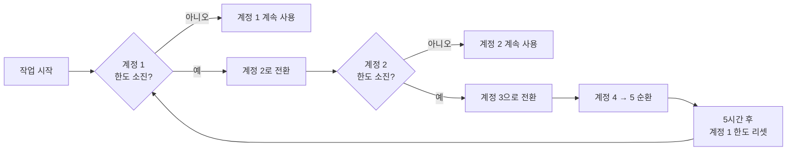
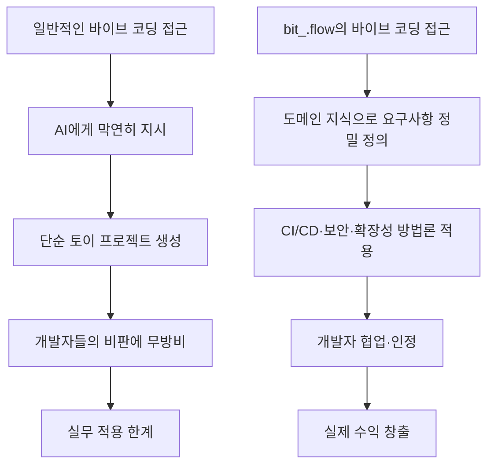
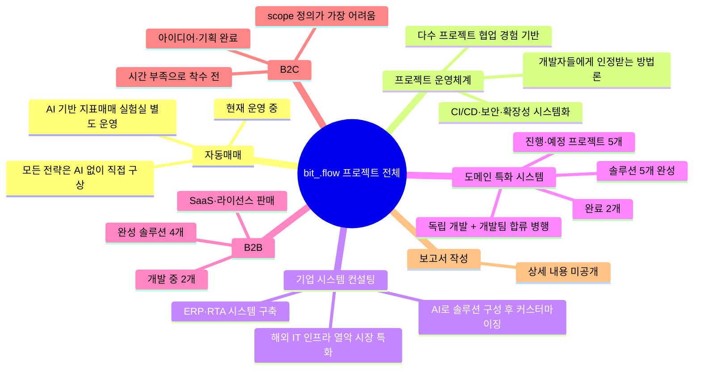
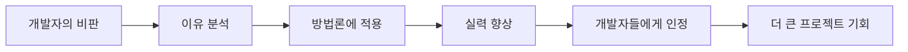
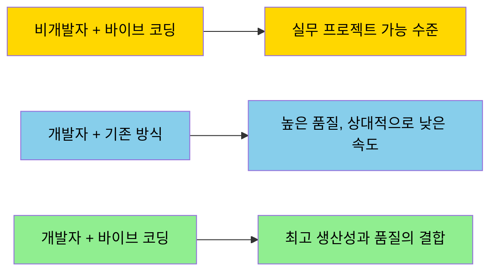

> 출처: Threads [@bit_.flow](https://www.threads.com/@bit_.flow/post/DY7ft6qlsDu) | 분석 기준일: 2026년 5월 30일

---

## 목차

1. [이 글은 무엇인가](#1-이-글은-무엇인가)
2. [Claude Max 20x — 월 140만 원짜리 환경의 의미](#2-claude-max-20x--월-140만-원짜리-환경의-의미)
3. [바이브 코딩이란 무엇인가](#3-바이브-코딩이란-무엇인가)
4. [GPT냐 Claude냐 — 모델 선택에 대한 현실적인 시각](#4-gpt냐-claude냐--모델-선택에-대한-현실적인-시각)
5. [7개의 프로젝트, 하나의 원칙](#5-7개의-프로젝트-하나의-원칙)
6. [개발자와의 관계 — 비판을 자원으로 삼는 법](#6-개발자와의-관계--비판을-자원으로-삼는-법)
7. [첫 고객은 어떻게 만들었는가](#7-첫-고객은-어떻게-만들었는가)
8. [소셜 미디어와 자기 표현](#8-소셜-미디어와-자기-표현)
9. [이 기록이 던지는 질문들](#9-이-기록이-던지는-질문들)

---

## 1. 이 글은 무엇인가

Threads는 메타(Meta)가 운영하는 텍스트 기반의 소셜 미디어 플랫폼이다. 인스타그램과 연동되어 있으며, 짧고 빠른 텍스트 게시물이 중심이 된다는 점에서 X(구 트위터)와 성격이 비슷하다. @bit_.flow라는 계정은 팔로워가 약 500명인, 플랫폼 안에서 스스로를 "하꼬"라고 부르는 소규모 계정이다. 하꼬란 인터넷 용어로 구독자나 팔로워가 적은 소규모 채널이나 계정을 뜻한다. 그런데 이 계정이 올린 특정 게시물이 좋아요 26개, 댓글 39개라는 해당 계정 기준으로 상당한 반응을 이끌어냈다.

글의 목적에 대해 작성자는 솔직하다. 자랑이다. 다만 Threads에서는 직접적인 수익 인증이 계정 정지 사유가 될 수 있기 때문에, 수치를 직접 공개하는 대신 자신이 진행 중인 프로젝트의 규모와 다양성을 통해 자신의 역량을 간접적으로 증명하는 방식을 택했다. 처음에는 별도의 계정을 새로 만들어 거기서 자랑할 생각이었지만, 계정 두 개를 동시에 관리하는 것이 귀찮아서 그냥 메인 계정에 올렸다고 밝히고 있다. 이 솔직함 자체가 이 게시물의 독특한 매력이기도 하다.

글은 총 9개의 슬라이드로 구성되어 있다. 공개된 내용은 자신의 AI 활용 환경 소개로 시작해 자동매매, 프로젝트 운영체계, 기업 시스템 컨설팅, 도메인 특화 시스템 구축, B2B, B2C, 보고서 작성이라는 7개의 프로젝트 카테고리를 설명하고, 마지막으로 바이브 코딩에 대한 자신의 철학으로 마무리된다. 단순히 "나 이런 거 하고 있어요"를 나열한 것처럼 보이지만, 그 안에는 바이브 코딩을 어떻게 실제 수익으로 연결하는지에 대한 진지한 관점이 담겨 있다.

---

## 2. Claude Max 20x — 월 140만 원짜리 환경의 의미

작성자는 현재 Claude Max 20x 계정을 다섯 개 동시에 운영하면서 작업하고 있다고 밝힌다. 이것이 어떤 의미인지 이해하려면 Claude Max 플랜의 구조부터 살펴봐야 한다.

Claude Max는 AI 기업 Anthropic이 2025년 4월에 출시한 고사용량 구독 플랜이다. 기존의 Claude Pro 플랜(월 $20, 약 2만 8천 원)보다 훨씬 높은 사용량 한도를 제공하는 상위 플랜으로, 두 가지 등급으로 나뉜다. Max 5x는 월 $100(약 14만 원)로 Pro 플랜 대비 5배의 사용량을 제공하고, Max 20x는 월 $200(약 28만 원)로 Pro 플랜 대비 20배의 사용량을 제공한다. Max 20x 기준으로 짧은 대화를 전제로 할 때 5시간 세션당 최소 900개의 메시지를 전송할 수 있으며, 한 달에 최대 50세션까지 이용이 가능하다. 그리고 Claude Opus라는 최고 성능 모델, Claude Code, 음성 모드 등 최신 기능에 우선적으로 접근할 수 있다.

중요한 것은 이 한도가 5시간 단위의 롤링 세션(Rolling Session)으로 초기화된다는 점이다. 즉, 집중적으로 작업하다 보면 한 계정의 한도를 5시간 안에 모두 소진할 수 있고, 그렇게 되면 해당 계정으로는 더 이상 같은 세션 안에서 작업을 이어갈 수 없다. 작성자가 이를 해결하는 방법이 바로 계정 5개를 교대로 운영하는 것이다. 한 계정의 한도가 찼을 때 다른 계정으로 전환하면 사실상 끊김 없이 작업을 이어갈 수 있고, 5시간이 지나면 먼저 사용했던 계정의 한도가 리셋되어 다시 쓸 수 있게 된다.

비용을 계산해보면 월 $200에 계정이 5개이니 Claude 구독료만 월 $1,000, 한화로 약 140만 원이다. 이는 적지 않은 금액이다. 그러나 작성자의 관점에서 이 지출은 당연한 것이다. 그는 "최고의 가성비는 그냥 좋은 모델로 쓰는 것"이라고 말한다. 이미 정액 요금을 내고 있는 상황에서 성능을 낮춰서 아끼는 것은 오히려 손해라는 논리다. 그래서 API를 별도로 활용하지 않는 모든 작업에서는 항상 Claude Opus를 최대 성능(high effort)으로 사용한다는 원칙을 세웠다.

API를 별도로 쓰는 경우와 Max 구독을 쓰는 경우를 나누는 이유도 있다. Claude.ai 구독과 API는 별개의 과금 체계다. 구독 요금을 내더라도 그것이 API 호출 크레딧으로 전환되지는 않는다. 따라서 자동화 파이프라인이나 대량 처리가 필요한 경우에는 API를 따로 구매해야 하고, 일상적인 채팅 기반 작업에서는 Max 구독이 훨씬 경제적이다. 작성자는 이 두 가지를 용도에 맞게 구분해서 사용하고 있다.

---

## 3. 바이브 코딩이란 무엇인가

바이브 코딩(Vibe Coding)은 2025년 2월에 OpenAI 공동 창립자이자 전 Tesla AI 담당 이사인 Andrej Karpathy가 처음 제안한 개념이다. 그는 "가장 핫한 프로그래밍 언어는 영어"라는 파격적인 발언과 함께, 코드를 직접 작성하는 대신 원하는 것을 자연어로 설명하고 AI가 만들어주는 코드를 받아들이는 방식을 바이브 코딩이라고 명명했다. 이 개념은 등장하자마자 그다음 달 Merriam-Webster 사전에 "속어 및 트렌드" 명사로 등재될 만큼 빠르게 확산됐다.

바이브 코딩의 핵심 특징은 사용자가 코드를 완전히 이해하지 않아도 된다는 데 있다. 코드의 세부 구현 방법(How)보다 원하는 결과(What)에 집중하고, AI와 반복적인 대화를 통해 결과물을 조금씩 다듬어나가는 방식이다. 이는 전통적인 개발 방식과 근본적으로 다르다. 기존에는 프레임워크의 문법과 구조를 먼저 익히고, 로직을 직접 설계하며, 코드를 한 줄 한 줄 작성해야 했다. 바이브 코딩에서는 그 모든 과정을 AI에게 위임하고, 사람은 방향을 제시하고 결과를 판단하는 역할을 맡는다.

이 패러다임의 영향은 데이터로도 확인된다. 2025년 Vercel의 'State of Vibe Coding' 보고서에 따르면, v0 플랫폼 사용자의 63%가 비개발자이며, 이들은 UI 제작, 정교한 앱 개발, 개인 포트폴리오 사이트 등을 바이브 코딩으로 만들고 있다. Y Combinator도 2025년 3월, 같은 해 겨울 배치에 참여한 스타트업의 25%가 코드베이스의 95%를 AI로 생성했다고 밝혔다.

그러나 작성자의 시각은 이 현상을 단순히 긍정적으로만 보지 않는다. 그는 바이브 코딩 커뮤니티의 문제를 정확히 짚어낸다. 대부분의 사람들이 "어떤 결과물을 내놓을지"에만 집중한 나머지, 사주 앱이나 메모 앱, 알람 앱 같은 단순한 토이 프로젝트에 머물고 있다는 것이다. 그리고 이 한계의 근본 원인을 방법론의 부재라고 진단한다.

작성자가 말하는 방법론이란, CI/CD(지속적 통합과 지속적 배포), 테스트 하네스, 보안, 확장성과 같이 소프트웨어 개발에서 반드시 고려해야 하는 요소들을 체계적으로 이해하고 적용하는 것이다. CI/CD란 코드 변경사항이 자동으로 테스트되고 배포되는 파이프라인을, 테스트 하네스란 코드의 동작을 체계적으로 검증하기 위한 도구 모음을 의미한다. 이것들이 없으면 빠르게 만든 결과물이 실제 비즈니스 환경에서 쉽게 무너진다.

---

## 4. GPT냐 Claude냐 — 모델 선택에 대한 현실적인 시각

작성자는 이 글에서 AI 모델 선택에 대한 흥미로운 입장을 밝힌다. "솔직히 클로드 성능 떨어졌다. GPT가 더 낫다 그러는데, 나는 잘 모르겠음. 그냥 잘 쓰면 잘되는 느낌이고, 내 스타일은 클로드랑 더 맞아서 계속 쓰는 중임." 이 발언은 2025~2026년 AI 커뮤니티 안에서 실제로 반복되는 논쟁의 분위기를 그대로 담고 있다.

실제로 2026년 4월은 AI 모델 경쟁 역사상 가장 치열했던 한 주로 기록됐다. Anthropic이 4월 16일 Claude Opus 4.7을 출시하며 SWE-bench Pro 기준 코딩 성능을 64.3%까지 끌어올렸고, 불과 일주일 뒤인 4월 23일 OpenAI가 GPT-5.5(코드명 "Spud")로 반격에 나섰다. GPT-4.5 이후 처음으로 완전히 재훈련된 기반 모델인 GPT-5.5는 텍스트, 이미지, 오디오, 영상을 하나의 통합 시스템에서 처리하는 네이티브 옴니모달 구조로 설계됐으며, 토큰 효율성과 멀티툴 오케스트레이션에 최적화됐다.

두 모델은 서로 다른 축에서 강점을 보인다. 공통으로 평가된 10개의 벤치마크에서 Opus 4.7은 GPQA, HLE(도구 없음/있음), SWE-Bench Pro, MCP Atlas, FinanceAgent v1.1 등 6개에서 앞섰고, GPT-5.5는 Terminal-Bench 2.0, BrowseComp, OSWorld-Verified, CyberGym 등 4개에서 우위를 보였다. 정리하면 Opus 4.7은 에이전트 코딩, 100만 토큰 장문 컨텍스트 처리, 복잡한 추론 작업에서 강하고, GPT-5.5는 원시 출력 속도(초당 약 74토큰)와 셸 기반 작업 처리에서 강하다. 가격 면에서는 두 모델 모두 입력 토큰 100만 개당 $5이지만, 출력 토큰은 Opus 4.7이 $25, GPT-5.5가 $30으로 Opus 4.7이 17% 저렴하다. 다만 GPT-5.5는 동일한 작업을 처리할 때 출력 토큰 수 자체가 72% 적기 때문에, 단순 토큰 단가만으로 비용을 비교하기는 어렵다. 어느 쪽이 절대적으로 우월하다고 단언하기 어려운, 용도에 따라 선택이 갈리는 상황이다.

작성자의 통찰이 중요한 지점은 바로 여기다. 어느 모델이 벤치마크에서 몇 점 더 높은지보다, 자신의 작업 스타일과 무엇이 더 잘 맞는지가 실용적으로 훨씬 중요하다는 것이다. 실제로 전문가들도 두 모델을 놓고 "벤치마크가 아니라 워크로드의 성격으로 선택하라"고 조언한다. 토큰 효율과 속도가 중요한 대량 자동화 파이프라인이라면 GPT-5.5가, 에이전트 코딩과 긴 컨텍스트를 다루는 복잡한 작업이라면 Opus 4.7이 더 적합하다는 식이다. 작성자는 그 논쟁 한가운데서 Claude의 응답 스타일이 자신과 더 잘 맞는다는 이유만으로 Claude를 선택한다. 이는 매우 합리적인 판단이다. AI는 도구다. 같은 도구라도 사용자에 따라 결과는 크게 달라지고, 자신에게 익숙한 도구가 생산성을 높이는 데 더 유리할 수 있다.

---

## 5. 7개의 프로젝트, 하나의 원칙

작성자가 진행 중인 프로젝트는 일곱 가지 카테고리로 나뉜다. 표면적으로는 각각 다른 분야처럼 보이지만, 모든 프로젝트를 관통하는 하나의 원칙이 있다. 도메인 지식이 먼저이고, AI는 그것을 구현하는 도구라는 것이다.

첫 번째 프로젝트는 자동매매 봇이다. 작성자는 이 프로젝트에 가장 큰 자신감을 갖고 있다. "워낙 압도적인 퍼포먼스라 더이상 설명 안함"이라고 말할 정도다. 이 프로젝트에서 가장 주목할 점은 모든 매매 전략을 AI 없이 작성자가 직접 구상했다는 사실이다. AI는 오로지 전략을 실행하는 프로그램을 개발하는 데에만 사용됐다. 이 구분이 매우 중요한 이유는, 현재 소셜 미디어에 넘쳐나는 "AI로 자동매매봇 만들기" 콘텐츠들과의 근본적인 차이점이기 때문이다. 그는 그런 콘텐츠의 99.9%를 쓰레기라고 단언하는데, 그 이유는 단순하다. 금융 시장에 대한 도메인 지식, 즉 시장 이해, 매매 전략 설계, 리스크 관리 능력이 없는 상태에서 AI에게 "자동매매봇 만들어줘"라고 하면 기술적으로는 작동하는 봇이 만들어질 수 있지만, 실제로 돈을 버는 봇은 절대 나오지 않기 때문이다. 작성자는 동시에 AI를 활용한 지표 매매 실험실도 별도로 운영 중이다. 자신이 잘 모르는 데이터를 AI에게 입력해가며 가능성을 탐색하고 있으나, 기대를 크게 갖지 않고 있다고 솔직하게 밝힌다. 이 접근은 과학적이다. 가능성을 열어두되, 검증 없이 확신하지 않는다.

두 번째 프로젝트는 프로젝트 운영체계다. 이것은 작성자가 다수의 프로젝트를 진행하고 여러 개발자들과 협업하면서 직접 만든 방법론 체계다. CI/CD, 테스트 하네스, 보안, 확장성이라는 개념들을 머릿속에만 두는 것이 아니라, 전체 솔루션을 시스템화해서 누구나 따를 수 있는 방법론으로 만들었다. 이 방법론이 탄생한 배경이 흥미롭다. 처음에 개발자들과 협업할 때는 힘들게 만들어 가면 "다 갈아엎어야 되는 수준"이라는 피드백을 들어야 했다. 그 피드백들을 하나씩 받아들이고, 부족한 부분을 고쳐나가며 운영체계를 완성한 이후로는 개발자들에게 어느 정도 인정받게 됐다. 혹독한 실패와 피드백이 이 방법론을 만든 원재료인 셈이다.

세 번째 프로젝트는 기업 시스템 컨설팅이다. 구체적으로는 ERP(Enterprise Resource Planning, 전사적 자원 관리)와 RTA(Real-Time Analytics, 실시간 분석) 시스템을 기업에 구축해주는 사업이다. ERP는 기업의 재무, 인사, 생산, 물류를 하나의 시스템으로 통합 관리하는 소프트웨어이고, RTA는 실시간으로 데이터를 분석해 즉각적인 의사결정을 돕는 시스템이다. 작성자는 이 분야의 전문가가 아님을 솔직하게 인정한다. 대신 AI의 도움을 받아 기본 솔루션을 먼저 만들어두고, 그것을 기반으로 기업마다 커스터마이징하는 방식을 택했다. 이 방식이 작동할 수 있는 배경에는 지리적 요인도 있다. 작성자는 현재 해외에 거주하고 있으며, 그 지역은 IT 인프라가 열악한 곳이 많아 기본적인 수준의 시스템만 갖춰줘도 충분한 수요가 존재한다고 설명한다. 선진화된 솔루션이 필요 없는 시장에서 AI를 활용해 경쟁력 있는 가격으로 서비스를 제공하는 전략이다.

네 번째 프로젝트는 도메인 관련 시스템 구축이다. 작성자는 이 분야에서는 "특정될 수 있을 것 같아서" 자세한 설명을 하지 않는다. 다만 규모만 놓고 봐도 상당하다. 이 분야에서만 이미 완성된 솔루션이 5개이고, 진행 중이거나 진행 예정인 프로젝트가 5개이며, 완료된 것은 아직 2개뿐이다. 작성자는 이러니 강의를 팔 시간이 없다고 말하는데, 이 표현에서 현실적인 바쁨이 느껴진다. 프로젝트 방식은 두 가지다. 혼자서 처음부터 끝까지 개발하고 운영하는 독립적인 형태와, 기존 개발팀에 합류해 함께 작업하는 형태가 있다. 후자의 경우 스스로 "끼워팔이 식으로 들어간다"고 표현하지만, 실제로는 동시에 여러 프로젝트를 진행하면서도 2~3인분 역할을 맡아 하고 있다고 밝힌다.

다섯 번째 프로젝트는 B2B(Business to Business)다. 기업을 대상으로 자체 개발한 소프트웨어를 SaaS(Software as a Service, 월정액 구독) 또는 라이선스(소프트웨어 사용권 일괄 판매) 형태로 판매하는 사업이다. 이미 완성된 솔루션이 4개, 현재 개발 중인 것이 2개이며, 머릿속에서 구상 중인 통합 시스템도 1개 있다. 이 통합 시스템이 흥미로운 이유는, 지금까지 만든 개별 솔루션들을 하나의 플랫폼으로 묶어 제공한다면 고객 유치와 유지에 드는 비용을 크게 줄일 수 있기 때문이다. 아직은 "망상"이라고 자조적으로 표현하지만, 이것이 실현된다면 사업 모델의 완성도가 한 단계 높아질 수 있다.

여섯 번째 프로젝트는 B2C(Business to Consumer), 즉 일반 소비자를 대상으로 한 서비스다. 작성자는 이 분야가 "솔직히 이게 제일 막막함"이라고 고백한다. 아이디어와 기획은 이미 완성됐지만, 시작을 못 하고 있다. 이유는 두 가지다. 첫째는 단순하게 시간이 없다는 것이고, 둘째는 B2C 자체의 구조적 어려움이다. B2B에서는 고객인 기업이 명확한 문제를 가지고 있고, 도메인 지식을 바탕으로 그 문제를 해결하면 된다. 그러나 B2C에서는 불특정 다수의 소비자 중 누구를 타겟으로 할지, 어떤 문제를 해결할지, 얼마나 좁게 또는 넓게 scope을 잡을지를 처음부터 명확하게 정의해야 한다. 이 정의 자체가 B2C의 핵심 난제다. 이미 다른 프로젝트들로 가득 찬 상황에서 이 불확실성까지 마주하는 것은 쉽지 않은 도전이다.

일곱 번째는 보고서 작성이다. "이건 그냥"이라고 쓴 후 설명이 잘려 있어 상세한 내용은 알 수 없다. AI를 활용해 기업 보고서나 분석 자료를 작성하는 서비스일 가능성이 있으나, 게시물에서 확인되지 않은 내용이므로 단정할 수 없다.

---

## 6. 개발자와의 관계 — 비판을 자원으로 삼는 법

이 게시물에서 가장 깊이 있는 부분은 개발자와 바이브 코더의 관계에 대한 작성자의 관점이다. 그는 개발자들의 반감을 충분히 이해한다고 말한다. "본인들이 힘들게 쌓은 도메인 지식을 이렇게 빨리 뺏긴다 생각하면 반감이 당연히 들겠지." 수년에 걸쳐 구축한 전문성이 AI 도구 하나로 빠르게 대체되는 것처럼 보인다면, 그 심리적 저항은 자연스럽다.

개발자들이 지적하는 바이브 코딩의 문제들, 즉 보안 취약점, 확장성 부재, 낮은 코드 품질 등은 실제로 존재하는 문제다. 그러나 작성자는 여기서 중요한 지점을 짚는다. 개발자들 역시 이런 문제들에서 완전히 자유롭지 않다는 것이다. 누가 보면 지들은 완벽하게 한다고 착각할 수도 있지만, 보안 취약점이나 확장성 문제는 전문 개발자들의 코드에도 얼마든지 존재한다.

그러나 이 논리를 일반 바이브 코더들에게 그대로 적용하는 것은 위험하다. 작성자는 오히려 이렇게 경고한다. 개발자들의 반감은 자신처럼 실력을 이미 어느 정도 갖춘 사람이라면 거를 수 있지만, 이제 막 시작하는 바이브 코더들은 절대 그 비판을 흘려보내면 안 된다는 것이다. "거르지 말고, 까는 이유들 하나하나 흡수해서 제대로 적용하고, 보강시키는게 맞는 거임." 이것이 이 게시물 전체에서 가장 핵심적인 메시지다.

작성자 자신이 그 과정을 거쳤다. 초반에 개발자들과 협업할 때 기껏 만들어 가면 "다 갈아엎어야 되는 수준"이라는 피드백을 받았다. 그 아픔을 받아들이고, 비판의 이유들을 하나씩 이해하며, 운영체계를 만들고 적용했다. 그 이후로 개발자들에게 인정받기 시작했다. 그가 개발자들의 비판을 "땡큐"라고 표현하는 이유가 여기에 있다. 지들도 제대로 못 하는 것을 바이브 코딩 탓으로 트집잡으면, 자신은 그것을 적용해서 그들보다 나아질 수 있는 기회를 얻게 된다는 것이다.

바이브 코딩과 개발자 역량의 관계에 대한 작성자의 시각도 분명하다. 바이브 코딩은 개발자를 대체하는 것이 아니다. 오히려 개발자가 바이브 코딩을 익히면 생산성이 극적으로 향상된다. 작성자는 "개발자들이 바이브 코딩하면 진짜 개잘함이 됨"이라고 말하며, 주변의 개발자들이 바이브 코딩을 활용할 때의 생산성을 보면 스레드에서 벌어지는 논쟁이 얼마나 극단적인지 알 수 있다고 덧붙인다. 비개발자인 자신도 바이브 코딩으로 상당한 성과를 내고 있지만, 개발 지식 위에 바이브 코딩이 더해지면 그 시너지는 비교 자체가 불가능하다는 것이다.

---

## 7. 첫 고객은 어떻게 만들었는가

댓글에서 한 팔로워가 "도메인 지식을 바탕으로 시작하려는데 첫 영업을 어떻게 시작했느냐"고 물었다. 작성자의 답은 간결하고 실용적이다. "일단 배경빨이 제일 컸고, 시스템 컨설팅의 경우에는 회사 사이트 구린 곳들 다 연락 돌렸었습니다."

여기서 배경(Background)이란 자신이 이미 갖고 있는 직업, 경력, 인맥, 업계 내 신뢰도를 말한다. 새로운 도구를 가지고 새로운 분야에 뛰어들더라도, 기존에 자신이 쌓아온 배경이 잠재 고객에게 신뢰를 주는 핵심 자원이 된다는 것이다. 이 지점은 중요하다. 바이브 코딩이 아무리 강력한 도구라도, 그것만으로 신뢰를 만들어내기는 어렵다. 결국 첫 번째 고객을 설득하는 것은 도구가 아니라 사람의 배경이다.

두 번째 방법인 콜드 아웃리치(Cold Outreach), 즉 사이트가 낡거나 조악해 보이는 기업들을 직접 찾아 연락을 돌리는 방식은 전형적인 영업 허슬(hustle)이다. AI 시대에도 결국 첫 고객을 만드는 것은 발품과 적극성이라는 변하지 않는 원칙을 보여준다. 도구가 아무리 진화해도, 고객과의 관계를 처음 여는 일은 사람이 직접 해야 한다.

팔로워 중 글로벌 업계 1위 회사에 다닌다는 사람도 댓글에서 "처음에 콜드콜 정도로 허슬링 역시 필요하군요"라며 공감했다. 탄탄한 배경을 가진 사람도 첫 영업에서는 같은 원칙이 적용된다. 배경이 있다고 고객이 저절로 오지는 않는다.

---

## 8. 소셜 미디어와 자기 표현

댓글에서 드러나는 작성자의 면모도 흥미롭다. 팔로워 @infp_horong이 "스레드도 그냥 즐기며 꾸준히 하시다보면 하나씩 글이 커질거에요!"라고 격려하자, 작성자는 이렇게 답한다. "돈벌려고 하는게 아니라서 맘 편하게 하려고 했는데, 제가 생각보다 많이 관심을 좋아하더라고요." 이 고백이 재미있다. 소셜 미디어를 운영하다 보면 자주 겪는 경험인데, 처음에는 가볍게 올렸던 글이 반응을 얻기 시작하면서 그 반응 자체가 동기가 되고, 더 좋은 글을 쓰고 싶다는 욕구가 생기는 선순환이 발생한다. @infp_horong이 "이게 즐기다보면 많이들 봐주시고 그럼 또 재밌고의 무한 양성피드백"이라고 표현한 것이 이 현상을 잘 설명한다. 작성자가 마지막으로 "열심히 즐겨보겠습니다!"라고 답하는 것은 그 선순환에 기꺼이 올라타겠다는 선언처럼 들린다.

이 게시물 전체의 포지셔닝도 일관된다. 작성자는 "나는 단순히 AI를 가지고 노는 수준이 아니라, 실제로 수익을 만들어내는 체계를 갖춘 사람"이라는 메시지를 전달하려 한다. 수익 인증이 계정 정지 위험을 불러올 수 있기 때문에 직접적인 숫자는 공개하지 않는다. 대신 진행 중인 프로젝트의 다양성과 규모, 개발자들에게 인정받은 경험, 해외 시장에서의 실제 영업 경험 등을 통해 자신의 역량을 간접적으로 증명한다. 이것은 소셜 미디어에서 흔히 쓰이는 포지셔닝 전략이기도 하고, 동시에 이 계정에 팔로워가 500명밖에 없음에도 댓글이 39개나 달린 이유이기도 하다. 사람들은 성과 자체보다 성과를 만들어내는 과정과 사고방식에 더 끌린다.

---

## 9. 이 기록이 던지는 질문들

이 게시물은 단순히 한 사람의 자랑이 아니다. 읽고 나면 몇 가지 질문이 자연스럽게 따라온다.

첫째, 도메인 지식과 AI 도구 중 어느 것이 더 중요한가. 작성자의 답은 명확하다. 도메인 지식이다. 자동매매의 모든 전략은 AI 없이 직접 구상했고, 기업 컨설팅에서는 현지 시장의 특성을 이해하고 있었기에 솔루션을 팔 수 있었다. AI는 그 지식을 빠르게 구현하는 도구일 뿐이다. 도구의 성능이 아무리 올라가도, 무엇을 만들어야 하는지를 아는 것은 여전히 사람의 몫이다.

둘째, 방법론 없이 속도만 추구하면 어떻게 되는가. 바이브 코딩의 매력은 빠른 속도다. 하루 만에 앱을 만들고, 며칠 만에 서비스를 출시할 수 있다. 그러나 그 결과물이 보안도 취약하고 확장도 안 되고 유지보수도 불가능하다면, 그 속도는 오히려 해가 된다. 작성자가 개발자들의 혹독한 피드백을 거치며 운영체계를 만든 이유가 바로 여기에 있다.

셋째, 비판을 어떻게 다룰 것인가. 작성자의 성장 과정에서 가장 인상적인 부분은 비판에 대한 태도다. 개발자들의 반감을 거르지 않고, 그 안의 구체적인 이유들을 하나씩 흡수해서 자신의 것으로 만들었다. 비판은 불편하지만, 그것이 정확할수록 더 큰 성장의 재료가 된다. 이 태도는 바이브 코딩에만 적용되는 것이 아니라, 어떤 분야에서든 실력을 키우는 보편적인 방법이다.

넷째, 특화된 시장(Niche)의 가치는 무엇인가. 작성자는 자신이 거주하는 국가에서 자신의 도메인 분야에서 바이브 코딩으로 수익을 내는 사람이 거의 없다고 말한다. 경쟁이 없는 시장에서 먼저 자리를 잡는 것이 전략의 핵심이다. AI 도구는 누구에게나 열려 있지만, 특정 분야에 대한 깊은 이해와 현지 시장에 대한 감각은 쉽게 복제되지 않는다.

마지막으로, 투자에 대한 두려움을 어떻게 극복할 것인가. 월 140만 원의 구독료는 시작 단계에서 결코 쉬운 결정이 아니다. 그러나 작성자의 논리는 일관된다. 좋은 도구에 투자하지 않아서 생산성이 떨어지는 것이 더 큰 손실이다. 도구를 아껴 쓰는 것이 절약이 아니라, 도구를 최대한 활용해서 만들어내는 결과가 투자를 정당화한다.

---

*이 문서는 2026년 5월 30일 기준, Threads @bit_.flow 계정의 게시물 원문과 최신 검색 정보를 바탕으로 작성된 분석 에세이입니다. 게시물 원문에서 확인되지 않은 내용은 명시적으로 불확실함을 표기했습니다.*
