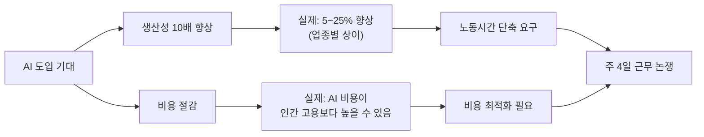
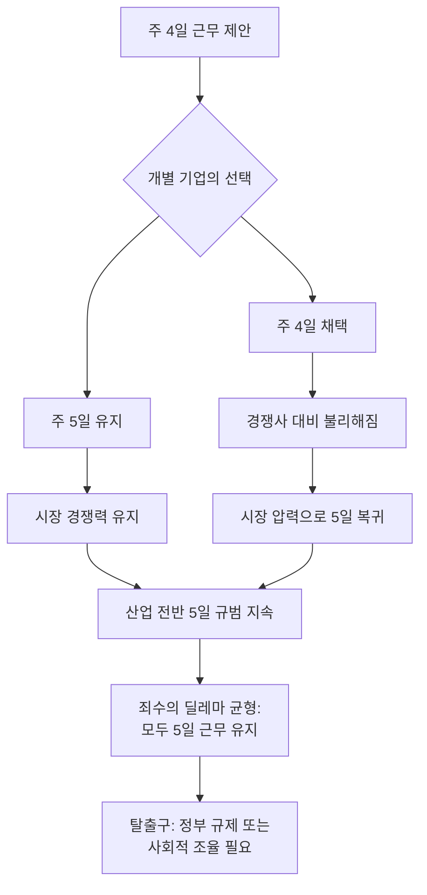
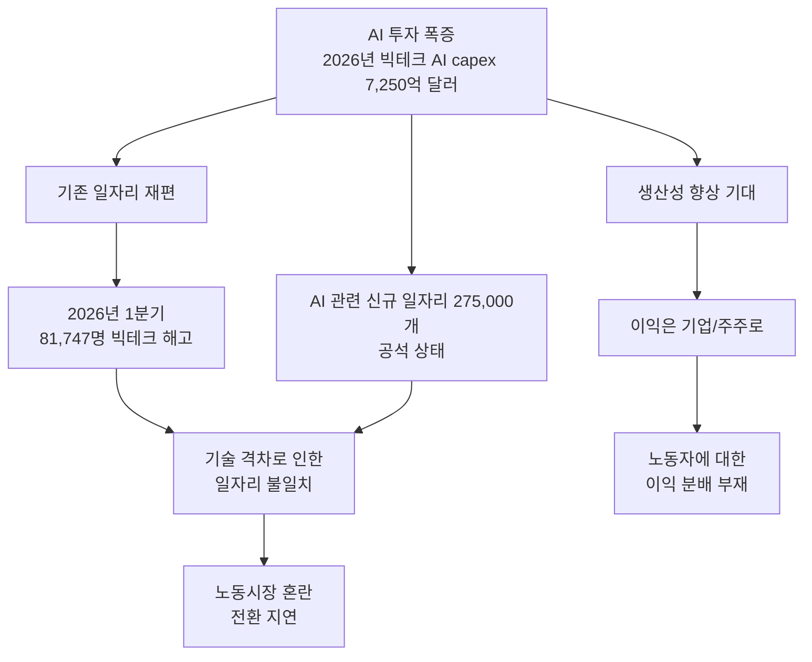
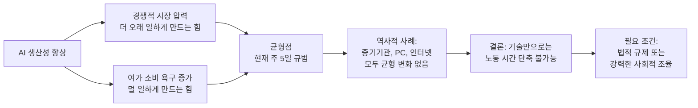

> **원문 출처**: [mlsu.io — "Can we have the day off?"](https://mlsu.io/posts/day-off/) (Mike, 2026년 5월)  
> **토론 출처**: [GeekNews (hada.io) #29975](https://news.hada.io/topic?id=29975) 및 Hacker News 동시 토론

---

## 개요

2026년 5월, "Mike"라는 기술 블로거가 mlsu.io에 짧지만 날카로운 글을 하나 올렸다. 제목은 "Can we have the day off?" — 우리말로 옮기면 "하루 쉬어도 될까요?"다. 글의 분량은 짧지만, 그 안에는 AI 시대의 핵심 모순을 찌르는 질문이 담겨 있다. 이 글은 이후 Hacker News와 한국의 GeekNews에서 수십 개의 댓글이 달린 토론으로 이어졌으며, AI가 바꾸는 노동의 미래에 대한 다양한 관점들이 충돌하는 장이 되었다.

이 문서는 원글의 주장, 그것이 촉발한 토론의 흐름, 그리고 그 배경에 깔린 실제 데이터와 역사적 맥락을 종합적으로 정리한다.

---

## 1. 원글의 핵심 주장: 논리적인 요청인가, 순진한 기대인가?

### 1.1 출발점: AI는 생산성을 10배 높인다는 주장

Mike의 글은 당시 IT 업계와 경영 컨설팅 세계에서 흔히 들리던 전제에서 시작한다. AI가 사무직 근로자의 생산성을 극적으로 향상시킨다는 것이다. "10배" 생산성 향상이라는 표현은 다소 과장된 수치처럼 보이지만, 실제로 이 수치 혹은 이에 준하는 주장은 여러 기업 CEO와 AI 업체들의 홍보 문구에서 반복적으로 등장해왔다.

Mike는 이 전제를 문자 그대로 받아들이는 척하며 논리적 귀결을 도출한다. 생산성이 10배 높아졌다면, 과거에 한 주 내내 걸리던 업무를 이제 월요일 정오까지 마칠 수 있어야 한다. 그렇다면 금요일은 쉬어도 되는 것 아닌가?

### 1.2 "AI Workers' Day"라는 아이디어

글에서 Mike는 금요일을 일종의 "AI 워커스 데이(AI workers' day)"로 선언하자는 제안을 내놓는다. 직원이 목요일에 충분히 좋은 프롬프트를 준비해두면, 금요일에는 AI 에이전트가 그 프롬프트를 바탕으로 하루 종일 작업을 이어간다는 구상이다.

이 구상에서 주목할 지점은 단순히 직원만 쉬는 것이 아니라, 이사회와 C-suite도 함께 금요일 골프장에 나가면 된다는 점이다. 사무실에는 사람 대신 AI 에이전트가 남아 작업을 처리한다. 이렇게 되면 "출근하지 않아도 되는" 것은 모든 직급에 공통으로 적용된다. 표면적으로는 유쾌하고 반농담적인 제안처럼 읽히지만, 그 안에는 진지한 질문이 숨어 있다.

### 1.3 일론 머스크를 향한 직접적인 호소

글의 마지막 단락은 더욱 개인적이고 직접적이다. Mike는 일론 머스크를 향해 말한다. 자신이 출산율을 높이려 노력 중인데, 캘리포니아에서 어린아이 세 명의 보육비로 한 달에 6,000달러가 든다는 현실을 언급하며, 주 5일 모두 사무실에 출근해야 하는 이유가 있느냐고 묻는다. 이 언급은 단순히 개인적인 고충을 토로하는 것을 넘어서, 현재의 노동 구조가 생활비, 보육 비용, 출산율이라는 사회적 문제와 얼마나 긴밀하게 연결되어 있는지를 압축적으로 보여준다.

---

## 2. 현실 점검: AI 생산성 향상은 실제로 얼마나 이루어지고 있는가?

원글의 논리를 평가하려면 "AI가 생산성을 10배 높인다"는 전제가 실제로 성립하는지부터 살펴볼 필요가 있다.

### 2.1 실제 측정된 AI 생산성 향상 수치

2026년 2월에 발표된 국제 경제법 센터(ICLE)의 리뷰에 따르면, AI 도입의 생산성 효과는 업종과 직무에 따라 상당히 다르게 나타난다. OECD 연구 기준으로 고객 지원, 소프트웨어 개발, 컨설팅 분야에서 AI 통합을 통한 생산성 향상은 대략 5~25% 수준으로 측정되었다. 이는 AI 업계에서 흔히 주장하는 "10배"와는 거리가 있다.

2025년 12월 기준으로 미국 노동자의 35.9%가 생성형 AI를 업무에 활용하고 있으며, 연구 결과에 따르면 임금에는 소폭의 긍정적 영향이 있었지만 노동시장 전체 차원에서 통계적으로 유의미한 고용 감소는 아직 나타나지 않았다.

Gartner는 2025년에 발생한 140만 건의 해고 중 AI 생산성 향상을 직접 원인으로 볼 수 있는 경우는 1% 미만이라고 밝혔다. 현재 단계에서 AI가 하는 일은 대규모 해고보다는 직무 재설계, 신규 채용 회피, 역할 통합에 가깝다는 것이 가트너의 분석이다.

### 2.2 "10배 생산성"의 함정: AI는 오히려 비싸다

더욱 흥미로운 역설이 등장했다. 2026년 5월에 포춘(Fortune)이 보도한 내용에 따르면, Microsoft의 내부 데이터가 AI 사용 비용이 인간 직원을 고용하는 것보다 더 비쌀 수 있다는 사실을 드러내고 있다.

구체적인 사례로, Microsoft는 내부 개발자 수천 명에게 Anthropic의 Claude Code를 도입했지만, 대규모 사용 확산 이후 토큰 기반 가격 구조 하에서 비용이 폭발적으로 증가하자 약 6개월 만에 대부분의 라이선스를 취소하고 GitHub Copilot CLI로 전환했다. IDC 조사에서는 생성형 AI를 배포한 기업의 96%가 예상보다 높거나 훨씬 높은 비용을 보고했으며, 에이전틱 AI 워크플로우를 구현한 경우 92%가 동일하게 응답했다.

Goldman Sachs는 에이전틱 AI가 2030년까지 토큰 소비량을 24배 증가시켜 월 120경 토큰에 달할 것으로 전망했다. 개별 토큰 가격은 하락하겠지만, 총 소비량 증가 속도가 단가 하락 속도를 앞지를 가능성이 높다는 것이 Gartner의 판단이다.

---

## 3. 주 4일 근무제의 실제 데이터

원글이 제안하는 주 4일 근무제는 이미 여러 국가에서 실험적으로 시행되었고, 상당한 데이터가 축적되어 있다.

### 3.1 호주의 주 4일 근무제 연구 결과

2025년 7월 네이처 인간 행동(Nature Human Behaviour) 저널에는 역대 최대 규모의 주 4일 근무 통제 연구 결과가 게재되었다. 보스턴 칼리지 사회학자들이 주도한 이 연구는 호주, 캐나다, 아일랜드, 뉴질랜드 등 6개국 141개 기업의 2,896명 직원을 추적했다.

디킨 대학교(Deakin University)의 존 홉킨스 교수 연구팀이 주 4일 근무를 공식 채택한 호주 기업 15곳을 대상으로 2023년 초부터 2024년 말까지 심층 인터뷰를 진행한 결과도 주목할 만하다. 참여 기업 중 생산성이 하락한 곳은 단 한 곳도 없었다. 6개 기업은 오히려 생산성이 향상되었다고 보고했고, 나머지는 이전과 비슷하게 유지됐다고 답했다.

4일 근무제 시범 운영 데이터를 종합하면 다음과 같다.

| 지표 | 변화 내용 |
|------|-----------|
| 생산성 향상 보고 | 참여자의 54%가 개인 최고 기록 대비 생산성 증가 |
| 병가 및 개인 휴가 | 1인당 월 평균 44.3% 감소 |
| 평균 이직률 | 8.6% 하락 |
| 번아웃 감소 보고 | 직원의 64% |
| 계속 시행 희망 | 기업의 95%, 직원의 96% |

Beyond Blue의 2025년 조사에 따르면 호주 노동자의 2명 중 1명이 번아웃을 경험하고 있으며, 특히 젊은 층과 부모 직원들이 가장 큰 위험에 처해 있다고 한다.

### 3.2 100:80:100 모델

주 4일 근무제의 핵심 프레임워크는 "100:80:100" 모델이다. 임금 100%를 유지하되, 근무 시간은 80%로 줄이고, 생산성은 100% 달성한다는 원칙이다. 아이슬란드에서는 2,500명의 노동자를 대상으로 시범 운영한 결과 웰빙이 향상되고 생산성은 유지되었으며, 2022년 기준 아이슬란드 노동력의 약 90%가 단축 근무를 요청할 권리를 갖게 되었다.

호주 현행 주 38시간 근무제는 1980년대 초에 도입되었고, 그 기반이 된 주 40시간 근무제는 1940년대 후반에 설정된 것이다. 컴퓨터도, 이메일도, AI도 없던 시대의 기준이 80년 가까이 이어지고 있다는 점은 중요한 맥락이다.

---

## 4. GeekNews와 Hacker News의 토론: 다층적 시각

이 글에 달린 댓글들은 단순한 찬반을 넘어 현대 AI 경제에 대한 여러 구조적 관점을 제시한다.

### 4.1 "9명 자르고 1명에게 몰아주기"의 논리

가장 즉각적이고 냉정한 반응은 이것이다. 생산성이 10배가 되면, 회사는 10명 대신 1명만 고용하면 된다고 생각한다. 휴일을 늘려주기는커녕, 인력을 줄이는 방향으로 가게 된다는 예측이다. Hacker News에서도 이 논리가 반복되었다. "생산성이 10배가 되면 쉬는 날을 좀 받을 수 있냐고 물으면, 아마 모든 쉬는 날을 주긴 할 것 같다"는 냉소적 표현이 등장하는데, 이는 해고를 의미하는 블랙 유머다.

### 4.2 생산성 향상의 이익은 누구에게 가는가?

토론에서 가장 핵심적인 질문은 이것이다. AI로 얻어진 생산성 향상의 이익이 노동자에게 돌아오는가, 아니면 주주와 경영진에게 집중되는가?

Hacker News 참가자 한 명은 역사적 흐름을 이렇게 정리했다. 원래도 경제적 이익은 소수에게 집중되는 경향이 있었고, 과거에는 소프트웨어 개발자들이 그 이익을 누리는 쪽에 있었다. 하지만 이제 개발자들도 점차 불리한 쪽으로 밀려나고 있다는 것이다. AI에서는 이익의 99%가 1%에게 돌아갈 가능성도 있다는 시각이 제기되었다.

Goldman Sachs의 기반 예측에서도 비슷한 우려가 보인다. AI 생산성 이익은 기업 이익과 주주 자산으로 흘러가고 있으며, 소비자(노동자)는 2~4분기의 시차를 두고 고용 충격을 받는 반면, 기업은 몇 분기 만에 이익 상승을 경험하는 비대칭 구조가 나타나고 있다.

### 4.3 죄수의 딜레마로서의 주 4일 근무

주 4일 근무제는 하나의 죄수의 딜레마 구조를 갖고 있다는 분석이 설득력 있게 제시되었다. 모든 회사가 주 4일 근무를 실시하면 사회 전체적으로 이익이지만, 어느 한 회사가 주 5일 근무로 '배신'하면 그 회사가 시장에서 경쟁 우위를 갖게 된다. 따라서 모든 회사가 주 5일을 유지하는 쪽으로 끌려가는 균형이 형성된다.

이 딜레마를 풀 수 있는 유일한 방법은 개별 시장 참여자보다 높은 수준의 조율, 즉 정부 개입이나 노동법 개정이라는 지적이 나왔다.

### 4.4 시간제 임금 모델의 구조적 모순

GeekNews 토론에서 한국의 소규모 기업 개발자 출신 대표가 올린 댓글은 이 논쟁의 구조적 핵심을 날카롭게 짚어냈다. 그의 논지는 다음과 같다.

현재 대부분의 임금 계약은 성과제가 아니라 시간제다. 시간제의 본질은 임금을 '시간'에 묶고 산출물과 분리하는 것이다. 이 분리는 이미 노동자에게 유리하게 작동한다. 8시간을 채웠지만 결과가 좋지 않아도 임금은 동일하게 지급되기 때문이다. 그런데 동시에 "AI로 결과를 더 많이 냈으니 근무 시간은 줄여달라"는 요구는 계약의 기반을 성과제로 바꾸자는 것과 같다. 성과제로 바꾸면 상방(산출 증가 시 보상 증가)뿐 아니라 하방(산출 감소 시 보상 감소)도 받아들여야 일관성이 있다는 것이다.

진짜 문제는 주 4일이냐가 아니라, '시간'을 임금 기준으로 삼는 모델 자체가 AI 시대에 맞지 않을 수 있다는 것이다.

### 4.5 LinkedIn의 역설: 자랑하면서 착취당하기

"지금 모두가 AI로 해고·대체될까 봐 두려워하지만, 다음 전사 회의에서는 생산성이 10배가 되면 쉬는 날도 늘어나는지, 급여도 그만큼 오르는지 진지하게 물어봐야 한다"는 지적도 있었다. 많은 개발자들이 LinkedIn에서 AI로 새로 얻은 생산성을 자랑하면서도, 그에 상응하는 고용 안정성이나 보상은 기대하지 못하고 있다는 역설적 상황이 묘사되었다.

---

## 5. 역사적 맥락: 케인스의 1930년 예측과 현실

이 논쟁의 역사적 뿌리는 꽤 깊다. Hacker News 토론에서 영국 경제학자 존 메이너드 케인스의 1930년 에세이 "우리 손자들의 경제적 가능성(Economic Possibilities for our Grandchildren)"이 여러 차례 인용되었다.

케인스는 당시 기술 발전 속도를 바탕으로 약 100년 후인 2030년경에는 인류의 경제적 문제가 해결되어 주 15시간 노동, 또는 하루 3시간 노동만으로도 충분한 시대가 올 것이라고 예측했다. 그는 인간의 욕구를 '절대적 욕구'(먹고 자고 입는 것처럼 충족 가능한 것)와 '상대적 욕구'(타인보다 우월하고 싶은 욕구로 끝이 없는 것)로 나누었다. 절대적 욕구가 충족되면 인류는 남는 에너지를 비경제적 목적에 쓸 수 있다고 내다봤다.

이 예측은 왜 실현되지 않았는가? Hacker News 토론에서 제시된 네 가지 이유는 다음과 같다.

첫째, 부가 충분히 분배되지 않았다. 생산성 향상의 이익이 사회 전체에 고르게 퍼지지 않고 소수에게 집중되었다.

둘째, 사람들은 사실 일하기를 좋아한다. 일은 단순히 소득의 수단이 아니라 정체성, 사회적 연결, 목적의식을 제공한다.

셋째, 인간 욕망에는 한계가 없다. 기술이 발전할수록 더 복잡하고 비싼 욕망이 새로 생겨나 여가에 쓸 돈이 계속 필요해진다.

넷째, 여가에는 돈이 든다. 쉬기 위해서도 돈이 필요하며, 이 비용은 오히려 증가했다.

케인스 예측은 2030년이 기한이었으니, 아직 약 4년이 남아 있다는 반농담 섞인 언급도 있었다.

---

## 6. 러다이트 운동과의 유사성

Hacker News 토론에서는 영국 산업혁명 시기의 러다이트(Luddite) 운동도 비유로 등장했다. 흔히 러다이트는 기술 자체에 반대한 반동적 집단으로 알려져 있지만, 실제로 그들이 반대한 것은 기술 그 자체가 아니었다. 고용주들이 기술을 이용하여 임금을 낮추고 노동 조건을 악화시키는 데 맞선 것이었다. 그들은 기술로 인한 추가 생산성이 노동자들의 삶의 질과 더 인간적인 노동 조건으로 이어지기를 원했다.

그 운동은 결국 성공하지 못했고, 우리가 알고 있는 영국 산업화 초기의 열악한 공장 노동 환경으로 이어졌다. 역사의 반복 가능성을 우려하는 시각에서 보면, AI 시대의 노동자들도 같은 처지에 놓일 수 있다. 더 생산적이 되라는 요구는 받지만, 기술이 대부분의 일을 했다는 이유로 그 보상은 줄어드는 구조 말이다.

---

## 7. 현재 노동시장 데이터: 실제로 무슨 일이 일어나고 있는가?

논쟁을 넘어 실제 데이터를 살펴보면 아직은 "대격변"보다는 "조용한 재편"에 가깝다.

### 7.1 해고와 AI의 관계

Gartner에 따르면 2025년에 발생한 140만 건의 해고 중 AI 생산성 향상이 직접 원인인 경우는 1% 미만이다. 2026년 1분기에는 빅테크 전체에서 81,747명의 해고가 발생했는데, 이는 2025년 전체 해고 수의 45~55%에 달하는 수치다. 하지만 이 해고들이 모두 AI 때문이라고 보기는 어렵다. 과잉 채용 해소, 수요 둔화, 마진 압박 등 복합적 요인이 작용한다는 분석이 지배적이다.

2026년 3월 포춘이 보도한 미국 기업 CFO 750명 대상 설문에서는 44%만이 AI 관련 해고를 계획하고 있다고 응답했다. 이를 전체 경제 규모에 적용하면 올해 AI로 인한 예상 일자리 손실은 약 50만 2,000개로, 전체 1억 2,500만 개의 일자리 중 0.4%에 해당한다.

### 7.2 일자리 불일치 문제

빅테크 기업들(구글, 아마존, 메타, 마이크로소프트)이 2026년 한 해에만 AI 자본 지출로 7,250억 달러를 쏟아붓고 있는 반면, 275,000개의 AI 관련 일자리가 채워지지 않은 채 남아 있다. 해고된 노동자들이 이 일자리로 전환하기 위한 기술 격차가 크다. 이 불일치가 현재 노동시장의 핵심 문제다.

---

## 8. 소프트웨어 개발자들의 혼재된 감정

토론에서 흥미로운 반성적 질문이 등장했다. 소프트웨어 엔지니어들이 왜 AI 전반에 그렇게 흥분하는가라는 것이다.

기술 자체가 흥미롭다는 것은 이해할 수 있다. 하지만 생산성 증가에 들뜨는 것은, 관리자 입장이 아니라면 의아하다는 지적이 있었다. AI로 생산성이 높아진다고 한 시간이라도 덜 일하는 것도 아니고, 오히려 해고되거나 다음 일자리를 찾기 어려워질 가능성이 더 높기 때문이다.

그럼에도 많은 개발자들이 AI에 열광하는 이유에 대해 Hacker News 참가자는 이렇게 분석했다. 인간에게는 무언가를 만들고 싶어 하는 자연스러운 욕구가 있다. AI는 마치 완전히 새로운 전동 공구 같다. 손톱만으로 작업하다가 처음 테이블 톱을 쥐었을 때의 흥분과 비슷하다는 것이다. 더 빨리, 더 많이 만들 수 있다는 것 자체가 즐거운 경험이고, 설령 그것이 장기적으로 자신의 직업 안정성을 위협할 수 있더라도 즉각적인 감각적 만족이 이성적 판단을 앞선다는 분석이다.

또한 AI와 함께 일하면 "생각의 속도로" 일할 수 있다는 경험 자체가 기존의 지루한 반복 작업에서 벗어나는 해방감을 준다는 이야기도 있었다. 이미 구상되어 있는 수개월짜리 프로젝트를 순서대로 실행하는 단조로운 업무가 아니라, 다양한 아이디어와 구현 방향을 즉석에서 탐색하는 재미를 다시 맛볼 수 있게 해준다는 것이다.

---

## 9. 근무 패턴에 대한 개인 경험담

토론에는 실제 다양한 근무 패턴을 경험한 사람들의 생생한 증언도 담겨 있다.

한 참여자는 주 3일 12시간 근무(3×12)가 자신에게 가장 생산적이었다고 회고했다. 근무일에는 완전히 몰입하여 많은 일을 처리할 수 있었고, 4일의 휴일 동안 뇌가 배경에서 문제를 처리하는 시간이 생겼다. 쉬는 동안 문득 해결책이 떠오르면 기록해두었다가 다음 근무일에 적용하는 방식이 효과적이었다는 것이다. 단, 이 방식은 가족이 있는 사람에게는 현실적으로 어렵다는 한계도 함께 언급되었다.

주 4일 근무를 경험한 스타트업 창립 엔지니어는 CTO가 이 방식에 열려 있었고, 그 기간이 가장 생산적이었다고 증언했다. 다른 동료들이 주 5일 일하며 더 밀어붙이는 것은 별로 신경 쓰이지 않았고, 현재도 같은 방식으로 다른 회사에서 일하고 있다고 했다.

한 참여자는 주 3일 근무를 조건으로 협상에 들어갔던 경험을 공유했다. 회사가 "어차피 같은 양의 일을 할 것이라면 주 3일에 동의하면 40% 덜 내도 된다"는 논리를 결국 받아들이지 않자, 그는 그 직장을 6개월 만에 그만두었다. 하루의 시간을 되찾는 것이 더 중요했기 때문이라고 했다.

---

## 10. 구조적 결론: 왜 기술 발전이 노동 시간을 줄이지 못하는가?

Hacker News 토론 중 가장 체계적인 분석으로 평가받은 댓글은 실제 근무 시간이 "절대적 생산성"이 아니라 두 가지 힘의 균형으로 결정된다고 설명했다.

첫 번째 힘은 경쟁적 시장 역학이다. 주 4일만 일하는 기업과 주 5일 일하는 기업이 경쟁하면, 후자가 시장에서 앞서갈 가능성이 크다. 이 힘은 모든 기업을 더 오래, 더 열심히 일하게 만드는 방향으로 작동한다.

두 번째 힘은 사회가 여가일을 근무일로 전환하는 것을 얼마나 수용하느냐다. 노동과 여가, 생산과 소비의 교환관계가 최종적으로 실질 근무 시간을 결정한다.

역사를 돌아보면, 증기기관, 산업혁명, 개인용 컴퓨터, 인터넷 중 어떤 기술도 이 균형을 근본적으로 변화시키지 못했다. AI가 이 두 가지 힘의 균형을 바꿀 특별한 이유가 있는지는 아직 불분명하다.

논리적으로 도출되는 결론은 생산성이 10배가 되더라도 사람들은 주 5일 일하고, 소비가 10배 늘거나 소비하는 모든 것의 품질이 10배 좋아지는 방향으로 흘러간다는 것이다. 근무 시간이 줄어드는 것이 아니라, 소비의 양과 질이 높아지는 방식으로 생산성의 열매를 거두게 된다.

---

## 11. 요약: "하루 쉬어도 될까요?"에 대한 답

원글 "Can we have the day off?"는 반농담적인 어조로 쓰였지만, 그 핵심에는 충분히 논의되지 않은 진지한 질문이 담겨 있다. AI 생산성 혁명의 혜택이 실제로 노동자의 삶을 개선하는 방향으로 흘러가야 한다는 것이다.

현실은 복잡하다. AI의 생산성 향상 효과는 업종에 따라 5~25%로 측정되며, 업체들이 주장하는 "10배"와는 거리가 있다. AI 도입 비용은 예상보다 훨씬 비싸고, 생산성 이익은 주로 기업과 주주에게 돌아가는 경향이 있다. 주 4일 근무는 연구 결과 생산성 유지 또는 향상이 가능하지만, 경쟁 시장의 죄수의 딜레마 구조 때문에 개별 기업이 자발적으로 채택하기 어렵다.

케인스가 1930년에 예측했고, 지금도 많은 사람이 기대하는 "기술이 가져다줄 여가의 시대"는 기술 혼자의 힘으로는 오지 않는다는 것이 역사의 교훈이다. 그 전환은 법적 규제, 노동 조합, 사회적 합의, 그리고 임금 모델의 근본적 재편 없이는 이루어지기 어렵다.

Mike의 질문에 대한 정직한 답은 이것이다. 원하면 쉬어도 된다. 단, 그 대가는 스스로 치러야 할 가능성이 높다.

---

**참고 자료**

- Mike's website, "Can we have the day off?" (2026.05) — https://mlsu.io/posts/day-off/
- GeekNews, hada.io #29975 — https://news.hada.io/topic?id=29975
- Nature Human Behaviour — "Largest controlled study of four-day work week" (2025.07)
- Fortune, "Microsoft reports are exposing AI's real cost problem" (2026.05)
- ICLE, "AI, Productivity, and Labor Markets: A Review of the Empirical Evidence" (2026.02)
- Goldman Sachs, "How Will AI Affect the US Labor Market?" (2026.03)
- Gartner, AI workforce impact analysis (2025–2026)
- Phys.org / Deakin University — "A four-day work week could help Australia's economy" (2025.07)
- John Maynard Keynes, "Economic Possibilities for our Grandchildren" (1930) — http://www.econ.yale.edu/smith/econ116a/keynes1.pdf
- Vox, "Why Keynes's 15-hour work week never happened" (2014) — https://www.vox.com/2014/11/20/7254877/keynes-work-leisure

---

*작성일: 2026년 5월 31일*
