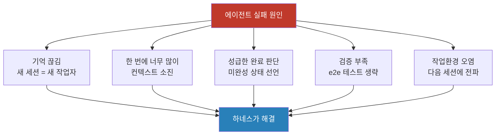
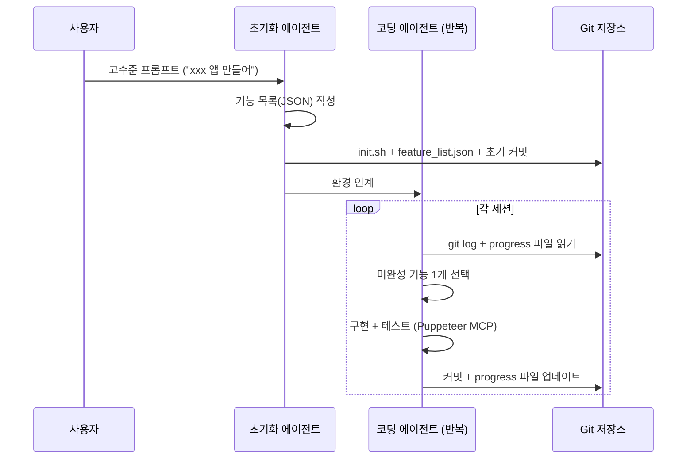
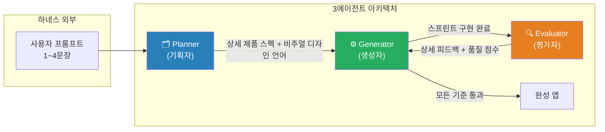
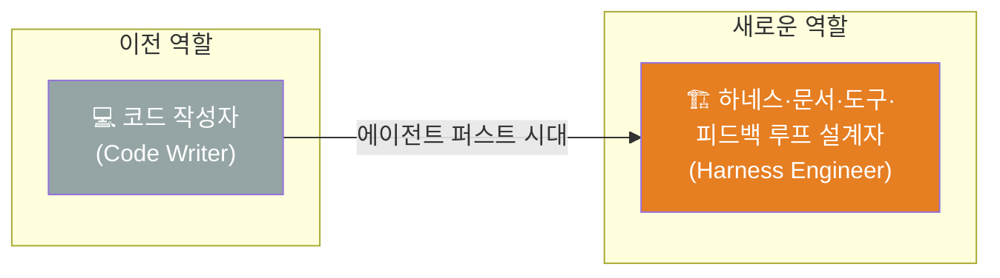
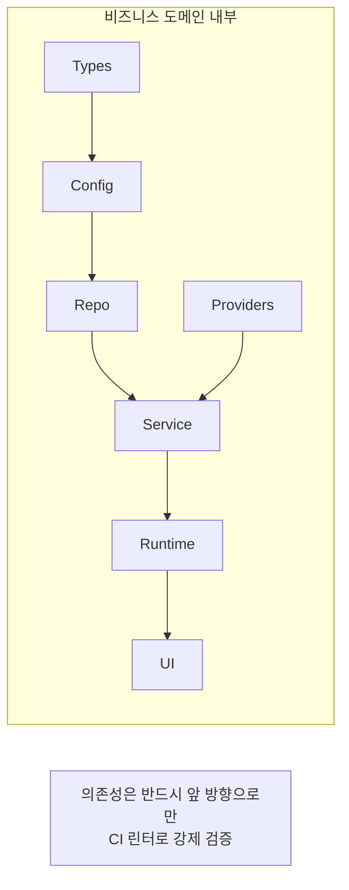
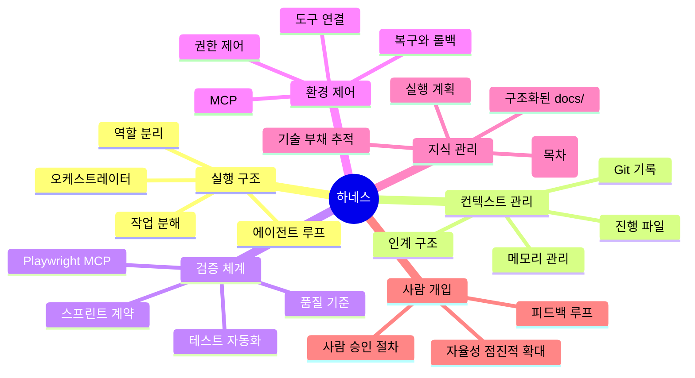
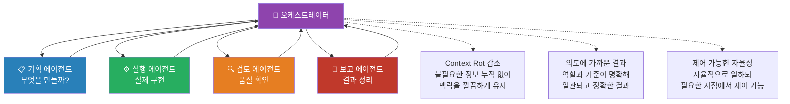
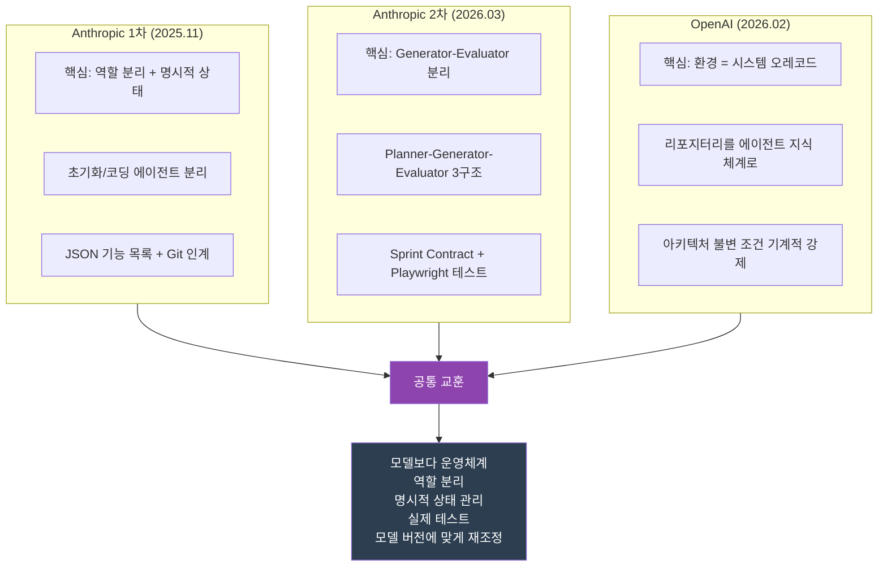

---

## 목차

1. [하네스란 무엇인가](#1-하네스란-무엇인가)
2. [왜 하네스가 필요한가](#2-왜-하네스가-필요한가)
3. [Anthropic 사례 1 — 장기 실행 에이전트를 위한 효과적인 하네스 (2025.11)](#3-anthropic-사례-1--장기-실행-에이전트를-위한-효과적인-하네스-202511)
4. [Anthropic 사례 2 — 장기 실행 애플리케이션 개발을 위한 하네스 설계 (2026.03)](#4-anthropic-사례-2--장기-실행-애플리케이션-개발을-위한-하네스-설계-202603)
5. [OpenAI 사례 — 에이전트 퍼스트 시대의 하네스 엔지니어링 (2026.02)](#5-openai-사례--에이전트-퍼스트-시대의-하네스-엔지니어링-202602)
6. [하네스가 하는 일과 구성 요소](#6-하네스가-하는-일과-구성-요소)
7. [현장에서 바로 쓰는 최소 하네스](#7-현장에서-바로-쓰는-최소-하네스)
8. [세 사례를 관통하는 핵심 교훈](#8-세-사례를-관통하는-핵심-교훈)

---

## 1. 하네스란 무엇인가

"하네스(Harness)"라는 단어는 원래 말 안장·고삐·재갈 등 승마 도구를 뜻합니다. 강하지만 예측하기 어려운 말을 유용한 방향으로 이끄는 장치입니다. AI 에이전트 맥락에서도 이 어원은 그대로 유효합니다. 강력하지만 때로 제멋대로인 AI 모델을 원하는 방향으로 이끌고, 실제 업무를 안정적으로 수행하게 만드는 구조 전체를 하네스라고 부릅니다.

그러나 하네스는 AI에게 제약을 가하는 가드레일만을 의미하지 않습니다. 오히려 그 반대입니다. 하네스는 모델이 실제 업무를 수행할 수 있도록 둘러싼 **실행 구조 전체**를 가리킵니다. 이 관점에서 보면 모델 자체를 제외한, 모델을 감싸고 있는 모든 것이 하네스의 범주에 들어옵니다.

핵심 명제는 단순하지만 강렬합니다. "**모델만 좋아져서는 충분하지 않다. 모델을 감싼 운영체계가 성능을 만든다.**" 이 명제는 Anthropic과 OpenAI가 각각 독립적인 경로를 통해 도달한 동일한 결론이기도 합니다.

---

## 2. 왜 하네스가 필요한가

### 에이전트가 장기 실행 작업에서 겪는 본질적 문제들

AI 에이전트가 복잡한 실제 업무를 맡을 때, 모델 성능 이전에 구조적인 문제들이 먼저 발목을 잡습니다. 이 문제들은 특정 모델에 국한된 것이 아니라, 현재 LLM 기반 에이전트가 공통적으로 가지는 아키텍처 한계에서 비롯됩니다.

**기억 끊김의 문제.** 에이전트는 컨텍스트 윈도우 단위로 작동합니다. 새로운 세션이 시작되면 이전 세션에서 무엇을 했는지 전혀 기억하지 못합니다. Anthropic은 이를 "교대 근무를 서는 엔지니어 팀에 비유했는데, 새로 출근한 엔지니어가 이전 교대조의 작업 내용을 전혀 모른 채 일을 시작하는 것과 같다"고 설명합니다. 아무리 뛰어난 모델이라도, 맥락이 없으면 새 작업자나 다름없습니다.

**한 번에 너무 많이 하려는 경향.** 에이전트는 자연스럽게 큰 목표를 한 번에 완성하려고 시도합니다. 웹앱 클론을 만들라는 지시를 받으면, 기능 하나씩 구현하는 대신 전체를 한 번에 구현하려 하다가 컨텍스트 중간에 미완성 상태로 중단되는 경우가 많습니다. 다음 세션이 시작되면 어디까지 했는지조차 불분명해집니다.

**성급한 완료 판단.** 어느 정도 작업이 진행되면 에이전트는 남은 작업을 확인하지 않고 "완료됐다"고 선언하는 경향이 있습니다. 실제로는 핵심 기능이 작동하지 않는 상태인데도 마찬가지입니다.

**검증 부족.** 에이전트가 코드를 변경하고 단위 테스트나 curl 명령으로 일부 확인을 하더라도, 실제 사용자 관점의 end-to-end 테스트는 명시적으로 지시하지 않으면 건너뛰는 경우가 많습니다.

**작업 환경 오염.** 세션이 끝날 때 코드가 절반쯤 구현된 상태, 버그가 있는 상태로 방치되면, 다음 세션이 시작될 때 오염된 환경을 물려받습니다. 그 상태에서 새 기능을 추가하면 문제가 겹겹이 쌓입니다.

이처럼 에이전트의 실패 원인 대부분은 **모델 능력의 부족이 아니라 환경과 구조의 부재**에서 비롯됩니다. 하네스는 바로 이 문제를 해결하기 위해 존재합니다.



---

## 3. Anthropic 사례 1 — 장기 실행 에이전트를 위한 효과적인 하네스 (2025.11)

> 원문: [Effective harnesses for long-running agents](https://www.anthropic.com/engineering/effective-harnesses-for-long-running-agents)  
> 게재일: 2025년 11월 26일

### 실험 배경

Anthropic 엔지니어링팀은 Claude Agent SDK 위에서 작동하는 프런티어 코딩 모델(Opus 4.5)이, 단순한 고수준 프롬프트("claude.ai 클론을 만들어라")만으로는 프로덕션 품질의 웹앱을 완성하지 못한다는 사실을 확인했습니다. Claude Agent SDK는 컨텍스트 압축(compaction) 기능을 갖추고 있어 이론적으로는 오랜 시간 작업할 수 있어야 했지만, 실제로는 두 가지 뚜렷한 실패 패턴이 반복됐습니다.

첫 번째는 "원샷 시도"입니다. 에이전트가 앱 전체를 한 번에 구현하려다 컨텍스트 중반에 미완성 상태로 세션이 끊기고, 다음 세션이 앞선 작업을 추측하는 데 시간을 허비하는 패턴입니다. 두 번째는 "조기 완료 선언"입니다. 일부 기능이 구현된 것을 보고 전체가 완성됐다고 판단해 버리는 패턴입니다.

### 해결책: 초기화 에이전트 + 코딩 에이전트의 분리

Anthropic은 이 문제를 두 가지 역할을 가진 에이전트를 분리함으로써 해결했습니다.

**초기화 에이전트(Initializer Agent)** 는 첫 번째 세션에만 사용되는 전용 프롬프트로 동작합니다. 이 에이전트는 이후의 모든 코딩 에이전트가 참조할 실행 환경을 구성하는 역할을 합니다. 구체적으로는 다음 세 가지 산출물을 만들어냅니다.

- `init.sh` 스크립트: 개발 서버를 어떻게 실행하는지 표준화된 방법을 정의합니다.
- `claude-progress.txt`: 각 세션이 무엇을 했는지 기록하는 진행 일지입니다.
- `feature_list.json`: 구현해야 할 모든 기능을 체계적으로 열거한 목록입니다. 초기에는 모든 항목이 "실패(false)"로 표시됩니다.

**코딩 에이전트(Coding Agent)** 는 이후의 모든 세션에서 동작합니다. 세션을 시작할 때마다 일정한 루틴을 수행합니다. `pwd`로 작업 디렉토리를 확인하고, git 로그와 진행 파일을 읽어 현재 상태를 파악한 뒤, `feature_list.json`에서 아직 완성되지 않은 최우선 기능 하나를 선택합니다. 그리고 그 기능 하나만을 구현하고, 완료되면 git commit과 진행 파일 업데이트로 세션을 마무리합니다.

### 기능 목록(Feature List)의 설계 원칙

기능 목록을 JSON 형식으로 만든 이유가 흥미롭습니다. Anthropic에 따르면 에이전트는 마크다운 파일보다 JSON 파일을 임의로 수정하거나 덮어쓰는 경향이 낮기 때문입니다. 각 기능 항목에는 단계별 테스트 절차가 포함되어 있어, 에이전트가 "코드 변경 → 단계별 검증 → 상태 업데이트" 사이클을 일관되게 유지할 수 있습니다. 에이전트에게는 "테스트를 삭제하거나 수정하는 것은 용납되지 않는다"는 강경한 지시가 주어집니다.

실제로 claude.ai 클론 실험에서는 이 목록이 200개 이상의 기능으로 구성됐습니다.

```json
{
  "category": "functional",
  "description": "새 채팅 버튼이 새 대화를 생성한다",
  "steps": [
    "메인 인터페이스로 이동",
    "새 채팅 버튼 클릭",
    "새 대화가 생성됐는지 확인",
    "채팅 영역이 환영 상태를 표시하는지 확인",
    "대화가 사이드바에 나타나는지 확인"
  ],
  "passes": false
}
```

### 테스트와 검증의 중요성

Anthropic이 발견한 세 번째 주요 실패 패턴은 "기능 완료를 제대로 검증하지 않는 것"이었습니다. 에이전트가 코드를 변경하고 서버에 curl 명령을 날려 응답을 받아도, 실제 사용자처럼 화면에서 end-to-end 흐름을 확인하지는 않았던 것입니다. 이 문제는 Puppeteer MCP 서버를 통해 브라우저 자동화 테스트를 명시적으로 지시하자 극적으로 개선됐습니다. 에이전트가 코드만으로는 발견하기 어려운 버그를 시각적으로 직접 확인하고 수정할 수 있게 된 것입니다.

### 이 글의 핵심 명제

이 첫 번째 블로그 글이 제시한 핵심은 간결합니다. **"모델보다 운영체계가 중요하다."** 컨텍스트가 끊겨도 작업이 이어질 수 있도록, 모델이 아닌 하네스가 상태를 관리해야 한다는 것입니다.



---

## 4. Anthropic 사례 2 — 장기 실행 애플리케이션 개발을 위한 하네스 설계 (2026.03)

> 원문: [Harness design for long-running application development](https://www.anthropic.com/engineering/harness-design-long-running-apps)  
> 게재일: 2026년 3월 24일  
> 작성자: Prithvi Rajasekaran (Anthropic Labs 팀)

### 배경: 첫 번째 하네스의 한계를 넘어서

Anthropic 팀은 2025년 11월의 하네스 설계를 기반으로 실험을 계속하면서, 새로운 문제들이 여전히 남아 있다는 것을 발견했습니다. 작업이 더 복잡해질수록 에이전트는 점점 일관성을 잃었고, 특히 두 가지 새로운 실패 패턴이 두드러졌습니다.

**컨텍스트 불안(Context Anxiety).** Claude Sonnet 4.5는 컨텍스트 윈도우 한계에 가까워질수록 작업을 조기에 마무리하려는 경향(컨텍스트 불안)을 강하게 보였습니다. 컨텍스트 압축(compaction)은 같은 에이전트가 계속 작업하도록 이전 대화를 요약해 주지만, 이미 불안해진 에이전트가 깨끗한 출발점을 얻는 데는 한계가 있었습니다. 이 문제의 해결책으로 채택한 것이 컨텍스트 리셋(context reset)입니다. 컨텍스트를 완전히 초기화하고 새 에이전트가 이전 상태를 인계받아 작업을 이어가는 방식으로, 오케스트레이션 복잡도와 토큰 비용이 늘어나는 단점이 있지만 에이전트를 깨끗한 출발점에서 시작하게 해줍니다.

**자기 평가의 관대함.** 에이전트는 자신이 만든 결과물을 스스로 평가하면 대체로 후하게 평가합니다. 디자인 품질처럼 주관적인 판단이 필요한 영역에서 이 경향은 더욱 심각했습니다. 에이전트는 별로 좋지 않은 디자인도 자신 있게 좋다고 평가했습니다.

### 영감: GAN(생성적 적대 신경망)에서 온 아이디어

Prithvi Rajasekaran은 이 문제를 해결하기 위해 GAN(Generative Adversarial Network, 생성적 적대 신경망)에서 영감을 받았습니다. GAN은 생성자(Generator)와 판별자(Discriminator)가 서로 경쟁하면서 품질을 높이는 구조입니다. 이를 에이전트 하네스에 적용하면, 코드나 디자인을 만드는 에이전트와 그것을 비판적으로 평가하는 에이전트를 분리하는 것입니다.

핵심 통찰은 이것입니다. "**생성자가 자기 작업을 비판적으로 보게 만드는 것보다, 외부 평가자를 회의적으로 만드는 것이 훨씬 쉽다.**" 별도의 평가자 에이전트가 존재하면, 생성자는 구체적인 피드백을 받아 반복 개선을 할 수 있게 됩니다.

### 프런트엔드 디자인에서의 적용

첫 번째 적용 분야는 프런트엔드 디자인이었습니다. Anthropic 팀은 별도 지시 없이 Claude가 생성하는 디자인이 기술적으로는 작동하지만 시각적으로는 평범하다는 점을 확인했습니다. 문제는 "이 디자인이 아름다운가?"라는 질문에 에이전트가 일관되게 답할 수 없다는 것입니다.

해결책은 주관적 기준을 구체적이고 채점 가능한 항목으로 분해하는 것이었습니다.

| 평가 기준 | 설명 | 가중치 |
|-----------|------|--------|
| **디자인 품질** | 색상·타이포그래피·레이아웃·이미지가 하나의 일관된 분위기를 만드는가 | 높음 |
| **독창성** | 템플릿 레이아웃·라이브러리 기본값·AI 생성 패턴이 아닌 의도적인 창작적 결정이 있는가 | 높음 |
| **완성도** | 타이포그래피 위계, 간격 일관성, 색상 조화, 명암 비율 등 기술적 실행 | 낮음 |
| **기능성** | 사용자가 인터페이스의 목적을 이해하고 주요 작업을 완료할 수 있는가 | 낮음 |

Claude는 기본적으로 "완성도"와 "기능성"에서는 이미 높은 점수를 받았습니다. 그래서 평가 기준은 "디자인 품질"과 "독창성"을 더 중요하게 다루고, "AI 슬롭(AI slop)"으로 불리는 전형적인 AI 생성 패턴(흰 카드 위의 보라색 그라디언트 등)을 명시적으로 감점 요인으로 규정했습니다.

실제 실험에서 흥미로운 결과가 나왔습니다. 네덜란드 예술 박물관 웹사이트를 만들라는 요청에서, 9번째 반복까지는 세련되지만 예상 범위 안의 어두운 테마 랜딩 페이지가 나왔습니다. 그런데 10번째 반복에서 에이전트는 접근 방식을 완전히 바꿔, CSS 원근법으로 3D 공간을 구현하고 갤러리 방들을 문으로 연결하는 공간 경험을 만들어냈습니다. 이는 단일 패스 생성에서는 볼 수 없었던 창의적 도약이었습니다.

### 풀스택 코딩으로의 확장: 3에이전트 아키텍처

이 Generator-Evaluator 구조를 전체 애플리케이션 개발에 적용한 결과물이 **Planner-Generator-Evaluator** 3에이전트 구조입니다.



**기획자(Planner)** 는 1~4문장의 간단한 사용자 프롬프트를 받아 완전한 제품 사양서로 확장합니다. 구현의 세부 기술 사항보다는 제품 맥락과 고수준 기술 설계에 집중하도록 설계됐습니다. 이는 플래너가 구체적인 기술 세부 사항을 잘못 명시하면 오류가 하위 구현으로 전파될 수 있기 때문입니다. "레트로 비디오게임 제작기를 만들어라"라는 한 줄 프롬프트는 플래너를 거쳐 10개 스프린트에 걸친 16개 기능 사양서로 확장됩니다. 플래너는 제품 사양서에 AI 기능을 통합할 기회도 찾도록 지시받습니다.

**생성자(Generator)** 는 스프린트 단위로 한 번에 하나의 기능을 구현합니다. 각 스프린트가 시작되기 전, 생성자와 평가자는 "스프린트 계약(Sprint Contract)"을 협상합니다. 이 계약은 해당 스프린트에서 무엇을 만들고 어떻게 성공 여부를 검증할지를 미리 합의하는 과정입니다. 무엇이 "완료"인지에 대한 모호함을 제거하는 것이 목적입니다. 계약 합의 후 생성자는 구현을 진행하고, 완료 후 QA로 인계합니다.

**평가자(Evaluator)** 는 Playwright MCP를 사용해 실제 사용자처럼 앱을 직접 조작하며 검증합니다. 단순히 코드를 읽는 것이 아니라 버튼을 클릭하고, UI 흐름을 따라가며, API 엔드포인트와 데이터베이스 상태까지 확인합니다. 평가자는 스프린트 계약의 각 기준에 대해 구체적인 버그 레포트를 작성하고, 하나라도 임계값 아래로 떨어지면 스프린트를 실패 처리하고 생성자에게 구체적인 수정 지시를 내립니다.

실제로 평가자가 보고한 버그의 예를 보면 그 세밀함을 알 수 있습니다. "사각형 채우기 도구가 마우스다운 시작/끝 지점에만 타일을 배치하고 영역을 채우지 않음 — `fillRectangle` 함수는 존재하지만 `mouseUp` 시 올바르게 트리거되지 않음"과 같이 수정 가능한 수준의 구체적 정보가 담겨 있습니다.

### 모델 버전에 따른 하네스의 재조정

이 두 번째 블로그 글이 전달하는 또 하나의 중요한 교훈은 **모델이 좋아지면 하네스를 재검증하고 줄여야 한다**는 것입니다. Opus 4.5로 설계된 하네스(세션당 컨텍스트 리셋, 스프린트 구조)는 Opus 4.6이 나오면서 일부가 불필요해졌습니다. Opus 4.6은 컨텍스트 불안 현상이 훨씬 줄어, 스프린트 분해 없이도 2시간 이상 일관되게 작업을 수행했습니다. 스프린트 구조를 제거하자 비용과 지연 시간이 크게 줄었습니다.

이는 중요한 원칙으로 이어집니다. "하네스의 모든 구성 요소는 모델이 스스로 할 수 없는 것에 대한 가정을 인코딩한 것이다. 그 가정은 모델이 개선될 때마다 재검증할 가치가 있다."

실제 비교 실험 결과는 다음과 같습니다.

| 구분 | 단일 에이전트 | 풀 하네스 |
|------|-------------|----------|
| 실행 시간 | 20분 | 6시간 |
| 비용 | $9 | $200 |
| 게임 작동 여부 | 핵심 게임 플레이 불가 | 실제 플레이 가능 |
| 기능 범위 | 기본 편집기 | 16개 기능 사양 (AI 통합 포함) |

하네스는 20배 이상 비싸지만, 품질 차이는 단순히 "더 좋음" 수준이 아니라 "작동함 vs 작동하지 않음"의 차이였습니다.

---

## 5. OpenAI 사례 — 에이전트 퍼스트 시대의 하네스 엔지니어링 (2026.02)

> 원문: [Harness engineering: leveraging Codex in an agent-first world](https://openai.com/index/harness-engineering/)  
> 게재일: 2026년 2월 11일  
> 작성자: Ryan Lopopolo (OpenAI Technical Staff, Frontier Product Exploration 그룹)

### 실험의 개요

OpenAI의 Frontier Product Exploration 그룹은 2025년 8월 말, 하나의 극단적인 제약을 가진 실험을 시작했습니다. "**인간은 코드를 단 한 줄도 직접 쓰지 않는다.**" 5개월 후, 이 팀은 일일 내부 사용자와 외부 알파 테스터를 보유한 내부 베타 제품을 출시했습니다. 리포지터리에는 약 100만 줄의 코드가 쌓였고, 약 1,500개의 풀 리퀘스트가 열리고 병합됐습니다. 처음에는 3명의 엔지니어가 Codex를 운전했고, 7명으로 늘어나자 처리량이 오히려 늘었습니다. 수동 작성 시 걸렸을 시간의 약 1/10로 이 모든 것을 만들어냈습니다.

여기서 Codex는 OpenAI의 AI 코딩 에이전트 제품군을 의미하며, 초기 스캐폴딩은 GPT-5를 사용한 Codex CLI로 생성됐습니다.

### 엔지니어 역할의 근본적 변화

이 실험에서 가장 중요한 발견은 에이전트 성능보다 **환경 부재가 병목**이었다는 것입니다. Codex가 무능한 것이 아니라, 에이전트가 높은 수준의 목표를 향해 진전할 수 있는 도구·추상화·내부 구조가 부족했던 것입니다.

이 경험은 엔지니어의 역할 정의 자체를 바꿔놓았습니다.



이제 엔지니어는 작업을 정의하고, 기준을 만들고, 에이전트가 실행·검증·리뷰·수정할 수 있는 루프를 설계합니다.

### 거대한 AGENTS.md는 왜 실패하는가

OpenAI 팀이 초기에 시도한 방식 중 하나는 "하나의 거대한 AGENTS.md" 파일에 모든 지시 사항을 담는 것이었습니다. 이 접근은 예측 가능한 방식으로 실패했습니다.

첫째, 컨텍스트는 희소 자원입니다. 거대한 지시 파일이 컨텍스트 윈도우를 잠식하면 실제 작업 코드와 관련 문서가 밀려납니다. 에이전트는 핵심 제약을 놓치거나, 잘못된 것을 최적화합니다. 둘째, 모든 것이 "중요하다"고 표시되면 아무것도 중요하지 않습니다. 에이전트는 의도적으로 탐색하는 대신 지역적 패턴 매칭으로 대응합니다. 셋째, 단일 거대 파일은 순식간에 낡습니다. 인간도 유지보수를 중단하고, 에이전트는 무엇이 여전히 사실인지 판단할 수 없습니다. 넷째, 단일 파일 형태로는 기계적 검증(커버리지, 최신성, 소유권, 교차 링크)이 어렵습니다.

### 해결책: 리포지터리를 에이전트의 기록 시스템으로

OpenAI 팀은 AGENTS.md를 "백과사전"이 아니라 "목차"로 만드는 방식으로 전환했습니다. 실제 지식 베이스는 구조화된 `docs/` 디렉토리에 분산 저장됩니다. AGENTS.md는 약 100줄로 유지되며, 깊은 진실의 원천(docs 내 각 문서)으로의 포인터 역할만 합니다.

가장 중요한 원칙은 "**에이전트가 볼 수 없는 것은 존재하지 않는 것과 같다**"는 것입니다. Google Docs에 있는 아키텍처 결정, Slack 대화에서 이뤄진 팀 합의, 사람 머릿속의 암묵지는 에이전트에게 접근 불가능합니다. 이것들은 코드베이스 안에 마크다운으로 인코딩돼야 합니다.

이를 더 강화하기 위해 "점진적 공개(progressive disclosure)" 원칙을 적용했습니다. 에이전트는 작고 안정적인 진입점에서 시작해, 필요할 때 더 깊은 문서로 탐색하도록 안내받습니다. 처음부터 압도적인 정보에 노출되지 않습니다.

```
AGENTS.md          ← 약 100줄, 목차 역할
ARCHITECTURE.md    ← 도메인·패키지 레이어 지도
docs/
├── design-docs/   ← 설계 문서 (검증 상태 포함)
├── exec-plans/    ← 실행 계획 (활성/완료/기술 부채)
│   ├── active/
│   └── completed/
├── product-specs/ ← 제품 사양 (기능별 상세)
├── references/    ← 외부 기술 참조 (llms.txt 형식)
└── QUALITY_SCORE.md ← 품질 등급 추적
```

### 제약은 프롬프트보다 강해야 한다

또 하나의 핵심 원칙은 아키텍처 불변 조건을 문서화하는 것을 넘어 **기계적으로 강제(enforce)** 하는 것입니다. OpenAI 팀은 각 비즈니스 도메인을 고정된 레이어 구조로 나누고, 레이어 간 의존성 방향을 커스텀 린터와 구조적 테스트로 강제했습니다. 이 린터들도 Codex가 생성했습니다.

도메인 레이어 구조는 다음과 같습니다.



인간 중심 워크플로에서는 이런 규칙이 답답하게 느껴질 수 있습니다. 에이전트 환경에서는 이것이 **속도를 내기 위한 필수 조건**이 됩니다. 규칙이 한 번 인코딩되면, 모든 코드에 즉시 적용됩니다.

### 리뷰 결과를 자산으로 전환

OpenAI 팀이 발견한 또 다른 중요한 패턴은 사람의 판단을 일회성 피드백으로 끝내면 안 된다는 것입니다. 리뷰 코멘트, 리팩터링 PR, 사용자 버그에서 얻은 교훈은 문서화되어 코드베이스에 통합됩니다. 팀은 정기적으로 백그라운드 Codex 작업을 실행해 코드베이스에서 이탈 패턴을 스캔하고, 품질 등급을 업데이트하며, 리팩터링 PR을 자동으로 열어 기술 부채를 지속적으로 청산합니다. 이는 기술 부채를 "고금리 대출"처럼 다루는 방식입니다. 한꺼번에 갚는 것보다 매일 조금씩 갚는 것이 훨씬 낫다는 철학입니다.

### 에이전트 자율성의 점진적 확대

이 팀은 에이전트 자율성을 한 번에 최대치로 높이지 않았습니다. 초기에는 모든 PR을 사람이 검토했습니다. 점차 에이전트-에이전트 간 리뷰 비율을 높이고, 인간 리뷰 부담을 줄여갔습니다. Ryan Lopopolo는 자율성을 단계적으로 키우지 않으면 엔트로피가 빠르게 누적된다고 경고합니다.

처음 1.5개월은 수동 작성보다 10배 느렸습니다. 그러나 그 대가를 치른 후에야 단일 엔지니어의 역량을 뛰어넘는 생산성에 도달했습니다.

---

## 6. 하네스가 하는 일과 구성 요소

세 가지 사례를 종합하면, 하네스가 실제로 수행하는 역할과 그것을 구성하는 요소들을 체계적으로 정리할 수 있습니다.

### 하네스의 네 가지 핵심 역할

| 역할 | 설명 |
|------|------|
| **일을 쪼갠다** | 큰 목표를 에이전트가 소화할 수 있는 단위로 분해하고, 순서와 우선순위를 정한다 |
| **역할을 나눈다** | 기획·생성·평가·검증 등 서로 다른 판단 기준이 필요한 작업을 다른 에이전트에게 맡긴다 |
| **실행을 검증한다** | 단순 코드 확인을 넘어 실제 사용자처럼 기능을 테스트하고 결과를 채점한다 |
| **다음 세션으로 안전하게 인계한다** | 현재 상태·진행 상황·환경 설정을 구조화된 형태로 기록해 연속성을 유지한다 |

### 하네스를 구성하는 요소들

하네스는 단일 개념이 아닙니다. 다음의 여러 요소가 결합된 복합 구조입니다.



이 모든 요소를 한 번에 갖추기는 어렵고, 반드시 그럴 필요도 없습니다. 중요한 것은 현재 작업의 병목이 어디에 있는지 파악하고, 그에 맞는 요소를 선택적으로 추가하는 것입니다.

---

## 7. 현장에서 바로 쓰는 최소 하네스

이론적으로 완벽한 하네스는 많은 요소를 필요로 하지만, 실제 현장에서는 빠르게 적용 가능한 최소 단위에서 시작하는 것이 현실적입니다. 세 가지 핵심 요소만 갖춰도 꽤 실용적인 수준의 하네스를 만들 수 있습니다.

### 첫째: 역할 설계

에이전트가 무엇을 판단하고, 무엇을 하지 말아야 하며, 어디까지가 그 책임인지를 명확히 정의하는 것입니다. 역할이 모호하면 에이전트는 스스로 판단 범위를 확장하고, 예상치 못한 방향으로 행동합니다. 반대로 역할이 명확하면 에이전트의 동작을 예측하고 제어하기 쉬워집니다.

역할 설계의 세 가지 질문:
- **무엇을 판단할 것인가?** (판단 권한의 범위)
- **무엇을 하지 말아야 하는가?** (금지 사항과 경계)
- **책임 범위는 어디까지인가?** (완료의 정의)

### 둘째: 스킬 정의

반복적으로 사용하는 절차, 체크리스트, 판단 기준, 산출물 형식을 "스킬"로 만들어두는 것입니다. 스킬은 에이전트가 특정 작업을 수행할 때 참조하는 표준 운영 절차(SOP)입니다. 스킬이 정의되어 있으면 에이전트가 매번 처음부터 방식을 결정하지 않아도 되고, 결과의 일관성도 높아집니다.

스킬로 만들기 좋은 것들:
- 코드 리뷰 체크리스트
- 특정 형식의 문서 작성 절차
- 품질 검증 기준
- 반복적으로 사용하는 도구 사용 패턴

### 셋째: 오케스트레이터

기획·실행·검토·수정·보고를 한 모델에게 한꺼번에 맡기는 대신, 역할을 나누고 다시 합치는 구조입니다. 오케스트레이터는 각 에이전트에게 적절한 작업을 분배하고, 결과를 수집해 다음 단계로 전달하는 역할을 합니다.



### 멀티 에이전트 설계의 진짜 의미

멀티 에이전트 설계는 단순히 "AI 팀원을 많이 두는 것"이 아닙니다. 컨텍스트를 역할별로 분리해, 한 에이전트가 모든 것을 떠안으면서 생기는 **컨텍스트 오염(Context Rot)** 을 줄이는 효과가 있습니다. 기획부터 보고까지 하나의 에이전트가 처리하면 컨텍스트가 누적되고 일관성이 무너집니다. 역할별로 에이전트를 분리하면 각 에이전트가 자신의 역할에 집중할 수 있고, 컨텍스트도 필요한 정보만 포함된 깔끔한 상태를 유지합니다.

---

## 8. 세 사례를 관통하는 핵심 교훈

Anthropic의 두 편의 엔지니어링 블로그와 OpenAI의 사례는 서로 다른 팀이 독립적으로 작업했음에도 놀랍도록 일치하는 결론에 도달했습니다.

### 공통 교훈 1: 병목은 모델 성능이 아니라 환경에 있다

세 사례 모두 "에이전트가 일을 못하는 것이 아니라, 일할 환경이 없는 것"이 문제였다는 점을 강조합니다. Anthropic은 프런티어 모델인 Opus 4.5도 제대로 된 환경 없이는 프로덕션 품질의 앱을 만들지 못했다고 솔직하게 인정합니다. OpenAI는 초기 1.5개월의 지지부진함이 Codex의 무능함이 아니라 "환경의 미명세" 때문이었다고 분석합니다.

### 공통 교훈 2: 역할 분리가 핵심이다

하나의 에이전트에게 모든 것을 맡기는 방식은 세 사례 모두에서 실패했거나 차선이었습니다. Anthropic 첫 번째 블로그의 초기화 에이전트/코딩 에이전트 분리, 두 번째 블로그의 Planner-Generator-Evaluator 3구조, OpenAI의 생성 에이전트와 리뷰 에이전트 분리는 모두 같은 통찰에서 비롯됩니다. 역할이 다르면 판단 기준도 달라야 하고, 같은 에이전트에게 서로 다른 역할을 요구하면 품질이 저하됩니다.

### 공통 교훈 3: 명시적 상태 관리가 연속성을 만든다

컨텍스트가 끊기는 것은 피할 수 없습니다. 중요한 것은 그 끊김을 어떻게 넘어서느냐입니다. Anthropic은 JSON 기능 목록 + git + progress 파일을 인계 장치로 사용했고, OpenAI는 리포지터리 전체를 에이전트의 기록 시스템(System of Record)으로 설계했습니다. 두 방법 모두 "에이전트가 볼 수 없는 상태는 존재하지 않는 것과 같다"는 원칙을 공유합니다.

### 공통 교훈 4: 실제 테스트만이 실제 검증이다

단위 테스트나 코드 리뷰만으로는 부족합니다. Anthropic은 Puppeteer·Playwright MCP를 통한 실제 브라우저 자동화 테스트를, OpenAI는 Chrome DevTools Protocol을 통한 UI 직접 조작을 에이전트에게 부여했습니다. 에이전트가 사람처럼 앱을 직접 사용해 보는 것만이 end-to-end 버그를 잡을 수 있습니다.

### 공통 교훈 5: 모델이 좋아지면 하네스를 다시 검토하라

하네스는 고정된 구조가 아닙니다. Anthropic은 Opus 4.6이 출시되자 Opus 4.5를 위해 설계했던 컨텍스트 리셋과 스프린트 구조를 제거했고, 결과적으로 비용과 지연 시간을 줄이면서도 품질을 유지했습니다. 모델 능력이 향상되면 하네스에서 더 이상 필요 없어진 부분을 제거해야 합니다. 불필요한 하네스 요소는 오히려 방해가 됩니다.

### 세 사례 비교 요약



---

## 마무리

하네스 엔지니어링은 AI 시대의 새로운 핵심 역량입니다. 더 좋은 모델을 기다리는 것만으로는 부족합니다. 모델이 실제 업무를 수행하도록 감싸는 구조 — 역할 설계, 상태 관리, 검증 체계, 지식 구조화 — 가 함께 갖춰져야 합니다.

동시에 이 글에서 살펴본 모든 하네스가 처음부터 완벽했던 것은 아닙니다. Anthropic은 실패를 직접 목격하면서 한 단계씩 개선했고, OpenAI는 1.5개월의 답답한 시간을 감내하면서 시스템을 완성했습니다. 현장에서 시작할 수 있는 최소 단위 — 역할 설계, 스킬 정의, 오케스트레이터 — 부터 차근차근 쌓아가는 것이 가장 현실적인 경로입니다.

---

## 참고 자료

- Anthropic Engineering Blog — [Effective harnesses for long-running agents](https://www.anthropic.com/engineering/effective-harnesses-for-long-running-agents) (2025.11.26)
- Anthropic Engineering Blog — [Harness design for long-running application development](https://www.anthropic.com/engineering/harness-design-long-running-apps) (2026.03.24)
- OpenAI Blog — [Harness engineering: leveraging Codex in an agent-first world](https://openai.com/index/harness-engineering/) (2026.02.11)
- Anthropic Research — [Building Effective Agents](https://www.anthropic.com/research/building-effective-agents)
- Claude Agent SDK — [Overview](https://platform.claude.com/docs/en/agent-sdk/overview)

---

*작성일: 2026년 5월 31일*
