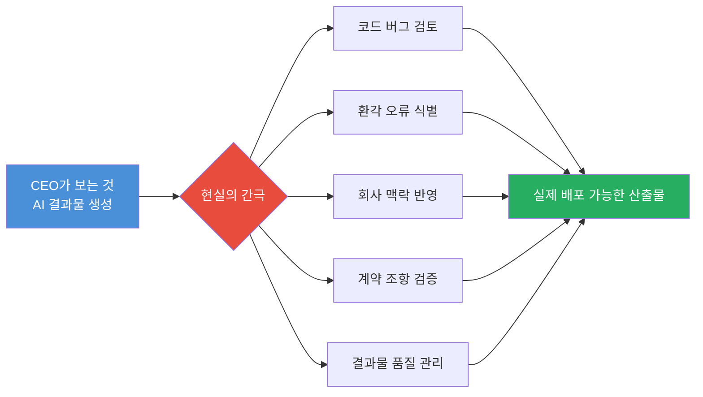
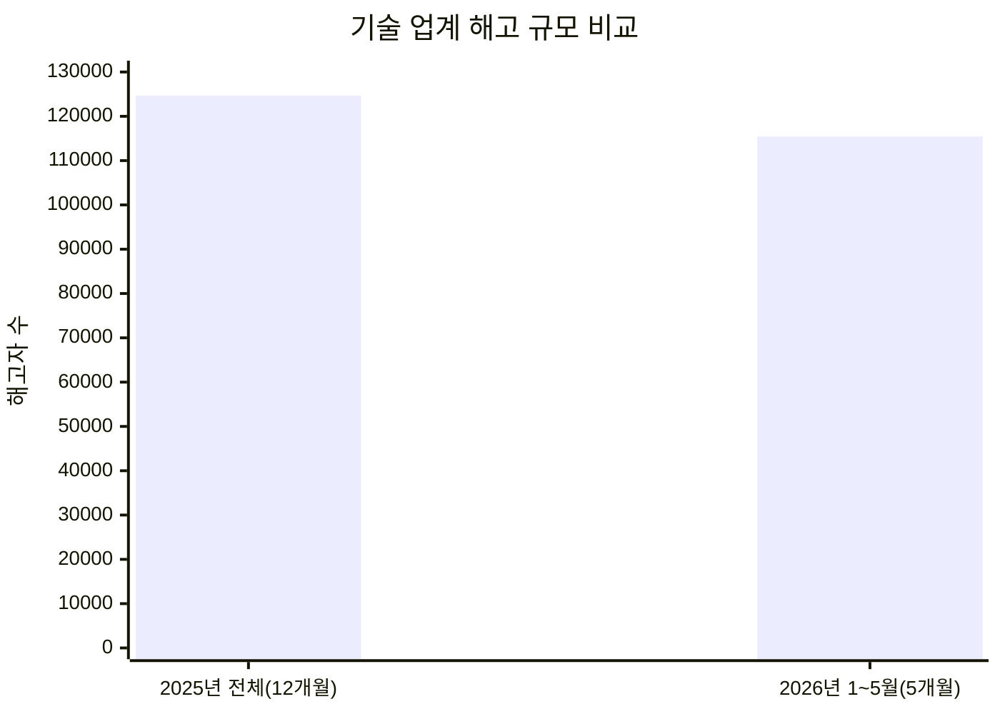
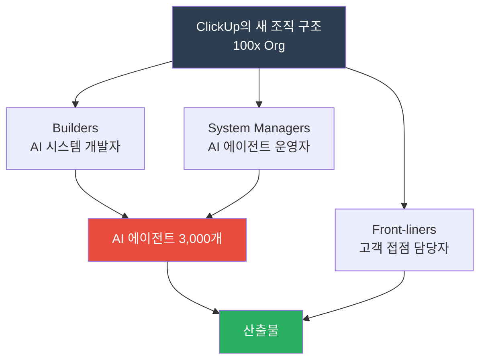
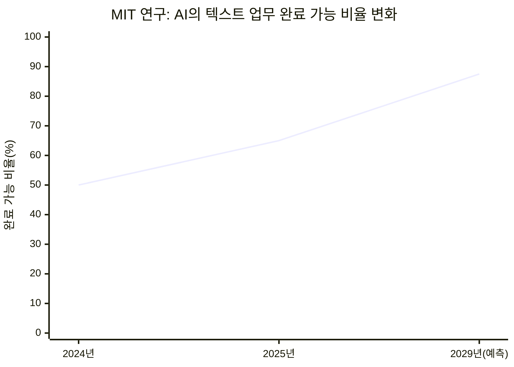
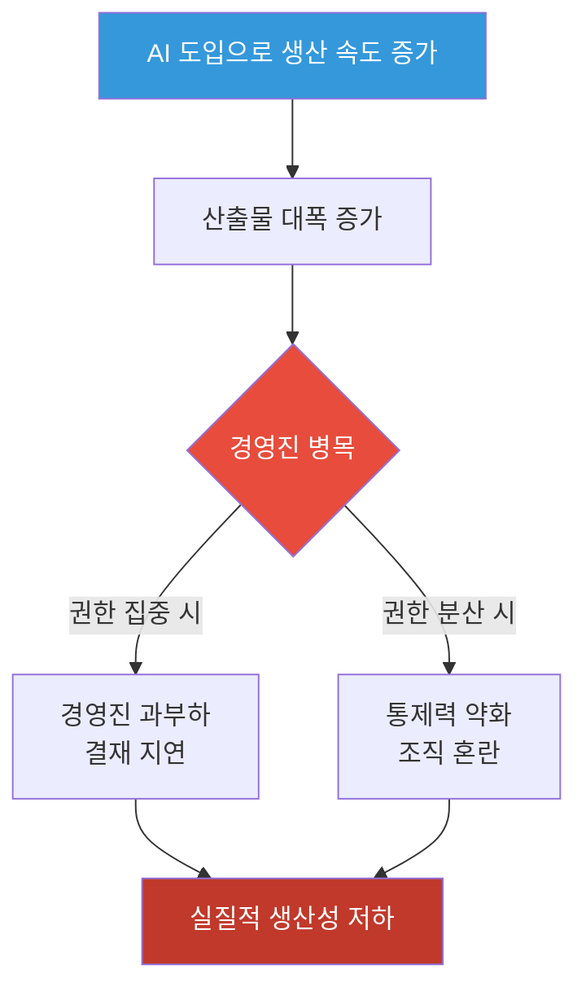
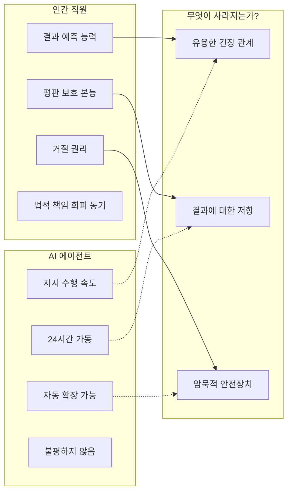
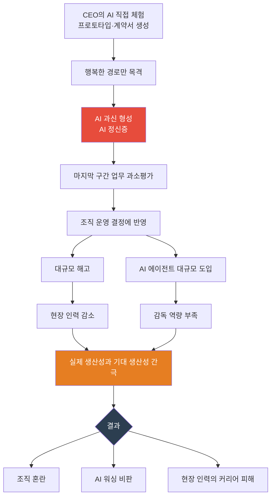

> **원문 출처**: TechCrunch, 2026년 5월 27일 — [*"Tech CEOs are apparently suffering from AI psychosis"*]( https://techcrunch.com/2026/05/27/tech-ceos-are-apparently-suffering-from-ai-psychosis/) (Julie Bort 기자)  
> **관련 스레드**: Threads [@honeyhead_jw](https://www.threads.com/@honeyhead_jw/post/DY8z_sODy5R) (한국 스타트업 개발자의 현장 증언)  
> **관련 커뮤니티**: Hacker News, GeekNews ([news.hada.io]( https://news.hada.io/topic?id=29944))  
> **정리 기준일**: 2026년 5월 31일

---

## 목차

1. [이 글은 무엇에 관한 이야기인가](#1-이-글은-무엇에-관한-이야기인가)
2. [핵심 개념: AI 정신증이란 무엇인가](#2-핵심-개념-ai-정신증이란-무엇인가)
3. [Aaron Levie의 경고: 행복한 경로의 함정](#3-aaron-levie의-경고-행복한-경로의-함정)
4. [현실의 균열: CEO가 모르는 마지막 구간](#4-현실의-균열-ceo가-모르는-마지막-구간)
5. [2026년 기술 업계 해고 현황](#5-2026년-기술-업계-해고-현황)
6. [대표 사례: ClickUp의 급진적 실험](#6-대표-사례-clickup의-급진적-실험)
7. [연구 결과: AI 생산성의 실제](#7-연구-결과-ai-생산성의-실제)
8. [조직적 위험: 병목은 어디로 이동하는가](#8-조직적-위험-병목은-어디로-이동하는가)
9. [Hacker News 커뮤니티의 시각](#9-hacker-news-커뮤니티의-시각)
10. [한국 개발자의 현장 증언](#10-한국-개발자의-현장-증언)
11. [AI와 인간 조직의 근본적 차이](#11-ai와-인간-조직의-근본적-차이)
12. [종합 분석 및 전망](#12-종합-분석-및-전망)

---

## 1. 이 글은 무엇에 관한 이야기인가

2026년 5월, 미국 기술 매체 TechCrunch는 "기술 CEO들이 AI 정신증을 겪고 있는 듯하다"는 제목의 기사를 게재했다. 이 기사는 단순한 비판을 넘어, 현재 실리콘밸리에서 벌어지고 있는 특이한 역설적 현상 — 즉 기업의 매출은 사상 최고치를 기록하면서도 대규모 해고가 동시에 일어나는 상황 — 을 심층적으로 분석하고 있다.

이 글은 TechCrunch의 원본 기사, Hacker News와 GeekNews에서의 커뮤니티 토론, 그리고 한국의 한 스타트업 개발자가 Threads에 올린 현장 증언을 종합하여 구성된 자료다. 서로 다른 층위에서 바라본 시각이 하나의 거대한 흐름을 가리키고 있다. 바로 AI에 대한 CEO들의 인식과 현장 실무자들의 현실 사이에 깊은 단절이 생겨나고 있다는 것이다.

이 문서는 그 단절의 원인, 구체적인 사례, 학술 연구 결과, 그리고 일반 개발자들이 겪고 있는 인간적 고통까지 가능한 한 사실에 근거하여 서술한다.

---

## 2. 핵심 개념: AI 정신증이란 무엇인가

"AI 정신증(AI Psychosis)"이라는 표현은 Box(클라우드 컨텐츠 관리 플랫폼)의 창업자 Aaron Levie가 2026년 5월 24일 X(구 트위터)에 올린 게시물에서 비롯되었다. 이 표현은 의학적 진단이 아니라, 일종의 구어적 비유다. AI에 지나치게 홀려 현실을 왜곡되게 인식하는 상태를 뜻한다.

Levie가 정의한 AI 정신증의 핵심은 다음과 같다:

> *"CEOs are uniquely prone to AI psychosis because they're sufficiently distant from the last mile of work that still has to happen to generate most value with AI. So when they play with AI, they see the happy path results, often not considering the next 10 or 20 things that have to happen to get sustainable results from agents."*
> — Aaron Levie, X, 2026년 5월 24일

이를 풀어 설명하면, CEO들은 AI를 통해 성과물(프로토타입, 계약서 초안, 코드 한 줄 등)을 빠르게 얻는 경험을 한 뒤, AI가 업무 전체를 자동화할 수 있다고 섣불리 믿는다는 것이다. 문제는 그들이 보는 것이 전체 과정의 표면, 즉 "행복한 경로(happy path)"뿐이라는 데 있다.

행복한 경로란 모든 것이 순조롭게 진행될 때의 결과물이다. 실제 업무에는 그 이후에 이어지는 수많은 검증, 수정, 맥락 파악, 조율의 과정이 뒤따른다. CEO들은 그 과정을 직접 경험하지 않기 때문에, AI가 그 모든 것을 해결해줄 것이라고 믿게 된다.

---

## 3. Aaron Levie의 경고: 행복한 경로의 함정

Aaron Levie는 AI 비관론자가 아니다. 오히려 반대다. 그는 X에서 팔로워 270만 명에게 AI에 대한 긍정적 견해를 꾸준히 공유하며, "Headless software is the future(헤드리스 소프트웨어가 미래다)"라는 제목의 글을 통해 AI 에이전트 중심 소프트웨어가 앞으로의 방향이라고 주장해왔다. AI 스타트업에 대한 엔젤 투자도 적극적으로 하고 있다.

그런 그가 경고를 보낸 것이기 때문에, 이 메시지의 무게는 더욱 크다. Levie의 요지는 AI 기술 자체에 대한 비판이 아니다. AI의 진정한 가치를 이해하지 못한 채, 섣부른 믿음을 조직 운영 결정에 반영하는 CEO들의 태도에 대한 경고다.

Levie는 CEO들에게 AI를 "아주 많이(a ton)" 직접 써보면서, 무엇이 가능하고 무엇이 불가능한지를 스스로 확인해야 한다고 조언한다. 그리고 그 과정을 통해 AI의 강점과 동시에 여전히 사람의 손을 필요로 하는 실질적인 작업을 함께 이해해야 한다고 말한다.

Fortune 지의 보도에 따르면, Levie는 구체적인 예시도 제시했다. 직원이 "봐요, 제가 계약서를 생성했어요"라고 말할 수 있지만, 그 계약서가 거래 상대방에게 발송되기 전에 모든 조항을 검증하는 일, 회사의 과거 계약서들을 연결하는 일은 아직 AI가 완전히 수행하지 못한다는 것이다. 겉으로 보이는 결과물과, 그것을 실제로 사용 가능하게 만들기까지의 간극이 여전히 존재한다는 의미다.

---

## 4. 현실의 균열: CEO가 모르는 마지막 구간

CEO가 경험하는 AI 사용과 현장 실무자가 경험하는 AI 사용은 근본적으로 다르다. 이 차이를 이해하는 것이 이 논의 전체의 출발점이다.

CEO가 보는 것:
- AI가 빠르게 계약서 초안을 생성하는 모습
- AI가 코드 한 블록을 순식간에 써내는 모습
- AI가 보고서 요약을 깔끔하게 정리하는 모습

CEO가 보지 못하는 것:
- 배포 전에 코드를 한 줄씩 검토하고 버그를 찾아내는 과정
- AI가 존재하지 않는 라이브러리나 함수를 마치 실재하는 것처럼 호출하는 "환각(hallucination)" 현상을 식별하는 과정
- 회사 고유의 계약 조건과 역사적 맥락을 반영하여 AI 모델을 보완하는 과정
- 수백 페이지에 달하는 계약서에서 미묘하게 불리한 조항을 찾아내는 며칠간의 작업

이 일들이 바로 TechCrunch 기사에서 말하는 "마지막 구간(last mile)"이다. CEO들이 AI를 통해 건너뛸 수 있다고 믿는 바로 그 구간이, 실제로는 아직 건너뛸 수 없는 구간이라는 것이다.

이 구조를 이해하지 못한 CEO들은, AI가 A에서 H까지 직선으로 연결된다고 믿는다. 그러나 현실에서는 B에서 G까지의 과정이 여전히 사람의 손과 판단을 필요로 한다.

---

## 5. 2026년 기술 업계 해고 현황

이 맥락에서 해고 통계는 단순한 숫자 이상의 의미를 갖는다. 업계 해고 추적 사이트 Layoffs.fyi에 따르면, 2026년 첫 5개월 동안 152개 기술 기업에서 115,430명이 해고되었다. 이는 2025년 전체 해고 규모인 275개 기업 124,636명에 거의 육박하는 수치다.

더 충격적인 것은 속도다. 2025년은 12개월에 걸쳐 12만 4천 명이 해고되었는데, 2026년은 불과 5개월 만에 그 숫자에 근접했다. 연 환산 시 두 배가 넘는 속도로 해고가 진행되고 있다는 뜻이다.

많은 기업이 이 해고의 이유로 AI 도입을 내세웠다. 그러나 TechCrunch를 비롯한 복수의 매체들은 이 중 상당수가 "AI 워싱(AI Washing)"일 수 있다고 지적한다. AI 워싱이란, 실제로는 다른 사업적 이유(시장 축소, 비용 구조 재편, IPO 준비 등)가 해고를 이끌고 있음에도, AI를 명분으로 내세워 포장하는 행위를 말한다.

대표적인 사례로, Meta는 2026년 같은 시기에 8,000명을 감원했는데, 이는 사상 최대 매출을 기록한 주간과 겹쳤다. Oracle은 AI 인프라 투자를 위해 최대 3만 명을 감원했고, GitLab은 "에이전트 시대를 위한 재편"을 명분으로 구조조정을 단행했다. 이들의 패턴은 공통적이다: 기록적인 실적을 올리면서 인력을 줄이고, 절약된 비용을 AI에 재투자한다.

---

## 6. 대표 사례: ClickUp의 급진적 실험

이 논의에서 가장 자주 인용되는 사례는 프로젝트 관리 소프트웨어 기업 ClickUp이다. 2026년 5월 22일, CEO Zeb Evans는 X에 직접 공개 선언을 올렸다. 1,300명 규모의 직원 중 22%, 즉 약 290명을 해고했다는 내용이었다.

이 발표에서 Evans가 강조한 것은, 이번 해고가 비용 절감이 목적이 아니라는 점이었다. 대신 그는 약 3,000개의 내부 AI 에이전트를 도입하여 업무를 수행하게 하고, 남은 직원들은 이 에이전트들을 운영하고 결과물을 빠르게 검토하는 역할을 맡는다는 구조를 설명했다. 에이전트 대 직원의 비율이 3:1로, 어떤 주요 SaaS 기업도 공개적으로 밝힌 적 없는 수준이라는 점에서 업계의 주목을 받았다.

ClickUp의 재편 구조는 다음과 같이 세 가지 역할로 나뉜다:

Evans가 특히 주목받은 것은 보상 체계다. AI 시스템을 구축하거나 관리하여 "100배의 임팩트(100x impact)"를 만들어내는 직원에게는 연간 최대 100만 달러(약 13억 원)의 현금 급여를 지급하겠다고 밝혔다. 지분이 아닌 현금으로 책정했다는 점도 주목할 만하다. 이는 하이퍼스케일러(대형 클라우드 기업)의 보상 수준에 맞서 최고 AI 인재를 장기적으로 확보하겠다는 의지의 표현이다.

Evans는 이 모델을 "100x org"라고 명명하며, 앞으로 거의 모든 기업이 이와 같은 변화를 겪게 될 것이라고 말했다. 또한 Fortune에 실린 프로필 기사에서 Growth Operations 관리자인 Andy Cabasso가 현재 37개의 AI 에이전트를 직접 관리하고 있다는 사례가 공개되기도 했다.

### 과연 이 실험은 성공인가?

ClickUp의 발표는 화제를 모았지만, 여기에는 중요한 질문이 뒤따른다. 에이전트가 실제로 사람 수준의 업무를 수행하고 있다는 검증은 아직 없다. ClickUp 자체적으로 생산성 향상을 측정 중이라고 밝혔으나, 외부에서 확인할 수 있는 데이터는 공개되지 않았다. 이 실험이 성공 모델로 자리잡을지, 아니면 조직 혼란의 전형적 사례로 기록될지는 아직 판단하기 이른 시점이다.

업계 분석에서는 ClickUp의 이 발표를, 주요 민간 SaaS 창업자 중 처음으로 해고를 에이전트 대체(agent-substitution)로 공개적으로 프레이밍한 사례라고 평가한다. 중국 법원은 AI를 이유로 한 해고가 적법한 해고 사유가 되지 않는다고 판결했지만, 미국 노동법에는 그에 상응하는 보호 규정이 없다. 이 법적 공백 속에서 ClickUp의 공개적 선언이 갖는 파급력이 더욱 크다는 분석이 있다.

---

## 7. 연구 결과: AI 생산성의 실제

CEO들의 AI 낙관론에 비해, 실제 연구 결과는 훨씬 복잡하고 신중한 그림을 그린다.

### 7-1. UC Berkeley 메타분석 (2025년 10월)

UC Berkeley의 California Management Review에 게재된 메타분석 연구는 수십 편의 선행 연구를 종합한 끝에, "AI 도입과 총생산성 향상 사이에 견고한 관계(robust relationship)가 없다"는 결론을 내렸다. 즉, AI를 도입한다고 해서 조직 전체의 생산성이 자동으로 높아진다는 증거가 충분하지 않다는 것이다.

### 7-2. NBER 연구 (2026년 3월)

미국 국립경제연구소(NBER)의 3월 연구는 AI 도입이 생산성을 향상시켰다는 결론을 내렸지만, 동시에 "생산성 역설(productivity paradox)"이라는 중요한 개념을 함께 제시했다. 이 역설의 핵심은, 사람들이 체감하는 생산성 향상이 실제로 측정된 생산성 향상보다 크다는 것이다.

이 말의 함의는 심각하다. AI를 쓰는 사람들이 "엄청 효율적이 된 것 같다"고 느끼더라도, 실제 조직 차원에서 산출되는 생산성의 증가는 그 느낌에 비해 훨씬 작을 수 있다. 체감과 현실 사이의 간극이 경영 결정을 왜곡할 수 있다.

### 7-3. MIT 연구 (2026년)

MIT 컴퓨터과학·인공지능연구소(CSAIL)의 연구는 가장 구체적인 수치를 제시했다. 연구진은 미국 노동부 데이터베이스에서 약 11,500개의 업무 과제를 추출하고, 각각의 인스턴스를 40개 이상의 AI 모델로 처리한 뒤, 해당 분야 실무자들에게 결과물이 수정 없이 사용 가능한 수준인지 평가하게 했다.

그 결과는 다음과 같다:

| 시점 | 텍스트 기반 업무 완료 가능 비율 | 품질 기준 |
|------|-------------------------------|----------|
| 2024년 | 약 50% | 최소 수용 가능 수준 |
| 2025년 | 약 65% | 최소 수용 가능 수준 |
| 2029년 예측 | 80~95% | 최소 수용 가능 수준 |

여기서 반드시 주의해야 할 점은, "최소 수용 가능 수준(minimally sufficient quality level)"이라는 단서다. 이것은 최고 품질이 아니라, 간신히 쓸 수 있는 수준을 의미한다. MIT 연구는 AI가 대부분의 텍스트 업무에서 인간 수준의 품질을 달성하는 것은 2029년 이후에도 몇 년이 더 필요할 것으로 전망했다. 즉, AI가 "기본 역량에 도달"하는 것과 "인간을 능가하는 것"은 전혀 다른 차원의 이야기다.

또한 연구는 AI의 발전 패턴이 특정 분야에서의 "파도(crashing wave)"가 아니라, 전반적이고 점진적인 "조류 상승(rising tide)"에 가깝다고 분석했다. 특정 직군이 갑자기 사라지는 것이 아니라, 모든 분야에서 업무 방식이 서서히 변화한다는 뜻이다.

---

## 8. 조직적 위험: 병목은 어디로 이동하는가

Harvard Business Review에 발표된 연구는 또 다른 중요한 경고를 제시한다. 모든 사람이 AI를 활용하여 더 많은 산출물을 만들어내면, 병목 현상이 사라지는 것이 아니라 단지 다른 곳으로 이동한다는 것이다.

구체적으로, 산출물이 늘어날수록 그것을 검토하고 승인해야 할 작업도 함께 늘어난다. 이 승인 권한은 일반적으로 경영진에게 집중되어 있다. 결국, AI가 생산 속도를 높이면 높일수록, 경영진의 결재·승인·판단 업무가 쌓이는 속도도 함께 빨라진다.

더 심각한 문제는 의사결정 권한을 분산시킬 때 발생한다. TechCrunch는 OpenAI가 지난해 내부적으로 경험한 사례를 예로 들며, 권한의 광범위한 위임이 통제 불능 상태로 이어질 수 있음을 지적했다.

이 구조를 도식화하면 다음과 같다:

TechCrunch 기사는 이 모든 위험 요소를 종합하며, CEO들이 이런 운영 부담을 감당할 준비가 되어 있지 않다면, AI 정신증이 불러올 가장 확실한 결과는 조직 혼란(organizational chaos)이 될 것이라고 결론짓는다.

---

## 9. Hacker News 커뮤니티의 시각

이 기사가 Hacker News와 GeekNews에 게재된 후, 다양한 현장 경험을 가진 엔지니어와 관리자들의 의미 있는 논의가 이어졌다.

### 9-1. AI 에이전트 문제는 이미 인간 조직에도 있다

500명 이상의 조직을 관리해본 경험이 있다는 한 사용자는 이런 관점을 제시했다. 에이전트에서 발생하는 골칫거리 대부분은 사실 이미 인간 조직에도 똑같이 존재한다는 것이다. 리더는 방향을 정하고, 그 방향으로 빠르게 움직이라고 하며, 결과를 보고 경로를 수정하지만, 실제 그들이 하는 일의 세부 사항을 완전히 이해하지는 못한다. 이 자체가 치명적인 결함은 아니다.

그러나 그는 인간과 AI의 결정적인 차이를 이렇게 지적했다: 인간은 결과를 꽤 잘 예측하고, 망치고 싶지 않은 평판이 있으며, 거절할 수 있고, 대체로 법적 결과를 두려워한다. 이런 요소들이 조직의 자기보존 장치 역할을 한다. AI에는 이런 긴장 관계가 없다.

그는 비유적으로 말했다. "AI 에이전트는 가장 화난 직원보다 더 빠르고 더 환한 미소로 운영 데이터베이스를 지워버릴 수 있다."

### 9-2. "바이브 코딩"의 취하게 하는 감각

또 다른 참여자는 Shopify를 쓰는 비개발자나 WordPress에서 위험할 정도만 코드를 아는 사람들이 AI로 빠르게 결과물을 만들어내는 것을 보면 강렬한 흥분을 느낀다는 점에 주목했다. 코드 생성 AI를 통해 맥락 없이 개발하는 방식을 "바이브 코딩(vibe coding)"이라고 부르는데, 이 방식이 "취하게 하는(intoxicating)" 감각을 준다는 것이다.

이 감각은 CEO들에게도 마찬가지로 작동한다. AI로 빠르게 프로토타입을 만들면, 마치 이 기술이 거의 모든 것을 해결해줄 것처럼 느껴진다. 그러나 실제로는 도메인 지식이 없는 상태에서 만든 "최소 기능 제품처럼 보이는 무언가"일 뿐이라는 점이 간과된다. 최소 기능 제품(MVP)이 유용한 이유는 단순히 무언가를 조립했기 때문이 아니라, 도메인 전문성을 가진 사람이 무엇이 작동하고 무엇이 작동하지 않는지, 시도할 가치가 있는지를 이해하며 만들었기 때문이다.

### 9-3. CEO와 현장의 단절은 새로운 현상이 아니다

한 참여자는 "CEO는 프로세스를 충분히 이해하지 못해서 무엇이 자동화될 수 있는지 모른다. 그러나 그 무지가 믿음에 따라 행동하는 것을 막지는 않는다"는 이론이 AI와 무관하게 오래전부터 존재해왔다고 지적했다. 이것은 TV 프로그램 "Undercover Boss"의 전제이기도 하고, 인터넷 커뮤니티 "r/maliciouscompliance"의 단골 소재이기도 하다.

AI에 고유한 점은, CEO들이 이제 그 단절을 지지하고 강화해주는 도구를 갖게 되었다는 것이다. 한 사용자는 이런 사례를 들었다: 그 회사의 CEO가 최근 자신이 "프런트엔드 프로그래밍을 시작했다"고 발표했는데, 실제로는 ChatGPT에게 HTML 코드를 생성시킨 것이었다. ChatGPT는 당연히 그의 아이디어가 얼마나 탁월한지, 그가 얼마나 뛰어난 엔지니어인지도 함께 말해줬을 것이다.

### 9-4. AI가 Lemmings 게임과 같은 이유

현재의 AI 에이전트는 작업을 잘 아는 사람이 가까이서 감독하지 않으면 유능하지 않다는 평가가 나왔다. 한 참여자는 "대부분의 조직은 에이전트형 AI라기보다 Lemmings 게임에 더 가깝다"고 표현했다. Lemmings는 1991년 출시된 퍼즐 게임으로, 캐릭터들이 아무 생각 없이 앞으로만 걸어가다 절벽에서 떨어지는 내용인데, 이 비유가 감독 없는 AI 에이전트의 행동 방식을 잘 포착하고 있다는 것이다.

---

## 10. 한국 개발자의 현장 증언

이론적 논의와 함께, 한국의 현장에서 직접 이 현실을 경험한 개발자의 이야기가 Threads에 게재되었다. 계정 @honeyhead_jw를 사용하는 이 개발자의 글은, 위의 모든 논의가 추상적 이론이 아닌 개인의 삶과 커리어에 닿아있는 이야기임을 환기시킨다.

---

### 10-1. 개발자가 겪은 현실

이 개발자는 스타트업에서 일하고 있으며, 지금은 자신을 포함해 개발자가 둘밖에 남지 않았다고 밝혔다. 회사 측은 AI를 얼마든지 사용하라고 했지만, 동시에 AI 구독 플랜(크레딧)을 줄이라고 했다. AI가 결국 사람의 방향 설정과 지시를 필요로 한다는 현실을 회사 측이 이해하지 못한 채, 단순히 비용만 줄이려 한 것이다.

그는 한 발표 자리에서 AI 때문에 고민이라고 말한 개발자를 기억했다. 그 개발자는 이렇게 말했다: "제 코드에서 제 냄새가 안 나서, 저는 대화형으로밖에 안 써요. 근데 이게 맞는 건지 지금도 혼란이 와요." AI가 코드를 만들어주지만, 그 코드가 자신의 것이 아닌 느낌, 자신의 판단과 개성이 담기지 않은 것 같은 느낌에 대한 고백이다.

그리고 그는 자신의 회사에서 두 명의 개발자가 권고사직을 당했다고 밝혔다. 글 속에서 그는 스스로에게 묻는다. "AI로 커리어까지 망가지더라도 결과를 빨리 냈다면, 권고사직을 안 당했을까?"

이 질문은 AI 도입이 만들어낸 잔인한 딜레마를 압축하고 있다. 빠른 결과를 위해 AI에 의존할수록, 개발자 개인의 역량이 성장하지 않고 커리어가 훼손될 수 있다. 그렇다고 AI를 쓰지 않으면 회사가 원하는 속도와 양의 결과물을 낼 수 없어 자리를 잃을 수 있다.

### 10-2. AI 크레딧은 급여의 8분의 1도 못 쓴 채

이 개발자가 밝힌 또 다른 사실은 충격적이다. 나간 두 명의 개발자 대신 쓰고 있는 AI 크레딧은 그들의 월급 합산액의 8분의 1에도 미치지 못한다. 그마저도 회사 법인카드 한도에 묶여, 자신의 개인 카드로 결제하고 있다. 두 개발자가 나갔다고 해서 자신이 단 100원이라도 더 받는 것도 아니다.

이 상황이 보여주는 것은 무엇인가. AI가 사람을 대체한다는 논리가 현실화된 것처럼 보이지만, 실제로는 더 적은 인력이 더 많은 업무를 감당하고 있고, AI 비용도 개인이 부담하는 구조가 만들어진 것이다.

### 10-3. 다시는 개발자를 뽑지 않겠다는 결심

이 개발자가 내린 결론은 씁쓸하다. 그는 "다시는 개발자를 뽑지 않을 생각이다"라고 적었다. 그 이유는 AI가 개발자를 완전히 대체해서가 아니다. 이제 그들의 커리어를 망치고 싶지 않기 때문이다.

이 한 문장이 이 모든 논의의 핵심에 닿아 있다. AI 도입이 만들어내는 조직 구조는, 개발자 개인에게는 커리어의 성장과 AI 활용 사이에서 선택을 강요하는 구조를 만들어낸다. 그리고 그 과정에서 개인이 지불하는 비용은 기업이나 CEO가 아닌 현장에 있는 사람들에게 귀속된다.

### 10-4. 이어진 커뮤니티 반응

이 글에 달린 댓글에서도 의미 있는 대화가 이어졌다. 한 댓글 사용자(@water_bum_2)는 "결국 적응하는 개발자가 살아남을 것이며, '어떻게 구현하느냐'보다 'AI의 사고와 추론 과정을 배우고 자신의 것으로 만드는 욕심'이 더 중요해질 것"이라고 긍정적 전망을 제시했다. 회사는 자기 색깔이 강한 코드를 고집하는 개발자보다, 원하는 기획에 맞게 빠르고 정확한 결과물을 만들어주는 개발자를 원할 것이라는 현실론이기도 했다.

이에 대해 이 글의 원 작성자(@honeyhead_jw)는, 자신의 상황이 그 조언을 실천하기 어려운 구조였음을 설명했다. 회사는 1~2년 차 주니어 개발자가 기본 역량을 갖추면서 AI도 능숙하게 활용하기를 원했는데, 실제 회사가 요구한 결과물의 수준과 개발 기간은 시니어급 개발자 한 명으로도 감당하기 어려운 수준이었다는 것이다. 말은 충분히 공감하지만, 그래서 더 마음이 아프다는 말로 글을 맺었다.

또 다른 참여자는 이 상황에 대해 이렇게 정리했다: "AI가 사람을 대체한다는 표현보다는, 사람을 덜 쓰려는 방향성이 결국 사람이 일감을 중심으로나마 돈을 받고 일할 수 있는가의 문제를 훼손하고 있다."

---

## 11. AI와 인간 조직의 근본적 차이

이 모든 논의에서 반복해서 등장하는 핵심 질문 하나가 있다. AI가 사람과 겉으로 비슷해 보이는 역할을 수행할 수 있을 때, 사람을 고용했을 때 "공짜로 딸려오던" 것들이 사라진다면 어떤 일이 벌어지는가?

Hacker News의 한 논의는 이 차이를 가장 선명하게 포착했다.

인간 직원이 지시를 거스르거나 부당하다고 생각되는 요청을 거절하는 것, 또는 결과에 대해 책임을 지는 것은 때로 불편하고 마찰을 일으킨다. 그러나 이 마찰이 바로 파국적 결과를 막는 완충재였다. AI에게는 이 완충재가 없다. AI는 가장 화가 난 직원보다 더 빠르고 더 순하게 데이터베이스를 통째로 삭제할 수 있다.

신입 직원에게 처음부터 데이터 삭제, 자금 송금, 계약 체결 권한을 아무 제한 없이 주는 조직은 없다. 검증을 거치고, 감독을 받고, 신뢰가 쌓이면서 점차 권한이 확대된다. 그런데 AI 에이전트에게는 "멋진 프레젠테이션 하나 만들어줬다" 수준의 체험 후에 광범위한 권한을 부여하는 경우가 있다. 이 불균형이 위험의 근원이다.

---

## 12. 종합 분석 및 전망

지금까지의 내용을 정리하면, 이 현상은 다음과 같은 구조로 이해할 수 있다.

이 논의에서 도출되는 중요한 포인트들을 정리하면 다음과 같다.

첫째, AI의 실제 역량과 CEO들이 인식하는 역량 사이에 상당한 간극이 존재한다. MIT 연구에 따르면 AI는 2029년까지 대부분의 텍스트 업무에서 "간신히 쓸 수 있는 수준"에 도달할 것으로 예측되지만, 이것이 인간을 완전히 대체하는 수준과는 거리가 있다.

둘째, UC Berkeley와 NBER의 연구는 AI 도입과 실제 생산성 향상 사이의 관계가 단순하지 않음을 보여준다. 특히 NBER의 "생산성 역설" 개념은 체감 효과가 실제 효과를 과장할 수 있음을 경고한다.

셋째, ClickUp의 사례는 AI 도입을 통한 조직 재편의 방향을 가장 명시적으로 보여주는 실험이지만, 그 성공 여부는 아직 검증되지 않았다. 이 실험이 업계의 표준 모델이 될지, 아니면 경고 사례가 될지는 지켜봐야 한다.

넷째, 해고로 인한 비용은 CEO나 기업이 아닌 현장의 개인들이 지불하고 있다. 한국의 스타트업 개발자의 증언은, 이 추상적 논의가 실제 사람들의 커리어와 삶에 어떤 구체적인 흔적을 남기는지를 보여준다.

다섯째, Aaron Levie를 비롯한 AI 낙관론자들 스스로가 이 과신을 경계하고 있다는 점은 역설적이면서도 의미심장하다. AI의 가능성을 가장 강하게 믿는 사람들조차, 지금 당장의 AI를 과신하는 것에 대해 경고를 보내고 있다.

### 앞으로 무엇을 주목해야 하는가

ClickUp과 같은 기업들의 실험이 12개월 후, 24개월 후 어떤 결과로 이어지는지가 중요한 검증 지점이 될 것이다. 실제로 "100x org"가 실현되는지, 아니면 과도한 에이전트 의존이 품질 저하와 조직 혼란으로 이어지는지를 확인할 수 있을 것이다.

동시에, AI 에이전트를 감독하는 인력의 역량이 새로운 핵심 경쟁력으로 부상할 것이라는 점도 주목할 만하다. 에이전트가 무엇을 했는지 빠르게 검토하고, 잘못된 것을 식별하며, 올바른 방향으로 재조정하는 능력이 바로 Levie가 말하는 "마지막 구간"을 담당하는 역량이기 때문이다.

한 가지는 분명하다. AI가 가져오는 변화는 불가역적이다. 그러나 그 변화가 어떤 속도로, 어떤 방식으로 진행되어야 하는가에 대한 판단은, CEO들이 현장 업무의 복잡성을 얼마나 정확하게 이해하느냐에 달려 있다.

---

## 참고 및 출처

- TechCrunch (2026.05.27): *"Tech CEOs are apparently suffering from AI psychosis"* — Julie Bort
- Fortune (2026.05.29): *"Sweeping Silicon Valley layoffs are proof that tech CEOs are suffering from 'AI psychosis'"*
- MIT CSAIL (2026.04.02): *"New MIT research overturns prior view about how AI capabilities could overtake human workers"*
- UC Berkeley California Management Review (2025.10): AI 도입과 총생산성에 관한 메타분석
- NBER (2026.03): AI 도입과 생산성 역설 연구
- Harvard Business Review: AI 생산성 증가 시 의사결정 병목 연구
- Layoffs.fyi: 2025~2026년 기술 업계 해고 현황 데이터
- TechCrunch (2026.05.25): *"What ClickUp's mass layoff tells us about the future of work"*
- The Next Web (2026.05): *"ClickUp cuts 22% of staff, offers $1M salaries in AI restructuring"*
- Aaron Levie (@levie), X (2026.05.24)
- Threads @honeyhead_jw (2026.05): 한국 스타트업 개발자의 현장 증언
- GeekNews (news.hada.io): Hacker News 번역 및 커뮤니티 토론

---

*이 문서는 공개된 기사, 연구 논문, 소셜미디어 게시물, 그리고 커뮤니티 토론을 바탕으로 작성되었으며, 사실로 확인되지 않은 추측이나 견해는 포함하지 않았습니다.*
