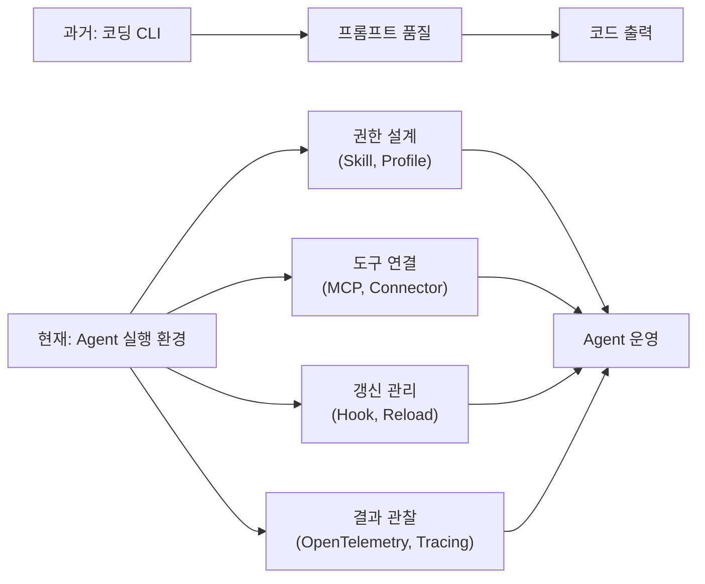
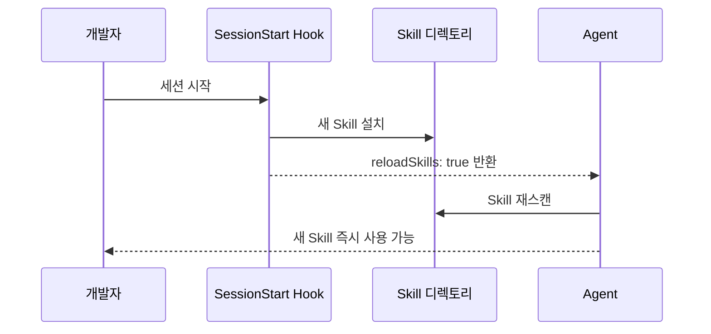
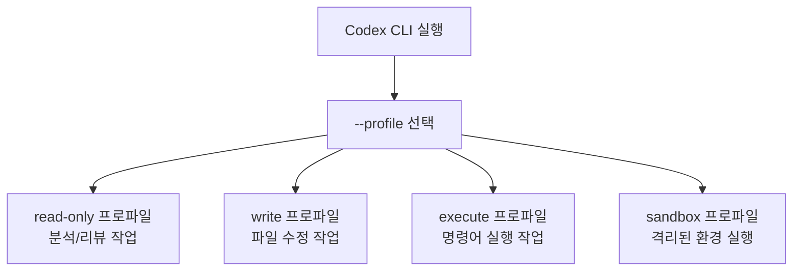
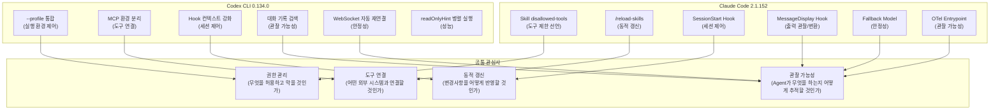
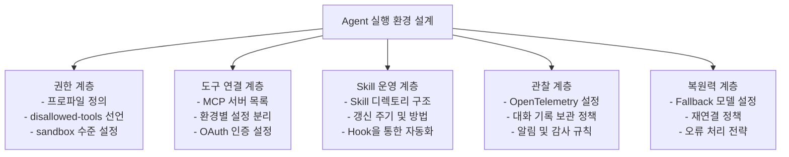

## Claude Code 2.1.152 & OpenAI Codex CLI 0.134.0 심층 분석

> **출처**
> - Threads 원문: [@sunny.openai — DY01NgGktQd](https://www.threads.com/@sunny.openai/post/DY01NgGktQd)
> - Claude Code v2.1.152 릴리스 노트: https://github.com/anthropics/claude-code/releases/tag/v2.1.152
> - OpenAI Codex CLI rust-v0.134.0 릴리스 노트: https://github.com/openai/codex/releases/tag/rust-v0.134.0
>

---

## 목차

1. [핵심 주장: 패러다임의 전환](#1-핵심-주장-패러다임의-전환)
2. [Claude Code 2.1.152 상세 분석](#2-claude-code-21152-상세-분석)
3. [OpenAI Codex CLI 0.134.0 상세 분석](#3-openai-codex-cli-01340-상세-분석)
4. [두 제품의 공통 방향성 비교](#4-두-제품의-공통-방향성-비교)
5. [개발자 관점에서 달라지는 것들](#5-개발자-관점에서-달라지는-것들)
6. [핵심 개념 용어 설명](#6-핵심-개념-용어-설명)

---

## 1. 핵심 주장: 패러다임의 전환

이 Threads 게시물은 단순한 릴리스 노트 요약이 아닙니다. 두 회사의 서로 다른 AI 코딩 도구가 **같은 방향으로 수렴하고 있다**는 관찰에서 출발합니다.

### "코딩 CLI"와 "Agent 실행 환경"의 차이

처음 등장했을 때, Claude Code나 Codex CLI 같은 도구들은 터미널에서 자연어로 명령을 내리면 코드를 작성해 주는 **편리한 CLI 도구**로 인식되었습니다. 개발자가 명령을 내리고, AI가 코드를 작성하고, 사람이 검토하는 단순한 흐름이었습니다.

그러나 최근의 업데이트들, 특히 Claude Code 2.1.152와 Codex CLI 0.134.0을 보면, 두 도구 모두 훨씬 더 복잡한 무언가로 변화하고 있습니다. 바로 **팀이 운영하는 Agent 실행 환경**입니다.

이 차이를 쉽게 설명하면 다음과 같습니다.

| 구분 | 코딩 CLI (이전) | Agent 실행 환경 (현재) |
|------|----------------|----------------------|
| 사용 주체 | 개인 개발자 | 팀, 조직 |
| 핵심 질문 | "코드를 얼마나 잘 짜는가?" | "어떤 환경에서, 어떤 권한으로 실행하는가?" |
| 제어 대상 | 모델의 출력 (프롬프트) | 도구 접근 권한, 실행 환경, 갱신 주기, 관찰 방식 |
| 확장 방식 | 더 좋은 프롬프트 작성 | Skill, Hook, Profile, MCP 설계 |
| 운영 방식 | 1회성 실행 | 세션 기반, 지속적 운영 |

이 전환은 매우 중요한 의미를 가집니다. AI 코딩 도구의 경쟁력이 이제 **모델의 코딩 실력**만으로 결정되지 않는다는 뜻이기 때문입니다. 얼마나 정교하게 실행 환경을 설계하고 운영할 수 있느냐가 새로운 경쟁 축으로 부상하고 있습니다.



---

## 2. Claude Code 2.1.152 상세 분석

2026년 5월 27일 출시된 Claude Code 2.1.152는 **Skill 운영 체계의 정교화**를 핵심으로 합니다. 이번 업데이트에서 주목할 변경사항들을 하나씩 살펴보겠습니다.

### 2.1 `/code-review --fix`와 `/simplify` 명령어의 변화

**기존 동작 방식**

기존에 `/code-review`를 실행하면, 리뷰 결과를 분석 보고서 형태로 **보여주기만** 했습니다. 개발자가 그 내용을 읽고 직접 코드를 수정해야 했습니다.

**변경된 동작 방식**

이제 `/code-review --fix`를 실행하면 리뷰 결과를 **현재 작업 중인 파일에 직접 적용**합니다. 단순히 문제점을 지적하는 것을 넘어, 코드 재사용 기회, 단순화 가능한 부분, 효율성 개선 사항을 자동으로 반영합니다.

더불어 `/simplify` 명령어는 이제 내부적으로 `/code-review --fix`를 호출하도록 변경되었습니다. 즉, "단순화해줘"라고 요청하면 리뷰와 수정이 한 번에 이루어집니다.

이 변화가 중요한 이유는 Agent의 역할이 **조언자**에서 **실행자**로 바뀌었기 때문입니다. 단순히 정보를 제공하는 것이 아니라, 작업 파일을 직접 변경하는 권한을 가지고 실행하게 됩니다.

### 2.2 Skill과 Slash Command의 `disallowed-tools` Frontmatter

**이 기능이 필요한 이유**

하나의 Claude Code 세션에는 다양한 도구들이 연결되어 있습니다. 파일 읽기, 파일 쓰기, 명령어 실행, 웹 검색 등 다양한 도구가 있는데, 특정 Skill을 실행하는 동안에는 일부 도구를 **의도적으로 비활성화**해야 할 때가 있습니다.

예를 들어, 코드 리뷰만 수행하는 Skill을 만들 때 파일 쓰기 도구까지 열어두면 리뷰 도중 예기치 않게 파일이 수정될 수 있습니다.

**사용 방법**

이제 Skill 파일이나 Slash Command 파일의 **맨 앞 설정(frontmatter)** 부분에 `disallowed-tools`를 선언할 수 있습니다.

```yaml
---
description: 코드 리뷰만 수행하는 Skill
disallowed-tools:
  - write_file
  - execute_command
---

이 Skill이 활성화된 동안에는 파일 쓰기와 명령어 실행이 비활성화됩니다.
```

이는 매우 중요한 보안 및 운영 기능입니다. Agent에게 "무엇을 해라"뿐만 아니라 "무엇은 절대 하지 마라"를 **선언적으로** 정의할 수 있게 된 것입니다.

### 2.3 `/reload-skills` 명령어와 `SessionStart` Hook의 `reloadSkills: true`

**기존의 문제**

기존에는 새로운 Skill을 설치하거나 기존 Skill을 수정했을 때, 변경사항이 반영되려면 **Claude Code 세션을 완전히 재시작**해야 했습니다. 장시간 대화가 이어지고 있는 세션에서 Skill을 업데이트하면 그 대화 내용을 잃게 되는 불편함이 있었습니다.

**변경된 방식**

이제 두 가지 방법으로 세션 재시작 없이 Skill을 다시 읽을 수 있습니다.

첫째, `/reload-skills` 명령어를 직접 입력하면 현재 세션을 유지한 채로 Skill 디렉토리를 재스캔합니다.

둘째, `SessionStart` Hook에서 `reloadSkills: true`를 반환하면 세션 시작 또는 재개 시 자동으로 최신 Skill을 읽어옵니다. 이는 특히 **Hook이 새 Skill을 설치하는 작업을 포함**할 때 매우 유용합니다. Hook이 Skill을 설치하고 즉시 그 Skill을 사용 가능하게 만들 수 있기 때문입니다.



### 2.4 `SessionStart` Hook의 세션 타이틀 설정

이제 `SessionStart` Hook이 `hookSpecificOutput.sessionTitle`을 통해 **세션의 제목을 동적으로 설정**할 수 있습니다. 세션 시작 시 또는 재개 시 모두 적용됩니다.

이는 팀 환경에서 여러 세션을 동시에 관리할 때 각 세션이 무엇을 하고 있는지 명확하게 식별할 수 있도록 돕습니다. 예를 들어, "프로젝트 A 백엔드 리팩터링 세션", "긴급 버그픽스 세션" 같은 형태로 자동으로 이름을 붙일 수 있습니다.

### 2.5 `MessageDisplay` Hook: 출력 변환 및 숨김

이번 릴리스에서 새로 추가된 `MessageDisplay` Hook은 **Assistant(Claude)의 메시지가 화면에 표시되기 직전에 개입**할 수 있습니다.

이 Hook을 통해 두 가지 작업이 가능합니다. 하나는 메시지 텍스트를 **변환(transform)** 하는 것입니다. 예를 들어, 특정 포맷으로 출력을 정규화하거나, 민감한 정보를 마스킹하는 용도로 활용할 수 있습니다. 다른 하나는 메시지 자체를 **숨기는(hide)** 것입니다. 특정 조건에서 중간 처리 결과를 사용자에게 노출하지 않고 싶을 때 사용할 수 있습니다.

이 기능은 기업 환경에서 Claude Code를 운영할 때 **출력 품질 관리**와 **정보 보안** 측면에서 매우 유용하게 활용될 수 있습니다.

### 2.6 `pluginSuggestionMarketplaces` 관리 설정

관리자(Admin)가 조직의 플러그인 마켓플레이스를 **허용 목록(allowlist)** 방식으로 관리할 수 있게 되었습니다. `pluginSuggestionMarketplaces` 설정을 통해 승인된 조직 마켓플레이스의 플러그인만 컨텍스트 기반 팁을 통해 제안될 수 있도록 제한할 수 있습니다.

이는 기업 보안 정책 관점에서 중요합니다. 검증되지 않은 외부 플러그인이 Agent에게 무분별하게 제안되는 것을 방지할 수 있기 때문입니다.

### 2.7 Fallback 모델 자동 전환

`--fallback-model`로 설정된 대체 모델이 있을 때, 기본 모델을 찾을 수 없는 상황이 발생하면 **세션 전체를 실패시키지 않고 대체 모델로 자동 전환**합니다. 이전에는 기본 모델이 응답하지 않으면 매 요청마다 오류가 발생했지만, 이제는 대체 모델로 세션을 계속 이어나갈 수 있습니다.

이는 Agent를 장시간 자율 운영할 때 **안정성을 크게 높이는** 변경사항입니다.

### 2.8 OpenTelemetry 세션 진입점 메트릭

`OTEL_METRICS_INCLUDE_ENTRYPOINT=true` 환경 변수를 설정하면, 세션의 진입점(app.entrypoint)이 OpenTelemetry 메트릭 속성으로 포함됩니다. 이를 통해 세션이 어떤 경로로 시작되었는지(CLI 직접 실행, 스크립트, 자동화 파이프라인 등)를 **관찰 가능(observable)** 하게 추적할 수 있습니다.

### 2.9 주요 버그 수정 및 UX 개선

릴리스 노트에는 기능 추가 외에도 주목할 만한 안정성 개선이 포함되어 있습니다.

- 동일한 명령어를 사용하지만 **환경 변수가 다른 플러그인 MCP 서버들이 잘못 중복 제거되던 문제**가 수정되었습니다. 환경 변수에 따라 다르게 동작해야 하는 서버들이 하나로 합쳐지는 버그였습니다.
- 세션 히스토리에 남아있는 **오래된 thinking-block 서명이 모델 또는 로그인 전환 후 세션이 멈추는 문제**를 일으키던 것이 수정되었습니다. 이제 프로액티브하게 제거되며, 안전망으로 재시도 로직도 추가되었습니다.
- `/usage` 명령어가 이제 **대용량 세션 파일도 스트리밍 방식으로 스캔**하여 메모리 사용량을 일정하게 유지합니다.
- Vim 모드에서 NORMAL 모드의 `/`가 이제 **역방향 히스토리 검색**(`Ctrl+R`과 동일)을 엽니다.

---

## 3. OpenAI Codex CLI 0.134.0 상세 분석

2026년 5월 26일 출시된 OpenAI Codex CLI 0.134.0은 **실행 환경의 정교한 정리와 표준화**를 핵심으로 합니다.

### 3.1 로컬 대화 기록 검색 기능 추가

이번 업데이트에서 가장 직관적으로 유용한 기능은 **로컬 대화 기록 검색**입니다. 과거에 Codex와 나눈 대화를 대소문자 구분 없이 내용 기반으로 검색할 수 있으며, 검색 결과에는 미리보기가 함께 표시됩니다.

이 기능이 단순한 편의기능이 아닌 이유가 있습니다. Agent를 팀 환경에서 지속적으로 운영하다 보면 과거에 어떤 결정을 내렸고, 어떤 작업을 수행했는지 추적하는 것이 중요해집니다. 대화 기록을 검색할 수 있다는 것은 **Agent의 과거 행동을 감사(audit)** 하고 **재현** 하는 것이 가능해진다는 의미입니다.

### 3.2 `--profile`의 통합 표준화

이전까지 Codex CLI는 권한 프로파일 선택 방식이 CLI, TUI(Terminal UI), sandbox 등 실행 맥락에 따라 서로 달랐습니다. 이번 업데이트에서 `--profile`이 **모든 실행 경로에서 일관된 기본 프로파일 선택자**로 통일되었습니다.

더불어 구버전(v1) 프로파일 설정 형식은 완전히 제거되었습니다. 레거시 프로파일 형식을 사용하려 할 경우 **마이그레이션 안내 메시지**와 함께 오류가 발생합니다. 에러 메시지에는 공식 문서 링크도 포함되어 있어 전환 과정을 안내합니다.

**프로파일이 중요한 이유**

프로파일은 Agent가 실행되는 환경의 권한 수준을 정의합니다. 예를 들어, 읽기 전용 프로파일, 파일 수정 허용 프로파일, 명령어 실행 허용 프로파일 등을 별도로 정의해두고 상황에 맞게 선택할 수 있습니다.



### 3.3 MCP 설정 개선: 서버별 환경 및 OAuth

MCP(Model Context Protocol)는 AI Agent가 외부 도구 및 서비스와 통신하는 표준 프로토콜입니다. 이번 업데이트에서 두 가지 중요한 개선이 이루어졌습니다.

**서버별 실행 환경 분리**: 이제 각 MCP 서버를 **별도의 명시적 환경(explicit environment)** 을 통해 실행할 수 있습니다. 이는 서버A는 프로덕션 환경 변수를, 서버B는 스테이징 환경 변수를 각각 독립적으로 사용할 수 있게 됨을 의미합니다. 이전에는 환경 변수가 서로 충돌하거나, 하나의 공유 환경에서 모든 MCP 서버가 실행되어야 하는 제약이 있었습니다.

**스트리밍 HTTP 서버의 OAuth 지원**: `codex mcp add` 명령어에 OAuth 옵션이 추가되었습니다. 이를 통해 OAuth 인증이 필요한 스트리밍 HTTP 기반 MCP 서버를 보다 쉽게 설정할 수 있습니다. 기업 환경에서 사내 서비스와 Agent를 연결할 때 보안 인증을 표준적인 방식으로 처리할 수 있게 되었습니다.

### 3.4 커넥터 도구 스키마의 안정성 개선

이 부분은 기술적으로 다소 복잡하지만, 실제 운영에서 상당히 중요한 변경입니다.

**`$ref`와 `$defs` 보존**

JSON Schema에는 복잡한 데이터 구조를 재사용하기 위한 `$ref`(참조)와 `$defs`(정의) 메커니즘이 있습니다. 이전까지 Codex CLI가 외부 커넥터의 도구 스키마를 처리할 때 이 내부 참조 구조를 때때로 깨트리는 문제가 있었습니다.

이제 로컬 `$ref`/`$defs` 구조를 **원형 그대로 보존**하여 스키마 무결성이 유지됩니다.

**대형 스키마 자동 압축**

일부 커넥터의 도구 스키마는 매우 크기 때문에 모델에 전달할 때 토큰을 과다하게 소비하거나 처리가 어려워지는 문제가 있었습니다. 이제 지나치게 큰 스키마는 **자동으로 압축(compact)** 하여 모델이 효율적으로 처리할 수 있도록 합니다.

### 3.5 읽기 전용 MCP 도구의 병렬 실행

`readOnlyHint`가 표시된 MCP 도구들은 이제 **동시에 병렬 실행**될 수 있습니다.

이 변화가 왜 중요한지 예시로 설명하겠습니다. Agent가 여러 데이터 소스에서 정보를 읽어 종합 분석을 해야 하는 경우를 생각해보겠습니다. 예를 들어, 데이터베이스에서 사용자 데이터를 읽고, 동시에 로그 서버에서 에러 로그를 읽고, 동시에 모니터링 시스템에서 성능 데이터를 읽어야 한다면, 기존에는 이 세 작업이 순차적으로 실행되어야 했습니다.

이제 이 세 읽기 작업이 **동시에** 실행될 수 있어, Agent의 정보 수집 속도가 크게 향상됩니다. 단, 이는 읽기 전용(side effect 없음)이 명시적으로 선언된 도구에만 적용됩니다. 쓰기나 수정 작업이 포함된 도구는 여전히 순차 실행됩니다.

### 3.6 확장 도구와 Hook에 풍부한 컨텍스트 제공

두 가지 컨텍스트 개선이 이루어졌습니다.

첫째, **확장 도구(Extension Tools)** 에 이제 대화 히스토리가 전달됩니다. 이는 확장 도구가 단순히 현재 요청만 보는 것이 아니라, 지금까지의 대화 흐름 전체를 파악하고 더 맥락 있는 동작을 할 수 있게 됨을 의미합니다.

둘째, **Hook 입력에 서브에이전트(Subagent) 정보**가 포함됩니다. 여러 에이전트가 협력하는 멀티 에이전트 시스템에서, Hook이 어떤 에이전트가 어떤 작업을 수행하고 있는지 파악할 수 있게 됩니다.

### 3.7 원격 연결 안정성 개선

팀 환경에서 Codex를 원격으로 운영할 때의 안정성이 크게 향상되었습니다.

- **Exec-server WebSocket 클라이언트**가 연결이 끊어졌을 때 새 세션으로 **자동 재연결**합니다.
- **Remote Control**이 인증 복구 후 즉시 재시도합니다.
- **Remote Compaction v2** 스트림도 실패 시 재시도합니다.

이는 장시간 실행되는 자율 Agent 작업에서 네트워크 불안정성으로 인한 실패를 최소화합니다.

### 3.8 Node 기반 도구의 네트워크 프록시 지원

Node.js 기반으로 만들어진 도구들이 이제 Codex의 **관리형 네트워크 프록시 환경**을 올바르게 사용합니다. 이전에는 프록시 설정이 필요한 기업 네트워크 환경에서 Node 기반 도구들이 직접 인터넷에 접속하려다 실패하는 경우가 있었습니다.

---

## 4. 두 제품의 공통 방향성 비교

표면적으로 Claude Code와 Codex CLI는 서로 다른 회사, 서로 다른 모델, 서로 다른 UI를 가진 별개의 제품입니다. 그러나 이번 릴리스를 나란히 놓고 보면, 두 제품이 **동일한 문제를 동일한 방향으로 풀고 있다**는 것이 명확해집니다.



### 4.1 권한 관리 (무엇을 허용하고 막을 것인가)

Claude Code는 Skill과 Slash Command 레벨에서 `disallowed-tools`를 선언적으로 지정하는 방식을 택했습니다. Codex CLI는 `--profile`을 통해 실행 전 권한 수준 자체를 선택하는 방식을 강화했습니다.

접근 방식은 다르지만 본질은 같습니다. **Agent가 모든 일을 할 수 있어야 한다는 전제에서 벗어나, 필요한 일만 할 수 있도록 세밀하게 제어하는 것**입니다.

### 4.2 도구 연결 (어떤 외부 시스템과 연결할 것인가)

Claude Code는 플러그인 마켓플레이스 허용 목록을 통해 관리자가 승인한 도구만 제안되도록 했습니다. Codex CLI는 MCP 서버별 환경 분리와 OAuth 지원을 통해 안전하고 정교하게 외부 서비스를 연결할 수 있게 했습니다.

Agent가 더 많은 일을 하기 위해서는 더 많은 외부 도구와 연결되어야 하며, 그 연결이 **안전하고 제어 가능해야** 한다는 공통된 방향성이 보입니다.

### 4.3 동적 갱신 (변경사항을 어떻게 반영할 것인가)

Claude Code는 세션 재시작 없이 Skill을 다시 읽는 기능(`/reload-skills`, `reloadSkills: true`)을 추가했습니다. Codex CLI는 Hook을 통해 세션 내에서 서브에이전트 정보를 동적으로 전달받을 수 있게 했습니다.

한 번 배포하면 고정된 상태로 동작하는 것이 아니라, **운영 중에도 유연하게 업데이트하고 적응할 수 있는** Agent를 만드는 것이 공통 목표입니다.

### 4.4 관찰 가능성 (Agent가 무엇을 하는지 어떻게 추적할 것인가)

Claude Code는 OpenTelemetry 세션 진입점 메트릭을 추가하고, `MessageDisplay` Hook을 통해 출력을 모니터링할 수 있게 했습니다. Codex CLI는 로컬 대화 기록 검색, WebSocket 요청 추적, 턴 시작 이벤트 추적 등을 강화했습니다.

Agent가 자율적으로 실행될수록, **그것이 무엇을 하고 있는지 인간이 파악할 수 있는 수단**이 더욱 중요해집니다.

---

## 5. 개발자 관점에서 달라지는 것들

이 모든 변화를 종합하면, 개발자에게 요구되는 역량과 질문의 틀 자체가 바뀌고 있습니다.

### 5.1 바뀌는 핵심 질문들

**기존의 질문**
> "이 AI가 코드를 잘 짜는가? 프롬프트를 어떻게 써야 더 좋은 코드가 나오는가?"

**새로운 질문들**
> 1. 이 Agent를 어떤 **프로파일(권한 수준)** 로 실행할 것인가?
> 2. 어떤 **외부 도구와 MCP 서버**에 연결할 것인가?
> 3. 어떤 **행동을 명시적으로 금지(`disallowed-tools`)** 할 것인가?
> 4. Skill이 업데이트되었을 때 **언제 어떻게 갱신**할 것인가?
> 5. Agent의 행동을 어떻게 **관찰하고 감사**할 것인가?
> 6. 오류 발생 시 어떤 **Fallback 전략**을 사용할 것인가?

### 5.2 실행 환경 설계의 중요성

두 도구 모두 Agent를 운영 가능한 개발 환경으로 만드는 방향으로 나아가고 있습니다. 이는 AI 코딩 도구의 사용자 페르소나가 **개인 개발자**에서 **팀과 조직**으로 확장되고 있다는 신호이기도 합니다.

다음은 팀이 Claude Code나 Codex CLI를 진지하게 도입할 때 설계해야 하는 실행 환경의 구성 요소들입니다.



### 5.3 "프롬프트 엔지니어링"에서 "Agent 환경 엔지니어링"으로

2023~2024년에 "프롬프트 엔지니어링"이 중요한 스킬로 부각되었다면, 2025~2026년에는 **"Agent 환경 엔지니어링"** 이 그 자리를 대체하거나 보완하는 스킬이 될 것입니다.

모델이 좋아질수록 프롬프트 하나하나의 차이는 줄어들 수 있습니다. 하지만 Agent를 팀 내에서 안전하고 효율적으로 운영하기 위한 환경 설계 능력은 모델이 발전할수록 더욱 중요해질 것입니다.

---

## 6. 핵심 개념 용어 설명

이 문서에서 반복적으로 등장하는 핵심 개념들을 정리합니다.

### Skill (Claude Code)
Agent에게 특정 작업을 수행하는 방법을 가르치는 재사용 가능한 지침 모음입니다. 마크다운 파일 형태로 작성되며, Slash Command(`/`)로 실행하거나 자동으로 활성화됩니다. Frontmatter를 통해 해당 Skill이 활성화된 동안 사용 가능한 도구를 제어할 수 있습니다.

### Hook (Claude Code & Codex CLI)
특정 이벤트(세션 시작, 메시지 표시, 서브에이전트 시작 등)가 발생했을 때 실행되는 코드 또는 설정입니다. Agent의 동작에 개입하거나, 동적으로 설정을 변경하거나, 외부 시스템에 알림을 보내는 데 활용됩니다.

### MCP (Model Context Protocol)
Anthropic이 제안하고 업계 표준으로 자리 잡고 있는, AI 모델이 외부 도구 및 서비스와 통신하는 표준 프로토콜입니다. Claude Code와 Codex CLI 모두 MCP를 통해 다양한 외부 서비스(데이터베이스, API, 파일 시스템 등)와 연결됩니다.

### Profile (Codex CLI)
Agent가 실행될 때 적용되는 권한 수준과 환경 설정의 묶음입니다. 어떤 작업을 허용하고 제한할지, sandbox를 어떤 방식으로 운영할지 등을 정의합니다.

### Connector / Extension Tool
Agent가 사용할 수 있는 외부 도구의 인터페이스입니다. JSON Schema로 도구의 입출력 형태를 정의하며, Codex CLI에서는 이 스키마의 안정성이 이번 업데이트에서 개선되었습니다.

### Frontmatter
마크다운 파일의 맨 앞에 `---`로 구분되어 작성되는 YAML 형식의 메타데이터 영역입니다. Claude Code에서는 Skill 파일의 Frontmatter에 `disallowed-tools`를 선언하여 해당 Skill이 활성화된 동안 사용 불가능한 도구를 지정할 수 있습니다.

### OpenTelemetry (OTel)
분산 시스템의 관찰 가능성을 위한 오픈 소스 표준 프레임워크입니다. 메트릭, 트레이스, 로그를 수집하고 분석하는 데 사용됩니다. Claude Code는 OTel을 통해 세션의 진입점 등 운영 데이터를 수집할 수 있게 되었습니다.

### Sandbox
Agent가 실행하는 코드나 명령어가 실제 시스템에 의도치 않은 영향을 미치지 않도록 격리된 실행 환경입니다. Codex CLI의 Profile 시스템은 sandbox 설정과도 통합되어 있습니다.

---

*이 문서는 Claude Code v2.1.152 및 OpenAI Codex CLI rust-v0.134.0 공식 릴리스 노트, 그리고 Threads의 분석 게시물(@sunny.openai)을 기반으로 작성되었습니다. 모든 기능 설명은 공식 릴리스 노트에 명시된 사항에 근거합니다.*
